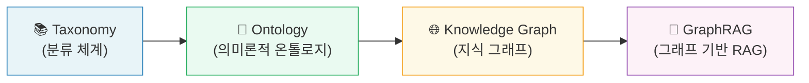
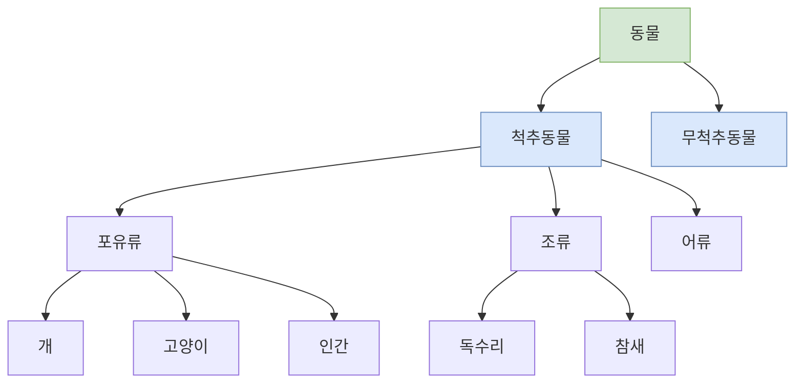
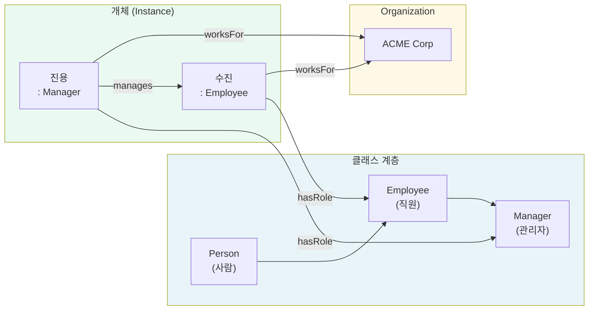
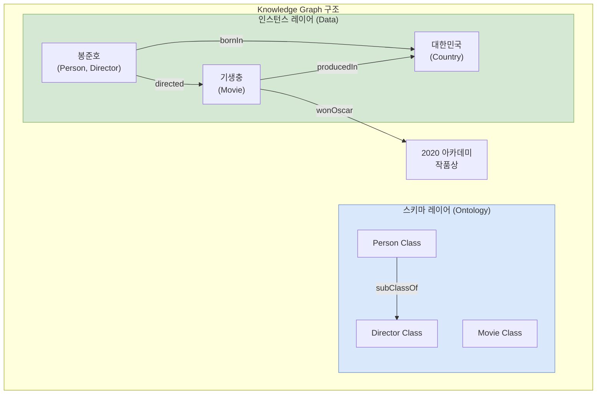
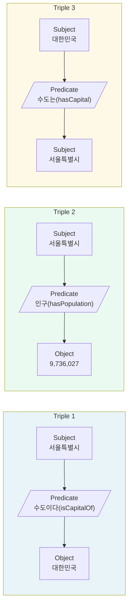
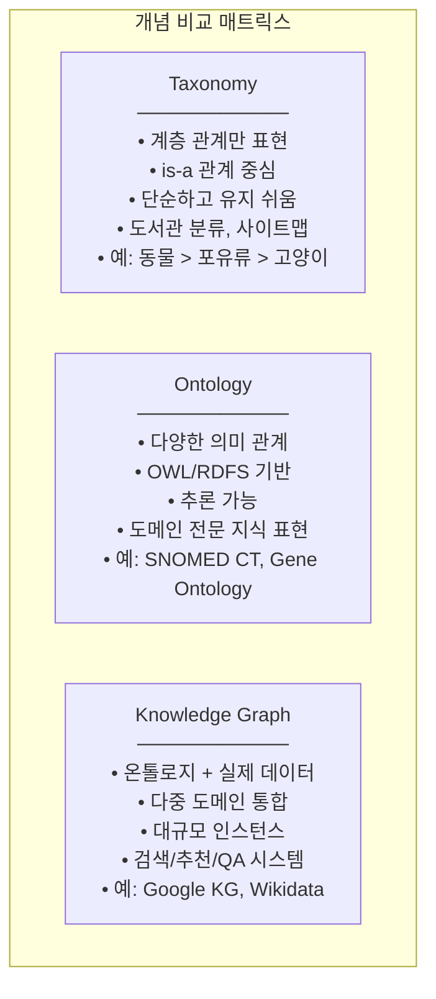
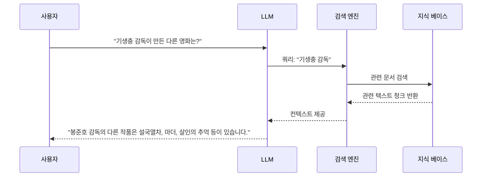
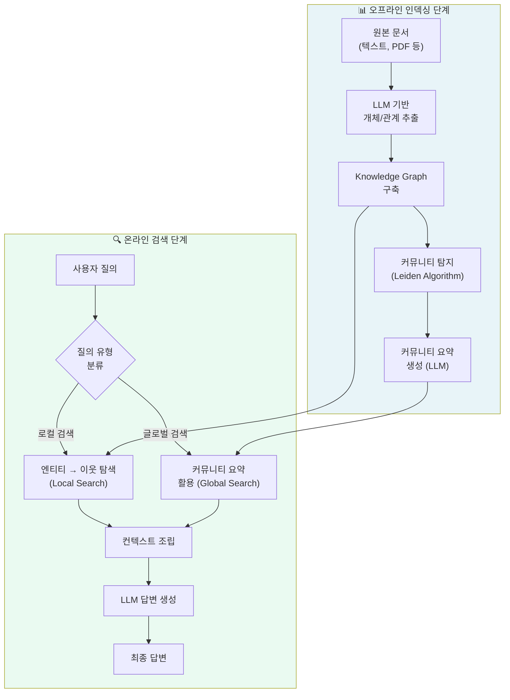
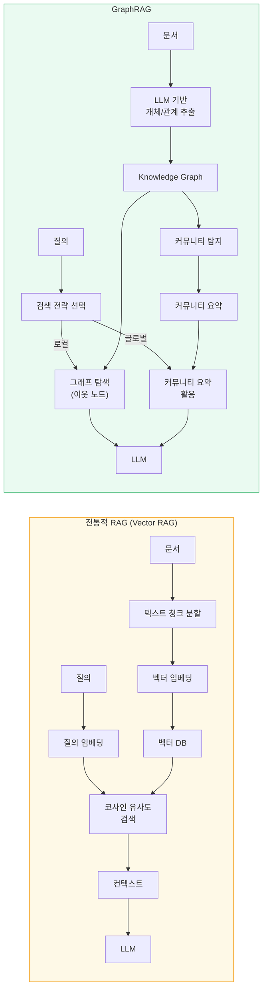
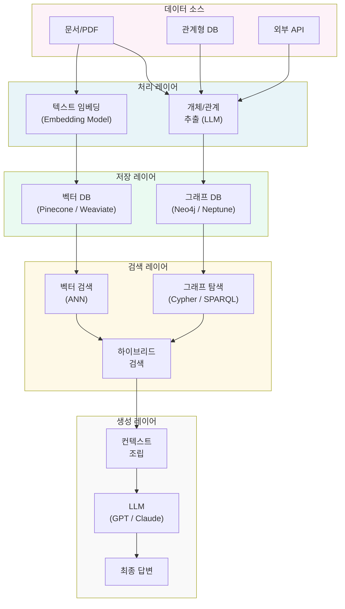

## 개념의 계층적 이해와 AI 활용까지

> **참고 자료**: Heather Hedden, [*"Knowledge Graphs and Ontologies"*](https://accidental-taxonomist.blogspot.com/2019/05/knowledge-graphs-and-ontologies.html), The Accidental Taxonomist Blog (2019.05.30)  
> **작성일**: 2026-04-08

---

## 목차

1. [지식 표현의 역사와 배경](#1-지식-표현의-역사와-배경)
2. [Taxonomy — 분류의 출발점](#2-taxonomy--분류의-출발점)
3. [Ontology — 의미 있는 관계의 세계](#3-ontology--의미-있는-관계의-세계)
4. [Knowledge Graph — 온톨로지를 넘어서](#4-knowledge-graph--온톨로지를-넘어서)
5. [RDF Triple — 지식 표현의 원자 단위](#5-rdf-triple--지식-표현의-원자-단위)
6. [개념 간 비교 정리](#6-개념-간-비교-정리)
7. [GraphRAG — LLM과 Knowledge Graph의 결합](#7-graphrag--llm과-knowledge-graph의-결합)
8. [GraphRAG vs 전통적 RAG 심층 비교](#8-graphrag-vs-전통적-rag-심층-비교)
9. [GraphRAG 실제 활용 사례](#9-graphrag-실제-활용-사례)
10. [구현 기술 스택과 생태계](#10-구현-기술-스택과-생태계)
11. [결론 — 어떤 기술을 언제 선택할 것인가](#11-결론--어떤-기술을-언제-선택할-것인가)

---

## 1. 지식 표현의 역사와 배경

인간이 지식을 표현하고 저장하는 방식은 오랜 시간에 걸쳐 발전해 왔다. 고대의 도서관 분류 체계에서 시작하여 오늘날 인공지능이 활용하는 지식 그래프에 이르기까지, 그 핵심 문제는 항상 동일했다. "세상에 존재하는 개념들과 그 관계를 컴퓨터가 이해할 수 있도록 어떻게 표현할 것인가?"

관계형 데이터베이스(RDBMS)의 시대에는 데이터를 행(row)과 열(column)로 구성된 테이블에 담았다. 이는 구조화된 데이터를 처리하는 데 강력했지만, 개념 간의 복잡한 의미 관계를 표현하는 데는 한계가 있었다. 예를 들어, "이순신은 조선 중기의 무관이다"와 "임진왜란은 이순신이 활약한 전쟁이다"라는 두 문장이 서로 어떻게 연결되는지를 RDBMS만으로 표현하려면 여러 테이블과 조인이 필요했고, 그 의미적 관계는 데이터베이스 스키마 안에 숨어버렸다.

이러한 한계를 극복하기 위해 등장한 개념들이 바로 Taxonomy, Ontology, Knowledge Graph이다. 이 세 가지 개념은 서로 독립적이기보다는 복잡도와 표현력의 스펙트럼 위에 순차적으로 위치하며, 각각이 다음 개념의 기반이 된다.



각 단계는 이전 단계를 포함하고 확장한다. Taxonomy는 단순 계층 분류이고, Ontology는 거기에 다양한 의미 관계를 추가하며, Knowledge Graph는 여러 온톨로지와 실제 데이터를 통합한다. 그리고 GraphRAG는 이 Knowledge Graph를 LLM(대형 언어 모델)과 결합하여 지능적인 질의응답 시스템을 만드는 현대적인 기술이다.

---

## 2. Taxonomy — 분류의 출발점

### 2.1 Taxonomy란 무엇인가

Taxonomy(분류 체계)는 가장 기본적인 지식 조직 시스템(Knowledge Organization System, KOS)이다. 생물학에서 유래한 이 개념은 개체들을 계층적인 범주로 분류하는 방법이다. 링네우스(Carl Linnaeus)가 생물을 계-문-강-목-과-속-종으로 분류한 방식이 대표적이다.

정보 관리 분야에서 Taxonomy는 주제나 개념들을 **계층적 관계(broader/narrower term)** 로 조직하는 체계를 의미한다. 단순한 상하위 관계(is-a 관계)가 핵심이며, 각 개념은 정해진 위치에 배치된다.



### 2.2 Taxonomy의 한계

Taxonomy는 계층적 분류에는 뛰어나지만, 개념 간의 **수평적 관계나 복잡한 의미 관계**를 표현하는 데 한계가 있다. 예를 들어, "독수리는 먹이 사슬에서 고양이보다 위에 있다"거나 "개는 인간과 공진화했다"와 같은 관계는 단순한 계층 구조로 표현할 수 없다.

또한 동일한 개념이 여러 범주에 속할 수 있는 다중 상속(polyhierarchy) 상황도 순수 계층형 Taxonomy로는 깔끔하게 처리하기 어렵다.

---

## 3. Ontology — 의미 있는 관계의 세계

### 3.1 Ontology의 철학적 배경

Ontology라는 단어는 그리스어 "존재(ontos)"와 "학문(logos)"에서 유래한 철학 용어다. 철학에서 Ontology는 "무엇이 존재하는가"를 다루는 학문이지만, 정보과학에서는 특정 영역의 개념들과 그 관계를 **형식적이고 명시적으로 정의한 명세(formal explicit specification)** 를 의미한다.

Tom Gruber(1993)의 정의에 따르면, 온톨로지는 "공유된 개념화에 대한 형식적이고 명시적인 명세"다. 여기서 핵심은 세 가지다.

첫째, **형식적(formal)**: 컴퓨터가 처리할 수 있는 논리적 형태로 표현된다는 의미다. 자연어 설명만으로는 부족하고, 논리적 공리와 제약 조건을 통해 명확하게 정의되어야 한다.

둘째, **명시적(explicit)**: 암묵적으로 이해되는 것이 아니라 명시적으로 선언된다는 의미다. 모든 개념, 관계, 제약이 문서화되어야 한다.

셋째, **공유된(shared)**: 특정 개인이나 시스템만의 이해가 아니라, 특정 커뮤니티나 도메인 내에서 합의된 지식이라는 의미다.

### 3.2 Ontology의 구성 요소

온톨로지는 Taxonomy보다 훨씬 풍부한 표현력을 가진다. 주요 구성 요소는 다음과 같다.

**클래스(Class)**: 개념의 집합을 정의한다. "자동차", "사람", "도시" 등이 클래스다.

**개체(Individual/Instance)**: 클래스의 구체적인 사례다. "서울", "이순신", "갤럭시 S25"는 각각 "도시", "사람", "스마트폰" 클래스의 개체다.

**속성(Property)**: 클래스 간의 관계(Object Property)나 클래스-데이터 간의 관계(Data Property)를 정의한다. "거주한다(livesIn)", "제조한다(manufactures)", "인구가(hasPopulation)"가 속성의 예다.

**공리(Axiom)**: 클래스와 속성에 대한 제약 조건이나 논리적 규칙이다. "모든 사람은 최대 하나의 생물학적 어머니를 가진다"가 공리의 예다.



### 3.3 OWL과 RDFS — 온톨로지 표현 언어

현대 온톨로지는 주로 W3C(World Wide Web Consortium)가 표준화한 언어로 표현된다.

**RDFS(RDF Schema)**: RDF를 확장하여 클래스 계층과 속성 정의를 가능하게 하는 가벼운 온톨로지 언어다. "rdfs:subClassOf"로 계층 관계를, "rdfs:domain"과 "rdfs:range"로 속성의 도메인과 범위를 정의할 수 있다.

**OWL(Web Ontology Language)**: RDFS보다 훨씬 강력한 표현력을 제공하는 온톨로지 언어다. 동치 클래스(owl:equivalentClass), 분리 클래스(owl:disjointWith), 이행성(owl:TransitiveProperty), 역관계(owl:inverseOf) 등 풍부한 의미를 표현할 수 있다. OWL 2는 현재 가장 널리 사용되는 온톨로지 표현 표준이다.

**추론기(Reasoner)**: OWL로 작성된 온톨로지는 추론기(예: Pellet, HermiT, FaCT++)를 통해 명시적으로 선언되지 않은 새로운 지식을 자동으로 추론할 수 있다. 예를 들어, "A는 B의 부모다"와 "B는 C의 부모다"로부터 "A는 C의 조상이다"를 자동 추론하는 것이 가능하다.

### 3.4 Domain Ontology와 Upper Ontology

온톨로지는 적용 범위에 따라 구분된다.

**도메인 온톨로지(Domain Ontology)**: 특정 분야의 지식을 표현한다. 의료 분야의 SNOMED CT, 생물학 분야의 Gene Ontology, 금융 분야의 FIBO(Financial Industry Business Ontology) 등이 대표적이다.

**상위 온톨로지(Upper Ontology / Foundation Ontology)**: 특정 도메인에 국한되지 않고, 시간, 공간, 사건, 객체, 속성 등 모든 도메인에 공통적인 최상위 개념을 정의한다. BFO(Basic Formal Ontology), DOLCE, SUMO 등이 있다. 서로 다른 도메인 온톨로지들을 상위 온톨로지를 기반으로 통합할 수 있다.

---

## 4. Knowledge Graph — 온톨로지를 넘어서

### 4.1 Knowledge Graph의 정의와 특징

Knowledge Graph(지식 그래프)는 지식 베이스를 **그래프 형태로 조직하고 표현**한 것이다. 행과 열로 구성된 테이블이 아니라, 노드(node)와 엣지(edge)의 네트워크로 데이터를 표현한다. Heather Hedden의 블로그에서 설명하듯, Knowledge Graph는 단순히 온톨로지를 구현한 것이 아니라 온톨로지를 포함하고 그 이상의 것을 담는다.

Eherlinger와 Wöß의 정의("Towards a Definition of Knowledge Graphs", 2016)에 따르면, Knowledge Graph는 "정보를 온톨로지에 통합하고, 추론기(reasoner)를 적용하여 새로운 지식을 도출"한다. 즉, Knowledge Graph는 온톨로지(스키마)와 실제 데이터(인스턴스), 그리고 추론 메커니즘을 모두 포함하는 더 넓은 개념이다.



### 4.2 Knowledge Graph의 핵심 특성

**다중 도메인 통합**: 단일 Knowledge Graph는 여러 도메인의 온톨로지를 통합할 수 있다. 예를 들어, 영화 정보, 배우 정보, 지리 정보, 시상 이력 등 다양한 도메인의 지식이 하나의 그래프로 연결된다.

**이기종 데이터 소스 연결**: 정형 데이터(데이터베이스), 반정형 데이터(JSON, XML), 비정형 데이터(자연어 텍스트)를 모두 통합하여 단일한 지식 레이어를 형성한다.

**고유 식별자(URI)**: Knowledge Graph의 모든 노드는 고유한 URI(Uniform Resource Identifier)를 가진다. 이를 통해 서로 다른 데이터 소스에서 동일한 개체를 정확하게 식별하고 연결할 수 있다. 이 원칙은 Linked Data의 핵심이기도 하다.

**추론 가능성**: 명시적으로 저장된 사실에서 새로운 사실을 추론할 수 있다. "A는 B의 부모", "B는 C의 부모" → "A는 C의 조부모"와 같은 추론이 가능하다.

**시맨틱 레이어 제공**: 메타데이터 레이어 위에 의미(semantic) 레이어를 추가함으로써, 단순한 키워드 검색을 넘어 의미 기반 검색을 가능하게 한다.

### 4.3 Google Knowledge Graph — 가장 유명한 구현 사례

2012년 구글이 도입한 Knowledge Graph는 일반 대중에게 이 개념을 가장 잘 알린 사례다. 구글 검색 결과의 우측에 표시되는 "정보 박스(Fact Box)"가 바로 Knowledge Graph의 산출물이다. 사용자가 "보스턴"을 검색하면, 보스턴의 인구, 면적, 주요 대학, 관광지 등이 구조화된 형태로 표시된다. 이는 단순한 텍스트 검색이 아니라, 수많은 개체와 관계가 연결된 그래프 데이터베이스에서 즉시 답을 추출한 것이다.

업로드된 Image 1(보스턴 검색 결과)이 바로 이 Google Knowledge Graph의 실제 출력 화면이다. "Population: 685,094 (2017)", "Area code: 617" 등의 정보가 구조화된 형태로 표시되고, 보스턴 대학교, 하버드, MIT 등 관련 개체들이 연결되어 있다.

### 4.4 Knowledge Graph vs Ontology — 무엇이 다른가

Ontology와 Knowledge Graph는 시각화했을 때 비슷하게 보일 수 있다. 둘 다 노드와 관계로 표현되고, 둘 다 RDF와 OWL을 기반으로 한다. 그렇다면 무엇이 다른가?

핵심적인 차이는 **범위와 목적**에 있다. Ontology는 주로 특정 도메인의 개념적 구조(TBox: Terminological Box)를 정의하는 데 초점을 맞춘다. 반면 Knowledge Graph는 이 스키마(Ontology)에 더해 실제 데이터 인스턴스(ABox: Assertional Box)를 대규모로 통합하고, 여러 도메인의 온톨로지를 연결하며, 추론 메커니즘을 적용한다. 

Wikipedia는 Knowledge Graph를 Ontology와 동일하게 취급하지만, Heather Hedden은 이를 명확히 구분한다. Knowledge Graph는 온톨로지를 포함하고, 거기에 데이터, 다중 도메인 통합, 추론을 더한 더 큰 개념이다.

또 한 가지 중요한 기술적 차이는 그래프 데이터베이스의 종류다. RDF 기반의 Knowledge Graph는 모든 관계를 트리플(triple)로 표현하는 반면, Neo4j와 같은 Property Graph 기반 시스템은 관계(엣지) 자체에도 속성을 부여할 수 있다. 이는 더 유연한 데이터 모델을 가능하게 한다.

---

## 5. RDF Triple — 지식 표현의 원자 단위

### 5.1 RDF Triple의 구조

Knowledge Graph와 Ontology의 기반이 되는 가장 기본적인 표현 단위는 **RDF Triple(RDF 트리플)** 이다. RDF(Resource Description Framework)는 W3C가 표준화한 데이터 모델로, 모든 지식을 "주어-서술어-목적어(Subject-Predicate-Object)" 형태의 트리플로 표현한다.

업로드된 Image 2가 RDF Triple의 구조를 명확하게 보여준다.

```
Triple 1: (Rome, Italy) → [CapCity of] → (Italy)
Triple 2: (Italy) → [CapCity] → (Rome, Italy)
```

이 두 트리플은 서로 역관계(inverse relation)를 표현한다. 로마가 이탈리아의 수도라는 사실, 그리고 이탈리아의 수도가 로마라는 사실이 각각 별도의 트리플로 표현된다.

### 5.2 RDF Triple의 구성 요소

**주어(Subject)**: 서술의 대상이 되는 자원. 반드시 URI여야 한다.

**서술어(Predicate)**: 주어와 목적어 사이의 관계를 나타내는 속성. 역시 URI여야 한다.

**목적어(Object)**: 관계의 대상. URI(다른 자원) 또는 리터럴(문자열, 숫자, 날짜 등)이 될 수 있다.



### 5.3 SPARQL — Knowledge Graph 질의 언어

RDF 기반 Knowledge Graph를 질의하기 위한 표준 언어는 **SPARQL(SPARQL Protocol and RDF Query Language)** 이다. SQL이 관계형 데이터베이스를 위한 질의 언어이듯, SPARQL은 RDF 그래프를 위한 질의 언어다.

복잡한 쿼리 예시를 생각해보자. "유럽에서 최근 3년간 출판된, 가장 많이 인용된 상위 10개 학술지 중 Knowledge Graph를 다룬 것들은?" 이런 질의는 전통적인 키워드 검색으로는 거의 불가능하지만, 올바르게 구성된 Knowledge Graph와 SPARQL 쿼리로는 처리 가능하다. 이것이 Knowledge Graph가 검색 엔진보다 복잡한 질의 처리에서 강력한 이유다.

---

## 6. 개념 간 비교 정리

지금까지 살펴본 Taxonomy, Ontology, Knowledge Graph를 핵심 차원에서 비교하면 다음과 같다.



| 특성 | Taxonomy | Ontology | Knowledge Graph |
|------|----------|----------|-----------------|
| 관계 유형 | 계층(is-a)만 | 다양한 의미 관계 | 다양한 의미 관계 + 다중 도메인 |
| 표현 언어 | 자유 형식 / SKOS | OWL, RDFS | RDF + OWL + Property Graph |
| 추론 가능 여부 | ❌ | ✅ (제한적) | ✅ (강력) |
| 데이터 통합 | ❌ | 부분적 | ✅ (핵심 기능) |
| 규모 | 소~중 | 중 | 중~대규모 |
| 복잡도 | 낮음 | 중간 | 높음 |
| 주요 활용 | 콘텐츠 분류, 네비게이션 | 도메인 모델링, 상호 운용성 | 검색, 추천, 질의응답 |

---

## 7. GraphRAG — LLM과 Knowledge Graph의 결합

### 7.1 RAG(Retrieval-Augmented Generation) 기초

GraphRAG를 이해하기 위해 먼저 **RAG(검색 증강 생성)** 를 이해해야 한다. LLM(Large Language Model)은 방대한 텍스트로 학습되어 놀라운 언어 이해 및 생성 능력을 보이지만, 두 가지 핵심 한계가 있다.

첫째, **지식 단절(Knowledge Cutoff)**: 학습 데이터의 날짜 이후의 정보는 알지 못한다.

둘째, **환각(Hallucination)**: 모르는 것을 그럴듯하게 만들어내는 경향이 있다. 특히 구체적인 사실 관계를 물을 때 심각하다.

RAG는 이 문제를 해결하기 위해 LLM이 답변을 생성하기 전에, 외부 지식 소스에서 관련 정보를 검색(Retrieve)하여 컨텍스트로 제공하는 방식이다.



### 7.2 전통적 RAG의 한계

그러나 전통적인 RAG(이하 VectorRAG 또는 Naive RAG)도 한계가 있다. 전통적 RAG는 **텍스트를 벡터 임베딩으로 변환하고, 질문과 의미적으로 유사한 텍스트 청크를 검색**하는 방식이다. 이는 단순한 사실 질의에는 효과적이지만, 다음과 같은 상황에서는 취약하다.

**다단계 추론이 필요한 질의**: "A가 B에 영향을 미쳤고, B가 C를 이끌었으며, C는 D의 원인이 되었다. 그렇다면 A와 D의 관계는?" 이런 질의는 여러 개의 텍스트 청크를 순차적으로 연결해야 하는데, 단순 유사도 검색으로는 이 연결 고리를 찾기 어렵다.

**전역적 주제 요약**: "이 문서 전체에서 가장 중요한 주제는 무엇인가?" 이런 질의는 단일 청크가 아닌 전체 문서의 구조적 이해가 필요하다.

**관계 중심 질의**: "누가 누구와 어떤 관계인가?" "이 회사의 공급망은 어떻게 구성되어 있는가?" 이런 질의는 개체 간 관계 정보가 핵심인데, 텍스트 청크 기반 검색은 이 관계를 명시적으로 표현하지 않는다.

### 7.3 GraphRAG의 작동 원리

**GraphRAG**는 Microsoft Research에서 2024년 발표한 방법으로, Knowledge Graph와 RAG를 결합하여 전통적 RAG의 한계를 극복한다. 핵심 아이디어는 단순히 텍스트를 검색하는 것이 아니라, **텍스트에서 Knowledge Graph를 자동으로 추출하고, 그 그래프 구조를 활용하여 더 정확하고 종합적인 답변을 생성**하는 것이다.



### 7.4 GraphRAG 핵심 단계 상세 설명

**1단계: 텍스트에서 그래프 추출 (Graph Extraction)**

GraphRAG 파이프라인의 첫 단계는 입력 문서에서 개체(Entity)와 관계(Relationship)를 추출하는 것이다. 이 작업 자체에 LLM이 활용된다. LLM은 "이 텍스트에 등장하는 모든 중요한 인물, 조직, 장소, 개념을 추출하고, 그들 사이의 관계를 명시하라"는 형태의 프롬프트로 작동한다.

예를 들어, "이순신은 1545년 한성부에서 태어났으며, 임진왜란에서 조선 수군을 이끌어 일본군에 맞서 싸웠다"라는 문장에서 다음과 같은 트리플이 추출된다.

```
(이순신, bornIn, 한성부)
(이순신, bornYear, 1545)
(이순신, ledForce, 조선 수군)
(이순신, foughtIn, 임진왜란)
(임진왜란, opponent, 일본군)
```

**2단계: 커뮤니티 탐지 (Community Detection)**

대규모 Knowledge Graph에서 Leiden Algorithm(또는 Louvain Algorithm)과 같은 그래프 클러스터링 알고리즘을 적용하여 서로 밀접하게 연결된 노드들의 그룹(커뮤니티)을 탐지한다. 이 커뮤니티는 자연스럽게 관련된 주제나 개념의 집합을 형성한다.

**3단계: 커뮤니티 요약 생성 (Community Summarization)**

각 커뮤니티에 속한 노드와 엣지 정보를 다시 LLM에 입력하여, 해당 커뮤니티의 핵심 내용을 요약한 텍스트를 생성한다. 이 요약은 전역 검색(Global Search)에 활용된다.

**4단계: 이중 검색 전략 (Dual Search Strategy)**

GraphRAG는 질의의 성격에 따라 두 가지 검색 전략을 사용한다.

로컬 검색(Local Search)은 특정 개체에 관한 구체적인 사실 질의에 사용된다. 질의에서 핵심 개체를 식별하고, Knowledge Graph에서 해당 개체와 직접 연결된 이웃 노드와 엣지를 탐색하여 관련 정보를 수집한다.

글로벌 검색(Global Search)은 전체 문서에 걸쳐 있는 주제나 패턴에 관한 질의에 사용된다. 개별 청크를 검색하는 대신, 미리 생성된 커뮤니티 요약들을 활용하여 전체적인 그림을 파악한다.

---

## 8. GraphRAG vs 전통적 RAG 심층 비교

### 8.1 아키텍처 비교



### 8.2 성능 비교 상세

| 비교 항목 | 전통적 RAG | GraphRAG |
|-----------|-----------|----------|
| **단순 사실 질의** | ✅ 우수 | ✅ 동등 |
| **다단계 추론** | ❌ 취약 | ✅ 강점 |
| **전역 주제 파악** | ❌ 어려움 | ✅ 강점 |
| **관계 추적** | ❌ 취약 | ✅ 강점 |
| **새로운 문서 추가** | ✅ 빠름 | ⚠️ 재처리 필요 |
| **인덱싱 비용** | 낮음 | 높음 (LLM 호출 多) |
| **검색 비용** | 낮음 | 중간 |
| **설명 가능성** | ❌ 블랙박스 | ✅ 경로 추적 가능 |
| **환각 위험** | 중간 | 낮음 (구조화된 컨텍스트) |
| **구현 복잡도** | 낮음 | 높음 |

### 8.3 언제 무엇을 선택할 것인가

**전통적 RAG가 적합한 경우:**
- 문서가 자주 추가/변경되는 환경
- 단순 사실 조회가 주요 사용 사례
- 빠른 프로토타이핑이 필요한 경우
- 비용 최소화가 우선순위인 경우

**GraphRAG가 적합한 경우:**
- 문서 집합이 상대적으로 안정적인 경우
- 복잡한 다단계 추론이 필요한 경우
- "전체 문서에서 가장 중요한 주제는?"과 같은 전역 질의가 많은 경우
- 개체 간 관계 추적이 핵심인 경우 (예: 지식 관리, 연구 분석)
- 답변의 근거와 경로를 추적할 수 있어야 하는 경우 (규제 환경, 의료, 법률)

---

## 9. GraphRAG 실제 활용 사례

### 9.1 기업 지식 관리

대기업에서는 수십 년에 걸쳐 축적된 내부 문서, 회의록, 프로젝트 보고서, 기술 문서가 방대하게 쌓인다. 이 지식을 GraphRAG로 처리하면, 단순히 관련 문서를 찾는 것을 넘어 "2018년에 시작된 프로젝트 X가 현재 진행 중인 프로젝트 Y에 어떤 교훈을 줄 수 있는가?" 와 같은 복잡한 지식 연결 질의가 가능해진다.

### 9.2 의료 및 생명과학

임상 문헌, 약물 데이터, 환자 기록을 Knowledge Graph로 통합하고 GraphRAG를 적용하면, "A 약물과 B 약물을 동시에 투여받는 C 질환 환자의 부작용 패턴은?" 같은 복잡한 의료 질의를 처리할 수 있다. 이 분야에서 SNOMED CT, ICD-10, DrugBank 등의 기존 의료 온톨로지가 Knowledge Graph의 스키마로 활용된다.

### 9.3 금융 및 컴플라이언스

금융 규정, 법령, 기업 공시를 Knowledge Graph로 구성하면, "우리 회사가 A 국가에서 B 유형의 사업을 할 경우 적용되는 모든 규정은?" 같은 복잡한 컴플라이언스 질의가 가능하다. 관계 추적 기능은 기업 지배 구조 분석, 자금 세탁 탐지 등에도 활용된다.

### 9.4 내부 AI 플랫폼 적용 시나리오

MCP-Orbit와 같은 내부 AI 에이전트 플랫폼에 GraphRAG를 통합한다면, DataLens의 자연어 데이터 질의 기능을 한 단계 발전시킬 수 있다. 단순히 "이 테이블에서 이 값을 찾아라"를 넘어, "이 고객 데이터와 저 계약 데이터에서 보이는 패턴이 지난 분기 이상 거래 보고서와 어떤 연관성이 있는가?" 같은 다중 소스 연결 질의가 가능해진다.

---

## 10. 구현 기술 스택과 생태계

### 10.1 그래프 데이터베이스

**RDF 기반**: Apache Jena TDB, GraphDB (Ontotext), Stardog, Amazon Neptune (SPARQL 지원)

**Property Graph 기반**: Neo4j (가장 널리 사용), Amazon Neptune (Gremlin), TigerGraph, ArangoDB

**클라우드 서비스**: Azure Cosmos DB (Gremlin API), Google Cloud Spanner Graph

### 10.2 GraphRAG 구현 도구

**Microsoft GraphRAG**: Python 라이브러리로, 문서에서 자동으로 Knowledge Graph를 구축하고 로컬/글로벌 검색을 지원한다. (https://github.com/microsoft/graphrag)

**LlamaIndex**: Property Graph Index를 지원하며, 다양한 그래프 데이터베이스와 통합된다.

**LangChain**: Neo4jGraph, NetworkX 등과 통합된 GraphRAG 체인을 제공한다.

**Neo4j + LLM**: Neo4j는 자체적으로 LLM 통합 기능을 강화하고 있으며, "GraphRAG with Neo4j" 튜토리얼과 라이브러리를 제공한다.

### 10.3 전체 기술 스택 다이어그램



---

## 11. 결론 — 어떤 기술을 언제 선택할 것인가

Taxonomy, Ontology, Knowledge Graph, GraphRAG는 각기 다른 문제를 해결하기 위해 설계된 도구들이다. 이들은 경쟁 관계가 아니라 상호 보완 관계이며, 실제 시스템에서는 여러 수준을 함께 활용하는 경우가 많다.

**Taxonomy**는 콘텐츠 분류, 웹사이트 네비게이션, 태그 체계 설계와 같이 명확한 계층 구조가 필요하고 관리가 쉬워야 하는 경우에 최적이다. 복잡성보다 실용성이 중요할 때 선택한다.

**Ontology**는 특정 도메인의 지식을 형식적으로 모델링해야 하고, 다른 시스템과의 상호 운용성이 중요하며, 자동 추론이 필요한 경우에 적합하다. 의료, 법률, 엔지니어링과 같이 전문 지식의 정밀한 표현이 중요한 분야에서 빛을 발한다.

**Knowledge Graph**는 이기종 데이터 소스를 통합하고, 복잡한 관계를 탐색하며, 의미 기반 검색과 추천 시스템을 구현해야 할 때 선택한다. 규모가 크고 다양한 도메인을 아우르는 지식 기반을 구축할 때 핵심 기술이 된다.

**GraphRAG**는 이 모든 것에 더해 LLM의 자연어 이해 능력을 결합하여, 비전문가도 자연어로 복잡한 지식 탐색을 수행할 수 있게 한다. 특히 다단계 추론, 전역 주제 파악, 관계 중심 질의가 핵심인 엔터프라이즈 AI 시스템에서 점점 더 중요한 기술이 되고 있다.

지식을 단순히 저장하는 것을 넘어, 지식을 연결하고 추론하며 자연어로 접근할 수 있게 하는 이 기술들의 발전은, 결국 "컴퓨터가 인간의 지식을 이해할 수 있는가"라는 오랜 질문에 대한 현대적인 답변의 과정이다.

---

*본 문서는 Heather Hedden의 "Knowledge Graphs and Ontologies" (The Accidental Taxonomist, 2019), Microsoft Research의 GraphRAG 논문 (2024), 및 관련 기술 문서를 참고하여 작성되었습니다.*

*작성일: 2026-04-08*
