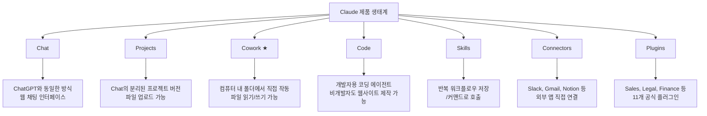
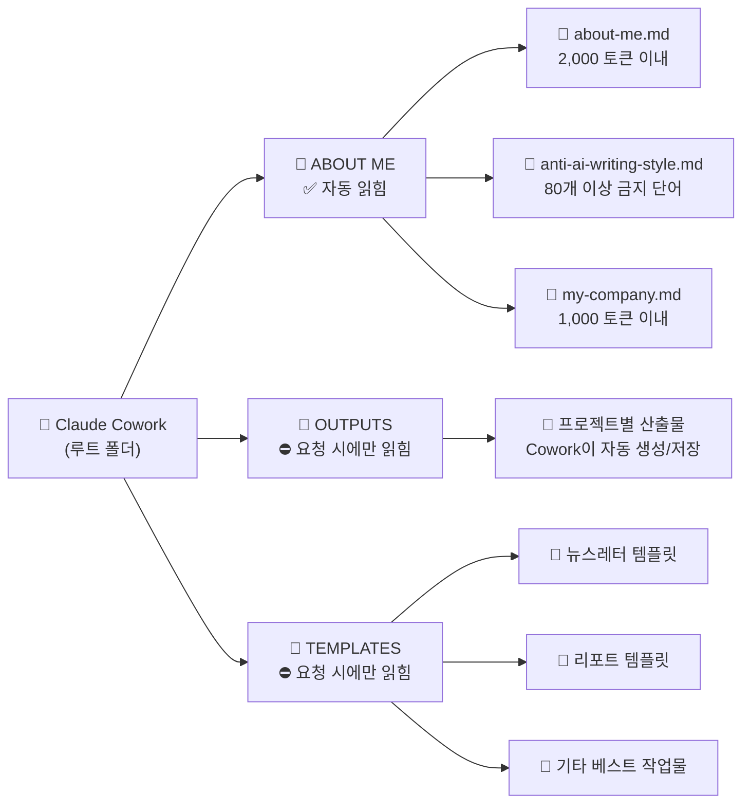
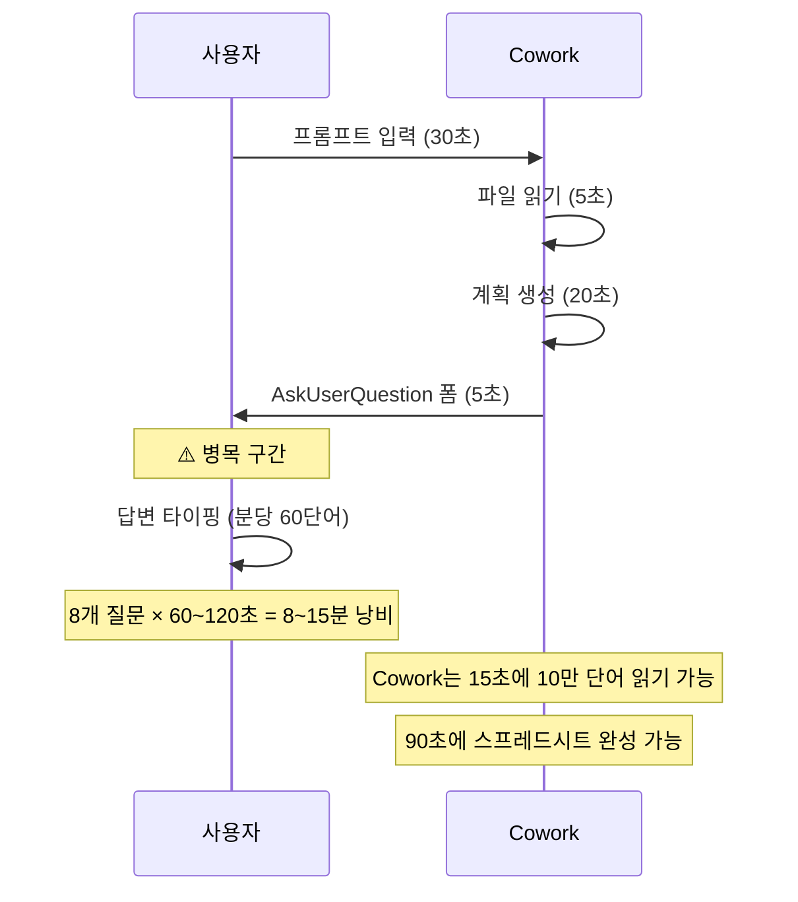
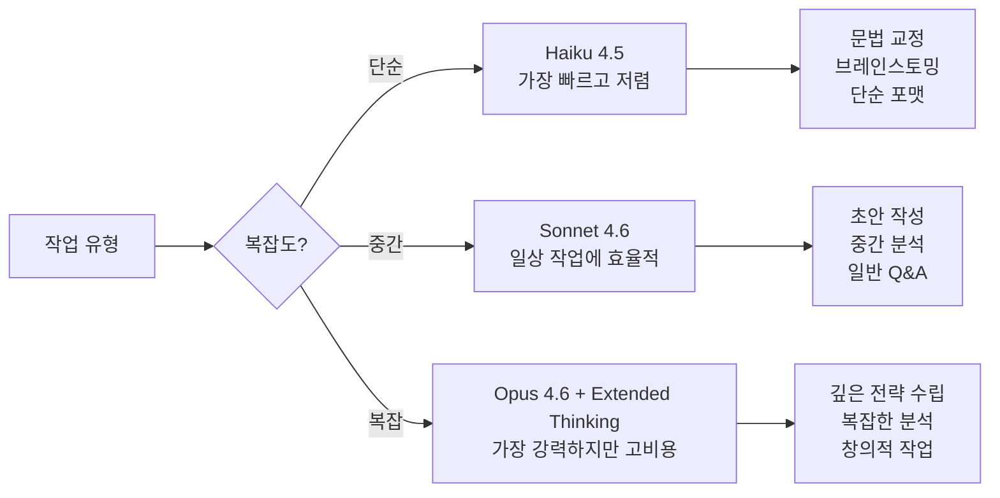

> 원문: Ruben Hassid의 ["How to set up Claude Cowork (April 2026 update)"](https://x.com/rubenhassid/status/2042105069550932138)  
> 작성일: 2026년 4월 9일 | 분석 정리: Claude Sonnet 4.6

---

## 목차
1. [배경: 왜 지금 Claude인가?](#1-배경-왜-지금-claude인가)
2. [Claude Cowork란 무엇인가?](#2-claude-cowork란-무엇인가)
3. [폴더 구조 설정 (핵심)](#3-폴더-구조-설정-핵심)
4. [ABOUT ME 폴더: 3개의 핵심 파일](#4-about-me-폴더-3개의-핵심-파일)
5. [OUTPUTS 폴더](#5-outputs-폴더)
6. [TEMPLATES 폴더](#6-templates-폴더)
7. [Global Instructions 설정](#7-global-instructions-설정)
8. [Wispr Flow: 병목을 제거하는 방법](#8-wispr-flow-병목을-제거하는-방법)
9. [토큰 절약 전략 6가지](#9-토큰-절약-전략-6가지)
10. [20분 퀵스타트 플랜](#10-20분-퀵스타트-플랜)
11. [Claude 전체 제품 생태계](#11-claude-전체-제품-생태계)
12. [핵심 요약 및 인사이트](#12-핵심-요약-및-인사이트)

---

## 1. 배경: 왜 지금 Claude인가?

### 수익 역전의 시대

이 가이드가 나온 시점(2026년 4월)은 AI 산업에서 의미 있는 전환점이 일어난 직후다. 제공된 수익 성장 차트에 따르면, Anthropic의 Claude는 지난 12개월 동안 **ARR(연간 반복 수익) 기준 10배** 성장을 달성했다.

- **Claude (Anthropic):** $3.5B → $30B (2025년 5월 → 2026년 4월), 2026년 5월 $43B 예상
- **ChatGPT (OpenAI):** $10B → $25B (같은 기간, 2.5배 성장), 2026년 5월 $27B 예상

Claude는 하루에 **$3억 2,350만의 ARR**을 추가하고 있으며, 이는 이미 수익 기준으로 ChatGPT를 앞질렀다는 의미다. (출처: Epoch AI, Bloomberg, Sacra, OpenAI CFO 블로그 2026년 1월, Anthropic Series G 2026년 2월)

이 성장의 핵심 동력 중 하나가 바로 **Claude Cowork**다.

---

## 2. Claude Cowork란 무엇인가?

Claude의 전체 제품 라인은 다음과 같이 구성된다:



**Cowork의 핵심 특징:**
- 컴퓨터의 실제 폴더에 접근하여 파일을 읽고 쓴다
- 매 세션마다 지정된 폴더의 파일들을 자동으로 읽어들인다
- AskUserQuestion을 통해 클릭 가능한 폼을 생성하여 인터랙티브하게 작업한다
- Projects와의 차이점: Projects는 로컬 저장 없음, 폴더 구조 없음, 컴퓨터에 파일 저장 불가

**접근 방법:**
1. claude.com/download에서 데스크탑 앱 다운로드
2. Pro 플랜 필요 (월 $20 또는 $100)
3. 앱 상단의 Chat / **Cowork** / Code 탭 중 Cowork 선택
4. 컴퓨터의 작업 폴더 선택
5. 복잡한 작업은 반드시 **Opus 4.6 + Extended Thinking** 선택

---

## 3. 폴더 구조 설정 (핵심)

Claude Cowork의 성패는 **폴더 구조 설계**에 달려 있다. Ruben Hassid가 2개월에 걸쳐 최적화한 구조는 다음과 같다:



**설계 원칙:**
- ABOUT ME 폴더만 매 세션 자동으로 읽힌다
- 전체 3개 파일의 총 크기는 **6,000 토큰 이하**로 유지해야 한다
- 파일이 너무 크면 Claude가 전체를 꼼꼼히 읽는 대신 대충 요약만 한다
- OUTPUTS와 TEMPLATES는 필요할 때 명시적으로 지시해야만 읽는다

---

## 4. ABOUT ME 폴더: 3개의 핵심 파일

### 파일 #1: about-me.md

**목적:** 나는 누구인가, 어떻게 생각하는가, Claude가 나 대신 어떻게 써줬으면 하는가.

**과거의 실수와 교훈:**
Ruben은 처음에 Claude에게 100가지 질문으로 인터뷰를 해서 22,000단어 이상의 about-me 파일을 만들었다. 그러나 이것은 세션마다 22,000+ 토큰을 소모하는 낭비였다. 현재는 **2,000 토큰 이내**로 압축했고, 정보의 품질은 거의 동일하다.

**기존 파일이 있다면 압축하는 방법:**
Cowork에 기존 about-me 파일을 업로드하고 다음 프롬프트를 사용한다:
```
This is my about-me file and I need to save tokens. 
Ask me questions on how to trim effectively until we have the perfect document.
```

**처음부터 만드는 방법 (4단계):**

**1단계:** 새 Cowork 세션 열기 → Opus 4.6 + Extended Thinking 선택

**2단계:** 다음 프롬프트를 붙여넣기 (핵심 구조):
```markdown
You are building my about-me.md file for my Cowork folder.
Your job: interview me using AskUserQuestion (20 questions), 
then compile the answers into a condensed about-me.md under 2,000 tokens.

[인터뷰 커버 영역]
- WHO I AM (3문항): 역할, 협업 대상, 좋은 한 주의 모습
- HOW I WORK (4문항): 도구, 업무 프로세스, 검토 방식, 완성 기준
- WHAT GOOD LOOKS LIKE (4문항): 최고의 산출물, 좋은 작업의 기준
- WHAT YOU HATE (4문항): 나쁜 작업 패턴, Claude가 틀릴 때의 패턴
- YOUR RULES (3문항): 절대 하지 않는 것, 비협상 조건
- YOUR OPINIONS (3문항): 업계 반주류 의견, 과대평가된 것들

[출력 형식]
# ABOUT ME: [이름]
## Who I am
## How I work  
## What good looks like
## What I hate
## My rules
## Instructions for Claude (10개 규칙)

목표: 2,000 토큰 이내. 모든 문장이 정보를 담아야 함.
```

**3단계:** AskUserQuestion으로 생성된 폼에서 클릭하거나 "Something else"로 직접 답변

**4단계:** Wispr Flow로 음성 받아쓰기 활용 (타이핑 4배 빠름)

**완성된 about-me.md의 구조 예시 (Ruben의 경우):**
- Core Identity: 비기술적 AI 교육자, 행동 가능한 논하는 콘텐츠 제작
- Current Workflow & Tools: Cowork + Wispr Flow 조합, Opus 4.6 + Extended Thinking
- Core Beliefs: 템플릿 = 신입사원의 SOP, 주간 우선순위 = 월요일 템플릿
- Beliefs & Contrarian Takes: AI는 평균이 기준, 프롬프트보다 파일이 중요

---

### 파일 #2: anti-ai-writing-style.md

**목적:** AI 특유의 글쓰기 패턴을 차단하고 나만의 문체를 강제하는 규칙 파일.

**이 파일이 없으면:** Claude는 Claude처럼 쓴다.
**이 파일이 있으면:** Claude는 당신처럼 쓴다.

Ruben의 파일은 다음을 포함한다:
- **80개 이상의 금지 단어**: "delve", "harness", "tapestry" 등 전형적인 AI 단어
- **금지 문장 패턴**: "이것은 X가 아니라 Y입니다" 식의 리프레이밍
- **포맷 규칙**: 단락당 최대 3문장 제한
- **문체 지침**: 구체적인 어조와 리듬에 관한 개인 규칙

이 파일은 Ruben의 뉴스레터 구독자에게 무료로 제공된다.

---

### 파일 #3: my-company.md

**목적:** 현재 목표, 전략, 집중 영역, 거절하는 것들을 정의하는 파일.

**about-me.md와의 차이:**
- about-me.md → 나는 누구인가, 어떻게 일하는가 (정적 정보)
- my-company.md → 지금 무엇을 향해 가고 있는가 (동적 전략 정보)

**만드는 방법 (같은 Cowork 세션에서 이어서):**
```markdown
You are building my my-company.md file for my Cowork folder.
Your job: interview me using AskUserQuestion (6-8 questions),
then compile into my-company.md under 1,000 tokens.

[커버 영역]
GOALS (3-4문항): 올해 목표, 주요 플랫폼/시장, 성공 지표, 수익/청중 목표
DECISIONS (3-4문항): 현재 거절하는 것들, 최근 그만둔 것, 시간/에너지 집중 영역

[출력 형식]
# MY COMPANY
## Goals (숫자가 있는 구체적 목표)
## Focus right now (분기별 2-3개)
## Saying no to (현재 거절 목록)

목표: 1,000 토큰 이내. 우선순위가 바뀔 때만 업데이트.
```

**업데이트 주기:** 매주가 아닌, 실제로 우선순위가 바뀔 때만 (대략 분기 1회).

---

## 5. OUTPUTS 폴더

Cowork가 산출물을 저장하는 공간이다.

**작동 방식:**
- 프로젝트별 하위 폴더를 Cowork가 스스로 정리한다
- Cowork는 자동으로 이 폴더를 읽지 않는다 (토큰 낭비 방지)
- 필요시 명시적 지시: `"OUTPUTS/프로젝트명에 있는 리포트를 읽어줘"`

**Ruben의 OUTPUTS 폴더 실제 예시:**
- growth-dashboard.html (85KB)
- design-workflow-system.html
- Newsletter 시리즈 .md 파일들
- Claude Skills Newsletter .docx
- AI Prompting Briefing .md 파일들

---

## 6. TEMPLATES 폴더

좋은 산출물의 구조(뼈대)를 저장하는 공간이다.

**핵심 메커니즘:**
1. Cowork가 마음에 드는 결과물을 생성하면, 세션 끝에 한 문장을 입력한다:
   - `"Save this as a template in TEMPLATES/"`
2. Cowork가 자동으로 내용을 제거하고 구조만 남긴 템플릿 파일을 저장한다
3. 다음에 비슷한 작업 시: `"TEMPLATES/[파일명] 템플릿을 사용해줘"`

**Ruben의 TEMPLATES 폴더 실제 예시:**
- BEST NEWSLETTERS/ 하위 폴더
  - I am just a text file.NL.md (404KB)
  - How to Claude NL.md (823KB)

**이 폴더의 철학:**
직접 관리하지 않아도 된다. Cowork가 채우고, 사용자는 참조만 한다.

---

## 7. Global Instructions 설정

Global Instructions는 모든 Cowork 세션에서 자동으로 읽히는 영구 프롬프트다.

**설정 경로:**
`Settings → Cowork → Edit Global Instructions`

**권장 내용 (파일 설명을 자신의 것으로 수정):**
```
Before every task, read every file in ABOUT ME/:
- about-me: [나의 역할, 일하는 방식, 기준을 설명]
- anti-ai-writing-style: [글쓰기 규칙, 금지 패턴, 포맷 선호도]
- my-company: [목표, 전략, 집중 영역]

Never read OUTPUTS/ or TEMPLATES/ unless I specifically point you to a file.

Save all deliverables in OUTPUTS/ under a subfolder named after the project.

If the brief is unclear, use AskUserQuestion. Don't fill gaps with filler. 
Don't over-explain. Deliver the work.
```

**왜 중요한가:**
- Cowork는 파일들이 무엇을 의미하는지, 언제 읽어야 하는지 스스로 알지 못한다
- Global Instructions가 없으면 매 세션마다 배경 설명을 반복해야 한다
- ABOUT ME 파일 3개가 6,000 토큰 이하이면 매 세션마다 완전히 읽힌다

---

## 8. Wispr Flow: 병목을 제거하는 방법

### 병목 현상 분석



**핵심 문제:** Cowork는 초고속인데, 사람이 타이핑 속도 때문에 병목이 된다.
- 타이핑 속도: 분당 60단어
- 말하는 속도: 분당 150단어

**속도 외 또 다른 이점:**
말할 때는 자연스럽게 더 많은 맥락을 제공하게 된다. 동료에게 문제를 설명할 때처럼 생각의 흐름이 만들어진다.

---

### Wispr Flow 설정 방법

1. wispr.ai 접속 → 다운로드 → 설치
2. 활성화 단축키 선택 (Ruben은 Shift 키 사용 권장)
3. 커서가 있는 곳에서 단축키 누르고 말하면 자동 타이핑
4. 무료 플랜: 주 2,000단어 한도 (체험용으로 충분)

**컴퓨터의 모든 앱에서 작동** — Cowork 채팅창 포함, 별도 통합 설정 불필요.

---

### Wispr Flow를 Cowork에 적용하는 3가지 상황

**1. 초기 프롬프트 음성 입력**
- 타이핑: "LinkedIn 포스트가 필요해"
- 음성: "최근에 발견한 것은... 그리고 공유하고 싶은 것은... 하지만 먼저... 그래서 아마 시작은... 결론은..."
- 결과: 훨씬 풍부한 맥락 제공 → 더 나은 산출물

**2. AskUserQuestion 답변 음성 입력**
- 대부분의 옵션은 클릭으로 처리
- 커스텀 답변이 필요할 때: "더 직접적으로, 그녀는 CEO인데 군더더기를 싫어하고, 지난 미팅의 ROI 데이터를 참조해줘"를 말로 딕테이션

**3. 피드백과 수정 음성 입력**
- 이전: "Tone is wrong. Make it less formal." (타이핑)
- 현재: "너무 딱딱해. 200명 회사 대표인 친구에게 문자 보내는 것처럼 써줘. 데이터는 유지하고 캐주얼하게. 2번 섹션만 다시 써줘." (말로)

---

## 9. 토큰 절약 전략 6가지

토큰 = 크레딧 = 돈. 기업 규모에서는 수천 달러의 차이를 만든다.

### 전략 1: 이전 메시지에서 대화 재시작

**작동 원리:** Claude는 메시지 수가 아니라 토큰을 센다. 매 메시지마다 전체 대화 히스토리를 다시 읽는다.

```
메시지 1 비용: 1 단위
메시지 30 비용: 31배 이상

20개 메시지 = 105K 토큰 소모
30개 메시지 = 232K 토큰 소모
실제 출력에 사용된 토큰: 전체의 1.5%뿐
```

**해결책:** 문제가 생겼을 때 "No, I meant..."를 타이핑하는 대신, 이전 메시지의 **"Restart conversation from here"** 버튼 클릭.

### 전략 2: 20개 메시지마다 새 세션 시작

긴 세션이 이어질 때는 Claude에게 요약을 요청하고, 새 세션에 요약을 첫 메시지로 붙여넣는다.
권장 프롬프트:
```
This Cowork session is getting too long.
I need you to create the best summary possible as an md file 
so I can start a new Claude Cowork session without losing too much context.
```

### 전략 3: 작업을 하나의 메시지로 묶기

```
❌ 비효율:
메시지 1: "이 기사를 요약해줘"
메시지 2: "주요 포인트를 나열해줘"
메시지 3: "헤드라인을 제안해줘"

✅ 효율:
"이 기사를 요약하고, 주요 포인트를 나열하고, 헤드라인을 제안해줘"
```

### 전략 4: 모델 선택 최적화



Opus + Extended Thinking을 쓸 일을 Sonnet/Haiku로 처리하면 예산의 30~70% 절약 가능.

### 전략 5: ABOUT ME 파일을 최소화하기

```
Ruben의 about-me.md 변화:
이전: 22,000 토큰 → 매 세션마다 22,000 토큰 소모
현재: 2,000 토큰 이내 → 90% 이상 절약
```

3개 파일 합산 목표: **6,000 토큰 이하**

### 전략 6: 작업을 하루에 분산하기

Claude는 **5시간 롤링 윈도우**를 사용한다. 오전에 전부 소모하면 그날의 용량을 낭비한다.

- 이상적: 오전/오후/저녁으로 2~3세션 분리
- 피크 시간 회피: 평일 오전 5~11시 (태평양 시간) — 이 시간대는 같은 쿼리도 더 비쌈
- 현실: Ruben 본인도 "일할 때는 일한다"고 인정, $100/월 플랜으로 해결

---

## 10. 20분 퀵스타트 플랜

```mermaid
gantt
    title Claude Cowork 20분 셋업 타임라인
    dateFormat  mm
    axisFormat %M분

    section 폴더 셋업
    앱 다운로드 + Pro 플랜 가입    :00, 2m
    폴더 구조 생성                  :02, 1m
    about-me 인터뷰 + 파일 생성    :03, 5m

    section 인스트럭션
    Global Instructions 붙여넣기    :08, 2m

    section 도구 설치
    Wispr Flow 다운로드 + 설치     :10, 2m
    단축키 설정 + 테스트           :12, 1m

    section 첫 실습
    첫 음성 세션 실행              :13, 7m

    section 폴더 점검
    ABOUT ME / OUTPUTS / TEMPLATES 확인  :20, 5m
```



**0~5분:** 폴더 셋업
- 데스크탑 앱 다운로드 (claude.com/download)
- Pro 플랜 가입 ($20 또는 $100)
- 루트 폴더 생성: `Claude Cowork`
- 하위 폴더 3개 생성: `ABOUT ME`, `OUTPUTS`, `TEMPLATES`
- Cowork 세션 열어서 about-me 인터뷰 시작

**5~6분:** Global Instructions 설정
- Settings → Cowork → Edit Global Instructions
- 기존 내용 삭제 후 권장 프롬프트 붙여넣기
- 파일 설명을 본인 것에 맞게 수정

**6~8분:** Wispr Flow 설치
- wispr.ai → 다운로드 → 설치
- 단축키 선택
- Cowork 채팅창에서 테스트

**8~15분:** 첫 음성 세션 실행
```
음성으로 입력: "내 폴더를 읽고 [이번 주 실제로 필요한 작업]을 
도와줘. 시작 전에 질문해줘."
```
질문에 음성으로 답변 → Cowork가 산출물 생성 → 검토

**15~20분:** 폴더 구조 파악 및 템플릿 저장
```
"방금 만든 것을 TEMPLATES 폴더에 템플릿으로 저장해줘"
```
컴퓨터에서 직접 폴더 열어서 파일 위치 확인

---

## 11. Claude 전체 제품 생태계

Ruben Hassid의 Claude 제품 라인 분류 기준:

| 제품 | 사용 시기 | 특징 |
|------|-----------|------|
| **Chat** | 간단한 Q&A | ChatGPT와 동일한 방식 |
| **Projects** | 팀 반복 작업 | 파일 업로드, 개별 프로젝트 분리 |
| **Cowork** ★ | 지식 작업 전반 | 로컬 폴더 읽기/쓰기, 최강 |
| **Code** | 웹사이트 제작 | 비개발자도 코딩 가능 |
| **Skills** | 반복 워크플로우 | /커맨드로 호출, 팀 공유 가능 |
| **Connectors** | 외부 앱 연동 | Slack, Gmail, Google Drive 등 50+ |
| **Plugins** | 특화 기능 추가 | Sales, Legal, Finance 등 11개 공식 플러그인 |

**모델 선택 기준:**
```
코딩 중    → Claude Code
작업 중    → Claude Cowork  
반복 중    → Claude Projects
```

**공식 플러그인 (2026년 1월 출시):**
Sales, Marketing, Legal, Finance, Data Analysis, Product Management, Customer Support 등. 예: Legal 플러그인 출시 후 Thomson Reuters 주가 16% 하락 (단일 세션 사상 최대 하락), LegalZoom 20% 하락.

---

## 12. 핵심 요약 및 인사이트

### 3월 가이드에서 4월 가이드로 바뀐 것

| 항목 | 3월 버전 | 4월 업데이트 |
|------|----------|-------------|
| about-me 크기 | 22,000+ 토큰 | 2,000 토큰 이내 |
| 파일 수 | 다양 | 핵심 3개로 통합 |
| 폴더 구조 | 4개 하위폴더 | 3개로 최적화 |
| 음성 입력 | 언급 없음 | Wispr Flow 핵심 전략화 |
| 토큰 관리 | 기초적 | 6가지 체계적 전략 |

### 이 시스템의 핵심 철학

> **"The more context you give it as files, the less prompting you need."**
> (파일로 더 많은 맥락을 줄수록, 프롬프팅이 덜 필요하다)

프롬프트 엔지니어링 시대에서 **파일 엔지니어링 시대**로의 전환이다. ChatGPT는 더 좋은 프롬프트를 쓰도록 훈련시켰지만, Cowork는 파일로 맥락을 제공하는 방식으로 패러다임이 이동했다.

### 병목의 역전

```
과거 (ChatGPT 시대): AI가 느리고 사람이 기다림
현재 (Cowork 시대): AI가 초고속이고 사람(타이핑)이 병목
해결책: 음성 입력으로 사람의 속도를 3배 향상
```

### 한국 개발자/지식노동자를 위한 적용 고려사항

- about-me.md를 **한국어**로 작성해도 Cowork가 인식한다
- anti-ai-writing-style.md에 한국어 AI 글쓰기 패턴 (예: "물론입니다", "다양한 측면에서") 추가 가능
- 한국 비즈니스 맥락(보고서 형식, 경어 수준 등)을 my-company.md에 명시할 수 있다
- Wispr Flow는 한국어 받아쓰기도 지원한다

---

## 부록: 주요 도구 링크

| 도구 | 링크 | 용도 |
|------|------|------|
| Claude 데스크탑 앱 | claude.com/download | Cowork 접근 |
| Wispr Flow | wispr.ai | 음성 받아쓰기 |
| Claude 플러그인 | claude.com/plugins | 전문 기능 플러그인 |
| Ruben의 뉴스레터 | ruben.substack.com | md 파일 템플릿 무료 제공 |
| How to AI 가이드 | how-to-ai.guide | 인포그래픽 자료 |

---

*이 문서는 Ruben Hassid의 "How to set up Claude Cowork (April 2026 update)" 및 관련 자료를 분석하여 정리한 것입니다. 원문 내용은 ruben.substack.com/p/claude-cowork-20에서 확인할 수 있습니다.*
