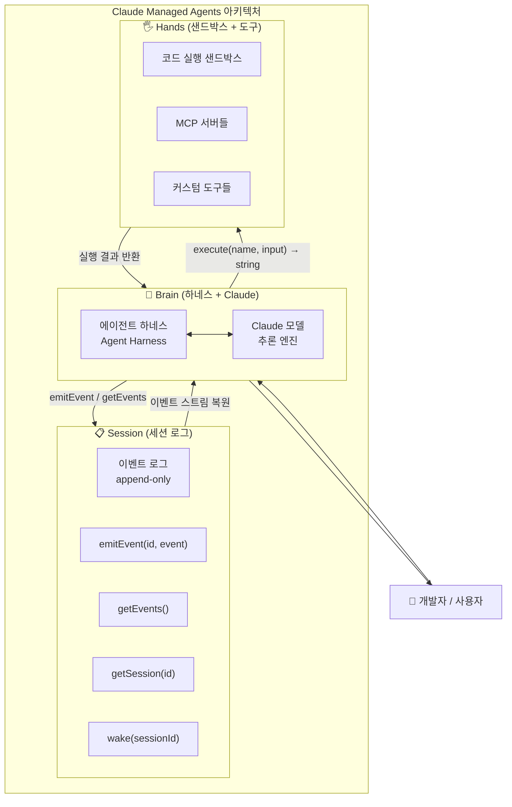
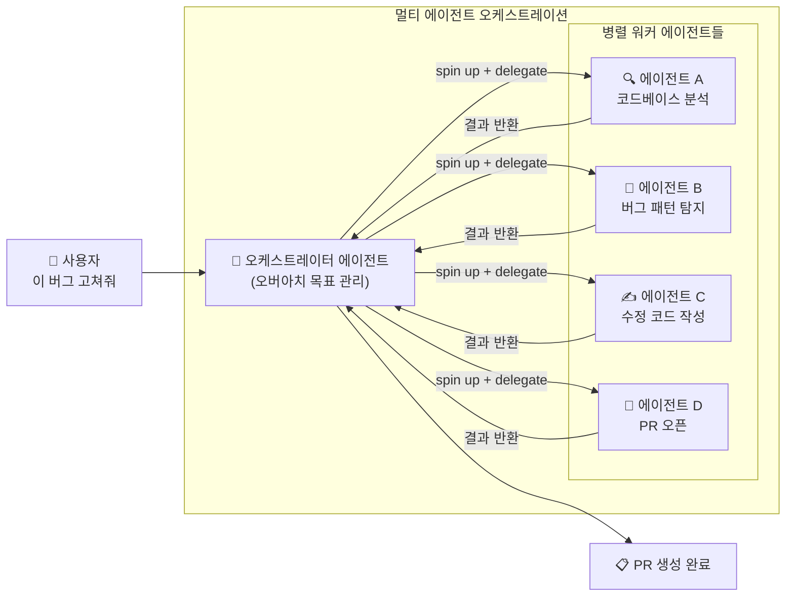
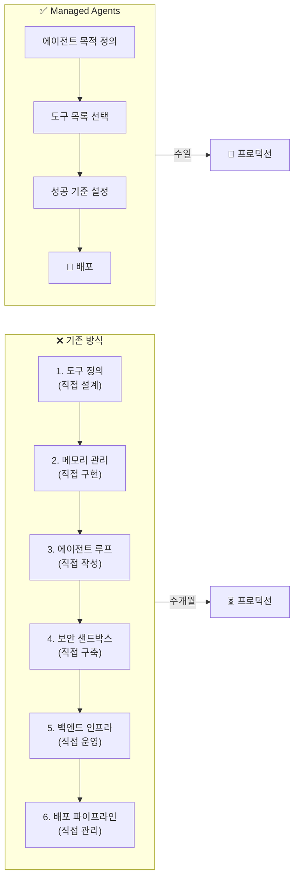
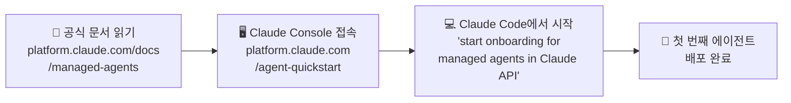

> **발표일:** 2026년 4월 8일  
> **출처:** [공식 발표 블로그](https://claude.com/blog/claude-managed-agents) · [엔지니어링 심층 분석](https://www.anthropic.com/engineering/managed-agents)  
> **현황:** Claude Platform 공개 베타 출시
>
>- **관련글 1** : [Anthropic이 방금 Claude Managed Agents를 출시했습니다](https://www.threads.com/@geumverse_ai/post/DW483kCE1yK)
>- **관련글 2** : [거대한 폭탄을 Anthropic 이 오늘 새벽에 떨어뜨렸습니다](https://www.threads.com/@gonnector/post/DW47Nlfk92t)
>

---

## 1. 무엇이 발표되었나

2026년 4월 8일 새벽, Anthropic은 **Claude Managed Agents**를 공개 베타로 출시했다. 이 발표는 단순한 기능 추가가 아니라, AI 에이전트를 구축하고 배포하는 방식 자체를 근본적으로 바꾸는 인프라 수준의 변화다. 공식 블로그 제목이 "프로덕션에 10배 빠르게"인 것처럼, 핵심 메시지는 속도와 추상화다. 기존에 수개월이 걸리던 에이전트 프로덕션 배포를 며칠 만에 가능하게 한다는 것이 Anthropic의 주장이다.

Managed Agents는 에이전트를 만들려는 개발자가 지금까지 직접 구축해야 했던 인프라 전체를 **관리형 서비스로 제공**한다. 보안 샌드박스, 상태 관리, 인증 체계, 권한 범위 지정, 엔드-투-엔드 추적까지, 에이전트 운영에 필요한 모든 "지루하지만 필수적인" 작업들을 Anthropic이 대신 처리해 준다. 개발자는 오직 에이전트가 무엇을 해야 하는지, 어떤 도구를 쓸 것인지, 어떤 기준으로 성공을 판단할 것인지에만 집중할 수 있다.

---

## 2. 기존 방식의 문제: 왜 에이전트 구축이 어려웠나

Claude Managed Agents가 왜 중요한지 이해하려면, 먼저 기존 방식이 얼마나 복잡했는지를 알아야 한다.

전통적인 에이전트 개발 파이프라인은 마치 빌딩을 짓기 전에 땅부터 평탄화하고, 수도관과 전기를 직접 끌어오는 것과 비슷했다. 도구(tool)를 정의하고, 메모리 관리 로직을 작성하고, 에이전트 루프를 직접 구현하고, 백엔드 서버를 구성하고, 배포 파이프라인을 정비하는 과정이 모두 개발자의 몫이었다. 이 과정에서 발생하는 문제들은 크게 세 가지 범주로 나눌 수 있었다.

**첫째, 인프라 복잡성이다.** 프로덕션 수준의 에이전트를 배포하려면 코드 실행을 위한 샌드박스 환경, 장애 발생 시 복구를 위한 체크포인팅 시스템, 외부 서비스 연동을 위한 자격 증명 관리, 최소 권한 원칙에 따른 권한 범위 설정, 그리고 전체 실행 과정을 기록하는 추적 시스템이 필요하다. 이것들을 직접 구축하는 데만 수개월이 소요된다.

**둘째, 하네스(harness)의 경직성 문제다.** 하네스란 Claude 같은 모델을 실제 작업에 연결하는 오케스트레이션 레이어다. 문제는, 하네스를 만들 때 "Claude가 혼자 할 수 없는 것"에 대한 가정을 내장하게 된다는 점이다. 그런데 모델이 발전하면 이 가정이 낡아버린다. Anthropic 엔지니어링 블로그는 실제 사례를 들어 이를 설명한다. Claude Sonnet 4.5에서는 컨텍스트 한계가 가까워지면 작업을 조기에 마무리하는 "컨텍스트 불안(context anxiety)" 현상이 있었다. 이를 해결하기 위해 하네스에 컨텍스트 리셋 기능을 추가했는데, Claude Opus 4.5에서는 이 행동이 사라져 버렸다. 결국 그 리셋 로직은 불필요한 무게만 추가하는 죽은 코드가 된 것이다.

**셋째, 보안의 구조적 취약성이다.** 기존 단일 컨테이너 구조에서는 Claude가 생성한 코드가 자격 증명과 같은 공간에서 실행된다. 프롬프트 인젝션 공격이 성공하면 Claude가 자신의 환경 변수를 읽어 인증 토큰을 획득할 수 있고, 이를 이용해 무제한 권한을 가진 새 세션을 생성할 수 있다.

---

## 3. 핵심 아키텍처: "뇌와 손의 분리"

Managed Agents의 설계 철학은 **"뇌(brain)와 손(hands)의 분리"** 로 요약된다. 이는 Anthropic 엔지니어링 블로그에서 Lance Martin, Gabe Cemaj, Michael Cohen이 상세히 설명한 개념이다.

### 3.1 세 가지 핵심 인터페이스

Managed Agents는 에이전트의 구성 요소를 세 개의 독립적인 인터페이스로 가상화했다. 이 접근법은 운영체제가 하드웨어를 추상화한 방식과 동일한 철학을 따른다. 1970년대 디스크 팩에서 최신 SSD까지 `read()` 명령이 변하지 않듯, 이 인터페이스들은 내부 구현이 바뀌어도 외부 API가 안정적으로 유지되도록 설계되었다.

**세션(Session)** 은 에이전트가 수행한 모든 것의 추가 전용(append-only) 로그다. 하네스나 샌드박스와 분리되어 독립적으로 존재하기 때문에, 어느 컴포넌트가 장애를 일으켜도 세션 기록은 보존된다. `wake(sessionId)` 명령 하나로 새 하네스가 기존 세션을 이어받아 중단 지점부터 재개할 수 있다.

**하네스(Harness)** 는 Claude를 호출하고, Claude의 도구 호출을 적절한 인프라로 라우팅하며, 오류 복구를 관리하는 오케스트레이션 루프다. 핵심은 하네스가 더 이상 컨테이너 안에 있지 않다는 점이다. 하네스는 어느 컨테이너에도 종속되지 않는 무상태(stateless) 프로세스로, 하네스 자체가 장애를 일으켜도 새 하네스가 세션 로그를 복원해 즉시 작업을 이어갈 수 있다.

**샌드박스(Sandbox)** 는 Claude가 코드를 실행하고 파일을 편집하는 실행 환경이다. 하네스의 관점에서 샌드박스는 그냥 하나의 도구일 뿐이다: `execute(name, input) → string`. 샌드박스가 컨테이너인지, 가상머신인지, 심지어 포켓몬 에뮬레이터인지도 하네스는 알 필요가 없다.

### 3.2 "펫 vs 가축" 문제 해결

Anthropic 엔지니어링 팀은 초기 설계의 핵심 실패를 **"펫(pet)을 키웠다"** 는 비유로 설명한다. 클라우드 인프라 철학에서 "펫"은 이름이 붙어 있고 아프면 치료해야 하며 잃어서는 안 되는 서버를 가리킨다. 반면 "가축(cattle)"은 언제든지 교체 가능한 익명의 자원이다.

초기 Managed Agents 구조에서는 세션, 하네스, 샌드박스가 하나의 컨테이너에 묶여 있었다. 그 컨테이너가 곧 "펫"이 되었다. 컨테이너가 죽으면 세션이 사라지고, 응답이 없으면 엔지니어가 직접 셸에 접속해서 디버깅해야 했다. 하지만 컨테이너에는 사용자 데이터도 있어서 자유롭게 디버깅조차 할 수 없었다.

세 인터페이스를 분리함으로써 이 문제가 구조적으로 해결되었다. 이제 컨테이너는 "가축"이다. 죽으면 새 것으로 교체하면 된다. `provision({resources})` 명령 하나로 표준 레시피를 따라 새 컨테이너가 초기화되고, 세션 로그에서 마지막 상태를 복원해 작업을 이어간다.

### 3.3 보안 아키텍처: 자격 증명의 격리

보안 설계에서 가장 중요한 원칙은 **"Claude가 생성한 코드가 실행되는 샌드박스에서는 자격 증명에 절대 접근할 수 없어야 한다"** 는 것이다.

두 가지 패턴이 이를 보장한다. Git 저장소의 경우, 샌드박스 초기화 시 액세스 토큰을 사용해 저장소를 클론하고, 로컬 git remote에 연결한다. 이후 에이전트는 토큰 자체를 다루지 않고도 `push`와 `pull`을 할 수 있다. 커스텀 도구의 경우, OAuth 토큰을 샌드박스 외부의 보안 볼트에 저장한다. Claude가 MCP 도구를 호출하면 전용 프록시가 중간에 개입해 볼트에서 해당 자격 증명을 가져와 외부 서비스를 호출한다. 하네스는 어떤 자격 증명도 직접 인지하지 않는다.

---

## 4. 주요 기능 상세

### 4.1 프로덕션 등급 에이전트

보안 샌드박싱, 인증, 도구 실행이 모두 서비스 레벨에서 처리된다. 개발자가 별도로 구현해야 할 인프라 레이어가 없다. Claude Code의 최신 버전에서 `claude-api` 스킬을 통해 바로 Managed Agents를 사용할 수 있으며, "start onboarding for managed agents in Claude API"라는 프롬프트만으로 온보딩을 시작할 수 있다.

### 4.2 장기 실행 세션 (Long-running Sessions)

에이전트가 몇 시간 동안 자율적으로 작동할 수 있다. 네트워크 연결이 끊겨도 진행 상황과 출력물이 세션 로그에 보존된다. 이것은 단순한 타임아웃 연장이 아니라, 앞서 설명한 세션 아키텍처 덕분에 가능한 구조적 특성이다.

### 4.3 멀티 에이전트 조율 (Multi-Agent Coordination, 리서치 프리뷰)

에이전트가 복잡한 작업을 병렬화하기 위해 다른 에이전트를 생성하고 지시할 수 있다. 이것이 Managed Agents가 복수형(Agents)인 이유다. 현재는 리서치 프리뷰 단계로 별도 접근 신청이 필요하다.

### 4.4 자기 평가 및 반복 (리서치 프리뷰)

개발자가 성공 기준을 정의하면, Claude가 스스로 평가하고 목표를 달성할 때까지 반복한다. Anthropic 내부 테스트에서 구조화된 파일 생성 작업 기준으로 표준 프롬프트 루프 대비 태스크 성공률이 최대 10포인트 향상되었으며, 특히 난이도가 높은 문제에서 가장 큰 개선이 나타났다.

### 4.5 신뢰할 수 있는 거버넌스

에이전트가 실제 시스템에 접근할 때, 범위가 제한된 권한, 아이덴티티 관리, 실행 추적이 기본으로 제공된다. Claude Console에서는 모든 도구 호출, 결정, 실패 지점을 직접 검사할 수 있다.

---

## 5. 컨텍스트 관리의 혁신

장기 실행 에이전트에서 가장 어려운 문제 중 하나는 컨텍스트 윈도우 관리다. Claude의 컨텍스트 윈도우를 초과하는 장기 작업에서는 무엇을 유지하고 무엇을 버릴지에 대한 비가역적 결정을 내려야 한다.

기존 접근 방식들—요약을 통한 컴팩션, 메모리 파일 쓰기, 선택적 토큰 트리밍—은 모두 "미래에 무엇이 필요할지 알 수 없다"는 근본적 한계를 가진다. 잘못된 컴팩션 결정은 복구 불가능한 정보 손실로 이어진다.

Managed Agents에서 세션은 이 문제를 구조적으로 해결한다. 세션 로그는 컨텍스트 윈도우 외부에 존재하는 영구 저장소다. `getEvents()` 인터페이스를 통해 하네스는 이벤트 스트림의 특정 위치 슬라이스를 선택적으로 가져올 수 있다. 마지막으로 읽었던 지점부터 이어서 읽거나, 특정 시점 직전으로 되감아 맥락을 확인하거나, 특정 액션 전후 상황을 다시 읽는 것이 모두 가능하다. 또한 가져온 이벤트는 Claude의 컨텍스트 윈도우에 전달되기 전에 하네스에서 자유롭게 변환할 수 있어, 높은 프롬프트 캐시 적중률을 위한 컨텍스트 구성 등 다양한 최적화가 가능하다.

---

## 6. 성능 개선: TTFT 혁신

분리 아키텍처는 **Time-to-First-Token(TTFT)**, 즉 세션이 작업을 수락한 후 첫 번째 응답 토큰을 생성하기까지의 시간에 극적인 개선을 가져왔다. TTFT는 사용자가 가장 직접적으로 체감하는 지연이다.

초기 결합 구조에서는 매 세션마다 컨테이너 프로비저닝 비용을 선불로 지불해야 했다. 샌드박스가 필요 없는 세션도 저장소 클론, 프로세스 부팅, 이벤트 대기라는 전체 과정을 거쳐야 했다.

분리 후에는 컨테이너가 `execute(name, input) → string` 도구 호출에 의해서만 프로비저닝된다. 즉, 샌드박스가 즉시 필요하지 않은 세션은 기다리지 않는다. 추론은 오케스트레이션 레이어가 세션 로그에서 대기 이벤트를 가져오는 즉시 시작된다. 결과적으로 **p50 TTFT는 약 60% 감소, p95 TTFT는 90% 이상 감소**했다.

---

## 7. 실제 도입 사례: 프로덕션에서 무슨 일이 일어나고 있나

### Notion: 팀 전체가 협업하는 병렬 에이전트

Notion은 Claude Managed Agents를 통해 사용자가 워크스페이스 안에서 바로 Claude에게 작업을 위임할 수 있는 "Notion Custom Agents"를 구축했다. 현재 비공개 알파로 운영 중이며, 수십 개의 복잡한 태스크가 병렬로 실행되는 동안 팀 전체가 그 결과물에 협업할 수 있다. 코드 작성부터 웹사이트와 프레젠테이션 생성까지, 사용자는 Notion을 떠나지 않고도 광범위한 작업을 에이전트에게 위임한다.

### Rakuten: 일주일 안에 배포된 전문 에이전트들

Rakuten은 영업, 마케팅, 재무, 제품 각 도메인별로 전문화된 에이전트를 구축했다. 이 에이전트들은 Slack과 Teams에 연결되어 직원들이 태스크를 할당하면 스프레드시트, 슬라이드, 앱 같은 실질적인 산출물을 돌려보낸다. 주목할 점은 각 전문 에이전트가 **일주일 안에 배포**되었다는 것이다. Rakuten의 AI 비즈니스 총괄 Yusuke Kaji는 이를 통해 파워 유저들이 단일 전문 분야를 넘어 여러 도메인에 걸쳐 기여하는 "갈릴레오"가 된다고 표현했다.

### Asana: AI 팀원(AI Teammates)

Asana는 Managed Agents를 활용해 "AI Teammates"를 만들었다. 이 에이전트들은 Asana 프로젝트 안에서 실제 팀원처럼 태스크를 맡고, 산출물 초안을 작성하며, 인간 팀원들과 협업한다. Asana의 CTO Amritansh Raghav는 Managed Agents가 고급 기능 개발을 대폭 가속화했으며, 팀이 엔터프라이즈급 멀티플레이어 사용자 경험 구축에 집중할 수 있게 해주었다고 밝혔다.

### Sentry: 버그 발견에서 PR까지 한 번에

Sentry는 기존 Seer 디버깅 에이전트에 Claude Managed Agents 기반의 패치 에이전트를 결합했다. 버그 탐지 → 근본 원인 분석 → 수정 코드 작성 → PR 오픈까지의 전체 흐름이 끊김 없이 이어진다. Sentry의 AI/ML 엔지니어링 시니어 디렉터 Indragie Karunaratne에 따르면, 초기 통합을 **수개월이 아닌 수주** 만에 완성했을 뿐 아니라, 자체 에이전트 인프라 유지보수에 드는 지속적인 운영 부담도 사라졌다.

### Vibecode: AI 네이티브 앱의 기본 인프라

Vibecode는 Managed Agents를 프롬프트에서 배포 앱까지의 기본 통합으로 채택했다. 공동창업자 Ansh Nanda는 이전에는 사용자가 LLM을 샌드박스에서 수동으로 실행하고, 생명주기를 관리하고, 적절한 도구를 갖추고, 실행을 감독하는 데 수주에서 수개월이 걸렸지만, 이제는 몇 줄의 코드로 동일한 인프라를 **최소 10배 빠르게** 구성할 수 있다고 설명했다.

### General Legal & Blockit: 동적 도구 생성과 회의 준비 에이전트

General Legal의 CTO Javed Qadrud-Din은 Managed Agents 덕분에 사전에 모든 사용자 질문을 예상하고 그에 맞는 도구를 미리 만들 필요가 없어졌다고 설명했다. 시스템이 필요한 도구를 즉석에서 코딩해 거의 모든 사용자 쿼리를 처리할 수 있게 되었고, 이는 개발 시간을 10배 단축시켰다. Blockit은 Managed Agents를 활용해 회의 전 모든 참여자를 조사하고 중요한 정보를 사전에 제시하는 회의 준비 에이전트를 구축했으며, 아이디어에서 배포까지 수일 만에 완성했다.

---

## 8. 기존 방식 vs. Managed Agents: 비교

| 항목 | 기존 방식 | Managed Agents |
|------|-----------|----------------|
| 배포 소요 시간 | 수개월 | 수일 |
| 인프라 관리 | 개발자 직접 | Anthropic 위임 |
| 보안 설정 | 직접 구현 | 기본 제공 |
| 장애 복구 | 수동 대응 | 자동 (세션 복원) |
| 모델 업그레이드 | 하네스 재작업 필요 | 인터페이스 유지 |
| 멀티 에이전트 | 복잡한 커스텀 구현 | 기본 지원 |
| TTFT (p95) | 기준값 | 90% 이상 감소 |

---

## 9. 요금 체계

Managed Agents는 소비 기반(consumption-based)으로 과금된다. 표준 Claude Platform 토큰 요금에 더해, 활성 런타임에 대해 **세션-시간당 $0.08**이 부과된다. 전체 요금 세부 사항은 [공식 문서](https://platform.claude.com/docs/en/about-claude/pricing#claude-managed-agents-pricing)에서 확인할 수 있다.

---

## 10. 더 넓은 의미: 에이전트 생태계에 무슨 일이 일어나고 있나

### 10.1 하네스 엔지니어링의 진화

Managed Agents의 등장은 에이전트 개발에서 인간이 집중해야 할 영역이 무엇인지를 명확히 보여준다. 지금까지 하네스 엔지니어링에는 두 가지 역량이 혼재되어 있었다. 하나는 "도구와 루프를 어떻게 연결하는가"라는 구현 역량이고, 다른 하나는 "어떤 데이터와 프로세스를 모델링해야 에이전트가 목표를 달성하는가"라는 도메인 역량이다.

Managed Agents는 전자를 대부분 자동화한다. 결과적으로 **데이터와 프로세스에 대한 깊은 도메인 지식**이 에이전트 설계의 핵심 인간 역할로 남는다. 단순히 하네스를 "조립"할 줄 아는 엔지니어링 지식만으로는 이 저작도구가 계속 고도화되는 환경에서 차별적 가치를 내기 어려워질 것이다.

### 10.2 추상화 레이어의 안정성

Anthropic의 엔지니어링 글에서 반복되는 핵심 메시지는 **"구현이 아닌 인터페이스에 투자하라"** 는 것이다. 모델이 발전하면 하네스의 가정이 낡아진다. 하지만 세션-하네스-샌드박스라는 인터페이스 경계는 안정적으로 유지된다. 이 철학은 수십 년 전 운영체제가 하드웨어를 추상화한 방식과 동일하다.

### 10.3 멀티 에이전트 오케스트레이션의 대중화

이전에는 멀티 에이전트 시스템을 구축하는 것이 매우 높은 기술적 진입 장벽을 가지고 있었다. Managed Agents는 이를 기본 기능으로 제공함으로써, 복잡한 병렬 작업 오케스트레이션이 특수한 팀만의 전유물이 아닌 일반적인 개발 패턴이 되는 시대를 앞당기고 있다.

---

## 11. 시작하기

Managed Agents는 현재 Claude Platform에서 공개 베타로 이용 가능하다.

- **공식 문서:** [platform.claude.com/docs/en/managed-agents/overview](https://platform.claude.com/docs/en/managed-agents/overview)
- **Claude Console:** [platform.claude.com/workspaces/default/agent-quickstart](https://platform.claude.com/workspaces/default/agent-quickstart)
- **멀티 에이전트 리서치 프리뷰 신청:** [claude.com/form/claude-managed-agents](https://claude.com/form/claude-managed-agents)

---

## 요약

Claude Managed Agents는 에이전트 인프라의 복잡성을 Anthropic이 대신 관리해 주는 관리형 서비스다. 세션(이벤트 로그), 하네스(오케스트레이션 루프), 샌드박스(실행 환경)를 독립적인 인터페이스로 분리함으로써, 각 컴포넌트의 장애가 전체 시스템에 전파되지 않고 모델이 발전해도 API 레이어가 안정적으로 유지된다. 프로덕션 도입 팀들은 공통적으로 기존 대비 10배 빠른 배포 속도를 경험하고 있으며, TTFT는 p95 기준 90% 이상 감소했다. 에이전트 개발자에게 남겨진 핵심 역할은 인프라 구현이 아니라 도메인 지식에 기반한 데이터와 프로세스 모델링이다.

---

*작성일: 2026년 4월 9일*  
*출처: [Claude Blog](https://claude.com/blog/claude-managed-agents) · [Anthropic Engineering](https://www.anthropic.com/engineering/managed-agents)*
