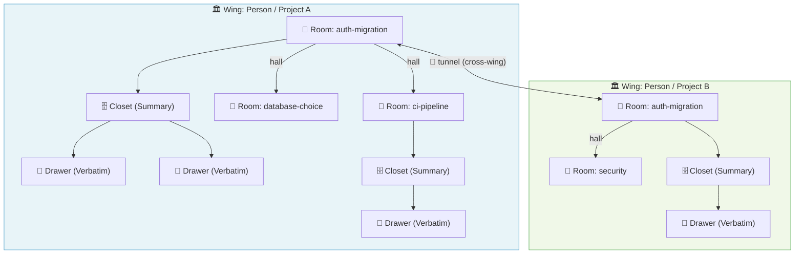
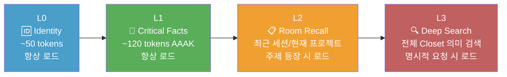
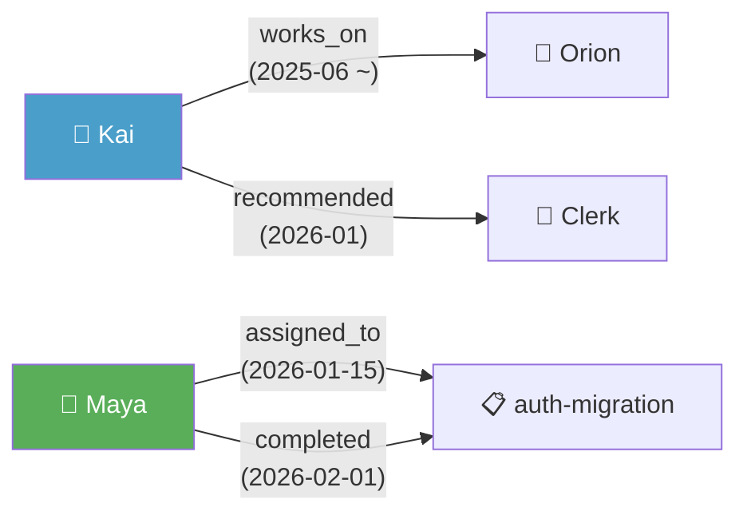

> **작성일**: 2026년 4월 9일  
> **출처**: [GitHub - milla-jovovich/mempalace](https://github.com/milla-jovovich/mempalace) | [mempalace.tech](https://www.mempalace.tech)  
> **버전**: v3.0.0 (2026년 4월 6일 출시)  
> **라이선스**: MIT (무료 오픈소스)

---

## 목차

1. [프로젝트 탄생 배경](#1-프로젝트-탄생-배경)
2. [MemPalace란 무엇인가](#2-mempalace란-무엇인가)
3. [핵심 철학: 왜 기억 궁전인가](#3-핵심-철학-왜-기억-궁전인가)
4. [The Palace: 계층적 아키텍처](#4-the-palace-계층적-아키텍처)
5. [저장 전략: Raw Verbatim의 역설](#5-저장-전략-raw-verbatim의-역설)
6. [4계층 메모리 스택](#6-4계층-메모리-스택)
7. [AAAK 방언: 실험적 압축 레이어](#7-aaak-방언-실험적-압축-레이어)
8. [지식 그래프 (Knowledge Graph)](#8-지식-그래프-knowledge-graph)
9. [MCP 서버 및 19가지 도구](#9-mcp-서버-및-19가지-도구)
10. [벤치마크 성과 및 논란](#10-벤치마크-성과-및-논란)
11. [경쟁 시스템 비교](#11-경쟁-시스템-비교)
12. [설치 및 사용 방법](#12-설치-및-사용-방법)
13. [Claude Code 통합](#13-claude-code-통합)
14. [커뮤니티 반응과 출시 논란](#14-커뮤니티-반응과-출시-논란)
15. [4월 7일 정정 노트: 제작자의 솔직한 고백](#15-4월-7일-정정-노트-제작자의-솔직한-고백)
16. [실전 활용 시나리오](#16-실전-활용-시나리오)
17. [종합 평가](#17-종합-평가)

---

## 1. 프로젝트 탄생 배경

### 밀라 요보비치는 왜 AI 메모리 시스템을 만들었나

영화 《레지던트 이블》과 《제5원소》로 유명한 배우 밀라 요보비치(Milla Jovovich)가 2025년 말부터 AI를 집중적으로 사용하기 시작하면서 한 가지 근본적인 문제에 부딪혔다. 바로 **AI 건망증(AI Amnesia)** 이었다.

대부분의 AI 모델은 대화가 끝나면 이전 맥락을 기억하지 못한다. 수개월에 걸쳐 AI와 함께 문제를 해결하고, 아이디어를 발전시키고, 중요한 결정을 내려왔지만 — 세션이 종료되면 그 모든 것이 사라진다. 다음 대화에서는 처음부터 다시 시작해야 한다.

Mem0, Zep 같은 기존 AI 메모리 솔루션들도 존재했지만, 요보비치는 이것들이 근본적으로 불완전하다고 느꼈다. **AI가 스스로 "중요하다"고 판단하는 것만 저장하고, 나머지는 버려버리기 때문**이다. 예를 들어 AI는 "사용자가 PostgreSQL을 선호한다"는 결론은 저장하지만, 그 선택에 이르기까지의 논의 과정, 비교했던 대안들, 고려했던 트레이드오프 — 이 모든 컨텍스트는 사라진다.

요보비치는 개발자 **벤 시그먼(Ben Sigman)** 과 협력하여 Claude Code를 주력 도구로 삼아 수개월간 이 문제를 해결할 시스템을 개발했다. 그 결과물이 바로 **MemPalace**다.

2026년 4월 5일, 밀라 요보비치는 자신의 GitHub 계정(`github.com/milla-jovovich`)에 직접 코드를 푸시했다. MIT 라이선스. 완전 무료. 48시간 만에 7,000개 이상의 스타를 받았다.

---

## 2. MemPalace란 무엇인가

MemPalace는 한 문장으로 요약하면 이렇다:

> **"모든 것을 저장하고, 찾을 수 있게 만든다."**

기존 메모리 시스템이 "무엇을 기억할 것인가"를 AI가 결정하는 방식이라면, MemPalace는 **모든 대화를 원문 그대로 저장**하고 대신 **계층적 구조**를 통해 나중에 정확하게 검색할 수 있게 한다.

주요 특징을 정리하면 다음과 같다:

- **완전 로컬 실행**: 모든 데이터가 사용자의 기기에만 저장된다. 서버 전송 없음.
- **무료 오픈소스**: MIT 라이선스, 구독료 없음.
- **LongMemEval 96.6%**: 유료 솔루션을 모두 넘어서는 벤치마크 점수 (API 키 불필요).
- **이중 검색 엔진**: ChromaDB(의미 기반) + SQLite(구조 기반) 동시 활용.
- **MCP 호환**: Claude, ChatGPT, Cursor, Gemini 등 모든 MCP 호환 AI에서 사용 가능.
- **Claude Code 플러그인**: 마켓플레이스에서 원클릭 설치 지원.

---

## 3. 핵심 철학: 왜 기억 궁전인가

### 고대 그리스의 기억술과 AI의 만남

프로젝트 이름 "MemPalace"는 고대 그리스 웅변가들이 사용하던 기억 기법인 **기억 궁전(Memory Palace, 또는 Method of Loci)** 에서 직접 따왔다.

기억 궁전 기법은 이렇게 작동한다: 기억해야 할 정보를 상상 속의 건물 각 방에 배치한다. 나중에 그 건물을 머릿속으로 걸어다니면 각 방의 정보를 순서대로 떠올릴 수 있다. 구조가 기억을 가능하게 만드는 것이다.

MemPalace는 이 원리를 그대로 AI 메모리에 적용했다. 대화와 지식을 단순히 플랫(flat)하게 쌓아두는 것이 아니라, **건물의 구조처럼 계층적으로 조직화**함으로써 AI가 "어디서 찾아야 하는지"를 즉시 알 수 있게 만든다.

이것이 핵심 차별점이다. 검색 엔진을 개선하는 것이 아니라, **검색 이전에 구조 자체를 만들어** 검색 공간을 획기적으로 좁히는 것이다.

---

## 4. The Palace: 계층적 아키텍처

MemPalace의 구조는 6가지 개념으로 이루어진다: **Wing, Room, Hall, Closet, Drawer, Tunnel**. 각각을 건물의 비유로 이해하면 직관적이다.

### 구조 개요



### 각 구성 요소 상세 설명

**Wing (날개 / 최상위 단위)**  
Wing은 "사람" 또는 "프로젝트"에 해당하는 최상위 구획이다. 예를 들어 `wing_kai`(팀원 Kai), `wing_driftwood`(프로젝트 Driftwood) 같은 식으로 구분된다. Wing은 필요한 만큼 무제한으로 생성할 수 있다.

**Room (방 / 주제별 공간)**  
각 Wing 내부는 여러 Room으로 나뉜다. Room은 해당 Wing의 특정 주제나 기능 영역을 나타낸다. `auth-migration`, `graphql-switch`, `ci-pipeline` 같은 이름이 붙는다. MemPalace 초기화 시 자동으로 감지되며, 사용자가 직접 커스터마이징할 수도 있다.

**Hall (복도 / Wing 내부 연결)**  
같은 Wing 안에서 서로 관련된 Room들을 연결하는 논리적 통로다. Hall은 고정된 5가지 타입으로 구성되며, 모든 Wing에 동일하게 적용된다:

- `hall_facts`: 결정된 사항, 확정된 선택들
- `hall_events`: 작업 세션, 마일스톤, 디버깅 기록
- `hall_discoveries`: 돌파구, 새로운 인사이트
- `hall_preferences`: 습관, 선호, 의견
- `hall_advice`: 추천 사항과 솔루션

**Closet (서랍장 / 요약 포인터)**  
각 Room에 연결된 요약 레이어다. Closet은 원본 내용으로 바로 이동할 수 있는 포인터 역할을 한다. 현재 버전(v3.0.0)에서는 일반 텍스트 요약으로 구성되며, 향후 업데이트에서 AAAK 압축이 적용될 예정이다.

**Drawer (서랍 / 원본 저장소)**  
실제 대화 내용이 원문 그대로 저장되는 공간이다. 요약되거나 편집되지 않는다. ChromaDB에 임베딩 벡터와 함께 보관된다.

**Tunnel (터널 / Wing 간 연결)**  
서로 다른 Wing에 같은 이름의 Room이 존재할 때 자동으로 생성되는 교차 연결이다. 예를 들어 `wing_kai`와 `wing_driftwood` 양쪽에 `auth-migration` Room이 있다면, 터널이 이 둘을 연결해 한 번의 검색으로 두 Wing의 관련 정보를 모두 가져올 수 있다.

### 구조가 성능에 미치는 영향

22,000개 이상의 실제 대화 메모리를 대상으로 측정한 검색 정확도:

| 검색 방식 | R@10 | 향상 |
|---|---|---|
| 전체 Closet 검색 (무필터) | 60.9% | 기준선 |
| Wing 필터 적용 | 73.1% | +12% |
| Wing + Hall 필터 적용 | 84.8% | +24% |
| Wing + Room 필터 적용 | **94.8%** | **+34%** |

Wing과 Room 구조는 단순한 UI 요소가 아니다. 검색 정확도를 34%포인트 끌어올리는 핵심 엔진이다.

---

## 5. 저장 전략: Raw Verbatim의 역설

### "단순한 것이 이겼다"

MemPalace의 가장 반직관적인 발견은 이것이다: **원문 그대로 저장하는 것이 AI가 요약·추출한 것보다 훨씬 높은 검색 정확도를 보인다**.

기존 메모리 시스템(Mem0, Zep 등)은 대화에서 중요한 정보를 LLM이 추출한 다음 그것만 저장한다. 이 접근법의 문제는 **추출 과정에서 필연적으로 정보가 손실**된다는 것이다. "사용자가 PostgreSQL을 선호한다"는 결론은 남지만, 왜 그런 결론에 이르렀는지, 어떤 대안을 고려했는지, 어떤 트레이드오프를 감수했는지 — 이 모든 컨텍스트는 사라진다.

MemPalace의 접근법은 정반대다: **모든 교환 내용을 ChromaDB에 원문 그대로 저장**한다. LLM이 "무엇이 중요한가"를 판단하는 단계를 완전히 제거한다. 대신 의미 기반 검색(semantic search)이 필요할 때 적절한 내용을 찾아준다.

벤치마크 문서에는 이 발견이 이렇게 기술되어 있다:

> "아무도 이 결과를 발표하지 않았던 이유는 아무도 단순한 방법을 시도해보고 제대로 측정하지 않았기 때문이다. 분야 전체가 메모리 추출 단계를 과도하게 엔지니어링하고 있었다."

### 비용 비교: 6개월치 AI 대화를 기억하는 법

하루 AI를 사용하면 약 1만 토큰의 대화가 생성된다. 6개월이면 약 1,950만 토큰에 달한다. 이를 처리하는 방식별 비용:

| 방식 | 토큰 로드량 | 연간 비용 |
|---|---|---|
| 전부 붙여넣기 | 1,950만 (불가능) | 불가능 |
| LLM 요약 | 약 65만 토큰 | 약 $507/년 |
| **MemPalace wake-up** | **약 170 토큰** | **약 $0.70/년** |
| **MemPalace + 검색 5회** | **약 13,500 토큰** | **약 $10/년** |

---

## 6. 4계층 메모리 스택

MemPalace는 메모리를 4개의 레이어로 구조화한다. AI가 세션을 시작할 때 L0와 L1은 항상 자동 로드되고, L2와 L3는 필요할 때만 호출된다.



**L0 — Identity (~50 토큰, 항상 로드)**  
이 AI가 누구인지 정의하는 최소한의 신원 정보. 항상 컨텍스트에 포함된다.

**L1 — Critical Facts (~120 토큰, 항상 로드)**  
팀원, 프로젝트, 핵심 선호사항 등 가장 자주 참조되는 사실들. AAAK 압축 포맷으로 저장되어 최소 토큰으로 최대 정보를 전달한다. AI는 세션 시작 시 L0+L1 합쳐 약 170 토큰만으로 사용자의 전체 세계를 파악한다.

**L2 — Room Recall (온디맨드)**  
현재 진행 중인 프로젝트나 최근 세션과 관련된 기억. 특정 주제가 대화에 등장할 때 자동으로 로드된다.

**L3 — Deep Search (온디맨드)**  
전체 Closet을 대상으로 한 의미 기반 검색. 사용자가 명시적으로 무언가를 찾을 때만 실행된다.

---

## 7. AAAK 방언: 실험적 압축 레이어

### AAAK가 무엇인가

AAAK(발음: "아악")는 반복되는 엔티티와 관계를 더 적은 토큰으로 표현하기 위해 설계된 **손실 압축 방언**이다. 엔티티 코드, 구조 마커, 문장 단축을 조합해서 만든다.

중요한 특징은 AAAK가 **특별한 디코더 없이 모든 LLM이 읽을 수 있다**는 것이다. Claude, GPT, Gemini, Llama, Mistral — 텍스트를 읽을 수 있는 어떤 모델이든 AAAK를 이해할 수 있다. 일종의 "매우 압축된 영어"이기 때문이다.

### 솔직한 현황 (2026년 4월 기준)

제작자들이 4월 7일 README를 직접 수정하며 공개한 정직한 상태:

- **AAAK는 손실 압축이다**, 무손실이 아니다.
- **소규모 텍스트에서는 토큰을 절약하지 못한다**. 짧은 텍스트는 이미 효율적으로 토큰화되기 때문에 AAAK 오버헤드(코드, 구분자)가 더 많은 토큰을 쓴다.
- **대규모에서는 효과적이다**: 동일한 팀원이 수백 번, 동일한 프로젝트가 수천 세션에 걸쳐 언급될 때 엔티티 코드가 압축 효과를 발휘한다.
- **현재 LongMemEval에서 역행한다**: AAAK 모드는 84.2% R@5, Raw 모드는 96.6% R@5. **96.6% 헤드라인 수치는 AAAK가 아닌 Raw 모드에서 나온 것이다.**

AAAK는 현재 개발 중인 실험적 기능이다. Issue #43과 #27에서 진행 상황을 추적할 수 있다.

---

## 8. 지식 그래프 (Knowledge Graph)

MemPalace는 단순 벡터 검색을 넘어 **시간 기반 엔티티-관계 트리플** 구조의 지식 그래프를 내장하고 있다. Zep의 Graphiti와 유사하지만 Neo4j 대신 SQLite를 사용해 완전 로컬로 작동한다.

```python
from mempalace.knowledge_graph import KnowledgeGraph

kg = KnowledgeGraph()
kg.add_triple("Kai", "works_on", "Orion", valid_from="2025-06-01")
kg.add_triple("Maya", "assigned_to", "auth-migration", valid_from="2026-01-15")
kg.add_triple("Maya", "completed", "auth-migration", valid_from="2026-02-01")

# 현재 Kai가 뭘 하고 있나?
kg.query_entity("Kai")
# → [Kai → works_on → Orion (현재), Kai → recommended → Clerk (2026-01)]

# 1월에는 어땠나? (시간 여행 쿼리)
kg.query_entity("Maya", as_of="2026-01-20")
# → [Maya → assigned_to → auth-migration (활성)]
```

각 사실에는 유효 기간이 있다. 더 이상 사실이 아닐 때 무효화(invalidate)하면, 그 이후의 쿼리에서는 등장하지 않지만 과거 시점의 쿼리에서는 여전히 보인다.



---

## 9. MCP 서버 및 19가지 도구

MemPalace는 19개의 MCP 도구를 통해 Claude, ChatGPT, Cursor 등 MCP 호환 AI와 연동된다. AI가 자동으로 도구를 호출하기 때문에 사용자는 `mempalace search` 명령을 직접 입력할 필요가 없다.

### 궁전 읽기 도구 (7개)

| 도구 | 기능 |
|---|---|
| `mempalace_status` | 궁전 전체 개요 + AAAK 스펙 + 메모리 프로토콜 |
| `mempalace_list_wings` | 전체 Wing 목록과 개수 |
| `mempalace_list_rooms` | 특정 Wing 내 Room 목록 |
| `mempalace_get_taxonomy` | Wing → Room → 개수 전체 트리 |
| `mempalace_search` | Wing/Room 필터 포함 의미 기반 검색 |
| `mempalace_check_duplicate` | 저장 전 중복 확인 |
| `mempalace_get_aaak_spec` | AAAK 방언 참조 문서 |

### 궁전 쓰기 도구 (2개)

| 도구 | 기능 |
|---|---|
| `mempalace_add_drawer` | 원문 내용 Drawer에 저장 |
| `mempalace_delete_drawer` | ID로 Drawer 삭제 |

### 지식 그래프 도구 (5개)

| 도구 | 기능 |
|---|---|
| `mempalace_kg_query` | 시간 필터 포함 엔티티 관계 조회 |
| `mempalace_kg_add` | 새 사실 추가 |
| `mempalace_kg_invalidate` | 사실 만료 처리 |
| `mempalace_kg_timeline` | 엔티티의 시간순 스토리 |
| `mempalace_kg_stats` | 그래프 통계 |

### 내비게이션 도구 (3개)

| 도구 | 기능 |
|---|---|
| `mempalace_traverse` | 특정 Room에서 Wing 간 그래프 탐색 |
| `mempalace_find_tunnels` | 두 Wing을 연결하는 Room 탐색 |
| `mempalace_graph_stats` | 그래프 연결성 통계 |

### 에이전트 다이어리 도구 (2개)

| 도구 | 기능 |
|---|---|
| `mempalace_diary_write` | AAAK 다이어리 항목 작성 |
| `mempalace_diary_read` | 최근 다이어리 항목 읽기 |

---

## 10. 벤치마크 성과 및 논란

### LongMemEval이란

LongMemEval은 AI 메모리 시스템의 성능을 측정하는 학술 벤치마크로, 5가지 기준으로 평가한다: 정보 추출, 멀티세션 추론, 시간적 추론, 지식 업데이트, 기권(abstention). 500개의 질문으로 구성된다.

### 공식 벤치마크 결과

| 벤치마크 | 모드 | 점수 | API 호출 |
|---|---|---|---|
| **LongMemEval R@5** | Raw (ChromaDB만) | **96.6%** | 0회 |
| **LongMemEval R@5** | Hybrid + Haiku 리랭크 | **100% (500/500)** | ~500회 |
| **LoCoMo R@10** | Raw, 세션 레벨 | **60.3%** | 0회 |
| 개인 궁전 R@10 | 휴리스틱 벤치 | 85% | 0회 |
| 구조 효과 | Wing+Room 필터링 | +34% R@10 향상 | 0회 |

### 논란의 시작: 100% vs 96.6%

출시 초기 README에는 "LongMemEval 100% 달성, 세계 최초"라고 기재되었다. 개발자 커뮤니티는 즉각 이 주장을 검증하기 시작했다. GitHub Issues #27과 #29가 기술적 논쟁의 진원지가 되었다.

커뮤니티가 제기한 핵심 문제들:

- **top-k=50 사용**: 100% 결과는 top-k=50(세션 수를 초과하는 값)을 사용해 달성한 것으로, 실질적인 검색이 아닌 "전부 가져오기"에 가까웠다. 의미 있는 수치는 top-k=10에서의 결과다.
- **AAAK 토큰 계산 오류**: 실제 토크나이저 대신 휴리스틱(`len(text)//3`)을 사용해 토큰 수를 계산했다. OpenAI 토크나이저로 실측하면 영문 예시가 66 토큰, AAAK 예시가 73 토큰으로, AAAK가 오히려 더 많은 토큰을 쓴다.
- **"+34% 궁전 부스트" 과장**: 메타데이터 필터링을 적용한 것으로, ChromaDB의 표준 기능이지 MemPalace 고유의 기술적 혁신이 아니다.
- **모순 감지 기능 미구현**: README에는 자동 모순 감지가 구현된 것처럼 기재되었으나, 실제로는 별도 유틸리티(`fact_checker.py`)만 존재하며 지식 그래프에 연동되지 않은 상태였다.

한편으로, M2 Ultra 기기에서 5분 이내에 독립적으로 재현한 사용자(@gizmax)가 96.6% 결과를 확인해줬다. 96.6% 수치 자체는 실제다.

---

## 11. 경쟁 시스템 비교

### LongMemEval 성능 비교

| 시스템 | LongMemEval R@5 | API 필요 여부 | 월 비용 |
|---|---|---|---|
| **MemPalace (hybrid)** | **100%** | 선택적 | **무료** |
| Supermemory ASMR | ~99% | 필요 | 별도 |
| **MemPalace (raw)** | **96.6%** | **불필요** | **무료** |
| Mastra | 94.87% | 필요 (GPT) | API 비용 |
| Mem0 | ~85% | 필요 | $19~249/월 |
| Zep | ~85% | 필요 | $25/월+ |

### 지식 그래프 기능 비교

| 기능 | MemPalace | Zep (Graphiti) |
|---|---|---|
| 스토리지 | SQLite (로컬) | Neo4j (클라우드) |
| 비용 | 무료 | $25/월+ |
| 시간적 유효성 | 지원 | 지원 |
| 자체 호스팅 | 항상 가능 | 엔터프라이즈만 |
| 데이터 주권 | 완전 로컬 | SOC 2, HIPAA |

### 에이전트 메모리 비용 비교

Letta는 에이전트 관리형 메모리에 $20~200/월을 청구한다. MemPalace는 Wing 하나로 동일한 기능을 무료로 제공한다.

---

## 12. 설치 및 사용 방법

### 요구사항

- Python 3.9 이상
- `chromadb>=0.4.0`
- `pyyaml>=6.0`
- API 키 불필요
- 설치 후 인터넷 연결 불필요

### 기본 설치 및 초기화

```bash
pip install mempalace

# 프로젝트 초기화 (Wing 설정, AAAK 부트스트랩 생성)
mempalace init ~/projects/myapp
```

### 데이터 수집 (Mining)

```bash
# 프로젝트 파일 수집
mempalace mine ~/projects/myapp

# 대화 내보내기 수집 (Claude, ChatGPT, Slack)
mempalace mine ~/chats/ --mode convos

# Wing 태그와 함께 수집 + 자동 분류
mempalace mine ~/chats/ --mode convos --extract general
```

`general` 모드는 대화를 자동으로 결정(decisions), 선호(preferences), 마일스톤(milestones), 문제(problems), 감정적 맥락(emotional context)으로 분류한다.

### 검색

```bash
# 전체 검색
mempalace search "왜 GraphQL로 전환했나"

# Wing 내에서 검색
mempalace search "데이터베이스 결정" --wing orion

# Room 내에서 검색
mempalace search "인증 방식" --room auth-migration
```

### 컨텍스트 로딩 (Wake-up)

```bash
# L0 + L1 컨텍스트 로드 (약 170 토큰)
mempalace wake-up

# 특정 프로젝트 컨텍스트로 로드
mempalace wake-up --wing myproject
```

### 대규모 파일 분할

일부 대화 내보내기 파일은 여러 세션이 하나의 대용량 파일에 합쳐져 있다:

```bash
mempalace split ~/chats/                       # 세션별로 분리
mempalace split ~/chats/ --dry-run             # 미리보기
mempalace split ~/chats/ --min-sessions 3      # 3개 이상 세션만 분리
```

---

## 13. Claude Code 통합

### 마켓플레이스 설치 (권장)

```bash
claude plugin marketplace add milla-jovovich/mempalace
claude plugin install --scope user mempalace
```

Claude Code 재시작 후 `/skills`를 입력해 "mempalace"가 표시되면 설치 완료다.

### 자동 저장 훅

Claude Code가 대화 중 자동으로 메모리를 저장하도록 훅을 설정할 수 있다:

```json
{
  "hooks": {
    "Stop": [{
      "matcher": "",
      "hooks": [{
        "type": "command",
        "command": "/path/to/mempalace/hooks/mempal_save_hook.sh"
      }]
    }],
    "PreCompact": [{
      "matcher": "",
      "hooks": [{
        "type": "command",
        "command": "/path/to/mempalace/hooks/mempal_precompact_hook.sh"
      }]
    }]
  }
}
```

- **Save Hook**: 15개 메시지마다 트리거. 주제, 결정, 인용문, 코드 변경사항을 구조화해서 저장.
- **PreCompact Hook**: 컨텍스트 압축 전에 트리거. 창이 줄어들기 전 비상 저장.

### 전문 에이전트 설정

여러 전문 에이전트를 정의하고 각각 독립적인 메모리를 유지할 수 있다:

```
~/.mempalace/agents/
  ├── reviewer.json       # 코드 품질, 패턴, 버그 전문
  ├── architect.json      # 설계 결정, 트레이드오프 전문
  └── ops.json            # 배포, 장애, 인프라 전문
```

CLAUDE.md에는 단 한 줄만 추가하면 된다:

```
You have MemPalace agents. Run mempalace_list_agents to see them.
```

에이전트가 50개로 늘어도 CLAUDE.md 크기는 변하지 않는다.

---

## 14. 커뮤니티 반응과 출시 논란

MemPalace 출시는 AI와 개발자 커뮤니티에서 동시에 화제가 된 희귀한 사례였다.

**바이럴 확산**: 2026년 4월 6일 출시 후 48시간 만에 7,000개 이상의 GitHub 스타를 획득했다. 현재(4월 9일 기준) 26,900개 스타, 3,300개 포크. Ben Sigman의 런치 트윗은 150만 임프레션을 돌파했다.

**셀러브리티 효과와 냉소**: "《레지던트 이블》의 그 밀라 요보비치가 GitHub 계정을 가지고 있다", "내 2026년 빙고 카드에는 없었던 일" 같은 반응이 쏟아졌다. 기술 평론가 Brian Roemmele는 트윗에 그치지 않고 자신의 The Zero-Human Company 직원 79명에게 실제 배포했다.

**기술적 비판**: HackerNews 스레드에서 벤치마크 방법론에 대한 심층 분석이 이루어졌다. 일부는 benchmark 파이프라인의 실제 구현을 들여다봤고, 다른 일부는 "GitHub 이슈를 심사하는 상대가 좀비와 싸운 여배우라는 사실이 믿기지 않는다"는 반응을 보였다.

**HackerNews의 한 논평**이 이 상황을 잘 요약한다:
> "벤치마크는 논쟁의 여지가 있다. 아키텍처는 흥미롭다. 밀라 요보비치의 레포지토리에 올라온 GitHub 이슈를 내가 리뷰하고 있다는 사실은... 오늘 전혀 예상하지 못했던 일이다."

---

## 15. 4월 7일 정정 노트: 제작자의 솔직한 고백

출시 48시간 후, 밀라 요보비치와 Ben Sigman은 README에 직접 수정 사항을 공개했다. AI 업계에서 보기 드문 수준의 솔직함이었다.

### 잘못된 사항

**AAAK 토큰 예시 오류**: 실제 토크나이저 대신 대략적인 휴리스틱(`len(text)//3`)을 사용했다. OpenAI 토크나이저로 측정하면 영어 예시 66 토큰, AAAK 예시 73 토큰으로 AAAK가 더 많다.

**"30배 무손실 압축" 과장**: AAAK는 손실 압축 시스템이다. 독립 벤치마크에서 AAAK 모드는 84.2%, Raw 모드는 96.6%로 12.4%포인트 역행한다.

**"+34% 궁전 부스트" 오해의 소지**: 이 수치는 메타데이터 필터링을 적용한 것으로, ChromaDB의 표준 기능을 활용한 것이다. 실제로 유용하지만 MemPalace만의 고유한 기술은 아니다.

**모순 감지 미구현**: `fact_checker.py`가 지식 그래프에 연동되지 않은 상태였다.

**"Haiku 리랭크로 100%"**: 결과 파일은 존재하지만 리랭크 파이프라인이 공개 벤치마크 스크립트에 포함되지 않았다.

### 여전히 사실인 사항

- **Raw 모드에서 LongMemEval R@5 96.6%**, 500개 질문, API 호출 0회. M2 Ultra에서 5분 이내 독립 재현 확인.
- 완전 로컬, 무료, 구독 없음, 클라우드 없음.
- 아키텍처(Wings, Rooms, Closets, Drawers)는 실제로 작동하며 유용하다.

### 개선 계획

1. 실제 토크나이저를 사용한 AAAK 예시 재작성
2. Raw/AAAK/Rooms 모드별 트레이드오프를 벤치마크 문서에 명시
3. `fact_checker.py`를 KG 작업에 연동
4. ChromaDB 버전 고정(Issue #100), 훅의 셸 인젝션 수정(Issue #110), macOS ARM64 세그폴트 수정(Issue #74)

---

## 16. 실전 활용 시나리오

### 시나리오 1: 솔로 개발자가 여러 프로젝트를 관리하는 경우

```bash
# 각 프로젝트의 대화를 Wing별로 수집
mempalace mine ~/chats/orion/  --mode convos --wing orion
mempalace mine ~/chats/nova/   --mode convos --wing nova
mempalace mine ~/chats/helios/ --mode convos --wing helios

# 6개월 뒤: "왜 여기서 Postgres를 썼지?"
mempalace search "데이터베이스 결정" --wing orion
# → "동시 쓰기와 10GB 초과 데이터셋 때문에 SQLite 대신 Postgres 선택.
#    2025-11-03에 결정."

# 프로젝트 간 교차 검색
mempalace search "rate limiting 접근법"
# → Orion과 Nova 양쪽의 방식을 찾아서 차이점을 보여줌
```

### 시나리오 2: 팀 리드가 제품을 관리하는 경우

```bash
# Slack 내보내기와 AI 대화 수집
mempalace mine ~/exports/slack/ --mode convos --wing driftwood

# "Soren이 지난 스프린트에 뭘 했지?"
mempalace search "Soren sprint" --wing driftwood
# → 14개 Closet: OAuth 리팩터, 다크 모드, 컴포넌트 라이브러리 마이그레이션

# "Clerk 도입은 누가 결정했나?"
mempalace search "Clerk 결정" --wing driftwood
# → "Kai가 가격과 개발자 경험으로 Auth0 대신 Clerk 추천.
#    팀 동의 2026-01-15. Maya가 마이그레이션 담당."
```

### 시나리오 3: [RummiArena](https://github.com/k82022603/RummiArena)/LxM 같은 AI 오케스트레이션 프로젝트에서의 활용

다수의 AI 에이전트가 협업하는 프로젝트에서 MemPalace는 특히 강력하다:

- 각 에이전트(리뷰어, 아키텍트, 옵스)가 독립적인 Wing과 다이어리를 갖는다.
- 크로스 Wing 터널로 에이전트 간 공유 컨텍스트를 연결한다.
- 6개월간의 CI/CD 결정, 아키텍처 논의, 보안 취약점 발견 기록이 모두 구조화되어 보존된다.
- Claude Code 훅으로 세션이 끝날 때 자동 저장된다.

---

## 17. 종합 평가

### 진짜로 혁신적인 것

MemPalace의 핵심 발견은 기술적으로 진지하게 받아들일 필요가 있다. "원문 그대로 저장하는 것이 AI 추출보다 낫다"는 통찰은 반직관적이지만, 벤치마크 결과가 뒷받침한다. 그리고 이 결과는 독립적으로 재현되었다.

기억 궁전 은유를 AI 메모리에 적용한 계층 구조도 단순한 마케팅이 아니다. 구조가 실제로 검색 정확도를 34%포인트 향상시킨다는 데이터가 있다.

완전 로컬, 무료, MIT 라이선스라는 조합도 강력하다. Mem0나 Zep에 월 수십 달러를 내는 것과 비교하면, AI 메모리의 접근성을 근본적으로 바꾸는 프로젝트다.

### 한계와 주의사항

현재 시점에서 주의해야 할 사항:

- AAAK 압축은 아직 실험적이다. 현재로선 Raw 모드가 더 높은 정확도를 보인다.
- 모순 감지 기능이 아직 실제로 작동하지 않는다.
- macOS ARM64 세그폴트 버그가 미해결 상태다.
- ChromaDB 버전 고정 문제가 있어 특정 환경에서 설치가 복잡할 수 있다.

### 기술 선택에 대한 메모

Python 환경이 있고 ChromaDB 설치에 익숙한 개발자라면 지금 바로 시도해볼 만하다. Claude Code를 주력으로 쓰고 있다면 플러그인 통합이 특히 매력적이다. `mempalace init`으로 시작해서 기존 Claude/ChatGPT 대화를 `--mode convos`로 수집하는 것이 가장 빠른 진입 경로다.

---

## 참고 자료

- GitHub 레포지토리: https://github.com/milla-jovovich/mempalace
- 독립 리소스 허브: https://www.mempalace.tech
- 벤치마크 상세: https://github.com/milla-jovovich/mempalace/blob/main/benchmarks/BENCHMARKS.md
- Decrypt 기사: https://decrypt.co/363524/fifth-element-milla-jovovich-ai-tool-mempalace
- Cybernews 분석: https://cybernews.com/ai-news/milla-jovovich-mempalace-memory-tool/
- 탄생 스토리 전문: https://www.mempalace.tech/story

---

*이 문서는 GitHub README, 공식 벤치마크 문서, mempalace.tech 및 다수의 기술 미디어 보도를 바탕으로 작성되었습니다. 2026년 4월 9일 기준 정보입니다.*
