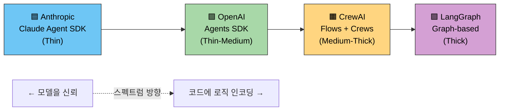
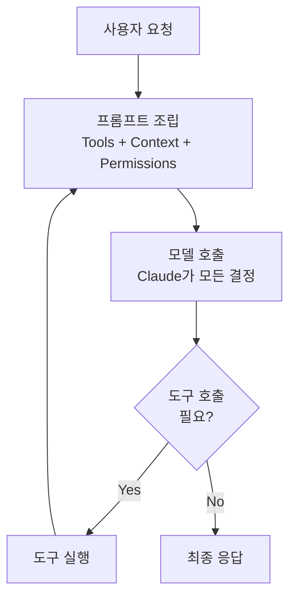
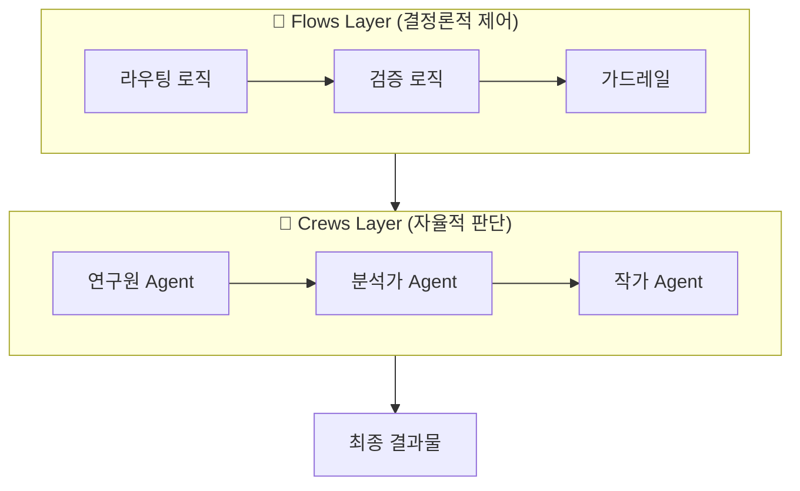
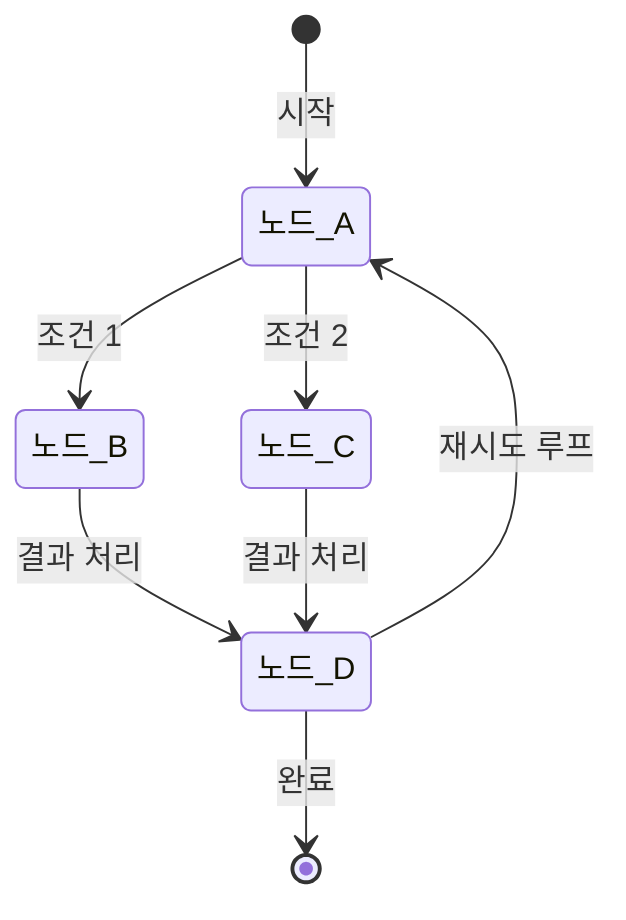
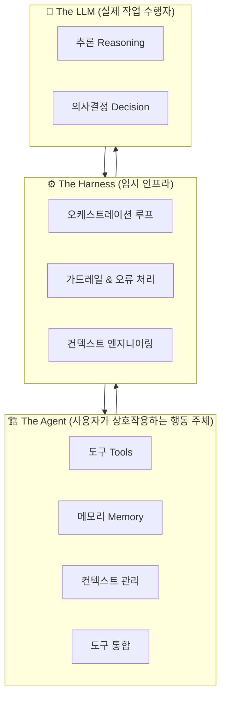
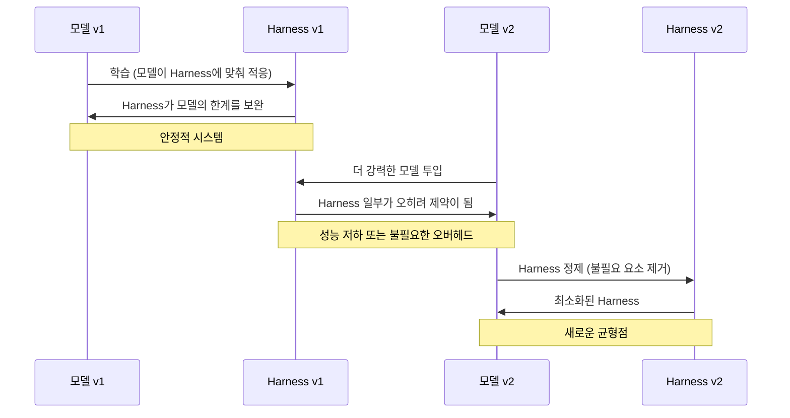

> **"모델이 제품이 아니다. 모델을 둘러싼 인프라가 제품이다."**  
> — Akshay Pachaar ([@akshay_pachaar](https://x.com/akshay_pachaar/status/2042586319390674994)), 2026

---

## 목차

1. [개요: 왜 Harness인가?](#1-개요)
2. [핵심 개념: Thin vs Thick Harness 스펙트럼](#2-thin-vs-thick)
3. [4대 플레이어의 아키텍처 철학](#3-4대-플레이어)
4. [건축 비계(Scaffolding) 메타포](#4-scaffolding-메타포)
5. [Harness의 핵심 구성 요소](#5-harness-구성-요소)
6. [모델과 Harness의 공진화 문제](#6-공진화-문제)
7. [미래 지향적 설계 원칙](#7-설계-원칙)
8. [2026년 현재의 생태계 현황](#8-생태계-현황)
9. [아키텍트를 위한 실무 시사점](#9-실무-시사점)

---

## 1. 개요: 왜 Harness인가?

AI 에이전트 시대가 본격화되면서, "어떤 모델을 쓰느냐"보다 "모델을 어떻게 감싸느냐"가 더 중요한 질문이 되었다. 이 감싸는 구조물이 바로 **Agent Harness**다.

Harness는 단순히 프롬프트를 조립하는 것 이상의 역할을 한다. 상태 비저장(stateless) LLM을 장기간 실행 가능한 에이전트로 변환하기 위한 모든 인프라 — 도구 호출, 메모리 관리, 오케스트레이션 루프, 오류 처리, 컨텍스트 엔지니어링 — 를 포함한다.

**핵심 통찰:** 동일한 기반 모델, 동일한 가중치를 사용하더라도 Harness 설계에 따라 성능 차이는 극적으로 달라진다. LangChain이 동일한 모델로 TerminalBench 2.0에서 상위 30위 밖에서 5위로 뛰어오른 것은 모델이 아니라 Harness를 바꿨기 때문이다. 이것이 Harness 엔지니어링이 현재 AI 아키텍처에서 가장 중요한 베팅이 된 이유다.

---

## 2. Thin vs Thick Harness 스펙트럼

아래 다이어그램은 현재 주요 프레임워크들이 Thin-Thick 스펙트럼 위 어디에 위치하는지를 보여준다.



이 스펙트럼은 단순한 기술적 선택이 아니다. 이것은 **"미래에 모델이 얼마나 더 똑똑해질 것인가"에 대한 아키텍처적 베팅**이다.

- **Thin Harness**를 선택하는 팀은 "모델이 점점 더 나아질 것이므로, 우리가 코드에 박아넣는 로직은 곧 불필요해진다"고 믿는다.
- **Thick Harness**를 선택하는 팀은 "현재 모델의 한계를 코드로 보완해야 신뢰할 수 있는 시스템이 만들어진다"고 믿는다.

모델이 개선될수록 **두 접근법의 최적점은 Thin 방향으로 이동**한다. 이것이 위 이미지에서 "As models improve, the bar shifts left"가 의미하는 바다.

---

## 3. 4대 플레이어의 아키텍처 철학

### 3.1 Anthropic — "모델을 신뢰하라"

Anthropic의 Claude Agent SDK는 의도적으로 얇게(thin) 설계되어 있다. 내부에서 "dumb loop"라고 부르는 이 구조는 다음과 같이 작동한다:

1. **프롬프트 조립** (컨텍스트, 도구 목록, 권한 정보를 담아서)
2. **모델 호출** (모델이 모든 판단을 내린다)
3. **도구 실행** (모델이 요청한 도구를 실행)
4. **반복** (결과를 다시 컨텍스트에 담아 1번으로)

Harness는 단지 턴(turn)을 관리할 뿐, 의사결정 로직은 모델에 위임된다. Anthropic의 엔지니어들은 Claude Code의 harness에서 정기적으로 계획 수립 단계(planning steps)를 삭제한다. 새 모델 버전이 그 기능을 내부적으로 처리할 수 있게 될 때마다, 해당 harness 로직은 제거된다.

**Anthropic의 베팅:** 더 강력한 모델을 만들수록 더 적은 인프라가 필요하다.



### 3.2 OpenAI — "코드 우선, 그러나 구조 있게"

OpenAI의 Agents SDK는 Anthropic보다 약간 두꺼운(thicker) 접근법을 취한다. "코드 우선(code-first)" 철학에 따라 워크플로우 로직은 그래프 DSL이 아닌 네이티브 Python으로 작성된다. 여기에 다음 요소들이 추가된다:

- **엄격한 우선순위 스택(Priority Stack):** 여러 에이전트의 지시 사항이 충돌할 때 처리하는 규칙
- **다중 오케스트레이션 모드:** 다양한 에이전트 협업 패턴 지원
- **명시적 에이전트 핸드오프 패턴:** 에이전트 간 작업 전달을 코드 레벨에서 정의

OpenAI SDK의 다섯 가지 기본 프리미티브는 다음과 같다: Agents, Handoffs, Guardrails, Sessions, Tracing. 이것이 전부다. 단순하지만, Anthropic보다는 더 많은 구조를 사전에 정의한다.

### 3.3 CrewAI — "자율성과 제어의 하이브리드"

CrewAI는 두 레이어를 분리하는 독특한 아키텍처를 채택한다:

- **Flows 레이어:** 라우팅과 검증을 하드코딩된 로직으로 처리하는 결정론적(deterministic) 백본
- **Crews 레이어:** 자율적 판단이 필요한 부분을 LLM에게 위임하는 비결정론적 영역

역할 기반(role-based) 접근법을 통해 에이전트에게 연구원, 작가, 분석가 같은 역할과 목표, 도구를 부여하고, 이들이 팀처럼 협력하여 작업을 완수한다. 이는 "지능이 필요한 곳에는 LLM을, 제어가 필요한 곳에는 코드를"이라는 실용주의적 철학의 산물이다.



### 3.4 LangGraph — "명시적 제어, 코드가 로직이다"

LangGraph는 스펙트럼의 가장 두꺼운(thick) 끝에 위치한다. 모든 의사결정 지점은 그래프의 노드(node)이고, 모든 상태 전환은 정의된 엣지(edge)다. 계획 수립 단계, 라우팅 전략, 다단계 워크플로우가 모두 harness 안에 명시적으로 정의된다.

LangGraph의 철학은 "LLM에게 맡기지 말고, 아키텍처가 통제하라"다. 덕분에 복잡한 상태 기계(state machine), 분기 로직, 사람 개입(human-in-the-loop) 패턴을 구현하기가 매우 용이하다. 실제로 LangSmith의 가시성(observability) 툴링은 업계 최고 수준으로 평가받는다.



---

## 4. 건축 비계(Scaffolding) 메타포

이미지의 하단부가 포착한 비계(scaffolding) 메타포는 Harness의 본질을 가장 명확하게 설명한다.

> *"비계(Scaffolding)가 건설을 하는 것이 아니다. 그러나 비계 없이는 작업자가 상층부에 도달할 수 없다."*

### 메타포의 해부

건설 현장의 비계는 **임시적 인프라**다. 건물이 올라갈 수 있도록 작업자들에게 발판을 제공하지만, 건물이 완성되면 철거된다. Harness도 정확히 이런 역할을 한다:

| 건축 비계 | Agent Harness |
|-----------|---------------|
| 작업자가 상층부에 접근할 수 있게 함 | LLM이 복잡한 작업을 수행할 수 있게 함 |
| 건물 자체를 짓지는 않음 | 실제 작업은 LLM이 수행 |
| 건물 완성 후 철거됨 | 모델이 개선됨에 따라 제거됨 |
| 너무 일찍 제거하면 건물이 무너짐 | 모델이 준비되기 전에 제거하면 성능 저하 |

### Manus의 실증 사례

중국의 AI 에이전트 스타트업 Manus는 이 원칙을 실제로 보여준다. 그들은 6개월 동안 에이전트를 **5번** 완전히 재구축했다. 매번의 재구축은 복잡성을 **줄이는** 방향이었다:

- 복잡한 도구 정의 → 단순한 셸 명령어
- 관리 에이전트(Management Agent) → 기본적인 핸드오프(Handoff)

Harness가 제 역할을 다했고, 그래서 제거했다. 비계가 건물을 세운 후 철거되듯이.

### Anthropic Claude Code의 지속적 단순화

Anthropic이 Claude Code의 harness에서 정기적으로 계획 수립 단계를 삭제한다는 사실은 이 원칙의 가장 직접적인 증거다. 새 모델 버전이 특정 기능을 내부적으로 처리할 수 있게 될 때마다, 그에 해당하는 harness 로직은 코드베이스에서 사라진다. 이것은 버그 수정이 아니다. 모델 발전에 따른 **의도적인 아키텍처 정리**다.

---

## 5. Harness의 핵심 구성 요소

이미지에 등장하는 세 가지 핵심 개념 — The Agent, The LLM, The Harness — 을 분리해서 이해해야 한다.



### 5.1 오케스트레이션 루프 (Orchestration Loop)

에이전트의 핵심 동작 사이클이다. 프롬프트를 조립하고, 모델을 호출하고, 도구를 실행하고, 다시 반복하는 루프를 관리한다. Thin Harness에서는 이 루프가 매우 단순하지만, Thick Harness에서는 분기 로직, 상태 추적, 오류 복구 등이 모두 이 루프 내에 인코딩된다.

### 5.2 도구 통합 (Tool Integration)

에이전트가 외부 세계와 상호작용하는 인터페이스다. 코드 실행, 웹 검색, 파일 시스템 접근, API 호출 등이 여기에 해당한다. **MCP(Model Context Protocol)** 가 2024년 11월 등장한 이후, 도구 통합의 표준화가 빠르게 진행되고 있다. 2026년 현재 모든 주요 프레임워크가 MCP를 채택하거나 채택 예정이다.

### 5.3 메모리 및 컨텍스트 관리

상태 비저장 LLM에게 지속성을 부여하는 요소다. 단기 컨텍스트(현재 대화), 장기 메모리(과거 상호작용), 외부 지식(RAG)을 어떻게 조합하여 모델에게 전달할 것인가가 핵심 설계 과제다.

Anthropic의 엔지니어들은 컨텍스트 엔지니어링을 하나의 과학으로 본다:
- **컨텍스트 격리(Context Isolation):** 서로 다른 하위 작업이 서로를 혼란시키지 않도록 분리
- **컨텍스트 축소(Context Reduction):** 관련 없는 정보를 제거하여 "컨텍스트 부패(context rot)" 방지
- **컨텍스트 검색(Context Retrieval):** 적절한 타이밍에 신선한 정보를 주입

### 5.4 가드레일 및 오류 처리 (Guardrails & Error Handling)

에이전트가 예상치 못한 상황에 빠질 때의 안전망이다. Thick Harness는 이 영역에서 명시적인 코드 로직을 가지며, Thin Harness는 모델의 자체 판단에 더 많이 의존한다. Anthropic SDK는 업계에서 가장 견고한 오류 처리를 제공하는 것으로 평가받는다.

---

## 6. 모델과 Harness의 공진화 문제

이것이 전체 논의에서 가장 미묘하고 중요한 부분이다.

### 6.1 의존성의 역설

모델은 특정 Harness와 함께 학습된다. Claude Code의 모델은 자신이 구축된 스캐폴딩을 사용하는 법을 학습했다. 스캐폴딩을 교체하면 성능이 저하된다. 작업자가 **이** 스캐폴딩에 맞게 훈련받았기 때문이다.

이 역설은 두 가지 중요한 시사점을 가진다:

1. **Harness는 점진적으로 제거되어야 한다.** 갑작스러운 제거는 모델이 의존하던 구조물을 빼앗는 것이다.
2. **모델 업그레이드 시 Harness 재평가가 필수다.** 더 강력한 모델은 이전 Harness의 일부를 불필요하게 만들지만, 동시에 해당 부분을 조심스럽게 제거해야 한다.



### 6.2 미래 지향적 테스트

좋은 에이전트 시스템을 평가하는 기준은 단순하다:

> **"더 강력한 모델을 투입했을 때, Harness 복잡성을 추가하지 않고도 성능이 향상되는가?"**

이 테스트를 통과하는 설계가 건전한 설계다. 더 강력한 모델을 투입했는데 오히려 성능이 저하된다면, Harness가 모델을 돕는 것이 아니라 방해하고 있다는 신호다.

---

## 7. 미래 지향적 설계 원칙

이미지와 스레드가 수렴하는 핵심 원칙은 다음과 같다:

### 원칙 1: 제거되도록 설계하라

스캐폴딩은 영구적으로 설계하지 말고, 제거를 전제로 설계하라. 모든 Harness 요소에는 "이 요소가 언제 불필요해질 것인가?"라는 질문이 붙어야 한다.

### 원칙 2: 그러나 조심스럽게 제거하라

모델은 Harness에 의존하도록 학습되었다. 제거는 점진적이어야 하고, 각 단계마다 성능 검증이 따라야 한다.

### 원칙 3: 두꺼움은 비용이다

Thick Harness는 복잡성, 유지보수 부담, 모델 업그레이드 시의 마찰을 의미한다. 두꺼운 Harness가 현재 필요하더라도, 언제나 단순화를 향한 방향성을 가져야 한다.

### 원칙 4: 도구와 권한이 핵심이다

Thin Harness가 최선이라 해도, 모델에게 제공되는 도구(tools)와 권한(permissions)의 설계는 여전히 중요한 아키텍처 결정이다. 이것이 "최소한의 Harness"가 의미하는 바다 — 도구와 컨텍스트는 정교하게, 오케스트레이션 로직은 최소화하라.

---

## 8. 2026년 현재의 생태계 현황

### 시장 현황

- **LangGraph(LangChain):** $1.25억 밸류에이션, $2.6억 자금 조달. 그래프 기반 오케스트레이션의 사실상 표준. LangGraph 1.0은 2025년 10월 첫 안정 릴리스를 출시.
- **CrewAI:** $1,800만 Series A 유치, Fortune 500 기업의 50% 채택. 역할 기반 멀티 에이전트의 최고 상업적 성공 사례.
- **OpenAI Agents SDK:** 2025년 3월 출시, 19,000+ GitHub 스타. 이전 Swarm SDK의 후계자.
- **Claude Code:** Anthropic의 Thin Harness 철학의 실증 플랫폼. 지속적인 harness 단순화가 공개적으로 추적 가능.

### MCP의 부상

2024년 11월 Anthropic이 발표한 **Model Context Protocol(MCP)** 은 도구 통합의 USB-C가 되고 있다. 2026년 현재 모든 주요 프레임워크가 MCP를 채택 중이며, LangGraph와 AutoGen이 가장 성숙한 구현을 가진다.

### 2026년의 핵심 화두

"2025년은 에이전트의 해였다면, 2026년은 Harness의 해"라는 말이 나올 정도로, 올해의 핵심 논쟁은 모델 자체가 아니라 모델을 감싸는 인프라의 설계에 집중되어 있다.

---

## 9. 아키텍트를 위한 실무 시사점

시스템 아키텍처 관점에서 이 논의가 가지는 실무적 시사점을 정리한다.

### 9.1 Harness 두께 결정 프레임워크

```
현재 모델의 한계가 명확한 특정 작업인가?
    → Yes: Thick (LangGraph, CrewAI Flows)
    → No: ↓

팀이 Python 네이티브 코드로 워크플로우를 표현하고 싶은가?
    → Yes: Medium (OpenAI Agents SDK)
    → No: ↓

미래 모델에 대한 베팅을 우선시하는가?
    → Yes: Thin (Anthropic Claude Agent SDK)
```

### 9.2 피해야 할 안티패턴

1. **영구 비계 신드롬:** Harness를 제거할 계획 없이 무한정 두껍게 만드는 것
2. **모델 업그레이드 후 Harness 방치:** 더 강력한 모델이 출시되었는데도 기존 Harness를 검토하지 않는 것
3. **Harness 의존 훈련 무시:** 모델이 특정 Harness에 의존하게 학습되었다는 사실을 간과하고 갑작스러운 변경을 가하는 것

### 9.3 C/Java 백그라운드에서 보는 Harness

시스템 아키텍처 관점에서 Harness는 사실 낯선 개념이 아니다. 우리가 Java EE/Spring에서 사용한 AOP, 트랜잭션 관리, 의존성 주입도 일종의 Harness였다. 차이는 전통적 Harness는 컴파일 타임 또는 런타임 초기에 고정되는 반면, Agent Harness는 **모델의 역량에 따라 동적으로 진화**해야 한다는 점이다.

Spring의 진화를 생각해보라. Spring Boot는 XML 설정의 복잡성을 제거했고, Spring WebFlux는 리액티브 모델을 도입했다. 이 각각의 전환은 사실상 "이 부분은 이제 프레임워크(harness)가 알아서 처리할 수 있으니 개발자(모델)의 부담을 줄인다"는 방향이었다. Agent Harness의 진화 방향도 동일하다.

---

## 결론

Agent Harness는 "모델을 어떻게 감쌀 것인가"에 대한 질문이지만, 본질적으로는 **"미래의 모델 역량을 어떻게 예측하고 베팅할 것인가"** 에 대한 질문이다.

Anthropic은 모델에 베팅한다. LangGraph는 제어에 베팅한다. CrewAI는 실용주의적 하이브리드를 선택했다. OpenAI는 그 사이 어딘가를 걷는다.

정답은 없다. 그러나 원칙은 있다: **비계는 언제나 임시적으로 설계되어야 한다.** 건물이 완성되면 비계는 내려온다. 그것이 비계의 가장 성공적인 결말이다.

---

*참고 출처:*
- *Akshay Pachaar (@akshay_pachaar) Twitter/X 스레드, 2026*
- *Anthropic, "Effective harnesses for long-running agents" 엔지니어링 보고서*
- *Parallel AI Systems, "What is an agent harness?" (parallel.ai)*
- *Taskade Blog, "12 Best Agentic Engineering Platforms and AI Tools (2026)"*
- *Softmax Data, "Definitive Guide to Agentic Frameworks in 2026"*
- *Fungies.io, "AI Agent Frameworks Comparison 2026"*
