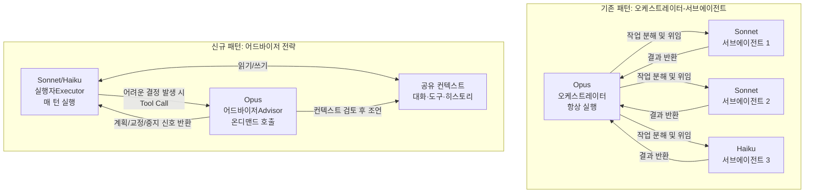
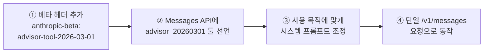
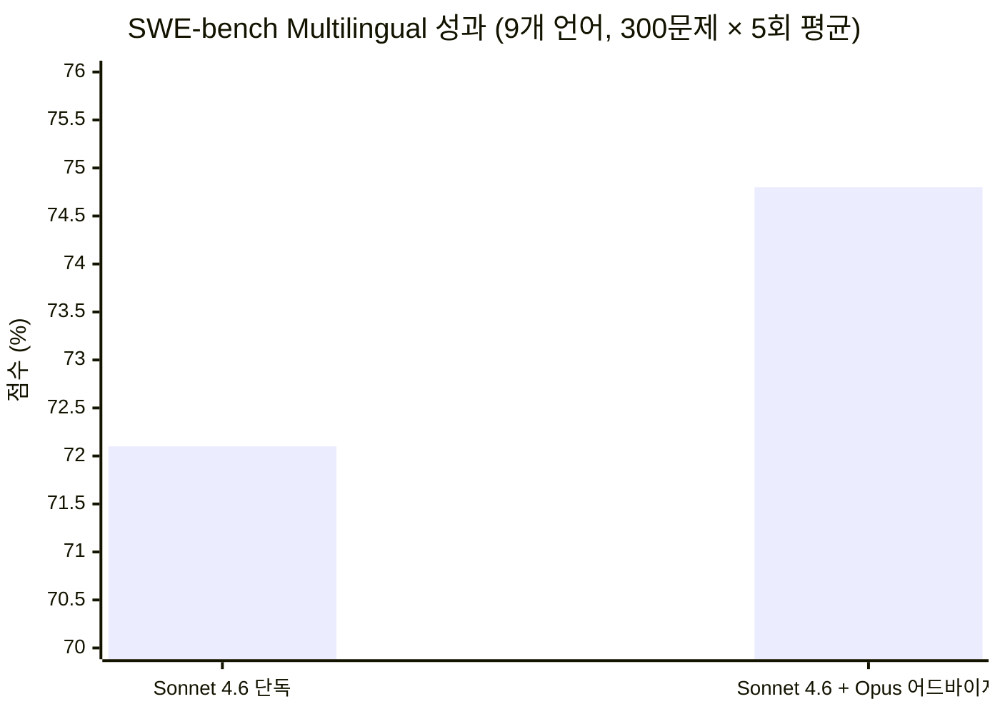
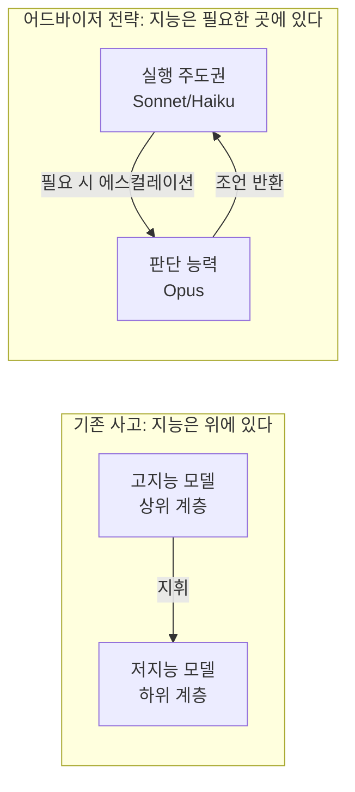

> **출처**: [Anthropic 공식 블로그 - The advisor strategy](https://claude.com/blog/the-advisor-strategy) | 2026년 4월 9일 발표  
> **작성일**: 2026년 4월 10일

---

## 1. 개요: 왜 이 전략이 주목받는가

AI 에이전트를 프로덕션 환경에 배포할 때 개발자들이 맞닥뜨리는 가장 근본적인 딜레마는 **지능(Intelligence) vs. 비용(Cost)** 의 트레이드오프다. 최고 성능의 Opus 모델을 에이전트 전체에 걸쳐 구동하면 추론 품질은 극대화되지만 비용이 폭증한다. 반대로 Sonnet이나 Haiku 같은 경량 모델만 사용하면 비용은 절감되지만 복잡한 의사결정 구간에서 품질이 저하된다.

Anthropic이 2026년 4월 9일 공개한 **Advisor Strategy(어드바이저 전략)** 는 이 딜레마를 구조적으로 해소하려는 시도다. 핵심 아이디어는 단순하고 명쾌하다: **"실행은 경량 모델이, 판단은 고성능 모델이."** 실제 평가 결과, Sonnet 단독 대비 성능은 2.7%p 향상되면서 오히려 비용은 11.9% 절감되는 성과가 나왔다. 이는 단순한 최적화를 넘어, 멀티모델 에이전트 아키텍처 설계의 새로운 패러다임을 제시한다.

---

## 2. 전통적 오케스트레이터 패턴과의 비교

어드바이저 전략을 이해하려면 먼저 기존의 지배적 패턴인 **오케스트레이터-서브에이전트(Orchestrator-Subagent) 패턴**과 어떻게 다른지를 파악해야 한다.



### 핵심 차이점 비교표

| 구분 | 오케스트레이터-서브에이전트 | 어드바이저 전략 |
|------|--------------------------|----------------|
| **구조** | 대형 모델이 위에서 아래로 지휘 | 소형 모델이 주도하고 필요 시 위로 에스컬레이션 |
| **Opus 실행 빈도** | 항상 (모든 오케스트레이션 단계) | 온디맨드 (어려운 결정 시점에만) |
| **작업 분해** | 명시적 분해 + 위임 풀 필요 | 분해 없음, 실행자가 직접 end-to-end 수행 |
| **비용 구조** | Opus 비용이 지배적 | Sonnet/Haiku 비용이 지배적 |
| **복잡도** | 오케스트레이션 로직 별도 구현 필요 | 단일 API 요청으로 처리 |

---

## 3. 아키텍처 상세 분석

### 3.1 실행자(Executor)의 역할

실행자는 Sonnet 또는 Haiku 모델이 담당하며, 태스크 전체를 end-to-end로 책임진다. 구체적으로는 다음 세 가지를 반복한다.

1. **도구 호출(Tool Calling)**: 파일 편집, bash 실행, 웹 검색 등 실제 작업을 직접 수행한다.
2. **결과 읽기 및 반영**: 도구 실행 결과를 컨텍스트에 축적하며 다음 스텝을 결정한다.
3. **해결책을 향한 반복 진행**: 문제가 해결될 때까지 루프를 지속한다.

실행자는 **스스로 해결할 수 없다고 판단되는 결정 지점**에서만 어드바이저를 Tool Call로 호출한다. 이 판단은 모델이 자율적으로 수행한다.

### 3.2 어드바이저(Advisor)의 역할

어드바이저는 Opus 모델이 담당하며, 철저히 **배후의 전략가** 역할에 머문다.

- 실행자가 축적한 **공유 컨텍스트 전체를 검토**한다 (대화 히스토리, 도구 호출 이력, 현재 상태 포함)
- **계획(Plan), 교정(Correction), 중지 신호(Stop Signal)** 중 하나를 반환한다
- **직접 도구를 호출하지 않는다** — 실행은 오직 실행자의 몫이다
- **사용자 대면 출력을 생성하지 않는다** — 어드바이저의 응답은 실행자 내부로만 전달된다
- 일반적으로 **400~700개 텍스트 토큰**의 짧은 계획만 생성한다

### 3.3 공유 컨텍스트(Shared Context)

어드바이저 전략에서 핵심적인 설계 결정 중 하나는 **어드바이저가 실행자와 동일한 컨텍스트를 읽는다**는 점이다. 별도의 컨텍스트 관리나 요약 과정 없이, Opus는 Sonnet이 보고 있는 것을 그대로 본다. 이를 통해:

- 정보 손실 없는 정확한 판단이 가능하다
- 실행자-어드바이저 간 컨텍스트 동기화 오버헤드가 제거된다
- 어드바이저의 조언이 실제 실행 맥락에 정확히 부합한다

---

## 4. 어드바이저 툴(Advisor Tool): 구현 방법

Anthropic은 이 전략을 **단 한 줄의 API 변경**으로 적용 가능한 `advisor_20260301` 서버사이드 툴로 제공한다.

### 4.1 기본 사용법

```python
response = client.messages.create(
    model="claude-sonnet-4-6",   # 실행자 모델
    tools=[
        {
            "type": "advisor_20260301",
            "name": "advisor",
            "model": "claude-opus-4-6",  # 어드바이저 모델
            "max_uses": 3,               # 요청당 어드바이저 최대 호출 횟수
        },
        # ... 기존 도구들 (웹 검색, 코드 실행 등)
    ],
    messages=[...]
)

# 어드바이저 토큰 사용량은 usage 블록에 별도 보고됨
```

### 4.2 활성화 방법 (단계별)



### 4.3 요금 구조

| 구성 요소 | 청구 기준 | 특성 |
|----------|----------|------|
| 실행자 토큰 | Sonnet/Haiku 요금 | 전체 작업 수행 (대부분의 토큰) |
| 어드바이저 토큰 | Opus 요금 | 짧은 계획 생성 (400~700 토큰) |
| 비용 제어 | `max_uses` 파라미터 | 요청당 어드바이저 호출 상한 설정 |

어드바이저가 생성하는 출력은 극히 짧기 때문에, Opus 요금이 적용되더라도 전체 작업을 Opus로 구동하는 것보다 훨씬 저렴하다. 실행자가 저렴한 Sonnet/Haiku 요금으로 대부분의 연산을 처리하기 때문이다.

---

## 5. 벤치마크 성과: 수치로 보는 효과

### 5.1 SWE-bench Multilingual (코딩 능력 평가)



| 구성 | 점수 | 태스크당 비용 |
|------|------|-------------|
| Sonnet 4.6 단독 | 72.1% | $1.09 |
| Sonnet 4.6 + Opus 어드바이저 | **74.8%** | **$0.96** |
| 변화 | **+2.7%p 향상** | **-11.9% 절감** |

이미지 2에서 확인할 수 있듯, 어드바이저 구성이 스코어 축(위)과 비용 축(왼쪽) 모두에서 우위를 점한다 — 즉, **더 똑똑하면서 더 저렴**한 결과가 나왔다.

> **측정 조건**: Sonnet 4.6 단독은 adaptive thinking 사용. Sonnet 4.6 + 어드바이저는 코딩용 시스템 프롬프트 + thinking 비활성화. 두 구성 모두 high effort, bash 및 파일 편집 툴 사용.

### 5.2 BrowseComp (웹 브라우징 기반 복잡한 정보 검색)

| 구성 | 점수 | 비고 |
|------|------|------|
| Sonnet 4.6 단독 | 기준선 | Medium effort |
| Sonnet 4.6 + Opus 어드바이저 | 향상 | 코딩용 시스템 프롬프트 적용 |
| Haiku 4.5 단독 | 19.7% | — |
| **Haiku 4.5 + Opus 어드바이저** | **41.2%** | 단독 대비 **+109% (2배 이상)** |

Haiku 조합이 특히 눈에 띄는데, Sonnet 단독 대비 29% 낮은 점수지만 비용은 **85% 저렴**하다. 대용량·고반복 작업에서 탁월한 가성비를 제공한다.

### 5.3 Terminal-Bench 2.0 (터미널 기반 에이전트 평가)

| 구성 | 결과 |
|------|------|
| Sonnet 4.6 단독 | 기준선 |
| Sonnet 4.6 + Opus 어드바이저 | 점수 향상, 태스크당 비용 절감 |

> **측정 조건**: 89개 태스크, 격리된 파드 환경, 태스크당 5회 시도 평균.

---

## 6. 실제 도입 사례

Anthropic의 파트너사들이 이미 어드바이저 전략을 적용해 성과를 보고했다.

**Bolt (Eric Simmons, CEO)**  
복잡한 태스크에서 아키텍처 의사결정 품질이 획기적으로 향상되었으며, 단순한 태스크에는 오버헤드가 전혀 발생하지 않는다고 평가했다. 계획 수립과 실행 궤적 자체가 근본적으로 달라졌다고 언급했다.

**Genspark (Kay Zhu, Cofounder & CTO)**  
에이전트 턴 수, 도구 호출 수, 종합 점수 모두에서 명확한 개선이 확인되었으며, 자체 제작한 계획 수립 도구보다 우수한 성과를 보였다고 밝혔다.

**문서 추출 전문 ML 팀 (Anuraj Pandey)**  
구조화된 문서 추출 태스크에서 Haiku 4.5가 복잡도에 따라 동적으로 Opus 4.6을 참조하도록 구성함으로써, 프론티어 모델 수준의 품질을 5배 저렴한 비용으로 달성했다.

---

## 7. 아키텍처 설계 철학: 역전된 지능 배치

어드바이저 전략은 단순한 기술적 최적화가 아니라, AI 에이전트 아키텍처에 대한 **근본적인 사고 전환**을 내포한다.



핵심 인사이트는 두 가지다. 첫째, **모든 결정이 최고 지능을 필요로 하지는 않는다**. 대부분의 작업 단계는 컨텍스트 읽기, 도구 실행, 결과 처리처럼 충분히 예측 가능한 패턴을 따른다. 고지능이 필요한 구간은 전체의 일부에 불과하다. 둘째, **작업을 분해하지 않아도 된다**. 기존 오케스트레이터 패턴은 Opus가 작업 전체를 파악하고 분해하며 위임했지만, 어드바이저 전략에서는 Sonnet이 end-to-end로 작업하면서 막히는 지점에서만 Opus에게 묻는다. 오케스트레이션 로직 자체가 불필요해진다.

---

## 8. AIOS 및 멀티에이전트 설계에 대한 함의

어드바이저 전략은 AIOS 같은 복잡한 에이전트 시스템을 설계할 때 직접적인 시사점을 제공한다.

**비용 계층 설계**: 에이전트 루프 전체를 단일 모델로 구동하는 대신, 실행 계층과 판단 계층을 명시적으로 분리하여 비용을 최적화할 수 있다. 도메인 특화 에이전트는 Haiku로, 복잡한 조율이 필요한 에이전트는 Sonnet으로, 아키텍처 수준의 판단이 필요한 순간에만 Opus를 호출하는 3계층 구조도 가능하다.

**메모리 시스템과의 조합**: 공유 컨텍스트는 현재 단일 요청 범위 내에서만 작동하지만, 외부 메모리 시스템(MemPalace 같은)과 결합하면 장기 컨텍스트를 유지하면서도 어드바이저의 고지능 판단을 활용하는 구조를 만들 수 있다.

**RummiArena/LxM 관점**: 게임 에이전트 평가 플랫폼에서 어드바이저 패턴을 적용하면 흥미로운 실험이 가능하다. 일반적인 게임 수행은 Haiku로, 전략적 전환점(분기점, 아웃스마팅 시도)에서만 Opus를 참조하게 할 경우, 모델 비용 대비 성과 효율성이 어떻게 달라지는지를 cross-model 비교로 측정할 수 있다.

**인프라 오버헤드 제거**: `advisor_20260301` 툴은 단일 `/v1/messages` 요청 안에서 모델 간 라우팅을 처리한다. 별도의 오케스트레이션 서비스, 메시지 큐, 컨텍스트 동기화 로직 없이도 멀티모델 에이전트가 동작한다. Claude Managed Agents와 조합하면 인프라 부담이 더욱 줄어든다.

---

## 9. 적용 시 고려사항 및 한계

### 9.1 최적 사용 시나리오

어드바이저 전략이 효과적인 상황은 다음과 같다.

- **장기 실행 에이전트**: 여러 도구를 순차적으로 활용하는 복잡한 작업에서 판단 분기가 발생할 때
- **비용 민감도 높은 대용량 태스크**: Haiku + Opus 어드바이저 조합으로 비용은 최소화하면서 품질 임계점을 유지할 때
- **예측하기 어려운 결정 분기가 있는 도메인**: 코딩, 웹 리서치, 문서 처리 등

### 9.2 주의사항

- **현재 베타**: `anthropic-beta: advisor-tool-2026-03-01` 헤더가 필요하며, 프로덕션 적용 전 자체 eval 스위트 실행 권장
- **max_uses 설계**: 어드바이저 호출 횟수 상한이 너무 낮으면 효과가 제한되고, 너무 높으면 비용 절감 효과가 줄어든다. 태스크 유형에 맞는 값 실험이 필요하다
- **시스템 프롬프트 조정**: 코딩 태스크용 권장 시스템 프롬프트가 존재하며, 사용 목적에 맞게 커스터마이징이 필요하다
- **어드바이저는 실행하지 않는다**: Opus가 제안한 계획을 실행자가 잘못 해석하거나 무시할 경우 성능이 떨어진다. 실행자 모델의 프롬프트 엔지니어링이 중요하다

---

## 10. 결론

Anthropic의 어드바이저 전략은 멀티모델 에이전트 아키텍처의 설계 원칙을 한 단계 진보시킨다. **"모든 단계에 최고 지능을 투입한다"는 직관적 접근 대신, "실행은 경량 모델이 주도하고 판단이 필요한 순간에만 고성능 모델이 개입한다"는 계층적 지능 배치를 제안한다.**

수치로 검증된 결과 — 성능 2.7%p 향상 + 비용 11.9% 절감 — 는 이 접근이 단순한 이론이 아님을 보여준다. 특히 Haiku + Opus 어드바이저 조합에서 BrowseComp 점수가 2배 이상(19.7% → 41.2%) 향상된 것은, 올바른 지점에 올바른 지능을 배치하는 것이 얼마나 강력한 효과를 낼 수 있는지를 단적으로 보여준다.

단일 API 요청 내에서 처리되는 서버사이드 구현 방식은 인프라 부담을 최소화하며, `max_uses`를 통한 비용 제어와 토큰 사용량의 분리 리포팅은 실제 프로덕션 환경에서의 운영 가시성을 확보한다. 멀티에이전트 시스템을 설계하는 실무자라면 반드시 자신의 eval 스위트에서 이 패턴을 검증해볼 가치가 있다.

---

*참고 링크*
- [공식 블로그 포스트](https://claude.com/blog/the-advisor-strategy)
- [어드바이저 툴 개발자 문서](https://platform.claude.com/docs/en/agents-and-tools/tool-use/advisor-tool)
- [SWE-bench Multilingual](https://www.swebench.com/multilingual.html)
