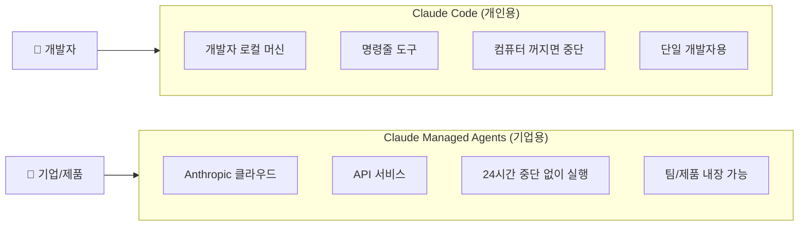
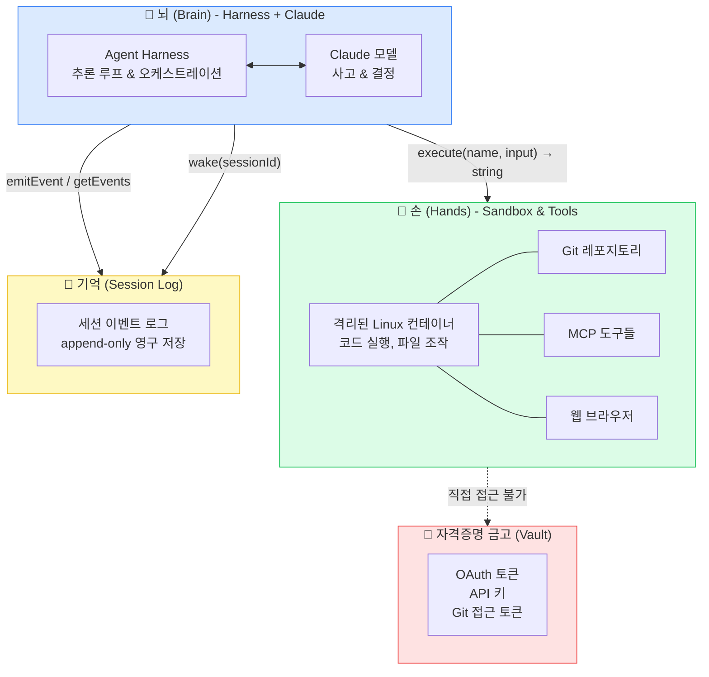
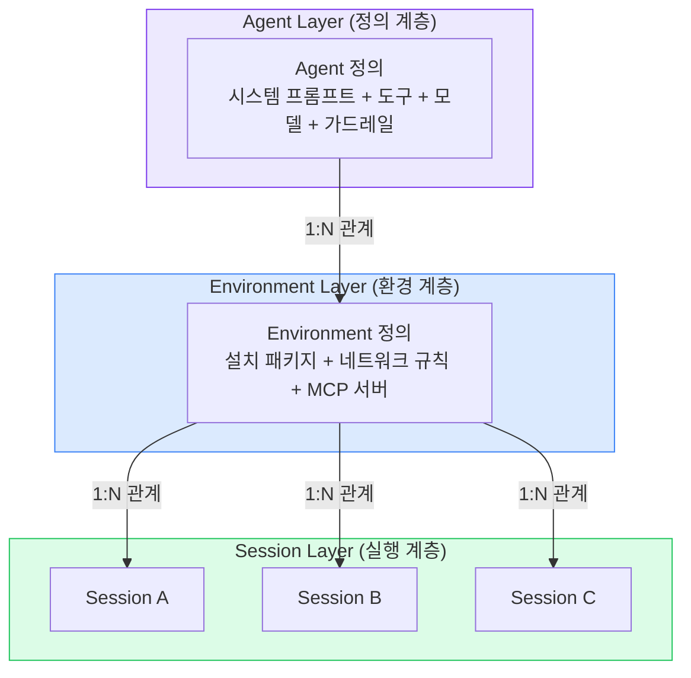
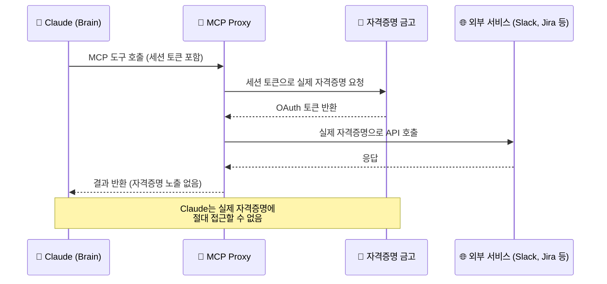
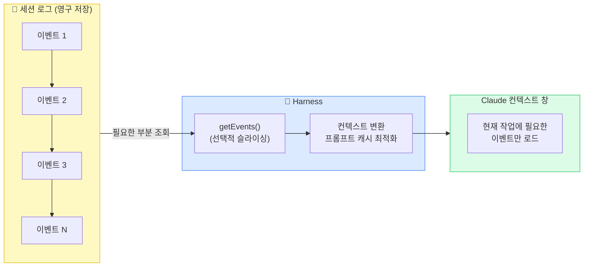
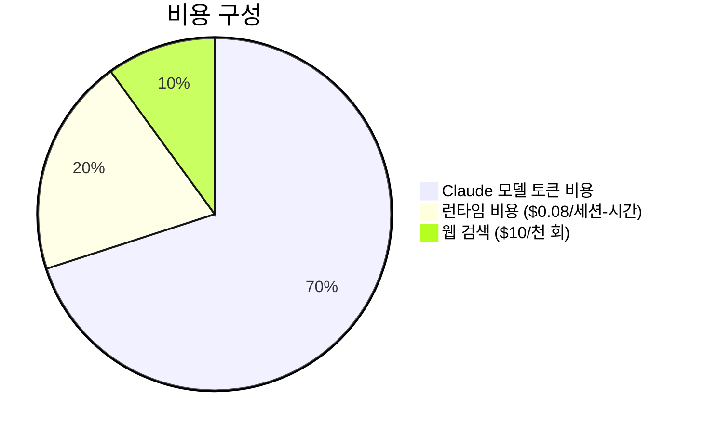
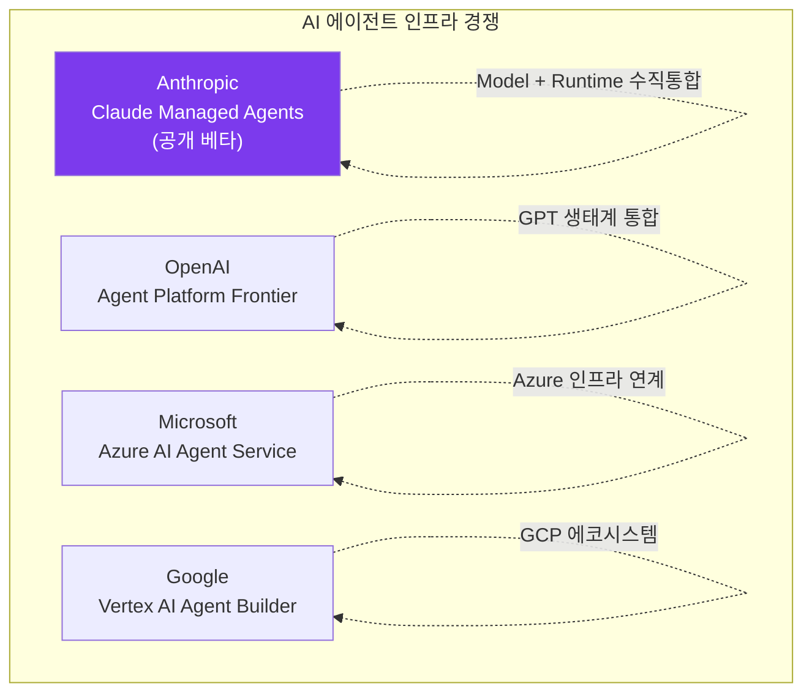
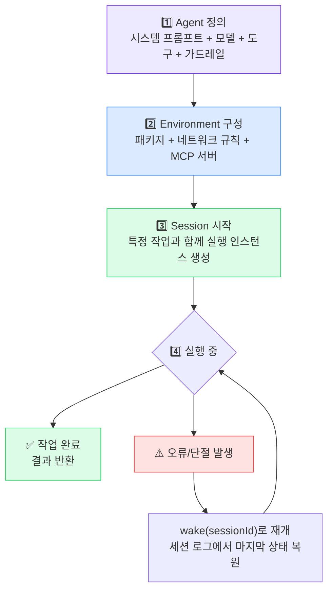

> **발행일**: 2026년 4월 10일  
> **출처**: Anthropic 공식 발표(2026.04.08), Engineering Blog, X(Twitter) 업계 분석 종합  
> **요약**: Anthropic이 공개 베타로 출시한 `Claude Managed Agents`는 기업이 AI 에이전트를 배포하는 방식을 근본적으로 바꾸는 관리형 인프라 플랫폼이다. 이 문서는 그 기술 아키텍처, 실제 도입 사례, 산업적 함의를 상세히 분석한다.

---

## 목차

1. [배경: 왜 지금 이 제품인가?](#1-배경)
2. [Claude Managed Agents란 무엇인가?](#2-정의)
3. [Claude Code와의 차이](#3-claude-code-비교)
4. [핵심 기술 아키텍처: 뇌와 손의 분리](#4-기술-아키텍처)
5. [세 가지 핵심 추상 계층](#5-세-가지-추상-계층)
6. [보안 설계](#6-보안-설계)
7. [컨텍스트 관리의 혁신](#7-컨텍스트-관리)
8. [실제 도입 사례](#8-도입-사례)
9. [가격 구조](#9-가격-구조)
10. [현재의 한계와 미완성 영역](#10-한계)
11. [산업적 함의: AI 인프라의 AWS 순간](#11-산업적-함의)
12. [개발자를 위한 실용 가이드](#12-실용-가이드)

---

## 1. 배경: 왜 지금 이 제품인가? {#1-배경}

### 기업의 AI 도입 장벽

AI 에이전트 개념은 이미 수년 전부터 존재했지만, 실제 프로덕션 환경에 배포하는 것은 전혀 다른 문제였다. 업계 조사에 따르면 AI를 실험하는 기업의 70% 이상이 가장 큰 장벽으로 모델 성능이 아닌 **배포 복잡성**을 꼽는다.

AI 에이전트 하나를 제대로 운영하려면 다음이 필요하다.

- **샌드박스 환경**: AI가 코드를 실행하고 파일을 조작할 수 있는 격리된 안전 공간
- **상태 관리(State Management)**: 긴 작업 중 컨텍스트와 진행 상황을 잃지 않는 메커니즘
- **자격 증명 관리(Credential Management)**: API 키, OAuth 토큰 등을 안전하게 보관하고 주입
- **권한 제어**: AI가 접근할 수 있는 리소스의 범위를 엄격하게 제한
- **오류 복구(Error Recovery)**: 컨테이너 충돌이나 네트워크 단절 시 작업을 재개하는 로직
- **전 구간 추적(End-to-End Tracing)**: 에이전트가 무엇을 했는지 감사(Audit) 가능하게 기록
- **스케일링**: 수십 개의 세션이 동시에 실행될 때의 리소스 관리

이 모든 것을 직접 구축하면 엔지니어링 팀이 수개월을 소비한다. 실제 비즈니스 로직을 짜는 시간은 전체의 20%에 불과하고, 나머지 80%는 이 인프라를 유지보수하는 데 쓰인다는 분석이 나오는 이유다.

### Anthropic의 전략적 전환점

Anthropic의 연간 경상 수익(ARR)이 2025년 12월 대비 세 배에 달하는 300억 달러를 돌파했다. 성장의 대부분은 기업 고객에서 나온다. 이 맥락에서 Anthropic이 단순히 모델 API를 제공하는 회사에서, 에이전트가 실행되는 **런타임(Runtime) 환경 자체를 소유하는 회사**로 전환하는 것은 필연적인 행보다.

---

## 2. Claude Managed Agents란 무엇인가? {#2-정의}

Anthropic이 2026년 4월 8일 공개 베타로 출시한 `Claude Managed Agents`는 한 문장으로 정의하면 다음과 같다.

> **"개발자가 에이전트의 목적, 도구, 판단 기준만 정의하면, 나머지 실행·스케줄링·인프라는 Anthropic이 클라우드에서 대신 처리해주는 관리형 AI 에이전트 플랫폼"**

Anthropic은 이를 "클라우드에서 대규모로 에이전트를 구축하고 배포하기 위한 조합 가능한 API(composable APIs) 모음"으로 설명한다. 핵심은 다음 세 가지다.

1. **개발자가 결정하는 것**: 에이전트가 무엇을 할지(시스템 프롬프트), 어떤 도구를 쓸지, 어떤 가드레일을 적용할지
2. **Anthropic이 처리하는 것**: 안전한 샌드박스 실행, 인증, 체크포인트, 권한 범위 지정, 컨텍스트 관리, 오류 복구
3. **결과**: 프로토타입에서 프로덕션 배포까지 수개월이 아닌 수일 내 완료

### 전형적인 사용 패턴

| 유형 | 설명 | 예시 |
|---|---|---|
| **이벤트 트리거형** | 특정 사건 발생 시 에이전트 자동 실행 | 버그 감지 → 자동 패치 작성 → PR 제출 |
| **정기 실행형** | 스케줄에 따라 반복 작업 수행 | 매일 오전 GitHub 활동 요약 생성 |
| **즉발-망각형(Fire-and-Forget)** | Slack 등에서 작업 지시 후 결과물 수령 | "이 데이터로 PPT 만들어줘" |
| **장시간 작업형** | 수 시간에 걸친 심층 작업 | 대규모 코드 리팩토링, 심층 리서치 |

---

## 3. Claude Code와의 차이 {#3-claude-code-비교}

많은 개발자가 이미 `Claude Code`를 사용하고 있기 때문에 Managed Agents와의 차이를 명확히 이해하는 것이 중요하다.



| 항목 | Claude Code | Claude Managed Agents |
|---|---|---|
| **실행 환경** | 사용자의 로컬 머신 | Anthropic 클라우드 |
| **형태** | 명령줄(CLI) 도구 | API 서비스 |
| **지속성** | 컴퓨터 종료 시 중단 | 24시간 중단 없이 실행 |
| **연결 끊김 처리** | 세션 유실 | 진행 상황 보존 후 재개 |
| **대상** | 개인 개발자 | 기업, 제품 빌더 |
| **내장 가능성** | 불가 | 제품 내 직접 임베딩 가능 |
| **병렬 세션** | 단일 | 수십 개 동시 실행 |

---

## 4. 핵심 기술 아키텍처: 뇌와 손의 분리 {#4-기술-아키텍처}

Anthropic 엔지니어링 블로그("Scaling Managed Agents: Decoupling the brain from the hands")에서 공개한 핵심 설계 원칙이다.

### 4.1 초기 설계의 문제: 단일 컨테이너의 함정

초기에 Anthropic은 모든 것을 하나의 컨테이너에 담았다. Claude의 추론 루프(harness), 코드 실행 환경(sandbox), 세션 기록(session log)이 모두 한 컨테이너 안에 공존했다.

이 접근의 문제는 클라우드 인프라 업계의 오랜 비유인 **"펫(Pet) vs 소(Cattle)"** 문제로 요약된다. 펫은 이름이 있고 소중히 돌봐야 하는 개체다. 컨테이너가 그 펫이 되어버렸다. 컨테이너가 죽으면 세션 전체가 유실되었고, 응답이 없으면 엔지니어가 직접 내부로 들어가 디버깅해야 했다. 하지만 그 컨테이너에는 사용자 데이터도 함께 있었기 때문에 디버깅 자체가 보안 위험이었다.

또한 자격 증명과 AI가 실행한 코드가 같은 컨테이너 안에 있었기 때문에, 프롬프트 인젝션 공격이 성공하면 공격자가 환경 변수에서 자격 증명을 직접 읽을 수 있었다.

### 4.2 해결책: 세 요소의 완전한 분리



**뇌(Brain)**: Claude 모델과 이를 실행하는 오케스트레이션 harness. 사고와 결정을 담당한다.

**손(Hands)**: 코드 실행, 파일 조작, 외부 서비스 호출을 수행하는 격리된 Linux 컨테이너. Harness는 이 컨테이너를 `execute(name, input) → string`이라는 단순한 인터페이스로만 호출한다. Harness 입장에서 이 "손"이 Docker 컨테이너인지, 가상 머신인지, 심지어 포켓몬 시뮬레이터인지조차 알 필요가 없다.

**기억(Session Log)**: 세션에서 일어난 모든 이벤트의 추가 전용(append-only) 영구 로그. 뇌도 손도 아닌 독립된 저장소에 위치한다.

### 4.3 분리가 만들어내는 실용적 이점

**장애 복원력**: 컨테이너(손)가 죽으면 harness가 도구 호출 오류로 이를 포착하고 Claude에게 전달한다. Claude가 재시도를 결정하면 `provision({resources})`로 새 컨테이너를 초기화할 수 있다. 더 이상 죽어가는 컨테이너를 살릴 필요가 없다.

**Harness 복구**: Harness 자체가 죽어도 문제없다. 세션 로그가 외부에 있으므로 새 Harness를 `wake(sessionId)`로 재부팅하고 `getSession(id)`으로 이벤트 로그를 복원해 마지막 이벤트부터 재개하면 된다.

**성능 향상**: 모든 작업이 샌드박스가 필요한 게 아니다. 이전 설계에서는 코드 실행이 없어도 무조건 컨테이너를 기동해야 했다. 분리 후에는 AI가 실제로 코드를 실행해야 할 때만 샌드박스를 On-demand로 기동한다. 그 결과 **최초 응답 지연시간(TTFT) 중앙값이 약 60% 감소했고, 최악의 경우에는 90% 이상 감소했다.**

---

## 5. 세 가지 핵심 추상 계층 {#5-세-가지-추상-계층}

Managed Agents는 운영체제가 하드웨어를 추상화한 것과 동일한 방식으로 에이전트 실행 환경을 추상화한다. `read()` 시스템 콜이 1970년대 자기 디스크든 현대 SSD든 신경 쓰지 않듯, Managed Agents의 인터페이스는 하부 구현이 바뀌어도 안정적으로 유지된다.



**Agent**: 에이전트의 능력을 정의한다. 어떤 모델을 쓸지, 시스템 프롬프트는 무엇인지, 어떤 도구에 접근할 수 있는지를 명세한다.

**Environment**: 실행 환경을 정의한다. 어떤 패키지가 사전 설치되는지, 어느 네트워크에 접근할 수 있는지, 어떤 MCP 서버와 연결되는지를 설정한다. 하나의 Agent에 여러 Environment를 연결할 수 있다.

**Session**: 실제 실행 인스턴스 하나다. 특정 Environment 위에서 구동되며, 하나의 Environment에서 수십 개의 Session이 동시에 실행될 수 있다. 각 Session은 독립적인 상태와 이벤트 로그를 가진다.

이 세 계층의 명확한 분리는 시스템의 각 부분을 독립적으로 진화시킬 수 있게 해준다. 모델이 업그레이드되면 Agent 정의의 모델 필드만 바꾸면 된다. 새 도구가 필요하면 Environment에 MCP 서버를 하나 추가하면 된다.

---

## 6. 보안 설계 {#6-보안-설계}

보안은 Managed Agents 설계에서 가장 정교하게 다뤄진 영역이다.

### 6.1 자격 증명의 물리적 격리



이 설계의 핵심은 **Claude가 생성한 코드가 실행되는 샌드박스에서 자격 증명이 절대 접근 불가**하다는 점이다.

**Git 저장소**: 샌드박스 초기화 시 저장소의 접근 토큰을 사용해 코드를 클론하고, git remote에 연결한다. 이후 Claude는 `git push/pull`을 정상적으로 사용하지만 토큰 자체는 볼 수 없다.

**Slack, Jira 등 SaaS 서비스**: MCP 프로토콜을 통해 연결되며, Claude의 도구 호출은 전용 프록시를 거친다. 프록시가 세션 토큰을 기반으로 금고에서 실제 자격 증명을 꺼내 서비스를 호출한다. Claude는 자격 증명 전달 경로에서 완전히 배제된다.

이 구조는 프롬프트 인젝션 공격이 성공하더라도 공격자가 얻을 수 있는 것이 없게 만든다.

---

## 7. 컨텍스트 관리의 혁신 {#7-컨텍스트-관리}

장시간 실행되는 에이전트의 가장 큰 기술적 과제는 컨텍스트 창 제한이다. Claude의 컨텍스트 창이 가득 차면 오래된 정보를 버려야 하는데, 어떤 정보를 버릴지의 결정은 **비가역적**이며 미래 턴에서 필요한 정보를 잃을 수 있다.

### 7.1 세션 로그와 컨텍스트 창의 분리

Managed Agents의 혁신적 접근은 **세션(기억)과 컨텍스트 창을 완전히 분리**하는 것이다.



`getEvents()` 인터페이스를 통해 harness는 전체 세션 이력에서 필요한 부분만 선택적으로 가져올 수 있다. 마지막으로 읽은 시점부터 재개하거나, 특정 사건 직전으로 되돌아가거나, 특정 액션 이전의 컨텍스트만 다시 읽는 것이 가능하다.

### 7.2 컨텍스트 불안(Context Anxiety) 사례

Anthropic 엔지니어링 블로그가 공유한 구체적 사례가 이 설계의 의의를 잘 보여준다. Claude Sonnet 4.5는 컨텍스트 창이 가득 차가는 것을 감지하면 작업을 조기 종료하는 경향이 있었다("컨텍스트 불안"). 이를 해결하기 위해 harness에 컨텍스트 리셋 로직을 추가했다.

그런데 Claude Opus 4.5가 나오자 이 문제 자체가 사라졌다. 이전에 추가했던 리셋 로직이 이제는 불필요한 부담이 되었다. 만약 기업이 자체 harness를 구축했다면, 모델 업그레이드마다 이런 패치를 직접 관리해야 한다. Managed Agents에서는 Anthropic이 이 최적화를 대신 처리한다.

---

## 8. 실제 도입 사례 {#8-도입-사례}

### Notion
Notion은 사용자가 워크스페이스를 떠나지 않고 Claude에게 코딩, PPT 제작, 스프레드시트 정리 등의 작업을 직접 위임할 수 있는 기능을 구현했다. 수십 개의 작업이 병렬로 실행되며, 팀 전체가 동일한 출력물 위에서 협업한다. 현재 비공개 알파(Private Alpha) 상태다.

### Sentry
버그 감지(Seer)에서 패치 작성, PR 제출까지 전 과정을 자동화했다. AI 디버깅 도구가 근본 원인을 찾으면 Claude가 직접 코드를 수정하고 Pull Request를 연다. 엔지니어링 디렉터에 따르면 수 주 만에 프로덕션 배포가 완료되었으며, 자체 인프라 유지보수 비용도 절감했다.

### Rakuten
엔지니어링, 제품, 영업, 마케팅, 재무 등 각 부서에 전문화된 에이전트를 배포했다. 각 에이전트는 일주일 이내에 배포되었으며, Slack과 Teams를 통해 작업을 수령하고 스프레드시트, PPT, 앱 형태의 실제 산출물을 반환한다.

### Atlassian (Jira)
Jira 내에 Claude 에이전트를 직접 통합해, 개발자가 Jira 이슈를 Claude에게 직접 할당할 수 있다.

### Asana
"AI Teammates"를 구현했다. 프로젝트 관리 워크플로우 안에 AI 협업자를 추가하여 작업을 받고, 산출물을 생성하고, 인간 검토를 위해 반환한다.

### General Legal (법률 테크)
가장 흥미로운 사례다. 에이전트가 사용자 질문에 따라 **즉석에서 데이터 조회 도구를 동적으로 생성**한다. 기존에는 예상 가능한 모든 질문 유형에 대해 검색 도구를 미리 개발해야 했다. CTO에 따르면 개발 시간이 10배 단축되었다.

---

## 9. 가격 구조 {#9-가격-구조}



| 항목 | 비용 |
|---|---|
| **모델 토큰** | Anthropic API 표준 가격 적용 |
| **런타임 비용** | **$0.08 / 세션-시간** (비활성 시간 제외) |
| **웹 검색** | $10 / 1,000회 |

24시간 연속 실행 시 런타임 비용만 약 $1.92/일, 월 약 $58이다. 여기에 모델 토큰 비용이 추가된다. 복잡한 장시간 작업을 자주 실행하는 팀은 사전 예산 시뮬레이션이 필요하다.

---

## 10. 현재의 한계와 미완성 영역 {#10-한계}

### 리서치 프리뷰(Research Preview) 단계 기능

다음 기능들은 아직 일반 공개되지 않았으며 액세스 신청이 필요하다.

- **멀티에이전트 협업**: 에이전트가 서브 에이전트를 생성하고 조율하는 기능
- **고급 메모리 도구**: 세션 간 정보를 지속적으로 기억하는 메커니즘
- **자기 평가 및 반복(Outcomes)**: 에이전트가 작업 완성도를 스스로 판단하고 개선하는 기능

### 플랫폼 종속성(Vendor Lock-in)

Managed Agents를 선택한다는 것은 에이전트 인프라를 Anthropic 에코시스템에 의존하는 것이다. 미래에 다른 모델이나 플랫폼으로 이전하려 할 때의 마이그레이션 비용이 발생할 수 있다.

### 메모리 문제: 아직 풀리지 않은 핵심 난제

에이전트가 세션을 새로 시작할 때마다 이전 세션의 기억을 잃는 문제는 아직 완전히 해결되지 않았다. Anthropic이 메모리 기능을 리서치 프리뷰로 별도 분류한 것 자체가 이 문제의 난이도를 방증한다.

인프라는 관리할 수 있고, 도구는 MCP로 연결할 수 있다. 하지만 **어떤 기억을 보존하고, 어떤 기억을 버릴 것인가**에 대한 표준 해법은 아직 업계 전반에 존재하지 않는다.

### 비용 예측 불확실성

$0.08/세션-시간이라는 런타임 비용은 작은 수처럼 보이지만, 복잡한 작업을 수 시간 실행하는 에이전트가 여럿 동시에 돌아가면 토큰 비용과 합산해 상당한 금액이 될 수 있다.

---

## 11. 산업적 함의: AI 인프라의 AWS 순간 {#11-산업적-함의}

### AWS 역사의 반복

2006년 AWS가 등장했을 때 기업들의 질문은 "클라우드로 갈 것인가, 서버실을 유지할 것인가"였다. 역사적 경험은 명확하다. 인프라는 핵심 경쟁력이 아니기 때문에 대부분의 기업은 결국 관리형 서비스를 선택했다.

오늘 Anthropic이 묻는 질문도 동일하다. "에이전트 인프라를 자체 구축할 것인가, 관리형 플랫폼을 쓸 것인가." Managed Agents는 이 선택지에서 관리형 쪽의 대표 플레이어로 등장했다.

### 경쟁 구도



OpenAI도 자체 에이전트 플랫폼 "Frontier"를 출시했으며, Microsoft의 Azure AI Agent Service, Google의 Vertex AI Agent Builder도 이 시장을 겨냥하고 있다. 에이전트 인프라 시장의 경쟁은 이제 막 시작되었다.

### 파괴되는 시장

이 트위터 스레드들이 공통적으로 지적하는 것이 있다. Managed Agents의 등장으로 **독립형 에이전트 인프라 스타트업들이 큰 압박을 받게 될 것**이라는 점이다. 샌드박스 관리, 상태 관리, 오케스트레이션 등 특정 인프라 레이어만을 해결했던 스타트업들은 이제 Anthropic이 이를 무료로(또는 저렴하게) 제공하는 상황에 직면했다.

월스트리트 저널(WSJ)은 투자자들이 전통적인 SaaS 기업에 대해 점점 신중해지고 있으며, Anthropic 같은 회사의 제품이 일부 전통 소프트웨어 서비스를 불필요하게 만들지도 모른다는 우려가 커지고 있다고 보도했다.

### "뇌와 손의 분리" 아키텍처의 장기적 의미

이 아키텍처의 가장 중요한 함의는 **멀티에이전트 협업의 기반**이 마련되었다는 점이다. 뇌와 손이 분리되어 있기 때문에, 하나의 뇌(에이전트)가 손(실행 환경)을 다른 뇌에게 넘겨줄 수 있다. 이것이 복잡한 멀티에이전트 파이프라인의 구조적 토대다.

---

## 12. 개발자를 위한 실용 가이드 {#12-실용-가이드}

### 시작하는 방법

Managed Agents는 현재 Claude Platform에서 공개 베타로 접근 가능하다.

**SDK 지원 언어**: Python, TypeScript, Java, Go, Ruby, PHP (6개 언어)

**Claude Code 사용자라면**:
```
최신 버전으로 업데이트 후:
/claude-api managed-agents-onboarding
```

### 기본 워크플로우



### 도입 전 체크리스트

- [ ] 자체 에이전트 인프라 구축에 소요되는 엔지니어링 시간 vs. Managed Agents 비용 비교
- [ ] 플랫폼 종속성(Vendor Lock-in) 리스크와 내부 허용 기준 검토
- [ ] 예상 세션 시간과 토큰 사용량을 기반으로 월별 비용 시뮬레이션
- [ ] 필요한 기능이 일반 공개 상태인지, 리서치 프리뷰 상태인지 확인
- [ ] 기존 데이터/자격 증명의 MCP 또는 직접 통합 방식 결정

---

## 결론

Claude Managed Agents는 단순한 신제품이 아니다. Anthropic이 모델 제공사에서 **에이전트 런타임(Agent Runtime) 제공사**로 전환하는 전략적 선언이다.

기술적으로는 "뇌와 손의 분리"라는 단순하지만 강력한 아키텍처 원칙 위에서, 성능, 보안, 복원력을 동시에 달성했다. 실용적으로는 수개월의 인프라 작업을 수일로 단축시킨다.

그러나 인프라 문제를 해결한다고 해서 에이전트의 모든 문제가 해결되는 것은 아니다. **어떤 작업을 정의할지, 어떻게 워크플로우를 설계할지, AI에게 핵심 비즈니스 데이터에 대한 접근을 어느 수준으로 허용할지**—이 질문들은 여전히 각 조직이 스스로 답해야 한다.

2026년 에이전트 경쟁의 핵심은 더 이상 모델의 지능이 아니다. **인프라의 성숙도, 메모리 솔루션의 완성도, 생태계의 개방성**이 승부를 가를 것이다.

---

*이 문서는 Anthropic 공식 발표(2026.04.08), Engineering Blog "Scaling Managed Agents: Decoupling the brain from the hands", 그리고 X(Twitter)의 업계 분석([@dotey](https://x.com/dotey/status/2042017036931305667), [@_forab](https://x.com/_forab/status/2042052175355113650), [@elliotchen100](https://x.com/elliotchen100/status/2042226564851720291))을 종합하여 작성되었습니다.*
