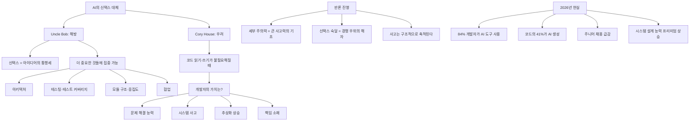
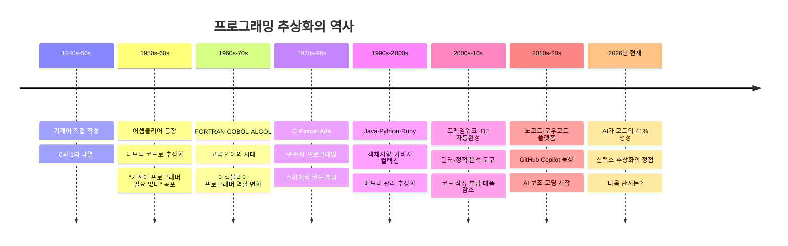
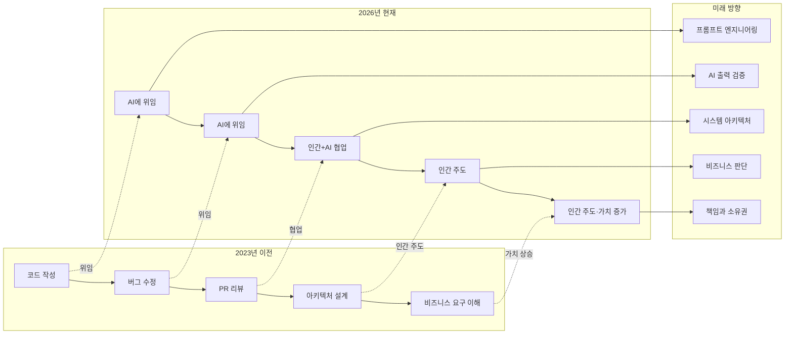

> **원문 출처**
> - Uncle Bob Martin 스레드: https://x.com/unclebobmartin/status/2042952202847744198
> - Cory House 스레드: https://x.com/housecor/status/2042617896870826037
> - **게시 일자:** 2026년 4월 10~11일
> - **분석 작성일:** 2026-04-11

---

## 들어가며: 왜 이 두 스레드가 중요한가

2026년 4월 10~11일, 소프트웨어 개발 커뮤니티에서 수십 년 경력의 두 거장이 각각의 X(구 트위터) 계정에 짧은 글을 올렸다. 그 내용은 짧았지만 파장은 컸다. "클린 코드(Clean Code)"의 저자이자 애자일 선언서(Agile Manifesto) 서명자 중 한 명인 **Robert C. "Uncle Bob" Martin**은 AI가 신택스를 없애버리는 것을 오히려 환영했고, 유명 React/JavaScript 강사이자 개발자 커뮤니티 인플루언서인 **Cory House**는 코드 읽기·쓰기 능력이 불필요해지는 세상에서 개발자가 어떻게 될지를 물었다. 이 두 스레드는 단순한 소셜 미디어 게시물이 아니었다. 수십 년간 소프트웨어 엔지니어링이 쌓아온 정체성, 기술 가치, 커리어의 의미를 뿌리부터 뒤흔드는 철학적 논쟁의 압축판이었다.

이 문서는 그 두 스레드에 달린 댓글들까지 포함하여 전체 맥락을 아주 상세하게 서술하고, 2026년 현재 AI 개발 생태계와 연결하여 그 의미를 깊이 분석한다.

---

## 1부: 첫 번째 스레드 — Uncle Bob의 "신택스여, 안녕"

### 1.1 원문 포스트

**Uncle Bob Martin (@unclebobmartin)** — 2026년 4월 11일 오후 10:05

> *"What we are losing with AI is syntax -- and good riddance. The less our brains are occupied by semicolons and braces the better. There are much more important things for us to consider and manage."*

한국어 번역:
> "AI로 인해 우리가 잃는 것은 신택스다 — 잘 가라. 우리의 두뇌가 세미콜론과 중괄호에 덜 점유될수록 더 좋다. 우리가 고려하고 관리해야 할 훨씬 더 중요한 것들이 있다."

이 포스트는 2,323회 조회, 6회 리트윗, 76개의 좋아요를 기록했다. 소박한 수치처럼 보이지만, 이 한 문장이 불러일으킨 토론의 깊이는 조회수를 훨씬 초월한다.

---

### 1.2 Uncle Bob Martin은 누구인가

Robert C. Martin은 50년 이상의 소프트웨어 개발 경력을 가진 미국의 소프트웨어 엔지니어이자 저술가, 강연자다. 그는 다음과 같은 이유로 업계에서 전설적인 인물로 꼽힌다:

- **"Clean Code" (2008)** 저술 — 가독성 높은 코드 작성의 바이블로 수백만 개발자에게 읽힌 책
- **SOLID 원칙** 대중화 — 단일 책임 원칙(SRP), 개방-폐쇄 원칙(OCP) 등 객체지향 설계의 핵심 원칙들
- **애자일 선언서(Agile Manifesto, 2001)** 공동 서명자
- **TDD(테스트 주도 개발)** 옹호자
- **cleancoder.com** 운영 — 개발자 교육 플랫폼

주목할 점은, 이 말이 단순한 AI 팬보이의 열광이 아니라는 것이다. Uncle Bob은 수십 년간 코드의 명확성, 가독성, 규율의 중요성을 역설해온 인물이다. 그런 그가 "신택스 따위는 잘 가라"고 말한 것은 단순한 유행 편승이 아닌, 깊은 숙고 끝에 나온 발언으로 읽힌다.

실제로 그는 2026년 2월에 다음과 같이 AI 경험을 공유한 바 있다:

> "AI를 코딩에 사용해온 지 6주가 넘었다. 그 힘은 부인할 수 없다. 하지만 위험과 시간 낭비도 마찬가지로 부인할 수 없다. 직접 작성했어도 프로젝트가 지금과 같은 진도를 보였을지 아직 확신이 서지 않는다."

또한 2026년 1월에는:

> "AI가 코드의 90%를 작성할 수 있지만, 프로그래머는 사고와 노력의 90%를 쏟아야 한다."

이런 맥락에서 그의 4월 포스트는 단순한 낙관론이 아니라, 경험을 통해 걸러진 철학적 결론이다.

---

### 1.3 댓글 분석: 찬성 진영

Uncle Bob의 주장에 동의하는 측의 댓글들은 크게 세 가지 관점을 드러냈다.

#### 1.3.1 "신택스는 아이디어의 통행세였다"

**Curtis (@curtismakes):**
> "syntax was always the tax on turning ideas into software. AI just removed the tax"

**Rich Kilmer (@rich_kilmer):**
> "Syntax has been the persistent toll we've paid to transform our ideas into a realization of them. Lowering that toll allows us to focus on the ideas themselves without the lingering cost hanging out there dissuading us from dreaming."

이 관점은 프로그래밍 역사에서 반복된 주제다. 기계어에서 어셈블리어로, 어셈블리어에서 고급 언어(C, Java, Python)로의 전환 역시 동일한 논리였다. 개발자들은 매번 "더 낮은 수준의 세부 사항"을 추상화 계층 아래로 밀어 넣고 더 높은 수준의 문제에 집중할 수 있게 되었다. AI는 그 추상화의 다음 단계라는 시각이다.

#### 1.3.2 "나무보다 숲이 중요해졌다"

**Rogue (@0xR0gue):**
> "Correct. It's still fun seeing people who spent many years mastering syntax and built their identity around it coping hard. They mastered the trees (which are now cheap), but now the forest matters more."

이 댓글은 다소 도발적이지만 핵심을 찌른다. 개별 언어의 문법 숙달에 수년을 바친 개발자들이 AI 시대에 정체성 위기를 맞고 있다는 관찰이다. "나무를 마스터했지만, 이제는 숲이 중요하다"는 비유는 개별 구문 지식 대 시스템 사고의 대비를 선명하게 보여준다.

#### 1.3.3 구체적인 공감 사례

**Marcin Dudek (@MythThrazz):**
> "I often look at the terminal and I feel PITY that AI has to deal with semicolons and braces…"

흥미롭게도 이 개발자는 신택스를 AI가 "감수해야 하는 짐"으로 묘사하며, 자신이 오히려 AI를 동정하는 역설적 감정을 표현했다.

**Brad Wardell (@draginol):**
> "agree;"

이 댓글 자체가 하나의 아이러니다. 동의의 메시지 끝에 C 계열 언어의 세미콜론을 붙였다. 신택스에 대한 유머러스한 경의인 동시에 고별 인사다.

**Wes Woods (@WesWeswoods):**
> "I've felt this way ever since I laid hands on my TRS-80 in 1979."

1979년부터 50년 가까이 개발을 해온 베테랑이 동일한 감정을 공유했다. 이는 Uncle Bob의 주장이 AI 시대의 일시적 유행이 아니라, 프로그래머들이 오랫동안 느껴온 근원적인 불편함에 대한 해소라는 것을 시사한다.

---

### 1.4 댓글 분석: 반대 진영

#### 1.4.1 "신택스를 잃으면 사고력도 잃는다"

**Joshua Jung (@joshua_p_jung):**
> "I think this is a poor take. The way to keep your brain sharp to handle the large things is by getting skilled at paying attention to details. If we relax in paying attention to details, overall ability to think intelligently about the large issues will collapse."

이것은 인지과학적으로 의미 있는 반론이다. 정밀한 세부 사항에 주의를 기울이는 훈련이 큰 그림을 사고하는 능력의 토대가 된다는 주장이다. 음악가가 스케일 연습을 게을리하면 즉흥 연주 능력이 떨어지듯, 코드의 정밀한 문법 처리 능력이 시스템 설계 능력의 기초를 형성한다는 논리다.

**allOS.dev (@raddevus):**
> "Ah, but what happens to the brain when you remove syntax & grammar: it stops thinking properly. You can't remove parts of the process & expect to jump to the 'best part' (design of large systems). Thinking is structured & builds. What if you removed syntax from natural lang?"

이 댓글은 더욱 날카롭다. 자연어에서 문법을 제거하면 언어 자체가 무너지듯, 프로그래밍 언어에서 신택스를 제거하는 것도 사고 구조의 기반을 허물 수 있다는 주장이다. 언어와 사고의 관계를 다루는 **사피어-워프 가설(Sapir-Whorf Hypothesis)** 과도 연결되는 흥미로운 관점이다.

#### 1.4.2 "신택스 습득은 사라질 정체성이 아니라 여전히 가치 있는 해자(moat)다"

**Thomas Unise (@thomasunise):**
> "But knowing syntax was the moat"

짧지만 강력한 반박이다. "해자(moat)"는 경쟁 우위를 방어하는 보호막을 뜻하는 경제 용어다. 즉, 신택스 숙달이 개발자의 경쟁력 보호막이었다는 말이다. AI가 그 해자를 메워버렸다는 점에서 Uncle Bob에게는 해방이지만, 이 관점에서는 진입 장벽의 붕괴이기도 하다.

---

### 1.5 중도적·복합적 시각

**Sushruth (@TreeApostle):**
> "Syntax can be lost, but not the flow. Ideally build the logic behind the function you want in your mind then get AI to write it. Our leverage is our reasoning ability and that is what makes us engineers (And also no, LLMs don't have that ability, they're just pattern matching"

이것은 이 스레드에서 가장 균형 잡힌 시각 중 하나다. 신택스는 잃어도 되지만, 논리적 흐름(flow)은 여전히 개발자의 두뇌 안에 있어야 한다는 주장이다. AI는 패턴 매칭을 할 뿐이며, 진정한 추론(reasoning)은 인간 엔지니어의 몫이라는 것이다.

**M.L. Weaver (@readMLWeaver):**
> "We're also losing the ability to use em dashes, not only X but also Y, and the rule of three."

이 댓글은 코드 세계를 넘어 글쓰기 세계로 확장한다. AI가 특정 언어 패턴(em 대시, 열거 구조)을 너무 기계적으로 사용하기 때문에, 그 패턴들이 포함된 글은 이제 AI가 쓴 것으로 의심받는다는 관찰이다. 이는 AI가 신택스를 대체하는 것이 코딩 영역에 그치지 않는다는 흥미로운 확장이다.

**Discerner (@Discerner4u):**
> "Didn't we lose that (partially) with auto syntax checkers in IDEs?"

역사적 관점에서 매우 타당한 지적이다. 우리는 이미 IDE의 자동 완성, 린터(linter), 신택스 체커를 통해 신택스의 부담을 점진적으로 줄여왔다. AI는 그 연속선상의 극단점일 뿐이라는 시각이다.

---

## 2부: 두 번째 스레드 — Cory House의 질문

### 2.1 원문 포스트와 인용된 글

**Fernando (@Franc0Fernand0)** — 2026년 4월 10일 (인용된 원글)

> "Software engineers don't get paid to write code; they get paid to solve problems. The faster you realize this, the sooner you'll stop being afraid that AI will replace you and the better your career will be."

한국어 번역:
> "소프트웨어 엔지니어는 코드를 작성하는 대가로 돈을 받는 게 아니다. 문제를 해결하는 대가로 받는다. 이것을 빨리 깨달을수록, AI가 자신을 대체할 것에 대한 두려움을 빨리 멈추게 되고, 커리어도 더 나아질 것이다."

30,000회 조회를 기록한 이 포스트는 널리 공감받는 위안의 메시지였다. 그런데 **Cory House(@housecor)** 가 이를 인용하며 날카로운 반론을 제기했다.

---

**Cory House (@housecor)** — 2026년 4월 10일 오후 11:57

> "Sure, but what happens to developers when you don't need to be able to read or write code to solve software problems?"

한국어 번역:
> "맞는 말이다. 하지만 소프트웨어 문제를 해결하는 데 코드를 읽거나 쓸 능력이 필요 없게 될 때, 개발자들은 어떻게 되는가?"

이 질문이 핵심이다. Fernando의 위안("코드가 아니라 문제 해결이 본질")은 코드 작성 능력이 여전히 문제 해결의 수단일 때 유효하다. 하지만 AI가 코드 읽기·쓰기를 완전히 대체한다면, 그 "수단"조차 무용해지는 세상에서 개발자의 가치는 무엇인가? Cory House는 위안의 전제 자체를 뒤흔든 것이다.

이 포스트는 30K 조회를 기록했다.

---

### 2.2 Cory House는 누구인가

Cory House(@housecor)는 미국의 소프트웨어 개발자이자 교육자로, Pluralsight에서 수십 개의 React, JavaScript, 소프트웨어 아키텍처 관련 강좌를 운영해왔다. 개발자 커뮤니티에서 실용적 관점의 통찰로 알려진 그는 "코드를 쓰는 것"과 "소프트웨어 엔지니어링"의 차이를 오래 전부터 강조해온 인물이다. 그렇기에 그의 질문은 더욱 의미심장하다. 교육자의 입장에서, 그는 "무엇을 가르쳐야 하는가"라는 근원적 물음을 제기하고 있기도 하다.

---

### 2.3 Uncle Bob의 응답 (이 스레드에 댓글로 등장)

주목할 점은, Uncle Bob이 이 스레드에도 댓글을 달았다는 것이다.

**Uncle Bob Martin (@unclebobmartin) — 1시간 전:**
> "Syntax is the least of our skills, and one that we will be well rid of. Without it we'll be able to focus on the more important aspects of software like function and module structure, testing and test coverage, component cohesion, coupling, and collaboration, and architecture."

한국어 번역:
> "신택스는 우리 기술 중 가장 하위 요소이며, 없어지면 좋을 것이다. 신택스 없이 우리는 함수와 모듈 구조, 테스팅과 테스트 커버리지, 컴포넌트 응집성, 결합도, 협업, 아키텍처 등 소프트웨어의 더 중요한 측면에 집중할 수 있을 것이다."

이것은 단순한 낙관론이 아니다. Uncle Bob은 신택스를 잃고 무엇을 얻는지를 구체적으로 나열했다: 함수·모듈 구조, 테스팅, 응집도, 결합도, 협업, 아키텍처. 이 목록은 사실 그의 저서 "Clean Code"와 "Clean Architecture"에서 핵심으로 다뤄온 주제들이다. 즉, 그는 자신이 평생 가르쳐온 더 중요한 가치들에 이제 집중할 수 있게 된다는 기대를 표명한 것이다.

---

### 2.4 댓글 분석: "개발자의 미래"에 대한 다양한 전망

#### 2.4.1 추상화 계층의 상승

**Anthony Franco (@anthony_franco):**
> "We'll move up the abstraction layer. The same way you don't look at the machine code anymore."

이 관점은 역사적으로 가장 설득력 있는 답변이다. 1950년대의 개발자들은 기계어를 직접 다뤘다. 1960 ~ 70년대에 어셈블리어와 고급 언어가 등장하자, 기계어 프로그래머들의 역할이 사라지는 것이 아니라 더 높은 추상화 계층으로 올라갔다. 1990 ~ 2000년대에는 C에서 Java, Python으로, 최근에는 로우코드/노코드 도구로 계층이 상승했다. AI는 그 연속이라는 시각이다.

#### 2.4.2 시스템 사고의 중요성 부상

**Mike Nguyen (@mikenguyen_me):**
> "Thinking in terms of system still helps a lot. Sure anyone can clone any kind of software nowadays, but do you actually know how to scale these systems? It's easy to come up with an MVP for uber, but if you want to scale so it serves billions of rides daily, you need to know the [architecture]..."

이 댓글은 실제 엔지니어링의 핵심을 짚는다. AI가 코드를 작성할 수 있어도, 수십억 건의 요청을 처리하는 시스템을 설계하는 것은 전혀 다른 차원의 능력이다. 분산 시스템, 데이터 일관성, 장애 허용, 지연 시간 최적화 등은 여전히 깊은 인간적 전문성을 요구한다.

#### 2.4.3 책임과 소유권의 문제

**orfidius (@orfidius):**
> "I'm not sure we're going to get there. I think it comes down to responsibility. Whose fault is it is if it breaks? Who do you sue? Who do you fire? The ai company? Were the prompts just not good enough? Can the engineer pinpoint were the mistake was?"

이것은 기술적 논의를 넘어 법적·윤리적·조직적 차원으로 확장하는 탁견이다. AI가 작성한 코드로 인해 사고가 났을 때의 책임 소재 문제는 아직 전 세계가 답을 찾지 못한 영역이다.

실제로 2026년 2월, DeFi 프로토콜 Moonwell의 업데이트에서 Claude Code로 생성된 코드에 버그가 있었고, 이로 인해 약 170만 달러의 손실이 발생한 사건이 있었다. 코드를 검토한 개발자와 AI 도구 사이의 책임 분담은 어떻게 되는가? 이 질문은 앞으로 수년간 업계의 핵심 화두가 될 것이다.

#### 2.4.4 새로운 역할의 탄생

**Maciek Jurkiewicz (@MaciekJurkiewi1):**
> "Imho its an evolution to solution design, we won't need nerds and geeks for that. We will need cross-disciplinary people like technical presales mixed with software architect"

이 관점은 미래 개발자의 프로파일을 흥미롭게 그린다. 순수한 기술 전문가("nerd, geek")보다는 비즈니스 문제를 이해하고 기술적 솔루션을 설계하며 비기술 이해관계자와 소통할 수 있는 **크로스디시플리너리(cross-disciplinary)** 인재가 더 가치 있게 될 것이라는 전망이다.

#### 2.4.5 메리토크라시(실력주의)는 변하지 않는다

**mitchdyer (@0xmitchdyer):**
> "People who are good at developing will always be better at this than those who are not. You can see this distinction even among developers"

이에 Cory House 본인도 한 마디로 동의했다: "Agreed"

**kerrow (@itskerrow):**
> "sw dev has a long history of rapid change and meritocratic advancement. the present moment is merely a reminder of our roots."

소프트웨어 개발은 항상 급격한 변화와 실력 중심의 발전으로 점철된 역사를 가졌다. 지금 순간은 그 역사의 연속이라는 관점이다.

#### 2.4.6 코드의 새로운 모달리티

**ameno (@amenoacids):**
> "Code is the old modality, Ai unlocks newer, shittier ones."

솔직하고 냉소적인 발언이지만 중요한 통찰을 담고 있다. AI가 새로운 창작 방식(모달리티)을 열지만, 그것이 반드시 더 나은 결과물을 보장하지는 않는다는 경고다. "shittier"(더 형편없는)라는 단어 선택이 AI 생성 코드의 품질에 대한 현실적 우려를 반영한다.

---

## 3부: 두 스레드가 공명하는 지점 — 개념 지도

두 스레드는 서로 다른 각도에서 출발하지만 동일한 핵심 질문에 수렴한다. 아래는 두 스레드에서 등장한 핵심 개념들의 구조적 지도다.

---

## 4부: 역사적 맥락 — 신택스 추상화의 역사

Uncle Bob과 Cory House의 논쟁은 사실 프로그래밍 역사에서 반복된 패턴이다. 각 전환점마다 "이제 프로그래머는 필요 없다"는 공포와 "더 중요한 것에 집중할 수 있다"는 기대가 공존했다.

역사는 명확한 패턴을 보여준다. 추상화가 올라갈 때마다 프로그래머의 수는 줄지 않았다. 오히려 소프트웨어에 대한 수요가 폭발적으로 증가하면서 더 많은 개발자가 필요했다. 계산기가 수학자를 대체하지 못했듯, IDE가 개발자를 줄이지 못했듯, AI 코딩 도구도 같은 역학을 따를 가능성이 높다.

---

## 5부: 2026년 현실과의 대조

두 스레드의 주장이 실제 2026년 AI 개발 생태계와 얼마나 일치하는지 살펴보자.

### 5.1 수치로 보는 현실

2026년 현재 소프트웨어 개발 업계의 주요 지표들:

- **84%** — AI 코딩 도구를 매일 사용하는 미국 개발자 비율 (Stack Overflow 개발자 서베이 2025)
- **41%** — 전 세계 코드 중 AI가 생성하는 비율
- **95%** — AI 생성 코드를 미션 크리티컬 로직에 전적으로 신뢰하지 않는 개발자 비율
- **17%** — 2033년까지 예상되는 소프트웨어 엔지니어링 직종 성장률 (미국 노동통계국)
- **72%** — AI 코딩 도구를 매일 사용하는 전체 개발자 비율
- **2~3배** — GenAI 엔지니어·MLOps 전문가 채용 증가율 (5년 전 대비)

### 5.2 주니어 개발자 시장의 붕괴

이 맥락에서 가장 뜨거운 현실 문제 중 하나는 주니어 개발자 채용의 급감이다. AI가 초급 코딩 작업을 처리할 수 있게 되면서, 기업들은 주니어 채용을 동결하거나 줄이고 있다. 일부 지역에서는 주니어 개발자 채용이 2년 만에 절반 이하로 줄었다는 보고도 있다.

이것은 심각한 구조적 문제를 야기한다. 오늘의 주니어가 내일의 시니어다. 주니어 파이프라인이 말라붙으면 5~10년 후 숙련된 시니어 엔지니어의 공급 자체가 위협받는다. 시니어 엔지니어들은 코드를 직접 작성하며 주니어 시절 쌓은 경험을 통해 복잡한 문제를 해결하는 직관을 키워왔다. AI가 그 성장 과정을 생략시켜 버린다면, 과연 차세대 시니어들은 무엇을 통해 그 직관을 키울 것인가?

### 5.3 "Vibe Coding"의 부상

2025년 Andrej Karpathy(OpenAI 공동 창업자)가 제안한 "Vibe Coding" 개념은 2026년에 실질적인 개발 패러다임이 되었다. 개발자가 자연어로 의도를 설명하면 AI가 코드를 생성하는 방식이다.

실제 사례로, 인디 개발자 Pieter Levels는 2025년 2월 Cursor와 Grok 3를 활용해 멀티플레이어 게임을 만들었고, 17일 만에 연간 매출 100만 달러를 달성했다. 그러나 전문가들은 경고한다 — 이 성공은 Levels 자신이 아키텍처를 이해하고 AI를 지휘할 수 있는 숙련자였기 때문에 가능했다. AI를 맹목적으로 신뢰하는 개발자들은 몇 달 만에 손댈 수 없는 "블랙박스" 코드베이스를 만들어낸다.

### 5.4 AI 기술 부채(Technical Debt)의 조용한 축적

여러 대형 테크 기업들에서 조용히 진행된 실험들이 공통된 결론을 내놓고 있다: AI 생성 코드는 지역적으로는 정확하지만 전역적으로는 맞지 않는 경우가 많다. 시스템의 역사, 트레이드오프, 장기적 진화를 이해하지 못한 채 생성된 코드는 "국소적으로 깔끔하지만 구조적 깊이가 부족한" AI 기술 부채를 쌓는다.

일부 기업에서는 AI 생성 코드의 보안 실패율이 인간이 작성한 코드보다 유의미하게 높다는 내부 연구 결과도 나왔다. 이는 Cory House의 우려를 현실적으로 뒷받침하는 데이터다.

---

## 6부: 핵심 논점의 철학적 분석

### 6.1 신택스는 "세금"인가, "사고의 토대"인가

Uncle Bob을 비롯한 낙관론자들은 신택스를 "아이디어를 실현하기 위해 치러야 하는 통행세"로 본다. 이 비유에서 신택스는 목적지(작동하는 소프트웨어)가 아니라 수단이며, 그 비용을 낮추는 것은 순전히 좋은 일이다.

반면 Joshua Jung 등의 회의론자들은 신택스를 단순한 세금이 아니라 **사고 구조의 훈련 도구**로 본다. 프로그래밍 언어의 엄밀한 문법을 습득하는 과정에서 개발자는 정확성, 논리적 일관성, 에지 케이스 처리에 대한 사고 습관을 형성한다. 이 훈련이 없으면 더 높은 수준의 추상적 사고도 흔들릴 수 있다는 것이다.

이는 사실 **외재화된 인지(Extended Cognition)** 에 관한 인지철학 논쟁과 연결된다. 계산기가 인간의 암산 능력을 약화시켰는가, 아니면 더 복잡한 수학적 사고를 가능케 했는가? GPS가 공간 인지 능력을 퇴화시켰는가, 아니면 더 먼 목적지에 집중하게 했는가? 정답은 없다. 하지만 이 질문은 AI와 신택스의 관계에도 그대로 적용된다.

### 6.2 "코드를 읽지 못해도 되는가"의 문제

Cory House의 핵심 질문으로 돌아오자. 소프트웨어 문제를 해결하는 데 코드를 읽고 쓸 능력이 필요 없게 된다면, 개발자의 경계는 어디서부터 시작하는가?

이 질문에는 여러 층위가 있다:

1. **기능 구현 수준**: AI가 이미 상당 부분 대체 가능. 간단한 기능은 자연어 설명으로 완성된다.
2. **디버깅 수준**: AI 생성 코드의 버그를 찾으려면 코드를 읽을 줄 알아야 한다. 완전한 대체는 아직 요원하다.
3. **아키텍처 수준**: 수십억 요청을 처리하는 시스템 설계는 코드 읽기 능력 이상의 심층 시스템 이해를 요구한다.
4. **책임 수준**: 누군가는 AI가 생성한 코드의 결과에 책임을 져야 한다. 그 책임은 코드를 이해하는 사람에게만 부여될 수 있다.

따라서 "코드 읽기·쓰기 능력이 불필요해진다"는 명제는 매우 특수한 조건, 즉 완전히 새로운 그린필드(greenfield) 프로젝트, 높은 실패 허용도, 규모 확장이 필요 없는 맥락에서만 잠정적으로 성립한다.

### 6.3 "문제 해결자"로의 정체성 전환

Fernando의 원글("소프트웨어 엔지니어는 문제를 해결하는 대가로 받는다")에 내포된 위안은, 개발자가 자신의 정체성을 "코드를 작성하는 사람"에서 "문제를 해결하는 사람"으로 전환해야 한다는 제안이다. 이 전환은 실제로 많은 선도적 개발자들이 이미 걷고 있는 길이다.

Uncle Bob의 응답은 이 전환을 구체화한다. "함수·모듈 구조, 테스팅, 응집도, 결합도, 협업, 아키텍처"야말로 소프트웨어 엔지니어링의 진정한 핵심이며, AI가 신택스를 대신 처리함으로써 드디어 이것들에 전념할 수 있다는 것이다.

---

## 7부: 미래 전망 — 개발자의 역할은 어떻게 재편되는가

### 7.1 가치가 상승하는 역할

2026년 현재 채용이 증가하고 급여 프리미엄이 높아지는 역할들:

- **AI 출력 검증자**: AI가 생성한 코드의 품질·보안·아키텍처 적합성을 판단하는 역할
- **시스템 아키텍트**: 대규모 분산 시스템의 설계와 트레이드오프 결정
- **GenAI 엔지니어**: AI 파이프라인 설계 및 운영
- **기술-비즈니스 브리지**: 비기술 이해관계자와 기술팀 사이의 번역자
- **AI 기술 부채 관리자**: AI 생성 코드의 장기적 유지보수 관리

### 7.2 가치가 하락하는 역할

- **순수 구현 개발자**: "요구사항을 코드로 변환"하는 단순 변환 작업
- **특정 프레임워크 전문가**: "React 전문가", "Spring 전문가" 등 특정 신택스에 종속된 정체성
- **반복적 테스트 코드 작성자**: 단위 테스트 등 패턴화된 코드 생성

### 7.3 Uncle Bob의 예언이 맞는가

Uncle Bob이 나열한 집중 대상들 — 함수·모듈 구조, 테스팅, 응집도, 결합도, 협업, 아키텍처 — 은 2026년 채용 시장에서 실제로 가장 높은 프리미엄을 받는 역량들과 정확히 일치한다. 그의 예언은 적어도 방향적으로는 옳다.

하지만 Cory House의 우려도 현실이다. 이 전환 과정에서 중간 단계를 밟지 못한 많은 개발자들 — 주니어부터 중급까지 — 이 심각한 커리어 위기에 처해 있다. 미래가 밝은 것은 분명하지만, 그 미래로 가는 다리가 충분히 놓여 있지 않다는 것이 문제다.

---

## 8부: 한국 개발자에게 주는 시사점

한국은 IT 인프라 강국이지만, AI 코딩 도구의 도입 속도와 개발자 문화의 변화 속도는 아직 글로벌 최전선보다 다소 느린 편이다. 그러나 이 논쟁이 한국 개발자 커뮤니티에 던지는 메시지는 명확하다.

**첫째**, SI(시스템 통합) 중심의 한국 소프트웨어 산업 구조는 "요구사항을 코드로 변환"하는 모델에 의존도가 높다. 이 모델이 AI에 가장 빠르게 잠식당할 위험에 있다.

**둘째**, 국내 개발자들이 신택스 숙달에 과도하게 집중하는 교육 문화 — 코딩 테스트, 알고리즘 문제 풀기 — 는 재검토가 필요하다. 물론 이러한 훈련이 쓸모없는 것은 아니지만, 시스템 사고, 아키텍처 설계, 비즈니스 문제 이해 등에 대한 역량 개발도 균형 있게 이루어져야 한다.

**셋째**, Uncle Bob이 강조한 테스팅·테스트 커버리지·응집도·결합도 등의 소프트웨어 공학 원칙들은 AI 시대에 더욱 중요해진다. AI가 생성한 코드가 이 원칙들을 지키고 있는지를 판단하는 능력이 핵심 역량이 된다.

---

## 결론: 신택스의 상실은 무엇의 시작인가

두 스레드를 종합하면, 이 논쟁은 표면적으로는 신택스에 관한 것이지만 본질적으로는 **프로그래머의 정체성과 가치**에 관한 것이다.

Uncle Bob의 "신택스여 잘 가라"는 해방의 선언이다. 50년간 코드와 씨름해온 이 베테랑은 드디어 진짜 중요한 것 — 아키텍처, 설계, 협업 — 에 집중할 수 있게 되었다고 기뻐한다.

Cory House의 "그렇다면 개발자들은?"은 경계의 질문이다. 위안의 서사가 모든 개발자에게 적용되지는 않는다는 현실적 지적이다.

역사는 낙관론의 손을 들어주는 경향이 있다. 그러나 전환의 고통은 실재하며, 특히 그 전환의 속도가 유례없이 빠른 지금은 더욱 그렇다.

이 논쟁에서 가장 지혜로운 태도는 아마도 Sushruth의 말에 있다: "신택스는 잃어도 되지만, 흐름(flow)은 잃어서는 안 된다." AI에게 신택스를 맡기되, 논리적 흐름을 구성하는 능력, 시스템을 이해하는 직관, 결과에 책임지는 판단력은 인간 엔지니어가 더욱 철저히 갈고닦아야 한다.

신택스의 상실은 어쩌면 더 깊은 프로그래밍의 시작일지도 모른다.

## 논쟁에서 Syntax(신택스)의 의미 

이 논쟁에서 "신택스"는 표면적으로는 세미콜론이나 중괄호 같은 문자 기호를 가리키지만, 실제로는 훨씬 넓은 의미를 품고 있습니다.

좁게 보면 각 프로그래밍 언어가 컴파일러나 인터프리터에게 요구하는 형식적 규칙들, 즉 Java의 중괄호, Python의 들여쓰기, SQL의 절 순서 같은 것들입니다. 그러나 이 스레드에서 진짜 논쟁이 된 신택스는 그보다 훨씬 넓습니다. 특정 언어의 표준 라이브러리를 손에 익히는 것, 프레임워크의 API 패턴을 외우는 것, 그 언어 특유의 관용 표현을 아는 것까지 포함해서, 한마디로 **기계와 대화하기 위해 인간이 기계의 언어를 배워야 했던 모든 학습 부담** 전체를 가리킵니다.

그리고 이 신택스 숙달은 역사적으로 두 가지 역할을 동시에 해왔습니다. 하나는 아이디어를 실행 가능한 코드로 변환하는 생산 도구였고, 다른 하나는 수개월에서 수년의 학습 비용을 요구함으로써 "아무나 개발자가 될 수 없게" 만드는 진입장벽이었습니다. AI는 이 두 역할을 동시에 해체하고 있습니다. 생산 도구로서는 AI가 대신해주니 굳이 외울 필요가 없어지고, 진입장벽으로서도 무너지면서 신택스를 모르는 사람도 소프트웨어를 만들 수 있게 되는 것입니다.

바로 이 지점에서 찬반이 갈립니다. Uncle Bob은 신택스가 원래부터 수단이었을 뿐이니 그것이 사라지면 진짜 목적인 아키텍처와 설계와 협업에 집중할 수 있다고 봅니다. 반대론자들은 신택스를 익히는 과정 자체가 기계처럼 정밀하게 사고하는 훈련이었으며, 그 훈련을 건너뛰고 높은 수준의 추상적 사고로 직접 도약하는 것은 기반 없는 건물을 짓는 것과 같다고 우려합니다.

결국 이 논쟁의 본질은, AI가 기계와 인간의 소통 방향을 뒤집어놓은 것 — 인간이 기계의 언어를 배우는 대신 기계가 인간의 언어를 이해하는 방향으로 — 이 과연 해방인지 퇴보인지에 관한 것입니다.

---

## 참고 인물 정보

| 이름 | X 계정 | 역할 | 주요 발언 요지 |
|------|--------|------|---------------|
| Robert C. "Uncle Bob" Martin | @unclebobmartin | Clean Code 저자, 애자일 선언서 서명자 | "신택스 잘 가라, 더 중요한 것에 집중할 수 있다" |
| Cory House | @housecor | React/JS 강사, 개발자 교육자 | "코드 없이 문제 해결될 때 개발자는 어떻게 되나" |
| Fernando | @Franc0Fernand0 | 소프트웨어 엔지니어 | "엔지니어는 코드가 아닌 문제 해결로 돈 받는다" |
| Sushruth | @TreeApostle | 개발자 | "신택스는 잃어도 논리적 흐름은 잃지 말라" |
| Joshua Jung | @joshua_p_jung | 개발자 | "세부 주의력이 큰 사고력의 기초다" |
| Rich Kilmer | @rich_kilmer | 소프트웨어 엔지니어 | "신택스는 아이디어 실현의 통행세였다" |

---

*작성일: 2026-04-11*
