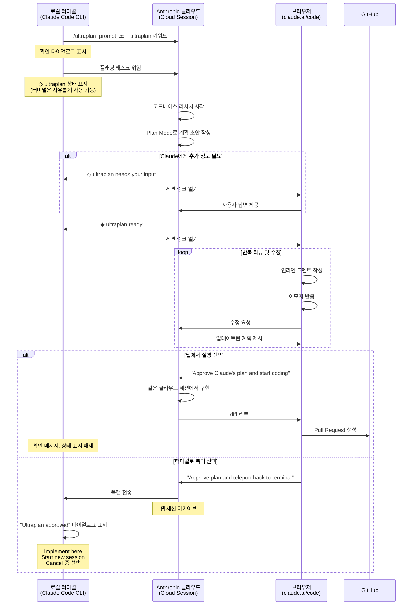
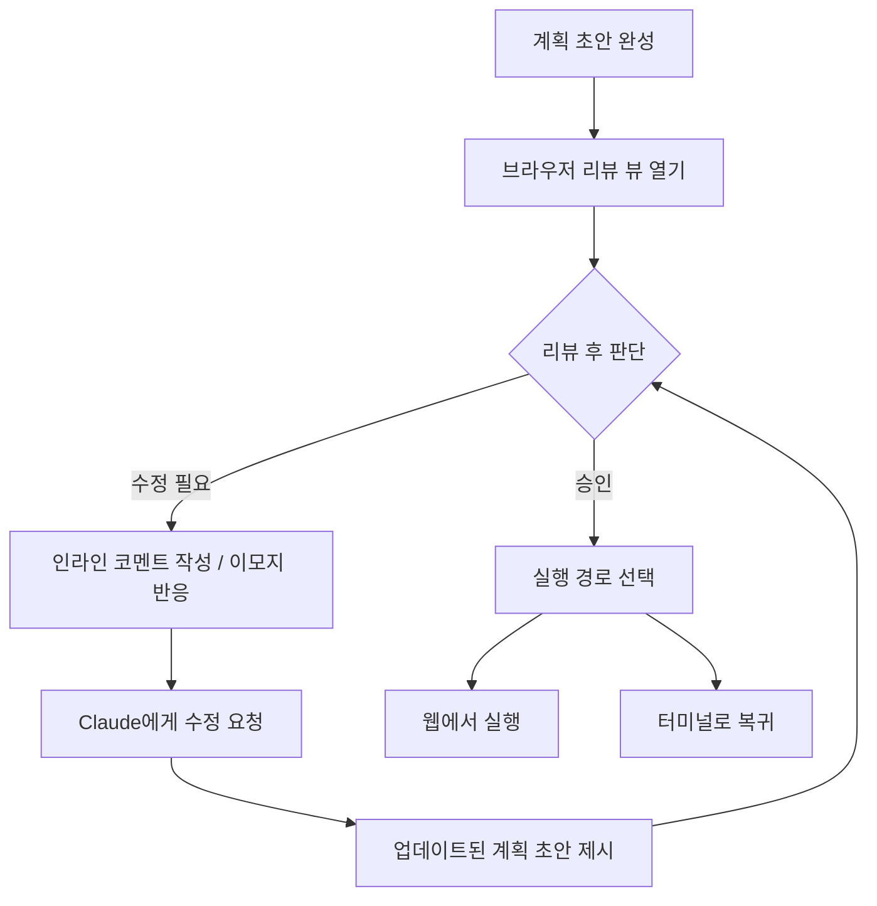
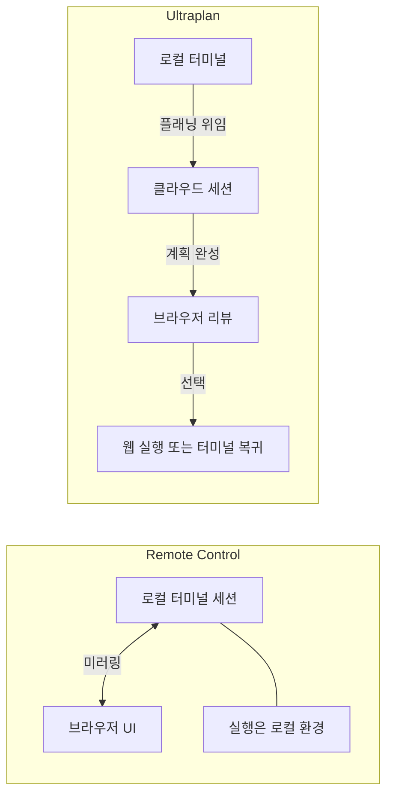

> **작성일**: 2026년 4월 11일  
> **기준 버전**: Claude Code v2.1.91  
> **상태**: Research Preview (리서치 프리뷰)  
> **출처**: https://code.claude.com/docs/en/ultraplan

---

## 목차

1. [Ultraplan이란 무엇인가](#1-ultraplan이란-무엇인가)
2. [왜 Ultraplan이 등장했는가 — 설계 철학](#2-왜-ultraplan이-등장했는가--설계-철학)
3. [아키텍처 개요 — 어떻게 동작하는가](#3-아키텍처-개요--어떻게-동작하는가)
4. [전제 조건 및 제약사항](#4-전제-조건-및-제약사항)
5. [CLI에서 Ultraplan 시작하기 — 세 가지 진입 경로](#5-cli에서-ultraplan-시작하기--세-가지-진입-경로)
6. [클라우드 세션 상태 모니터링](#6-클라우드-세션-상태-모니터링)
7. [브라우저에서 플랜 리뷰 및 반복](#7-브라우저에서-플랜-리뷰-및-반복)
8. [실행 경로 선택 — 두 갈래 분기](#8-실행-경로-선택--두-갈래-분기)
9. [Remote Control과의 관계 및 차이](#9-remote-control과의-관계-및-차이)
10. [Plan Mode와의 연결 고리](#10-plan-mode와의-연결-고리)
11. [실전 시나리오별 활용 가이드](#11-실전-시나리오별-활용-가이드)
12. [버전 히스토리 및 최신 변경사항](#12-버전-히스토리-및-최신-변경사항)
13. [Ultraplan이 함의하는 개발 패러다임의 변화](#13-ultraplan이-함의하는-개발-패러다임의-변화)
14. [자주 묻는 질문 FAQ](#14-자주-묻는-질문-faq)

---

## 1. Ultraplan이란 무엇인가

Ultraplan은 Claude Code v2.1.91에서 리서치 프리뷰로 공개된 **클라우드-터미널 하이브리드 플래닝 기능**이다. 핵심 아이디어는 단순하지만 파급력이 크다. 개발자가 로컬 터미널에서 시작한 "계획 작성 작업"을 Anthropic의 클라우드 인프라로 **오프로드(offload)** 하고, 그 결과물을 브라우저의 풍부한 UI에서 리뷰·수정한 뒤, 다시 터미널 또는 웹 세션으로 보내 실행하는 전체 흐름을 하나의 연속적인 워크플로로 묶어준다.

전통적인 CLI 기반 플래닝의 한계는 명확했다. 긴 계획서가 터미널 스크롤로 출력될 때, 특정 섹션에 핀포인트 피드백을 달기 어렵고, 플랜이 생성되는 동안 터미널이 점유되며, 수정을 요청하려면 전체 응답을 상대로 다시 대화해야 했다. Ultraplan은 이 세 가지 불편을 모두 해결한다.

```
[로컬 터미널]  ──── 플래닝 태스크 위임 ────►  [Anthropic 클라우드]
     │                                              │
     │  (터미널은 자유롭게 다른 작업 가능)           │  Claude가 코드베이스 분석 후
     │                                              │  plan mode로 계획 초안 작성
     │  ◆ ultraplan ready 상태 확인                 │
     │ ◄────────── 준비 완료 알림 ─────────────────
     │
     ▼
[브라우저 - claude.ai/code]
  ├─ 인라인 코멘트 작성
  ├─ 이모지 반응
  ├─ 섹션 간 이동 (아웃라인 사이드바)
  └─ 반복 수정 후 실행 경로 결정
        ├─ "웹에서 실행" → PR 생성
        └─ "터미널로 복귀" → 로컬 실행
```

---

## 2. 왜 Ultraplan이 등장했는가 — 설계 철학

### 2.1 터미널 UI의 본질적 한계

터미널은 텍스트 스트림 처리에 최적화된 환경이다. 그러나 수백 줄에 달하는 기술 계획서를 리뷰하고 수정하는 작업은 근본적으로 **문서 편집** 패러다임에 가깝다. 특정 단락에 댓글을 달고, 섹션 단위로 승인/거부를 표시하고, 전체 구조를 시각적으로 파악하는 것은 터미널이 잘 하는 일이 아니다.

Anthropic은 이 인지적 불일치(cognitive mismatch)를 해결하기 위해 **플래닝 단계만 별도의 UI로 분리**하는 전략을 선택했다. 구현 단계는 여전히 터미널 또는 Claude Code on the web에서 이루어지지만, 플래닝만큼은 브라우저의 풍부한 인터페이스를 활용한다.

### 2.2 비동기 협업의 가능성

Ultraplan의 또 다른 설계 의도는 **플래닝을 비동기 작업으로 전환**하는 것이다. 클라우드 세션이 코드베이스를 분석하고 계획을 작성하는 동안, 개발자의 로컬 터미널은 완전히 자유롭다. 다른 작업을 계속할 수 있고, 나중에 `◆ ultraplan ready` 알림을 확인하면 된다.

이는 기존의 "질문하고 답을 기다리는" 동기적 상호작용 모델에서, "태스크를 위임하고 나중에 결과를 검토하는" 비동기 협업 모델로의 이행을 의미한다.

### 2.3 실행 유연성 — "Teleport" 개념

Ultraplan의 가장 독창적인 개념은 **"텔레포트(teleport)"** 다. 브라우저에서 계획을 확정한 뒤, 그 계획을 웹 세션에서 바로 실행할 수도 있고, 반대로 로컬 터미널로 "전송"해서 로컬 환경에서 실행할 수도 있다. 이 양방향 유연성은 아직 많은 AI 코딩 도구에서 볼 수 없는 특징이다.

---

## 3. 아키텍처 개요 — 어떻게 동작하는가



### 3.1 핵심 컴포넌트

**로컬 CLI 세션**: 사용자가 직접 조작하는 터미널 환경이다. Ultraplan 시작 후에도 다른 작업에 사용 가능하며, 상태 표시자(status indicator)를 통해 클라우드 세션의 진행 상황을 모니터링한다.

**Anthropic 클라우드 세션**: Ultraplan이 실제로 실행되는 환경이다. 사용자 계정의 기본 클라우드 환경(default cloud environment)에서 실행되며, Plan Mode로 설정된 Claude Code on the web 세션이다. 코드베이스를 리서치하고 계획을 초안화하는 무거운 작업을 담당한다.

**브라우저 리뷰 인터페이스**: claude.ai/code에서 제공되는 전용 리뷰 뷰다. 이 인터페이스는 일반적인 Claude Code on the web과 달리, 계획 리뷰에 특화된 UI 요소(인라인 코멘트, 이모지 반응, 아웃라인 사이드바)를 제공한다.

---

## 4. 전제 조건 및 제약사항

### 4.1 필수 요건

| 항목 | 요건 |
|------|------|
| Claude Code 버전 | **v2.1.91 이상** (최신 버전 권장) |
| 계정 | Claude Code on the web 계정 필요 |
| 저장소 | **GitHub 저장소** 연결 필수 |
| 네트워크 | Anthropic 클라우드 인프라 접근 가능해야 함 |

### 4.2 지원하지 않는 환경

Ultraplan은 Anthropic의 자체 클라우드 인프라에서 실행되기 때문에, 다음 서드파티 인프라 환경에서는 **사용 불가**하다:

- **Amazon Bedrock** — AWS 인프라 기반 배포
- **Google Cloud Vertex AI** — GCP 기반 배포  
- **Microsoft Foundry** — Azure 기반 배포

이는 Ultraplan이 단순한 API 호출이 아니라, Anthropic의 클라우드 환경과 긴밀하게 통합된 기능이기 때문이다. 온프레미스나 자체 클라우드 인프라에 Claude를 배포하는 엔터프라이즈 환경은 이 제약을 유념해야 한다.

### 4.3 Remote Control과의 상호 배타성

Remote Control 기능이 활성화된 상태에서 Ultraplan을 시작하면, **Remote Control 연결이 자동으로 해제**된다. 두 기능이 모두 `claude.ai/code` 인터페이스를 점유하기 때문에, 동시에 실행할 수 없다. Ultraplan 세션이 종료되면 Remote Control을 다시 연결할 수 있다.

---

## 5. CLI에서 Ultraplan 시작하기 — 세 가지 진입 경로

### 5.1 경로 1 — 명시적 커맨드 방식

`/ultraplan` 슬래시 커맨드를 사용하는 가장 직접적인 방법이다. 명령어 뒤에 작업 내용을 프롬프트로 이어서 작성한다.

```bash
/ultraplan migrate the auth service from sessions to JWTs
```

```bash
/ultraplan implement a distributed cache layer using Redis for the product catalog API
```

```bash
/ultraplan refactor the payment processing module to support Stripe and PayPal as pluggable adapters
```

이 경로에서는 실행 전 **확인 다이얼로그**가 표시된다. 사용자가 Ultraplan 시작을 명시적으로 승인해야 클라우드 세션이 시작된다.

### 5.2 경로 2 — 키워드 삽입 방식

일반 프롬프트 어디에나 `ultraplan`이라는 단어를 포함시키면, Claude Code가 자동으로 이를 감지하고 Ultraplan 모드를 활성화한다.

```bash
# 자연어 문장에 ultraplan 키워드 삽입
I need to ultraplan the entire test infrastructure overhaul

# 단어 위치는 어디든 무관
Let's ultraplan how we should migrate from REST to GraphQL across all microservices

# 명사처럼 사용
Run an ultraplan on the database schema migration
```

이 방식도 실행 전 확인 다이얼로그가 표시된다.

### 5.3 경로 3 — 로컬 플랜 → Ultraplan 업그레이드

로컬 세션에서 Plan Mode로 계획을 작성한 뒤, Claude가 승인 다이얼로그를 표시할 때 선택할 수 있는 옵션이다.

```
Claude가 로컬에서 계획 초안 완성 →
  승인 다이얼로그 표시:
    ├─ Yes, implement → 로컬 실행
    ├─ No, modify → 로컬 수정 요청
    └─ [★] No, refine with Ultraplan on Claude Code on the web → Ultraplan으로 전환
```

이 경로의 특징은 **확인 다이얼로그를 건너뛴다**는 점이다. 사용자가 Ultraplan 전환을 선택한 행위 자체가 이미 확인으로 처리되기 때문이다. 로컬에서 초안을 잡고 클라우드에서 정제하는 2단계 워크플로를 구성할 때 유용하다.

---

## 6. 클라우드 세션 상태 모니터링

Ultraplan이 시작된 후, 로컬 터미널의 프롬프트 입력창은 클라우드 세션의 진행 상황을 실시간으로 표시하는 **상태 표시자(status indicator)** 를 보여준다. 이 상태 표시자는 3가지 상태를 가진다.

### 6.1 상태 표 상세 설명

| 상태 기호 | 상태명 | 의미 | 사용자 행동 |
|-----------|--------|------|-------------|
| `◇ ultraplan` | 작업 중 | Claude가 코드베이스를 리서치하고 계획 초안을 작성 중 | 터미널에서 다른 작업 가능 |
| `◇ ultraplan needs your input` | 입력 대기 | Claude에게 추가 정보나 결정이 필요한 상황 | 세션 링크를 열어 브라우저에서 답변 제공 |
| `◆ ultraplan ready` | 완료 | 계획이 완성되어 리뷰 준비 완료 | 브라우저에서 계획 검토 시작 |

`◇`(빈 다이아몬드)는 진행 중, `◆`(채워진 다이아몬드)는 완료를 의미하는 시각적 구분이다.

### 6.2 /tasks 명령으로 상세 정보 확인

터미널에서 `/tasks`를 실행하면 Ultraplan 항목을 선택해 세부 정보를 볼 수 있다.

```bash
/tasks
```

태스크 상세 뷰에는 다음 정보가 포함된다:
- **세션 링크**: 브라우저에서 열 수 있는 직접 URL
- **에이전트 활동 로그**: Claude가 코드베이스에서 무엇을 분석했는지 확인
- **Stop ultraplan 액션**: 세션 강제 종료 옵션

Ultraplan을 중단하면 클라우드 세션이 **아카이브**되고 상태 표시자가 사라진다. 중간 작업 결과는 터미널에 저장되지 않는다는 점을 유의해야 한다.

---

## 7. 브라우저에서 플랜 리뷰 및 반복

상태가 `◆ ultraplan ready`로 바뀌면, 세션 링크를 통해 브라우저를 열어 계획 리뷰를 시작한다. 이 단계가 Ultraplan의 핵심 가치를 제공하는 부분이다.

### 7.1 전용 리뷰 뷰 (Dedicated Review View)

Ultraplan의 브라우저 인터페이스는 일반 Claude Code on the web과 다른 **전용 리뷰 뷰**를 제공한다. 이 뷰는 장문의 기술 계획서를 읽고, 피드백을 제공하고, 수정을 요청하는 작업에 최적화되어 있다.

#### 인라인 코멘트 (Inline Comments)

계획서의 어떤 문장이나 단락이든 텍스트를 드래그해서 선택하면 코멘트를 달 수 있다. 이는 코드 리뷰 도구(GitHub, GitLab)의 인라인 코멘트 경험과 유사하다.

```
예시 시나리오:
"Redis 캐시 레이어를 API Gateway 앞에 두는 방식" 단락 선택
→ "실제로는 서비스 레이어에서 캐싱하는 게 낫지 않을까? 
   API Gateway 수준에서 캐싱하면 인증 컨텍스트를 잃을 수 있음"
→ Claude가 해당 섹션을 수정한 새 초안 제시
```

#### 이모지 반응 (Emoji Reactions)

특정 섹션에 대해 전체 문장을 작성하지 않고도 빠르게 피드백을 전달할 수 있다. 승인을 나타내는 이모지(👍, ✅)나 우려를 나타내는 이모지(🤔, ⚠️)를 통해 Claude에게 섹션 단위의 신호를 보낼 수 있다.

#### 아웃라인 사이드바 (Outline Sidebar)

긴 계획서의 각 섹션을 목차 형태로 표시하며, 클릭 한 번으로 원하는 섹션으로 이동할 수 있다. 수십 개의 마이크로서비스 마이그레이션 계획처럼 복잡한 문서에서 특히 유용하다.

### 7.2 반복적 수정 (Iterative Refinement)

코멘트나 이모지 반응을 통해 Claude에게 수정을 요청하면, Claude는 해당 피드백을 반영한 **업데이트된 계획 초안**을 제시한다. 실행을 확정하기 전까지 이 과정을 원하는 만큼 반복할 수 있다.



---

## 8. 실행 경로 선택 — 두 갈래 분기

계획이 만족스러우면 브라우저에서 실행 경로를 선택한다. 두 가지 옵션이 있으며, 각각 다른 실행 컨텍스트를 의미한다.

### 8.1 웹에서 실행

**버튼**: "Approve Claude's plan and start coding"

이 옵션을 선택하면 **같은 클라우드 세션에서 바로 구현이 시작**된다. 별도의 컨텍스트 전환 없이 계획 → 실행이 연속적으로 이어진다.

실행 후 흐름:
1. 로컬 터미널에 확인 메시지 표시, 상태 표시자 해제
2. 클라우드 세션에서 Claude가 구현 작업 시작
3. 구현 완료 후 diff 리뷰 UI 제공
4. 브라우저에서 바로 Pull Request 생성 가능

**적합한 상황**: 로컬 환경 접근이 필요 없는 작업, 클라우드에서 전체를 완결짓고 싶은 경우, 팀원과 공유하기 쉬운 PR을 빠르게 만들어야 할 때.

### 8.2 터미널로 복귀 (Teleport)

**버튼**: "Approve plan and teleport back to terminal"

이 옵션은 계획을 로컬 터미널로 "전송"하고, 로컬 환경에서 구현을 진행한다. **"Teleport"** 라는 명칭이 인상적인데, 계획이 브라우저에서 터미널로 마법처럼 이동하는 개념을 표현한다.

**중요한 전제조건**: 이 옵션은 세션이 CLI에서 시작되었고 터미널이 여전히 폴링(polling) 중일 때만 나타난다. 터미널을 완전히 닫거나 세션을 종료했다면 이 옵션을 선택할 수 없다.

웹 세션은 자동으로 **아카이브**되어, 터미널과 웹이 동시에 같은 작업을 병렬로 진행하는 상황을 방지한다.

#### 터미널에서의 "Ultraplan approved" 다이얼로그

플랜이 전송되면 터미널에 아래와 같은 다이얼로그가 나타난다.

```
┌─────────────────────────────────────┐
│         Ultraplan approved           │
│                                     │
│  [1] Implement here                 │
│      현재 대화에 플랜 주입, 이어서 진행│
│                                     │
│  [2] Start new session              │
│      현재 대화 초기화 후 플랜만 컨텍스트│
│      로 새 세션 시작                  │
│                                     │
│  [3] Cancel                         │
│      파일로 저장 (Claude가 경로 출력) │
└─────────────────────────────────────┘
```

| 옵션 | 동작 | 적합한 상황 |
|------|------|------------|
| **Implement here** | 현재 대화 컨텍스트에 플랜 주입 | 이전 대화 맥락이 구현에 필요한 경우 |
| **Start new session** | 대화 초기화, 플랜만 컨텍스트로 시작 | 깨끗한 상태에서 구현 시작, 컨텍스트 윈도우 절약 |
| **Cancel** | 플랜을 파일로 저장 | 지금 당장 구현하지 않고 나중에 참고할 때 |

**Start new session** 선택 시, Claude는 이전 대화로 돌아갈 수 있는 `claude --resume` 명령을 출력한다. 따라서 이전 작업을 완전히 잃지 않는다.

---

## 9. Remote Control과의 관계 및 차이

Ultraplan을 올바르게 이해하려면 **Remote Control**과의 차이를 명확히 알아야 한다. 두 기능 모두 `claude.ai/code` 인터페이스를 활용하지만, 목적과 작동 방식이 전혀 다르다.



| 구분 | Remote Control | Ultraplan |
|------|---------------|-----------|
| **목적** | 로컬 세션을 브라우저로 조작 | 계획을 클라우드에서 작성하고 리뷰 |
| **실행 위치** | 로컬 환경 | Anthropic 클라우드 (또는 선택 후 로컬) |
| **동시 사용** | 불가 (Ultraplan과 상호 배타) | 불가 (Remote Control과 상호 배타) |
| **GitHub 요구** | 불필요 | **필수** |
| **오프라인 지원** | 가능 (로컬 실행) | 불가 |
| **Bedrock/Vertex 지원** | 가능 | **불가** |
| **주요 가치** | 터미널 세션의 원격 접근성 | 풍부한 플랜 리뷰 UI + 비동기 작성 |

---

## 10. Plan Mode와의 연결 고리

Ultraplan은 기존의 **Plan Mode** 위에 구축된 기능이다. Plan Mode는 Claude가 코드를 직접 수정하지 않고 계획만 수립하는 모드로, 실행 전에 전략을 검토하고 승인하는 흐름을 제공한다.

### 10.1 Plan Mode 복습

로컬 세션에서 Plan Mode를 사용하면:

```bash
# Plan Mode 진입
/plan
# 또는
/plan fix the memory leak in the connection pool
```

Claude는 코드를 수정하지 않고 어떻게 작업할지 계획만 제시한다. 사용자가 승인하면 비로소 실행된다.

### 10.2 Ultraplan = 클라우드 Plan Mode + 리치 리뷰 UI

Ultraplan은 이 Plan Mode를 다음 두 가지 차원에서 확장한다:

**차원 1 — 클라우드 오프로드**: Plan Mode의 계획 작성 단계를 Anthropic 클라우드로 이전. 로컬 컴퓨터 리소스 절약, 터미널 자유 확보.

**차원 2 — 리치 리뷰 인터페이스**: 완성된 계획을 터미널 텍스트가 아닌 브라우저의 전용 UI에서 리뷰. 섹션별 코멘트, 이모지 반응, 아웃라인 네비게이션 제공.

### 10.3 v2.1.91 Plan Mode 관련 버그픽스

최신 changelog에 따르면, v2.1.91에서 다음 Plan Mode 버그가 수정되었다:

> "Fixed plan mode in remote sessions losing track of the plan file after a container restart, which caused permission prompts on plan edits and an empty plan-approval modal"

컨테이너 재시작 후 플랜 파일 추적이 실패하고 승인 모달이 비어있던 버그가 수정되어, Remote 환경에서의 Plan Mode 안정성이 개선되었다.

---

## 11. 실전 시나리오별 활용 가이드

### 시나리오 1: 대규모 아키텍처 마이그레이션 계획

**상황**: 세션 기반 인증을 JWT로 전환하는 마이그레이션. 영향 받는 파일이 50개 이상, 단계적 롤아웃 계획 필요.

```bash
# 터미널에서 Ultraplan 시작
/ultraplan migrate the auth service from sessions to JWTs
# 확인 다이얼로그 → 승인

# ◇ ultraplan 상태 동안 → 다른 작업 진행
git fetch origin && git pull
# 또는 코드 리뷰, 문서 작업 등

# ◆ ultraplan ready 확인 후 브라우저 오픈
# → "Phase 1: Token Infrastructure" 섹션에 코멘트:
#    "Refresh token rotation 전략도 포함해줘, 
#     현재 계획에 없는 것 같음"
# → Claude 수정 후 새 초안
# → 리뷰 완료 → "Approve plan and teleport back to terminal"
# → Implement here 선택

# 로컬 환경 전체 접근 권한으로 구현 시작
```

**이 시나리오에서 Ultraplan이 유리한 이유**: 복잡한 계획은 브라우저에서 섹션별 리뷰가 훨씬 효율적이다. 로컬 환경(DB 접근, 기존 설정파일 등)이 필요하므로 터미널 복귀 경로 선택.

### 시나리오 2: 빠른 기능 구현 후 PR 생성

**상황**: 새 API 엔드포인트 추가. 상대적으로 단순한 작업이지만 계획을 먼저 검토하고 싶음.

```bash
# ultraplan 키워드로 자연스럽게 시작
Can you ultraplan the implementation of a rate limiting middleware?

# 브라우저에서 계획 확인
# → 전체적으로 괜찮음
# → "Approve Claude's plan and start coding" 선택

# 클라우드에서 바로 구현 → PR 생성
```

**이 시나리오에서 Ultraplan이 유리한 이유**: 단순 작업이라 로컬 환경 없이 클라우드에서 완결 가능. PR 생성까지 브라우저 내에서 완료.

### 시나리오 3: 로컬 플랜의 품질 개선

**상황**: 로컬에서 플랜을 짰는데 Claude의 초안이 만족스럽지 않아 더 심층적인 리뷰가 필요한 상황.

```bash
# 로컬 Plan Mode에서 시작
/plan

# Claude가 계획 초안 완성 → 승인 다이얼로그 표시
# → "No, refine with Ultraplan on Claude Code on the web" 선택

# 로컬 초안을 클라우드로 전송
# 브라우저에서 섹션별 정밀 리뷰
# 완성 후 터미널로 복귀 또는 웹에서 실행
```

**이 시나리오에서 Ultraplan이 유리한 이유**: 로컬에서 이미 시작한 계획을 폐기하지 않고 클라우드 리뷰 환경으로 업그레이드할 수 있다.

### 시나리오 4: Claude에게 추가 정보 필요한 경우

```bash
/ultraplan redesign the caching strategy

# ◇ ultraplan needs your input 상태 감지
# → 세션 링크 열기
# → Claude: "현재 사용 중인 캐시 솔루션이 무엇인가요? 
#             Redis, Memcached, 또는 다른 것?"
# → 브라우저에서 답변: "Redis Cluster, 현재 버전 7.2"
# → Claude가 계속 계획 작성
# → ◆ ultraplan ready
```

---

## 12. 버전 히스토리 및 최신 변경사항

### 12.1 Ultraplan 도입 — v2.1.91 (2026년 4월 2일)

Ultraplan은 v2.1.91에서 리서치 프리뷰로 처음 공개되었다. 이 버전에서 함께 추가된 주요 변경사항 중 Ultraplan과 관련된 것들:

- **Plan Mode 원격 세션 버그픽스**: 컨테이너 재시작 후 플랜 파일을 잃어버리는 문제 수정 (Ultraplan의 안정성 기반)
- **MCP 도구 결과 최대 크기 확장**: `_meta["anthropic/maxResultSizeChars"]` 어노테이션으로 최대 500K까지 허용 (코드베이스 리서치 능력 향상)
- **멀티라인 프롬프트 딥링크 지원**: `claude-cli://open?q=` 딥링크에서 인코딩된 개행(`%0A`) 지원

### 12.2 Ultraplan 직전 릴리즈들의 관련 맥락

**v2.1.90 (2026년 4월 1일)**
- `/powerup` 추가 — Claude Code 기능을 가르치는 인터랙티브 레슨
- `--resume` 프롬프트 캐시 미스 버그 수정 (deferred tools, MCP servers, custom agents 사용자 영향)
- auto mode 개선: 명시적 사용자 경계("don't push", "wait for X before Y") 존중

**v2.1.89 (2026년 4월 1일)**
- `"defer"` 권한 결정 추가 (헤드리스 세션에서 도구 호출 일시 중지 후 재개 가능)
- `PermissionDenied` 훅 추가 (auto mode 분류기 거부 후 재시도 지원)
- CJK 문자 포함 프롬프트 히스토리 항목 손실 버그 수정

**v2.1.70 (2026년 3월 6일) — VSCode Plan 리뷰 강화**
- VSCode에 플랜 전용 마크다운 문서 뷰 추가, 코멘트 기능 지원
- 이는 Ultraplan의 브라우저 리뷰 인터페이스의 선행 버전으로 볼 수 있다

**v2.1.47 (2026년 2월 18일) — VSCode Plan Preview 개선**
- 계획이 반복될 때 자동 업데이트
- 검토 준비 완료 시에만 코멘트 활성화
- 거절 후에도 Claude가 수정할 수 있도록 프리뷰 유지

이 흐름을 보면, Anthropic이 수 주에 걸쳐 VSCode에서 Plan 리뷰 UI를 점진적으로 발전시키다가, 이를 독립적인 기능인 Ultraplan으로 확장했음을 알 수 있다.

---

## 13. Ultraplan이 함의하는 개발 패러다임의 변화

### 13.1 "Plan as a First-Class Citizen"

Ultraplan은 단순한 편의 기능이 아니다. 이 기능은 소프트웨어 개발에서 **계획 단계를 독립적이고 격식 있는(first-class) 아티팩트**로 취급해야 한다는 철학을 반영한다.

기존의 AI 코딩 도구들은 대체로 "코드를 생성하는" 방향으로 최적화되어 있었다. 계획은 있더라도 암묵적이거나, 생성된 코드 앞에 간단히 붙는 서술 정도였다. Ultraplan은 계획 자체에 독립적인 UI, 전용 리뷰 흐름, 버전 관리(반복 수정)를 부여한다.

### 13.2 비동기 AI 협업의 일상화

Ultraplan의 "터미널은 자유롭게"라는 설계 철학은 AI와의 협업이 동기적(synchronous)일 필요가 없다는 것을 보여준다. 인간이 AI에게 태스크를 위임하고, AI가 처리하는 동안 인간은 다른 일을 하다가, 나중에 결과를 검토하는 **비동기 협업** 패턴이 일상화될 것임을 암시한다.

이는 단순한 UX 개선이 아니라, "AI와 함께 일하는 방식"의 근본적인 재정의다.

### 13.3 클라우드-로컬 하이브리드 개발 환경

Ultraplan은 코딩 작업을 클라우드와 로컬 환경 사이에서 **유동적으로 이동**시킨다. 계획은 클라우드에서, 실행은 선택에 따라 클라우드 또는 로컬에서. 이 하이브리드 모델은 앞으로 AI 코딩 도구의 표준적인 아키텍처가 될 가능성이 높다.

### 13.4 "Teleport"의 상징성

"Teleport"라는 단어 선택은 흥미롭다. 단순히 "계획을 전송한다"고 표현할 수도 있었지만, Anthropic은 텔레포트라는 SF적 은유를 선택했다. 이는 클라우드와 로컬의 경계가 점점 투명해져, 마치 같은 공간에서 일하는 것처럼 느껴지게 하는 것이 목표임을 시사한다.

---

## 14. 자주 묻는 질문 FAQ

**Q: Ultraplan 사용 시 추가 비용이 발생하나요?**  
A: 공식 문서에는 명시되어 있지 않다. Anthropic 클라우드 세션을 사용하므로 계정 플랜의 사용량에 포함될 가능성이 높다. 리서치 프리뷰 기간이므로 추후 변경될 수 있다.

**Q: GitHub 저장소가 없으면 사용할 수 없나요?**  
A: 공식 문서에 따르면 GitHub 저장소가 필수 요건이다. GitLab이나 Bitbucket은 현재 지원하지 않는 것으로 보인다.

**Q: Ultraplan이 실행 중 터미널을 종료하면 어떻게 되나요?**  
A: 클라우드 세션은 계속 실행된다. 단, 터미널 복귀(Teleport) 옵션은 사용할 수 없게 되며, 브라우저에서 "Approve Claude's plan and start coding" (웹 실행) 옵션만 선택 가능하다. Cancel을 선택하면 파일로 저장된다.

**Q: 클라우드 세션이 보는 코드베이스는 어떤 기준으로 결정되나요?**  
A: 계정의 기본 클라우드 환경(default cloud environment)과 연결된 GitHub 저장소를 기반으로 한다. 로컬에만 있는 변경사항은 포함되지 않을 수 있으므로, 중요한 로컬 변경사항은 먼저 커밋하고 푸시하는 것이 권장된다.

**Q: Ultraplan 세션과 일반 Claude Code on the web 세션의 차이는?**  
A: Ultraplan으로 시작된 세션은 Plan Mode가 활성화된 상태로 시작되며, 전용 리뷰 UI(인라인 코멘트, 이모지 반응)가 제공된다. 또한 터미널 복귀(Teleport) 옵션이 추가로 제공된다.

**Q: /tasks에서 Ultraplan을 Stop 하면 작업 내용은 어떻게 되나요?**  
A: 클라우드 세션이 아카이브되고 상태 표시자가 사라진다. 공식 문서에 따르면 "nothing is saved to your terminal" — 터미널에는 저장되지 않는다. 중간 결과물이 필요하다면 Stop 전에 브라우저에서 내용을 복사해두어야 한다.

**Q: Ultraplan을 사용하는 동안 Remote Control을 쓸 수 없나요?**  
A: 그렇다. 두 기능이 모두 claude.ai/code 인터페이스를 점유하므로 동시 사용이 불가능하다. Ultraplan이 끝나면 Remote Control을 다시 연결할 수 있다.

**Q: "Start new session" 선택 후 이전 대화로 돌아가려면?**  
A: Claude가 출력하는 `claude --resume [session-id]` 명령을 실행하면 된다. 이전 대화 컨텍스트로 복귀할 수 있다.

---

## 참고 자료

- [공식 Ultraplan 문서](https://code.claude.com/docs/en/ultraplan)
- [Claude Code on the web 문서](https://code.claude.com/docs/en/claude-code-on-the-web)
- [Plan Mode 문서](https://code.claude.com/docs/en/permission-modes#analyze-before-you-edit-with-plan-mode)
- [Remote Control 문서](https://code.claude.com/docs/en/remote-control)
- [Claude Code Changelog](https://code.claude.com/docs/en/changelog)

---

*이 문서는 Claude Code v2.1.91 기준으로 작성되었으며, Ultraplan은 현재 리서치 프리뷰 상태입니다. 기능과 동작 방식은 피드백에 따라 변경될 수 있습니다.*
