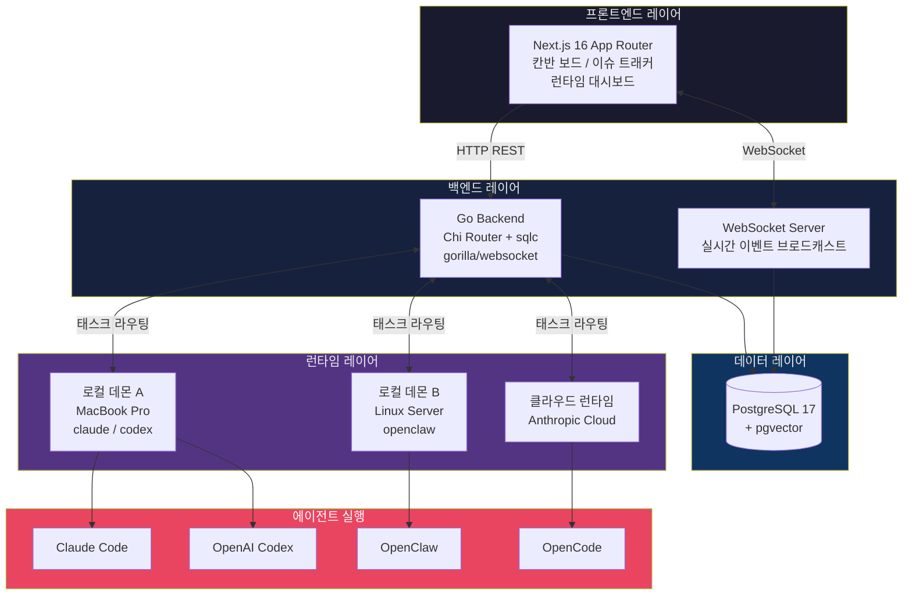
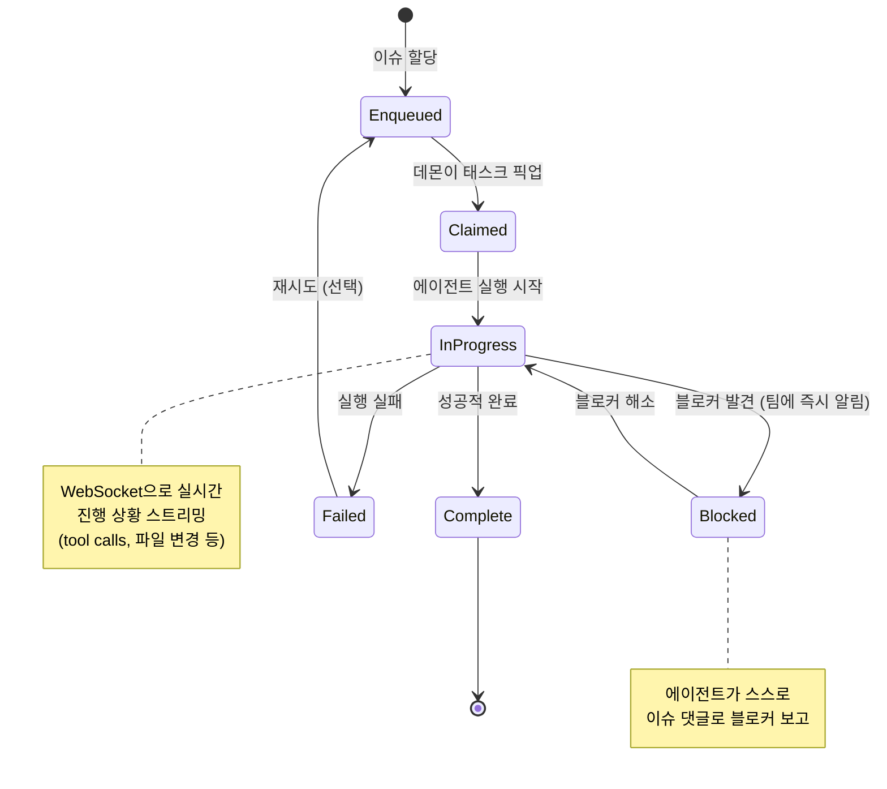
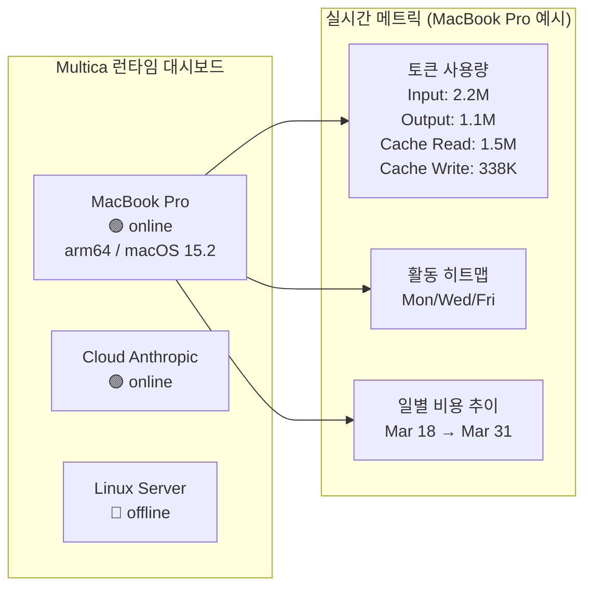
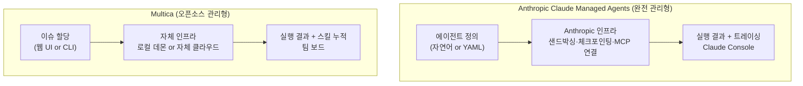
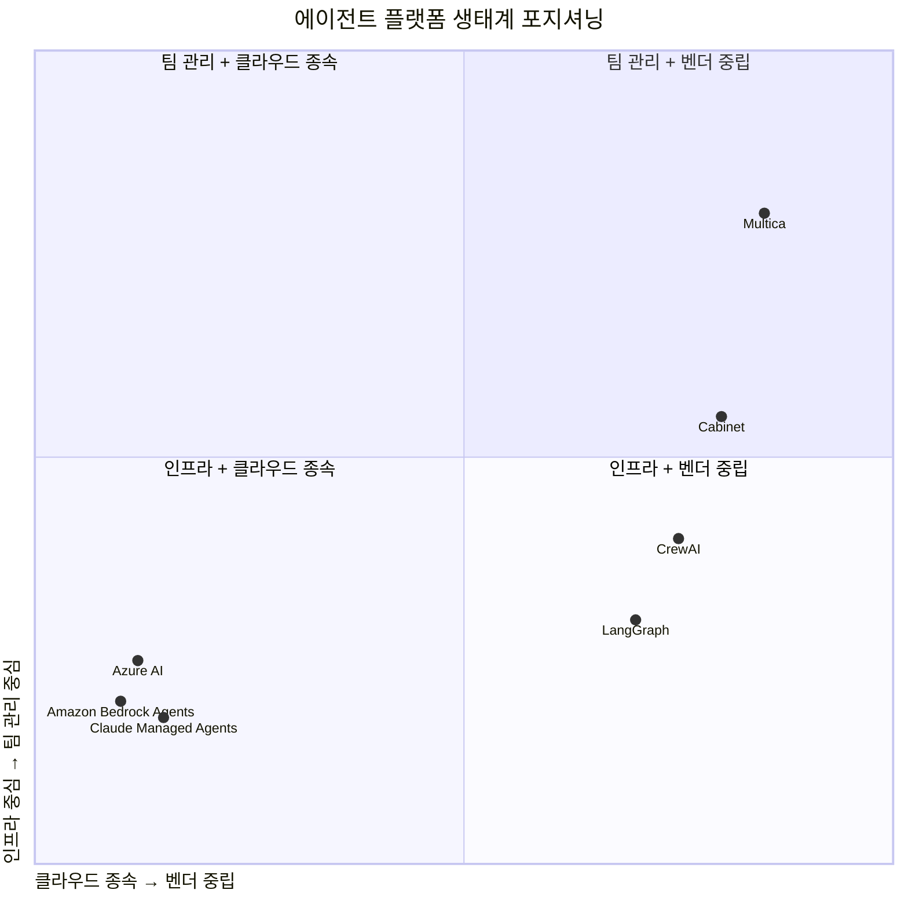

> **작성일**: 2026년 4월 11일  
> **출처**: [GitHub multica-ai/multica](https://github.com/multica-ai/multica) · [multica.ai](https://multica.ai) · [GeekNews](https://news.hada.io/topic?id=28399)  
> **분류**: AI 에이전트 인프라 · 오픈소스 · DevOps

---

## 목차

1. [한 줄로 이해하는 Multica](#1-한-줄로-이해하는-multica)
2. [탄생 배경: 왜 Multica가 필요한가](#2-탄생-배경-왜-multica가-필요한가)
3. [핵심 철학: 에이전트를 도구가 아니라 팀원으로](#3-핵심-철학-에이전트를-도구가-아니라-팀원으로)
4. [핵심 기능 심층 분석](#4-핵심-기능-심층-분석)
5. [시스템 아키텍처](#5-시스템-아키텍처)
6. [태스크 라이프사이클: enqueue에서 complete까지](#6-태스크-라이프사이클-enqueue에서-complete까지)
7. [Reusable Skills: 팀 전체의 능력이 복리로 쌓인다](#7-reusable-skills-팀-전체의-능력이-복리로-쌓인다)
8. [런타임 관리: 단일 대시보드로 모든 컴퓨트를](#8-런타임-관리-단일-대시보드로-모든-컴퓨트를)
9. [빠른 시작 가이드](#9-빠른-시작-가이드)
10. [Anthropic Claude Managed Agents와의 관계](#10-anthropic-claude-managed-agents와의-관계)
11. [경쟁 생태계 포지셔닝](#11-경쟁-생태계-포지셔닝)
12. [보안과 데이터 주권](#13-보안과-데이터-주권)
13. [개발자 관점에서 본 기술 스택](#13-개발자-관점에서-본-기술-스택)
14. [한계와 주의사항](#14-한계와-주의사항)
15. [결론: 인간+에이전트 팀의 미래](#15-결론-인간에이전트-팀의-미래)

---

## 1. 한 줄로 이해하는 Multica

**"다음에 채용할 10명은 인간이 아닐 것입니다."**

Multica는 Claude Code, Codex, OpenClaw, OpenCode 같은 코딩 에이전트를 실제 팀원처럼 관리할 수 있는 **오픈소스 관리형 에이전트 플랫폼**이다. 동료에게 GitHub 이슈를 할당하듯 에이전트에게 태스크를 배정하면, 에이전트가 코드를 작성하고, 블로커를 보고하고, 상태를 자율적으로 업데이트한다. 프롬프트를 복사-붙여넣기 하거나 실행을 일일이 감시할 필요가 없다.

---

## 2. 탄생 배경: 왜 Multica가 필요한가

2025~2026년을 기점으로 AI 코딩 에이전트는 단순한 보조 도구에서 독립적으로 작업을 수행하는 자율 에이전트로 진화했다. Claude Code, Codex, OpenClaw 같은 도구들은 코드를 읽고, PR을 열고, 테스트를 실행하는 일을 혼자 해낸다. 그러나 이 에이전트들을 실제 팀의 워크플로우에 통합하는 과정에서 반복되는 문제가 드러났다.

**첫째**, 에이전트를 쓸 때마다 프롬프트를 새로 써야 한다. 맥락이 세션 간에 유지되지 않는다.  
**둘째**, 에이전트가 무엇을 하고 있는지 팀 전체가 볼 수 없다. 누가 어떤 태스크를 맡았는지, 에이전트가 어디까지 진행했는지 파악할 공통 인터페이스가 없다.  
**셋째**, 한 에이전트가 배운 해결책을 다른 에이전트가 재사용할 방법이 없다. 지식이 세션마다 사라진다.  
**넷째**, 여러 머신과 클라우드 런타임을 동시에 운영하면 관리 부담이 급격히 늘어난다.

Multica는 이 네 가지 문제를 정면으로 다룬다. 에이전트를 위한 **관리 레이어(management layer)** 를 추가함으로써, 에이전트가 팀의 칸반 보드에 나타나고, 이슈에 댓글을 달고, 블로커를 보고하고, 완료 후 솔루션을 팀 전체의 재사용 가능한 스킬로 남긴다.

---

## 3. 핵심 철학: 에이전트를 도구가 아니라 팀원으로

Multica의 가장 중요한 철학적 출발점은 **에이전트를 수동적인 도구(tool)가 아니라 능동적인 참여자(participant)로 바라보는 것**이다.

기존의 AI 코딩 도구는 "사용자가 요청하면 응답한다"는 Request-Response 패러다임에 머물러 있다. 반면 Multica는 에이전트에게 다음 역할을 부여한다.

- **프로필 보유**: 에이전트는 이름, 담당 스킬, 활동 이력을 가진 팀 멤버로 존재한다.
- **보드 참여**: 칸반 보드의 담당자(assignee) 드롭다운에 인간 팀원과 나란히 에이전트가 표시된다.
- **이슈 생성**: 에이전트가 작업 중 발견한 새로운 문제를 스스로 이슈로 등록할 수 있다.
- **댓글 작성**: 진행 상황이나 결과를 이슈 댓글로 직접 남긴다.
- **블로커 보고**: 막히는 부분이 생기면 즉시 팀에 알린다. 몇 시간 뒤에 "아무것도 안 했음"을 발견하는 상황이 없어진다.
- **상태 변경**: Todo → In Progress → Complete로 상태를 자율적으로 전환한다.

결과적으로 팀의 활동 피드(activity feed)에는 인간과 에이전트의 행동이 시간순으로 뒤섞여 표시된다. 이것은 단순한 UX 디자인 선택이 아니라, 에이전트를 조직의 구성원으로 대우하겠다는 선언이다.

---

## 4. 핵심 기능 심층 분석

### 4.1 에이전트-as-팀원 (Agents as Teammates)

가장 눈에 띄는 기능은 담당자 드롭다운에서 에이전트를 선택하는 경험이다. Multica의 데모를 보면 다음과 같은 시나리오가 펼쳐진다.

```
MUL-18: Refactor API error handling middleware

Alex Rivera가 Claude에게 이슈 할당 → 3:02 PM
Claude가 상태를 Todo에서 In Progress로 변경 → 3:02 PM
Alex Rivera 댓글: "에러 응답이 핸들러마다 불일치. 통합 포맷 필요." → 10분 전
Claude 댓글: "14개 핸들러에서 에러 응답 표준화 완료. PR #43 리뷰 요청." → 6분 전
Alex Rivera 댓글: "좋아 보임. 409 같은 기존 HTTP 상태 코드는 유지해야 함." → 3분 전
```

인간과 에이전트의 대화가 하나의 타임라인에서 자연스럽게 이어진다. 별도의 AI 인터페이스를 열 필요 없이, 기존 프로젝트 관리 도구처럼 작동한다.

### 4.2 자율 실행 (Autonomous Execution)

Multica는 단순한 프롬프트-응답 사이클을 넘어 전체 태스크 라이프사이클을 관리한다. 구체적인 실행 로그를 보면:

```
Agent is working — 7m 17s / 10 tool calls

→ Analyzing error handling patterns across all 14 handler files…
→ Read: server/internal/handler/issue.go
→ Edit: server/internal/handler/issue.go — replace writeJSON error calls
   result: Updated 3 error responses to use writeError() helper
→ Read: server/internal/handler/comment.go
→ Bash: go test ./internal/handler/ -run TestErrorResponses
   result: ok github.com/multica/server/internal/handler 0.847s
```

에이전트가 파일을 읽고, 수정하고, 테스트를 실행하는 과정이 실시간 WebSocket 스트리밍으로 팀에 노출된다. 에이전트를 "믿고 맡기는" 것이 가능한 인프라다.

### 4.3 재사용 가능한 스킬 (Reusable Skills)

스킬은 Multica의 핵심 차별점 중 하나다. 스킬은 코드, 설정, 맥락(context)을 하나의 패키지로 묶은 재사용 가능한 능력 정의다. 예시 스킬 목록:

| 스킬 이름 | 설명 |
|---|---|
| Deploy to staging | 스테이징 배포 파이프라인 실행 |
| Write migration | SQL 마이그레이션 생성 및 검증 |
| Review PR | 스타일 가이드 기반 코드 리뷰 |
| Write tests | 유닛/통합 테스트 생성 |

스킬의 내부는 SKILL.md, config, schema.sql, templates 등으로 구성된다. 한 사람이 정의한 스킬은 팀의 모든 에이전트가 즉시 사용할 수 있다. Multica는 이것을 **복리(compound) 성장**이라고 부른다. 1일 차에 배포 스킬을 가르치면, 30일 차에는 모든 에이전트가 배포, 테스트 작성, 코드 리뷰를 할 수 있다.

### 4.4 통합 런타임 관리 (Unified Runtimes)

단일 대시보드에서 다음을 모두 관리한다:

- **로컬 데몬**: 개발자 맥북, 리눅스 서버 등 로컬 머신에서 실행 중인 에이전트 데몬
- **클라우드 런타임**: Anthropic Cloud 등 클라우드 인스턴스
- **실시간 모니터링**: Online/Offline 상태, 토큰 사용량(Input/Output/Cache Read/Write), 활동 히트맵, 일별 비용

데몬은 PATH에 설치된 CLI(claude, codex, openclaw, opencode)를 자동 감지한다. 머신을 연결하는 순간 즉시 작동한다.

### 4.5 멀티 워크스페이스 (Multi-Workspace)

워크스페이스 단위로 격리된 환경을 제공한다. 각 워크스페이스는 독립적인 에이전트 풀, 이슈 트래커, 스킬 라이브러리, 설정을 가진다. 여러 팀이 같은 Multica 인스턴스를 쓰면서도 서로의 작업에 간섭하지 않는다.

---

## 5. 시스템 아키텍처



### 레이어별 기술 스택

| 레이어 | 기술 |
|---|---|
| **프론트엔드** | Next.js 16 (App Router) |
| **백엔드** | Go (Chi router, sqlc, gorilla/websocket) |
| **데이터베이스** | PostgreSQL 17 + pgvector |
| **에이전트 런타임** | 로컬 데몬 (Claude Code, Codex, OpenClaw, OpenCode 실행) |
| **실시간 통신** | WebSocket (gorilla/websocket) |

pgvector를 사용한다는 점이 눈에 띈다. 스킬의 벡터 검색이나 에이전트 메모리의 의미론적 검색에 활용될 가능성이 있다.

---

## 6. 태스크 라이프사이클: enqueue에서 complete까지



태스크가 실패해도 무음(silent)으로 사라지지 않는다. 모든 상태 전이가 추적되고 팀에 브로드캐스트된다. 이것이 Multica가 기존 코딩 에이전트와 근본적으로 다른 지점이다. 기존 에이전트는 실행 중에 "무슨 일이 일어나고 있는지" 팀이 모른다. Multica는 그 블랙박스를 열어 투명하게 만든다.

---

## 7. Reusable Skills: 팀 전체의 능력이 복리로 쌓인다

스킬의 구조를 좀 더 자세히 들여다보면 다음과 같다.

```
write-migration/
├── SKILL.md          ← 스킬 메타데이터 + 실행 단계 정의
├── config            ← 스킬 실행에 필요한 설정값
├── schema.sql        ← 템플릿 스키마
└── templates/        ← 코드/쿼리 템플릿
```

`SKILL.md` 예시:

```yaml
name: write-migration
version: 1.2.0
author: Alex Rivera

# Write Migration
Generate a SQL migration file based on the requested schema changes.
Validates against the current database state and generates both up and down migrations.

## Steps
1. Analyze the current schema from migrations/
2. Generate migration SQL with proper ordering
3. Validate with sqlc compile
4. Run tests against a fresh database
```

이 구조는 Claude Code의 SKILL.md 패턴과 유사하다. Anthropic이 Claude Code에 정의한 스킬 시스템과 철학적으로 연결되어 있으며, Multica는 이것을 팀 단위로 공유하고 누적시키는 인프라를 제공한다.

스킬의 진정한 가치는 **지식의 외재화(externalization)** 에 있다. 한 사람이 힘들게 해결한 문제(예: 마이그레이션 충돌 처리, 스테이징 배포 시 환경변수 주입 방법)가 스킬로 코드화되면, 팀의 모든 에이전트가 그 지식을 바탕으로 작동한다. 인간 팀원이 퇴사해도 지식이 남는다.

---

## 8. 런타임 관리: 단일 대시보드로 모든 컴퓨트를



런타임 대시보드는 단순한 on/off 상태를 넘어 에이전트가 얼마나 많은 토큰을 소비하고 있는지, 어떤 시간대에 활발히 작동하는지, 비용이 어떻게 변화하는지를 보여준다. 이는 AI 에이전트 운영의 **경제성(economics)** 을 가시화한다는 점에서 중요하다. 에이전트를 여러 대 운영하는 팀에서 비용 최적화의 출발점이 된다.

---

## 9. 빠른 시작 가이드

### 9.1 Multica Cloud (가장 빠른 방법)

별도 설치 없이 [multica.ai](https://multica.ai)에서 이메일로 가입하면 바로 워크스페이스가 생성된다.

### 9.2 셀프 호스팅 (Docker Compose)

```bash
# 사전 조건: Docker, Docker Compose
git clone https://github.com/multica-ai/multica.git
cd multica
cp .env.example .env
# .env 편집 — 최소한 JWT_SECRET 변경 필수

docker compose -f docker-compose.selfhost.yml up -d
# http://localhost:3000 으로 접속
```

Docker Compose 한 방으로 PostgreSQL, Go 백엔드(자동 마이그레이션 포함), Next.js 프론트엔드가 모두 뜬다. 데이터는 자체 인프라 안에 머문다.

### 9.3 CLI 설치 및 데몬 시작

```bash
# Option A: 코딩 에이전트에게 설치 위임
# Claude Code, Codex 등에 다음 지시를 붙여넣기:
# "Fetch https://github.com/multica-ai/multica/blob/main/CLI_INSTALL.md
#  and follow the instructions to install Multica CLI, log in, and start the daemon."

# Option B: 수동 설치 (macOS/Homebrew)
brew tap multica-ai/tap
brew install multica

# 인증 및 데몬 시작
multica login
multica daemon start
```

데몬이 시작되면 PATH에 설치된 `claude`, `codex`, `openclaw`, `opencode` CLI를 자동 감지한다.

### 9.4 첫 에이전트 생성 및 태스크 배정

```bash
# 1단계: 로그인 및 데몬 시작
multica login
multica daemon start

# 2단계: 웹 UI에서 Settings → Runtimes 확인 (내 머신이 등록됐는지)

# 3단계: Settings → Agents → New Agent
#         - 런타임 선택, 프로바이더(Claude Code 등) 선택, 에이전트 이름 지정

# 4단계: 이슈 생성 및 에이전트에 할당
multica issue create
# 또는 웹 UI 보드에서 직접 이슈 생성 후 에이전트 할당
```

---

## 10. Anthropic Claude Managed Agents와의 관계

2026년 4월 8일, Anthropic은 [Claude Managed Agents](https://claude.com/blog/claude-managed-agents)를 공개 베타로 출시했다. 이 서비스는 Anthropic이 직접 에이전트 실행 인프라(샌드박싱, 체크포인팅, 자격증명 관리, 범위 제한 권한, 종단간 트레이싱)를 제공하는 완전 관리형(fully managed) 서비스다.



### 핵심 차이 비교

| 항목 | Claude Managed Agents | Multica |
|---|---|---|
| **운영 주체** | Anthropic (완전 관리형) | 사용자 자체 (셀프호스팅 가능) |
| **지원 모델** | Claude 전용 | Claude Code, Codex, OpenClaw, OpenCode |
| **벤더 종속** | Anthropic 클라우드 의존 | 벤더 중립, 자체 LLM 연결 가능 |
| **가격** | 표준 토큰 요금 + $0.08/session-hour | 오픈소스 (셀프호스팅 무료) |
| **팀 관리 UX** | 없음 (인프라 서비스 중심) | 칸반 보드, 팀원 통합, 스킬 라이브러리 |
| **데이터 위치** | Anthropic 클라우드 | 자체 인프라 (코드는 Multica 서버를 거치지 않음) |
| **멀티 에이전트** | 리서치 프리뷰 (별도 신청) | 기본 제공 (멀티 에이전트 동시 실행) |
| **라이선스** | 상용 서비스 | Apache 2.0 기반 커스텀 라이선스 |

한 테크 분석가는 Multica를 "Claude Managed Agents에 가장 가까운 오픈소스 유사체(closest open source analog)"로 묘사했다. Anthropic의 서비스가 인프라 추상화에 집중한다면, Multica는 **팀/태스크 관리 UX + 멀티 모델 지원 + 셀프호스팅 자유도**를 제공하는 방향으로 포지셔닝한다.

주목할 만한 맥락이 있다. Anthropic은 2026년 4월 3일 서드파티 도구의 Claude 구독 접근을 차단하는 기술적 조치를 취했다. OpenClaw 창업자 Peter Steinberger는 이 타이밍이 의도적이라고 주장했다. Anthropic이 인기 있는 오픈소스 기능을 자사 제품에 흡수한 뒤 외부 접근을 차단하는 패턴은 업계에서 반복적으로 나타나는 현상이다. Multica는 이 맥락에서 **벤더 중립적 대안**으로서의 의미를 갖는다.

---

## 11. 경쟁 생태계 포지셔닝



### 주요 대안과의 비교

**Claude Managed Agents (Anthropic)**  
완전 관리형 인프라 서비스. Claude 전용이며 팀 관리 UX가 없다. 인프라 구축 없이 빠르게 에이전트를 배포하고 싶은 팀에 적합.

**Cabinet**  
에이전트의 영속적 메모리와 정기 예약 실행에 특화된 오픈소스 도구. 스케줄링된 자율 에이전트가 필요한 경우 보완적으로 사용할 수 있다.

**LangGraph / CrewAI**  
프로덕션 에이전트 오케스트레이션 프레임워크. 저수준 제어가 필요한 팀에 적합하지만, Multica처럼 팀 보드와 통합된 UX를 제공하지는 않는다.

**GitHub Issues + Claude Code (직접 연동)**  
별도 플랫폼 없이 기존 GitHub 워크플로우에서 에이전트를 사용하는 방식. 단일 에이전트, 소규모 팀에 충분할 수 있으나 멀티 에이전트 관리, 스킬 누적, 런타임 모니터링은 불가.

---

## 12. 보안과 데이터 주권

Multica의 보안 모델에서 가장 중요한 원칙은 다음과 같다.

> **"에이전트 실행은 당신의 머신(로컬 데몬) 또는 당신의 클라우드 인프라에서 일어난다. 코드는 Multica 서버를 거치지 않는다. 플랫폼은 태스크 상태와 이벤트만 조율한다."**

이 설계는 기업 보안 정책을 충족시키기 위한 핵심 조건이다. 소스 코드, 실행 결과, 에이전트가 접근한 파일이 외부 서버로 전송되지 않는다. Multica 서버는 "무엇을 하고 있는가"라는 메타데이터와 상태만 알 뿐이다.

셀프호스팅 시 모든 컴포넌트(PostgreSQL, 백엔드, 프론트엔드)가 자체 네트워크 안에서 실행된다. 코드 전체가 오픈소스이므로 에이전트가 어떻게 결정을 내리고, 태스크가 어떻게 라우팅되고, 데이터가 어디로 흐르는지 감사(audit)할 수 있다.

---

## 13. 개발자 관점에서 본 기술 스택

Multica의 기술 선택은 흥미롭다.

**Go 백엔드**: Chi 라우터와 sqlc를 조합했다. sqlc는 SQL 쿼리에서 타입 안전한 Go 코드를 생성하는 도구로, 런타임 ORM 오버헤드 없이 PostgreSQL과 통신한다. 고성능, 저지연 API 서버를 목표로 한 선택이다.

**gorilla/websocket**: WebSocket 기반 실시간 스트리밍의 핵심. 에이전트가 tool call을 실행할 때마다 이벤트가 프론트엔드로 즉시 브로드캐스트된다.

**PostgreSQL 17 + pgvector**: pgvector 확장은 벡터 임베딩 저장과 검색을 가능하게 한다. 현재 공개된 기능에서 pgvector의 활용이 명시되어 있지는 않지만, 스킬 검색이나 에이전트 메모리의 의미론적 매칭에 사용될 기반을 갖춘 것으로 해석된다.

**Next.js 16 (App Router)**: 서버 컴포넌트 기반의 최신 Next.js 아키텍처. 실시간 보드 뷰와 WebSocket 스트리밍을 클라이언트에서 처리한다.

개발 환경 진입 요건은 다음과 같다.

```bash
# 사전 조건
Node.js v20+
pnpm v10.28+
Go v1.26+
Docker

# 개발 서버 시작 (한 방에)
make dev
# 환경 파일 생성, 의존성 설치, DB 설정, 마이그레이션, 모든 서비스 시작 자동화
```

`make dev` 하나로 전체 스택이 올라오는 DX(Developer Experience)는 오픈소스 기여자 진입 장벽을 낮추겠다는 의지를 보여준다.

---

## 14. 한계와 주의사항

Multica는 강력한 비전을 가지고 있지만, 몇 가지 현실적인 한계와 고려사항이 있다.

**첫째, 아직 초기 단계다.** GitHub에 공개된 지 얼마 되지 않았으며(GeekNews에 등록된 시점이 12시간 전), 프로덕션 규모에서의 안정성은 검증이 필요하다.

**둘째, 라이선스 복잡성.** "Apache 2.0 기반 커스텀 라이선스"라는 표현은 순수 Apache 2.0이 아님을 의미한다. 기업 내 사용 전 라이선스 조건을 면밀히 검토해야 한다.

**셋째, 에이전트 실행 비용은 별도.** Multica 자체는 오픈소스지만, Claude Code나 Codex를 실행하는 비용(Anthropic, OpenAI API 요금)은 사용자가 부담한다. 런타임 대시보드의 토큰 사용량 모니터링이 비용 관리에 필수적이다.

**넷째, 다중 에이전트 동시 실행의 복잡성.** 여러 에이전트가 같은 코드베이스에 동시에 작업할 때 발생하는 충돌(merge conflict, 파일 잠금 등)은 Multica가 해결해주지 않는다. 태스크 설계와 에이전트 격리 전략은 팀이 직접 수립해야 한다.

**다섯째, Anthropic 생태계 종속 리스크.** Claude Code를 주력으로 사용하는 팀의 경우, Anthropic의 API 정책 변경(예: 2026년 4월 서드파티 접근 차단 사례)이 워크플로우에 영향을 줄 수 있다. Multica의 멀티 프로바이더 지원이 이 리스크를 분산시켜 주는 헤지 수단이 된다.

---

## 15. 결론: 인간+에이전트 팀의 미래

Multica가 제시하는 비전은 단순하고 강력하다. **에이전트는 도구가 아니라 팀원이다.**

이 철학은 조직론적 함의를 갖는다. 에이전트를 팀원으로 대우한다는 것은, 에이전트에게 역할과 책임을 부여하고, 성과를 추적하고, 팀의 지식 베이스에 기여하게 한다는 뜻이다. Multica는 그 인프라를 오픈소스로 제공한다.

Anthropic의 Claude Managed Agents가 "인프라 문제를 해결해 드립니다"라면, Multica는 "조직 문제를 함께 풀어갑시다"에 가깝다. 전자는 엔지니어링 효율성이고, 후자는 조직 설계다.

"다음에 채용할 10명은 인간이 아닐 것"이라는 슬로건은 도발적이지만, 그 안에는 실용적인 메시지가 있다. 에이전트를 임시방편으로 쓰는 것이 아니라, 지속적으로 능력이 쌓이고 팀 문화에 통합되는 구성원으로 운영하라는 것이다.

RummiArena나 LxM 같은 AI-orchestrated 개발 프로젝트에서 이미 이 방향성을 실험하고 있다면, Multica는 그 워크플로우를 구조화하고 가시화하는 데 유력한 후보가 될 수 있다. 특히 Claude Code를 핵심 에이전트로, 셀프호스팅을 통한 데이터 주권 확보가 중요한 팀에게 탐색해볼 가치가 있는 프로젝트다.

---

## 참고 자료

- [GitHub: multica-ai/multica](https://github.com/multica-ai/multica)
- [Multica 공식 웹사이트](https://multica.ai)
- [GeekNews 소개](https://news.hada.io/topic?id=28399)
- [Anthropic Claude Managed Agents 공식 발표](https://claude.com/blog/claude-managed-agents)
- [Claude Managed Agents API 문서](https://platform.claude.com/docs/en/managed-agents/overview)
- [The New Stack: Claude Managed Agents 분석](https://thenewstack.io/with-claude-managed-agents-anthropic-wants-to-run-your-ai-agents-for-you/)
- [Medium: Claude Managed Agents vs 오픈소스 대안](https://medium.com/@unicodeveloper/claude-managed-agents-what-it-actually-offers-the-honest-pros-and-cons-and-how-to-run-agents-52369e5cff14)

---

*이 문서는 2026년 4월 11일 기준 공개된 정보를 바탕으로 작성되었습니다. Multica는 빠르게 발전하는 오픈소스 프로젝트로, 최신 정보는 공식 GitHub 저장소를 참고하십시오.*
