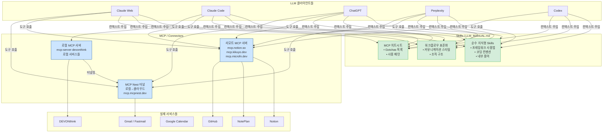
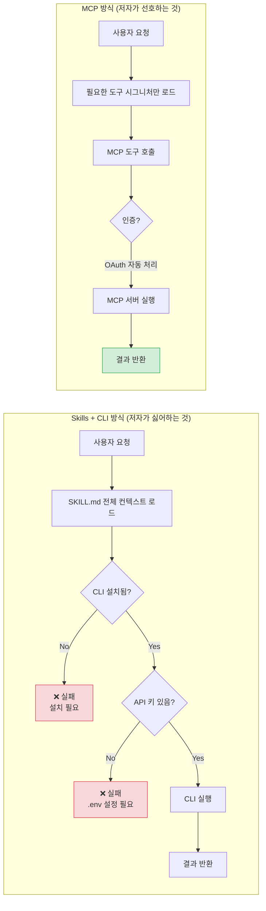
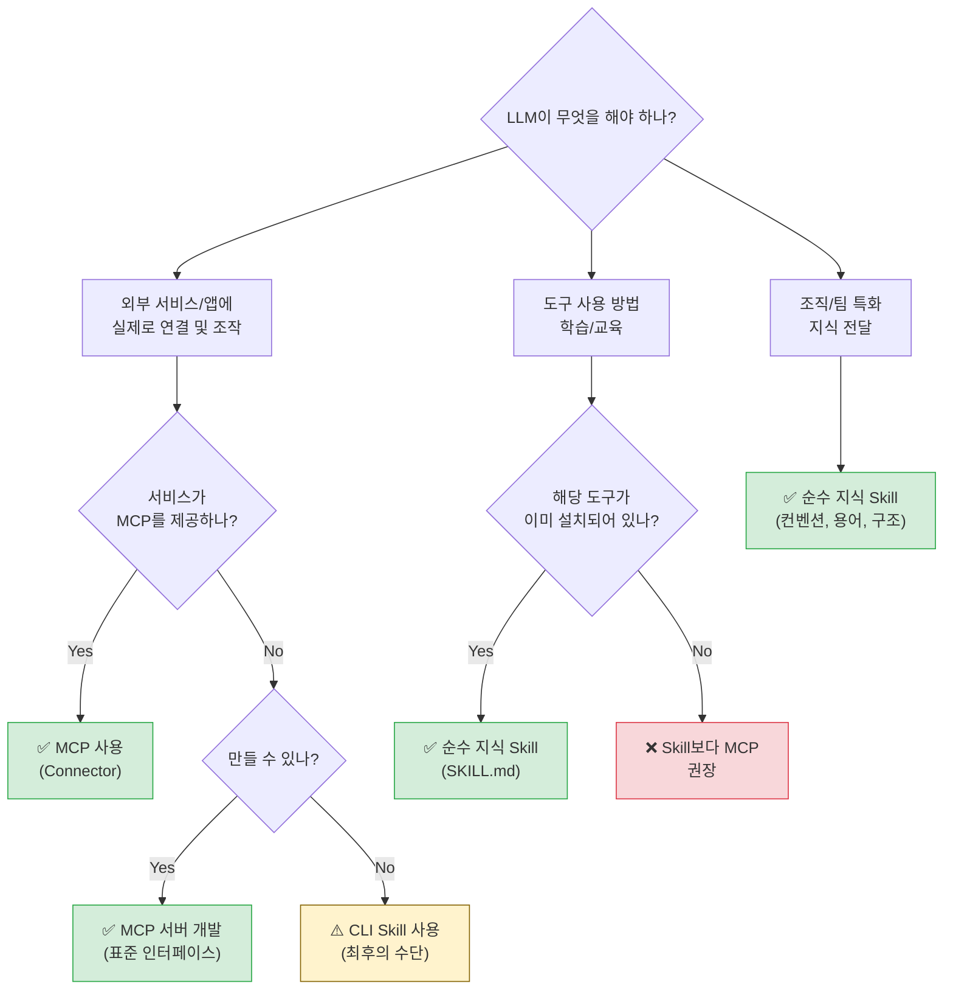
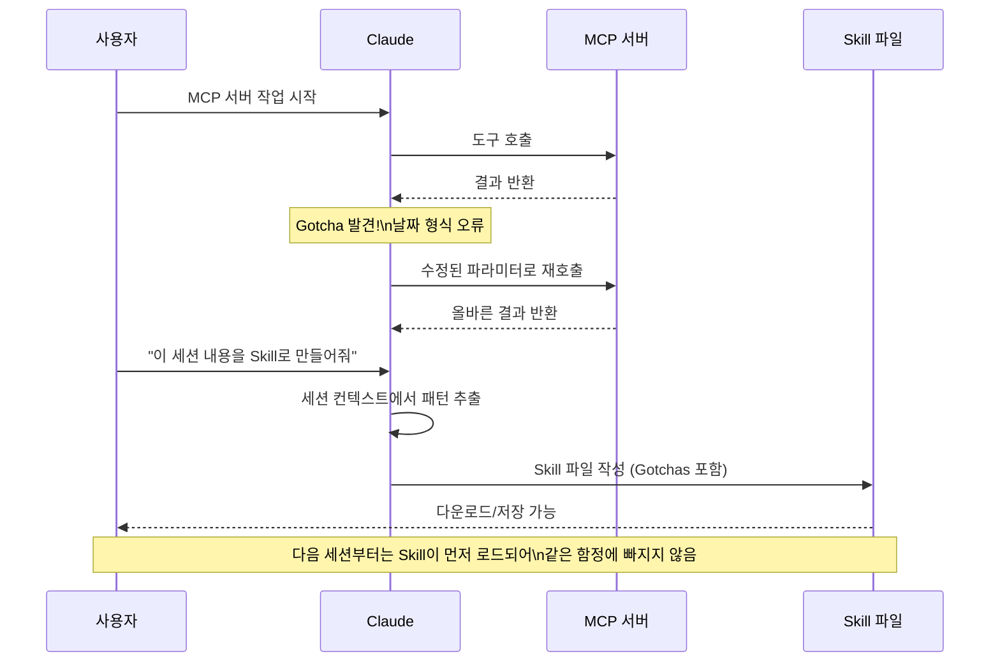

**원문**: [I Still Prefer MCP Over Skills — David Mohl (2026.04.02)](https://david.coffee/i-still-prefer-mcp-over-skills/)   
**날짜**: 2026년 4월 11일

---

## 목차

1. [개요 및 배경](#1-개요-및-배경)
2. [핵심 주장 요약](#2-핵심-주장-요약)
3. [MCP란 무엇인가?](#3-mcp란-무엇인가)
4. [Skills란 무엇인가?](#4-skills란-무엇인가)
5. [MCP의 장점 — 저자가 MCP를 사랑하는 이유](#5-mcp의-장점--저자가-mcp를-사랑하는-이유)
6. [Skills의 문제점 — 저자가 Skills를 싫어하는 이유](#6-skills의-문제점--저자가-skills를-싫어하는-이유)
7. [적재적소 — MCP vs Skills 사용 기준](#7-적재적소--mcp-vs-skills-사용-기준)
8. [Connectors vs. Manuals — 용어 재정의 제안](#8-connectors-vs-manuals--용어-재정의-제안)
9. [저자의 실제 프로젝트들 — 살아있는 증거](#9-저자의-실제-프로젝트들--살아있는-증거)
10. [MCP + Skill 조합 패턴 — 최선의 시나리오](#10-mcp--skill-조합-패턴--최선의-시나리오)
11. [이미지 스크린샷 분석](#11-이미지-스크린샷-분석)
12. [아키텍처 다이어그램](#12-아키텍처-다이어그램)
13. [결론 및 시사점](#13-결론-및-시사점)

---

## 1. 개요 및 배경

이 글은 **David Mohl**이라는 개발자가 2026년 4월 2일에 자신의 개인 블로그(david.coffee)에 게재한 기술 에세이다. 저자는 Claude Code, OpenAI Codex, Gemini 등 다양한 AI 코딩 도구를 매일 사용하는 헤비 유저이자, 직접 여러 MCP 서버를 개발·운영하는 실무 경험이 풍부한 엔지니어다.

### 시대적 맥락

2025년 말~2026년 초 AI 생태계에서는 하나의 흐름이 형성되기 시작했다. X(구 트위터)를 비롯한 소셜 미디어와 개발자 커뮤니티에서 **"MCP는 죽었다"**, **"Skills가 새로운 표준이다"** 라는 내러티브가 급격히 확산되었다. 저자는 이 트렌드에 강하게 반박하며, MCP가 여전히 서비스 통합의 올바른 아키텍처적 선택이라고 주장한다.

### 저자 소개

저자 David Mohl은 다음과 같은 자신의 오픈소스 프로젝트들을 통해 주장을 뒷받침한다:

- **mcp-server-devonthink**: DEVONthink를 위한 로컬 MCP 서버
- **microfn**: `mcp.microfn.dev`로 노출되는 리모트 MCP
- **Kikuyo**: `mcp.kikuyo.dev` 리모트 MCP
- **MCP Nest**: 로컬 MCP 서버를 클라우드 터널링으로 원격 접근 가능하게 하는 서비스

---

## 2. 핵심 주장 요약

저자의 논지는 하나의 핵심 전제로 시작한다:

> **"Skills는 지식 전달(How-to Manual)에 적합하고, MCP는 실제 서비스 연결(Connector)에 적합하다. 이 둘을 혼동하면 아키텍처가 무너진다."**

이를 한 줄로 표현하면 이렇다:

| 역할 | 적합한 도구 | 비유 |
|------|------------|------|
| LLM에게 도구 사용법 "가르치기" | Skills (SKILL.md) | 자동차 사용 설명서 |
| LLM이 실제로 서비스에 "접속하기" | MCP | 자동차 시동 버튼 |

---

## 3. MCP란 무엇인가?

**Model Context Protocol (MCP)** 는 Anthropic이 설계한 개방형 표준 프로토콜로, LLM이 외부 서비스·도구·데이터 소스와 상호작용하는 방식을 표준화한다. 쉽게 말하면 **AI를 위한 API 추상화 레이어**다.

### 작동 원리

```
LLM (Claude, GPT 등)
       │
       │  devonthink.search("AI notes")  ← LLM은 "무엇"만 호출
       ▼
  MCP 클라이언트
       │
       │  표준화된 메시지 교환 (JSON-RPC 기반)
       ▼
  MCP 서버 (로컬 or 리모트)
       │
       │  실제 구현 로직 ("어떻게"는 여기서 처리)
       ▼
  DEVONthink / Notion / Gmail / 기타 서비스
```

LLM은 `devonthink.do_x()`라고 호출하기만 하면 되고, **실제로 어떻게 DEVONthink와 통신하는지는 MCP 서버가 알아서 처리**한다. 이것이 핵심적인 관심사 분리(Separation of Concerns)다.

### MCP의 두 가지 형태

1. **로컬 MCP 서버**: 사용자의 로컬 환경에서 실행. `npx -y` 또는 `uv`로 설치 가능
2. **리모트 MCP 서버**: 클라우드에서 실행. URL만 있으면 어디서든 접속 가능 (예: `mcp.notion.so/mcp`)

---

## 4. Skills란 무엇인가?

**Skills**는 LLM에게 특정 작업 수행 방법을 가르치는 **마크다운 기반 지식 문서**다. 보통 `SKILL.md` 또는 `.claude/skills/` 폴더 내에 위치하며, LLM의 컨텍스트 윈도우에 직접 로드되어 행동 지침을 제공한다.

### Skills의 두 가지 유형

```
Skills
├── 순수 지식형 (Pure Knowledge Skills)
│   ├── 특정 프레임워크 사용법 (예: Phoenix colocated hooks)
│   ├── 코딩 컨벤션 및 내부 용어
│   ├── 커밋 메시지 형식
│   └── → 이 유형은 저자도 "잘 작동한다"고 인정
│
└── CLI 의존형 (CLI-Dependent Skills)
    ├── "먼저 이 CLI를 설치하세요"로 시작
    ├── API 토큰을 .env 파일에 직접 관리
    ├── 실제 서비스에 shell out하여 명령 실행
    └── → 이 유형이 저자가 "문제가 있다"고 비판하는 대상
```

Skills의 핵심 특징은 **LLM의 컨텍스트 윈도우에 직접 텍스트로 주입**된다는 점이다. 이는 LLM이 어떻게 행동해야 하는지를 가르치는 방식이지, 실제 외부 시스템에 연결하는 방식이 아니다.

---

## 5. MCP의 장점 — 저자가 MCP를 사랑하는 이유

저자는 MCP의 장점을 7가지로 정리한다. 각각을 상세히 살펴보자.

### 5-1. 제로 설치 원격 사용 (Zero-Install Remote Usage)

리모트 MCP 서버의 경우, **클라이언트 측에서 아무것도 설치할 필요가 없다**. MCP 서버 URL을 클라이언트(Claude, ChatGPT 등)에 등록하면 즉시 사용 가능하다. Skills가 CLI 설치를 요구하는 것과 대조된다.

```
Skills 방식:
사용자 → CLI 설치 → API 키 설정 → .env 파일 생성 → Skill 로드 → 사용

MCP 방식:
사용자 → MCP URL 등록 → 즉시 사용
```

### 5-2. 원활한 업데이트 (Seamless Updates)

리모트 MCP 서버가 새로운 도구나 기능으로 업데이트되면, **모든 클라이언트가 즉시 최신 버전을 사용**하게 된다. 패키지 업그레이드, 바이너리 재설치, Skills 재배포가 필요 없다. Skills는 업데이트될 때마다 클라이언트 측에서 재설치해야 한다.

### 5-3. 합리적인 인증 처리 (Saner Auth)

MCP는 보통 **OAuth** 방식으로 인증을 처리한다. 클라이언트가 핸드셰이크를 완료하면 이후 작업은 자동으로 인증된 상태로 진행된다. 반면 Skills + CLI 방식은 종종 **평문 API 토큰을 `.env` 파일에 저장**하도록 요구하는데, 이는 보안 측면에서 심각한 문제다.

### 5-4. 진정한 이식성 (True Portability)

리모트 MCP 서버는 **어디서든 사용 가능**하다. Mac, iPhone, 웹 브라우저, 어떤 MCP 지원 클라이언트에서도 동일하게 동작한다. 로컬 CLI는 해당 환경에서만 사용 가능하다.

### 5-5. 샌드박싱 (Sandboxing)

리모트 MCP는 **자연스럽게 샌드박스화**된다. 제어된 인터페이스만 노출하며, LLM에게 로컬 환경에서의 무제한 실행 권한을 주지 않는다. 반면 로컬 CLI를 통한 Skills는 로컬 시스템에 상당한 접근 권한을 줄 수 있다.

### 5-6. 스마트 디스커버리 (Smart Discovery)

Claude, ChatGPT 등 모던 AI 앱들은 **필요할 때만 도구를 검색하고 로드**하는 기능이 내장되어 있다. 이는 컨텍스트 윈도우를 효율적으로 사용하게 한다. 반면 Skills는 전체 SKILL.md 파일을 컨텍스트에 로드해야 한다.

### 5-7. 자동 업데이트 (Frictionless Auto-Updates)

로컬 MCP조차도 `npx -y`나 `uv`를 통해 매 실행마다 자동 업데이트가 가능하다. Skills의 경우 수동 재설치가 필요한 경우가 많다.

---

## 6. Skills의 문제점 — 저자가 Skills를 싫어하는 이유

저자의 가장 큰 불만은 **"모든 환경이 임의의 CLI를 실행할 수 있다는 가정"** 에 기반한 Skills의 설계 철학이다.

### 6-1. CLI 실행 불가 환경 문제

대부분의 Skills는 전용 CLI 설치를 요구한다. 그런데 현실을 보면:

```
CLI를 실행할 수 없는 환경:
├── ChatGPT (웹 버전)
├── Perplexity (기본 모드)
├── Claude 표준 웹 버전
└── 모바일 AI 앱들

CLI를 실행할 수 있는 환경:
├── Claude Code (터미널 환경)
├── Claude Cowork (일부)
├── OpenAI Codex
└── Perplexity Computer
```

즉, CLI 의존형 Skills는 **실행 환경이 제한된 곳에서는 완전히 무용지물**이 된다.

### 6-2. 배포 및 관리의 복잡성 (The Deployment Mess)

CLI는 바이너리, NPM 패키지, `uv` 등 다양한 방식으로 배포되어야 한다. 각 환경마다 다른 설치 방식, 다른 경로, 다른 의존성 문제가 생긴다. 이것은 개발자에게 불필요한 부담을 준다.

### 6-3. 시크릿 관리의 악몽 (The Secret Management Nightmare)

CLI 방식의 Skills는 API 토큰을 어딘가에 저장해야 한다:

- `.env` 파일에 평문으로 저장 → 보안 위험
- 일부 에페머럴(ephemeral) 환경은 재시작 시 시크릿을 초기화 → CLI는 오늘은 작동하지만 내일은 인증 정보를 잃는다
- 토큰 로테이션, 만료 처리 등 부가적인 관리 부담

### 6-4. 파편화된 에코시스템 (Fragmented Ecosystems)

저자는 Skills 관리 생태계를 **"완전한 무법지대(wild west)"** 라고 표현한다:

- Skill 업데이트 시 수동 재설치 필요
- `npx skills`로 설치하는 방식은 Codex와 Claude Code에서만 작동, Claude Cowork나 표준 Claude에서는 불가
- 순수 지식형 Skills는 Claude에서 작동하지만 다른 Skills는 대부분 불가
- "skills marketplace"를 지원하는 도구도 있고 지원하지 않는 도구도 있음
- GitHub에서 설치를 지원하는 도구도 있고 아닌 도구도 있음
- OpenClaw Skills를 Claude에 설치하려 하면 메타데이터 필드 불일치로 YAML 파싱 오류 발생

이는 **표준화가 전혀 이루어지지 않은 상태**임을 보여준다.

### 6-5. 컨텍스트 비대 (Context Bloat)

Skills를 사용하면 종종 **전체 SKILL.md 파일**이 LLM 컨텍스트 윈도우에 로드된다. 이는 다음을 의미한다:

- 실제로 필요한 건 단 하나의 함수 시그니처인데, 자동차 전체 사용설명서를 읽어야 하는 상황
- 컨텍스트 윈도우 낭비 → 비용 증가, 처리 속도 저하
- MCP는 필요한 도구 시그니처만 노출하므로 훨씬 효율적

저자의 비유가 인상적이다:

> *"It's like forcing someone to read the entire car's owner's manual when all they want to do is call `car.turn_on()`."*
> — 누군가 그냥 `car.turn_on()`만 호출하고 싶은데 자동차 전체 사용 설명서를 읽도록 강요하는 것과 같다.

---

## 7. 적재적소 — MCP vs Skills 사용 기준

저자는 두 기술이 서로를 대체하는 것이 아니라 **각자의 역할이 있다**고 주장한다.

### MCP를 사용해야 할 때

MCP는 LLM이 **무언가에 실제로 연결**해야 할 때의 표준이어야 한다. 웹사이트, 서비스, 애플리케이션 등 모든 외부 시스템 통합에 MCP가 적합하다.

**구체적인 예시들:**

| 서비스 | 나쁜 방식 (Skills + CLI) | 좋은 방식 (MCP) |
|--------|--------------------------|-----------------|
| Google Calendar | `gcal` CLI 설치 + 토큰 관리 + shell out | Google이 운영하는 OAuth MCP, 어느 클라이언트에서든 작동 |
| Chrome 제어 | `chrome-cli` 같은 불안정한 CLI | 브라우저가 자체 MCP 엔드포인트 노출 |
| Hopper 디버거 | 별도 `hopper-cli` | LLM이 `step()`을 직접 호출하는 내장 MCP |
| Xcode | 외부 CLI 도구 | 프로젝트 연결 시 인증 처리하는 내장 MCP |
| Notion | `notion-cli` 다운로드 + 인증 수동 관리 | `mcp.notion.so/mcp` (실제로 이미 존재) |

### Skills를 사용해야 할 때

Skills는 **"순수해야" 한다** — 지식과 컨텍스트에 집중해야 한다.

**적합한 사용 사례들:**

1. **기존 도구 사용법 교육**: `.claude/skills/` 폴더에서 LLM에게 이미 설치된 도구(`curl`, `git`, `gh`, `gcloud`)의 사용법을 가르치는 것. 별도의 "curl MCP"는 필요 없다. LLM이 좋은 curl 명령을 구성하는 방법만 알면 된다.

2. **워크플로우 표준화**: 회사 내부 용어, 커뮤니케이션 스타일, 조직 구조를 Claude에게 가르치는 용도.

3. **특정 처리 방식 교육**: Anthropic의 **PDF Skill**이 좋은 예다 — PDF 파일을 어떻게 다루고 Python으로 어떻게 조작하는지 설명한다.

4. **시크릿 관리 패턴**: "이 레포에서는 `fnox`를 사용하세요, 사용 방법은 이렇습니다"라는 Skill. 매번 시크릿을 다룰 때마다 Claude가 이 Skill을 참조하면 충분하다. `get_secret()`만을 위한 커스텀 MCP를 만들 필요가 없다.

---

## 8. Connectors vs. Manuals — 용어 재정의 제안

저자는 흥미로운 **"샤워 중 아이디어"** 를 제안한다:

> **문제는 어쩌면 용어 자체일 수도 있다. Skills는 그냥 `LLM_MANUAL.md`라고 부르고, MCP는 `Connectors`라고 부르면 어떨까?**

이 제안에는 심오한 통찰이 담겨 있다:

```
현재 용어              →   제안 용어
─────────────────────────────────────────
Skills (SKILL.md)      →   LLM_MANUAL.md   (설명서, 사용 방법)
MCP                    →   Connectors      (연결자, 플러그)
```

이름이 바뀌면 오해가 줄어든다:

- "이 서비스를 위한 Skill을 만들자" → 자연스럽게 CLI 의존형으로 만들 가능성
- "이 서비스를 위한 Connector를 만들자" → 자연스럽게 MCP 서버로 만들 가능성
- "이 도구를 위한 Manual을 만들자" → 자연스럽게 순수 지식 문서로 만들 가능성

두 가지 모두 존재할 이유가 있다. 다만 각자의 역할을 명확히 해야 한다는 것이다.

---

## 9. 저자의 실제 프로젝트들 — 살아있는 증거

저자는 자신의 주장을 뒷받침하기 위해 직접 개발한 프로젝트들을 소개한다.

### mcp-server-devonthink

- **목적**: DEVONthink(맥 전용 개인 지식 관리 앱)를 위한 로컬 MCP 서버
- **특징**: CLI 래퍼 없이 순수한 도구 인터페이스만 제공
- **효과**: 어떤 LLM이든 DEVONthink를 직접 제어 가능

### microfn

- **목적**: serverless 함수 실행 플랫폼
- **MCP URL**: `mcp.microfn.dev`
- **특징**: 어떤 MCP 지원 클라이언트에서도 즉시 사용 가능한 리모트 MCP

### Kikuyo

- **목적**: 사용자 피드백 수집 플랫폼
- **MCP URL**: `mcp.kikuyo.dev`
- **특징**: 리모트 MCP로 Claude에서 직접 사용자 피드백 조회 가능 (스크린샷 1 참조)

### MCP Nest

- **목적**: 로컬 MCP 서버를 클라우드 터널링으로 원격 접근 가능하게 하는 서비스
- **URL**: `mcp.mcpnest.dev/mcp`
- **배경**: 로컬에서만 실행 가능한 MCP 서버들(Fastmail, Gmail 등)을 머신을 직접 노출하지 않고 원격에서 접근하고 싶었던 필요에서 탄생
- **효과**: Claude, ChatGPT, Perplexity 등 어떤 MCP 클라이언트에서도 로컬 MCP 서버를 사용 가능

---

## 10. MCP + Skill 조합 패턴 — 최선의 시나리오

저자가 발견한 가장 실용적인 통찰 중 하나는 **MCP와 Skill의 조합 사용**이다.

### 문제 상황

MCP 서버를 사용하다 보면 반드시 비직관적인 패턴들을 발견하게 된다:

- 날짜 형식이 `YYYYMMDD`가 아닌 `YYYY-MM-DD`여야 한다
- 검색 함수가 파라미터를 특정 값 이상으로 올리지 않으면 결과를 잘라낸다
- 도구 이름이 기대하는 대로 동작하지 않는다

이런 **gotchas(함정)** 를 매 세션마다 다시 발견하는 건 비효율적이다.

### 해결책: MCP 위의 지식 레이어로서의 Skill

저자의 워크플로우:

```
1. MCP 서버와 작업 중 새로운 gotcha 발견
2. Claude에게 이 세션에서 배운 모든 것을 Skill로 정리해달라고 요청
3. LLM이 이미 컨텍스트를 갖고 있으므로 자동으로 모든 함정과 패턴을 포함한 Skill 작성
4. 이후 모든 세션은 이 Skill로 시작 → 같은 함정에 빠지지 않음
```

**NotePlan MCP 예시** (스크린샷 4 참조):

NotePlan MCP 작업 중 발견된 내용들:
- 백링크 발견 방식의 gotcha
- 날짜 형식 차이 (`YYYY-MM-DD` vs `YYYYMMDD`)
- `resolve`가 실제로 하는 것 (백링크가 아닌 노트 해결)
- 결과 잘림 방지를 위한 `maxNotes` → `totalNotes` 변경

이 내용이 자동으로 `noteplan-mcp` Skill로 패키징되어 다음 세션부터 바로 활용 가능해진다.

### 핵심 통찰

```
MCP = 실제 연결 + 도구 실행 (Connector 역할)
Skill = MCP 사용을 위한 치트시트 (Manual 역할)

→ MCP는 Skill로 대체되는 것이 아니라, Skill이 MCP 위에 지식 레이어로 존재
```

이 조합이야말로 저자가 이상적이라고 생각하는 아키텍처다.

---

## 11. 이미지 스크린샷 분석

### 스크린샷 1: Kikuyo MCP를 통한 사용자 피드백 조회


**환경**: Claude 웹 앱 (Sonnet 4.6 Extended)

**내용**: 사용자가 "get my recent user feedback from kikuyo"라고 입력하자, Claude가 Kikuyo MCP를 통해 직접 사용자 피드백 데이터를 가져온다. 결과는 3개 프로젝트(Fix My Japanese, Kikuyo 등)의 피드백 항목들을 Status, Title, Votes 컬럼이 있는 깔끔한 테이블로 표시한다.

**이 스크린샷이 보여주는 것**: CLI 설치 없이, API 키 수동 관리 없이, 단순히 자연어로 요청하면 MCP가 알아서 인증하고 데이터를 가져온다는 것이다. 이것이 바로 저자가 MCP를 선호하는 이유의 핵심 시각적 증거다.

---

### 스크린샷 2: OpenAI Codex에서 Phoenix Colocated Hooks Skill 로드


**환경**: OpenAI Codex v0.118.0, gpt-5.4 high 모델, `~/src/mcpnest` 디렉토리

**내용**: 사용자가 "load the skill to understand how to use phoenix colocated hooks"라고 요청하자, Codex가 `phoenix-colocated-hooks` Skill을 로드하고 `SKILL.md`를 읽은 후 해당 레포의 정확한 사용 패턴을 요약하겠다고 응답한다.

**이 스크린샷이 보여주는 것**: **순수 지식형 Skills의 올바른 사용 사례**다. CLI도 없고, MCP도 없다. 그냥 LLM에게 특정 기술 패턴을 가르치는 문서를 읽히는 것이다. 저자도 이런 유형의 Skill은 "잘 작동한다"고 인정한다.

---

### 스크린샷 3: React Router 레포의 `.claude/skills` 디렉토리


**환경**: 터미널, `~/s/d/configmesh-web` 디렉토리, Node.js v1.3.11

**내용**: `ls -al .claude/skills` 명령 결과, `react-react-router-7-framework/` 디렉토리가 있음을 보여준다.

**이 스크린샷이 보여주는 것**: Skills가 **레포 내에 직접 위치**하여 해당 프로젝트에서 작업할 때 LLM이 자동으로 픽업하는 패턴을 보여준다. 프로젝트별 지식을 코드베이스와 함께 버전 관리하는 방식이다.

---

### 스크린샷 4: NotePlan MCP 세션 후 Skill 자동 생성


**환경**: Claude 웹 앱 (Sonnet 4.6 Extended)

**내용**: 사용자가 "can you create a new skill on how to use the noteplan MCP server and add this to it, how to get references stuff to a certain date"라고 요청하자, Claude가:
1. noteplan MCP와의 대화에서 발견된 패턴을 분석
2. Skill 파일을 작성 (`Ran a command, created a file`)
3. 패키징 완료 후 주요 문서화 내용 목록 제시:
   - **Daily note retrieval** — 올바른 날짜 형식, 타입 스코핑
   - **Cross-note references/backlinks** — `YYYY-MM-DD` 형식 필수, `noteplan_paragraphs search_global` 사용, `maxNotes`를 `totalNotes`로 변경
   - **Common patterns** — 콘텐츠 추가, 태스크 완료, 노트 생성
   - **Gotchas section** — 날짜 형식 분리, 잘림 문제, `resolve`의 실제 동작
4. `Settings → Skills → Upload`로 설치 안내

**이 스크린샷이 보여주는 것**: **MCP + Skill 조합 패턴의 실제 구현**이다. MCP 세션에서 쌓인 지식을 자동으로 재사용 가능한 Skill로 패키징하는 워크플로우가 실용적으로 작동함을 보여준다.

---

## 12. 아키텍처 다이어그램

### 전체 생태계 구조



---

### MCP vs Skills + CLI 비교 플로우



---

### 의사결정 트리: 무엇을 언제 사용할까?



---

### MCP + Skill 조합 학습 루프



---

## 13. 결론 및 시사점

### 저자의 결론

1. **MCP는 죽지 않았다.** 오히려 서비스 통합의 올바른 아키텍처적 표준이다.
2. **Skills의 역할은 명확히 제한되어야 한다.** 순수 지식 전달에는 탁월하지만, 서비스 연결의 대체재가 되어서는 안 된다.
3. **최선의 패턴은 MCP + Skill 조합**이다. MCP가 연결을 담당하고, Skill이 그 위의 지식 레이어로 기능한다.
4. **표준화가 필요하다.** 파편화된 Skills 생태계 대신, MCP라는 표준화된 인터페이스가 더 건강한 생태계를 만든다.

### 시사점

이 글은 [RummiArena](https://github.com/k82022603/RummiArena) 및 LxM 프로젝트처럼 **AI 오케스트레이션 아키텍처를 설계하는 실무자**에게 특히 의미가 크다:

- **Claude Code의 `.claude/skills/` 패턴**은 프로젝트별 지식을 코드베이스와 함께 버전 관리하는 데 적합하다. 특히 DevSecOps, CI/CD 파이프라인의 내부 컨벤션을 AI에게 가르치는 용도로 활용 가능하다.
- **MCP 서버 우선 설계**는 RummiArena처럼 여러 AI 에이전트가 협력하는 시스템에서 에이전트 간 도구 공유를 표준화하는 데 핵심적이다.
- **MemPalace/AIOS 프로젝트** 관점에서, MCP는 메모리 시스템 접근을 표준화하는 인터페이스로도 활용될 수 있다. 특정 메모리 백엔드에 LLM을 묶지 않고도 표준 도구 호출로 접근 가능한 아키텍처를 구축할 수 있다.
- **"Skill이 MCP의 치트시트"라는 패턴**은 AI 에이전트 팀이 복잡한 MCP 서버를 효율적으로 사용하도록 안내하는 데 직접 적용할 수 있다.

### 업계에 대한 희망

저자는 글을 이렇게 마무리한다:

> *"I just hope the industry doesn't abandon the Model Context Protocol. The dream of seamless AI integration relies on standardized interfaces, not a fractured landscape of hacky CLIs."*

Skyscanner, Booking.com, Trip.com, Agoda.com 등 여행 서비스들도 공식 MCP를 제공하길 바란다는 저자의 소망은, AI가 자연어로 모든 서비스를 원활하게 사용할 수 있는 미래에 대한 비전을 담고 있다.

---

## 참고 링크

- **원문 블로그**: https://david.coffee/i-still-prefer-mcp-over-skills/
- **MCP Nest**: https://mcpnest.dev
- **Kikuyo**: https://kikuyo.app
- **microfn**: https://microfn.dev
- **mcp-server-devonthink**: https://github.com/dvcrn/mcp-server-devonthink
- **Anthropic PDF Skill (GitHub)**: https://github.com/anthropics/skills/tree/main/skills/pdf
- **MCP 공식 문서**: https://docs.anthropic.com/en/docs/agents-and-tools/mcp

---

*이 문서는 David Mohl의 원문 "I Still Prefer MCP Over Skills" (2026.04.02)를 기반으로 작성된 한국어 상세 해설 문서입니다.*
