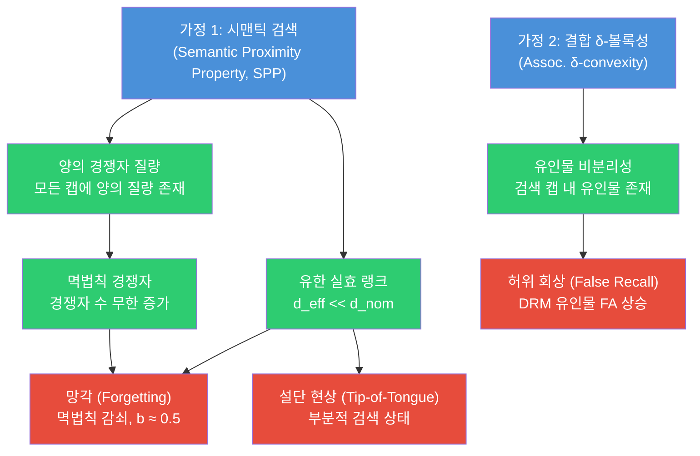
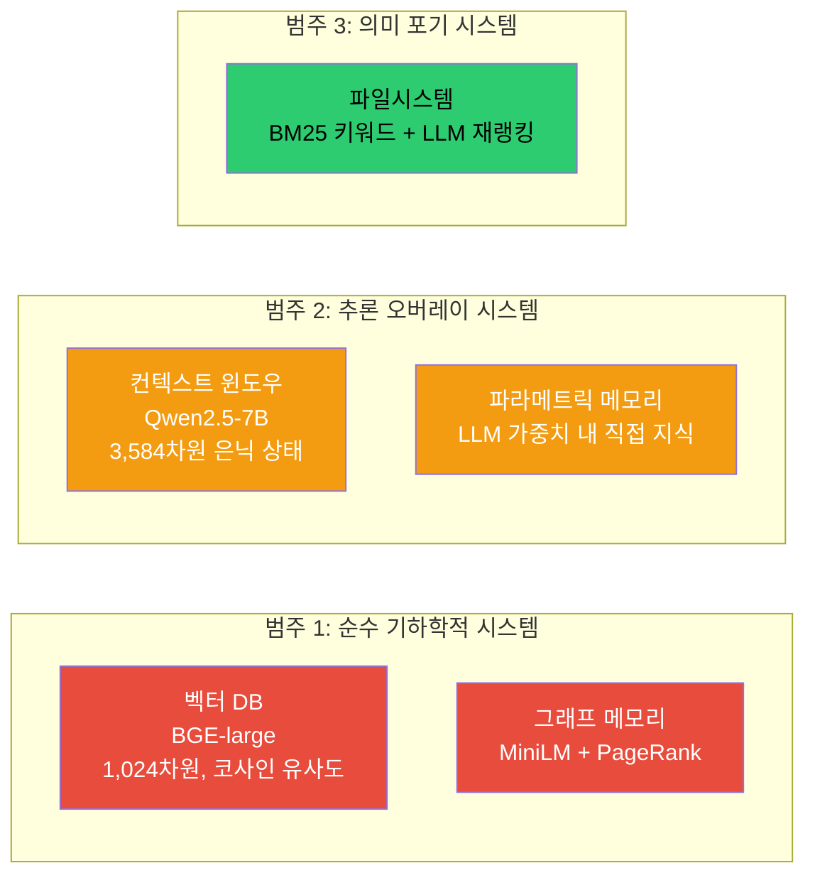
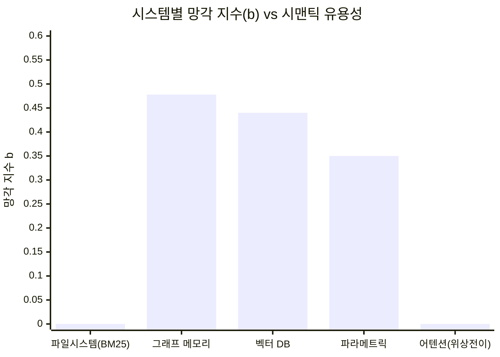
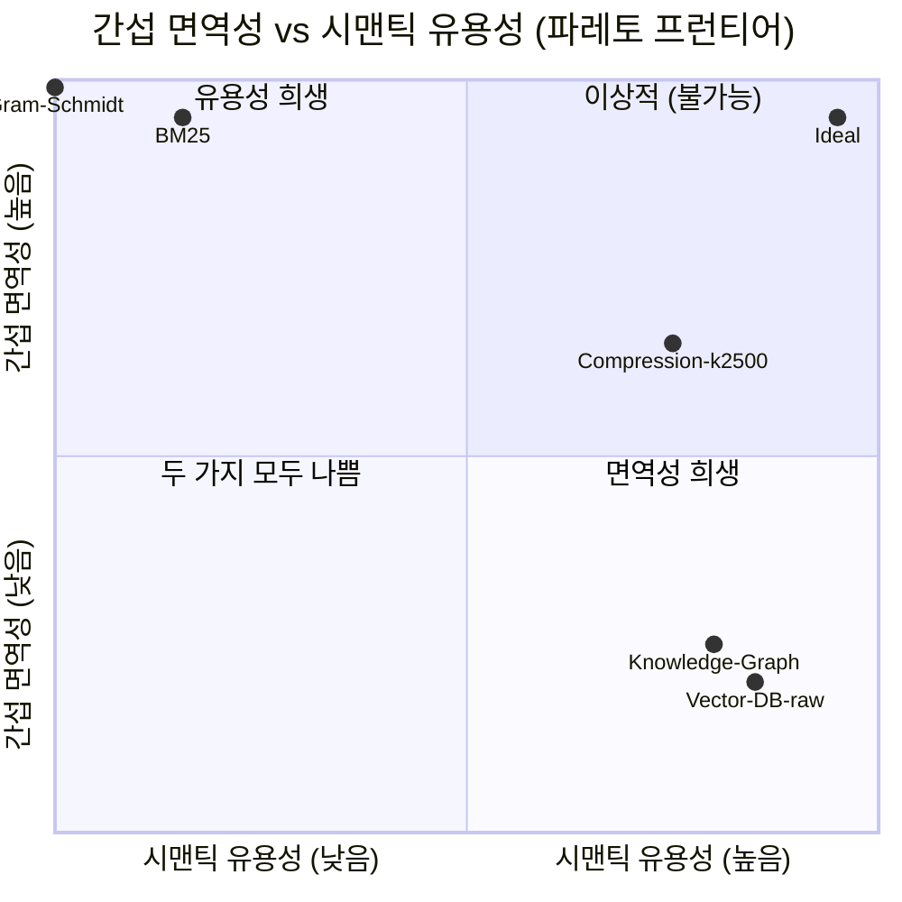
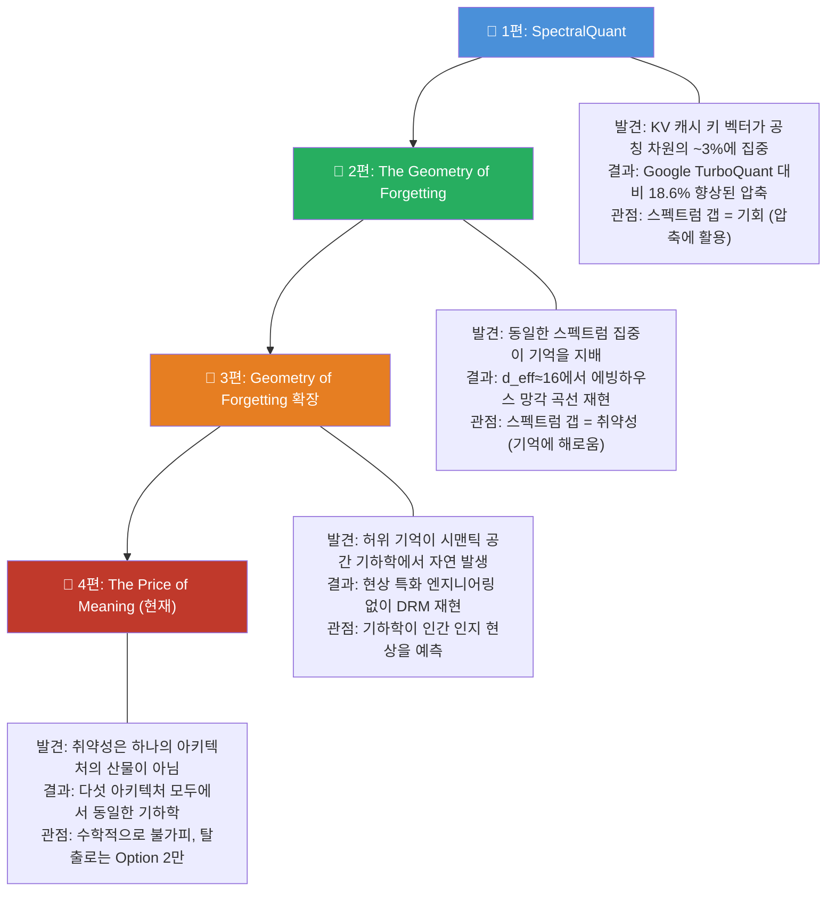
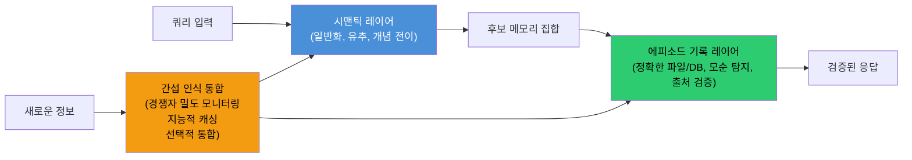

## RAG, 지식 그래프, 그리고 모든 시맨틱 메모리가 반드시 실패하는 이유
### — 수학적 증명과 그 실천적 함의 —

> **원문**: *"The Price of Meaning: Why Every Semantic Memory System Forgets"*  
> **arXiv**: [2603.27116](https://arxiv.org/abs/2603.27116)  
> **저자**: Sambartha Ray Barman 외 3인 (Sentra AI 연구팀)  
> **공개**: 2026년 3월  
> **원문 스레드**: Ashwin Gopinath ([@ashwingop](https://x.com/ashwingop/status/2042604890988646750)), X(구 트위터)

---

## 목차

1. [연구의 배경과 맥락](#1-연구의-배경과-맥락)
2. [핵심 주장 요약](#2-핵심-주장-요약)
3. [탈출 불가 정리 (No-Escape Theorem)](#3-탈출-불가-정리-no-escape-theorem)
4. [다섯 가지 아키텍처 실험](#4-다섯-가지-아키텍처-실험)
5. [세 가지 범주로 본 실험 결과](#5-세-가지-범주로-본-실험-결과)
6. [파레토 프런티어: 해결책들의 한계](#6-파레토-프런티어-해결책들의-한계)
7. [유효 차원성 수렴 현상](#7-유효-차원성-수렴-현상)
8. [파일시스템 운동의 올바른 직관과 한계](#8-파일시스템-운동의-올바른-직관과-한계)
9. [신경과학적 연결: 인간 기억과의 비교](#9-신경과학적-연결-인간-기억과의-비교)
10. [Sentra 연구 시리즈 전체 맥락](#10-sentra-연구-시리즈-전체-맥락)
11. [실천적 시사점: AI 엔지니어와 아키텍트를 위한 안내](#11-실천적-시사점-ai-엔지니어와-아키텍트를-위한-안내)
12. [비판적 검토와 반론](#12-비판적-검토와-반론)
13. [결론: 의미의 대가를 직시하기](#13-결론-의미의-대가를-직시하기)

---

## 1. 연구의 배경과 맥락

### 현대 AI 메모리 시스템의 주류 패러다임

오늘날 거의 모든 상용 AI 시스템은 정보를 **의미(Meaning)** 에 의해 조직화한다. 벡터 데이터베이스에서 문서를 임베딩하고, 지식 그래프에서 개념을 노드로 연결하고, LLM의 파라미터 안에 지식을 녹여 넣는 방식 모두 "의미적으로 가까운 것은 표현 공간에서도 가까워야 한다"는 전제를 공유한다.

이 전제는 직관적으로도, 실용적으로도 옳은 것처럼 보인다. 의미적 유사성에 기반한 검색(Semantic Retrieval)은 키워드 매칭의 한계를 넘어 개념적 연결, 유추, 추상화를 가능하게 해 주기 때문이다. RAG(Retrieval-Augmented Generation), 지식 그래프 기반 추론, 장문 컨텍스트 윈도우, 파라메트릭 메모리(모델 가중치 내 지식)는 모두 이 원칙 위에 세워진 건축물들이다.

### 그런데 왜 이 시스템들은 실패하는가?

현장 엔지니어들은 오래전부터 경험적으로 알고 있었다. RAG 시스템은 지식 베이스가 커질수록 예전에 잘 찾던 정보를 찾지 못하게 되고, 전혀 다른 문서를 엉뚱하게 검색해 오기도 한다. 지식 그래프는 추론 능력이 있다고 홍보되지만 유사한 엔티티들 사이에서 혼동을 일으킨다. LLM은 파인튜닝 이후에 이전에 알던 지식을 잊어버리는 "재앙적 망각(Catastrophic Forgetting)"을 겪는다.

이런 현상들을 두고 기존의 시각은 "더 좋은 임베딩 모델", "더 고차원 벡터 공간", "더 정교한 그래프 구조"로 해결할 수 있는 **엔지니어링 문제**로 바라보았다.

Ashwin Gopinath와 Sentra 연구팀의 주장은 근본적으로 다르다. 이것은 **엔지니어링 문제가 아니라 수학적 필연**이다.

---

## 2. 핵심 주장 요약

이 논문의 핵심 주장은 하나의 문장으로 요약된다:

> **"의미에 의해 정보를 조직화하는 모든 메모리 시스템은, 메모리가 성장함에 따라 망각(Forgetting)과 허위 회상(False Recall)을 수학적으로 피할 수 없다."**

이것은 경험적 관찰이 아니라 **형식 증명(Formal Proof)** 이다. 논문은 이를 "탈출 불가 정리(No-Escape Theorem)"라 명명하며, 다음 세 가지 최소한의 가정만으로 이 결론을 도출한다:

1. **시맨틱 검색**: 시스템이 의미적 유사성으로 정보를 검색한다
2. **효율적 인코딩**: 표현이 어떤 형태로든 효율성 제약 아래 학습된다  
3. **유한한 실효 차원성**: 의미 공간의 실질적 차원이 유한하다 (자연어의 경우 항상 해당)

이 다이어그램은 논문의 핵심 논리 흐름을 보여준다. 이미지 1의 흐름도와 같은 구조다. 어떤 아키텍처도 SPP(시맨틱 근접성 속성)를 포기하거나 외부 심볼릭 검증기를 추가하지 않는 한 이 결과를 피할 수 없다.

---

## 3. 탈출 불가 정리 (No-Escape Theorem)

### 3.1 직관적 이해: 왜 공간이 혼잡해지는가

인간 언어에는 수십만 개의 개념이 있지만, 의미론적으로 실질적으로 독립적인 차원의 수는 훨씬 적다. 논문이 테스트한 모든 모델에서 의미 공간의 실효 차원수(effective dimensionality)는 **10에서 50 사이**로 수렴했다. 표면적으로 384차원이든 3,584차원이든 관계없이.

이것은 자연어의 구조적 특성이다. "왕(King)"과 "여왕(Queen)", "남자(Man)"와 "여자(Woman)"는 서로 가까이 위치해야 하고, "행복"과 "기쁨"도 가까워야 한다. 이 제약들이 쌓이면 의미 공간은 실질적으로 매우 낮은 차원에 갇히게 된다.

이제 이 저차원 공간에 기억들을 계속 쌓아가면 어떻게 되는가? **군집(Crowding)** 이 발생한다. 새로운 기억이 오래된 기억 근처에 떨어지는 이유가 개념적 연관성 때문이 아니라 단순히 갈 곳이 없기 때문이다.

### 3.2 두 가지 핵심 문제

**① 망각 (Forgetting)**

더 많은 기억이 쌓일수록 오래된 기억들은 새로운 이웃들에 의해 밀려난다. 원래 기억의 검색 점수는 감쇠하는데, 이 감쇠는 에빙하우스(Ebbinghaus)가 1885년에 발견한 인간의 망각 곡선과 동일한 **멱법칙(Power Law)** 을 따른다. 삭제된 것이 아니라 노이즈에 파묻힌 것이다.

**② 허위 회상 (False Recall)**

개념적으로 연관되지만 사실적으로 다른 기억들("가격 회의"와 "패키징 회의")은 의미 공간에서 겹치는 영역에 위치하게 된다. 어떤 임계값 조정으로도 진짜 매칭을 모두 받아들이면서 가짜 매칭을 모두 거부하는 것은 불가능하다. 표현 자체가 너무 가깝기 때문이다.

### 3.3 형식적 공리 체계

논문은 이를 수학적으로 형식화하기 위해 **Semantic Proximity Property(SPP)** 라는 공리 집합(A1~A4)을 정의한다:

- **A1**: 관련 항목들이 비관련 항목들보다 높은 유사도를 가진다
- **A2**: 유사도는 내적(Inner Product)의 단조 함수다
- **A3**: 표현이 유한 차원 공간에 위치한다
- **A4**: 표현이 어떤 효율성 제약 아래 학습된다

여기에 **δ-볼록성(δ-convexity)** 공리(A5)가 추가되면 허위 회상의 불가피성도 증명된다. A5는 연상적 유인물(Associative Lures)이 검색 공간에서 진짜 기억과 분리 불가능하게 가깝게 위치함을 명시한다.

이 공리들로부터 논문은 네 가지 핵심 정리를 도출한다:

| 정리 | 내용 |
|------|------|
| **Theorem 1** | 시맨틱 검색을 지원하는 표현은 유한 실효 랭크를 가진다 |
| **Theorem 2** | 유한 실효 랭크는 검색 이웃에 양의 경쟁자 질량을 발생시킨다 |
| **Theorem 3** | 기억이 성장함에 따라 멱법칙적 경쟁자 증가가 발생하고, 보존율이 0으로 감쇠한다 |
| **Theorem 6** | 임계값 조정만으로는 연상적 유인물에 의한 허위 회상을 제거할 수 없다 |

---

## 4. 다섯 가지 아키텍처 실험

논문은 단순히 이론에 그치지 않고 구조적으로 다른 다섯 가지 메모리 시스템을 실험했다:

### 4.1 실험 설계 방법론

연구팀은 DRM(Deese-Roediger-McDermott) 패러다임이라는 심리학적 허위 기억 실험 기법을 AI 시스템에 적용했다. DRM은 의미적으로 연관된 단어 목록(예: "수면, 침대, 이불, 베개, 졸림...")을 제시하고 핵심 유인물("수면")이 실제로 제시되지 않았음에도 기억한다고 보고하는지를 측정한다.

또한 경쟁자 밀도를 변화시키면서(n=100부터 n=10,000까지) 검색 정확도의 감쇠 패턴을 측정했다. 이를 통해 망각 지수(Forgetting Exponent) **b**를 추출하고 인간의 망각 곡선(b ≈ 0.3~0.7)과 비교했다.

---

## 5. 세 가지 범주로 본 실험 결과

### 5.1 범주 1: 순수 기하학적 시스템 (벡터 DB, 그래프 메모리)

이 시스템들에서 기하학이 곧 행동이다. 의미 공간의 구조가 직접적으로 망각과 허위 회상으로 나타난다.

**벡터 DB (BGE-large)**:
- 망각 지수 **b = 0.440** → 인간 범위(0.3~0.7) 정중앙
- DRM 허위 경보율 **FA = 0.583** → 매우 높은 허위 회상
- 간격 효과(Spacing Effect) 재현: 반복 노출 패턴이 인간과 동일

**그래프 메모리 (MiniLM + PageRank)**:
- 망각 지수 **b = 0.478** → 역시 인간 범위 내
- DRM 허위 경보율 **FA = 0.208**

**그래프 메모리 결과의 중요성**: 지식 그래프는 "RAG의 한계를 해결한다"는 마케팅으로 주목받는다. 멀티홉 추론, 명시적 관계, 구조화된 탐색. 이런 장점들이 실제로 특정 검색 패턴에서는 도움이 된다. 그러나 탈출 불가 정리에서는 탈출하지 못한다. 그래프 탐색이 어떻게 설계되어 있든, 기저 표현이 여전히 시맨틱 임베딩이고 검색이 내적으로 동작하면 기하학적 취약성은 그대로다. **지식 그래프는 추가 단계가 있는 시맨틱 메모리 시스템일 뿐이다.**

### 5.2 범주 2: 추론 오버레이 시스템 (어텐션 메모리, 파라메트릭 메모리)

이 시스템들은 기하학적 취약성이 존재하지만, LLM 추론 능력으로 부분적으로 그것을 우회할 수 있다.

**어텐션 기반 컨텍스트 윈도우 (Qwen2.5-7B)**:
- 은닉 상태의 실효 차원: **d_eff = 17.9** (공칭 3,584차원 대비 200배 압축)
- DRM 유인물 거부율: **FA = 0.000** → 단어 목록을 파싱하며 올바르게 거부
- **BUT**: 경쟁자 100개 미만에서는 완벽한 정확도, 200개를 넘자 거의 0으로 **붕괴**

**파라메트릭 메모리 (Qwen2.5-7B 가중치)**:
- 이웃 밀도 증가에 따라 정확도 **1.000 → 0.113**으로 단조 감소
- 더 비슷한 사실들이 훈련 코퍼스에 많을수록 해당 사실 회상 불가

**추론 우회의 역설**: 추론 능력이 기하학적 증상을 감추지만, 이 "해결책"은 우아한 열화(Graceful Degradation)를 **재앙적 실패(Catastrophic Failure)** 로 전환한다. 서서히 나빠지면 경고라도 받을 수 있다. 완벽하다가 절벽에서 떨어지는 시스템은 경고가 없다. 이것은 나아진 것이 아니라 악화된 것이다.

### 5.3 범주 3: 의미를 포기한 시스템 (파일시스템/BM25)

**BM25 키워드 검색**:
- 망각 지수 **b = 0.000** → 망각 없음
- DRM 허위 경보율 **FA = 0.000** → 허위 회상 없음
- 간격 효과 없음 → 완전한 면역

**그러나**: 시맨틱 검색과의 일치율이 단 **15.5%**. 즉, 의미 기반 검색이 찾아오는 정보의 84.5%를 키워드 검색은 아예 찾지 못한다.

이것이 **탈출 불가 정리의 증명이지 반례가 아니다.** 간섭에서 탈출하기 위해 유용성을 포기했다. 의미와 간섭은 같은 동전의 양면이다.

*(어텐션 메모리는 위상 전이(Phase Transition) 형태로 실패하므로 멱법칙 b가 적합하지 않음)*

---

## 6. 파레토 프런티어: 해결책들의 한계

연구팀은 기존에 제안된 네 가지 "해결책"을 직접 테스트했다:

### 해결책 1: 차원 수 늘리기 (High Dimensionality)

공칭 차원을 1,024에서 4,096으로 늘려도 망각 지수 b는 약 0.31에서 거의 변화 없음. **실효 차원(d_eff)은 전혀 변하지 않기 때문이다.** 1,024차원 벡터든 4,096차원 벡터든, 의미 공간이 실질적으로 사용하는 차원은 10~50개 정도로 동일하다. 빈 공간을 늘리는 것은 혼잡을 해결하지 못한다.

### 해결책 2: BM25 키워드 검색

간섭과 허위 회상 완전 제거. 그러나 시맨틱 일치율 **15.5%**. 유용성과 면역성의 극단적 트레이드오프.

### 해결책 3: Gram-Schmidt 직교화 (Orthogonalisation)

벡터들을 강제로 직교화하면 간섭이 0으로 줄어든다. 그러나 최근접 이웃 정확도가 **0.0%** 로 떨어진다. 직교성과 시맨틱 유사성은 정의상 양립 불가능하다.

### 해결책 4: 메모리 압축 (Compression)

k=2,500 클러스터로 압축하면 b=0.163, 정확도 92.8%. 이것은 **실용적으로 허용 가능한 공학적 타협**일 수 있다. 그러나 수학적 면역이 아니다. 이것은 트레이드오프 프런티어 위의 한 점일 뿐이다.

이 다이어그램의 핵심 메시지: **어떤 해결책도 우측 상단 "이상적" 영역에 도달하지 못한다.** 모든 해결책은 트레이드오프 프런티어를 따라 이동할 뿐, 프런티어 자체를 벗어나지 못한다. 탈출 불가 정리는 바로 이 프런티어의 존재 자체가 필연적임을 증명한다.

---

## 7. 유효 차원성 수렴 현상

이 논문에서 가장 놀라운 실증적 발견 중 하나는 **유효 차원성(Effective Dimensionality)의 수렴**이다.

### 7.1 공칭 차원 vs 실효 차원

| 아키텍처 | 공칭 차원 (d_nom) | 실효 차원-PR (d_eff) | 실효 차원-LB (d_eff) |
|---------|-----------------|-------------------|-------------------|
| MiniLM (그래프 메모리) | ~384 | 127 | ~10-15 |
| BGE-large (벡터 DB) | 1,024 | 158 | 10.6 |
| Filesystem | ~1,024 | 158 | ~10-15 |
| Qwen2.5-7B 은닉 상태 | 3,584 | 17.9 | ~10-15 |
| Qwen2.5-7B 파라메트릭 | ~3,584 | 17.9 | ~10-15 |

*(PR: Participation Ratio 방법, LB: Levina-Bickel 방법)*

Qwen2.5-7B의 경우 공칭 3,584차원에서 실효 차원이 단 **17.9**로 측정된다. 무려 **200배 압축**이다. 3,584차원이라는 라벨은 기능적 의미에서 사실상 잘못된 명칭이다.

### 7.2 왜 이런 수렴이 발생하는가

자연어의 구조 자체에서 기인한다. 언어가 의미를 조직화하는 방식은 실질적으로 독립적인 의미 차원의 수를 제한한다. 어떤 인코딩 방법도 자연어의 이 내재적 특성을 극복할 수 없다.

Levina-Bickel 추정치는 지역 다양체 차원을 측정하는데, 모든 모델에서 **d_eff ≈ 10~15**를 보여준다. 이것이 간섭을 지배하는 수치다. 간섭은 전역 분산 분포가 아니라 **지역 이웃(θ-캡) 안에서** 발생하기 때문이다.

### 7.3 생물학적 신경망과의 비교

인간 두뇌의 신경 집단(Neural Population)은 추정 **d_eff = 100~500** 범위에서 작동한다. 이 범위는 AI 모델들이 수렴하는 10~50보다 훨씬 높다. 논문의 이전 작업 "The Geometry of Forgetting"에서 발견된 전이 구간(Transition Zone)과 일치한다.

흥미롭게도 인간의 기억도 간섭에서 완전히 자유롭지 않다. 에빙하우스의 망각 곡선, DRM 허위 기억 실험에서 인간이 보이는 허위 회상 패턴 — 이 모두가 AI 시스템에서 재현된다. **인간의 뇌도 탈출 불가 정리의 범주 안에 있다.** 다만 더 높은 실효 차원 덕분에 더 나은 위치에 있을 뿐이다.

---

## 8. 파일시스템 운동의 올바른 직관과 한계

### 8.1 최근 파일시스템 기반 메모리의 약진

최근 AI 에이전트 메모리 분야에서 "순수 벡터 DB를 버리고 파일시스템으로 가자"는 흐름이 주목받고 있다:

- **ByteRover (2026년 4월)**: 벡터 DB, 그래프 DB, 임베딩 서비스 없이 마크다운을 계층적 Context Tree에 저장하고 LLM 추론으로 검색. LoCoMo 벤치마크에서 **92.8% 정확도** 달성
- **Letta의 파일시스템 벤치마크**: 대화 히스토리를 파일로 첨부하고 grep + 시맨틱 검색 도구를 제공하는 방식으로 LoCoMo에서 **74.0% 달성** (GPT-4o-mini로 Mem0의 특화된 그래프 메모리 변형보다 높음)
- **Claude Code, Manus, OpenClaw**: 모두 마크다운 기반 메모리 + LLM 주도 검색으로 수렴
- **xMemory**: 메모리를 시맨틱 컴포넌트로 분해하고 계층적으로 조직화 및 하향식 검색, RAG 기준선 대비 토큰 28~48% 절감

### 8.2 파일시스템의 올바른 직관

논문은 이 흐름이 **탈출 불가 정리의 Option 2**를 직관적으로 포착했음을 인정한다:

> 파일이 **에피소드적 기록**을 제공하고, LLM이 **시맨틱 추론 레이어**를 제공한다.

마크다운 파일은 정확한 기록이다. LLM은 그 위에서 시맨틱 추론을 수행한다. 이 조합은 순수 벡터 DB보다 진정으로 낫다.

### 8.3 하지만 파일시스템도 정리에서 탈출하지 못한다

논문은 중요한 지적을 한다: **의미 기반 검색을 재도입하는 순간 정리의 범주 안으로 다시 들어온다.**

- ByteRover의 Context Tree: 전문 검색 인덱스 + LLM 추론으로 계층 탐색 → 시맨틱 이해 재도입
- Letta의 파일시스템: 파일을 자동 임베딩하여 시맨틱 벡터 검색 수행
- xMemory: 시맨틱 테마별로 기억 클러스터링

순수 키워드 매칭이 시맨틱 검색과 일치하는 경우가 15.5%에 불과하므로, 유용한 파일시스템 시스템은 반드시 시맨틱 이해를 재도입해야 한다. 그 순간 기하학적 취약성도 함께 돌아온다.

**LLM 결합 파일시스템은 탈출이 아니라 트레이드오프 프런티어의 정교한 항법이다.** 파일이 에피소드적 앵커를 제공하고 LLM이 시맨틱 추론을 제공한다는 조합은 방향이 맞다. 그러나 지식 베이스가 수천 에이전트, 수백만 사실, 수년간의 이력으로 성장하면 LLM의 시맨틱 검색도 군집, 간섭, 허위 연상을 피할 수 없다.

---

## 9. 신경과학적 연결: 인간 기억과의 비교

### 9.1 보완적 학습 시스템 가설

인지 신경과학의 **보완적 학습 시스템(Complementary Learning Systems, CLS) 가설**은 이 논문의 발견과 깊이 공명한다. 인간 뇌는 두 가지 기억 시스템을 가진다:

- **해마 (Hippocampus)**: 빠른 에피소드 인코딩, 구체적 사건을 정확히 기록
- **신피질 (Neocortex)**: 느린 통합, 패턴과 일반화를 학습

해마는 새로운 경험을 빠르게 기록하지만 용량이 제한된다. 신피질은 많은 경험으로부터 일반적 패턴을 학습하지만 개별 에피소드의 정확한 세부 사항을 잃는다. 수면 중 해마에서 신피질로의 "통합(Consolidation)"이 일어나 기억이 재조직된다.

논문은 이것을 탈출 불가 정리의 언어로 재해석한다:

> 해마 = 외부 에피소드 기록 (Option 2의 정확한 기록 레이어)  
> 신피질 = 시맨틱 레이어 (일반화와 패턴 인식)  
> 통합 = 간섭 인식 통합 전략

뇌조차도 간섭을 **제거하지 않는다.** 트레이드오프 프런티어 위의 위치를 **항법(Navigate)** 할 뿐이다.

### 9.2 인간 기억 현상의 AI 재현

DRM 패러다임 실험에서 인간과 AI가 보이는 현상이 놀랍도록 유사하다:

| 현상 | 인간 | AI 시스템 |
|-----|-----|---------|
| 망각 곡선 | 멱법칙, b≈0.3~0.7 | 벡터 DB: b=0.440, 그래프: b=0.478 |
| 허위 회상 | DRM 유인물에서 발생 | FA=0.583 (벡터 DB), FA=0.208 (그래프) |
| 설단 현상 | 부분적 정보만 회상 | 유한 실효 랭크에서 발생하는 부분 검색 |
| 간격 효과 | 분산 학습이 집중 학습보다 효과적 | 벡터 DB와 그래프에서 재현 |

이 일치는 우연이 아니다. **의미를 기하학적으로 표현하는 모든 시스템은 같은 구조적 제약을 받는다.** 인간의 뇌도 AI 임베딩 모델도 동일한 기하학의 포로다.

---

## 10. Sentra 연구 시리즈 전체 맥락

이 논문은 독립적 작업이 아니라 Sentra AI 연구팀의 연속적 시리즈의 일부다:

**동일한 고유값 스펙트럼, 세 가지 다른 결과:**
- **SpectralQuant**: 스펙트럼 갭 → 압축 기회 (18.6% 개선)
- **Geometry of Forgetting**: 스펙트럼 갭 → 기억 취약성
- **Price of Meaning**: 스펙트럼 갭 → 수학적 불가피성 증명

---

## 11. 실천적 시사점: AI 엔지니어와 아키텍트를 위한 안내

### 11.1 탈출 불가 정리가 말하지 않는 것

논문은 이 점을 명확히 한다: **정리는 간섭의 크기를 한정하는 것이지 그 존재만을 증명하는 것이다.** "불가피하다"와 "재앙적이다" 사이에는 엔지니어링이 기여할 수 있는 넓은 공간이 있다:

- 노이즈 파라미터 최적화
- 경쟁자 밀도 관리를 위한 지능적 캐싱
- 압축-충실도 프런티어를 탐색하는 통합 전략 설계

k=2,500 압축에서 달성한 b=0.163, 정확도 92.8%는 많은 응용에서 허용 가능한 공학적 타협이다.

### 11.2 올바른 아키텍처 방향

탈출 불가 정리가 제시하는 세 가지 출구:

1. **시맨틱 연속성 포기** (파일시스템 해결책): 작동하지만 유용성 파괴
2. **외부 심볼릭 검증기 또는 정확한 에피소드 기록 추가** ← **올바른 방향**
3. **시맨틱 실효 랭크를 무한대로** (자연어에서 물리적으로 불가능)

**원칙적 메모리 아키텍처의 설계 원칙:**

- **시맨틱 레이어**: 일반화, 유추, 개념적 전이에 사용 (그것이 잘하는 일)
- **에피소드 기록 레이어**: 정확한 회상, 모순 탐지, 출처 검증에 사용 (그것이 잘하는 일)
- **간섭 인식 통합**: 둘 사이의 경계를 관리

### 11.3 현재 아키텍처별 실용적 권고

**RAG 사용 중인 경우:**
- 지식 베이스 크기가 커질수록 오래된 문서의 검색 성능이 저하됨을 기대하라
- 재랭킹, 메타데이터 필터, 하이브리드 검색은 트레이드오프 프런티어를 탐색하는 것이지 탈출이 아님
- 경쟁자 밀도(유사 문서 수)를 모니터링하고 주기적 통합 전략을 구현하라

**지식 그래프 사용 중인 경우:**
- 멀티홉 추론 이점은 실제로 있지만, 기저 임베딩의 취약성은 제거되지 않음
- 그래프 구조는 시맨틱 레이어 위의 항법 레이어로 이해하라
- 정확한 에피소드 기록과 결합하지 않으면 스케일에서 실패한다

**LLM 파라메트릭 메모리만 의존하는 경우:**
- 유사한 사실들이 많을수록 특정 사실 회상 정확도가 급격히 떨어짐
- 파인튜닝으로 특화 도메인 지식을 주입할 때 이 효과가 더 심각해짐
- 외부 검색과 결합하지 않은 파라메트릭 메모리만으로는 대규모 지식 관리 불가

**파일시스템/마크다운 기반 시스템 구축 중인 경우:**
- 올바른 방향이지만 충분하지 않음
- 시맨틱 레이어(LLM 추론)와 에피소드 레이어(파일) 사이의 경계를 명시적으로 설계하라
- 지식 베이스 성장에 따른 LLM 시맨틱 검색의 성능 저하를 모니터링하라

---

## 12. 비판적 검토와 반론

### 12.1 논문의 강점

1. **형식적 증명의 엄밀성**: 경험적 관찰에 그치지 않고 수학적 공리 체계에서 출발해 정리를 도출했다
2. **다양한 아키텍처 검증**: 구조적으로 다른 다섯 시스템에서 동일한 결론을 실증했다
3. **인지과학과의 연결**: AI 현상을 인간 심리학 패러다임(DRM)으로 검증한 것은 이론의 일반성을 강화한다
4. **실용적 안내**: "불가피하다"는 결론에서 멈추지 않고 원칙적 해결 방향을 제시했다

### 12.2 잠재적 한계와 반론

**1. SPP 공리의 보편성 문제**

논문의 정리는 SPP를 만족하는 시스템에만 적용된다. 새로운 표현 학습 패러다임이 SPP를 위반하면서도 유용한 시맨틱 검색을 가능하게 한다면 정리의 적용 범위가 줄어들 수 있다. 다만 저자들은 자연어의 내재적 저차원성이 이를 어렵게 만든다고 주장한다.

**2. 실험 규모의 한계**

n=10,000 경쟁자까지 테스트했지만, 실제 기업 지식 베이스는 수백만 문서에 달할 수 있다. 스케일의 차이가 행동 패턴을 바꿀 가능성도 있다.

**3. 하이브리드 시스템 처리**

논문은 BM25 전처리 후 밀집 벡터 재랭킹 같은 하이브리드 시스템을 논의하지만, 이것이 프런티어를 유의미하게 이동시킬 가능성을 충분히 탐구하지 않았다. 저자들은 "두 레이어 사이의 라우팅"에 불과하다고 주장하지만, 이 라우팅의 설계 품질이 실용적으로 중요할 수 있다.

**4. 메모리 통합(Consolidation)의 미탐구**

인간 뇌의 수면 중 통합 과정처럼, 정기적인 기억 재조직화가 간섭을 얼마나 완화할 수 있는지에 대한 정량적 분석이 부족하다.

**5. 최근 연구와의 긴장**

EcphoryRAG 같은 연구는 인지 신경과학 원리(엔그램, 단서 기반 회상)를 적용해 지식 그래프 RAG의 성능을 의미 있게 향상시켰다. 이런 접근이 "추론 오버레이가 재앙적 실패로 전환한다"는 논문의 주장과 어떻게 공존하는지 더 면밀한 분석이 필요하다.

---

## 13. 결론: 의미의 대가를 직시하기

### 핵심 통찰의 재정리

이 연구가 전달하는 메시지는 단순하고 강력하다:

> **의미의 대가는 간섭이다. 이 정리 범주 안에는 탈출이 없다.**

RAG 시스템, 지식 그래프, 파라메트릭 메모리, 심지어 첨단 LLM의 컨텍스트 윈도우까지 — 의미로 정보를 조직화하는 모든 시스템은 성장함에 따라 반드시 망각하고 거짓으로 기억한다. 이것은 버그가 아니다. 의미를 기하학적으로 표현하기 위해 지불해야 하는 입장료다.

### 올바른 대응 방향

표준 엔지니어링 반응은 망각과 허위 회상을 버그로 취급하고 고치려 한다. 이 논문의 결과는 다른 관점을 제시한다: **그것들을 버그가 아니라 트레이드오프로 이해하고, 원칙적으로 관리하라.**

올바른 메모리 아키텍처는:
1. **일반화, 유추, 개념 전이**를 위해 시맨틱 표현을 사용한다
2. **정확한 회상, 모순 탐지, 출처 검증**을 위해 외부 에피소드 기록을 사용한다
3. **간섭 인식 통합 전략**으로 둘 사이의 경계를 능동적으로 관리한다

이것은 더 큰 벡터 데이터베이스가 아니다. 더 정교한 지식 그래프가 아니다. 탈출 불가 정리를 진지하게 받아들이고, 의미의 대가를 모르는 척하는 대신 의도적으로 지불하는 아키텍처다.

파일시스템 운동이 이 방향을 올바르게 감지했다. ByteRover, Letta, Claude Code, Manus가 수렴하는 마크다운 + LLM 추론 패턴은 에피소드 기록과 시맨틱 레이어의 결합이라는 원칙을 실용적으로 구현한 것이다. 이 방향은 맞다. 다음 단계는 이 결합을 조직 규모(수천 에이전트, 수백만 사실, 수년의 이력)에서도 원칙적으로 관리할 수 있도록 더 정교하게 만드는 것이다.

Sentra 연구팀이 이 시리즈를 통해 제시한 통찰의 진정한 가치는 단순한 비관론이 아니다. **무엇을 포기하지 않고 무엇과 타협해야 하는지를 수학적으로 정확하게 알려주는 지도**를 제공한다는 데 있다. 제대로 된 지도 없이는 최적의 경로를 찾을 수 없다.

---

## 참고 문헌 및 관련 자료

- **논문 원문**: [arXiv:2603.27116](https://arxiv.org/abs/2603.27116) — The Price of Meaning: Why Every Semantic Memory System Forgets
- **코드 및 데이터**: [github.com/Dynamis-Labs/no-escape](https://github.com/Dynamis-Labs/no-escape)
- **시리즈 1**: SpectralQuant — KV 캐시 압축
- **시리즈 2**: The Geometry of Forgetting — 기억 기하학
- **Sentra AI**: [sentra.app](https://sentra.app)
- **관련 연구**: EcphoryRAG (arXiv:2510.08958) — 인지 신경과학 기반 KG-RAG
- **관련 연구**: ByteRover — 마크다운 파일시스템 기반 AI 에이전트 메모리 (2026년 4월)
- **관련 연구**: xMemory — 시맨틱 컴포넌트 분해 메모리 프레임워크

---

*작성일: 2026-04-11*  
*이 문서는 Ashwin Gopinath의 X(트위터) 스레드 및 arXiv:2603.27116 논문을 바탕으로 작성된 심층 해설입니다.*
