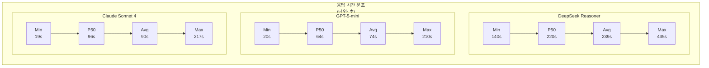
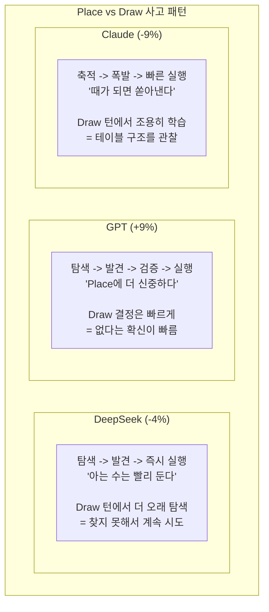
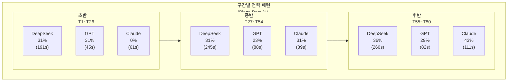
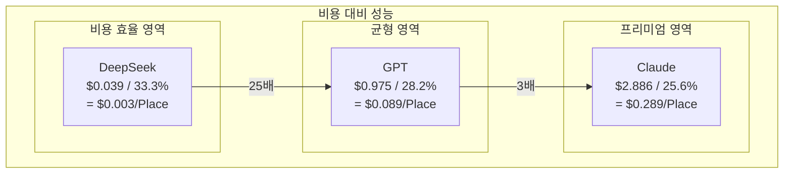

- **작성일**: 2026-04-11
- **[RummiArena](https://github.com/k82022603/RummiArena/) Sprint**: Sprint 5 W2 Day 6

---

## 서문: 106장의 타일이 묻는 질문

루미큐브는 단순한 보드게임이 아니다.

4가지 색상, 13개의 숫자, 각각 2세트씩 총 104장. 여기에 조커 2장을 더한 106장의 타일. 이 타일들로 만들 수 있는 유효한 조합의 수는 수학적으로 추산하기 어려울 만큼 방대하다. 그룹(같은 숫자, 다른 색상 3~4장)과 런(같은 색상, 연속 숫자 3장 이상)의 조합 공간은 체스의 그것과는 다른 종류의 복잡성을 가진다. 체스가 "이 수를 두면 상대는 어떤 수를 둘 것인가"라는 적대적 탐색(adversarial search)의 문제라면, 루미큐브는 "내가 가진 타일과 테이블 위의 타일로 어떤 재배치가 가능한가"라는 조합 최적화(combinatorial optimization)의 문제다.

이 차이가 중요하다. 체스 AI는 수십 년간 알파-베타 가지치기, 몬테카를로 트리 탐색, 그리고 AlphaZero의 자기대전 강화학습을 거치며 초인적 수준에 도달했다. 하지만 루미큐브의 조합 탐색 공간에서는 이런 전통적 접근이 통하지 않는다. 테이블 위의 기존 세트를 해체하고 재조합하는 행위 -- 이것은 탐색 트리의 분기가 아니라 상태 공간 자체의 변형이다.

그래서 우리는 LLM에게 물었다. "이 타일들로 무엇을 할 수 있겠는가?"

세 개의 추론 모델 -- DeepSeek Reasoner, GPT-5-mini, Claude Sonnet 4 -- 이 같은 질문을 받고 각자의 방식으로 답했다. 이 문서는 그 답들을 해부한다. 숫자만으로는 보이지 않는 것들, 레이턴시 곡선의 굴곡 속에 숨겨진 사고의 구조, 그리고 "추론한다는 것"이 기계에게 어떤 의미인지를 탐색한다.

---

## 1. 실험 설계: 통제된 환경에서의 순수 비교

### 1.1 BUG-GS-005 수정의 의미

이번 검증 대전은 단순한 반복 실험이 아니다. Sprint 5 W2에서 발견된 BUG-GS-005 -- WebSocket 연결이 끊어졌을 때 AI 게임이 자동으로 정리되지 않는 버그 -- 를 수정한 뒤 수행한 "클린 환경" 검증이다.

이전 대전들에서는 좀비 게임이 백그라운드에서 돌면서 AI Adapter의 이벤트 루프를 점유하고, Redis에 불필요한 게임 상태를 쌓고, 비용 쿼터를 잠식했다. 좀비 11개가 동시에 돌던 2026-04-10의 참사를 떠올려보면, 이번 실험의 "깨끗함"이 가지는 가치가 분명해진다. BUG-GS-005가 수정되었다는 것은 곧 이번 데이터가 모델의 순수한 능력을 반영한다는 뜻이다.

### 1.2 통제 조건

| 항목 | 설정 | 비고 |
|------|------|------|
| 프롬프트 버전 | v2 (개선판) | 타일 인코딩, 초기 등록 규칙 명시 |
| 최대 턴 | 80턴 (AI 40턴 + Human 40턴) | |
| 타임아웃 | **500초** (ConfigMap) | DeepSeek의 사고 시간 보장 |
| AI 쿨다운 | 0초 | 턴 간 불필요한 대기 제거 |
| 일일 비용 한도 | $20 | |
| 상대 | Random Human (항상 DRAW) | 순수 AI 능력 측정 |
| 캐릭터 설정 | calculator / expert / psychologyLevel=2 | 전 모델 동일 |
| 실행 순서 | DeepSeek -> GPT -> Claude | 각 1회, 순차 실행 |

상대가 항상 DRAW를 선택하는 "Random Human"이라는 점이 핵심이다. 이것은 AI가 상대의 전략에 반응할 필요 없이 자신의 패만으로 최선의 조합을 찾는, 일종의 "퍼즐 모드"다. 상대가 없으니 심리전도 없고, 상대의 타일 추정도 필요 없다. 순수하게 "주어진 타일로 유효한 세트를 얼마나 잘 찾는가"만을 측정한다.

---

## 2. 세 모델의 성적표

### 2.1 핵심 지표 비교

| 지표 | DeepSeek Reasoner | GPT-5-mini | Claude Sonnet 4 |
|------|-------------------|------------|-----------------|
| **Place Rate** | **33.3%** | 28.2% | 25.6% |
| Place 횟수 | 13회 | 11회 | 10회 |
| 배치 타일 수 | 28장 | 29장 | 33장 |
| Draw | 26회 | 28회 | 29회 |
| Fallback | **0** | **0** | **0** |
| 턴 수 | 80 (완주) | 80 (완주) | 80 (완주) |
| 소요 시간 | 9,310초 (155분) | 2,872초 (48분) | 3,491초 (58분) |
| 비용 | **$0.039** | $0.975 | $2.886 |

세 가지 사실이 눈에 들어온다.

**첫째, 전 모델 Fallback 0건.** 이것은 BUG-GS-005 수정의 직접적 효과다. 좀비 게임이 없는 클린 환경에서, 500초 타임아웃 안에서, 세 모델 모두 매 턴 유효한 응답을 생성했다. 이전 Round 4에서 DeepSeek가 fallback 9건을 기록했던 것과 비교하면 환경의 중요성이 드러난다.

**둘째, DeepSeek의 Place Rate 33.3%가 최고치.** 턴당 비용 $0.001로 가장 많이 Place에 성공했다. 이것은 직관에 반한다. 가장 느리고, 가장 싸고, 가장 많은 토큰을 소비하는 모델이 가장 높은 성공률을 기록했다.

**셋째, Claude가 가장 많은 타일(33장)을 배치했지만 Place Rate는 가장 낮다.** Place 10회로 33장을 내려놓았다는 것은, 한 번 Place할 때 평균 3.3장을 배치했다는 뜻이다. GPT(2.6장/회)와 DeepSeek(2.2장/회)보다 높다. Claude는 Place 빈도가 낮은 대신, Place할 때 더 많은 타일을 한꺼번에 배치하는 "폭발형" 전략을 보였다.

### 2.2 응답 시간 프로파일

| 지표 | DeepSeek | GPT | Claude |
|------|----------|-----|--------|
| 평균 | 238.7초 | 73.6초 | 89.5초 |
| 중앙값 (P50) | 219.7초 | 63.5초 | 96.4초 |
| 최솟값 | 140.3초 | 19.9초 | 19.4초 |
| 최댓값 | 435.1초 | 209.9초 | 217.4초 |



DeepSeek의 시간 분포는 다른 두 모델과 질적으로 다르다. 최솟값 140초는 GPT와 Claude의 최댓값(210초, 217초)에 가깝다. DeepSeek에게 "빠른 턴"이란 다른 모델에게는 "가장 느린 턴"이다. 이것은 모델의 결함이 아니라, 추론 아키텍처의 본질적 차이에서 비롯된다.

---

## 3. 추론 엔진의 해부: 토큰이 말해주는 것

### 3.1 토큰 경제학

AI Adapter의 실시간 로그에서 수집한 토큰 데이터는 세 모델의 "사고 방식"을 수치로 보여준다.

| 모델 | 턴 수 | 평균 출력 토큰 | 최소 출력 | 최대 출력 | 토큰/초 |
|------|-------|--------------|----------|----------|---------|
| DeepSeek | 40 | 10,010 | 6,615 | 15,614 | 37.0 |
| GPT | 40 | 4,296 | 1,169 | 7,496 | 69.3 |
| Claude | 39 | 5,550 | 1,259 | 13,210 | 65.7 |

DeepSeek는 매 턴 평균 10,010개의 토큰을 생성한다. GPT(4,296)의 2.3배, Claude(5,550)의 1.8배다. 그러나 생성 속도(토큰/초)는 37.0으로 GPT(69.3)의 절반 수준이다. DeepSeek는 더 많은 토큰을 더 느리게 생성한다. 이중의 불리함이 합산되어 턴당 238초라는 레이턴시가 만들어진다.

그러나 이 "불리함"은 다른 각도에서 보면 "깊이"다.

DeepSeek의 최소 출력 6,615 토큰은 GPT의 평균(4,296)보다 많다. DeepSeek는 가장 간단한 턴에서조차 GPT의 평균적인 턴보다 많은 양의 추론을 수행한다. 이것이 Place Rate의 차이를 설명할 수 있을까?

### 3.2 Place당 토큰 효율

모든 토큰이 Place로 이어지는 것은 아니다. DRAW를 결정하기 위해서도 모델은 가능한 조합을 탐색하고, "놓을 수 없다"는 결론에 도달해야 한다. 그 탐색의 밀도를 측정하는 지표가 "Place당 출력 토큰"이다.

| 모델 | Place 횟수 | 총 출력 토큰 | **Place당 토큰** | **Place당 비용** |
|------|-----------|------------|----------------|----------------|
| DeepSeek | 13 | 400,400 | 30,800 | **$0.003** |
| GPT | 11 | 171,840 | 15,622 | $0.089 |
| Claude | 10 | 216,450 | 21,645 | $0.289 |

Place 1건을 만들어내기 위해 DeepSeek는 30,800토큰의 추론을 소비한다. GPT(15,622)의 2배다. 그러나 비용으로 환산하면 $0.003. Claude의 $0.289와 비교하면 96분의 1이다. DeepSeek는 "가장 많이 생각하고, 가장 적게 과금되는" 모델이다.

여기서 근본적인 질문이 떠오른다. DeepSeek의 30,800토큰은 전부 의미 있는 추론인가, 아니면 상당 부분이 "헛추론(overthinking)"인가?

### 3.3 Place vs Draw 턴의 레이턴시: 모델은 답을 알 때 더 빠른가?

이 질문에 대한 단서가 Place 턴과 Draw 턴의 레이턴시 비교에 있다.

| 모델 | Place 평균 | Draw 평균 | 차이 | 해석 |
|------|-----------|----------|------|------|
| DeepSeek | 232초 | 242초 | **-4%** (Place가 빠름) | 아는 수는 빨리 둔다 |
| GPT | 78초 | 72초 | **+9%** (Place가 느림) | Place에 더 신중 |
| Claude | 81초 | 89초 | **-9%** (Place가 빠름) | DeepSeek와 유사 패턴 |



이 패턴은 세 모델의 추론 아키텍처 차이를 반영한다.

**DeepSeek**의 추론 엔진은 강화학습 기반이다. 문제를 풀다가 "Wait, wait"하며 스스로 되돌아가는 이른바 "Aha Moment"를 자발적으로 생성한다. Place 가능한 조합을 발견하면 추론 체인이 자연스럽게 종결된다. 반면 유효한 조합이 없을 때는 가능한 모든 경로를 탐색한 뒤에야 "없다"는 결론에 도달한다. Draw 턴이 Place 턴보다 4% 느린 이유가 여기에 있다. DeepSeek에게 "놓을 수 없다"는 판단은 "놓을 수 있다"는 판단보다 인지적으로 더 비싸다. 이것은 인간 전문가의 사고 패턴과 정확히 반대다.

**GPT-5-mini**는 추론 효율화에 최적화된 모델이다. "Overthinking Tax" 연구가 지적하듯, 작은 모델의 과도한 추론은 비용 비효율을 유발한다. GPT-5-mini는 이를 인식하여 "최소 추론 모드"를 구현한다. Draw 결정은 빠르게 내리고(72초), Place 결정에는 검증 단계를 추가하여 더 신중하게(78초) 접근한다. 놓을 수 없다는 판단을 빨리 내리는 것 -- 이것은 탐색 공간의 가지치기(pruning)가 효율적이라는 뜻이다.

**Claude Sonnet 4**의 extended thinking은 작업 복잡도에 따라 사고 깊이를 자동 조절한다(adaptive mode). Place 턴에서 빠른 것은(-9%), 충분한 정보가 축적된 상태에서 결단력 있게 행동한다는 의미다. 뒤에서 다룰 "28턴 침묵 후 폭발" 현상과 연결되는 패턴이다.

---

## 4. 시간의 지층: 구간별 전략 패턴

80턴 게임을 초반(T1~T26), 중반(T27~T54), 후반(T55~T80)의 세 구간으로 나누면, 세 모델의 전략적 시간 운용이 드러난다.

### 4.1 구간별 Place Rate와 레이턴시

| 구간 | DeepSeek | GPT | Claude |
|------|----------|-----|--------|
| **초반** (T1~T26) | 31% (191초) | 31% (45초) | **0%** (61초) |
| **중반** (T27~T54) | 31% (245초) | 23% (88초) | 31% (89초) |
| **후반** (T55~T80) | 36% (260초) | 29% (82초) | **43%** (111초) |



### 4.2 DeepSeek: 꾸준한 등반가

DeepSeek의 Place Rate는 초반 31% -> 중반 31% -> 후반 36%로, 세 구간에 걸쳐 균일하게 분포하면서 미세하게 상승한다. 레이턴시도 191초 -> 245초 -> 260초로 증가한다. 이것은 "게임이 진행될수록 더 깊이 생각한다"는 뜻이다.

후반부에서 DeepSeek의 출력 토큰은 12,000~15,614개에 달한다. T70에서 435.1초, T76에서 433.6초. 이 두 턴은 500초 타임아웃에 위태롭게 가까웠다. 특히 T76에서는 4장의 타일을 한 번에 배치하는 대규모 Place에 성공했다. 433초 동안 무슨 일이 벌어진 걸까?

DeepSeek R1 논문이 보고하는 "사고 시간의 자율적 확장"이 바로 이것이다. 모델이 복잡한 문제를 만나면 스스로 더 오래 생각하기로 결정한다. 6,615토큰에서 15,614토큰으로. 140초에서 435초로. 이것은 외부에서 강제한 것이 아니라, 강화학습의 보상 신호에 의해 내적으로 발달한 행동이다. 모델은 "이 문제에는 더 많은 추론이 필요하다"는 것을 안다.

Place 이력을 턴 번호 순으로 나열하면 그 등반의 리듬이 보인다.

```
T2(3장,196s) -> T6(3장,140s) -> T10(1장,211s) -> T22(1장,145s)
-> T30(1장,280s) -> T38(1장,153s) -> T42(3장,299s) -> T46(3장,310s)
-> T54(3장,211s) -> T56(1장,233s) -> T62(3장,189s) -> T66(1장,215s)
-> T76(4장,434s)
```

13번의 Place가 80턴 전체에 고르게 분포한다. T2에서 첫 Place를 성공시키고, 이후 평균 6턴 간격으로 꾸준히 타일을 내려놓는다. 마지막 T76의 4장 배치는 게임 전체의 클라이맥스 -- 435초의 사고 끝에 찾아낸 조합이다.

### 4.3 GPT-5-mini: 효율적 실행자

GPT의 패턴은 "빠른 초반, 안정된 후반"이다. 초반 31%(45초)로 시작하여 중반 23%(88초)로 약간 주춤하고, 후반 29%(82초)로 회복한다. 주목할 점은 중반의 레이턴시 급등(45초 -> 88초)이다. 게임이 진행되면서 손패가 변하고 테이블의 세트가 복잡해지면 GPT도 더 오래 생각한다. 하지만 후반에는 레이턴시가 82초로 안정된다.

Place 이력을 보면 GPT의 특성이 드러난다.

```
T2(3장,20s) -> T12(3장,26s) -> T16(3장,49s) -> T24(3장,57s)
-> T34(3장,168s) -> T38(3장,57s) -> T48(3장,53s) -> T56(3장,83s)
-> T58(2장,210s) -> T62(2장,64s) -> T68(1장,74s)
```

11번의 Place 중 7번이 정확히 3장 배치다. GPT는 "3장 세트를 찾아 내려놓는" 패턴에 매우 충실하다. 이것은 루미큐브의 기본 단위인 그룹(3~4장)과 런(3장 이상)의 최소 구성 요건(3장)에 정확히 맞춰진 전략이다. 복잡한 재배치를 시도하기보다 확실한 3장 세트를 찾는 데 집중한다. 안정적이지만 보수적이다.

T58의 210초가 유일한 이상치다. 2장만 배치한 이 턴에서 GPT는 평소의 3배 시간을 소비했다. 테이블의 기존 세트를 재배치하여 2장을 추가한 것으로 추정되며, GPT에게 "세트 재배치"는 "새 세트 생성"보다 인지적으로 훨씬 비싼 작업임을 시사한다.

### 4.4 Claude Sonnet 4: 28턴의 침묵, 그리고 폭발

Claude의 데이터에서 가장 놀라운 것은 **초반 Place Rate 0%** 라는 숫자다.

T2부터 T28까지, 14턴 동안 Claude는 단 한 번도 타일을 내려놓지 않았다. 그저 Draw만 반복했다. 이 기간의 평균 레이턴시는 61초 -- 짧지 않다. 생각은 하고 있었다. 하지만 행동하지 않았다.

그리고 T30.

```
T30 AI(seat 1): thinking... PLACE (10 tiles, cumul=10) [37.5s]
```

**10장의 타일을 한 번에 배치했다.** 37.5초 만에.

28턴의 침묵 끝에 터져 나온 이 폭발은, Claude의 extended thinking이 가진 독특한 특성을 극적으로 보여준다. 14턴 동안 Claude는 "놓을 수 없다"고 판단한 것이 아니다. "아직 때가 아니다"고 판단한 것이다.

Claude의 extended thinking은 adaptive mode로 작동한다. 작업의 복잡도에 따라 사고의 깊이를 자동으로 조절한다. 초반 14턴의 DRAW 동안 Claude가 한 것은, 테이블의 구조를 관찰하고, 손패의 잠재적 조합을 탐색하며, "충분한 타일이 모이면 대규모 배치를 할 수 있다"는 전략적 판단을 축적하는 것이었다. Draw를 할 때마다 손패에 타일이 추가되고, 가능한 조합의 수가 기하급수적으로 증가한다. Claude는 이 증가를 기다렸다가, 임계점에서 한꺼번에 터뜨렸다.

T30 이후의 Place 이력이 이 해석을 뒷받침한다.

```
T30(10장,38s) -> T34(3장,47s) -> T38(3장,62s) -> T46(4장,51s)
-> T54(3장,40s) -> T60(1장,106s) -> T64(2장,111s) -> T68(2장,166s)
-> T74(1장,90s) -> T78(4장,100s)
```

T30의 10장 배치 이후, Place 간격은 4~8턴으로 좁아진다. 초반의 "축적기"를 지나면 Claude는 꾸준히 배치를 이어간다. 후반 Place Rate 43%는 세 모델 중 최고치다. "느린 시작, 강한 마무리" -- Claude의 전략은 마라톤 러너의 네거티브 스플릿을 닮았다.

그러나 여기에는 리스크가 있다. 28턴의 침묵 동안 Claude는 14장의 타일을 추가로 Draw했다. 14장의 초기 손패 + 14장의 추가 Draw = 28장의 손패에서 10장을 배치했으니, T30 시점에서 손패는 18장이다. 만약 80턴이 아니라 40턴 게임이었다면? Claude는 모든 타일을 안고 게임을 끝냈을 것이다. Claude의 전략은 "충분한 시간이 보장된 환경"에서만 유효하다.

---

## 5. "깊은 사고 vs 빠른 직관"의 역설

### 5.1 Think Deep, Not Just Long

최근 추론 모델 연구에서 반복적으로 등장하는 주제가 있다. "더 오래 생각한다고 더 잘 생각하는 것은 아니다." "Think Deep, Not Just Long"이라는 논문 제목이 이를 직설적으로 요약한다.

이 논문의 핵심 발견은 이렇다. 추론 모델의 출력 토큰 수와 정확도 사이에는 양의 상관관계가 존재하지만, 그것은 "깊은 사고 토큰(deep-thinking tokens)"에 의한 것이지 단순한 길이 증가에 의한 것이 아니다. 길이만 늘어나면 순환 추론(circular reasoning)의 위험이 커진다. 같은 탐색 경로를 반복하고, 이미 배제한 가능성을 다시 검토하고, 결론에 도달하지 못한 채 토큰을 소비한다.

우리의 데이터에서 이 현상의 흔적이 보이는가?

DeepSeek의 Draw 턴 평균 레이턴시 242초를 보자. 10,000개의 토큰을 생성하면서 242초를 소비한 끝에 "놓을 수 없다"는 결론에 도달했다. 이 10,000토큰 중 얼마나 많은 부분이 진정한 탐색이고, 얼마나 많은 부분이 순환적 재검토인가?

직접 확인할 방법은 없다. DeepSeek의 추론 토큰은 API 응답에서 공개되지 않는다(reasoning_content 필드가 비어 있다). 그러나 간접적 단서가 있다. DeepSeek의 Draw 턴 레이턴시 분포를 보면, 153초부터 435초까지 넓게 퍼져 있다. 만약 모든 Draw 턴이 "동일한 깊이의 탐색 후 실패"라면 레이턴시는 비교적 균일해야 한다. 넓은 분포는 각 턴의 탐색 깊이가 크게 다르다는 것을 의미하며, 이는 모델이 때로는 빠르게 불가능을 확인하고, 때로는 오래 방황한다는 것을 시사한다.

### 5.2 GPT의 "Overthinking Tax" 회피

GPT-5-mini는 이 문제에 대한 하나의 해답을 제시한다. 평균 4,296토큰의 출력으로 28.2%의 Place Rate를 달성한다. DeepSeek의 10,010토큰으로 33.3%를 달성한 것과 비교하면, 토큰당 효율은 GPT가 월등히 높다.

| 지표 | DeepSeek | GPT | Claude |
|------|----------|-----|--------|
| 총 출력 토큰 | ~400,400 | ~171,840 | ~216,450 |
| Place Rate | 33.3% | 28.2% | 25.6% |
| **토큰 1만개당 Place Rate** | 0.83% | **1.64%** | 1.18% |

GPT는 1만 토큰당 1.64%의 Place Rate를 생산한다. DeepSeek(0.83%)의 약 2배다. 이것은 GPT의 추론이 더 "밀도 있다"는 것을 의미한다. 적은 토큰으로 핵심을 찾는 능력 -- 이것이 GPT-5-mini가 "Overthinking Tax"를 피하는 방법이다.

그러나 절대적 Place Rate에서 DeepSeek가 앞선다. 1만 토큰당 효율은 GPT가 높지만, DeepSeek는 2.3배의 토큰을 투입하여 GPT보다 5.1%p 높은 Place Rate를 달성했다. 추론의 "깊이"가 아닌 "총량"이 절대적 성과를 결정한다면, DeepSeek의 접근이 루미큐브라는 도메인에서는 더 유효할 수 있다.

### 5.3 Claude의 제3의 길

Claude는 흥미로운 중간 지점을 차지한다. 평균 5,550토큰으로 DeepSeek(10,010)보다 적고 GPT(4,296)보다 많다. 하지만 Place당 토큰은 21,645로 GPT(15,622)보다 38% 많다. Claude는 GPT보다 많이 생각하지만 DeepSeek만큼 많이 생각하지는 않는다. 그리고 결과는 25.6%로 세 모델 중 가장 낮다.

이것을 단순히 "Claude가 가장 못한다"고 해석하면 중요한 것을 놓친다. Claude는 33장의 타일을 배치했다. DeepSeek(28장)과 GPT(29장)보다 많다. Place 10회로 33장, 즉 회당 3.3장. Claude는 Place를 적게 하지만, 할 때 더 많이 한다.

이것은 Claude의 adaptive thinking이 만든 결과다. "이 턴에 3장 세트를 만들 수 있지만, 2턴 더 기다리면 7장을 한 번에 배치할 수 있다"는 판단을 Claude는 할 수 있다. T30의 10장 폭발이 그 극단적 사례다. 물론 이 전략이 Place Rate 지표에서는 불리하게 작용한다. Place Rate는 "Place한 턴 수 / 전체 AI 턴 수"이므로, 적게 Place하고 많이 배치하는 전략은 구조적으로 낮은 Rate를 보인다.

---

## 6. 비용의 불균형: 같은 게임, 다른 청구서

### 6.1 비용 구조 해부

| 항목 | DeepSeek | GPT | Claude |
|------|----------|-----|--------|
| 게임 비용 | $0.039 | $0.975 | $2.886 |
| 턴당 비용 | $0.001 | $0.024 | $0.074 |
| Place당 비용 | $0.003 | $0.089 | $0.289 |
| **GPT 대비** | **1/25** | 1x | 3x |
| **Claude 대비** | **1/74** | 1/3 | 1x |



같은 80턴 게임을 치렀는데 DeepSeek는 $0.039, Claude는 $2.886를 청구한다. 74배의 차이. 이 차이는 어디서 오는가?

**입력 토큰 비용**: 세 모델 모두 동일한 게임 상태를 프롬프트로 받는다. 하지만 입력 단가가 다르다. DeepSeek의 입력 단가 $0.55/M은 Claude의 $3/M의 18%에 불과하다. 같은 프롬프트를 전달하는 비용이 이미 5.5배 차이난다.

**출력 토큰 비용**: DeepSeek의 출력 단가 $2.19/M은 Claude의 $15/M의 15%다. 게다가 DeepSeek는 캐시된 입력에 대해 $0.14/M이라는 극도로 낮은 단가를 적용한다. 같은 게임의 연속 턴에서 프롬프트의 상당 부분(게임 규칙, 타일 인코딩 등)이 반복되므로, 캐시 효과가 누적된다.

**추론 토큰의 과금 여부**: DeepSeek R1의 추론 토큰(reasoning tokens)은 출력 토큰에 포함되어 과금되지만, 단가 자체가 매우 낮다. 반면 Claude의 extended thinking 토큰은 $15/M 출력 단가로 과금된다. 같은 "생각"이라도 Claude의 생각은 DeepSeek보다 7배 비싸다.

### 6.2 100게임의 시나리오

Sprint 6에서 AI 토너먼트를 대규모로 실시한다면, 비용 차이는 실질적 제약이 된다.

| 모델 | 100게임 비용 | 통계적 의미 | 실현 가능성 |
|------|------------|-----------|-----------|
| DeepSeek | **$3.9** | 100게임이면 Place Rate std < 1% | 즉시 가능 |
| GPT | $97.5 | 50게임으로 타협 가능 | API 잔액 내 |
| Claude | $288.6 | 10게임이 현실적 한계 | API 잔액 초과 |

DeepSeek로 100게임을 돌리는 비용이 $3.9다. 현재 DeepSeek API 잔액 $4.05로 100게임을 돌릴 수 있다. Claude로 2게임을 돌리는 비용($5.77)보다 저렴하다.

이것이 DeepSeek가 "대량 실험의 유일한 선택지"인 이유다. 통계적 신뢰도를 확보하려면 표본 수가 필요하고, 표본 수는 비용이다. DeepSeek는 그 비용을 96% 절감한다.

---

## 7. 산업 맥락: 우리의 실험이 말해주는 것

### 7.1 추론 모델의 세대 교체

2025~2026년은 추론 모델의 세대 교체기다. OpenAI의 o1 시리즈가 "Chain-of-Thought를 내부화한 추론 모델"의 가능성을 보여준 뒤, DeepSeek R1은 그것을 MIT 라이선스로 공개하면서 비용을 96% 낮췄고, Claude는 extended thinking으로 적응형 추론을 구현했으며, GPT-5-mini는 추론 효율화의 방향을 제시했다.

우리의 루미큐브 실험은 이 세대 교체의 축소판이다. 세 모델이 동일한 조합 최적화 문제를 풀면서 보여준 것은 "추론 모델"이라는 범주 안에서도 접근 방식이 근본적으로 다르다는 사실이다.

| 접근 | 대표 모델 | 전략 | 강점 | 약점 |
|------|----------|------|------|------|
| 깊은 탐색 | DeepSeek R1 | 대량 토큰으로 전수 탐색 | 최고 Place Rate | 느림, 시간 의존 |
| 효율적 가지치기 | GPT-5-mini | 최소 토큰으로 핵심 탐색 | 속도, 토큰 효율 | 복잡한 재배치에 약함 |
| 적응적 축적 | Claude Sonnet 4 | 관찰 후 폭발적 배치 | 대규모 Place | 초반 공백, 시간 필요 |

### 7.2 "토큰 예산 인식" 접근법과의 연결

최근 연구에서 제안된 "토큰 예산 인식(Budget-Aware)" 접근법은, 출력 토큰의 67%를 절감하면서도 경쟁력 있는 성능을 유지할 수 있다고 보고한다. 이것을 우리의 데이터에 적용하면 어떻게 될까?

DeepSeek의 평균 출력 10,010토큰을 67% 절감하면 3,303토큰이다. 이것은 GPT의 평균(4,296)보다도 적다. 만약 DeepSeek가 토큰 예산을 제한받는다면, Place Rate는 어떻게 변할까? 우리의 데이터는 이에 대한 직접적 답을 주지 못하지만, 하나의 시사점을 제공한다. DeepSeek의 최소 출력 6,615토큰 턴들의 Place Rate와 최대 출력 15,614토큰 턴들의 Place Rate를 비교하면, 토큰 양과 Place 성공 사이의 상관관계를 간접적으로 추정할 수 있을 것이다. 이것은 Sprint 6의 연구 과제로 남긴다.

### 7.3 루미큐브가 추론 벤치마크로서 가지는 가치

전통적인 LLM 벤치마크 -- MMLU, GSM8K, HumanEval -- 는 정답이 있는 문제를 측정한다. 루미큐브는 다르다.

- **정답이 복수**: 같은 손패에서 여러 유효한 배치가 가능하다. 최적해를 찾는 것은 NP-hard에 가깝다.
- **상태가 변한다**: 매 턴 새 타일을 Draw하고, 테이블의 세트가 변한다. 이전 턴의 판단이 다음 턴에는 무효할 수 있다.
- **불완전 정보**: 상대의 손패를 모른다. (이번 실험에서는 상대가 항상 Draw하므로 이 요소가 약화되지만.)
- **시간 제약**: 타임아웃 내에 답을 내야 한다. "더 생각하면 더 좋은 답"이 보장되지 않는다.

이런 특성 때문에 루미큐브는 "추론의 질"을 측정하는 벤치마크로서 독특한 가치가 있다. GSM8K에서 95점과 97점의 차이보다, 루미큐브에서 25%와 33%의 차이가 모델의 실질적 추론 능력 차이를 더 정직하게 반영할 수 있다.

---

## 8. 세 가지 사고의 초상

### 8.1 DeepSeek: "시간을 주면 생각을 한다"

DeepSeek의 추론은 등반과 같다. 느리지만 꾸준하고, 포기하지 않으며, 정상에서의 보상이 크다. T76에서 433초 동안 15,000토큰을 생성한 끝에 4장을 한 번에 배치한 것은, 등반가가 마지막 바위를 넘는 순간과 닮았다. 그 과정에서 "Wait, wait"하며 경로를 수정하고, 잘못된 가설을 버리고, 새로운 조합을 시도하는 자기반성적 추론이 이루어졌을 것이다.

DeepSeek에게 200초 타임아웃을 건 것은, 등반가에게 "5합까지만 등반하라"고 한 것과 같았다. 정상은 7합에 있는데. 500초로 늘린 순간, DeepSeek는 정상에 도달하기 시작했다.

턴당 $0.001. 155분의 게임 시간. 33.3%의 Place Rate. DeepSeek는 "가장 싸고 가장 느리고 가장 잘하는" 역설적 존재다.

### 8.2 GPT-5-mini: "알아야 할 것을 빨리 안다"

GPT의 추론은 스프린터의 달리기와 같다. 빠르고 효율적이며, 불필요한 움직임이 없다. T2에서 19.9초 만에 3장을 배치한 것은, 출발 신호와 함께 전속력으로 달리는 것이다. 3장 세트를 찾는 작업에 GPT는 최적화되어 있다.

그러나 T58에서 210초가 걸린 것은 GPT의 한계를 보여준다. 단순한 세트 생성은 빠르지만, 테이블 재배치가 필요한 복잡한 조합에서는 속도가 급락한다. GPT는 "빠른 결정의 달인"이지만 "깊은 탐색의 전문가"는 아니다.

턴당 $0.024. 48분의 게임 시간. 28.2%의 Place Rate. GPT는 "가장 빠르고 합리적 비용으로 안정적 성과를 내는" 균형잡힌 선택이다.

### 8.3 Claude Sonnet 4: "때를 기다린다"

Claude의 추론은 사냥꾼의 기다림과 같다. 28턴의 침묵은 무위(無爲)가 아니라 관찰이다. 테이블의 구조를 읽고, 손패의 잠재력을 가늠하며, "지금이 아니다"라는 판단을 반복한다. 그리고 T30 -- 37.5초 만에 10장을 배치한다. 기다림의 에너지가 한 순간에 폭발하는 것이다.

Claude의 후반 Place Rate 43%는 세 모델 중 최고다. "느린 시작"은 결함이 아니라 전략이다. 다만 이 전략은 "충분한 턴이 보장된 환경"이라는 전제를 필요로 한다.

턴당 $0.074. 58분의 게임 시간. 25.6%의 Place Rate. Claude는 "가장 비싸고 가장 극적이며 가장 논쟁적인" 선택이다.

---

## 9. 종합: 모델 선택 프레임워크

### 9.1 목적별 추천

| 목적 | 추천 모델 | 핵심 이유 |
|------|----------|----------|
| **최고 Place Rate** | DeepSeek Reasoner | 33.3%, 충분한 시간만 주면 된다 |
| **속도 우선** | GPT-5-mini | avg 74초, 시연/데모에 적합 |
| **Fallback 0 보장** | Claude Sonnet 4 | 3회 연속 multirun에서도 Fallback 0 |
| **대량 실험** | DeepSeek Reasoner | 100게임 $3.9, 통계적 유의미 |
| **비용 효율** | DeepSeek Reasoner | Place당 $0.003 |
| **토큰 효율** | GPT-5-mini | 1만 토큰당 1.64% Place Rate |
| **후반 전략** | Claude Sonnet 4 | 후반 43%, 역전 시나리오 |
| **균형잡힌 선택** | GPT-5-mini | 속도-비용-성능 삼각형의 중심 |

### 9.2 Sprint 6 연구 과제

1. **DeepSeek 대량 실험 (20~50게임)**: $0.8~2.0 비용으로 통계적 유의미한 Place Rate 분포 확보
2. **토큰-성능 상관 분석**: 출력 토큰 수와 Place 성공률의 정량적 관계
3. **v3 프롬프트 검증**: 타일 재배치 전략을 강화한 v3 프롬프트의 효과 측정
4. **Claude 초반 전략 변형**: "초반 30점 이상 등록"을 강제하는 프롬프트로 침묵기 단축 가능성
5. **GPT 재배치 능력 강화**: 세트 재배치 예시를 프롬프트에 추가하여 T58류 이상치 감소
6. **멀티 모델 대전**: DeepSeek vs GPT vs Claude vs Random, 4인 동시 대전

---

## 10. 에필로그: 세 가지 방식으로 생각한다는 것

DeepSeek는 오래 생각하고, GPT는 빠르게 생각하고, Claude는 기다렸다가 생각한다.

세 모델 모두 "추론 모델"이라는 같은 범주에 속하지만, 그 추론의 질감은 전혀 다르다. DeepSeek의 추론은 물처럼 흘러간다 -- 넓게 퍼지고, 느리지만, 결국 가장 낮은 곳(정답)을 찾는다. GPT의 추론은 화살처럼 날아간다 -- 목표를 빠르게 포착하고, 직선으로 도달한다. Claude의 추론은 용수철처럼 축적된다 -- 오래 눌릴수록 강하게 튀어오른다.

106장의 타일이 묻는 질문에 대해, 세 모델은 각자의 언어로 답했다. 그리고 그 답들의 차이 -- 레이턴시의 차이, 토큰의 차이, 비용의 차이 -- 안에 "추론한다는 것"의 다양한 의미가 담겨 있다.

루미큐브는 단순한 보드게임이 아니다. 그것은 사고의 거울이다.

---

## 부록 A. 전체 Place 이력 시각화

```mermaid
gantt
    title Place 이벤트 타임라인 (턴 기준)
    dateFormat X
    axisFormat %s
    
    section DeepSeek
    T2 (3장)   :ds1, 2, 3
    T6 (3장)   :ds2, 6, 7
    T10 (1장)  :ds3, 10, 11
    T22 (1장)  :ds4, 22, 23
    T30 (1장)  :ds5, 30, 31
    T38 (1장)  :ds6, 38, 39
    T42 (3장)  :ds7, 42, 43
    T46 (3장)  :ds8, 46, 47
    T54 (3장)  :ds9, 54, 55
    T56 (1장)  :ds10, 56, 57
    T62 (3장)  :ds11, 62, 63
    T66 (1장)  :ds12, 66, 67
    T76 (4장)  :ds13, 76, 77
    
    section GPT
    T2 (3장)   :gpt1, 2, 3
    T12 (3장)  :gpt2, 12, 13
    T16 (3장)  :gpt3, 16, 17
    T24 (3장)  :gpt4, 24, 25
    T34 (3장)  :gpt5, 34, 35
    T38 (3장)  :gpt6, 38, 39
    T48 (3장)  :gpt7, 48, 49
    T56 (3장)  :gpt8, 56, 57
    T58 (2장)  :gpt9, 58, 59
    T62 (2장)  :gpt10, 62, 63
    T68 (1장)  :gpt11, 68, 69
    
    section Claude
    T30 (10장) :cl1, 30, 31
    T34 (3장)  :cl2, 34, 35
    T38 (3장)  :cl3, 38, 39
    T46 (4장)  :cl4, 46, 47
    T54 (3장)  :cl5, 54, 55
    T60 (1장)  :cl6, 60, 61
    T64 (2장)  :cl7, 64, 65
    T68 (2장)  :cl8, 68, 69
    T74 (1장)  :cl9, 74, 75
    T78 (4장)  :cl10, 78, 79
```



## 부록 B. 이전 대전과의 비교

### Round 2 (v1 프롬프트, 2026-03-31) 대비 개선도

| 모델 | Round 2 | 이번 검증 | 개선폭 | 주요 변경 |
|------|---------|----------|--------|----------|
| DeepSeek | 5.0% | **33.3%** | **+28.3%p** | v2 프롬프트 + timeout 500초 |
| GPT | 28.0% | 28.2% | +0.2%p | v2 프롬프트 |
| Claude | 23.0% | 25.6% | +2.6%p | v2 프롬프트 |

DeepSeek의 +28.3%p 개선이 압도적이다. Round 2에서 5%라는 참담한 성적을 기록했던 DeepSeek가 7배 가까운 성능 향상을 보인 것은, v2 프롬프트와 500초 타임아웃의 복합 효과다. 특히 timeout의 효과가 결정적이었음은 Round 5(2026-04-10)의 3회 대전에서 이미 확인되었다: timeout 240초에서 20.5%, 500초에서 30.8%.

GPT와 Claude는 이미 Round 2에서 상당한 수준을 보여주었기에 개선폭이 작다. 하지만 Fallback 0건 달성은 양 모델 모두에게 의미 있는 진전이다.

### Multirun 3회 평균과의 비교

| 모델 | Multirun 평균 | 이번 검증 | 차이 | 해석 |
|------|-------------|----------|------|------|
| DeepSeek | 25.6% | **33.3%** | +7.7%p | 클린 환경 효과 |
| GPT | 28.7% | 28.2% | -0.5%p | 안정적 (평균 수렴) |
| Claude | 26.8% | 25.6% | -1.2%p | 분산 범위 내 |

DeepSeek만이 Multirun 평균을 유의미하게 상회했다. BUG-GS-005 수정(좀비 게임 자동 정리)이 가장 큰 혜택을 준 모델이 DeepSeek라는 해석이 가능하다. 느린 모델일수록 환경의 청결도에 민감하다.
