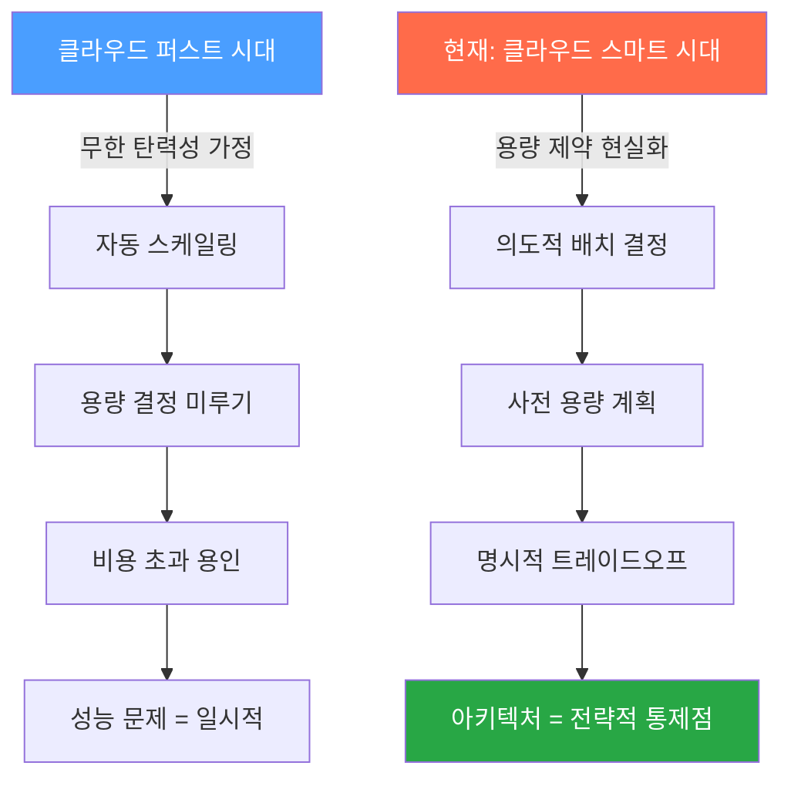
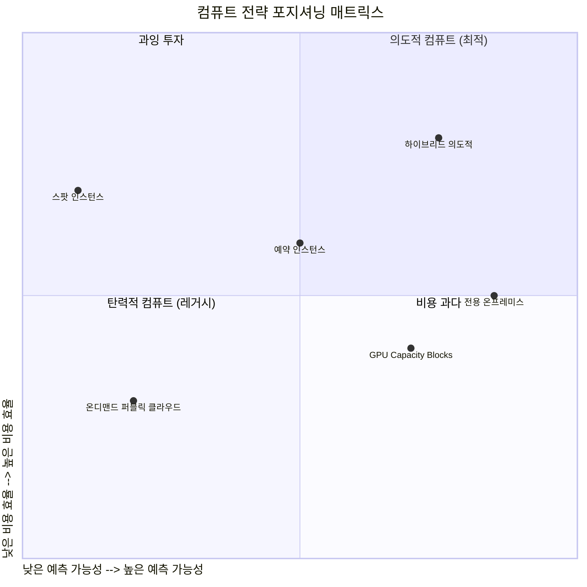
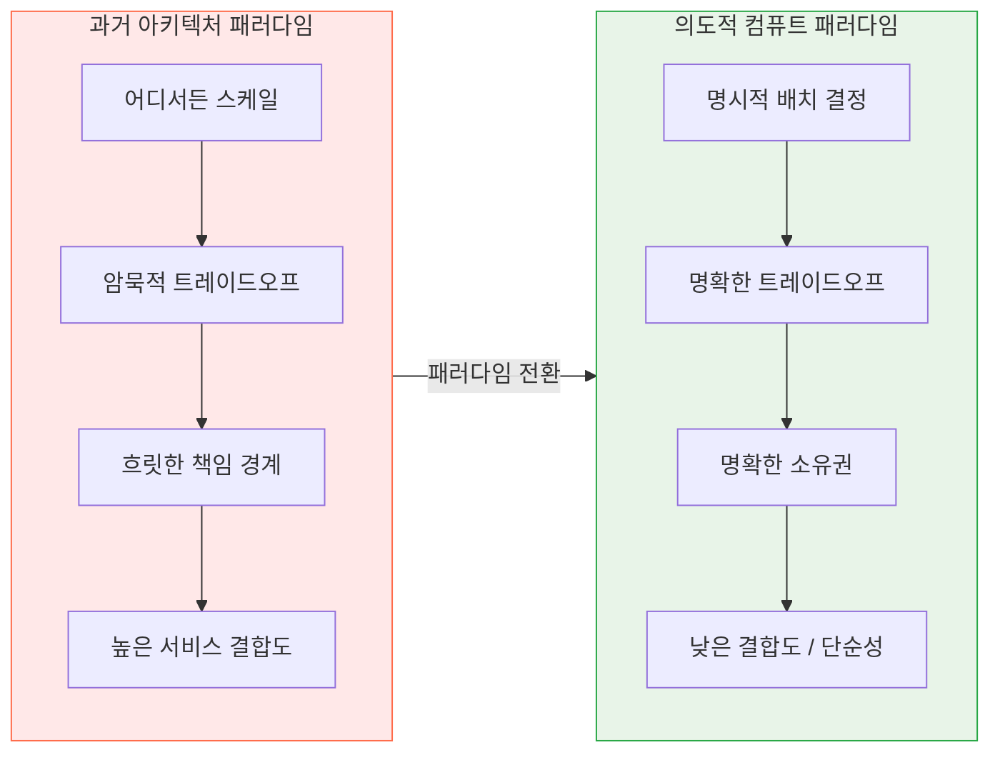
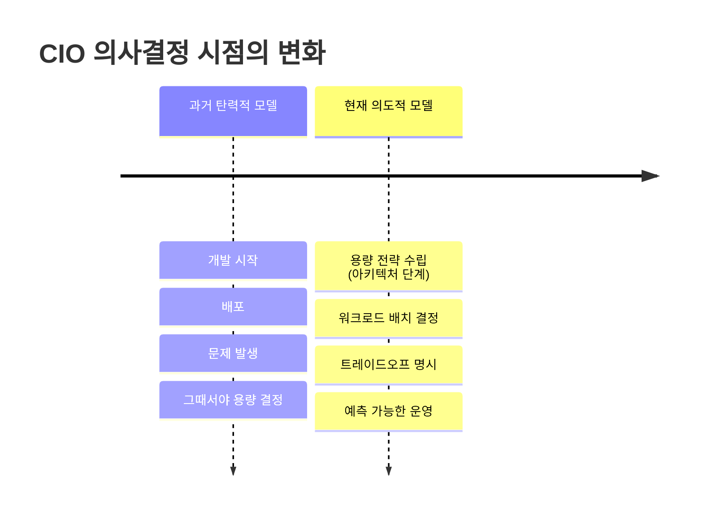
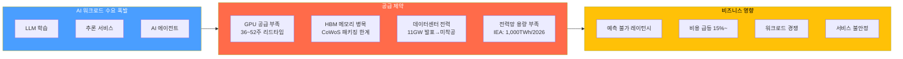
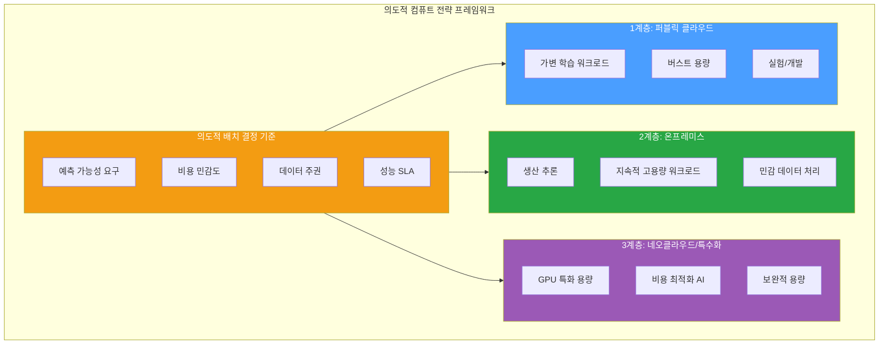
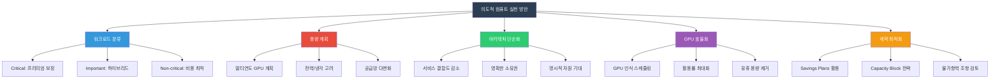

## — 클라우드 무한 확장 신화의 종언과 전략적 인프라 패러다임의 전환 —

> **원문 출처:** [Syed Danish Ali, CIO.com](https://www.cio.com/article/4129637/from-elastic-to-intentional-compute.html), 2026년 2월 10일  
> **분석 작성일:** 2026년 4월 11일  
> **분류:** 클라우드 컴퓨팅 / 엔터프라이즈 아키텍처 / IT 전략

---

## 목차

1. [글의 배경과 저자 소개](#1-글의-배경과-저자-소개)
2. [핵심 주장 요약](#2-핵심-주장-요약)
3. [깨진 전제: 클라우드는 무한하다는 신화](#3-깨진-전제-클라우드는-무한하다는-신화)
4. [제약이 먼저 드러나는 곳](#4-제약이-먼저-드러나는-곳)
5. [탄력적 컴퓨트 vs 의도적 컴퓨트의 트레이드오프](#5-탄력적-컴퓨트-vs-의도적-컴퓨트의-트레이드오프)
6. [아키텍처 함의: 설계의 전략적 의미 변화](#6-아키텍처-함의-설계의-전략적-의미-변화)
7. [CIO 의사결정의 변화](#7-cio-의사결정의-변화)
8. [2026년 현실: 최신 데이터로 본 용량 위기](#8-2026년-현실-최신-데이터로-본-용량-위기)
9. [GPU 공급망 위기의 구조적 원인](#9-gpu-공급망-위기의-구조적-원인)
10. [데이터센터 전력 위기](#10-데이터센터-전력-위기)
11. [클라우드 계약과 용량 위험의 법적 문제](#11-클라우드-계약과-용량-위험의-법적-문제)
12. [엔터프라이즈의 대응 전략: 3계층 하이브리드 아키텍처](#12-엔터프라이즈의-대응-전략-3계층-하이브리드-아키텍처)
13. [클라우드 가격 구조의 변화](#13-클라우드-가격-구조의-변화)
14. [의도적 컴퓨트 전략을 위한 실천 방안](#14-의도적-컴퓨트-전략을-위한-실천-방안)
15. [한국 기업에 대한 시사점](#15-한국-기업에-대한-시사점)
16. [결론](#16-결론)

---

## 1. 글의 배경과 저자 소개

이 글은 2026년 2월 10일 글로벌 IT 리더십 전문 미디어인 CIO.com에 게재된 오피니언 기고문이다. 저자 Syed Danish Ali는 18년 경력의 기술 아키텍트로, 대규모 엔터프라이즈 환경에서 고성능 분산 시스템을 설계해온 전문가다. 그는 IEEE 시니어 멤버이자 Sigma Xi 과학 연구 명예 학회 정회원이며, AI 기반 시스템과 분산 아키텍처를 다루는 미국 특허를 다수 보유하고 있다. GPU 가속 워크로드와 의도적 인프라 계획을 포함한 AI 컴퓨팅 스케일링 전략에 관한 독립적 연구를 수행하고 있다.

이 기고는 Foundry Expert Contributor Network의 일환으로 작성된 것으로, 특정 조직의 아키텍처가 아닌 저자의 독립적인 기술 연구에 기반한 견해임을 명시하고 있다. 다시 말해, 이 글은 현장에서 클라우드 전략을 직접 다뤄온 아키텍트가 업계 전반에서 목격한 구조적 변화를 포착해 낸 경고이자 처방이다.

2026년 초 이 글이 발표된 시점은 매우 의미심장하다. AI 워크로드의 폭발적 성장으로 클라우드 GPU 가용성이 전례 없는 압박을 받고 있었고, AWS는 2026년 1월 조용히 GPU EC2 Capacity Block 요금을 15% 인상했으며, 데이터센터 전력망 구축이 수요를 따라가지 못하는 상황이 현실화되고 있었다. 이 글은 그러한 거대한 구조 변화의 한가운데서 쓰인 글이다.

---

## 2. 핵심 주장 요약

Ali의 주장은 단순하고 강렬하다. **클라우드가 '무한히' 확장된다는 시대는 끝났다.** 그 결과, CIO(최고정보책임자)를 비롯한 IT 리더들은 이제 다음의 세 가지 질문을 반드시 명시적으로 답해야 한다.

첫째, 어떤 워크로드를 어디서 실행할 것인가(워크로드 배치 결정). 둘째, 얼마나 많은 용량을 미리 확보해야 하는가(사전 용량 계획). 셋째, 어떤 트레이드오프가 수용 가능한가(비용-성능-안정성의 균형).

이 세 질문은 과거에는 플랫폼 레벨에서 자동으로 처리되거나 기술팀의 운영적 관심사에 머물렀다. 그러나 이제는 아키텍처 설계의 최전선에서, 이른 단계에서, 전략적 의사결정으로 다뤄져야 한다는 것이 Ali의 핵심 메시지다. 클라우드 탄력성은 여전히 존재하지만, 더 이상 **무마찰적이지 않고, 저렴하지 않으며, 보이지 않는 곳에서 알아서 작동하지 않는다.**

---

## 3. 깨진 전제: 클라우드는 무한하다는 신화

### 3.1 탄력성이라는 조용한 가정

지난 10년 이상, 엔터프라이즈 아키텍처는 하나의 조용한 가정 위에 서 있었다. "컴퓨트 용량은 비즈니스 필요에 따라 탄력적으로 확장된다." 클라우드 플랫폼들은 이 믿음을 쉽게 갖도록 만들었다. AWS의 Auto Scaling, Google Cloud의 Managed Instance Groups, Azure의 Virtual Machine Scale Sets 등 모든 퍼블릭 클라우드는 수요에 따라 자동으로 규모를 조절해주는 메커니즘을 제공했다. 그 결과 많은 시스템이 "성능 제약은 극단적인 수요에 도달할 때까지는 다른 누군가의 문제"라는 생각으로 설계되었다.

클라우드와 가상화가 리더들에게 가르친 것은 간단했다. 수요가 증가하면 스케일업하고, 수요가 줄어들면 스케일다운하라. 용량 결정은 미룰 수 있는 것이었고, 성능 문제는 일시적인 것으로 처리될 수 있었으며, 비용 초과는 속도를 위해 지불하는 대가로 받아들여졌다.

### 3.2 균열의 징후들

Ali는 이 가정이 무너지고 있다고 말한다. 여러 조직에서 용량 한계가 실질적인 비즈니스 위험으로 나타나고 있다는 것이다. 예측 불가능한 레이턴시(지연), 급등하는 비용, 워크로드 간의 자원 경쟁이 그 증거들이다. 이것들은 더 이상 드문 트래픽 급증 시에만 나타나는 문제가 아니다. 일상적인 아키텍처와 운영 결정을 형성하는 현실이 되었다.

변한 것은 기술만이 아니다. 리더들이 내려야 할 결정의 성격 자체가 바뀌었다. 탄력성을 기본값으로 믿던 시대에서, 팀은 이제 워크로드를 어디서 실행할지, 용량을 얼마나 예약해야 할지, 어떤 트레이드오프가 수용 가능한지를 직접 선택해야 한다.

CIO들은 이미 반응하기 시작했다. 클라우드 퍼스트에서 클라우드 스마트로의 이동이 바로 그것이다. 워크로드 배치와 비용이 자동이 아닌 의도적인 결정의 대상이 된다.

---

## 4. 제약이 먼저 드러나는 곳

### 4.1 이론이 아닌 현실의 문제

Ali가 강조하는 흥미로운 점은, 인프라 한계가 이론적인 부하 테스트가 아니라 **중요 애플리케이션의 일상적인 동작** 속에서 먼저 모습을 드러낸다는 것이다. 자동으로 느껴지던 것들이 병목이 된다. 응답 시간이 서서히 늘어나고, 비용이 예측을 초과하며, 팀은 새로운 기능을 개발하는 대신 성능 튜닝에 사이클을 소모한다.

이런 패턴들은 하룻밤 사이에 나타나지 않는다. 여기서 큐(Queue)가 길어지고, 저기서 요청이 스로틀링되는 식으로 작은 이상 징후들로 나타나다가, 결국 피할 수 없는 비즈니스 현실이 된다.

### 4.2 제약이 가장 빠르게 드러나는 워크로드

제약은 특수화된 컴퓨트와 지속적 상태가 교차하는 지점에서 가장 빠르게 드러난다고 Ali는 말한다. 구체적으로는 다음과 같은 유형들이다.

**지속적 메모리 집약적 워크로드:** 대형 언어 모델(LLM) 추론, 대규모 데이터베이스 쿼리, 인메모리 분석 등은 방대한 메모리를 지속적으로 점유한다. 2026년 현재, AI 모델들은 10~20TB의 활성 메모리를 필요로 하는 경우도 있으며, 이는 단일 서버의 물리적 한계를 넘어선다.

**고중량 I/O 워크로드:** 실시간 이벤트 스트리밍, 고속 트랜잭션 처리, 대용량 데이터 파이프라인은 스토리지와 네트워크 I/O 대역폭을 극도로 소모한다. 이런 워크로드는 단순한 컴퓨트 증설로 해결되지 않는 경우가 많다.

**가속 컴퓨팅 워크로드:** GPU, TPU 등의 특수 가속기를 필요로 하는 AI 학습 및 추론 워크로드는 이제 클라우드 용량 문제의 핵심이 되었다. S&P Global Market Intelligence의 분석을 비롯한 다수의 산업 보고서가 이 현실을 반영하고 있다.

이런 워크로드들은 무심코 확장할 수 없다. 배치하고, 프로비저닝하고, 비용을 의도적으로 계획해야 한다.

### 4.3 물리적·재정적 천장

클라우드가 무한히 확장된다는 이야기는 종종 엔터프라이즈 규모에서야 비로소 드러나는 물리적·재정적 천장을 가린다. 전력, 밀도, 특수 하드웨어 접근성 같은 용량 제약들이 이제는 조달 계획을 실질적으로 형성하고 있다.

리더들은 클라우드 규모의 겉보기 단순함이 자원 경쟁과 비용 가시성에 관한 냉혹한 현실을 가리고 있다는 것을 직접 목격하면서, 아키텍처적 의도와 물리적·재정적 천장을 조화시키도록 강요받고 있다.

---

## 5. 탄력적 컴퓨트 vs 의도적 컴퓨트의 트레이드오프

### 5.1 과거의 모델: 암묵적 트레이드오프

탄력성은 오랫동안 편리한 추상화였다. 최대 수요를 위해 설계하고, 가변성을 통해 자동 확장하며, 용량 결정을 미룬다. 이 모델에서 트레이드오프는 명시적이지 않고 암묵적이었다. 성능 문제는 일시적인 것으로 처리되고, 비용 초과는 속도의 대가로 수용되었다.

### 5.2 현재의 모델: 명시적 트레이드오프

이 자세는 이제 바뀌고 있다. 트레이드오프가 명시적이 되었다. 리더들은 어떤 워크로드가 프리미엄 용량을 정당화하는지, 어디서 규모를 제한할 수 있는지, 어떤 보장이 진정으로 중요한지를 결정해야 한다.

특히 비용, 신뢰성, 예측 가능성이 교차할 때 이 결정들이 가장 명확하게 드러난다. 이제 리더들은 "얼마나 빨리 확장할 수 있는가"가 아니라 다음을 묻는다.

"부하 하에서 시스템이 얼마나 일관되게 동작하는가?" "비즈니스는 얼마나 많은 변동성을 허용할 수 있는가?" "과도한 프로비저닝이 복원력보다 더 큰 위험을 만들어내지 않는가?"

관리되지 않는 자동 확장은 낭비를 만들어낼 수 있다. 비용, 성능, 활용도를 균형 잡는 더 신중한 자세가 필수적이 되고 있다.

---

## 6. 아키텍처 함의: 설계의 전략적 의미 변화

### 6.1 아키텍처가 불확실성을 증폭시킨다

탄력성이 보이지 않는 안전망 역할을 멈출 때, 아키텍처 결정은 비용, 신뢰성, 운영 명확성에 측정 가능한 결과를 가져온다. 아키텍처는 더 이상 불확실성을 자동으로 흡수하지 않는다. 오히려 그것을 증폭시킨다.

무한 확장 가정 위에 구축된 아키텍처는 종종 책임을 흐릿하게 만든다. 제약 하에서, 흐릿한 경계는 경쟁과 예측 불가능성이 된다. 명확한 소유권, 제한된 인터페이스, 명시적 자원 기대가 중요해진다.

### 6.2 단순성이 전략적 강점이 된다

또 다른 함의는 단순성이 전략적 강점이 된다는 것이다. 최소한의 시스템이 유행이어서가 아니라, 더 단순한 아키텍처가 제약 하에서 더 쉽게 추론할 수 있기 때문이다. 규모가 가정이 아닌 계획의 대상이 될 때, 서비스 간 결합도를 제한하고 불필요한 조율을 줄이는 시스템이 더 예측 가능하게 동작하고 더 높은 복원력을 유지한다.

변하는 것은 사용 가능한 도구들의 집합이 아니라, 그것들을 적용하는 규율이다. 아키텍처는 더 이상 모든 곳에서 규모를 가능하게 하는 것이 아니다. 규모가 허용되는 곳, 제한되는 곳, 그 트레이드오프를 결정할 책임자가 누구인지를 명시적으로 정의하는 것이다.

---

## 7. CIO 의사결정의 변화

### 7.1 용량이 전략적 투입이 된다

탄력성이 가정이 아닌 관리 대상이 될 때, 용량 결정은 장기적인 비즈니스 결과를 가져오는 아키텍처적 약속이 된다. 용량, 배치, 예측 가능성은 운영적 관심사에서 전략적 관심사로 이동하며, 리더들이 위험, 비용, 비즈니스 연속성을 어떻게 생각하는지를 형성한다.

이는 엔터프라이즈가 탄력성을 완전히 포기하거나 경직된 용량 모델로 돌아가야 한다는 의미가 아니다. 오히려 더 신중한 자세를 요구한다. 유연성이 가치를 창출하는 곳과 취약성을 도입하는 곳을 인식하는 것이다.

### 7.2 조기 결정의 중요성

CIO들에게 이것은 강조점의 이동이다. 아키텍처 선택이 더 일찍 중요해지고, 트레이드오프가 더 빨리 드러난다. 용량을 전략적 투입으로 다루는 조직은 더 예측 가능하게 운영될 것이다. 무한한 탄력성을 가정하는 조직은 그 한계를 장애, 비용 초과, 또는 납품 제약이 된 이후에야 발견하게 될 것이다.

---

## 8. 2026년 현실: 최신 데이터로 본 용량 위기

원문이 2026년 2월에 쓰인 이후, Ali의 주장을 뒷받침하는 구체적 사건들이 연이어 터졌다. 이 섹션에서는 2026년 최신 데이터를 통해 "의도적 컴퓨트" 전환의 필요성이 얼마나 긴박한 현실인지 살펴본다.

### 8.1 AWS의 GPU 용량 전쟁

2026년 4월, CIO.com은 충격적인 보도를 내놓았다. 두 명의 대형 AWS 고객이 2026년 전체 AWS Graviton CPU 용량을 통째로 사들이겠다고 요청했다는 것이다. AWS CEO 앤디 재시(Andy Jassy)는 이를 공개 발언에서 언급했으며, AWS가 그런 요청을 들어줄 수 없다고 강조했다. 무어 인사이트 & 스트래티지의 분석가 맷 킴볼은 이를 두고 "두 대형 고객이 AWS의 Graviton 용량 전체를 원한다는 사실이 시장이 어디에 있는지를 우리에게 모든 것을 말해준다"고 논평했다.

더욱이 AWS의 자체 AI 가속기인 Trainium2는 "거의 매진"되었으며, 방금 출하를 시작한 Trainium3도 이미 "거의 완전 구독"된 상태라고 재시는 밝혔다. 심지어 18개월 후에 광범위하게 출시될 Trainium4도 상당량이 사전 예약되었다. 이는 단순한 수요 증가가 아닌, 용량 확보가 기업 전략의 핵심이 된 현실을 보여준다.

### 8.2 AWS EC2 Capacity Block 가격 15% 인상

2026년 1월 4일, AWS는 조용히 GPU 집약적 EC2 Capacity Block 요금을 약 15% 인상했다. p5e.48xlarge 인스턴스의 시간당 가격이 $34.61에서 $39.80으로, p5en.48xlarge는 $36.18에서 $41.61로 올랐다. 미국 서부 북캘리포니아 리전에서는 p5e 변형이 시간당 거의 $50에 달하게 되었다.

AWS 대변인은 이에 대해 "EC2 Capacity Block 가격은 수요와 공급 패턴에 따라 동적으로 변한다"고만 설명했다. 불과 몇 달 전 re:Invent 컨퍼런스에서 AWS가 일부 GPU 인스턴스 요금을 최대 45% 인하하겠다고 발표한 것과 대조적으로, Capacity Block만큼은 그 인하에서 제외되었다는 점이 주목된다.

### 8.3 GPU 공급 구조의 변화

2026년의 GPU 부족은 과거의 일시적 수급 불균형과 차원이 다르다. 세 가지 구조적 요인이 맞물려 있다.

첫째, HBM(High Bandwidth Memory) 공급망 병목이다. NVIDIA의 H100 SXM5는 HBM3를, H200과 Blackwell 라인업은 HBM3e를 사용한다. SK Hynix가 NVIDIA 데이터센터 GPU용 HBM의 대부분을 공급하는데, TSMC의 CoWoS(Chip on Wafer on Substrate) 패키징 공정은 적어도 2027년 중반까지 완전히 할당된 상태다. 삼성과 마이크론이 HBM 용량을 늘리고 있지만, 이른 시기에 부족을 완화하기 어렵다.

둘째, 하이퍼스케일러 선점이다. Microsoft, Google, Meta, Amazon은 2025년에 Blackwell GPU(GB200, B200)에 대해 수십억 달러 규모의 선도 주문을 했다. 이것이 2026년 말, 심지어 2027년까지 NVIDIA의 가용 할당 용량 대부분을 잠식해버렸다.

셋째, 데이터센터 GPU 리드타임이 이제 36 ~ 52주에 이른다. 훈련 지연을 경험한 팀들은 온디맨드 가격이 예약 용량 대비 2 ~ 3배 더 비싸고, 피크 수요 기간에는 스로틀링되거나 아예 이용 불가능한 경우도 있다는 것을 발견하고 있다.

---

## 9. GPU 공급망 위기의 구조적 원인

### 9.1 메모리가 새로운 병목

2026년의 클라우드 비용 동인에 대한 한 가지 통찰력 있는 예측이 현실화되고 있다. 메모리가 컴퓨트나 스토리지를 제치고 주요 클라우드 비용 요인이자 병목이 되고 있다는 것이다.

TrendForce에 따르면, DRAM 평균 가격은 AI 인프라 수요 가속화로 인해 2024년에 약 53% 상승했으며, 2025년에도 35% 더 올랐다. 이는 인프라 계획자들이 10년 이상 의존해온 비용 하락 추세를 역전시킨 것이다. TrendForce는 서버 DRAM 계약 가격이 2026년 초에 전분기 대비 90~95%까지 상승할 수 있다고 전망했다.

메모리 공급업체들은 AI 가속기에 필수적인 HBM을 위해 DDR 및 GDDR로부터 용량을 이동시켰다. 분석가들은 2026년에 데이터센터가 전 세계 메모리 공급의 대부분을 소비하게 될 것이라고 지적한다.

### 9.2 엔터프라이즈 대응: GPU 활용 효율화

2026년 AI에서 승리하는 기업들은 GPU를 가장 많이 보유한 곳이 아니라, 더 적은 GPU에서 더 많은 것을 뽑아내는 곳들이다. GPU 시간당 비용이 높아지고 리드타임이 1년까지 늘어나면서, 활용률이 정의하는 핵심 지표가 되었다.

온프레미스 인프라에서 85% GPU 활용률을 달성하는 팀이 클라우드에서 3배의 GPU를 할당받아 40%로 운영하는 팀을 능가한다. 이는 의도적 컴퓨트 전략의 실질적 결과다.

Amazon 내부에서도 같은 문제가 있었다. Amazon의 소매 부문은 2024년 하반기 내내 1,000대 이상의 P5 인스턴스(각각 8개의 NVIDIA H100 GPU로 구성)가 부족한 상태에 있었다. Amazon은 GPU 공급을 팀 전반에 공유하고 활용도를 극대화하기 위한 "중앙집중식 GPU 오케스트레이션 플랫폼"인 "Project Greenland"를 2024년 7월 출범시켰다. 2025년부터는 모든 GPU 용량 요청이 Greenland를 통해야 한다. 이것이 바로 대규모 조직 내에서의 "의도적 컴퓨트"의 실제 구현이다.

---

## 10. 데이터센터 전력 위기

### 10.1 물리적 인프라가 새로운 한계

Ali가 언급한 "물리적·재정적 천장"은 2026년에 전력 위기라는 구체적 형태로 나타나고 있다. IEA(국제에너지기구)는 데이터센터가 2026년에 1,000TWh의 전력을 소비할 것으로 전망했는데, 이는 일본 전체 전력 소비와 맞먹는 수준이다. 미국의 수요만 해도 2028년까지 150GW에 달할 것으로 예상된다.

Sightline Climate의 보고에 따르면, 2026년에 예상되던 데이터센터 용량 중 최대 11GW가 아직 착공도 되지 않은 발표 단계에 머물러 있으며, 전 세계 프로젝트의 50%가 전력 제약과 그리드 장비 부족으로 지연을 겪고 있다. 병목은 더 이상 자본이나 수요가 아니다. 물리적 인프라가 병목이다.

### 10.2 랙 밀도의 근본적 변화

AI 가속기 배포가 확대되면서 개별 랙의 전력 소비가 10~14kW에서 100kW 이상으로 치솟았다. 이 10배의 랙 수준 전력 밀도 증가는 전기 배전, 냉각 시스템, 건물 인프라의 근본적인 재설계를 요구한다. 결과적으로, 전력 계약을 확보한 기업들도 현대 AI 워크로드를 지원할 수 있는 시설을 구축하는 데 수년의 시간이 필요한 상황이다.

### 10.3 하이퍼스케일러의 전력 확보 경쟁

Microsoft는 위스콘신에 1.5GW 규모의 사이트를 계획하고 있으며 2025년에만 전 세계적으로 2GW의 용량을 구축했다. 전력 부족으로 고객을 받지 못한 사례도 발생했다. Meta의 루이지애나 Hyperion 프로젝트는 32억 달러 규모의 투자로 2GW 복합 사이클 가스 발전소를 포함하고 있다. 최대 용량에서 이 단일 시설은 뉴욕시 전력 소비의 절반 정도를 소비하게 된다.

Google의 2025년 데이터센터 투자 계획은 750억 달러로, 2024년의 330억 달러에서 두 배 이상으로 증가했다. 이런 규모의 투자는 클라우드 인프라가 더 이상 "필요할 때 쓰는 유틸리티"가 아니라, 선제적이고 막대한 자본 투자가 필요한 전략적 자산임을 보여준다.

---

## 11. 클라우드 계약과 용량 위험의 법적 문제

### 11.1 용량 위험의 계약적 부상

Morgan Lewis의 법률 전문가들은 2026년 1월, 클라우드 컴퓨팅 용량 확보를 위한 계약 이슈가 이론적 우려에서 핵심 계약 문제로 부상했다고 지적했다. AI 및 데이터 집약적 워크로드에 대한 수요가 증가함에 따라, 고객들은 클라우드 컴퓨팅 자원에 대한 제약에 점점 더 많이 직면하고 있다.

클라우드 계약은 종종 "용량"을 정확하게 정의하지 않은 채 이 용어를 사용한다. 온디맨드 서비스, 예약 인스턴스, 약정 사용 할인, 사전 구매된 용량 블록 간의 구분이 고객의 관점에서는 워크로드 배포 가능 여부에 실질적인 영향을 미친다.

규제를 받는 고객의 경우, 용량 약정은 종종 법적·컴플라이언스 의무와 교차한다. 데이터 처리 위치에 대한 제한이 공급자의 다른 리전에서 용량을 대체하는 능력을 제한할 수 있다. 공급망 중단과 인프라 부족이 점점 더 예측 가능한 위험이 되면서, 고객들은 예측 가능한 용량 제약이 광범위하게 면제되지 않도록 불가항력 조항을 면밀히 검토해야 한다.

### 11.2 클라우드 공급자의 변경권 유보

클라우드 공급자들은 일반적으로 다음을 포함한 인프라 진화에 대한 광범위한 권리를 유보한다. 특정 하드웨어 구성의 단계적 폐지, 가상화 기술 변경, 네트워크 토폴로지 수정, 데이터센터 재배치, 데이터센터 파트너 또는 하청업체 변경이 그것이다. 이러한 변경들은 특히 특정 구성에 의존하는 고객의 용량 약정에 직접적인 영향을 미칠 수 있다.

이는 의도적 컴퓨트 관점에서 매우 중요한 함의를 갖는다. 용량이 전략적 투입이 된 이상, 그것을 보장하는 계약적 보호 장치도 전략적으로 검토해야 한다.

---

## 12. 엔터프라이즈의 대응 전략: 3계층 하이브리드 아키텍처

Deloitte의 2026년 Tech Trends 보고서는 선도적 조직들이 "3계층 하이브리드 아키텍처"를 구현하고 있다고 밝혔다. 이는 Ali의 "의도적 컴퓨트" 개념의 실질적 구현이다.

### 12.1 1계층: 퍼블릭 클라우드 (탄력성 용도)

퍼블릭 클라우드는 가변적인 학습 워크로드, 버스트 용량 요구, 실험 단계, 기존 데이터 중력이 클라우드 배포를 논리적 선택으로 만드는 시나리오에서 활용한다. 하이퍼스케일러들은 빠르게 진화하는 모델 아키텍처 관리를 단순화하는 최첨단 AI 서비스에 대한 접근을 제공한다.

그러나 AI 추론의 경우, 단순한 온디맨드 클라우드 자원에 의존하는 것이 점점 더 위험해지고 있다. 퍼블릭 클라우드에서 온디맨드 H100 가용성이 사전 예약 용량이 없는 팀에게는 진정으로 불안정해졌다.

### 12.2 2계층: 온프레미스 (일관성 용도)

프라이빗 인프라는 예측 가능한 비용으로 고용량, 지속적인 워크로드에 대한 생산 추론을 실행하는 데 사용된다. 조직은 성능, 보안, 비용 관리에 대한 통제권을 확보하면서 AI 인프라 관리에 대한 내부 전문성을 구축한다.

지적 재산 보호와 데이터 주권이 중요한 이유도 있다. 대부분의 엔터프라이즈 데이터가 여전히 온프레미스에 존재하기 때문에, 조직들은 AI 기능을 데이터로 가져오는 것을 선호한다. 민감한 정보를 외부 AI 서비스로 이동시키는 것보다 지적 재산에 대한 통제를 유지하고 컴플라이언스 요구 사항을 충족할 수 있다.

### 12.3 3계층: 네오클라우드 및 특수화 인프라

전통적인 하이퍼스케일러와 온프레미스 사이에 새로운 선택지가 부상하고 있다. CoreWeave, Lambda Labs, Spheron, Hyperstack 같은 "네오클라우드"들은 벳팅된 데이터센터 파트너로부터 전 세계적으로 GPU 인벤토리를 조달하여 GPU 우선 인프라를 운영한다. 가격이 하이퍼스케일러 대비 최대 4배 저렴한 경우도 있어, 중형 엔터프라이즈와 연구 기관들에게 고급 AI와 HPC 워크로드에 대한 더 실용적인 진입점을 제공한다.

---

## 13. 클라우드 가격 구조의 변화

### 13.1 AWS, Azure, GCP의 가격 패리티와 차별화

2026년 현재, AWS, Azure, GCP의 기본 컴퓨트 가격은 놀라울 정도로 유사하다. 4 vCPU, 16GB RAM 인스턴스가 세 플랫폼 모두에서 미국 리전 기준 시간당 약 $0.19로 가격이 책정되어 있다. 이 기본 컴퓨트 요금의 동일화는 의도적인 것으로, 클라우드 공급자들이 서로의 제품을 모니터링하고 경쟁력을 유지하도록 가격을 조정하기 때문이다.

그러나 GPU 특화 용량에서는 다르다. 공급 제약 때문에 GPU 인스턴스는 온디맨드 요금이 높아지고, 예약 용량에 대한 가격 동학이 복잡해지고 있다. AWS의 Capacity Block 가격 인상이 그 신호탄이다.

### 13.2 약정 모델의 전략적 의미

각 공급자의 약정 할인 모델도 의도적 컴퓨트 전략에서 중요한 역할을 한다.

AWS의 Savings Plans는 특정 EC2 인스턴스에 적용될 수 있는 시간당 컴퓨트 지출 금액에 약정하는 방식으로, 리소스 사용 방식을 조정해야 하는 사람들에게 최대한의 유연성을 제공한다.

GCP의 약정 사용 할인(CUD)은 리전 내의 특정 수의 vCPU와 메모리에 약정하도록 요구한다. AWS 모델보다는 유연하지만, AWS의 리전 간 탄력성은 부족하다.

Azure의 예약 인스턴스는 특정 인스턴스 패밀리와 리전을 선택해야 한다. 인스턴스 크기 내에서 어느 정도의 유연성이 있지만, 워크로드 요구 사항을 자주 변경해야 하는 팀에게는 제약이 될 수 있다.

이 약정 모델들의 선택 자체가 이제 의도적인 전략 결정이다. 안정적인 워크로드가 있는 조직은 Azure나 GCP의 3년 가격이 매력적일 수 있다. 그러나 인스턴스 유형을 자주 조정해야 하는 팀은 AWS의 Savings Plans가 더 유익할 수 있다.

---

## 14. 의도적 컴퓨트 전략을 위한 실천 방안

### 14.1 워크로드 분류와 티어링

의도적 컴퓨트의 첫 번째 실천은 워크로드를 명확하게 분류하는 것이다. 모든 워크로드가 동일한 용량 보장을 필요로 하지는 않는다. 비즈니스 크리티컬도, 중요 수준도, 비핵심 워크로드도 제각각 다른 배치, 프로비저닝, 비용 전략을 요구한다.

비즈니스 크리티컬 워크로드는 예측 가능한 응답 시간, 높은 가용성, 일관된 성능이 직접 수익이나 고객 경험에 영향을 미친다. 이런 워크로드는 프리미엄 용량 보장이 정당화된다. 중요 내부 워크로드는 중요하지만 즉각적인 고객 대면 영향은 제한적이다. 하이브리드 배치가 적합하다. 비핵심 워크로드는 배치나 타이밍에 유연성이 있으며 비용 최적화가 우선이다.

### 14.2 용량 계획의 부활

O'Reilly의 2026년 3월 분석은 "용량 계획이 돌아왔다"고 선언했다. 과거의 "다음 해 VM 수 예측" 연습이 아니라, 모델 선택, 추론 깊이, 워크로드 타이밍이 레이턴시, 비용, 신뢰성 목표를 충족할 수 있는지를 직접 결정하는 새로운 형태의 계획이다.

AI 중심 인프라 세계에서는 "확장"하는 것이 아니라 "용량을 확보"하는 것이다. 자동 확장은 여백에서 도움이 되지만, GPU를 생성할 수는 없다. 전력, 냉각, 가속기 공급이 한계를 설정한다. 의도적 컴퓨트 전략은 이 현실에서 출발한다.

### 14.3 단순성의 전략적 가치

Ali의 통찰 중 가장 실천적인 것은 아마도 단순성의 전략적 가치일 것이다. 규모가 계획의 대상이 될 때, 서비스 간 결합도를 제한하고 불필요한 조율을 줄이는 시스템이 더 예측 가능하게 동작하고 더 높은 복원력을 유지한다.

이는 마이크로서비스 아키텍처에 대한 반성이기도 하다. 수십 개의 상호 의존적인 마이크로서비스로 이루어진 시스템은 용량 제약 하에서 예측하기 어렵다. 명확한 경계, 제한된 인터페이스, 명시적 자원 기대를 가진 더 단순한 설계가 새로운 규율의 대상이 된다.

### 14.4 GPU 활용 효율화

2026년 실질적 경쟁 우위는 더 많은 GPU를 확보하는 것이 아니라 기존 GPU에서 더 많은 것을 뽑아내는 데 있다. 이를 위한 핵심 기술로는 다음이 있다.

GPU 인식 스케줄링(GPU-aware scheduling)은 Kubernetes가 실제 수요에 기반하여 GPU 자원을 동적으로 할당하게 한다. 자동화된 라이프사이클 관리는 학습 실행 사이의 유휴 용량을 제거한다. Day-2 운영 자동화는 수동 오버헤드를 줄이는 모니터링, 알림, 최적화를 포함한다. 그 결과는 더 높은 처리량, 더 낮은 모델당 비용, 예측 가능한 용량이다.

---

## 15. 한국 기업에 대한 시사점

### 15.1 한국 클라우드 시장의 맥락

한국 기업들에게 이 전환은 특별한 맥락을 가진다. 한국은 디지털 전환에서 선도적 위치에 있으며, 많은 기업들이 AWS, Azure, GCP 기반의 클라우드 인프라를 적극적으로 채택해왔다. 그러나 AI 워크로드의 급증과 함께 GPU 가용성 문제, 비용 급등, 데이터 주권 이슈가 복합적으로 작용하고 있다.

특히 금융, 의료, 공공 분야에서 데이터 주권과 규제 컴플라이언스는 클라우드 배치 결정에서 핵심 요소다. 한국인터넷진흥원(KISA)의 클라우드 보안 인증 체계와 개인정보보호법 등 국내 규제를 고려하면, 단순히 글로벌 클라우드에 모든 것을 맡기는 전략은 한계가 있다.

### 15.2 국내 AI 인프라 투자와의 연계

KT, SK텔레콤, LG CNS, NHN Cloud 등 국내 클라우드 사업자들은 AI 인프라 확충에 적극적으로 투자하고 있다. 이는 의도적 컴퓨트 전략에서 국내 사업자를 의미있는 선택지로 고려할 수 있게 해준다. 데이터 주권, 규제 컴플라이언스, 레이턴시 요구를 동시에 충족할 수 있기 때문이다.

### 15.3 실천적 제언

한국 기업 CIO들에게 Ali의 논문에서 도출할 수 있는 실천적 제언은 다음과 같다.

우선 워크로드를 전략적 관점에서 재분류해야 한다. AI 관련 워크로드를 중심으로 어떤 워크로드가 예측 가능한 성능과 비용 보장을 필요로 하는지 명시적으로 파악해야 한다.

다음으로 용량 계획을 부활시켜야 한다. GPU 기반 AI 워크로드에 대해서는 특히 1~2년 앞을 내다보는 용량 계획이 필요하다. GPU 공급망의 구조적 제약을 감안하면, 온디맨드에만 의존하는 전략은 비용과 가용성 양면에서 위험하다.

또한 멀티클라우드와 하이브리드 전략을 구체화해야 한다. 비즈니스 크리티컬 워크로드를 온프레미스 또는 국내 사업자에게 배치하고, 실험적 워크로드는 퍼블릭 클라우드를 활용하는 의도적 배치 전략이 필요하다.

마지막으로 계약 조건을 전략적으로 검토해야 한다. 클라우드 계약에서 용량 보장, 데이터 주권, 불가항력 조항을 면밀히 검토하고, 공급자의 일방적 변경권에 대한 적절한 보호 장치를 마련해야 한다.

---

## 16. 결론

Syed Danish Ali의 "From Elastic to Intentional Compute"는 클라우드 컴퓨팅의 근본적 패러다임 전환을 명확하게 포착한 글이다. 그것은 단순히 클라우드가 더 비싸졌다거나 GPU 부족이 심각하다는 이야기가 아니다. 인프라 아키텍처가 운영적 관심사에서 전략적 통제점으로 격상되었다는 이야기다.

탄력성은 여전히 존재한다. 그러나 이제 계획하고, 비용을 지불하고, 의식적으로 관리해야 하는 것이 되었다. 이 전환을 인식하지 못하는 조직은 장애, 비용 초과, 납품 제약이 된 이후에야 한계를 발견하게 될 것이다.

2026년의 현실이 이 경고를 더욱 생생하게 만들고 있다. AWS 고객이 2026년 전체 Graviton 용량을 통째로 사들이려 하고, GPU 리드타임이 1년에 달하며, 데이터센터 전력 프로젝트의 절반이 착공도 못 하고 있는 세계에서, "필요하면 그때 더 사면 된다"는 가정은 더 이상 신뢰할 수 있는 전략이 아니다.

의도적 컴퓨트는 트렌드가 아니다. 새로운 기본값이다. 이 전환을 앞서 받아들이는 조직이 AI 시대의 인프라 경쟁에서 지속 가능한 우위를 확보할 수 있을 것이다.

---

## 참고 자료

- Syed Danish Ali, ["From elastic to intentional compute"](https://www.cio.com/article/4129637/from-elastic-to-intentional-compute.html) CIO.com, 2026년 2월 10일
- "Why Capacity Planning Is Back," O'Reilly Radar, 2026년 3월 3일
- "The AI infrastructure reckoning: Optimizing compute strategy in the age of inference economics," Deloitte, 2026년 2월 9일
- "Enterprise infrastructure is entering an economic reset," Blocks & Files/HPE, 2026년 3월 30일
- "AI demand is so high, AWS customers are trying to buy out its entire capacity," CIO.com, 2026년 4월 10일
- "AWS Hikes GPU EC2 Prices 15% for AI Workloads Amid Shortages," WebProNews, 2026년 1월 7일
- "The AI Data Center Power Crisis," Tech-Insider, 2026년 4월 8일
- "Navigating Cloud Computing Contracts: Essential Capacity Considerations," Morgan Lewis, 2026년 1월 22일
- "Global AI power demand: Challenges and opportunities," S&P Global Market Intelligence
- "GPU Shortage 2026: How to Secure AI Compute When GPUs Are Sold Out," Spheron Blog, 2026년 4월
- "The 10 Cloud Trends Set to Define 2026," ShapeBlue, 2025년 12월 22일
- TrendForce DRAM 시장 보고서 (2024~2026)

---

*작성일: 2026-04-11*
