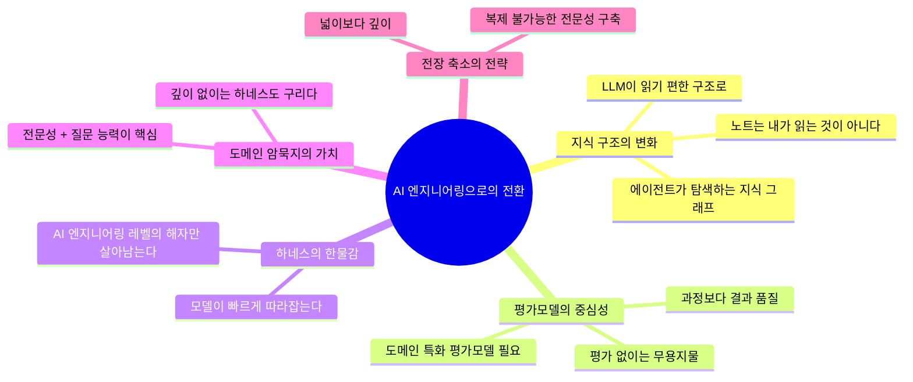
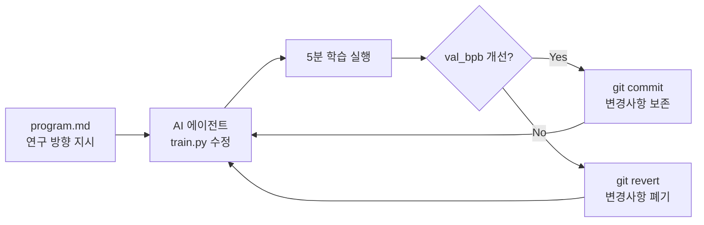
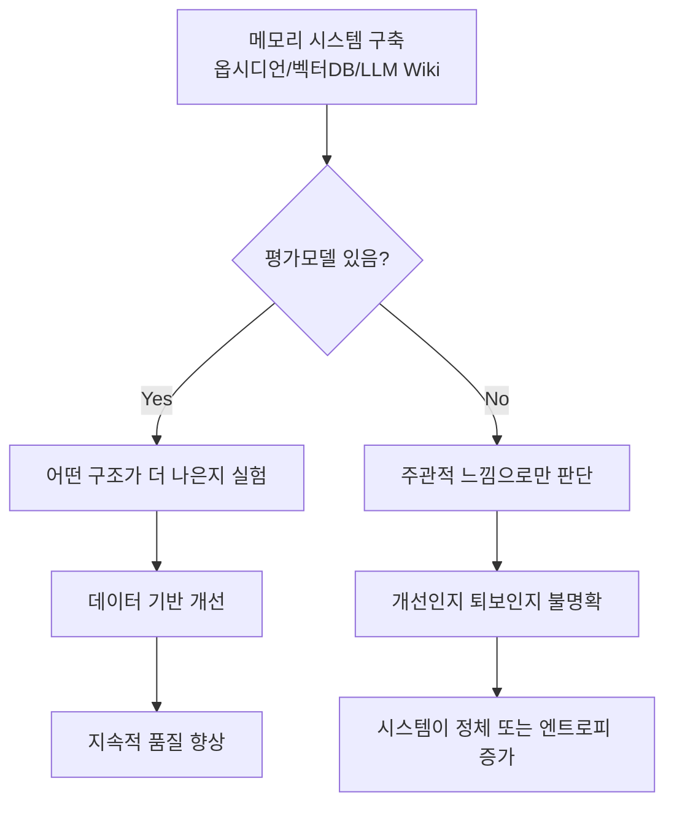
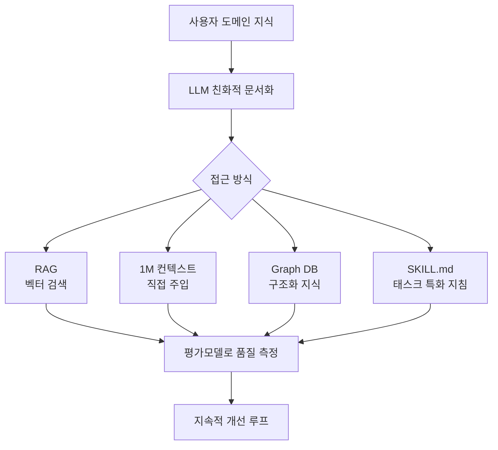
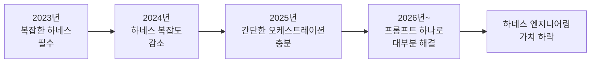
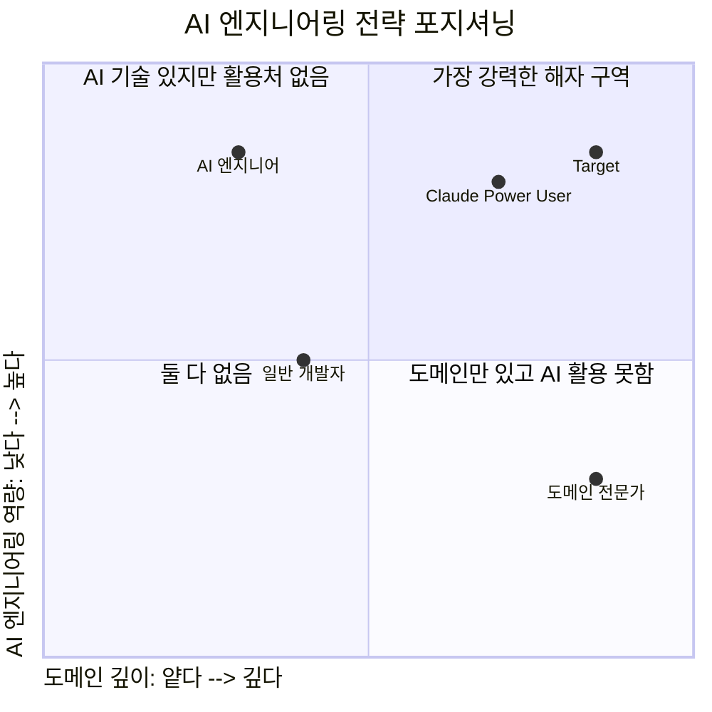
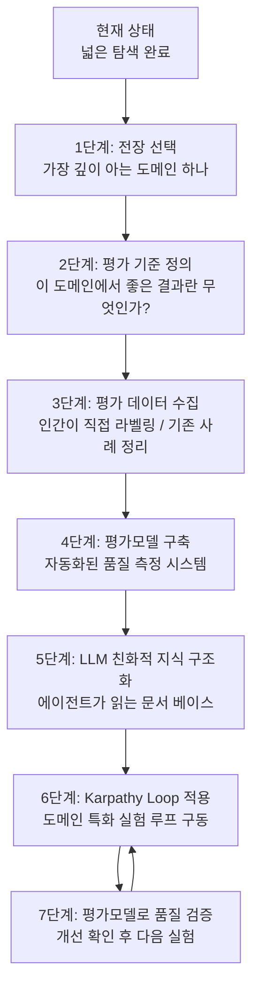

export CLAUDE_CODE_DISABLE_FEEDBACK_SURVEY=1

# 모든 비필수 트래픽 비활성화 (설문 포함)
export CLAUDE_CODE_DISABLE_NONESSENTIAL_TRAFFIC=1

# 설문 빈도 조절 (0~1 사이 확률, 예: 0.1이면 10% 확률)
# settings.json에서 feedbackSurveyRate 값 설정
~~~

### 2-3. 로컬에 저장되는 트랜스크립트

실제 세션 트랜스크립트는 클라우드가 아니라 **로컬 머신에만** 저장된다.

- 저장 위치: `~/.claude/projects/` 디렉토리
- 형식: `.jsonl` (JSON Lines)
- 보존 기간: 기본 30일 (설정으로 변경 가능: `cleanupPeriodDays`)
- 내용: 전체 대화 기록, 도구 사용 내역, 메타데이터

```
~/.claude/
├── projects/
│   └── {project-path}/
│       ├── {session-id}.jsonl   ← 전체 세션 기록
│       └── sessions-index.json  ← 세션 메타데이터 인덱스
└── history.jsonl                ← 전체 프롬프트 이력
```

---

## 3. Threads 포스트 핵심 사유 해설

포스트 전체를 구조적으로 분해하면 다음 5개의 핵심 주장으로 정리된다.



---

### 3-1. "노트는 LLM이 읽는다" — 지식 구조의 패러다임 전환

포스트의 첫 번째 핵심 통찰은 다음이다:

> "그 노트를 내가 보는 게 아니다. LLM이 읽는다."

이것은 개인 지식 관리(PKM, Personal Knowledge Management)의 목적론 자체를 뒤집는 주장이다. 옵시디언(Obsidian), 로암(Roam), 노션 등의 PKM 도구는 기본적으로 **인간의 기억 보조**를 위해 설계되었다. 백링크, 그래프 뷰, 태그 체계 등이 모두 인간의 연상 기억을 모방하기 위한 것이다.

그런데 AI 에이전트 시대에는 이 전제가 무너진다. 지식 구조의 1차 독자가 인간이 아니라 LLM이 된다면, 최적화의 기준이 달라진다.

| 구분 | 인간 독자 최적화 | LLM 독자 최적화 |
|---|---|---|
| 형식 | 시각적 가독성, 아이콘, 칼라 | 명확한 마크다운 헤더, 구조화된 계층 |
| 중복 | 최소화 | 문맥 자립성을 위해 허용 |
| 연결 | 인간 연상 중심의 백링크 | 의미론적 임베딩이 잡을 수 있는 연결 |
| 길이 | 스캔 가능한 짧은 청크 | 충분한 맥락을 담은 단위 |
| 색인 | 인간이 기억하는 태그 | LLM 검색에 걸리는 키워드 밀도 |

포스트 작성자의 다음 발언이 이것을 잘 요약한다: "향후엔 넌 어디부터 어디까지, 중요도가 이거이거부터 봐라고 지시할 수 있다." 이것은 지식 베이스가 에이전트의 **작업 컨텍스트 공급원**이 된다는 의미다. SKILL.md, Memory Bank, MemPalace 등의 개념이 모두 이 방향을 향한다.

---

### 3-2. LLM Wiki — 벡터화든 1M 컨텍스트든, 핵심은 평가

포스트가 언급하는 'LLM Wiki'는 자신의 도메인 지식을 LLM이 활용하기 좋은 형태로 구조화한 문서 베이스다. 이를 어떻게 LLM에게 제공하느냐 — 벡터 DB로 RAG를 하든, 1M 토큰 컨텍스트에 날것으로 넣든, 옵시디언 백링크 구조를 활용하든 — 는 사실 **이차적 문제**라는 것이다.

진짜 핵심은 이렇다:

> "오직 그로 인해서 특정 작업의 결과 품질이 올랐는지 평가하는 모델이 있어야 한다."

이것이 포스트 전체에서 가장 중요한 주장이다. 어떤 방법을 쓰든 **품질이 올랐는지 측정할 수 없다면** 아무 의미가 없다는 것이다. 이는 실험 과학의 기본 원리와 같다. 대조군 없이 가설을 검증할 수 없고, 평가 기준 없이 개선을 확인할 수 없다.

---

## 4. Karpathy Autoresearch — 맥락과 의미

포스트가 언급한 "카파시의 오토리서치"는 2026년 3월 7일 공개되어 즉각 21,000개 이상의 GitHub 스타를 받은 프로젝트다.

### 4-1. Autoresearch가 무엇인가

핵심 아이디어는 단순하다. AI 에이전트에게 LLM 학습 코드와 고정된 컴퓨팅 예산(GPU 5분)을 주고, 자율적으로 실험을 반복하며 더 나은 모델을 찾게 한다.



Karpathy가 2일간 돌렸을 때 결과:
- **700회** 실험 실행
- **20개**의 개선 사항 발견 (RMSNorm 재발견, tied embeddings 등)
- 대형 모델에 적용 시 학습 속도 **11% 향상**
- 인간 연구자들이 8년에 걸쳐 발견한 ML 마일스톤을 에이전트가 17시간 만에 독립적으로 재발견

### 4-2. 3개 파일의 역할 분리

| 파일 | 역할 | 수정 주체 |
|---|---|---|
| `program.md` | 연구 방향, 제약, 종료 조건 기술 | **인간** |
| `train.py` | 실제 학습 코드 (~630줄) | **AI 에이전트** |
| `prepare.py` | 데이터 전처리 및 평가 지표 정의 | 고정 (수정 불가) |

핵심 설계 원칙: **하나의 파일, 하나의 지표, 하나의 반복 루프**. 복잡성은 인프라가 아니라 `program.md`라는 마크다운 프롬프트에 집중된다.

### 4-3. "Karpathy Loop"의 보편성

Autoresearch의 구조는 ML 실험에만 국한되지 않는다. '카파시 루프'라고도 불리는 이 패턴의 세 가지 필요 조건은:

1. **에이전트가 수정 가능한 단일 파일** (또는 코드베이스)
2. **객관적으로 측정 가능한 단일 지표** (평가 함수)
3. **각 실험의 고정된 시간 제한**

이 조건만 충족되면 어떤 도메인에도 적용 가능하다. 마케팅, 법률 문서, 영업 스크립트, 의료 프로토콜... 이 패턴이 강력한 이유가 바로 포스트 작성자가 "평가모델"의 중요성을 강조하는 이유와 정확히 일치한다.

### 4-4. Agentic Engineering의 진화 단계

Karpathy 자신이 제시한 단계별 진화:

```
바이브 코딩      →    에이전틱 엔지니어링    →    완전 자율 연구
(인간이 프롬프트,        (인간이 에이전트를         (인간이 방향만 제시,
AI가 코드 작성,          실시간 오케스트레이션)      에이전트가 자율 실행)
인간이 검토)
```

2026년 2월, Karpathy는 "agentic engineering"이라는 용어를 직접 정의했다: "당신은 99%의 시간 동안 코드를 직접 작성하지 않는다. 에이전트를 오케스트레이션하며 감독한다."

---

## 5. 평가모델(Evaluation Model)이란 무엇인가

포스트에서 가장 강조되는 개념이자, 현재 한계로 지목되는 것이 **평가모델의 부재**다. 이 개념을 깊이 이해하는 것이 포스트 전체를 이해하는 열쇠다.

### 5-1. 정의

평가모델(Evaluation Model 또는 Judge Model)이란, **어떤 AI 시스템의 출력 품질을 자동으로 채점하는 별도의 시스템**이다. 인간 평가자를 대신하거나 보조하여, 대규모로 반복되는 AI 출력의 품질을 측정한다.

### 5-2. 왜 없으면 안 되는가

포스트 작성자의 논리를 수식으로 표현하면:

```
개선 = f(현재 시스템) - f(이전 시스템)
```

이때 `f`가 바로 평가모델이다. `f`가 없으면 개선이 일어났는지 알 수 없다. 어떤 RAG 구조가 더 낫고, 어떤 프롬프트가 더 나은 결과를 내고, 어떤 하네스 설계가 더 효과적인지 — 이 모든 판단이 불가능해진다.

### 5-3. 평가모델의 종류

| 종류 | 설명 | 예시 |
|---|---|---|
| **규칙 기반** | 명확한 기준으로 자동 채점 | 코드 테스트 통과/실패, val_bpb |
| **LLM Judge** | 다른 LLM이 출력을 평가 | GPT-4가 Claude 출력을 채점 |
| **인간 평가** | 전문가가 직접 라벨링 | RLHF의 인간 선호도 평가 |
| **도메인 특화** | 특정 분야 기준으로 평가 | 법률 정확성, 의료 안전성 |
| **A/B 비교** | 두 버전을 비교하여 우열 판정 | 어느 버전이 더 나은가? |

### 5-4. ChatGPT와 평가의 역사

포스트가 언급한 "초기에 챗지피티가 얼마나 많이 평가를 했던가"는 **RLHF(Reinforcement Learning from Human Feedback)** 를 가리킨다. OpenAI는 ChatGPT 개발 초기에 방대한 양의 인간 평가 데이터를 수집했다. 사람들이 두 가지 응답을 보고 어느 것이 더 나은지 선택하는 과정을 수만 번 반복하여 선호도 모델(Reward Model)을 구축했다. 이 선호도 모델이 바로 평가모델의 초기 형태다.

### 5-5. 평가모델 부재의 구체적 문제



---

## 6. LLM이 읽는 구조 vs 인간이 읽는 구조

포스트의 중요한 통찰 중 하나는 지식 문서의 **독자 전환**이다. 이 차이를 실용적으로 이해해야 한다.

### 6-1. 인간 독자를 위한 옵시디언 vs LLM 독자를 위한 구조

옵시디언 노트의 전통적인 장점들이 LLM 독자 앞에서는 오히려 약점이 될 수 있다.

**예: 인간용 백링크**
```
[[프로젝트-X]] → [[기술스택]] → [[레디스]]
```
인간은 이 그래프를 시각적으로 탐색한다. 하지만 LLM 에이전트는 이 링크 구조를 탐색하려면 별도의 파싱 로직이 필요하다.

**예: LLM 친화적 구조**
```markdown
# 프로젝트-X 기술 스택

## 캐싱 레이어
Redis를 사용한다. 선택 이유: 세션 데이터의 TTL 관리와 
pub/sub 패턴이 필요했기 때문이다. 대안으로 Memcached를 
검토했으나 클러스터 복잡성 때문에 제외했다.
```

이 형태가 LLM에게 더 유익하다. 왜냐하면:
1. 맥락이 자립적(self-contained)이다
2. 결정 근거(rationale)가 포함되어 있다
3. 대안과 비교가 명시되어 있다

### 6-2. Memory Architecture의 계층



---

## 7. 하네스 엔지니어링의 수명과 전략적 의미

포스트에서 "하네스도 곧 한물간다"는 발언은 다소 도발적이지만, 구조적으로 타당한 주장이다.

### 7-1. 하네스(Harness)란 무엇인가

AI 하네스(Harness)는 LLM을 특정 워크플로우에 맞게 래핑(wrapping)하는 구조 전체를 가리킨다. 프롬프트 템플릿, 툴 정의, 에이전트 오케스트레이션 로직, 컨텍스트 관리, 출력 파싱 등이 모두 포함된다.

### 7-2. 왜 한물간다는 것인가

모델 능력이 빠르게 향상되면서, 예전에는 복잡한 하네스 없이는 불가능했던 작업들이 점점 "그냥 좋은 프롬프트" 하나로 해결된다. 포스트가 말한 "'하네스 엔지니어링 관점에서 해줘' 하면 곧 잘해내고 더 잘해낼 거다"라는 말의 의미가 바로 이것이다.



단, 이것은 **범용적 하네스**의 가치 하락이다. 특정 도메인의 **고도로 전문화된 하네스**는 여전히 가치를 유지한다. 왜냐하면 그 도메인의 암묵지(tacit knowledge)가 하네스 설계 자체에 녹아들어 있기 때문이다.

### 7-3. 무엇이 살아남는가

포스트의 핵심 논지: **AI 엔지니어링 레벨의 해자**만 살아남는다.

| 사라지는 것 | 남는 것 |
|---|---|
| 범용 하네스 구축 능력 | 도메인 특화 평가모델 설계 능력 |
| 프롬프트 엔지니어링 스킬 | 핵심 워크플로우 분해 능력 |
| 일반적인 에이전트 오케스트레이션 | 도메인 암묵지에서 나오는 판단력 |
| 기술 스택 지식 | 어떤 실험이 의미 있는지 아는 능력 |

---

## 8. 도메인 암묵지와 AI 엔지니어링 해자

포스트에서 가장 울림이 큰 부분 중 하나가 프로바둑 기사 이야기다.

> "10살 프로바둑 천재 기사가 한 말이 '아직 자기는 AI를 활용할 수준이 못 된다'라고 유퀴즈에서 말하는 걸 보고 깜놀했다."

이것이 역설적으로 위대한 이유는, 가장 깊은 도메인 전문성을 가진 사람이 AI를 활용하기 가장 **쉬울** 것 같지만, 실제로는 그 깊이가 아직 AI 도구와 연결되지 않아서 **어렵다**는 자각이 있기 때문이다. 이 자각이 있다는 것 자체가 그가 "정말 크게 될 놈"인 이유다.

### 8-1. 암묵지(Tacit Knowledge)의 정의

암묵지는 명시적으로 말하기 어렵지만 실제 의사결정에 작동하는 지식이다. 바둑 기사가 착점을 결정할 때, 변호사가 전략을 짤 때, 의사가 진단할 때 작동하는 직관과 경험의 총체다.

**AI 시대에 암묵지가 가치 있는 이유:**

모델이 아무리 똑똑해져도, 특정 도메인에서 **무엇이 좋은 결과인지** 판단하는 암묵적 기준은 도메인 전문가만이 제공할 수 있다. 이것이 바로 평가모델 구축의 핵심이다. 기사가 어떤 착점이 좋은 착점인지 판단하는 능력 — 그것이 바둑 AI 평가모델의 토대가 된다.

### 8-2. 깊이 있는 전문성 + 질문 능력의 시너지

포스트의 표현: "하나의 분야를 깊게 팠고, 전문성을 이끌어내는 질문을 잘하는 사람이 절대적으로 유리하다."

이것을 수식화하면:

```
AI 활용 성과 = 도메인 깊이 × 질문 품질 × 평가 능력
```

세 가지 모두 곱셈 관계다. 하나가 0이면 전체가 0이다. 도메인이 깊어도 질문을 못하면 소용없고, 질문을 잘해도 결과를 평가 못하면 개선이 없다.

---

## 9. Claude Code 소스코드 유출 논쟁과 본질

포스트의 말미에 등장하는 언급: "유출된 소스코드가 구리다고 하는데, 클로드는 클로드 두뇌 자체인 LLM 파운데이션이 뛰어나고..."

### 9-1. 소스코드 유출 사건 배경

2026년 초, Claude Code의 일부 소스코드가 유출되었다. 일부 개발자들이 이 코드의 품질에 대해 비판적인 의견을 냈다. 하지만 포스트 작성자의 반응은 이 논쟁의 본질을 꿰뚫는다.

### 9-2. 포스트 작성자의 통찰

> "클로드코드라는 코딩 에이전트의 소스코드가 구리든 말든 고객이 느끼는 가치가 압도적이면 된 것 아니겠습니까"

이것은 제품 철학의 핵심을 짚는 발언이다. 소프트웨어 품질은 두 가지 의미가 있다:

1. **내부 품질**: 코드 가독성, 아키텍처 우아함, 테스트 커버리지
2. **외부 품질**: 사용자가 경험하는 결과의 탁월함

클로드 코드의 진짜 경쟁력은 내부 코드가 아니라 **기반 모델(foundation model)의 지능**에 있다. 아무리 코드가 우아해도 모델이 나쁘면 에이전트는 나쁘고, 코드가 지저분해도 모델이 훌륭하면 에이전트는 훌륭하다.

---

## 10. 전략적 전장 축소의 논리

포스트의 마지막 자기 반성이 가장 전략적이다:

> "셀프반성. 너무 넓은 영역을 건들고 있는 게 아닌가 싶다."

열거된 작업 목록: 하네스, 워크플로우, 맥미니 폴더 셋팅, LLM과 로컬 문서 사이 맥락 손실, 개발 레포와 마케팅 레포 사이 맥락 손실, 사업 하네스 세팅...

이것은 **폭 넓은 AI 리터러시 확보**의 단계다. 초기에는 이것이 맞다. 전체 지형을 파악해야 어디에 집중할지 알 수 있다. 하지만 폭 넓게 가져간 이후에는 **전장을 좁혀야** 한다.

### 10-1. 전장 축소의 프레임



### 10-2. 평가모델 구축의 로드맵

포스트 작성자의 댓글에서 드러나는 구체적 전략:

> "개발 하네스 평가모델엔 관심이 많이 줄었습니다... 차라리 내 잘 아는 다른 도메인 하네스를 만들고 평가모델을 만드는 게 더 맞다."

이것은 매우 정밀한 전략적 판단이다. 개발 영역은:
1. 모델들이 빠르게 잘해낼 것
2. 경쟁자가 너무 많음 (GitHub Copilot, Cursor, Devin 등)
3. 범용 평가가 어느 정도 존재함 (SWE-bench 등)

반면 자신이 깊이 아는 다른 도메인은:
1. 모델들이 아직 미숙함
2. 경쟁자가 적음
3. 평가 기준이 없어서 구축 시 선점 효과가 큼

---

## 11. 종합 — AI 엔지니어링 시대의 생존 지도

### 11-1. 포스트 전체의 메시지 요약

이 Threads 포스트는 단순한 기술 감상문이 아니다. AI 트랜지션 시대를 살아가는 한 아키텍트가 자신의 전략을 재정비하는 **공개 사유**다. 핵심 결론은 세 가지다:

**첫째, 지식 구조를 LLM 독자 기준으로 재설계하라.**  
옵시디언에 쌓인 노트가 있다면, 그것을 내가 보는 것이 아니라 에이전트가 활용하는 컨텍스트 공급원으로 전환하라.

**둘째, 평가모델 없이는 아무것도 개선할 수 없다.**  
어떤 방법을 쓰든 결과 품질을 측정하는 시스템을 먼저 구축하라. 그것 없이는 방향성 있는 개선이 불가능하다.

**셋째, 전장을 좁히고 도메인 암묵지 위에 AI 엔지니어링 역량을 쌓아라.**  
넓이는 탐색 단계에서 필요하다. 이제는 특정 도메인을 깊게 파고, 그 도메인에서 남들이 쉽게 복제할 수 없는 AI 엔지니어링 역량을 구축해야 할 때다.

### 11-2. 행동 프레임워크



### 11-3. 마지막으로 — 데이터 공유에 대한 태도

포스트 작성자의 마지막 발언: "앤트로픽을 좋아하니 주고 싶지만, 챗지피티에겐 더이상 주고 싶지 않은 마음이랄까."

이것은 사용자가 AI 회사에 대해 갖는 신뢰와 가치 일치(value alignment)의 문제다. 데이터는 이제 단순한 개인정보가 아니라, AI 시대의 **전략적 자산**이다. 누구에게 어떤 데이터를 제공하는가는 그 회사의 미래 제품 방향에 투표하는 것과 같다.

---

## 참고 자료

- [Claude Code Data Usage 공식 문서](https://code.claude.com/docs/en/data-usage)
- [Karpathy Autoresearch GitHub](https://github.com/karpathy/autoresearch)
- [Karpathy Autoresearch — Fortune 분석 (2026.03)](https://fortune.com/2026/03/17/andrej-karpathy-loop-autonomous-ai-agents-future/)
- [DataCamp Autoresearch 가이드](https://www.datacamp.com/tutorial/guide-to-autoresearch)
- [VentureBeat Autoresearch 심층 분석](https://venturebeat.com/technology/andrej-karpathys-new-open-source-autoresearch-lets-you-run-hundreds-of-ai)
- [ccusage — Claude Code 사용량 분석 CLI](https://github.com/ryoppippi/ccusage)
- [Claude Code Insights 명령어 작동 원리](https://www.zolkos.com/2026/02/04/deep-dive-how-claude-codes-insights-command-works.html)

---

*이 문서는 Claude Code CLI 스크린샷과 @baekho.chris의 Threads 포스트를 기반으로 최신 공개 자료를 종합하여 작성되었습니다. 2026년 4월 기준.*
