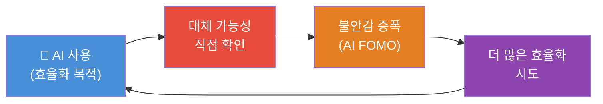
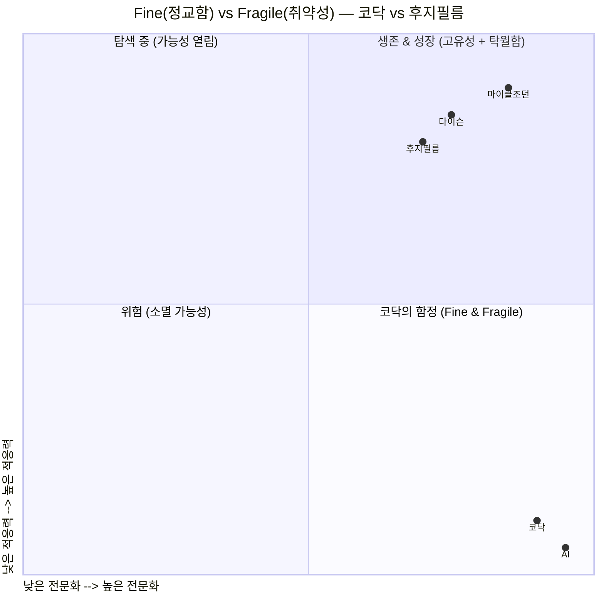
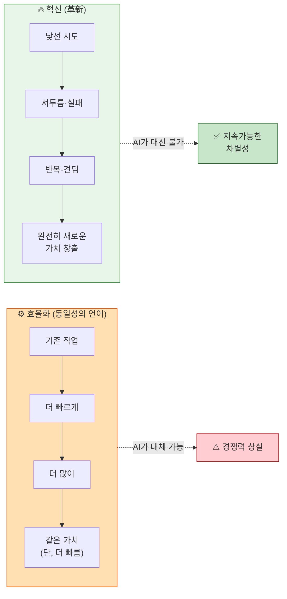
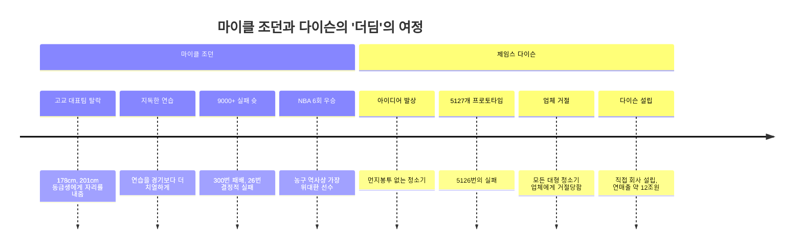
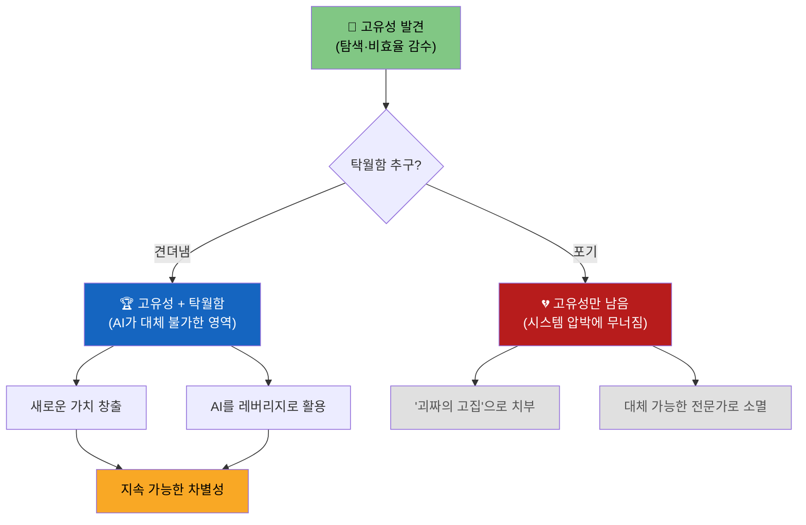
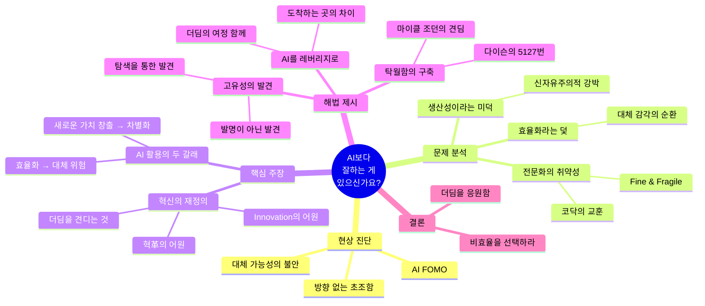

> **원문 출처**: 브런치스토리 [@wjdekdpf77 · 정다엘 이상](https://brunch.co.kr/@wjdekdpf77/26)  
> **발행일**: 2026년 4월 9일  
> **부제**: AI시대, 비효율과 더딤을 견딘다는 것  
> **분석 작성**: 2026년 4월 12일

---

## 📌 개요 — 이 글이 던지는 질문

이 브런치 글은 AI 시대를 살아가는 현대인에게 불편하지만 핵심적인 질문을 던진다. "당신은 AI보다 잘하는 게 있습니까?" 단순히 AI 도구 활용법을 소개하는 글이 아니라, **우리가 AI를 어떻게 사용하고 있는지, 그리고 어떻게 사용해야 하는지**에 대한 철학적·실존적 성찰을 담고 있다.

글은 총 8개의 핵심 주제를 유기적으로 연결하며, 'AI FOMO(놓침에 대한 두려움)'라는 현상 진단에서 출발해, '효율의 덫', '전문화의 취약성', '혁신의 어원', '고유성과 탁월함'이라는 개념을 거쳐 "더딤을 견디는 것만이 인간의 고유한 영역"이라는 결론에 도달한다.

---

## 🖼️ 자료 해설 — 첨부 이미지 분석

### 이미지 1: ARK Invest — 연간 텍스트 생산량 그래프 (1500~2030)

글의 첫 번째 근거 자료로 제시된 이 차트는 **ARK Invest**가 발표한 데이터로, 1500년부터 2030년까지 인류가 생산한 텍스트량(검정 선)과 AI가 생성한 텍스트량(보라색 선)을 **로그 스케일(log scale)** 로 비교한 그래프다.

주목할 지점은 다음과 같다.

먼저 **인간이 생산한 텍스트량의 성장 추이**를 보면, 1500년부터 1800년대까지는 완만한 성장세를 보이다가, 인쇄 혁명과 산업화를 거치면서 점진적으로 가속화된다. 20세기 들어서는 미디어와 인터넷의 확산으로 성장이 두드러지며, 2000년대 초반까지 수천 조 단어 수준에 도달했다.

그런데 **AI가 생성한 텍스트량을 나타내는 보라색 선**은 2022~2025년 구간에서 수직에 가까운 폭등을 보여준다. 로그 스케일임에도 불구하고 수직으로 치솟는 형태는, 실제 선형 수치로 환산하면 인간의 수백 배에서 수천 배에 달하는 양이 극히 짧은 시간 안에 생성되고 있음을 의미한다.

이 데이터가 함의하는 바는 매우 충격적이다. 인류가 수백 년에 걸쳐 쌓아온 텍스트 생산량을 AI가 불과 수년 만에 추월했다는 것이다. 글의 저자가 "2025년을 기준으로 AI가 생성한 텍스트 양이 인류가 생산한 텍스트 양을 넘어섰다"고 언급한 배경이 바로 이 데이터다.

이 그래프는 단순한 기술 통계를 넘어, **텍스트 생산이라는 인간 고유의 행위가 더 이상 인간만의 영역이 아님**을 시각적으로 증명한다. 글쓰기, 보고서 작성, 번역, 요약 등 수많은 지식 노동의 산출물이 이미 AI에 의해 대체되고 있다는 현실의 시각화인 것이다.

---

### 이미지 2: Reddit 밈 — AI FOMO의 해학적 표현

두 번째 이미지는 Reddit의 **r/ChatGPT** 커뮤니티에서 퍼진 밈이다. 남자 화장실의 소변기 배열을 활용한 이 밈은 세 개의 장면으로 구성된다.

첫 번째 장면에서는 한 사람이 소변기 한 칸을 사용하고 있고, 다른 한 사람이 멀리서 그쪽으로 걸어오고 있다. 두 번째 장면에서는 두 사람이 가장 왼쪽 소변기에 나란히 서 있고, 나머지 수십 개의 소변기는 텅 비어 있다. 세 번째 장면에서는 이 두 사람이 이제 수백 개의 소변기 앞에 세 명으로 서 있는데, 그 수가 더욱 많아지고 공간은 더 넓어져 있다. 이 장면들 사이에 텍스트 말풍선이 등장한다. 내용은 이렇다: "ChatGPT는 빙산의 일각에 불과합니다. 이번 주에만 37개의 새로운 미친 AI 도구들이 출시됐습니다… 뒤처지고 싶지 않다면 꼭 알아야 할 것들이 있습니다."

이 밈이 풍자하는 것은 **AI 도구 홍보 콘텐츠의 전형적인 패턴**이다. 매주 수십 개씩 쏟아지는 AI 도구 소개 영상, 스레드, 뉴스레터들이 독자들에게 "이것을 모르면 당신은 뒤처진다"는 공포감을 주입하며, 그 공포감 자체가 곧 콘텐츠 소비의 동기가 된다는 구조를 보여준다. 소변기 공간이 점점 넓어지고 인원이 늘어날수록, '뒤처질 것 같다'는 불안은 커지지만 실제로 아무도 자기 자리에서 멀리 이동하지는 않는다는 아이러니를 시각화한다.

이 이미지는 글에서 'AI FOMO'를 설명하는 맥락에서 삽입됐으며, **불안이 실제 행동의 변화로 이어지지 않는 채 증폭되는 메커니즘**을 유머러스하게 표현한다.

---

## 📖 본문 상세 해설

### 1부. AI FOMO — 불안의 정체

글은 현상 진단으로 시작한다. AI를 많이 쓰는 사람일수록 역설적으로 더 큰 불안을 느낀다는 것이다. 새로운 모델이 출시됐다는 소식에 뒤처지는 기분이 들고, 다른 사람들은 이미 자동화를 완료했다는 말에 초조해진다. 써도 불안하고, 안 써도 불안한 상태. 저자는 이를 "도구를 손에 쥔 채로 느끼는 특유의 초조함"이라고 표현한다.

이 불안의 핵심에는 **대체 가능성에 대한 직관적 감각**이 있다. 내가 하던 일이 너무나도 쉽고 빠르게 대체된다는 것을 피부로 느끼는 데서 불안이 출발한다. 나보다 역량이 뛰어난 사람은 이 도구를 더 잘 쓸 것이라는 비교 불안도 동반된다. 불안은 커지는데 방향은 보이지 않는 상태가 지속되는 것이다.

저자는 이 지점에서 중요한 전환을 제안한다. 그 불안에서 시선을 잠시 돌려, AI를 '어떻게' 활용하고 있는지를 생각해볼 필요가 있다고 말한다. 불안은 필연적으로 사람을 근시안적으로 만들기 때문에, 불안 자체에 매몰되면 더 넓은 그림을 보지 못한다는 것이다.

---

### 2부. 효율이라는 덫 — AI 사용의 지배적 패턴

현재 대부분의 AI 사용은 **효율성 향상**에 집중되어 있다. 검색 대행, 피드 자동화, 사업 프로세스 자동화, 코드 작성 보조. ARK Invest의 그래프에서 폭발적으로 증가하는 AI 생성 텍스트의 대부분도 바로 이 효율화 목적의 작업에서 발생한다.

그런데 저자는 여기에 역설이 있다고 지적한다. '효율성 향상'이란 결국 내가 하던 일을 더 빠르고 저렴하게 대체하는 것이다. 즉 **내가 AI를 쓸수록, 내가 대체 가능하다는 사실을 직접 확인하게 되는 셈**이다. 이것이 AI FOMO의 주된 구조적 원인이다.

이 구조는 악순환을 만든다. 대체될 수 있다는 감각이 불안을 낳고, 그 불안이 더 많은 효율성 추구를 촉진하고, 그 효율성 추구가 다시 대체 가능성을 확인시켜주는 순환이 반복된다. 저자는 이것을 '덫'이라고 표현하며, 효율성이 과연 AI를 사용하는 최선의 방식인지를 묻는다.

---

### 3부. 생산성이라는 미덕 — 신자유주의 시대의 언어

저자는 생산성과 효율이 **'동일성의 언어'** 라고 규정한다. 생산성과 효율이 높이 평가받는 맥락은 항상 동일한 작업을 반복할 때라는 의미다. 같은 일을 더 빠르고, 더 많이 할수록 생산성이 높다. 이것이 신자유주의 시대의 핵심 미덕이 되었다.

이 미덕은 일상 언어에도 깊이 침투해 있다. '갓생'이라는 유행어는 "생산적으로 살아야 한다"는 강박을 담고 있고, "생산적인 하루를 보냈다"는 말이 칭찬이 되며, "아무것도 안 한 하루"는 '낭비'라는 죄책감을 동반한다. 심지어 휴식조차 생산성 프레임 안에 가두어, '번아웃 예방을 위한 투자로서의 휴식'처럼 정당화해야 하는 세태가 되었다.

비생산적인 것, 비효율적인 것은 현대 사회에서 죄악시된다. 이 맥락에서 저자는 이후 논의의 핵심 역설을 예고한다. 바로 **비효율이야말로 새로운 가치가 탄생하는 토양**이라는 명제다.

---

### 4부. 새로운 것은 느릴 수밖에 없다 — 성장의 역설

새로운 것을 시도할 때는 필연적으로 비효율이 발생한다. 익숙하지 않은 일을 할 때 우리는 당혹감을 느끼고, 같은 결과를 내더라도 훨씬 오랜 시간이 걸리며, 생산성은 바닥을 친다. 이것은 회피해야 할 문제가 아니라 새로운 가능성이 열리는 바로 그 지점이다.

저자는 흥미로운 관점의 충돌을 제시한다. '최악의 직원은 자기가 못하는 일이 있을 때 도움을 요청하지 않는 직원'이라는 기업의 논리는 옳다. 조직 전체의 효율성과 생산성이 떨어지기 때문이다. 그런데 **개인의 입장에서는 바로 그 서투름과 씨름하는 순간에 성장이 일어난다**. 시스템의 이익과 개인의 이익이 정면으로 충돌하는 지점이다.

더 큰 문제는 익숙하지 않은 것은 개인에게도 감정적으로 하기 싫다는 것이다. 사회는 자유라는 이름으로 개인에게 선택권을 부여하고 책임을 이양했기 때문에, 개인은 더 이상 하기 싫은 것을 억지로 할 이유가 없다. 그 결과 개인은 자신이 잘하는 것, 익숙한 것에만 머무르게 되면서 **직업적으로나 지적으로나 '전문화'되어 왔다**.

---

### 5부. 정교함이 무너지는 순간 — Fine & Fragile의 역설

전문화된 개인은 자신의 영역에서 매우 정교(fine)해졌지만, 동시에 매우 취약(fragile)해졌다. 저자는 이를 설명하기 위해 **코닥(Kodak)** 의 사례를 든다.

코닥은 20세기 내내 필름 카메라 시장을 지배했고, 1995년에는 기업 가치 기준 세계 4위에 올랐다. 필름이라는 단 하나의 영역에서 극도로 정교해진 회사였다. 그런데 아이러니하게도, **세계 최초의 디지털 카메라를 발명한 것이 바로 코닥**이었다. 1975년 코닥의 엔지니어 스티브 새슨이 최초의 디지털 카메라를 개발했을 때, 경영진의 반응은 "훌륭하긴 한데, 아무에게도 알리지 말라"는 것이었다. 필름에서 오는 막대한 이익이 너무 컸기 때문이다. 결국 디지털 카메라 시대가 열리자 코닥은 2012년 파산보호를 신청했다.

대조적으로 후지필름은 같은 위기에서 화장품, 의료장비 등 전혀 다른 분야로 사업을 확장하며 살아남았다. 비록 낯설고 투박하더라도 새로운 영역에 발을 들인 쪽이 살아남은 것이다.

이 교훈은 기업만의 이야기가 아니다. 알고리즘이 바뀌면 무너지는 콘텐츠 크리에이터, 기술 스택이 교체되면 갑자기 무력해지는 개발자, 시장이 변하면 존재 이유를 잃는 전문가들 모두 같은 구조를 공유한다. **Fine해진 만큼 Fragile해진다.** 그리고 그 '전문화' — 특정 영역 안에서 정교하게 작동하는 것 — 이야말로 AI가 가장 잘하는 일이다.

저자는 이 맥락에서 핵심 질문을 던진다. "최근 여러 면접에서 '본인이 AI보다 잘하는 것이 무엇이냐'는 질문이 있었다고 합니다." 앞으로 우리는 모든 전문 분야에서 이 도전을 받게 될 것이다.

---

### 6부. 혁신의 어원 — 동일성의 언어를 넘어서

저자는 '혁신(革新)'이라는 한자어의 어원을 파고든다. '혁(革)'은 단순히 '가죽'을 뜻하는 것이 아니다. 한자에는 가죽을 뜻하는 두 글자가 있다. '피(皮)'는 짐승에게서 갓 벗겨낸 날것 그대로의 가죽이고, '혁(革)'은 그 생가죽의 털과 기름기를 긁어내고 수없이 두드리는 무두질(tanning) 과정을 거쳐 전혀 다른 질감과 쓰임새로 만들어낸 가죽이다. 혁신이란 그래서 **더디고 고통스러운 과정을 견뎌내어 본질을 완전히 새롭게 바꾸는 것**을 의미한다.

영어의 'Innovation' 역시 마찬가지다. 라틴어 'Innovare'에서 유래했으며, '안으로(In)'와 '새로운(Nova)'의 결합이다. 밖으로 드러나는 껍데기가 아니라 **내부의 근본부터 새롭게 한다**는 뜻이다.

결국 혁신이란 기존에 하던 일을 더 빠르고 효율적으로 처리하는 '동일성의 언어'가 아니다. 익숙함과 결별하고, 당장의 비효율과 더딤을 기꺼이 견뎌내며 완전히 새로운 가치를 창출해내는 과정이다.

---

### 7부. 고유성은 발견된다 — 탐색의 필요성

저자는 AI 시대에 필요한 것을 '고유성(uniqueness)'과 '탁월함(excellence)'의 결합으로 제시한다. 고유성은 누구나 가지고 있지만, 대부분의 사람들은 그것이 무엇인지 모른다. 왜냐하면 고유성은 발명되는 것이 아니라 **발견되는 것**이기 때문이다.

발견은 탐색을 통해서만 가능하다. 탐색은 새로운 경험과 새로운 일을 함으로써 이루어진다. 그런데 전문화를 권장하는 사회 시스템 안에서 탐색은 어렵다. 이미 주어진 익숙한 일을 잘하는 것이 인정받고, 낯선 것을 시도하는 것은 비효율로 취급되기 때문이다.

저자는 여기서 어릴수록 다양한 경험과 독서가 중요하다는 점을 강조한다. 아직 전문화되지 않은 시기에 가능한 한 넓게 탐색해야, 나중에 자신의 고유성이 어디에 있는지 발견할 가능성이 생긴다.

---

### 8부. 고유성만으로는 부족하다 — 탁월함의 필요성

그러나 고유성만으로는 충분하지 않다. 탁월함이 뒷받침되어야 한다. 저자는 두 가지 상징적 인물의 이야기를 통해 이를 설명한다.

**마이클 조던(Michael Jordan)** 은 고등학교 시절 대표팀 선발에서 탈락했다. 178cm에 불과했던 그는 201cm 동급생에게 자리를 내줘야 했다. 하지만 그 이후 지독한 연습으로 전미 최고 수준의 유망주가 되었고, 프로 무대에서도 마찬가지였다. 그는 이렇게 회고한다. 9,000번 이상의 슛을 놓쳤고, 300번 가까이 패배했으며, 결정적인 순간의 슛을 26번이나 실패했다고. 동료 B.J. 암스트롱은 조던이 경기보다 연습에서 더 놀라운 모습을 보여준다고 증언했다. **경기를 실전처럼, 연습을 경기보다 더 치열하게** — 그 지독한 반복이 조던을 만들었다.

**제임스 다이슨(James Dyson)** 은 '먼지봉투 없는 청소기'라는 고유한 아이디어를 실현하기 위해 **5,127개의 프로토타입**을 직접 손으로 만들고 테스트했다. 5,126번의 실패다. 그 기간 동안 셋째 아이가 태어났고, 아내는 생활비를 위해 미용 수업을 열어야 했다. 완성된 제품을 들고 대형 청소기 업체들을 찾아갔지만 모두 거절당했다. 먼지봉투 판매로 이익을 보던 기존 업체들에게 '봉투 없는 청소기'는 자신들의 사업 모델을 위협하는 물건이었기 때문이다. 결국 다이슨은 직접 회사를 세웠고, 다이슨의 연매출은 약 12조 원에 달한다.

---

### 9부. 견딤이 만드는 탁월함 — AI가 대신할 수 없는 시간

조던이 고유하기만 했다면 대표팀 탈락 후 농구를 그만두었을 것이다. 다이슨이 고유하기만 했다면 열 번째 프로토타입 즈음에서 포기했을 것이다. **고유하면서 동시에 그 고통을 '견뎌서' 탁월해졌기 때문에** 성공할 수 있었다.

탁월함은 수많은 실패와 지루하고 고통스러운 반복 작업, 피 말리는 규율을 통과해낸 결과물이다. 고유성이 "나는 무엇이 다른가"에 대한 답이라면, 탁월함은 그 다름을 세상이 무시할 수 없는 수준으로 끌어올리는 과정이다.

'탁월함'을 갖추지 못한 '고유성'은 자본주의와 현실의 압박 속에서 가장 먼저 무너진다. 실력이 뒷받침되지 않은 개성은 타인에게 그저 '괴짜의 고집'이나 '어린아이의 칭얼거림'으로 치부될 뿐이다.

그리고 이 '더딤을 견디는 시간' — 새로운 것을 시도하면서 서투르고, 실패하고, 반복하는 느리고 고통스러운 시간 — 은 **AI가 결코 대신해줄 수 없다**. 이것이 가장 인간적인 행위다.

---

## 🗺️ 글의 전체 구조 — 논리의 흐름

---

## 💡 핵심 개념 정리

### AI FOMO (Fear Of Missing Out)
AI 도구와 기술의 빠른 발전 속에서 '뒤처지고 있다'는 공포감. AI를 많이 사용하는 사람일수록 역설적으로 더 강하게 경험하는 경향이 있다. 새로운 모델 출시, 자동화 사례 공유 등이 이 FOMO를 지속적으로 자극한다.

### 동일성의 언어 vs. 차이의 언어
생산성과 효율은 동일한 일을 반복할 때 가치를 발휘하는 '동일성의 언어'다. 반면 혁신과 새로운 가치 창출은 낯선 것을 시도하고 실패를 감수하는 '차이의 언어'에서 발생한다.

### Fine & Fragile의 역설
한 영역에서 극도로 정교(fine)해질수록, 그 영역 바깥에서는 극도로 취약(fragile)해진다. 코닥이 필름에서 Fine해진 만큼 디지털 전환에서 Fragile했던 것처럼, 과도한 전문화는 변화에 대한 취약성을 높인다.

### 고유성 (Uniqueness)
각 개인이 가진 고유한 관점, 경험, 관심의 조합. 고유성은 타고나는 것이 아니라 다양한 경험과 탐색을 통해 발견된다. 이것이 AI가 제공할 수 없는 인간만의 기반이다.

### 탁월함 (Excellence)
고유성을 세상이 무시할 수 없는 수준으로 끌어올리는 과정. 지루하고 고통스러운 반복, 실패의 축적, 그리고 그것을 견뎌내는 규율을 통해 만들어진다.

### 더딤 (Slowness as Virtue)
새로운 것을 시도할 때 필연적으로 발생하는 비효율과 느림. 현대 사회에서는 죄악시되지만, 저자는 이것이야말로 새로운 가치가 탄생하는 조건이라고 역설한다. AI는 이 '더딤'을 대신해줄 수 없다.

---

## ⚖️ 비판적 독해 — 생각해볼 점

이 글이 제기하는 논의는 설득력이 있지만, 몇 가지 추가로 생각해볼 지점도 있다.

**첫째**, '비효율을 견디는 것'이 가능한 사람과 그렇지 못한 사람 사이의 구조적 차이를 충분히 다루지 않는다. 생계를 위해 당장의 효율성을 유지해야 하는 사람에게 '더딤을 선택하라'는 조언은 특권적일 수 있다.

**둘째**, AI가 '비효율적이고 비생산적인 활동을 할 수 없다'는 전제가 점점 흔들리고 있다. AI 스스로 탐색하고 실험하는 자율적 에이전트 시스템의 발전은 '더딤'마저 AI의 영역으로 진입시킬 가능성을 열고 있다.

**셋째**, 고유성과 탁월함의 결합이 반드시 경제적 보상으로 연결되지 않는 경우도 많다. 다이슨이나 조던의 사례는 결과적으로 성공했기 때문에 회자되지만, 견뎌냈음에도 인정받지 못한 수많은 사례들은 언급되지 않는 생존자 편향(survivorship bias) 문제가 있다.

그럼에도 불구하고, **AI 시대에 인간의 역할이 무엇인지를 '효율'과 '혁신'의 대비 속에서 명쾌하게 정리했다는 점**, 그리고 **실천적 방향으로 '고유성 발견'과 '탁월함 구축'을 제시했다는 점**은 이 글의 명백한 강점이다.

---

## 📝 저자 소개

**정다엘 이상** — 브런치스토리 작가로, AI 시대의 인간적 의미와 개인의 성장을 탐구하는 글을 쓴다. 이전 글 "세상이 바뀌었다는데, 어떻게 살아야 할까?"에 이어, 본 글은 AI와 인간의 관계를 실존적 차원에서 성찰하는 시리즈의 일부로 볼 수 있다.

---

## 🔖 마무리 — 글이 남기는 질문

> "그럼 이제, 당신은 어떤 비효율을 선택할 것인가요?"

이 글의 마지막 문장은 선언이 아니라 질문이다. 효율성의 논리가 지배하는 시대에 **의도적으로 비효율을 선택하는 것** — 낯선 것을 시도하고, 실패를 견디고, 반복하는 그 '더딤'의 시간을 감수하는 것 — 이 역설적으로 AI 시대에 살아남는 인간의 전략이라는 메시지를 남긴다.

AI는 주어진 프레임 안에서 정교하게 작동한다. 그 프레임을 깨고 새로운 가능성의 공간을 여는 것은, 여전히 인간의 몫이다.

---

*본 문서는 브런치스토리 원문(https://brunch.co.kr/@wjdekdpf77/26)과 첨부 이미지 자료를 바탕으로 상세 분석·해설한 것입니다.*
