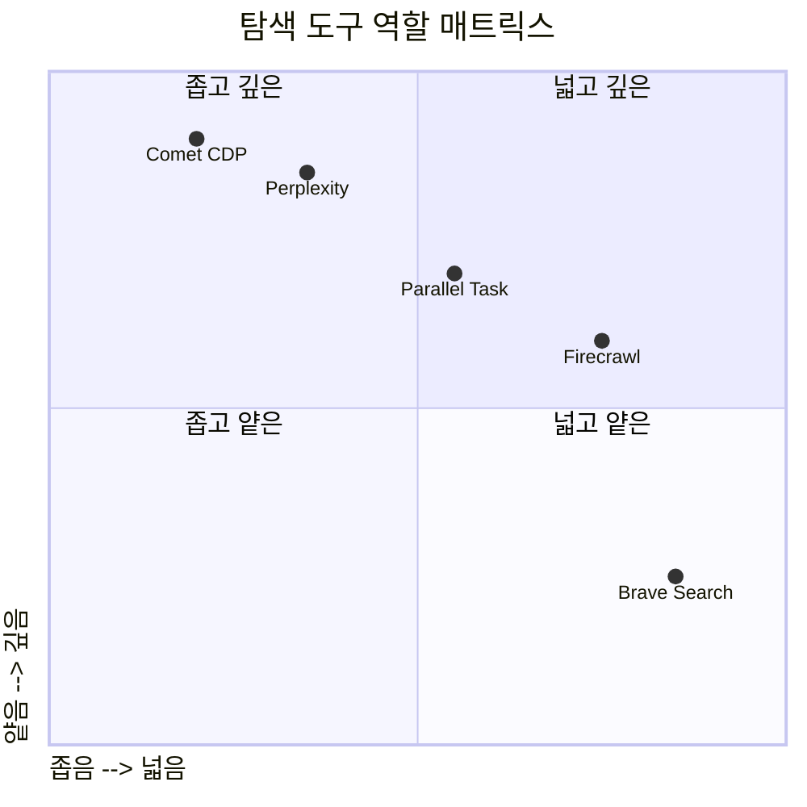
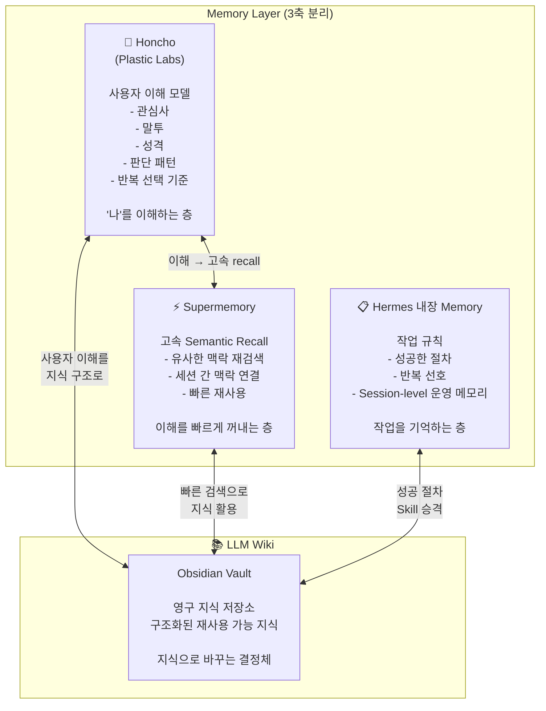
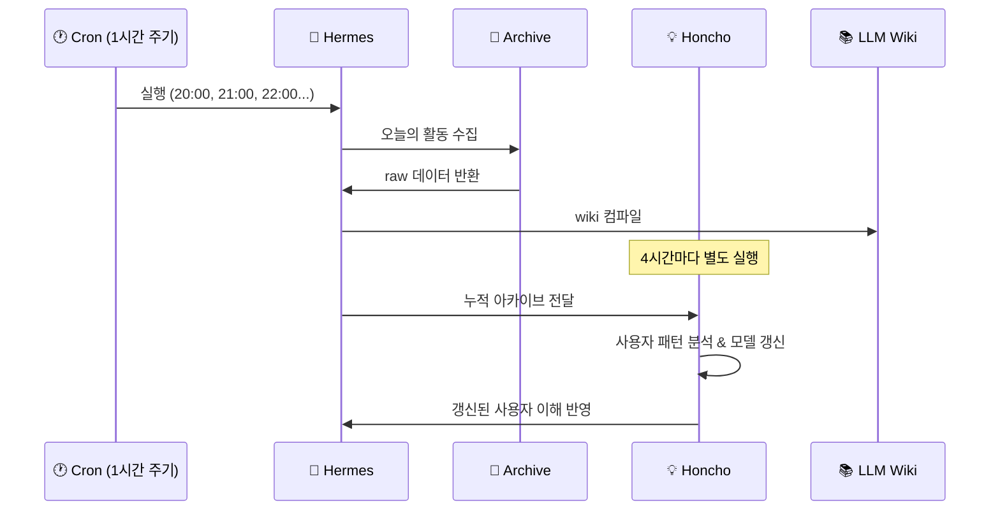
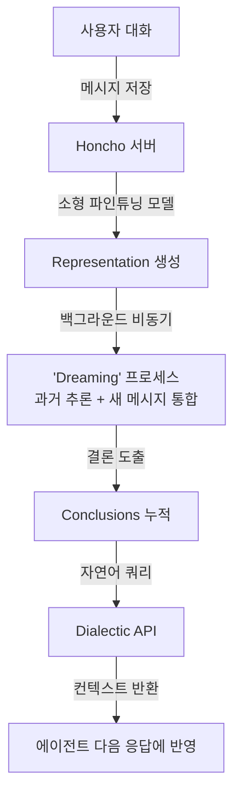

> **dayum_gud ([@dayum_gud]( https://www.threads.com/@dayum_gud/post/DW_Bdpxj2On)) Threads 포스팅 + 세팅 프롬프트 심층 해설**  
> 작성 기준: 2026년 4월 12일 | 최신 정보 기반

---

## 목차

1. [전체 개요: 무엇을 만들었는가](#1-전체-개요)
2. [핵심 철학: 저장이 아닌 운영](#2-핵심-철학)
3. [시스템 구성도 (Mermaid)](#3-시스템-구성도)
4. [Hermes Agent 심층 분석](#4-hermes-agent)
5. [도구별 역할과 설계 원칙](#5-도구별-역할)
6. [LLM Wiki 지식 구조](#6-llm-wiki-구조)
7. [Memory 레이어 삼각형](#7-memory-레이어)
8. [Cron 자동화 파이프라인](#8-cron-파이프라인)
9. [세팅 순서 (단계별 가이드)](#9-세팅-순서)
10. [Honcho 심층 분석](#10-honcho)
11. [Supermemory 심층 분석](#11-supermemory)
12. [Honcho + Superexample 19,664 Conclusions의 의미](#12-19664-conclusions의-의미)
13. [운영 원칙과 금지 사항](#13-운영-원칙)
14. [검증 체크리스트](#14-검증-체크리스트)
15. [이 시스템의 핵심 철학 요약](#15-핵심-철학-요약)

---

## 1. 전체 개요

dayum_gud는 Threads에 올린 10부작 스레드에서 자신이 구축한 **"사용자를 학습하는 AI 오케스트레이션 시스템"** 을 상세히 공개했다.

이 시스템의 출발점은 단순한 불편함이었다.

> *"기록은 많은데, 다시 못 꺼내 쓴다. 이건 정보 부족 문제가 아니다. 정보가 너무 많아서 생긴 문제다."*

즉, 기존의 노트 앱, 북마크, 스크랩 방식은 **저장은 되지만 재사용이 되지 않는다**는 근본적인 한계가 있다. dayum_gud가 선택한 해결책은 이 패러다임 자체를 바꾸는 것이었다.

> "저장"을 멈추고 **"운영"** 을 시작했다.

이를 위해 선택한 도구가 **Hermes Agent** (Nous Research)이며, 여기에 LLM Wiki, Honcho, Supermemory, Brave Search, Perplexity, Comet CDP, Parallel Search, Firecrawl 등을 연결한 **다층 지능 시스템**을 구성했다.

현재 시스템이 축적한 **19,664개의 Conclusions**는 이 시스템이 단순한 설정이 아닌, 실제로 작동하는 자기 학습 장치임을 보여주는 수치다.

---

## 2. 핵심 철학

이 시스템의 설계 원칙은 다음 세 가지 전환으로 요약된다.

| 기존 패러다임 | → | 새로운 패러다임 |
|---|---|---|
| 저장 (Storage) | → | 학습 (Learning) |
| 검색 (Search) | → | 재사용 (Reuse) |
| 기록 (Record) | → | 이해 (Understanding) |

### 왜 이 전환이 중요한가?

기존 PKM(Personal Knowledge Management) 도구들—Notion, Obsidian, Roam Research—은 모두 **사람이 정리해야 하는 구조**다. 사람이 직접 태그를 달고, 링크를 걸고, 요약을 써야 한다. 결과적으로:

- 정보는 쌓이지만 활용은 줄어든다
- 정리하는 시간이 사용하는 시간보다 많아진다
- 정보의 맥락이 시간이 지나면 사라진다

dayum_gud의 시스템은 이 모든 과정을 **Hermes Agent가 자동으로 처리**한다. 사람은 그냥 평소대로 웹을 브라우징하고, AI 도구를 사용하면 된다. Hermes가 그것을 모두 수집하고, 구조화하고, 기억한다.

---

## 3. 시스템 구성도

### 3-1. 전체 아키텍처

```mermaid
graph TB
    subgraph USER ["👤 사용자 활동"]
        A1[웹 브라우징]
        A2[SNS 활동]
        A3[Perplexity 스레드]
        A4[Claude 대화]
        A5[Gemini 대화]
        A6[ChatGPT 대화]
    end

    subgraph CAPTURE ["📡 수집 레이어"]
        B1[Comet CDP\n로그인 세션 캡처]
        B2[Brave Search\n넓은 탐색]
        B3[Parallel Search\n구조화 조사]
        B4[Firecrawl\n대량 크롤링]
        B5[Perplexity\n스레드 본문 보존]
    end

    subgraph HERMES ["🧠 Hermes Agent\nNous Research"]
        C1[Cron 스케줄러\n20:00~08:00, 1시간 주기]
        C2[Sub-agents\n독립 실행 단위]
        C3[Skills System\n절차 자동 생성/개선]
        C4[Terminal Backend\nVPS/Docker/SSH]
    end

    subgraph MEMORY ["💾 Memory 레이어 (3축)"]
        D1["Honcho\n사용자 이해 모델\n(Plastic Labs)"]
        D2["Supermemory\n고속 Semantic Recall"]
        D3["Hermes Memory\n작업 규칙 & 선호"]
    end

    subgraph WIKI ["📚 LLM Wiki\n(Obsidian Vault)"]
        E1[raw/\n원문 보존]
        E2[entities/\n사람·서비스·시스템]
        E3[concepts/\n원리·패턴·구조]
        E4[comparisons/\nA vs B]
        E5[queries/\n질문의 누적 답]
        E6[index.md\n지식 지형도]
        E7[log.md\n작업 흔적]
    end

    subgraph OUTPUT ["🚀 출력"]
        F1[GPT Pro Pulse\n매일 Article Curation]
        F2[Telegram/Discord\n결과 리포트]
        F3[재사용 가능한 Skills]
    end

    USER --> CAPTURE
    CAPTURE --> HERMES
    HERMES --> MEMORY
    HERMES --> WIKI
    MEMORY --> WIKI
    WIKI --> MEMORY
    HERMES --> OUTPUT
    MEMORY --> OUTPUT

    style HERMES fill:#1a1a2e,color:#e0e0ff,stroke:#6c63ff
    style MEMORY fill:#16213e,color:#e0e0ff,stroke:#0f3460
    style WIKI fill:#0f3460,color:#e0e0ff,stroke:#533483
    style USER fill:#2d2d2d,color:#e0e0ff,stroke:#888
    style CAPTURE fill:#1a2a1a,color:#e0e0ff,stroke:#4caf50
    style OUTPUT fill:#2a1a0a,color:#e0e0ff,stroke:#ff9800
```



### 3-2. Cron 타임라인

```mermaid
gantt
    title Hermes Cron 실행 윈도우 (매일)
    dateFormat HH:mm
    axisFormat %H:%M

    section 활성 윈도우
    Cron 실행 가능 구간 (저녁)  :active, 20:00, 4h
    Cron 실행 가능 구간 (새벽)  :active, 00:00, 8h

    section 비활성 구간
    낮 시간 (비실행)             :crit, 08:00, 12h
```



### 3-3. 학습 루프

```mermaid
flowchart LR
    A[사용자 활동] -->|자동 수집| B[raw 아카이브]
    B -->|Hermes 처리| C[LLM Wiki 구조화]
    C -->|패턴 추출| D[Honcho 사용자 모델 갱신]
    D -->|4시간 주기| E[에이전트 재학습]
    E -->|다음 작업에 반영| F[더 나은 수집·정리]
    F -->|누적| A
    C -->|고속 색인| G[Supermemory]
    G -->|recall| E

    style A fill:#2d4a2d
    style D fill:#1a1a3e
    style E fill:#3e1a1a
    style G fill:#1a3e3e
```



---

## 4. Hermes Agent

### 4-1. 무엇인가?

**Hermes Agent**는 Nous Research (허미스·Nomos·Psyche 모델 패밀리를 만든 AI 연구소)가 2026년 2월에 공개한 오픈소스 자율 에이전트다.

핵심 슬로건: **"The agent that grows with you"**

GitHub 스타 수가 4만 개를 넘어섰으며 (2026년 4월 기준), 개발자 커뮤니티에서 OpenClaw와 함께 가장 주목받는 자기 개선형 에이전트 프레임워크로 자리잡았다.

### 4-2. 다른 에이전트와의 차이점

대부분의 AI 도구는 **무상태(stateless)** 다. 대화창을 닫으면 모든 맥락이 사라진다. Hermes는 다르다:

- **Cross-session 영구 메모리**: FTS5 전문 검색 + LLM 요약을 통해 모든 세션의 내용을 기억한다
- **자기 개선 Skills**: 작업을 완료할 때마다 그 절차를 재사용 가능한 Skill 문서로 자동 생성하고, 다음번에 같은 유형의 작업이 오면 처음부터 풀지 않고 Skill을 로드한다
- **자연어 Cron**: "매일 저녁 9시에 이것을 해줘"라고 말하면 스케줄이 잡힌다
- **멀티플랫폼 게이트웨이**: Telegram, Discord, Slack, WhatsApp, Signal, 이메일, CLI를 단일 프로세스로 연결한다
- **6종 터미널 백엔드**: local, Docker, SSH, Daytona, Singularity, Modal을 지원해서 $5짜리 VPS부터 GPU 클러스터까지 어디서나 실행된다

### 4-3. 최신 릴리즈 (v0.8.0, 2026.4.8)

"The intelligence release"라고 불리는 이 릴리즈에서 주요 추가 사항:

- 백그라운드 작업 자동 알림
- 무료 MiMo v2 Pro (Nous Portal)
- 전 플랫폼에서 라이브 모델 전환
- MCP OAuth 2.1 지원
- Google AI Studio 네이티브 통합
- 209개의 PR 머지, 82개 이슈 해결

### 4-4. dayum_gud의 활용 방식

dayum_gud는 Hermes를 다음 방식으로 구성했다:

```
실행 환경: 클라우드 VPS (항상 켜진 상태)
접근 방식: Telegram으로 결과 수신
스케줄: 매일 20:00~익일 08:00, 1시간 주기 Cron
모델: GPT-5.4 high (추론 집약적 작업용)
메모리 백엔드: Honcho (사용자 이해) + 내장 메모리
```

결과: Hermes Explorer 화면에 **5 Peers, 39 Sessions, 19,664 Conclusions** 누적

---

## 5. 도구별 역할

dayum_gud의 시스템에서 모든 도구는 **명확한 역할 분리** 원칙에 따라 배치된다. "만능 도구는 없다. 있는 건 역할 분담뿐이다."

### 5-1. 탐색/수집 레이어

#### Brave Search — 넓은 지도 그리기
- **역할**: 탐색의 1차 입구. 어떤 이름을 찾아야 할지조차 모를 때 외곽선을 잡는 도구
- **특징**: 광고 없는 독립 검색엔진. 넓고 빠르지만 깊지 않다
- **비유**: "뭐가 있는지 일단 지도를 잡는다"
- **사용 시점**: 탐색 시작점, source discovery, 방향 설정

#### Perplexity — 질문의 맥락 보존
- **역할**: 검색이 아니라, 질문이 어떻게 질문이 되었는지를 보여주는 공간
- **핵심 주의사항**: 얇게 요약하지 않는다. **스레드 본문을 그대로 보존**한다
- **왜 중요한가?**: 처음 어떻게 정의했는지, 어디로 파고들었는지, 어디서 멈췄는지, 다음 질문이 무엇인지—이 흐름이 요약하면 죽는다
- **비유**: "LLM wiki는 이 맥락을 먹고 자란다"

#### Parallel Search / Task — 구조화된 다중 소사
- **역할**: Brave가 지도라면, Parallel은 "찾고-읽고-추출하고-합성"하는 작업장
- **기능**: 다중 쿼리 비교, URL 구조화 추출, LLM이 읽기 좋은 형태로 변환, 다단계 리서치 흐름
- **비유**: "찾았다"가 아니라 "읽을 수 있게 만들었다"

#### Comet CDP — 로그인된 현실을 보는 눈
- **역할**: API로 닿지 않는 영역—로그인 페이지, JS 렌더링, 세션 의존 데이터 캡처
- **핵심**: 실제로 로그인된 브라우저를 직접 조작해서 세션을 유지하고 동적 페이지를 읽는다
- **사용 사례**: Perplexity 히스토리, Claude 대화 기록, Gemini 스레드 등 인증이 필요한 데이터
- **비유**: "웹의 표면이 아닌, 운영 현장을 직접 보는 눈"

#### Firecrawl — 대량 크롤링 보조
- **역할**: 큰 사이트, 다수 URL, 복잡한 동적 페이지 수집
- **사용 시점**: Comet이나 Parallel로 처리하기 힘든 대규모 수집 작업

### 5-2. 도구 역할 비교표



---

## 6. LLM Wiki 구조

LLM Wiki는 이 시스템의 **최종 지식층**이다. 노트 폴더가 아니라, **재사용 가능한 사고 구조**다.

> "생각의 무덤이 아니라, 생각이 다시 자라나는 밭이다."

### 6-1. 디렉터리 구조

```
Obsidian Vault/
│
├── raw/                    # 원문 보존 (slug 기반 파일명)
│   ├── perplexity-thread-xxx.md
│   ├── claude-conv-xxx.md
│   └── web-page-xxx.md
│
├── entities/               # 사람, 서비스, 시스템, 제품, 프로젝트
│   ├── nous-research.md
│   ├── honcho.md
│   └── dayum-gud.md
│
├── concepts/               # 원리, 패턴, 정책, 구조
│   ├── agentic-memory.md
│   ├── skill-promotion.md
│   └── cron-backfill.md
│
├── comparisons/            # A vs B 비교
│   ├── brave-vs-parallel.md
│   └── honcho-vs-supermemory.md
│
├── queries/                # 질문에 대한 누적 답
│   ├── how-to-setup-hermes.md
│   └── what-is-llm-wiki.md
│
├── index.md               # 현재 지식 지형도 (항상 갱신)
└── log.md                 # 작업 흔적 (항상 갱신)
```

### 6-2. 설계 원칙

**날짜 기반 파일명 금지**: `2026-04-12-hermes.md` ❌ → `hermes-agent-setup.md` ✅

날짜는 파일 구조가 아니라 메타데이터(frontmatter)로만 처리한다. 날짜 기반 구조는 검색과 재사용을 어렵게 만들기 때문이다.

**raw layer 먼저**: 원문을 가장 먼저 살린다. 요약이나 편집은 그 다음이다. 원문이 없으면 맥락이 사라진다.

**wiki compile**: raw 작성 후 반드시 wiki 컴파일을 수행해서 entities/concepts/comparisons/queries로 구조화한다.

**index.md + log.md 갱신**: 모든 작업 후 반드시 두 파일을 동시에 갱신한다. index.md는 지금 어떤 지식이 있는지의 지도이고, log.md는 무슨 작업을 했는지의 흔적이다.

---

## 7. Memory 레이어

이 시스템의 메모리는 **세 층으로 분리**되어 있다. 이 셋을 섞지 않고 역할을 분리하는 것이 핵심이다.



### 역할 분리 표

| 레이어 | 저장 대상 | 목적 | 도구 |
|---|---|---|---|
| **Honcho** | 사용자 관심사, 말투, 성격, 판단 패턴 | 사용자 이해의 깊이 | Plastic Labs Honcho |
| **Supermemory** | 세션 간 맥락, 유사 주제 인덱스 | 빠른 recall | Supermemory API |
| **Hermes Memory** | 작업 규칙, 선호, 성공한 절차 | 운영 지속성 | 내장 FTS5 + LLM 요약 |
| **LLM Wiki** | 구조화된 지식 (entities/concepts/...) | 재사용 가능한 지식 | Obsidian + filesystem MCP |

---

## 8. Cron 파이프라인

### 8-1. 스케줄 설계

```
# Hermes Cron 설정 (자연어로 설정 가능)
"매일 20:00부터 익일 08:00까지, 1시간마다 실행"

# 해당하는 crontab 표현식
0 20-23,0-7 * * *
```

**왜 이 시간대인가?** 사용자가 잠든 시간에 Hermes가 일한다. 낮 동안 쌓인 모든 활동을 밤 사이에 정리하고, 아침에 일어나면 깔끔하게 정리된 상태를 받는다.

### 8-2. 하루 처리 규칙

```
1. 처리할 recorded day 탐색
2. 빈 날(기록 없는 날) → 즉시 스킵
3. 기록 있는 날만 → 한 번에 한 날씩 처리
4. 처리 순서:
   a. Comet CDP로 브라우저 캡처
   b. Perplexity 스레드 full body 보존
   c. Claude/Gemini/ChatGPT 대화 수집
   d. raw 작성
   e. wiki 컴파일 (entities/concepts/comparisons/queries)
   f. index.md 갱신
   g. log.md 갱신
   h. 완료된 탭 닫기
5. 결과: 짧은 로그로 저장 + Telegram 알림
```

### 8-3. 4시간 주기 사용자 모델 갱신



---

## 9. 세팅 순서

### 1단계: Vault 구조 생성

```bash
# Obsidian Vault 초기 구조
mkdir -p ~/vault/{raw,entities,concepts,comparisons,queries}
touch ~/vault/index.md ~/vault/log.md
```

핵심 규칙:
- Vault path 하나로 고정 (single source of truth)
- 날짜 기반 파일명 사용 금지
- raw는 slug 기반 (`hermes-agent-intro.md`)

### 2단계: Memory 레이어 분리

```yaml
# ~/.hermes/config.yaml (예시)
memory:
  provider: honcho        # 사용자 이해 모델
  
honcho:
  observation: directional
  api_key: "YOUR_HONCHO_API_KEY"

supermemory:
  api_key: "YOUR_SUPERMEMORY_API_KEY"
  role: semantic_recall   # recall layer 전용
```

### 3단계: 탐색/브라우저 도구 연결

```
연결 우선순위:
1. Brave Search → 기본 검색 입구
2. Parallel Search → 구조화 조사
3. Comet CDP → 로그인 세션 캡처
4. Perplexity → full body 보존 대상
5. Firecrawl → 대량 수집 보조
```

### 4단계: Cron 설정

Hermes에서 자연어로:
```
"매일 밤 8시부터 다음날 아침 8시까지, 1시간마다 
오늘의 웹 브라우징, SNS, Perplexity, Claude, Gemini, ChatGPT 
스레드를 아카이빙하고 LLM wiki로 컴파일해줘"
```

### 5단계: GPT Pro Pulse 설정

ChatGPT Pro의 Pulse 기능으로 최근 관심사 기반 매일 article curation 자동 수신.

### 6단계: 학습 루프 검증

```
✓ Honcho에 Conclusions가 쌓이고 있는가?
✓ LLM Wiki에 새 항목이 자동 생성되는가?
✓ 성공한 작업이 Skills로 승격되는가?
✓ 다음 실행에서 이전 Skills를 재사용하는가?
```

---

## 10. Honcho 심층 분석

**Honcho**는 Plastic Labs이 개발한 AI 네이티브 메모리 라이브러리로, Hermes의 공식 메모리 백엔드 중 하나다.

### 10-1. 무엇이 다른가?

일반 메모리 시스템은 대화를 **키-값 저장소**처럼 다룬다. Honcho는 다르다. 대화가 끝난 후 **변증법적 추론(dialectic reasoning)** 을 통해 사용자에 대한 **결론(Conclusions)** 을 도출한다.

이 결론들이 축적되면서 에이전트는 사용자에 대한 **살아있는 모델**을 갖게 된다:

- 무엇에 끌리는가
- 어떤 주제를 반복하는가
- 어떤 말투를 쓰는가
- 어떤 기준으로 결정하는가
- 무엇을 싫어하는가

### 10-2. 기술 구조



### 10-3. 벤치마크 성과

Honcho는 최신 메모리 벤치마크에서 최고 수준의 성능을 기록했다:
- **LongMem S**: 90.4% (Gemini 3 Pro 사용 시 92.6%)
- **LoCoMo**: 89.9% (이전 기록 86.9% 갱신)
- **BEAM**: 전 항목 최고 점수

특이점: 토큰 효율성도 동시에 유지한다 ("필요한 10K 토큰만, 불필요한 100K는 안 쓴다").

### 10-4. dayum_gud 시스템에서의 역할

```
Honcho = 사용자를 이해하는 층

입력: Hermes가 수집한 모든 활동 (웹 브라우징, SNS, AI 대화)
처리: 대화 후 자동 추론 → Conclusions 생성
출력: "이 사용자는 어떤 사람인가"에 대한 살아있는 모델

현재 상태: 39 Sessions → 19,664 Conclusions 누적
```

---

## 11. Supermemory 심층 분석

**Supermemory**는 이 시스템의 **고속 Semantic Recall 엔진**이다.

### Honcho와의 역할 분리

| 특성 | Honcho | Supermemory |
|---|---|---|
| 목적 | 사용자 이해 (깊이) | 빠른 recall (속도) |
| 동작 방식 | 추론 후 결론 도출 | 벡터 임베딩 유사도 검색 |
| 응답 속도 | 깊은 분석 | 300ms 이하 |
| 주요 쿼리 | "이 사용자는 어떤 사람인가?" | "이것과 유사한 내용은?" |
| 역할 | 이해 레이어 | recall 레이어 |

Supermemory는 세션 간 맥락을 연결하고, 비슷한 주제를 빠르게 재탐색하며, Honcho가 쌓은 이해를 실시간으로 꺼내주는 역할을 한다.

---

## 12. 19,664 Conclusions의 의미


첫 번째 스크린샷은 Hermes Explorer 화면을 보여준다:

```
Workspaces > hermes

5 PEERS | 39 SESSIONS | [19,664] CONCLUSIONS
```

19,664라는 숫자는 단순한 저장 횟수가 아니다. Honcho가 39개의 세션에서 도출한 **사용자에 대한 결론의 수**다.

### 계산해보면:

```
39 Sessions → 19,664 Conclusions
세션당 평균 약 504개의 결론

이것은 세션마다 Honcho가 504가지의
"이 사용자에 대한 새로운 통찰"을 도출했다는 의미다
```

이 숫자가 커질수록 Hermes는 dayum_gud에 대해 더 정확하게 이해한다. 어떤 주제에 반복적으로 관심을 보이는지, 어떤 판단 기준으로 결정을 내리는지, 어떤 말투와 톤을 선호하는지.

---

## 13. 운영 원칙

### 절대 금지 사항

| ❌ 금지 | ✅ 대신 |
|---|---|
| 단순 저장 | 구조화된 학습 |
| 단순 요약 | 원문 수준 보존 |
| 단순 검색 | 재사용 가능한 구조 |
| Perplexity 얇게 줄이기 | 스레드 본문 그대로 |
| 날짜 기반 파일명 | slug 기반 파일명 |
| 여러 날 동시 처리 | 한 번에 한 날만 |
| 빈 날 처리 | 즉시 스킵 |
| 작업 완료 후 탭 유지 | 즉시 닫기 |

### 반드시 준수 사항

- 성공한 작업은 반드시 **Skill로 승격**
- 실패한 작업은 **원인과 대안까지 기록**
- `index.md`와 `log.md`는 **항상 갱신**
- raw → wiki **컴파일 순서 유지**
- Honcho = 이해 레이어, Supermemory = recall 레이어 **역할 분리 유지**

---

## 14. 검증 체크리스트

```markdown
## 구조 검증
- [ ] Vault path가 하나로 고정되어 있는가?
- [ ] raw / wiki / index / log 구조가 분리되어 있는가?
- [ ] 날짜 기반 파일명이 사용되지 않는가?

## 수집 검증
- [ ] Perplexity thread가 full body 수준으로 보존되는가?
- [ ] Comet CDP가 로그인 세션 캡처에 실제로 쓰이는가?
- [ ] Brave / Parallel / Firecrawl 역할이 분리되어 있는가?

## 메모리 검증
- [ ] Honcho가 사용자 이해를 축적하고 있는가?
- [ ] Supermemory가 빠른 recall로 붙어 있는가?
- [ ] 세 메모리 레이어가 역할 분리되어 있는가?

## 자동화 검증
- [ ] Cron이 20-23, 0-7 윈도우에서만 동작하는가?
- [ ] 빈 날을 즉시 스킵하는가?
- [ ] 한 번에 한 recorded day만 처리하는가?

## 학습 루프 검증
- [ ] 성공한 작업이 Skill로 승격되는가?
- [ ] 작업 완료 후 탭을 닫는가?
- [ ] log.md와 index.md가 항상 갱신되는가?
- [ ] Conclusions 수가 지속적으로 늘어나는가?
```

---

## 15. 핵심 철학 요약

이 시스템은 매우 단순한 하나의 질문에서 출발한다:

> **"왜 AI를 매일 써도, AI는 나를 모르는 것 같을까?"**

기존 AI 도구는 세션이 끝나면 초기화된다. 사용자는 매번 같은 맥락을 설명해야 한다. 그 답은 **영구 메모리**가 아니다. 영구 메모리도 쌓이기만 하면 노이즈가 된다.

진짜 답은 **이해의 누적**이다.

```
검색   → "어디에 뭐가 있는지 찾기 위한 것"
Memory → "잊지 않기 위한 것"
Wiki   → "다시 쓰기 위한 것"
Honcho → "사용자를 더 깊이 이해하기 위한 것"
Supermemory → "그 이해를 빠르게 불러오기 위한 것"
Hermes → "그것들을 실제 행동으로 이어 붙이는 오케스트레이터"
```

이 여섯 가지가 하나의 루프로 연결될 때, AI는 처음으로 진짜 의미에서 **"사용자와 함께 자라는 에이전트"** 가 된다.

dayum_gud의 시스템이 보여주는 것은 기술의 과시가 아니다. **"저장"에서 "운영"으로의 패러다임 전환**이다. 그리고 그 전환의 결과는 숫자로 나타난다: 19,664개의 결론, 하루하루 성장하는 에이전트.

---

## 참고 및 출처

| 항목 | 링크 |
|---|---|
| Hermes Agent (Nous Research) | https://hermes-agent.nousresearch.com |
| Hermes GitHub | https://github.com/NousResearch/hermes-agent |
| Honcho (Plastic Labs) | https://honcho.dev |
| Supermemory | https://supermemory.ai |
| dayum_gud Threads (원본 포스팅 1) | https://www.threads.com/@dayum_gud/post/DW_Bdpxj2On |
| dayum_gud Threads (원본 포스팅 2) | https://www.threads.com/@dayum_gud/post/DW_RX5lDwRM |

---

*이 문서는 dayum_gud(@dayum_gud)의 Threads 공개 포스팅과 세팅 프롬프트, Hermes Agent 최신 공식 문서를 기반으로 작성되었습니다.*  
*작성일: 2026년 4월 12일*
