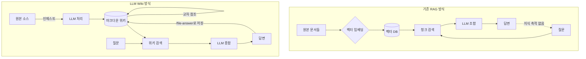
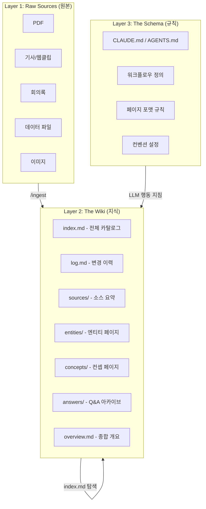
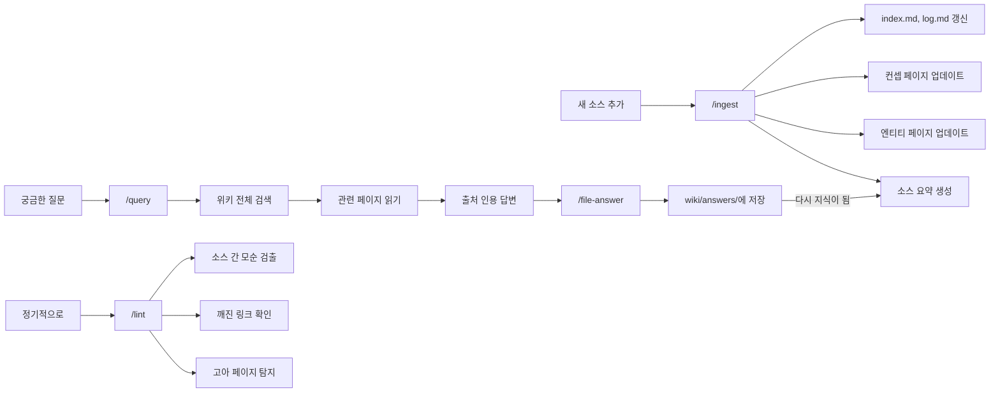
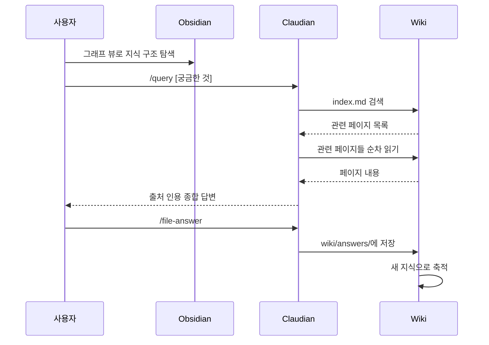
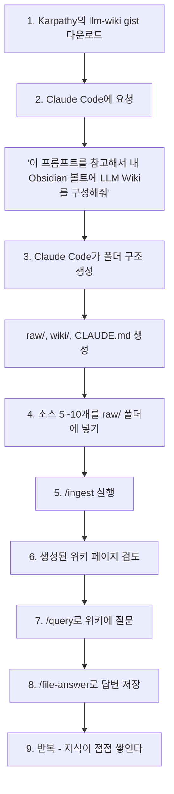

> Andrej Karpathy의 LLM Wiki 패턴 + Claude Code + Claudian 플러그인 완전 해설

**작성일:** 2026-04-12  
**출처:** [aboutcorelab.com](https://aboutcorelab.com/llm-wiki-in-obsidian-for-2nd-brain/) | [Karpathy GitHub Gist](https://gist.github.com/karpathy/442a6bf555914893e9891c11519de94f)

---

## 목차

1. [배경: 무엇이 문제인가](#1-배경)
2. [Karpathy의 LLM Wiki란 무엇인가](#2-llm-wiki)
3. [핵심 개념: RAG vs LLM Wiki](#3-rag-vs-llm-wiki)
4. [아키텍처: 3개의 레이어](#4-아키텍처)
5. [핵심 오퍼레이션 4가지](#5-오퍼레이션)
6. [실제 구현 후기: 153개 리포트 → 세컨드 브레인](#6-실제-구현-후기)
7. [Claudian 플러그인: 터미널 없이 위키 활용](#7-claudian-플러그인)
8. [지식 그래프 뷰 해설](#8-obsidian-그래프-뷰)
9. [웹사이트로 빌드하기](#9-웹사이트-빌드)
10. [한계와 과제](#10-한계와-과제)
11. [커뮤니티 반응과 오픈소스 확장 생태계](#11-커뮤니티-생태계)
12. [철학적 배경: Vannevar Bush의 Memex](#12-철학적-배경)
13. [시작하는 법: 실전 가이드](#13-시작하는-법)

---

## 1. 배경

### 잠자는 지식의 문제

많은 사람들이 Obsidian, Notion, Roam 등에 수백 개의 노트를 쌓아두지만, 실제로 그 지식을 유기적으로 활용하지는 못한다. 노트는 늘어나지만 연결되지 않고, 검색은 되지만 통합되지 않는다.

2026년 4월, Andrej Karpathy(전 OpenAI/Tesla 수석 AI 연구원, 현 Eureka Labs 창업자)가 GitHub Gist에 `llm-wiki.md`라는 아이디어 문서를 올렸다. 공개 1주일 만에 **별 5,000개, 포크 3,355개**를 기록하며 개인 지식 관리 커뮤니티에 큰 파장을 일으켰다. 이 문서는 단순한 기술 설명이 아니라, **지식 관리의 근본적인 패러다임 전환**을 제안한다.

어바웃코어랩(aboutcorelab)은 이 패턴을 Obsidian + Claude Code 환경에 직접 적용해본 실험 후기를 공유했다. 잠자던 153개 리포트가 진짜 세컨드 브레인으로 변환된 이 사례를 통해, LLM Wiki 패턴의 실제 작동 방식과 시사점을 상세하게 살펴본다.

---

## 2. LLM Wiki란 무엇인가

### Karpathy의 핵심 아이디어

Karpathy는 이렇게 설명한다:

> "지식 베이스 유지의 지루한 부분은 읽기나 사고가 아니라 정리 작업이다. LLM이 바로 그 정리 작업을 맡는 것이다."

LLM Wiki는 RAG(Retrieval-Augmented Generation)와 대비되는 새로운 지식 관리 패턴이다. 핵심은 하나다: **LLM이 질문에 답할 때마다 지식을 재발견하는 대신, 인제스트 시점에 한 번 지식을 정리해두고 계속 축적한다.**

Karpathy가 제시하는 비유는 강력하다. Obsidian은 IDE이고, LLM은 프로그래머이며, Wiki는 코드베이스다. 프로그래머(LLM)가 코드베이스(Wiki)를 지속적으로 개선하고, 사용자는 그 결과물을 IDE(Obsidian)에서 탐색한다.

### 적용 범위

Karpathy는 이 패턴이 적용될 수 있는 영역을 구체적으로 나열한다:

- **개인**: 목표, 건강, 심리, 자기계발 - 일기, 기사, 팟캐스트 노트를 넣어 자신에 대한 구조화된 그림을 만들기
- **리서치**: 특정 주제를 몇 주~몇 달에 걸쳐 깊이 파고들며 포괄적인 위키 구축
- **독서**: 각 챕터를 읽으면서 등장인물, 주제, 스토리라인 페이지를 구축
- **비즈니스/팀**: Slack 스레드, 회의록, 프로젝트 문서로 내부 위키 유지
- **경쟁 분석, 실사, 여행 계획, 취미 심화** 등

---

## 3. RAG vs LLM Wiki

기존 방식과의 차이를 명확히 이해하는 것이 중요하다.

| 구분 | RAG | LLM Wiki |
|------|-----|----------|
| **작동 시점** | 쿼리 타임 (매번) | 인제스트 타임 (한 번) |
| **지식 축적** | 없음 (매번 재발견) | 있음 (점진적 누적) |
| **교차 분석** | 매번 재조합 필요 | 이미 완성된 교차 참조 |
| **토큰 효율** | 매우 낮음 | 최대 95% 절감 가능 |
| **오류 지속성** | 일시적 (리셋됨) | 영구적 (관리 필요) |
| **인프라** | 임베딩 서버 필요 | 마크다운 파일만으로 충분 |
| **유지보수** | 자동 (인덱스 기반) | LLM이 담당 |

Karpathy는 이를 **"컴파일 타임 vs 쿼리 타임"** 이라는 프레임으로 설명한다. Atlan의 분석에 따르면, LLM Wiki는 소규모 지식 베이스에서 토큰 사용량을 **최대 95%까지** 절감할 수 있다. Karpathy 본인의 ML 연구 위키는 단 하나의 주제만으로 약 100개 문서, **40만 단어 분량**이 자동으로 만들어졌다. 박사 논문보다 긴 분량인데, Karpathy가 직접 쓴 문장은 하나도 없다.

---

## 4. 아키텍처: 3개의 레이어

LLM Wiki의 구조는 놀라울 정도로 단순하다. 세 개의 레이어가 전부다.

### Layer 1: Raw Sources (원본 저장소)

원본 문서들의 불변 저장소다. PDF, 기사, 회의록, 데이터 파일 등 모든 소스가 여기에 들어간다. **LLM은 이 레이어를 읽기만 할 뿐, 절대 수정하지 않는다.** 이것이 진실의 원천이다.

Obsidian Web Clipper를 사용하면 웹 기사를 마크다운으로 변환해서 raw 폴더에 바로 넣을 수 있다. 이미지도 로컬에 다운로드해두면 LLM이 직접 참조할 수 있다.

### Layer 2: The Wiki (지식 페이지)

LLM이 생성하고 유지하는 마크다운 파일들의 디렉토리다. 요약, 엔티티 페이지, 컨셉 페이지, 비교 분석, 개요, 종합 등이 여기에 쌓인다. **LLM이 이 레이어를 완전히 소유한다.** 사용자는 읽고, LLM은 쓴다.

두 개의 특별한 파일이 위키를 지탱한다:

- **index.md** (콘텐츠 지향): 위키의 모든 페이지를 카탈로그화한다. 각 페이지의 링크, 한 줄 요약, 날짜/소스 수 등 메타데이터를 포함하는 카탈로그. LLM이 질문에 답할 때 가장 먼저 읽는 파일이다. 임베딩 기반 RAG 없이도 ~100개 소스, ~수백 페이지 규모에서 놀랍도록 잘 작동한다.

- **log.md** (시간순 기록): 발생한 일을 시간순으로 기록하는 추가 전용 파일. 인제스트, 쿼리, 린트 기록이 모두 남는다. `## [2026-04-02] ingest | 기사 제목` 형식으로 시작하면 `grep`으로 파싱 가능하다.

### Layer 3: The Schema (규칙 정의)

LLM에게 위키의 구조, 컨벤션, 워크플로우를 알려주는 설정 문서다. Claude Code에서는 `CLAUDE.md`, Codex에서는 `AGENTS.md`가 이 역할을 한다. 이 파일이 LLM을 "일반 챗봇"이 아닌 "규율 있는 위키 관리자"로 만드는 핵심이다. 사용자와 LLM이 함께 시간이 지나면서 발전시켜 나간다.

---

## 5. 핵심 오퍼레이션 4가지

어바웃코어랩이 Claude Code로 설계한 핵심 커맨드 4개가 LLM Wiki의 전부다.

### /ingest – 소스를 지식으로 변환

`raw/` 폴더의 소스 문서를 분석하여 소스 요약 페이지를 생성하고, 관련 엔티티와 컨셉 페이지를 만들거나 업데이트한다. 인덱스, 개요, 로그까지 자동 갱신된다.

**하나의 소스를 넣으면 10~15개의 위키 페이지가 동시에 업데이트된다.** 소스 하나가 파문처럼 위키 전체에 영향을 미친다. 소스를 하나씩 천천히 인제스트하면서 요약을 확인하고, LLM에게 무엇을 강조할지 방향을 잡아주는 것이 권장 방식이다. 물론 많은 소스를 배치로 한번에 처리하는 것도 가능하다.

### /query – 위키 전체를 검색하고 종합

위키 전체를 검색하여 관련 페이지를 읽고, 출처를 인용한 종합 답변을 합성한다. 단순한 키워드 매칭이 아니다. 이미 정리된 지식 위에서 추론하기 때문에 맥락을 잘 잡는다. 신뢰도 평가(높음/중간/낮음)도 포함된다.

답변은 마크다운 페이지, 비교 표, Marp 슬라이드, matplotlib 차트, 캔버스 등 다양한 형식으로 출력 가능하다. 좋은 답변은 그 자체로 새로운 지식이 된다.

### /file-answer – 답변을 다시 지식으로

이 커맨드가 LLM Wiki의 가장 강력한 부분이다. `/query`의 결과를 `wiki/answers/`에 위키 페이지로 저장한다. **질문에 대한 답변이 다시 위키의 소스가 되는 구조다.**

이 피드백 루프가 세컨드 브레인을 단순 저장소가 아닌 성장하는 지식 체계로 만든다. 내가 한 탐색, 분석, 발견한 연결 – 이 모든 것이 사라지지 않고 위키에 누적된다.

### /lint – 위키 건강 검진

고아 페이지(인바운드 링크 없음), 깨진 링크, 프론트매터 오류, 소스 간 모순 등을 탐지하여 보고한다. 위키가 커질수록 이런 정비 작업이 중요해진다. LLM은 새로운 조사가 필요한 질문이나 찾아볼 소스도 제안한다.

---

## 6. 실제 구현 후기: 153개 리포트 → 세컨드 브레인

### 실험 조건

어바웃코어랩은 Obsidian에 잠자고 있던 **153개의 리서치/센싱 리포트**를 raw 폴더로 옮기고, `/ingest`를 전체적으로 돌렸다.

### 결과

| 지표 | 결과 |
|------|------|
| 유효 소스 처리 | 146개 (95.4%) |
| 자동 추출 엔티티 | 48개 (기업, 인물, 기술 등) |
| 자동 생성 컨셉 | 29개 (개념, 패턴, 프레임워크 등) |

153개 파일 중 146개가 유효 소스로 처리된 것은 높은 성공률이다. 그러나 숫자보다 중요한 것은 **이 페이지들이 서로 연결되어 있다는 점**이다. 엔티티 페이지에서 관련 컨셉으로, 컨셉 페이지에서 원본 소스로 자연스럽게 이동할 수 있다.

### 이전 방식과의 결정적 차이

이전에는 노트를 직접 태깅하고 링크를 걸어야 했다. LLM Wiki는 소스의 내용을 이해하고 자동으로 분류 체계를 만든다. **정리 작업의 부담이 거의 사라진다.**

48개의 엔티티와 29개의 컨셉을 수동으로 분류했다면 며칠은 걸렸을 작업이, 자동으로 완성되었다.

### 이미지 3: AI Wearable 컨셉 페이지 예시

세 번째 이미지는 실제로 생성된 위키 페이지의 예시다. `AI Wearable (AI 웨어러블)` 컨셉 페이지를 보면:

- **정의(Definition)**: AI 기능을 탑재한 착용형 기기로, 사용자 주변 환경과 대화를 상시 감지·기록하고 분석해 리마인더 생성, 할 일 목록 작성, 개인화된 응답 제공 등 기능 수행
- **핵심 포인트(Key Points)**: Amazon Bee 인수 기사부터 OpenAI, Meta, Apple 등 AI 웨어러블 시장 진출 정보까지 자동 정리
- **출처(Sources)**: 각 정보의 원본 소스 링크 자동 연결
- **관련 컨셉(Related Concepts)**: 온디바이스 AI, Bee, Amazon 등 연관 개념으로 자동 링크

이 모든 것이 LLM이 소스 문서를 읽고 자동으로 생성한 결과다.

---

## 7. Claudian 플러그인: 터미널 없이 위키 활용

### Claudian이란

[Claudian](https://github.com/YishenTu/claudian)은 Claude Code를 Obsidian 사이드바에 임베드해주는 플러그인이다. **터미널을 열지 않고도 Obsidian 안에서 바로 `/query`를 실행**할 수 있다.

### 이미지 2: Claudian 실제 사용 화면

두 번째 이미지는 Claudian이 실제로 동작하는 모습이다.

- 왼쪽 사이드바: `wiki` 스페이스 안에 `answers`, `concepts`, `entities`, `sources`, `overview`, `index`, `log` 등 위키 구조가 Obsidian 파일 트리로 보인다
- 오른쪽 Claudian 패널: `/query 에이전트 하네스에 대해 알려줘` 라는 명령에 Claudian이 응답하는 과정이 보인다
  - `index.md` 읽기
  - `에이전트|하네스|agent|harness` 그렙 검색
  - 관련 파일들(`harness-engineering.md`, `ai-agent-harness-design.md`, `agent-framework-harness-differentiation.md` 등) 순차적으로 읽기
  - 종합 답변: **에이전트 하네스(Agent Harness) 요약**을 정의, 핵심 개념 등으로 체계적으로 정리

### 핵심 워크플로우

탐색 → 질문 → 지식화가 하나의 도구 안에서 끊김 없이 이뤄진다.

### Claudian의 강점

볼트 내 파일에 **직접 접근**할 수 있다는 점이 핵심이다. 파일 읽기, 쓰기, 검색, bash 명령까지 전부 지원하기 때문에 LLM Wiki 커맨드가 그대로 동작한다. 별도 설정 없이 Claude Code CLI만 설치되어 있으면 바로 사용 가능하다.

---

## 8. Obsidian 그래프 뷰 해설

### 이미지 1: 지식 그래프 전체 뷰

첫 번째 이미지는 153개 소스를 인제스트한 후 Obsidian의 **그래프 뷰**로 본 결과다. 수백 개의 노드가 서로 연결된 복잡한 지식 네트워크가 형성되어 있다.

그래프에서 관찰되는 주요 특징:

**허브 노드(크기가 큰 원)** 들을 보면:
- `index` - 위키의 중심 카탈로그, 모든 페이지와 연결됨
- `log` - 변경 이력, 시간순 연결
- `agent` - AI 에이전트 관련 컨셉이 허브 역할
- `ai-coding` - AI 코딩 관련 노드가 중심부에 위치

**클러스터(군집)** 들이 형성되어 있다:
- 상단: Claude 관련 노드군 (claude-code, claude-in-excel, anthropic 등)
- 우측 상단: 에이전트 하네스 관련 노드군
- 하단: OpenAI/DeepSeek/오픈소스 관련 노드군
- 좌측: 물리 AI, 파운데이션 모델 관련 노드군

**주간 센싱 노드들** (sensing-20260229, sensing-20260303 등)이 시간순으로 연결되어 있어, 지식이 시계열적으로 쌓인 것을 볼 수 있다.

이 그래프 뷰는 **어떤 개념이 허브인지, 어떤 페이지가 고립되어 있는지, 지식의 클러스터가 어떻게 형성되는지**를 한눈에 파악하게 해준다.

---

## 9. 웹사이트로 빌드

구축한 LLM Wiki는 웹사이트로도 빌드할 수 있다. Obsidian에서 Claudian으로 운영하는 것도 편하지만, 가독성 면에서는 웹사이트가 더 낫다.

위키 특유의 **페이지 간 링크 구조**가 웹에서 훨씬 직관적으로 보인다.

- **Obsidian**: 편집과 운영에 강점
- **웹사이트**: 열람과 공유에 강점

두 가지를 병행하는 것이 현재로서는 가장 효과적인 조합이다.

---

## 10. 한계와 과제

어바웃코어랩이 솔직하게 공유한 개선 포인트 3가지.

### 과제 1: 할루시네이션 관리

LLM이 위키 페이지를 작성하면서 소스에 없는 내용을 추가하는 경우가 간혹 발생한다. `/lint`가 소스 간 모순은 잡아주지만, 소스에서 벗어난 내용까지 완벽하게 걸러내지는 못한다.

**가장 치명적인 문제**: RAG의 일시적 할루시네이션과 달리, 위키에 한번 잘못 기록된 내용은 이후 생성에도 영향을 미칠 수 있다. "일시적 오류"가 아닌 "**영속적 오류**"가 되는 것이다.

Karpathy GitHub Gist 댓글에서도 이를 지적한 사람이 있다:

> "일시적 할루시네이션 대신 **영속적 오류**를 선택하는 것이다. 위키에 두 개념이 한번 잘못 연결되면, 그 실수는 사라지지 않는다 — 미래 세대가 그 위에서 계속 쌓아간다."

커뮤니티 해결책으로는 **claude-obsidian** 플러그인의 `[!contradiction]` 콜아웃 자동 생성 기능, 2-hop 출처 추적(클레임 → 소스 페이지 → 원본 텍스트) 등이 제안되고 있다.

### 과제 2: 분류 체계의 확장

현재 엔티티와 컨셉이라는 두 축으로 분류하고 있는데, 48개 엔티티가 더 늘어나면 세밀한 그룹핑이 필요해진다. 더 위키스러운 카테고리 체계 설계가 필요하다.

### 과제 3: 인사이트 자동 추출

지금은 지식을 구조화하고 질문에 답하는 데까지 왔다. 다음 단계는 연결된 지식들을 기반으로 **새로운 인사이트를 자동으로 뽑아내는 것**이다.

예시: 서로 다른 엔티티에서 발견되는 공통 패턴이나, 컨셉 간의 숨겨진 관계를 자동으로 찾아내는 기능.

---

## 11. 커뮤니티 생태계

Karpathy의 Gist는 1주일 만에 방대한 오픈소스 생태계를 만들어냈다. 주요 확장들:

### 도구 및 프로젝트

| 프로젝트 | 설명 | 링크 |
|---------|------|------|
| **llmwiki-cli** | 파일시스템 + git만으로 위키 관리하는 CLI | npm install -g llmwiki-cli |
| **claude-obsidian** | Claude Code 플러그인 (3-레이어 구조 구현, 358개 별) | GitHub |
| **SwarmVault** | 50+ 파일 포맷 지원, YouTube 자동 인제스트 | npx @swarmvaultai/cli |
| **agent-wiki** | Python 툴킷 (링크 추적, PDF 변환, 린팅) | pip install agent-wiki |
| **knowledge-pipline** | 지식 그래프 + BFS 추론 체인 시각화 | Claude Code 스킬 |
| **LLMWikiController** | Karpathy 원본 아이디어 기반 확장 구현 | GitHub |
| **axiom-wiki** | 오픈소스 올인원 CLI 구현 | GitHub |

### 주목할 확장: claude-obsidian

`claude-obsidian`은 Karpathy의 3-레이어 구조를 직접 구현한 Claude Code 플러그인으로, 몇 가지 혁신적인 기능을 추가했다:

- **Hot cache** (`wiki/hot.md`): 세션 간 지속되는 ~500단어 컨텍스트. 세션마다 "어디까지 했죠?" 반복을 제거. 컨텍스트 윈도우의 0.25% 미만 비용으로 매 세션 2 ~ 3천 토큰 절약
- **모순 플래그**: 새 소스가 기존 위키와 충돌하면 `[!contradiction]` 콜아웃 자동 생성 (조용히 덮어쓰지 않음)
- **8-범주 린트**: 고아 페이지, 죽은 링크, 모순, 누락 페이지, 링크되지 않은 언급, 불완전한 메타데이터, 빈 섹션, 오래된 인덱스
- **자율 리서치 루프** (`/autoresearch`): 3라운드 웹 검색으로 지식 공백을 발견하고 채운 뒤, 출처 추적 포함 교차 참조 위키 페이지로 저장

---

## 12. 철학적 배경: Vannevar Bush의 Memex

Karpathy는 LLM Wiki의 아이디어가 **Vannevar Bush의 Memex(1945)** 와 정신적으로 연결된다고 설명한다.

Memex는 개인 지식 저장소로, 문서들 사이에 연상적 경로(associative trails)를 만드는 비전이었다. Bush의 비전은 현재의 웹보다 이것에 훨씬 가까웠다: 사적이고, 능동적으로 큐레이션하며, 문서 간의 연결이 문서 자체만큼 소중한 구조.

Bush가 해결하지 못한 문제가 하나 있었다: **누가 유지보수를 하는가?**

LLM이 바로 그 답이다.

---

## 13. 시작하는 법: 실전 가이드

### 준비물

- Obsidian 설치
- Claude Code CLI 설치 (`npm install -g @anthropic-ai/claude-code`)
- (선택) Claudian 플러그인 설치

### 단계별 가이드

### 핵심 팁

**처음에는 작게 시작하라.** 관심 있는 주제 하나를 골라서 소스 5~10개로 시작하는 것을 권장한다. 처음부터 모든 노트를 넣을 필요가 없다.

**유용한 도구들:**
- **Obsidian Web Clipper**: 웹 기사를 마크다운으로 변환해 raw 폴더에 직접 저장
- **Obsidian Graph View**: 지식 연결 구조를 시각적으로 파악
- **Marp**: 마크다운 기반 슬라이드 생성 (Obsidian 플러그인 있음)
- **Dataview**: 페이지 프론트매터로 동적 테이블/리스트 생성

**위키는 git repo다.** 마크다운 파일의 집합이기 때문에 버전 히스토리, 브랜칭, 협업이 자동으로 된다.

### 당장 해볼 수 있는 한 가지

Karpathy의 [llm-wiki gist](https://gist.github.com/karpathy/442a6bf555914893e9891c11519de94f)를 열고, Claude Code에 이렇게 말해보자:

> "이 프롬프트를 참고해서 내 Obsidian 볼트에 LLM Wiki를 구성해줘"

나머지는 AI가 알아서 한다.

---

## 참고 자료

| 자료 | 링크 |
|------|------|
| Karpathy의 llm-wiki GitHub Gist | https://gist.github.com/karpathy/442a6bf555914893e9891c11519de94f |
| LLM Wiki vs RAG Knowledge Base – Atlan | https://atlan.com/know/llm-wiki-vs-rag-knowledge-base/ |
| What Is Andrej Karpathy's LLM Wiki? – MindStudio | https://www.mindstudio.ai/blog/andrej-karpathy-llm-wiki-knowledge-base-claude-code |
| Karpathy shares LLM Knowledge Base – VentureBeat | https://venturebeat.com/data/karpathy-shares-llm-knowledge-base-architecture |
| Claudian – Obsidian Plugin for Claude Code | https://github.com/YishenTu/claudian |
| aboutcorelab 원문 | https://aboutcorelab.com/llm-wiki-in-obsidian-for-2nd-brain/ |
| claude-obsidian 플러그인 | https://github.com/AgriciDaniel/claude-obsidian |
| SwarmVault | https://github.com/swarmclawai/swarmvault |

---

*이 문서는 2026년 4월 12일 기준으로 작성되었습니다.*
