## AI 서비스 PM이라면 반드시 고민해야 하는 '품질'의 기준 — 심층 분석

> **출처**: Product Makers Note 9호 (2026.04.08)  
> **원문**: https://maily.so/makersnote/posts/d5rywq04z1w  
> **태그**: #AI기획 #PM #생성형AI #품질관리 #LLMJudge

---

## 📌 들어가며 — 이 글이 왜 중요한가

AI 서비스 시대가 도래하면서, 제품 개발 조직 내에서 가장 조용하지만 심각하게 흔들리고 있는 역할이 있습니다. 바로 **PM(Product Manager)** 입니다. 기능 명세서를 쓰고, QA 팀과 협력하여 완성도를 확인하고, 지표를 보며 다음 스프린트를 계획하던 익숙한 루틴이, 생성형 AI라는 변수와 만나는 순간 근본적으로 흔들리기 시작합니다.

이 글은 **Product Makers Note** 뉴스레터 9호에 실린 글을 토대로, AI 서비스 PM의 역할 변화를 깊이 있게 분석합니다. 저자(사샤)의 실제 경험담을 출발점으로 삼아, 왜 품질의 책임이 QA에서 PM으로 이동하고 있는지, 그리고 AI 시대의 PM이 갖춰야 할 새로운 역량이 무엇인지를 체계적으로 풀어냅니다.

---

## 🗂 목차

1. [핵심 메시지 한 줄 요약](#핵심-메시지)
2. [배경 — 전통적 PM의 품질 관리 방식](#배경)
3. [전환점 — 8시간짜리 채점 경험](#전환점)
4. [왜 QA가 AI 품질을 책임질 수 없는가](#왜-qa가-한계에-부딪히는가)
5. [PM의 역할 재정의 — 명세서 작성자에서 평가 설계자로](#pm의-역할-재정의)
6. [OpenAI가 보는 AI PM의 미래](#openai가-보는-ai-pm의-미래)
7. [AI 품질 평가의 실제 프로세스](#ai-품질-평가의-실제-프로세스)
8. [일반 서비스 vs AI 서비스 비교 분석](#일반-서비스-vs-ai-서비스-비교)
9. [AI PM을 위한 5단계 실전 가이드](#5단계-실전-가이드)
10. [지표의 함정 — 잘못된 기준을 최적화할 때의 위험](#지표의-함정)
11. [결론 — 지금이 격차를 만들 기회다](#결론)
12. [부록 — 핵심 개념 용어 사전](#부록)

---

## 핵심 메시지

> **"AI 서비스에서 품질은 테스트가 아니라, 정의의 문제다."**

이 한 문장이 이 글 전체를 관통합니다. 기존 소프트웨어 개발에서 품질은 **검증(Verification)** 의 문제였습니다. 이미 정해진 기준이 있고, QA는 그 기준에 맞는지를 확인하는 역할이었죠. 그런데 생성형 AI가 만들어내는 결과물에는 '정해진 정답'이 없습니다. 정답 대신 '더 좋은 답'과 '덜 좋은 답'이 있을 뿐입니다. 그리고 그 '좋음'의 기준을 정의하는 사람이 바로 **PM**이 되어야 한다는 것이 이 글의 핵심 주장입니다.

---

## 배경

### 전통적 PM의 품질 관리 방식

전통적인 소프트웨어 개발 환경에서 PM의 품질 관리 역할은 비교적 단순하고 명확했습니다. PM이 요구사항을 정의하면, 개발팀이 구현하고, QA가 검증합니다. 이 삼각형 구조는 매우 효율적으로 작동했습니다.


이 구조에서 PM이 해야 할 일은 명확했습니다.

- **블로그 서비스**를 만들 때: 글이 잘 올라오는지, 글자 수 제한이 제대로 걸리는지 확인
- **앨범 서비스**를 만들 때: 업로드가 되는지, 이미지가 깨지지 않는지, 로딩 속도가 적절한지 확인

이 모든 것은 **이진법적 판단(Binary Judgment)** 이 가능합니다. 동작하거나 동작하지 않거나. 맞거나 틀리거나. 이 세계에서 QA는 강력한 도구였습니다.

---

## 전환점

### 8시간짜리 채점 경험 — 모든 것이 바뀐 순간

저자는 **생성형 AI 기반 여행 계획 자동화 서비스**를 담당하던 시절의 경험을 이야기합니다. 어느 날 개발자가 수천 개의 AI 생성 결과물이 담긴 엑셀 시트를 가져와 "점수를 매겨달라"고 요청합니다.

처음 PM의 반응은 전형적이었습니다. **"왜 내가? QA에서 하면 되지 않나?"**

하지만 시트를 열어보는 순간, 상황의 심각성을 깨닫습니다.

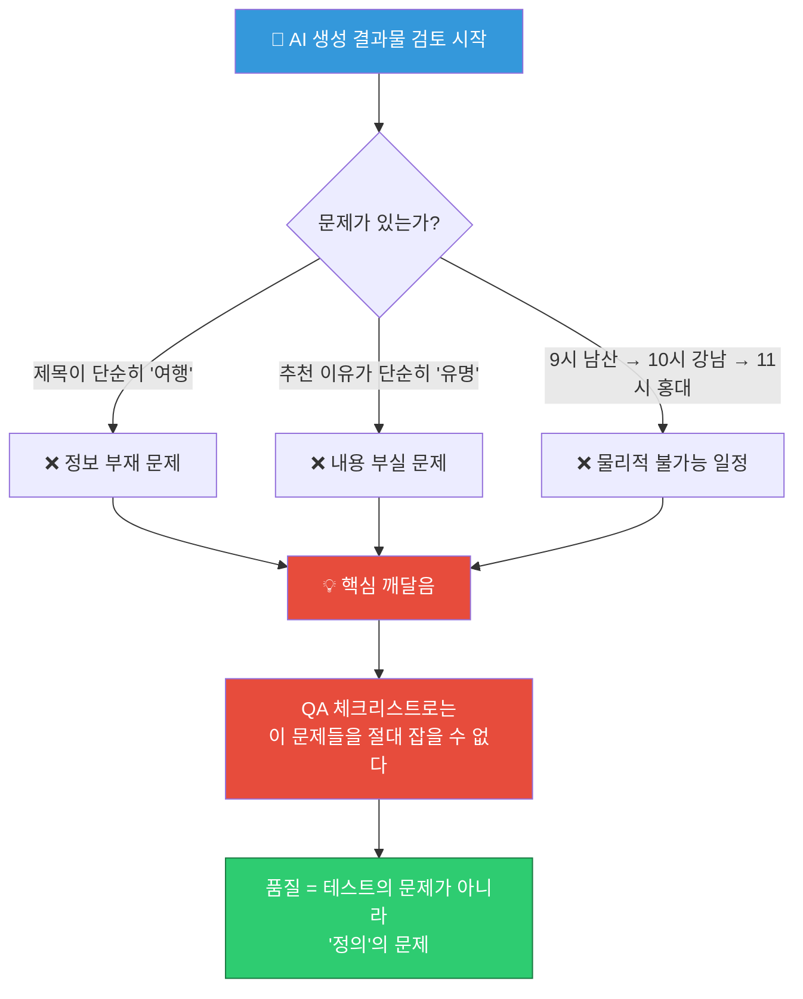

문제는 단순한 오류가 아니었습니다. AI는 **그럴듯한 문장으로 포장된 잘못된 정보**를 생성했습니다. 이것이 생성형 AI의 본질적 특성이자 위험입니다. 기존 QA라면 "버튼이 작동하는가?"라고 물었겠지만, 여기서는 "이 여행 계획이 실제로 유용한가?"라는 전혀 다른 질문이 필요합니다.

저자는 결국 8시간 동안 수천 개의 결과물에 점수를 매기게 됩니다. 그 과정에서 또 다른 문제를 마주합니다. **기준이 흔들리기 시작한 것입니다.**

- "이건 3점인가 4점인가?"
- "창의적인데 정확하지 않으면 몇 점이지?"
- "어느 순간부터 채점을 하는 건지, 기준을 만들고 있는 건지 모르겠다."

이 경험이 핵심 통찰로 이어집니다: **기준 없이는 평가 자체가 불가능하고, 그 기준을 만드는 사람이 PM이어야 한다.**

---

## 왜 QA가 한계에 부딪히는가

### 생성형 AI 서비스의 3가지 본질적 특성

QA가 AI 서비스의 품질을 책임지기 어려운 이유는 세 가지 본질적 특성에서 비롯됩니다.

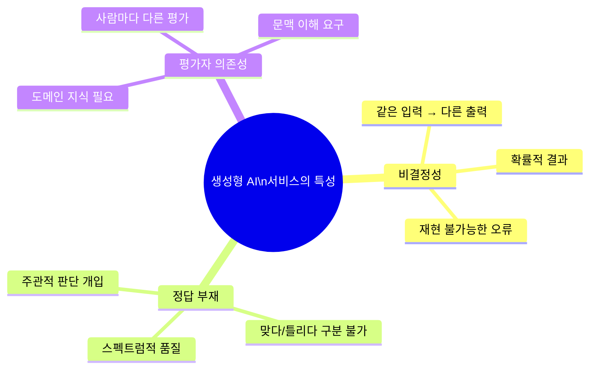

**첫째, 비결정성(Non-determinism)**: 같은 질문을 해도 매번 다른 답이 나옵니다. QA의 테스트 케이스는 동일한 입력에 동일한 출력을 기대하는 구조인데, AI는 이를 보장하지 않습니다.

**둘째, 정답의 부재**: "결제 버튼을 누르면 결제 완료 페이지로 이동해야 한다"는 명확한 정답이 있습니다. 하지만 "이 여행 계획은 좋은가?"에는 정답이 없습니다. 대신 더 좋은 답과 덜 좋은 답이 스펙트럼 위에 존재합니다.

**셋째, 평가자 의존성**: "이 답변은 자연스러운가? 도움이 되는가? 너무 장황하지 않은가? 신뢰할 수 있는가?" 이런 질문들은 전통적인 Pass/Fail 테스트로 평가할 수 없습니다. 평가자의 도메인 지식과 판단력이 필요합니다.

### QA의 역할 한계 도식화

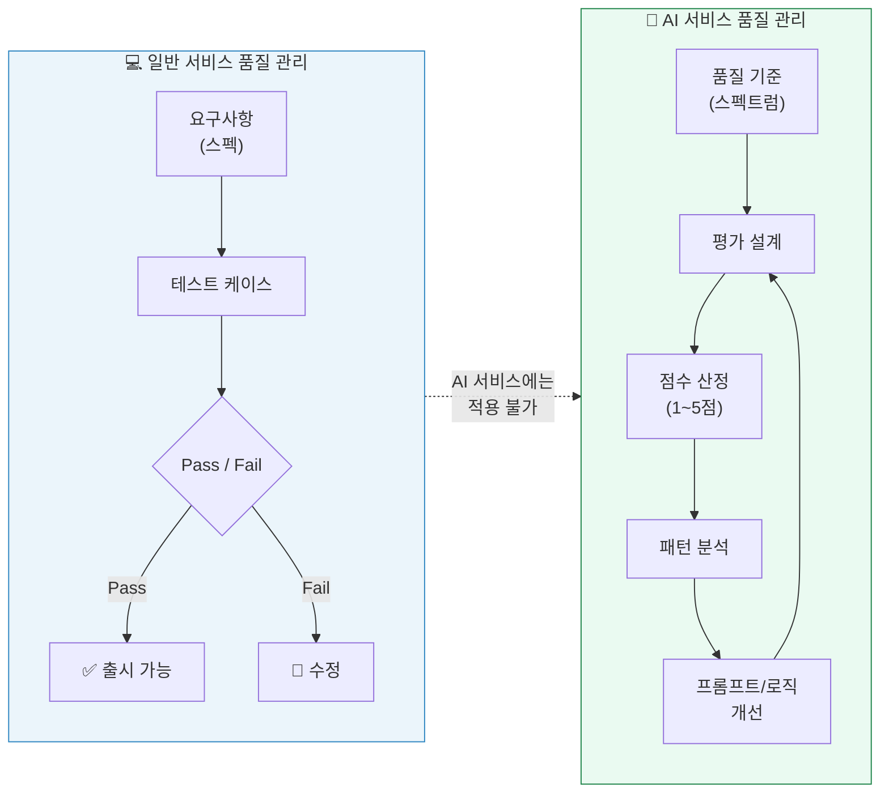

---

## PM의 역할 재정의

### 명세서 작성자(Spec Writer) → 평가 설계자(Evaluation Designer)

이 변화는 단순히 업무 범위의 확대가 아닙니다. 사고 방식(Mindset)의 근본적인 전환입니다.

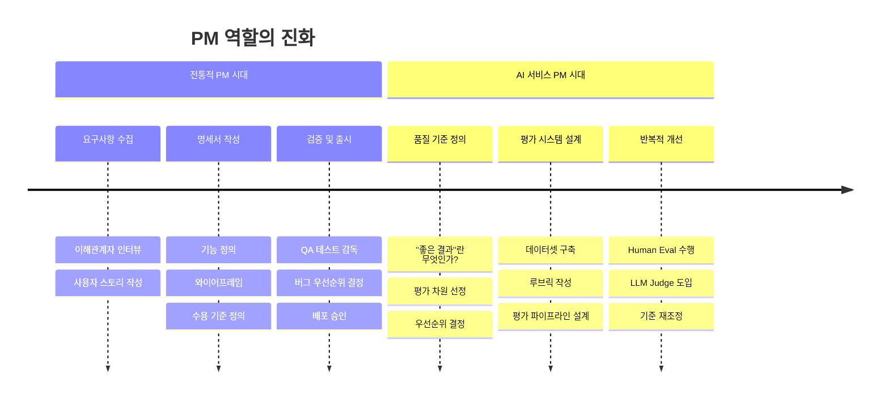

전통적 PM은 **"무엇을 만들 것인가"** 를 정의했습니다. AI 시대의 PM은 **"좋은 결과란 무엇인가"** 를 정의합니다. 이것이 근본적인 차이입니다.

---

## OpenAI가 보는 AI PM의 미래

### 제이크(Jake)의 인사이트 — OpenAI Head of Product Integrity

저자는 OpenAI의 제품 무결성 책임자(Head of Product Integrity)인 제이크의 팟캐스트 인터뷰를 인용합니다. 제이크는 AI PM의 변화를 이렇게 설명합니다.

> **"PM들은 제품이 어떻게 작동해야 하는지에 대해 그 누구보다 가장 명확한 비전을 가지고 있기 때문에, 점점 더 평가(evaluation)를 작성하는 역할을 맡게 됩니다."**

> **"기존에 PM들은 명세서를 쓰는 사람이었다면, 이제는 평가를 설계하는 사람이 되고 있습니다."**

또한 제품을 평가하는 방식도 달라지고 있다고 강조합니다.

| 구분 | 과거 | 현재 |
|------|------|------|
| 핵심 지표 | 클릭 수, 전환율, 세션 시간 | 결과 품질, 사용자 만족도, 목표 달성률 |
| 측정 방식 | 자동화된 분석 도구 | Human Eval + LLM Judge |
| 품질 기준 | 기능의 완결성 | 결과의 유용성 |
| 피드백 루프 | 스프린트 단위 | 실시간/지속적 |

이 변화는 OpenAI 같은 선도 기업에서 이미 내재화된 현실입니다. 그리고 이 흐름은 점차 모든 AI 서비스를 만드는 조직으로 확산될 것입니다.

---

## AI 품질 평가의 실제 프로세스

### 평가 사이클의 4단계

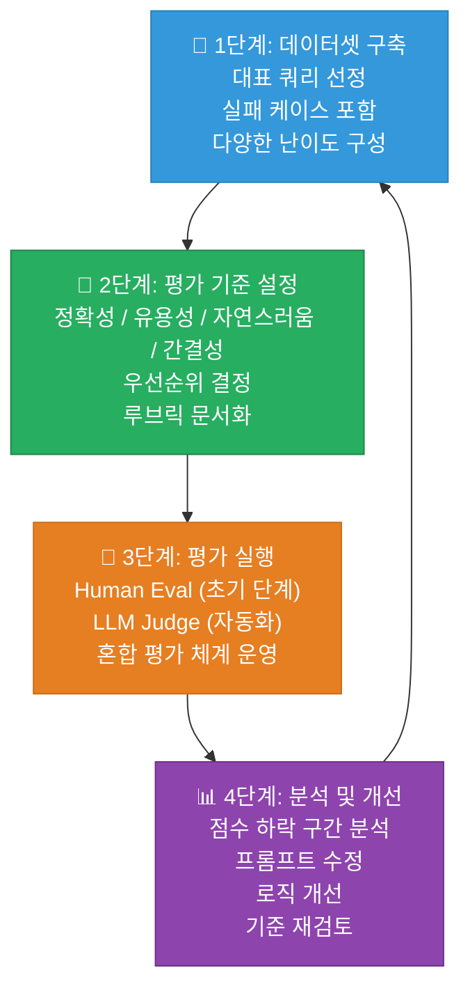

각 단계를 더 상세히 살펴봅니다.

#### 1단계: 데이터셋 구축

데이터셋은 "우리 서비스가 잘해야 하는 질문들을 모아놓은 리스트"입니다. 좋은 데이터셋은 세 가지 유형의 쿼리를 포함해야 합니다.

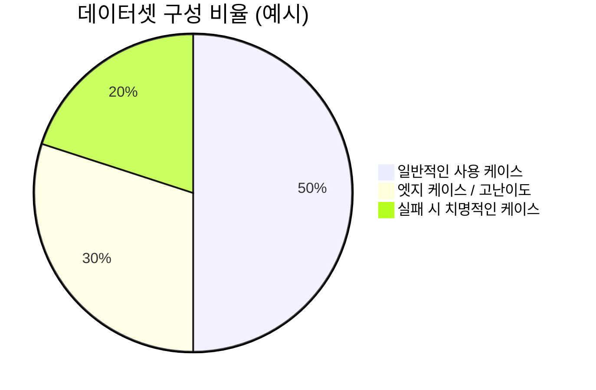

예시 (생성형 AI 여행 계획 앱):
- **일반 케이스**: "서울 2박 3일 여행 계획 짜줘"
- **고난이도 케이스**: "혼자 여행하는 60대 무릎이 안 좋은 분을 위한 경주 일정"
- **치명적 케이스**: "아이 동반 가족 여행 계획에 성인 전용 장소 포함되면 안 됨"

#### 2단계: 평가 기준 설정 (루브릭)

좋은 평가 기준은 명확하고, 측정 가능하며, 팀 전체가 동의할 수 있어야 합니다.

| 평가 차원 | 정의 | 5점 기준 | 1점 기준 |
|-----------|------|----------|----------|
| **정확성** | 사실에 기반한 정보 제공 | 모든 장소/시간 정보가 정확 | 물리적 불가능한 일정, 폐업 장소 포함 |
| **구체성** | 실행 가능한 수준의 디테일 | 교통편, 소요 시간, 예약 정보 포함 | "여행", "유명한 곳" 수준의 추상적 정보 |
| **현실성** | 체력, 시간, 예산 고려 | 이동 시간과 휴식이 적절히 배분됨 | 서울 주요 명소를 하루에 10곳 방문 |
| **자연스러움** | 문장의 가독성과 흐름 | 자연스럽고 친근한 어조 | 어색한 번역투, 지나치게 딱딱한 문체 |
| **간결성** | 필요한 정보만 담음 | 핵심 정보 중심으로 구성 | 불필요한 반복, 지나치게 장황한 설명 |

#### 3단계: 평가 실행

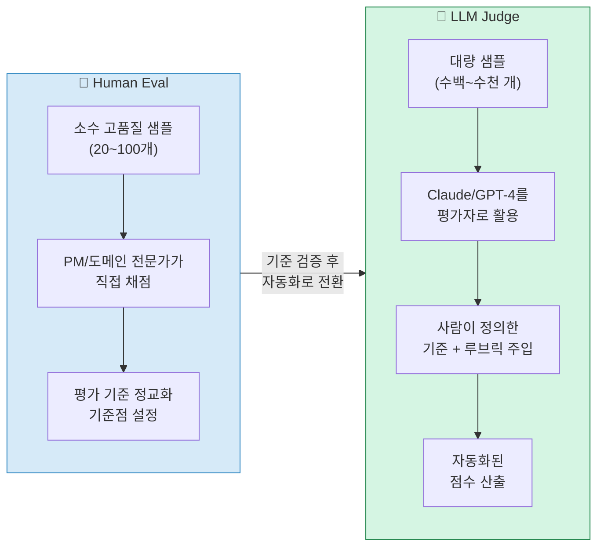

**LLM Judge 활용 시 핵심 원칙**: 기준 없이 점수만 매기라고 하면 LLM도 "그럴듯하게" 평가해버립니다. 반드시 명확한 루브릭과 평가 기준을 프롬프트에 포함해야 합니다.

```
[LLM Judge 프롬프트 예시]
다음 여행 계획을 아래 기준에 따라 1~5점으로 평가해주세요.

[평가 기준]
- 구체성 (1~5): 일정을 실제로 따라 할 수 있을 정도로 구체적인가?
  - 5점: 교통편, 소요 시간, 입장료, 예약 필요 여부 포함
  - 3점: 장소명은 있으나 세부 정보 부족
  - 1점: "유명한 곳", "맛집" 수준의 추상적 표현

- 현실성 (1~5): 물리적으로 실행 가능한 일정인가?
  - 5점: 이동 시간과 체류 시간이 현실적으로 배분됨
  - 3점: 일부 빡빡하지만 실행 가능
  - 1점: 이동 시간을 무시한 불가능한 일정

[평가할 여행 계획]
{여행 계획 내용}

[출력 형식]
구체성: X점 / 이유: ...
현실성: X점 / 이유: ...
종합 점수: X점
```

#### 4단계: 분석 및 개선

점수가 낮은 구간을 분석하면 개선 방향이 보입니다. 개선 방법은 크게 세 가지입니다.

- **프롬프트 엔지니어링**: AI에게 주는 지시문을 수정
- **로직 개선**: 후처리 필터, 검증 로직 추가
- **기준 재정의**: 우리가 평가하는 기준 자체가 잘못된 경우

---

## 일반 서비스 vs AI 서비스 비교

### 패러다임의 전환

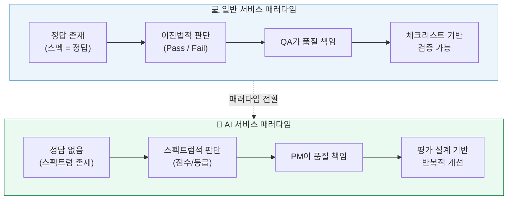

### 상세 비교표

| 구분 | 💻 일반 서비스 | 🤖 AI 서비스 |
|------|--------------|-------------|
| **품질 기준** | 명확함 (기획서 = 정답) | 애매함 (스펙트럼만 있음, 정답 대신 '모범 답안' 존재) |
| **품질 관리의 초점** | 품질 보증 (QA) | 평가 설계 (Evaluation Design) |
| **품질 책임자** | QA 팀 | PM |
| **핵심 지표** | 기능의 완결성 | 평가 기준 부합 정도 |
| **검증 방식** | 결과값 일치 여부 판단 ('O/X 퀴즈' 방식) | 결과값 최적화 여부 판단 ('논술 시험' 방식) |
| **자동화 방법** | 테스트 자동화 (Selenium, Jest 등) | LLM Judge, Human-in-the-Loop |
| **개선 방향** | 버그 수정 | 프롬프트 개선, 기준 재정의 |
| **완료 기준** | 테스트 케이스 100% 통과 | 지속적 개선 사이클 |

### 채점 방식의 비유

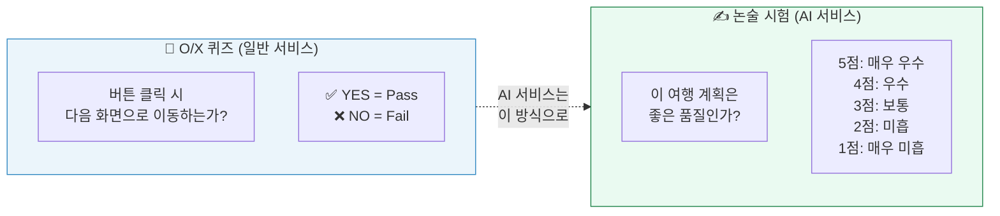

---

## 5단계 실전 가이드

### "품질관리 해본 적 없는" PM을 위한 로드맵

저자는 AI 품질 평가에 처음 도전하는 PM들을 위해 5단계 실천 가이드를 제시합니다. 이것은 기존 QA 경험과 무관하게, **"기준을 만들어본 적 있느냐"** 의 관점에서 접근하는 방법입니다.

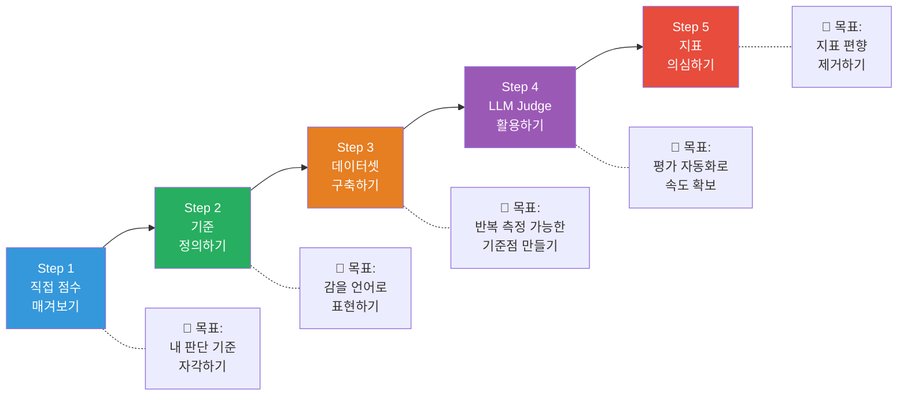

---

#### Step 1: 직접 점수 매겨보기

**목적**: 평가 기준을 만들기 전에, 먼저 본능적으로 판단하며 기준이 없을 때의 혼란을 체감합니다.

**방법**:
1. 실제 서비스 결과물 20~30개를 무작위로 뽑습니다
2. 아무 기준 없이 직감으로 1~5점을 매깁니다
3. 기준이 흔들리는 지점을 기록합니다

**핵심 인사이트**: "이건 3점인가 4점인가?"라고 막히는 순간, **"아, 기준이 없으면 평가 자체가 안 되는구나"** 를 깨닫게 됩니다. 이 답답함이 Step 2의 출발점입니다.

> 💡 **이 단계의 목표**: 점수를 정확히 매기는 것이 아니라, 내가 어떤 기준으로 판단하고 있는지 스스로 인식하는 것.

---

#### Step 2: 기준 정의하기

**목적**: 머릿속의 모호한 판단을 팀이 납득할 수 있는 명시적 기준으로 변환합니다.

**방법**:
- Step 1에서 느낀 "막연한 느낌"을 문장으로 표현합니다
- "좋은 [결과물]은 [특성]이어야 한다" 형식으로 작성합니다
- 각 특성에 대한 구체적인 예시를 포함합니다

**예시 (여행 계획 앱)**:
```
✅ 좋은 여행 계획의 기준:
1. 구체적이어야 한다
   → 일정을 실제로 따라 할 수 있을 정도면 구체적이다
   → "유명한 카페"는 구체적이지 않다. "삼청동 OO카페 (예약 불필요, 09:00 오픈)"는 구체적이다

2. 현실적이어야 한다
   → 이동 시간, 예산, 체력을 고려해 실행 가능해야 한다
   → 서울 주요 명소 10곳을 하루에 방문하는 계획은 현실적이지 않다

3. 간결해야 한다
   → 불필요하게 길고 장황하면 감점한다
   → 같은 정보를 반복하는 경우 감점한다
```

> 💡 **이 단계의 목표**: 감으로 판단하던 것을, 팀 전체가 납득할 수 있는 설명 가능한 기준으로 바꾸는 것.

---

#### Step 3: 데이터셋 구축하기

**목적**: 기준을 반복 적용하고 개선을 추적할 수 있는 안정적인 기준점을 만듭니다.

**데이터셋의 역할**:
- 기준 = "무엇이 좋은가"
- 데이터셋 = "그 기준을 적용해볼 문제들"

이 둘이 함께 있어야 품질을 지속적으로 개선할 수 있습니다.

**데이터셋 구성 요소**:

| 구성 요소 | 내용 | 비율 |
|-----------|------|------|
| 일반 케이스 | 실제 유저가 많이 할 쿼리 | 50% |
| 엣지 케이스 | 까다롭거나 특수한 상황 | 30% |
| 치명적 케이스 | 실패하면 큰 문제가 되는 상황 | 20% |
| 모범 답안 | 각 케이스에 대한 이상적 결과물 | (참고용) |

> 💡 **이 단계의 목표**: 데이터셋 없이는 매번 다른 질문, 다른 상황을 보게 되어 개선 여부를 판단하기 불가능합니다. 일관된 기준점을 만드는 것.

---

#### Step 4: LLM을 평가자로 활용하기 (LLM Judge)

**목적**: 사람이 수작업으로 평가하는 한계를 자동화로 극복합니다.

**주의사항**: 기준 없이 LLM에게 점수만 매기라고 하면, LLM도 "그럴듯하게" 평가합니다. 반드시 Step 2에서 정의한 기준을 함께 주입해야 합니다.

**LLM Judge 설계 원칙**:

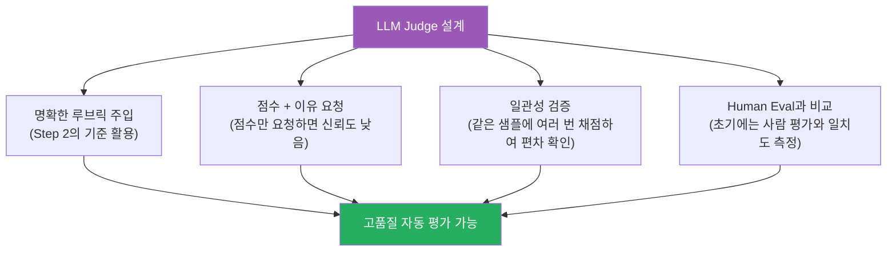

**LLM Judge 도입의 이점**:
- 대량 평가 가능 (수십 개 → 수천 개)
- 반복 작업 대폭 감소
- 빠른 개선 사이클 (프롬프트 수정 → 즉시 재평가 가능)

> 💡 **이 단계의 목표**: 본격적인 평가 자동화의 시작. 사람의 판단력은 기준 정의와 검증에 집중하고, 반복 평가는 AI에게 위임.

---

#### Step 5: 지표를 믿지 말고 의심하기

**목적**: 지표가 올라가도 실제 사용자 경험이 나빠지는 역설적 상황을 방지합니다.

이 단계는 가장 고급스럽고 중요한 단계입니다. 점수가 계속 올라가면 자연스럽게 "잘 되고 있다"는 착각이 생깁니다. 하지만 **잘못된 기준을 열심히 최적화하는 것**이 실제로는 제품을 망칩니다.

**흔한 지표의 함정**:

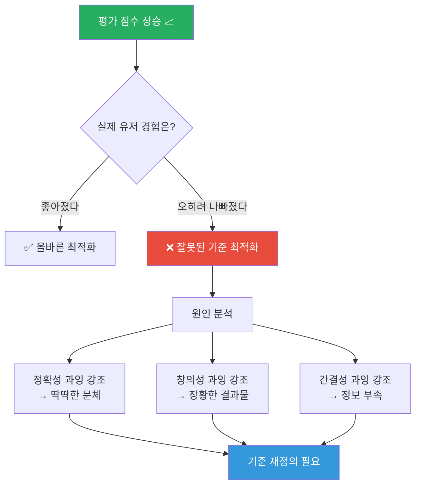

**핵심 질문**: *"이 지표가 진짜 유저 경험을 설명하고 있는가?"*

만약 아니라면, 모델을 개선하기 전에 **기준부터 다시 봐야 합니다.**

> 💡 **이 단계의 목표**: 지표가 목적이 아니라 수단임을 기억하고, 항상 실제 사용자 가치와의 연결을 확인하는 것.

---

## 지표의 함정

### Goodhart's Law와 AI 품질 관리

경제학자 찰스 굿하트(Charles Goodhart)는 이런 법칙을 제시했습니다: **"어떤 측정 지표가 목표가 되면, 그것은 더 이상 좋은 측정 지표가 아니다."** 이것이 AI 품질 관리에서도 정확히 재현됩니다.

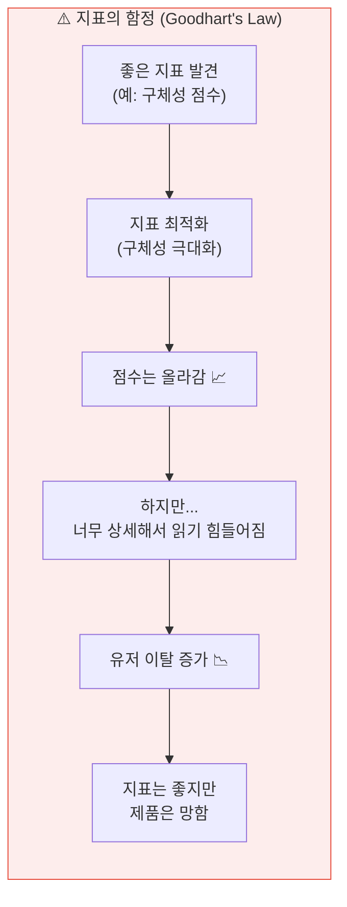

**실제 사례 패턴**:

- `정확성` 점수를 최적화하면 → 결과가 딱딱하고 건조해질 수 있음
- `창의성` 점수를 최적화하면 → 쓸데없이 장황해질 수 있음
- `간결성` 점수를 최적화하면 → 필요한 정보가 빠질 수 있음
- `자연스러움` 점수를 최적화하면 → 정확성이 희생될 수 있음

품질 관리의 성숙 단계는 "단일 지표 최적화 → 다차원 균형 → 사용자 경험 연동"으로 진화합니다.

---

## 결론

### 지금이 격차를 만들 기회다

저자는 이 변화를 단순한 부담 증가가 아니라, **새로운 기회**로 바라봅니다.

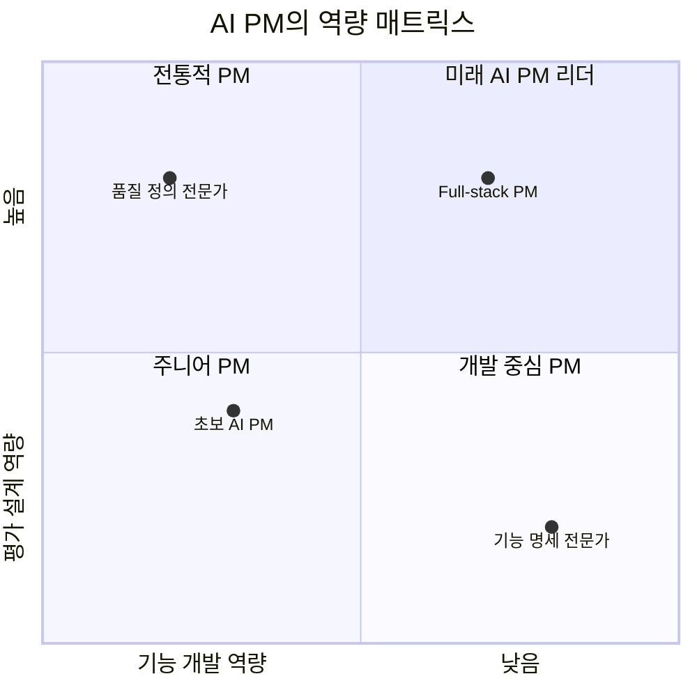

저자의 핵심 주장을 정리하면 이렇습니다:

1. **기능을 잘 만드는 PM은 많다.** 하지만 **좋은 결과를 정의할 수 있는 PM은 아직 많지 않다.**

2. **품질을 본다는 건 결국 제품의 방향을 가장 가까이에서 다루는 일이다.** 어떤 결과가 좋은지 고민하다 보면, 자연스럽게 "이 서비스는 무엇을 잘해야 하는가"라는 질문까지 닿게 된다.

3. **국내 시장에서는 아직 이 역할이 PM의 핵심 영역으로 올라오지 않은 곳이 많다.** 지금이 격차를 만들 수 있는 타이밍이다.

### AI PM의 새로운 정체성

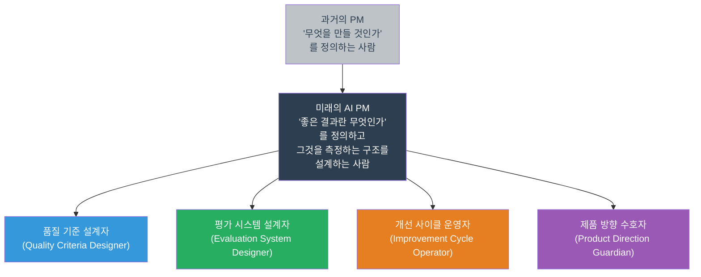

---

## 부록

### 핵심 개념 용어 사전

| 용어 | 설명 |
|------|------|
| **Human Eval** | 사람이 직접 AI 결과물을 평가하는 방식. 초기 기준 설정과 LLM Judge 검증에 활용 |
| **LLM Judge** | 다른 LLM을 평가자로 활용하여 AI 결과물을 자동으로 채점하는 방법 |
| **루브릭 (Rubric)** | 평가 기준을 체계화한 문서. 각 차원별 점수 기준을 명시 |
| **데이터셋 (Eval Dataset)** | 품질 측정을 위해 선별된 대표 쿼리 모음. 품질 변화를 추적하는 기준점 |
| **평가 파이프라인** | 데이터셋 → 모델 실행 → LLM Judge → 점수 집계 → 분석까지의 자동화된 흐름 |
| **프롬프트 엔지니어링** | AI 모델에 주는 지시문을 최적화하여 출력 품질을 개선하는 기법 |
| **Goodhart's Law** | 측정 지표가 목표가 되면 더 이상 좋은 측정 지표가 아니라는 법칙 |
| **비결정성 (Non-determinism)** | 같은 입력에도 다른 출력이 나오는 AI의 본질적 특성 |
| **품질 스펙트럼** | AI 결과물의 품질이 Pass/Fail이 아닌 연속적인 스펙트럼 위에 존재함을 의미 |
| **Head of Product Integrity** | AI 제품의 품질과 무결성을 총괄하는 역할. OpenAI 등 선도 AI 기업에 등장하는 신규 직책 |

---

### 📚 함께 읽으면 좋은 자료

- OpenAI Head of Product Integrity Jake 팟캐스트 인터뷰 (원문 글에서 인용)
- [Product Makers Note 4호] AI 시대에 달라져야 할 기획자, 디자이너의 보법
- [Product Makers Note 8호] 데이터는 많은데, 왜 확신은 부족할까

---

*문서 작성일: 2026년 4월 12일*  
*원문 출처: Product Makers Note 9호 — https://maily.so/makersnote/posts/d5rywq04z1w*
