**— Harrison Chase (LangChain CEO), "Your Harness, Your Memory" 완전 분석**

> 원문: https://blog.langchain.com/your-harness-your-memory/  
> 작성일: 2026년 4월 11일  
> 분석 작성일: 2026년 4월 12일

---

## 📌 핵심 요약 (TL;DR)

이 글은 LangChain의 CEO Harrison Chase가 작성한 에이전트 아키텍처에 관한 중요한 경고문이다. 핵심 논지는 세 가지다.

1. **에이전트 하네스(Agent Harness)는 사라지지 않는다** — 모델이 발전해도 하네스의 필요성은 계속된다.
2. **하네스와 메모리는 분리할 수 없다** — 메모리는 하네스의 핵심 기능이지, 플러그인이 아니다.
3. **클로즈드 하네스를 쓰면 메모리 주권을 잃는다** — 특히 API 뒤에 숨겨진 하네스는 심각한 벤더 락인(Lock-in)을 초래한다.

---

## 1. 에이전트 하네스란 무엇인가?

### 1-1. 정의와 등장 배경

**에이전트 하네스(Agent Harness)** 란, LLM(대형 언어 모델)을 도구·데이터 소스·메모리와 연결해 실제 에이전트로 작동하게 만드는 **오케스트레이션 레이어(scaffolding)** 다. 단순히 API를 래핑하는 것이 아니라, 에이전트의 "두뇌 주변 환경" 전체를 구성한다.

지난 3년간 에이전트 구축 방식의 진화를 보면 하네스의 역할이 얼마나 급변했는지 알 수 있다.

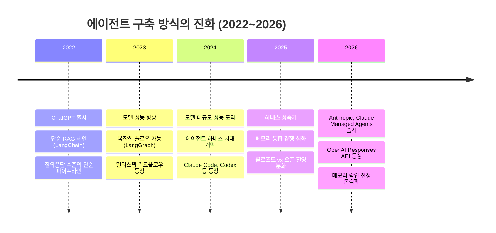

### 1-2. 주요 에이전트 하네스 사례

현재 대표적인 에이전트 하네스들은 다음과 같다:

| 하네스 | 제공사 | 오픈소스 여부 | 특징 |
|--------|--------|:---:|------|
| **Claude Code** | Anthropic | ❌ (소스코드 유출 후 확인: 51만 2천 라인) | 최고 성능의 코딩 에이전트 |
| **Codex** | OpenAI | ⚠️ 오픈소스이나 컴팩션 요약은 암호화됨 | GPT 기반 코딩 에이전트 |
| **Deep Agents** | LangChain | ✅ | 모델 비종속, 오픈 메모리 |
| **Letta Code** | Letta | ✅ | 상태 보존 에이전트 특화 |
| **OpenCode** | 커뮤니티 | ✅ | 오픈소스 코딩 에이전트 |
| **Pi / OpenClaw** | 커뮤니티 | ✅ | Pi 모노레포 기반 |

### 1-3. 하네스의 구조: 5가지 핵심 기능

아래 이미지(Image 1)는 하네스 내부의 에이전트 동작 구조를 보여준다.

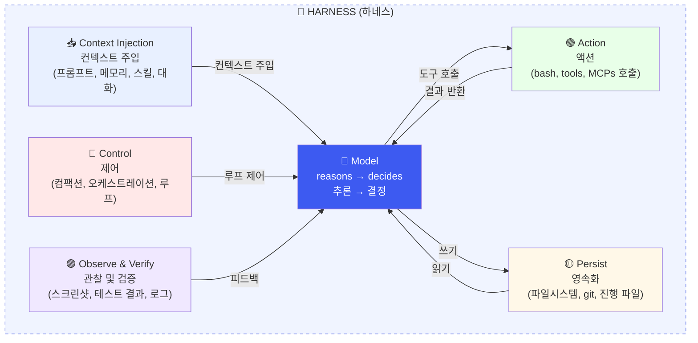

각 컴포넌트의 역할을 상세히 설명하면 다음과 같다.

**① Context Injection (컨텍스트 주입)**  
하네스가 모델에게 "무엇을 알아야 하는가"를 전달하는 단계다. 시스템 프롬프트, 장기 메모리에서 불러온 정보, 사용 가능한 스킬 목록, 이전 대화 기록 등이 모두 여기서 처리된다. CLAUDE.md나 AGENTS.md 같은 파일도 이 단계에서 컨텍스트로 주입된다.

**② Control (제어)**  
에이전트의 실행 흐름을 관리한다. 컴팩션(compaction, 긴 대화를 요약·압축하는 과정), 멀티 에이전트 오케스트레이션, 그리고 에이전트가 목표를 달성할 때까지 반복하는 루프(ralph loops) 등이 포함된다. 이 제어 로직이 얼마나 정교하냐가 에이전트의 자율성을 결정한다.

**③ Action (액션)**  
모델이 결정한 내용을 실제 세계에서 실행하는 단계다. bash 명령 실행, 외부 API 호출, MCP(Model Context Protocol) 서버와의 통신 등이 여기에 해당한다. 액션의 결과는 다시 모델의 컨텍스트로 피드백된다.

**④ Observe & Verify (관찰 및 검증)**  
액션의 결과를 관찰하고 검증한다. 브라우저 스크린샷, 테스트 실행 결과, 애플리케이션 로그 등을 수집해 모델이 다음 결정을 내릴 수 있도록 정보를 제공한다. 이 루프가 있어야 에이전트가 자기수정(self-correction)이 가능하다.

**⑤ Persist (영속화)**  
에이전트의 상태와 결과물을 저장한다. 파일시스템 변경, git 커밋, 진행 상황 파일 업데이트 등이 포함된다. 이 레이어가 곧 단기 메모리와 장기 메모리의 경계에 있다.

---

## 2. 왜 하네스는 사라지지 않는가?

### 2-1. "모델이 하네스를 흡수할 것"이라는 오해

많은 사람들이 "모델이 충분히 똑똑해지면 주변 스캐폴딩이 필요 없어질 것"이라고 주장한다. Harrison Chase는 이를 정면으로 반박한다.

그의 논리는 단순하다. 에이전트란 **"LLM이 도구 및 데이터 소스와 상호작용하는 시스템"** 이다. 이 상호작용을 중개하는 시스템, 즉 하네스는 그 정의상 항상 존재할 수밖에 없다.

2023년에 필요했던 스캐폴딩의 상당 부분이 사라진 것은 사실이다. 하지만 그 자리를 새로운 종류의 스캐폴딩이 채웠다. 모델이 더 강력해질수록, 하네스도 더 복잡한 작업을 처리할 수 있도록 진화했다.

**결정적 증거**: Claude Code의 소스코드가 유출되었을 때, 그 코드는 무려 **51만 2천 라인**이었다. 세계 최고의 모델을 만드는 Anthropic조차 하네스에 막대한 투자를 하고 있다는 의미다.

### 2-2. API 내장 기능도 하네스의 일부다

OpenAI와 Anthropic이 API에 웹 검색 기능을 내장할 때, 이것은 모델의 능력이 된 것이 아니다. 모델 뒤에서 **웹 검색 API와 모델을 오케스트레이션하는 경량 하네스**가 작동하는 것이다. 툴 콜링(tool calling)이라는 메커니즘을 통해 구현된다.

---

## 3. 하네스와 메모리의 불가분 관계

### 3-1. "메모리는 플러그인이 아니다"

Letta의 CTO Sarah Wooders는 이 관계를 날카롭게 정리했다.

> *"메모리를 에이전트 하네스에 플러그인처럼 꽂으려는 것은 마치 '드라이빙'을 자동차에 플러그인하려는 것과 같다. 컨텍스트 관리, 즉 메모리 관리는 에이전트 하네스의 핵심 역량이자 책임이다."*

메모리는 컨텍스트의 한 형태다. 그리고 컨텍스트 관리는 하네스의 근본 기능이다. 따라서 메모리와 하네스는 개념적으로도, 구현적으로도 분리될 수 없다.

### 3-2. 메모리의 두 가지 유형과 하네스의 역할

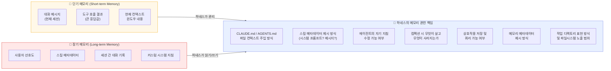

### 3-3. 메모리는 아직 초기 단계다

저자는 솔직하게 인정한다. 현재 에이전트 메모리는 매우 초기 단계에 있다. 대부분의 에이전트 MVP(최소 기능 제품)에서 장기 메모리는 후순위로 밀린다. "일단 에이전트를 작동시키고, 그 다음 개인화를 고민하는" 순서로 진행되기 때문이다.

이는 아직 업계에 메모리에 대한 공통된 추상화(abstraction)나 베스트 프랙티스가 없다는 뜻이기도 하다. 이 미성숙한 시점에 메모리를 하네스와 분리하는 것은 시기상조라는 것이 저자의 주장이다. 미래에 메모리 시스템이 성숙해지면 별도 서비스로 분리될 수 있겠지만, 지금 당장은 하네스가 메모리의 기반이다.

---

## 4. 클로즈드 하네스의 위험: 메모리 주권 상실

### 4-1. 세 가지 위험 수준

아래는 하네스의 개방성에 따른 메모리 소유권 위험을 세 단계로 분류한 것이다.

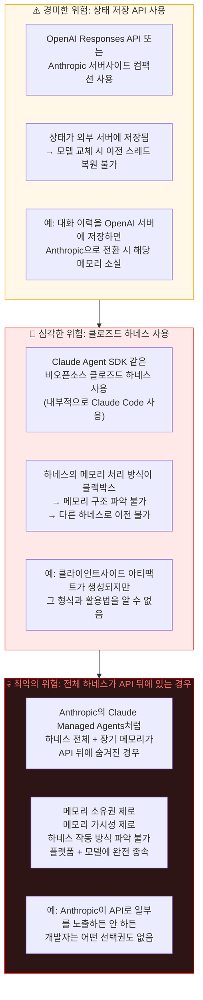

### 4-2. 도식으로 보는 메모리 위치 변화

아래 다이어그램들(Image 2~5)은 메모리가 하네스에서 모델 프로바이더 API 쪽으로 이동하는 과정을 시각적으로 보여준다.

**[이상적인 상태 - Image 2]**: 단기·장기 메모리, 도구, 프롬프트 모두 개발자가 소유한 하네스 안에 있다.

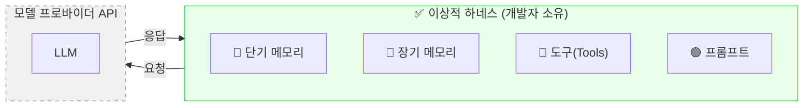

**[경미한 위험 - Image 3]**: 단기 메모리가 API 쪽으로 이동한다. Responses API나 서버사이드 컴팩션을 사용하면 이 상태가 된다.

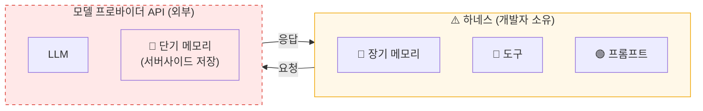

**[심각한 위험 - Image 4]**: 장기 메모리까지 블랙박스 하네스에 갇힌다. 개발자는 메모리의 구조와 처리 방식을 알 수 없다.

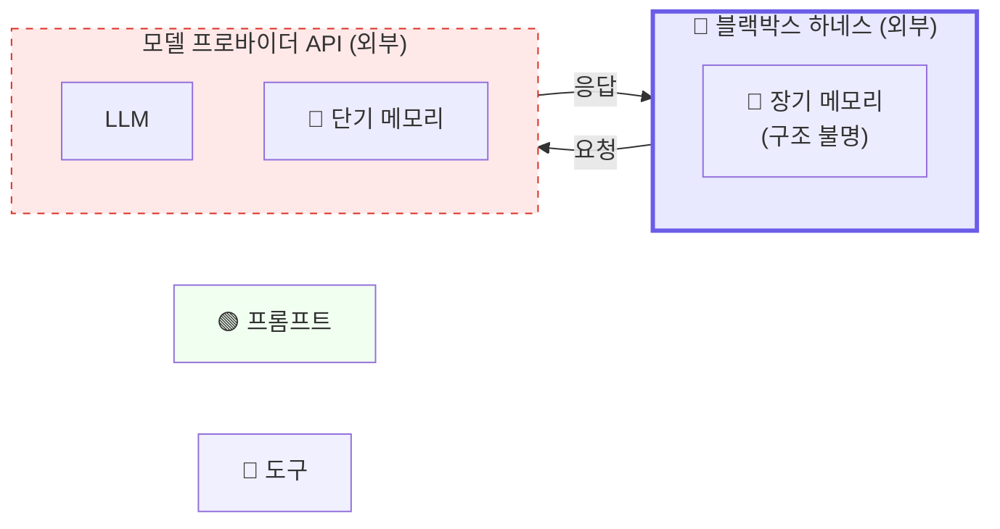

**[최악의 상태 - Image 5]**: 하네스 전체(단기·장기 메모리 모두)가 모델 프로바이더 API 안으로 들어간다. Claude Managed Agents가 이에 해당한다.

```mermaid
graph LR
    TOOLS_WORST["🔵 도구"]
    PROMPT_WORST["🟢 프롬프트"]
    
    subgraph API_WORST["💀 모델 프로바이더 API (완전 외부화)"]
        LLM_WORST["LLM"]
        subgraph HARNESS_WORST["하네스 (API 내부)"]
            LTM_WORST["🔴 장기 메모리"]
            STM_WORST["🔶 단기 메모리"]
        end
    end
    
    TOOLS_WORST -->|"요청"| API_WORST
    API_WORST -->|"응답"| TOOLS_WORST
    
    style API_WORST fill:#2d1515,stroke:#ff0000,stroke-dasharray: 5 5
    style HARNESS_WORST fill:#3d2020,stroke:#ff6b6b
    style LTM_WORST color:#ff9999
    style STM_WORST color:#ffcc99
    style LLM_WORST color:#ffffff
```

### 4-3. 구체적 사례: Anthropic과 OpenAI의 전략

**Anthropic의 Claude Managed Agents**  
Anthropic은 Claude Managed Agents를 출시해 하네스의 모든 것을 API 뒤에 넣었다. 이는 개발자가 메모리에 대한 소유권과 가시성을 완전히 포기하는 것을 의미한다. 한번 이 플랫폼에 의존하기 시작하면, 에이전트가 축적한 메모리와 함께 플랫폼에 묶이게 된다.

**OpenAI의 Codex**  
Codex는 오픈소스로 제공되지만, **컴팩션 요약(compaction summary)은 암호화되어 있어** OpenAI 생태계 외부에서는 사용할 수 없다. 코드는 공개했지만 메모리의 핵심 부분은 잠갔다.

---

## 5. 메모리가 중요한 이유: 락인(Lock-in) 전략

### 5-1. 메모리 = 경쟁 우위

지금까지 모델 프로바이더 간 전환은 비교적 쉬웠다. API 구조가 비슷하고, 프롬프트를 약간 수정하면 됐다. 이것이 가능했던 이유는 시스템이 **무상태(stateless)** 였기 때문이다.

그런데 메모리가 축적되면 상황이 완전히 달라진다.

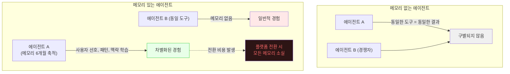

### 5-2. 이메일 어시스턴트 사례

Harrison Chase는 직접 겪은 사례를 공유한다. 그는 Fleet(LangChain의 엔터프라이즈 노코드 플랫폼) 위에서 이메일 어시스턴트를 수개월간 사용했다. 이 어시스턴트는 사용자의 글쓰기 톤, 선호 표현, 업무 스타일 등을 학습하며 메모리를 쌓아갔다.

어느 날 실수로 에이전트가 삭제됐다. 같은 템플릿으로 새 에이전트를 만들었지만, 경험은 훨씬 나빠졌다. 모든 선호도를 다시 가르쳐야 했다. **이 불편함이 메모리의 진짜 가치를 체감하게 해줬다.**

이것이 모델 프로바이더들이 원하는 것이다. 메모리를 자신의 플랫폼에 묶어두면, 개발자는 쉽게 떠날 수 없다.

### 5-3. 데이터 플라이휠 효과

메모리가 쌓일수록 에이전트는 더 좋아지고, 에이전트가 좋아질수록 더 많이 사용되며, 더 많이 사용될수록 더 많은 메모리가 쌓인다. 이것이 **데이터 플라이휠**이다.

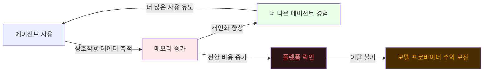

---

## 6. 오픈 하네스가 답이다: Deep Agents

### 6-1. LangChain의 대안: Deep Agents

Harrison Chase는 이 문제에 대한 해답으로 **Deep Agents**를 제시한다. Deep Agents는 다음 원칙을 따른다:

| 원칙 | 상세 내용 |
|------|-----------|
| **오픈소스** | 전체 코드베이스 공개, 하네스 동작 방식 완전 투명 |
| **모델 불가지론(Model Agnostic)** | 특정 모델에 종속되지 않음, 언제든 교체 가능 |
| **오픈 표준 사용** | agents.md, skills 등 개방된 표준 채택 |
| **유연한 메모리 스토어** | MongoDB, PostgreSQL, Redis 등 원하는 DB 연결 가능 |
| **다양한 배포 옵션** | LangSmith Deployment 또는 자체 호스팅, 어떤 클라우드든 가능 |
| **BYOD (Bring Your Own Database)** | 자체 데이터베이스를 메모리 스토어로 사용 가능 |

### 6-2. 개방형 vs 폐쇄형 하네스 비교

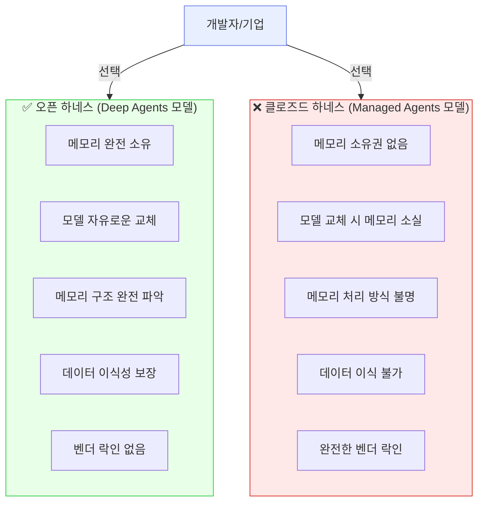

---

## 7. 산업적 함의와 전망

### 7-1. 모델 프로바이더의 전략적 의도

모델 프로바이더들이 메모리를 API 뒤에 숨기는 것은 단순한 편의성이 아니다. 이는 명확한 전략적 의도의 산물이다. 모델만으로는 차별화가 어려워지고 있기 때문이다. 모든 프로바이더가 비슷한 성능을 갖춰가는 상황에서, 메모리는 새로운 경쟁의 장이 됐다.

메모리는 모델 자체보다 훨씬 강력한 락인 메커니즘이다. 사용자가 6개월간 쌓은 에이전트 메모리를 버리고 다른 플랫폼으로 옮기는 것은, API 키 하나 바꾸는 것과는 차원이 다른 비용을 수반한다.

### 7-2. 개발자와 기업이 지금 해야 할 질문들

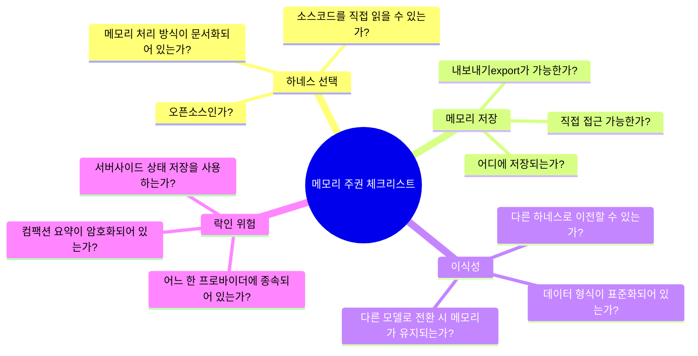

### 7-3. 향후 전망

저자의 논지에 따르면, 에이전트 생태계는 두 진영으로 분화될 가능성이 높다.

**폐쇄형 진영**: Anthropic(Claude Managed Agents), OpenAI(Responses API + 암호화 컴팩션)가 메모리를 플랫폼에 묶어 락인을 강화한다. 단기적으로 편리하고 완성도 높은 경험을 제공하지만, 개발자는 점점 더 깊이 종속된다.

**개방형 진영**: LangChain(Deep Agents), Letta 등이 오픈소스·모델 비종속 하네스를 제공한다. 초기 구축 비용이 더 들 수 있지만, 장기적으로 데이터 주권과 유연성을 유지한다.

---

## 8. 핵심 메시지 정리

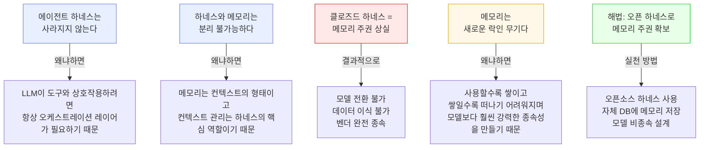

---

## 9. LxM(Ludus Ex Machina) 관점에서의 시사점

이 논문은 LxM 프로젝트와 깊은 연관성을 갖는다. AI 모델을 다양한 게임에서 평가하는 플랫폼으로서, LxM은 필연적으로 여러 모델 프로바이더의 API를 동시에 활용해야 한다. 이때 각 에이전트의 **게임 기억(game memory)** — 이전 판의 전략, 상대방의 패턴, 자신의 성공/실패 학습 — 이 특정 하네스나 API에 묶이면 안 된다.

**LxM 아키텍처 권고사항**:
- 각 AI 에이전트의 게임 메모리는 독립적인 오픈 데이터베이스에 저장할 것
- 하네스는 모델 비종속으로 설계하여 Gemini, Claude, GPT를 동일한 인터페이스로 다룰 것
- 컴팩션(게임 요약)은 자체 포맷으로 구현하여 특정 플랫폼에 의존하지 않을 것

---

## 📚 참고 자료

- **원문**: [Your harness, your memory - LangChain Blog](https://blog.langchain.com/your-harness-your-memory/) (Harrison Chase, 2026.04.11)
- **관련 글**: [The Anatomy of an Agent Harness - LangChain Blog](https://blog.langchain.com/the-anatomy-of-an-agent-harness/)
- **Sarah Wooders의 트위터**: "Memory isn't a plugin (it's the harness)"
- **Deep Agents 문서**: [docs.langchain.com/oss/python/deepagents](https://docs.langchain.com/oss/python/deepagents/overview)
- **Claude Managed Agents**: [platform.claude.com/docs/en/managed-agents](https://platform.claude.com/docs/en/managed-agents/overview)

---

*이 문서는 Harrison Chase의 LangChain 블로그 포스트 "Your Harness, Your Memory" (2026.04.11)를 바탕으로, 제공된 다이어그램 이미지들을 포함하여 한국어로 상세 분석·재구성한 것입니다.*
