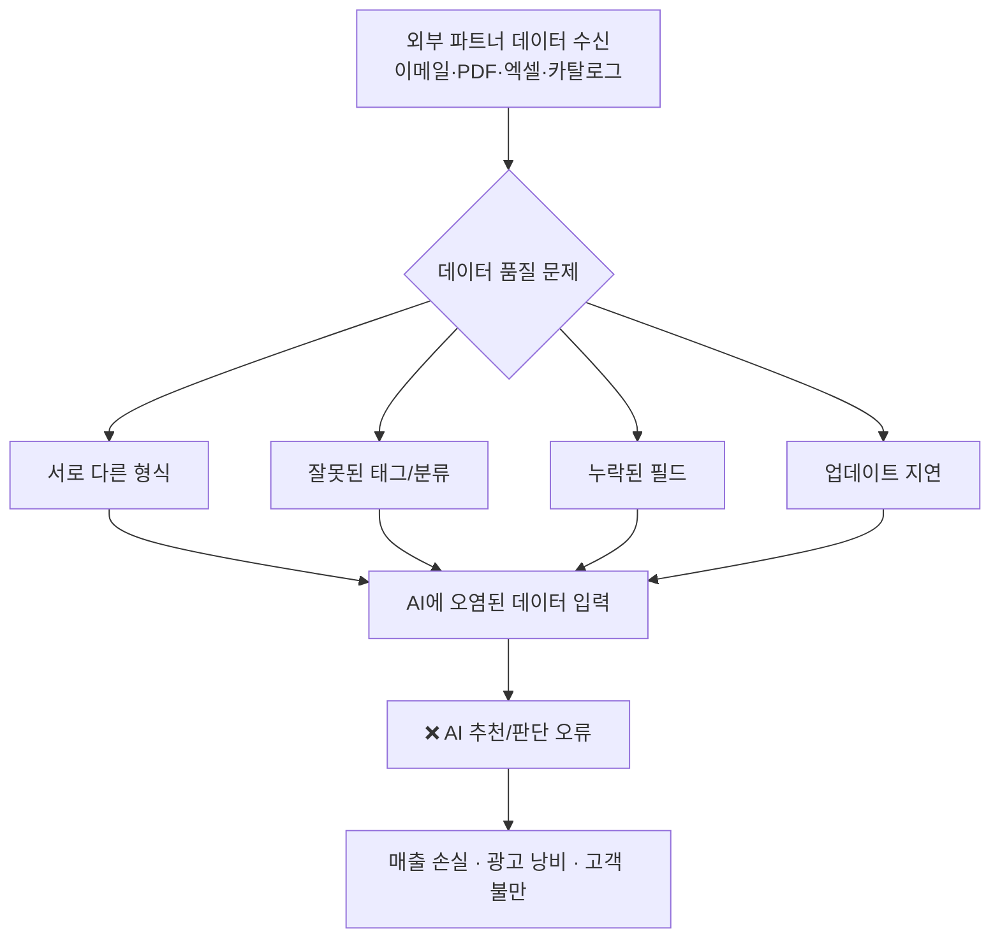
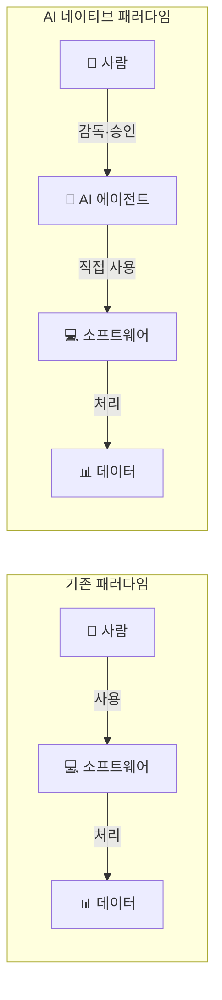
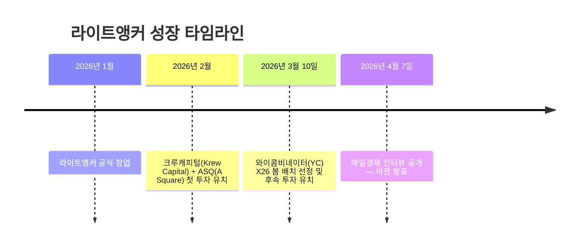
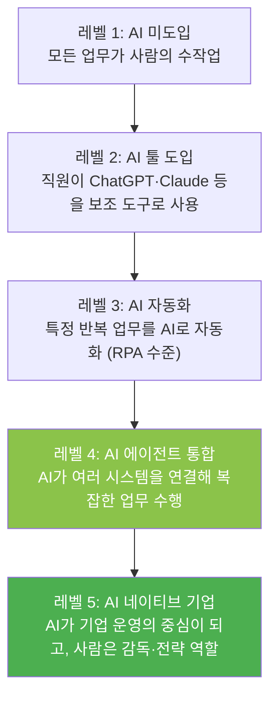
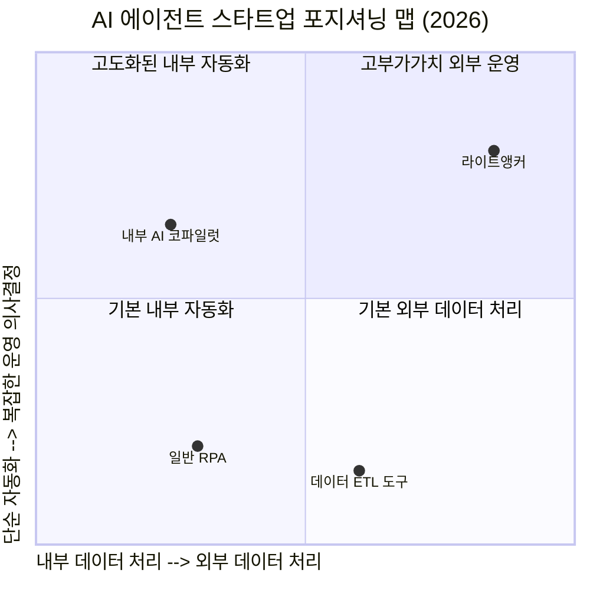
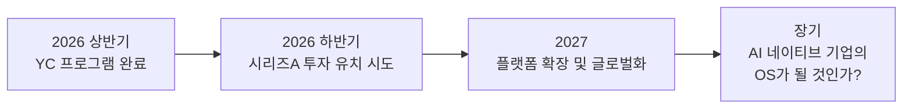

> [**"직원이 AI 쓰는 시대를 넘어, AI가 기업을 운영하는 시대가 온다"**](https://www.mk.co.kr/news/it/12009229)  
> 매일경제 2026.04.07 인터뷰 & 최신 동향 종합 분석

---

## 목차

1. [라이트앵커란 무엇인가](#1-라이트앵커란-무엇인가)
2. [창업자 배경과 창업 계기](#2-창업자-배경과-창업-계기)
3. [핵심 문제의식 — 데이터가 AI 성능을 결정한다](#3-핵심-문제의식--데이터가-ai-성능을-결정한다)
4. [라이트앵커의 기술과 제품](#4-라이트앵커의-기술과-제품)
5. [비즈니스 모델과 접근 방식](#5-비즈니스-모델과-접근-방식)
6. [투자 유치와 YC 선정](#6-투자-유치와-yc-선정)
7. [현재 파트너십과 실증 현황](#7-현재-파트너십과-실증-현황)
8. [AI 네이티브 기업이란 무엇인가](#8-ai-네이티브-기업이란-무엇인가)
9. [시장 맥락 — 2026년 AI 에이전트 트렌드](#9-시장-맥락--2026년-ai-에이전트-트렌드)
10. [한국 시장에 대한 시각](#10-한국-시장에-대한-시각)
11. [비판적 시각과 현실적 과제](#11-비판적-시각과-현실적-과제)
12. [종합 평가 및 시사점](#12-종합-평가-및-시사점)

---

## 1. 라이트앵커란 무엇인가

라이트앵커(Light Anchor)는 미국 샌프란시스코 실리콘밸리에 본사를 둔 AI 에이전트 스타트업이다. 회사의 핵심 미션은 한 문장으로 요약된다. **"기업의 외부 데이터 운영 전 과정을 AI로 자동화한다."** 이 회사는 기업이 이메일, PDF, 엑셀, 상품 카탈로그, 인보이스, 가격 정보 등 다양한 형태로 외부 파트너로부터 수신하는 데이터를 AI 에이전트가 자동으로 수집, 정리, 검증, 표준화하고 — 나아가 그 데이터를 기반으로 실제 비즈니스 의사결정과 운영 업무까지 수행하도록 하는 솔루션을 개발하고 있다.

라이트앵커가 집중하는 시장은 **EDO(External Data Operations, 외부 데이터 운영)** 라는 영역이다. 금융, 유통, 여행 같은 플랫폼 기업들은 수십 개, 많게는 수백 개의 외부 파트너로부터 서로 다른 형식의  데이터를 지속적으로 받는다. 각 공급사는 자신만의 파일 형식, 필드 이름, 단위 체계, 업데이트 주기를 갖고 있다. 이 데이터들을 사람이 수작업으로 통합하고 검증하는 데는 엄청난 시간과 인력이 소요되며, 오류의 위험도 항상 존재한다. 라이트앵커는 이 구조적 비효율을 AI 에이전트로 해결하려 한다.

---

## 2. 창업자 배경과 창업 계기

### 창업자 프로필

| 항목 | 김영도 (Chase Kim) | 박상하 (Sangha Park) |
|------|-------------------|---------------------|
| 학력 | Penn State University (정보과학기술) | Brown University (CS + 응용수학) |
| 전 직장 | 샌드버드(Sendbird) — Head of Forward Deployment | 샌드버드(Sendbird) — Lead Product Manager |
| 역할 | 고객사 AI 에이전트 프로젝트 조직 총괄 | 제품 개발 및 AI 에이전트 전략 전환 주도 |
| 현재 역할 | 공동창업자 | 공동창업자 (CEO) |

두 사람이 만난 회사는 샌드버드(Sendbird)다. 샌드버드는 채팅, 메시징 인프라 SaaS로 잘 알려진 한국계 스타트업으로, 실리콘밸리에서 유니콘 기업 반열에 오른 곳이다. 두 창업자는 샌드버드에서 각각 다른 직무를 수행하면서도 같은 문제를 목격했다. 기업 고객들에게 AI 에이전트 솔루션을 도입하는 과정에서, 가장 큰 장벽은 **AI 모델의 성능이 아니라 데이터의 품질**이었다는 것이다.

### 창업의 결정적 계기 — TV를 추천해야 할 AI가 배터리를 추천한 사건

김영도 대표는 샌드버드 재직 시절 미국의 한 유통사 프로젝트를 담당했다. 이 프로젝트에서 AI는 고객에게 TV를 추천해야 하는 상황이었는데, 실제로는 배터리를 추천하는 어이없는 오류가 발생했다. 원인을 파고들어 보니 단순한 데이터 입력 실수였다. 상품 데이터베이스에 TV에 붙어야 할 태그에 누군가 실수로 '배터리'라는 태그를 입력해 놓았던 것이다.

이 작은 사건은 AI에 관한 중요한 진실을 드러냈다. **AI는 데이터가 맞는지 틀린지 스스로 판단하지 못한다.** 아무리 뛰어난 AI 모델이라도, 입력 데이터가 잘못되면 결과도 반드시 잘못된다. 김 대표는 이를 "진실의 근원(Source of Truth)이 오염되면 결과도 오염된다"는 말로 표현했다. 이 문제를 해결하겠다는 의지에서 라이트앵커가 탄생했다.

---

## 3. 핵심 문제의식 — 데이터가 AI 성능을 결정한다

라이트앵커의 창업 철학은 매우 명확하다.

> **"AI 성능은 모델이 아니라 데이터의 정확성에 달려 있다."**

이 명제는 현재 AI 도입 현장에서 가장 자주 간과되는 진실이기도 하다. 많은 기업이 더 좋은 LLM 모델을 도입하면 AI 품질이 올라간다고 믿지만, 실제로는 모델에 공급되는 데이터의 품질이 결과를 좌우한다.

특히 B2B 플랫폼 기업, 금융사, 유통사처럼 **다수의 외부 파트너와 연결**된 기업일수록 이 문제가 심각하다. 예를 들어 여러 카드사와 연계된 금융 플랫폼은 각 카드사마다 서로 다른 상품 데이터 형식을 받아 이를 통합해야 하는데, 이 과정이 현재는 대부분 수작업으로 이루어진다. 라이트앵커의 핵심 가치 제안은 이 수작업 전체를 AI 에이전트로 대체하는 것이다.

---

## 4. 라이트앵커의 기술과 제품

### 4.1 핵심 기술 — AI 데이터 에이전시 (AI Data Agency)

라이트앵커의 제품은 크게 세 가지 단계로 작동한다.

```mermaid
flowchart LR
    subgraph INGEST["① 데이터 수집 (Ingest)"]
        A1[이메일 첨부파일]
        A2[PDF 스캔 문서]
        A3[엑셀 파일]
        A4[API 연동]
    end
    subgraph PROCESS["② 처리 및 검증 (Process & Validate)"]
        B1[자동 필드 매핑]
        B2[형식 표준화]
        B3[이상 탐지]
        B4[웹 교차 검증]
        B5[파트너 담당자 소통]
    end
    subgraph EXECUTE["③ 실행 (Execute)"]
        C1[상품 리스팅 업데이트]
        C2[가격 변경 반영]
        C3[광고 집행 자동화]
        C4[발주 처리]
        C5[예산 조정]
    end
    INGEST --> PROCESS --> EXECUTE
```

**수집(Ingest)** 단계에서는 이메일에 첨부된 파일, 스캔된 PDF, 엑셀 파일 등 어떤 형태의 외부 데이터든 자동으로 읽어들인다. 특히 비정형 PDF와 스캔 이미지에서 정형화된 데이터를 추출하는 기술이 핵심 역량 중 하나다.

**처리 및 검증(Process & Validate)** 단계에서는 서로 다른 공급사가 서로 다른 이름으로 부르는 필드들을 자동으로 매핑하고, 표준화된 형식으로 변환하며, 데이터 이상을 실시간으로 탐지한다. 단순히 저장 기능에 머무르지 않고, 웹과 브라우저를 활용해 데이터를 교차 검증하며 필요한 경우 파트너 담당자에게 직접 소통해 오류를 해결하기도 한다.

**실행(Execute)** 단계는 라이트앵커가 기존 데이터 파이프라인 도구들과 차별화되는 지점이다. 검증된 데이터를 실제 비즈니스 운영에 자동으로 반영한다. 상품 리스팅 업데이트, 광고 예산 조정, 가격 변경, 발주 처리 등 실질적인 매출과 비용에 영향을 미치는 후속 업무까지 AI가 수행하도록 설계되어 있다.

### 4.2 개발 중인 3대 기능

라이트앵커는 YC 프로그램을 발판으로 다음 세 가지 기능을 단계적으로 고도화한다고 밝혔다.

| 기능명 | 설명 |
|--------|------|
| **컴퓨터 사용 에이전트** (Computer Use Agent) | 웹 브라우저 환경에서 사람의 업무를 학습해 자동 수행. 실제로 GUI를 조작하며 업무를 처리 |
| **데이터 분석 코파일럿** (Insight Copilot) | 자연어로 사업 데이터를 분석. "지난달 어떤 카테고리 매출이 떨어졌나?" 식의 질문으로 즉각 분석 |
| **고객 데이터 AI 에이전트** (Customer Data AI Agent) | 데이터 이상을 실시간 탐지하고 자동 대응 |

### 4.3 소프트웨어와 노동의 경계를 허무는 구조

김영도 대표가 강조한 또 하나의 철학적 포인트가 있다. 기존 기업 운영 구조에서는 **사람이 소프트웨어를 도구로 사용**했다. 하지만 라이트앵커가 지향하는 구조에서는 **AI가 소프트웨어를 직접 사용하며 업무를 수행**한다. 이는 소프트웨어 라이선스 비용 구조와 인력 운용 방식 자체를 바꾼다는 의미다.

---

## 5. 비즈니스 모델과 접근 방식

### 5.1 제품 판매가 아닌 문제 해결 방식

라이트앵커는 전통적인 SaaS 스타트업처럼 제품을 먼저 만들어 판매하는 방식을 취하지 않는다. 대신 **고객사별 맞춤형 AI 시스템을 직접 구축**해주는 방식으로 접근한다. 즉, 컨설팅과 도입을 함께 제공하는 구조다. 이 과정에서 축적된 고객사별 데이터와 운영 경험이 결국 제품의 핵심 자산이 된다.

이는 일반적인 SaaS 스타트업의 GTM(Go-to-Market) 전략과는 다소 다른 접근이다. 단기적으로는 확장 속도가 느릴 수 있지만, 각 도메인에서의 깊은 실무 이해와 데이터를 통해 장기적으로 더 강력한 제품 경쟁력을 만들 수 있다는 판단이다.

### 5.2 프리랜서 플랫폼 실험 — AI의 업무 범위 확장

라이트앵커는 AI 에이전트의 가능성을 더 넓은 영역에서 검증하기 위해 이색적인 실험도 병행하고 있다. **미국 프리랜서 플랫폼에서 AI가 직접 일감을 찾아 업무를 수행하는 실험**이다. 데이터 입력이나 단순 반복 업무는 이미 상당 부분 AI 자동화가 가능하다는 내부 판단을 실전에서 검증하는 시도다. 이는 단순히 기업 내부 업무 자동화를 넘어, AI 에이전트가 외부 노동 시장에서도 실제 역할을 수행할 수 있다는 것을 보여주는 사례이기도 하다.

---

## 6. 투자 유치와 YC 선정

**창업 후 단 2개월** 만에 이룬 성과라는 점에서 라이트앵커의 속도는 눈에 띈다. 첫 투자를 받은 지 약 한 달 만에 와이콤비네이터(YC)의 2026년 봄 배치(X26)에 선정된 것이다. YC는 매 배치마다 전 세계 수천 팀이 지원하는 가운데 극소수만 선발하는 것으로 유명하다. 2026년 봄 배치(X26)에는 약 200여 개 기업이 선정된 것으로 알려져 있다.

YC 선정의 핵심 요인에 대해 두 창업자는 이렇게 밝혔다.

> "AI는 기술만으로 작동하지 않는다. 기업 내부 프로세스를 이해하고 실제 도입까지 해본 경험이 중요하다." — 박상하 대표

즉, YC가 기술 자체보다 **실제 현장 도입 경험**을 더 높이 평가했다는 의미다. 수년간 샌드버드에서 국내외 대기업 AI 에이전트 프로젝트를 수행한 두 창업자의 현장 경험이 결정적 차별점이 된 셈이다.

---

## 7. 현재 파트너십과 실증 현황

라이트앵커는 현재 다음 기업들과 **디자인 파트너십**을 구축하고 제품 검증을 진행 중이다.

| 파트너 유형 | 내용 |
|------------|------|
| **미국 금융 상장사** | 여러 카드사 상품 데이터 통합 → 광고 집행 및 예산 조정 자동화 |
| **미국 중견 유통 기업** | 공급사별 상품 데이터 수집·표준화·검증 자동화 |
| **샌드버드(Sendbird)** | 전 직장이자 초기 고객으로, AI 에이전트 솔루션 적용 |

### 금융사 실증 사례 상세

금융 파트너사와의 실증 내용은 특히 구체적이다. 여러 카드사로부터 서로 다른 형식으로 들어오는 상품 데이터를 AI가 통합하고, 이를 기반으로 광고 집행과 예산 조정까지 자동화한다. 심지어 **카드사로부터 광고 중단 요청이 오면 AI가 즉시 이를 반영해 불필요한 광고 비용이 발생하지 않도록** 한다. 기존에는 사람이 수작업으로 처리하던 이 모든 과정이 자동화된 것이다.

또한 2026년 3월에는 리테일 분야 최대 컨퍼런스 중 하나인 **ShopTalk 2026**에 참가해 무료 데이터 운영 감사(Audit) 세션을 제공하며 고객 접점을 넓혔다.

---

## 8. AI 네이티브 기업이란 무엇인가

라이트앵커 인터뷰에서 가장 핵심이 되는 개념은 **"AI 네이티브 기업(AI-Native Company)"** 이다. 이 개념을 제대로 이해하려면 기업의 AI 도입 수준을 단계별로 살펴볼 필요가 있다.

라이트앵커가 말하는 **"AI 네이티브 기업"** 은 가장 높은 단계다. 단순히 직원들이 AI 도구를 쓰는 것을 넘어, **AI 에이전트가 기업 운영의 실질적인 주체**가 되는 구조다. 마케팅, 세일즈, 데이터 관리, 광고 운영, 발주 처리 등 핵심 업무를 AI가 수행하고, 사람은 전략 수립과 최종 의사결정에 집중한다.

박상하 대표의 장기 비전은 더욱 야심 차다. **이커머스나 금융 사업부 전체를 AI가 운영하는 구조**를 목표로 한다. 이미 일부 영역에서는 사람의 개입이 필요 없는 수준에 도달했으며, 이 흐름이 앞으로 더 빠르게 확산될 것이라는 전망이다.

---

## 9. 시장 맥락 — 2026년 AI 에이전트 트렌드

라이트앵커의 등장은 단독 현상이 아니다. 2026년 현재, AI 에이전트 시장 전체가 급격히 성장하고 있다. 라이트앵커의 포지셔닝을 이해하기 위해 시장 맥락을 짚어보자.

### 9.1 멀티 에이전트 시스템의 폭발적 성장

가트너의 'AI 하이프 사이클 2025'에 따르면 AI 에이전트와 AI 레디 데이터가 현재 가장 빠르게 성장하는 핵심 기술로 지목된다. 실제 기업의 멀티 에이전트 시스템 사용량은 최근 4개월 사이 **327% 급증**했으며, IDC는 2026년에 글로벌 2000대 기업 전체 직무의 최대 **40%** 가 AI 에이전트와 함께 일하는 형태가 될 것이라고 전망했다.

### 9.2 데이터 품질이 AI 경쟁력의 핵심

포브스코리아는 2026년 AI 7대 트렌드 중 하나로 "데이터 연결성"을 꼽았다. 2026년에는 데이터를 얼마나 많이 **보유**하는가보다 AI가 필요로 할 때 얼마나 정확한 맥락의 데이터를 **적시에 제공**할 수 있는지가 기업 AI 활용의 성패를 가른다는 분석이다. 이는 라이트앵커의 핵심 가치 제안과 정확히 일치한다.

### 9.3 2025 vs 2026: 실험에서 실전으로

딜로이트의 '테크 트렌드 2026' 보고서에 따르면, 2025년이 기업 내부 환경에 맞는 솔루션을 찾는 고립된 실험의 시기였다면, **2026년은 외부 생태계와의 협력이 본격화하는 단계**다. 내부 에이전트가 외부 서비스의 에이전트와 연동되는 구조가 현실화되고 있으며, 이는 라이트앵커가 공략하는 외부 데이터 운영(EDO) 영역과 직결된다.

---

## 10. 한국 시장에 대한 시각

두 창업자는 모두 한국계로, 미국 시장을 주 무대로 하면서도 한국 시장의 가능성을 높이 평가했다.

박상하 대표는 한국의 강점을 두 가지로 정리했다.

1. **인재 역량** — 한국의 IT 및 공학 인력 풀의 깊이와 질
2. **IT 인프라** — 세계 최고 수준의 디지털 인프라

이 두 가지가 결합되면 AI 전환에 최적의 환경이 된다는 분석이다. 한국 기업들이 AI 에이전트를 적극 도입한다면 기존보다 훨씬 큰 생산성 도약을 이룰 수 있다는 것이 두 창업자의 공통된 견해다.

---

## 11. 비판적 시각과 현실적 과제

라이트앵커의 비전은 매력적이지만, 현실적으로 해결해야 할 도전과제들도 있다. 균형 잡힌 시각을 위해 짚어본다.

### 11.1 에이전트 AI의 한계와 리스크

현재 AI 에이전트 분야에서 업계 전반에 걸쳐 제기되는 현실적 우려들이 있다.

- **"에이전트 워싱(Agent Washing)"** — 실제 자율성 없이 기존 자동화 도구에 에이전트라는 이름만 붙이는 관행. 라이트앵커가 이를 넘어서는 진정한 에이전트 자율성을 구현하고 있는지는 검증이 필요하다.
- **데이터 보안 및 규제 준수** — 금융사 상품 데이터, 카드사 연동 정보 등 민감한 외부 데이터를 AI가 직접 처리할 때 발생하는 보안 리스크와 컴플라이언스 이슈가 있다.
- **오류의 자동 전파** — 사람이 검수하던 단계를 AI가 대체하면, 오류가 감지 없이 빠르게 전파될 위험이 있다. AI가 광고 예산을 자동 조정하다 잘못된 판단을 내리면 즉각적인 금전적 손실이 발생한다.
- **벤더 종속성** — 고객사 맞춤형 시스템 구축 방식은 초기 진입장벽을 높이지만, 동시에 특정 AI 플랫폼이나 솔루션에 대한 종속성을 만들 수도 있다.

### 11.2 스케일링 도전

고객사별 맞춤형 접근 방식은 초기 신뢰 확보에 유리하지만, 빠른 확장(Scale-up)에는 한계가 있을 수 있다. 수백, 수천 고객을 확보하려면 어느 시점에 플랫폼화·표준화가 필요하다. YC 배치 이후 이 전환을 언제, 어떻게 할 것인지가 중요한 과제다.

### 11.3 대형 플레이어와의 경쟁

Salesforce, Microsoft, ServiceNow 등 기존 엔터프라이즈 소프트웨어 강자들도 AI 에이전트 기능을 자사 플랫폼에 통합하고 있다. 라이트앵커가 외부 데이터 운영이라는 특화 영역에서 충분히 깊은 해자(Moat)를 만들 수 있는지가 관건이다.

---

## 12. 종합 평가 및 시사점

### 12.1 라이트앵커가 제시하는 새로운 패러다임

라이트앵커 인터뷰가 던지는 가장 중요한 메시지는 **기업이 AI를 대하는 프레임의 전환**이다.

| 기존 프레임 | 새로운 프레임 |
|------------|-------------|
| "어떤 AI 툴을 도입할까?" | "어떻게 AI가 기업을 운영하게 할까?" |
| AI는 생산성 향상 도구 | AI는 운영의 주체 |
| 사람이 소프트웨어를 사용 | AI가 소프트웨어를 사용 |
| 데이터는 분석의 대상 | 데이터 품질이 AI 성능의 전제조건 |
| AI 모델 성능 경쟁 | 데이터 파이프라인 품질 경쟁 |

### 12.2 한국 기업들에게 주는 시사점

라이트앵커의 사례에서 한국 기업과 스타트업 생태계가 참고할 수 있는 교훈들이 있다.

첫째, **데이터 인프라에 먼저 투자하라.** AI 모델을 도입하기 전에 데이터 품질을 높이는 것이 선결 과제다. 아무리 좋은 LLM도 오염된 데이터 위에서는 제대로 작동하지 않는다.

둘째, **현장 경험이 기술 역량만큼 중요하다.** YC가 라이트앵커를 선정한 핵심 이유는 기술보다 현장 도입 경험이었다. 단순히 AI를 만드는 것이 아니라, 기업의 실제 운영 프로세스를 깊이 이해하는 것이 창업의 진입장벽을 만든다.

셋째, **'AI 도입'이 아닌 'AI 전환'을 목표로 설정하라.** AI 툴을 몇 가지 도입하는 것과, 기업 운영 방식 자체를 AI 중심으로 재편하는 것은 완전히 다른 수준의 변화다. 리더들이 이 차이를 명확히 인식해야 한다.

넷째, **외부 데이터 운영의 자동화는 아직 블루오션이다.** 많은 기업이 내부 데이터 활용에 집중하는 동안, 외부 파트너와의 데이터 인터페이스는 여전히 수작업에 의존하는 경우가 많다. 이 영역에서의 자동화는 즉각적인 비용 절감과 운영 효율 향상으로 이어진다.

### 12.3 앞으로의 관전 포인트

라이트앵커의 미래를 결정할 핵심 질문들은 다음과 같다.

- 미국 금융사 실증이 성공적으로 확장될 것인가?
- 맞춤형 서비스 접근에서 플랫폼 모델로의 전환을 어떻게 이룰 것인가?
- 컴퓨터 사용 에이전트(Computer Use Agent) 기술이 실제 엔터프라이즈 환경에서 안정적으로 작동할 것인가?
- 한국 시장 진출 계획이 구체화될 것인가?

---

## 참고 자료

- 매일경제, 2026.04.07, "직원이 AI 쓰는 시대 넘어 … AI가 기업 운영하는 시대 곧 온다" (김영도·박상하 인터뷰)
- 와우테일, 2026.03.10, "美 기반 AI에이전트 '라이트앵커', 와이콤비네이터로부터 후속 투자 유치"
- 벤처스퀘어, 2026.03.09, "라이트앵커, 美 와이콤비네이터 후속 투자 유치"
- lightanchor.ai 공식 웹사이트
- 한컴테크, "2026년 AI 트렌드: 도구를 넘어 업무 주체로 진화하는 Agentic AI"
- 포브스코리아, "2026 AI 트렌드 TOP 7"
- CIO Korea, "기대와 현실 사이, 2026년 에이전틱 AI는 어디까지 왔나"
- 국회도서관 국가전략포털, "2026 State of AI Agents"

---

*작성일: 2026년 4월 12일*  
*본 문서는 공개된 인터뷰, 보도자료, 공식 웹사이트, 최신 검색 결과를 종합해 작성되었습니다.*
