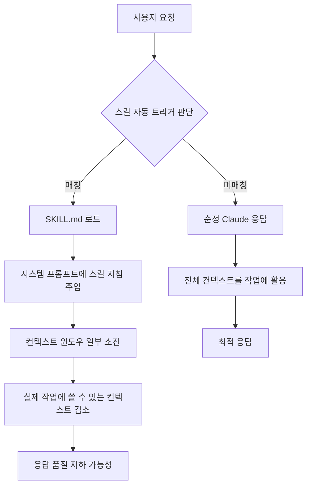
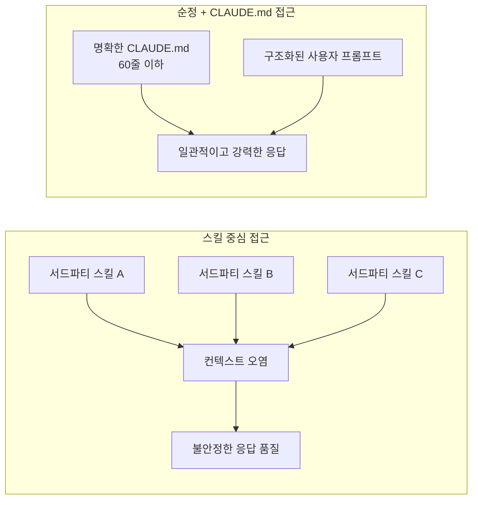
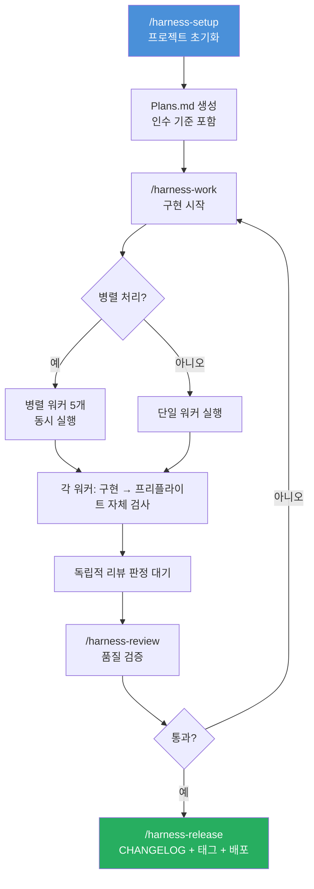
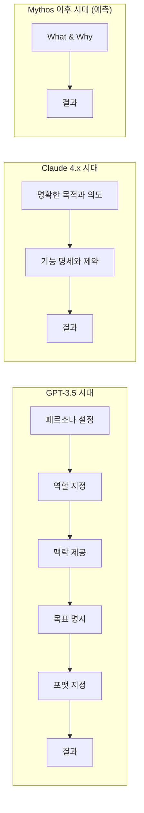
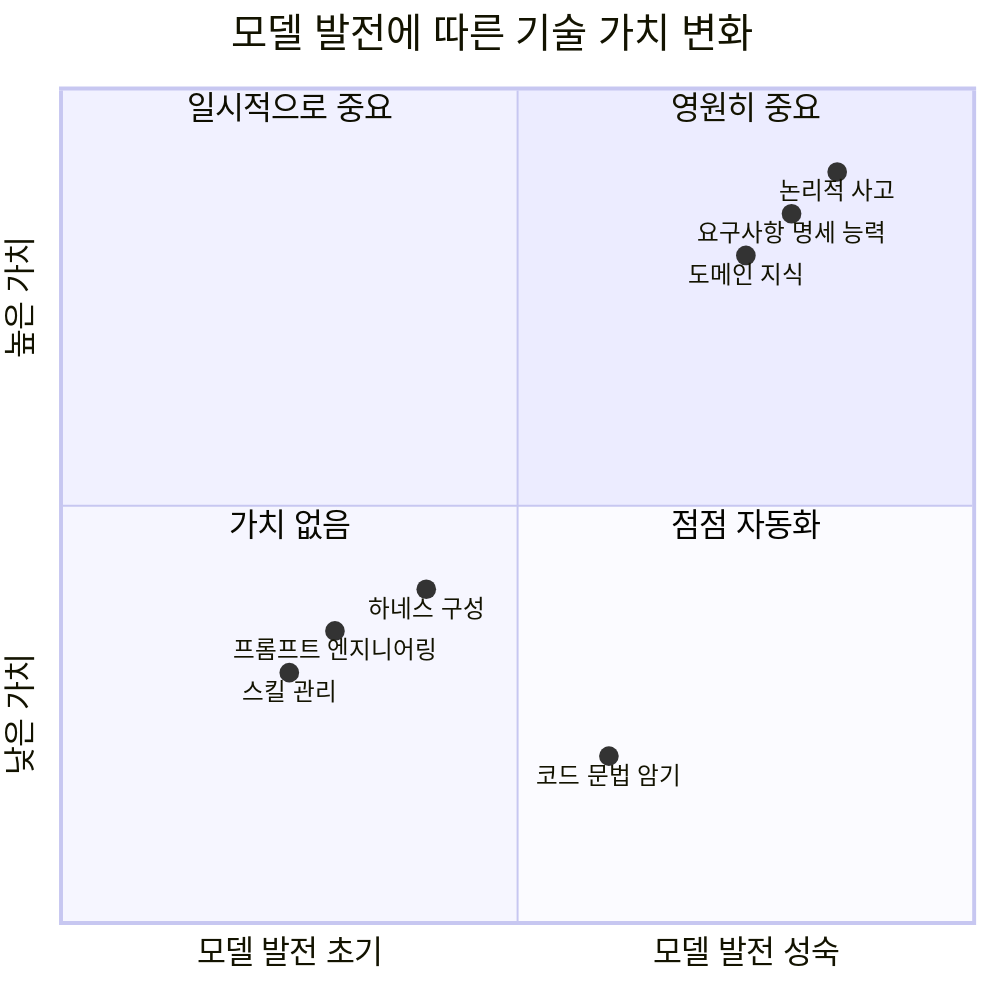
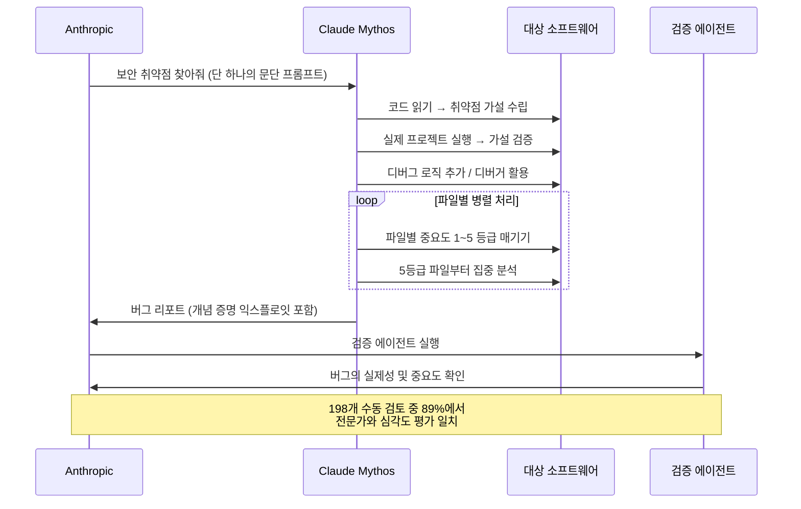
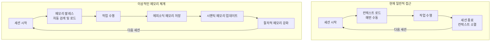
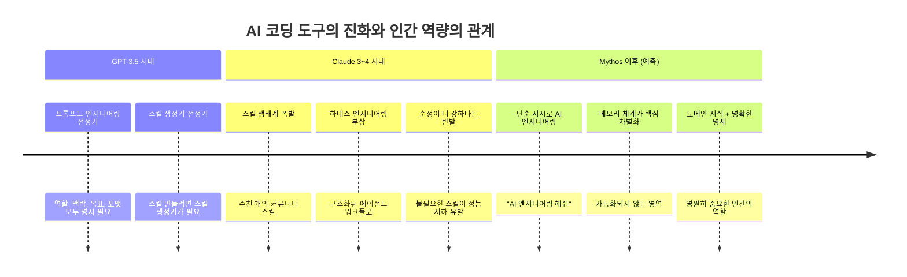

> **원문 출처**: [Facebook 게시물 (2026년 4월)](https://www.facebook.com/share/p/1NtBZsUKXC/)  
> **핵심 주제**: Claude Code 스킬 생태계의 함정, 순정(Vanilla) Claude의 재발견, 하네스 엔지니어링의 미래, Claude Mythos의 등장  
> **작성 기준**: 2026년 4월 12일 기준 최신 정보 반영

---

## 목차

1. [이 글의 핵심 주장 요약](#1-이-글의-핵심-주장-요약)
2. [스킬(SKILL.md) 생태계란 무엇인가](#2-스킬skillmd-생태계란-무엇인가)
3. [서드파티 스킬의 함정 — 왜 삭제했더니 더 똑똑해졌나](#3-서드파티-스킬의-함정--왜-삭제했더니-더-똑똑해졌나)
4. [슈퍼파워즈(Superpowers)란 무엇인가](#4-슈퍼파워즈superpowers란-무엇인가)
5. [하네스(Harness) 엔지니어링의 현재와 미래](#5-하네스harness-엔지니어링의-현재와-미래)
6. [프롬프팅 스킬의 역설적 쇠퇴와 영원한 것](#6-프롬프팅-스킬의-역설적-쇠퇴와-영원한-것)
7. [Claude Mythos — 공개조차 못 하는 모델의 등장](#7-claude-mythos--공개조차-못-하는-모델의-등장)
8. [모델 진화 속에서 개발자로 살아남는 법](#8-모델-진화-속에서-개발자로-살아남는-법)
9. [메모리 체계 설계라는 새로운 프런티어](#9-메모리-체계-설계라는-새로운-프런티어)
10. [종합: 바이브코딩 시대의 진짜 실력이란 무엇인가](#10-종합-바이브코딩-시대의-진짜-실력이란-무엇인가)

---

## 1. 이 글의 핵심 주장 요약

이 페이스북 게시물은 Claude Code를 집중적으로 사용하는 한 시니어 개발자가 작성한 실전 회고이자 철학적 에세이다. 내용을 압축하면 다음 다섯 가지로 요약된다.

**① 서드파티 스킬은 오히려 Claude의 성능을 저하시킨다.**  
슈퍼파워즈 브레인스토밍 스킬을 삭제했더니 Claude의 성능이 "대폭 향상"됐다는 직접 경험이 출발점이다.

**② 스킬, 커맨드, 에이전트, 훅, 크론잡, 파이프라인 — 이 개념들을 직접 이해하고 써야 한다.**  
이해 없이 남의 스킬을 무분별하게 설치하는 것은, 특히 IT 배경 없이 "그냥 작동하는 소프트웨어"를 원하는 사람들의 방식이다.

**③ 모델이 발전할수록 외부 스킬과 프롬프팅 테크닉의 가치는 줄어든다.**  
GPT-3.5 시절엔 페르소나, 역할, 맥락을 다 설정해야 했지만, 지금은 "명확한 의도와 요구사항"이 훨씬 강력하다.

**④ 끝까지 중요한 것은 "논리적·구조적으로 명확한 요구사항을 전달하는 능력"이다.**  
이것은 모델이 아무리 발전해도 인간이 담당해야 할 역할이다.

**⑤ Claude Mythos가 오고 있다.**  
빅테크 기업에만 선별 공개되고, 리눅스 수십 년치 보안 버그를 찾아낼 만큼 강력하다. 또 한 번의 패러다임 전환이 임박했다.

---

## 2. 스킬(SKILL.md) 생태계란 무엇인가

### 스킬의 정의

Claude Code에서 스킬(Skill)이란, AI 코딩 에이전트에게 특정 도메인 전문성을 부여하는 **모듈형 지침 패키지**다. 각 스킬은 다음으로 구성된다.

- **SKILL.md**: 스킬의 이름, 목적, 실행 로직을 정의하는 마크다운 파일 (YAML 프런트매터 포함)
- **scripts/**: 스킬이 호출하는 스크립트 모음
- **references/**: 도메인별 지식, 템플릿, 체크리스트
- **assets/**: 기타 보조 파일

공식 Anthropic 문서에 따르면, SKILL.md는 두 부분으로 구성된다. `---` 마커 사이의 YAML 프런트매터에는 스킬명(`name`)과 설명(`description`)을 정의하고, 그 아래 마크다운 본문에 Claude가 따를 실제 지침을 작성한다. `description` 필드는 Claude가 해당 스킬을 언제 자동 로드할지 판단하는 핵심 기준이다.

스킬은 두 가지 방식으로 호출된다.

- **명시적 호출**: `/skill-name` 슬래시 커맨드
- **자동 트리거**: Claude가 사용자의 요청이 스킬의 description과 매칭된다고 판단할 때 자동으로 로드

이 "자동 트리거" 메커니즘이 바로 이 글의 핵심 문제의 씨앗이다.

### 스킬 생태계의 현재 규모

2026년 3월 기준, Claude Code 스킬 생태계는 다음과 같이 성장했다.

- **공식 Anthropic 스킬**: `simplify`, `explain-code`, `create-pr` 등 소수의 검증된 스킬
- **검증된 서드파티 스킬**: 플러그인 마켓플레이스를 통해 배포
- **커뮤니티 스킬**: 수천 개 이상, 품질 편차 극심

주요 오픈소스 스킬 저장소로는 232개 이상의 스킬을 포함한 `alirezarezvani/claude-skills` (GitHub 5,200+ stars)와, 1,234개 이상의 스킬을 포함한 Antigravity Awesome Skills (GitHub 22,000+ stars) 등이 있다.

### 스킬이 시스템 프롬프트에 미치는 영향

이것이 이 글의 기술적 핵심이다. 스킬 — 특히 자동 트리거가 설정된 스킬 — 은 Claude의 컨텍스트 윈도우에 **추가적인 지침과 토큰**을 주입한다. MCP 서버도 마찬가지다. 툴 설명, 인자 정보, 동작 지침이 모두 시스템 프롬프트에 자동으로 삽입되어 컨텍스트를 잠식한다.



스킬이 많을수록, 그리고 자동 트리거 조건이 넓게 설정될수록 이 문제는 심화된다. 특히 브레인스토밍 스킬처럼 **광범위한 상황에서 트리거되도록 설계된 스킬**은, 실제로 브레인스토밍이 필요하지 않은 상황에서도 지속적으로 로드되어 성능을 갉아먹는다.

---

## 3. 서드파티 스킬의 함정 — 왜 삭제했더니 더 똑똑해졌나

### 실전 경험의 핵심

게시물 작성자는 슈퍼파워즈 브레인스토밍 스킬을 "자동으로 불러와져서 무심코 계속 썼는데, 삭제 시켰더니 클로드 성능이 대폭 향상됐습니다"라고 서술한다. 이 경험은 단순한 개인적 일화가 아니다. 스킬 생태계에 대한 심층 분석가들도 같은 결론에 도달하고 있다.

스킬 200개 이상을 2주간 직접 설치·테스트·벤치마킹한 한 분석가는 이렇게 결론 냈다.

> "대부분의 공개 스킬들은 도움이 되지 않는 것에 그치지 않는다. 이들은 **적극적으로 해를 끼친다** — 토큰을 추가하고, 레이턴시를 높이고, 출력을 더 좁게 만드는 제약을 주입한다. 대부분의 스킬은 자신이 자동화하려는 작업을 한 번도 제대로 해본 적 없는 사람들이 작성했다."

같은 분석에서 지적된 구체적 사례들은 충격적이다. "CFO 리뷰" 스킬을 만든 사람은 EBITDA를 제대로 이해하지 못했고, "시니어 프로덕트 매니저" 스킬에는 단 하나의 우선순위 책정 프레임워크도 없었으며, "UX 리서처" 스킬은 스크리너 설문에 대한 개념조차 없었다.

### 왜 순정(Vanilla) Claude가 강력한가

모델 자체의 능력이 고도화되면서, 스킬이 제공하던 "전문성 레이어"의 가치가 상대적으로 줄어들었다. 특히 Claude Sonnet 4.6, Opus 4.6 급의 모델은 적절히 구조화된 프롬프트 하나만으로도 스킬이 제공하던 지식을 훨씬 유연하게 적용할 수 있다.

더 중요한 것은 **컨텍스트 효율성**이다. 스킬이 없을 때 Claude는 전체 컨텍스트 윈도우를 사용자의 실제 요청에 온전히 사용할 수 있다. 반면 불필요한 스킬이 로드될 때, 그 스킬의 지침이 컨텍스트를 잠식하며 정작 중요한 작업 맥락을 밀어낸다.

### CLAUDE.md가 더 나은 이유

HumanLayer의 엔지니어링 팀은 이 문제를 실무에서 직접 검증했다.

> "CLAUDE.md는 더 단순하고, 항상 로드되며, 트리거 신뢰성 문제가 없고, 반복하기 더 쉽다. 스킬은 모듈성에서 이긴다. 그러나 좋은 시스템 프롬프트보다 확실한 업그레이드라고 말하는 사람은 무언가를 팔고 있는 것이다."

그들의 CLAUDE.md는 60줄 이하다. 그리고 그것으로 충분히 강력한 에이전트 워크플로를 운용한다.



---

## 4. 슈퍼파워즈(Superpowers)란 무엇인가

### 개요

슈퍼파워즈(Superpowers)는 `obra/superpowers-marketplace`를 통해 배포되는 종합 에이전트 소프트웨어 개발 워크플로 스킬 패키지다. Claude Code 플러그인 마켓플레이스를 통해 설치 가능하다.

```
/plugin marketplace add obra/superpowers-marketplace
/plugin install superpowers@superpowers-marketplace
```

슈퍼파워즈가 구현하는 워크플로는 다음과 같다.

1. **brainstorm** (브레인스토밍): 소크라테스식 질문을 통해 거친 아이디어를 정제하고, 설계 문서를 저장
2. **design spec** (설계 명세): 구현 전 설계를 문서화
3. **implementation plan** (구현 계획): 단계별 실행 계획 수립
4. **subagent-driven execution** (서브에이전트 실행): 병렬 서브에이전트가 실제 코드 작성
5. **review** (검토): 코드 품질 검토
6. **merge** (병합): 최종 결과물 통합

### 왜 문제가 되는가

슈퍼파워즈의 브레인스토밍 스킬은 넓은 범위의 트리거 조건을 가진다. 사용자가 새로운 작업을 시작할 때, 새 파일을 만들 때, 아이디어를 물어볼 때 — 거의 모든 상황에서 "브레인스토밍이 필요하다"고 판단하고 자동 로드된다.

문제는 이 스킬이 제공하는 소크라테스식 질문 루프가 **사용자가 이미 명확한 요구사항을 가지고 있을 때도 작동**한다는 점이다. 작성자는 "요청사항 프롬프팅은 매우 길고, 구조화 되어 있습니다"라고 밝힌다. 이처럼 이미 명확한 요구사항을 가진 시니어 사용자에게, 브레인스토밍 스킬은 불필요한 대화 단계를 강제하고 컨텍스트를 낭비한다.

이것은 슈퍼파워즈가 나쁜 도구라는 뜻이 아니다. **기획 역량이 부족한 사용자에게는 매우 유용**하다. 그러나 이미 구조화된 사고를 하는 개발자에게는 오히려 걸림돌이 된다.

---

## 5. 하네스(Harness) 엔지니어링의 현재와 미래

### 하네스란 무엇인가

하네스(Harness)는 AI 코딩 에이전트의 실행 환경을 구조화하는 프레임워크다. 단순한 스킬 묶음이 아니라, 에이전트가 어떻게 **계획하고(Plan) → 실행하고(Work) → 검토하고(Review) → 배포하는(Release)** 전 과정을 제어하는 시스템이다.

대표적인 구현체로는 `Chachamaru127/claude-code-harness`가 있다. 이 하네스는 다음 구조를 가진다.



TypeScript 가드레일 엔진(R01~R13 규칙)이 런타임에서 다음을 차단한다.

- 파괴적 쓰기(destructive writes)
- 시크릿 노출
- 강제 푸시(force-push) 패턴

### 하네스도 스킬과 같은 운명을 걷는가

게시물 작성자는 이렇게 예측한다: "하네스도 그 길을 가리라 봅니다."

이것은 단순한 추측이 아니다. HumanLayer의 엔지니어링 블로그는 이 역설을 "하네스 과적합(harness overfitting)" 문제로 정리했다.

> "프런티어 코딩 모델들은 자신들의 하네스에 맞춰 포스트 트레이닝된다 (예: Claude in Claude Code, GPT-5 Codex in Codex). 어떤 이들은 최선의 하네스가 모델이 훈련된 하네스라고 주장한다. 그러나 양날의 검이다: **모델은 자신의 하네스에 과적합될 수 있다.**"

즉, 정교하게 설계된 하네스가 오히려 모델의 자연스러운 추론 능력을 제약할 수 있다는 것이다. 이 문제는 모델이 발전할수록 더 두드러진다.

Everything Claude Code(ECC) 사례가 이를 잘 보여준다. 82,000+ GitHub stars를 가진 이 하네스 프레임워크에 대한 Reddit 커뮤니티의 가장 일반적인 비판은 이것이다.

> "대부분의 사람들은 그냥 좋은 CLAUDE.md가 필요한 것이지, 전체 생태계가 필요한 게 아니다."

### 하네스 이후: "AI 엔지니어링 해줘"의 시대

작성자는 이런 트렌드의 종착점을 이렇게 예측한다.

> "그냥 내 명확한 목적과 의도를 말하고, 기능 명세와 제약사항을 말하고, 하네스 엔지니어링 관점에서 설계해줘. 라고 하는 것이 더 나은 결과가 나올겁니다."

그리고 그 다음 단계는 "AI 엔지니어링 해줘"가 될 것이라고 전망한다. 이것은 단순한 구호가 아니다. 모델이 충분히 강력해졌을 때, 사용자가 해야 할 일은 **'무엇을(What)'과 '왜(Why)'를 명확하게 말하는 것**이고, '어떻게(How)'는 점점 모델이 담당하게 된다.



---

## 6. 프롬프팅 스킬의 역설적 쇠퇴와 영원한 것

### 프롬프팅 기술의 역사

GPT-3.5가 처음 등장했을 때, 프롬프트 엔지니어링은 하나의 전문 직업으로 여겨졌다. "역할, 맥락, 목표, 포맷"을 정교하게 설계해야만 유용한 출력을 얻을 수 있었다. 그러나 모델이 발전하면서 이 기술들의 가치는 점차 감소했다.

마찬가지로, 스킬 생성기를 다운로드해서 스킬을 만들던 시절이 있었다. 이제는 그냥 "스킬 만들어줘"라고 하면 Claude가 잘 만들어준다. 스킬 생성 능력 자체가 모델에 내재화된 것이다.

### 그럼에도 영원히 중요한 것

작성자는 이 점을 날카롭게 지적한다.

> "'논리적 사고' 그 자체는 영원히 중요하지만, LLM 자체를 다루는 프롬프팅 스킬은 덜 중요해지는 것처럼"

모델이 발전해도 끝까지 중요한 것은 결국 하나다.

**"명확한 요구사항을 논리적으로, 구조적으로 전달하는 능력"**

이것은 소프트웨어 엔지니어링의 근본이다. 요구사항 분석, 기능 명세, 제약사항 정의 — 이것들은 AI가 아무리 발전해도 인간이 먼저 해야 하는 작업이다. AI는 명세를 받아서 구현할 수 있지만, 명세 자체를 사용자를 대신해서 생성할 수는 없다. (혹은, 생성하더라도 그 명세가 사용자의 실제 의도를 반영하는지 검증하는 것은 여전히 인간의 몫이다.)



### 파운데이션 연구자가 아닌 이상

작성자의 조언은 명확하다.

> "모델이 발전할수록 자동적으로 해결되는 것에 너무 큰 에너지를 쓰지 않는 것이 좋지 않을까 합니다. 파운데이션 분야 순수 연구자가 아닌 이상."

이것은 실용적인 조언이다. 새로운 스킬 생태계, 새로운 하네스 프레임워크, 새로운 프롬프팅 기법이 매주 등장한다. 이 모든 것을 쫓아다니는 것은 에너지 낭비다. 모델이 발전하면 자연스럽게 해결될 문제들이기 때문이다.

대신, 모델이 발전해도 해결되지 않는 것들 — 도메인 지식, 시스템 아키텍처 이해, 명확한 요구사항 정의 능력 — 에 에너지를 집중하는 것이 장기적으로 더 가치 있다.

---

## 7. Claude Mythos — 공개조차 못 하는 모델의 등장

### 데이터 유출로 세상에 드러나다

Claude Mythos의 존재는 처음에 Anthropic의 데이터 유출로 세상에 알려졌다. 2026년 3월 26일, Fortune은 Anthropic의 공개 접근 가능한 데이터 캐시에서 Claude Mythos에 대한 초안 블로그 포스트를 발견했다. 이 문서는 Mythos를 "지금까지 개발한 가장 강력한 AI 모델"이라고 설명했으며, "전례 없는 사이버보안 위험을 야기한다"고 밝혔다.

Anthropic은 이를 확인하며 이렇게 밝혔다.

> "우리는 추론, 코딩, 사이버보안에서 의미 있는 발전을 이룬 범용 모델을 개발하고 있습니다. 그 능력의 강도를 고려하여, 우리는 릴리스 방식에 신중을 기하고 있습니다. 이 모델은 큰 변화(step change)이며, 지금까지 우리가 만든 가장 강력한 모델입니다."

내부 문서에는 "Capybara"라는 코드명도 등장했다. 이 모델은 기존 Opus 등급보다 더 크고 강력한 새로운 계층의 모델로, Opus 4.6과의 비교에서 소프트웨어 코딩, 학술적 추론, 사이버보안 테스트에서 "극적으로 높은 점수"를 기록했다.

### Project Glasswing — 선별 공개의 이유

2026년 4월 7일, Anthropic은 공식적으로 Claude Mythos Preview를 발표하며 **Project Glasswing**을 론칭했다. 그러나 일반 공개는 없었다. 대신:

- Amazon, Google, Apple, Microsoft, Nvidia, Cisco 등 50개 이상의 기술 기업에 선별 제공
- 1억 달러 이상의 사용 크레딧 제공
- Google Cloud Vertex AI를 통해 특정 고객에게 Private Preview 형태로 제공
- CrowdStrike, 기타 보안 기업들이 창립 파트너로 참여

이것은 거의 7년 만에 처음으로 선도적인 AI 기업이 안전 우려를 이유로 모델 공개를 공개적으로 보류한 사례다. 2019년 OpenAI가 GPT-2를 보류한 이후 처음이다.

### 기술적 능력: 무엇을 할 수 있는가

Anthropic의 Frontier Red Team 블로그에 공개된 기술 세부사항은 충격적이다.

**발견된 취약점의 규모:**
모든 주요 운영체제와 모든 주요 웹 브라우저에서 수천 개의 제로데이(Zero-day) 취약점을 발견했다. 이들 중 다수는 이미 패치되었다. 특히 주목할 만한 사례는 다음과 같다.

- OpenBSD(세계에서 가장 보안이 강화된 OS 중 하나로 알려진)에서 **27년된 취약점** 발견
- 수십 년간의 인간 리뷰와 수백만 번의 자동화 보안 테스트를 통과했던 취약점들

**작동 방식:**



**성능 지표:**
- 전문 보안 전문가들이 수행할 수 있는 취약점 발견 작업을 거의 완전 자율적으로 수행
- 인간의 조종 없이 단독으로 대부분의 취약점 발견 및 익스플로잇 개발
- CyberGym 평가 벤치마크에서 차세대 최고 모델인 Claude Opus 4.6 대비 현저한 성능 차이

### 보안 커뮤니티의 반응

이 발표는 즉각적인 파장을 일으켰다. 캐나다 금융 시스템 복원력 그룹(CFRG)은 미팅을 "앞당겨" 이 위협을 논의했으며, 미국에서도 재무장관 주재 하에 주요 은행 CEO들과 긴급 회의가 열렸다.

보안 전문가 Claudiu Popa는 이렇게 평가했다.

> "이것이 어느 정도는 과장이고, 어느 정도는 마케팅 전략이라는 말도 맞습니다. 그러나 우리는 분명히 이 도구의 능력을 인정해야 하며, AI들이 인터넷을 뒤지며 취약점을 찾는 시대를 준비해야 합니다."

Tom's Hardware는 다른 시각을 제시했다. 발표된 수천 개의 취약점 중 수동 검토를 거친 것은 198개에 불과하며, 많은 취약점이 오래된 소프트웨어나 실제 악용이 불가능한 것들이라고 지적했다.

게시물 작성자가 언급한 "리눅스 수십 년 동안 커널 보안 버그도 찾았다"는 내용은 이런 맥락의 27년된 OpenBSD 취약점 발견에 해당한다.

### 게시물 작성자의 통찰

작성자는 "빅테크 회사에게만 특정 모델을 열어주고 보안 점검을 먼저 진행한다"는 점에 주목한다. 이것이 의미하는 바는 무엇인가.

모델의 능력이 공개적으로 배포하기에는 너무 강력한 수준에 도달했다는 것이다. 이것은 AI 발전의 중요한 임계점이다. 모델이 일부 인간 전문가를 능가하는 특정 영역이 나타나기 시작했다는 신호이며, 이에 따라 배포 방식도 근본적으로 달라진다.

---

## 8. 모델 진화 속에서 개발자로 살아남는 법

### 두 종류의 개발자

게시물은 묵시적으로 두 종류의 AI 시대 개발자를 대비시킨다.

**유형 A — 도구 추종형:**
새로운 스킬, 새로운 하네스, 새로운 프롬프팅 기법이 나올 때마다 쫓아다닌다. 현재의 최적화에 과도한 에너지를 쏟는다. 그러나 모델이 발전하면 이 모든 것이 무용지물이 된다.

**유형 B — 역량 심화형:**
특정 시스템(Claude Code, Codex, OMO 중 하나)의 구조를 끝까지 파고든다. 그리고 그 위에서 모델이 아직 해결하지 못한 문제 — 예: 메모리 체계 설계 — 를 직접 공략한다.

작성자의 권고는 명확하다. 유형 B가 되어라.

### 하나를 잡고 깊게 파라

> "클로드든, 코덱스든, OMO든 하나를 잡고 그 구조의 시스템을 끝까지 파고 들어서, 비어있는 메모리 체계를 설계한다거나 하는게 더 중요할지 모르겠네요."

이것은 특정 플랫폼의 공식 문서, 소스 코드 구조, 에이전트 실행 원리를 깊이 이해하는 것을 의미한다. 예를 들어 Claude Code를 선택했다면:

- `.claude/` 폴더 구조 완전 이해
- 스킬, 커맨드, 서브에이전트, 훅의 실행 메커니즘
- CLAUDE.md가 시스템 프롬프트에 어떻게 반영되는지
- 컨텍스트 윈도우 관리 전략
- MCP 서버가 툴 설명을 통해 동작을 제어하는 방식

이 깊은 이해 위에서만, "비어있는 메모리 체계"처럼 모델이 아직 자동으로 해결해주지 않는 문제들을 직접 설계할 수 있다.

### Claude를 지켜보는 것도 중요하다

작성자의 또 다른 실용적 조언이다.

> "클로드가 뭐하고 있나 쳐다보는 것도 중요합니다."

이것은 AI에 맹목적으로 작업을 위임하는 것이 아니라, 에이전트의 행동 패턴, 결정 과정, 실수 유형을 직접 관찰하고 이해해야 한다는 뜻이다. 이 관찰이 쌓이면, 언제 개입해야 하는지, 어떤 요청이 효과적인지, 어떤 패턴이 문제를 일으키는지를 직관적으로 알게 된다.

---

## 9. 메모리 체계 설계라는 새로운 프런티어

### 현재 AI의 구조적 한계

현재의 LLM은 대화가 끝나면 모든 것을 잊어버린다. 컨텍스트 윈도우 내의 정보만이 "기억"이다. 이것은 에이전트 워크플로에서 근본적인 제약이 된다. 복잡한 프로젝트를 여러 세션에 걸쳐 진행할 때, 매번 컨텍스트를 재구성해야 하는 비용이 발생한다.

### 비어있는 공간으로서의 메모리

게시물 작성자는 "비어있는 메모리 체계"라는 표현을 쓴다. 이것은 현재 AI 에이전트 생태계에서 아직 충분히 해결되지 않은 영역이다. 단순한 대화 기록 저장이 아니라, 다음을 포함하는 체계적인 메모리 아키텍처다.

- **에피소딕 메모리**: 특정 작업 세션의 경험과 결과
- **시맨틱 메모리**: 도메인 지식과 패턴
- **절차적 메모리**: 효과적인 워크플로와 루틴
- **작업 기억(Working Memory)**: 현재 진행 중인 작업의 상태

이 중 어떤 정보를 언제 어떤 형태로 저장하고 검색할지를 설계하는 것은 순수한 엔지니어링 문제다. 모델이 아무리 강력해져도, 이 설계를 자동으로 해줄 수는 없다. 설계자의 도메인 지식과 시스템 아키텍처 이해가 필요하기 때문이다.



작성자가 MemPalace 프로젝트와 AIOS 프로젝트에서 탐구하는 것이 바로 이 영역이다. 이것은 "모델이 발전해도 자동으로 해결되지 않는" 문제이기 때문에, 지금 투자할 가치가 있다.

---

## 10. 종합: 바이브코딩 시대의 진짜 실력이란 무엇인가

### 게시물이 말하는 것들을 연결하면

이 게시물은 하나의 일관된 철학을 말한다. 도구는 변하지만, 사람의 역량은 축적된다. 모델이 발전할수록 도구의 가치는 줄어들고 사람의 근본 역량의 가치는 높아진다.



### 실용적 결론

이 게시물에서 끌어낼 수 있는 실용적 결론은 다음과 같다.

**지금 당장 할 것:**
1. 설치된 서드파티 스킬들을 검토하고, 실제로 사용하는 것만 남기고 삭제한다
2. 특히 광범위하게 자동 트리거되는 스킬들을 우선 제거한다
3. CLAUDE.md를 간결하고 명확하게 작성한다
4. Claude가 작업하는 것을 직접 관찰하고, 어떤 패턴에서 실수가 발생하는지 파악한다

**중기적으로 할 것:**
5. 사용하는 AI 코딩 도구(Claude Code, Codex 등) 중 하나를 선택하여 깊이 이해한다
6. 스킬, 커맨드, 에이전트, 훅, 크론잡, 파이프라인의 실제 작동 원리를 공부한다
7. 요구사항을 논리적, 구조적으로 정의하는 능력을 지속적으로 훈련한다

**장기적으로 할 것:**
8. 모델이 자동으로 해결해주지 않는 영역(메모리 체계, 도메인 지식, 시스템 아키텍처)에 투자한다
9. Claude Mythos와 같은 새로운 모델이 가져올 패러다임 전환을 준비한다
10. 순수 연구자가 아니라면, 빠르게 자동화될 기술보다 "영원히 중요한 것"에 집중한다

### 마지막으로

게시물 작성자의 핵심 메시지를 한 문장으로 압축하면 이것이다.

> **도구를 소비하는 사람이 되지 말고, 도구를 이해하는 사람이 되어라. 그리고 모델이 발전할수록 당신이 해야 할 일은 더 명확해진다 — 당신이 무엇을 원하는지, 왜 원하는지를 정확하게 말하는 것.**

Claude Mythos가 오고 있다. 그리고 그것이 오면, 많은 것들이 또 한 번 자동화될 것이다. 그때 살아남는 사람은, 지금 스킬과 하네스를 가장 많이 설치한 사람이 아니라, 가장 명확하게 생각하고 가장 구조적으로 요구사항을 전달할 수 있는 사람일 것이다.

---

*작성일: 2026년 4월 12일*  
*참고: Anthropic 공식 블로그 (red.anthropic.com), Project Glasswing 발표, Claude Code 공식 문서 (code.claude.com), HumanLayer Engineering Blog, Fortune, NBC News, BNN Bloomberg*
