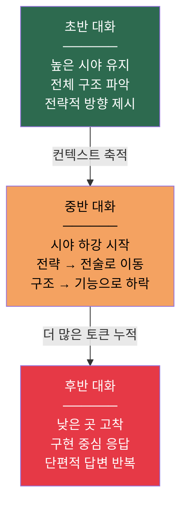
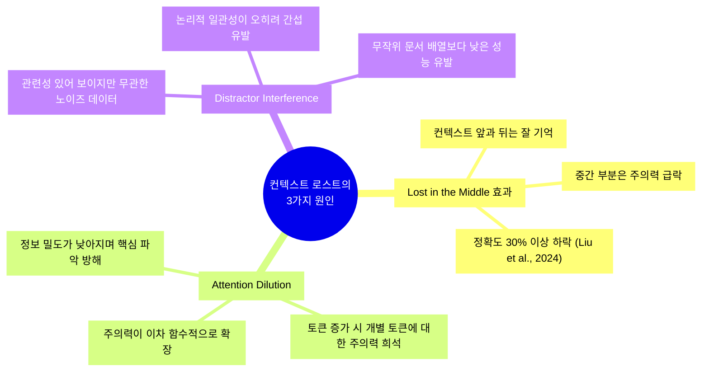
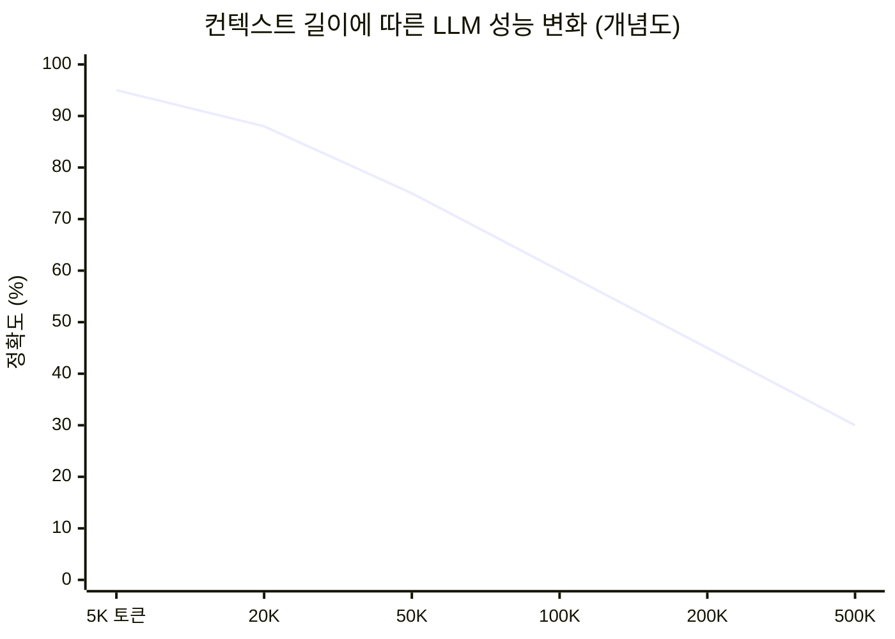
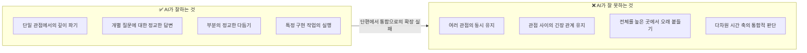
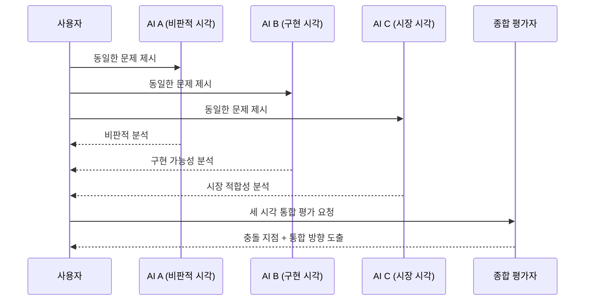
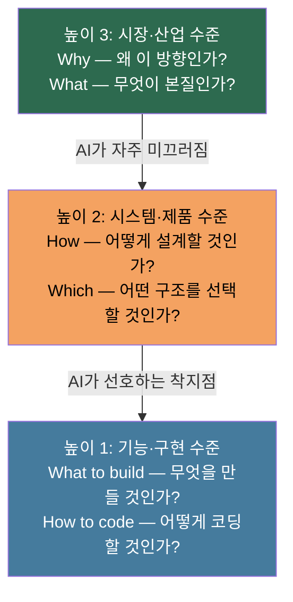
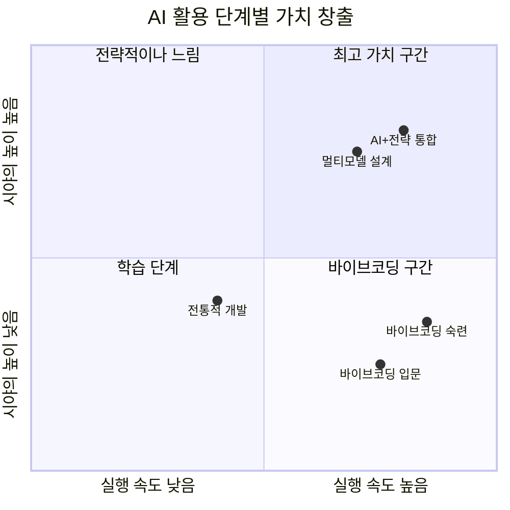
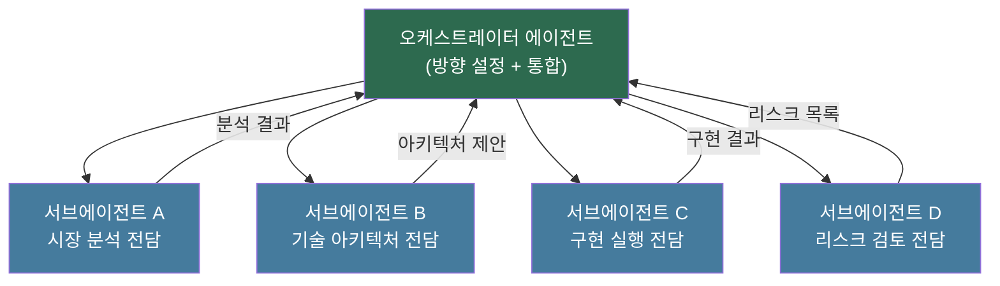
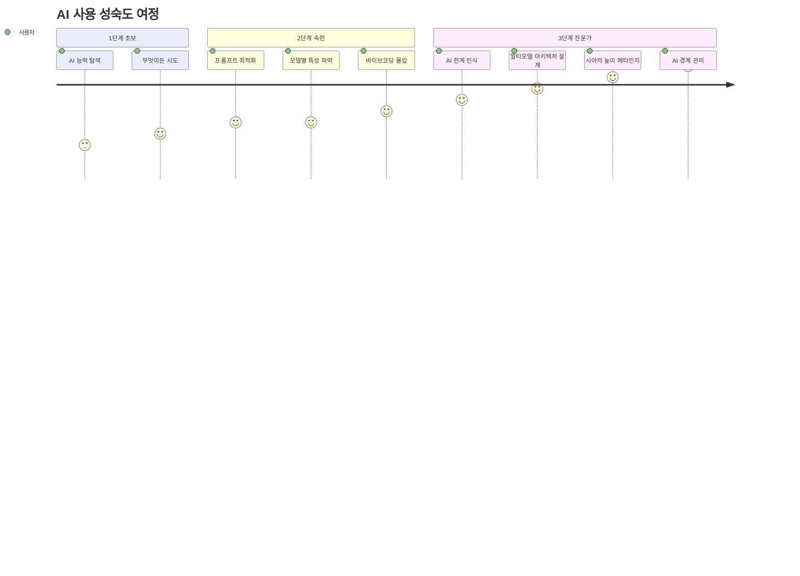

### ZeroInput 브런치 에세이 상세 분석 리포트
> 원문: [ZeroInput — AI 시대의 경계에서 : 시즌 2 / 05화](https://brunch.co.kr/@955079bf143b468/11) | 발행일: 2026년 4월 6일

---

## 목차

1. [글의 배경과 저자 소개](#1-글의-배경과-저자-소개)
2. [핵심 명제: AI와의 대화는 왜 길어질수록 나빠지는가](#2-핵심-명제-ai와의-대화는-왜-길어질수록-나빠지는가)
3. [컨텍스트 로트(Context Rot) — 현상의 기술적 실체](#3-컨텍스트-로트context-rot--현상의-기술적-실체)
4. [ERP 실패가 가르쳐준 것 — 실전 경험의 무게](#4-erp-실패가-가르쳐준-것--실전-경험의-무게)
5. [AI의 두 가지 수준: 부분 vs. 전체](#5-ai의-두-가지-수준-부분-vs-전체)
6. [저자의 해결책: 난상토론 구조](#6-저자의-해결책-난상토론-구조)
7. [모델별 결의 차이 — Claude, Gemini, GPT](#7-모델별-결의-차이--claude-gemini-gpt)
8. [시야의 높이 — 메타인지로서의 AI 사용 능력](#8-시야의-높이--메타인지로서의-ai-사용-능력)
9. [바이브코딩의 쾌감과 그 너머](#9-바이브코딩의-쾌감과-그-너머)
10. [글의 결론: AI의 능력이 아닌 AI의 경계를 배운다](#10-글의-결론-ai의-능력이-아닌-ai의-경계를-배운다)
11. [최신 연구와의 접점 — 2025~2026 학술/산업 맥락](#11-최신-연구와의-접점--20252026-학술산업-맥락)
12. [종합 평가 및 시사점](#12-종합-평가-및-시사점)

---

## 1. 글의 배경과 저자 소개

이 글은 **ZeroInput**이라는 필명으로 활동하는 저자가 브런치(Brunch) 플랫폼에 연재 중인 "AI 시대의 경계에서: 시즌 2"의 다섯 번째 화로, 2026년 4월 6일에 게재되었다. 연재 전체를 관통하는 테마는 AI 도구를 단순한 자동화 수단으로 보지 않고, **1년 이상 직접 부딪혀가며 AI와 함께 실제 제품을 만든 사람의 시각**에서 그 가능성과 한계를 정직하게 기록하는 것이다.

저자는 시즌 1부터 이어지는 긴 연재를 통해 다음과 같은 경험을 축적해 왔다.

- **1편**: AI를 활용한 ERP 개발 8개월의 여정과 실패
- **5편**: 바이브코딩(Vibe Coding)의 쾌감과 그 본질
- **6편**: 모델마다 다른 결(Texture)을 체득하고 "쓰는 법"을 익히는 과정
- **7편**: AI와의 협업에서 필요한 "방향감각"
- **8편**: 단일 AI의 한계를 돌파하기 위해 설계한 "난상토론" 구조

이번 15화는 이러한 모든 경험의 **증류**이자, AI와 장기간 일한 사람이 결국 어디에 도달하는지를 보여주는 글이다. 핵심 화두는 단순하다. AI를 오래 쓸수록 보이게 되는 것은 AI의 능력이 아니라 **AI의 경계**라는 것이다.

---

## 2. 핵심 명제: AI와의 대화는 왜 길어질수록 나빠지는가

저자는 글의 서두에서 매우 구체적인 체험 패턴을 묘사한다. 새 모델이 출시될 때마다 처음 며칠간은 분명히 전 세대보다 우수하다는 것이 느껴진다. 코딩뿐만 아니라 분석, 글쓰기, 시스템 구조 설계 등 전 영역에서 레벨이 올라갔다는 감각이 온다. 이것은 단순한 착각이 아니다. 실제로 새 모델은 더 강력하고, 초반 인상은 사실에 기반한다.

그런데 **대화가 길어지면 달라진다.** 이 지점이 글의 출발점이다.

저자가 묘사하는 변화는 다음과 같다.

- 처음에는 전체 구조와 방향을 함께 보는 것처럼 말하던 AI가
- 컨텍스트가 쌓이면서 점점 **"낮은 곳"으로 내려온다**
- 구조를 질문하면 기능 목록을 돌려준다
- 방향을 물으면 구현 순서를 답한다
- 원거리 시야를 원하는데 AI는 **당장 만들 수 있는 것으로만 좁혀온다**

이 현상을 저자는 "컨텍스트가 쌓이면서 점점 낮은 곳으로 내려오는" 것으로 표현한다. 마치 높은 곳에서 전체 지형을 보여주던 시선이, 시간이 지날수록 발밑만 보게 되는 것과 같다.

저자가 강조하는 것은 이것이 단순히 **컨텍스트 길이의 기술적 문제**만은 아니라는 점이다. 빅테크들은 이미 이 문제를 인지하고 있다. 그래서 메모리 기능을 추가하고, 컨텍스트 창을 1백만 토큰까지 늘리고, 대화를 압축하는 알고리즘을 개발하고 있다. 하지만 저자의 체험적 통찰은 기술적 확장이 근본적인 문제를 해결하지 못한다는 것이다. 더 깊은 어딘가에 구조적 한계가 있다는 직관이다.

---

## 3. 컨텍스트 로트(Context Rot) — 현상의 기술적 실체

저자의 체험적 통찰을 뒷받침하는 최신 연구들이 2025년부터 본격적으로 발표되기 시작했다. 학계와 산업계는 이 현상에 **"컨텍스트 로트(Context Rot)"** 라는 이름을 붙였다.

### 3.1 컨텍스트 로트란 무엇인가

컨텍스트 로트는 LLM에 입력되는 토큰의 양이 증가할수록 출력 품질이 저하되는 **측정 가능한 현상**이다. 중요한 것은 이것이 컨텍스트 창이 가득 찼을 때 발생하는 문제가 아니라는 점이다. **가득 차기 훨씬 전부터** 품질 저하가 시작된다.

2025년 AI 스타트업 Chroma의 연구팀은 GPT-4.1, Claude Opus 4, Gemini 2.5 Pro 등 18개의 최전선 모델을 대상으로 컨텍스트 로트를 체계적으로 측정했다. 결과는 충격적이었다. <u>테스트한 18개 모델 전부가 예외 없이 입력 길이가 늘어날수록 성능이 저하되었다.</u>

### 3.2 세 가지 핵심 메커니즘

컨텍스트 로트를 유발하는 메커니즘은 세 가지로 정리된다.

**① Lost in the Middle 효과**: Stanford/TACL 2024 Liu et al.의 연구에서 확립된 가장 핵심적인 발견이다. LLM은 컨텍스트의 앞부분과 끝부분에는 강하게 집중하지만, 중간 부분의 토큰들은 사실상 "잊어버린다." 20개 문서를 대상으로 한 질의응답 실험에서 관련 문서가 5번째에서 15번째 위치에 있을 때 정확도는 처음이나 마지막 위치에 있을 때보다 30% 이상 하락했다.

**② 어텐션 희석(Attention Dilution)**: 트랜스포머 모델의 어텐션 메커니즘은 이론적으로 모든 토큰이 모든 토큰에 주의를 기울이는 구조다. 그런데 이 연산의 복잡도는 토큰 수의 제곱에 비례한다. 10만 토큰이 컨텍스트에 있다면 100억 쌍의 관계를 처리해야 한다. 이 과정에서 개별 토큰이 받는 주의력은 필연적으로 희석된다.

**③ 방해 토큰 간섭(Distractor Interference)**: Chroma의 연구에서 발견된 역설적 현상으로, 논리적으로 일관성 있는 문서보다 **무작위로 섞인 문서**에서 모델 성능이 더 좋았다. 논리적 일관성이 오히려 모델의 재귀적 편향(Recency Bias)을 강화하여 후반 내용에만 집중하게 만들기 때문이다.

### 3.3 광고된 창 크기와 실제 유효 창 크기의 괴리

2025년 Norman Paulsen의 연구는 **MECW(Maximum Effective Context Window)** 개념을 도입했다. 이는 모델이 마케팅 스펙상 제시하는 최대 컨텍스트 창이 아니라, 실제로 성능이 유지되는 토큰 상한을 의미한다. 연구 결과, 일부 모델은 복잡한 태스크에서 MECW가 광고 한계치의 **1%에 불과**했다. 즉 100만 토큰 창을 가졌다고 홍보하는 모델이 실제로는 1만 토큰 안팎에서 이미 품질 저하가 시작된다는 뜻이다.

이 연구들은 저자가 체험적으로 묘사한 현상 — "대화가 길어지면 AI가 낮은 곳으로 내려온다" — 을 과학적으로 입증한다. 저자의 직관은 정확했다.

---

## 4. ERP 실패가 가르쳐준 것 — 실전 경험의 무게

저자가 이러한 통찰에 도달한 배경에는 8개월간의 **AI 기반 ERP 개발 및 실패** 경험이 있다. 이 경험은 단순한 기술적 실패가 아니라 AI와 협업하는 방식 자체에 대한 깊은 성찰을 낳은 사건이다.

### 4.1 처음의 낙관

ERP 개발 초기, 저자는 AI에 대해 매우 낙관적이었다. 시장 분석, 기술 선택, 타깃 설정, 피벗 판단 등 의사결정의 모든 단계에서 AI를 적극적으로 활용했다. AI는 묻는 것마다 자세하게 답해주었고, 구조를 잡아주었으며, 근거까지 붙여주었다. 속도가 빠르고 양이 많고 그럴듯했다. 처음에는 "AI가 뭐든 해주는" 느낌이었다.

### 4.2 균열의 발견

그러나 깊이 들어갈수록 균열이 보이기 시작했다. 저자가 묻고 있었던 것과 AI가 답하고 있던 것 사이의 **층위 불일치**가 드러났다.

| 저자의 질문 | AI의 답변 | 문제의 핵심 |
|------------|----------|------------|
| "이 시장에서 우리 제품이 자리 잡으려면 어떤 구조여야 하는가" | "기능 A, B, C를 구현하세요" | 전략적 질문에 전술적 답변 |
| "3년 뒤에도 버틸 수 있는 아키텍처인가" | "현재 트렌드 기준으로는 적합합니다" | 시간적 맥락의 협소화 |
| 여러 시간 축의 동시적 검토 요청 | 각 시점의 단편적 분석 | 다차원 통합 불가 |

저자가 원했던 것은 다차원적 시간 축의 **동시적 통합**이었다. 지금의 선택이 6개월 뒤 확장과 충돌하지 않는지, 시장이 바뀌었을 때 이 구조가 살아남을 수 있는지, 기술적 선택과 비즈니스 선택이 같은 방향을 가리키는지 — 이 모든 것을 **하나의 맥락 안에서 동시에** 보고 싶었다.

AI는 그것을 못 했다.

### 4.3 질문 방식의 개선과 그 한계

처음에 저자는 자신의 질문 방식이 잘못됐다고 생각했다. 그래서 더 길고 자세하게 설명하고, 더 많은 맥락을 붙이고, 핵심을 중간중간 다시 정리해주고, 다른 각도에서 흔들어봤다. 분명히 개선되는 부분도 있었다. 더 정교해지고, 더 오래 버티고, 놓친 부분을 다시 가져오는 순간도 있었다.

하지만 **어떤 높이 이상으로는 올라가지 않는** 천장이 있었다. 더 잘 질문하면 더 잘 답하지만, 특정 수준 이상의 추상화와 통합에서는 반복적으로 단편으로 내려오는 패턴이 반복됐다.

이것이 AI ERP 실패의 구조적 원인 중 하나였다. 제품의 방향 설정과 아키텍처 결정이 실제로는 AI의 단편적 답변에 의존하고 있었고, 그 단편들이 누적되어 전체가 정합성을 잃어갔다.

---

## 5. AI의 두 가지 수준: 부분 vs. 전체

이 글에서 저자가 제시하는 가장 핵심적인 통찰 중 하나는 AI의 능력에 **두 가지 층위**가 있다는 것이다.

저자가 직접 AI에게 "왜 이렇게 단편적으로 답하느냐"고 물었을 때, AI는 학습 데이터의 한계, 컨텍스트 윈도우 안에서의 최적화, 확률 기반 추론의 특성 등을 이야기했다. 기술적으로 틀린 설명은 아니다. 하지만 저자는 그것이 자신이 체감한 현상의 완전한 설명은 아니라고 느꼈다.

저자의 표현을 빌리면: **"AI는 하나의 관점에서 깊이 파는 건 잘한다. 그런데 여러 관점을 동시에 들고 있으면서 그 사이의 긴장을 유지하는 건 잘 못한다."**
 
이것은 매우 중요한 관찰이다. 철학적으로 표현하면, AI는 **분석(Analysis)** 에는 강하지만 **종합(Synthesis)** 에는 약하다. 각 요소를 정교하게 다루는 능력과, 여러 요소가 동시에 작용하는 복잡한 전체를 하나의 틀로 붙드는 능력은 다른 종류의 인지적 과제다. 현재의 LLM 아키텍처는 전자에 훨씬 최적화되어 있다.

---

## 6. 저자의 해결책: 난상토론 구조

이 한계를 돌파하기 위해 저자가 설계한 방법이 **"난상토론" 구조**다. 이것은 저자가 8화에서 상세히 서술한 내용을 이번 글에서 다시 맥락과 함께 언급하는 부분이다.

### 6.1 난상토론 구조의 원리

단일 AI에게 "전지적 시점에서 분석해 줘"라고 요청하는 것은 근본적으로 한계가 있다. AI는 하나의 맥락 안에서 하나의 흐름으로 답한다. 아무리 길고 정교한 답이어도 결국 하나의 시점이다.

이를 해결하는 방법은 **여러 AI가 동일한 문제를 서로 다른 시각에서 동시에 공격하게 만드는 것**이다.

이 구조의 핵심은 **관점 간 충돌이 새로운 시야를 만들어낸다**는 것이다. 단일 AI는 내부적으로 하나의 일관된 답변을 만들어내도록 훈련되어 있기 때문에, 스스로 관점의 긴장을 유지하지 못한다. 그러나 서로 다른 입장으로 설정된 여러 AI 인스턴스가 같은 문제를 공격하면, 그 충돌의 산물로 비로소 단일 AI로는 보이지 않던 것이 보이기 시작한다.

### 6.2 이 구조가 갖는 의미

난상토론 구조는 단순한 프롬프팅 기법이 아니다. 이것은 AI의 구조적 한계를 인간의 아키텍처 설계로 보완하는 **메타 수준의 접근**이다. AI를 더 잘 쓰는 것이 아니라, AI의 한계를 알기 때문에 그 한계를 우회하는 시스템을 설계하는 것이다. 이것이 저자가 "6편에서 쓰는 법을 알게 됐다"고 표현하는 것의 실체다.

---

## 7. 모델별 결의 차이 — Claude, Gemini, GPT

저자는 1년 이상 AI와 집중적으로 일한 경험을 통해 각 모델마다 **고유한 결(Texture)** 이 있다는 것을 체감했다. 이것은 단순한 성능 차이가 아니라, 문제에 접근하는 방식과 강점 영역의 질적 차이다.

저자의 경험적 분류를 정리하면 다음과 같다.

| 모델 | 강점 | 특성 |
|------|------|------|
| **Claude** | 구조 설계, 논리 구성 | 맥락 안에서 일관된 논리 체계를 세우는 데 강함. 추상적 사고의 지속성이 높음 |
| **Gemini** | 광범위 스캔, 패턴 감지 | 넓게 훑으면서 데이터 안의 패턴을 포착하는 데 강함. 방대한 정보의 구조화에 유리 |
| **GPT** | 실행, 구현 | 빠르게 구체적인 것으로 내려오는 데 강함. 프로토타입 제작이나 단계별 구현에 유리 |

이 분류는 절대적이지 않으며 저자의 주관적 경험에 기반한 것이지만, 멀티모델 전략을 구사하는 실무자의 현장 인사이트로서 의미가 있다. 중요한 것은 이러한 차이를 인식하고 **"어떤 문제에 어떤 모델을, 어떤 조합으로 쓸 것인가"** 를 판단하는 감각이다.

저자는 이것을 "6편에서 쓰는 법을 알게 됐다"고 표현했다. 이 감각은 AI 사용 경험이 쌓이면서 자연스럽게 오는 것이 아니라, 의식적으로 다양한 모델을 실험하고 결과를 비교하며 체득하는 것이다.

---

## 8. 시야의 높이 — 메타인지로서의 AI 사용 능력

이 글에서 저자가 가장 중요하게 강조하는 개념은 **"시야의 높이"** 다. 이것은 AI가 주는 답이 어떤 층위의 질문에 응답하고 있는지를 실시간으로 판단하는 능력이다.

### 8.1 시야의 높이란 무엇인가

저자는 AI ERP 실패 이후 의식적으로 관점을 전환했다. "만드는" 것에서 벗어나 "더 높은 곳에서 바라보는" 것으로. 구체적으로는 다음과 같은 전환이었다.

- 하나의 기능 → **전체 구조**
- 지금의 선택 → **나중의 확장**
- 기술적 가능성 → **시장의 방향**

이렇게 시야의 높이를 올린 상태에서 AI와 대화할 때, 저자는 AI가 그 높이를 유지하지 못하고 낮은 곳으로 내려오고 있음을 감지할 수 있게 되었다.

### 8.2 방향감각 — AI가 낮은 곳으로 미끄러질 때 알아차리는 능력

저자는 7편에서 쓴 "방향감각"의 구체적 모습이 바로 이것이라고 밝힌다. 방향감각이란 거창한 능력이 아니다. **AI가 낮은 곳으로 미끄러지고 있을 때 그걸 알아차리는 감각**이다.

1년 전의 저자는 이 감각이 없었다. AI가 주는 답을 정답으로 받아들였고, "이렇게 하세요"라는 AI의 말을 그대로 따랐다. 지금은 다르다. 좋은 답을 빨리 받는 것보다, 이 답이 **전체를 보고 있는지 단편으로 내려왔는지를 먼저 확인**한다.

이것은 AI 사용의 메타인지(Meta-cognition)다. AI와의 대화를 모니터링하는 상위 인지 과정이 작동하는 것이다. 이 능력은 AI를 많이 쓴다고 자동으로 생기지 않는다. 실패를 경험하고, 그 원인을 성찰하고, 의식적으로 훈련해야 한다.

---

## 9. 바이브코딩의 쾌감과 그 너머

저자는 이 글에서 **바이브코딩(Vibe Coding)** 에 대해서도 중요한 입장을 표명한다. 바이브코딩이란 코드의 세부 구현보다는 전체적인 흐름과 감각으로 AI와 협력하며 빠르게 형태를 만들어가는 방식을 말한다.

저자는 바이브코딩의 쾌감이 **진짜**라고 말한다. 빠르게 실험하고, 형태를 만들고, 부딪혀보는 힘은 분명히 크다. 현재 많은 사람들이 이 구간에 몰입하고 있고, 저자 자신도 그 과정을 지나왔다.

하지만 오래 붙들다 보면 만드는 속도만으로는 답할 수 없는 질문이 남는다는 것이다.

> "지금 만들고 있는 이것이 전체 안에서 어떤 의미를 가지는가."
> "지금의 선택이 나중에도 버틸 수 있는가."
> "내가 보고 있는 것이 본질인가, 아니면 당장 손에 잡히는 단편인가."

이 부분에서 저자의 입장은 바이브코딩을 부정하는 것이 아니다. 그 쾌감과 생산성은 인정한다. 다만 그것이 충분한 전부가 아니라는 것, **실행력이 커진다고 해서 시야의 높이까지 함께 커지지는 않는다**는 것을 강조한다.

이것은 AI 시대의 새로운 역설이다. AI가 실행력을 무한대에 가깝게 확장해줄수록, 오히려 **무엇을 실행할 것인지를 결정하는 판단력의 희소성**이 커진다. 더 빠르게 만들 수 있게 될수록, 무엇을 왜 만드는가라는 질문이 더 중요해진다.

---

## 10. 글의 결론: AI의 능력이 아닌 AI의 경계를 배운다

저자는 글의 말미에서 자신의 현재 학습 방향을 명료하게 정리한다.

> "내가 요즘 새로 배우고 있는 것은 AI의 능력이 아니다. AI의 경계다."

이 한 문장이 글 전체의 결론이자 핵심이다. AI를 처음 쓰기 시작할 때 우리는 AI의 능력을 배운다. 뭘 할 수 있는지, 어떻게 시키면 더 잘하는지, 어떤 모델이 어떤 종류의 일에 강한지. 이것이 1단계 학습이다.

그러나 AI를 오래, 실전에서, 실패를 경험하며 쓰다 보면 다른 종류의 학습이 시작된다. AI가 **못하는 것**을 배우는 것. AI가 잘한다고 생각했던 것의 **한계 지점**을 파악하는 것. AI의 답이 어떤 층위에서 생성되고 있는지를 **실시간으로 판단**하는 것. 이것이 2단계 학습이다.

저자는 지금 2단계에 있다. 그리고 이 2단계 학습이 AI 시대에 실제로 가치를 만들어내는 인간의 역할과 직결된다고 암시한다.

---

## 11. 최신 연구와의 접점 — 2025~2026 학술/산업 맥락

ZeroInput의 이 글은 순수하게 실무 경험에서 나온 것이지만, 2025~2026년 AI 연구 커뮤니티의 최신 발견들과 놀라운 정합성을 보인다.

### 11.1 컨텍스트 로트 연구의 흐름

| 연구 | 시기 | 핵심 발견 |
|------|------|----------|
| Liu et al. (Stanford/TACL) | 2023~2024 | Lost in the Middle 효과: 중간 위치 정보 30%+ 정확도 하락 |
| Chroma 연구팀 | 2025 | 18개 전선 모델 전부 컨텍스트 증가 시 성능 저하 확인 |
| Norman Paulsen | 2025 | MECW 개념 정립: 광고된 컨텍스트 창 대비 실제 유효 창은 최대 99% 작을 수 있음 |
| Veseli et al. | 2025 | 컨텍스트 50% 초과 시 U자형 패턴 붕괴, 최근 토큰 편향 확인 |
| Du et al. | 2025 | 컨텍스트 로트는 검색 실패가 아닌 입력 길이 자체의 함수임 증명 |

### 11.2 "컨텍스트 엔지니어링"의 부상

이러한 연구들을 배경으로 2025~2026년 AI 실무 커뮤니티에서는 **"컨텍스트 엔지니어링(Context Engineering)"** 이라는 새로운 개념이 부상했다. 프롬프트 엔지니어링이 "무엇을 어떻게 말할 것인가"에 집중했다면, 컨텍스트 엔지니어링은 **"무엇을 컨텍스트에 포함하고 무엇을 제외할 것인가"** 를 전략적으로 설계하는 것이다.

이는 저자의 "난상토론 구조"와 개념적으로 연결된다. 단일 AI에 모든 것을 집어넣는 것이 아니라, 여러 AI 인스턴스에 컨텍스트를 분산하고, 각 인스턴스가 자신의 관점에서 최적으로 처리하게 한 뒤, 그 결과를 종합하는 방식은 컨텍스트 로트 문제를 우회하는 실용적 해결책이기도 하다.

### 11.3 멀티에이전트 아키텍처와의 연결

2025년 이후 Claude Code, Gemini Agent, GPT의 멀티에이전트 프레임워크들이 빠르게 발전하면서, 저자가 직관적으로 도달한 "난상토론 구조"는 산업 표준적 해결책으로 수렴하고 있다. 오케스트레이터-서브에이전트 패턴, 에이전트 팀(Agent Teams) 등의 개념이 정립되면서, 단일 AI 대화의 한계를 **아키텍처 수준에서** 해결하는 방향이 주류가 되고 있다.

---

## 12. 종합 평가 및 시사점

### 12.1 이 글의 가치

ZeroInput의 이 에세이는 단순한 AI 사용 후기가 아니다. 1년 이상의 집중적인 실전 경험을 통해 체득한 **AI 협업의 인식론적 한계**에 대한 성찰이다. 이 글이 가치 있는 이유는 다음과 같다.

첫째, **실패에서 나온 통찰**이다. AI ERP 실패라는 실제 손실을 경험하고 그 원인을 AI의 구조적 한계에서 찾아낸 것은, 성공 사례를 공유하는 많은 AI 관련 글들과는 질적으로 다른 깊이를 준다.

둘째, **기술적 통찰의 경험적 선행**이다. 저자가 체험으로 발견한 "컨텍스트가 쌓이면 낮은 곳으로 내려온다"는 현상은, 2025년에야 학술적으로 정립된 "컨텍스트 로트" 개념과 정확히 일치한다. 실무자의 직관이 연구자의 측정보다 앞서간 사례다.

셋째, **해결책의 실용성**이다. 난상토론 구조, 멀티모델 조합 전략, 시야의 높이 메타인지 — 이 모든 것은 추상적 조언이 아니라 저자가 실제로 구현하고 사용한 방법들이다.

### 12.2 AI 시대 실무자에게 주는 시사점

이 글이 AI를 활용하는 실무자에게 주는 핵심 시사점은 세 가지다.

**시사점 1: AI의 답을 층위로 읽어라.** AI가 주는 답이 자신이 묻는 질문의 추상화 수준과 일치하는지 항상 확인해야 한다. 전략적 질문에 전술적 답이 오고 있다면, 그것을 알아차리는 것이 AI 사용의 핵심 역량이다.

**시사점 2: 단일 AI 대화의 한계를 시스템으로 보완하라.** 하나의 AI와 하나의 긴 대화로 복잡한 문제를 해결하려는 시도는 컨텍스트 로트에 의해 구조적으로 한계가 있다. 여러 AI를 다른 시각으로 배치하고 그 결과를 통합하는 아키텍처적 접근이 필요하다.

**시사점 3: 실행력의 성장과 시야의 성장을 분리하라.** AI가 실행력을 대폭 확장해줄수록, 무엇을 왜 실행할 것인지를 결정하는 인간의 판단력이 더 중요해진다. AI의 실행력 상승이 자동으로 사용자의 시야를 높여주지는 않는다. 시야의 높이는 의식적인 성찰과 훈련으로 키워야 한다.

---

## 마치며

저자 ZeroInput은 다음 편(16화: "나는 왜 제미나이를 경계하게 됐을까")을 예고하며 글을 마친다. 이는 이번 글에서 소개된 모델별 결의 차이에 대한 더 깊은 분석으로 이어질 것으로 보인다.

AI 시대에 우리가 배워야 할 것은 AI가 무엇을 할 수 있는지만이 아니다. AI가 어디에서 멈추는지, 어디에서 낮은 곳으로 미끄러지는지, 그 경계를 인식하고 그 너머를 인간이 채우는 법을 배우는 것이 진정한 AI 리터러시다.

**"내가 요즘 새로 배우고 있는 것은 AI의 능력이 아니다. AI의 경계다."**

이 한 문장이 AI와 함께 일하는 모든 사람에게 묵직한 질문을 던진다. 당신은 지금 AI의 능력을 배우는 단계에 있는가, 아니면 AI의 경계를 배우는 단계로 나아가고 있는가?

---

*본 분석 리포트는 ZeroInput의 브런치 에세이 "15. 오래 쓸수록 보이는 AI의 경계"(2026.04.06)를 기반으로 작성되었으며, 2025~2026년 컨텍스트 로트 관련 최신 연구 및 AI 산업 동향을 참조하여 보완되었습니다.*

*참고 자료: Chroma 2025 Context Rot 연구 | Norman Paulsen MECW 연구(2025) | Liu et al. Lost in the Middle (Stanford/TACL 2024) | Veseli et al. 2025 | Epoch AI Context Window Analysis (2025)*
