> **원문 출처**: [@rohit4verse](https://x.com/rohit4verse/status/2009663737469542875) — X (트위터), 2026년 1월 10일  
> **문서 작성**: 2026년 4월 13일  
> **분류**: AI 커리어 전략 / 프로덕션 시스템 아키텍처

---

## 개요: 왜 지금 이 글이 화제인가

2026년 초, X(구 트위터)에서 개발자 커뮤니티를 강타한 스레드 하나가 등장했다. 저자 Rohit(@rohit4verse)는 도발적인 첫 문장으로 시작한다.

> *"대부분의 개발자는 장난감을 만들고 있다. 세상은 시스템을 원한다. 튜토리얼 지옥은 당신의 커리어를 위한 편안한 무덤이다."*

이 한 줄이 수만 명의 개발자들에게 불편한 진실로 와 닿은 이유는, 그것이 단순한 자기계발 클리셰가 아니라 2026년 기술 시장의 실제 구조적 변화를 정확히 짚고 있기 때문이다.

---

## 1. 2026년 AI 노동시장의 구조적 단층

### 1.1 프롬프트 엔지니어 vs. 시스템 아키텍트: 연봉 $150,000의 간극

Rohit은 이 스레드에서 핵심 테제를 하나 제시한다.

> **"2026년, 프롬프트 엔지니어와 시스템 아키텍트 사이의 격차는 15만 달러(약 2억 원)다."**

이것은 과장인가? 실제 시장 데이터는 이를 뒷받침한다.

- **진입급(0~2년)**: $115,000 ~ $145,000
- **중급(3~6년)**: $165,000 ~ $220,000
- **시니어/리드(7년+)**: $320,000 이상
- **AI 아키텍트**: $280,000 ~ $400,000+

그리고 더 중요한 사실: **AI 엔지니어는 일반 ML 엔지니어보다 평균 18% 더 받는다.** 프로덕션 AI 시스템을 설계하고 운영할 수 있는 엔지니어는 지금 이 순간에도 구인난 상태다.

[PwC의 2025 글로벌 AI 일자리 보고서](https://letsdatascience.com/blog/ai-engineer-roadmap-2026-skills-tools-and-career-path)에 따르면, AI 전문성에 대한 임금 프리미엄이 1년 전의 25%에서 56%로 두 배 이상 증가했다. 그 격차는 지금도 벌어지고 있다.

### 1.2 왜 "API 래퍼"는 더 이상 통하지 않는가

Rohit은 시장을 이렇게 묘사한다.

> *"제네릭 래퍼를 만드는 것을 멈춰라. 시장은 GPT 위에 얇은 레이어를 씌운 것들로 넘쳐난다. 이것들은 비즈니스가 아니다. 빅테크에 의해 언제든 대체될 수 있는 기능들이다."*

2025년까지만 해도 "AI 엔지니어"라는 타이틀은 느슨했다. OpenAI API를 호출할 수 있으면 누구든 그 타이틀을 달 수 있었다. 그러나 2026년의 채용 담당자들은 다른 것을 요구한다.

```
2025년 AI 엔지니어에게 요구된 것:
→ API 통합
→ 기본 프롬프트 엔지니어링
→ LangChain 사용법

2026년 AI 엔지니어에게 요구되는 것:
→ 프로덕션 RAG 파이프라인 (정확성 + 비용 예측 가능성 + 할루시네이션 복구)
→ 멀티 에이전트 워크플로우 설계 및 관찰 가능성
→ 시스템 설계 + 배포 경험 + 평가 파이프라인 + 비용 최적화
```

<br>

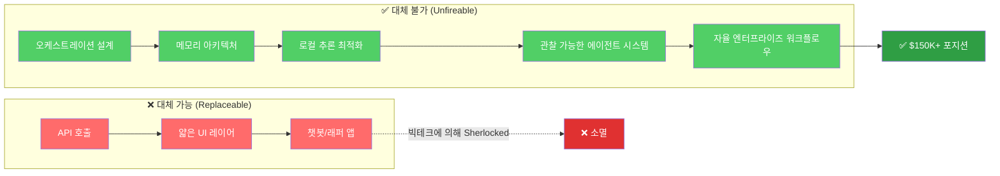

### 1.3 에이전틱 엔지니어링: 2026년의 핵심 기술 격차

2025년까지 기업들이 찾던 것은 프롬프트 디자이너나 모델 튜너였다. 2026년, 그 수요는 **에이전틱 엔지니어링(Agentic Engineering)** 으로 완전히 이동했다.

이는 단순히 에이전트를 호출하는 것이 아니라, 프로덕션 환경에서 살아남는 에이전트를 **설계하고, 통치하고, 운영**하는 능력이다.

Gartner는 2026년 말까지 기업 애플리케이션의 40%가 AI 에이전트를 내장할 것이라 예측한다(2025년의 5% 미만에서). 에이전틱 AI 시장은 현재 78억 달러에서 2030년까지 520억 달러로 성장할 전망이다(CAGR 46.3%).

---

## 2. Vibe Coding에서 Agentic Engineering으로

이 스레드를 이해하려면 2025~2026년 개발 패러다임의 전환을 먼저 이해해야 한다.

### 2.1 Vibe Coding의 탄생과 한계

2025년 2월 2일, Andrej Karpathy가 "vibe coding"이라는 용어를 만들었다. 그는 이를 *"완전히 바이브에 몸을 맡기고, AI가 생성한 모든 것을 읽지도 않고 수락하며, 코드베이스가 자신의 직접적인 이해를 넘어서도록 두는"* 방식이라고 정의했다. 프로토타입에는 유용하지만, 프로덕션에는 치명적이다.

2026년, 아마존은 AI 코딩 도구와 연관된 일련의 장애를 경험했다. 3월 2일에는 잘못된 배송 예측으로 약 12만 건의 주문 손실과 160만 건의 웹사이트 오류가 발생했고, 3월 5일에는 별도의 장애로 북미 주문의 99%가 중단되었다. 아마존은 335개 Tier-1 시스템에 걸쳐 90일 리셋을 명령했다.

Google Cloud AI의 Addy Osmani 디렉터는 직접적으로 지적했다: *"결제 시스템을 'vibe engineering'하고 있다고 CTO에게 말하면, 그의 얼굴에서 우려를 볼 수 있습니다."*

### 2.2 Agentic Engineering의 등장

2026년 2월 4일, vibe coding 탄생 1주년에 Karpathy는 "agentic engineering"을 더 정확한 기술자로 제안했다. 이것이 Rohit의 스레드가 주장하는 핵심이다.

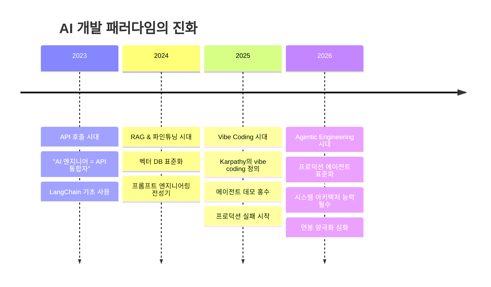

Anthropic의 2026 Agentic Coding Trends Report에 따르면, 엔지니어들은 현재 작업의 약 60%에 AI를 활용하지만, 에이전트에게 완전히 위임하는 비율은 0~20%에 그쳤다. 인간의 감독은 여전히 상수다.

---

## 3. 5개의 프로덕션 프로젝트: 난이도별 완전 해석

Rohit이 제시하는 청사진의 핵심은 5개의 점층적 프로젝트다. 각 프로젝트는 단순히 무엇을 만드는지가 아니라, **어떤 기술적 복잡성을 증명하는지**가 중요하다.

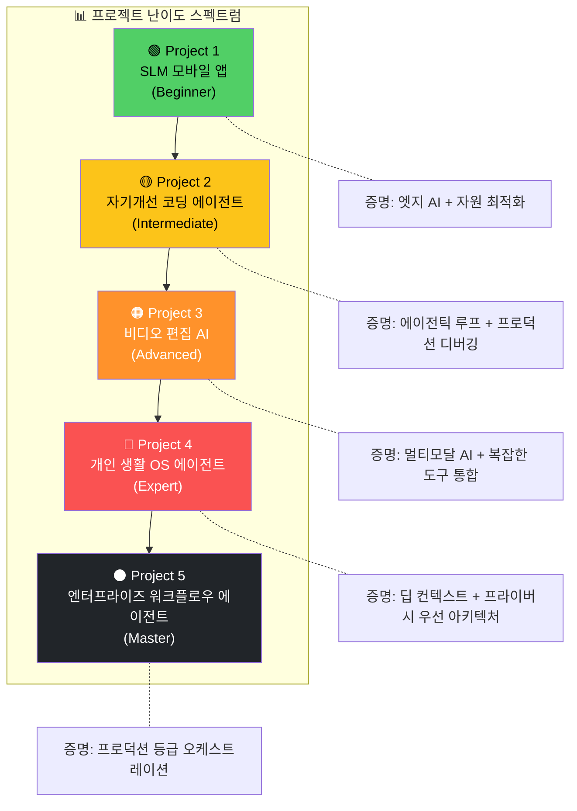

---

### 3.1 Project 1: SLM을 활용한 AI 모바일 앱 (초급)

**핵심 증명 역량**: 엣지 AI + 자원 최적화

#### 왜 이게 "초급"인데도 중요한가?

단순히 API를 호출하는 것이 아니다. 이 프로젝트는 **제약된 하드웨어에서 모델을 최적화**하는 능력을 증명한다. 이것은 오프라인 퍼스트 모바일 앱으로, API 비용이 제로이며 완전한 프라이버시를 보장한다.

#### 핵심 아키텍처 결정

**모델 관리 전략**은 세 가지 레이어로 구성된다. 첫째, 메모리를 보존하기 위해 모델을 필요할 때만 지연 로딩(Lazy Loading)한다. 둘째, 메모리 압박이 감지되면 비활성 모델을 언로드한다. 셋째, 유휴 시간에 자주 사용되는 모델을 미리 로드한다.

**컨텍스트 윈도우 관리**는 슬라이딩 윈도우와 시멘틱 청킹을 결합한다. 가장 관련성 높은 컨텍스트를 유지하고 가장 오래된 것을 제거한다. 임베딩 유사도를 사용하여 윈도우에 남을 내용과 아카이브될 내용을 결정한다.

**양자화 전략**은 기기 성능에 따라 동적으로 적용된다. 2020년 이전 기기에는 4비트 양자화, 신형 기기에는 8비트 양자화를 적용하고, 사용 가능한 RAM을 감지하여 조정한다.

**배터리 최적화**는 추론 요청을 배치 처리하여 웨이크 사이클을 줄이고, 저전력 모드에서 모델 호출을 스로틀링하며, 비중요 처리는 충전 중으로 지연한다.

**오프라인 우선 동기화**는 사용자 데이터를 로컬 암호화 형식으로 저장하고, 연결되었을 때만 사용자 허가를 받아 클라우드와 동기화한다. 충돌 해결은 로컬 변경 사항을 우선시한다.

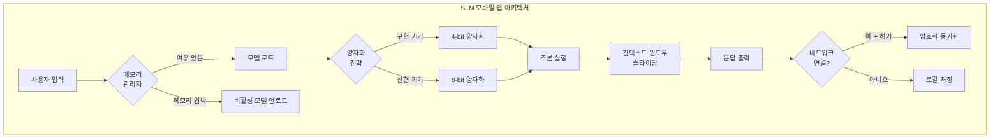

#### 이 프로젝트가 증명하는 것

API를 호출하는 것과 **양자화와 메모리 압박을 관리**하는 것은 완전히 다른 레벨의 엔지니어링이다. 이것이 "초급이지만 중요한" 이유다.

---

### 3.2 Project 2: 자기개선 코딩 에이전트 (중급)

**핵심 증명 역량**: 에이전틱 루프 + 프로덕션 디버깅

#### 챗봇과 에이전트의 근본적 차이

Rohit은 이를 명료하게 정의한다.

> *"챗봇은 프롬프트를 기다린다. 에이전트는 목표를 기다린다. 차이는 루프에 있다."*

이 프로젝트는 코드를 작성하고, 테스트를 실행하고, 실패로부터 학습하는 자율 에이전트를 구축한다. 코드가 기능할 때까지 멈추지 않는다.

#### 핵심 아키텍처: Plan → Execute → Test → Reflect

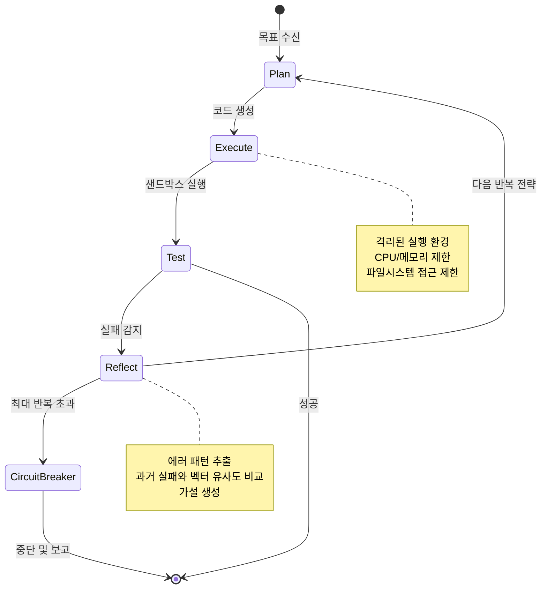

**실행 루프 설계**는 최대 반복 제한이 있는 Plan → Execute → Test → Reflect 사이클로 구성된다. 각 루프는 중단 후 재개를 위한 상태를 저장하며, 무한 루프를 막는 서킷 브레이커 패턴을 구현한다.

**샌드박싱 전략**은 작업별 격리된 실행 환경을 제공한다. CPU, 메모리, 실행 시간에 자원 제한을 두고, 파일시스템 접근을 프로젝트 디렉토리로만 제한한다.

**메모리 계층**은 세 단계로 구분된다. 단기 메모리는 현재 작업 컨텍스트(마지막 5회 반복)를 유지하고, 장기 메모리는 문제 유형별로 성공 패턴을 인덱싱하며, 실패 메모리는 솔루션과 함께 에러 시그니처를 저장한다.

**반영 메커니즘**은 각 실패 후 에러 패턴과 근본 원인을 추출하고, 과거 실패와 벡터 유사도로 비교하며, 실패 이유와 수정 방법에 대한 가설을 생성한다.

**실수로부터의 학습**은 시도한 것, 실패한 이유, 수정한 것 등 전체 컨텍스트와 함께 실패 시도를 저장한다. 유사한 미래 작업에서 시도 전에 관련 실패를 검색하여 같은 실수를 반복하지 않는다.

---

### 3.3 Project 3: 비디오 편집을 위한 AI (고급)

**핵심 증명 역량**: 멀티모달 AI + 복잡한 도구 통합

#### 왜 비디오 편집인가?

Rohit은 이 프로젝트의 의의를 이렇게 설명한다.

> *"텍스트는 과거다. 비전과 비디오가 현재다. 기업들은 복잡한 미디어를 보고 행동할 수 있는 에이전트를 필요로 한다."*

오픈소스 편집기(Rohit은 Shotcut을 추천)를 포크하고, 편집 의도를 이해하는 AI 에이전트를 구축한다. 사용자가 "시네마틱하게 만들어"라고 말하면, 에이전트가 컷, 전환, 색보정을 처리한다.

#### 의도 번역의 과학

사용자의 모호한 지시를 구체적인 파라미터로 변환하는 것이 핵심이다. "시네마틱"이라는 한 단어가 실제로 의미하는 것은:

```
"시네마틱" → 구체적 파라미터 변환:
├── 느린 페이싱 (80% 속도)
├── 채도 감소 (LUT 적용)
├── 얕은 포커스 시뮬레이션 (배경 가우시안 블러)
└── 드라마틱 음악 큐
```

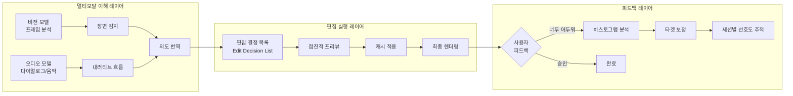

**멀티모달 이해**는 비전 모델로 구도, 조명, 피사체를 분석하고, 오디오 모델로 대화, 음악, 주변 소리를 분석하여 내러티브 흐름을 이해한다.

**장면 감지**는 하드 컷에 대한 프레임 차이를 분석하고, 임베딩 유사도로 장면 경계를 감지하며, 시각 및 오디오 변화를 기반으로 스토리 비트를 식별한다.

**증분 프리뷰**는 각 변경 후 전체 비디오를 리렌더링하지 않는다. 영향받는 섹션의 프리뷰만 생성하고 변경되지 않은 세그먼트를 캐시하여 빠른 반복을 가능하게 한다.

**추론이 있는 실행 취소/다시 실행**은 모든 편집에서 변경된 것뿐만 아니라 변경한 이유도 저장한다. 사용자가 "왜 여기서 컷했나요?"라고 물으면 감지된 스토리 비트를 기반으로 설명을 받을 수 있다.

---

### 3.4 Project 4: 개인 생활 OS 에이전트 (전문가)

**핵심 증명 역량**: 딥 컨텍스트 + 프라이버시 우선 아키텍처

#### AI 메모리의 역설

> *"잊는 에이전트는 쓸모없다. 당신의 삶을 아는 에이전트는 파트너다."*

이것은 캘린더, 재정, 건강을 관리하는 깊이 개인화된 에이전트를 구축하는 프로젝트다. 수개월 앞을 계획하고, 수면 패턴과 회의 밀도를 분석하여 번아웃을 감지한다.

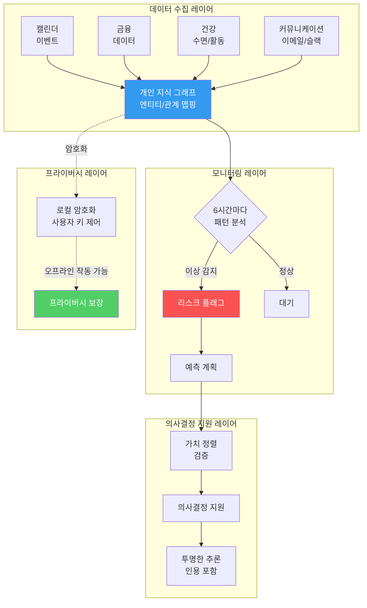

**연속 컨텍스트 구축**은 캘린더, 재정, 건강, 커뮤니케이션의 이벤트를 실시간으로 수집하고, 엔티티(사람, 장소, 프로젝트)를 추출하여 개인 지식 그래프를 구축한다. 시간에 따른 엔티티 간 관계를 매핑한다.

**선제적 모니터링**은 6시간마다 백그라운드 스레드가 패턴을 분석한다. 회의 밀도가 증가하는 동시에 수면 질이 저하되는 것 같은 이상을 감지하고 문제가 되기 전에 위험을 플래그한다.

**가치 정렬**은 사용자가 우선순위를 명시적으로 설명한다(가족 > 일, 건강 > 수입). 모든 권고사항은 이러한 가치에 대해 검증되고, 행동과 명시된 우선순위 사이의 충돌을 표면화한다.

**예측 계획**은 과거 패턴을 분석하여 미래 병목현상을 예측한다. "Q4 패턴에 따르면, 3월에 과도한 일정을 잡게 될 것입니다"라고 미리 알려주고 예방적 일정 조정을 제안한다.

**메모리 통합**은 매일 밤 일일 이벤트를 장기 메모리로 요약하고, 의미를 보존하면서 세부사항을 압축한다. 반복 접근에 의해 강화되지 않으면 오래된 메모리는 자연스럽게 감소한다.

---

### 3.5 Project 5: 자율 엔터프라이즈 워크플로우 에이전트 (마스터)

**핵심 증명 역량**: 프로덕션 등급 오케스트레이션

#### 최종 보스: 비즈니스를 운영하는 에이전트

> *"이것은 AI 엔지니어링의 최종 보스이자 포트폴리오 클로저다. 비즈니스 워크플로우를 엔드투엔드로 실행하는 에이전트."*

슬랙/지라를 모니터링하고, 실행을 계획하고, 작업을 위임하고, 완전한 감사 로그와 함께 결과를 보고하는 에이전트를 구축한다.

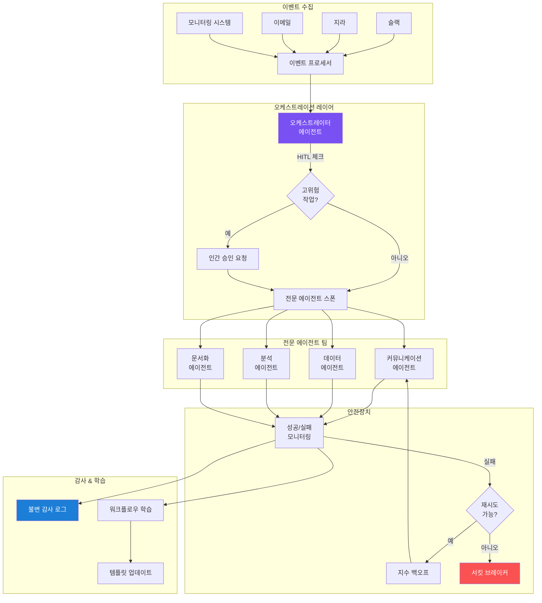

**이벤트 기반 아키텍처**는 슬랙, 지라, 이메일, 모니터링 시스템의 이벤트를 수신한다. 패턴 인식이 워크플로우 트리거를 식별하고, 각 이벤트 유형은 워크플로우 템플릿에 매핑된다.

**멀티 에이전트 위임**은 오케스트레이터 에이전트가 하위 작업을 위해 전문 에이전트를 스폰한다. 커뮤니케이션 에이전트는 모든 외부 메시지를 처리하고, 데이터 에이전트는 로그와 데이터베이스를 쿼리하며, 분석 에이전트는 근본 원인 분석을 수행하고, 문서화 에이전트는 보고서를 작성한다.

**자가 치유 메커니즘**은 모든 단계를 성공/실패 여부에 대해 모니터링한다. 실패 시 재시도가 의미 있는지 에스컬레이션이 필요한지를 결정하고, 일시적 실패에 대한 지수 백오프를 구현하며, 서킷 브레이커가 반복 실패를 중단시킨다.

**감사 추적**은 취해진 모든 행동의 불변 로그를 유지한다. 무엇이 결정되었는지, 왜, 누가 승인했는지, 결과는 무엇인지를 저장하며, 컴플라이언스와 디버깅을 위해 쿼리 가능하다.

**인간-루프(HITL) 설계**는 에이전트가 중요한 워크플로우의 실행 전에 계획을 제안하고, 고위험 작업을 인간 검토를 위해 강조하며, 신뢰도가 낮을 때 에스컬레이션한다.

**비용 관리**는 워크플로우별 토큰 사용량을 추적하고 예산 제한을 구현하며, 품질을 희생하지 않고 비용을 절감하기 위한 프롬프트를 최적화한다.

---

## 4. 2026년 AI 엔지니어링 시장의 현실

### 4.1 기술 스택의 진화

2026년 기업들이 실제로 채용하는 스킬셋은 다음과 같다.

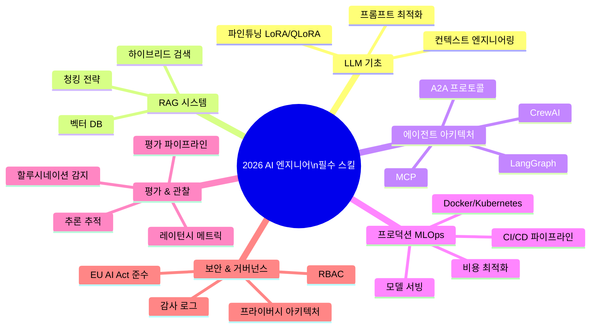

### 4.2 "컨텍스트 엔지니어링"의 등장

2026년의 가장 중요한 패러다임 전환은 새로운 모델 출시나 벤치마크 점수가 아니다. **프롬프트 엔지니어링에서 컨텍스트 엔지니어링으로의 산업 전체적 이동**이다.

Shopify CEO Tobi Lütke와 Andrej Karpathy가 공개적으로 지지한 이 개념은, 컨텍스트 엔지니어링을 "작업에 필요한 모든 정보를 제공하는 예술"로 정의한다. 프롬프트 엔지니어링이 컨텍스트 윈도우 내에서 무엇을 하는지라면, 컨텍스트 엔지니어링은 무엇이 그 윈도우를 채우는지와 왜를 결정한다.

### 4.3 "임포스터 증후군 2026"

현장에서는 두 가지 종류의 엔지니어가 서로를 바라보며 불안해한다.

**ML/LLM 엔지니어 측**: "나는 트랜스포머, 어텐션 메커니즘, RAG 파이프라인을 마스터했다. 그런데 에이전틱 아키텍처를 보면 마이크로서비스, Kubernetes, async 이벤트 루프가 보인다. 내 스킬이 쓸모없어진 건가?"

**백엔드 개발자 측**: "나는 API 스케일링과 DB 관리를 안다. 그런데 LLM을 블랙박스 API 호출로만 취급하다 보니 할루시네이션을 if/else로 고치려 하고 시스템은 계속 깨진다."

답은 두 측 모두 **반쪽짜리**라는 것이다. 2026년의 AI 엔지니어는 두 세계를 모두 이해하는 하이브리드여야 한다.

### 4.4 커리어 전환 타임라인

현재 직군별로 AI 엔지니어로 전환하는 데 필요한 기간이 다르다.

| 현재 직군 | 전환 기간 | 주요 갭 |
|-----------|-----------|---------|
| ML 엔지니어 | 2~3개월 | RAG 패턴, 에이전트 아키텍처, 프롬프트 엔지니어링 |
| 소프트웨어 엔지니어 | 6개월 | LLM API, RAG, 에이전트 아키텍처, 평가 |
| 데이터 사이언티스트 | 6~9개월 | 프로덕션 엔지니어링 먼저, 그 위에 AI 스택 |
| 솔루션 아키텍트 | 3~6개월 | 핸즈온 코딩, LLM 특화 지식 |

---

## 5. 왜 지금 행동해야 하는가: 시간적 압박의 구조

### 5.1 가속화되는 시장 격차

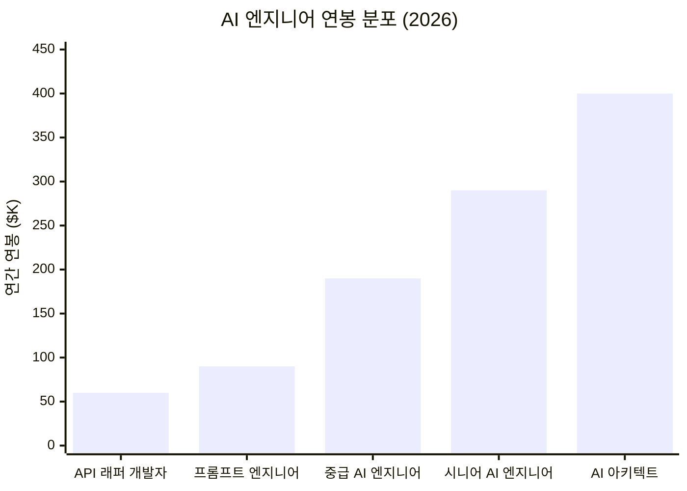

### 5.2 공급과 수요의 불균형

현재 AI 엔지니어링 시장의 핵심 동학:

- **수요**: 3개의 역할이 1명의 자격 있는 후보자를 두고 경쟁
- **공급**: 프로덕션 시스템을 설계하고 운영할 수 있는 엔지니어 부족
- **격차**: 전 세계적으로 AI 인재 부족이 사이버보안, 빅데이터를 추월

LangChain의 2025 에이전트 엔지니어링 현황 보고서에 따르면, 57%의 조직이 이미 프로덕션에 AI 에이전트를 보유하고 있지만, 32%가 품질을 최대 장벽으로 꼽으며 대부분의 실패는 모델 능력이 아닌 컨텍스트 관리 문제에서 비롯된다.

### 5.3 Rohit의 핵심 메시지: 행동하지 않는 90%

> *"대부분의 사람들은 이것을 읽고 아무것도 하지 않을 것이다. 북마크하고 '좋은 글이네'라고 말한 다음, 허가를 기다리러 돌아갈 것이다."*

그는 두 가지 결말을 제시한다:

- **대체 가능한 개발자**: 래퍼를 만든다
- **대체 불가능한 개발자**: 자율 시스템을 출시한다

그 차이는 단 5개의 프로젝트다.

---

## 6. 실천 전략: 이 로드맵을 어떻게 따를 것인가

### 6.1 시작점 선택 가이드

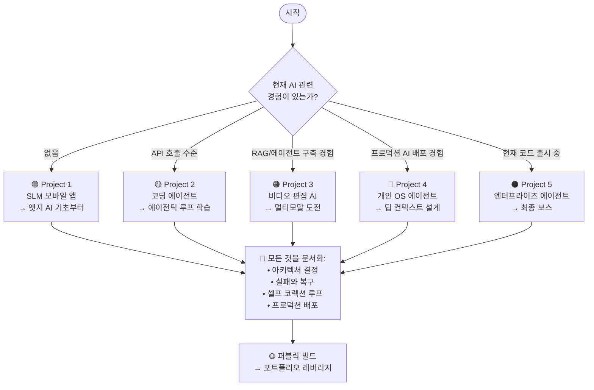

### 6.2 문서화해야 할 핵심 항목들

Rohit이 강조하는 것은 단순히 코드를 짜는 것이 아니다. **학습 과정 자체를 기록**하는 것이다.

**아키텍처 결정 로그**: "왜 이 기술을 선택했는가? 어떤 트레이드오프를 고려했는가?" 이것이 시니어 엔지니어와 주니어 엔지니어를 구분한다.

**실패 및 복구 기록**: 무엇이 깨졌고, 어떻게 진단했으며, 어떻게 고쳤는가? 이것이 가장 강력한 포트폴리오 콘텐츠다.

**셀프 코렉션 루프**: 에이전트가 스스로 어떻게 수정하는지, 그 메커니즘을 문서화한다.

**프로덕션 배포**: 실제로 배포된 것이 있어야 한다. localhost에서만 돌아가는 것은 포트폴리오가 아니다.

### 6.3 2026년 AI 엔지니어 포트폴리오 체크리스트

```
✅ 프로덕션에 배포된 AI 시스템 (로컬호스트 금지)
✅ 아키텍처 다이어그램이 있는 상세한 README
✅ 비용 및 레이턴시 메트릭 공개
✅ 할루시네이션/실패 처리 방법 설명
✅ 모델 선택 이유 (왜 X를 Y 대신 선택했는가)
✅ 에이전틱 루프 또는 멀티 에이전트 워크플로우
✅ 관찰 가능성 구현 (추적, 로깅, 메트릭)
✅ 보안 고려사항 (RBAC, 샌드박싱, 감사)
```

---

## 7. 비판적 시각: 이 로드맵의 맹점

이 스레드는 강력하지만, 몇 가지 비판적으로 살펴볼 부분도 있다.

**첫째, 실행의 간극을 과소평가한다.** "이번 주말에 만들어라"는 조언은 동기부여적이지만, 5개의 프로젝트는 각각 수개월의 작업을 요구한다. 특히 비디오 편집 AI나 엔터프라이즈 워크플로우 에이전트는 팀 프로젝트 수준의 복잡성을 가진다.

**둘째, 기초 없는 복잡성은 위험하다.** Addy Osmani가 지적했듯, AI 기초 없이 에이전틱 시스템을 구축하는 것은 "이해하지 못하는 코드를 생산하는 위험한 스킬 위축"으로 이어질 수 있다. 이 로드맵은 프로젝트 중심이지만, 기반 지식 없는 프로젝트는 vibe coding과 다르지 않다.

**셋째, 지역적 맥락이 빠져 있다.** 연봉 데이터는 주로 미국 기준이다. 한국 시장에서는 다른 역학이 작동한다. 그러나 기술 자체는 전 세계적으로 동일하게 적용된다.

**넷째, 도구 중심성의 함정.** LangGraph, CrewAI, AutoGen 등 프레임워크는 중요하지만, 프레임워크보다 아키텍처 이해가 선행되어야 한다. 도구는 바뀌지만 원칙은 남는다.

---

## 8. 결론: 2026년의 핵심 통찰

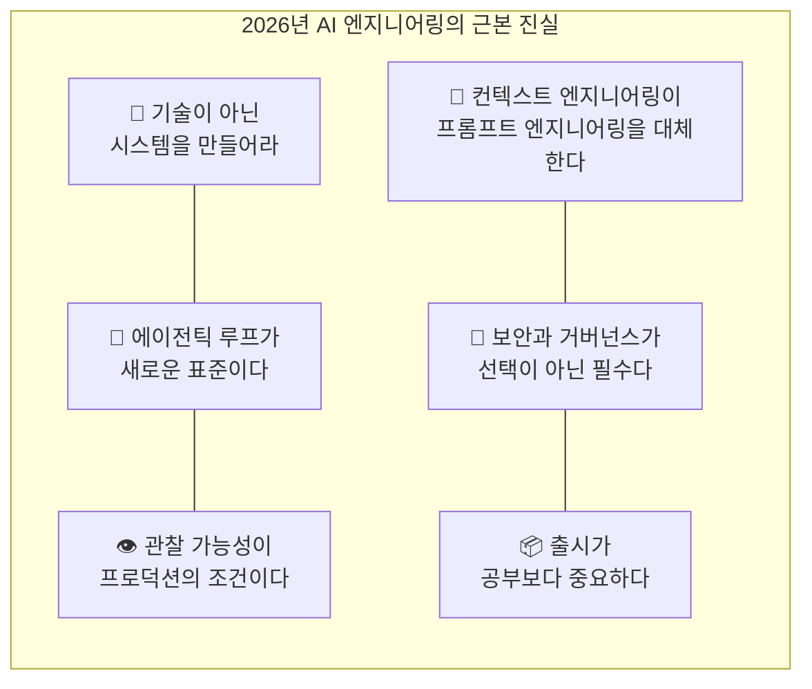

Rohit의 스레드는 2026년 AI 엔지니어링 시장의 핵심 진실을 담고 있다. 챗봇과 API 래퍼의 시대는 끝났다. 시장은 오케스트레이션, 메모리 관리, 로컬 추론, 프라이버시 우선 아키텍처를 깊이 이해하는 엔지니어를 필요로 한다.

5개의 프로젝트는 단순한 포트폴리오 체크리스트가 아니다. 그것들은 점층적으로 복잡해지는 기술적 증명의 시퀀스다. 각 프로젝트는 다음 단계를 가능하게 하는 기술적 근육을 구축한다.

가장 중요한 것은 마지막 문장이 아니다.

> *"전문성이 남은 유일한 직업 안정성이다. 프로덕션 시스템이 중요한 유일한 포트폴리오다."*

2026년, 이 말은 단순한 동기부여 문구가 아니라 시장의 현실이다. 어떤 프로젝트를 시작할지 결정하는 것, 그것이 첫 번째 아키텍처 결정이다.

---

## 참고 자료

- [@rohit4verse, X, 2026.01.10](https://x.com/rohit4verse/status/2009663737469542875) — 원본 스레드
- [Axiom Recruit — AI Engineer Compensation 2026](https://www.axiomrecruit.com/resources/industry-insights/ai-engineer-compensation-2026--what-the-world-is-paying/)
- [Let's Data Science — AI Engineer Roadmap 2026](https://letsdatascience.com/blog/ai-engineer-roadmap-2026-skills-tools-and-career-path)
- [Medium — From Vibe to Agentic: The 2026 Maturation](https://medium.com/technologai/from-vibe-to-agentic-the-2026-maturation-of-ai-driven-development-1bfb0844b5a6)
- [CIO — How Agentic AI Will Reshape Engineering Workflows in 2026](https://www.cio.com/article/4134741/how-agentic-ai-will-reshape-engineering-workflows-in-2026.html)
- [Prompt Bestie — AI Prompt Engineering Trends 2026](https://promptbestie.com/en/ai-prompt-engineering-trends-2026-definitive-guide/)
- [Data Science Collective — How to Break Into AI Engineering in 2026](https://medium.com/data-science-collective/how-to-break-into-ai-engineering-in-2026-without-starting-over-246ccdfab5c9)
- [Medium — From Generative to Agentic AI: A Roadmap in 2026](https://medium.com/@anicomanesh/from-generative-to-agentic-ai-a-roadmap-in-2026-8e553b43aeda)
- [Bernard Marr — Why Prompt Engineering Isn't The Most Valuable AI Skill In 2026](https://bernardmarr.com/why-prompt-engineering-isnt-the-most-valuable-ai-skill-in-2026/)
- [Anthropic 2026 Agentic Coding Trends Report](https://www.anthropic.com)
- Gartner — Enterprise AI Agent Adoption Forecast 2026
- PwC — 2025 Global AI Jobs Barometer

---

*이 문서는 @rohit4verse의 원본 스레드를 기반으로, 2026년 4월 현재의 최신 시장 데이터와 산업 분석을 결합하여 작성되었습니다.*
