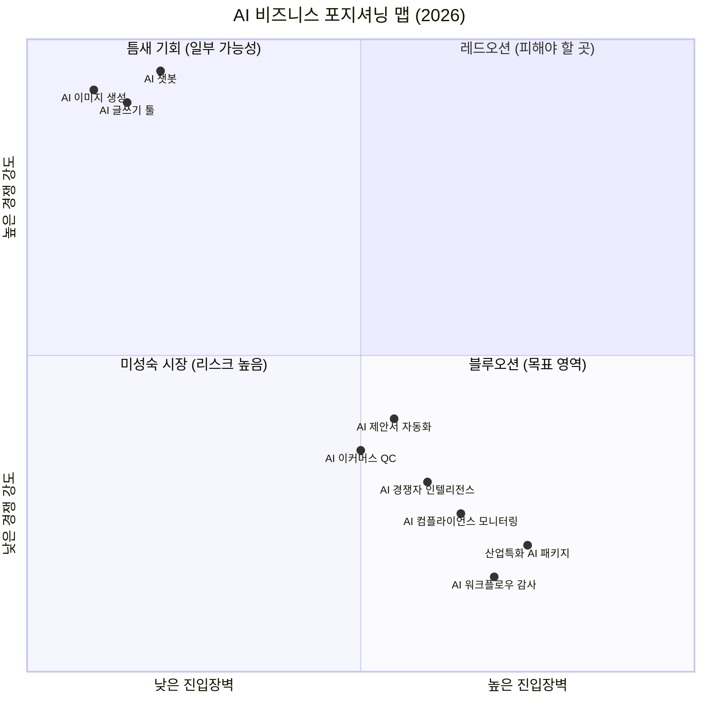
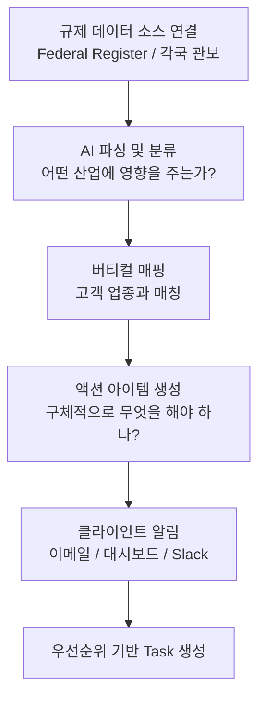
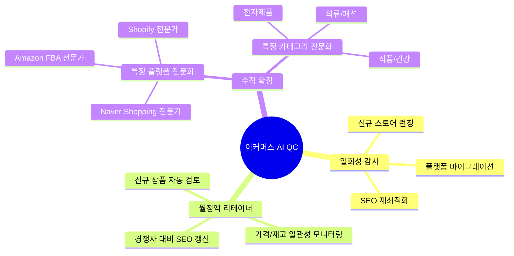
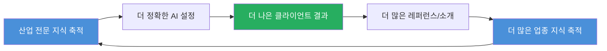
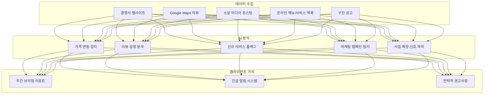
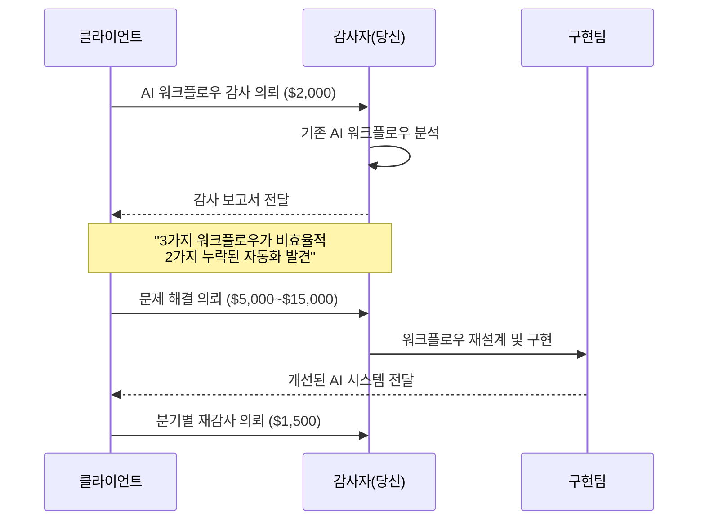
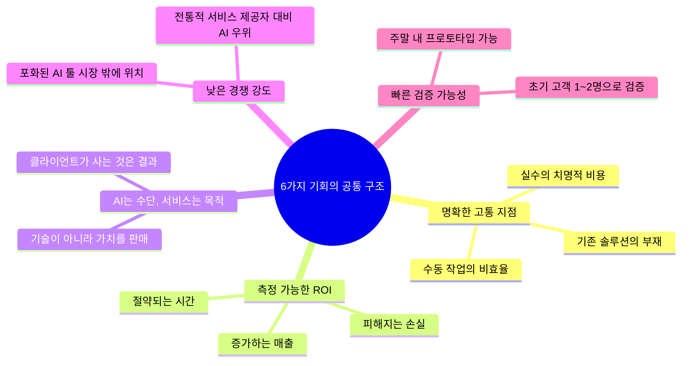
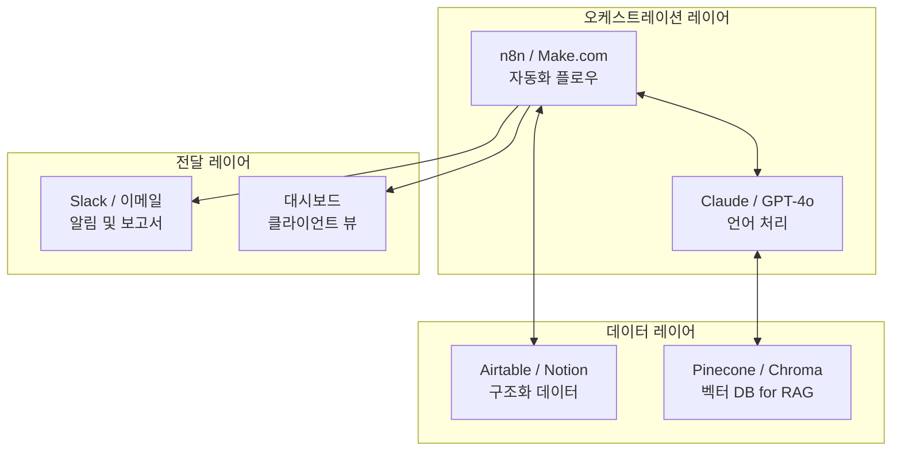

> **원문 출처:** Zephyr([@Zephyr_hg](https://x.com/zephyr_hg/status/2043735668396872188)) X(트위터) 스레드 (2026년 4월 기준)  
> **작성 기준:** 2026년 4월 14일  
> **분류:** AI 비즈니스 전략 / 마켓 분석

---

## 들어가며 — "모두가 같은 것을 만들고 있다"

AI 붐이 정점을 향해 달려가던 2023 ~ 2024년, 그리고 그 여파가 여전히 현재진행형인 2025 ~ 2026년에 이르기까지, 시장에는 수만 개의 AI 스타트업이 등장했다. 그러나 그 대부분은 동일한 범주에 속해 있다. AI 글쓰기 툴, AI 챗봇, AI 이미지 생성기, 그리고 "모든 것을 조금씩 하지만 그 어떤 것도 잘 하지 못하는" AI 어시스턴트들.

이 포화된 시장 속에서, 한 명의 빌더가 조용히 외쳤다. **"진짜 기회는 다른 곳에 있다."**

Zephyr라는 X(구 트위터) 사용자가 공개한 이 스레드는, AI를 단순한 '제품'이 아니라 '서비스 비즈니스의 인프라'로 바라볼 때 비로소 보이기 시작하는 여섯 가지 비즈니스 기회를 소개한다. 각 기회는 단순한 아이디어가 아니라, 명확한 고객 페인포인트, 측정 가능한 ROI, 그리고 아직 채워지지 않은 시장 공백을 기반으로 한다.

이 문서는 그 여섯 가지 기회를 원문보다 훨씬 깊게 파고들어, 시장 데이터와 최신 트렌드를 종합하여 설명한다.

---

## 왜 지금인가 — 시장 구조의 전환점

본격적인 분석에 앞서, 이 아이디어들이 왜 "지금" 유효한지를 이해하는 것이 중요하다.

### AI 도구 시장의 과포화와 차별화 실패

2024~2026년 사이, 시장에서 살아남는 AI 제품은 두 가지 극단으로 갈렸다. 하나는 OpenAI, Anthropic, Google 같은 거대 파운데이션 모델 레이어이고, 다른 하나는 극도로 특화된 버티컬 솔루션이다. 그 중간 어딘가에 위치한 일반적인 "AI 툴"들은 빠르게 범용화(commoditization)의 함정에 빠졌다. 챗GPT 래퍼(wrapper)만 갖다 붙인 서비스들은 더 이상 차별화 포인트가 없다.

### "도구"에서 "서비스"로의 전환

Zephyr가 제안하는 핵심 철학은 바로 이것이다.

> **"대부분의 사람들은 AI를 제품으로 본다. 더 똑똑한 방법은 AI를 서비스 비즈니스 내부의 인프라로 사용하는 것이다. 초기 비용이 낮고, 검증이 빠르고, 마진이 높으며, 경쟁이 거의 없다."**

이것은 단순히 말장난이 아니다. AI를 제품으로 팔면 경쟁자는 수백 개의 동일한 앱이고, AI를 서비스의 백엔드로 활용하면 경쟁자는 해당 버티컬의 전통적인 서비스 제공자들이다. 그 전통적 서비스 제공자들이 AI를 어설프게 흉내 내기 시작하기 전까지, 시장은 텅 비어 있다.

---

## 기회 1: 소기업을 위한 AI 컴플라이언스 모니터링

### 문제의 구조

모든 산업에는 규제가 있다. GDPR(유럽 개인정보보호법), HIPAA(미국 의료정보보호법), SOC 2(서비스 조직 통제 기준), PCI-DSS(결제카드 산업 데이터 보안 표준), 노동법, 매년 바뀌는 세법들. 대기업에는 전담 컴플라이언스 팀이 있다. 그러나 소기업에는? 파일 캐비닛과 신(神)에 대한 믿음뿐이다.

Zephyr는 이 간극을 정확히 짚었다. 중소기업(SMB) 오너들이 매일 아침 눈을 뜰 때, 규제 변경 사항을 추적하는 사람은 없다. 그러다가 갑작스러운 과태료 고지서를 받는다. 단 하나의 컴플라이언스 위반이 1만 달러 이상의 벌금으로 이어질 수 있다.

### 솔루션의 작동 방식

제안된 솔루션은 다음과 같이 작동한다. 특정 산업(예: 의료, 식음료, 금융, 건설 등)의 규제 변화를 모니터링하는 AI 시스템을 구축한다. 새로운 규칙이 발표되면 시스템이 이를 읽고, 무엇이 바뀌었는지 요약하며, 비즈니스 오너에게 정확히 무엇을 해야 하는지를 알려준다.

**가격 모델:** 월 $300~$500/클라이언트

이 ROI는 자명하다. 월 $400을 내고 $10,000~$50,000의 벌금을 피할 수 있다면, 고객이 굳이 가격을 협상할 이유가 없다.

### 시장 현황 (최신 데이터)

AI 컴플라이언스 모니터링 시장은 폭발적으로 성장하고 있다. 2024년 기준 전 세계 AI 컴플라이언스 모니터링 시장 규모는 18억 달러로 평가되며, 2030년까지 52억 달러에 달할 것으로 전망된다(연평균 성장률 19.4%). 더 광범위한 AI 거버넌스 및 컴플라이언스 시장은 2025년 22억 달러에서 2036년 약 110억 달러 규모로 성장하리라 예측된다.

그러나 주목할 점이 있다. 이 시장의 주요 플레이어들—SAS Institute, MetricStream, IBM, Microsoft 같은 대기업들—은 **대기업용** 솔루션에 집중하고 있다. 소기업을 위한 단순하고 저렴한 버티컬 특화 솔루션은 여전히 공백으로 남아 있다.

EU AI Act(2024년 발효), DORA, 각국의 데이터 프라이버시 규정 강화로 인해 규제 환경은 지속적으로 복잡해지고 있다. 중소기업 오너들은 이 복잡성을 스스로 헤쳐나갈 전문 지식도, 시간도 없다.

### 실행 전략

**선택할 버티컬 예시:**
- 의료/헬스케어: HIPAA, 각국 의료법
- 식품/음식점: FDA 규정, 식품안전기본법
- 금융/보험: SEC, 금융위원회 가이드라인
- 건설/부동산: 안전보건 규정, 건축법

---

## 기회 2: 서비스 비즈니스를 위한 AI 기반 제안서 작성

### 문제의 구조

프리랜서, 에이전시, 컨설턴트들이 매번 클라이언트 제안서(proposal)를 작성하는 데 드는 시간을 생각해 보자. 3~5시간씩, 매번. 구조는 비슷하고, 가격 섹션은 같은 논리를 따르며, 업무 범위는 과거 제안서의 언어를 재사용한다. 그런데도 아무도 이것을 자동화하지 않는다.

이것은 "모두가 갖고 있지만 자동화할 생각을 하지 못하는" 문제의 전형적인 예시다.

### 솔루션의 작동 방식

프로젝트에 대한 짧은 대화(브리핑)를 기반으로, AI가 몇 분 안에 완성도 높고 브랜드화된 제안서를 생성한다. 클라이언트의 과거 제안서 데이터를 풀링하고, 그들의 어조를 맞추며, 업종별 언어를 포함시킨다.

**가격 모델:** 월 $150~$300 또는 제안서 1건당 $50

한 달에 10개의 제안서를 보내는 에이전시라면, 30~50시간을 절약할 수 있다. 이는 수천 달러의 가치에 해당한다.

### 시장 현황 (최신 데이터)

AI가 프리랜서 작업에 미치는 영향은 이미 측정 가능하다. 제안서 작성 속도는 AI 도입 후 80% 향상되었으며, 루틴 커뮤니케이션의 70%가 자동화되었다. McKinsey의 2025년 AI 현황 조사에 따르면, 기업의 71%가 이미 최소 하나의 비즈니스 기능에서 생성형 AI를 정기적으로 사용하고 있다.

흥미로운 점은 시장이 **두 갈래로 분열**되고 있다는 것이다. 하나는 AutogenAI같은 대기업용 제안서 AI(Fortune 500 기업, 정부 기관을 타깃)이고, 다른 하나는 Bonsai, PandaDoc 같은 프리랜서용 툴이다. 그러나 에이전시, 컨설팅 펌, 소형 서비스 업체를 위한 **맞춤형, 학습형** AI 제안서 시스템은 여전히 비어 있다.

2026년 현재, AI는 단순한 "초안 작성"에서 **에이전틱 제안서 워크플로우**로 진화하고 있다. RFP 분석, CRM 데이터 통합, 경쟁사 비교까지 자동으로 처리하는 시스템이 등장하고 있으며, 이런 복잡한 워크플로우를 중소 서비스 업체에 맞게 단순화한 솔루션이 요구된다.

### 핵심 차별화 포인트

단순한 AI 글쓰기 툴과의 차이는 **기억력(memory)** 에 있다. 이 솔루션은:
1. 클라이언트의 과거 제안서 전체를 학습 데이터로 활용한다.
2. 성사된 제안서와 실패한 제안서의 패턴을 학습한다.
3. 클라이언트의 고유한 브랜드 보이스를 유지한다.
4. 업종별 규제와 전문 용어를 자동으로 포함한다.

---

## 기회 3: 이커머스 상품 목록 AI 품질 관리

### 문제의 구조

지금 이 순간에도 수백만 개의 이커머스 스토어가 형편없는 상품 설명을 달고 운영되고 있다. 부정확한 스펙, 누락된 정보, 상품 간 일관성 없는 포맷, 몇 년 전에 작성된 채 업데이트되지 않은 SEO. 500개, 1,000개, 10,000개의 상품 목록을 스토어 오너가 직접 검토한다는 것은 현실적으로 불가능하다.

그러나 AI는 수천 개의 상품 목록을 몇 분 안에 스캔할 수 있다.

### 솔루션의 작동 방식

전체 상품 카탈로그를 감사(audit)하는 AI 시스템을 구축한다. 오류를 플래그하고, 누락된 속성을 식별하며, SEO를 위한 설명을 재작성하고, 스토어 전체에 걸쳐 포맷을 표준화한다.

**가격 모델:** 카탈로그 크기에 따라 감사 1회 $500~$2,000 + 지속적 모니터링을 위한 월정액 리테이너

### 시장 현황 (최신 데이터)

이커머스 AI 시장은 2026년에 급격히 성숙하고 있다. 특히 주목할 트렌드는 검색 알고리즘의 변화다. Google, Amazon 등 주요 플랫폼이 AI 기반 검색으로 전환하면서, 상품 목록의 품질이 단순한 SEO 최적화를 넘어 **AI 검색 최적화(AISO, AI Search Optimization)** 의 문제로 확장되고 있다.

상품 설명의 불일치, 누락된 속성 데이터, 오래된 가격 정보는 알고리즘에 의해 낮은 순위로 밀려날 위험이 있다. 특히 300개 이상의 SKU를 보유한 이커머스 운영자들은 이 문제를 수동으로 해결할 내부 역량이 없다.

### 비즈니스 모델의 유연성

이 비즈니스는 여러 방향으로 확장될 수 있다.

---

## 기회 4: 산업별 특화 AI 트레이닝 패키지

### 문제의 구조

범용 AI는 당신의 업종을 모른다. 법률 회사에는 판례법과 선례를 이해하는 AI가 필요하다. 부동산 에이전시에는 현지 구역 코드를 아는 AI가 필요하다. 의료 기관에는 HIPAA를 위반하지 않으면서 임상 용어를 이해하는 AI가 필요하다.

그런데 대부분의 AI 컨설턴트는 제너럴리스트다. 모든 산업에 동일한 솔루션을 제공한다.

### 솔루션의 작동 방식

특정 산업을 위한 맞춤형 AI 설정을 구축한다. 사전 로딩된 컨텍스트, 산업별 프롬프트 라이브러리, 해당 산업이 실제로 운영되는 방식에 맞게 설계된 워크플로우 템플릿을 포함한다.

**가격 모델:** 일회성 설정 비용 $2,000~$5,000 + 월정액 지원 $200~$500

스페셜리스트는 제너럴리스트보다 3~5배 높은 요금을 부과하고, 10배 더 나은 결과를 제공한다. 이것이 이 비즈니스 모델의 핵심 가치 제안이다.

### 시장 현황 (최신 데이터)

AI 거버넌스 및 컴플라이언스 시장에서 가장 두드러진 트렌드 중 하나는 **버티컬 특화**다. 금융 서비스 회사들이 AI의 설명 가능성, 공정성, 감사 문서화 요건을 가장 먼저 요구하며, 이를 위한 산업 전문 AI 거버넌스 플랫폼에 대한 수요가 증가하고 있다.

특히 주목할 산업은 다음과 같다.

- **헬스케어**: 의료 AI 시장에서 소규모 병원 및 클리닉들은 HIPAA 준수 AI 시스템 구축에 어려움을 겪고 있다. 2025년 4월 MedStack이 의료 제공자를 위한 AI 기반 감사 엔진을 출시했을 때, 즉각적인 시장 호응이 있었다.
- **법률**: 법률 전문가의 79%가 이미 AI 도구를 활용하고 있지만, 계약 검토, eDiscovery, 규제 조사를 위한 산업 특화 AI 설정을 스스로 구성할 능력이 없는 경우가 대부분이다.
- **금융/회계**: AI 회계 시장은 2026년 109억 달러에 달하며, 소규모 회계 법인들도 AI를 도입하고 있지만 세법, 감사 절차, 보고 형식에 맞는 특화된 AI가 필요하다.
- **건설/제조**: 안전 규정, 자재 코드, 품질 관리 기준에 특화된 AI는 아직 초기 단계에 머물러 있다.

### 왜 이것이 강력한 해자(Moat)인가

제너럴리스트 AI 컨설턴트는 이 선순환 구조를 만들기 어렵다. 특정 버티컬에 집중하면, 시간이 지날수록 경쟁자가 따라오기 어려운 독점적 지식 기반이 형성된다.

---

## 기회 5: 로컬 비즈니스를 위한 AI 기반 경쟁자 인텔리전스

### 문제의 구조

모든 로컬 비즈니스는 경쟁자가 무엇을 하고 있는지 알고 싶어한다. 새로운 가격, 새로운 서비스, 새로운 마케팅 캠페인, 변화하는 고객 리뷰들. 대부분은 한 달에 한 번 수동으로 확인한다. 그것도 기억이 날 때.

문제는 경쟁자가 가격을 내렸을 때, 2주 후에 그것을 알게 된다면 이미 고객을 잃은 것이라는 점이다.

### 솔루션의 작동 방식

경쟁자를 자동으로 모니터링하는 시스템을 구축한다. 가격 변동을 추적하고, 리뷰 감정을 분석하며, 새로운 서비스를 플래그하고, 주간 인텔리전스 브리핑을 제공한다.

**가격 모델:** 월 $200~$400/클라이언트

데이터는 모두 공개된 것들이다. 웹사이트, 리뷰 사이트(Google Maps, Yelp, Naver 플레이스), 소셜 미디어. 자동화는 이 모든 것을 스크래핑하고, 분석하고, 보고할 수 있다.

### 시장 현황 (최신 데이터)

경쟁자 인텔리전스 자동화 툴 시장은 빠르게 성장하고 있지만, 대부분의 솔루션은 기업 규모의 플레이어들을 타깃으로 한다. 로컬 레스토랑, 미용실, 피트니스 센터, 치과, 자동차 수리점 같은 **소규모 로컬 비즈니스**를 위한 저렴하고 이해하기 쉬운 경쟁자 인텔리전스 서비스는 여전히 공백으로 남아 있다.

AI 에이전트 기술의 발전으로 이제 이런 서비스를 자동화하는 것이 기술적으로 어렵지 않다. 웹 스크래핑, NLP 기반 감정 분석, 자동 보고서 생성이 모두 기성 도구로 구현 가능해졌다.

### 로컬 비즈니스 대상 고가치 인텔리전스 항목

**특히 가치 있는 신호들:**
- 경쟁자의 채용 공고 → 확장 또는 새로운 서비스 도입 예고
- 부정적 리뷰 패턴 → 경쟁자의 약점 파악
- 가격 인상/인하 → 즉각적인 포지셔닝 대응 필요
- 소셜 미디어 프로모션 → 마케팅 전략 변화 감지

---

## 기회 6: 서비스로서의 AI 워크플로우 감사

### 문제의 구조

기업들은 이미 운영 전반에 걸쳐 AI를 사용하기 시작했다. 그런데 대부분은 이것을 **잘못** 하고 있다. 서로 다른 팀이 서로 다른 도구를 사용한다. 일관성도, 품질 관리도 없다. 아무도 제대로 설계하지 않았기 때문에 시간을 절약하기는커녕 더 낭비하는 워크플로우들이 존재한다.

이것은 완전히 새로운 문제다. 12개월 전만 해도 이런 문제가 이 규모로 존재하지 않았다. 그리고 2027년이면, AI를 사용하는 모든 기업이 이 감사를 필요로 하게 될 것이다.

### 솔루션의 작동 방식

기업에 들어가서 실행 중인 모든 AI 워크플로우를 감사한다. 무엇이 작동하고 있는지, 무엇이 망가져 있는지, 무엇이 누락되어 있는지, 다음에 무엇을 구축해야 하는지에 대한 보고서를 제공한다.

**가격 모델:** 감사 1회 $1,500~$3,000 + 문제 해결을 위한 추가 비용

### 시장 현황 (최신 데이터)

이것은 원문이 제안한 여섯 가지 기회 중 **가장 미개척된** 영역이다. AI 컨설팅 시장 자체는 2026년까지 300억 달러를 초과할 것으로 예상되지만, 그 대부분은 AI 구현(implementation)에 초점을 맞춘다. AI 구현 이후의 **운영 상태 감사**에 특화된 서비스는 극히 드물다.

Stanford AI Index 2025에 따르면, 기업의 AI 비즈니스 활용도는 2023년 55%에서 2024년 78%로 급격히 증가했다. KPMG의 2026년 글로벌 기술 보고서는 조직의 88%가 이미 AI 에이전트를 워크플로우에 통합하고 있다고 밝혔다. 그러나 대부분의 기업은 파편화된 도구들을 아무런 거버넌스 없이 사용하고 있다.

이 서비스가 특히 가치 있는 이유는 **자연스러운 업셀 구조** 때문이다.

### 2026년의 특수한 맥락

AI 거버넌스에 대한 규제 압력이 증가하면서, 기업들은 자신들이 운영 중인 AI 시스템이 EU AI Act, NIST AI RMF, 업종별 규정을 준수하는지 증명해야 할 필요성이 생겼다. 단순한 효율성 감사를 넘어, **컴플라이언스 감사**로서의 가치도 추가된다. IBM이 2025년 6월 Seek AI를 인수하여 watsonx.governance를 강화한 것처럼, 대기업들은 거버넌스 툴에 공격적으로 투자하고 있다. 그러나 이 복잡한 엔터프라이즈 솔루션을 SMB 레벨에서 단순화하여 제공하는 서비스는 여전히 부재하다.

---

## 여섯 가지 기회의 공통 구조

Zephyr가 제시한 여섯 가지 기회는 표면적으로는 서로 다른 산업을 타깃으로 하지만, 그 이면에는 동일한 구조가 있다.

### 왜 대부분이 이것을 만들지 않는가

Zephyr는 이 기회들이 여전히 비어 있는 이유를 정확히 진단한다. 대부분의 빌더들이 "AI 제품"을 만들려고 하기 때문이다. 앱을 만들고, 플랫폼을 런칭하고, 수천 명의 사용자를 모으려 한다. 이 접근법은:

1. **초기 비용이 높다** — 플랫폼 개발, 사용자 획득, 마케팅에 수십만 달러가 필요하다.
2. **검증이 느리다** — 수천 명의 사용자가 모이기 전까지 시장 적합성을 알 수 없다.
3. **경쟁이 치열하다** — 같은 생각을 하는 수백 개의 팀이 동시에 만들고 있다.

반면 서비스 비즈니스로 접근하면:

1. **초기 비용이 낮다** — 첫 번째 고객을 위한 맞춤형 솔루션을 만들면 된다.
2. **검증이 빠르다** — 첫 번째 유료 고객이 검증이다.
3. **경쟁이 약하다** — 규모화된 플랫폼을 만들 생각을 하는 팀들이 이 공간을 무시한다.

---

## 실행을 위한 핵심 역량

원문은 이 모든 비즈니스를 구축하는 데 필요한 핵심 기술 스택을 명시한다.

| 역량 | 설명 | 필요한 이유 |
|------|------|------------|
| AI 워크플로우 설계 | 여러 AI 호출을 논리적으로 연결하는 능력 | 단일 프롬프트로는 복잡한 비즈니스 문제 해결 불가 |
| 자동화 아키텍처 | Make.com, n8n, Zapier 등을 활용한 신뢰성 있는 자동화 | 클라이언트가 의존할 수 있는 시스템 구축 |
| 프롬프트 엔지니어링 | 일관된 프로덕션 품질의 아웃풋 생성 | 한 번의 성공이 아닌 반복 가능한 품질 필요 |
| 시스템 아키텍처 | 확장 가능하고 유지보수 가능한 AI 시스템 설계 | 클라이언트의 비즈니스 성장에 따른 확장성 |

### 2026년 기준 추천 기술 스택

---

## 이 기회들의 한계와 리스크

공정한 분석을 위해 이 아이디어들의 잠재적 함정도 살펴볼 필요가 있다.

### 잠재적 리스크

**1. AI 할루시네이션의 컴플라이언스 문제**
컴플라이언스 모니터링 서비스는 AI가 규제 내용을 잘못 요약하거나 잘못된 액션 아이템을 생성할 경우 클라이언트에게 실제 피해를 줄 수 있다. 이것은 단순한 품질 문제가 아니라 법적 책임 문제로 이어질 수 있다. 이 서비스는 항상 "AI의 제안은 전문 법률 자문을 대체하지 않는다"는 명확한 면책 조항과 함께 제공되어야 한다.

**2. 스케일링의 어려움**
서비스 비즈니스는 플랫폼보다 스케일링이 어렵다. 클라이언트가 늘어날수록 맞춤화 요구도 늘어나고, 어느 시점에서는 인적 자원이 병목이 된다. 이 비즈니스들을 운영하는 사람은 이 문제를 미리 설계해야 한다.

**3. 빠른 시장 변화**
AI 기술이 빠르게 발전하면서, 오늘 차별화 포인트였던 것이 내일은 범용 기능이 될 수 있다. OpenAI나 Anthropic이 이 중 하나의 기능을 기본 제품에 포함시키는 순간, 경쟁 구도가 급격히 변할 수 있다.

**4. 클라이언트 교육 비용**
소기업 오너들 중에는 AI 기반 서비스의 가치를 이해하는 데 상당한 시간이 필요한 경우도 있다. "이것이 단지 자동화 아닌가요?"라는 질문에 답하는 영업 과정이 예상보다 길어질 수 있다.

---

## 한국 시장에서의 적용 가능성

이 여섯 가지 기회를 한국 시장에 대입해보면 몇 가지 흥미로운 특수성이 있다.

**AI 컴플라이언스 모니터링**: 한국은 2023년 이후 개인정보보호법(PIPA) 개정, AI 관련 가이드라인 발표가 지속되고 있으며, 금융, 의료, 교육 분야의 규제가 강화되고 있다. 중소기업들은 여전히 컴플라이언스를 수동으로 관리하는 경우가 대부분이다.

**AI 제안서 자동화**: 한국의 에이전시, IT 컨설팅, SI 기업들은 제안요청서(RFP) 대응에 막대한 시간을 투자한다. 기술 특화 AI 제안서 시스템의 수요가 상당히 높다.

**이커머스 AI QC**: 네이버 스마트스토어, 쿠팡, 11번가 등에는 수백만 개의 상품 목록이 있으며, 대부분 품질 관리 없이 운영된다. 한국어 특화 이커머스 AI QC 시스템은 완전한 공백 시장이다.

**AI 워크플로우 감사**: 대기업 중심의 AI 도입이 진행되면서, 중견/중소기업들도 경쟁에서 뒤처지지 않으려 AI를 도입하기 시작했다. 그러나 체계 없이 도입된 AI 워크플로우를 감사하고 최적화하는 서비스는 한국에서 거의 존재하지 않는다.

---

## 결론 — 패러다임 전환을 이해하는 자의 기회

Zephyr의 스레드가 제시하는 핵심 통찰은 단순하지만 강력하다.

**AI 시대의 진짜 기회는 AI를 만드는 데 있지 않다. AI를 활용하여 특정 산업의 특정 문제를 해결하는 서비스를 만드는 데 있다.**

챗봇, 글쓰기 툴, 이미지 생성기의 경쟁은 이미 끝났다. 그 시장은 거대 기업들과 오픈소스 프로젝트들이 장악하고 있다. 하지만 소기업의 컴플라이언스 문제, 에이전시의 제안서 작성 문제, 로컬 비즈니스의 경쟁자 모니터링 문제는 아직 아무도 제대로 해결하지 않았다.

2027년이 되면 이 기회들은 어떻게 변할까? 일부는 더 경쟁이 심해질 것이다. 일부는 플랫폼화되어 더 큰 시장이 될 것이다. 그리고 지금 이 기회들 중 하나에서 클라이언트와 깊은 신뢰를 쌓은 서비스 제공자는, 단순한 툴로는 절대 대체될 수 없는 포지션을 확보하게 된다.

진짜 해자(Moat)는 기술이 아니라, **특정 산업에 대한 깊은 이해와 클라이언트와의 신뢰 관계**에서 나온다. 그리고 AI는 그 신뢰를 더 빠르게, 더 저렴하게 쌓을 수 있게 해주는 도구다.

---

## 부록: 시장 규모 요약

| 기회 영역 | 관련 시장 규모 (2025~2026) | CAGR | 소기업 공백 여부 |
|-----------|--------------------------|------|-----------------|
| AI 컴플라이언스 모니터링 | $1.8B → $5.2B (2030) | 19.4% | ✅ 존재 |
| AI 컴플라이언스 SaaS | $4.94B → $14.13B (2030) | 23.4% | ✅ 존재 |
| AI 제안서 자동화 | (프로페셔널 서비스 시장 일부) | — | ✅ 존재 |
| AI 워크플로우 감사 | AI 컨설팅 $30B+ (2026) | 20%+ | ✅ 강하게 존재 |
| AI 거버넌스/컴플라이언스 | $2.5B → $68.2B (2035) | 39.4% | ✅ 존재 |

---

*이 문서는 @Zephyr_hg의 원문 스레드를 기반으로, 2026년 4월 기준 최신 시장 데이터를 종합하여 작성된 심층 분석 보고서입니다. 시장 데이터는 VirtueMarketResearch, FutureMarketInsights, Market.us, PrecedenceResearch 등의 최신 보고서를 참고했습니다.*
