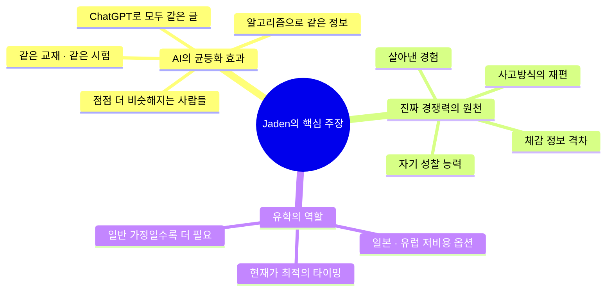
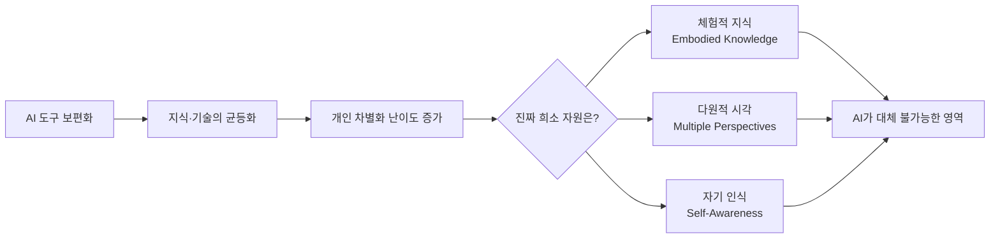
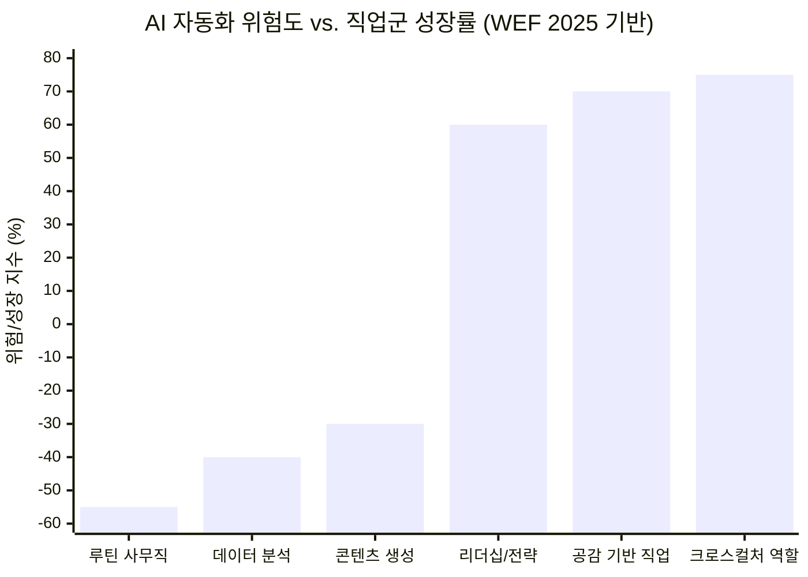
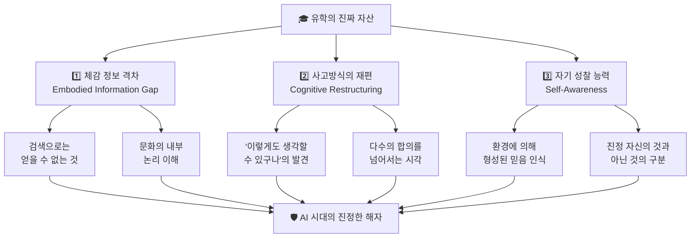
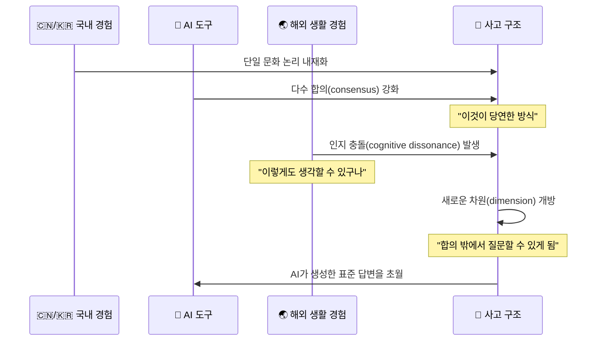
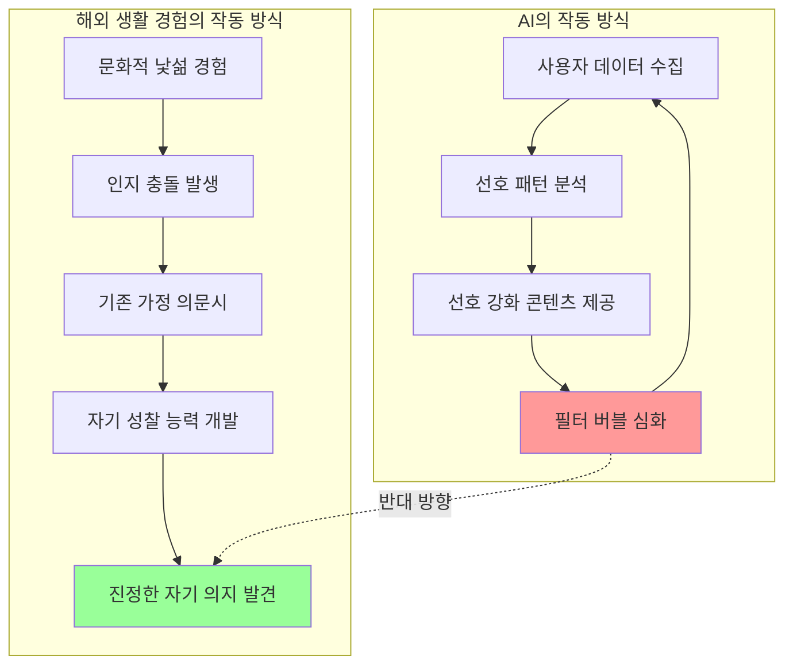
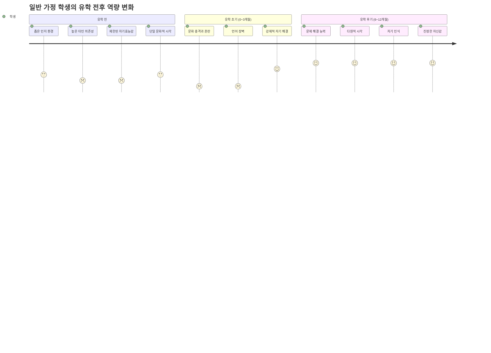
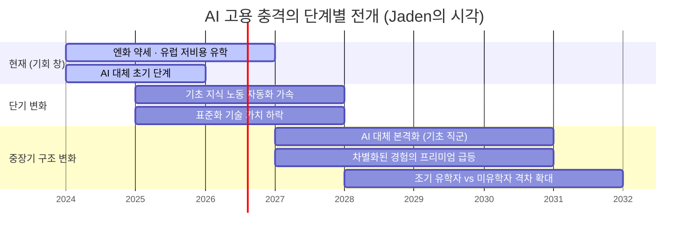
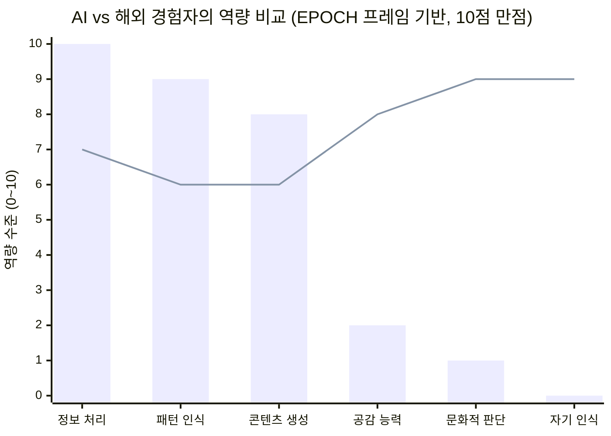

> **원문 출처:** Jaden ([@jaden_riku](https://x.com/jaden_riku/status/2042963596288934128)) — X(구 트위터), 2025년 4월 11일  
> **원문 언어:** 중국어  
> **작성 맥락:** 다년간의 유학 컨설팅 경험을 바탕으로 한 AI 시대의 유학 가치 재정의 에세이

---

## 🔍 글의 전체 구조 개요

이 에세이는 중국에서 유학 컨설팅 분야에 종사하는 Jaden이라는 인물이 작성한 것으로, 핵심 주장은 매우 명확하다. **AI가 모든 사람을 같은 평면으로 끌어내리고 있는 지금, 진정으로 대체 불가능한 인간의 자산은 '살아낸 경험'에서 비롯된다.** 그리고 그 경험을 가장 효과적으로 얻는 방법 중 하나가 바로 유학이라는 것이다.

이 글은 단순한 유학 홍보물이 아니다. AI가 지식과 기술의 균등화(평준화)를 가속화하는 시대적 흐름을 정확히 포착하면서, 그 흐름 속에서 개인이 어떻게 자신만의 차별점을 만들어낼 수 있는지에 대한 철학적·실용적 성찰을 담고 있다.

---

## 1부. AI가 만들어내는 새로운 위기: "모두가 같아지는 세상"

### 1.1 동질화의 역설 (Homogenization Paradox)

Jaden이 가장 먼저 짚어내는 것은 AI 도구의 보편화가 오히려 **개인의 차별화를 어렵게 만든다는 역설**이다.

> "당신이 ChatGPT를 쓰고, 당신의 동급생도 ChatGPT를 쓴다. 당신이 보는 정보는 알고리즘이 추천한 것이고, 동급생이 보는 것도 마찬가지다. 같은 교재, 같은 시험, 같은 공개 계정을 읽는다. 당신은 정보를 획득하고 있다고 생각하지만, 사실 당신과 주변 사람들은 점점 같은 사람이 되어가고 있다."

이것은 단순한 수사가 아니다. 경제학적으로 표현하면 **AI가 지식·기술의 한계비용을 0에 수렴시키는 현상**이 벌어지고 있다. 예전에는 좋은 글을 쓰는 능력, 데이터를 분석하는 능력이 희소 자원이었다. 하지만 이제 그것들은 클릭 한 번으로 누구나 접근 가능한 범용재(commodity)가 되었다.

### 1.2 2025~2026년 현재, 이 현상은 얼마나 심각한가

최신 데이터는 Jaden의 우려를 뒷받침한다. 세계경제포럼(WEF)의 2025년 보고서에 따르면, **2030년까지 약 9,200만 개의 일자리가 사라지고 1억 7,000만 개의 새 일자리가 생겨날 것으로 전망**된다. 그러나 문제는 숫자가 아니라 **질**이다. 사라지는 일자리는 대부분 루틴하고 반복적인 지식 노동직이며, 새로 생기는 일자리들은 고도의 판단력·공감 능력·창의성을 요구한다.

MIT의 연구에 따르면, AI가 대체하기 가장 어려운 과업은 **공감, 판단, 윤리, 희망**과 같은 고유한 인간 역량에 의존하는 것들이다. 이 역량들은 지식으로 습득되는 것이 아니라, **구체적인 삶의 맥락 속에서 경험을 통해 형성**된다. 바로 여기서 Jaden의 논리가 설득력을 얻는다.

> 음수(-) = 자동화 위험, 양수(+) = 성장 전망

---

## 2부. 유학이 진짜로 선물하는 3가지 — AI가 복제하지 못하는 것들

Jaden은 "유학의 가치"를 학력이나 언어 능력에서 찾지 않는다. 그는 세 가지 심층적인 자산을 제시하는데, 이것이 이 에세이의 핵심이다.

### 2.1 첫 번째 자산: 체감 정보 격차 (Embodied Information Gap)

Jaden이 제시하는 첫 번째 자산은 **정보 격차**인데, 이것이 일반적인 정보 격차와 다른 점이 있다. 그것은 **지식 차원이 아니라 체감(體感) 차원의 정보 격차**다.

그는 구체적인 사례를 든다. 중국 학생들이 일본에 오기 전에 갖는 일본인에 대한 이미지 — "차갑고 거리감이 있다" — 는 실제 일본 생활을 통해 완전히 다르게 이해된다. 일본인의 '거리감'은 냉담함이 아니라 **타인의 경계를 존중하는 문화적 논리의 발현**이라는 것을, 그 사회 안에서 살아보지 않으면 진정으로 이해할 수 없다.

이것은 한국어로 표현하면 **'몸으로 아는 것'** 이다. 마이클 폴라니(Michael Polanyi)가 말한 **암묵지(tacit knowledge)** 의 개념과 정확히 일치한다. 자전거 타는 법을 글로 아무리 읽어도 몸이 기억하지 않으면 자전거를 탈 수 없는 것처럼, 어떤 문화에 대한 '진짜 이해'는 그 안에서의 생활 경험 없이는 불가능하다.

**왜 AI가 이것을 복제할 수 없는가?**

AI는 방대한 텍스트 데이터로부터 학습한다. 일본 문화에 대한 수백만 개의 글을 읽고 패턴을 추출할 수 있다. 하지만 그것은 어디까지나 **외부에서 관찰한 사람들이 쓴 글들의 평균치**다. AI는 실제로 일본의 골목길을 걸어보지 않았고, 스미마셍 한마디에 담긴 복잡한 뉘앙스를 몸으로 배우지 않았다. **AI가 강화하는 것은 다수의 합의(consensus)이지, 살아있는 경험(lived experience)이 아니다.**

> 💡 **핵심 통찰:** 당신의 경쟁자들이 구글과 AI로 어떤 시장·문화를 이해할 때, 당신의 체감이 당신의 해자(moat)가 된다.

---

### 2.2 두 번째 자산: 사고방식의 재편 (Cognitive Restructuring)

두 번째 자산은 더 심층적이다. Jaden은 **다른 문화권에서 살아가는 경험이 뇌의 새로운 차원을 강제로 열어준다**고 말한다.

그가 드는 예가 인상적이다. 중국 학생들은 대체로 "석사를 왜 하는가? 더 좋은 직장을 위해서"라고 생각한다. 그런데 일본의 많은 교수와 학생들은 "이 문제 자체에 관심이 있는가?"를 먼저 묻는다. 기능성이 훨씬 약하다. Jaden은 이 두 입장 중 어느 것이 맞다고 주장하지 않는다. 그가 강조하는 것은 **"이렇게도 생각할 수 있구나"라는 인식 자체**가 생기는 순간이다.

이 순간이 왜 중요한가? 그것은 **메타인지(metacognition)의 도약**이기 때문이다. 자신의 사고방식이 '유일한 합리적 방식'이 아니라 '여러 가능한 방식 중 하나'라는 것을 깨달을 때, 인간은 비로소 다수의 합의를 넘어서는 질문을 던질 수 있게 된다.

그리고 이것이 바로 AI 시대에 가장 희귀한 능력이다. **AI는 기존 데이터에서 패턴을 추출하여 다수의 합의를 강화한다. 그 합의 바깥에서 새로운 질문을 던지는 것은 오직 인간만이 할 수 있다.**

---

### 2.3 세 번째 자산: 자기 성찰 능력 (Self-Awareness)

세 번째이자 **Jaden이 가장 중요하게 강조하는** 자산은 자기 성찰 능력이다. 그리고 그는 이것이 가장 쉽게 간과된다고 말한다.

해외 경험이 있는 많은 학생들이 그에게 하는 말이 공통적으로 있다고 한다.

> "이제야 알겠어요. 제가 예전에 가지고 있던 많은 생각들이 환경이 만들어준 것이지, 제 자신의 것이 아니었다는 걸요."

이 인식이 한번 생기면, 그 이후의 모든 의사결정이 달라진다. **"무엇이 내가 진정으로 원하는 것이고, 무엇이 단지 주변 모두가 그래서 나도 그래야 한다고 생각했던 것인가"를 구분하기 시작한다.**

이것이 왜 AI가 절대 해줄 수 없는 일인가? Jaden은 명쾌하게 설명한다. **AI의 작동 원리는 기존 선호를 강화하는 것이지, 그것을 의심하게 하는 것이 아니기 때문이다.** 알고리즘은 당신이 좋아하는 것을 더 많이 보여주도록 설계되어 있다. 필터 버블(filter bubble)은 당신의 세계관을 좁히고 굳혀가는 방향으로 작동한다. AI는 당신이 이미 가진 편향을 강화하는 데 탁월하지만, 그 편향을 발견하게 해주는 데는 무력하다.

---

## 3부. 일반 가정의 자녀일수록 더 필요한 이유

Jaden은 이 부분에서 다소 도발적인 주장을 편다. 경제적으로 넉넉하지 않은 가정일수록 자녀를 해외에 내보내야 한다는 것이다.

### 3.1 부유층 vs 일반 가정의 인지 격차

그의 논리는 이렇다. 부유층 자녀들은 이미 어릴 때부터 다양한 환경에 노출된다. 해외 여행, 국제학교, 원어민 교사 등을 통해 자연스럽게 다원적 시각을 갖게 된다. 하지만 일반 가정의 자녀들은 **처음부터 끝까지 고도로 동질화된 환경 속에서 자란다.** 접하는 사람, 정보, 사고방식이 모두 비슷비슷하다.

그런데 AI와 알고리즘이 이 격차를 **더욱 벌린다.** 모든 사람이 비슷한 콘텐츠를 소비하고, 비슷한 도구로 비슷한 결과물을 만들어내는 세상에서, 이미 좁은 인지 통로를 가진 사람들은 더욱 좁아진 통로에 갇히게 된다.

> 💡 **Jaden의 통찰:** 유학은 비교적 통제 가능한 비용으로 자녀에게 "뛰쳐나올" 기회를 주는 투자다. 그리고 그 투자의 수익은 학벌이 아니라, **AI 시대에 진정으로 대체 불가능한 것**이다.

### 3.2 일본 유학의 경제성

Jaden은 유학이 "부자들의 전유물"이 아님을 구체적인 수치로 보여준다.

| 항목 | 일본 유학 (연간 기준) | 미국/영국 유학 (연간 기준) |
|------|----------------------|-------------------------|
| 학비 | ~100만~200만원 (국립) | ~4,000만원~7,000만원 |
| 생활비 | ~600만~800만원 | ~2,500만원~4,000만원 |
| 총비용 | **~1,500만~2,000만원** | ~6,000만원~1억원+ |
| 장학금 적용 시 | 대폭 절감 가능 | 부분 절감 |

> ※ Jaden은 중국어 원문에서 연간 총비용을 15 ~ 20만 위안(약 2,800만 ~ 3,800만원)으로 언급하나, 이는 도쿄 기준 상한선에 가까우며 지방 도시나 장학금 적용 시 훨씬 줄어든다.

실제 2025 ~ 2026년 기준 데이터를 보면, 일본 유학의 주거비는 월 30만~50만원 수준이며, 생활비(식비 포함)는 월 80만원 내외가 일반적이다. 여기에 국립대학 학비(연 약 53만 엔, 한화 약 500만원)를 더해도 미국·영국에 비해 현저히 낮다.

### 3.3 유학이 만든 변화: 구체적 사례

Jaden은 자신의 상담 경험에서 인상적인 사례를 든다. 국내 이름 없는 대학(双非 본과) 출신의 내성적인 학생이 일본 유학 1년 후에 했다는 말:

> "이제야 알겠어요. 예전에 제가 어렵다고 생각했던 것들이 사실 별로 어렵지 않았다는 것을. 그냥 한 번도 스스로 부딪혀본 적이 없어서 어렵다고 생각했던 거예요."

언어도 통하지 않는 낯선 나라에서 집을 구하고, 은행 계좌를 열고, 교수와 소통하고, 비자 연장을 처리하는 과정에서 **생존 능력과 자기효능감(self-efficacy)이 근본적으로 재설정된** 것이다.

---

## 4부. 지금이 최적의 시기인 이유

Jaden은 에세이의 마지막 부분에서 시의성을 강조한다. 이 부분은 유학 컨설턴트로서의 관점이 강하게 드러나기도 하지만, 그가 제시하는 근거들은 대체로 타당하다.

### 4.1 엔화 약세와 유학 비용 절감

2025~2026년 현재, 일본 엔화는 역사적으로 낮은 수준을 유지하고 있다. Jaden이 이 글을 쓴 시점(2025년 4월)과 비교해도, 원화 기준 일본 유학 비용은 수년 전에 비해 상당히 낮아졌다. 이는 유학 실질 비용이 절감되는 구조적 기회다.

### 4.2 유럽 공립대학의 저비용 구조

독일, 노르웨이, 프랑스, 핀란드 등 유럽 다수 국가의 공립대학은 여전히 등록금이 매우 낮거나 무료다. 독일 공립대학은 유학생에게도 학기당 약 300~500유로의 행정비만 받는 경우가 많다. 2025년 기준 독일의 국제 유학생 수는 40만 명을 넘어섰다.

### 4.3 AI 고용 충격의 임박

Jaden이 가장 강조하는 시의성 논리는 이것이다. **AI가 기초 직군을 대규모로 대체하는 충격은 이제 막 시작됐다.** 향후 3~5년 안에 그 충격이 본격화될 때, "표준화된 기술"만 가진 사람들이 가장 먼저 밀려날 것이다. 그 전에 스스로를 차별화해두는 것이 훨씬 유리하다는 논리다.

실제로 WEF의 보고서는 AI가 사무직 및 지식 노동직에 미치는 영향이 선진국에서 더 크게 나타날 것이며, 임금 격차와 고용 양극화가 심화될 것으로 분석한다.

---

## 5부. AI와 살아온 경험 — 철학적 맥락

Jaden의 에세이에서 가장 심층적인 부분은 명시적으로 드러나지 않는다. 하지만 그의 논리를 철학적으로 풀어보면 여러 중요한 개념들과 연결된다.

### 5.1 암묵지(Tacit Knowledge)와 명시지(Explicit Knowledge)

마이클 폴라니가 제시한 이 구분은 Jaden의 "체감 정보 격차" 논리의 철학적 토대다.

- **명시지(Explicit Knowledge):** 언어·숫자·데이터로 전달 가능한 지식. AI가 학습하고 생성할 수 있다.
- **암묵지(Tacit Knowledge):** "말로 설명하기 어렵지만 몸이 아는" 지식. 자전거 타기, 언어의 뉘앙스, 문화적 감수성 등.

AI는 명시지 영역에서 인간을 압도한다. 하지만 암묵지는 본질적으로 경험적이다. 이것이 바로 Jaden이 말하는 "검색 만 편을 해도 얻을 수 없는 것"이다.

### 5.2 확증 편향(Confirmation Bias)과 알고리즘의 공모

AI와 알고리즘은 사용자의 기존 선호를 학습하고 그것을 강화하는 방향으로 설계되어 있다. 이는 확증 편향을 구조적으로 심화시킨다. 반면 낯선 문화에서의 생활은 확증 편향을 **강제로 깨뜨린다.** 익숙한 것들이 통하지 않는 환경에서, 인간은 자신의 기존 가정을 의문시할 수밖에 없다.

### 5.3 EPOCH 역량 프레임워크 (MIT 연구)

MIT의 최근 연구에서는 AI가 대체하기 어려운 인간 역량을 **EPOCH**으로 범주화했다:

- **E**mpathy (공감)
- **P**ersuasion (설득)
- **O**riginality (독창성)
- **C**ooperation (협력)
- **H**olistic Judgment (총체적 판단)

흥미로운 것은, 이 EPOCH 역량들이 모두 **관계와 경험의 맥락 속에서만 발현된다**는 점이다. 다원적 문화 경험은 이 역량들을 키우는 가장 강력한 환경 중 하나다.

> 막대(bar) = AI 역량 / 선(line) = 해외 경험자 역량

---

## 6부. 비판적 시각과 균형 잡힌 평가

훌륭한 에세이지만, 비판적으로 살펴볼 지점도 있다.

### 6.1 유학의 보편적 효과에 대한 의문

Jaden의 논리는 해외 생활 자체가 자동으로 성찰과 성장을 가져온다는 가정을 깔고 있다. 그러나 실제로는 많은 유학생들이 자국인 커뮤니티 안에서만 생활하며, 현지 문화와의 실질적 교류 없이 단순히 "해외에서 공부한" 경험만을 쌓고 돌아온다. **유학의 효과는 어떤 유학을 어떻게 하느냐에 크게 달려 있다.**

### 6.2 디지털 글로벌 경험의 가능성

또한, AI와 디지털 도구의 발전으로 물리적 이동 없이도 다원적 경험을 쌓는 방법이 늘어나고 있다는 반론도 가능하다. 온라인 커뮤니티, 가상 교환학생, 리모트 협업 등을 통해 다문화 경험이 가능해지고 있다. 물론 이것이 Jaden이 말하는 "체감"의 깊이에 도달할 수 있을지는 별개의 문제다.

### 6.3 기회비용의 현실

일본 유학 1년의 비용이 1,500만~2,000만원 수준이더라도, 이것이 "상대적으로 통제 가능한 비용"으로 느껴지는 것은 가정의 경제 상황에 따라 크게 다르다. 장학금 정보 접근성과 관료적 절차에서도 정보력과 자원의 격차가 존재한다.

---

## 7부. 핵심 메시지 요약

```mermaid
flowchart LR
    subgraph prob["🔴 문제 인식"]
        P1[AI가 모든 사람을 같은 평면으로]
        P2[지식·기술의 균등화 가속]
        P3[개인 차별화 점점 더 어려워짐]
    end

    subgraph source["🟡 해법의 원천"]
        S1[살아낸 경험 Lived Experience]
        S2[체감적 이해 Embodied Understanding]
        S3[다원적 시각 Multiple Perspectives]
    end

    subgraph gift["🟢 유학의 선물"]
        G1[체감 정보 격차]
        G2[사고방식 재편]
        G3[자기 성찰 능력]
    end

    subgraph conclusion["🔵 결론"]
        C1[AI가 복제 불가능한 고유한 인간 자산]
        C2[지금이 최적의 행동 시점]
    end

    prob --> source
    source --> gift
    gift --> conclusion
```

### 핵심 명제 3가지

1. **AI는 '다수의 합의'를 강화하고, 유학은 '합의 밖의 세계'를 경험하게 한다.**  
   AI가 학습하는 데이터는 이미 세상에 존재하는 것들의 패턴이다. 새로운 패턴을 만들어내는 능력은 그 패턴 밖에서 살아본 경험에서 나온다.

2. **체감지(體感知)는 명시지(明示知)가 아니기 때문에, AI가 생성하거나 전달할 수 없다.**  
   문화의 논리를 몸으로 이해하는 것, 다른 사고 방식을 '머리가 아닌 삶으로' 접해보는 것은 언어화가 불가능한 영역의 자산이다.

3. **자기 성찰은 자신의 편향을 강화하는 알고리즘이 절대 해줄 수 없는 일이다.**  
   진정한 자아 발견은 낯선 환경이 기존의 당연함을 낯설게 만드는 순간에 시작된다.

---

## 마무리: 이 에세이의 맥락과 가치

Jaden의 에세이는 유학 컨설턴트의 관점에서 쓰인 것이기에, 어느 정도의 마케팅적 동기가 깔려 있음을 독자는 인지해야 한다. 그러나 그의 핵심 논지 — **AI 시대에 진정으로 희귀한 것은 살아낸 경험이고, 그것을 통해 형성된 고유한 시각이다** — 는 설득력 있는 분석이다.

더 넓게 보면, 이 에세이는 AI 시대의 인간 자본(human capital) 이론을 재정의하는 작업이기도 하다. 지식의 가치가 폭락하는 세상에서 무엇이 인간의 경제적 가치를 만드는가 — 이 질문에 대한 Jaden의 답은 명확하다. **"당신이 직접 살아낸 것."**

AI는 정보를 생성할 수 있다. 하지만 의미(meaning)를 만들어낼 수는 없다. 그리고 의미는 언제나 구체적인 삶의 맥락 — 어떤 거리를 걸어보고, 어떤 사람들과 부딪혀보고, 어떤 실패와 발견을 직접 경험한 맥락 — 에서 태어난다.

---

*문서 작성: Claude Sonnet 4.6 | 원문 출처: Jaden (@jaden_riku), X(Twitter) | 2025.04.11*  
*참고: WEF Future of Jobs Report 2025, MIT EPOCH 연구, ICEF 국제 유학 시장 데이터 2025*
