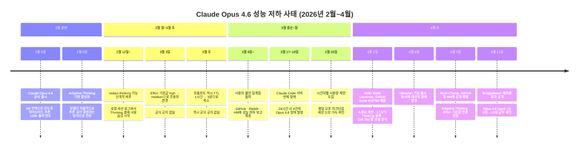
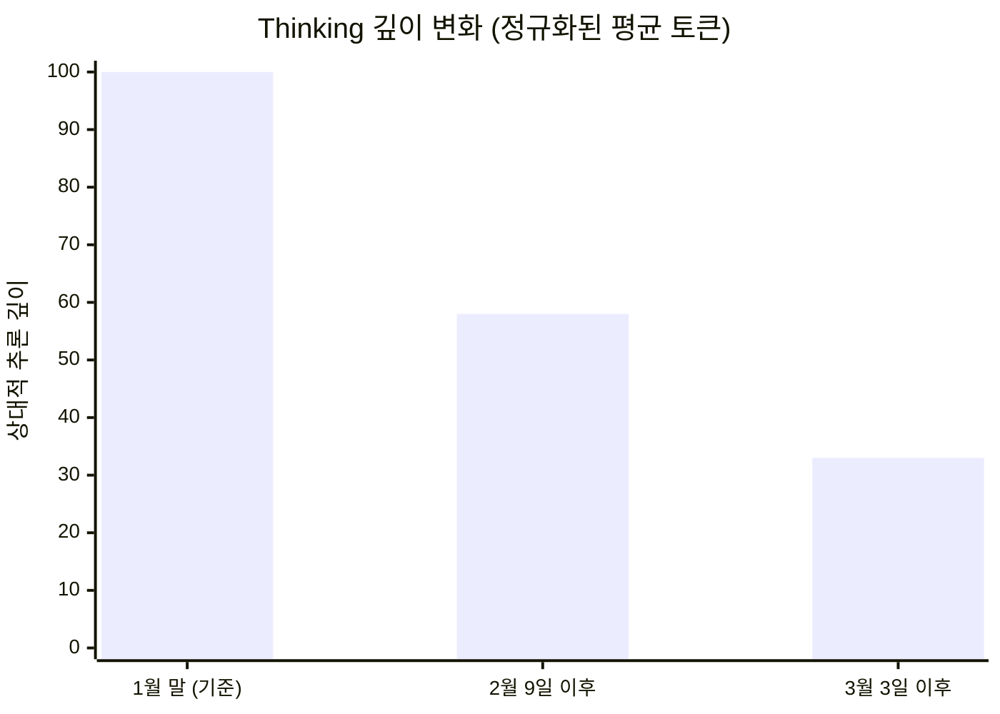
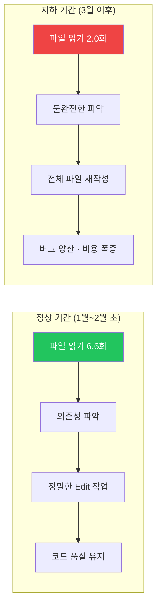
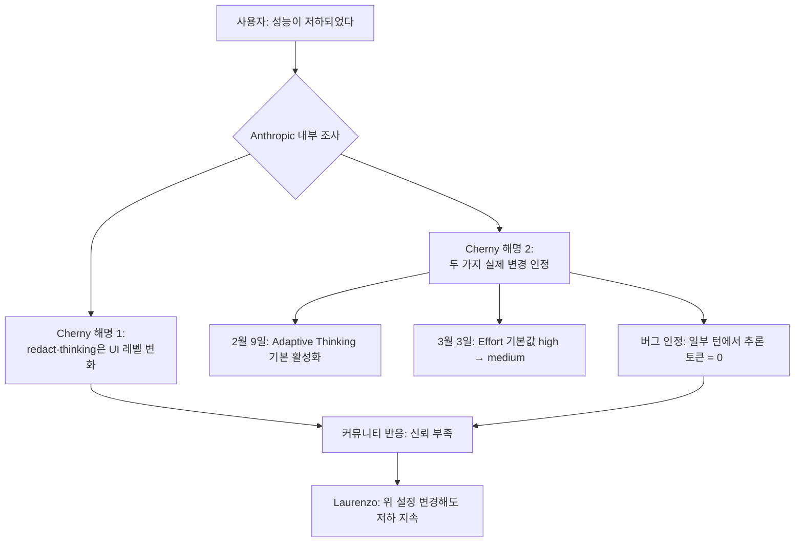
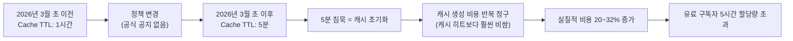
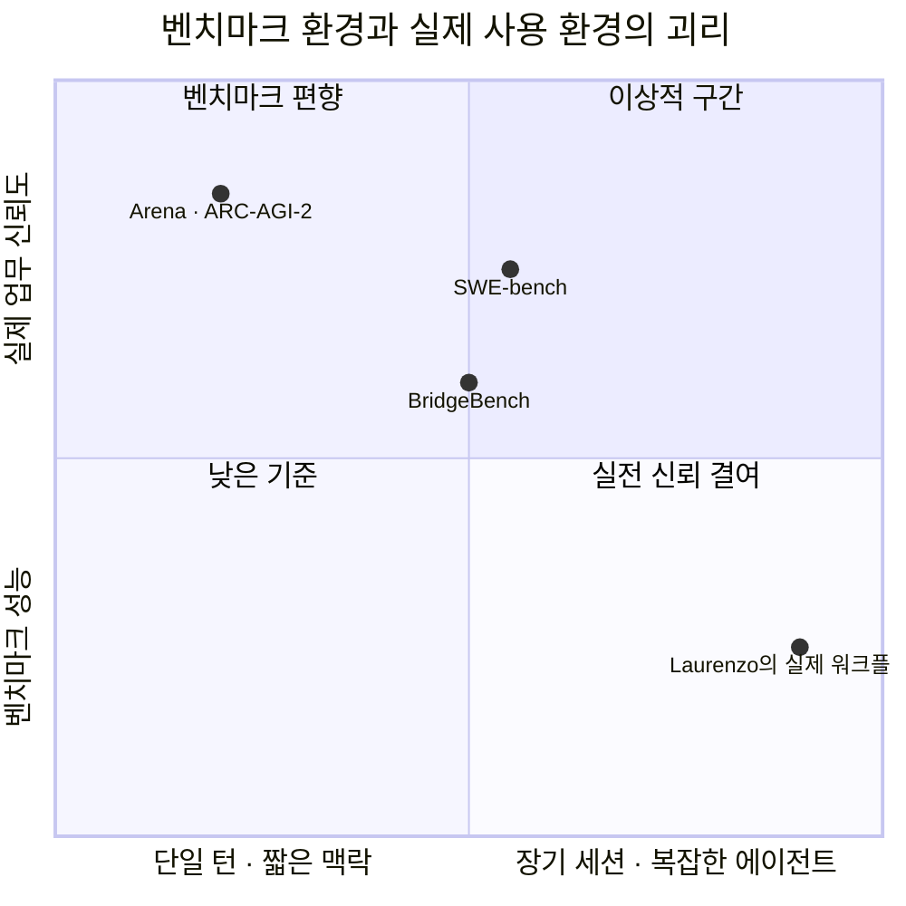
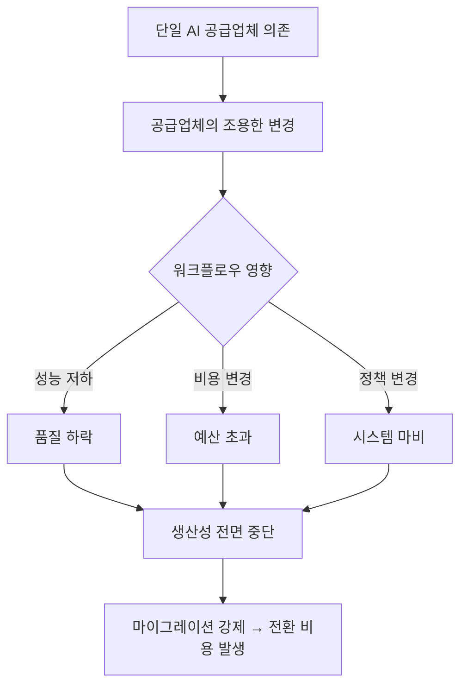
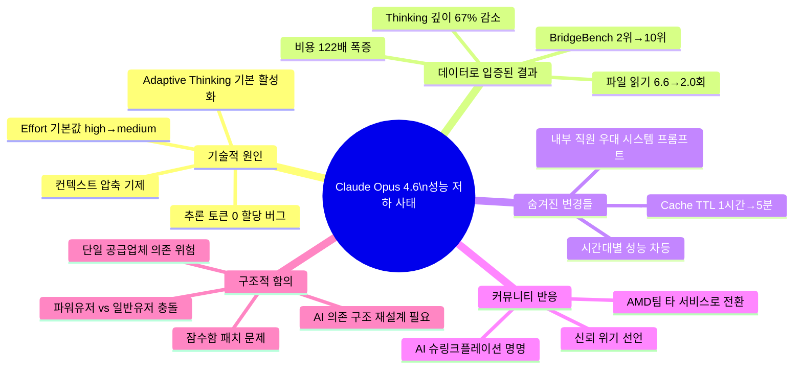

> **BridgeBench 할루시네이션 벤치마크 · AMD Stella Laurenzo 보고서 · Boris Cherny 해명 · 캐시 정책 논란까지**
>
> 작성 기준: 2026년 4월 13일
> 출처: BridgeBench(bridgemind.ai) · GitHub Issue #42796 · Threads [@crealwork]( https://www.threads.com/@crealwork/post/DXDiUKMlBRS) · Threads [@choi.openai](https://www.threads.com/@choi.openai/post/DXDsO2EkzIn) · TokenCost · BigGo Finance · The Cherry Creek News

---

## 서론: "기분 탓이 아니었다"

2026년 2월 이후, 전 세계 Claude 헤비유저들 사이에서 이상한 기류가 퍼지기 시작했다. "이전보다 멍청해진 것 같다", "코드도 안 읽고 수정한다", "Thinking이 줄었다"는 불만이 Reddit, GitHub, Hacker News를 뒤덮었다. 처음에는 그저 주관적인 인상에 불과한 듯 보였다.

그러나 AMD의 선임 AI 디렉터가 6,852개 세션 로그를 직접 분석해 **Thinking 깊이 67% 감소**라는 수치를 내놓으면서, 단순한 기분의 문제가 아님이 데이터로 입증되었다. 이후 Claude Code 팀 리더 Boris Cherny가 공개 해명에 나섰고, 숨겨진 캐시 정책 변경과 내부 직원 우대 시스템 프롬프트 존재까지 드러나면서 이 사태는 **AI 업계 최대 신뢰 위기**로 확대되었다.

이 문서는 사태의 발단이 된 BridgeBench 리더보드 이미지부터, 데이터 분석 보고서, 공식 해명, 커뮤니티 반응, 그리고 이 사태가 AI 의존 구조 전반에 던지는 함의까지 모든 것을 정리한다.

---

## 1. BridgeBench Hallucination Bench — 이미지 상세 해설

### 1.1 벤치마크란 무엇인가


**BridgeBench**(bridgemind.ai)는 AI 모델들의 실제 코딩 관련 성능을 다각도로 평가하는 독립 벤치마크 플랫폼이다. 그 중 **Hallucination Bench**는 AI 모델이 코드를 분석할 때 얼마나 자주 거짓 정보를 생성하는지를 정량적으로 측정한다.

평가 방식은 다음과 같다.
- **30개 태스크, 6개 클러스터, 총 175개 질문**으로 구성
- API 지식(Map/Set 동작, Node.js 암호화, Promise, 정규식, Zod), 버그 탐지(비동기 경쟁 조건, 클로저 스코핑, 타입 강제 변환), 프레임워크 동작 등의 영역 포함
- **코드 실행 및 실제 정답(ground truth)** 으로 검증하여 주관적 평가 배제

세 가지 핵심 지표를 측정한다.

| 지표 | 설명 | 방향 |
|------|------|------|
| **Score** | 정확도와 조작률을 종합한 최종 점수 | 높을수록 우수 |
| **Accuracy** | 코드 동작에 관한 주장 중 정확한 비율 | 높을수록 우수 |
| **Fabrication Rate** | 존재하지 않는 API·동작·구현 세부사항을 자신 있게 주장한 비율 | **낮을수록 우수** |

### 1.2 리더보드 전체 데이터 (2026년 4월 12일 기준)

| 순위 | 모델 | 점수 | 정확도 | 조작률 |
|------|------|:----:|:------:|:------:|
| 👑 1위 | Grok 4.20 Reasoning (x-ai) | 91.8 | 90.0% | 10.0% |
| 🔴 **2위** | **Claude Opus 4.6** (anthropic/claude-opus-4-6) | **87.6** | **83.3%** | **16.7%** |
| 3위 | GPT-5.4 (openai/gpt-5.4) | 86.1 | 83.3% | 16.7% |
| 4위 | Qwen 3.6 Plus (openrouter/qwen) | 79.7 | 75.2% | 26.5% |
| 5위 | Gemini 3.1 Pro (google) | 79.1 | 74.7% | 26.7% |
| 6위 | Qwen3.5 Plus 2026-02-15 | 77.3 | 72.2% | 29.0% |
| 7위 | Claude Sonnet 4.6 (anthropic) | 76.6 | 72.4% | 28.9% |
| 8위 | Grok 4.20 Non-Reasoning (x-ai) | 76.1 | 71.9% | 29.7% |
| 9위 | Gemini 3 Pro (google) | 75.9 | 71.9% | 30.0% |
| 🔴 **10위** | **Claude Opus 4.6 (April 12)** (anthropic/claude-opus-4-6-apr12) | **73.3** | **68.3%** | **33.0%** |

### 1.3 핵심: 동일 모델의 두 스냅샷이 같은 리더보드에 공존

이미지에서 붉은 박스로 강조된 두 항목, **2위의 "Claude Opus 4.6"** 과 **10위의 "Claude Opus 4.6 (April 12)"** 는 동일 모델의 서로 다른 시점 스냅샷이다. 즉, 4월 12일 이후 측정된 Opus 4.6이 그 이전 버전 대비 극적인 성능 저하를 보인다는 것을 같은 리더보드 안에서 직접 비교할 수 있다.

```
[조작률(Fabrication Rate) 비교]

Claude Opus 4.6 (이전):     16.7%  ████░░░░░░
Claude Opus 4.6 (Apr 12):  33.0%  ████████░░

증가율: (33.0 - 16.7) / 16.7 × 100 ≈ 97.6% → 약 98% 증가
점수 하락: 87.6 → 73.3 (-14.3점)
순위 하락: 2위 → 10위 (-8계단)
```

Threads @crealwork의 "할루시네이션 98% 이상 늘어났다"는 주장은 이 수치에 정확히 기반한다. 단일 모델의 두 버전이 최상위권과 최하위권에 동시 존재하는 것은 매우 이례적인 사태다.

---

## 2. 사건의 전체 타임라인



---

## 3. AMD 분석 보고서 — 데이터가 밝힌 진실

### 3.1 Stella Laurenzo는 누구인가

이 사태의 기폭제가 된 분석을 수행한 인물은 **Stella Laurenzo**로, AMD의 Senior Director AI Group이자 MLIR·IREE(ML 컴파일러 인프라스트럭처) 오픈소스 개발 팀을 이끄는 선임 엔지니어다. 그는 Claude Code를 50개 이상의 에이전트 세션에서 동시에 활용해 C, MLIR, GPU 드라이버 같은 시스템 프로그래밍 작업을 수행해왔다.

2026년 4월 2일, 그는 Claude Code 공식 GitHub 레포지토리에 **Issue #42796**을 제출했다. 제목은 "Claude Code is unusable for complex engineering tasks with the Feb updates"였으며, 이 이슈는 Hacker News에서 **790점**을 기록하며 커뮤니티를 강타했다.

### 3.2 분석 규모와 방법론

분석은 다음 규모로 수행되었다.

| 분석 항목 | 수치 |
|-----------|------|
| 분석 세션 JSONL 파일 수 | 6,852개 |
| 추출된 Thinking 블록 수 | 17,871개 |
| 분석된 툴 호출 수 | 234,760회 |
| 분석 기간 | 2026년 1월 말 ~ 4월 초 (약 3개월) |
| 분석 주체 | Claude Opus 4.6 자신이 자기 로그를 분석 |

이 분석은 "느낌이 나빠졌다"는 주관적 불만이 아니라, 모델 자신이 자기 세션 로그를 분석하여 객관적 수치를 도출한 결과다. 그 결과는 충격적이었다.

### 3.3 Thinking 깊이 67% 감소



2월 업데이트 이후 추론 깊이는 단계적으로 급감했다. 첫 번째 변화(Adaptive Thinking 기본 활성화)로 약 42% 감소, 두 번째 변화(Effort 기본값 medium 변경)로 추가 감소하여 최종적으로 원래 대비 **약 67%의 Thinking이 사라졌다**.

특히 Stella Laurenzo는 redact-thinking 기능의 배포보다 **추론 깊이 감소가 먼저 시작되었음**을 증명했다. 서명(signature) 필드를 프록시 지표로 사용해 7,146개 쌍을 분석한 결과 피어슨 상관계수 **r = 0.971**을 확인했으며, 이 신호는 Thinking이 아직 로그에 100% 보이던 시점부터 하락을 기록했다. 즉, "Thinking을 숨겨서 지표가 낮아 보이는 것"이라는 Anthropic 측 해명은 데이터와 맞지 않는다.

### 3.4 행동 패턴의 근본적 변화: "연구자"에서 "무모한 작업자"로

추론 깊이 감소는 단순히 느린 생각을 빠르게 만든 것이 아니라, **작업 방식 자체를 바꿔버렸다**.



| 지표 | 정상 기간 | 저하 기간 | 변화율 |
|------|:--------:|:--------:|:------:|
| 수정당 파일 읽기 횟수 | 6.6회 | 2.0회 | **-70%** |
| 사전 파일 읽기 없는 수정 비율 | 낮음 | 전체의 1/3 | **급증** |
| 전체 파일 재작성(Write) 비율 | 4.9% | 10.0%~11.1% | **+100%** |
| 사용자 프롬프트 내 "simplest" 빈도 | 기준 | +642% | **폭증** |
| 사용자 프롬프트 내 "commit" 빈도 | 기준 | -58% | **급감** |
| "please" / "thanks" 사용 빈도 | 기준 | 감소 | **협업→교정 관계로 전환** |

"commit" 빈도 58% 감소는 코드가 더 이상 커밋 가능한 수준에 도달하지 못한다는 의미이며, "please"와 "thanks"의 감소는 사용자가 모델과 협업하는 것이 아니라 모델의 실수를 반복적으로 교정하는 관계로 전락했음을 보여준다.

### 3.5 비용의 역설: 아끼려다 폭증한 청구 비용

Anthropic이 Adaptive Thinking을 도입한 표면적 이유는 "단순 작업에서 토큰을 절약"하는 것이었다. 그러나 실제 결과는 정반대였다.

Stella Laurenzo의 팀은 사용자 프롬프트 수가 거의 동일하게 유지되었음에도 불구하고 다음과 같은 비용 폭증을 경험했다.

| 지표 | 2월 (정상) | 3월 (저하 후) | 배수 |
|------|:----------:|:------------:|:----:|
| API 요청 수 | 기준 | 80배 | **×80** |
| 총 입력 토큰 | 기준 | 170배 | **×170** |
| 총 출력 토큰 | 기준 | 64배 | **×64** |
| 월간 비용 (Bedrock 기준) | $345 | $42,121 | **×122** |

추론을 줄여 아끼려 했으나, 모델이 불완전한 파악으로 실수를 반복하면서 재시도, 루프, 무효한 전체 파일 재작성이 폭발적으로 늘었고, 이것이 실질적인 유효 작업당 API 비용을 **8~16배** 증폭시켰다. 결국 Laurenzo의 팀은 **전체 자동화 에이전트 클러스터를 종료하고 단일 세션 인간 감독 모드로 회귀**해야 했다.

---

## 4. Boris Cherny의 공개 해명

### 4.1 해명의 배경

GitHub Issue #42796이 Hacker News에서 폭발적인 반응을 얻자, **Boris Cherny** — Claude Code의 창시자이자 엔지니어링 매니저 — 가 GitHub 이슈 스레드와 Hacker News에 직접 등장해 해명을 내놓았다. 그는 Claude Code의 코드 100%를 Claude Code 스스로 작성하고 있다고 밝힌 인물이기도 하다.



### 4.2 해명 내용 요약

**첫 번째 해명: redact-thinking은 순수한 UI 변경**
Cherny는 Thinking 내용이 세션 로그에서 사라진 것은 응답 속도 개선을 위한 UI 레벨 변화일 뿐, 모델의 실제 추론 로직이나 Thinking 예산에는 전혀 영향이 없다고 주장했다. 사용자는 `settings.json`에 `showThinkingSummaries: true`를 추가하면 이전처럼 Thinking 요약을 볼 수 있다고 안내했다.

그러나 이 해명은 Laurenzo의 데이터와 충돌한다. Thinking이 여전히 로그에 완전히 표시되던 시점부터 이미 추론 깊이 감소가 시작되었기 때문이다.

**두 번째 해명: 두 가지 실질적 변경 인정**
Cherny는 다음 두 가지 변경이 실제로 이루어졌음을 공개적으로 인정했다.

1. **2026년 2월 9일**: Opus 4.6 출시와 함께 Adaptive Thinking 기본 활성화. 이 모드에서 모델은 각 턴(turn)마다 얼마나 깊이 생각할지를 스스로 결정한다. 기존의 고정 Thinking 예산 방식을 대체했다.
2. **2026년 3월 3일**: Effort 기본값을 `high`에서 `medium`(값: 85)으로 낮춤. 이 변경은 어떤 공식 공지나 릴리스 노트에도 포함되지 않았다.

**버그 인정: 추론 토큰 = 0 발생**
가장 충격적인 인정은 Adaptive Thinking이 특정 턴에서 추론 토큰을 **완전히 0으로 할당하는 버그**가 존재했다는 것이다. Cherny는 Hacker News에 직접 다음과 같이 적었다.

> "모델이 조작을 일으킨 특정 턴들(Stripe API 버전, git SHA 접미사, apt 패키지 목록)에서는 추론 토큰이 전혀 방출되지 않았던 반면, 깊이 추론한 턴에서는 정확했습니다."

즉, 모델이 "이건 쉬운 질문이겠지"라고 판단한 순간 추론을 전혀 하지 않고 답을 생성했고, 그 결과 존재하지 않는 커밋 SHA, 없는 apt 패키지, 출시된 적 없는 Stripe API 버전 같은 구체적이고 그럴듯한 환각이 폭발적으로 증가했다.

**제공된 임시 해결책**
- Claude Code 세션 시작 시 `/effort max` 입력
- 환경변수 `CLAUDE_CODE_EFFORT_LEVEL=max` 설정
- `CLAUDE_CODE_DISABLE_ADAPTIVE_THINKING=1` 설정
- `CLAUDE_CODE_AUTO_COMPACT_WINDOW=400000`로 컨텍스트 창 크기 제한

**커뮤니티 반응**
Laurenzo는 위 설정을 모두 조합해 시도했으나 저하가 지속되었다고 보고했다. 커뮤니티 대다수는 Cherny의 해명에 회의적이었으며, "자신이 만든 제품의 문제를 초기 대응 시 완전히 파악하지 못한 것 아니냐"는 의혹도 제기되었다.

---

## 5. 숨겨진 변경들 — 더 깊은 논란

### 5.1 캐시 TTL 축소: 조용한 과금 정책 변경

성능 저하와 더불어, **프롬프트 캐시 유지 시간(Cache TTL)** 정책이 공지 없이 변경된 사실도 드러났다.



이 변경의 영향은 심각했다. 5분 이상 작업을 멈추면 캐시가 초기화되어, 재시작 시마다 비싼 캐시 생성 비용이 다시 발생한다. 분석 결과 이로 인해 사용자들은 실질적으로 **20~32%의 비용을 추가로 지출**하게 되었다.

Anthropic의 공식 해명은 더욱 논란을 키웠다. "1시간 유지가 버그였으며, 5분으로 단축한 것이 전체적인 비용을 낮추는 최적화"라는 것이었다. 사용자들은 "기업 서버 비용을 절감하기 위해 고객에게 비용을 전가하면서 그것을 '최적화'라 부른다"며 극도의 반감을 표출했다.

### 5.2 내부 직원 우대 시스템 프롬프트 유출

상황을 더욱 악화시킨 것은 Claude Code 소스 코드 유출 사건이었다. 2026년 3월 말, npm 패키지 v2.1.88에 59.7MB 크기의 소스 맵 파일이 번들로 포함되어 1,884개 TypeScript 파일, 64,464줄의 코드가 공개되었다(Bun이 기본으로 소스 맵을 생성하는 과정에서 발생한 실수).

유출된 코드에서 더 충격적인 사실이 발견되었다. Anthropic 내부 직원(`ant` 계정)에게는 일반 사용자와 다른, **훨씬 우수한 시스템 프롬프트**가 제공되고 있었다. 특히 "작업 완료 전 실제로 작동하는지 검증하라"는 지시가 포함된 내부 전용 프롬프트의 존재는 "같은 돈을 내고 다른 수준의 서비스를 받고 있는 것 아니냐"는 의혹으로 이어졌다.

커뮤니티에서는 이미 GitHub Issue를 통해 "Opus 한도 소진 후 Sonnet으로 조용히 전환", "내부 직원 전용 풀 기능 Thinking 유지" 등의 추가 의혹도 제기된 상태다.

### 5.3 시간대별 성능 저하 패턴

Stella Laurenzo의 분석에 따르면 성능 저하가 균일하게 발생한 것이 아니라 **평일 오후 5시, 7시 등 서버 트래픽이 집중되는 시간대에 더욱 심했다**는 사실도 드러났다. 이는 GPU 부하 분산을 위해 피크 시간대에 모델의 추론 예산을 더욱 공격적으로 축소하는 메커니즘이 존재할 가능성을 시사한다. Anthropic은 이 메커니즘의 존재를 부인했지만, 같은 기간 시간대별 사용량 제한 정책(time-of-day rate limiting)을 도입했다는 사실이 용량 제약의 실재를 방증한다.

---

## 6. BridgeBench 데이터를 둘러싼 논쟁

이미지의 리더보드 데이터가 단순하지 않은 이유가 있다. 이를 둘러싼 팽팽한 이견도 공정하게 소개해야 한다.

**반론의 핵심 주장**: 과거의 벤치마크는 6개 태스크 기반이었으나, 최신 측정은 30개 태스크로 확장되었다. 두 버전을 비교하는 것 자체가 방법론적으로 부적절하며, 공통된 6개 태스크만을 비교하면 정확도 하락은 통계적으로 유의미하지 않은 수준(p ≈ 0.19의 통계적 노이즈)에 불과하다.

**주장을 뒷받침하는 근거**: 실제로 LMSYS Chatbot Arena 기준 2026년 4월 6일 시점에서 Claude Opus 4.6 Thinking은 Arena Elo **1504**로 역대 최초로 1500을 돌파한 1위 모델이다. 또한 ARC-AGI-2에서 69.17%를 기록하며 GPT-5.2 대비 14.6포인트 앞섰고, SWE-bench Verified에서도 80.8%를 기록했다.

**반론의 한계**: 그러나 Chatbot Arena는 단일 턴 혹은 짧은 멀티턴 상호작용을 평가하는 플랫폼이다. Laurenzo의 문제 제기는 구체적으로 **장기 세션, 멀티 파일, 멀티 에이전트 동시 엔지니어링 작업** — Claude Code가 정확히 설계된 용도 — 에서의 회귀를 다룬다. 리더보드 상위권을 기록하는 것과, 실제 엔터프라이즈 워크플로우에서 신뢰할 수 있는지는 별개의 문제다.



결론적으로, **BridgeBench의 데이터 해석에는 주의가 필요하지만**, 체감 성능 저하 자체는 다수의 독립적인 데이터소스에 의해 뒷받침되며 부정하기 어렵다.

---

## 7. Mythos 가설 — 자원이 몰린 곳은 어디인가

커뮤니티 일각에서는 이 사태가 단순한 실수가 아니라, 다음 모델 출시를 위한 의도적인 컴퓨팅 재배분이라는 가설을 제기한다.

**가설의 논리**: Anthropic이 차세대 모델 **Mythos**(현재 특정 사이버보안 파트너 Amazon, Apple, Cisco, Microsoft 등에게만 제한 공개)의 학습 혹은 인퍼런스에 GPU를 집중시키면서, Opus 4.6의 추론 예산을 조용히 삭감했다는 것이다.

**반박 근거**: TokenCost의 분석에 따르면 Mythos는 현재 일반 공개가 되지 않아 Claude Code로 마이그레이션이 불가능한 상태이며, 저하로 인해 Anthropic이 얻는 직접적인 상업적 이익이 명확하지 않다. 더 설득력 있는 설명은 **Effort 기본값 변경이 평균적 사용자를 위한 비용 최적화였으나, 파워유저의 복잡한 엔지니어링 워크플로우에는 치명적으로 작용한 설계 실패**라는 것이다.

그럼에도 불구하고, 커뮤니티는 "Anthropic의 전형적인 플레이북"이라는 표현을 사용한다. 새로운 모델을 출시하면서 기존 모델을 조용히 약화시키고, 사용자가 알아채면 프롬프트 작성 방식의 문제로 돌린다는 것이다.

---

## 8. 구조적 함의 — AI 의존의 위험성

이 사태가 개별 모델의 성능 저하를 넘어 던지는 더 큰 질문이 있다.

### 8.1 단일 공급업체 의존의 취약성

AMD의 경우가 대표적이다. Laurenzo의 팀은 Claude에 기반한 AI 컴파일러 워크플로우를 정교하게 구축해두었으나, **단 한 번의 공지 없는 업데이트**로 인해 시스템 전체가 마비되는 피해를 입었다. 결국 다른 AI 제공업체로 전환을 선언해야 했다.



### 8.2 AI 슈링크플레이션의 등장

커뮤니티는 이 현상을 **"AI 슈링크플레이션(AI Shrinkflation)"** 이라 명명했다. 식품 업계에서 가격을 유지하면서 내용물을 줄이는 것처럼, AI 서비스도 동일한 구독료를 받으면서 모델의 실질적 성능을 조용히 낮추는 방식으로 이윤을 최적화한다는 것이다.

### 8.3 파워유저와 일반 사용자의 이해충돌

이번 변경은 단순 작업을 하는 일반 사용자에게는 응답 속도 향상이라는 혜택을 가져왔을 수 있다. 그러나 장시간 복잡한 에이전트 워크플로우를 운영하는 파워유저에게는 치명적이었다. Anthropic의 제품 결정이 **"평균적 사용자 최적화"를 위해 "극한 사용자의 경험"을 희생시키는 방향**으로 이루어진 것이다. 문제는 이 결정이 공개적으로 논의되지 않았다는 점이다.

---

## 9. 사용자 대응 가이드 — 지금 당장 할 수 있는 것

Claude Code를 사용 중이라면 다음 설정을 적용해 일부 성능을 복구할 수 있다. Boris Cherny가 직접 확인한 임시 해결책이다.

### 9.1 즉시 적용 가능한 설정

```bash
# 방법 1: Claude Code 세션 내 명령
/effort max

# 방법 2: 환경변수 설정
export CLAUDE_CODE_EFFORT_LEVEL=max
export CLAUDE_CODE_DISABLE_ADAPTIVE_THINKING=1
export CLAUDE_CODE_AUTO_COMPACT_WINDOW=400000

# 방법 3: settings.json에 추가
{
  "showThinkingSummaries": true
}
```

### 9.2 효과의 한계

Laurenzo의 팀은 위 설정을 모두 시도했음에도 성능 저하가 지속되었다고 보고했다. 즉, 위 설정은 완전한 해결책이 아닌 부분적 개선일 수 있다.

### 9.3 모델 종속성 탈피를 위한 구조적 대응

| 전략 | 내용 |
|------|------|
| **멀티 공급업체 아키텍처** | OpenAI, Anthropic, Google 등 여러 제공업체를 동시에 사용할 수 있도록 추상화 레이어 구축 |
| **성능 모니터링 자동화** | Laurenzo의 stop-phrase-guard.sh 같은 훅을 활용해 모델 품질 저하를 자동 감지 |
| **비용 이상 탐지** | API 비용이 기준 대비 급증할 경우 알림을 받는 임계값 설정 |
| **캐시 정책 인식** | 5분 이상 작업이 중단될 경우 캐시 재초기화 비용 발생을 인지하고 세션 관리 |
| **중요 워크플로우 독립성** | 핵심 생산 파이프라인이 단일 AI 서비스에 완전히 의존하지 않도록 설계 |

---

## 10. 결론 — 이 사태가 남긴 것



이 사태의 가장 강력한 교훈은 Stella Laurenzo의 말에 담겨 있다.

> "6개월 전, Claude는 추론 품질과 실행 능력 면에서 독보적인 존재였다. 그러나 다른 경쟁자들도 이제 주시해야 한다. Anthropic은 더 이상 Opus가 점유했던 능력 수준의 유일한 플레이어가 아니다."

이것은 단순히 "Claude가 나빠졌다"는 불평이 아니다. AI 서비스가 성숙함에 따라 공급업체들이 **사용자의 워크플로우가 아닌 자사의 이윤을 위해 최적화**하는 것이 구조적 필연임을 이 사태는 명확히 보여준다.

모든 AI 기업은 궁극적으로 고객의 워크플로우보다 자사의 이익을 위해 움직인다. 이 사실을 직시하고, 단일 공급업체가 생산성을 독점하지 않도록 **모델에 종속되지 않는 범용적 구조 설계 능력**을 갖추는 것, 그것이 AI 시대 엔지니어와 조직이 갖춰야 할 핵심 역량이다.

---

*작성 기준: 2026년 4월 13일*
*주요 출처: BridgeBench(bridgemind.ai) · GitHub anthropics/claude-code Issue #42796 · Threads @crealwork · Threads @choi.openai · TokenCost(tokencost.app) · BigGo Finance · The Cherry Creek News · Lilting Channel · Pasquale Pillitteri*
