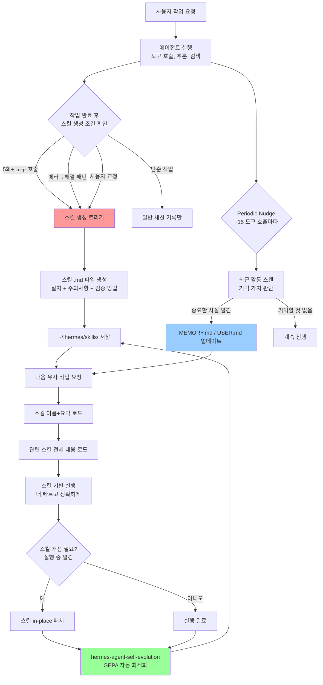
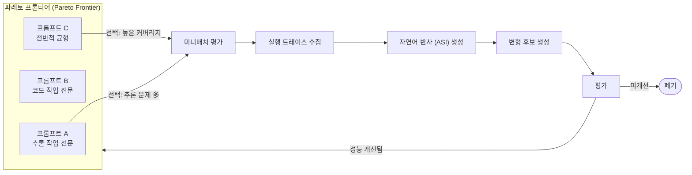
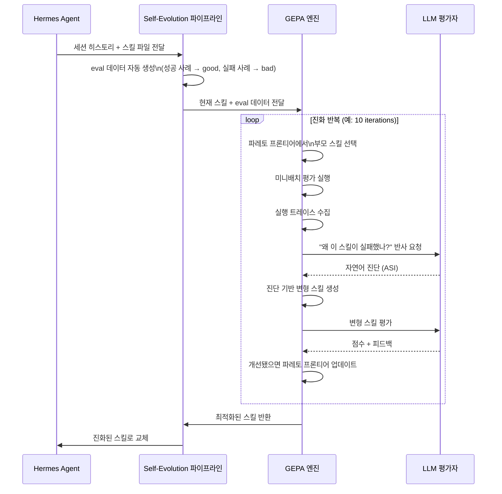
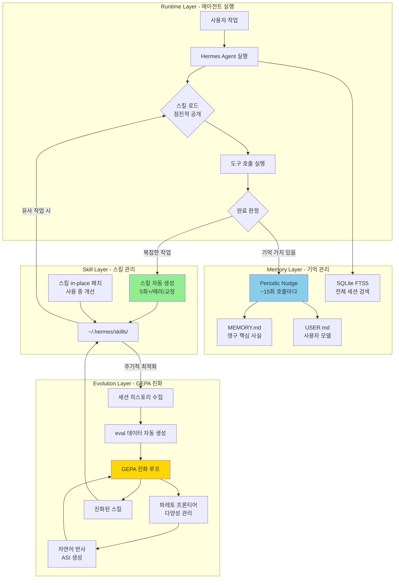

> **출처**: vibe.nooob Threads 포스트 + 최신 검색 기반 심층 분석  
> **작성일**: 2026년 4월 13일  
> **핵심 키워드**: Hermes Agent, GEPA, 자기 진화, 스킬 생성, Periodic Nudge, Nous Research

---

## 0. 왜 이게 소름인가 — 먼저 맥락부터

AI 에이전트 업계에서 "학습한다"는 말은 대부분 마케팅 언어에 가깝다. 실제로는 두 가지 수준에 머문다. 하나는 단순히 대화 히스토리를 컨텍스트 창에 쑤셔 넣는 것, 다른 하나는 프롬프트 캐싱으로 반복 호출 비용을 줄이는 것. 둘 다 에이전트가 "더 나아지는" 것이 아니라, 이전에 했던 말을 기억하는 것에 불과하다.

Hermes Agent가 주목받는 이유는 이 관점을 근본적으로 깨트렸기 때문이다. 이 에이전트는 대화 내용 자체를 기억하는 것이 아니라, **작업 과정에서 발견한 절차를 스킬(Skill)로 추출·저장·진화**시킨다. 그것도 GPU 없이, 순수하게 API 호출과 자연어 반사(Reflection)만으로. 그리고 이 스킬이 ICLR 2026 Oral로 선정된 GEPA 알고리즘을 통해 자동으로 최적화된다.

이것이 왜 다른가를 이해하기 위해, Hermes의 전체 구조를 차근차근 뜯어보자.

---

## 1. Hermes Agent란 무엇인가

### 1.1 개요

Hermes Agent는 **Nous Research**가 2026년 2월 오픈소스(MIT 라이선스)로 공개한 자율 AI 에이전트 프레임워크다. 출시 두 달 만에 GitHub 스타 3만 3천 개, 포크 4,200개를 달성하며 2주 연속 GitHub Trending 상위 5위에 올랐다. 현재 버전은 v0.8.0(v2026.4.8, 2026년 4월 8일 출시).

Nous Research는 단순한 프레임워크 제작사가 아니다. Hermes, Nomos, Psyche 등 파인튜닝 LLM 시리즈로 잘 알려진 AI 연구소로, **모델을 직접 훈련하는 팀이 만든 에이전트**라는 점에서 아키텍처 결정의 깊이가 다르다.

### 1.2 핵심 철학: "함께 성장하는 에이전트"

공식 슬로건은 "The agent that grows with you"다. 이 한 줄이 전체 설계 철학을 담고 있다. 기존 챗봇은 대화 창을 닫으면 모든 것이 리셋된다. Hermes는 서버 위에 상주하며 모든 세션에 걸쳐 기억을 축적하고, 완료한 작업에서 절차를 추출하며, 그 절차를 점진적으로 개선한다.

기술 스택 측면에서는 Python 기반이며 SQLite를 통해 세션/상태 데이터를 영속 저장하고, FTS5 풀텍스트 검색으로 과거 대화를 조회한다. 모델 종속성이 없어 Nous Portal, OpenRouter(200개 이상 모델), OpenAI, Anthropic Claude 등 어떤 엔드포인트도 연결 가능하다.

### 1.3 지원 플랫폼과 배포 방식

단일 게이트웨이 프로세스를 통해 CLI, Telegram, Discord, Slack, WhatsApp, Signal, Matrix, Mattermost, Email, SMS, Home Assistant 등 15개 이상의 플랫폼에서 동일한 에이전트와 대화할 수 있다. 실행 환경도 로컬, Docker, SSH, Daytona, Singularity, Modal(서버리스) 등 6가지 백엔드를 지원한다. "$5 VPS나 GPU 클러스터, 혹은 유휴 시 거의 비용이 들지 않는 서버리스 인프라에서 실행 가능하다"는 설계 원칙이 일관되게 적용되어 있다.

---

## 2. 스킬 생성 메커니즘 — 핵심 혁신

### 2.1 스킬이란 무엇인가

Hermes의 스킬(Skill)은 `agentskills.io` 오픈 스탠다드를 따르는 마크다운 파일이다. 단순한 메모가 아니라, **재현 가능한 절차**를 담은 문서다. 구체적으로는 다음 내용이 포함된다:

- 작업 목표와 전제 조건
- 단계별 실행 절차 (어떤 도구를 어떤 순서로 호출하는가)
- 발생 가능한 오류와 그 처리 방법
- 검증 방법 (작업이 성공했는지 어떻게 확인하는가)
- 주의사항 및 엣지 케이스

파일은 `~/.hermes/skills/` 또는 프로젝트 내 `.hermes/skills/` 에 저장된다. 이 경로 구조는 Claude Code의 `CLAUDE.md`와 구조적으로 매우 유사하다. 차이점은 Claude Code에서는 개발자가 수동으로 작성하는 반면, Hermes에서는 에이전트가 자동으로 생성한다는 것이다.

### 2.2 스킬이 자동 생성되는 세 가지 조건

스킬 생성은 무작위로 일어나지 않는다. 에이전트는 다음 세 가지 조건 중 하나가 충족되었을 때 자동으로 스킬 생성을 트리거한다.

**① 5회 이상의 도구 호출을 포함한 복잡한 작업 완료**  
단순한 질답이 아니라 실제로 여러 도구를 순서대로 호출하며 완료한 작업이다. 예를 들어 GitHub 코드 리뷰를 요청받아 리포지토리 클론 → 코드 분석 → 이슈 생성 → PR 코멘트 작성 → 슬랙 알림 전송까지 수행했다면, 이 과정이 하나의 스킬로 증류된다.

**② 오류를 만나고 스스로 해결했을 때**  
단순히 실패한 것이 아니라, 실패→원인 분석→재시도→성공의 과정을 거쳤을 때다. 이 과정에서 배운 오류 처리 패턴이 스킬의 "주의사항" 섹션에 자동으로 기록된다.

**③ 사용자가 직접 교정했을 때**  
사용자가 "그건 틀렸어, 이렇게 해야 해"라고 개입했을 때, 에이전트는 이 교정 내용을 학습 신호로 인식하고 스킬에 반영한다.

### 2.3 스킬의 점진적 공개(Progressive Disclosure) 로딩 전략

스킬이 쌓일수록 모든 스킬을 컨텍스트에 로드하면 토큰 비용이 폭발적으로 늘어난다는 문제가 생긴다. Hermes는 이를 **점진적 공개** 전략으로 해결한다.

시스템 프롬프트에는 스킬 이름과 짧은 요약만 포함된다. 실제 작업이 시작되고 특정 스킬이 관련 있다고 판단될 때만 해당 스킬의 전체 내용이 동적으로 로드된다. 이 방식으로 수백 개의 스킬이 쌓여도 매 대화에서의 토큰 사용량은 관리 가능한 수준을 유지한다.

---

## 3. 메모리 아키텍처 — 계층적 기억 구조

### 3.1 세 계층의 메모리

Hermes의 메모리는 단일 저장소가 아니라 용도와 접근 빈도에 따라 세 계층으로 분리되어 있다.

```
┌─────────────────────────────────────────────┐
│  HOT 메모리: MEMORY.md + USER.md             │
│  → 시스템 프롬프트에 항상 주입               │
│  → 문자 수 제한: 약 2,200자 (엄격)           │
│  → 모든 대화에서 즉시 참조 가능              │
├─────────────────────────────────────────────┤
│  COLD 메모리: SQLite FTS5 세션 검색          │
│  → 모든 과거 대화 풀텍스트 인덱싱            │
│  → LLM 요약 결합으로 관련 세션 검색          │
│  → 필요할 때만 검색해서 로드                  │
├─────────────────────────────────────────────┤
│  PROCEDURAL 메모리: 스킬 파일 (.md)          │
│  → 재사용 가능한 절차 문서                    │
│  → 점진적 공개 방식으로 필요 시 로드         │
│  → agentskills.io 오픈 스탠다드              │
└─────────────────────────────────────────────┘
```

**MEMORY.md**: 에이전트가 판단한 "영구 저장 가치 있는 사실들"이 기록된다. 예를 들어 "스테이징 서버(10.0.1.50)는 포트 22가 아닌 2222를 사용한다. 키는 ~/.ssh/staging_ed25519"와 같은 운영 지식이 여기 들어간다.

**USER.md**: Honcho 다이알렉틱 사용자 모델링을 통해 구축되는 사용자 프로파일. 사용자의 작업 방식, 선호도, 도메인 지식, 커뮤니케이션 스타일이 시간이 지남에 따라 쌓인다. (v0.7.0 기준 기본값은 비활성화. `hermes memory setup`으로 활성화 필요)

**SQLite FTS5**: PostgreSQL의 전문 검색에 버금가는 풀텍스트 인덱싱을 SQLite에 구현한 방식. "지난달에 했던 MySQL→PostgreSQL 마이그레이션 작업 내용"처럼 과거 특정 세션을 검색해야 할 때 LLM 요약과 결합해 관련 컨텍스트를 소환한다.

### 3.2 Periodic Nudge — 에이전트의 자율적 기억 관리

Periodic Nudge는 Hermes의 메모리 시스템에서 가장 독특한 메커니즘이다. 사용자가 "이걸 기억해"라고 명시적으로 지시하지 않아도, **에이전트 스스로 약 15번의 도구 호출 주기마다 자동으로 멈추고 기억할 가치가 있는 정보를 스캔한다.**

구체적으로는 이렇게 작동한다. 세션 진행 중 내부 시스템 레벨 프롬프트가 에이전트에게 발송된다. 이 프롬프트는 "지금까지 일어난 일 중에 다음 세션에서도 유용할 정보가 있는가?"를 질문한다. 에이전트는 최근 활동을 스캔하고, 임계치를 넘는 정보가 있다면 MEMORY.md에 기록한다. 사용자가 시키지 않았고, 에이전트가 스스로 판단한 것이다.

이 접근법의 핵심 설계 원칙은 "메모리를 덤프가 아닌 큐레이션"으로 유지하는 것이다. MEMORY.md의 문자 수 제한(약 2,200자)이 이를 강제한다. 제한을 초과하는 항목을 추가하려 하면 에이전트는 오류를 받고 기존 항목을 통합하거나 제거해야만 새 항목을 넣을 수 있다. 진짜 중요한 정보만 살아남는 구조다.

**기억 저장 기준 (에이전트의 판단 로직)**

| 저장할 것 | 저장하지 않을 것 |
|---|---|
| "MySQL→PostgreSQL 마이그레이션 완료 (2026-01-15)" | "사용자가 파이썬에 대해 물었다" (너무 모호) |
| "API 키 교체는 매월" | "Python 3.12는 f-string 중첩 지원" (웹 검색으로 재발견 가능) |
| 스테이징 서버 SSH 포트 2222 | 대용량 코드 블록, 로그 파일 |

### 3.3 메모리 보안

MEMORY.md에 저장되는 내용은 시스템 프롬프트에 주입되기 때문에, 악의적인 프롬프트 인젝션의 경로가 될 수 있다. Hermes는 이에 대응하여 저장 전 인젝션 및 데이터 유출 패턴을 자동 스캔하며, 중복 항목은 자동 거부하는 방어 로직을 갖추고 있다.

---

## 4. 전체 학습 루프 — Observe → Plan → Act → Learn

Hermes Agent의 자기 개선 사이클을 하나의 흐름으로 표현하면 다음과 같다.



이 루프의 가장 중요한 특성은 **복리 효과**다. 처음에는 스킬이 거칠고 불완전하다. 하지만 비슷한 작업을 반복할수록 스킬이 정제되고, 더 복잡한 변형 상황에서도 잘 작동하도록 업데이트된다. 쌓인 스킬은 GEPA가 주기적으로 최적화한다. 쓸수록 더 좋아지는 구조다.

---

## 5. hermes-agent-self-evolution과 GEPA

### 5.1 별도 레포로 분리된 이유

`hermes-agent-self-evolution`은 Hermes Agent 메인 레포와 별도로 NousResearch 조직 하에 공개되어 있다. Hermes Agent를 운영하는(on) 것이 아니라 Hermes Agent 자체를 최적화하는(optimize) 도구이기 때문이다. 이 분리는 의도적인 아키텍처 결정이다. 진화 엔진이 에이전트 런타임에 결합되면 복잡성과 리스크가 높아진다. 외부에서 Hermes를 관찰하고 개선하는 독립적인 파이프라인으로 설계함으로써 안정성을 확보한다.

이 레포는 세 가지 엔진을 통합 워크플로로 묶는다:
1. **GEPA** (DSPy에 통합): 스킬 파일과 시스템 프롬프트 진화의 핵심
2. **MIPROv2** (DSPy 프롬프트 최적화): GEPA와 상호 보완적으로 사용
3. **Darwinian Evolver**: 코드 파일 자체를 텍스트로 진화시키는 엔진

### 5.2 GEPA란 무엇인가 — 논문 기반 원리 해설

GEPA(Genetic-Pareto)는 UC Berkeley의 Lakshya A. Agrawal을 포함한 연구팀이 개발한 프롬프트 최적화 알고리즘으로, 논문 제목은 **"GEPA: Reflective Prompt Evolution Can Outperform Reinforcement Learning"**(arXiv:2507.19457)이다. 이 논문은 **ICLR 2026 Oral**로 채택되었다. ICLR에서 Oral 발표는 전체 제출 논문의 약 1% 미만에만 주어지는 최고 등급이다.

#### 핵심 질문: 왜 RL(강화학습)이 아닌가?

GRPO(Group Relative Policy Optimization) 같은 강화학습 방법은 훌륭하지만 근본적인 비효율이 있다. 에이전트의 실행 과정에서 발생하는 풍부한 정보—에러 메시지, 추론 로그, 도구 호출 결과, 중간 상태—를 모두 **스칼라 하나(보상값)** 로 압축해버린다. 실행 중에 무슨 일이 있었는지는 버려지고, "결과적으로 잘 됐나(1) 안 됐나(0)"만 남는다. 이 정보 손실이 샘플 비효율로 이어진다. GRPO로 의미 있는 개선을 보려면 수만 번의 롤아웃이 필요하다.

GEPA의 핵심 통찰은 이렇다: **언어 최적화에는 언어 피드백을 써야 한다.** 숫자 그래디언트 대신 자연어 반사(Reflection)를 쓰는 것이다.

#### GEPA의 세 가지 원리

**① 유전적 프롬프트 진화 (Genetic Prompt Evolution)**  
단일 "최선의 프롬프트"를 찾는 대신, 후보 프롬프트들의 **집단(population)** 을 유지한다. 각 후보는 부모로부터 변형(mutation)되거나, 두 후보의 장점을 교차 결합(crossover)해서 만들어진다. 이 유전 알고리즘 구조 덕분에 단일 후보로는 빠지기 쉬운 국소 최적(local optima)을 탈출할 수 있다.

**② 자연어 반사 (Reflection using Natural Language Feedback)**  
이것이 GEPA의 가장 독창적인 부분이다. 후보 프롬프트가 실패했을 때, GEPA는 실행 트레이스 전체를 읽는다. 에러 메시지, 중간 추론 과정, 도구 호출 결과물까지 모두 담긴 전체 로그를 LLM이 읽고 "왜 실패했는가"를 자연어로 진단한다. 이 진단이 **ASI(Actionable Side Information, 실행 가능한 부가 정보)** 로 변환되고, 다음 변형 후보를 만들 때 방향을 제시한다. 숫자 그래디언트(gradient)의 텍스트 버전인 셈이다.

예를 들어 RL이 보는 것과 GEPA가 보는 것을 비교하면:
- **RL(GRPO)의 시각**: `reward = 0.3` (실패)
- **GEPA의 시각**: "에이전트가 파일 읽기 전에 디렉토리 존재를 확인하지 않았음. `FileNotFoundError` 발생. 다음 프롬프트에는 '파일 접근 전 항상 경로 존재 여부 검증' 지시 추가 필요"

이 풍부한 진단 정보가 단 몇 번의 롤아웃으로 큰 개선을 가능하게 한다.

**③ 파레토 기반 후보 선택 (Pareto-based Candidate Selection)**  
여러 유형의 작업이 섞여 있을 때, 단일 "최고 점수" 프롬프트를 고르는 방식은 편향을 만든다. 코드 생성에 최적화된 프롬프트가 추론 작업에서 약할 수 있고, 그 반대도 마찬가지다. GEPA는 "어떤 단일 프롬프트보다 모든 면에서 나은 프롬프트가 없는" **파레토 최적 집합**을 관리한다.

파레토 프론티어의 각 후보는 특정 유형의 문제에서 두각을 나타내는 전문가다. GEPA는 이 전문가들 중에서 커버리지 빈도에 비례하여 다음 변형 대상을 선택함으로써, 탐색(exploration)과 활용(exploitation)의 균형을 유지한다.



### 5.3 GEPA의 성능 수치

ICLR 2026 논문에서 보고된 수치들이다.

| 비교 대상 | GEPA 우위 | 조건 |
|---|---|---|
| GRPO (RL) | 평균 +6%p, 최대 +20%p | 롤아웃 35배 적게 사용 |
| MIPROv2 (최고의 프롬프트 최적화 도구) | +10%p 이상 (AIME-2025에서 +12%p) | — |
| 기본 DSPy ChainOfThought | 93% vs 67% | MATH 벤치마크 |
| 구조화 추출 | 97.8% 품질 점수 | — |

무엇보다 중요한 수치는 **"최소 3개의 예시, 10개의 훈련 샘플만으로도 유의미한 개선"** 이 가능하다는 점이다. RL은 10,000개 이상의 롤아웃이 필요하고, MIPROv2도 200개 이상의 예시와 40번 이상의 시도를 권장한다. GEPA는 단 20~100번의 평가로 동등하거나 더 나은 결과를 낸다.

GPU 훈련이 전혀 필요 없다. 모든 최적화가 LLM API 호출을 통한 텍스트 연산으로만 이루어진다. 모델 가중치는 건드리지 않는다. `ΘΦ`(모델 파라미터)는 고정, `ΠΦ`(프롬프트)만 진화시킨다.

### 5.4 hermes-agent-self-evolution에서 GEPA의 실제 작동 방식



명령어 예시:
```bash
# 스킬 진화 실행 (10번 반복)
hermes evolve skill github-code-review --iterations 10

# 커스텀 eval 데이터셋 사용
hermes evolve skill arxiv --dataset eval_tasks.jsonl --iterations 5

# 기존 버전과 비교
hermes evolve compare github-code-review --version latest

# 진화된 버전 배포
hermes evolve deploy github-code-review --version 3
```

에이전트가 스스로 최적화를 발동할 수도 있다. 작업 중에 "이 스킬이 개선 가능하다"고 판단하면 자율적으로 self-invoke optimization을 실행할 수 있다.

---

## 6. Claude Code의 CLAUDE.md와의 비교 — 수동 vs 자동

이 대목이 개발자 커뮤니티에서 특히 주목받는 이유가 있다. Jiyo의 Threads 포스트에서 정확히 짚었듯, Hermes의 구조는 Claude Code의 `CLAUDE.md` + `SKILL.md` 패턴과 구조적으로 동일하다. **단지 자동이냐 수동이냐**의 차이다.

| 항목 | Claude Code (CLAUDE.md 방식) | Hermes Agent (자동화 방식) |
|---|---|---|
| 스킬 생성 | 개발자가 직접 작성 | 에이전트가 작업 완료 후 자동 생성 |
| 메모리 업데이트 | 사용자가 직접 편집 | Periodic Nudge로 에이전트가 자율 판단 |
| 스킬 최적화 | 사용자가 반복 개선 | GEPA가 자동 진화 |
| 저장 위치 | 프로젝트 내 CLAUDE.md | ~/.hermes/skills/, MEMORY.md |
| 품질 통제 | 사람의 판단 | LLM 평가자(judge) + 파레토 선택 |
| 이식성 | 프로젝트 종속 | agentskills.io 오픈 표준 |

Claude Code는 인간-in-the-loop 방식으로 품질이 높지만 수고가 크다. Hermes는 자동화 방식으로 수고가 없지만 자동 생성 스킬의 품질이 아직 일관되지 않다. 특히 컨텍스트 의존도가 높은 복잡한 작업의 스킬은 핵심을 놓치는 경우가 있다고 사용자들이 보고하고 있다.

흥미로운 점은 이 두 접근이 수렴하는 방향으로 발전 중이라는 것이다. Claude Code가 더 많은 자동화 기능을 추가하고, Hermes는 생성 품질 개선에 집중하고 있다. GEPA 통합이 이 품질 문제를 구조적으로 해결할 수 있는 경로다.

---

## 7. 전체 진화 생태계 — 완성된 그림

Hermes Agent의 자기 진화 시스템을 전체적으로 조망하면 다음과 같이 세 개의 엔진이 맞물려 돌아간다.



이 구조에서 핵심은 **피드백 루프의 완결성**이다. 단순히 정보를 쌓는 것이 아니라, 쌓인 정보가 다음 실행에 영향을 주고, 그 실행의 결과가 다시 피드백으로 돌아와 스킬을 더 좋게 만든다. 프롬프트 캐싱은 이 루프가 없다. 히스토리 저장도 이 루프가 없다. Hermes만 이 루프를 갖고 있다.

---

## 8. 현실적 평가 — 소름과 한계 사이

### 8.1 진짜 가능성

GEPA 논문이 ICLR 2026 Oral로 채택된 것은 단순한 화제성이 아니다. 학계에서 검증된 알고리즘이 오픈소스 에이전트에 통합된 것이다. Shopify CEO 토비 뤼트케가 "DSPy와 GEPA는 AI 컨텍스트 엔지니어링 세계에서 심각하게 과소평가받고 있다"고 언급할 정도로 실용적 가치도 인정받고 있다.

실제 배포 사례에서도 의미 있는 수치가 나오고 있다. Jinja 코딩 에이전트의 해결율이 55%에서 82%로 향상되었고, 클라우드 스케줄링에서 40.2% 비용 절감 효과가 보고되었다.

### 8.2 현실적 한계

- **자동 생성 스킬의 품질 불일치**: 단순한 파일 작업이나 API 호출은 꽤 쓸만한 스킬을 만들지만, 컨텍스트 의존도가 높은 복잡한 작업은 핵심을 놓치는 경우가 있다.
- **v0.7.0 GEPA 통합은 아직 실험적**: 공식 문서에서도 "experimental"로 분류된다. 프로덕션 워크플로에 바로 적용하기에는 이르다.
- **Honcho가 기본 비활성화**: 사용자 모델링의 핵심인 Honcho가 기본값으로 꺼져 있어, 기대했던 자기 학습이 즉시 작동하지 않는다는 사용자 불만이 있다.
- **Docker 컨테이너 루트 실행 보안 이슈**: 커뮤니티 보안 감사에서 Docker 컨테이너가 기본적으로 루트 권한으로 실행된다는 문제가 발견되어 GitHub에 이슈로 등록, 대응 중이다.
- **Windows 미지원**: WSL2 환경에서만 작동 가능하다.

---

## 9. 설치 및 시작하기

```bash
# 설치 (Linux, macOS, WSL2)
curl -fsSL https://raw.githubusercontent.com/NousResearch/hermes-agent/main/scripts/install.sh | bash

# 초기 설정 (모델 프로바이더 설정)
hermes setup

# 대화형 CLI 시작
hermes

# 메시징 게이트웨이 시작 (Telegram 등)
hermes gateway

# 현재 스킬 목록 확인
hermes skills list

# 특정 스킬 진화 실행
hermes evolve skill <skill-name> --iterations 10

# OpenClaw에서 마이그레이션
hermes claw migrate

# 메모리 백엔드 설정 (Honcho 등)
hermes memory setup
```

---

## 10. 마치며 — 패러다임의 이동

Hermes Agent + GEPA의 조합이 의미하는 것은 단순한 "더 편한 에이전트"가 아니다. 이것은 AI 에이전트가 어떻게 나아져야 하는가에 대한 패러다임 전환이다.

기존 방식: **사람이 더 나은 프롬프트를 작성한다** → 에이전트가 더 잘 한다  
새로운 방식: **에이전트가 스스로 더 나은 프롬프트를 발견한다** → 에이전트가 더 잘 한다

이 전환이 완성되면, 에이전트를 "설정"하는 행위 자체가 사라진다. 초기에 목표와 평가 기준만 주면, 에이전트가 스스로 최적의 작업 방식을 찾아간다. GPU도 파인튜닝도 필요 없이, 순수하게 사용을 통해.

물론 지금 당장 그 단계는 아니다. 하지만 Hermes v0.8.0이 구현하고 있는 구조 — 스킬 자동 생성, Periodic Nudge, GEPA 진화 — 는 그 방향으로의 진지한 첫 걸음이다. 그래서 소름인 것이다.

---

## 참고 자료

- [Hermes Agent GitHub](https://github.com/NousResearch/hermes-agent)
- [Hermes Agent 공식 문서](https://hermes-agent.nousresearch.com/docs/)
- [hermes-agent-self-evolution GitHub](https://github.com/NousResearch/hermes-agent-self-evolution)
- [GEPA 논문 (arXiv:2507.19457)](https://arxiv.org/abs/2507.19457)
- [GEPA GitHub](https://github.com/gepa-ai/gepa)
- [DSPy GEPA 문서](https://dspy.ai/api/optimizers/GEPA/overview/)
- [Hermes Persistent Memory 문서](https://hermes-agent.nousresearch.com/docs/user-guide/features/memory/)
- [agentskills.io 오픈 스탠다드](https://agentskills.io)
