> **Nous Research 오픈소스 AI 에이전트 프레임워크 심층 분석**  
> 버전 기준: v0.8.0 (2026년 4월) | 최종 업데이트: 2026년 4월 14일  
> 원문 자료: [HuaShu 오렌지북 v260408](https://github.com/alchaincyf/hermes-agent-orange-book) + [Thread](https://www.threads.com/@agiedu/post/DXF8YDbDMDL) + [X](https://x.com/roundtablespace/status/2042599731327537562) + [Hermes Agent The Complete Guide/pdf](https://github.com/alchaincyf/hermes-agent-orange-book/raw/main/Hermes-Agent-The-Complete-Guide-v260407.pdf) 종합

---

## 목차

1. [왜 지금 Hermes Agent인가 — 등장 배경과 맥락](#1-왜-지금-hermes-agent인가)
2. [Hermes Agent란 무엇인가 — 60초 핵심 요약](#2-hermes-agent란-무엇인가)
3. [핵심 메커니즘 ① 러닝 루프 — 스스로 자라는 에이전트](#3-핵심-메커니즘--러닝-루프)
4. [핵심 메커니즘 ② 3계층 메모리 — 금붕어에서 오랜 친구로](#4-핵심-메커니즘--3계층-메모리)
5. [핵심 메커니즘 ③ 스킬 시스템 — 진화하는 능력](#5-핵심-메커니즘--스킬-시스템)
6. [40개 이상의 툴 & MCP — 모든 것을 연결하다](#6-40개-이상의-툴--mcp)
7. [설치 및 설정 — 세 가지 방법](#7-설치-및-설정)
8. [멀티플랫폼 접근 — 어디서든 닿는 에이전트](#8-멀티플랫폼-접근)
9. [커스텀 스킬 작성법 — Hermes에게 새 기술 가르치기](#9-커스텀-스킬-작성법)
10. [MCP 통합 가이드 — 외부 툴 스택 연결](#10-mcp-통합-가이드)
11. [실전 활용 시나리오 4가지](#11-실전-활용-시나리오)
12. [Hermes vs OpenClaw vs Claude Code — 선택이 아닌 조합](#12-hermes-vs-openclaw-vs-claude-code)
13. [자기 개선 에이전트의 한계 — 어디까지 갈 수 있나](#13-자기-개선-에이전트의-한계)
14. [생태계 현황 — 6주 만에 5만 7천 스타](#14-생태계-현황--최신-데이터)
15. [실전 도입 체크리스트](#15-실전-도입-체크리스트)

---

## 1. 왜 지금 Hermes Agent인가

2026년 초, AI 코딩 도구 생태계는 하나의 뚜렷한 전환점을 맞이했다. 모델 자체의 성능 향상이 일정 수준에 도달하자, 커뮤니티의 관심은 점차 모델 주변의 환경 — 즉 에이전트가 작동하는 틀(harness) — 으로 이동하기 시작했다. 이 흐름을 가장 극적으로 보여준 사례가 바로 LangChain 팀의 실험이었다. 동일한 GPT-5.2-Codex 모델을 사용하면서 하네스 설정만 바꿨더니 벤치마크 점수가 52.8%에서 66.5%로 뛰었고, 순위는 Top 30에서 Top 5로 도약했다. 모델 코드는 단 한 줄도 바꾸지 않았다.

이 결과를 계기로 Terraform 창시자인 Mitchell Hashimoto는 **Harness Engineering**이라는 개념을 공식적으로 명명했다. 그의 접근법은 단순했다. AI가 실수를 할 때마다 `CLAUDE.md`에 규칙을 추가해서 같은 실수를 반복하지 않도록 만드는 것이다. 이 파일은 살아 있는 문서처럼 계속 성장했다.

문제는 이 방법론이 철저히 수동(manual)이라는 점이었다. `CLAUDE.md`를 직접 작성하고, 훅(hook)을 설정하고, 메모리 시스템을 구축하고, 워크플로우를 설계하는 모든 것이 사람의 손을 거쳐야 했다. 그래서 나온 것이 **Hermes Agent**다. Nous Research는 하네스 엔지니어링의 다섯 가지 구성 요소를 제품 안에 처음부터 내장했다. 직접 하네스를 만드는 것이 아니라, **에이전트가 자신만의 하네스를 스스로 짜는** 세계로의 진입이다.

### Harness Engineering 5대 구성 요소의 수동 vs. Hermes 자동 비교

| 하네스 구성 요소 | 수동 구현 방식 | Hermes 내장 시스템 |
|---|---|---|
| **지시 레이어** | CLAUDE.md / AGENTS.md 직접 작성 | 스킬 시스템 (마크다운 파일, 자동 생성 + 자기 개선) |
| **제약 레이어** | 훅/린터/CI 설정 | 툴 권한 + 샌드박스 + 툴셋 온디맨드 활성화 |
| **피드백 레이어** | 수동 리뷰 / 평가자 에이전트 | 자기 개선 러닝 루프 (태스크 완료 후 자동 회고) |
| **메모리 레이어** | 지식 베이스 수동 관리 | 3계층 메모리 + Honcho 사용자 모델링 |
| **오케스트레이션 레이어** | 멀티 에이전트 파이프라인 직접 구축 | 서브에이전트 위임 + cron 스케줄링 |

---

## 2. Hermes Agent란 무엇인가

Hermes Agent는 **Nous Research**가 2026년 2월 25일 오픈소스로 공개한 자율 AI 에이전트 프레임워크다. MIT 라이선스로 완전 오픈소스이며, 공식 슬로건은 *"The agent that grows with you"* 다.

### 전체 아키텍처 개요

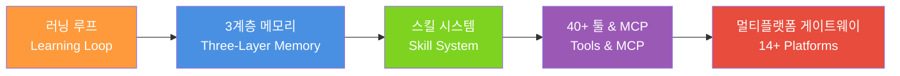

각 모듈의 역할을 한 문장으로 정리하면 다음과 같다. **러닝 루프**는 Hermes의 심장으로, 매 태스크 완료 후 자동으로 회고를 수행하며 무엇을 기억하고 어떤 스킬을 추출할지 결정한다. **3계층 메모리**는 Hermes의 뇌로, 세션 메모리(방금 무슨 일이 있었나), 영속 메모리(당신은 어떤 사람인가), 스킬 메모리(어떻게 하는가)의 세 층위로 나뉜다. **스킬 시스템**은 Hermes의 기술 라이브러리로, `~/.hermes/skills/` 디렉토리에 저장된 독립적인 마크다운 파일들이다. **40+ 빌트인 툴**은 Hermes의 손발이며, **멀티플랫폼 게이트웨이**는 텔레그램, 디스코드, 슬랙 등 14개 이상의 플랫폼과 연결되는 정문이다.

### 주요 수치 (2026년 4월 기준)

| 지표 | 데이터 |
|---|---|
| GitHub 스타 | **57,200+** (출시 6주 만) |
| 포크 수 | 7,572 |
| 기여자 수 | 274+ |
| 빌트인 툴 | 40개 이상 |
| 지원 플랫폼 | 14개 이상 |
| MCP 통합 앱 | 6,000개 이상 |
| 서브에이전트 동시 실행 | 최대 3개 |
| 최소 배포 비용 | 월 5달러 VPS |
| 메모리 사용량 | 500MB 미만 (로컬 LLM 제외) |
| 라이선스 | MIT (완전 오픈소스) |
| 에코시스템 총 스타 | 90,750+ |

---

## 3. 핵심 메커니즘 — 러닝 루프

Hermes Agent에서 가장 놀라운 것은 무엇을 할 수 있느냐가 아니라, **변한다**는 사실이다. 더 많이 사용할수록 더 좋아진다. 이것은 마케팅 문구가 아니라 관찰 가능하고 검증 가능한 폐쇄 루프 메커니즘이다.

### 러닝 루프의 5단계 플라이휠

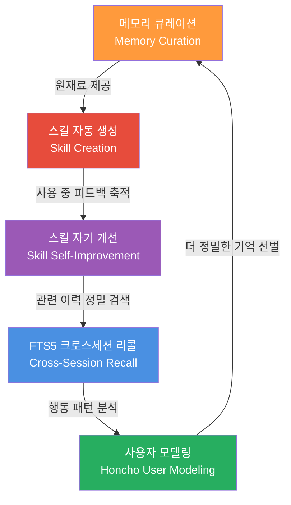

#### 1단계: 메모리 큐레이션

매 대화가 끝난 후 Hermes는 무엇이 기억할 만한 가치가 있는지 **능동적으로 판단**한다. 이것은 수동적 저장이 아니라 능동적 결정이다. 전통적인 대화 메모리는 전체 채팅 이력을 컨텍스트 창에 집어넣는 방식이다. 대화가 길어질수록 컨텍스트가 넘쳐 터진다. Hermes는 일기를 쓰는 사람처럼 작동한다. 매 대화 후 돌아보고, 이번엔 무엇에 관한 것이었나, 새로운 발견이 있었나, 사용자가 어떤 선호를 표현했나를 파악한 뒤, 기억할 가치가 있는 것을 SQLite 데이터베이스에 FTS5 전문 색인과 함께 기록한다.

#### 2단계: 스킬 자율 생성

적당히 복잡한 태스크를 완료하면 Hermes는 자신에게 묻는다. "이 해결책이 미래에 다시 유용할까?" 답이 예라면, 그 솔루션을 스킬 파일로 증류해서 `~/.hermes/skills/`에 저장한다. 이 스킬은 태스크 설명, 실행 단계, 주의 사항을 담은 마크다운 파일이다. 다음번에 비슷한 요청을 받으면 처음부터 다시 고민하는 게 아니라 이미 검증된 접근법이 담긴 스킬을 불러온다.

#### 3단계: 스킬 자기 개선

스킬을 만드는 것이 끝이 아니다. 스킬이 사용될 때마다 피드백이 쌓이고, Hermes는 그 피드백을 기반으로 스킬 파일 자체를 수정한다. 예를 들어 "이 임포트 스크립트는 테이블이 이미 존재하는지 먼저 확인해야 해"라고 하면, Hermes는 이번 한 번만 체크를 추가하는 게 아니라 스킬 파일로 돌아가서 그 규칙을 아예 써넣는다. 소프트웨어 개발의 지속적 개선(continuous improvement)처럼, 문서와 표준을 업데이트해서 같은 종류의 문제가 재발하지 않도록 한다.

#### 4단계: FTS5 크로스세션 리콜

이 모든 것을 기억하는 것은 한 부분이고, 진짜 묘미는 **올바른 순간에 올바른 조각을 찾아내는 것**이다. Hermes는 SQLite의 FTS5 확장을 사용해 전문 색인을 구축한다. 새 대화가 시작되기 전에, 현재 주제를 기반으로 이전 메모리를 검색해서 관련 부분만 컨텍스트에 불러온다. 데이터베이스 질문을 하면 데이터베이스 관련 메모리만 검색하고, 프론트엔드 질문을 하면 프론트엔드 메모리만 찾는다. FTS5의 또 다른 장점은 완전히 로컬로 처리된다는 점이다. 메모리 데이터가 어떤 서버에도 업로드될 필요가 없다.

#### 5단계: Honcho 사용자 모델링

마지막 단계는 Plastic Labs가 개발한 Honcho 사용자 모델링 시스템이다. 이것은 당신이 말한 것을 기억하는 수준을 넘어서, **당신이 어떤 사람인지를 추론**한다. 예를 들어 당신이 "나는 간결한 코드 스타일을 선호한다"고 명시적으로 말한 적이 없어도, Honcho는 여러 세션에 걸친 코드 수정 패턴을 분석해서 이를 유추한다. 12개 계층의 정체성 추론을 통해 기술 수준, 업무 리듬, 소통 스타일, 목표 추론, 감정 패턴, 선호 모순(말과 행동의 차이)까지 파악한다.

### Mitchell Hashimoto 방식 vs. Hermes 자동화 비교

| 차원 | Mitchell의 방식 (수동) | Hermes의 방식 (자동화) |
|---|---|---|
| 규칙 출처 | 사람이 문제를 발견하고 직접 작성 | 에이전트가 자신의 피드백에서 추출 |
| 저장 위치 | CLAUDE.md (단일 파일) | 여러 스킬 파일 + 메모리 데이터베이스 |
| 개선 트리거 | 사람이 기억해서 규칙을 추가할 때만 | 매 사용 후 자동 평가 |
| 프로젝트 간 이식성 | CLAUDE.md 수동 복사 | 스킬은 글로벌, 모든 프로젝트에서 공유 |
| 개선 속도 | 사람의 부지런함에 달림 | 지속적이고 자동 — 게을러지지 않음 |

---

## 4. 핵심 메커니즘 — 3계층 메모리

대부분의 AI 채팅 도구는 금붕어의 기억력을 갖고 있다. 지난 라운드에서 말한 것이 다음 라운드에서는 잊혀진다. Hermes는 오랜 친구가 되려 한다. 당신이 말한 것을 기억하고, 당신이 어떤 사람인지 알며, 어떻게 일하기를 좋아하는지 배운 친구.

### 3계층 메모리 아키텍처

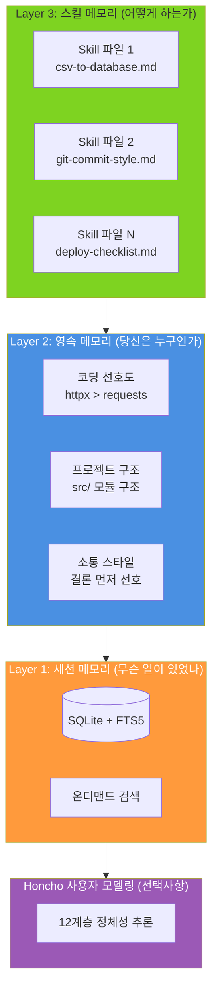

#### 1계층: 세션 메모리 — "무슨 일이 있었나"

모든 대화의 내용, 툴 호출, 반환 결과가 SQLite 데이터베이스에 FTS5 전문 검색 색인과 함께 기록된다. 핵심 설계 결정은 **전체 로딩이 아닌 온디맨드 검색**이다.

| 접근 방식 | 전체 로딩 | 온디맨드 검색 (Hermes) |
|---|---|---|
| 컨텍스트 사용량 | 대화량에 비례해 선형 증가 | 본질적으로 일정 |
| 검색 정밀도 | 모두 있지만 찾기 어려움 | 정확한 키워드 매칭 |
| 장기 지속성 | 며칠 후 한계 도달 | 몇 달, 몇 년도 작동 |
| 응답 속도 | 시간이 지날수록 느려짐 | 본질적으로 동일하게 유지 |

FTS5는 SQLite의 전문 검색 확장으로, 별도 데이터베이스 설치 없이 로컬 SQLite 파일에만 데이터가 존재한다. 네트워크 의존성 없음, 프라이버시 우려 없음.

#### 2계층: 영속 메모리 — "당신은 누구인가"

이 레이어는 대화 내용을 저장하는 것이 아니라, 대화에서 증류된 **지속적인 상태**를 저장한다. 코딩 선호, 프로젝트 구조 습관, 자주 쓰는 툴체인, 업무 스케줄 패턴 같은 것들이다. 세션이 바뀌어도 사라지지 않는다. 기술적으로 영속 메모리도 SQLite에 저장되며, `~/.hermes/` 디렉토리 안에 모든 것이 있다. 이는 USB에 백업해서 다른 기기에서 이어가거나, Docker 마운트로 상태를 유지하는 등 완전한 이식성을 보장한다.

#### 3계층: 스킬 메모리 — "어떻게 하는가"

첫 두 계층이 무슨 일이 있었는지, 당신이 누구인지를 기억한다면, 세 번째 계층은 **방법론과 운영 절차**를 기억한다. 각 스킬은 `~/.hermes/skills/`에 있는 마크다운 파일로, 사람이 읽고 편집할 수 있다. 이 세 계층은 인지 과학의 세 가지 기억 유형에 대응된다.

| 심리학적 기억 유형 | Hermes 레이어 | 예시 |
|---|---|---|
| 에피소드 기억 (무슨 일이 있었나) | 세션 메모리 | 지난번 배포 시 포트 충돌 기록 |
| 의미 기억 (세상이 어떤 곳인가) | 영속 메모리 | 알리클라우드 ECS + Nginx 사용 선호 |
| 절차 기억 (어떻게 하는가) | 스킬 메모리 | 배포 체크리스트 단계 |

#### Honcho: 당신 자신보다 당신을 더 잘 아는 시스템

Honcho가 하는 일은 표면적 기록을 넘어 **당신의 특성을 추론**한다. 예를 들어 3주 동안 매일 Python 스크립트를 부탁했다면 이런 것들을 유추할 수 있다. 완전 초보는 아니지만 전문가도 아닌 기술 수준, 저녁 9~11시에 주로 활동하는 개인 프로젝트 리듬, 결과를 먼저 보고 원리를 나중에 묻는 소통 방식, 데이터 분석 프로젝트를 진행 중이라는 목표 추론, 코드에 에러가 나면 약간 답답해하니 간결하고 직접적인 답변이 효과적이라는 감정 패턴. 심지어 포괄적인 주석을 원한다고 말하지만 실제로는 절대 읽지 않는다는 선호 모순까지 잡아낸다.

---

## 5. 핵심 메커니즘 — 스킬 시스템

OpenClaw의 스킬은 직접 작성하고 수동으로 관리해야 한다. Hermes의 스킬은 스스로 자라고 시간이 지남에 따라 더 나아진다. 이 차이가 완전히 다른 사용자 경험을 만든다.

### 스킬이란 무엇인가

Hermes에서 각 스킬은 `~/.hermes/skills/` 디렉토리에 저장된 독립적인 마크다운 파일이다. 에이전트의 절차 기억(어떻게 하는가)을 포착한다. 새 동료에게 주간 보고서 쓰는 법을 가르치는 것과 같다. 처음에는 모든 단계를 안내하고, 두 번째에도 몇 가지 질문을 한다. 세 번째쯤 되면 터득하게 된다. 스킬은 그 "세 번째 이후의 상태"다.

### 스킬의 3가지 출처

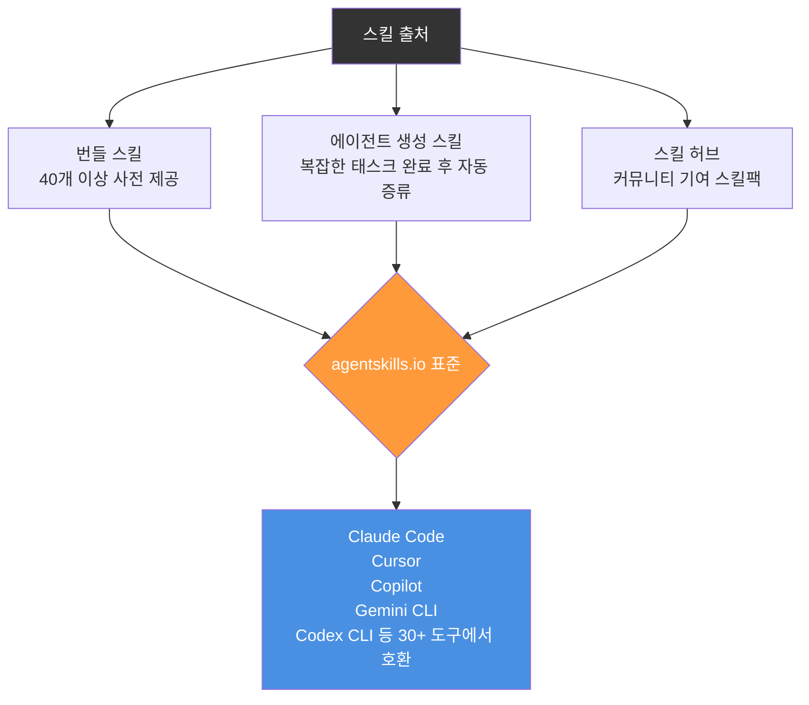

### agentskills.io: 스킬의 범용 언어

Hermes의 스킬은 폐쇄형 생태계가 아니다. Claude Code, Cursor, Copilot, Codex CLI, Gemini CLI 등 30개 이상의 도구가 지원하는 agentskills.io 표준을 따른다. Claude Code에서 작성한 스킬이 Hermes에서도 바로 작동한다. 앱스토어 모델과 다른 점은 이것이 USB 포트처럼 작동한다는 것이다. 하나의 스킬을 어디든 꽂으면 바로 작동한다.

### 스킬 자기 개선 메커니즘

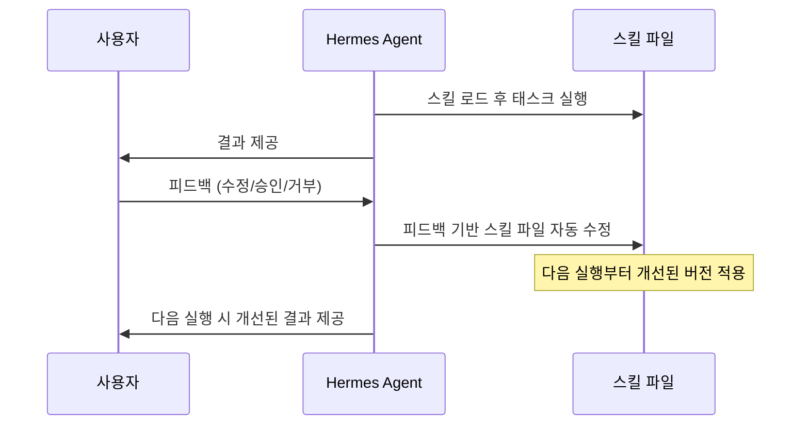

전통적인 스킬은 수동 유지보수가 필요하다. 코드 리뷰 스킬을 작성하면 그 단계를 그대로 따른다. 실제로 어떤 단계가 잘 작동하지 않는 것을 발견해도 직접 수정해야 한다. OpenClaw의 5,700개 이상 커뮤니티 스킬이 주로 이런 방식이다. Hermes의 스킬은 살아 있다. 러닝 루프 안에서 실제 피드백을 바탕으로 자동으로 최적화된다.

### 스킬 자기 개선 실전 예시

GitHub 알림을 매일 아침 정리하는 태스크를 몇 번 반복하면 Hermes는 다음과 같은 스킬 파일을 자동 생성한다.

```markdown
# GitHub Daily Digest

## 트리거 조건
사용자가 "GitHub 알림", "일간 요약" 등을 언급할 때

## 실행 단계
1. GitHub MCP를 호출해 지난 24시간 알림 가져오기
2. 봇 계정의 자동화된 알림 필터링
3. 유형별 그룹화 (PR / 이슈 / 디스커션)
4. 중요도별 정렬 (멘션 > 리뷰 요청 > 기타)
5. 간결한 목록으로 제시

## 사용자 선호
- 제목과 상태만 필요, 상세 내용 불필요
- PR과 이슈 분리 표시
```

이후에 "이번엔 Discussion도 포함해줘"라고 하면, Hermes는 이번 한 번만이 아니라 스킬 파일의 규칙을 업데이트한다. 다음번엔 묻지 않아도 Discussion이 포함된다.

---

## 6. 40개 이상의 툴 & MCP

### 5개 카테고리 빌트인 툴

| 카테고리 | 핵심 툴 | 역할 |
|---|---|---|
| **실행** | terminal, code_execution, file | 명령 실행, 코드 실행(샌드박스), 파일 읽기/쓰기 |
| **정보** | web, browser, session_search | 웹 검색, 브라우저 자동화, 대화 이력 검색 |
| **미디어** | vision, image_gen, tts | 이미지 이해, 이미지 생성, 텍스트-음성 변환 |
| **메모리** | memory, skills, todo, cronjob | 메모리 레이어 운영, 스킬 관리, 태스크 계획, 스케줄 작업 |
| **조율** | delegation, moa, clarify | 서브에이전트 위임, 멀티모델 추론, 사용자 명확화 요청 |

특별히 주목할 툴들이 있다. **session_search**는 FTS5 전문 색인을 사용해 대화 이력을 검색하는 Hermes만의 독특한 기능으로, 대부분의 에이전트에는 없다. **moa(Multi-model Orchestrated Answering)** 는 여러 LLM을 동시에 호출해 응답을 종합하는 기능으로, 사실 확인이나 기술적 의사결정처럼 높은 신뢰성이 필요한 시나리오에 유용하다. **cronjob**은 자연어로 스케줄 작업을 정의한다. "매일 아침 9시에 GitHub 알림 확인"이라고 하면 cron 표현식 없이 자동으로 스케줄러를 생성한다.

### 툴셋(Toolset): 선택적 활성화로 집중도 유지

40개 이상의 툴을 모두 켜두는 것은 비효율적이다. 코드를 작성하는 에이전트에게 Home Assistant 권한은 필요 없고, 캘린더를 관리하는 에이전트에게 code_execution은 불필요하다. Hermes는 Toolset 메커니즘으로 이를 해결한다.

```yaml
# config.yaml 예시
toolsets:
  - web        # 웹 검색
  - terminal   # 터미널 명령
  - file       # 파일 작업
  - skills     # 스킬 관리
  - delegation # 서브에이전트 위임
  # - homeassistant  # 필요 없으면 주석 처리
```

툴셋은 효율성 최적화이자 보안 경계이기도 하다. 활성화된 툴이 적을수록 에이전트는 더 집중되고 응답이 빨라지며 토큰 소비가 줄어든다.

### MCP: 6,000개 이상 앱과 연결

MCP(Model Context Protocol)는 Anthropic이 2024년 말에 제안한 개방형 표준으로, AI 에이전트와 외부 툴 간의 통신 표준을 정의한다. Hermes는 stdio 또는 HTTP를 통해 모든 MCP 서버에 연결할 수 있다.

```yaml
# GitHub MCP 서버 연결
mcp_servers:
  github:
    command: npx
    args: ["-y", "@modelcontextprotocol/server-github"]
    env:
      GITHUB_PERSONAL_ACCESS_TOKEN: ${GITHUB_TOKEN}
```

설정이 완료되면 Hermes는 GitHub의 기능을 자연어로 사용할 수 있다. 이슈 생성, PR 리뷰, 레포 상태 확인. 코드 한 줄 없이, 커스텀 툴 빌드 없이.

### 서브에이전트 위임: 세 마리 말 동시에 달리기

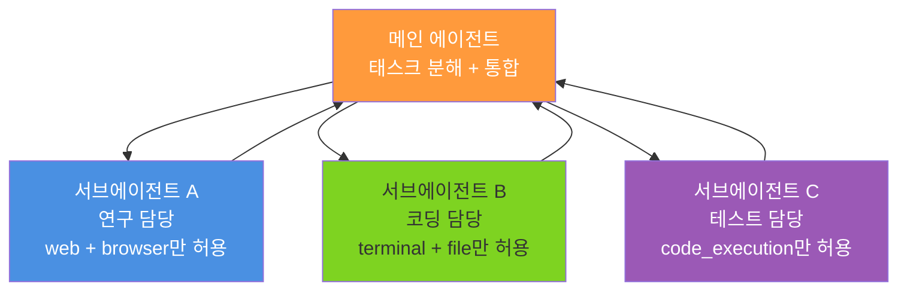

각 서브에이전트는 독립적인 컨텍스트를 가지며, 제한된 툴셋으로 실행된다. 최대 3개 동시 실행이라는 제한은 의도적인 설계다. 3개를 초과하면 메인 에이전트의 통합 품질이 급격히 저하되는 것이 테스트에서 확인됐다.

---

## 7. 설치 및 설정

### 3가지 설치 방법

#### 옵션 1: 로컬 설치 (5분)

```bash
curl -fsSL https://raw.githubusercontent.com/NousResearch/hermes-agent/main/scripts/install.sh | bash
```

인스톨러가 Python, Node.js, 모든 의존성을 자동으로 처리한다. macOS, Linux, WSL2, Android(Termux)에서 작동한다.

설치 후 `~/.hermes/config.yaml`을 열어 모델 API 키를 입력하고, `hermes` 한 단어로 실행한다.

#### 옵션 2: Docker (격리된 환경)

```bash
docker pull nousresearch/hermes-agent:latest
docker run -v ~/.hermes:/opt/data nousresearch/hermes-agent:latest
```

`-v ~/.hermes:/opt/data` 플래그가 컨테이너의 데이터 볼륨을 호스트 머신에 매핑한다. 컨테이너를 삭제하고 재빌드해도 데이터(메모리, 스킬, 설정)는 살아있다.

#### 옵션 3: 월 5달러 VPS로 24/7 운영

| VPS 제공업체 | 월 비용 | 비고 |
|---|---|---|
| Hetzner CX22 | ~$4/월 | 최고 가성비, 유럽 노드 |
| DigitalOcean Droplet | $5/월 | 싱가포르/미서부 노드 |
| Vultr | $5/월 | 도쿄 노드, 낮은 레이턴시 |

Ubuntu 22.04 LTS를 선택하고, SSH 접속 후 설치 스크립트를 실행한다. 로컬 LLM 없이 실행하면 메모리 사용량이 500MB 이하로 유지된다.

### config.yaml 핵심 설정

```yaml
# ~/.hermes/config.yaml
model:
  provider: openrouter    # 모델 제공업체
  api_key: sk-or-xxxxx   # API 키
  model: anthropic/claude-sonnet-4  # 사용할 모델

terminal: local  # 터미널 백엔드 (local/docker/ssh/daytona/modal)

gateway:          # 메시징 게이트웨이 (선택사항)
  telegram:
    token: YOUR_BOT_TOKEN
  discord:
    token: YOUR_BOT_TOKEN
```

### 지원 모델 제공업체

| 제공업체 | 추천 모델 | 특징 |
|---|---|---|
| OpenRouter | Claude Sonnet 4 / GPT-4o | 200개 이상 모델, 유연한 전환 |
| Nous Portal | Hermes 3 시리즈 | 공식 추천, 에이전트와 깊은 통합 |
| OpenAI | GPT-4o / o3 | 직접 API 연결 |
| z.ai / Zhipu | GLM-5 | 중국 친화적 옵션 |
| Ollama | Hermes 3 8B/70B | 완전 오프라인, 프라이버시 우선 |

> ⚠️ **주의 (2026년 4월 기준)**: Anthropic이 Claude Pro/Max 구독을 통한 제3자 툴의 Claude 접근을 차단했다. Hermes, OpenClaw 등 모든 에이전트 프레임워크가 영향을 받는다. API 키(종량제)로는 여전히 Claude를 사용할 수 있지만 비용이 상당히 높다. OpenRouter 또는 Nous Portal의 Hermes 3 시리즈를 주 옵션으로 고려할 것을 권장한다.

---

## 8. 멀티플랫폼 접근

### 통합 게이트웨이 아키텍처

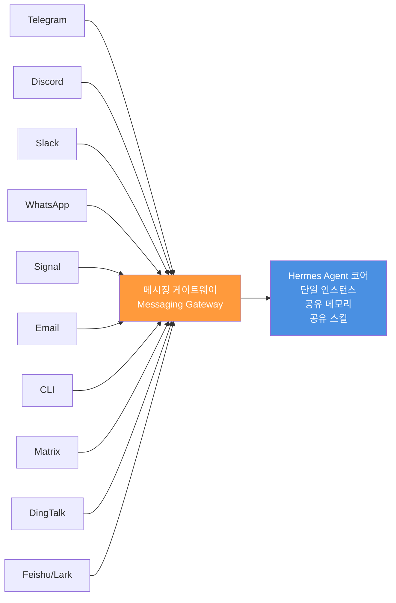

Hermes의 멀티플랫폼 접근은 메시징 게이트웨이 모듈이 지원한다. 각 플랫폼별로 별도 코드를 작성하는 대신, 단일 통합 게이트웨이 프로세스가 설정된 모든 플랫폼을 동시에 청취한다.

### 텔레그램 봇 설정 (3단계)

1. 텔레그램에서 @BotFather를 찾아 `/newbot` 전송 → 토큰 획득
2. `config.yaml`에 토큰 추가
3. `hermes` 실행

세 단계, 2분 이내. VPS에서 실행 중이라면 이것으로 스마트폰에서 언제든 닿을 수 있는 24시간 온라인, 영속 메모리를 가진 개인 AI 어시스턴트가 완성된다. 월 커피 한 잔 값으로.

### 크로스플랫폼 대화 연속성

이것이 Hermes 멀티플랫폼 설계의 가장 실용적인 특징이다. 아침 출근길에 텔레그램으로 "Hermes Agent 배포 옵션 조사해서 문서 만들어줘"라고 보내면, Hermes가 작업을 시작해서 조사 결과를 메모리에 저장한다. 사무실에 도착해서 터미널을 열고 "그 조사 어디까지 됐어?"라고 하면 Hermes는 무슨 얘기인지 정확히 안다. 텔레그램에서 보낸 것인지 CLI에서 타이핑한 것인지 구분하지 않는다. 모든 플랫폼이 동일한 에이전트 인스턴스와 동일한 메모리를 공유한다.

---

## 9. 커스텀 스킬 작성법

### 스킬 구조

각 스킬은 `~/.hermes/skills/` 아래에 자체 폴더를 가지며, `SKILL.md` 파일이 진입점이다.

```
~/.hermes/skills/
├── git-commit-style/
│   └── SKILL.md
├── markdown-to-wechat/
│   └── SKILL.md
└── weekly-report/
    ├── SKILL.md
    ├── templates/
    └── scripts/
```

### 좋은 스킬의 구성 요소

```markdown
---
name: git-commit-style
description: 일관된 Git 커밋 메시지 형식 강제
version: "1.0.0"
---

# Git 커밋 스타일

## 트리거
코드 커밋, 커밋 메시지 작성, 커밋 이력 리뷰를 요청할 때 활성화

## 규칙
### 커밋 메시지 형식
- 첫 줄: type(scope): 요약 (50자 이내)
- 빈 줄
- 본문: WHAT이 아닌 WHY를 설명

### 타입 열거
- feat: 새 기능
- fix: 버그 수정
- refactor: 구조 개선 (동작 변경 없음)
- docs: 문서
- test: 테스트
- chore: 빌드/툴체인

## 제약
- 본문은 한국어, 타입은 영어
- "XX 파일 수정" 같은 소음은 작성하지 말 것
- 하나의 커밋, 하나의 사항

## 예시
feat(auth): WeChat QR 코드 로그인 추가

기존에는 전화번호로만 로그인 가능해서 WeChat 사용자가
먼저 전화번호를 연동해야 했다. 이제 QR 코드를 스캔하면
바로 로그인되며 연동되지 않은 사용자는 자동으로 계정이 생성된다.
```

| 섹션 | 목적 | 필수 여부 |
|---|---|---|
| 제목 | 스킬이 무엇을 하는지 빠른 식별 | 필수 |
| 트리거 | 이 스킬을 언제 활성화할지 | 강력 권장 |
| 규칙 | 구체적인 단계, 제약, 형식 | 필수 |
| 예시 | 완전한 입력→출력 예시 | 강력 권장 |
| 금지 사항 | 드리프트 방지를 위한 명시적 경계 | 선택사항 |

### Claude Code 스킬 이식 방법

agentskills.io 표준 덕분에 Claude Code에서 쌓아온 스킬 자산이 잠기지 않는다. Claude Code의 프루프리딩 스킬을 Hermes로 이식하려면 해당 파일을 `~/.hermes/skills/proofreading/SKILL.md`로 복사하면 끝이다. 형식 변경도, API 어댑터도 불필요하다. 핵심 로직, 트리거, 규칙이 모두 이식 가능하다.

---

## 10. MCP 통합 가이드

### 두 가지 연결 모드

| 모드 | 서버 위치 | 최적 사용처 | 성능 |
|---|---|---|---|
| **stdio** | 로컬 서브프로세스 | 로컬 툴, 파일 시스템, 데이터베이스 | 빠름, 네트워크 오버헤드 없음 |
| **HTTP (StreamableHTTP)** | 원격 서버 | 클라우드 서비스, 팀 공유 서버 | 네트워크에 의존 |

### GitHub MCP 연결 실전

```yaml
# config.yaml
mcp_servers:
  github:
    command: "npx"
    args: ["-y", "@modelcontextprotocol/server-github"]
    env:
      GITHUB_PERSONAL_ACCESS_TOKEN: "${GITHUB_TOKEN}"
```

연결 후 자연어로 GitHub 조작이 가능하다. "지난 주에 오픈된 새 이슈들 레이블별로 그룹화해서 보여줘", "이 PR의 변경사항 보고 코드 리뷰해줘" 등이 바로 작동한다.

### 서버별 툴 필터링

MCP 서버 하나가 수십 개의 툴을 노출할 수 있다. 너무 많은 툴은 에이전트의 의사결정 품질을 저하시킨다. Hermes는 서버별 툴 필터링을 지원한다.

```yaml
mcp_servers:
  github:
    command: "npx"
    args: ["-y", "@modelcontextprotocol/server-github"]
    env:
      GITHUB_PERSONAL_ACCESS_TOKEN: "ghp_xxxxx"
    allowed_tools:
      - "list_issues"
      - "create_issue"
      - "get_pull_request"
      - "create_pull_request_review"
```

레포 삭제나 설정 변경 같은 고권한 툴은 애초에 에이전트가 접근할 수 없다. 에이전트 시대의 최소 권한 원칙이다.

### MCP + 스킬 조합: 진짜 파워는 여기서

MCP가 "무엇에 연결할 수 있나"를 해결한다면, 스킬은 "어떻게 사용하나"를 해결한다. 예시: GitHub MCP를 연결하고 "코드 리뷰" 스킬을 생성한다. 스킬은 리뷰 기준(명명 규칙, 에러 처리, 테스트 커버리지)을 정의하고, MCP는 PR 차이를 읽는 능력을 제공한다. 조합하면 Hermes가 당신의 기준에 맞게 자동으로 코드를 리뷰한다. 또 다른 예시: 데이터베이스 MCP가 Hermes에게 SQL을 실행하는 능력을 주고, "주간 보고서" 스킬이 보고서 형식과 핵심 지표를 정의한다. 금요일 오후 cron 작업과 결합하면 Hermes가 자동으로 데이터를 조회하고, 보고서를 생성하고, Slack에 게시한다.

---

## 11. 실전 활용 시나리오

### 시나리오 1: 개인 지식 어시스턴트 — 크로스세션 메모리의 힘

3주에 걸친 연구 프로젝트를 진행한다고 가정해보자. 전통적인 도구라면 매주 새 세션을 시작할 때마다 "나는 AI 에이전트 배포 옵션을 조사하고 있어. 지난주엔 Docker와 VPS를 봤고, 이제 Serverless를 이해하고 싶어..."라고 다시 설명해야 한다.

Hermes를 사용하면 2주차에 그냥 "Serverless 옵션 이어서 해줘"라고만 하면 된다. 영속 메모리가 이미 당신이 무엇을 하는지 알고 있고, 지난주에 탈락시킨 옵션을 다시 추천하지 않으며, 이미 확인한 정보를 재검증하지 않는다. 전체 연구 작업이 분리된 점들의 더미가 아니라 하나의 실타래처럼 느껴진다.

### 시나리오 2: 개발 자동화 — 코드 리뷰에서 배포까지

아침 9시, 노트북을 열면 Hermes에게서 텔레그램 메시지 세 개가 와 있다. "어제 밤 11시 17분에 main에 PR이 머지됐습니다. 387줄의 새 코드를 검토했으며 두 가지 이슈를 발견했습니다: auth 모듈의 토큰 만료 로직이 엣지 케이스를 처리하지 않고 있고, 테스트 커버리지가 82%에서 76%로 떨어졌습니다." "새벽 2시 40분에 CI 파이프라인이 회귀 테스트를 실행했습니다. 3개 케이스가 실패했습니다."

이것이 Hermes의 cron 스케줄링 + GitHub MCP + 메모리 시스템이 자는 동안 작동한 결과다.

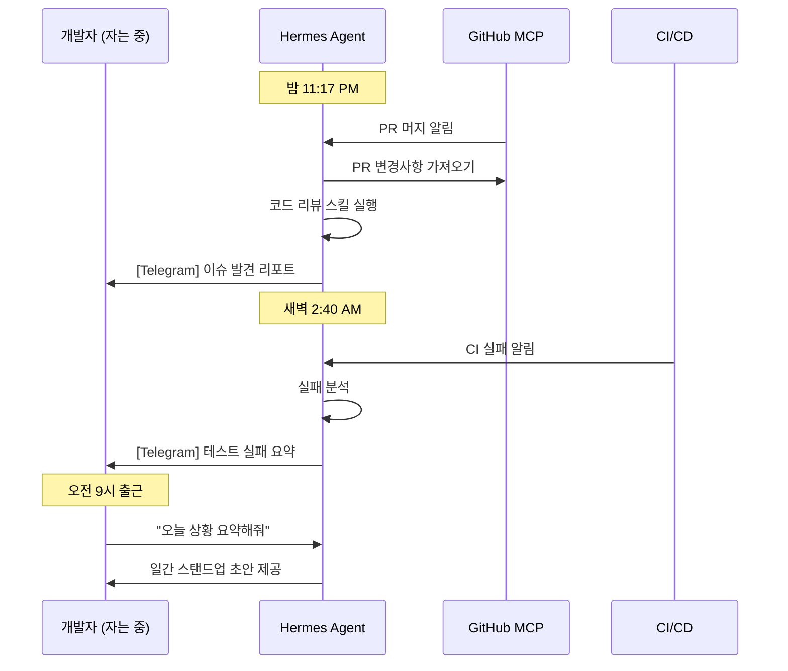

### 시나리오 3: 콘텐츠 창작 — 연구에서 초안까지

긴 기술 아티클을 위한 조사는 종종 글쓰기보다 시간이 더 걸린다. 전통적인 접근은 선형적이다. 주제 A를 검색하고 정리하고, 주제 B를 검색하고 정리하고. Hermes의 `delegate_task` 툴은 이것을 병렬화한다.

```mermaid
gantt
    title AI 에이전트 비교 아티클 조사 작업 (1시간 → 20분)
    dateFormat mm
    section 전통적 방법
    Hermes 아키텍처 조사    :a1, 00, 20m
    OpenClaw 생태계 조사    :a2, after a1, 20m
    커뮤니티 피드백 수집    :a3, after a2, 20m
    section Hermes 병렬 방식
    서브에이전트 A (Hermes)  :b1, 00, 20m
    서브에이전트 B (OpenClaw):b2, 00, 20m
    서브에이전트 C (피드백)  :b3, 00, 20m
    메인 에이전트 통합       :b4, after b1, 5m
```

### 시나리오 4: 멀티에이전트 오케스트레이션 — 경쟁 분석 보고서

AI 코딩 툴 경쟁 분석을 작성할 때 delegate_task 워크플로우는 다음과 같다.

1. 메인 에이전트가 태스크 템플릿 정의: "포지셔닝, 핵심 기능, 기술 아키텍처, 가격, 커뮤니티 규모, 장단점 차원에서 [제품명]을 조사해서 마크다운 표로 출력해"
2. 서브에이전트 A: Claude Code 조사 (web + browser만 허용)
3. 서브에이전트 B: Cursor 조사 (web + browser만 허용)
4. 서브에이전트 C: Hermes 조사 (web + browser만 허용)
5. 메인 에이전트가 통합 및 종합 보고서 생성

총 시간: "A+B+C"에서 "max(A, B, C)"로. 실제로 40분짜리 경쟁 분석이 15분으로 단축된다.

---

## 12. Hermes vs OpenClaw vs Claude Code

### 세 가지 설계 철학

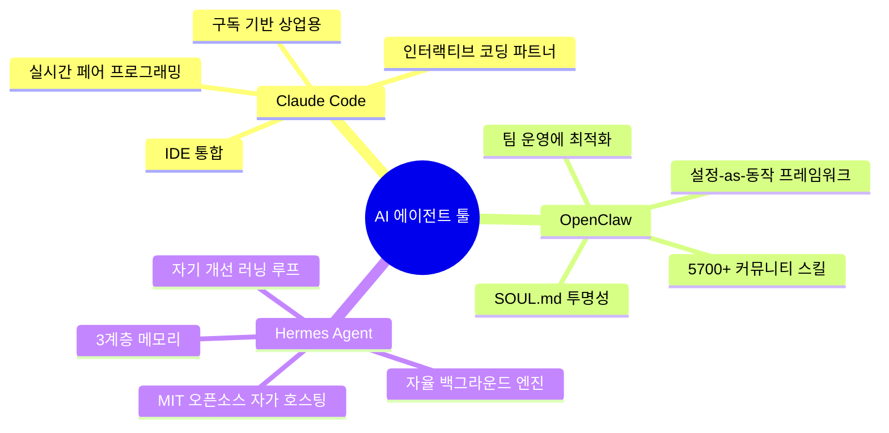

이 세 도구는 같은 문제를 해결하는 세 가지 방법이 아니다. 완전히 다른 문제를 해결하고 있다.

**Claude Code**는 인터랙티브 코딩 툴이다. 터미널 앞에 앉아서 실시간으로 주고받으며 협업한다. 핵심 가치는 실시간 코드 생산성이다.

**OpenClaw**는 "설정-as-동작" 프레임워크다. SOUL.md와 스킬 파일로 에이전트의 성격, 지식, 스킬을 정의한다. 핵심 가치는 예측 가능성, 감사 가능성, 재현 가능성이다.

**Hermes Agent**는 자율 백그라운드 엔진이다. 서버에 배포하면 24/7 실행되며 기억하고, 스킬을 만들고, 스스로 개선한다. 핵심 가치는 자율성과 자기 개선이다.

### 전체 비교표

| 차원 | Claude Code | OpenClaw | Hermes Agent |
|---|---|---|---|
| 핵심 정체성 | IDE의 페어 프로그래머 | 팀을 위한 운영 플랫폼 | 학습하는 개인 어시스턴트 |
| 아키텍처 | IDE 통합 | 게이트웨이 컨트롤 플레인 | 런타임 에이전트 루프 |
| 메모리 모델 | 디스크에 자동 노트 | 무제한 마크다운 | 경계 있는 큐레이션 + SQLite FTS5 + 8개 제공업체 플러그인 |
| 스킬 | 정적, 사람이 작성 | 정적 (5,700+ ClawHub) | 에이전트가 자율 생성 + 개선 |
| 채널 | IDE 전용 | 22개+ | 14개+ |
| 라이선스 | 독점 (Anthropic) | MIT | MIT |
| 실행 환경 | 로컬 샌드박스 | 로컬 | 로컬+Docker+SSH+Modal+Daytona+Singularity |

### 시나리오별 추천

| 시나리오 | 추천 툴 | 이유 |
|---|---|---|
| 새 기능 빌드, 코드 리팩토링 | Claude Code | 실시간 피드백과 인간 판단 필요 |
| 팀 표준화 에이전트 구축 | OpenClaw | SOUL.md의 투명성, 감사 가능성, 재현성 |
| 24/7 코드 리뷰 | Hermes | cron 스케줄링 + GitHub MCP, 무인 실행 |
| 개인 지식 어시스턴트 | Hermes | 3계층 메모리가 세션 간 축적, 점점 스마트해짐 |
| 고객 지원/커뮤니티 봇 | Hermes | 네이티브 12+ 플랫폼 게이트웨이, 멀티채널 |
| 빠른 제품 아이디어 검증 | Claude Code | 빠른 시작, 빠른 이터레이션, 실시간 방향 수정 |
| 높은 제어가 필요한 엔터프라이즈 | OpenClaw | 투명한 설정, 예측 가능한 동작 |
| 장기 콘텐츠 창작 프로젝트 | Hermes + Claude Code | Hermes는 지속적 연구·축적, Claude Code는 실제 글쓰기 |

### agentskills.io가 중요한 이유

스킬이 특정 툴에 잠기지 않는다는 의미다. Claude Code, Cursor, Gemini CLI에서 만든 스킬이 Hermes에서도 작동한다. 반대도 마찬가지다. 스킬 작성에 투자한 시간이 툴을 바꿔도 낭비되지 않는다. 스킬 라이브러리는 플랫폼의 부속물이 아닌 당신의 자산이다.

---

## 13. 자기 개선 에이전트의 한계

Hermes Agent의 가장 흥미로운 기능이 동시에 가장 불안한 기능이기도 하다.

### 기술적 안전장치

Hermes의 스킬 자기 개선에는 몇 가지 제약이 있다. 스킬 파일은 읽을 수 있는 마크다운이다. 블랙박스 신경망 가중치가 아니라 직접 열어볼 수 있는 텍스트다. 무엇이 변경됐는지 diff로 확인할 수 있다. 메모리 데이터는 로컬이다. SQLite + FTS5 기반으로 로컬 디스크에 있다. 직접 검사하고 삭제할 수 있다. "에이전트가 당신 몰래 뭔가를 학습했다"는 상황이 없다. 툴 권한은 샌드박스화되어 있다. 에이전트가 임의로 새 시스템 권한을 획득할 수 없다.

기술적으로 Hermes의 자기 개선은 통제되고 감사 가능하다.

### 인간적 한계의 역설

그러나 기술적으로 통제된다고 해서 실제로 통제되는 것은 아니다. 문제는 인간 쪽에 있다.

에이전트가 수정한 스킬을 매일 확인할 것인가? 메모리 데이터베이스를 감사할 것인가? 아마 아닐 것이다. Hermes를 배포하는 가장 큰 매력이 "지켜보지 않아도 된다"는 것이기 때문이다. 매일 자기 개선 결과를 리뷰해야 한다면, 그게 스킬을 수동으로 관리하는 것과 무슨 차이가 있는가?

이 모순은 근본적이다. 자율 에이전트의 가치는 지켜보지 않아도 된다는 데 있지만, 안전은 지켜봐야 한다는 것을 요구한다.

### 자기 개선의 천장

자기 개선 에이전트의 천장은 기술적이지 않다. **피드백 신호**의 질에 달려 있다.

Hermes의 자기 개선 루프는 핵심 가정에 의존한다. 자신의 개선이 좋은지 나쁜지를 판단할 수 있다는 것. 스킬을 수정하고 다음 태스크가 더 잘 됐다면 긍정적 피드백이다. 그런데 "더 잘 됐다"를 누가 정의하는가?

당신이 피드백을 주고 있다면 루프는 잘 작동한다. 당신이 없다면 에이전트는 자체 평가 기준만 사용한다. 더 빠르고 더 정확하다고 생각할 수 있다. 하지만 빠르고 정확하다는 것이 올바른 것을 의미하지는 않는다. 일부 오류는 도메인 지식이 있어야 잡을 수 있다. 에이전트는 자신이 모르는 것을 모른다.

자기 개선은 에이전트가 알려진 방향으로 더 빠르게 달리게 만든다. 하지만 방향 자체는 여전히 사람이 설정해야 한다.

### 스스로에게 물어볼 질문들

- 어느 정도의 자율 자기 개선이 편안한가? 스킬 파일 재작성? 새 스킬 자동 생성? 핵심 설정 수정? 자신의 러닝 루프 로직 수정?
- 자기 개선 결과를 누가 감사하는가? 직접? 얼마나 자주? 아무도 안 한다면 그 리스크는 수용 가능한가?
- 에이전트에게 "잊기" 메커니즘이 필요한가? 인간은 잊고, 이것은 버그가 아니라 기능이다. 3개월 전에 학습한 오래된 패턴이 현재 판단을 오염시킬 수 있다.

요약하면: 완전히 손을 뗀 자기 개선 에이전트는 효율성에서는 이기지만 방향성에서는 진다. 최적의 균형점은 에이전트가 "어떻게"에서 자기 개선을 하되, "무엇을"과 "하지 말 것"은 사람이 소유하는 것일 수 있다.

---

## 14. 생태계 현황 — 최신 데이터

### 론칭 타임라인

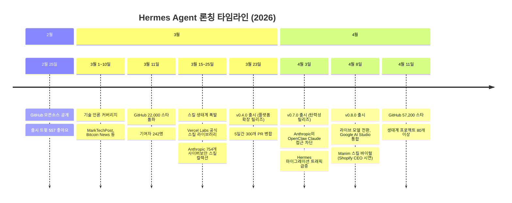

### 6주 성장의 의미

6주 만에 57,200개의 GitHub 스타와 7,572개의 포크, 274명의 기여자를 기록했다. 비교를 위해, OpenClaw는 현재 주당 약 3,000개의 스타가 증가하고 있는 반면, Hermes Agent는 최근 30일간 핵심 레포에서 주당 약 9,500개의 스타 성장 속도를 보이고 있어 주간 스타 성장에서 OpenClaw를 역전했다.

### 에코시스템 현황 (2026년 4월 기준)

커뮤니티는 6주 동안 Nous Research 공식 확장 3개(autonovel, hermes-paperclip-adapter, hermes-agent-self-evolution), 커뮤니티 스킬 라이브러리 17개(4,132개 스타를 받은 Anthropic 사이버보안 스킬 컬렉션 포함), 외부 메모리 제공업체 8개(Honcho, Mem0, Hindsight, Supermemory 등), 멀티에이전트 오케스트레이션 프레임워크 9개, 배포 템플릿 7개, 총 80개 이상의 품질 필터링된 레포를 만들어냈다.

주목할 만한 에코시스템 프로젝트들로는 스마트폰에 Hermes를 올리는 **hermes-android**, Solana 인텔리전스 MCP 서버인 **hermes-blockchain-oracle**, 클라우드 GPU에서 VLA 로봇 모델을 파인튜닝하는 **hermes-embodied**, ROS2와 Gazebo로 화성 탐사를 시뮬레이션하는 **hermes-mars-rover** 등이 있다.

### 커뮤니티 반응

X, Reddit, Substack, 해커뉴스, Hermes Agent 디스코드(~4,000명의 빌더)에서 커뮤니티 반응을 추적한 결과, 세 가지 테마가 지배적으로 나타났다. "방대한 지식을 가진 사람들이 개발했다는 것이 즉시 느껴지는 첫 번째 에이전트 하네스", "경쟁 제품보다 토큰 소비가 훨씬 적다", "5분 설치로 즉시 뛰어난 성능"이 반복적으로 언급됐다.

v0.8.0에서는 에디터 통합(VS Code, Zed, JetBrains)이 자체 MCP 서버를 등록할 수 있는 ACP 기능이 추가됐다. 에디터의 MCP 에코시스템이 에이전트로 직접 흘러들어온다는 의미다. 또한 브라우저 URL과 LLM 응답이 이제 비밀 패턴을 스캔해 URL 인코딩, base64, 프롬프트 인젝션을 통한 비밀 정보 유출 시도를 차단한다.

---

## 15. 실전 도입 체크리스트

### 시작 전 결정 사항

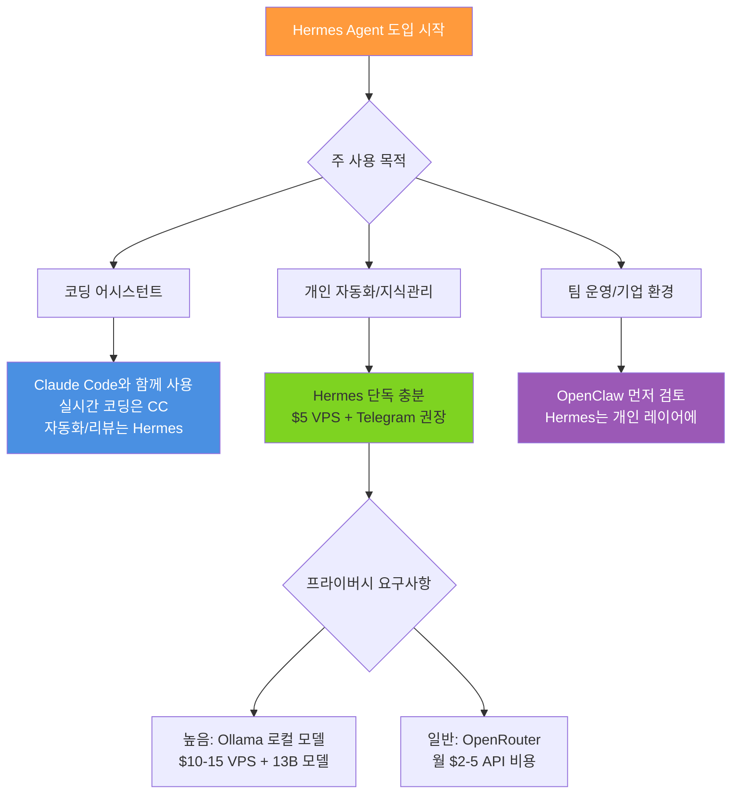

### 단계별 도입 로드맵

**1주차: 로컬 테스트**
- [ ] 로컬 머신에 설치 (`curl -fsSL ... | bash`)
- [ ] OpenRouter 계정 생성 및 API 키 설정
- [ ] `hermes` 실행 후 자기소개 대화 10분
- [ ] `~/.hermes/` 디렉토리 구조 확인
- [ ] 첫 복잡한 태스크 완료 후 스킬 파일 자동 생성 확인

**2주차: 플랫폼 확장**
- [ ] VPS 서버 세팅 (Hetzner CX22 권장)
- [ ] Telegram Bot 생성 및 게이트웨이 설정
- [ ] 스마트폰에서 Hermes와 대화 테스트
- [ ] 첫 cron 작업 설정 (GitHub 알림 등)

**3주차: 스킬 & MCP 확장**
- [ ] 자주 하는 작업 1~2개를 수동 스킬로 작성
- [ ] GitHub MCP 연결 및 검증
- [ ] 코드 리뷰 스킬 + GitHub MCP 조합 테스트
- [ ] 기존 Claude Code 스킬 이식 (해당되는 경우)

**4주차: 최적화 및 감사**
- [ ] `~/.hermes/skills/` 리뷰 — 자동 생성 스킬 품질 확인
- [ ] 잘못 유추된 선호도 수정
- [ ] 불필요한 메모리 정리
- [ ] 비용 검토 (API 사용량 확인)

### 주의 사항 모음

> ⚠️ **메모리 무한 성장**: Hermes의 메모리 시스템에 현재 자동 만료 메커니즘이 없다. 장기 사용 시 `~/.hermes/` 디렉토리 크기를 주기적으로 확인하고 오래된 스킬 파일을 정리하는 것이 좋다.

> ⚠️ **메모리 오염**: 초기 대화에서 잘못된 정보를 기억하면 그 오류가 지속되어 나중 동작에 영향을 줄 수 있다. 주기적인 메모리 감사가 필요하다.

> ⚠️ **스킬 충돌**: 두 스킬의 트리거가 겹치면 Hermes가 매칭 점수가 더 높은 것을 선택하지만 기대와 다를 수 있다. 동작이 이상하면 스킬 충돌을 먼저 확인하라.

> ⚠️ **보안 민감 시나리오**: 프로덕션 서버에서 실행하는 경우, 필요한 Toolset만 활성화하고 MCP의 서버별 필터링을 사용해 에이전트가 접근할 수 있는 기능을 더욱 제한하라.

> ⚠️ **Anthropic Claude 구독 제한**: 2026년 4월 기준, Pro/Max 구독을 통한 제3자 도구의 Claude 접근이 차단됐다. API 키 방식은 사용 가능하지만 비용이 높다.

---

## 마치며

Hermes Agent는 "사용할수록 좋아지는 AI 에이전트"라는 오랫동안 이야기만 됐지 아무도 제품으로 만들지 못했던 개념을 처음으로 구현한 프레임워크다. 러닝 루프, 3계층 메모리, 스킬 자기 개선이라는 세 메커니즘이 하나의 폐쇄 루프를 형성하며, 이 루프는 사용할수록 빠르게 돌아간다.

가장 중요한 통찰은 이것이다. **세 툴은 경쟁이 아니라 조합이다.** Claude Code는 낮 근무조(코딩), Hermes는 밤 근무조(모니터링, 축적, 자동화), OpenClaw는 표준화된 설정 언어다. 세 도구를 적재적소에 배치하는 사람이 이 에코시스템에서 가장 큰 레버리지를 얻는다.

자기 개선 에이전트의 천장은 기술이 아니라 피드백의 질과 인간의 방향 설정에 달려 있다. 에이전트가 "어떻게"에서 스스로 개선하도록 하되, "무엇을"과 "하지 말 것"은 당신이 소유하라. 그것이 곧 다른 방식의 on the loop다.

---

*작성 기준: HuaShu 오렌지북 v260408 + Hermes Atlas 커뮤니티 리포트 (2026년 4월 11일) + GitHub 공식 릴리즈 노트 종합*  
*Hermes Agent 공식 문서: https://hermes-agent.nousresearch.com/docs*  
*GitHub 레포: https://github.com/NousResearch/hermes-agent*  
*에코시스템 맵: https://hermesatlas.com*
