> **원본 출처**
> - Aiden 블로그: https://aiden0729.tistory.com/18
> - LlamaIndex 공식 문서 (PropertyGraphIndex): https://developers.llamaindex.ai/python/framework/module_guides/indexing/lpg_index_guide/
> - LlamaIndex Neo4j 예제: https://developers.llamaindex.ai/python/examples/property_graph/property_graph_neo4j/
>
> **작성일**: 2026년 4월 기준

---

## 목차

1. [들어가며 — 왜 두 프레임워크를 비교하는가](#1-들어가며)
2. [LlamaIndex vs LangChain: 근본적인 설계 철학 차이](#2-llamaindex-vs-langchain-근본적인-설계-철학-차이)
3. [LlamaIndex 인덱싱 전략 전체 조망](#3-llamaindex-인덱싱-전략-전체-조망)
4. [핵심 인덱스 3종 심층 분석](#4-핵심-인덱스-3종-심층-분석)
   - [TreeIndex](#41-treeindex)
   - [KnowledgeGraphIndex → PropertyGraphIndex로의 진화](#42-knowledgegraphindex--propertygraphindex로의-진화)
   - [KeywordTableIndex](#43-keywordtableindex)
5. [PropertyGraphIndex 완전 해설](#5-propertygraphindex-완전-해설)
   - [개념과 구조](#51-개념과-구조)
   - [그래프 생성과 Extractor 체계](#52-그래프-생성과-extractor-체계)
   - [Retrieval 전략과 다중 Retriever 아키텍처](#53-retrieval-전략과-다중-retriever-아키텍처)
   - [스토리지 옵션 비교](#54-스토리지-옵션-비교)
6. [Neo4j + LlamaIndex 통합 실전 가이드](#6-neo4j--llamaindex-통합-실전-가이드)
7. [아키텍처 선택 기준: 언제 무엇을 써야 하는가](#7-아키텍처-선택-기준-언제-무엇을-써야-하는가)
8. [결론 및 2025~2026년 동향 전망](#8-결론-및-20252026년-동향-전망)

---

## 1. 들어가며

2023년 LLM(Large Language Model) 붐이 시작되면서, OpenAI API를 직접 function으로 엮어 시스템을 구축하는 것이 가능해졌지만 그것만으로는 실제 서비스 수준의 복잡성을 감당하기 어려웠다. 이 공백을 메운 것이 바로 **LlamaIndex**와 **LangChain**이다.

두 프레임워크는 겉보기에 비슷해 보이지만, 실제로는 매우 다른 문제를 해결하기 위해 설계되었다. 둘 다 의존성이 방대하고, API 스펙 변경이나 버전 변동 시 유연하게 대처하기 어렵다는 현실적 단점도 있다. 그러나 각자의 강점 영역에서 발휘하는 생산성은 직접 구현 대비 압도적이다.

이 문서는 Aiden의 블로그와 LlamaIndex 공식 문서를 기반으로, 두 프레임워크의 본질적 차이와 LlamaIndex 인덱싱 시스템 — 특히 현재 가장 강력한 `PropertyGraphIndex` — 을 체계적으로 정리한다.

---

## 2. LlamaIndex vs LangChain: 근본적인 설계 철학 차이

| 항목 | LlamaIndex | LangChain |
|------|-----------|-----------|
| **주요 목적** | 외부 데이터 연결과 인덱싱, 문서 기반 질의 응답 최적화 | 멀티 모듈 체이닝, LLM 기능 조합으로 에이전트/워크플로우 구성 |
| **핵심 메타포** | 데이터를 어떻게 LLM이 탐색 가능한 구조로 변환하는가 | LLM과 도구들을 어떻게 연결하고 오케스트레이션하는가 |
| **강점** | Tree/Graph/Vector 기반 인덱싱과 구조적 검색, 빠른 설정 | 다양한 도구 조합(Agent, Tool, Memory 등), 체이닝 유연성 |
| **사용 방식** | 문서 → 인덱스 생성 → QueryEngine 질의 | Prompt → Chain → Output 구조 |
| **검색 구조** | Hybrid (BM25 + Vector) 검색, Graph Index 등 | 기본적으로 Vector + Retriever, 복잡한 체이닝 가능 |
| **에이전트 기능** | 상대적으로 제한적 (LlamaAgents로 확장 중) | 에이전트/툴/기억 체계가 강점 |
| **학습 곡선** | 문서 검색 중심이면 비교적 단순 | 복잡한 체인 설계까지 하려면 진입 장벽 있음 |
| **추천 용도** | 데이터 기반 문서 검색, QA, 요약, 보고서 생성 | 다단계 에이전트, 툴 기반 오케스트레이션 |

### 철학적 차이를 한 문장으로

> LlamaIndex는 "데이터를 어떻게 LLM이 이해할 수 있는 구조로 만드는가"에 집중하고, LangChain은 "LLM과 여러 도구들을 어떻게 파이프라인으로 엮는가"에 집중한다.

이 차이는 단순한 기능 차이가 아니라 근본적인 설계 철학의 차이다. LlamaIndex는 **검색 엔진의 진화형**에 가깝고, LangChain은 **LLM 오케스트레이션 프레임워크**에 가깝다.

---

## 3. LlamaIndex 인덱싱 전략 전체 조망

LlamaIndex라는 이름 자체가 말해주듯, 이 프레임워크의 핵심 경쟁력은 **인덱싱**에 있다. 전통적인 TF-IDF나 BM25에서 발전한 LLM 최적화 인덱싱을 제공하며, 다양한 데이터 구조와 검색 패턴에 대응한다.

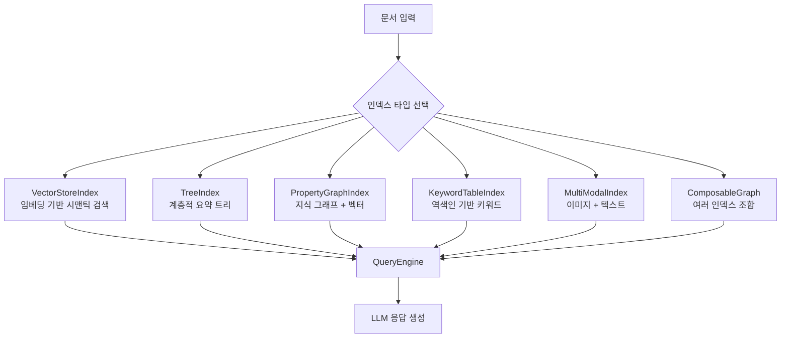

아래 표는 현재 LlamaIndex에서 지원하는 주요 인덱스 타입을 정리한 것이다.

| 인덱스 | 설명 | 특징 | 추천 상황 |
|--------|------|------|-----------|
| **VectorStoreIndex** | 문서 임베딩 후 벡터 검색 | 기본적인 semantic search | 대부분의 RAG 파이프라인 기본 설정 |
| **ListIndex** | 문서 순차 저장 | 단순 순서 기반 요약 | 전체 문서 순차 처리가 필요한 경우 |
| **TreeIndex** | 문서 요약 → 상위 노드 → 트리 구조 생성 | 대용량 문서 요약, 계층적 추론 | 계층적 구조가 있는 대용량 문서 |
| **PropertyGraphIndex** | 엔티티-관계 그래프 + 벡터 결합 | 구조화된 질의, 개체 기반 검색 | 복잡한 지식 관계 탐색 |
| **KeywordTableIndex** | LLM 기반 역색인(Inverted-Index) | 키워드-문서 매핑 | 키워드 중심 검색, 정확한 용어 매칭 |
| **ComposableGraph** | 여러 인덱스를 조합 | 도메인별 인덱스 결합 | 챕터별, 도메인별 분리 검색 |
| **MultiModalIndex** | 이미지 + 텍스트 | Vision + Text 기반 검색 | OCR 문서, 이미지 포함 문서 |

> **참고**: LlamaIndex는 시간이 지나면서 인덱스 라인업을 점진적으로 통합/정리하고 있다. 이는 에이전트 기능 강화와 개발 리소스 집중을 위한 전략적 선택으로 보인다. 잘 사용되지 않거나 성능이 제한적인 인덱스는 점차 통합되거나 deprecated 되는 추세다.

---

## 4. 핵심 인덱스 3종 심층 분석

Aiden의 분석에 따르면, LlamaIndex에서 LangChain과 가장 차별화되는 인덱스 3종은 **TreeIndex**, **KnowledgeGraphIndex(→ PropertyGraphIndex)**, **KeywordTableIndex**다.

### 4.1 TreeIndex

TreeIndex는 문서를 단순히 청크로 자르는 것이 아니라, LLM이 문서 내용을 요약하며 **계층적 트리 구조**를 만드는 방식이다.

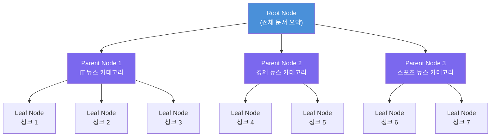

**작동 방식:**
1. 원본 문서를 청크로 분할한다
2. LLM이 각 청크를 요약해 상위 노드(Parent Node)를 생성한다
3. Parent Node들을 다시 요약해 Root Node를 만든다
4. 질의 시 트리를 순회하며 관련 노드를 탐색한다

**특징과 장단점:**

장점으로는, 대용량 문서에서 계층적 추론이 가능하다는 점이다. 예를 들어 "3분기 IT 부문 전체 실적 요약"처럼 특정 도메인 전체를 아우르는 질문에 효과적이다. 또한 ComposableIndex와 결합하면 챕터별, 도메인별로 서로 다른 트리를 만들어 조합하는 것도 가능하다.

단점은 명확하다. Hybrid Search Engine을 지원하지 않아 키워드 기반 탐색과 벡터 기반 탐색을 병렬로 수행하기 어렵다. MS GraphRAG의 커뮤니티 테이블 개념과 유사하지만, GraphRAG 대비 그래프 관계 표현력은 제한적이다.

**비교 관점**: MS GraphRAG의 커뮤니티 요약 테이블이나 최근 LlamaIndex의 Agent가 콘텐츠를 카테고리화하는 방식과 개념적으로 유사하다. 다만 TreeIndex는 LLM 기반 요약으로 구조를 만드는 반면, Agent 방식은 동적으로 도구를 선택해 탐색한다는 점에서 다르다.

---

### 4.2 KnowledgeGraphIndex → PropertyGraphIndex로의 진화

KnowledgeGraphIndex는 문서에서 **트리플(Triple: 주어-동사-목적어)** 을 추출해 지식 그래프를 구성하는 인덱스다. 이후 LlamaIndex는 이를 발전시켜 보다 풍부한 메타데이터와 속성을 지원하는 **PropertyGraphIndex**로 진화시켰다.

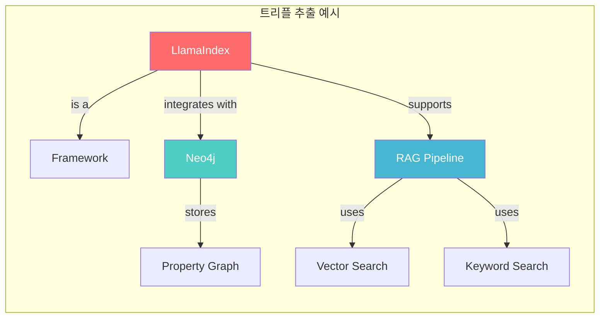

**Neo4j와의 공식 협업 (2024년 하반기)**

이전에는 Neo4j에 데이터를 삽입하려면 트리플의 형식과 데이터 유형을 직접 정의한 뒤 ETL 작업을 수행해야 했다. 이는 매우 복잡하고 번거로운 과정이었다. 2024년 하반기 Neo4j와의 공식 협업 이후, LlamaIndex는 코드를 래핑하여 훨씬 간편하게 INSERT가 가능해졌다. 또한 트리플을 어떤 방식으로 분할할지를 인스트럭션에 설정할 수 있게 되었다.

**Hybrid 검색의 강점**

`PropertyGraphIndex`의 핵심 강점은 **3중 Hybrid 검색**이다.

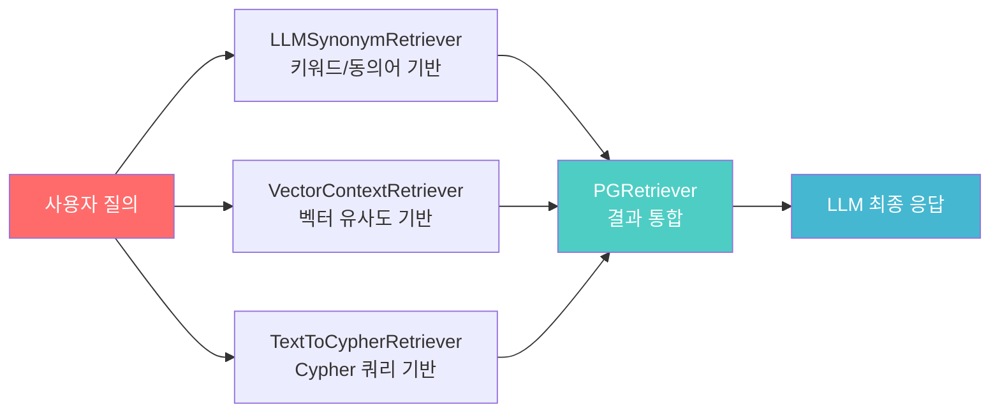

LangChain으로 Neo4j를 구현했을 때는 "LLM to Cypher" 정도만 제공되어, 모든 노드와 프로퍼티 정보를 RAG에 포함시키기 어려웠다. 결과적으로 매우 제한적인 검색만 가능했다. 반면 LlamaIndex의 PropertyGraphIndex는 키워드 검색 + 벡터 검색 + Cypher 기반 검색을 동시에 수행할 수 있어, 수치 데이터처럼 정확한 매칭이 필요한 경우에도 높은 정확도를 보인다.

---

### 4.3 KeywordTableIndex

KeywordTableIndex는 Elasticsearch의 **역색인(Inverted-Index)** 개념을 LLM 방식으로 구현한 인덱스다.

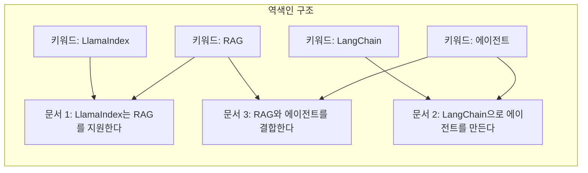

**Elasticsearch와의 비교**

| 항목 | Elasticsearch (BM25/TF-IDF) | LlamaIndex KeywordTableIndex |
|------|-----------------------------|------------------------------|
| 키워드 선별 방식 | 수학적 가중치 계산 (빈도, 역문서빈도) | LLM이 의미적으로 중요한 키워드 선별 |
| 정교함 | 수학적으로 일관된 정밀도 | LLM의 언어 이해력에 의존 |
| 동의어 처리 | 별도 동의어 사전 필요 | LLM이 문맥적으로 연관 단어 파악 |
| 계산 비용 | 낮음 | 높음 (LLM 호출) |
| 신뢰성 | 예측 가능하고 일관적 | LLM에 따라 변동 가능 |

LLM이 Transformer의 결과물이기 때문에, 키워드 자체의 품질은 나쁘지 않다. 다만 수학적으로 검증된 Elasticsearch 대비 일관성이 다소 떨어질 수 있다는 점을 인지해야 한다.

---

## 5. PropertyGraphIndex 완전 해설

`PropertyGraphIndex`는 현재 LlamaIndex에서 가장 강력하고 유연한 인덱스로, KnowledgeGraphIndex의 진화형이다. 라벨이 붙은 노드(labeled nodes)와 속성(properties), 그리고 구조화된 경로(structured paths)로 연결된 관계로 이루어진 **프로퍼티 그래프**를 구성하고 질의하는 기능을 제공한다.

### 5.1 개념과 구조

프로퍼티 그래프는 다음 세 가지 핵심 개념으로 구성된다.

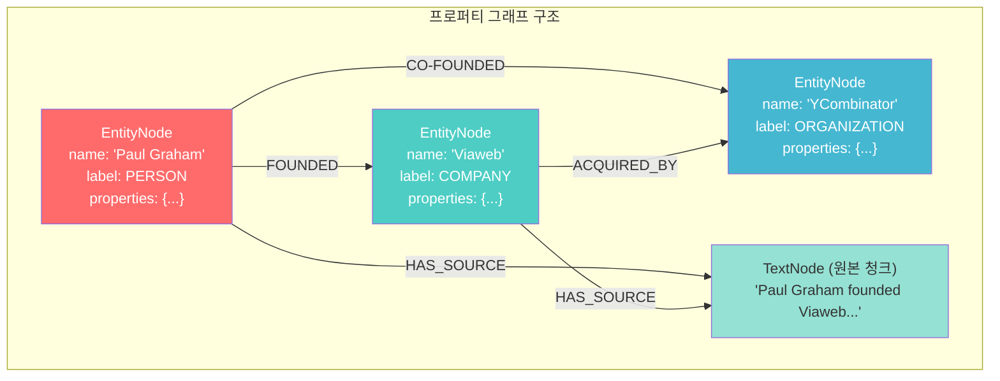

**PropertyGraphIndex의 역할:**
- 문서 청크로부터 엔티티와 관계를 추출하는 **구성(Construction)**
- 그래프를 다양한 방식으로 탐색하는 **질의(Querying)**

---

### 5.2 그래프 생성과 Extractor 체계

PropertyGraphIndex는 `kg_extractors`를 통해 각 청크에서 엔티티와 관계를 추출한다. 여러 개의 extractor를 동시에 적용할 수 있다는 점이 큰 장점이다.

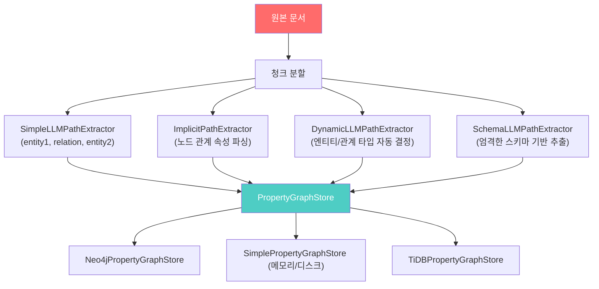

#### (1) SimpleLLMPathExtractor (기본값)

가장 기본적인 extractor로, LLM을 활용해 단일 홉(single-hop) 경로를 `(entity1, relation, entity2)` 형식으로 추출한다.

```python
from llama_index.core.indices.property_graph import SimpleLLMPathExtractor

kg_extractor = SimpleLLMPathExtractor(
    llm=llm,
    max_paths_per_chunk=10,  # 청크당 최대 경로 수
    num_workers=4,           # 병렬 처리 워커 수
    show_progress=False,
)
```

추출 프롬프트와 파싱 함수를 직접 커스터마이즈할 수도 있다.

```python
# 커스텀 프롬프트 예시
prompt = (
    "Some text is provided below. Given the text, extract up to "
    "{max_paths_per_chunk} "
    "knowledge triples in the form of `subject,predicate,object` on each line.\n"
)

def parse_fn(response_str: str):
    lines = response_str.split("\n")
    triples = [line.split(",") for line in lines]
    return triples

kg_extractor = SimpleLLMPathExtractor(
    llm=llm,
    extract_prompt=prompt,
    parse_fn=parse_fn,
)
```

#### (2) ImplicitPathExtractor (기본값)

LLM 호출이 필요 없다는 점이 가장 큰 특징이다. LlamaIndex 노드 객체의 `node.relationships` 속성을 파싱하여 경로를 추출한다. 이미 노드 간 관계가 정의된 경우 비용 없이 그래프를 구성할 수 있다.

```python
from llama_index.core.indices.property_graph import ImplicitPathExtractor

kg_extractor = ImplicitPathExtractor()
# LLM 호출 불필요 — 노드 관계 속성 직접 파싱
```

#### (3) DynamicLLMPathExtractor

허용할 엔티티 타입과 관계 타입의 목록을 제공하되, LLM이 자유롭게 타입을 결정하도록 가이드를 제공하는 방식이다. 스키마를 완전히 제약하지 않고 LLM의 유연성을 활용하고 싶을 때 적합하다.

```python
from llama_index.core.indices.property_graph import DynamicLLMPathExtractor

kg_extractor = DynamicLLMPathExtractor(
    llm=llm,
    max_triplets_per_chunk=20,
    num_workers=4,
    allowed_entity_types=["POLITICIAN", "POLITICAL_PARTY"],
    allowed_relation_types=["PRESIDENT_OF", "MEMBER_OF"],
    # 위 타입들은 가이드로만 작동, 엄격히 강제하지 않음
)
```

#### (4) SchemaLLMPathExtractor

Pydantic을 활용해 엔티티, 관계, 그리고 어떤 엔티티가 어떤 관계로 연결될 수 있는지를 **엄격한 스키마**로 정의하고 추출하는 방식이다. 도메인이 명확하고 정확한 구조가 필요한 경우에 이상적이다.

```python
from typing import Literal
from llama_index.core.indices.property_graph import SchemaLLMPathExtractor

# 허용 엔티티 타입 정의
entities = Literal["PERSON", "PLACE", "THING"]
# 허용 관계 타입 정의
relations = Literal["PART_OF", "HAS", "IS_A"]
# 스키마: 어떤 엔티티가 어떤 관계를 가질 수 있는가
schema = {
    "PERSON": ["PART_OF", "HAS", "IS_A"],
    "PLACE": ["PART_OF", "HAS"],
    "THING": ["IS_A"],
}

kg_extractor = SchemaLLMPathExtractor(
    llm=llm,
    possible_entities=entities,
    possible_relations=relations,
    kg_validation_schema=schema,
    strict=True,   # False로 설정하면 스키마 외 트리플도 허용
    num_workers=4,
    max_triplets_per_chunk=10,
)
```

**Extractor 비교 요약:**

| Extractor | LLM 필요 | 스키마 | 유연성 | 적합한 상황 |
|-----------|---------|--------|--------|-------------|
| SimpleLLMPathExtractor | ✅ | 없음 | 높음 | 범용적 지식 추출 |
| ImplicitPathExtractor | ❌ | 없음 | 중간 | 기존 관계 활용 |
| DynamicLLMPathExtractor | ✅ | 가이드 | 높음 | 반구조화 도메인 |
| SchemaLLMPathExtractor | ✅ | 엄격 | 낮음 | 명확한 도메인 온톨로지 |

---

### 5.3 Retrieval 전략과 다중 Retriever 아키텍처

PropertyGraphIndex의 또 다른 강점은 **다중 Retriever를 조합**할 수 있다는 점이다. 각 Retriever는 서로 다른 방식으로 그래프를 탐색하여, 결과를 통합해 더 풍부한 컨텍스트를 제공한다.

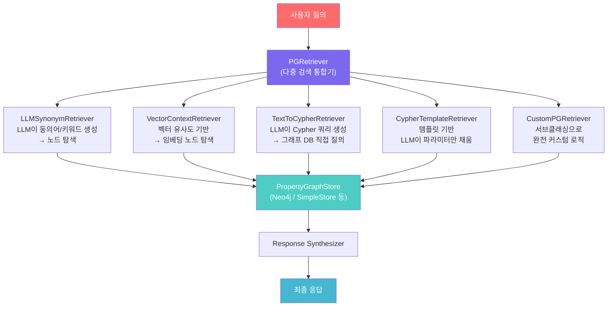

#### (1) LLMSynonymRetriever (기본값)

질의를 받아 LLM이 관련 키워드와 동의어를 생성한 뒤, 이를 바탕으로 그래프의 노드를 탐색한다. 내부적으로는 깊이(depth)를 제한한 BFS(너비 우선 탐색)와 유사하게 동작한다고 볼 수 있다. DFS로 가면 검색 시간이 지나치게 길어지므로, depth 제한은 실용적인 선택이다.

```python
from llama_index.core.indices.property_graph import LLMSynonymRetriever

synonym_retriever = LLMSynonymRetriever(
    index.property_graph_store,
    llm=llm,
    include_text=False,
    max_keywords=10,
    path_depth=1,  # 노드 탐색 후 관계 따라 얼마나 깊이 갈지
)
```

#### (2) VectorContextRetriever (임베딩 지원 시 기본값)

임베딩 벡터를 활용해 유사한 노드를 찾고, 해당 노드와 연결된 경로를 함께 반환한다. 그래프 스토어가 벡터를 직접 지원하면 별도의 벡터 스토어가 필요 없다. Neo4j, TiDB, FalkorDB 등이 여기에 해당한다.

```python
from llama_index.core.indices.property_graph import VectorContextRetriever

vector_retriever = VectorContextRetriever(
    index.property_graph_store,
    embed_model=embed_model,
    include_text=False,
    similarity_top_k=2,   # 몇 개의 유사 노드를 가져올지
    path_depth=1,         # 해당 노드에서 몇 단계 관계를 따를지
)
```

#### (3) TextToCypherRetriever

LLM이 그래프 스토어의 스키마를 읽고, 자연어 질의를 Cypher 쿼리로 변환하여 직접 그래프 DB에 질의하는 방식이다. `SimplePropertyGraphStore`는 실제 그래프 DB가 아니므로 지원하지 않는다. Neo4j 등의 실제 그래프 DB에서만 사용 가능하다.

```python
from llama_index.core.indices.property_graph import TextToCypherRetriever

cypher_retriever = TextToCypherRetriever(
    index.property_graph_store,
    llm=llm,
)
# 주의: 임의 Cypher 실행은 보안 위험이 있으므로
# 프로덕션 환경에서는 읽기 전용 롤, 샌드박스 환경 등 조치 필요
```

#### (4) CypherTemplateRetriever

TextToCypherRetriever의 보다 안전한 버전이다. Cypher 쿼리 템플릿을 미리 정의하고, LLM은 파라미터만 채워 넣는다. 이를 통해 임의의 Cypher 실행 위험을 최소화할 수 있다.

```python
from pydantic import BaseModel, Field
from llama_index.core.indices.property_graph import CypherTemplateRetriever

# 미리 정의된 안전한 Cypher 템플릿
cypher_query = """
MATCH (c:Chunk)-[:MENTIONS]->(o)
WHERE o.name IN $names
RETURN c.text, o.name, o.label;
"""

# LLM이 채울 파라미터 스키마
class TemplateParams(BaseModel):
    names: list[str] = Field(
        description="엔티티 이름 또는 키워드 목록"
    )

template_retriever = CypherTemplateRetriever(
    index.property_graph_store, TemplateParams, cypher_query
)
```

---

### 5.4 스토리지 옵션 비교

PropertyGraphIndex는 다양한 그래프 스토어를 지원한다.

| 스토어 | 인메모리 | 네이티브 임베딩 | 비동기 | 유형 |
|--------|---------|----------------|--------|------|
| **SimplePropertyGraphStore** | ✅ | ❌ | ❌ | 디스크 (JSON) |
| **Neo4jPropertyGraphStore** | ❌ | ✅ | ❌ | 서버 |
| **NebulaPropertyGraphStore** | ❌ | ❌ | ❌ | 서버 |
| **TiDBPropertyGraphStore** | ❌ | ✅ | ❌ | 서버 |
| **FalkorDBPropertyGraphStore** | ❌ | ✅ | ❌ | 서버 |

**권장 조합:**

개발/프로토타입 환경에서는 `SimplePropertyGraphStore`로 로컬 디스크에 저장하면 충분하다. 프로덕션 환경에서는 `Neo4jPropertyGraphStore`를 기본으로 사용하되, 필요 시 Qdrant 등 외부 벡터 DB와 결합할 수 있다.

```python
# Neo4j + Qdrant 조합 예시
from llama_index.core.indices import PropertyGraphIndex
from llama_index.graph_stores.neo4j import Neo4jPropertyGraphStore
from llama_index.vector_stores.qdrant import QdrantVectorStore

graph_store = Neo4jPropertyGraphStore(
    username="neo4j",
    password="<password>",
    url="bolt://localhost:7687",
)

vector_store = QdrantVectorStore(
    "graph_collection",
    client=QdrantClient(...),
)

index = PropertyGraphIndex.from_documents(
    documents,
    property_graph_store=graph_store,
    vector_store=vector_store,  # Neo4j가 임베딩을 직접 지원하므로 선택사항
    embed_kg_nodes=True,
)
```

---

## 6. Neo4j + LlamaIndex 통합 실전 가이드

### 6.1 환경 설정

Docker로 Neo4j를 로컬에서 실행하는 방법이다.

```bash
# Neo4j Docker 실행
docker run \
    -p 7474:7474 -p 7687:7687 \
    -v $PWD/data:/data -v $PWD/plugins:/plugins \
    --name neo4j-apoc \
    -e NEO4J_apoc_export_file_enabled=true \
    -e NEO4J_apoc_import_file_enabled=true \
    -e NEO4J_apoc_import_file_use__neo4j__config=true \
    -e NEO4JLABS_PLUGINS='["apoc"]' \
    neo4j:latest
```

실행 후 `http://localhost:7474/` 에서 브라우저로 접속 가능하다. 초기 인증 정보는 `neo4j/neo4j`이며, 최초 로그인 시 비밀번호 변경을 요구한다.

### 6.2 인덱스 구성 (SchemaLLMPathExtractor 사용)

```python
import os
os.environ["OPENAI_API_KEY"] = "sk-..."

from llama_index.core import SimpleDirectoryReader, PropertyGraphIndex
from llama_index.graph_stores.neo4j import Neo4jPropertyGraphStore
from llama_index.embeddings.openai import OpenAIEmbedding
from llama_index.llms.openai import OpenAI
from llama_index.core.indices.property_graph import SchemaLLMPathExtractor

# 문서 로딩
documents = SimpleDirectoryReader("./data/").load_data()

# Neo4j 스토어 설정
graph_store = Neo4jPropertyGraphStore(
    username="neo4j",
    password="llamaindex",
    url="bolt://localhost:7687",
)

# 인덱스 생성
index = PropertyGraphIndex.from_documents(
    documents,
    embed_model=OpenAIEmbedding(model_name="text-embedding-3-small"),
    kg_extractors=[
        SchemaLLMPathExtractor(
            llm=OpenAI(model="gpt-4o-mini", temperature=0.0)
        )
    ],
    property_graph_store=graph_store,
    show_progress=True,
)
```

### 6.3 질의 실행 및 결과 탐색

```python
# 기본 질의 엔진 사용
query_engine = index.as_query_engine(include_text=True)
response = query_engine.query("Interleaf과 Viaweb에서 무슨 일이 있었나요?")
print(str(response))

# Neo4j 브라우저에서 그래프 탐색
# http://localhost:7474/ 에서 아래 Cypher 실행
# 전체 그래프 보기: MATCH n=() RETURN n
# 특정 노드 찾기: MATCH (n:PERSON) RETURN n LIMIT 25
# 그래프 삭제: MATCH n=() DETACH DELETE n
```

**실행 결과 예시:**

Neo4j PropertyGraphIndex로 "Interleaf과 Viaweb에 무슨 일이 있었나요?"를 질의하면, 다음과 같이 그래프에서 관련 경로를 탐색해 응답을 생성한다:

```
Interleaf → Got crushed by → Moore's law
Interleaf → Made → Software
Interleaf → Had → Smart people
Viaweb → Was → Profitable
Viaweb → Was → Growing rapidly

최종 응답: "Interleaf은 훌륭한 인재와 인상적인 기술을 보유했지만 
무어의 법칙에 의해 무너졌다. Viaweb은 수익성이 높고 빠르게 성장하고 있었다."
```

### 6.4 기존 그래프에서 로딩

LlamaIndex 외부에서 생성된 Neo4j 그래프도 연결해 사용할 수 있다. 단, LlamaIndex 외부에서 생성된 그래프에서는 `TextToCypherRetriever`나 `CypherTemplateRetriever`가 가장 유용하고, 다른 Retriever는 LlamaIndex가 삽입하는 특수 속성에 의존하므로 제한적으로 동작할 수 있다.

```python
from llama_index.graph_stores.neo4j import Neo4jPropertyGraphStore
from llama_index.core.indices import PropertyGraphIndex

graph_store = Neo4jPropertyGraphStore(
    username="neo4j",
    password="your_password",
    url="bolt://localhost:7687",
)

# 기존 그래프에서 인덱스 로딩
index = PropertyGraphIndex.from_existing(
    property_graph_store=graph_store,
    llm=OpenAI(model="gpt-4o-mini", temperature=0.3),
    embed_model=OpenAIEmbedding(model_name="text-embedding-3-small"),
)

# 추가 문서 삽입도 가능
from llama_index.core import Document
index.insert(Document(text="LlamaIndex는 훌륭한 프레임워크입니다!"))
```

---

## 7. 아키텍처 선택 기준: 언제 무엇을 써야 하는가

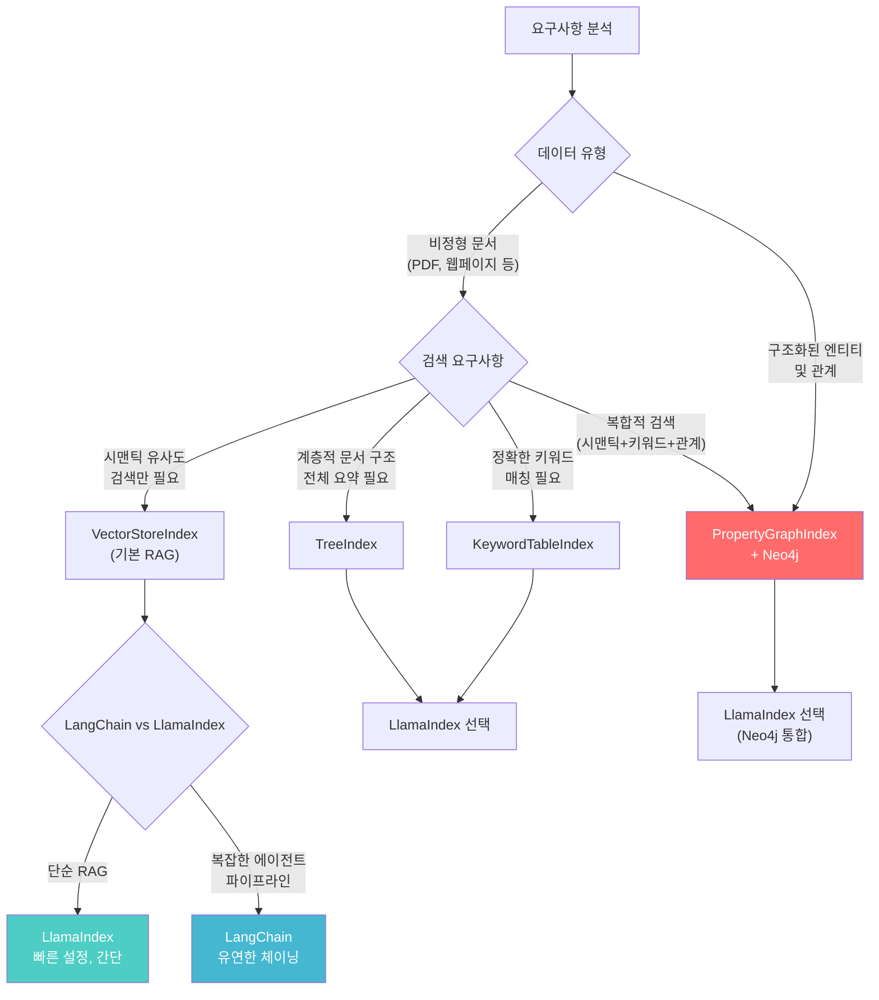

### 구체적인 선택 가이드

**LlamaIndex + VectorStoreIndex를 선택해야 하는 상황:**
- 표준적인 문서 기반 RAG가 필요한 경우
- 빠른 프로토타입 개발이 필요한 경우
- 데이터가 주로 비정형 텍스트인 경우

**LlamaIndex + PropertyGraphIndex를 선택해야 하는 상황:**
- 엔티티 간 관계 탐색이 중요한 경우 (예: "X와 Y의 공통 협업사는?")
- 수치 데이터와 텍스트 데이터를 함께 정밀하게 검색해야 하는 경우
- 도메인 온톨로지가 명확히 정의된 경우
- 지식 기반(Knowledge Base) 구축이 목표인 경우

**LangChain을 선택해야 하는 상황:**
- 다단계 에이전트 워크플로우가 핵심인 경우
- 다양한 외부 도구(API, DB, 계산기 등)와의 연동이 필요한 경우
- LLM 간 체이닝이 복잡하게 얽혀 있는 경우

**두 프레임워크를 함께 사용하는 상황:**
- LlamaIndex를 검색/인덱싱 레이어로, LangChain을 에이전트 오케스트레이션 레이어로 분리 사용
- LlamaIndex는 LangChain과의 통합 인터페이스도 제공하므로 병행 사용이 가능하다

---

## 8. 결론 및 2025~2026년 동향 전망

### 현재 상태 요약

LlamaIndex는 현재 인덱싱의 핵심을 `PropertyGraphIndex`로 통합하는 방향으로 발전하고 있다. 과거에 제공하던 다양한 인덱스 타입들을 점진적으로 정리하고, 그래프 기반 지식 표현과 멀티모달 처리에 집중하는 추세다.

Neo4j와의 공식 협업, LlamaAgents 플랫폼 출시, LlamaParse 고도화 등을 통해 단순한 인덱싱 프레임워크를 넘어 **엔터프라이즈 RAG 플랫폼**으로의 전환을 시도하고 있다.

### 2025~2026년 주요 흐름

LlamaIndex 공식 문서를 보면 최근 **MCP(Model Context Protocol)** 통합, **LlamaAgents**를 통한 멀티에이전트 지원, **LlamaParse**를 통한 고품질 문서 파싱이 주요 개발 축임을 알 수 있다. 특히 MCP 지원은 기존 LlamaIndex 워크플로우를 MCP 서버로 변환하거나, MCP 도구를 LlamaIndex 에이전트에서 사용할 수 있게 하는 방향이다.

**그래프 RAG의 부상**: MS GraphRAG, LlamaIndex PropertyGraphIndex, Neo4j + LLM 조합이 RAG의 다음 단계로 주목받고 있다. 단순 청크 기반 벡터 검색의 한계(컨텍스트 단절, 복잡한 관계 표현 불가)를 그래프 구조가 보완할 수 있기 때문이다.

**두 프레임워크의 공존**: LlamaIndex와 LangChain은 서로 경쟁하기보다 다른 레이어를 담당하는 방향으로 수렴하고 있다. LlamaIndex는 데이터 레이어와 검색 레이어, LangChain은 오케스트레이션 레이어로 역할이 명확해지고 있다.

### 개발자에게 주는 시사점

LLM 애플리케이션을 개발할 때, 프레임워크 선택보다 더 중요한 것은 **데이터를 어떻게 구조화하고 탐색할 것인가**에 대한 설계 결정이다. LlamaIndex가 제공하는 다양한 인덱싱 전략은 이 질문에 대한 구체적인 답변들이다. 특히 PropertyGraphIndex는 단순한 벡터 검색을 넘어, 도메인 지식을 구조화하고 복잡한 관계를 탐색하는 강력한 도구로 자리잡고 있다.

---

*이 문서는 Aiden의 블로그(aiden0729.tistory.com/18)와 LlamaIndex 공식 문서(developers.llamaindex.ai)를 기반으로 작성되었으며, 2026년 4월 기준 최신 정보를 반영하였습니다.*

---

---

# 별첨: Elasticsearch Hybrid Search + PostgreSQL 시계열 스택 결합 시 LlamaIndex 아키텍처 영향도 분석

> **별첨 작성 배경**
> 본 별첨은 다음 두 가지 무료 오픈소스 스택을 LlamaIndex 기반 RAG 파이프라인에 결합했을 때의 설계 영향도를 분석한다.
> - **Stack A**: Elasticsearch의 BM25(무료) + Vector Search(무료 self-hosted)
> - **Stack B**: PostgreSQL 기반 ACID 준수 + 시계열 데이터 검색 (pgvector + TimescaleDB)

---

## 별첨 목차

- [A. 스택별 무료/유료 경계 명확화](#a-스택별-무료유료-경계-명확화)
- [B. Elasticsearch Hybrid 스택 아키텍처 분석](#b-elasticsearch-hybrid-스택-아키텍처-분석)
- [C. PostgreSQL 통합 스택 아키텍처 분석](#c-postgresql-통합-스택-아키텍처-분석)
- [D. LlamaIndex 핵심 인덱스별 영향도 매핑](#d-llamaindex-핵심-인덱스별-영향도-매핑)
- [E. 결합 아키텍처 설계 패턴 3종](#e-결합-아키텍처-설계-패턴-3종)
- [F. 스택 선택 의사결정 기준](#f-스택-선택-의사결정-기준)

---

## A. 스택별 무료/유료 경계 명확화

두 스택의 영향도를 분석하기 전에, **"무료"의 범위**를 정확히 이해해야 한다. 특히 Elasticsearch는 라이선스 정책이 복잡하게 변화해왔기 때문에 혼동이 생기기 쉽다.

### A.1 Elasticsearch: 무료 vs 유료

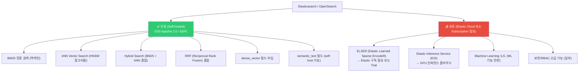

> **핵심 정리**: BM25와 dense vector 기반 kNN 검색, 그리고 이 둘을 결합한 Hybrid Search(RRF 포함)는 **self-hosted Elasticsearch에서 완전 무료**다. ELSER(Elastic의 자체 sparse 시맨틱 모델)는 유료 구독이 필요하지만, **외부 임베딩 모델(OpenAI, HuggingFace 등)을 직접 주입해 벡터 필드에 저장하는 방식은 무료**로 사용 가능하다.

ELSER V2는 NDCG@10(검색 품질 지표) 기준으로 기존 BM25 대비 평균 18% 향상된 성능을 보이며, 10승 1무 1패의 비교 벤치마크 결과를 가진다. 그러나 이는 유료 범위이므로, 무료 스택에서는 외부 임베딩 + BM25 조합이 현실적인 대안이다.

### A.2 PostgreSQL 스택: 무료 범위

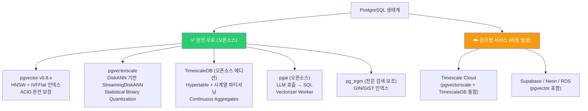

pgvector는 Postgres 13+를 지원하며, ACID 준수, Point-in-Time Recovery, JOIN, Write-Ahead Log(WAL) 기반 복제를 모두 무료로 지원한다. pgvectorscale의 경우, 50만 개 Cohere 임베딩(768차원) 벤치마크에서 Pinecone의 storage-optimized(s1) 인덱스 대비 p95 레이턴시 28배 감소, 처리량 16배 향상, 비용 75% 절감을 달성했다.

---

## B. Elasticsearch Hybrid 스택 아키텍처 분석

### B.1 Elasticsearch Hybrid Search의 내부 동작

Elasticsearch에서 BM25와 벡터 검색을 결합하는 방식은 두 가지다. 하나는 `query` + `knn` 옵션을 병렬로 실행하는 전통적인 방식이고, 다른 하나는 Elasticsearch 8.14에서 도입되어 8.16에서 GA가 된 `retriever` API를 활용하는 방식이다. 두 방식 모두 결과를 융합하는 데 RRF 또는 선형 결합(Linear Combination)을 사용한다.

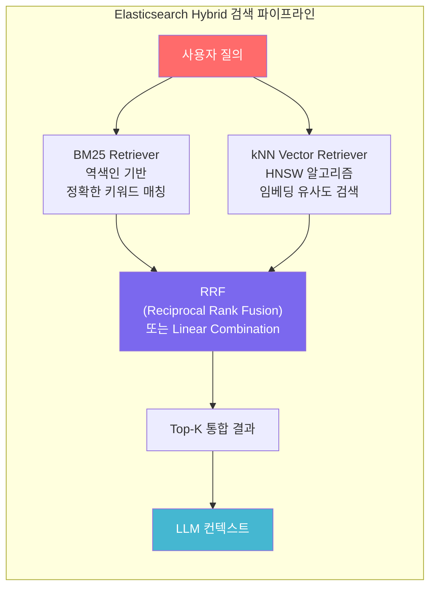

**RRF 수식:** 각 문서의 최종 스코어는 BM25 순위와 벡터 검색 순위를 다음 공식으로 결합한다.

```
RRF_score(d) = Σ  1 / (k + rank(d))
               각 retriever
```

여기서 `k`는 보통 60으로 설정되며, 순위가 높을수록(낮은 순위 숫자) 더 높은 기여를 한다. BM25의 점수 스케일(무한대)과 벡터 검색의 점수 스케일(코사인 유사도 기준 [0, 2])이 다르기 때문에, 단순 스코어 합산 대신 RRF를 통한 순위 기반 융합이 훨씬 안정적인 결과를 낸다.

### B.2 LlamaIndex와 Elasticsearch 연동 시 구조 변화

LlamaIndex는 Elasticsearch를 `ElasticsearchVectorStore`로 지원한다. 이를 활용하면 기존 LlamaIndex의 `VectorStoreIndex`가 Elasticsearch를 백엔드로 사용하게 되어, ES 자체의 Hybrid Search 능력을 RAG 파이프라인에 흡수할 수 있다.

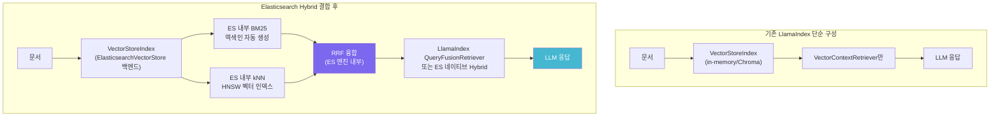

**핵심 영향 포인트:** Elasticsearch 백엔드를 사용할 경우, LlamaIndex의 `KeywordTableIndex`가 담당하던 역할(LLM 기반 키워드 추출 + 역색인)이 **ES의 BM25 역색인으로 대체**된다. 이는 LLM 호출 비용 없이 수학적으로 검증된 키워드 검색을 제공한다는 의미다.

### B.3 LlamaIndex QueryFusionRetriever와 ES Hybrid의 차이

LlamaIndex는 자체적으로 `QueryFusionRetriever`를 제공해 BM25와 벡터 검색을 결합할 수 있다. 이는 ES를 사용하지 않더라도 가능하다.

```python
from llama_index.retrievers.bm25 import BM25Retriever
from llama_index.core.retrievers import QueryFusionRetriever

# BM25 Retriever (로컬, LLM 불필요)
bm25_retriever = BM25Retriever.from_defaults(nodes=nodes, similarity_top_k=10)

# Vector Retriever
vector_retriever = index.as_retriever(similarity_top_k=10)

# 두 Retriever를 RRF로 결합
hybrid_retriever = QueryFusionRetriever(
    [vector_retriever, bm25_retriever],
    similarity_top_k=5,
    num_queries=1,       # 1로 설정 시 쿼리 증강 비활성화
    mode="reciprocal_rerank",
    use_async=True,
)
```

| 비교 항목 | LlamaIndex QueryFusionRetriever | Elasticsearch Native Hybrid |
|-----------|--------------------------------|----------------------------|
| BM25 처리 위치 | 애플리케이션 레이어 (Python) | 검색 엔진 내부 (JVM/Lucene) |
| 스케일 | 소~중규모 (메모리 제한) | 대규모 분산 처리 가능 |
| 실시간 업데이트 | 재인덱싱 필요 | 실시간 문서 추가/삭제 |
| 관리 복잡도 | 낮음 (별도 인프라 불필요) | 높음 (ES 클러스터 운영) |
| 검색 품질 조정 | alpha 파라미터 (0.0~1.0) | RRF k값, 가중치 설정 |
| 언어 지원 | 기본 영어 토크나이저 | 다국어 Analyzer 지원 |
| 한국어 지원 | 별도 설정 필요 | nori_analyzer 플러그인 |

> **한국어 RAG 시스템에서의 고려사항**: LlamaIndex의 기본 BM25 토크나이저는 영어 중심이다. 한국어 문서를 처리할 때는 Elasticsearch의 `nori_analyzer`(한국어 형태소 분석)를 활용하는 것이 BM25 검색 품질 면에서 압도적으로 유리하다.

### B.4 ELSER를 대체하는 무료 시맨틱 레이어 구성

ELSER가 유료이므로, 무료 스택에서 시맨틱 검색을 구현하려면 외부 임베딩 모델을 활용해야 한다.

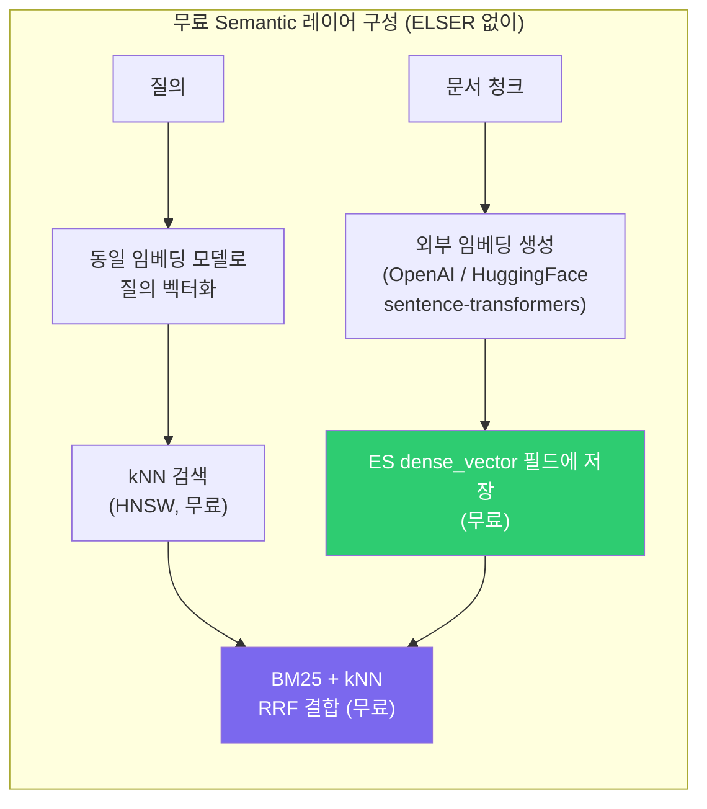

LlamaIndex의 `ElasticsearchVectorStore`는 이 패턴을 지원한다. 임베딩 생성은 LlamaIndex가 담당하고, 저장과 BM25 + 벡터 결합 검색은 ES가 담당하는 역할 분담이다.

---

## C. PostgreSQL 통합 스택 아키텍처 분석

### C.1 PostgreSQL 스택의 계층 구조

PostgreSQL 기반 스택은 단일 데이터베이스에서 벡터 검색, 시계열 분석, 트랜잭션 데이터, ACID 보장을 모두 처리할 수 있다는 점이 가장 큰 차별점이다.

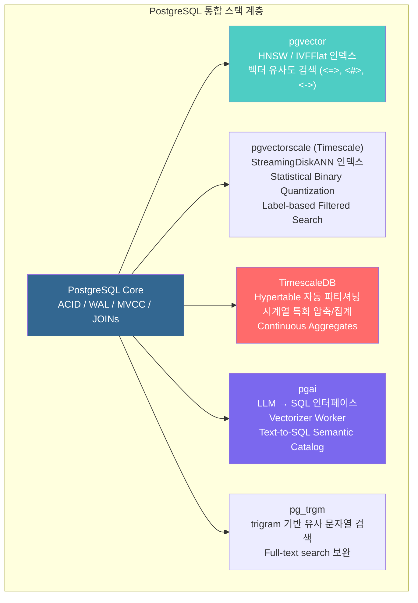

### C.2 pgvector + pgvectorscale: ACID와 벡터 검색의 공존

pgvector의 가장 큰 강점은 벡터 검색이 PostgreSQL의 트랜잭션 경계 안에서 동작한다는 점이다. 이는 전용 벡터 DB(Pinecone, Weaviate 등)와 비교할 때 근본적인 아키텍처 차이를 만든다.

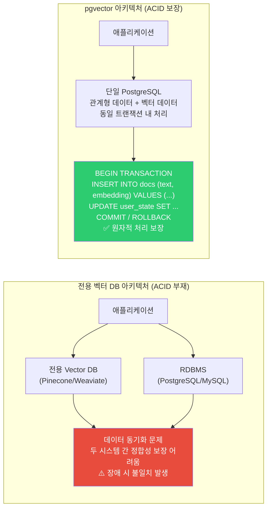

**ACID 보장의 실제 의미:**

문서를 삽입하면서 동시에 사용자 상태를 업데이트하는 시나리오를 생각해보자. 전용 벡터 DB를 사용하면 벡터 DB에 임베딩을 저장한 뒤 RDBMS에 메타데이터를 저장하는 두 단계 과정이 필요하다. 첫 번째 단계가 성공했지만 두 번째 단계에서 실패하면 데이터 불일치가 발생한다. pgvector에서는 이 모든 과정이 단일 트랜잭션이므로 롤백이 가능하다.

pgvectorscale의 성능 개선은 주목할 만하다. DiskANN에서 영감을 받은 `StreamingDiskANN` 인덱스는 대규모 벡터 데이터셋에서 기존 pgvector의 HNSW 대비 최대 1,590% 빠른 검색 속도를 보이며, Pinecone s1 대비 28배 낮은 p95 레이턴시를 달성했다. 이를 통해 "단일 PostgreSQL로 Pinecone을 대체할 수 있다"는 주장이 성립하는 수준에 도달했다.

### C.3 TimescaleDB: 시계열 + 벡터의 결합

TimescaleDB의 Hypertable은 타임스탬프 기반으로 데이터를 자동 파티셔닝한다. 이 특성이 벡터 검색과 결합되면 **시간 범위 필터링이 적용된 벡터 검색**이 가능해진다.

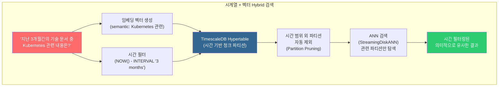

이 구조에서 시간 범위 밖의 파티션은 ANN 검색 대상에서 아예 제외되므로, 검색 공간이 줄어들어 속도와 정확도가 동시에 향상된다. LangChain TimescaleVector 문서에서는 이를 git 커밋 히스토리 RAG에 적용해, "특정 기간의 변경 사항"에 대한 질의를 시간 제약 벡터 검색으로 처리하는 예시를 보여준다.

**LlamaIndex에서의 활용 패턴:**

```python
# TimescaleDB를 LlamaIndex VectorStoreIndex 백엔드로 활용
from llama_index.vector_stores.timescalevector import TimescaleVectorStore
import datetime

# 시간 기반 파티셔닝 설정
vector_store = TimescaleVectorStore.from_params(
    service_url="postgresql://...",
    table_name="rag_documents",
    time_partition_interval=datetime.timedelta(days=30),  # 30일 단위 파티션
)

index = VectorStoreIndex.from_vector_store(vector_store)

# 시간 범위 필터 + 시맨틱 검색 조합
retriever = index.as_retriever(
    vector_store_kwargs={
        "start_date": datetime.datetime(2025, 1, 1),
        "end_date": datetime.datetime(2025, 12, 31),
    }
)
```

### C.4 pgai: SQL에서 LLM을 직접 호출하는 새로운 패러다임

pgai(Timescale 오픈소스)는 PostgreSQL에서 직접 LLM을 호출하고 임베딩을 생성할 수 있게 한다. 이는 데이터 이동 없이 데이터베이스 레이어에서 AI 기능을 처리한다는 것을 의미한다.

```sql
-- SQL에서 직접 임베딩 생성 및 저장 (pgai Vectorizer)
SELECT ai.create_vectorizer(
    'documents'::regclass,
    destination => 'document_embeddings',
    embedding => ai.embedding_openai('text-embedding-3-small', 1536),
    chunking => ai.chunking_recursive_character_text_splitter('content')
);

-- SQL에서 직접 LLM 호출
SELECT ai.openai_chat_complete(
    'gpt-4o-mini',
    jsonb_build_array(
        jsonb_build_object('role', 'user', 'content', '이 문서를 요약해줘: ' || content)
    )
) FROM documents WHERE id = 1;
```

이는 기존 RAG 파이프라인에서 Python 레이어가 담당하던 "임베딩 생성 → 벡터 저장" 흐름을 데이터베이스 레이어로 내리는 것이다. 데이터 파이프라인 단순화와 임베딩 동기화 문제(원본 데이터 변경 시 임베딩 재생성 누락) 해소가 주요 장점이다.

---

## D. LlamaIndex 핵심 인덱스별 영향도 매핑

본 문서 본편에서 다룬 LlamaIndex 인덱스들이 두 스택(Elasticsearch, PostgreSQL)을 도입했을 때 각각 어떻게 영향을 받는지 정리한다.

### D.1 인덱스별 영향도 매트릭스

| LlamaIndex 인덱스 | ES BM25+Vector 도입 영향 | PostgreSQL+TimescaleDB 도입 영향 |
|-------------------|-------------------------|----------------------------------|
| **VectorStoreIndex** | ⚡ 대규모 분산 벡터 검색 가능<br/>ES를 백엔드로 교체 시 스케일 아웃 가능 | ⚡ pgvector/pgvectorscale로 교체<br/>ACID 보장 + SQL JOIN 활용 가능 |
| **KeywordTableIndex** | 🔄 **실질적 대체 가능성 높음**<br/>ES BM25가 LLM 키워드 추출을 수학적으로 대체<br/>nori_analyzer로 한국어 지원 강화 | 🔄 pg_trgm + 전문 검색으로 부분 대체<br/>단, LLM 키워드 품질 대비 범위 제한 |
| **TreeIndex** | ➖ 직접 영향 없음<br/>(트리 구조 자체는 ES가 담당하지 않음) | ➖ 직접 영향 없음<br/>(단, 요약 결과를 PG에 저장 가능) |
| **PropertyGraphIndex** | 🔗 보완 관계<br/>ES는 그래프 탐색 불가<br/>텍스트 검색 레이어로 병렬 운용 가능 | 🔗 약한 보완<br/>Neo4j 대체는 불가하나<br/>관계형 JOIN으로 단순 관계 표현 가능 |
| **BM25Retriever (LlamaIndex 내장)** | ⚡ **ES BM25로 완전 대체 권장**<br/>한국어 등 다국어 지원, 분산 처리 | 🔄 pg_trgm / tsvector 전문 검색으로 부분 대체 |
| **QueryFusionRetriever** | 🔄 ES Native Hybrid로 대체 가능<br/>단, LlamaIndex 레이어 유지 시 조합 가능 | ⚡ pgvector 벡터 + tsvector 전문 검색<br/>SQL에서 직접 결합 가능 |

### D.2 가장 큰 영향을 받는 인덱스: KeywordTableIndex

KeywordTableIndex는 세 스택 중 가장 큰 영향을 받는다. 이 인덱스의 작동 방식은 LLM이 키워드를 선별하고 이를 역색인에 매핑하는 것인데, Elasticsearch의 BM25는 이를 수학적으로 훨씬 정교하게 처리하며, 추가 LLM 호출 비용도 없다.

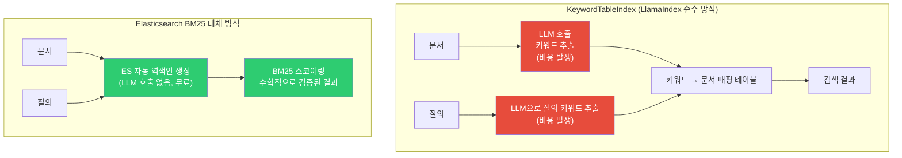

**결론**: 한국어 문서 기반 RAG 시스템에서 KeywordTableIndex를 사용 중이라면, Elasticsearch(nori_analyzer 적용) + BM25로 교체하는 것이 검색 품질과 비용 양면에서 유리하다.

---

## E. 결합 아키텍처 설계 패턴 3종

두 스택을 LlamaIndex 기반 RAG 시스템에 결합하는 대표적인 패턴 3가지를 제안한다.

### 패턴 1: Elasticsearch 중심 Pure Hybrid RAG

**대상**: 대규모 문서 검색, 다국어 지원, 고가용성이 필요한 경우

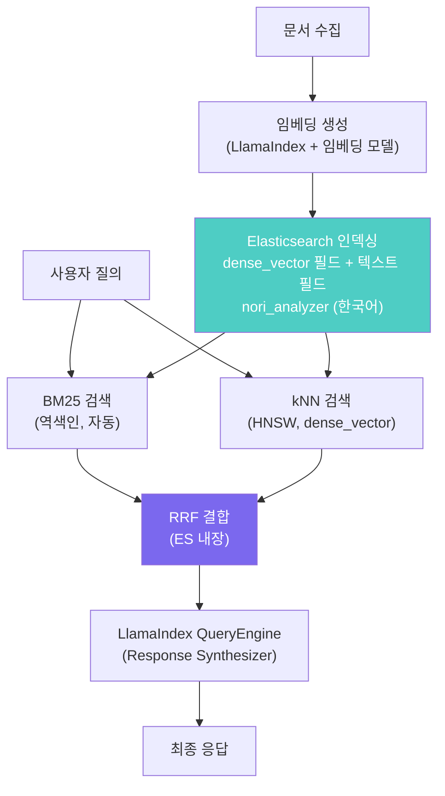

### 패턴 2: PostgreSQL 단일 스택 RAG (ACID + 시계열)

**대상**: 트랜잭션 정합성이 중요한 엔터프라이즈 시스템, 시계열 데이터 포함 RAG

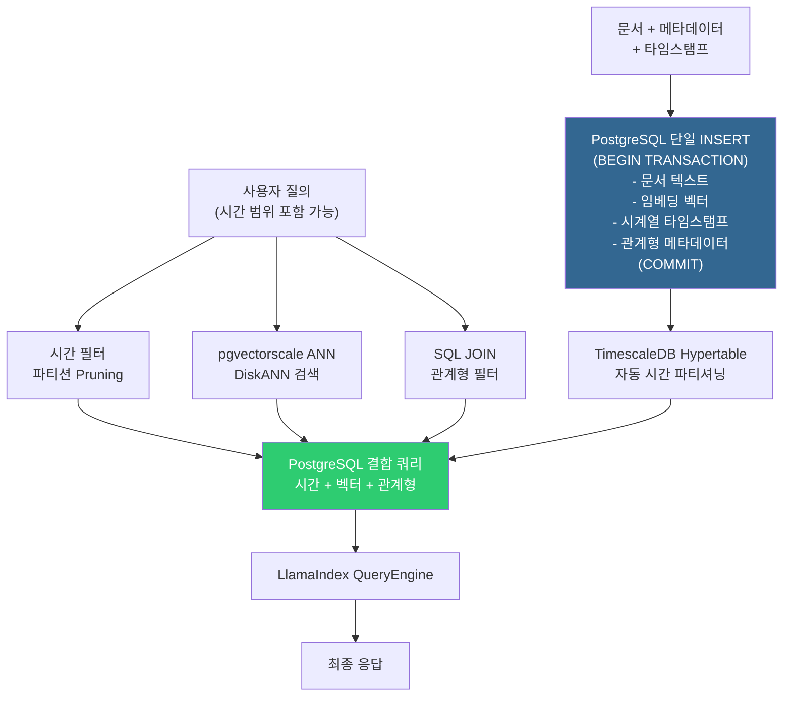

### 패턴 3: ES + PostgreSQL + PropertyGraphIndex 3계층 결합

**대상**: 엔터프라이즈 지식 베이스, 복잡한 엔티티 관계 + 시계열 + 대규모 텍스트 검색이 동시에 필요한 시스템

```mermaid
flowchart LR
    Q_P3["사용자 질의"] --> ROUTER["LlamaIndex RouterQueryEngine<br/>질의 유형 분류"]
    
    ROUTER --> |"키워드/시맨틱 검색"| ES_P3["Elasticsearch<br/>BM25 + kNN Hybrid"]
    ROUTER --> |"시계열/트랜잭션 데이터"| PG_P3["PostgreSQL + TimescaleDB<br/>pgvectorscale + 시간 필터"]
    ROUTER --> |"엔티티 관계 탐색"| NEO_P3["Neo4j PropertyGraphIndex<br/>그래프 트리플 탐색"]
    
    ES_P3 --> SYNTH["LlamaIndex<br/>Response Synthesizer<br/>(결과 통합)"]
    PG_P3 --> SYNTH
    NEO_P3 --> SYNTH
    
    SYNTH --> ANS_P3["최종 응답"]
    
    style ROUTER fill:#FF6B6B,color:#fff
    style SYNTH fill:#7B68EE,color:#fff
    style ANS_P3 fill:#45B7D1,color:#fff
```

이 3계층 결합에서 각 스토어는 명확한 역할 분담을 가진다. Elasticsearch는 전문 텍스트 검색과 키워드 정밀도를, PostgreSQL은 트랜잭션 데이터와 시계열 분석을, Neo4j(PropertyGraphIndex)는 복잡한 지식 관계 탐색을 담당한다.

---

## F. 스택 선택 의사결정 기준

```mermaid
flowchart TD
    START2["RAG 시스템 요구사항 분석"] --> Q_SCALE{"데이터 규모"}
    
    Q_SCALE -->|"10만건 미만<br/>단일 서버 가능"| Q_ACID{"트랜잭션 정합성<br/>필요 여부"}
    Q_SCALE -->|"수백만건 이상<br/>분산 처리 필요"| ES_CHOICE["Elasticsearch<br/>BM25 + kNN Hybrid<br/>+ LlamaIndex 연동"]
    
    Q_ACID -->|"ACID 필수<br/>(결제, 사용자 상태 등)"| Q_TIME{"시계열 데이터<br/>포함 여부"}
    Q_ACID -->|"ACID 불필요"| Q_LANG{"한국어/다국어<br/>정밀 검색 필요"}
    
    Q_TIME -->|"시계열 중요<br/>(로그, IoT, 이력)"| PG_TS["PostgreSQL<br/>+ TimescaleDB<br/>+ pgvectorscale"]
    Q_TIME -->|"시계열 불필요"| PG_PLAIN["PostgreSQL<br/>+ pgvector<br/>+ pgvectorscale"]
    
    Q_LANG -->|"필요"| ES_CHOICE
    Q_LANG -->|"불필요"| LLAMAINDEX_ONLY["LlamaIndex 내장<br/>BM25 + VectorStore<br/>(소규모 프로토타입)"]
    
    style ES_CHOICE fill:#4ECDC4,color:#fff
    style PG_TS fill:#336791,color:#fff
    style PG_PLAIN fill:#336791,color:#fff
    style LLAMAINDEX_ONLY fill:#95E1D3,color:#333
```

### 최종 요약: 세 스택의 핵심 특성 비교

| 비교 항목 | LlamaIndex 내장 (순수) | ES BM25 + kNN | PostgreSQL + TimescaleDB |
|-----------|----------------------|---------------|--------------------------|
| **BM25 품질** | LLM 기반 (비용 有, 가변적) | 수학적 Lucene (일관적) | tsvector/trigram (제한적) |
| **벡터 검색** | 다양한 벡터 스토어 연동 | HNSW (분산 가능) | HNSW / DiskANN (단일 노드 최적화) |
| **ACID** | 없음 (벡터 레이어) | 없음 | **완전 보장** |
| **시계열** | 없음 | 제한적 (range query) | **Hypertable 특화** |
| **한국어 지원** | 기본 토크나이저 | nori_analyzer (우수) | pg_trgm (제한적) |
| **스케일** | 소~중 | 대규모 분산 | 중~대 (수직/수평 확장) |
| **운영 복잡도** | 낮음 | 높음 (ES 클러스터) | 중간 (단일 DB) |
| **비용** | 임베딩 API만 | 자체 호스팅 무료 | 자체 호스팅 무료 |
| **PropertyGraphIndex 연동** | 네이티브 | 보완 관계 | 보완 관계 |

---

*별첨은 Elasticsearch 공식 문서, pgvector/pgvectorscale GitHub, Timescale 기술 블로그, LlamaIndex 공식 문서를 기반으로 2026년 4월 기준 작성되었습니다.*
