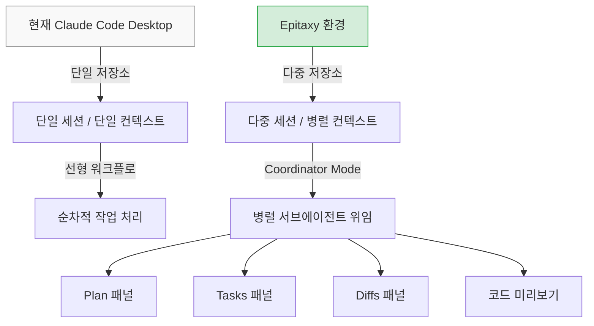
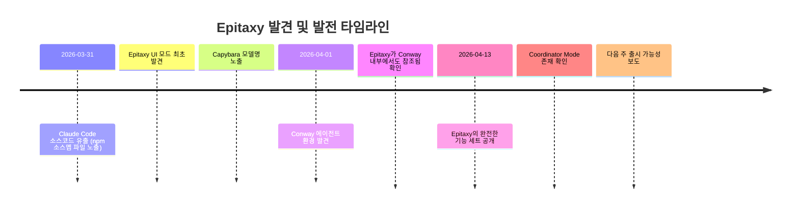
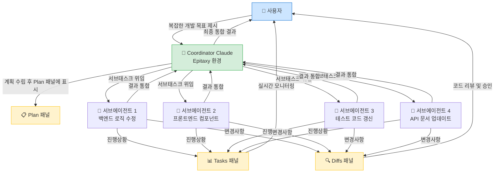
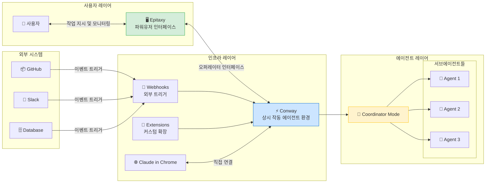
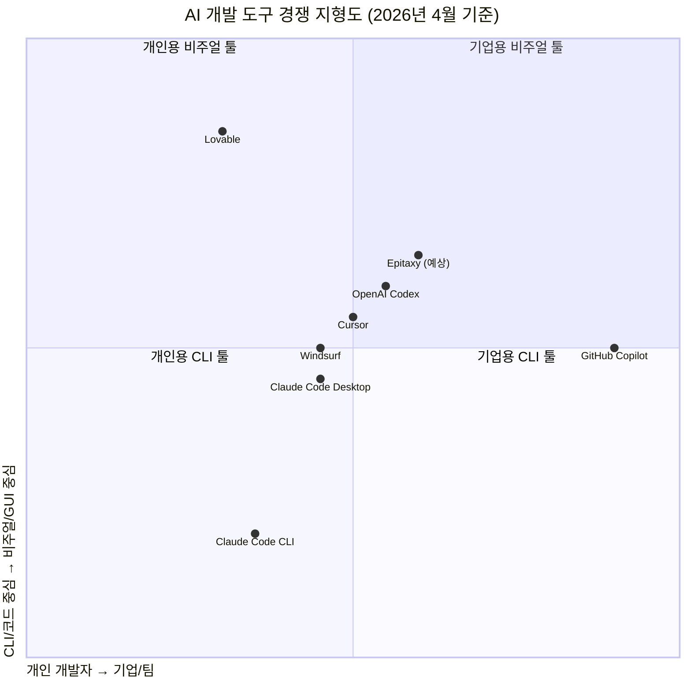
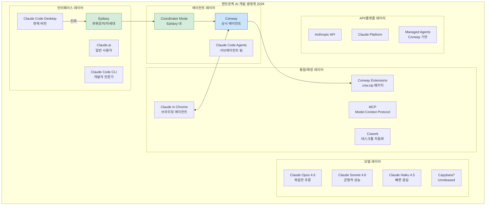

> **작성일**: 2026년 4월 13일  
> **출처**: TestingCatalog, Threads([@choi.openai]( https://www.threads.com/@choi.openai/post/DXDYs_gD1Ic)), Claude Code 공식 문서  
> **분류**: Claude Code 미래 로드맵 분석 / 에이전트 개발 환경 / AI 개발 도구 경쟁

---

## 목차

1. [개요: "Epitaxy"란 무엇인가](#1-개요-epitaxy란-무엇인가)
2. [발견 경위: 소스코드 유출 사건](#2-발견-경위-소스코드-유출-사건)
3. [Epitaxy의 핵심 기능 해부](#3-epitaxy의-핵심-기능-해부)
4. [Coordinator Mode: 에이전트 오케스트레이션의 시각화](#4-coordinator-mode-에이전트-오케스트레이션의-시각화)
5. [Conway와의 연결: 상시 작동 에이전트 환경](#5-conway와의-연결-상시-작동-에이전트-환경)
6. [경쟁 구도: OpenAI Codex와의 정면 충돌](#6-경쟁-구도-openai-codex와의-정면-충돌)
7. [현재 Claude Code Desktop과의 차이점](#7-현재-claude-code-desktop과의-차이점)
8. [기술적 맥락: 에피택시(Epitaxy)라는 이름의 의미](#8-기술적-맥락-에피택시epitaxy라는-이름의-의미)
9. [앤트로픽의 큰 그림: 개발 생태계 통합 전략](#9-앤트로픽의-큰-그림-개발-생태계-통합-전략)
10. [파워유저 관점: 실무적 함의와 기대효과](#10-파워유저-관점-실무적-함의와-기대효과)
11. [남은 불확실성과 주의할 점](#11-남은-불확실성과-주의할-점)
12. [결론: 단일 컨텍스트 창 시대의 종말](#12-결론-단일-컨텍스트-창-시대의-종말)

---

## 1. 개요: "Epitaxy"란 무엇인가

2026년 4월 13일 현재, AI 개발 도구 업계에서 가장 뜨거운 화제로 떠오른 것이 바로 앤트로픽의 내부 코드명 **"Epitaxy(에피택시)"** 다. 이것은 단순한 UI 업데이트가 아니다. TestingCatalog의 최신 보고에 따르면, 앤트로픽은 Claude Code 데스크톱 앱의 경험 전체를 근본적으로 재설계하는 대규모 개편을 준비하고 있으며, 이르면 다음 주 중에 공개될 가능성이 높다.

Epitaxy는 간단히 말해, **파워 유저를 위한 통합 개발 워크스페이스**다. 현재 Claude Code가 하나의 세션에서 하나의 저장소를 다루는 단선적(linear) 워크플로에 머물러 있다면, Epitaxy는 여러 저장소를 동시에 다루고, 복수의 AI 에이전트가 병렬로 작업하며, 그 모든 과정을 하나의 통합된 시각적 인터페이스 안에서 관리할 수 있게 해주는 환경이다. 한마디로, Claude Code가 **'AI 오케스트레이션 콘솔'** 로 진화하는 과정의 핵심이다.

---

## 2. 발견 경위: 소스코드 유출 사건

Epitaxy가 세상에 알려진 것은 우연한 사건 덕분이었다. **2026년 3월 31일**, 앤트로픽의 npm 레지스트리에 있는 소스 맵(source map) 파일을 통해 Claude Code의 소스코드 일부가 노출되는 사건이 발생했다. 이는 보안 침해(security breach)가 아니라 NPM 레지스트리를 통해 소스 맵 파일이 외부에 노출된 **설정 오류(misconfiguration)** 였으며, 앤트로픽도 이를 공식적으로 인정했다.

유출된 코드 안에는 여러 가지 흥미로운 내용이 담겨 있었다.

첫째, **Epitaxy**라는 이름의 대안 인터페이스 모드가 존재한다는 것이 밝혀졌다. 초기에는 Claude 마스코트가 화면 위에서 불덩어리를 던지며 "Let Claude cook(클로드에게 맡겨봐)"이라는 문구가 타오르는 유쾌한 애니메이션과 함께, 모델 선택기·스킬 선택기·기타 도구들을 위한 확장된 단축키 세트가 포함된 것으로 확인되었다. 당시에는 이것이 4월 1일 만우절 실험인지, 진지한 제품 방향성인지 불분명했다.

둘째, **Capybara**라는 이름의 미공개 모델과 **Strudel** 등의 내부 코드명들이 노출되어 앤트로픽의 모델 로드맵에 대한 광범위한 추측을 불러일으켰다. Capybara는 이전에 유출된 블로그 게시물에서 먼저 목격된 바 있었는데, 이번 소스코드 유출로 그 존재가 재확인된 것이다.

셋째, 유출된 소스코드를 바탕으로 일부 사용자들이 Claude Code를 다른 언어로 포팅(forking)하는 시도까지 이루어졌을 정도로, 이 유출은 개발자 커뮤니티에 상당한 파장을 일으켰다.

초기 발견 이후 약 2주가 지난 4월 13일, TestingCatalog는 새로운 조사 결과를 발표하며 Epitaxy가 단순한 실험 모드가 아니라 **완전한 파워유저 인터페이스로 성숙하고 있다**는 결론을 내렸다. 

---

## 3. Epitaxy의 핵심 기능 해부

현재까지 확인된 Epitaxy의 주요 기능들을 하나씩 살펴보자.

### 3-1. Cowork 스타일의 레이아웃

Epitaxy의 UI는 앤트로픽의 데스크톱 자동화 환경인 **Cowork**의 디자인을 차용한다. Cowork는 원래 비개발자를 위한 파일 및 작업 자동화 도구로 설계된 제품인데, 그 직관적인 패널 구성과 시각적 레이아웃 철학을 개발자용 Claude Code에 접목한 것이 Epitaxy의 첫 번째 특징이다.

이 접근법은 중요한 신호를 담고 있다. 앤트로픽이 "개발자 전용 CLI 도구"와 "비개발자용 자동화 앱"이라는 두 세계를 하나로 통합하려는 방향성을 보여주기 때문이다. Epitaxy는 그 중간 어딘가에 위치한, **기술적으로 숙련된 파워유저 전체를 아우르는 환경**이 될 가능성이 높다.

### 3-2. 다중 저장소 동시 작업 지원

현재 Claude Code Desktop의 가장 큰 한계 중 하나는 **하나의 세션이 하나의 저장소에 묶여 있다**는 점이다. 마이크로서비스 아키텍처나 모노레포 구성이 아닌 프로젝트에서, 프론트엔드·백엔드·인프라 코드가 각각 다른 저장소에 분산되어 있을 때는 세션을 여러 개 열어 컨텍스트를 수동으로 이어붙여야 했다.

Epitaxy는 이 문제를 **다중 저장소 동시 작업** 기능으로 해결한다. 하나의 워크스페이스 안에서 여러 저장소를 동시에 열어두고, 에이전트들이 필요에 따라 각 저장소를 넘나들며 작업할 수 있게 된다. 참고로 현재 클라우드 원격 세션(Remote session)에서는 이미 저장소를 추가하는 기능이 제한적으로 제공되고 있는데, Epitaxy는 이를 데스크톱 로컬 환경까지 확장하는 셈이다.

### 3-3. 통합 패널 시스템: Plan / Tasks / Diffs

Epitaxy의 가장 혁신적인 UI 요소는 **단일 창 안에 구조화된 세 개의 패널**을 통합한 것이다.

**Plan 패널**은 현재 진행 중인 작업의 계획을 보여준다. 이는 기존 Claude Code의 "Plan Mode"와 연결되는 개념으로, 에이전트가 변경을 가하기 전에 어떤 순서로 무엇을 할지를 시각적으로 확인할 수 있게 해준다. 사용자는 이 계획을 검토하고 승인한 뒤 실행을 허가하는 방식으로 상호작용한다.

**Tasks 패널**은 서브에이전트들이 현재 실행 중인 작업들을 실시간으로 보여준다. 기존에는 터미널 출력이나 채팅 로그를 통해서만 에이전트의 진행 상황을 파악할 수 있었다면, Tasks 패널은 이를 구조화된 목록 형태로 시각화한다. 어떤 에이전트가 어떤 파일을 건드리고 있는지, 어느 단계까지 완료되었는지를 한눈에 파악할 수 있다.

**Diffs 패널**은 에이전트가 만들어낸 코드 변경사항을 표준적인 diff 뷰어 형식으로 보여준다. 이것은 단순한 편의 기능이 아니라, **인간의 감독(human oversight)** 을 유지하면서 에이전트에게 더 많은 자율성을 부여할 수 있는 핵심 장치다. 무엇이 바뀌었는지를 즉각적으로 검토하고 승인하거나 롤백할 수 있기 때문이다.

### 3-4. 앱 내 코드 미리보기

Epitaxy는 **앱 내에서 실행 중인 코드를 직접 미리 볼 수 있는** 기능도 포함한다. 이는 현재 Claude Code Desktop이 지원하는 "내장 브라우저를 통한 개발 서버 미리보기" 기능을 더욱 심층적으로 발전시킨 것으로 보인다. 에이전트가 코드를 수정하면, 별도의 브라우저 창이나 IDE 없이도 Epitaxy 환경 안에서 즉각 결과를 확인할 수 있게 된다.

---

## 4. Coordinator Mode: 에이전트 오케스트레이션의 시각화

Epitaxy의 기능들 중에서도 가장 게임 체인징적인 요소는 바로 **Coordinator Mode(코디네이터 모드)** 다.

### 4-1. 개념과 작동 방식

Coordinator Mode는 Claude가 단순히 코드를 작성하는 실행자 역할에서 벗어나, **오케스트레이터(orchestrator)** 역할을 맡도록 하는 모드다. 이 모드에서 Claude는 구현 작업을 여러 병렬 서브에이전트에게 위임하면서, 자신은 전체 계획 수립과 통합(synthesis)에 집중한다.

구체적으로는 다음과 같은 방식으로 작동할 것으로 예상된다.

사용자가 하나의 복잡한 개발 목표를 제시하면, Coordinator Mode의 Claude는 이 목표를 분석하여 병렬로 처리 가능한 하위 작업들로 분해한다. 예를 들어 "사용자 인증 시스템을 리팩토링하라"는 요청이 들어오면, Claude는 "백엔드 JWT 처리 로직 수정", "프론트엔드 로그인 컴포넌트 업데이트", "테스트 코드 갱신", "API 문서 업데이트"를 각각 별개의 서브에이전트에게 동시에 위임할 수 있다.

각 서브에이전트는 독립적으로 자신의 작업을 수행하고, 그 결과는 Tasks 패널과 Diffs 패널을 통해 실시간으로 사용자에게 노출된다. 최종적으로 Coordinator Claude가 각 서브에이전트의 결과물을 통합하고 충돌이나 의존성 문제를 해결한다.

### 4-2. 기존 서브에이전트 기능과의 차이

중요한 점은, Claude Code가 이미 CLI 환경에서 서브에이전트와 실험적인 에이전트 팀 기능을 지원하고 있다는 것이다. 그렇다면 Coordinator Mode는 무엇이 새로운가?

핵심 차이는 **접근성과 시각화**에 있다. 현재의 서브에이전트 기능은 CLI 파워유저가 특정 플래그나 설정을 통해 활성화해야 하는 기술적인 기능이다. 반면 Coordinator Mode는 이 능력을 **구조화된 시각적 인터페이스** 안으로 가져와, CLI에 익숙하지 않은 사용자도 에이전트 팀을 구성하고 위임하고 모니터링할 수 있게 만든다.

또한, **맞춤형 에이전트 직접 생성** 기능도 포함될 예정이다. 사용자가 특정 역할과 능력을 가진 전문화된 에이전트를 앱 안에서 직접 정의하고 재사용할 수 있다는 의미다.

---

## 5. Conway와의 연결: 상시 작동 에이전트 환경

Epitaxy 이야기를 하면서 [**Conway**](https://www.youtube.com/watch?v=SfW_6sXiVms)를 빼놓을 수 없다. 두 프로젝트는 독립적으로 발견되었지만, 코드 레벨에서 서로 연결되어 있다는 단서들이 발견되었기 때문이다.

### 5-1. Conway란 무엇인가

Conway는 앤트로픽이 테스트 중인 또 다른 미공개 환경으로, **상시 작동(always-on) 에이전트 플랫폼**을 목표로 한다. 현재의 Claude는 사용자가 대화를 시작할 때만 작동하는 반응형(reactive) 모델이지만, Conway는 외부 시스템과 지속적으로 연결되어 이벤트에 반응하고 백그라운드에서 작업을 수행할 수 있는 **능동형(proactive) 에이전트** 환경을 구현하려는 시도다.

Conway의 사이드바에는 Search, Chat, System이라는 세 가지 영역이 있으며, System 영역이 가장 흥미롭다. "Manage your Conway instance"라는 제목 아래에는 다음과 같은 기능들이 준비되고 있다.

**Extensions(확장 기능)**: 사용자가 커스텀 도구, UI 탭, 컨텍스트 핸들러를 설치할 수 있는 영역으로, **.cnw.zip** 파일 형식의 새로운 확장 패키지 포맷이 도입될 예정이다. 이것은 사실상 Conway가 제3자 애드온을 지원하는 **플랫폼**이 될 수 있음을 시사한다.

**Connectors & Tools**: 외부 서비스와의 연결을 관리하는 영역으로, Claude in Chrome이 직접 Conway에 연결될 수 있는 토글도 포함된다.

**Webhooks**: 외부 서비스가 Conway 인스턴스를 깨울 수 있는 공개 URL을 제공하는 기능으로, 서비스별 트리거 토글도 있다. 이를 통해 GitHub 이벤트, Slack 메시지, 데이터베이스 알림 등 외부 트리거에 의해 에이전트가 자동으로 작동하는 시나리오가 가능해진다.

### 5-2. Epitaxy와 Conway의 관계

Conway의 코드 안에서 Epitaxy UI에 대한 참조가 발견되었다는 것이 핵심적인 단서다. TestingCatalog의 분석에 따르면, **Epitaxy가 Conway 환경의 오퍼레이터 인터페이스(operator interface)** 역할을 할 가능성이 있다. 즉, Epitaxy는 사용자가 Claude Code 개발 작업을 수행하는 프론트엔드 워크스페이스이고, Conway는 그 뒤에서 에이전트들이 상시 연결 상태를 유지하며 작동하는 백엔드 인프라 역할을 하는 구조다.

---

## 6. 경쟁 구도: OpenAI Codex와의 정면 충돌

Epitaxy가 더욱 주목받는 이유는 이것이 단순한 기능 업데이트가 아니라, AI 개발 도구 시장에서의 **전략적 포지셔닝**과 관련된 결정이기 때문이다.

### 6-1. OpenAI Codex의 "Magic TODO"

TestingCatalog에 따르면 OpenAI도 다음 주에 데스크톱 앱 업데이트를 준비하고 있다. OpenAI는 통합 Codex 앱과 함께 **"Magic TODO"** 라는 시스템을 개발 중인데, 이것은 에이전트들이 병렬 채팅을 통해 할 일 목록을 처리해나가는 방식이다. 오픈AI의 접근법이 클라우드 기반이라면, 앤트로픽의 Coordinator Mode는 로컬 데스크톱 우선(desktop-first) 접근법으로 구현된다는 차이가 있다.

### 6-2. Lovable와 같은 풀스택 앱 빌더와의 경쟁

Threads의 원문 포스트에서 언급된 것처럼, Epitaxy는 **Lovable**과 같은 비주얼 풀스택 앱 빌더와도 직접적으로 경쟁하는 위치에 서게 된다. Lovable이 비개발자도 자연어로 풀스택 웹앱을 구축할 수 있게 해주는 것처럼, Epitaxy도 Coordinator Mode와 맞춤형 에이전트 생성 기능을 통해 코드 편집기 없이도 복잡한 소프트웨어를 구축하는 경험을 제공하려는 것이다.

### 6-3. 경쟁의 축이 바뀌고 있다

TestingCatalog의 보고서는 핵심적인 통찰을 제공한다. 이제 AI 개발 도구의 경쟁 단위는 **모델 벤치마크에서 개발자 워크플로 통합으로 이동하고 있다**는 것이다. 어떤 AI가 코드를 더 잘 작성하느냐의 문제가 아니라, 어떤 플랫폼이 개발자의 전체 워크플로를 더 잘 포용하고, 더 적은 컨텍스트 전환을 요구하며, 더 풍부한 시각적 피드백을 제공하느냐의 문제가 된 것이다.

---

## 7. 현재 Claude Code Desktop과의 차이점

지금 사용하고 있는 Claude Code Desktop과 Epitaxy가 어떻게 다른지를 명확히 이해하는 것이 중요하다. 현재 Desktop이 어떤 기능을 제공하고 있는지 살펴본 후, Epitaxy가 어떤 한계를 극복하는지 확인해보자.

### 7-1. 현재 Claude Code Desktop의 한계

현재 Claude Code Desktop은 이미 상당히 강력한 기능들을 갖추고 있다. 로컬/원격/SSH 환경 선택, Plan Mode를 통한 사전 계획 검토, 내장 브라우저를 통한 앱 미리보기, 원격 세션에서의 다중 저장소 지원(제한적), 비주얼 diff 리뷰 등이 이미 지원된다.

하지만 몇 가지 핵심적인 한계가 존재한다.

**단일 세션 패러다임**: 하나의 세션이 하나의 문맥 흐름을 가지며, 에이전트가 동시에 여러 방향으로 작업을 분기하는 것이 시각적으로 지원되지 않는다.

**에이전트 오케스트레이션의 불투명성**: CLI에서 서브에이전트 기능을 사용할 수는 있지만, 무엇이 어디서 진행되고 있는지를 구조적으로 볼 수 있는 방법이 없다.

**맞춤형 에이전트 생성 부재**: 특정 역할에 특화된 에이전트를 재사용 가능한 형태로 정의하고 저장하는 기능이 없다.

### 7-2. 비교표

| 기능 | 현재 Claude Code Desktop | Epitaxy (예상) |
|------|--------------------------|----------------|
| 저장소 지원 | 단일 (로컬), 다중 (원격만) | 로컬/원격 모두 다중 지원 |
| UI 레이아웃 | 단일 채팅 창 중심 | Plan/Tasks/Diffs 패널 분리 |
| 에이전트 오케스트레이션 | CLI 한정 (실험적) | Coordinator Mode (시각적) |
| 맞춤형 에이전트 | 없음 | 앱 내 직접 생성 가능 |
| 작업 모니터링 | 채팅 로그 중심 | 구조화된 Tasks 패널 |
| 코드 미리보기 | 내장 브라우저 (기본적) | 강화된 앱 내 미리보기 |
| 단축키 | 기본 세트 | 확장된 파워유저 단축키 |
| Conway 연동 | 없음 | 가능성 있음 |

---

## 8. 기술적 맥락: 에피택시(Epitaxy)라는 이름의 의미

왜 하필 "Epitaxy"라는 이름을 코드명으로 선택했을까? 이것은 흥미로운 은유를 담고 있다.

반도체 공학에서 **에피택시(Epitaxy, 에피택셜 성장)** 란 기판(substrate) 위에 얇은 결정층을 원자 수준의 정밀도로 성장시키는 기술이다. 핵심은 새로 자라는 결정층이 기판의 결정 구조를 그대로 이어받으면서도, 독자적인 특성을 가질 수 있다는 점이다. 인텔의 반도체 공정이나 LED 제조에 핵심적으로 사용되는 기술이다.

Claude Code의 맥락에서 이 은유를 해석하면, Epitaxy 환경은 기존 Claude Code Desktop이라는 "기판" 위에 새로운 인터페이스 층을 정밀하게 성장시키는 것을 의미한다. 기존의 기능과 철학(결정 구조)을 유지하면서도, 파워유저를 위한 새로운 특성(에피택셜 층)을 추가하는 방식이다. 이 이름 선택 자체가 앤트로픽이 Claude Code를 갑작스럽게 대체하는 것이 아니라 **유기적으로 진화**시키겠다는 방향성을 암시할 수 있다.

---

## 9. 앤트로픽의 큰 그림: 개발 생태계 통합 전략

Epitaxy와 Conway를 따로 떼어서 보는 것은 전체 그림을 놓치는 것이다. 앤트로픽이 최근 몇 달간 발표하거나 테스트 중인 제품들을 함께 놓고 보면, 하나의 일관된 전략이 보인다.

### 9-1. 앤트로픽 제품 생태계의 구조

### 9-2. "개발팀으로서의 에이전트" 비전

Threads 원문 포스트의 핵심 문구 중 하나는 "에이전트들이 완벽한 개발팀으로 작동"하는 시대라는 표현이다. 이것은 단순한 마케팅 수사가 아니라, 앤트로픽이 Claude Code의 방향을 설정하는 핵심 메타포다.

현재 Claude Code를 사용하는 방식은 **유능한 개발자 한 명과 짝 프로그래밍(pair programming)** 을 하는 것과 유사하다. Epitaxy의 Coordinator Mode는 이것을 **여러 전문가로 구성된 팀을 매니징**하는 경험으로 격상시키려는 시도다. 아키텍트 역할의 Coordinator Claude, 백엔드 개발자 역할의 서브에이전트, 프론트엔드 개발자 역할의 서브에이전트, QA 역할의 서브에이전트가 유기적으로 협력하는 구조다.

이 비전이 실현되면, 개발자의 역할 자체가 변화한다. "코드를 작성하는 사람"에서 **"에이전트 팀을 기획하고 방향을 설정하며 결과물을 검토하는 테크 리드"** 로의 전환이다.

---

## 10. 파워유저 관점: 실무적 함의와 기대효과

RummiArena나 LxM 같은 실제 프로젝트를 Claude Code로 개발하는 관점에서, Epitaxy가 가져올 변화를 구체적으로 살펴보자.

### 10-1. 멀티 레포 프로젝트에서의 활용

Go 백엔드, Next.js 프론트엔드, Helm 차트가 각각 다른 저장소에 있는 구조의 프로젝트에서, 현재는 세션을 여러 개 열어 컨텍스트를 수동으로 관리해야 한다. Epitaxy의 다중 저장소 지원이 현실화된다면, 하나의 통합 워크스페이스에서 세 저장소를 동시에 열고, 서브에이전트들이 각 저장소를 담당하면서 Coordinator가 전체적인 일관성을 유지하는 방식으로 작업할 수 있다.

예를 들어 "사용자 프로필 기능을 추가하라"는 단일 요청에 대해, 백엔드 서브에이전트는 Go API를 수정하고, 프론트엔드 서브에이전트는 Next.js 페이지를 추가하며, 인프라 서브에이전트는 Helm values를 갱신하는 작업이 병렬로 진행될 수 있다.

### 10-2. Plan-Tasks-Diffs 패널의 실무적 가치

특히 **Diffs 패널**은 실무에서 매우 중요한 의미를 가진다. 현재 Claude Code의 가장 불편한 점 중 하나는 에이전트가 만들어낸 변경사항을 검토하기 위해 IDE나 git diff를 별도로 열어야 한다는 것이다. Diffs 패널이 Claude Code Desktop 안에 내장된다면, 에이전트 작업의 검토와 승인이 훨씬 매끄러워진다.

**컨텍스트 로트(Context Rot)** 문제도 완화될 수 있다. 에이전트가 무엇을 했는지를 구조화된 패널로 추적할 수 있다면, 긴 세션에서 컨텍스트가 누적되어 초기 의도가 흐려지는 문제를 더 잘 관리할 수 있기 때문이다.

### 10-3. 맞춤형 에이전트 생성의 가능성

LxM 프로젝트처럼 특정 게임 규칙에 맞춰 행동하는 AI 에이전트를 여러 개 운용해야 하는 상황에서, 맞춤형 에이전트 생성 기능은 특히 유용할 수 있다. Prisoner's Dilemma용 에이전트, Poker용 에이전트, Codenames용 에이전트를 각각 정의하고 재사용하는 방식이 훨씬 용이해질 것이다.

---

## 11. 남은 불확실성과 주의할 점

흥미롭고 기대되는 내용들이지만, 몇 가지 중요한 불확실성을 명확히 짚어두어야 한다.

**출시 일정**: TestingCatalog의 보도에 따르면 "다음 주(2026년 4월 셋째 주)"에 출시될 가능성이 언급되었지만, 이것은 현재까지 앤트로픽이 공식적으로 확인한 내용이 아니다. 내부 테스트 단계의 기능이 실제 출시로 이어지는 시점은 항상 유동적이다.

**완성도와 범위**: 현재 파악된 기능들은 유출된 소스코드와 내부 테스트 영상을 통해 간접적으로 확인된 것이다. 실제 출시 버전에서는 기능이 축소되거나 변경될 수 있다.

**가격 정책**: Epitaxy가 기존 Claude Max 구독에 포함될지, 별도의 플랜이 필요할지는 아직 명확하지 않다. 병렬 서브에이전트를 대규모로 운용하면 상당한 토큰 소비가 수반될 것이기 때문에, 가격 구조는 중요한 변수가 될 것이다.

**Conway의 실제 출시**: Conway는 더욱 초기 단계에 있으며, Epitaxy보다 훨씬 나중에 출시될 가능성이 높다. 두 시스템이 연결된다는 것은 코드 수준의 힌트일 뿐, 동시 출시를 의미하지는 않는다.

---

## 12. 결론: 단일 컨텍스트 창 시대의 종말

앞서 살펴본 모든 내용을 종합하면, 앤트로픽이 준비하고 있는 것의 본질이 보인다. 그것은 단순한 UI 업데이트가 아니라, **AI 보조 개발의 패러다임 자체를 재정의하려는 시도**다.

지금까지의 AI 코딩 도구는 기본적으로 "하나의 인간과 하나의 AI가 하나의 화면에서 대화하는" 모델이었다. 이 모델에서 인간은 항상 능동적으로 지시하고, AI는 수동적으로 반응한다. 컨텍스트는 하나의 선형 대화 흐름 안에 묶여 있으며, 한 번에 한 가지 작업만 진행된다.

Epitaxy와 Coordinator Mode는 이 패러다임을 부수고, **복수의 에이전트가 병렬로, 복수의 저장소에서, 통합된 시각적 환경 안에서** 작동하는 새로운 모델을 제시한다. 인간은 더 이상 모든 세부 사항을 지시하는 실행자가 아니라, 방향을 설정하고 결과를 검토하는 오케스트레이터가 된다.

Threads 원문 포스트의 표현을 빌리자면, "단일 컨텍스트 창만 쳐다보던 시대가 끝나가고 있다." 그리고 그 다음 시대의 첫 번째 구체적인 모습이 바로 Epitaxy다.

물론 이 모든 것이 완전히 실현되기까지는 아직 시간이 필요하다. 하지만 방향만큼은 분명하다. 앤트로픽은 Claude Code를 단순한 AI 코딩 어시스턴트가 아니라, **완전한 AI 오케스트레이션 플랫폼**으로 만들겠다는 야심을 품고 있다.

---

## 참고 자료

- TestingCatalog, "Anthropic tests Claude Code upgrade to rival Codex Superapp" (2026.04.13)
- TestingCatalog, "Anthropic tests new Claude Code desktop UI amid source code leak" (2026.03.31)
- TestingCatalog, "Exclusive: Anthropic tests its own always-on 'Conway' agent" (2026.04.01)
- Threads @choi.openai, "앤트로픽이 개발 생태계를 완전히 집어삼키려 작정했습니다" (2026.04.13)
- Claude Code Desktop 공식 문서 (code.claude.com/docs/en/desktop)

---

*이 문서는 현재까지 공개된 정보와 유출된 소스코드 분석을 바탕으로 작성된 분석 문서입니다. 모든 미공개 기능들은 실제 출시 시 변경될 수 있습니다.*
