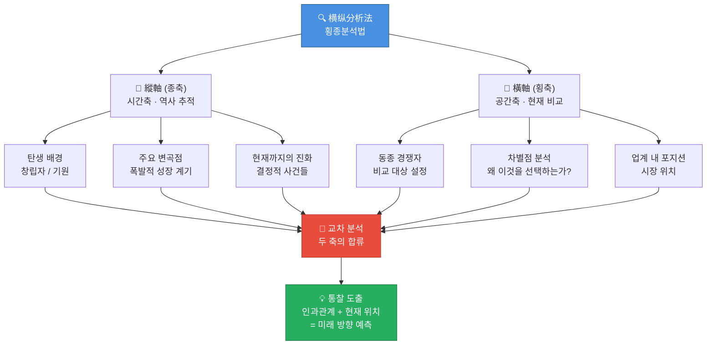
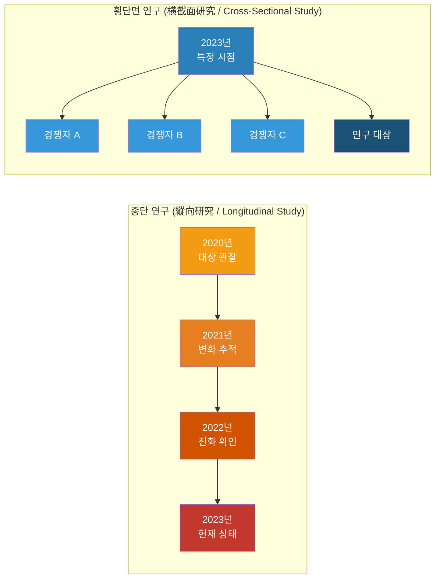
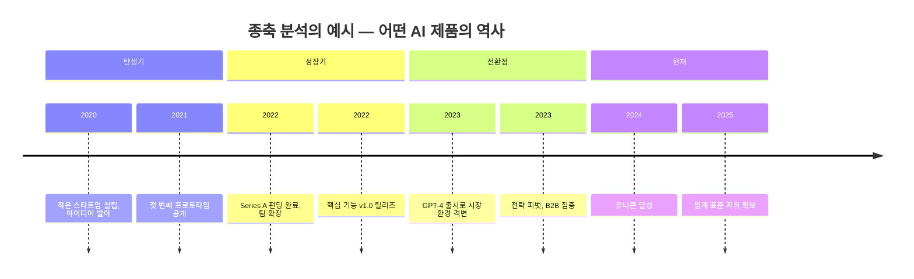
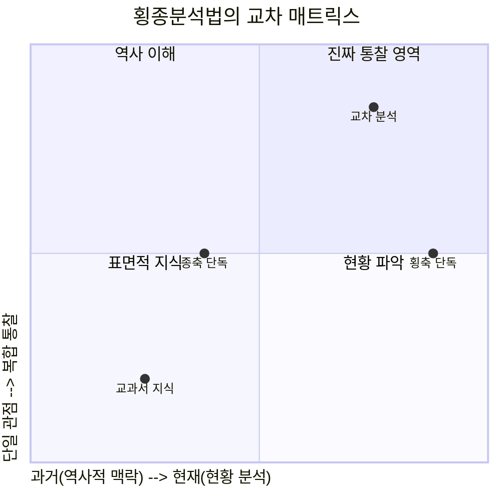
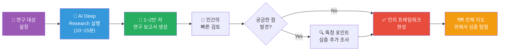
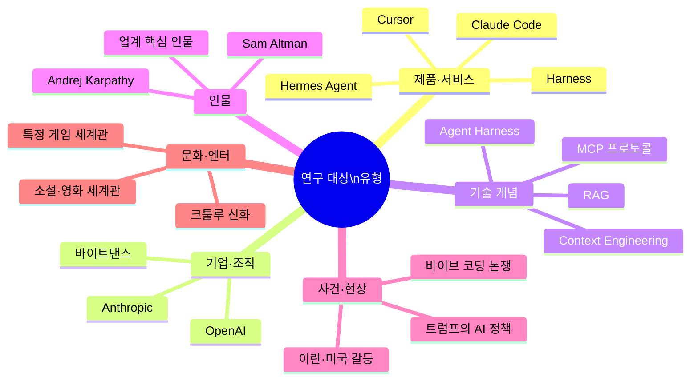
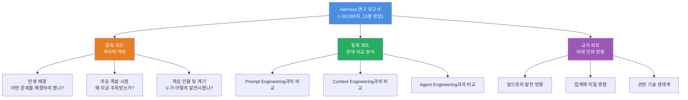
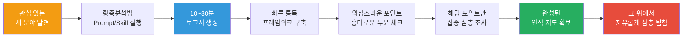

> **"AI와 함께라면, 어떤 낯선 분야도 30분 안에 인지 지도를 완성할 수 있다"**  
> — 数字生命卡兹克 ([@Khazix0918](https://x.com/khazix0918/status/2043555868902637845)), 2025년

---

## 목차

1. [이 글이 탄생한 배경](#1-이-글이-탄생한-배경)
2. [저자 소개 — 数字生命卡兹克(디지털 라이프 카즈크)](#2-저자-소개)
3. [핵심 개념 — 횡종분석법이란 무엇인가](#3-핵심-개념--횡종분석법이란-무엇인가)
4. [학문적 뿌리 — 소쉬르의 언어학에서 사회과학까지](#4-학문적-뿌리--소쉬르의-언어학에서-사회과학까지)
5. [두 축의 상세 해부](#5-두-축의-상세-해부)
6. [두 축의 교차 — 진짜 통찰이 태어나는 순간](#6-두-축의-교차--진짜-통찰이-태어나는-순간)
7. [실전 운용 — AI와의 결합](#7-실전-운용--ai와의-결합)
8. [Prompt 버전 상세 사용법](#8-prompt-버전-상세-사용법)
9. [Skill 버전 — hv-analysis](#9-skill-버전--hv-analysis)
10. [실제 사례 — Harness 연구 보고서 분석](#10-실제-사례--harness-연구-보고서-분석)
11. [방법론의 한계와 올바른 사용법](#11-방법론의-한계와-올바른-사용법)
12. [카즈크의 철학 — 호기심이 먼저다](#12-카즈크의-철학--호기심이-먼저다)
13. [이 방법론을 실제로 적용하는 방법 — 단계별 가이드](#13-이-방법론을-실제로-적용하는-방법--단계별-가이드)
14. [GitHub 오픈소스 생태계](#14-github-오픈소스-생태계)
15. [별첨 — 중국어 원문 용어사전 (中文→한국어·영어)](#15-별첨--중국어-원문-용어사전)

---

## 1. 이 글이 탄생한 배경

이 모든 이야기는 평범한 주말 저녁 식사에서 시작되었다. 카즈크가 최근 컨퍼런스를 마치고 친구와 식사를 하던 중, 친구가 젓가락을 내려놓으며 던진 한마디가 발단이었다.

> *"야, 너는 어떻게 뭐든지 조금씩 다 알아?"*

카즈크는 잠깐 멈칫했다. 솔직히 말해서 그는 자신이 뭐든 다 안다고 생각한 적이 없었다. 다만 세상 모든 것에 호기심이 있었고, 낯선 것을 빠르게 파악하는 **자기만의 방법**이 있었을 뿐이었다. 친구의 질문 — "Harness가 뭔지, Claude Code가 뭔지, 심리학 이야기도 하고, 《살육의 첨탑 2》도 알고, 크툴루 신화도 알고, 포켓몬 게임도 하면서 하루가 몇 시간이냐?" — 이 결국 이 글을 세상에 나오게 만들었다.

카즈크가 설명한 답은 간단했다. **AI와 자신이 만든 연구 프레임워크를 결합하면 30분 만에 1~2만 자 분량의 심층 연구 보고서를 만들 수 있다.** 이 프레임워크를 그는 **"횡종분석법(横纵分析法)"** 이라고 부른다.

이 방법론은 단순한 아이디어가 아니다. 카즈크가 금융업계에서 기업 및 산업 리서치를 수행하던 3년 전부터 사용해온 체계적인 방법론이며, 이후 AI가 등장하면서 버전을 업그레이드하고, AI의 Deep Research(심층 연구) 기능과 결합할 수 있도록 Prompt와 Skill로 패키징한 것이다.

---

## 2. 저자 소개

### 数字生命卡兹克 (디지털 라이프 카즈크 / Digital Life Khazix)

| 항목 | 내용 |
|------|------|
| SNS 핸들 | @Khazix0918 (X/Twitter), 웨이보, 즈후 등 |
| 공식 채널 | 위챗 공개 계정 「数字生命卡兹克」 |
| GitHub | [KKKKhazix/khazix-skills](https://github.com/KKKKhazix/khazix-skills) |
| 배경 | 금융 테크 기업 이사, AI 분야 Full-time 콘텐츠 크리에이터 |
| 활동 시작 | 2023년 2월부터 AI 관련 첫 글 게재 |
| 전업 전환 | 2024년 3월 이후 해당 계정 전업 운영 |
| 콘텐츠 철학 | "AI에 대한 사람들의 호기심을 자극하는 것"을 미션으로 삼음 |

지후(知乎)에서 그는 "다양한 AI 분야를 넘나들며 멋진 AI 실용 정보를 공유하는 것"을 목표로 하고 있으며, 110개의 답변으로 7만 5천 개 이상의 좋아요를 받은 영향력 있는 AI KOL(Key Opinion Leader)이다.

카즈크(Khazix)는 AI 업계에서 3년간 깊이 활동해온 콘텐츠 크리에이터이자 창업가로, 그의 글 스타일을 한 마디로 표현하면 "식견 있는 보통 사람이 자신이 감동받은 일을 진지하게 이야기하는 것"이다.

그는 단순한 AI 정보 전달자가 아니라, AI를 실제 업무와 연구에 도구로 삼아 자신의 워크플로우와 방법론 자체를 공개하는 실천적 KOL이다. 위챗 공개 계정을 중심으로 하면서 동명의 영상 채널도 운영하고 있으며, 《晚点聊》 등 다수의 팟캐스트에도 출연했다.

---

## 3. 핵심 개념 — 횡종분석법이란 무엇인가

횡종분석법의 구조는 놀라울 정도로 단순하다. **단 두 개의 축(軸)** 으로 이루어진다.



### 한 줄 요약

> **종축(縱軸)으로 시간의 깊이를, 횡축(橫軸)으로 현재의 넓이를 추적하고,  
> 마지막에 두 축을 교차시켜 판단을 도출한다.**

---

## 4. 학문적 뿌리 — 소쉬르의 언어학에서 사회과학까지

카즈크의 횡종분석법은 표면상 실용적인 리서치 도구처럼 보이지만, 그 뿌리는 20세기 초반의 언어학과 사회과학 연구 전통에 깊이 닿아 있다.

### 4.1 페르디낭 드 소쉬르의 역사언어학 vs. 공시언어학

19세기 말~20세기 초의 스위스 언어학자 **페르디낭 드 소쉬르(Ferdinand de Saussure)** 는 언어 연구를 두 가지 차원으로 구분했다.

| 구분 | 원어 | 의미 | 횡종분석법 대응 |
|------|------|------|----------------|
| **통시적 분석** | 历时分析 (歷時分析) | 시간 흐름에 따른 언어의 변화 추적 | 종축(縱軸) |
| **공시적 분석** | 共时分析 (共時分析) | 특정 시점에서 언어 체계의 단면 비교 | 횡축(橫軸) |

소쉬르는 언어란 고정된 실체가 아니라, **시간과 함께 변화하는 체계**이자 동시에 **다른 요소들과의 관계 속에서만 의미를 갖는 구조**라고 보았다. 카즈크는 이 학문적 통찰을 빌려와 언어가 아닌 "모든 종류의 연구 대상"에 적용했다.

### 4.2 사회과학의 종단 연구 vs. 횡단면 연구

사회과학에서도 유사한 구분이 존재한다.



카즈크는 이 두 학문적 전통에 **비즈니스 경쟁 전략 분석(Porter의 경쟁 우위론 등)** 의 시각을 더해, 학술적 연구 방법론을 일상적이고 실용적인 AI 기반 리서치 도구로 재탄생시켰다.

---

## 5. 두 축의 상세 해부

### 5.1 종축 — 시간의 깊이를 파고든다

종축(縱軸)의 핵심 질문들:

- **이것은 어떻게 탄생했는가?** (기원, 창립자, 초기 아이디어)
- **누가 만들었는가?** (핵심 인물, 창업가, 연구자)
- **어떤 과정을 거쳤는가?** (주요 마일스톤, 버전 업데이트, 조직 변화)
- **왜 하필 그 시점에 폭발적으로 성장했는가?** (트리거 사건, 시장 환경 변화)
- **어떤 전환점이 있었는가?** (위기, 전략 전환, 방향 선회)

이 질문들에 답하다 보면 단순한 "사실의 나열"이 아니라, **인과관계의 서사(narrative)** 가 형성된다. 왜 지금 이 제품이 이런 모습인지, 왜 이 기업이 이런 전략을 쓰는지가 이해된다.



### 5.2 횡축 — 현재의 넓이를 스캔한다

횡축(橫軸)의 핵심 질문들:

- **같은 문제를 해결하려는 다른 경쟁자들은 누구인가?**
- **이 대상은 그들과 무엇이 다른가?** (차별화 포인트)
- **사용자들은 왜 다른 것이 아닌 이것을 선택하는가?**
- **현재 시장 또는 업계 내에서 어느 위치에 서 있는가?**
- **같은 시대에 등장한 유사 개념들과의 관계는 무엇인가?**

이 질문들에 답하다 보면 단순히 "이것이 좋다/나쁘다"는 평가가 아니라, **상대적 포지셔닝**이 선명해진다. 비교 대상이 명확해질 때, 대상의 본질이 더 잘 보인다.

---

## 6. 두 축의 교차 — 진짜 통찰이 태어나는 순간

카즈크가 이 방법론에서 가장 중요하게 강조하는 단계가 바로 **두 축의 교차(交叉)** 다.



두 축이 교차할 때 비로소 보이는 것들:

**① 현재 강점의 역사적 기원**  
오늘날의 어떤 강점이 사실은 3년 전의 눈에 띄지 않는 결정에서 조금씩 쌓인 것임을 발견할 수 있다. 예를 들어, 어떤 AI 기업이 현재 데이터 품질에서 압도적 우위를 가진다면, 그 이면에는 5년 전 훈련 데이터 수집 전략의 조용한 차별화가 있을 수 있다.

**② 현재 약점의 역사적 구조적 원인**  
오늘날의 어떤 단점이 처음에는 합리적이었던 결정이 시간이 지나면서 짐이 된 것임을 알 수 있다. 예컨대 초기 B2C 전략으로 쌓은 브랜드가 나중에 B2B 전환을 막는 장벽이 된 경우처럼.

**③ 경쟁 우위의 지속 가능성 예측**  
횡축으로 "지금 어디에 있는지"를 알고, 종축으로 "어떻게 여기까지 왔는지"를 알면, "앞으로 어디로 갈 것인지"를 훨씬 정확하게 예측할 수 있다.

---

## 7. 실전 운용 — AI와의 결합

횡종분석법이 탄생한 것은 AI 이전의 일이었다. 카즈크는 금융업계에서 기업 리서치를 할 때 이미 이 방법론을 수작업으로 운용했다. 하지만 AI, 특히 **DeepResearch(심층 연구)** 기능이 등장하면서 이 방법론의 효율은 폭발적으로 높아졌다.



**AI와 결합했을 때의 핵심 이점:**

1. **정보 수집 시간 제로화**: 수십 개의 웹 페이지, 논문, 뉴스를 AI가 자동으로 수집하고 분석
2. **프레임워크의 일관성**: 카즈크가 설계한 종축·횡축 구조를 AI가 그대로 따르며 보고서를 작성
3. **가독성 보장**: 학술 논문처럼 난해한 게 아니라, 읽기 쉬운 서술체로 출력됨 (카즈크 창작 Skill의 문체 DNA 적용)
4. **Arxiv 연동**: 학술적 주제 연구 시 논문 자동 검색 및 인용

---

## 8. Prompt 버전 상세 사용법

### 8.1 Prompt 구조

카즈크의 횡종분석법 Prompt는 다음과 같은 구조로 설계되어 있다.

```
研究对象 = [연구하고 싶은 대상]

[横纵分析法의 핵심 지시 내용]
- 종축: 시간 순서에 따라 탄생~현재까지의 완전한 서사 복원
- 횡축: 현재 시점에서 동종 대상과의 비교 및 포지셔닝 분석
- 교차: 두 축의 인사이트 통합 및 미래 방향 예측
- 문체: 카즈크 스타일 — 읽기 쉽고, 이야기처럼 흘러가는 서술체
```

### 8.2 사용 방법

1. Prompt 복사 (GitHub 저장소에서 원문 복사)
2. `研究对象 = [여기에 연구 대상 입력]` 부분만 수정
3. Deep Research 기능이 있는 AI 도구에 붙여넣기

### 8.3 호환 AI 도구

| 도구 | 특징 | 권장도 |
|------|------|--------|
| Claude (Deep Research) | 정밀한 인용 및 분석 | ⭐⭐⭐⭐⭐ |
| ChatGPT (DeepResearch) | 광범위한 정보 수집 | ⭐⭐⭐⭐⭐ |
| Gemini Deep Research | 최신 정보 접근성 우수 | ⭐⭐⭐⭐ |
| 豆包 전문가 모드 | 중국어 소스 강점 | ⭐⭐⭐⭐ |
| DeepSeek 전문가 모드 | 오픈소스, 비용 효율 | ⭐⭐⭐⭐ |
| 일반 AI (웹 검색만) | 기본 수준 가능 | ⭐⭐ |

> ⚠️ **주의**: Deep Research 기능 없이 일반 웹 검색만 가능한 AI를 사용하면 보고서 품질이 현저히 낮아질 수 있다. Deep Research는 보통 한 번의 작업에 10분 이상이 소요되며, 그만큼 더 많은 정보를 수집하고 검증한다.

### 8.4 연구 가능한 대상 예시

카즈크는 이 방법론이 사실상 모든 종류의 연구 대상에 적용 가능하다고 설명한다. 단, 대상의 유형에 따라 Prompt가 자동으로 분석의 비중을 조절한다.



---

## 9. Skill 버전 — hv-analysis

Prompt 버전보다 한 단계 진화한 것이 **hv-analysis Skill**이다.

### 9.1 Skill 버전의 추가 기능

hv-analysis는 횡종분석법 심층 연구 Skill로, 자동 인터넷 검색 정보 수집, 종축으로 시간 깊이 + 횡축으로 경쟁 넓이 추적, 최종적으로 잘 정리된 PDF 연구 보고서 출력 기능을 제공한다.

| 기능 | Prompt 버전 | Skill 버전 |
|------|-------------|------------|
| 기본 종횡 분석 | ✅ | ✅ |
| 웹 자동 검색 | ❌ (AI에 의존) | ✅ (자동 실행) |
| Arxiv 논문 검색 | ❌ | ✅ |
| PDF 보고서 출력 | ❌ | ✅ |
| 문체 자동 적용 | 제한적 | ✅ |
| 트리거 방식 | Prompt 직접 입력 | "~에 대해 연구해줘" 자연어 |

### 9.2 설치 방법

Claude Code, Codex, OpenClaw 등 Skill을 지원하는 Agent에서 다음과 같이 설치할 수 있다.

**방법 1 — Agent 대화로 설치:**
```
이 skill을 설치해줘: https://github.com/KKKKhazix/khazix-skills
```

**방법 2 — npm 명령어로 설치:**
```bash
npx skills add KKKKhazix/Khazix-Skills
```

**방법 3 — 수동 설치:**
- GitHub Releases에서 `.skill` 파일 다운로드
- 각 도구의 Skills 디렉토리로 이동 (Claude Code: `~/.claude/skills/`)

### 9.3 사용법

설치 후에는 에이전트에게 자연어로 요청하면 된다:

```
Harness에 대해 연구해줘
MCP 프로토콜이 뭔지 분석해줘
Anthropic이라는 회사를 횡종분석해줘
```

---

## 10. 실제 사례 — Harness 연구 보고서 분석

카즈크는 이 방법론의 실제 적용 예시로 **"Harness"** 개념에 대한 연구를 시연했다. Claude의 Deep Research 모드를 사용해 13분 만에 약 1만 자 분량의 보고서를 완성했다.

### 10.1 Harness란 무엇인가

Harness는 AI/에이전트 관련 개념으로, AI 모델을 어떻게 체계적으로 연결하고 제어할지에 관한 아키텍처·방법론 개념이다. 카즈크가 AI 확인 후 연구를 진행했다.

### 10.2 보고서의 구조 — 횡종분석법이 실제로 작동하는 방식



카즈크는 특히 횡축 분석에서 Harness를 **Prompt Engineering, Context Engineering, Agent Engineering**이라는 세 가지 유사 개념과 비교한 점을 높게 평가했다. 에이전트를 이해하는 사람이라면 이 비교 대상 선정 자체가 전문적이라는 것을 바로 알 수 있다.

---

## 11. 방법론의 한계와 올바른 사용법

카즈크는 이 방법론의 한계에 대해서도 솔직하게 언급했다. 이는 중요한 부분이다.

### 11.1 한계

| 한계 | 설명 |
|------|------|
| **만능이 아님** | 인지 프레임워크 구축용. 깊은 전문 지식을 대체하지는 못함 |
| **AI 환각 위험** | 현재는 모델 환각이 매우 낮아졌지만, 여전히 부정확한 정보가 포함될 수 있음 |
| **결론으로 사용 불가** | AI 보고서를 그대로 결론으로 사용하면 안 됨. 반드시 검증 필요 |
| **도구 의존성** | Deep Research 기능이 없는 AI는 품질이 크게 낮아짐 |

### 11.2 올바른 활용 흐름



카즈크의 표현을 빌리면, AI 보고서는 **"지도"** 에 해당한다. 지도를 보고 지형을 파악한 다음, 실제로 걷는 것은 자신이 해야 한다. 지도 없이 무작정 걷는 것보다는 훨씬 효율적이지만, 지도를 보는 것 자체가 실제 탐험을 대신하지는 않는다.

---

## 12. 카즈크의 철학 — 호기심이 먼저다

이 글의 마지막 부분에서 카즈크는 방법론 너머의 더 깊은 이야기를 꺼낸다.

> *"이 시대에 연구를 하는 데 있어 진짜 희소한 것은 더 이상 정보가 아니다.  
> 바로 세상에 대한 당신의 호기심이다."*

그는 이 방법론이 모든 사람에게 맞는 건 아닐 수도 있다고 솔직히 말한다. 하지만 **두뇌 속에서 쉼 없이 질문이 터져 나오는 사람**, 정보를 찾는 게 너무 느려서 답답한 사람에게는 이 방법론이 가장 잘 맞는다고 한다.

**"이것은 어떻게 생겨났는가?"**  
**"왜 하필 지금 나타난 건가?"**  
**"저것과는 어떤 관계인가?"**  
**"이걸 만든 사람은 이전에 무얼 했는가?"**

이런 질문들이 머릿속에서 끊이지 않고 솟아오를 때, 그 호기심에 즉시 답을 공급할 수 있는 도구가 바로 횡종분석법 + AI의 조합이라는 것이다.

고대 그리스인들이 말했듯, **"철학은 경이로움에서 시작된다."** 카즈크는 리서치도 마찬가지라고 말한다. 방법론과 도구는 그 뒤의 이야기다. 진짜 호기심이 먼저 있어야만, 방법론이 의미를 가진다.

---

## 13. 이 방법론을 실제로 적용하는 방법 — 단계별 가이드

Jiyo처럼 AI와 시스템 아키텍처를 깊이 다루는 개발자·아키텍트 관점에서, 이 방법론을 실전에 적용하는 구체적인 단계를 정리해보았다.

### Step 1 — 연구 대상 명확화

연구하고 싶은 대상을 최대한 구체적으로 정의한다.

- ❌ 나쁜 예: "AI"
- ❌ 나쁜 예: "에이전트"
- ✅ 좋은 예: "Claude Code의 Agent Teams 기능"
- ✅ 좋은 예: "A2A Protocol v1.0의 등장 배경과 MCP와의 차이"
- ✅ 좋은 예: "RummiArena 같은 게임 플랫폼에서 Go 백엔드 선택의 업계 트렌드"

### Step 2 — 도구 선택

| 상황 | 추천 도구 |
|------|----------|
| 빠른 개요 파악 | Claude Deep Research |
| 학술 논문 포함 필요 | hv-analysis Skill (Arxiv 연동) |
| 중국어 소스 중요 | 豆包/DeepSeek 전문가 모드 |
| Claude Code 워크플로우에 통합 | hv-analysis Skill 설치 후 자연어 요청 |

### Step 3 — 보고서 수신 후 처리

1. **전체 통독** (15~20분): 프레임워크 전체를 머릿속에 입력
2. **의심 포인트 표시**: "이건 사실인지 확인 필요", "이 수치가 맞나?"
3. **심층 조사 리스트 작성**: 더 깊이 파고싶은 3~5개 포인트
4. **추가 검증**: 의심 포인트를 원본 소스에서 확인
5. **인사이트 기록**: 자신의 언어로 핵심 판단 요약

### Step 4 — 반복 심화

첫 번째 보고서로 지도를 완성했다면, 그 지도의 특정 지역을 더 깊게 파고드는 두 번째, 세 번째 연구를 반복한다. 이 과정이 진정한 전문성 구축으로 이어진다.

---

## 14. GitHub 오픈소스 생태계

카즈크의 방법론과 도구들은 모두 GitHub에 공개되어 있다.

**저장소**: [https://github.com/KKKKhazix/khazix-skills](https://github.com/KKKKhazix/khazix-skills)

현재 공개된 Skill의 목록은 다음과 같다. hv-analysis (횡종분석법 심층 연구 Skill)와 khazix-writer (카즈크 공개 계정 장문 글쓰기 Skill, 완전한 글쓰기 스타일 규칙, 4단계 자체 검수 체계, 콘텐츠 방법론 및 스타일 예시 라이브러리 포함)이다.

카즈크는 자신의 창작 Skill을 공개하면서, 이것을 그대로 사용하는 것도 가능하지만, 이 Skill을 기반으로 자신만의 창작 Skill을 구축하는 것을 강력히 추천한다고 밝혔다. 천 명이 이 방법으로 만들면 천 개의 다른 Skill이 나올 수 있다고 강조한다.

---

## 15. 별첨 — 중국어 원문 용어사전

이 글에서 등장한 중국어 핵심 용어들을 한국어와 영어로 정리한 용어사전이다.

---

### 📘 방법론 관련 용어

| 중국어 | 한국어 | 영어 | 설명 |
|--------|--------|------|------|
| 横纵分析法 | 횡종분석법 | Horizontal-Vertical Analysis Method / HV Analysis | 카즈크가 개발한 종축(시간)+횡축(비교) 기반 리서치 프레임워크 |
| 纵向分析 | 종향 분석 (종축 분석) | Longitudinal Analysis / Diachronic Analysis | 시간 흐름에 따른 역사적 변화 추적 분석 |
| 横向分析 | 횡향 분석 (횡축 분석) | Cross-Sectional Analysis / Synchronic Analysis | 특정 시점에서의 비교 대상과의 차이점 분석 |
| 历时分析 | 역시적 분석 | Diachronic Analysis | 소쉬르 언어학 개념. 시간 축에 따른 변화 분석 |
| 共时分析 | 공시적 분석 | Synchronic Analysis | 소쉬르 언어학 개념. 특정 시점의 구조적 비교 분析 |
| 纵向研究 | 종단 연구 | Longitudinal Study | 사회과학의 시간 추적 연구 방법론 |
| 横截面研究 | 횡단면 연구 | Cross-Sectional Study | 사회과학의 특정 시점 비교 연구 방법론 |
| 认知框架 | 인지 프레임워크 | Cognitive Framework | 어떤 대상을 이해하기 위한 사고의 틀 |
| 竞品 | 경쟁 제품 | Competing Product / Competitor | 동종 시장의 경쟁 상품·서비스 |

---

### 📗 AI 도구 및 기능 관련 용어

| 중국어 | 한국어 | 영어 | 설명 |
|--------|--------|------|------|
| 深度研究 | 심층 연구 | Deep Research | 웹 검색·자료 분석을 자동으로 수행하는 AI 연구 기능 |
| 深度研究功能 | 심층 연구 기능 | Deep Research Feature | 각 AI 플랫폼의 심층 자율 리서치 모드 |
| 专家模式 | 전문가 모드 | Expert Mode | 豆包, DeepSeek 등의 심층 분석 모드 |
| 联网搜索 | 인터넷 연결 검색 | Web Search / Online Search | AI가 실시간 웹 정보를 검색하는 기능 |
| 模型幻觉 | 모델 환각 | Model Hallucination | AI 모델이 사실이 아닌 정보를 그럴듯하게 생성하는 현상 |
| Prompt | 프롬프트 | Prompt | AI에게 작업을 지시하는 입력 텍스트 |
| Skill | 스킬 | Skill | AI 에이전트에게 특정 행동 방식을 부여하는 패키지 |
| Agent | 에이전트 | Agent | 자율적으로 작업을 수행하는 AI 시스템 |
| Harness | 하네스 | Harness (Agent Harness) | 에이전트 아키텍처 개념. 여러 AI 모델을 제어·연결하는 틀 |
| 上下文工程 | 컨텍스트 엔지니어링 | Context Engineering | AI에게 주어지는 맥락 정보를 최적화하는 기술 |
| Prompt工程 | 프롬프트 엔지니어링 | Prompt Engineering | AI 입력 명령어를 최적화하는 기술 |
| Agent工程 | 에이전트 엔지니어링 | Agent Engineering | 자율 에이전트 시스템을 설계·구현하는 기술 분야 |
| MCP协议 | MCP 프로토콜 | Model Context Protocol (MCP) | AI 모델과 도구를 연결하는 표준 프로토콜 |

---

### 📙 플랫폼 및 도구 명칭

| 중국어 | 한국어 | 영어 | 설명 |
|--------|--------|------|------|
| 豆包 | 더우바오 | Doubao | 바이트댄스(ByteDance)의 AI 어시스턴트 |
| 字节跳动 | 바이트댄스 | ByteDance | 틱톡·더우인의 모기업 중국 테크 기업 |
| Claude Code | 클로드 코드 | Claude Code | Anthropic의 코딩 특화 AI 에이전트 CLI 도구 |
| Cowork | 코워크 | Claude Cowork | Anthropic의 데스크탑 작업 자동화 도구 |
| Cursor | 커서 | Cursor | AI 통합 코드 에디터 |
| Trae | 트레이 | Trae | 바이트댄스의 AI 코딩 도구 |
| 飞书 | 페이슈 | Feishu / Lark | 바이트댄스의 업무 협업 플랫폼 (Slack 유사) |
| 即刻 | 지커 | Jike | 중국의 SNS 플랫폼 |
| 知乎 | 즈후 | Zhihu | 중국 최대 Q&A 지식 공유 플랫폼 |
| 公众号 | 공중호 | WeChat Official Account | 위챗 기반 콘텐츠 발행 플랫폼 (블로그 유사) |

---

### 📕 콘텐츠·글쓰기 관련 용어

| 중국어 | 한국어 | 영어 | 설명 |
|--------|--------|------|------|
| 开源 | 오픈소스 | Open Source | 소스 코드·도구를 공개하여 누구나 사용 가능하게 함 |
| 写作skill | 글쓰기 스킬 | Writing Skill | AI 에이전트에 특정 글쓰기 스타일을 부여하는 패키지 |
| 素材 | 소재·원고 | Source Material / Content Material | 글의 기반이 되는 자료, 정보, 내용 |
| 吹牛逼 | (비공식) 자랑하다, 허풍치다 | Brag / Talk big | 대화 중 허풍이나 자랑을 뜻하는 중국 구어 표현 |
| 摸个七七八八 | 대략 파악하다 | Get a rough grasp of something | 어떤 것을 70~80% 수준으로 이해하게 됨을 뜻하는 숙어 |
| 啊哈时刻 | 아하 모먼트 | Aha Moment | 갑자기 이해가 되는 깨달음의 순간 |
| 没苦硬吃 | 고생을 자초하다 | Making things harder for yourself | 굳이 힘들게 할 필요 없는 걸 굳이 힘들게 하는 것 |
| 赛道 | 세이다오 (업계 트랙) | Track / Industry Lane | 특정 산업 또는 시장 분야를 레이스 트랙에 비유한 표현 |
| 脱胎于 | ~에서 파생되다 | Derived from / Rooted in | 어떤 것이 다른 것에서 기원했음을 뜻함 |

---

### 📓 방법론 관련 핵심 인용 문구

| 중국어 원문 | 한국어 번역 |
|------------|------------|
| 纵向追时间深度，横向追同期广度，最后交汇出判断 | 종축으로 시간의 깊이를 추적하고, 횡축으로 동시대의 넓이를 추적하며, 마지막에 두 축을 교차시켜 판단을 도출한다 |
| 这年头，在已经有了AI的情况下，真的没必要硬生生自己去挖 | 요즘 같은 시대에 AI가 있는데, 굳이 혼자 힘들게 파고들 필요가 없다 |
| 真正稀缺的不再是信息，而是你对这个世界有多好奇 | 진정으로 희소한 것은 더 이상 정보가 아니라, 세상에 대한 당신의 호기심이다 |
| 古希腊人说，哲学始于惊奇 | 고대 그리스인들이 말했듯, 철학은 경이로움에서 시작된다 |

---

*본 문서는 数字生命卡兹克(@Khazix0918)의 X(구 트위터) 및 위챗 공개 계정 게시물을 기반으로 작성된 한국어 해설 문서입니다. 원저자의 GitHub 저장소: [https://github.com/KKKKhazix/khazix-skills](https://github.com/KKKKhazix/khazix-skills)*

*작성일: 2026년 4월 13일*
