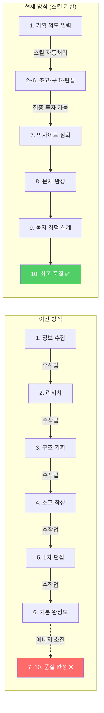
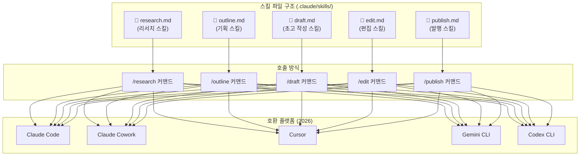
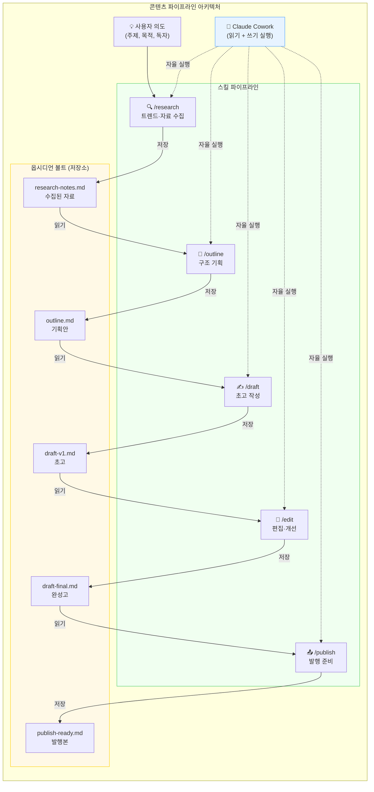
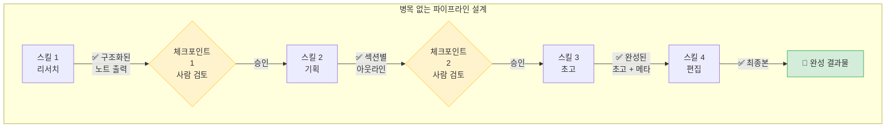
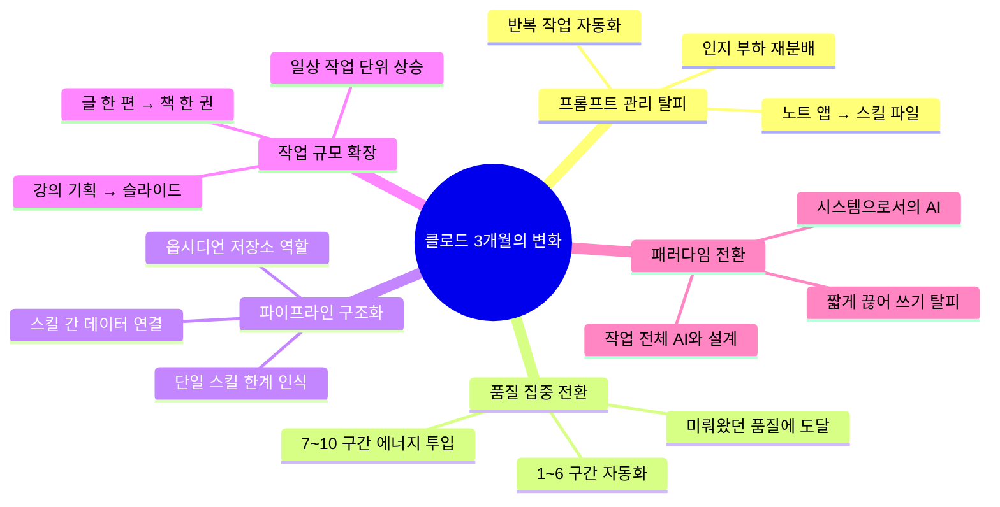

> **원문 출처**: [Facebook 포스트 (2025년경)](https://www.facebook.com/share/p/1CATjokfiY/)  
> **분석 작성일**: 2026년 4월 13일  
> **분류**: AI 워크플로우 · Claude Skills · Obsidian + AI · 콘텐츠 파이프라인

---

## 개요

이 포스트는 클로드(Claude)를 3개월간 사용한 창작자·지식 노동자가 경험한 **워크플로우의 질적 전환**을 기록한 짧지만 밀도 높은 에세이다. 단순한 사용 후기가 아니다. AI 도구를 "질문-답변"의 도구로 쓰던 단계에서 벗어나, **작업 전체를 AI와 함께 설계하는 시스템** 수준으로 진입했을 때 무엇이 달라지는지를 정확하게 짚고 있다.

GPT, 제미나이와 달리 클로드를 사용하면서 어떤 점이 달라졌는지를 중심으로, 스킬(Skills), 파이프라인(Pipeline), 옵시디언(Obsidian) 연동, 클로드 코워크(Cowork)라는 네 가지 키워드가 유기적으로 연결되어 있다. 이 문서는 그 포스트의 의미를 기술적·개념적·실용적 층위에서 모두 풀어낸다.

---

## 1. 포스트 원문 전체 맥락 분석

### 1-1. "프롬프트 노트 앱을 닫았다"는 것이 왜 의미 있는가

포스트 작성자는 이전까지 "노트 앱을 열고, 상황에 맞는 프롬프트를 찾고, 붙여 넣고, 다시 저장했다"는 방식으로 AI를 사용했다. 이 행동 패턴은 수많은 AI 초기 사용자에게 공통적으로 나타나는 현상이다. 프롬프트 라이브러리를 구축하고, 반복 상황에 재사용하고, 조금씩 튜닝하는 방식이다.

이 패턴의 근본적인 한계는 **AI가 도구의 수준에 머문다는 것**이다. 사용자가 AI에게 맥락을 매번 직접 주입해야 하고, AI는 그것을 받아서 1회용으로 처리한다. 마치 매번 새로운 알바 직원을 고용해서 업무 설명을 처음부터 다시 하는 것과 같다.

"프롬프트 노트 앱을 닫았다"는 선언은 그 패턴을 완전히 탈피했음을 의미한다. **반복 작업의 처리 책임이 사용자에서 스킬(Skill) 시스템으로 이전**된 것이다. 이는 단순한 편의성 향상이 아니라, 인지 부하(cognitive load)의 재분배다.

### 1-2. 1에서 10까지의 프레임: 작업 에너지의 재구성

포스트에서 가장 핵심적인 비유는 콘텐츠 작업을 **1부터 10까지의 스펙트럼**으로 표현한 부분이다.

- **이전 방식**: 1에서 6 ~ 7까지 올리는 데 대부분의 에너지를 소진. 7 ~ 10 구간(진짜 품질을 결정하는 구간)은 항상 미뤄짐.
- **현재 방식**: 스킬이 1 ~ 6 구간을 자동 처리. 작업자는 7 ~ 10 구간, 즉 **차별화, 품질 완성, 의도 구현**에 에너지를 집중.

이 구분은 매우 정확하다. 콘텐츠 창작에서 1 ~ 6 구간이란 정보 수집, 초고 작성, 구조 잡기, 기본적인 편집 같은 작업들이다. 이것들은 중요하지만, 독자에게 실질적인 가치를 전달하는 것은 7 ~ 10 구간 — 즉 통찰의 깊이, 문체의 완성, 독자 경험의 설계 같은 요소들이다.

AI 이전 시대에도 이 격차는 존재했다. 작가나 연구자들은 늘 "초고 쓰기는 어렵지 않다, 잘 쓰는 것이 어렵다"고 말한다. 하지만 현실에서는 초고 단계에서 에너지가 거의 다 소진되기 때문에, 정작 중요한 개선 작업에 집중할 여력이 없었다. 스킬 기반 AI 워크플로우는 이 구조적 문제를 처음으로 실용적 수준에서 해결하기 시작한 것이다.



### 1-3. "스킬을 파이프라인처럼 연결"한다는 개념

스킬 하나로는 부족하다는 인식이 중요하다. 단일 스킬은 단일 작업을 잘 처리하지만, 복잡한 프로젝트는 여러 단계의 전문 작업이 순서대로 맞물려야 한다. 기획 → 리서치 → 집필 → 편집 → 발행이라는 흐름이 그 예다.

이때 스킬들 사이를 이어주는 것이 **데이터**다. 포스트에서는 이것을 아주 구체적으로 설명한다:

> "기획에서 나온 것, 리서치에서 모은 것, 집필 중에 쌓인 판단. 이런 것들이 어딘가에 저장되어 있어야 다음 스킬이 그걸 받아서 이어 갑니다."

이것은 소프트웨어 아키텍처에서 말하는 **파이프-앤-필터(Pipe-and-Filter) 패턴**과 정확히 일치한다. 각 스킬(필터)은 입력을 받아 처리하고, 결과물을 저장소(파이프)에 남긴다. 다음 스킬은 그 저장소에서 입력을 받는다.

옵시디언이 바로 그 **저장소(파이프)** 역할을 맡는다.

---

## 2. 핵심 기술 개념 심층 해설

### 2-1. 클로드 스킬(Claude Skills)이란 무엇인가

클로드 스킬은 2025년 말~2026년 초에 Anthropic이 공식 표준으로 공개한 **재사용 가능한 에이전트 명령 체계**다. 기술적으로는 마크다운 파일(SKILL.md)에 자연어로 작성된 지침 집합이지만, 그것이 작동하는 방식은 전통적인 프롬프트와 근본적으로 다르다.

전통적인 프롬프트는 매 대화에서 사용자가 직접 붙여 넣어야 하고, 대화가 끝나면 사라진다. 스킬은 `.claude/skills/` 폴더(또는 Claude.ai의 설정 > 기능 > Skills)에 한 번 등록해두면, 이후에는 `/스킬이름` 형태의 슬래시 커맨드로 즉시 호출할 수 있다. 스킬 파일에는 다음이 담긴다:

- **작업 목적**: 이 스킬이 무엇을 하는가
- **입력 규격**: 어떤 파일, 어떤 데이터를 기대하는가
- **처리 절차**: 단계별로 무엇을 어떻게 처리하는가
- **출력 규격**: 결과물을 어디에, 어떤 형태로 저장하는가
- **회피 조건**: 하지 말아야 할 것은 무엇인가

코딩 지식이 전혀 필요 없다. 영어(또는 한국어)로 작성한 마크다운 파일이 그대로 AI 에이전트의 행동 명세서가 된다.

Anthropic은 스킬을 **오픈 스탠다드로 공개**했다. 2026년 현재, 동일한 SKILL.md 포맷이 Claude Code, Cursor, Gemini CLI, Codex CLI, OpenCode 등 다양한 에이전트 도구에서 호환된다. 이는 MCP(Model Context Protocol)가 외부 도구 연결의 표준이 된 것처럼, Skills가 에이전트 행동 명세의 표준으로 자리잡아 가고 있음을 의미한다.



### 2-2. 옵시디언(Obsidian)이 저장소 역할을 하는 이유

옵시디언은 로컬 마크다운 파일 기반의 노트 앱이다. 모든 노트가 `.md` 파일로 저장되고, 그 파일들이 하나의 볼트(Vault) 폴더에 모인다. 이 구조가 AI와 결합할 때 특별한 의미를 갖는 이유는 세 가지다.

**첫째, LLM 친화적 포맷이다.** 마크다운은 클로드가 가장 자연스럽게 읽고 쓰는 형식이다. 별도의 파싱이나 변환 없이, 파일을 그대로 컨텍스트로 주입할 수 있다.

**둘째, 로컬 파일이므로 Claude Code가 직접 읽고 쓸 수 있다.** Claude Code(그리고 Cowork)는 로컬 파일 시스템에 직접 접근한다. 옵시디언 볼트 폴더를 작업 디렉터리로 지정하면, 클로드는 그 안의 모든 파일을 읽고, 새 파일을 생성하고, 기존 파일을 수정할 수 있다.

**셋째, 비선형적 지식 연결 구조가 AI 컨텍스트와 잘 맞는다.** 옵시디언의 백링크(Backlink)와 그래프 뷰는 노트들 사이의 관계를 명시적으로 드러낸다. AI가 특정 주제를 처리할 때, 관련 노트들을 자동으로 탐색하며 더 풍부한 컨텍스트를 구성할 수 있다.

포스트 작성자의 아키텍처에서 옵시디언은 단순한 노트 앱이 아니다. **스킬들 사이를 잇는 중간 상태(Intermediate State) 저장소**다. 기획 스킬이 만든 아웃라인은 옵시디언에 저장되고, 리서치 스킬은 그것을 읽어 참고 자료를 추가하고, 집필 스킬은 그 모든 것을 종합해 초고를 생성한다.



### 2-3. 클로드 코워크(Claude Cowork)의 역할

Claude Cowork는 2026년 1월 Anthropic이 공개한 베타 제품으로, Claude Code의 핵심 기능을 비개발자도 사용할 수 있는 GUI 형태로 제공한다. 기술적으로는 Claude Code와 동일한 엔진 위에 올라가 있지만, 터미널 대신 데스크톱 앱 인터페이스를 제공한다.

포스트에서 "클로드는 코워크로 그 저장소를 읽고 씁니다"라는 문장이 나오는데, 이것이 기술적으로 의미하는 바는 다음과 같다:

1. 사용자가 Claude Desktop의 Cowork 탭을 열고, 옵시디언 볼트 폴더를 워크스페이스로 지정한다.
2. 작업을 자연어로 설명하면, 클로드는 작업 계획을 먼저 보여주고 사용자의 승인을 받는다.
3. 승인 후, 클로드는 옵시디언 볼트 내의 파일들을 읽고 쓰며 자율적으로 작업을 수행한다.
4. 스킬이 등록되어 있으면, 해당 스킬의 명세에 따라 구조화된 방식으로 각 단계를 처리한다.

Cowork의 가장 중요한 특성은 **비동기(asynchronous) 실행**이다. 사용자가 작업을 위임하고 다른 일을 하는 동안, 클로드가 백그라운드에서 파일을 읽고, 분석하고, 새 파일을 생성하거나 기존 파일을 업데이트한다. 마치 실제 어시스턴트에게 과제를 맡기고 나중에 결과물을 확인하는 것과 같다.

Cowork와 Claude Code의 차이를 명확히 구분하면:

| 구분 | Claude Code | Claude Cowork |
|------|------------|---------------|
| 인터페이스 | 터미널 (CLI) | 데스크톱 GUI |
| 주요 사용자 | 개발자 | 지식 노동자, 크리에이터 |
| 실행 방식 | 대화형 (Interactive) | 위임형 (Delegated) |
| 코딩 필요성 | 낮음 (자연어 중심) | 거의 없음 |
| 파일 접근 | 직접 파일시스템 | 지정된 워크스페이스 폴더 |
| 스킬 지원 | ✅ .claude/skills/ | ✅ Skill 파일 연동 |

---

## 3. "작업의 폭이 달라졌다"는 것의 구체적 의미

### 3-1. 글 한 편 → 책 한 권

포스트에서 가장 인상적인 변화의 묘사는 이 부분이다:

> "글 한 편을 쓰던 작업이 책 한 권을 만드는 작업이 됐습니다."

이것은 단순히 "더 많이 쓸 수 있게 됐다"는 뜻이 아니다. **프로젝트의 단위 규모 자체가 달라진 것**이다.

책 한 권을 쓰기 위해서는 단순히 글쓰기 능력 외에도 — 전체 목차 설계, 챕터 간 일관성 유지, 참고 문헌 관리, 각 챕터의 톤 통일, 리뷰 사이클 관리 등 — 수많은 **메타 작업(meta-work)** 이 필요하다. 과거에는 이 메타 작업들이 실제 글쓰기만큼, 혹은 그보다 더 많은 시간과 에너지를 소비했다. 그래서 책 한 권은 늘 "언젠가"의 프로젝트였다.

스킬 파이프라인 + 옵시디언 저장소 구조에서는, 목차 스킬이 전체 구조를 생성하고, 각 챕터 초고 스킬이 저장소에서 맥락을 읽어 일관된 방향으로 내용을 전개하며, 편집 스킬이 전체 문서를 스캔해 불일치를 잡아낸다. 메타 작업의 상당 부분이 자동화된다.

### 3-2. 강의 하나 → 기획부터 슬라이드까지

"강의 하나를 기획하던 작업이 기획부터 슬라이드까지 한 번에 가는 작업이 됐습니다"라는 문장도 같은 구조다.

강의 기획은 학습 목표 설정, 커리큘럼 설계, 각 세션별 내용 구성, 실습 과제 설계, 평가 기준 수립으로 이루어진다. 그 다음 단계인 슬라이드 제작은 또 별도의 작업이다. 과거에는 기획과 슬라이드 제작 사이에 맥락 전환 비용(context-switching cost)이 컸고, 기획 단계에서 결정한 내용들을 슬라이드에 반영하는 단순 반복 작업이 많았다.

스킬 파이프라인에서는 기획 결과물이 옵시디언에 구조화된 형태로 저장되고, 슬라이드 생성 스킬이 그 데이터를 읽어 자동으로 프레젠테이션을 만들어낸다. 맥락은 잃어버리지 않으면서, 단계 간 전환이 매끄럽게 이루어진다.

```mermaid
gantt
    title 작업 규모 비교: 이전 방식 vs 스킬 파이프라인
    dateFormat  X
    axisFormat %s

    section 이전 방식 (글 1편)
    아이디어 구상         :done, a1, 0, 2
    프롬프트 찾기/붙여넣기 :done, a2, 2, 3
    초고 생성             :done, a3, 3, 6
    수작업 편집           :done, a4, 6, 9
    완성                 :done, a5, 9, 10

    section 스킬 파이프라인 (책 1권)
    의도 입력             :active, b1, 0, 1
    스킬 자동 실행 (1→6)  :active, b2, 1, 5
    품질 집중 작업 (6→10) :active, b3, 5, 8
    전체 일관성 검토      :active, b4, 8, 9
    완성                 :active, b5, 9, 10
```



### 3-3. "예전 같으면 미루던 범위가 일상 작업으로"

포스트에서 가장 날카로운 문장 중 하나다. "미룸(procrastination)"의 원인은 게으름이 아니라 **구조적 비용**이다. 책 한 권을 쓰거나 강의 전체를 설계하는 것이 미뤄지는 이유는, 그 작업을 시작하고 유지하는 데 드는 메타 비용이 너무 크기 때문이다.

스킬 파이프라인은 그 구조적 비용을 극적으로 낮춘다. 처음 시작하는 데 필요한 마찰(friction)이 줄어들면, 이전에는 불가능하게 느껴졌던 규모의 작업이 일상적인 작업 단위로 편입된다.

이것은 클로드를 3개월 사용한 사람만의 이야기가 아니다. 지식 노동 전반에 일어나고 있는 패러다임 전환의 개인적 체험담이다.

---

## 4. 기술적 맥락: 2025~2026년의 Claude Skills 생태계

### 4-1. Skills 오픈 스탠다드화와 생태계 폭발

Anthropic은 Agent Skills를 MCP처럼 오픈 스탠다드로 공개했다. 2026년 현재, SKILL.md 포맷은 Claude Code뿐 아니라 Cursor, Gemini CLI, Codex CLI 등 주요 AI 에이전트 도구 전반에서 호환된다. 커뮤니티에서는 이미 수백에서 수천 개의 스킬이 GitHub에 공개되어 있으며, 콘텐츠 마케팅, 학술 연구, 소프트웨어 개발, 법무, 의료 문서 작성 등 도메인별로 전문화된 스킬 컬렉션이 빠르게 구축되고 있다.

Obsidian CEO인 Steph Ango도 자신의 옵시디언 볼트를 위한 에이전트 스킬 세트를 직접 공개했으며, 이를 기반으로 커뮤니티에서 파생 스킬들이 만들어지고 있다.

### 4-2. 비개발자가 스킬을 만드는 방법

스킬은 코딩 없이 만들 수 있다. 기본 구조는 다음과 같다:

```markdown
# 스킬 이름: 블로그 초고 작성

## 목적
사용자가 제공한 리서치 노트와 기획안을 바탕으로 블로그 포스트 초고를 작성합니다.

## 입력
- research-notes.md (리서치 결과)
- outline.md (기획안)

## 처리 절차
1. 기획안의 섹션 구조를 읽는다
2. 각 섹션과 관련된 리서치 노트를 연결한다
3. 독자 수준에 맞는 톤으로 각 섹션의 본문을 작성한다
4. 서론과 결론을 추가한다

## 출력
- draft-v1.md 파일을 생성하여 볼트에 저장

## 금지사항
- 리서치 노트에 없는 사실을 임의로 추가하지 않는다
- 각 섹션을 500단어 이상으로 작성하지 않는다
```

이 수준의 마크다운 파일만으로 클로드는 구조화된 방식으로 반복 작업을 처리할 수 있다.

### 4-3. 스킬 파이프라인의 병목 문제

포스트 작성자는 "파이프라인 중간의 병목도 찾아야 한다"고 언급했다. 이것은 실제로 스킬 파이프라인을 운영할 때 가장 중요한 실무 과제다.

스킬 파이프라인에서 병목은 주로 세 곳에서 발생한다:

**데이터 품질 병목**: 이전 스킬의 출력물이 다음 스킬의 기대 입력 형식과 맞지 않을 때 발생한다. 리서치 스킬이 만든 노트가 너무 비구조적이면, 초고 스킬이 올바른 정보를 찾지 못한다.

**컨텍스트 소실 병목**: 여러 스킬이 연속으로 실행되면서 앞 단계에서 중요한 판단 근거가 저장소에 기록되지 않는 경우. 이를 해결하려면 각 스킬이 자신이 처리한 내용과 판단 이유를 메타데이터로 남기도록 설계해야 한다.

**인간 개입 타이밍 병목**: 어느 단계에서 사람의 검토가 필요한지가 명확하지 않으면, 전체 파이프라인이 잘못된 방향으로 진행된 후에야 수정 기회가 생긴다. 파이프라인의 주요 체크포인트를 명시적으로 설계하는 것이 중요하다.



---

## 5. 더 넓은 맥락: 이 패턴이 시사하는 것

### 5-1. "AI를 짧게 끊어 쓰던 방식"에서 "작업 전체를 설계하는 방식"으로

포스트의 마지막 문장은 이 변화의 본질을 가장 잘 요약한다:

> "AI를 짧게 끊어 쓰던 방식에서, 작업 전체를 AI와 함께 설계하는 방식으로. 3개월 사이에 그 선을 넘었습니다."

"짧게 끊어 쓰는 방식"은 AI를 단발성 도구로 사용하는 것이다. 질문 하나를 던지고 답을 받고, 또 다른 질문을 던지고 답을 받는다. AI는 각 대화 사이의 맥락을 기억하지 못하고, 사용자는 매번 컨텍스트를 새로 주입해야 한다.

"작업 전체를 설계하는 방식"은 AI를 시스템의 일부로 통합하는 것이다. 스킬은 행동 명세를 영속적으로 저장하고, 옵시디언은 작업 상태를 영속적으로 저장하며, Cowork는 이 두 가지를 결합해 자율적으로 실행한다. AI는 더 이상 질문-답변의 상대방이 아니라, **팀의 구성원이자 시스템의 실행 엔진**이 된다.

이 전환은 단순히 생산성 향상의 문제가 아니다. **사람이 할 일의 성격 자체가 바뀐다**. 실행과 처리에서 손을 떼고, 설계와 판단에 집중하게 된다.

### 5-2. GPT, 제미나이와 달랐던 이유

포스트 초반에 "GPT, 제미나이와 다르게 쓰면서 달라진 지점이 있습니다"라는 문장이 나온다. 무엇이 달랐을까?

기술적으로는 Claude Code와 Cowork라는 **파일시스템 접근 기반의 에이전트 실행 환경**이 존재한다는 점이 핵심이다. GPT의 Custom GPT나 Gemini의 Gem도 유사한 방향으로 발전하고 있지만, 2025~2026년 기준 로컬 파일시스템과의 직접 통합, 스킬 파이프라인 구성, 옵시디언과 같은 PKM 도구와의 연동 측면에서 클로드의 생태계가 한 발 앞서 있었다.

그러나 더 본질적인 차이는 **Anthropic의 제품 철학**에 있다. Claude Code는 처음부터 "에이전트로서의 클로드"를 설계의 중심에 두고 만들어졌다. 단순한 챗봇의 능력 향상이 아니라, 사용자의 로컬 환경에 통합되어 실질적인 작업을 수행하는 에이전트를 목표로 했다. 이 철학이 스킬 시스템과 코워크라는 구체적인 제품으로 구현되었고, 그 결과 포스트 작성자가 경험한 것과 같은 워크플로우 전환이 가능해졌다.

### 5-3. 이 패턴을 가로막는 것

물론 이 수준의 워크플로우에 도달하는 것이 누구에게나 쉽지는 않다. 포스트 작성자도 "세부 조정은 남아 있습니다. 각 스킬을 더 정교하게 다듬어야 하고, 파이프라인 중간의 병목도 찾아야 합니다"라고 솔직하게 인정한다.

주요 장벽들을 정리하면:

**초기 설계 비용**: 스킬을 처음 작성하고, 파이프라인 구조를 설계하고, 옵시디언 볼트의 폴더 체계를 정비하는 데는 상당한 선행 투자가 필요하다. 이 투자 없이는 그냥 챗봇으로 쓰는 것이 더 빠르다.

**추상화 능력**: 자신의 작업 프로세스를 명확한 단계와 입출력으로 분해하는 능력이 필요하다. "나는 글을 쓴다"가 아니라 "나는 리서치 → 구조화 → 초고 → 편집 → 발행의 단계를 거친다"는 식으로 작업을 구조적으로 이해해야 스킬을 잘 설계할 수 있다.

**지속적 유지보수**: 스킬 파이프라인은 한 번 만들면 영원히 쓸 수 있는 것이 아니다. 클로드 모델이 업데이트되고, 작업 방식이 진화하고, 새로운 요구사항이 생기면서 스킬도 함께 업데이트해야 한다. 포스트에서 "각 스킬을 더 정교하게 다듬어야 한다"고 한 것이 바로 이 지점이다.

---

## 6. 종합 시사점



이 포스트가 기록하는 것은 개인의 도구 사용 습관 변화가 아니다. 지식 노동자가 AI와 협업하는 방식의 **패러다임 전환**이다. 그 전환의 핵심 요소는 세 가지다:

**영속성(Persistence)**: 스킬은 프롬프트와 달리 영속적으로 저장되고 재사용된다. 옵시디언은 작업의 중간 상태를 잃지 않고 누적한다. AI와의 협업에서 기억과 맥락의 연속성이 확보된다.

**모듈성(Modularity)**: 각 스킬은 하나의 작업을 잘 하도록 설계된 모듈이다. 이 모듈들을 파이프라인으로 연결함으로써, 단일 도구의 한계를 넘어선 복잡한 작업을 처리할 수 있다.

**확장성(Scalability)**: 스킬 파이프라인 위에서 작업의 규모는 개인의 체력이나 시간이 아닌, 파이프라인의 설계 품질에 의해 결정된다. "예전 같으면 미루던 범위"가 일상 작업이 될 수 있는 이유다.

---

## 7. 관련 참고 자료

이 워크플로우를 더 깊이 이해하고 직접 구현하고자 하는 독자를 위한 자료들이다.

- **Frank Anaya - Claude Cowork & Obsidian 완전 가이드** (frankanaya.com/claude-tutorial) — 스킬, 코워크, 옵시디언 통합에 관한 가장 포괄적인 비개발자용 튜토리얼
- **Anthropic 공식 Skills 빌딩 가이드** (resources.anthropic.com) — Skills 오픈 스탠다드 및 SKILL.md 포맷 명세
- **kepano/obsidian-skills** (GitHub) — 옵시디언 CEO가 직접 만든 Obsidian용 에이전트 스킬 레포지터리
- **MindStudio - Claude Code 콘텐츠 마케팅 파이프라인** (mindstudio.ai) — 콘텐츠 제작 특화 스킬 파이프라인 구축 가이드
- **Eva Keiffenheim - Claude Cowork 실용 가이드** (Substack) — 비개발자 관점의 Cowork 활용 사례

---

*이 문서는 Facebook 포스트 원문을 기반으로, 2026년 4월 기준의 최신 기술 맥락과 함께 상세 분석한 것입니다. 원문 포스트의 모든 아이디어와 통찰은 원저자에게 귀속됩니다.*
