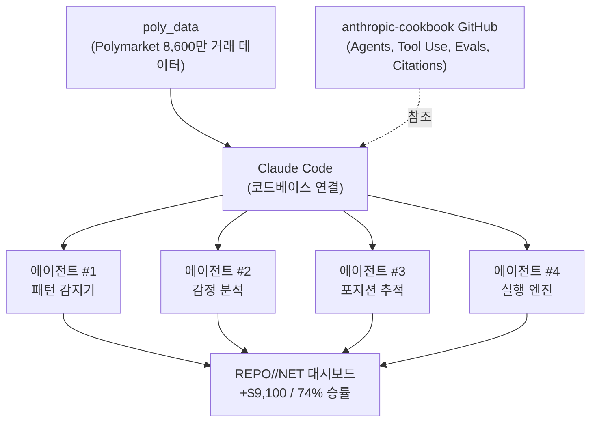
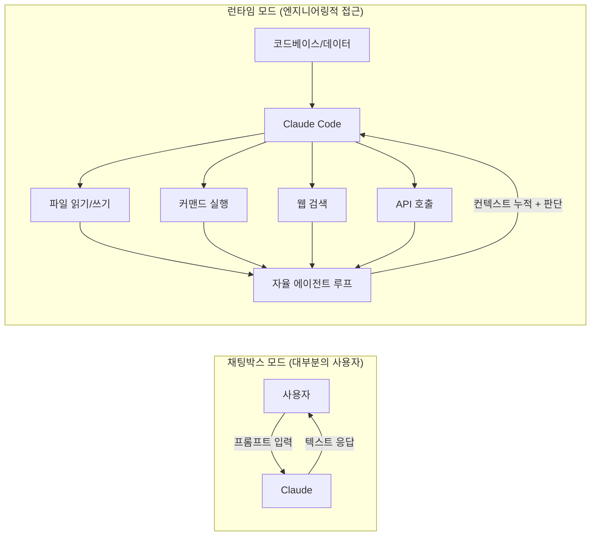
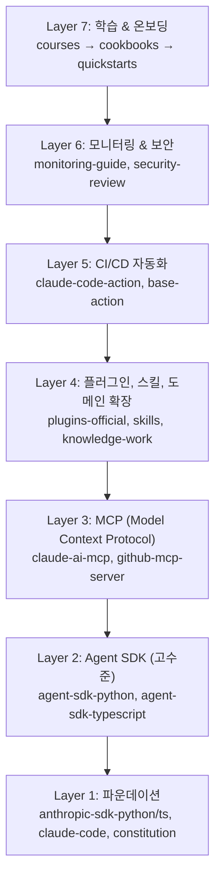
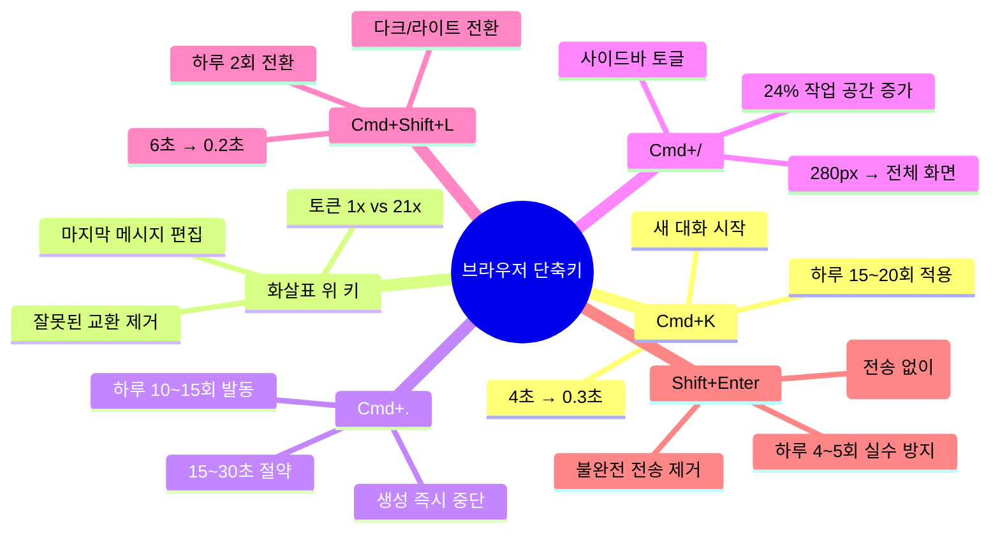
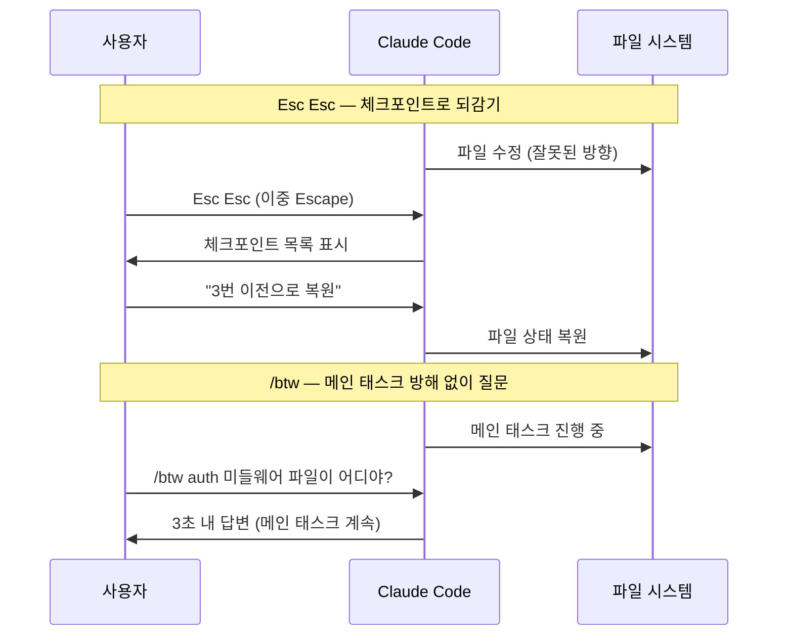
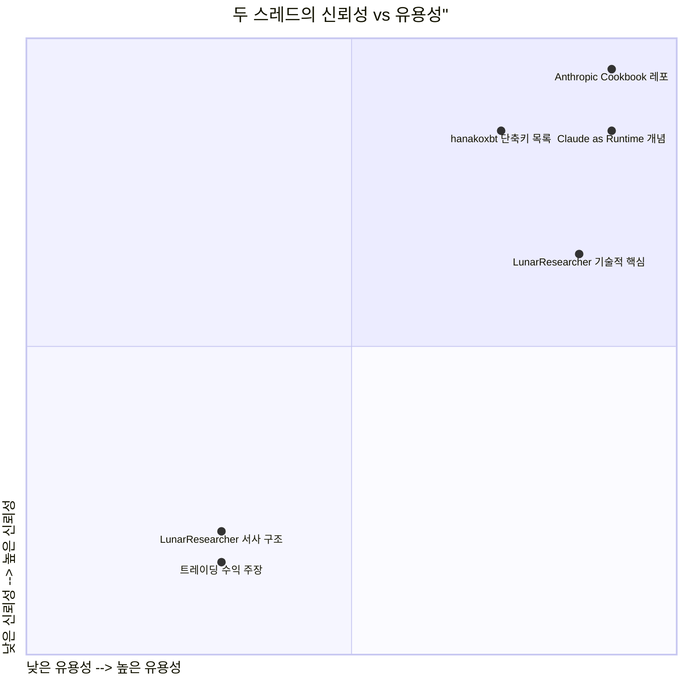

> **원본 출처**  
> - [@LunarResearcher (X/Twitter)](https://x.com/lunarresearcher/status/2043330919868621142) — "An ex-Anthropic engineer told me something at a party he probably shouldn't have"  
> - [@hanakoxbt (X/Twitter)](https://x.com/hanakoxbt/status/2042242394557464896) — "12 Claude Shortcuts That Slashed My Workflow in Half"  
> - 분석 작성일: 2026년 4월 13일

---

## 목차

1. [두 트윗의 전체 맥락과 구조](#1-두-트윗의-전체-맥락과-구조)
2. [LunarResearcher의 "파티 비밀" 스레드 전문 해석](#2-lunarresearcher의-파티-비밀-스레드-전문-해석)
3. [트레이딩 대시보드 이미지 분석](#3-트레이딩-대시보드-이미지-분석)
4. [핵심 주장: "Claude는 채팅박스가 아니라 런타임이다"](#4-핵심-주장-claude는-채팅박스가-아니라-런타임이다)
5. [Anthropic Cookbook — 실제로 무엇인가](#5-anthropic-cookbook--실제로-무엇인가)
6. [Claude의 에이전트 생태계 현황 (2026년 4월 기준)](#6-claude의-에이전트-생태계-현황-2026년-4월-기준)
7. [12가지 Claude 단축키 완전 분석](#7-12가지-claude-단축키-완전-분석)
8. [비판적 분석: 클릭베이트인가, 진짜 통찰인가](#8-비판적-분석-클릭베이트인가-진짜-통찰인가)
9. [실질적 행동 지침: 뭘 가져가야 하나](#9-실질적-행동-지침-뭘-가져가야-하나)

---

## 1. 두 트윗의 전체 맥락과 구조

두 개의 바이럴 트윗 스레드가 한 화면에 등장했다. 표면적으로는 별개처럼 보이지만, 실제로는 같은 주제를 서로 다른 각도에서 조명한다. **"Claude를 제대로 쓰는 법"** 이 그것이다.

첫 번째 스레드(@LunarResearcher)는 극적인 서사 구조를 택했다. SF 루프탑 파티, 전직 Anthropic 엔지니어, 주식시장을 이기는 AI 에이전트, 그리고 "이걸 지워"라는 문자 메시지. 소설적인 긴장감을 가진 이 스레드의 실질적 메시지는 두 가지다. Claude를 API와 코드베이스에 연결해 에이전트로 쓰라는 것, 그리고 Anthropic이 공개한 GitHub 레포지터리들을 활용하라는 것이다.

두 번째 스레드(@hanakoxbt)는 훨씬 직접적이다. 주 51분을 클릭과 스크롤로 낭비했다는 실증 데이터에서 시작해서, 브라우저용 6개와 Claude Code 터미널용 6개, 총 12개의 단축키를 구체적인 시간 절약 수치와 함께 나열한다. 월 10시간, 연 120시간의 절약이라는 주장이다.

두 스레드가 교차하는 지점은 바로 이 문장이다:

> **"Honestly? Keyboard shortcuts and repo structure. That's it. The model is the same for everyone"**

모델 자체는 모두에게 동일하게 주어진다. 차이를 만드는 건 그것을 어떻게 쓰느냐다.

---

## 2. LunarResearcher의 "파티 비밀" 스레드 전문 해석

### 서사의 뼈대

스레드는 고전적인 "금지된 지식" 서사 구조를 따른다. 제목부터 "he probably shouldn't have"(말했으면 안 됐는데)로 시작하는 것은, 독자의 궁금증을 자극하기 위한 의도적 프레이밍이다. SF 루프탑 파티라는 배경 설정은 실리콘밸리 내부인의 분위기를 풍긴다.

스레드의 전개를 단계별로 정리하면 다음과 같다.

첫째, 트레이딩 에이전트 주제로 대화가 시작되자 전직 엔지니어가 "넌 지금 잘못 쓰고 있어"라고 말한다. 둘째, 그가 GitHub 링크 하나를 꺼낸다. `github.com/anthropics/anthropic-cookbook`이다. 셋째, "다들 프롬프트를 타이핑한다. 그게 우리가 쓰는 방식이 아니야. 코드베이스에 연결해. 읽게 하고, 이해시키고, 그 위에 빌드하게 해"라는 말이 핵심 메시지로 등장한다. 넷째, 작성자는 새벽 2시에 귀가해 Claude Code를 Polymarket의 거래 데이터 8,600만 건에 연결했다. 마지막으로 1주차 +$1,400, 2주차 +$3,800, 현재 +$9,100이라는 수익을 보고하며, 카피트레이딩 서비스 링크(kreo.app/@lunar)로 마무리된다.

### 스레드에서 언급된 기술 스택

---

## 3. 트레이딩 대시보드 이미지 분석

스레드에 첨부된 이미지는 `REPO//NET`이라는 이름의 커스텀 트레이딩 대시보드다. 이미지에서 확인되는 정보는 다음과 같다.

**상단 메트릭 바:**
- 현재 손익: **+$9,100**
- 총 트레이드 수: **280**
- 승률: **74%**
- 평균 배당률: **2.41**
- 활성 에이전트: **4개**
- 시간: **11h** (세션 지속 시간 추정)
- 누적 수익: **+$1,760** (해당 세션 기준)

**세 개의 패널:**

왼쪽 패널은 `SCAN LOG`다. AI가 실시간으로 스캔하는 신호들이 나열돼 있다. OpenAI IPO 진위, BTC 고래 집적 감지, NVDA 실적 고래 집적 감지, Fed 금리 결정 확률, S&P 200일선 신호 등이 스크롤된다. 이는 Claude가 다양한 시장 신호를 지속적으로 모니터링하고 있음을 시각화한 것이다.

가운데 패널은 `REPO FEED`다. `anthropic-cookbook` 관련 항목들이 눈에 띈다. `tool_use`, `agents`, `citations`, `local workflow` 등 Anthropic 공식 레포의 실제 폴더/파일명과 일치하는 항목들이 흐른다. `poly_data`의 거래 인덱싱 상황도 표시된다.

오른쪽 패널은 `EDGE SCANNER`다. 각 포지션별 EV(기댓값)와 신호 방향이 표시된다. OpenAI IPO EV:4.0%, NVDA 실적 EV:4.8%, DOGE $1 EV:39.0% 등의 항목이 나열되며, 각각 EXECUTE 또는 EV<5% 같은 상태가 붙어 있다.

하단에는 `ACTIVE POSITIONS`과 `COPY ENGINE`, `CONVICTION` 패널이 있다. 복사 엔진은 `polka_alpha`, `ark_hunter`, `trend_rider`, `cookbook_engine` 등의 서브-에이전트를 추적한다.

### 대시보드의 진실성 판단

이 이미지는 정교하게 제작된 UI이며, 데이터 업데이트가 실시간으로 이루어지는 실제 시스템처럼 보인다. 그러나 몇 가지 포인트를 주목해야 한다. 첫째, Polymarket은 예측 시장이며 승률 74%가 지속 가능한지는 별개 문제다. 둘째, `+$9,100`이라는 수치가 초기 베팅 금액 대비 몇 퍼센트인지는 공개되지 않았다. 셋째, 트레이딩 성과 스크린샷은 cherry-picking의 위험이 항상 존재한다. 트위터나 X에서의 이런 종류의 수익 주장은 검증이 거의 불가능하다.

---

## 4. 핵심 주장: "Claude는 채팅박스가 아니라 런타임이다"

이것이 두 스레드에서 가장 기술적으로 중요한 통찰이다. 그리고 이 통찰은 2026년 현재 Anthropic의 실제 제품 방향과 정확히 일치한다.

### "채팅박스"로 쓰는 방식 vs "런타임"으로 쓰는 방식

채팅박스로 쓴다는 것은 Claude를 질문-응답 기계로 쓴다는 뜻이다. 매 대화는 독립적이고, 컨텍스트는 대화창 안에만 존재하며, Claude는 텍스트를 생성할 뿐 외부 세계에는 아무것도 하지 않는다.

런타임으로 쓴다는 것은 전혀 다른 방식이다. Claude를 실행 환경에 연결하고, 코드베이스를 읽게 하고, 파일을 수정하게 하고, 커맨드를 실행하게 하고, 외부 데이터를 끌어오게 한다. 결과적으로 Claude는 "생각하는 주체"가 되고, 나머지는 도구가 된다.

### 왜 이 차이가 중요한가

첫 번째 이유는 **컨텍스트의 깊이**다. 코드베이스를 직접 읽는 Claude와 개발자가 요약해서 설명한 Claude는 문제 이해의 깊이가 다르다. 특히 대규모 데이터셋이나 복잡한 시스템을 다룰 때 이 차이는 결과물의 질에서 극명하게 드러난다.

두 번째 이유는 **자율성**이다. 프롬프트를 타이핑하는 방식은 사람이 루프 안에 있어야 한다. 런타임으로 쓰는 방식은 에이전트 루프를 구성하면 사람 없이 작동한다. 이것이 "4개 에이전트, 11시간 동작"의 의미다.

세 번째 이유는 **확장성**이다. 채팅박스는 선형으로 스케일된다. 사람이 더 많은 프롬프트를 치면 더 많은 결과가 나온다. 런타임은 에이전트를 병렬로 띄우면 된다. 스케일이 다르다.

---

## 5. Anthropic Cookbook — 실제로 무엇인가

스레드에서 언급된 GitHub 레포지터리는 현재 두 가지 형태로 존재한다.

### anthropic-cookbook (구버전, 현재도 유지)

현재 `anthropics/anthropic-cookbook`은 18.6k 스타, 약 1.9k 포크를 보유하고 있다. 트윗에서 "14,000 스타"라고 언급한 것은 이 레포지터리의 과거 시점 수치이거나 다른 레포를 혼동한 것으로 보인다.

### claude-cookbooks (신버전)

현재 Anthropic의 주력 쿡북 레포지터리는 `anthropics/claude-cookbooks`이며, 38k 스타와 4.3k 포크를 기록하고 있다. 2026년 4월 현재 기준으로 더 활발하게 관리되는 버전이다.

### 레포지터리 안에는 무엇이 있나

이 레포는 Claude로 할 수 있는 재미있고 효과적인 방법들을 담은 노트북과 레시피 모음이다. 예제 코드는 주로 Python으로 작성되어 있지만, Claude API와 상호작용하는 언어라면 어디든 응용할 수 있다.

구체적인 포함 내용은 다음과 같다:

- **에이전트(Agents)**: 툴 사용, 멀티-에이전트 오케스트레이션, 에이전트 루프 구성 패턴
- **RAG**: Pinecone, LlamaIndex 등 벡터 DB 연동, Wikipedia 검색, 웹페이지 읽기
- **Evals**: 응답 품질 평가 파이프라인 구성 방법
- **Citations**: 소스 인용 및 근거 제시 패턴
- **멀티모달**: 이미지 처리, 비전 API 활용, 오디오 처리
- **고급 API 기능**: 프롬프트 캐싱, 배치 처리, 메타프롬프트 생성

핵심은 이것이 단순한 "사용 예시"가 아니라는 점이다. 이 레포에 담긴 것들은 **Anthropic이 내부적으로 사용하던 아키텍처 패턴**이다. 전직 엔지니어가 "이게 우리가 실제로 쓰던 방식이야"라고 말했다면, 그 말은 완전히 거짓은 아니다.

---

## 6. Claude의 에이전트 생태계 현황 (2026년 4월 기준)

트윗이 시사하는 "Claude as Runtime" 개념은 2026년 현재 Anthropic의 공식 제품 전략과 놀라울 만큼 일치한다.

### Claude Managed Agents

Anthropic은 최근 Claude Managed Agents의 공개 베타를 시작했다. 이는 기업들이 클라우드 기반 에이전트를 플랫폼 위에서 빠르게 구축하고 배포할 수 있도록 하는 새로운 서비스다. 사용자는 자연어 또는 YAML 파일로 원하는 에이전트를 정의하고, 가드레일을 설정하고, 모든 인프라를 추상화된 상태에서 실행할 수 있다.

이것은 완전 관리형 클라우드 환경으로, Claude가 파일을 읽고, 명령을 실행하고, 웹을 브라우징하고, 코드를 자율적으로 실행한다. 세션 연속성과 컨텍스트 관리는 이미 처리되어 있다.

다시 말해, Anthropic은 스스로 "Claude를 런타임으로" 만들고 있는 중이다. 트윗에서 전직 엔지니어가 말한 것은 이미 공식 제품이 된 방향이었던 셈이다.

### Anthropic의 개발자 생태계 7계층

Anthropic GitHub에는 80개 이상의 레포지터리가 있으며, 이 22개의 핵심 레포들이 7개 계층으로 구성된 완전한 개발자 플랫폼을 형성한다.

### Claude Managed Agents 가격 구조

가격 책정은 비교적 단순하다. 토큰 사용량에 대해 Anthropic의 표준 API 가격을 적용하고, 실제 실행 시간(밀리초 단위로 측정)에 대해 세션 시간당 $0.08를 추가로 부과한다. 대기 시간은 이 실행 비용에 포함되지 않는다. 에이전트가 웹 검색을 수행할 경우 1,000건당 $10가 추가 청구된다.

이것은 VPS $25/월로 동일한 것을 구현하는 것과 비교해볼 때 상당히 다른 경제학을 만들어낸다.

---

## 7. 12가지 Claude 단축키 완전 분석

### 브라우저 단축키 6개 (claude.ai)

#### Cmd+K — 새 대화 즉시 시작

이 단축키가 단순히 "빠른 새 채팅"보다 더 중요한 이유가 있다. 관련 없는 질문들을 하나의 대화에 쌓는 습관은 컨텍스트를 오염시킨다. 이전 내용이 다음 답변에 영향을 주기 때문이다. 새 대화를 시작하는 마찰이 줄어들면, 실제로 필요할 때 새 대화를 시작하게 된다. 그 자체가 품질 개선이다.

#### 화살표 위 키 — 마지막 메시지 편집

이것이 단축키 중 가장 파급 효과가 큰 것이다. 스레드의 토큰 수학을 그대로 인용하면 다음과 같다.

**팔로우업 방식**: 원본 메시지 전체 재읽기 + 수정 메시지 + 새 응답 생성 = 대화가 길어질수록 기하급수적으로 토큰 소비 증가

**편집 방식**: 수정된 메시지 하나 + 클린한 재생성 = 잘못된 교환 자체가 대화에서 사라짐

메시지 20번째쯤 되면 팔로우업은 약 10,500 토큰, 편집은 약 500 토큰이 된다는 계산이다. 21배 차이. 이것은 Claude Pro/Max 플랜의 사용량 한도에 직접 영향을 미친다.

#### Cmd+. — 생성 즉시 중단

Claude가 틀린 방향으로 응답을 시작했을 때, 끝까지 기다리는 것은 순수 낭비다. 생성된 모든 토큰은 비용이다. 2단락째에서 문제를 발견했다면 거기서 잘라야 한다. 하루 10~15회 발동 가정하면 500~1,000 토큰 × 10~15 = 매일 5,000~15,000 토큰 절약.

#### Cmd+/ — 사이드바 토글

280px의 화면 공간을 차지하는 사이드바는, 실제로 보고 있지 않을 때는 열려 있을 이유가 없다. 24% 작업 공간 확보는 집중도에도 영향을 미친다.

#### Shift+Enter — 전송 없이 줄바꿈

구조화된 프롬프트 — 여러 조건, 코드 블록, 서식 지정이 포함된 — 를 작성할 때 Enter를 잘못 누르는 실수는 누구나 한다. 하루 4~5회의 불완전 전송이 발생하면, 각각 Claude의 불완전한 응답과 수정 요청이 따른다. Shift+Enter 하나로 이 전체 마찰이 사라진다.

---

### Claude Code 단축키 6개 (터미널)

#### Esc Esc — 임의 체크포인트로 되감기

단일 Esc는 생성 중단이다. 누구나 안다. 하지만 이중 Esc는 다르다. 세션 중 Claude Code가 생성한 모든 체크포인트의 목록을 스크롤 가능한 형태로 보여준다. 4가지 복원 옵션이 있다: 코드와 대화 모두 복원, 대화만 복원, 코드만 복원, 해당 체크포인트부터 요약.

이것이 개발 방식을 바꾸는 이유는 **실험 비용을 제로로 만들기** 때문이다. Claude에게 확신이 40%인 접근법을 시도시켜도 된다. 실패하면 5초 안에 원점으로 돌아간다. 리스크 없는 실험은 더 공격적인 시도를 가능하게 한다.

#### Ctrl+R — 프롬프트 히스토리 역방향 검색

Claude Code는 세션 간 프롬프트 히스토리를 유지한다. Ctrl+R은 bash의 역방향 검색과 동일한 원리로, 과거에 성공했던 복잡한 프롬프트를 키워드 2개로 찾아낸다. 사용 기간이 길어질수록 이 히스토리는 개인화된 "작동하는 프롬프트 라이브러리"가 된다.

#### Option+T — 확장 사고(Extended Thinking) 토글

Extended Thinking은 강력하지만 토큰 소비가 크다. 간단한 이름 변경 작업에 3,000 토큰을 쓰는 것은 낭비고, 복잡한 아키텍처 결정에 3,000 토큰을 쓰는 것은 가치 있는 투자다. 메시지별로 0.2초 만에 온오프를 전환하면 실질적인 비용 최적화가 가능하다.

#### Ctrl+G — 외부 에디터에서 프롬프트 작성

터미널 입력창은 단일 라인이다. 여러 단락, 코드 스니펫, 특정 서식을 포함한 복잡한 프롬프트를 한 줄 입력창에서 작성하는 것은 고통스럽다. Ctrl+G는 시스템의 기본 에디터($EDITOR 환경변수 기준 — vim, VS Code 등)를 열어준다. 에디터에서 작성하고 저장하면 전송된다. CLAUDE.md 스타일 지시사항을 프롬프트로 보낼 때 특히 유용하다.

#### Shift+Tab — 권한 모드 사이클

Claude Code는 기본적으로 모든 파일 편집과 커맨드 실행에 사용자 승인을 요청한다. 안전하지만 느리다. Shift+Tab은 세 가지 모드를 순환한다.

**Normal 모드**: 모든 것에 허가를 물어본다. 민감한 코드 작업 시 적합.
**Auto-accept 모드**: 허가 없이 실행한다. 잘 아는 기능을 빠르게 반복할 때 적합.
**Plan 모드**: 무엇을 할지 보여주지만 실행하지 않는다. 큰 변경 전 검토할 때 적합.

현재 모드가 프롬프트 아래에 항상 표시되므로, 실수로 Auto-accept 상태에서 중요 파일을 건드리는 사고를 예방할 수 있다.

#### /btw — 메인 태스크 중단 없이 사이드 질문

이것이 12개 중 가장 고유한 단축키다. Claude Code가 긴 작업을 수행하는 도중 — 예를 들어 인증 모듈을 리팩토링하는 중간에 — 갑자기 다른 게 궁금해질 때가 있다. "그 에러가 있던 파일이 어디였지?"

이전에는 선택지가 두 개였다. 작업이 끝날 때까지 기다리거나(몇 분이 걸릴 수 있다), Ctrl+C로 태스크를 취소하고 질문한 다음 다시 시작하는 것이다. 후자는 현재까지 쌓인 컨텍스트가 모두 날아간다는 뜻이다.

`/btw [질문]`은 메인 태스크의 대화 히스토리를 건드리지 않고 답변을 가져온다. Erik Schluntz(Claude Code 팀)가 만든 이 기능의 발표 트윗은 2.2M 뷰를 기록했다.

---

### 단축키 효과 요약표

| 단축키 | 플랫폼 | 절약 시간 | 절약 토큰 | 주요 용도 |
|--------|--------|----------|----------|----------|
| Cmd+K | 브라우저 | 4초/회 | — | 새 대화 |
| ↑ (화살표 위) | 브라우저 | — | 최대 21배 절감 | 메시지 편집 |
| Cmd+. | 브라우저 | 15~30초/회 | 500~1,000/회 | 생성 중단 |
| Cmd+/ | 브라우저 | 2초/회 | — | 화면 공간 확보 |
| Cmd+Shift+L | 브라우저 | 5.8초/회 | — | 테마 전환 |
| Shift+Enter | 브라우저 | — | ~4,000/일 | 완전한 프롬프트 |
| Esc Esc | Claude Code | 수분/회 | — | 체크포인트 복원 |
| Ctrl+R | Claude Code | 40초/회 | — | 히스토리 검색 |
| Option+T | Claude Code | 4초/회 | 3,000/불필요 사용 | 사고 모드 토글 |
| Ctrl+G | Claude Code | ~90초/회 | — | 외부 에디터 |
| Shift+Tab | Claude Code | — | — | 권한 모드 |
| /btw | Claude Code | 수분/회 | — | 사이드 질문 |

---

## 8. 비판적 분석: 클릭베이트인가, 진짜 통찰인가

두 스레드를 합산해서 평가할 때, 분리해서 볼 필요가 있다.

### LunarResearcher 스레드 — 구조적 비판

이 스레드의 서사 구조는 소셜 미디어 바이럴 마케팅의 교과서를 따른다.

**"파티에서 들은 비밀" 패턴**은 독자가 검증할 수 없는 조건을 만들어낸다. 전직 엔지니어의 이름은 없다. 파티의 날짜나 장소도 특정되지 않는다. 엔지니어가 "이걸 지워"라고 문자를 보냈다는 것도 검증 불가다.

**트레이딩 수익 주장**은 역시 검증이 불가하다. +$9,100이 초기 자본의 몇 퍼센트인지 공개되지 않았다. Polymarket 같은 예측 시장에서 74% 승률을 지속적으로 유지하는 것이 가능한지는 별개의 학술적 질문이다. 스크린샷은 특정 시점의 스냅샷이지 장기 성과가 아니다.

**궁극적 목적**은 스레드 마지막 단락에 있다. `kreo.app/@lunar` — 카피트레이딩 서비스다. 이 스레드는 서비스 가입을 유도하기 위한 소셜 프루프 구축 콘텐츠일 가능성이 높다.

### LunarResearcher 스레드 — 실질적 가치

그럼에도 불구하고, 서사를 걷어내면 기술적으로 가치 있는 핵심이 남는다.

"Claude를 채팅박스 대신 런타임으로 쓰라"는 메시지는 사실이다. Anthropic Cookbook/claude-cookbooks 레포지터리는 실제로 존재하고, 실제로 유용하며, 대부분의 Claude 사용자들이 모르고 있다. 대용량 데이터셋을 Claude Code에 연결해 에이전트 시스템을 구성하는 것은 실제로 가능하고 강력한 방식이다. 이런 진실된 기술적 통찰을 극적인 서사로 포장했을 뿐이다.

### hanakoxbt 스레드 — 균형 잡힌 평가

이 스레드는 훨씬 직접적이고 검증 가능하다. 12개의 단축키는 모두 실재하며 직접 테스트 가능하다. 시간 절약 수치는 개인마다 다르겠지만 방향성은 맞다. "주 29분 절약"이라는 구체적 수치는 저자의 특정 작업 패턴에 따른 것이고, 일반화하기 어렵다. 그러나 단축키 자체의 유용함은 부정하기 어렵다.

유일하게 미확인인 것은 `/btw` 기능이다. 이것은 Claude Code의 공식 기능으로, Erik Schluntz가 개발했다고 명시되어 있으나, 실제 사용 환경에서의 신뢰성은 버전마다 다를 수 있다.

---

## 9. 실질적 행동 지침: 뭘 가져가야 하나

두 스레드를 통해 검증된 실질적 행동 지침을 정리하면 다음과 같다.

### 즉시 적용 가능한 것들

**단기(오늘부터):**
- 브라우저에서 `↑` 키 습관 들이기 — 특히 메시지를 보내고 즉시 수정이 필요할 때 팔로우업 대신 편집
- `Cmd+.` 또는 `Ctrl+.` 연습 — 답변이 틀린 방향으로 가면 바로 자르는 습관
- `Shift+Enter` 의식화 — 긴 프롬프트를 작성할 때 Enter를 누르기 전 항상 체크

**중기(이번 주):**
- claude-cookbooks 레포지터리 살펴보기 (`github.com/anthropics/claude-cookbooks`)
- Claude Code 사용자라면 `Esc Esc`와 `/btw` 테스트
- `Option+T` (Mac) 또는 `Alt+T` (Windows) — Extended Thinking이 필요한 쿼리와 그렇지 않은 쿼리 구분하기 시작

**장기(한 달 단위):**
- Anthropic의 7계층 개발자 생태계 파악 — 자신의 프로젝트에 필요한 레이어 식별
- Claude를 런타임으로 쓰는 방식 실험 — CLAUDE.md 구조와 코드베이스 연결

### 의심해야 할 것들

- 소셜 미디어의 AI + 트레이딩 수익 주장은 항상 회의적으로 봐야 한다
- "파티에서 들은 비밀" 형식의 바이럴 스레드는 구조적으로 검증 불가한 주장을 포함한다
- 카피트레이딩 서비스 링크가 포함된 콘텐츠는 마케팅 목적임을 인식해야 한다

---

## 결론

두 스레드는 서로 다른 방식으로, 같은 진실을 가리키고 있다. **Claude를 프롬프트 타이핑 도구로만 쓰는 것은 그 잠재력의 일부만 사용하는 것이다.**

첫 번째 스레드는 극적인 서사로 포장되어 있고 검증하기 어려운 수익 주장을 포함하지만, 기술적 핵심 — 런타임으로서의 Claude, 코드베이스 연결, Anthropic의 공개 레포 활용 — 은 실제로 가치 있다. 이 방향은 Anthropic이 2026년 현재 Claude Managed Agents로 공식화하고 있는 방향이기도 하다.

두 번째 스레드는 더 직접적이고 검증 가능하다. 12개의 단축키 중 8~9개는 당장 오늘부터 실질적인 차이를 만들어낼 수 있다. 특히 화살표 위 키를 통한 메시지 편집은 토큰 소비 측면에서 가장 큰 영향을 미친다.

모델은 모두에게 같다. 차이는 인터페이스를 어떻게 쓰는지, 그리고 모델을 어떤 환경에 연결하는지에서 온다.

---

*참고 자료:*
- [anthropics/claude-cookbooks](https://github.com/anthropics/claude-cookbooks) — 38k stars (2026년 4월 기준)
- [anthropics/anthropic-cookbook](https://github.com/anthropics/anthropic-cookbook) — 18.6k stars
- [Claude Managed Agents 공개 베타](https://platform.claude.com/docs/en/managed-agents/quickstart)
- [Anthropic 개발자 생태계 가이드](https://claude-world.com/articles/anthropic-developer-ecosystem-complete-guide/)
