| 항목 | 내용 |
|------|------|
| **문서명** | FoodIQ Vertical Intelligence Platform 아키텍처 정의서 |
| **문서 버전** | v1.0 |
| **작성 기준일** | 2026년 4월 |
| **상태** | Draft |
| **연관 문서** | [VIP(Vertical Intelligence Platform) 도메인 추천 및 설계·개발·테스트 완전 가이드](https://k82022603.github.io/posts/vip(vertical-intelligence-platform)-%EB%8F%84%EB%A9%94%EC%9D%B8-%EC%B6%94%EC%B2%9C-%EB%B0%8F-%EC%84%A4%EA%B3%84-%EA%B0%9C%EB%B0%9C-%ED%85%8C%EC%8A%A4%ED%8A%B8-%EC%99%84%EC%A0%84-%EA%B0%80%EC%9D%B4%EB%93%9C/) |

---

## 목차

1. [문서 목적 및 범위](#1-문서-목적-및-범위)
2. [시스템 개요](#2-시스템-개요)
3. [아키텍처 원칙](#3-아키텍처-원칙)
4. [시스템 컨텍스트 (C4 Level 1)](#4-시스템-컨텍스트-c4-level-1)
5. [컨테이너 아키텍처 (C4 Level 2)](#5-컨테이너-아키텍처-c4-level-2)
6. [컴포넌트 아키텍처 (C4 Level 3)](#6-컴포넌트-아키텍처-c4-level-3)
7. [온톨로지 아키텍처](#7-온톨로지-아키텍처)
8. [데이터 아키텍처](#8-데이터-아키텍처)
9. [통합 및 인터페이스 아키텍처](#9-통합-및-인터페이스-아키텍처)
10. [데이터 흐름 아키텍처](#10-데이터-흐름-아키텍처)
11. [배포 아키텍처](#11-배포-아키텍처)
12. [품질 속성 (NFR)](#12-품질-속성-nfr)
13. [아키텍처 결정 기록 (ADR)](#13-아키텍처-결정-기록-adr)
14. [기술 스택 명세](#14-기술-스택-명세)
15. [아키텍처 제약 사항](#15-아키텍처-제약-사항)

---

## 1. 문서 목적 및 범위

### 1.1 목적

이 문서는 FoodIQ Vertical Intelligence Platform(이하 "VIP")의 아키텍처를 공식적으로 정의한다. 아키텍처 결정의 근거, 컴포넌트 간 책임 경계, 데이터 흐름, 인터페이스 계약을 기술함으로써 설계-개발-운영의 일관성을 유지하는 것이 목적이다.

### 1.2 범위

이 문서는 다음 범위를 포함한다.

- FoodIQ VIP의 논리 아키텍처 (컨텍스트, 컨테이너, 컴포넌트 수준)
- 3개 스토리지 백엔드(Neo4j, Elasticsearch, PostgreSQL)의 설계 결정
- LlamaIndex 오케스트레이션 레이어의 컴포넌트 설계
- FoodOn 기반 온톨로지의 도메인 모델
- 데이터 수집-변환-적재(ETL) 파이프라인 아키텍처
- 배포 토폴로지 (로컬 개발 환경 기준)

이 문서는 소스 코드 구현 세부 사항, 테스트 전략, 운영 절차는 다루지 않는다. 해당 내용은 개발 가이드 문서를 참조한다.

### 1.3 이해관계자

| 이해관계자 | 관심 영역 |
|-----------|----------|
| 아키텍트 | 전체 구조, ADR, 품질 속성 |
| 백엔드 개발자 | 컴포넌트 인터페이스, 데이터 계약 |
| 데이터 엔지니어 | ETL 파이프라인, 스키마 정의 |
| AI/ML 엔지니어 | LlamaIndex 오케스트레이션, Retriever 설계 |

---

## 2. 시스템 개요

### 2.1 플랫폼 정의

FoodIQ VIP는 식품 도메인의 이질적인 데이터(지식 그래프, 텍스트/태그, 수치/시계열)를 단일 RAG(Retrieval-Augmented Generation) 파이프라인으로 통합하는 Vertical Intelligence Platform이다.

"Vertical"의 의미는 특정 도메인(식품/영양)에 특화된 온톨로지와 검색 전략을 사용한다는 것이며, "Intelligence"의 의미는 단순 정보 조회를 넘어 LLM이 복합적 추론을 수행한다는 것이다. "Platform"의 의미는 단일 질의에 대해 복수의 스토리지 백엔드가 협력하여 응답을 생성한다는 것이다.

### 2.2 핵심 질의 유형 및 응답 경로

| 질의 유형 | 예시 | 주 처리 경로 |
|----------|------|------------|
| 관계 탐색 | "팜유의 대체 성분 네트워크는?" | Neo4j → PropertyGraphIndex |
| 시맨틱 검색 | "글루텐프리 비건 초콜릿 제품 추천" | ES 벡터 검색 + 태그 필터 |
| 키워드 검색 | "sucrose 포함 제품 목록" | ES BM25 |
| 수치 분석 | "NOVA 4 제품의 나트륨 100g당 평균" | PostgreSQL 집계 |
| 시계열 분석 | "2020-2025년 초가공식품 당류 추세" | TimescaleDB 하이퍼테이블 |
| 복합 질의 | "비건 제품 중 성분 네트워크가 단순하고 나트륨이 낮은 제품" | 3개 백엔드 융합 |

---

## 3. 아키텍처 원칙

아래 원칙은 모든 아키텍처 결정의 근거가 된다. 상충이 발생할 경우 이 순서를 우선순위로 삼는다.

**원칙 1. 단일 책임 백엔드 (Single Responsibility per Backend)**
각 스토리지 백엔드는 자신이 가장 잘 처리할 수 있는 데이터 유형에만 집중한다. Neo4j는 관계, Elasticsearch는 텍스트/태그/벡터, PostgreSQL은 수치/시계열을 담당한다. 동일 데이터를 두 백엔드에 중복 저장할 때는 반드시 명확한 정규화(canonical store)를 지정해야 한다.

**원칙 2. 온톨로지 우선 모델링 (Ontology-First Modeling)**
모든 엔티티와 관계는 FoodOn 온톨로지의 용어 체계를 참조한다. 온톨로지에 존재하는 개념을 임의로 재정의하지 않으며, 새로운 개념이 필요할 경우 FoodOn URI 매핑을 먼저 시도한다.

**원칙 3. 오케스트레이션 계층 격리 (Orchestration Layer Isolation)**
LlamaIndex는 스토리지 백엔드를 직접 제어하지 않는다. 모든 스토리지 접근은 명확히 정의된 인터페이스(Retriever, QueryEngine)를 통해서만 이루어진다. 이를 통해 백엔드를 교체하더라도 오케스트레이션 로직을 변경하지 않을 수 있다.

**원칙 4. ACID 경계 명확화 (Clear ACID Boundary)**
벡터 검색과 그래프 탐색은 트랜잭션 경계 밖에서 동작한다. 트랜잭션 보장이 필요한 연산(사용자 이력 저장, 피드백 기록 등)은 반드시 PostgreSQL을 거쳐야 한다.

**원칙 5. 무료/오픈소스 우선 (Open Source First)**
외부 서비스 비용 없이 동작 가능한 self-hosted 스택을 기본으로 한다. 유료 서비스(OpenAI API 등)는 교체 가능한 인터페이스 뒤에 격리한다.

---

## 4. 시스템 컨텍스트 (C4 Level 1)

C4 모델의 Level 1은 FoodIQ VIP가 외부 시스템 및 사용자와 어떻게 상호작용하는지를 나타낸다.

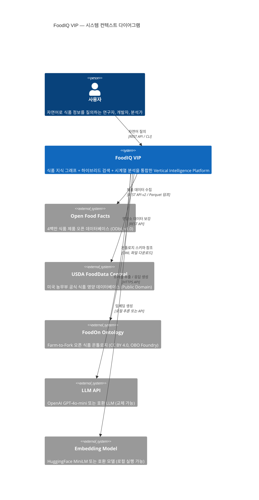

### 4.1 외부 의존성 요약

| 외부 시스템 | 역할 | 접근 방식 | 비용 | 교체 가능성 |
|------------|------|----------|------|------------|
| Open Food Facts | 핵심 식품 데이터 | REST API + Parquet | 무료 | 낮음 (유일한 대규모 오픈 데이터) |
| USDA FoodData Central | 영양소 보강 | REST API | 무료 | 중간 |
| FoodOn Ontology | 온톨로지 스키마 | OWL 파일 | 무료 | 낮음 (도메인 표준) |
| LLM API | 트리플 추출, 응답 생성 | HTTPS | 유료 (API 호출당) | **높음** (Settings.llm 교체) |
| Embedding Model | 벡터 생성 | 로컬 추론 | 무료 (로컬) | **높음** (Settings.embed_model 교체) |

---

## 5. 컨테이너 아키텍처 (C4 Level 2)

C4 Level 2는 FoodIQ VIP를 구성하는 실행 단위(컨테이너)와 그 책임, 통신 방식을 나타낸다.

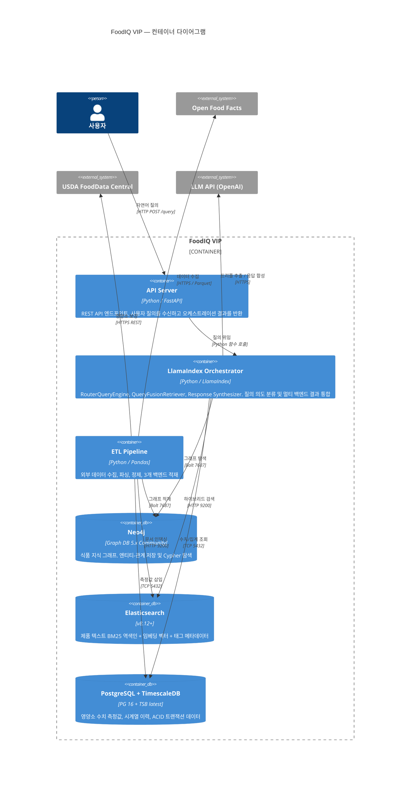

### 5.1 컨테이너 책임 정의

**API Server** 는 사용자와 시스템 사이의 단일 진입점이다. 인증, 요청 검증, 응답 직렬화를 담당하며, 비즈니스 로직은 오케스트레이터에 위임한다. FastAPI를 사용하며 OpenAPI 문서를 자동 생성한다.

**LlamaIndex Orchestrator** 는 VIP의 두뇌에 해당한다. 질의를 분류해 적절한 Retriever에 라우팅하고, 복수의 백엔드에서 수집된 결과를 Response Synthesizer로 통합해 최종 응답을 생성한다. 이 컨테이너는 상태를 갖지 않으며(stateless), 모든 컨텍스트는 질의 시점에 주입된다.

**ETL Pipeline** 은 외부 데이터 소스에서 데이터를 수집하고, 정제하고, 세 백엔드에 분산 적재하는 배치 프로세스다. LlamaIndex PropertyGraphIndex의 `from_documents()` 호출도 이 파이프라인의 일부로 실행된다. 오케스트레이터와 독립적으로 실행된다.

**Neo4j** 는 FoodOn 온톨로지를 실체화한 식품 지식 그래프를 저장한다. Bolt 프로토콜을 통해 Cypher 쿼리를 수신하고, LlamaIndex의 `Neo4jPropertyGraphStore`가 이 인터페이스를 추상화한다.

**Elasticsearch** 는 제품 설명과 성분 텍스트에 대한 BM25 역색인, 임베딩 벡터(dense_vector), 카테고리/알러겐/라벨 태그(keyword 필드)를 함께 저장한다. 단일 검색 요청에서 BM25와 kNN을 RRF로 결합하는 Hybrid Search를 지원한다.

**PostgreSQL + TimescaleDB** 는 100g당 영양소 수치 측정값과 그 시계열 이력을 저장한다. ACID 트랜잭션, Continuous Aggregate 자동 집계, 파티션 기반 시계열 필터링을 제공한다.

---

## 6. 컴포넌트 아키텍처 (C4 Level 3)

### 6.1 LlamaIndex Orchestrator 컴포넌트 구성

LlamaIndex Orchestrator 컨테이너 내부의 주요 컴포넌트와 그 의존 관계를 정의한다.

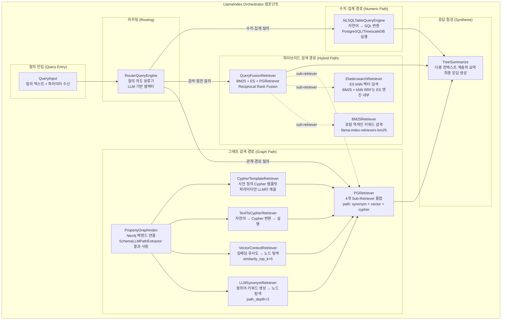

### 6.2 ETL Pipeline 컴포넌트 구성

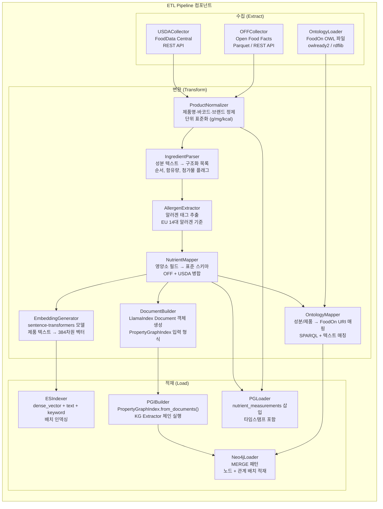

---

## 7. 온톨로지 아키텍처

### 7.1 FoodOn 참조 온톨로지와 도메인 온톨로지의 관계

FoodIQ VIP는 FoodOn을 직접 사용하지 않고, FoodOn에서 파생된 **도메인 온톨로지**를 정의한다. 이 관계는 OOP의 상속보다는 참조(reference)에 가깝다. FoodOn의 URI를 `foodon_uri` 속성으로 보존하여 원본 온톨로지와의 연결성을 유지한다.

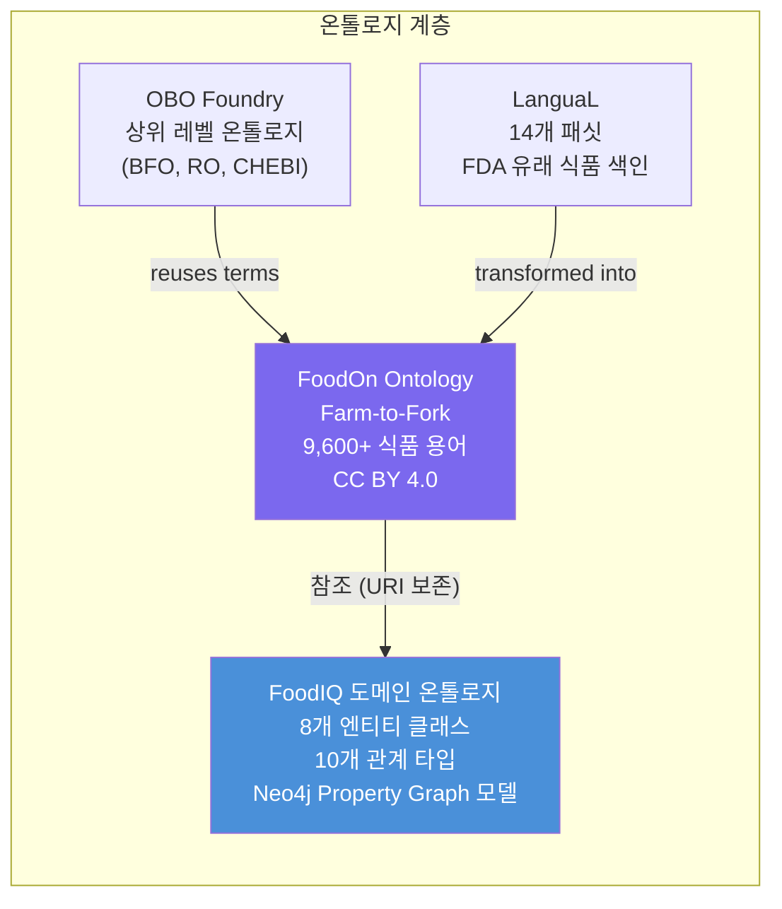

### 7.2 도메인 온톨로지 클래스 계층

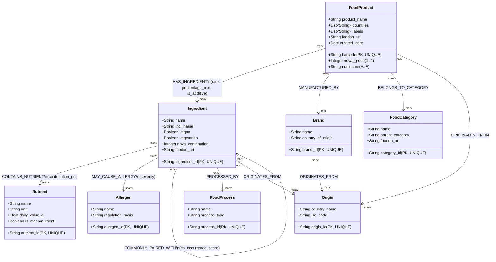

### 7.3 관계 속성 명세

| 관계 | 속성 | 타입 | 설명 |
|------|------|------|------|
| `HAS_INGREDIENT` | `rank` | Integer | 성분 목록 순서 (1 = 주성분) |
| | `percentage_min` | Float | 최소 함유 비율 (%) |
| | `is_additive` | Boolean | 식품 첨가물(E number) 여부 |
| | `source_text` | String | 원본 레이블 표기 원문 |
| `SUBSTITUTABLE_WITH` | `substitution_type` | String | "flavor" \| "function" \| "allergen-free" |
| | `similarity_score` | Float | 0.0 ~ 1.0 |
| | `context` | String | "baking" \| "dairy-free" 등 |
| `CONTAINS_NUTRIENT` | `contribution_pct` | Float | 전체 영양소 중 해당 성분의 기여율 |
| `MAY_CAUSE_ALLERGY` | `severity` | String | "certain" \| "possible" \| "trace" |
| `COMMONLY_PAIRED_WITH` | `co_occurrence_score` | Float | 동시 출현 빈도 기반 점수 |

---

## 8. 데이터 아키텍처

### 8.1 3개 백엔드의 데이터 모델 경계

각 백엔드가 저장하는 데이터의 경계와 정규화 원칙을 정의한다.

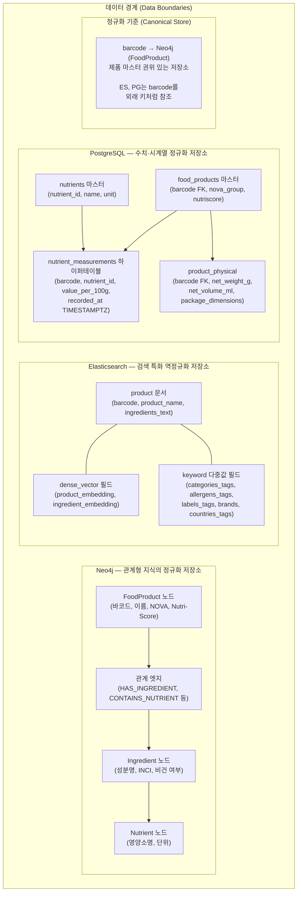

> **설계 원칙**: `barcode`는 세 백엔드를 연결하는 자연 조인 키(natural join key)다. Neo4j의 `FoodProduct` 노드가 정규화 기준(canonical store)이며, Elasticsearch와 PostgreSQL의 `barcode` 필드는 이를 참조한다. 데이터 불일치 발생 시 Neo4j를 기준으로 재동기화한다.

### 8.2 Elasticsearch 인덱스 매핑

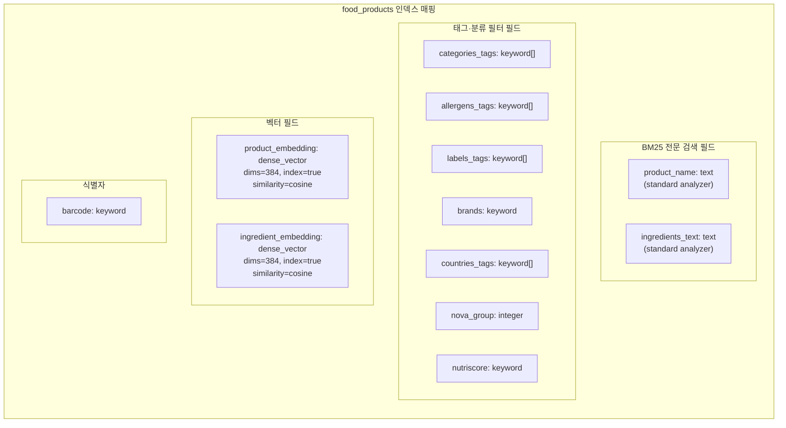

### 8.3 PostgreSQL 테이블 관계도 (ERD)

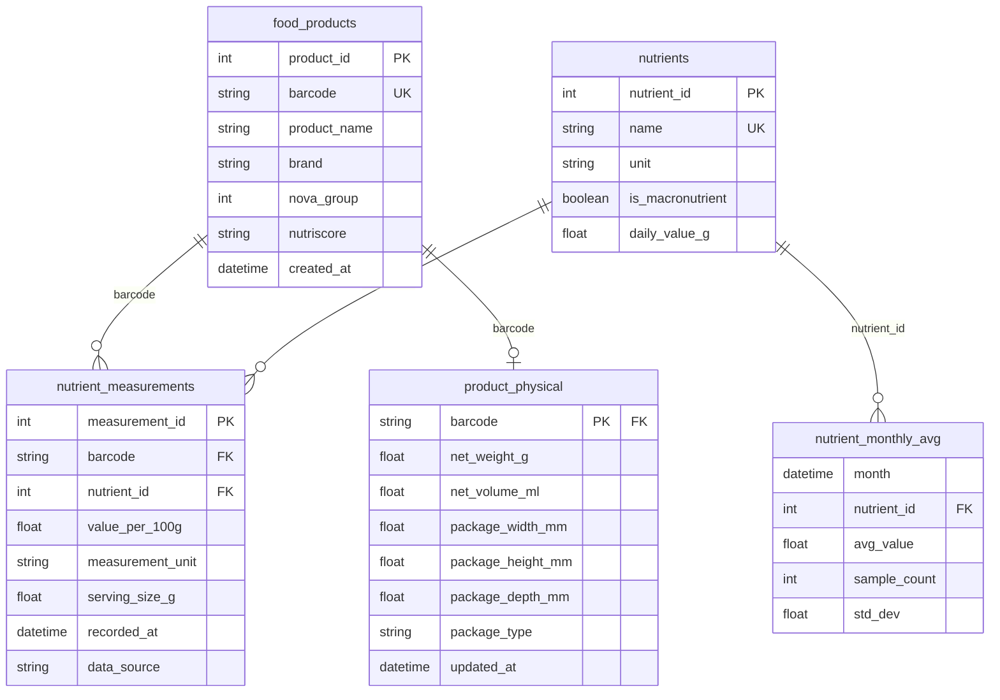

### 8.4 데이터 중복 허용 범위

세 백엔드 간에 일부 데이터는 의도적으로 중복 저장된다. 이 중복은 성능 목적의 역정규화이며, 정합성 책임을 명확히 정의한다.

| 데이터 항목 | 정규화 저장소 | 중복 저장소 | 중복 허용 사유 |
|------------|------------|-----------|------------|
| 제품 기본 정보 (barcode, name) | Neo4j | ES, PostgreSQL | 각 백엔드 독립 검색 성능 |
| NOVA group, Nutri-Score | Neo4j | ES, PostgreSQL | 필터링/집계 성능 |
| 카테고리·알러겐 태그 | Neo4j (관계) | ES (keyword 배열) | 태그 기반 고속 필터 |
| 영양소 이름 | PostgreSQL | Neo4j (Nutrient 노드) | 그래프 탐색 경로 완결성 |

---

## 9. 통합 및 인터페이스 아키텍처

### 9.1 LlamaIndex Retriever 인터페이스 계약

LlamaIndex의 모든 Retriever는 동일한 인터페이스를 구현한다. 이 계약이 백엔드 교체를 투명하게 만드는 핵심이다.

```
Interface: BaseRetriever
  Input:  QueryBundle(query_str: str, embedding: Optional[List[float]])
  Output: List[NodeWithScore(node: BaseNode, score: float)]

Implementations:
  LLMSynonymRetriever  → PropertyGraphStore (Neo4j Bolt)
  VectorContextRetriever → PropertyGraphStore (Neo4j Bolt)
  TextToCypherRetriever → PropertyGraphStore (Neo4j Bolt)
  CypherTemplateRetriever → PropertyGraphStore (Neo4j Bolt)
  BM25Retriever → In-memory index (nodes)
  ElasticsearchRetriever → Elasticsearch HTTP 9200
  NLSQLTableQueryEngine → PostgreSQL TCP 5432
```

### 9.2 백엔드 연결 파라미터

| 백엔드 | 프로토콜 | 기본 포트 | 인증 방식 | LlamaIndex 클래스 |
|--------|---------|---------|---------|-----------------|
| Neo4j | Bolt (WebSocket) | 7687 | username/password | `Neo4jPropertyGraphStore` |
| Elasticsearch | HTTP/REST | 9200 | 없음 (개발), API Key (운영) | `ElasticsearchVectorStore` |
| PostgreSQL | TCP | 5432 | username/password | `SQLDatabase` |
| LLM API | HTTPS | 443 | API Key (환경변수) | `OpenAI` (교체 가능) |
| Embedding Model | 로컬 추론 | - | 없음 | `HuggingFaceEmbedding` |

### 9.3 PropertyGraphIndex KG Extractor 체인 인터페이스

PropertyGraphIndex가 문서에서 트리플을 추출하는 Extractor 체인의 실행 순서와 우선순위를 정의한다.

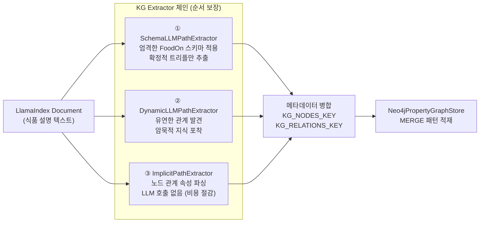

> **주의**: SchemaLLMPathExtractor는 `strict=True` 모드에서 스키마 외 트리플을 거부한다. DynamicLLMPathExtractor가 스키마 외 관계를 보완하며, 두 Extractor의 결과는 노드 ID를 기준으로 중복 제거 후 병합된다.

---

## 10. 데이터 흐름 아키텍처

### 10.1 수집(Ingest) 흐름: ETL 파이프라인

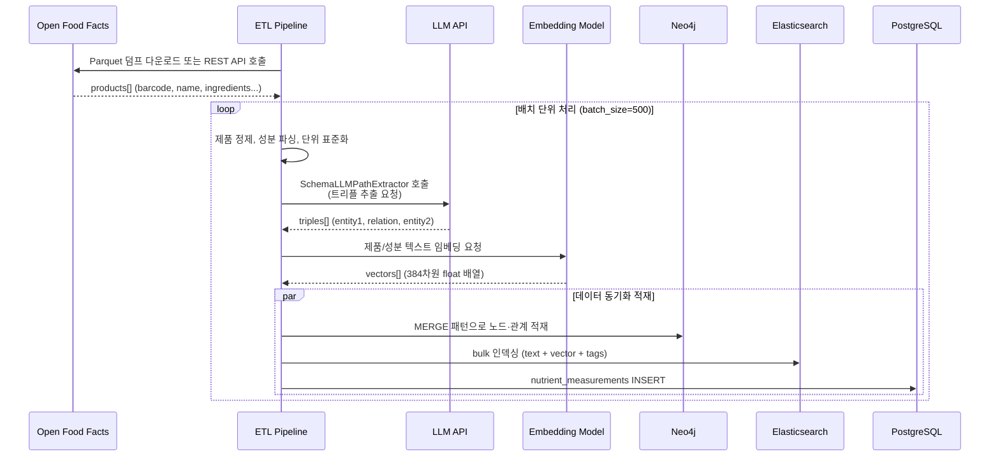

### 10.2 질의(Query) 흐름: 런타임 오케스트레이션

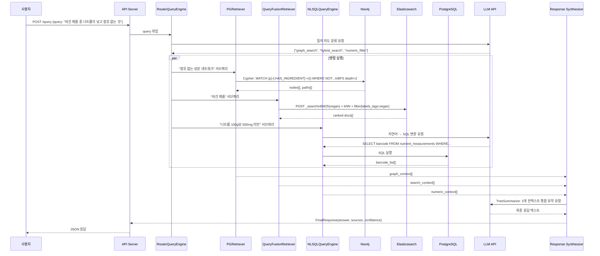

---

## 11. 배포 아키텍처

### 11.1 로컬 개발 환경 토폴로지

로컬 개발 환경은 Docker Compose 기반 단일 호스트 배포를 사용한다.

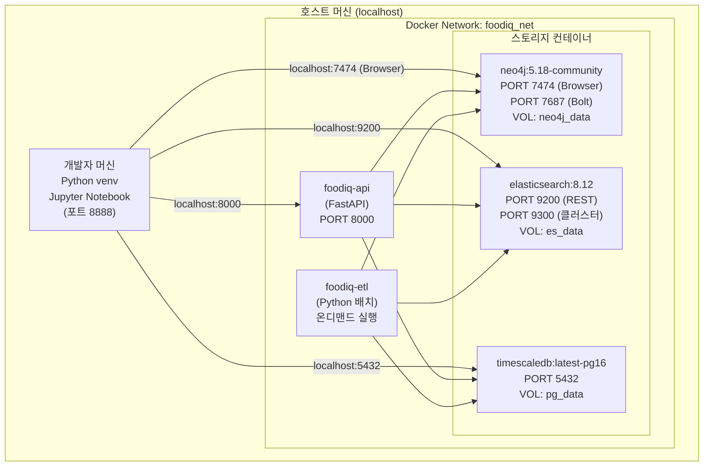

### 11.2 컨테이너 리소스 요구사항

| 컨테이너 | 최소 메모리 | 권장 메모리 | CPU | 영구 스토리지 |
|---------|-----------|-----------|-----|-------------|
| neo4j | 1 GB | 2 GB | 2 core | neo4j_data (5 GB+) |
| elasticsearch | 1 GB | 2 GB | 2 core | es_data (10 GB+) |
| postgresql | 512 MB | 1 GB | 1 core | pg_data (5 GB+) |
| foodiq-api | 512 MB | 1 GB | 1 core | 없음 |
| **합계** | **~3 GB** | **~6 GB** | 6 core | 20 GB+ |

> **최소 개발 환경**: 16 GB RAM, 4 core CPU, 50 GB SSD 권장. Apple Silicon(M2/M3) 또는 Intel 기반 모두 지원.

### 11.3 네트워크 포트 매핑

| 서비스 | 컨테이너 내부 포트 | 호스트 노출 포트 | 프로토콜 | 용도 |
|--------|-----------------|--------------|---------|------|
| Neo4j Browser | 7474 | 7474 | HTTP | 그래프 시각화 |
| Neo4j Bolt | 7687 | 7687 | Bolt/WebSocket | LlamaIndex 연결 |
| Elasticsearch | 9200 | 9200 | HTTP | REST API |
| Elasticsearch 클러스터 | 9300 | 9300 | TCP | 내부 전용 |
| PostgreSQL | 5432 | 5432 | TCP | 애플리케이션 연결 |
| FoodIQ API | 8000 | 8000 | HTTP | 사용자 인터페이스 |

---

## 12. 품질 속성 (NFR)

품질 속성은 기능 요구사항이 아닌 시스템의 비기능 요구사항을 정의한다. 각 속성에 대해 측정 가능한 목표치를 명시한다.

### 12.1 성능 (Performance)

| 시나리오 | 목표 응답 시간 | 측정 방법 |
|---------|-------------|---------|
| 단순 BM25 검색 (ES) | < 200ms | Elasticsearch `took` 필드 |
| 하이브리드 검색 (BM25 + kNN RRF) | < 500ms | ES `took` + 네트워크 |
| Neo4j 2단계 그래프 탐색 | < 1s | Cypher `PROFILE` |
| PropertyGraphIndex 전체 질의 (3 Retriever 병렬) | < 5s | End-to-End 측정 |
| PostgreSQL 시계열 집계 (1년 데이터) | < 2s | `EXPLAIN ANALYZE` |
| LLM 트리플 추출 (청크 1개) | < 3s | OpenAI API 응답 시간 |

### 12.2 확장성 (Scalability)

| 항목 | 목표 |
|------|------|
| 최소 처리 가능 제품 수 | 1,000건 (개발) / 50,000건 (테스트) / 500,000건 (목표) |
| 최소 처리 가능 성분 수 | 5,000건 (개발) / 200,000건 (목표) |
| ES 인덱스 최대 크기 | 10 GB (단일 샤드, 로컬) |
| Neo4j 최대 노드 수 | 100만 노드 (Community Edition 한계 이전) |
| PostgreSQL 하이퍼테이블 파티션 | 30일 단위 (자동 관리) |

### 12.3 가용성 (Availability)

로컬 개발 환경에서는 단일 노드 구성으로 운영한다. 컨테이너 장애 시 Docker Compose의 `restart: unless-stopped` 정책으로 자동 재시작된다. 데이터 내구성은 Docker Named Volume으로 호스트 파일시스템에 영구 저장하여 보장한다.

### 12.4 유지보수성 (Maintainability)

| 항목 | 설계 결정 |
|------|---------|
| LLM 교체 용이성 | `Settings.llm`을 통한 단일 설정 포인트 |
| 임베딩 모델 교체 | `Settings.embed_model` 변경 + ES 인덱스 재빌드 |
| 온톨로지 확장 | FoodOn 신규 URI 추가 → Neo4j 노드 MERGE |
| 스토리지 백엔드 교체 | Retriever 인터페이스 구현체 교체 |
| 데이터 소스 추가 | ETL Collector 클래스 추가 |

---

## 13. 아키텍처 결정 기록 (ADR)

Architecture Decision Record(ADR)는 중요한 아키텍처 결정과 그 근거를 기록한다. 결정을 번복하거나 수정할 경우 이 섹션을 업데이트한다.

---

### ADR-001: 도메인으로 식품/영양 선택

**상태**: 승인됨

**컨텍스트**: Neo4j, Elasticsearch, PostgreSQL 3개 백엔드를 모두 의미 있게 활용하면서, 온톨로지 구축과 데이터 수집이 현실적으로 가능한 도메인이 필요했다.

**결정**: 식품/영양 도메인을 선택한다.

**근거**: FoodOn이라는 성숙한 오픈소스 온톨로지(CC BY 4.0)가 이미 존재하며, Open Food Facts 4백만 건 데이터가 ODbL v1.0으로 무료 제공된다. 각 제품에 g/kcal/mg 단위의 정형 수치 데이터가 표준화되어 있어 PostgreSQL 활용도가 높고, 성분 텍스트와 태그 데이터가 Elasticsearch에 자연스럽게 매핑된다.

**대안**: 와인 도메인(OIV 온톨로지, 데이터 수집 제한), 학술 논문(arXiv, 수치 데이터 빈약), 특허(KIPRIS/USPTO, 텍스트 복잡)를 검토했으나 데이터 수집 용이성과 3개 백엔드 활용 균형에서 식품 도메인에 뒤처졌다.

---

### ADR-002: LlamaIndex PropertyGraphIndex를 Neo4j 백엔드와 사용

**상태**: 승인됨

**컨텍스트**: 그래프 지식 베이스를 구축하고 LLM 기반 RAG와 통합하는 방법을 결정해야 했다.

**결정**: LlamaIndex의 PropertyGraphIndex를 사용하고, 백엔드로 Neo4jPropertyGraphStore를 지정한다.

**근거**: PropertyGraphIndex는 KG Extractor 체인, 다중 Retriever 결합, LLM 기반 Cypher 생성을 통합적으로 지원한다. Neo4jPropertyGraphStore는 Bolt 프로토콜로 직접 Neo4j에 연결하며, 임베딩을 Neo4j에 저장할 수 있어 별도의 벡터 스토어를 추가할 필요가 없다.

**트레이드오프**: LlamaIndex 버전에 따른 API 변동 위험이 있다. 이를 완화하기 위해 Retriever 인터페이스를 격리하고 버전을 `requirements.txt`에 고정한다.

---

### ADR-003: Elasticsearch를 BM25 + Vector 하이브리드 검색으로 사용

**상태**: 승인됨

**컨텍스트**: 텍스트 검색과 시맨틱 검색을 동시에 지원해야 한다. 단일 시스템으로 두 요구를 충족할지, 별도 시스템으로 분리할지 결정해야 했다.

**결정**: Elasticsearch 단일 클러스터에서 BM25와 kNN 벡터 검색을 RRF로 결합하는 Hybrid Search를 사용한다.

**근거**: ES 8.14+의 `retriever` API는 단일 쿼리에서 BM25와 kNN을 RRF로 결합하는 기능을 GA로 제공한다. 별도의 벡터 스토어(Pinecone, Weaviate 등)를 추가하지 않아도 되므로 인프라 복잡성이 낮아진다. BM25, kNN, RRF 모두 self-hosted ES에서 무료다.

**트레이드오프**: ELSER(Elastic의 시맨틱 모델)는 유료 구독이 필요하다. 대신 외부 임베딩 모델(HuggingFace MiniLM)로 벡터를 생성하고 `dense_vector` 필드에 저장하는 방식으로 시맨틱 검색을 무료로 구현한다.

---

### ADR-004: PostgreSQL + TimescaleDB를 수치·시계열 백엔드로 사용

**상태**: 승인됨

**컨텍스트**: 영양소 수치 데이터는 ACID 보장이 필요하고, 시계열 분석(연도별 나트륨 추세 등)을 지원해야 한다. 전용 시계열 DB(InfluxDB, Prometheus)와 RDBMS 중에서 선택해야 했다.

**결정**: PostgreSQL에 TimescaleDB 확장을 추가한 단일 스택을 사용한다.

**근거**: pgvector의 ACID 보장 사례에서 알 수 있듯, PostgreSQL의 트랜잭션 경계 안에서 벡터 데이터와 관계형 데이터를 함께 처리하는 패턴이 검증되었다. TimescaleDB의 Hypertable은 타임스탬프 기반 자동 파티셔닝으로 시계열 조회 성능을 보장하며, Continuous Aggregate로 월별 집계를 자동화한다. 단일 데이터베이스로 관리 부담을 줄인다.

**트레이드오프**: 수백만 건의 시계열 포인트에서 전용 시계열 DB(InfluxDB)보다 저장 효율이 낮을 수 있다. 그러나 현재 데이터 규모(최대 50만 제품)에서는 충분한 성능이 예상된다.

---

### ADR-005: FoodOn 온톨로지를 참조 모델로, Property Graph 모델로 변환하여 사용

**상태**: 승인됨

**컨텍스트**: FoodOn은 OWL 포맷의 RDF 기반 온톨로지다. Neo4j는 Property Graph 모델을 사용한다. 두 모델의 임피던스 불일치(Impedance Mismatch)를 어떻게 처리할지 결정해야 했다.

**결정**: FoodOn을 직접 Neo4j에 RDF로 적재하지 않고, FoodOn의 용어 체계와 관계 패턴을 참조하여 Property Graph 모델의 FoodIQ 도메인 온톨로지를 별도로 정의한다. FoodOn과의 연결은 각 노드의 `foodon_uri` 속성으로 보존한다.

**근거**: Neo4j의 neosemantics(n10s) 플러그인으로 OWL → Property Graph 직접 변환이 가능하지만, FoodOn의 전체 복잡성을 담기에는 Property Graph의 표현력이 제한적이다. 또한 FoodOn의 OWL 논리 추론(reasoner)을 Neo4j에서 재현하는 것은 범위를 벗어난다. 실용적인 도메인 모델을 직접 설계하고, FoodOn URI를 속성으로 저장함으로써 추후 FoodOn과의 통합 가능성을 열어둔다.

**트레이드오프**: OWL 추론 기능(예: 하위 클래스 자동 추론)을 사용할 수 없다. 이는 현재 요구사항에서 필요하지 않으므로 수용 가능하다.

---

### ADR-006: QueryFusionRetriever로 3개 백엔드를 RRF 방식으로 통합

**상태**: 승인됨

**컨텍스트**: 3개 백엔드의 검색 결과를 통합하는 방법으로 단순 점수 합산(Linear Combination)과 순위 기반 융합(RRF)을 검토했다.

**결정**: LlamaIndex의 QueryFusionRetriever를 `mode="reciprocal_rerank"`로 사용한다.

**근거**: BM25 스코어(무한 스케일), kNN 코사인 유사도([0,2] 스케일), Cypher 기반 결과(스코어 없음)는 스케일이 달라 단순 합산이 불안정하다. RRF는 절대 스코어가 아닌 순위(rank) 기반이므로 이질적인 스코어 스케일 문제를 해소한다. 또한 RRF는 `k` 파라미터 하나만 조정하면 되므로 단순하다.

---

## 14. 기술 스택 명세

### 14.1 소프트웨어 컴포넌트 버전 매트릭스

| 컴포넌트 | 역할 | 버전 | 라이선스 |
|---------|------|------|---------|
| Python | 런타임 | 3.11+ | PSF |
| LlamaIndex Core | RAG 오케스트레이션 | 0.10.x+ | MIT |
| llama-index-graph-stores-neo4j | Neo4j 통합 | 최신 | MIT |
| llama-index-vector-stores-elasticsearch | ES 통합 | 최신 | MIT |
| llama-index-retrievers-bm25 | BM25 검색 | 최신 | MIT |
| llama-index-llms-openai | LLM 인터페이스 | 최신 | MIT |
| llama-index-embeddings-huggingface | 임베딩 인터페이스 | 최신 | MIT |
| Neo4j Community Edition | 그래프 DB | 5.18+ | GPL v3 |
| Elasticsearch | 검색 엔진 | 8.12+ | SSPL/Elastic v2 |
| PostgreSQL | RDBMS | 16+ | PostgreSQL License |
| TimescaleDB | 시계열 확장 | 최신 오픈소스 | Timescale License |
| FastAPI | API 서버 | 0.110+ | MIT |
| sentence-transformers | 임베딩 모델 | 최신 | Apache 2.0 |
| neo4j Python Driver | Neo4j 클라이언트 | 5.x | Apache 2.0 |
| elasticsearch-py | ES 클라이언트 | 8.x | Apache 2.0 |
| psycopg2 | PostgreSQL 클라이언트 | 2.9+ | LGPL |
| pandas | 데이터 처리 | 2.x | BSD |
| pyarrow | Parquet 처리 | 최신 | Apache 2.0 |
| Docker | 컨테이너 런타임 | 24+ | Apache 2.0 |
| Docker Compose | 컨테이너 오케스트레이션 | v2+ | Apache 2.0 |

### 14.2 임베딩 모델 선택 근거

| 모델 | 차원 | 다국어 | 라이선스 | 권장 용도 |
|------|------|--------|---------|---------|
| `paraphrase-multilingual-MiniLM-L12-v2` | 384 | ✅ 50개 언어 | Apache 2.0 | 기본 권장 (한국어 포함) |
| `all-MiniLM-L6-v2` | 384 | ❌ 영어 전용 | Apache 2.0 | 영어 전용 고속 |
| `text-embedding-3-small` (OpenAI) | 1536 | ✅ | 유료 | 고품질, 비용 발생 |

기본 설정은 `paraphrase-multilingual-MiniLM-L12-v2`를 사용한다. 한국어 식품 데이터 처리 시 적합하며, 로컬 추론이 가능해 API 비용이 발생하지 않는다.

---

## 15. 아키텍처 제약 사항

다음 제약 사항은 이 아키텍처의 설계 범위와 경계를 명시한다.

**제약 1. Neo4j Community Edition 사용**
Neo4j Community Edition은 단일 노드 배포만 지원하며, Causal Cluster(고가용성 클러스터링), 역할 기반 접근 제어(RBAC), 암호화된 연결(TLS) 설정이 Enterprise Edition에서만 제공된다. 현재 아키텍처는 개발 및 연구 목적으로 설계되었으므로 Community Edition으로 충분하다.

**제약 2. Elasticsearch self-hosted (xpack.security.enabled=false)**
개발 환경에서는 보안 설정을 비활성화한다. 운영 환경 전환 시 API Key 기반 인증과 TLS를 활성화해야 한다.

**제약 3. LLM API 의존성**
SchemaLLMPathExtractor와 DynamicLLMPathExtractor는 LLM API 호출을 필요로 한다. 인터넷 연결이 없거나 API 한도 초과 시 ETL 파이프라인이 중단된다. 완전 오프라인 환경이 필요할 경우 로컬 LLM(Ollama + Llama 3.2)으로 `Settings.llm`을 교체한다.

**제약 4. TimescaleDB 클라우드 버전 미지원**
`pgvectorscale`의 `StreamingDiskANN` 인덱스는 Timescale Cloud에서만 지원된다. 로컬 환경에서는 표준 pgvector HNSW 인덱스를 사용한다.

**제약 5. FoodOn 온톨로지 추론 미지원**
OWL 기반 논리 추론(subclass inference, property chain 등)은 현재 아키텍처에서 지원하지 않는다. Neo4j Property Graph 모델의 Cypher 쿼리로 명시적 관계 탐색만 지원한다.

---

*이 아키텍처 정의서는 FoodIQ VIP 개발 가이드(VIP_Food_Intelligence_Platform_Guide.md)와 함께 참조되어야 한다. 구현 상세, 코드 예시, 테스트 전략은 해당 문서를 참조한다.*

*참조 표준: C4 Model (c4model.com), ADR (adr.github.io), FoodOn (foodon.org)*
