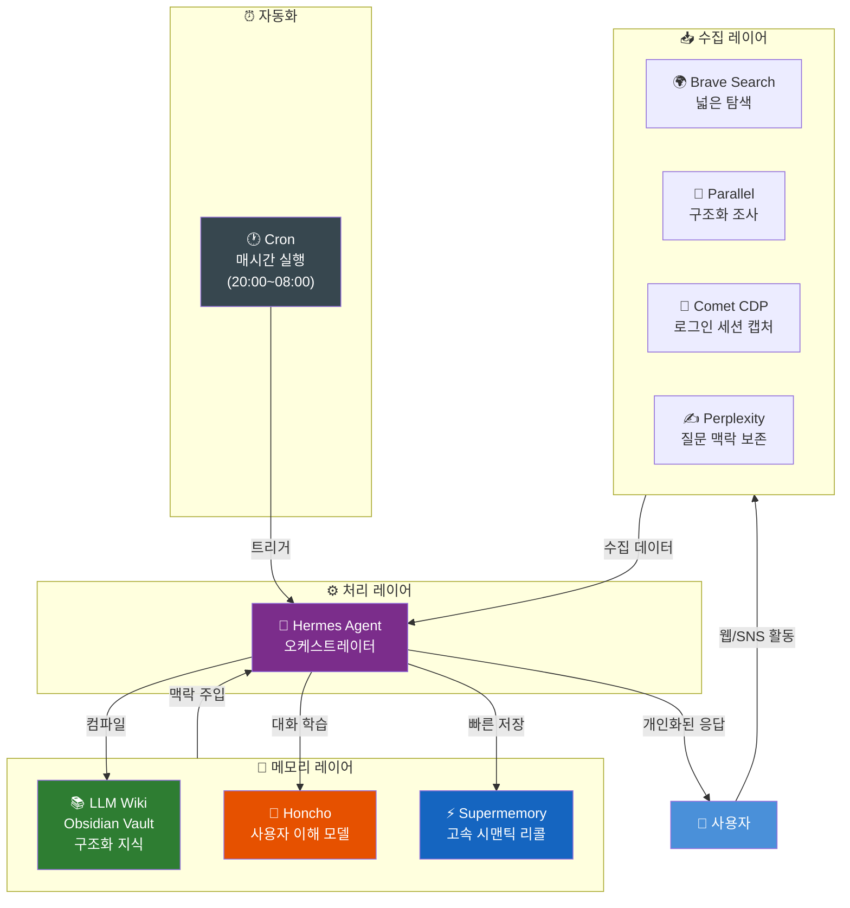
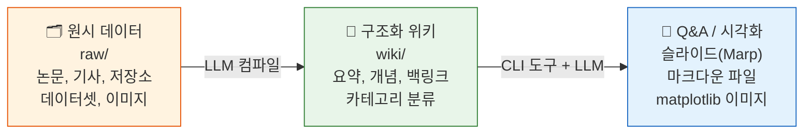
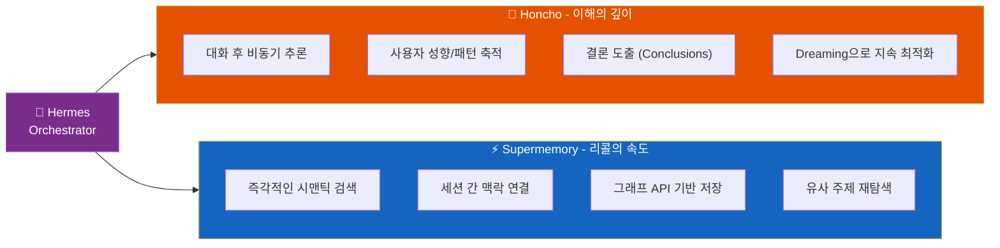
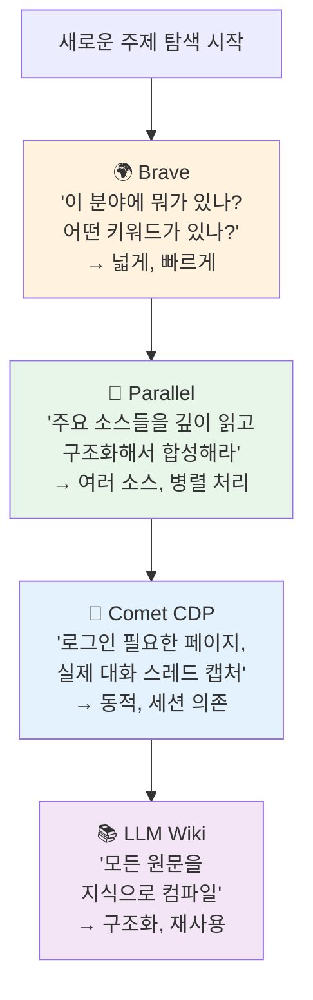
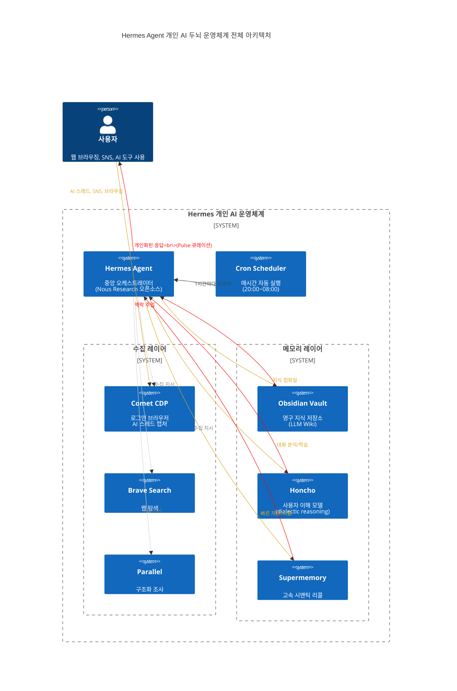
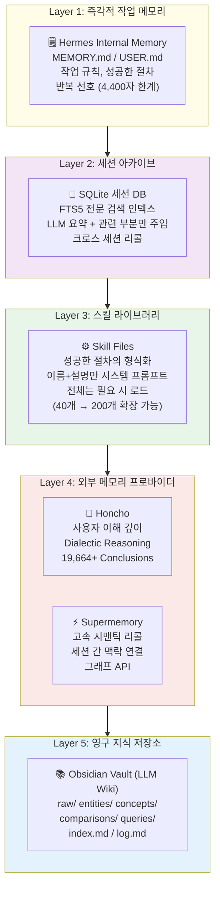
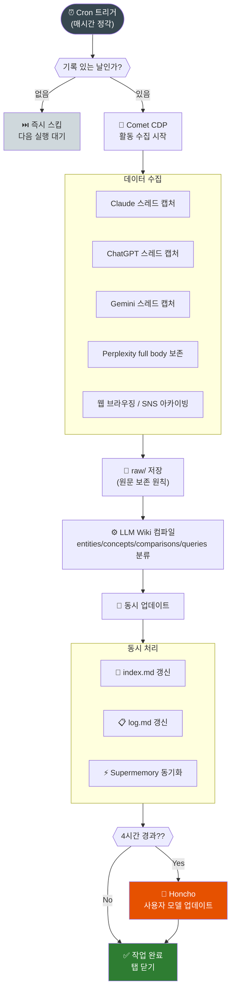
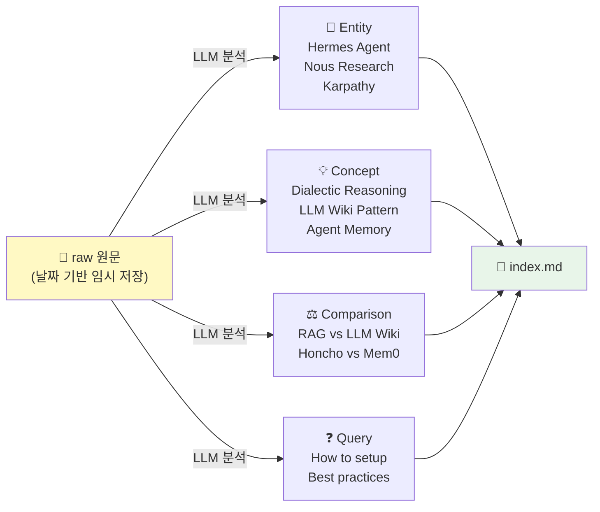
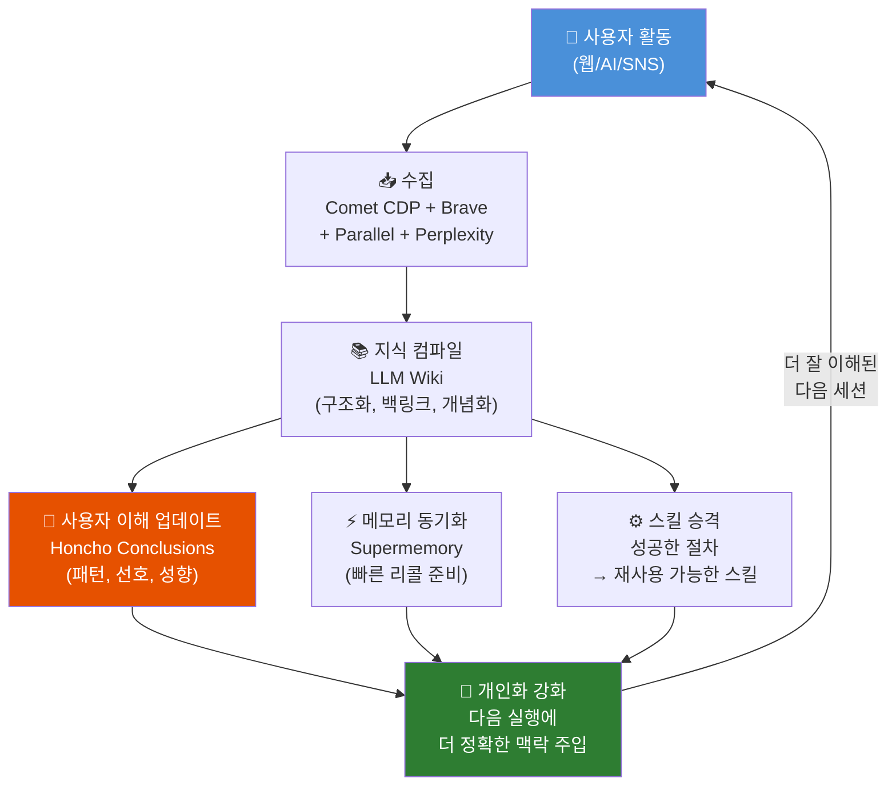
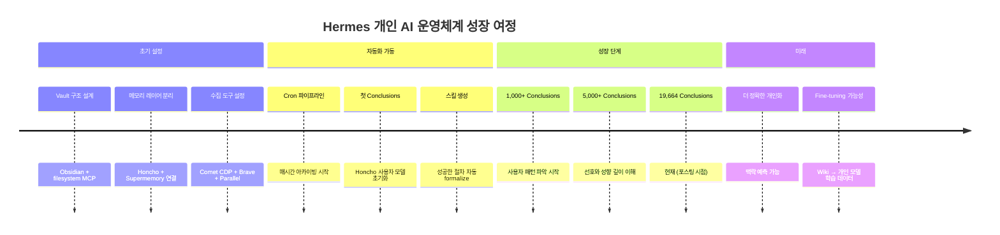

> **작성일**: 2025년 4월 15일  
> **출처**: Threads [@dayum_gud](https://www.threads.com/@dayum_gud/post/DW_Bdpxj2On) 포스팅 + 최신 공식 문서 기반  
> **핵심 주제**: Hermes Agent를 중심으로 한 자기 학습형 개인 AI 지식 운영체계

---
## 관련문서

[**Hermes Agent × LLM Wiki 시스템 완전 분석**](https://k82022603.github.io/posts/hermes-agent-llm-wiki-%EC%8B%9C%EC%8A%A4%ED%85%9C-%EC%99%84%EC%A0%84-%EB%B6%84%EC%84%9D/)

## 목차

1. [배경: 이 시스템은 왜 만들어졌는가](#1-배경)
2. [핵심 등장인물들: 주요 도구 개요](#2-주요-도구-개요)
3. [Hermes Agent: "함께 성장하는 에이전트"](#3-hermes-agent)
4. [LLM Wiki: Karpathy가 제안한 지식 컴파일 패러다임](#4-llm-wiki)
5. [Honcho: 추론하는 메모리 엔진](#5-honcho)
6. [Supermemory: 고속 시맨틱 리콜 엔진](#6-supermemory)
7. [검색 도구 생태계: Brave / Parallel / Comet CDP / Firecrawl](#7-검색-도구-생태계)
8. [전체 시스템 아키텍처](#8-전체-시스템-아키텍처)
9. [메모리 레이어 구조](#9-메모리-레이어-구조)
10. [Cron 기반 자동화 파이프라인](#10-cron-기반-자동화-파이프라인)
11. [LLM Wiki 지식 구조 설계](#11-llm-wiki-지식-구조-설계)
12. [학습 → 기억 → 재사용 루프](#12-학습--기억--재사용-루프)
13. [세팅 단계별 가이드](#13-세팅-단계별-가이드)
14. [이 시스템의 운영 철학](#14-이-시스템의-운영-철학)
15. [검증 체크리스트](#15-검증-체크리스트)
16. [총평: RAG를 넘어서](#16-총평)

---

## 1. 배경

### "기록은 많은데, 다시 꺼내 쓰지 못한다"

Threads에서 @dayum_gud 계정을 운영하는 사용자는 하루에도 수십 개의 AI 도구(Claude, ChatGPT, Gemini, Perplexity), 다양한 SNS 피드, 웹 브라우징을 통해 엄청난 양의 정보를 소비하고 있었다. 문제는 이 정보들이 제각각의 세션에 흩어져 있고, 세션이 끊기면 맥락도 함께 사라진다는 것이었다. 일반적인 AI 도구의 치명적인 한계, 즉 **"상태 없는(stateless) 에이전트"** 문제였다.

그는 이 문제를 해결하기 위해 **Hermes Agent**를 중심으로 여러 메모리 시스템과 검색 도구를 통합한 개인 AI 운영체계를 구축했다. 이 시스템은 단순히 정보를 저장하는 것이 아니라, **사용자 자신을 더 깊이 이해하는 학습 장치**로 설계되었다.

구체적인 성과로, 이 포스팅 시점에 해당 시스템은 이미 **19,664개의 conclusions(결론)**을 축적했다고 밝혔다. 이는 단순한 메모가 아니라 Honcho의 추론 엔진이 사용자의 대화 패턴을 분석해 도출한 인사이트들이다.

### 자동화 스케줄

매일 **20:00~익일 08:00** 사이, **매 1시간마다** Hermes가 자동으로 깨어나서 다음 작업을 수행한다:

- 사용자의 웹 브라우징 기록 아카이빙
- SNS 활동 수집
- Claude, ChatGPT, Gemini, Perplexity의 모든 스레드 아카이빙
- **4시간에 한 번씩** 이 아카이브를 바탕으로 사용자 이해 모델 업데이트

추가로 GPT Pro의 **Pulse** 기능을 통해 사용자의 최근 관심사 기반 아티클 큐레이션이 매일 배달된다.

---

## 2. 주요 도구 개요

이 시스템은 단일 도구가 아니라, **역할이 명확하게 분리된 7개 도구 생태계**로 구성된다.

| 도구 | 역할 | 핵심 기능 |
|------|------|-----------|
| **Hermes Agent** | 오케스트레이터 | 모든 도구를 연결하는 중앙 실행 에이전트 |
| **LLM Wiki (Obsidian)** | 지식 저장소 | 원문 → 구조화 지식으로 컴파일 |
| **Honcho** | 사용자 이해 엔진 | 대화 분석 → 사용자 모델 축적 |
| **Supermemory** | 고속 리콜 엔진 | 시맨틱 검색, 세션 간 맥락 연결 |
| **Brave Search** | 넓은 탐색 | 검색의 1차 입구, source discovery |
| **Parallel** | 구조화 조사 | 다중 소스 LLM-friendly 정리 |
| **Comet CDP** | 로그인 브라우저 | 세션 의존 동적 페이지 캡처 |



---

## 3. Hermes Agent

### 개요

Hermes Agent는 "함께 성장하는 에이전트(The Agent That Grows With You)"를 표방하는 오픈소스 에이전트로, 설치 후 메시징 계정을 연결하면 지속적인 개인 에이전트로 작동한다. Nous Research에서 개발했으며, GitHub에서 누적 48,000 스타를 기록하며 한 달간 트렌딩 1위를 유지했다.

### 핵심 차별점: "닫힌 학습 루프"

일반 AI 에이전트와 Hermes의 가장 큰 차이는 **세션이 끝난 후에도 무언가가 남는다**는 것이다.

Hermes는 닫힌 학습 루프(closed learning loop)를 갖추고 있다. 에이전트가 큐레이션하는 메모리, 주기적인 넛지, 복잡한 작업 후 자율적인 스킬 생성, 사용 중 스킬 자기 개선, LLM 요약을 통한 FTS5 크로스 세션 리콜, 그리고 Honcho 변증법적 사용자 모델링을 포함한다.

### 4계층 메모리 구조

Hermes Agent의 메모리 구조는 4개의 레이어로 이루어진다.

첫 번째는 MEMORY.md 파일로, 주요 사실들이 저장되는 즉각적인 접근 레이어다. 두 번째는 세션 아카이브로, 각 대화가 SQLite 데이터베이스에 기록되고 전문 검색 인덱스를 통해 검색된다. 과거 맥락이 필요할 때 Hermes는 능동적으로 쿼리를 시작하고, LLM을 통해 검색 결과를 요약한 뒤 현재 작업과 관련된 부분만 주입한다.

세 번째는 스킬 파일로, 이는 학습 루프의 출력물이다. 기본적으로 시스템 프롬프트에는 스킬의 이름과 간단한 설명만 로드되고, 전체 텍스트는 필요 시에만 로드된다. 이 설계 덕분에 스킬 라이브러리가 40개에서 200개로 늘어나도 컨텍스트 비용은 거의 변하지 않는다.

네 번째는 Honcho로, 선택적인 사용자 모델링 레이어이며 세션 전반에 걸쳐 사용자의 선호도, 소통 스타일, 도메인 지식을 수동적으로 축적한다.

### 플랫폼 지원

Hermes는 CLI, Telegram, Discord, Slack, WhatsApp, Signal, Matrix, Mattermost, Email, SMS, DingTalk, Feishu, WeCom, BlueBubbles, Home Assistant 등 15개 이상의 플랫폼을 단일 게이트웨이에서 지원한다. 또한 로컬, Docker, SSH, Daytona, Singularity, Modal 등 6가지 터미널 백엔드를 지원해 노트북이 아닌 어디서든 실행 가능하다.

### LLM Wiki와의 연동

Hermes Agent는 이제 Karpathy의 LLM-Wiki를 기본 내장 스킬로 제공한다. Hermes는 웹, 코드, 논문 등을 학습해 단시간 내에 대규모 연구 작업물을 Obsidian으로 생성할 수 있다.

---

## 4. LLM Wiki

### Karpathy의 제안

Andrej Karpathy는 다양한 연구 주제에 대해 LLM을 활용한 개인 지식 베이스를 구축하는 방법을 공유했다. 최근 그의 토큰 처리량의 상당 부분이 코드 조작보다 지식 조작에 투입되고 있다고 밝혔다. 그는 Obsidian을 IDE "프론트엔드"로 사용해 원시 데이터, 컴파일된 위키, 파생된 시각화를 확인한다. 중요한 점은 LLM이 위키의 모든 데이터를 작성하고 유지하며, 그가 직접 수정하는 경우는 거의 없다는 것이다.

### RAG를 넘어서는 새로운 패러다임

대부분의 노트 앱은 인간이 읽을 수 있도록 설계되어 있다. LLM 위키는 모델이 사용자를 대신해 읽을 수 있도록 최적화되어 있다. 이 전환은 정보를 구조화하는 방식 전체를 바꾼다. LLM은 폴더 계층이나 태그에 관심 없다. 텍스트를 읽는다. 그래서 최소한의 문법만 있는 텍스트인 플레인 마크다운이 이상적인 포맷이 된다.

Vector DB 접근 방식은 매우 빠른 지게차 운전사가 있는 거대하고 정리되지 않은 창고와 같다. 무엇이든 찾을 수 있지만 왜 거기 있는지, 옆에 있는 팔레트와 어떤 관계인지 알 수 없다. Karpathy의 마크다운 위키는 오래된 책을 설명하는 새로운 책을 지속적으로 쓰는 큐레이터가 있는 도서관에 가깝다.

### 3단계 작동 방식



데이터 수집 단계에서는 원시 데이터를 raw/ 디렉토리에 인덱싱한다. 그런 다음 LLM을 사용해 위키를 점진적으로 "컴파일"하는데, 이는 디렉토리 구조의 .md 파일 모음이다. 위키에는 raw/의 모든 데이터 요약, 백링크가 포함되고, 데이터를 개념별로 분류하고 글을 작성하며 모두 연결한다.

Q&A 단계에서는 위키가 충분히 커지면(예: 최근 연구에서 ~100개 기사, ~400K 단어), LLM 에이전트에게 위키에 대한 복잡한 질문을 할 수 있고 에이전트가 조사를 수행한다.

### 이 시스템에서의 LLM Wiki 활용 방식

일반 Karpathy 패턴과 달리, 이 시스템은 한 단계 더 나아간다. 단순한 연구 주제 지식 베이스가 아니라, **사용자의 일상 디지털 활동 전체를 아카이빙하고 사용자 자체를 이해하는 도구**로 LLM Wiki를 활용한다.

- **raw layer**: 원문 보존 (Perplexity 스레드, Claude 대화, 웹 브라우징 기록)
- **wiki layer**: 주제 중심 구조화 (entities / concepts / comparisons / queries)
- **index.md**: 전체 지식 지형도
- **log.md**: 작업의 흔적과 이력

---

## 5. Honcho

### "기억이 아니라 추론하는 메모리"

메모리 시스템은 사실을 저장한다. 그러나 사용자와 에이전트는 단순한 사실 이상이다. 그리고 사실은 토큰을 낭비한다. 중요한 맥락을 전달하려면 추론이 필요하다. Honcho는 단순히 데이터를 저장하는 것이 아니라 지속적으로 학습한다. 모든 메시지가 포괄적인 추론을 트리거하여 하위 작업에서 토큰을 절약한다.

### 핵심 메커니즘: Dialectic Reasoning (변증법적 추론)

Honcho는 AI 네이티브 메모리 백엔드로, Hermes의 내장 메모리 시스템 위에 변증법적 추론과 깊은 사용자 모델링을 추가한다. 단순한 키-값 저장 대신, Honcho는 대화가 끝난 후 교환 내용을 분석하고 "결론"을 도출한다. 이 결론들은 에이전트가 사용자에 대해 명시적으로 언급하지 않은 것까지 깊이 이해하도록 시간이 지남에 따라 축적된다.

멀티 에이전트 프로필 기능도 있다. 코딩 어시스턴트와 개인 어시스턴트처럼 여러 Hermes 인스턴스가 같은 사용자와 대화할 때, Honcho는 별도의 "피어" 프로필을 유지한다. 각 피어는 자신의 관찰과 결론만 보므로 맥락 오염이 방지된다.

### Neuromancer: 추론 모델

Honcho의 추론 모델인 Neuromancer는 명시적 사실을 넘어 학습한다. 상호작용 전반에 걸친 패턴, 새로운 데이터에 대해 테스트할 가설을 추론하여 토큰 절약과 더 풍부한 사용자 맥락을 제공한다.

### Dreaming: 백그라운드 비동기 추론

Honcho는 백그라운드에서도 추론한다. 비동기 추론이 자동으로 지속적으로 실행되어, 런타임 성능에 영향을 주지 않으면서 각 피어에 대한 Honcho의 이해를 지속적으로 최적화한다.

### 벤치마크 성과

Honcho는 100만 토큰 이상의 대용량 맥락을 다루는 BEAM 벤치마크에서 탁월한 성능을 보였다. 100만 토큰의 "방해물"을 추가했을 때도 약 2% 미만의 성능 저하만 보였으며, 이는 Honcho가 컨텍스트 윈도우 한계를 넘어 추론할 수 있는 능력을 확장한다는 증거다.

### 이 시스템에서 Honcho가 학습하는 것들

- 사용자가 무엇에 끌리는가
- 어떤 주제를 반복적으로 탐구하는가
- 어떤 말투와 표현을 선호하는가
- 어떤 기준으로 의사결정을 내리는가
- 무엇을 싫어하거나 피하는가

---

## 6. Supermemory

### 역할: 고속 시맨틱 리콜 엔진

Supermemory는 Hermes의 메모리 프로바이더 중 하나로, 프로필 리콜, 시맨틱 검색, 명시적 메모리 도구, Supermemory 그래프 API를 통한 세션 종료 시 대화 수집을 제공하는 시맨틱 장기 메모리 시스템이다.

Honcho가 **"깊이"** 를 담당한다면, Supermemory는 **"속도"** 를 담당한다. Honcho가 사용자의 패턴과 성향을 느리지만 깊이 이해하는 동안, Supermemory는 빠른 의미 기반 검색으로 관련 맥락을 즉각 불러온다.

### Honcho vs Supermemory 역할 비교



---

## 7. 검색 도구 생태계

이 시스템에서 검색은 단일 도구가 아니라, 4개 도구가 역할을 나눠 수행한다.

### Brave Search: 탐색의 1차 입구

Brave Search는 **"지도를 그리는 도구"** 다. 특정 주제를 처음 탐색할 때, 어떤 이름이 있는지, 어떤 소스가 관련 있는지 빠르게 외곽선을 파악하는 데 사용한다. 결론을 내리는 도구가 아니라, **탐색 범위를 정하는 도구**다.

### Parallel: 구조화된 다중 소스 조사

Brave가 지도라면 Parallel은 **"읽고-추출하고-합성하는 작업장"** 이다. 여러 URL을 동시에 가져와 LLM이 읽기 좋은 형태로 변환하고, 다단계 리서치 흐름을 실행한다. "찾았다"가 아니라 **"읽을 수 있게 만들었다"** 에 가깝다.

### Comet CDP: 로그인된 현실을 보는 눈

웹에는 API만으로는 접근할 수 없는 영역이 있다. 로그인이 필요한 페이지, JavaScript 렌더링이 필요한 동적 앱, 세션 의존 데이터들이 그것이다. Comet CDP(Chrome DevTools Protocol)는 **실제 로그인된 브라우저를 직접 조작**하는 도구다. 세션을 유지하고, 동적 페이지를 열고, 실제 사용자가 보는 화면 그대로 스레드를 캡처한다.

이 시스템에서 가장 중요하게 사용되는 용도는 Perplexity, Claude, ChatGPT, Gemini의 **실제 대화 스레드 아카이빙**이다.

### Perplexity: 질문의 맥락을 보존하는 도구

Perplexity는 단순한 검색 도구가 아니다. 이 시스템에서는 **사용자가 어떻게 질문을 구성했는지, 어디서 탐구를 시작했는지, 어디서 멈췄는지**를 보여주는 공간으로 취급한다. 스레드 전체를 가볍게 요약하지 않고 **원문 수준으로 보존**하는 이유는, 이 맥락 자체가 LLM Wiki가 사용자를 이해하는 핵심 재료이기 때문이다.

### 도구별 적용 기준



---

## 8. 전체 시스템 아키텍처



---

## 9. 메모리 레이어 구조

이 시스템의 메모리는 단일 저장소가 아니라, **4개의 층**으로 역할이 명확히 분리된다.



### 레이어 간 역할 분담

| 레이어 | 속도 | 깊이 | 용량 | 목적 |
|--------|------|------|------|------|
| Internal Memory | ⚡ 즉각 | 낮음 | 4,400자 | 빈번한 사실 (타임존, 모델 등) |
| Session Archive | 🔍 빠름 | 중간 | 무제한 | 과거 대화 검색 |
| Skill Files | 📋 요청 시 | 높음 | 확장 가능 | 성공한 작업 절차 재사용 |
| Honcho | 🧠 비동기 | 매우 높음 | 무제한 | 사용자 심층 이해 |
| Supermemory | ⚡ 빠름 | 높음 | 무제한 | 시맨틱 검색 |
| LLM Wiki | 📚 영구 | 최고 | 무제한 | 구조화된 지식 |

---

## 10. Cron 기반 자동화 파이프라인

### 스케줄 설계

이 시스템의 자동화는 **낮 시간대를 피한 야간 집중 처리** 방식으로 설계된다.

```
cron 스케줄: 0 20-23,0-7 * * *
실행 시간: 매일 20:00, 21:00, 22:00, 23:00, 00:00, 01:00 ... 07:00
총 12번/일
```

- **20:00~23:59**: 당일 활동 수집 및 처리
- **00:00~07:59**: 백필(backfill) 및 깊은 분석
- **4시간에 한 번**: Honcho 사용자 이해 모델 업데이트
- **GPT-5.4 high** 모델 사용 (고품질 처리)

### 파이프라인 흐름도



### 처리 원칙

- **한 번에 하나의 recorded day만** 처리 (작업 품질 보장)
- 빈 날은 즉시 건너뜀 (효율성)
- 작업 완료된 탭은 즉시 닫음 (리소스 관리)
- Perplexity 스레드는 요약하지 않고 **full body 보존**
- 성공한 작업 절차는 **Skill로 승격**

---

## 11. LLM Wiki 지식 구조 설계

### 디렉토리 구조

```
obsidian-vault/
├── raw/                    # 원문 보존 (slug 기반, 날짜 파일명 금지)
│   ├── perplexity-thread-ai-agents.md
│   ├── claude-session-20250415.md
│   └── web-article-hermes-agent.md
│
├── entities/               # 사람, 서비스, 제품, 프로젝트
│   ├── hermes-agent.md
│   ├── karpathy-andrej.md
│   └── nous-research.md
│
├── concepts/               # 원리, 패턴, 정책, 구조
│   ├── agentic-memory-layers.md
│   ├── dialectic-reasoning.md
│   └── llm-wiki-pattern.md
│
├── comparisons/            # A vs B 비교
│   ├── rag-vs-llm-wiki.md
│   └── honcho-vs-supermemory.md
│
├── queries/                # 질문에 대한 축적된 답
│   ├── how-to-setup-hermes.md
│   └── best-practices-agent-memory.md
│
├── index.md               # 전체 지식 지형도 (항상 최신)
└── log.md                 # 작업 이력 (항상 최신)
```

### 구조화 원칙

날짜는 **파일명에 쓰지 않는다**. 날짜는 파일 내부의 metadata로만 처리한다. 이유는 지식은 날짜가 아니라 **주제와 개념**으로 조직되어야 하기 때문이다. 예를 들어 "2025-04-15의 Claude 대화"가 아니라 "Hermes Agent 설정 방법"이라는 개념 페이지로 누적·업데이트된다.



---

## 12. 학습 → 기억 → 재사용 루프

이 시스템의 진정한 강점은 **정적인 저장소가 아니라, 사용할수록 성장하는 동적 학습 루프**에 있다.



### 루프의 핵심 특성

**누적성**: 매 실행마다 이전 결과 위에 쌓인다. 결론이 결론을 만들고, 이해가 이해를 낳는다.

**자기 개선성**: 성공한 작업 방식은 스킬로 승격되어 다음 번에 자동 적용된다. 실패한 방식은 원인과 대안까지 기록된다.

**비선형적 성장**: 19,664개의 conclusions는 단순 누적이 아니다. Honcho의 Dreaming이 백그라운드에서 기존 결론들을 재분석하며 더 높은 차원의 통찰을 도출한다.

---

## 13. 세팅 단계별 가이드

포스팅에서 공유된 세팅 순서를 상세히 풀어서 설명한다.

### 1단계: Vault 구조 설계

```bash
# Obsidian Vault 생성
mkdir -p ~/hermes-vault/{raw,entities,concepts,comparisons,queries}
touch ~/hermes-vault/index.md
touch ~/hermes-vault/log.md

# filesystem MCP 연결 (Hermes ↔ Vault 동일 Vault 접근)
# hermes config에서 filesystem MCP 경로 설정
```

핵심 원칙: **하나의 단일 소스 오브 트루스**. 여러 위치에 분산하지 않는다.

### 2단계: 메모리 레이어 분리 설정

```yaml
# ~/.hermes/config.yaml 예시
memory:
  provider: honcho  # 또는 supermemory

honcho:
  observation: directional  # user→agent, agent→user 방향 구분
  peer_name: ""  # 플랫폼에서 자동 감지
```

**중요**: Hermes Internal Memory, Honcho, Supermemory, Vault 이 네 가지를 **절대 역할을 섞지 않는다**.

### 3단계: 검색 및 브라우저 도구 연결

```bash
# Hermes 도구 설정
hermes tools  # 도구 활성화 메뉴

# 활성화할 도구:
# - brave_search (넓은 탐색)
# - parallel_search (구조화 조사)
# - comet_cdp (로그인 세션 캡처)
# - firecrawl (대량 크롤링)
```

### 4단계: 수집 파이프라인 구성

Hermes에게 다음 프롬프트로 파이프라인 구성을 지시한다:

> "매일 기록된 날의 Claude, ChatGPT, Gemini, Perplexity 스레드를 Comet CDP로 캡처하고, Perplexity는 full body 보존, 나머지는 원문 수준으로 raw/에 저장한 뒤 wiki layer로 컴파일해라. index.md와 log.md는 항상 갱신해라."

### 5단계: Cron 설정

```bash
# Hermes 내장 Cron 사용
hermes cron add "0 20-23,0-7 * * *" \
  "daily archive and knowledge compilation" \
  --platform cli \
  --model gpt-4 (또는 선호 모델)
```

### 6단계: Honcho 연동

```bash
# Honcho 설정
hermes memory setup
# → "honcho" 선택
# → API 키 입력 (honcho.dev에서 발급)
```

Honcho가 매 대화 후 자동으로 사용자 모델을 업데이트한다. 4시간마다 Hermes가 직접 `honcho_conclude` 도구를 호출해 최신 아카이브 기반으로 결론을 추가한다.

### 7단계: 학습 루프 검증

```bash
# 현재 메모리 상태 확인
hermes honcho status

# Supermemory 프로필 확인
# → supermemory_profile 도구 호출

# Wiki 상태 점검
# → lint/health check 실행
# broken links, orphan pages, stale content 확인
```

---

## 14. 이 시스템의 운영 철학

포스팅 전체에 일관되게 흐르는 철학적 원칙들을 정리한다.

### 핵심 대립 쌍

| ❌ 하지 말아야 할 것 | ✅ 해야 할 것 |
|---------------------|--------------|
| 저장 | 이해 |
| 요약 | 보존 |
| 추정 | 원문 |
| 단발 처리 | 누적 |
| 검색 | 구조화 |
| 창고 | 밭 |

### "밭" 메타포

포스팅의 2번 슬라이드는 이 시스템의 본질을 한 문장으로 표현한다.

> "LLM wiki는 노트 폴더가 아니다. 생각의 무덤이 아니라, 생각이 다시 자라나는 밭이다."

단순히 정보를 쌓는 것이 아니라, 정보들이 서로 연결되고 새로운 통찰을 싹틔우는 **살아있는 시스템**을 만드는 것이 목표다.

### "분업" 원칙

> "만능 도구는 없다. 있는 건 '역할 분담'뿐이다."

각 도구는 잘 정의된 단 하나의 역할만 수행한다. 역할이 겹치면 시스템이 흐릿해진다. 이 원칙이 7개 도구를 하나의 유기적인 시스템으로 만드는 핵심이다.

### "자라나는 시스템" 원칙

자동화와 학습 시스템의 차이를 명확히 구분한다.

> "자동화가 아니다. 자라나는 시스템이다."

자동화는 반복 실행이고, 학습 시스템은 **매 실행마다 더 좋아지는** 것이다. Hermes는 매일 밤 작동하면서 사용자를 조금씩 더 깊이 이해하도록 설계되어 있다.

---

## 15. 검증 체크리스트

포스팅에서 제공된 검증 항목들을 실용적인 형태로 정리한다.

### 구조 검증

- [ ] Vault 경로가 하나로 고정되어 있는가?
- [ ] raw / entities / concepts / comparisons / queries / index.md / log.md 구조가 분리되어 있는가?
- [ ] 날짜 파일명이 사용되지 않는가? (날짜는 metadata로만)

### 수집 검증

- [ ] Perplexity 스레드가 full body 수준으로 보존되는가?
- [ ] Comet CDP가 로그인 세션 캡처에 실제로 작동하는가?
- [ ] Brave / Parallel / Firecrawl의 역할이 분리되어 있는가?

### 메모리 검증

- [ ] Honcho가 사용자 이해를 지속적으로 축적하고 있는가?
- [ ] Supermemory가 빠른 recall layer로 연결되어 있는가?
- [ ] Honcho와 Supermemory의 역할이 명확히 분리되어 있는가?

### 자동화 검증

- [ ] Cron이 20~23시, 0~7시 윈도우에서만 실행되는가?
- [ ] 빈 날을 즉시 스킵하는가?
- [ ] 한 번에 하나의 recorded day만 처리하는가?
- [ ] 작업 완료 후 탭을 닫는가?

### 학습 루프 검증

- [ ] 성공한 작업이 Skill로 승격되는가?
- [ ] 실패한 방법에 원인과 대안이 기록되는가?
- [ ] log.md와 index.md가 매 실행 후 갱신되는가?
- [ ] Conclusions 수가 지속적으로 증가하는가?

---

## 16. 총평

### RAG를 넘어선 "컴파일" 패러다임

이 시스템이 기존 RAG(Retrieval-Augmented Generation) 시스템과 근본적으로 다른 점은 **지식을 컴파일한다**는 개념에 있다.

RAG는 질문이 올 때마다 관련 청크를 검색해 맥락에 넣는다. 이는 매번 "처음부터" 이해하는 과정이다. 반면 LLM Wiki 패턴은 **지식을 한 번 컴파일해두고, 그 위에서 질문에 답하는 방식**이다. 합성된 개념, 연결된 백링크, 정리된 비교표가 이미 존재한다.

여기에 Honcho의 사용자 이해 레이어까지 더하면, 단순히 "무엇을 알고 있나"를 넘어 "이 사람은 어떤 맥락에서 이것을 알고 싶어하는가"까지 대답할 수 있게 된다.

### "Personal Operating System for Intelligence"

이 시스템의 궁극적인 목표는 **나를 가장 잘 이해하는 AI를 직접 키우는 것**이다.

현재 AI 도구들은 서비스 제공자의 관점에서 일반적인 사용자를 상대한다. 그러나 이 시스템은 반대다. AI가 **특정 사용자 한 명**을 매일 더 깊이 이해하도록 설계된 개인화된 학습 장치다.

19,664개의 conclusions는 그 여정의 현재 이정표다. 내일은 19,700개, 한 달 뒤에는 20,000개가 넘어가면서, 이 AI는 점점 더 나만의 두뇌 파트너가 되어간다.



---

## 참고 자료 및 도구 링크

| 도구 | 공식 링크 | 설명 |
|------|-----------|------|
| Hermes Agent | [hermes-agent.nousresearch.com](https://hermes-agent.nousresearch.com) | Nous Research 오픈소스 에이전트 |
| Hermes GitHub | [github.com/NousResearch/hermes-agent](https://github.com/NousResearch/hermes-agent) | 소스 코드 및 문서 |
| Honcho | [honcho.dev](https://honcho.dev) | Memory That Reasons |
| Honcho Docs | [docs.honcho.dev](https://docs.honcho.dev) | 공식 문서 |
| Karpathy LLM Wiki | [gist.github.com/karpathy](https://gist.github.com/karpathy/442a6bf555914893e9891c11519de94f) | 원본 아이디어 파일 |
| Supermemory | (Hermes memory setup에서 설정) | 시맨틱 메모리 엔진 |

---

*이 문서는 Threads @dayum_gud 포스팅과 Hermes Agent 공식 문서, Honcho 공식 문서, Karpathy LLM Wiki 원문을 바탕으로 작성되었습니다. (2025년 4월 기준 최신 정보 반영)*
