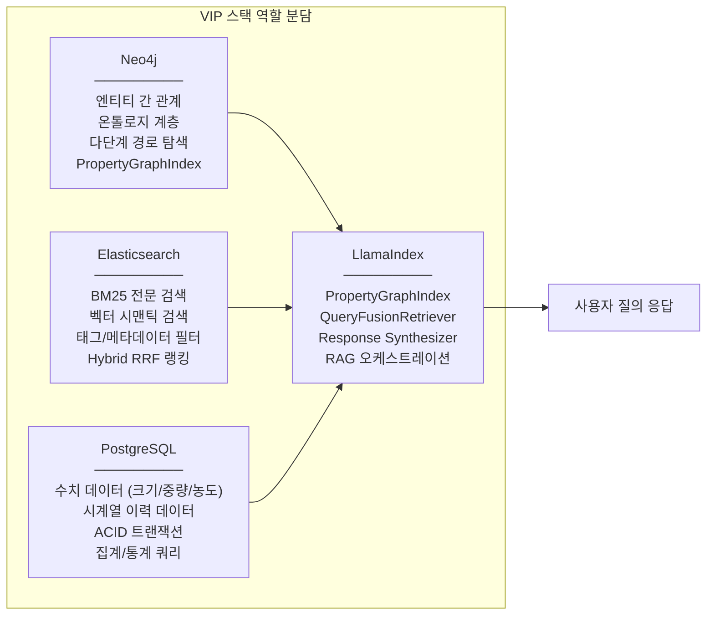
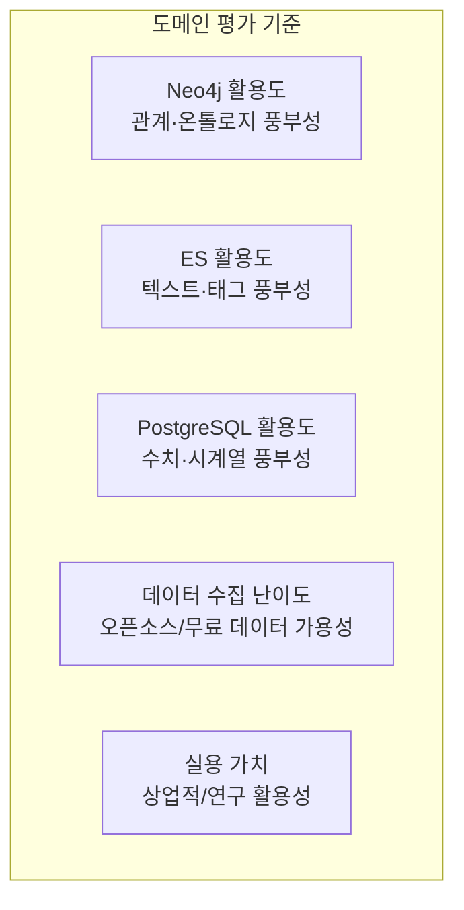
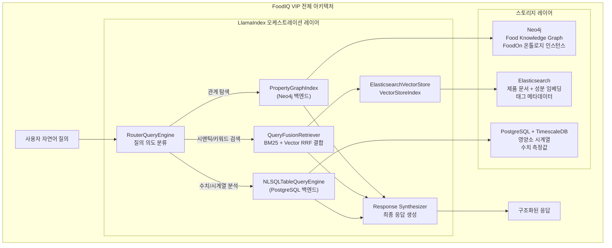
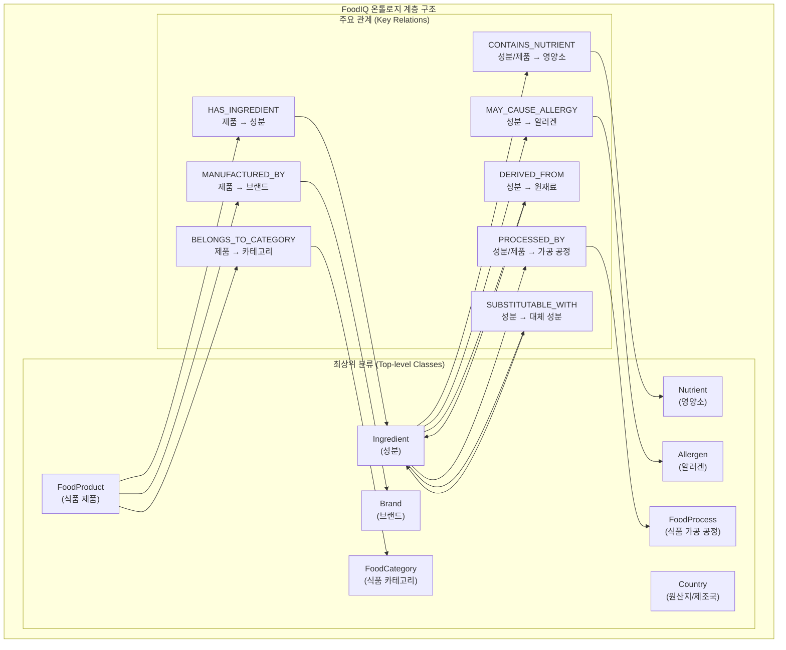
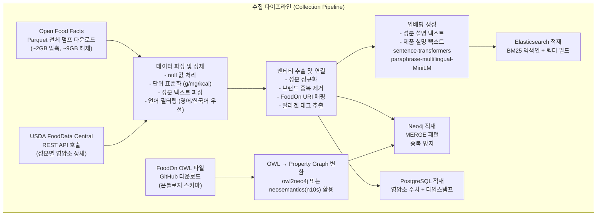
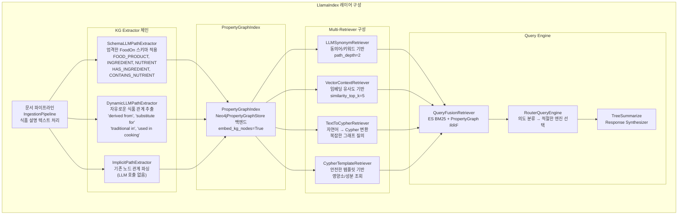
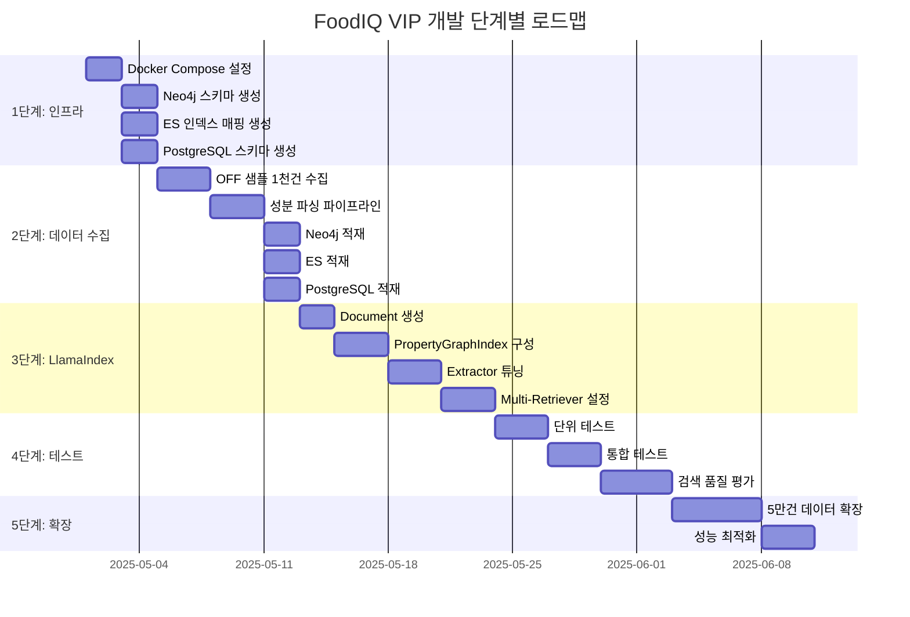
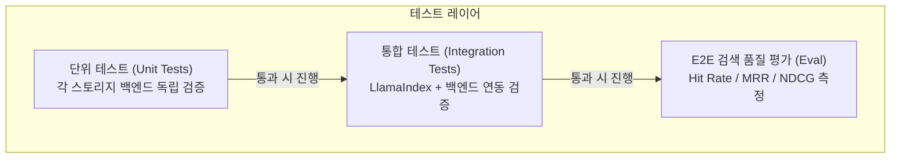

> **스택 전제조건**: Neo4j 그래프 + Elasticsearch BM25·Vector·태그 메타데이터 + PostgreSQL 시계열/수치 + LlamaIndex PropertyGraphIndex + FoodOn 기반 온톨로지
>
> **작성일**: 2026년 4월 기준

---

## 목차

1. [VIP 스택 조건 재확인](#1-vip-스택-조건-재확인)
2. [도메인 후보 분석 및 추천](#2-도메인-후보-분석-및-추천)
3. [최종 추천: 식품 인텔리전스 플랫폼 (Food Intelligence Platform)](#3-최종-추천-식품-인텔리전스-플랫폼)
4. [온톨로지 설계: FoodOn 기반 식품 지식 그래프](#4-온톨로지-설계)
5. [데이터 수집 전략](#5-데이터-수집-전략)
6. [3계층 스토리지 아키텍처 설계](#6-3계층-스토리지-아키텍처-설계)
7. [LlamaIndex PropertyGraphIndex 적용 설계](#7-llamaindex-propertygraphindex-적용-설계)
8. [개발 가이드: 단계별 구현](#8-개발-가이드-단계별-구현)
9. [테스트 가이드](#9-테스트-가이드)
10. [대안 도메인 요약](#10-대안-도메인-요약)
11. [프로젝트 로드맵](#11-프로젝트-로드맵)

---

## 1. VIP 스택 조건 재확인

이 가이드에서 구축하려는 플랫폼은 단순한 RAG 시스템이 아니다. 세 가지 이질적인 스토리지 백엔드가 각자의 강점 영역을 맡아 협력하는 **Vertical Intelligence Platform(VIP)** 이다. 도메인 선택 전에 각 백엔드가 플랫폼에서 담당할 역할을 명확히 하는 것이 중요하다.



이 스택이 진정한 가치를 발휘하려면, 도메인의 데이터가 세 백엔드를 모두 자연스럽게 채울 수 있어야 한다. 즉, **관계형 지식 구조** + **텍스트와 태그** + **수치/시계열 속성**이 동시에 풍부하게 존재하는 도메인이어야 한다.

---

## 2. 도메인 후보 분석 및 추천

도메인 선택의 평가 기준은 다섯 가지다. 각 백엔드 활용도, 온톨로지 성숙도, 데이터 수집 용이성, 실용적 가치, 그리고 LlamaIndex PropertyGraphIndex의 의미 있는 활용 가능성이다.



### 2.1 후보 도메인 비교표

| 도메인 | Neo4j (관계/온톨로지) | ES (텍스트/태그) | PostgreSQL (수치/시계열) | 데이터 수집 | 실용 가치 | 종합 |
|--------|----------------------|-----------------|--------------------------|-------------|-----------|------|
| **🥇 식품/영양** | ⭐⭐⭐⭐⭐ FoodOn 성숙한 온톨로지, 성분-식품-브랜드 관계 | ⭐⭐⭐⭐⭐ 성분 텍스트, 알러지/카테고리 태그 | ⭐⭐⭐⭐⭐ g/kcal/mg 수치, 제품 출시/단종 시계열 | ⭐⭐⭐⭐⭐ Open Food Facts 4M건 무료 | ⭐⭐⭐⭐⭐ 헬스케어·소매·식품안전 | **29/30** |
| **🥈 와인** | ⭐⭐⭐⭐⭐ 포도품종-지역-생산자 관계, OIV 온톨로지 | ⭐⭐⭐⭐⭐ 테이스팅 노트, 품종/지역 태그 | ⭐⭐⭐⭐ 빈티지(연도), 알코올%, 가격 시계열, 병 용량 | ⭐⭐ Vivino API 제한적 | ⭐⭐⭐⭐ 프리미엄 소비재 | **22/30** |
| **🥉 학술 논문** | ⭐⭐⭐⭐ 저자-논문-기관-인용 관계 | ⭐⭐⭐⭐⭐ 초록 텍스트, 키워드 태그 | ⭐⭐⭐ 발행일 시계열, 인용수, 페이지 수 | ⭐⭐⭐⭐⭐ arXiv/Semantic Scholar 무료 API | ⭐⭐⭐⭐ 연구/기업 R&D | **21/30** |
| **특허** | ⭐⭐⭐⭐ 발명자-기업-IPC분류 관계 | ⭐⭐⭐⭐⭐ 명세서 텍스트, IPC 코드 태그 | ⭐⭐⭐⭐ 출원/등록 시계열, 청구항 수 | ⭐⭐⭐⭐ KIPRIS/USPTO 무료 API | ⭐⭐⭐⭐⭐ IP 분석·기업 전략 | **21/30** |
| **의약품** | ⭐⭐⭐⭐⭐ DrugBank 온톨로지, 약-질환-유전자 관계 | ⭐⭐⭐⭐ 설명 텍스트, 치료분류 태그 | ⭐⭐⭐⭐ 분자량, 반감기, 용량 수치 | ⭐⭐⭐ DrugBank 연구용만 무료 | ⭐⭐⭐⭐⭐ 제약·헬스케어 | **21/30** |

### 2.2 식품/영양 도메인이 압도적으로 유리한 이유

식품 도메인은 다른 후보들이 하나씩 안고 있는 약점을 모두 해소한다. 와인은 데이터 수집이 어렵고, 학술 논문은 수치 데이터가 빈약하며, 특허는 텍스트 파싱이 복잡하고, 의약품은 데이터 라이선스 문제가 있다.

반면 식품 도메인은 FoodOn이라는 성숙한 오픈소스 온톨로지가 이미 존재하고, Open Food Facts라는 완전 무료 4백만 건 데이터셋이 있으며, 각 제품에는 그램(g), 킬로칼로리(kcal), 밀리그램(mg) 단위의 수치 데이터가 표준화되어 있다. 그리고 여기서 구축하는 플랫폼은 영양 분석, 식품 안전, 개인화 식단, 공급망 추적 등 다양한 상업적 응용이 가능하다.

---

## 3. 최종 추천: 식품 인텔리전스 플랫폼

### 3.1 플랫폼 개요

**FoodIQ - 식품 인텔리전스 플랫폼**은 다음과 같은 사용자 질문에 답할 수 있는 VIP다.

- "이 제품에 들어간 성분들이 서로 어떤 관계가 있나요?" → Neo4j 그래프 탐색
- "유기농 글루텐프리 시리얼 제품들을 추천해주세요" → ES BM25 + 태그 필터
- "이 성분의 알러지 위험도와 가장 유사한 대체 성분은?" → ES 벡터 검색
- "지난 5년간 초가공식품(NOVA 4)의 나트륨 함량 평균 추세는?" → PostgreSQL 시계열
- "이 레시피의 성분 네트워크에서 빠질 수 없는 핵심 성분은?" → PropertyGraphIndex



### 3.2 왜 이 플랫폼이 LxM, PropertyGraphIndex 실험에 최적인가

식품 도메인은 PropertyGraphIndex의 핵심 기능인 스키마 기반 트리플 추출을 가장 자연스럽게 활용할 수 있다. "감자 → 포함 → 전분", "전분 → 영양소 유형 → 탄수화물", "고혈압 → 위험 성분 → 나트륨"처럼 **엔티티-관계-엔티티** 패턴이 풍부하게 존재한다. 또한 LxM의 연구 철학처럼 다양한 AI 추론 경로(그래프 탐색 vs 벡터 검색 vs SQL 집계)를 비교 실험하기에도 이상적인 환경이다.

---

## 4. 온톨로지 설계

### 4.1 FoodOn 기반 참조 온톨로지

FoodOn은 OBO Foundry 컨소시엄이 구축한 Farm-to-Fork 오픈소스 온톨로지다. 2018년 출범 이후 지속 발전 중이며, 9,600개 이상의 식품 카테고리 용어와 LanguaL(1975년 FDA 유래)로부터 변환된 14개 패싯(facet)을 포함한다. 이 가이드에서는 FoodOn을 **참조 온톨로지**로 사용하되, Neo4j의 프로퍼티 그래프 모델에 맞게 실용적으로 변환한다.

FoodOn이 제공하는 핵심 관계 유형은 `has_ingredient`, `has_part`, `derives_from`, `produced_by`, `undergoes_process` 등이다. 이를 기반으로 아래 도메인 온톨로지를 설계한다.

### 4.2 FoodIQ 도메인 온톨로지 설계



### 4.3 엔티티 속성 정의

각 엔티티가 갖는 속성(Properties)을 명세한다. 이는 Neo4j 노드의 프로퍼티와 직접 매핑된다.

**FoodProduct 노드:**

| 속성명 | 타입 | 설명 | 예시 |
|--------|------|------|------|
| `barcode` | String | EAN/UPC 바코드 | "3017624010701" |
| `product_name` | String | 제품명 | "Nutella" |
| `nova_group` | Integer | NOVA 가공 단계 (1-4) | 4 |
| `nutriscore` | String | 영양 등급 (A-E) | "e" |
| `countries` | List[String] | 판매 국가 | ["France", "Korea"] |
| `labels` | List[String] | 인증 라벨 | ["organic", "fair-trade"] |
| `foodon_uri` | String | FoodOn 온톨로지 URI | "FOODON:03317982" |
| `created_date` | Date | 데이터베이스 등록일 | 2022-03-15 |

**Ingredient 노드:**

| 속성명 | 타입 | 설명 | 예시 |
|--------|------|------|------|
| `ingredient_id` | String | 고유 ID | "ING_SUGAR_001" |
| `name` | String | 성분명 | "Sugar" |
| `vegan` | Boolean | 비건 여부 | false |
| `vegetarian` | Boolean | 베지테리안 여부 | true |
| `nova_contribution` | Integer | NOVA 가공 기여도 | 3 |
| `foodon_uri` | String | FoodOn URI | "FOODON:00001164" |
| `inci_name` | String | INCI 표준명 | "SUCROSE" |

**Nutrient 노드:**

| 속성명 | 타입 | 설명 | 예시 |
|--------|------|------|------|
| `nutrient_id` | String | 고유 ID | "NUT_FAT_TOTAL" |
| `name` | String | 영양소명 | "Total Fat" |
| `unit` | String | 기본 단위 | "g" |
| `daily_value_pct` | Float | 일일 권장량 기준 % | 20.0 |
| `is_macronutrient` | Boolean | 거대영양소 여부 | true |

### 4.4 관계 속성 정의

Neo4j 관계(Edge) 자체도 속성을 가질 수 있다. 이를 활용하면 "어떤 제품에서, 어느 비율로 성분이 포함되었는가"를 표현할 수 있다.

**HAS_INGREDIENT 관계 속성:**

| 속성명 | 타입 | 설명 |
|--------|------|------|
| `rank` | Integer | 성분 목록 순서 (1=가장 많이 포함) |
| `percentage_min` | Float | 최소 함유 비율 (%) |
| `is_additive` | Boolean | 식품 첨가물 여부 |
| `source_text` | String | 원본 성분 표기 텍스트 |

**SUBSTITUTABLE_WITH 관계 속성:**

| 속성명 | 타입 | 설명 |
|--------|------|------|
| `substitution_type` | String | "flavor", "function", "allergen-free" |
| `similarity_score` | Float | 유사도 점수 (0-1) |
| `context` | String | "baking", "dairy-free", "low-sugar" |

---

## 5. 데이터 수집 전략

### 5.1 주요 데이터 소스

FoodIQ 플랫폼의 데이터는 세 가지 주요 오픈소스 데이터셋에서 수집한다. 모두 무료이고 라이선스 문제가 없다.

**① Open Food Facts (핵심 데이터)**

4백만 개 이상의 전 세계 식품 제품 데이터를 포함하며, Open Database License(ODbL v1.0) 하에 무료로 제공된다. REST API v2와 Parquet 포맷 전체 덤프 모두 지원한다. 각 제품에는 바코드, 제품명, 성분 목록 텍스트, 100g당 영양소 수치(에너지, 지방, 탄수화물, 단백질, 나트륨 등 44개 항목), 알러겐, NOVA 분류, Nutri-Score, 카테고리 태그, 국가, 브랜드 정보가 포함된다.

**② USDA FoodData Central (영양소 보강)**

미국 농무부의 공식 식품 영양 데이터베이스로, 식품 성분 수준의 상세 영양소 데이터를 제공한다. Open Food Facts의 영양소 데이터를 보강하고 검증하는 용도로 활용한다.

**③ FoodOn 온톨로지 (지식 그래프 스키마)**

OWL 포맷의 FoodOn 온톨로지를 다운로드해 Neo4j 스키마의 기준으로 활용한다. GitHub에서 무료로 다운로드 가능하다.

### 5.2 데이터 수집 파이프라인



### 5.3 데이터 수집 코드

```python
# 1. Open Food Facts Parquet 데이터 로딩
import pandas as pd
import requests
from datetime import datetime

# Hugging Face에서 Parquet 다운로드
OFF_PARQUET_URL = "https://huggingface.co/datasets/openfoodfacts/product-database/resolve/main/food.parquet"

def load_off_dataset(sample_size: int = 10000) -> pd.DataFrame:
    """Open Food Facts 데이터셋 로딩 (샘플 또는 전체)"""
    df = pd.read_parquet(OFF_PARQUET_URL)
    
    # 핵심 컬럼만 선택
    essential_cols = [
        'code',                    # 바코드
        'product_name',            # 제품명
        'ingredients_text',        # 성분 텍스트
        'categories_tags',         # 카테고리 태그
        'allergens_tags',          # 알러겐 태그
        'labels_tags',             # 라벨 태그 (organic, vegan 등)
        'brands',                  # 브랜드
        'countries_tags',          # 판매 국가
        'nova_group',              # NOVA 가공 단계 (1-4)
        'nutrition_grades',        # Nutri-Score (A-E)
        'quantity',                # 용량/중량
        'product_quantity',        # 제품 수량 (g/ml)
        # 영양소 수치 (100g 기준)
        'energy-kcal_100g',
        'fat_100g',
        'saturated-fat_100g',
        'carbohydrates_100g',
        'sugars_100g',
        'fiber_100g',
        'proteins_100g',
        'salt_100g',
        'sodium_100g',
        'created_t',               # 생성 타임스탬프
        'last_modified_t',         # 마지막 수정 타임스탬프
    ]
    
    available_cols = [c for c in essential_cols if c in df.columns]
    df = df[available_cols].dropna(subset=['product_name', 'ingredients_text'])
    
    if sample_size:
        df = df.sample(n=min(sample_size, len(df)), random_state=42)
    
    return df

# 2. 성분 텍스트 파싱
import re

def parse_ingredients(ingredients_text: str) -> list[dict]:
    """성분 텍스트를 구조화된 리스트로 파싱"""
    if not ingredients_text:
        return []
    
    # 기본 분리자로 성분 분할
    # 예: "Sugar, Palm Oil, _Milk_ Powder, Hazelnuts 13%, Cocoa 7.4%"
    raw_ingredients = re.split(r'[,;]\s*', ingredients_text)
    
    ingredients = []
    for rank, raw in enumerate(raw_ingredients, 1):
        # 퍼센트 추출
        pct_match = re.search(r'(\d+\.?\d*)\s*%', raw)
        percentage = float(pct_match.group(1)) if pct_match else None
        
        # 알러겐 표시 제거 (밑줄, 대문자 등)
        name = re.sub(r'[_*]', '', raw)
        name = re.sub(r'\(.*?\)', '', name)  # 괄호 제거
        name = re.sub(r'\d+\.?\d*\s*%', '', name)  # 퍼센트 제거
        name = name.strip().lower()
        
        if name and len(name) > 1:
            ingredients.append({
                'name': name,
                'rank': rank,
                'percentage': percentage,
                'is_additive': 'e' in name.lower() and any(c.isdigit() for c in name),
                'raw_text': raw.strip()
            })
    
    return ingredients

# 3. 데이터 품질 필터링
def filter_quality(df: pd.DataFrame) -> pd.DataFrame:
    """품질 기준으로 데이터 필터링"""
    # 영어 제품명 보유, 성분 텍스트 최소 20자, 영양소 데이터 30% 이상 보유
    df = df[df['product_name'].str.len() > 2]
    df = df[df['ingredients_text'].str.len() > 20]
    
    nutrient_cols = ['fat_100g', 'carbohydrates_100g', 'proteins_100g']
    df = df.dropna(subset=nutrient_cols, how='all')
    
    return df.reset_index(drop=True)
```

### 5.4 수집 데이터 규모 추정

실용적인 개발/테스트를 위한 데이터 규모 가이드라인은 다음과 같다.

| 단계 | 제품 수 | 성분 수 | 예상 용량 | 목적 |
|------|---------|---------|-----------|------|
| 개발용 | 1,000 | ~5,000 | 수십 MB | 빠른 이터레이션 |
| 테스트용 | 50,000 | ~50,000 | ~1 GB | 검색 품질 평가 |
| 프로덕션 | 500,000+ | ~200,000 | 10+ GB | 실제 서비스 |

---

## 6. 3계층 스토리지 아키텍처 설계

### 6.1 Neo4j: 식품 지식 그래프

Neo4j는 엔티티 간 다단계 관계 탐색을 담당한다. LlamaIndex의 PropertyGraphIndex가 이 Neo4j를 백엔드로 사용한다.

**Cypher 스키마 생성:**

```cypher
// 1. 제약 조건 및 인덱스 생성
CREATE CONSTRAINT product_barcode IF NOT EXISTS
  FOR (p:FoodProduct) REQUIRE p.barcode IS UNIQUE;

CREATE CONSTRAINT ingredient_id IF NOT EXISTS
  FOR (i:Ingredient) REQUIRE i.ingredient_id IS UNIQUE;

CREATE CONSTRAINT nutrient_id IF NOT EXISTS
  FOR (n:Nutrient) REQUIRE n.nutrient_id IS UNIQUE;

CREATE CONSTRAINT brand_name IF NOT EXISTS
  FOR (b:Brand) REQUIRE b.name IS UNIQUE;

// 전문 검색을 위한 텍스트 인덱스
CREATE TEXT INDEX ingredient_name_index IF NOT EXISTS
  FOR (i:Ingredient) ON (i.name);

CREATE TEXT INDEX product_name_index IF NOT EXISTS
  FOR (p:FoodProduct) ON (p.product_name);

// 2. FoodProduct 노드 생성 예시
MERGE (p:FoodProduct {barcode: '3017624010701'})
SET p.product_name = 'Nutella',
    p.nova_group = 4,
    p.nutriscore = 'e',
    p.labels = ['no-artificial-preservatives'],
    p.foodon_uri = 'FOODON:03317982',
    p.created_date = date('2020-01-15');

// 3. Ingredient 노드 생성 및 관계 설정
MERGE (i:Ingredient {ingredient_id: 'ING_SUGAR_001'})
SET i.name = 'sugar',
    i.vegan = true,
    i.vegetarian = true,
    i.nova_contribution = 3;

MERGE (p:FoodProduct {barcode: '3017624010701'})
MERGE (i:Ingredient {ingredient_id: 'ING_SUGAR_001'})
MERGE (p)-[r:HAS_INGREDIENT]->(i)
SET r.rank = 1,
    r.percentage_min = 55.9,
    r.is_additive = false;

// 4. 영양소 연결
MERGE (n:Nutrient {nutrient_id: 'NUT_SUGAR'})
SET n.name = 'Sugars',
    n.unit = 'g',
    n.is_macronutrient = false;

MERGE (i:Ingredient {ingredient_id: 'ING_SUGAR_001'})
MERGE (n:Nutrient {nutrient_id: 'NUT_SUGAR'})
MERGE (i)-[:CONTAINS_NUTRIENT {contribution_pct: 99.8}]->(n);

// 5. 그래프 탐색 쿼리 예시
// 특정 제품의 2단계 성분 네트워크
MATCH (p:FoodProduct {barcode: '3017624010701'})
-[:HAS_INGREDIENT]->(i:Ingredient)
-[:CONTAINS_NUTRIENT]->(n:Nutrient)
RETURN p.product_name, i.name, n.name, n.unit
ORDER BY i.name;

// 알러겐 경로 탐색
MATCH path = (p:FoodProduct)-[:HAS_INGREDIENT*1..3]->(i:Ingredient)
            -[:MAY_CAUSE_ALLERGY]->(a:Allergen {name: 'gluten'})
WHERE p.nova_group = 4
RETURN p.product_name, [node in nodes(path) | node.name] as path_names
LIMIT 10;
```

**Python에서 Neo4j 적재:**

```python
from neo4j import GraphDatabase
import pandas as pd

class FoodGraphLoader:
    def __init__(self, uri: str, user: str, password: str):
        self.driver = GraphDatabase.driver(uri, auth=(user, password))
    
    def load_product(self, tx, product: dict):
        """제품 노드 생성 (MERGE 패턴으로 중복 방지)"""
        query = """
        MERGE (p:FoodProduct {barcode: $barcode})
        SET p.product_name = $product_name,
            p.nova_group = $nova_group,
            p.nutriscore = $nutriscore,
            p.labels = $labels,
            p.created_date = date($created_date)
        RETURN p
        """
        return tx.run(query, **product)
    
    def load_ingredient_relations(self, tx, barcode: str, ingredients: list):
        """성분 관계 배치 적재"""
        query = """
        UNWIND $ingredients AS ing
        MERGE (i:Ingredient {ingredient_id: ing.ingredient_id})
        SET i.name = ing.name,
            i.vegan = ing.vegan,
            i.nova_contribution = ing.nova_contribution
        WITH i, ing
        MATCH (p:FoodProduct {barcode: $barcode})
        MERGE (p)-[r:HAS_INGREDIENT]->(i)
        SET r.rank = ing.rank,
            r.is_additive = ing.is_additive
        """
        return tx.run(query, barcode=barcode, ingredients=ingredients)
    
    def batch_load(self, df: pd.DataFrame, batch_size: int = 500):
        """데이터프레임을 배치로 Neo4j에 적재"""
        with self.driver.session() as session:
            for i in range(0, len(df), batch_size):
                batch = df.iloc[i:i+batch_size]
                for _, row in batch.iterrows():
                    product_data = {
                        'barcode': row['code'],
                        'product_name': row.get('product_name', ''),
                        'nova_group': int(row.get('nova_group', 0)) if pd.notna(row.get('nova_group')) else None,
                        'nutriscore': row.get('nutrition_grades', ''),
                        'labels': row.get('labels_tags', '').split(',') if pd.notna(row.get('labels_tags')) else [],
                        'created_date': str(pd.to_datetime(row.get('created_t', 0), unit='s').date()),
                    }
                    session.execute_write(self.load_product, product_data)
                    
                    ingredients = parse_ingredients(row.get('ingredients_text', ''))
                    if ingredients:
                        session.execute_write(self.load_ingredient_relations, row['code'], ingredients)
                
                print(f"Loaded batch {i//batch_size + 1}/{len(df)//batch_size + 1}")
```

### 6.2 Elasticsearch: 텍스트·태그·벡터 검색

```python
from elasticsearch import Elasticsearch
from sentence_transformers import SentenceTransformer
import json

# ES 인덱스 매핑 정의
PRODUCT_INDEX_MAPPING = {
    "mappings": {
        "properties": {
            "barcode": {"type": "keyword"},
            "product_name": {
                "type": "text",
                "analyzer": "standard",    # BM25 전문 검색
                "fields": {
                    "keyword": {"type": "keyword"}  # 정확한 매칭
                }
            },
            "ingredients_text": {
                "type": "text",
                "analyzer": "standard"     # BM25 성분 검색
            },
            "ingredient_names": {"type": "keyword"},  # 태그 형태 검색
            "categories_tags": {"type": "keyword"},   # 다중값 태그
            "allergens_tags": {"type": "keyword"},
            "labels_tags": {"type": "keyword"},       # organic, vegan 등
            "brands": {"type": "keyword"},
            "countries_tags": {"type": "keyword"},
            "nova_group": {"type": "integer"},
            "nutriscore": {"type": "keyword"},
            # 벡터 검색 필드 (dense_vector)
            "product_embedding": {
                "type": "dense_vector",
                "dims": 384,               # MiniLM-L6-v2 기준
                "index": True,
                "similarity": "cosine"
            },
            "ingredient_embedding": {
                "type": "dense_vector",
                "dims": 384,
                "index": True,
                "similarity": "cosine"
            }
        }
    },
    "settings": {
        "number_of_shards": 1,
        "number_of_replicas": 0,
        "analysis": {
            "analyzer": {
                "food_analyzer": {
                    "type": "custom",
                    "tokenizer": "standard",
                    "filter": ["lowercase", "stop", "snowball"]
                }
            }
        }
    }
}

class FoodESLoader:
    def __init__(self, es_url: str = "http://localhost:9200"):
        self.es = Elasticsearch(es_url)
        self.embed_model = SentenceTransformer('paraphrase-multilingual-MiniLM-L12-v2')
    
    def setup_index(self, index_name: str = "food_products"):
        """인덱스 생성"""
        if self.es.indices.exists(index=index_name):
            self.es.indices.delete(index=index_name)
        self.es.indices.create(index=index_name, body=PRODUCT_INDEX_MAPPING)
        print(f"Index '{index_name}' created.")
    
    def prepare_document(self, row: dict) -> dict:
        """ES 문서 준비 (임베딩 포함)"""
        # 임베딩 생성 대상 텍스트
        product_text = f"{row.get('product_name', '')} {row.get('ingredients_text', '')}"
        ingredient_text = row.get('ingredients_text', '')
        
        return {
            "barcode": row.get('code', ''),
            "product_name": row.get('product_name', ''),
            "ingredients_text": ingredient_text,
            "ingredient_names": [
                ing['name'] for ing in parse_ingredients(ingredient_text)
            ],
            "categories_tags": (row.get('categories_tags', '') or '').split(','),
            "allergens_tags": (row.get('allergens_tags', '') or '').split(','),
            "labels_tags": (row.get('labels_tags', '') or '').split(','),
            "brands": row.get('brands', ''),
            "countries_tags": (row.get('countries_tags', '') or '').split(','),
            "nova_group": int(row.get('nova_group', 0)) if row.get('nova_group') else None,
            "nutriscore": row.get('nutrition_grades', ''),
            # 벡터 임베딩 생성
            "product_embedding": self.embed_model.encode(product_text[:512]).tolist(),
            "ingredient_embedding": self.embed_model.encode(ingredient_text[:512]).tolist(),
        }
    
    def hybrid_search(self, query: str, tags: dict = None, top_k: int = 10) -> list:
        """BM25 + 벡터 하이브리드 검색 (RRF 결합)"""
        query_vector = self.embed_model.encode(query).tolist()
        
        # 태그 필터 구성
        tag_filters = []
        if tags:
            for field, values in tags.items():
                tag_filters.append({"terms": {field: values}})
        
        # RRF retriever 방식 (ES 8.16+ GA)
        search_body = {
            "retriever": {
                "rrf": {
                    "retrievers": [
                        # BM25 retriever
                        {
                            "standard": {
                                "query": {
                                    "bool": {
                                        "must": {"multi_match": {
                                            "query": query,
                                            "fields": ["product_name^2", "ingredients_text"]
                                        }},
                                        "filter": tag_filters
                                    }
                                }
                            }
                        },
                        # kNN vector retriever
                        {
                            "knn": {
                                "field": "product_embedding",
                                "query_vector": query_vector,
                                "num_candidates": 100,
                                "filter": tag_filters
                            }
                        }
                    ],
                    "rank_window_size": 50,
                    "rank_constant": 60
                }
            },
            "size": top_k
        }
        
        return self.es.search(index="food_products", body=search_body)
```

### 6.3 PostgreSQL: 영양소 수치 및 시계열

```sql
-- TimescaleDB 설치 및 하이퍼테이블 설정
CREATE EXTENSION IF NOT EXISTS timescaledb CASCADE;
CREATE EXTENSION IF NOT EXISTS pgvector;

-- 제품 기본 테이블
CREATE TABLE food_products (
    product_id      SERIAL PRIMARY KEY,
    barcode         VARCHAR(50) UNIQUE NOT NULL,
    product_name    TEXT NOT NULL,
    brand           TEXT,
    nova_group      SMALLINT CHECK (nova_group BETWEEN 1 AND 4),
    nutriscore      CHAR(1) CHECK (nutriscore IN ('a','b','c','d','e')),
    created_at      TIMESTAMPTZ NOT NULL DEFAULT NOW()
);

-- 영양소 마스터 테이블
CREATE TABLE nutrients (
    nutrient_id     SERIAL PRIMARY KEY,
    name            VARCHAR(100) UNIQUE NOT NULL,
    unit            VARCHAR(20) NOT NULL,
    is_macronutrient BOOLEAN DEFAULT FALSE,
    daily_value_g   FLOAT  -- 일일 권장량 (g 기준)
);

-- 영양소 측정값 테이블 (100g 기준, 시계열)
-- 이 테이블은 제품 데이터가 업데이트될 때마다 이력이 남음
CREATE TABLE nutrient_measurements (
    measurement_id  BIGSERIAL,
    barcode         VARCHAR(50) NOT NULL REFERENCES food_products(barcode),
    nutrient_id     INT NOT NULL REFERENCES nutrients(nutrient_id),
    value_per_100g  FLOAT NOT NULL,
    measurement_unit VARCHAR(20) NOT NULL DEFAULT 'g',
    serving_size_g  FLOAT,              -- 1회 제공량 (g)
    recorded_at     TIMESTAMPTZ NOT NULL DEFAULT NOW(),
    data_source     VARCHAR(50) DEFAULT 'open_food_facts'
);

-- TimescaleDB 하이퍼테이블로 변환 (recorded_at 기준 파티셔닝)
SELECT create_hypertable('nutrient_measurements', 'recorded_at',
    chunk_time_interval => INTERVAL '30 days');

-- 인덱스 생성
CREATE INDEX ON nutrient_measurements (barcode, nutrient_id, recorded_at DESC);
CREATE INDEX ON nutrient_measurements (recorded_at DESC);

-- 물리적 속성 테이블 (크기/중량 데이터)
CREATE TABLE product_physical (
    barcode             VARCHAR(50) PRIMARY KEY REFERENCES food_products(barcode),
    net_weight_g        FLOAT,      -- 순 중량 (g)
    net_volume_ml       FLOAT,      -- 순 부피 (ml)
    package_width_mm    FLOAT,      -- 패키지 너비 (mm)
    package_height_mm   FLOAT,      -- 패키지 높이 (mm)
    package_depth_mm    FLOAT,      -- 패키지 깊이 (mm)
    package_type        VARCHAR(50), -- 'bottle', 'box', 'bag', 'can'
    updated_at          TIMESTAMPTZ DEFAULT NOW()
);

-- 영양소 추세 분석을 위한 Continuous Aggregate (자동 집계)
CREATE MATERIALIZED VIEW nutrient_monthly_avg
WITH (timescaledb.continuous) AS
SELECT
    time_bucket('1 month', recorded_at) AS month,
    nutrient_id,
    ROUND(AVG(value_per_100g)::NUMERIC, 2) AS avg_value,
    COUNT(*) AS sample_count,
    ROUND(STDDEV(value_per_100g)::NUMERIC, 2) AS std_dev
FROM nutrient_measurements
GROUP BY month, nutrient_id;

-- 실시간 집계 정책 (매 1시간마다 자동 업데이트)
SELECT add_continuous_aggregate_policy('nutrient_monthly_avg',
    start_offset => INTERVAL '3 months',
    end_offset => INTERVAL '1 hour',
    schedule_interval => INTERVAL '1 hour');

-- 자주 사용하는 분석 쿼리 예시
-- NOVA 4 제품의 월별 평균 나트륨 추세
SELECT 
    nma.month,
    n.name AS nutrient_name,
    nma.avg_value,
    nma.sample_count
FROM nutrient_monthly_avg nma
JOIN nutrients n ON n.nutrient_id = nma.nutrient_id
JOIN food_products fp ON fp.barcode IN (
    SELECT DISTINCT nm.barcode 
    FROM nutrient_measurements nm 
    WHERE fp.nova_group = 4
)
WHERE n.name = 'sodium'
ORDER BY nma.month;
```

---

## 7. LlamaIndex PropertyGraphIndex 적용 설계

### 7.1 전체 LlamaIndex 구성



### 7.2 핵심 코드 구현

```python
from llama_index.core import PropertyGraphIndex, Settings, VectorStoreIndex
from llama_index.core.indices.property_graph import (
    SchemaLLMPathExtractor,
    DynamicLLMPathExtractor,
    ImplicitPathExtractor,
    LLMSynonymRetriever,
    VectorContextRetriever,
    TextToCypherRetriever,
    CypherTemplateRetriever,
    PGRetriever,
)
from llama_index.graph_stores.neo4j import Neo4jPropertyGraphStore
from llama_index.vector_stores.elasticsearch import ElasticsearchVectorStore
from llama_index.llms.openai import OpenAI
from llama_index.embeddings.huggingface import HuggingFaceEmbedding
from llama_index.core.retrievers import QueryFusionRetriever
from llama_index.retrievers.bm25 import BM25Retriever
from typing import Literal
from pydantic import BaseModel, Field


# =============================================
# 1. LLM 및 임베딩 모델 설정
# =============================================
Settings.llm = OpenAI(model="gpt-4o-mini", temperature=0.0)
Settings.embed_model = HuggingFaceEmbedding(
    model_name="paraphrase-multilingual-MiniLM-L12-v2"
)

# =============================================
# 2. FoodOn 기반 엄격한 스키마 정의
# =============================================
# 허용 엔티티 타입 (FoodOn 온톨로지 기반)
FoodEntities = Literal[
    "FOOD_PRODUCT",      # 식품 제품 (Nutella, Coca-Cola 등)
    "INGREDIENT",        # 성분 (Sugar, Palm Oil 등)
    "NUTRIENT",          # 영양소 (Protein, Fat, Sodium 등)
    "ALLERGEN",          # 알러겐 (Gluten, Peanut, Milk 등)
    "BRAND",             # 브랜드 (Nestlé, Unilever 등)
    "FOOD_CATEGORY",     # 카테고리 (Chocolate Spread, Dairy 등)
    "FOOD_PROCESS",      # 가공 공정 (Pasteurization, Fermentation 등)
    "ORIGIN",            # 원산지 (France, Korea 등)
]

# 허용 관계 타입 (FoodOn relations)
FoodRelations = Literal[
    "HAS_INGREDIENT",        # 제품/성분 → 성분
    "CONTAINS_NUTRIENT",     # 성분/제품 → 영양소
    "MAY_CAUSE_ALLERGY",     # 성분 → 알러겐
    "MANUFACTURED_BY",       # 제품 → 브랜드
    "BELONGS_TO_CATEGORY",   # 제품 → 카테고리
    "DERIVED_FROM",          # 성분 → 원재료 (e.g., Oil derived_from Palm)
    "PROCESSED_BY",          # 성분/제품 → 가공 공정
    "SUBSTITUTABLE_WITH",    # 성분 → 대체 가능 성분
    "ORIGINATES_FROM",       # 성분/제품 → 원산지
    "COMMONLY_PAIRED_WITH",  # 성분 → 같이 사용되는 성분
]

# 스키마: 어떤 엔티티가 어떤 관계를 가질 수 있는가
FOOD_SCHEMA = {
    "FOOD_PRODUCT": ["HAS_INGREDIENT", "MANUFACTURED_BY", "BELONGS_TO_CATEGORY", "ORIGINATES_FROM"],
    "INGREDIENT": ["CONTAINS_NUTRIENT", "MAY_CAUSE_ALLERGY", "DERIVED_FROM",
                   "PROCESSED_BY", "SUBSTITUTABLE_WITH", "ORIGINATES_FROM",
                   "COMMONLY_PAIRED_WITH", "HAS_INGREDIENT"],
    "NUTRIENT": ["BELONGS_TO_CATEGORY"],
    "ALLERGEN": [],
    "BRAND": ["ORIGINATES_FROM"],
    "FOOD_CATEGORY": [],
    "FOOD_PROCESS": [],
    "ORIGIN": [],
}

# =============================================
# 3. KG Extractor 설정
# =============================================
schema_extractor = SchemaLLMPathExtractor(
    llm=Settings.llm,
    possible_entities=FoodEntities,
    possible_relations=FoodRelations,
    kg_validation_schema=FOOD_SCHEMA,
    strict=True,
    num_workers=4,
    max_triplets_per_chunk=15,
)

dynamic_extractor = DynamicLLMPathExtractor(
    llm=Settings.llm,
    max_triplets_per_chunk=10,
    num_workers=4,
    allowed_entity_types=["FOOD_PRODUCT", "INGREDIENT", "NUTRIENT", "ALLERGEN"],
    allowed_relation_types=["HAS_INGREDIENT", "CONTAINS_NUTRIENT", "MAY_CAUSE_ALLERGY",
                            "DERIVED_FROM", "SUBSTITUTABLE_WITH"],
)

# =============================================
# 4. Neo4j PropertyGraphStore 연결
# =============================================
graph_store = Neo4jPropertyGraphStore(
    username="neo4j",
    password="your_password",
    url="bolt://localhost:7687",
    database="food_iq",
)

# =============================================
# 5. PropertyGraphIndex 구성
# =============================================
index = PropertyGraphIndex.from_documents(
    documents,  # 식품 설명 텍스트 Document 리스트
    kg_extractors=[schema_extractor, dynamic_extractor, ImplicitPathExtractor()],
    property_graph_store=graph_store,
    embed_kg_nodes=True,     # 그래프 노드에 임베딩 추가
    show_progress=True,
)

# =============================================
# 6. 다중 Retriever 구성
# =============================================

# 6-1. LLM 동의어 기반 리트리버
synonym_retriever = LLMSynonymRetriever(
    graph_store,
    llm=Settings.llm,
    include_text=True,
    max_keywords=10,
    path_depth=2,    # 식품 도메인은 2단계 관계가 중요 (제품→성분→영양소)
)

# 6-2. 벡터 컨텍스트 리트리버
vector_retriever = VectorContextRetriever(
    graph_store,
    embed_model=Settings.embed_model,
    include_text=True,
    similarity_top_k=5,
    path_depth=2,
)

# 6-3. TextToCypher (복잡한 그래프 질의)
cypher_retriever = TextToCypherRetriever(
    graph_store,
    llm=Settings.llm,
)

# 6-4. Cypher 템플릿 (안전한 영양소 조회)
class NutrientQueryParams(BaseModel):
    ingredient_names: list[str] = Field(
        description="조회할 성분 이름 목록"
    )
    nutrient_name: str = Field(
        description="조회할 영양소 이름 (e.g., 'Sodium', 'Sugar')"
    )

nutrient_cypher = """
MATCH (i:Ingredient)-[:CONTAINS_NUTRIENT]->(n:Nutrient)
WHERE i.name IN $ingredient_names AND n.name = $nutrient_name
RETURN i.name AS ingredient, n.name AS nutrient, n.unit
"""

template_retriever = CypherTemplateRetriever(
    graph_store,
    NutrientQueryParams,
    nutrient_cypher,
)

# 6-5. PGRetriever로 통합
pg_retriever = PGRetriever(
    sub_retrievers=[synonym_retriever, vector_retriever, cypher_retriever],
    use_async=True,
)

# =============================================
# 7. ES BM25 + PropertyGraph 융합
# =============================================
from llama_index.vector_stores.elasticsearch import ElasticsearchVectorStore
from llama_index.core import VectorStoreIndex, StorageContext

es_vector_store = ElasticsearchVectorStore(
    index_name="food_products",
    es_url="http://localhost:9200",
    dim=384,
)
storage_context = StorageContext.from_defaults(vector_store=es_vector_store)
es_index = VectorStoreIndex.from_vector_store(es_vector_store)
es_retriever = es_index.as_retriever(similarity_top_k=5)

# BM25 리트리버 (로컬)
bm25_retriever = BM25Retriever.from_defaults(nodes=nodes, similarity_top_k=10)

# 최종 QueryFusionRetriever: BM25 + ES Vector + PropertyGraph 결합
fusion_retriever = QueryFusionRetriever(
    [bm25_retriever, es_retriever, pg_retriever],
    similarity_top_k=10,
    num_queries=1,
    mode="reciprocal_rerank",
    use_async=True,
)

# =============================================
# 8. Query Engine 구성
# =============================================
from llama_index.core.query_engine import RetrieverQueryEngine
from llama_index.core.response_synthesizers import TreeSummarize

query_engine = RetrieverQueryEngine(
    retriever=fusion_retriever,
    response_synthesizer=TreeSummarize(verbose=True),
)
```

### 7.3 문서 준비: 식품 설명 텍스트 Document 생성

PropertyGraphIndex에 입력되는 Document는 식품 제품에 대한 풍부한 텍스트 설명이어야 한다. 단순 CSV 행을 그대로 사용하는 것보다, 구조화된 텍스트로 변환해 LLM이 트리플을 더 잘 추출하도록 하는 것이 핵심이다.

```python
from llama_index.core import Document

def create_food_document(row: dict) -> Document:
    """식품 제품 데이터를 LlamaIndex Document로 변환"""
    product_name = row.get('product_name', '')
    brand = row.get('brands', 'Unknown Brand')
    ingredients_text = row.get('ingredients_text', '')
    categories = (row.get('categories_tags', '') or '').replace(',', ', ')
    allergens = (row.get('allergens_tags', '') or '').replace('en:', '').replace(',', ', ')
    labels = (row.get('labels_tags', '') or '').replace(',', ', ')
    nova_group = row.get('nova_group', 'Unknown')
    nutriscore = (row.get('nutrition_grades', '') or '').upper()
    
    # 영양소 수치 포맷팅
    nutrients_text = ""
    nutrient_fields = {
        'energy-kcal_100g': 'Energy (kcal per 100g)',
        'fat_100g': 'Total Fat (g per 100g)',
        'saturated-fat_100g': 'Saturated Fat (g per 100g)',
        'carbohydrates_100g': 'Carbohydrates (g per 100g)',
        'sugars_100g': 'Sugars (g per 100g)',
        'proteins_100g': 'Protein (g per 100g)',
        'sodium_100g': 'Sodium (g per 100g)',
        'salt_100g': 'Salt (g per 100g)',
    }
    for field, label in nutrient_fields.items():
        val = row.get(field)
        if val and pd.notna(val):
            nutrients_text += f"  - {label}: {round(float(val), 2)}\n"
    
    # 풍부한 텍스트 생성 (LLM 트리플 추출 최적화)
    text = f"""Product: {product_name}
Brand: {brand}
Category: {categories}
NOVA Processing Group: {nova_group} (1=unprocessed, 4=ultra-processed)
Nutri-Score: {nutriscore}

Ingredients:
{ingredients_text}

Allergen Information:
Contains: {allergens if allergens else 'None declared'}

Labels and Certifications:
{labels if labels else 'None'}

Nutritional Information (per 100g):
{nutrients_text if nutrients_text else 'Data not available'}

Barcode: {row.get('code', '')}
"""
    
    return Document(
        text=text,
        metadata={
            "barcode": row.get('code', ''),
            "product_name": product_name,
            "brand": brand,
            "nova_group": nova_group,
            "nutriscore": nutriscore,
            "categories": categories,
            "allergens": allergens,
        }
    )
```

---

## 8. 개발 가이드: 단계별 구현

### 8.1 개발 환경 설정

```bash
# Python 가상환경 생성
python -m venv venv_foodiq
source venv_foodiq/bin/activate  # Windows: venv_foodiq\Scripts\activate

# 핵심 패키지 설치
pip install llama-index
pip install llama-index-graph-stores-neo4j
pip install llama-index-vector-stores-elasticsearch
pip install llama-index-llms-openai
pip install llama-index-embeddings-huggingface
pip install llama-index-retrievers-bm25
pip install neo4j
pip install elasticsearch
pip install psycopg2-binary
pip install pandas pyarrow
pip install sentence-transformers
pip install timescaledb  # Python TimescaleDB 클라이언트

# 인프라 Docker Compose 실행
# docker-compose.yml 파일을 아래 8.2에서 정의
docker-compose up -d
```

### 8.2 Docker Compose 인프라

```yaml
# docker-compose.yml
version: '3.8'

services:
  neo4j:
    image: neo4j:5.18-community
    ports:
      - "7474:7474"
      - "7687:7687"
    environment:
      - NEO4J_AUTH=neo4j/foodiq_password
      - NEO4J_PLUGINS=["apoc"]
      - NEO4J_dbms_memory_heap_max__size=2G
    volumes:
      - neo4j_data:/data
      - neo4j_logs:/logs
    healthcheck:
      test: ["CMD", "cypher-shell", "-u", "neo4j", "-p", "foodiq_password", "RETURN 1"]
      interval: 10s
      timeout: 10s
      retries: 5

  elasticsearch:
    image: docker.elastic.co/elasticsearch/elasticsearch:8.12.0
    ports:
      - "9200:9200"
      - "9300:9300"
    environment:
      - discovery.type=single-node
      - xpack.security.enabled=false  # 개발 환경에서는 보안 비활성화
      - ES_JAVA_OPTS=-Xms1g -Xmx1g
    volumes:
      - es_data:/usr/share/elasticsearch/data
    healthcheck:
      test: ["CMD", "curl", "-f", "http://localhost:9200/_cluster/health"]
      interval: 10s
      timeout: 10s
      retries: 5

  postgresql:
    image: timescale/timescaledb:latest-pg16
    ports:
      - "5432:5432"
    environment:
      - POSTGRES_DB=foodiq
      - POSTGRES_USER=foodiq_user
      - POSTGRES_PASSWORD=foodiq_password
    volumes:
      - pg_data:/var/lib/postgresql/data
    healthcheck:
      test: ["CMD-SHELL", "pg_isready -U foodiq_user -d foodiq"]
      interval: 10s
      timeout: 5s
      retries: 5

volumes:
  neo4j_data:
  neo4j_logs:
  es_data:
  pg_data:
```

### 8.3 개발 단계별 체크리스트

아래 순서대로 단계적으로 구현한다. 각 단계를 완료하고 검증한 후 다음 단계로 진행한다.



---

## 9. 테스트 가이드

### 9.1 테스트 레이어 구조

테스트는 세 레이어로 구성된다. 각 스토리지 백엔드의 단위 테스트, 백엔드 간 통합 테스트, 그리고 실제 사용자 질의에 대한 End-to-End 검색 품질 평가다.



### 9.2 단위 테스트 코드

```python
import pytest
from neo4j import GraphDatabase
from elasticsearch import Elasticsearch
import psycopg2

class TestNeo4jSchema:
    """Neo4j 스키마 및 데이터 적재 테스트"""
    
    @pytest.fixture
    def driver(self):
        return GraphDatabase.driver("bolt://localhost:7687", auth=("neo4j", "foodiq_password"))
    
    def test_constraints_exist(self, driver):
        """제약 조건이 올바르게 생성되었는지 확인"""
        with driver.session() as session:
            result = session.run("SHOW CONSTRAINTS")
            constraint_names = [r['name'] for r in result]
            assert 'product_barcode' in constraint_names
            assert 'ingredient_id' in constraint_names
    
    def test_product_node_creation(self, driver):
        """제품 노드 생성 및 조회"""
        barcode = "TEST_001_UNIT"
        with driver.session() as session:
            # 테스트 노드 생성
            session.run(
                "MERGE (p:FoodProduct {barcode: $barcode}) SET p.product_name = 'Test Product'",
                barcode=barcode
            )
            # 조회 검증
            result = session.run(
                "MATCH (p:FoodProduct {barcode: $barcode}) RETURN p.product_name AS name",
                barcode=barcode
            )
            record = result.single()
            assert record['name'] == 'Test Product'
            # 정리
            session.run("MATCH (p:FoodProduct {barcode: $barcode}) DELETE p", barcode=barcode)
    
    def test_ingredient_relation(self, driver):
        """성분 관계 탐색 테스트"""
        with driver.session() as session:
            # 테스트 데이터
            session.run("""
                MERGE (p:FoodProduct {barcode: 'TEST_REL_001'})
                SET p.product_name = 'Test Chocolate'
                WITH p
                MERGE (i:Ingredient {ingredient_id: 'TEST_ING_SUGAR'})
                SET i.name = 'sugar'
                MERGE (p)-[:HAS_INGREDIENT {rank: 1}]->(i)
            """)
            
            # 관계 탐색 검증
            result = session.run("""
                MATCH (p:FoodProduct {barcode: 'TEST_REL_001'})-[:HAS_INGREDIENT]->(i:Ingredient)
                RETURN i.name AS ingredient_name, count(*) AS count
            """)
            records = list(result)
            assert len(records) == 1
            assert records[0]['ingredient_name'] == 'sugar'
            
            # 정리
            session.run("""
                MATCH (p:FoodProduct {barcode: 'TEST_REL_001'})-[r]-()
                DELETE r
                WITH p MATCH (p) DELETE p
            """)

class TestElasticsearchSearch:
    """Elasticsearch 검색 품질 테스트"""
    
    @pytest.fixture
    def es_client(self):
        return Elasticsearch("http://localhost:9200")
    
    def test_index_exists(self, es_client):
        """인덱스 존재 확인"""
        assert es_client.indices.exists(index="food_products")
    
    def test_bm25_search_returns_results(self, es_client):
        """BM25 검색이 결과를 반환하는지 확인"""
        response = es_client.search(
            index="food_products",
            body={"query": {"match": {"product_name": "chocolate"}}, "size": 5}
        )
        assert response['hits']['total']['value'] > 0
    
    def test_tag_filter_works(self, es_client):
        """태그 필터가 정확히 동작하는지 확인"""
        response = es_client.search(
            index="food_products",
            body={
                "query": {
                    "bool": {
                        "must": {"match_all": {}},
                        "filter": [{"term": {"labels_tags": "organic"}}]
                    }
                }
            }
        )
        # 결과가 있으면, 모든 결과에 'organic' 태그가 있어야 함
        for hit in response['hits']['hits']:
            assert 'organic' in hit['_source'].get('labels_tags', [])
    
    def test_vector_search_returns_relevant_results(self, es_client):
        """벡터 검색이 의미적으로 유사한 결과를 반환하는지 확인"""
        from sentence_transformers import SentenceTransformer
        model = SentenceTransformer('paraphrase-multilingual-MiniLM-L12-v2')
        query_vec = model.encode("dairy-free milk alternative").tolist()
        
        response = es_client.search(
            index="food_products",
            body={
                "knn": {
                    "field": "product_embedding",
                    "query_vector": query_vec,
                    "num_candidates": 10,
                    "k": 5
                }
            }
        )
        assert response['hits']['total']['value'] > 0

class TestPostgreSQLQueries:
    """PostgreSQL 시계열 및 수치 쿼리 테스트"""
    
    @pytest.fixture
    def conn(self):
        conn = psycopg2.connect(
            host="localhost", port=5432,
            dbname="foodiq", user="foodiq_user", password="foodiq_password"
        )
        yield conn
        conn.close()
    
    def test_hypertable_exists(self, conn):
        """TimescaleDB 하이퍼테이블 존재 확인"""
        with conn.cursor() as cur:
            cur.execute("""
                SELECT table_name FROM timescaledb_information.hypertables
                WHERE table_name = 'nutrient_measurements'
            """)
            result = cur.fetchone()
            assert result is not None
    
    def test_nutrient_insert_and_query(self, conn):
        """영양소 데이터 삽입 및 시계열 조회"""
        with conn.cursor() as cur:
            # 테스트 제품 삽입
            cur.execute("""
                INSERT INTO food_products (barcode, product_name, nova_group)
                VALUES ('TEST_PG_001', 'Test PG Product', 3)
                ON CONFLICT DO NOTHING
            """)
            # 영양소 측정값 삽입
            cur.execute("""
                INSERT INTO nutrient_measurements (barcode, nutrient_id, value_per_100g, measurement_unit)
                VALUES ('TEST_PG_001', 1, 25.5, 'g')
                ON CONFLICT DO NOTHING
            """)
            conn.commit()
            
            # 시계열 조회
            cur.execute("""
                SELECT value_per_100g, recorded_at
                FROM nutrient_measurements
                WHERE barcode = 'TEST_PG_001'
                ORDER BY recorded_at DESC
                LIMIT 1
            """)
            row = cur.fetchone()
            assert row is not None
            assert abs(row[0] - 25.5) < 0.01
            
            # 정리
            cur.execute("DELETE FROM nutrient_measurements WHERE barcode = 'TEST_PG_001'")
            cur.execute("DELETE FROM food_products WHERE barcode = 'TEST_PG_001'")
            conn.commit()
```

### 9.3 LlamaIndex 검색 품질 평가

검색 시스템의 품질을 정량적으로 평가하려면 **평가 데이터셋**이 필요하다. 다음은 LlamaIndex의 `RetrieverEvaluator`를 활용한 Hit Rate와 MRR 측정 방법이다.

```python
from llama_index.core.evaluation import (
    RetrieverEvaluator,
    generate_question_context_pairs,
)
import pandas as pd

# =============================================
# 1. 평가 데이터셋 생성 (LLM 자동 생성)
# =============================================
# 실제 식품 Document에서 질문-정답 쌍을 자동 생성
qa_dataset = generate_question_context_pairs(
    nodes=nodes[:100],       # 평가용 노드 샘플
    llm=Settings.llm,
    num_questions_per_chunk=2,
)

# 평가 데이터셋을 파일로 저장 (재사용을 위해)
qa_dataset.save_json("foodiq_eval_dataset.json")

# =============================================
# 2. Retriever 평가 실행
# =============================================
# 평가할 리트리버 목록
retrievers_to_evaluate = {
    "BM25 Only": bm25_retriever,
    "Vector Only (ES)": es_retriever,
    "PropertyGraph Only": pg_retriever,
    "Fusion (BM25 + Vector + Graph)": fusion_retriever,
}

results = {}
for name, retriever in retrievers_to_evaluate.items():
    evaluator = RetrieverEvaluator.from_metric_names(
        ["mrr", "hit_rate"],
        retriever=retriever,
    )
    eval_results = await evaluator.aevaluate_dataset(qa_dataset)
    
    hit_rate = sum(r.is_hit for r in eval_results) / len(eval_results)
    mrr = sum(r.mrr for r in eval_results) / len(eval_results)
    
    results[name] = {"Hit Rate": round(hit_rate, 3), "MRR": round(mrr, 3)}
    print(f"{name}: Hit Rate={hit_rate:.3f}, MRR={mrr:.3f}")

# =============================================
# 3. 결과 비교 출력
# =============================================
df_results = pd.DataFrame(results).T
print("\n=== 검색 품질 평가 결과 ===")
print(df_results.to_markdown())
```

### 9.4 예상 테스트 시나리오 및 검증 기준

| 테스트 시나리오 | 사용 백엔드 | 기대 Hit Rate | 검증 방법 |
|----------------|------------|--------------|----------|
| "글루텐프리 유기농 시리얼 추천" | ES (태그 필터) | > 0.85 | allergens_tags 필터 + labels_tags 확인 |
| "나트륨 함량이 낮은 초콜릿 제품" | ES + PostgreSQL | > 0.75 | 수치 기반 필터링 정확도 |
| "팜유 포함 제품의 환경 대안 성분" | Neo4j + PropertyGraph | > 0.70 | SUBSTITUTABLE_WITH 경로 탐색 |
| "2023년 이후 등록된 비건 제품 추세" | PostgreSQL 시계열 | > 0.90 | created_at 필터 + 집계 정확도 |
| "Nutella와 유사한 스프레드 제품" | ES 벡터 검색 | > 0.80 | 코사인 유사도 + NOVA 그룹 일치 |
| "설탕의 대체 가능 성분 네트워크" | Neo4j PropertyGraphIndex | > 0.65 | 2단계 그래프 경로 정확도 |

---

## 10. 대안 도메인 요약

식품 도메인 외에도 아래 세 도메인이 동일한 VIP 스택에 잘 맞는다. 관심 영역에 따라 대안으로 선택할 수 있다.

### 10.1 와인 인텔리전스 플랫폼

와인 도메인은 온톨로지의 완성도가 가장 높다. 국제포도주기구(OIV)의 표준 용어와 Wine Ontology가 존재하며, 포도 품종 → 생산 지역 → 아펠라시옹 → 생산자 → 와인이라는 깊은 계층 관계가 Neo4j에 완벽히 매핑된다.

PostgreSQL에는 빈티지 연도(시계열), 알코올 도수(%), 잔당(g/L), 병 용량(ml), 와인 무게(g), 가격 이력이 들어간다. Elasticsearch에는 테이스팅 노트 텍스트, 품종·지역·스타일·음식 페어링 태그가 들어간다.

다만 데이터 수집이 이 가이드의 주요 약점이다. Vivino는 무료 API를 제공하지 않으며, Wine-Searcher도 마찬가지다. 대신 와인 리뷰 사이트 스크래핑(약관 확인 필요)이나 Kaggle의 Wine Reviews 데이터셋(130,000건)을 출발점으로 삼을 수 있다.

### 10.2 학술 논문 인텔리전스 플랫폼

arXiv API와 Semantic Scholar API가 완전 무료이므로 데이터 수집이 가장 쉬운 도메인이다. PostgreSQL에는 발행 날짜(시계열), 인용 수, 페이지 수, 참고문헌 수가 들어가고, Elasticsearch에는 초록 텍스트와 키워드·분류 코드(cs.LG, stat.ML 등) 태그가 들어간다.

단, 이 도메인에서 PostgreSQL의 수치 데이터가 상대적으로 빈약하다는 한계가 있다. 수치보다는 텍스트와 그래프 탐색(인용 네트워크, 협업 네트워크)이 핵심이다.

### 10.3 특허 인텔리전스 플랫폼

특허 도메인은 기업 IP 전략, R&D 경쟁 분석, 기술 동향 파악 등 가장 높은 상업적 가치를 가진다. KIPRIS(한국 특허청), USPTO(미국 특허청) 모두 무료 API를 제공한다.

PostgreSQL에는 출원일, 등록일, 심사 기간(시계열), 청구항 수, 인용 특허 수가 들어가고, Elasticsearch에는 명세서 텍스트, IPC/CPC 분류 코드 태그가 들어간다. Neo4j에는 발명자-출원인-IPC 분류-인용 관계가 들어간다.

한국어 명세서 처리를 위해 한국어 임베딩 모델(KR-SBERT 등)과 Elasticsearch nori_analyzer가 필요하다는 점을 고려해야 한다.

---

## 11. 프로젝트 로드맵

### 11.1 마일스톤 정의

이 프로젝트를 3개 마일스톤으로 나누어 진행하는 것을 권장한다. 각 마일스톤은 독립적으로 실행 가능하고, 이전 마일스톤의 결과물이 다음의 입력이 된다.

**Milestone 1 (2~3주): 기반 구축 — "Single Backend Proof of Concept"**

목표는 세 백엔드 중 하나(Neo4j)에 1,000개 제품 데이터를 적재하고, LlamaIndex PropertyGraphIndex로 기본 질의가 가능한 상태를 만드는 것이다. 이 단계에서는 `SchemaLLMPathExtractor`의 트리플 추출 품질을 직접 눈으로 확인하고 스키마를 조정한다. Neo4j Browser에서 그래프 시각화를 확인하는 것이 중요한 검증 포인트다.

**Milestone 2 (3~4주): 멀티 백엔드 통합 — "Full Stack Integration"**

세 백엔드를 모두 연결하고 `QueryFusionRetriever`로 BM25 + 벡터 + 그래프를 통합한다. 이 단계에서 검색 품질 평가 데이터셋을 구축하고 Hit Rate / MRR을 측정해 각 Retriever 조합의 성능을 비교 분석한다.

**Milestone 3 (4~6주): 스케일 업 및 최적화 — "Production Ready"**

데이터를 50,000건으로 확장하고, TimescaleDB Continuous Aggregate로 시계열 집계를 자동화하며, Cypher Template Retriever로 안전한 그래프 쿼리를 구현한다. 최종적으로 Flask/FastAPI 기반의 REST API로 노출하고 간단한 웹 데모를 구현한다.

### 11.2 핵심 실험 포인트

이 플랫폼을 구축하면서 반드시 기록하고 비교해야 할 실험 포인트다.

Neo4j 관련해서는 `SchemaLLMPathExtractor`(엄격 스키마)와 `DynamicLLMPathExtractor`(유연 스키마)의 트리플 품질 차이가 핵심 실험이다. 스키마 엄격성이 높을수록 트리플의 일관성은 높아지지만, 도메인 커버리지가 줄어드는 트레이드오프가 있다.

Elasticsearch 관련해서는 BM25 단독, 벡터 단독, RRF 결합의 Hit Rate/MRR 차이가 핵심 실험이다. 태그 필터의 기여도 측정 (태그 필터 유무에 따른 검색 정확도 변화)도 흥미로운 실험이 될 것이다.

PostgreSQL 관련해서는 시계열 집계 쿼리에서 하이퍼테이블 파티션 프루닝의 실제 성능 이득을 측정하는 것이 가치 있다. 전체 테이블 스캔 대비 파티션 필터링 적용 시의 쿼리 시간을 비교한다.

PropertyGraphIndex `path_depth` 파라미터의 최적값 탐색도 중요한 실험이다. `path_depth=1`(성분만), `path_depth=2`(성분+영양소), `path_depth=3`(성분+영양소+카테고리) 각각에서 검색 품질과 응답 시간의 트레이드오프를 측정한다.

---

*이 가이드는 Open Food Facts(openfoodfacts.org), FoodOn 온톨로지(foodon.org), LlamaIndex 공식 문서, pgvector/pgvectorscale GitHub, Elasticsearch 공식 문서를 기반으로 2026년 4월 기준 작성되었습니다.*

*참고 데이터 소스: Open Food Facts API (ODbL v1.0), USDA FoodData Central (Public Domain), FoodOn OWL ontology (CC BY 4.0)*
