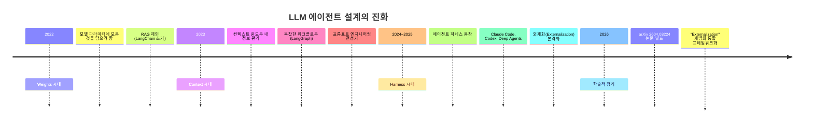
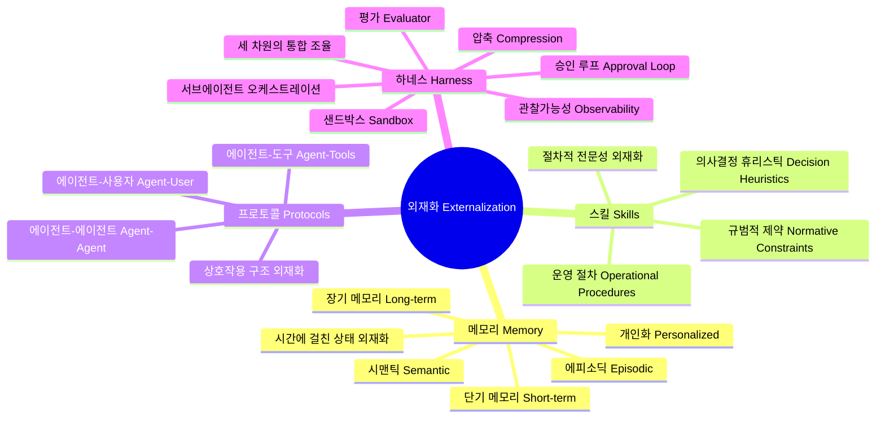
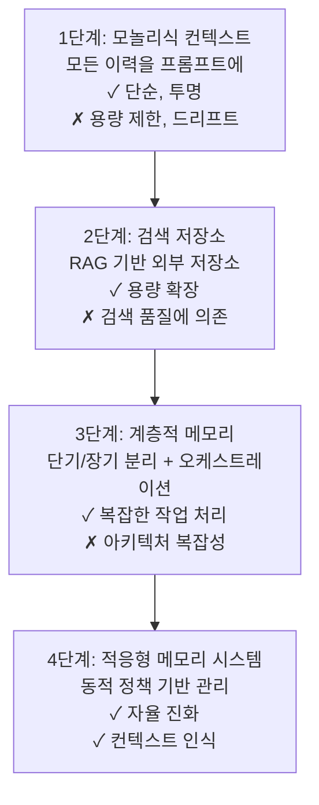
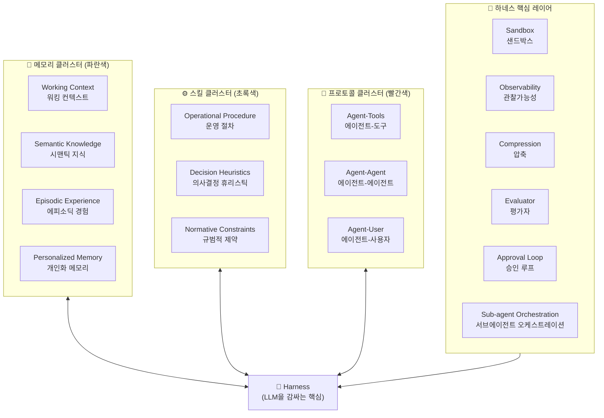
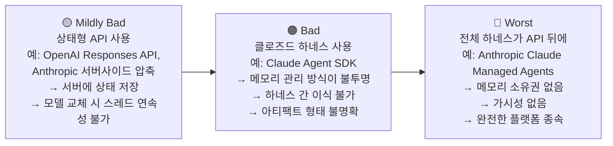
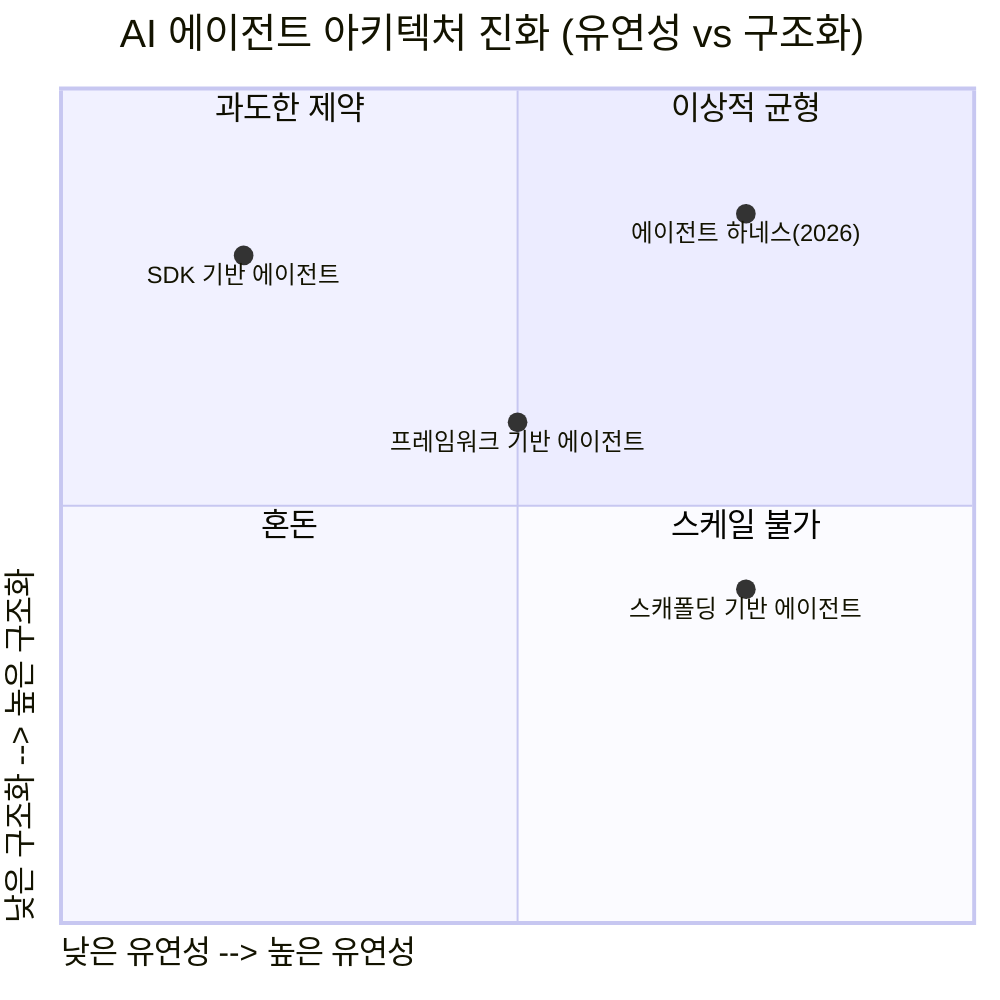
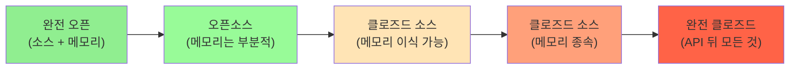
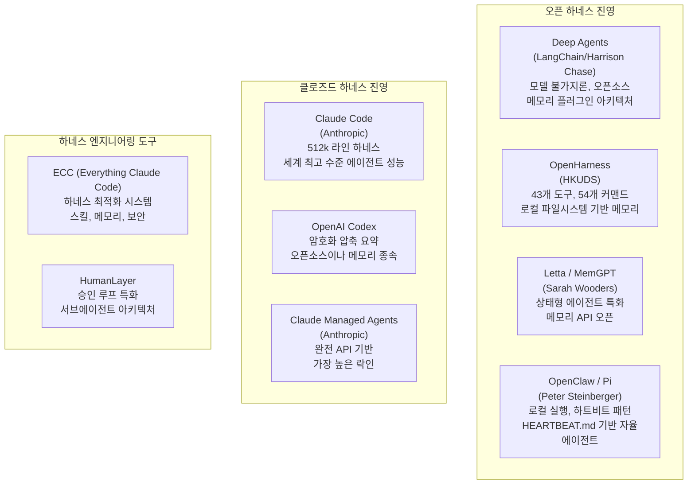

> **"모델이 에이전트가 아니다. 하네스가 에이전트다."**  
> — Cobus Greyling (Kore.ai Chief AI Evangelist)

---

## 목차

1. [들어가며: 패러다임의 전환점](#들어가며)
2. [논문 소개: Externalization in LLM Agents](#논문-소개)
3. [외재화(Externalization)란 무엇인가](#외재화란-무엇인가)
4. [세 가지 외재화 차원 심층 분석](#세-가지-외재화-차원)
   - [메모리(Memory): 시간을 가로지르는 상태](#메모리)
   - [스킬(Skills): 절차적 전문성의 외재화](#스킬)
   - [프로토콜(Protocols): 상호작용 구조의 외재화](#프로토콜)
5. [하네스(Harness): 통합 레이어](#하네스)
6. [하네스의 내부 구조: 다이어그램 해설](#하네스-내부-구조)
7. [Harrison Chase의 주장: "당신의 하네스, 당신의 메모리"](#harrison-chase의-주장)
8. [Cobus Greyling의 통찰: 하네스 엔지니어링의 부상](#cobus-greyling의-통찰)
9. [오픈 하네스 vs 클로즈드 하네스: 플랫폼 종속의 문제](#오픈-vs-클로즈드)
10. [HyperAgents: 스스로 하네스를 설계하는 에이전트](#hyperagents)
11. [산업 지형도: 에이전트 하네스 생태계](#산업-지형도)
12. [Jiyo 관점: Claude Code와 SELFISH AAA 프로젝트에의 함의](#실무-적용)
13. [결론: 인프라가 곧 지능이다](#결론)

---

## 들어가며: 패러다임의 전환점 {#들어가며}

2022년부터 2023년까지, AI 업계 전체는 단 하나의 목표를 향해 달려갔다. 모델을 더 스마트하게 만드는 것. 더 많은 파라미터, 더 많은 데이터, 더 정교한 훈련 기법. GPT-4가 나오고, Claude가 나오고, Gemini가 나왔다. 모델 간 성능 비교 벤치마크가 일상이 되었고, 리더보드의 순위 변동이 뉴스를 장식했다.

그런데 2025년을 지나 2026년에 이르러, 업계의 시선이 조용히 이동하기 시작했다. 모델 자체보다는 모델을 둘러싼 것들에 대한 관심이 폭발적으로 증가했다. Claude Code가 등장하고, OpenAI의 Codex가 나오고, LangChain 팀의 Deep Agents가 등장했다. 이 변화를 관통하는 하나의 개념이 2026년 4월 학술적으로 정리되었다. 상하이 교통대학교, 선야트센대학교, 카네기멜론대학교 등 여러 기관의 연구자들이 공동으로 발표한 논문 **"Externalization in LLM Agents: A Unified Review of Memory, Skills, Protocols and Harness Engineering"** (arXiv: 2604.08224)이 그것이다.

이 논문이 말하는 핵심 명제는 단순하지만 강력하다. **LLM 에이전트의 발전은 더 이상 모델 가중치(weights)를 바꾸는 문제가 아니라, 모델 주변의 런타임을 재구성하는 문제다.** 이 문서는 이 논문과, 같은 시기에 LangChain 창업자 Harrison Chase, 그리고 AI 해설가 Cobus Greyling이 제기한 논의들을 종합하여, 에이전트 하네스라는 개념이 왜 중요한지, 그것이 산업과 개발자 실무에 어떤 함의를 갖는지를 상세히 탐구한다.

---

## 논문 소개: Externalization in LLM Agents {#논문-소개}

**논문 정보**
- 제목: Externalization in LLM Agents: A Unified Review of Memory, Skills, Protocols and Harness Engineering
- arXiv: 2604.08224
- 제출일: 2026년 4월 9일
- 저자: Chenyu Zhou, Huacan Chai, Wenteng Chen 외 20인
- 소속: 상하이 교통대학교(SJTU), 선야트센대학교(SYSU), 카네기멜론대학교(CMU), 상하이 혁신연구소 등

이 논문은 LLM 에이전트 설계의 역사적 진화를 **세 단계 아크(arc)** 로 정리한다.

논문은 인간 문명의 인지적 외재화 역사와 LLM 에이전트의 발전이 동일한 논리를 따른다는 놀라운 주장을 편다. 인간은 말(언어)을 통해 사적 사고를 공유 가능한 기호로 만들었고, 문자를 통해 지식을 생물학적 기억 너머로 확장했으며, 인쇄술을 통해 대규모 배포를 가능하게 했고, 디지털 컴퓨팅을 통해 계산 능력을 외부화했다. LLM 에이전트도 같은 방향으로 움직인다는 것이다. 모델 내부에 있던 인지적 부담들을 외부의 구조화된 시스템으로 옮겨내는 과정이 바로 현재 에이전트 아키텍처 발전의 본질이라는 것이다.

---

## 외재화(Externalization)란 무엇인가 {#외재화란-무엇인가}

논문의 핵심 개념인 **외재화(Externalization)** 는 단순히 "외부에 기능을 추가한다"는 뜻이 아니다. 그보다 훨씬 깊은 의미를 담고 있다. 외재화란, **모델 내부의 인지적 부담을 영속적이고, 검사 가능하며, 재사용 가능한 외부 구조물로 이전하는 행위**다.

이 개념은 인지과학의 "인지 아티팩트(cognitive artifacts)" 개념에 뿌리를 두고 있다. 인지 아티팩트란 인간의 인지 능력을 증강하는 외부 도구들을 의미하는데, 달력, 계산기, 노트북 같은 것들이 그 예다. 이 도구들은 인간의 인지 능력을 직접 향상시키는 것이 아니라, 인지적 과제를 재구성함으로써 인간이 더 잘 처리할 수 있는 형태로 변환한다.

LLM 에이전트에서도 동일한 논리가 작동한다. 모델에게 "모든 대화 이력을 기억하라"고 요청하는 것과, 적절한 메모리 시스템에 대화 이력을 저장하고 필요할 때 검색해 오는 것은 전혀 다른 결과를 낳는다. 전자는 컨텍스트 윈도우의 한계에 부딪히고, 주의력 분산을 야기하며, 일관성을 보장할 수 없다. 후자는 저장과 검색의 부담을 분리하여, 모델이 현재 과제에만 집중할 수 있게 만든다. 이것이 외재화의 핵심이다.

논문은 외재화를 세 가지 차원으로 분류한다.

---

## 세 가지 외재화 차원 심층 분석 {#세-가지-외재화-차원}

### 메모리(Memory): 시간을 가로지르는 상태 {#메모리}

메모리는 세 차원 중 가장 먼저 주목받았고, 동시에 가장 복잡한 영역이다. 논문은 메모리를 단순한 "과거 대화 저장"이 아니라, **시간에 걸쳐 에이전트의 상태를 외부화하는 메커니즘**으로 정의한다.

다이어그램에서 메모리 클러스터는 네 가지 하위 요소로 구성된다.

**1. 워킹 컨텍스트(Working Context)**  
현재 진행 중인 작업과 직접 관련된 즉각적 정보의 집합이다. 컨텍스트 윈도우 내에 존재하지만, 하네스가 능동적으로 관리해야 한다. 무엇을 컨텍스트에 포함시키고 무엇을 제거할지, 어떤 순서로 배치할지, 어떻게 압축할지가 모두 하네스의 책임이다.

**2. 시맨틱 지식(Semantic Knowledge)**  
사실적, 개념적 지식의 저장소다. RAG(Retrieval-Augmented Generation)의 지식 베이스가 여기에 해당한다. 특정 도메인의 전문 지식, 코드베이스의 구조, API 문서 등이 시맨틱 지식으로 외재화된다. 모델이 훈련 시점 이후의 정보에 접근할 수 있는 유일한 방법이기도 하다.

**3. 에피소딕 경험(Episodic Experience)**  
과거에 수행한 작업들의 이력이다. 인간의 에피소딕 기억에 해당하는 이 레이어는 "이전에 비슷한 문제를 어떻게 해결했는가"에 대한 정보를 저장한다. 이 경험이 축적될수록 에이전트는 동일한 실수를 반복하지 않고, 검증된 접근 방식을 재사용할 수 있다. AGENTS.md, CLAUDE.md 파일이 이 역할을 수행하는 실용적 예시다.

**4. 개인화된 메모리(Personalized Memory)**  
특정 사용자, 팀, 또는 환경에 대한 안정적 정보를 추적하는 레이어다. 사용자의 선호도, 습관, 반복되는 제약 조건, 이전 상호작용 패턴 등을 포함한다. 논문은 이 레이어를 에이전트의 일반적 자기 개선 저장소와 분리해야 한다고 강조한다. 사용자별 데이터는 서로 다른 보존, 검색, 개인정보 규칙을 따르기 때문이다.

메모리의 아키텍처적 진화를 논문은 네 가지 패러다임으로 정리한다.

메모리 아키텍처에서 결정적인 설계 질문은 단순히 "어디에 저장할 것인가"가 아니다. 무엇을 기록하고, 무엇을 승격시키고(working → long-term), 무엇을 검색하고, 무엇을 압축하고, 무엇을 잊어버릴 것인가에 대한 **명시적 정책**이 필요하다. 이 정책을 결정하는 것이 바로 하네스다.

---

### 스킬(Skills): 절차적 전문성의 외재화 {#스킬}

스킬은 에이전트가 "무엇을 할 수 있는가"뿐만 아니라 "어떻게 해야 하는가"를 외재화한 것이다. 논문은 스킬을 단순한 함수 호출(function calling)을 넘어선 **재사용 가능한 역량 패키지**로 정의한다.

다이어그램의 스킬 클러스터는 세 가지 구성 요소를 가진다.

**1. 운영 절차(Operational Procedure)**  
특정 작업을 수행하는 방법에 대한 구조화된 지침이다. 단계별 절차, 체크리스트, 워크플로우 패턴 등이 포함된다. Claude Code의 SKILL.md 파일이 대표적 예시다. 이 파일들은 "이 작업을 할 때는 이런 순서로, 이런 도구를 사용하라"는 절차적 지식을 텍스트로 외재화한 것이다.

**2. 의사결정 휴리스틱(Decision Heuristics)**  
불확실한 상황에서 어떻게 판단할지에 대한 지침이다. "모르면 검색하기 전에 먼저 README를 확인하라", "테스트 코드 없이는 구현 코드를 작성하지 말라" 같은 규칙들이 이에 해당한다. 이 휴리스틱이 없으면 에이전트는 동일한 상황에서 매번 다른 결정을 내리고, 일관성 없는 결과를 생성한다.

**3. 규범적 제약(Normative Constraints)**  
에이전트가 해서는 안 되는 것들, 또는 반드시 해야 하는 것들에 대한 경계를 정의한다. 보안 규칙, 코딩 컨벤션, 법적 제약, 윤리적 경계 등이 포함된다. 이 제약이 외재화되어야 비로소 에이전트는 실세계에서 신뢰할 수 있는 방식으로 작동할 수 있다.

스킬의 실용적 구현에서 핵심적인 개념이 **점진적 공개(Progressive Disclosure)** 다. 처음부터 모든 스킬을 컨텍스트에 로드하면, 스킬 수가 20개를 넘는 순간부터 성능이 급격히 저하된다. LangChain의 연구에 따르면, 스킬 라이브러리가 특정 임계값을 넘으면 선택 정확도가 급격히 떨어지는 **상전이(phase transition)** 현상이 나타난다. 이를 해결하는 방법이 바로 점진적 공개다. 스킬의 메타데이터(이름, 간단한 설명)만 초기에 로드하고, 실제 스킬 내용은 필요할 때 동적으로 불러오는 방식이다.

이 패턴은 인간의 인지 과학에서 알려진 "청킹(chunking)" 개념과 정확히 대응한다. 인간도 복잡한 선택 상황에서는 먼저 카테고리를 파악하고(coarse selection), 그 다음 세부 옵션을 탐색한다(fine selection). 계층적 라우팅으로 구성된 스킬 시스템은 이 원리를 적용하여 37~40%의 정확도 향상을 달성할 수 있다.

---

### 프로토콜(Protocols): 상호작용 구조의 외재화 {#프로토콜}

프로토콜은 에이전트가 외부 세계와, 그리고 다른 에이전트들과 상호작용하는 방식을 정의한다. 논문은 프로토콜을 **탐색, 호출, 위임, 권한 관리를 위한 명시적 기계 가독형 계약(machine-readable contracts)** 으로 정의한다.

다이어그램의 프로토콜 클러스터는 세 가지 관계를 다룬다.

**1. 에이전트-도구(Agent-Tools)**  
에이전트가 외부 API, 데이터베이스, 코드 실행 환경 등과 상호작용하는 방식이다. MCP(Model Context Protocol)가 이 영역에서 표준화를 이끌고 있다. 도구 호출의 스키마, 결과 형식, 오류 처리 방식 등이 프로토콜로 정의된다.

**2. 에이전트-에이전트(Agent-Agent)**  
멀티 에이전트 시스템에서 에이전트들 간의 통신 방식이다. 어떻게 작업을 위임하는가, 결과를 어떻게 전달하는가, 충돌 상황에서 어떻게 조율하는가 등이 포함된다. A2A(Agent-to-Agent) 프로토콜이 이 영역의 표준화 시도다. 프로토콜이 없으면 멀티 에이전트 시스템은 애드혹 방식의 취약한 커뮤니케이션에 의존할 수밖에 없다.

**3. 에이전트-사용자(Agent-User)**  
에이전트가 인간과 인터페이스하는 방식이다. 언제 인간의 승인을 구하는가, 어떻게 불확실성을 표현하는가, 어떤 형식으로 결과를 보고하는가 등이 이 레이어에서 정의된다. Approval Loop가 이 프로토콜의 핵심 구현체다.

흥미로운 연구 결과가 있다. 같은 수준의 모델들 사이에서도 **프로토콜 선택이 품질 변동의 44%를 설명한다**는 것이다. 모델이 아무리 강력해도, 어떤 프로토콜 하에서 작동하는가에 따라 결과가 크게 달라진다. 이것이 프로토콜을 단순한 기술적 세부사항이 아닌 핵심 아키텍처 결정으로 다루어야 하는 이유다.

---

## 하네스(Harness): 통합 레이어 {#하네스}

하네스(Harness)는 메모리, 스킬, 프로토콜이라는 세 가지 외재화 차원을 하나로 묶어 거버넌스된 실행을 가능하게 하는 **통합 엔지니어링 레이어**다. 논문의 정의를 빌리면, "하네스는 이 세 차원을 호스팅하고, 외재화된 인지가 실제로 작동하도록 오케스트레이션 로직, 제약, 관찰 가능성, 피드백 루프를 제공하는 엔지니어링 레이어"다.

Cobus Greyling은 이것을 더 직관적으로 표현한다. **"LLM은 엔진이고, 하네스는 자동차다."** 엔진이 아무리 강력해도, 그것을 운전 가능한 형태로 만드는 자동차 없이는 아무 쓸모가 없다. 마찬가지로 GPT-5나 Claude Opus가 아무리 뛰어나도, 그것을 실세계 작업에 안전하고 신뢰할 수 있게 배포하는 하네스 없이는 그 능력이 실현되지 않는다.

하네스가 없다면 LLM이 할 수 없는 것들을 나열하면 다음과 같다. 모델은 기본적으로 텍스트(또는 멀티모달 입력)를 받아 텍스트를 출력할 뿐이다. 상태를 유지할 수 없고, 도구를 실행할 수 없으며, 피드백 루프를 형성할 수 없고, 제약을 강제할 수 없으며, 다른 에이전트를 조율할 수 없다. 이 모든 것이 하네스의 역할이다.

이 사실을 극적으로 보여주는 사례가 있다. 2026년 Claude Code의 소스 코드가 유출되었을 때, 그 코드 양은 **무려 51만 2천 줄**이었다. 세계 최고의 LLM을 만드는 Anthropic도 하네스 구축에 이토록 막대한 투자를 하고 있다는 것이다. 세계 최고의 모델 제조사조차 하네스를 무시할 수 없다는 이 사실은, 하네스 엔지니어링이 단순한 보조적 작업이 아님을 명확히 한다.

---

## 하네스의 내부 구조: 다이어그램 해설 {#하네스-내부-구조}

본문에 포함된 다이어그램은 세 개의 위성 클러스터(Memory, Skills, Protocols)와 그 중심에 위치한 Harness로 구성된다. 하네스 주변에는 여섯 가지 운영 레이어 구성요소가 배치되어 있다.

각 운영 레이어 구성요소의 역할을 상세히 살펴보자.

**샌드박스(Sandbox)**: 에이전트가 코드를 실행하고 파일 시스템에 접근하는 격리된 환경을 제공한다. 보안의 핵심 레이어로, 에이전트의 행동이 호스트 시스템에 예기치 않은 영향을 미치지 못하도록 한다. 컨테이너, 가상 머신, 원격 실행 환경 등 다양한 형태로 구현된다.

**관찰가능성(Observability)**: 에이전트의 행동을 추적하고 기록하며 분석할 수 있게 한다. 무엇을 실행했는지, 어떤 도구를 호출했는지, 어디서 실패했는지를 투명하게 볼 수 있어야 한다. 이것 없이는 에이전트 시스템의 디버깅과 개선이 불가능하다.

**압축(Compression)**: 컨텍스트 윈도우가 꽉 찼을 때 무엇을 요약하고 무엇을 삭제할지를 결정한다. 이 "압축 정책"은 에이전트의 장기 작업 능력에 결정적 영향을 미친다. OpenAI의 Codex는 암호화된 압축 요약을 생성하는데, 이것이 OpenAI 생태계 밖에서는 사용할 수 없어 플랫폼 종속성을 만들어낸다.

**평가자(Evaluator)**: 에이전트의 출력이 요구사항을 충족하는지 검증한다. 형식 검증, 안전 필터, 품질 체크, 자기 수정 루프 등이 포함된다. 에이전트가 실수를 범했을 때, 하네스는 그것을 신호로 삼아 무엇이 부족한지 파악하고 다음 시도를 개선한다.

**승인 루프(Approval Loop)**: 특정 행동을 실행하기 전에 인간의 승인을 구하는 메커니즘이다. 어떤 도구 호출에 대해 인간의 확인이 필요한지, 어떤 수준의 위험이 자동 승인 가능한지를 정의한다. 이것은 Human-in-the-Loop(HITL) 설계의 핵심이다.

**서브에이전트 오케스트레이션(Sub-agent Orchestration)**: 복잡한 작업을 여러 하위 에이전트에게 위임하고 조율하는 메커니즘이다. HumanLayer 블로그의 표현을 빌리면, 서브에이전트는 "컨텍스트 방화벽"으로 기능한다. 각 하위 작업이 격리된 컨텍스트 윈도우에서 실행됨으로써, 중간 과정의 노이즈가 부모 스레드의 컨텍스트를 오염시키지 않는다. 이것이 수십 개의 컨텍스트 윈도우를 요구하는 장기 작업을 가능하게 하는 핵심 메커니즘이다.

---

## Harrison Chase의 주장: "당신의 하네스, 당신의 메모리" {#harrison-chase의-주장}

LangChain과 LangGraph의 창업자인 Harrison Chase는 2026년 4월 11일, 하네스와 메모리의 관계에 대한 중요한 블로그 포스트를 발표했다. 제목은 "Your Harness, Your Memory"다. 이 글은 기술적 주장을 넘어 강한 정치적·경제적 함의를 담고 있다.

### 에이전트 하네스의 역사적 진화

Chase는 에이전트 구축 방식의 변천을 세 단계로 정리한다. ChatGPT가 등장했을 때는 단순한 RAG 체인(LangChain)만이 가능했다. 모델이 조금 더 발전하자 더 복잡한 플로우(LangGraph)를 만들 수 있게 되었다. 그리고 모델이 크게 도약하자, 새로운 유형의 스캐폴딩인 **에이전트 하네스**가 등장했다.

현재의 에이전트 하네스 예시로는 Claude Code, Deep Agents, Pi(OpenClaw 기반), OpenCode, Codex, Letta Code 등이 있다.

### 하네스는 사라지지 않는다

"모델이 점점 더 많은 스캐폴딩을 흡수할 것"이라는 주장에 Chase는 강하게 반박한다. 하네스가 필요 없어지는 것이 아니라, 2023년에 필요했던 스캐폴딩이 더 이상 필요 없어지는 것이다. 그 자리를 다른 유형의 스캐폴딩이 채운다. 에이전트는 정의상 "도구 및 데이터 소스와 상호작용하는 LLM"이기 때문에, 그 상호작용을 가능하게 하는 시스템은 항상 필요하다.

OpenAI나 Anthropic의 API에 웹 검색이 내장된 것처럼 보일 때, 그것은 "모델의 일부"가 된 것이 아니다. 오히려 그들의 API 뒤에서 모델과 웹 검색 API를 오케스트레이션하는 **경량 하네스가 운용되고 있는 것**이다. 단순히 도구 호출(tool calling)을 통해 구현된 것일 뿐이다.

### 메모리는 플러그인이 아니다

Chase는 Sarah Wooders(Letta AI CTO)의 통찰을 인용한다. **"메모리를 에이전트 하네스에 플러그인한다는 것은 운전을 자동차에 플러그인하는 것과 같다."** 메모리는 별도의 서비스가 아니라 하네스의 핵심 역량이다.

하네스가 메모리와 밀접하게 연결된 방식의 구체적 사례들이 있다.
- AGENTS.md 또는 CLAUDE.md 파일이 어떻게 컨텍스트에 로드되는가?
- 스킬 메타데이터가 에이전트에게 어떻게 표시되는가? (시스템 프롬프트? 시스템 메시지?)
- 에이전트가 자신의 시스템 지침을 수정할 수 있는가?
- 압축 후 무엇이 살아남고 무엇이 사라지는가?
- 상호작용이 저장되고 쿼리 가능한가?
- 메모리 메타데이터가 에이전트에게 어떻게 표현되는가?
- 현재 작업 디렉토리는 어떻게 표현되는가? 얼마나 많은 파일시스템 정보가 노출되는가?

이 모든 질문에 대한 답이 **하네스의 설계**에 의해 결정된다. 메모리 레이어를 별도로 떼어내어 다른 하네스에 이식하는 것이 불가능한 이유도 바로 이 때문이다.

### 클로즈드 하네스의 세 가지 문제

Chase는 클로즈드 하네스 사용의 문제를 심각성 순서로 세 단계로 분류한다.

가장 심각한 케이스는 장기 메모리를 포함한 전체 하네스가 API 뒤에 숨겨지는 경우다. Chase는 여기서 **Anthropic의 Claude Managed Agents**를 명시적으로 언급한다. 이것은 문자 그대로 모든 것을 API 뒤에 두어 플랫폼에 종속시킨다. 모델 제공업체들이 이런 방향으로 가는 이유는 분명하다. 메모리는 중요하며, 메모리를 통한 락인(lock-in)은 모델 단독으로는 얻을 수 없는 것이기 때문이다.

### 메모리의 경제학: 데이터 플라이휠

Chase가 개인 경험으로 설명하는 사례가 있다. 그는 내부적으로 이메일 어시스턴트를 운용했는데, Fleet 플랫폼 위에 구축된 이 어시스턴트는 수개월의 상호작용을 통해 메모리를 축적했다. 어느 날 에이전트가 실수로 삭제되었다. 같은 템플릿으로 새 에이전트를 만들었지만, 경험은 처음으로 돌아갔다. 선호도, 톤, 모든 것을 다시 가르쳐야 했다. 이 경험은 역설적으로 메모리가 얼마나 강력하고 "끈적한(sticky)" 것인지를 보여준다.

메모리가 쌓인 에이전트는 **독점적 데이터셋**이 된다. 사용자 상호작용과 선호도의 데이터셋이다. 이것을 가진 에이전트는 동일한 도구를 가진 다른 누구도 쉽게 복제할 수 없다. 이것이 메모리 기반 경쟁 우위다.

반면, 메모리 없는 에이전트는 동일한 도구에 접근하는 누구에게나 복제 가능하다. 진정한 차별화는 메모리를 통해서만 달성된다.

---

## Cobus Greyling의 통찰: 하네스 엔지니어링의 부상 {#cobus-greyling의-통찰}

Cobus Greyling은 Kore.ai의 Chief AI Evangelist로, 에이전트 아키텍처에 대한 깊이 있는 해설로 알려진 AI 저술가다. 그의 X(구 Twitter) 포스트와 Medium/Substack 아티클들은 이 분야를 따라가는 실무자들에게 중요한 참고 자료다.

그의 핵심 기여는 **"하네스 엔지니어링(Harness Engineering)"** 이라는 개념을 대중화하고, 그것이 어떻게 실제 프로덕션에서 작동하는지를 구체적으로 설명하는 데 있다.

### 하네스 엔지니어링의 정의와 실천

Greyling은 하네스를 구성하는 핵심 컴포넌트들을 다음과 같이 정리한다.

하네스는 에이전트가 아니다. 에이전트가 어떻게 작동할지를 결정하는 소프트웨어 시스템이다. 구체적으로, 하네스는 다음을 수행한다.

- **도구 연결**: 정의된 프로토콜을 통해 외부 API, 데이터베이스, 코드 실행 환경을 모델에 연결한다.
- **다층적 메모리 관리**: 워킹 컨텍스트, 세션 상태, 장기 메모리를 단일 컨텍스트 윈도우를 넘어 영속화한다. Anthropic의 접근은 프로그레스 파일과 git 히스토리를 세션 간 브릿지로 사용한다.
- **동적 컨텍스트 큐레이션**: 정적 프롬프트 템플릿이 아니라, 현재 작업 상태에 따라 각 모델 호출에 들어갈 정보를 능동적으로 선별한다.
- **구조화된 작업 시퀀싱**: 단일 패스에서 모든 것을 처리하려 하지 않고, 구조화된 작업 시퀀스를 통해 모델을 안내한다.
- **검증과 자기 수정**: 형식 검증, 안전 필터, 자기 수정 루프가 에이전트가 막혔을 때 무엇이 부족한지 파악하는 신호로 작용한다.
- **모듈식 구조**: 컴포넌트들을 독립적으로 활성화, 비활성화, 교체할 수 있다.

Claude Code는 이 모든 것의 구현체다. 전체 코드베이스를 읽고, 파일시스템 접근을 관리하며, 서브에이전트를 스폰하고, 도구 오케스트레이션을 처리하며, 세션 간 메모리를 유지하고, 가드레일을 구현한다.

### AI 에이전트 아키텍처의 세 가지 진화 패턴

Greyling은 하네스 이전의 에이전트 아키텍처를 세 가지로 정리한다.

**SDK 기반**: 구조화와 제어가 강하지만 유연성이 낮다. 빠른 프로토타이핑에 적합하지만 복잡한 시나리오에서 한계에 부딪힌다.

**프레임워크 기반**: LangGraph 같은 시각적 구성, 조건 플로우, 디버깅을 지원한다. 엔터프라이즈 프로덕션에 적합하다.

**스캐폴딩 기반**: LLM 자체가 루프 컨트롤러가 되는 방식이다. 모델이 충분히 유능할 때 코드 변경 없이 빠른 반복이 가능하다. 하지만 스케일에서 취약하다.

**에이전트 하네스**: 위 세 가지 접근의 강점을 통합하는 4번째 패턴이다. 구조화, 유연성, 스케일, 관찰 가능성을 모두 갖춘다.

### HyperAgents: 스스로 하네스를 설계하는 에이전트에 대한 Greyling의 해설 {#hyperagents}

Greyling의 가장 최근 글(2026년 4월) 중 하나는 Meta와 UBC가 발표한 **HyperAgents** 논문에 대한 해설이다. 이 논문은 하네스 엔지니어링의 미래를 엿볼 수 있게 해준다.

HyperAgents는 자기 참조적(self-referential) AI 에이전트다. 이 에이전트들은 단순히 과제 해결 행동만 수정하는 것이 아니라, **미래 개선을 생성하는 메커니즘 자체를 수정**한다. 쉽게 말하면, 자신의 하네스를 스스로 설계한다.

실험에서 HyperAgents는 아무것도 없는 상태(단순한 LLM 호출, 도구도 메모리도 계획도 없음)에서 시작했다. 수백 번의 자기 수정 이터레이션 이후, 에이전트는 영속적 메모리, 성능 추적, 다단계 평가 파이프라인, 도메인 지식 베이스, 모듈식 코드 구조를 갖추게 되었다. 스스로 하네스를 구축한 것이다.

이 발견의 충격적인 점은 **에이전트들이 수렴한 컴포넌트들이 개발자들이 오늘날 수동으로 구축하는 것과 정확히 동일**하다는 것이다. 스스로 진화하는 에이전트가 독립적으로 재발명하는 것이 개발자들이 하네스 엔지니어링이라고 부르는 것과 같다는 사실은, 하네스 아키텍처가 단순한 인간의 발명품이 아니라 지능적 시스템이 도달하게 되는 **자연스러운 수렴점**임을 시사한다.

개발자의 역할이 변화한다. 하네스를 직접 구축하는 것에서, 에이전트들이 효과적인 하네스를 진화시킬 수 있는 **초기 조건을 설계**하는 것으로.

---

## 오픈 하네스 vs 클로즈드 하네스: 플랫폼 종속의 문제 {#오픈-vs-클로즈드}

이 논쟁은 단순한 기술적 선택을 넘어, **누가 에이전트 생태계의 권력을 가질 것인가**에 대한 정치경제학적 문제다.

### 현재 주요 하네스들의 개방성 스펙트럼

| 하네스 | 오픈소스? | 메모리 이식성 | 종속 위험 |
|--------|-----------|--------------|-----------|
| Deep Agents (LangChain) | ✅ 오픈 | 높음 (Mongo, Postgres, Redis 플러그인) | 낮음 |
| OpenHarness (HKUDS) | ✅ 오픈 | 높음 (로컬 파일시스템) | 낮음 |
| Letta / MemGPT | ✅ 오픈 | 높음 | 낮음 |
| Claude Code | ❌ 클로즈드 | 중간 (일부 파일 기반) | 중간 |
| Claude Agent SDK | ❌ 클로즈드 | 낮음 (불투명) | 높음 |
| OpenAI Codex | 부분 오픈 | 낮음 (암호화 압축) | 중간-높음 |
| Anthropic Managed Agents | ❌ API 전용 | 없음 | 매우 높음 |
| OpenAI Responses API | ❌ API 전용 | 없음 | 매우 높음 |

Harrison Chase의 권고는 명확하다. **오픈 하네스를 사용하고, 모델에 구애받지 않는(model-agnostic) 아키텍처를 유지하며, 자신의 메모리 데이터베이스를 직접 소유하라.**

### 오픈 하네스의 구체적 이점

오픈 하네스를 사용할 때 얻는 이점은 여러 층위에서 나타난다.

모델 스위칭 유연성 측면에서, 오늘은 Claude가 최선이지만 내일은 다른 모델이 더 나을 수 있다. 하네스가 오픈되어 있고 메모리가 이식 가능하면, 이전에 축적된 모든 메모리를 새 모델에서 그대로 활용할 수 있다. 반면 클로즈드 하네스를 사용하면 모델 교체는 에이전트 경험의 처음부터 다시 시작을 의미한다.

데이터 주권 측면에서, 수개월의 사용자 상호작용을 통해 쌓인 메모리 데이터는 귀중한 자산이다. 클로즈드 하네스에서 이 데이터는 플랫폼에 속한다. 오픈 하네스에서 이 데이터는 개발자(또는 사용자)에게 속한다.

감사 가능성과 제어 측면에서, 에이전트가 어떻게 컨텍스트를 관리하는지, 무엇이 압축되는지, 메모리가 어떻게 업데이트되는지를 완전히 이해하고 제어할 수 있다.

---

## 산업 지형도: 에이전트 하네스 생태계 {#산업-지형도}

2026년 현재, 에이전트 하네스 생태계는 빠르게 성숙하고 있다. 주요 플레이어들을 카테고리별로 정리하면 다음과 같다.

### 자연어 하네스: 미래의 방향성

가장 흥미로운 새 연구 방향 중 하나는 **Natural-Language Agent Harnesses(NLAH)** 다 (arXiv: 2603.25723). 이 연구는 하네스의 고수준 제어 로직을 자연어로 표현된 이식 가능한 실행 가능 아티팩트로 만들 수 있는지를 탐구한다.

현재의 코드 기반 하네스들은 전이(transfer)가 어렵다. 두 시스템이 표면적으로 하나의 설계 선택만 다를 때도, 실제로는 프롬프트, 도구 매개, 아티팩트 관례, 검증 게이트, 상태 의미론이 동시에 다르다. 이것이 평가를 모듈 수준이 아닌 전체 컨트롤러 번들 비교로 만들어버린다.

NLAH는 AGENTS.md, skills 번들 같은 자연어 아티팩트가 이미 이식 가능한 텍스트로 저장소별 관례와 재사용 가능한 절차를 패키징할 수 있음을 보여주었다는 점에서 출발한다. 이를 더 발전시켜, 하네스 논리 전체를 자연어로 표현하고 공유 지능형 런타임 하에서 실행하는 것이다.

---

## 실무 적용: Claude Code와 SELFISH AAA 프로젝트에의 함의 {#실무-적용}

이 논의들이 Claude Code 실사용자, 특히 비개발자 그룹과 함께 에이전트 시스템을 구축하는 실무에 어떤 함의를 갖는지 생각해볼 필요가 있다.

### SKILL.md는 스킬 외재화의 구체적 구현

Claude Code의 SKILL.md 파일은 논문이 정의하는 "스킬 외재화"의 가장 직접적인 실용적 예시다. 운영 절차(어떤 순서로 작업을 처리할지), 의사결정 휴리스틱(어떤 상황에서 어떤 도구를 쓸지), 규범적 제약(절대 하지 말아야 할 것들)이 텍스트 파일로 외재화된다.

SELFISH AAA 같은 비개발자 그룹이 Claude Code로 작업할 때, 이 SKILL.md 파일들을 체계적으로 관리하는 것이 팀의 에이전트 성능을 균질화하고 개선하는 핵심 메커니즘이 된다. 한 사람이 발견한 좋은 접근 방식을 SKILL.md로 문서화하면, 전체 팀이 동일한 수준의 에이전트 성능을 누릴 수 있다.

### CLAUDE.md와 AGENTS.md는 에피소딕 메모리의 외재화

프로젝트 루트의 CLAUDE.md 파일은 에피소딕 메모리 외재화의 실용적 구현이다. "지난번에 이런 실수를 했다", "이 프로젝트에서는 이런 컨벤션을 사용한다", "이 팀은 이런 방식으로 작업한다"는 지식들이 파일에 축적될수록, 에이전트는 세션 간 학습 효과를 발휘한다.

Obsidian + GitHub 스택으로 전환한 팀이라면, 이 CLAUDE.md/AGENTS.md 파일들을 Obsidian 노트와 통합하여 팀의 집단 에피소딕 메모리를 구조화하는 것이 가능하다.

### 오픈 vs 클로즈드 선택의 실제적 의미

Harrison Chase의 경고는 비개발자 그룹에게도 적용된다. 만약 Claude Managed Agents API를 사용하여 팀의 에이전트 시스템을 구축한다면, 시간이 지나며 쌓이는 메모리 자산이 Anthropic의 플랫폼에 종속된다. 모델 제공업체가 가격을 바꾸거나, 서비스를 중단하거나, 다른 방향으로 이동할 때, 축적된 메모리 자산의 이전이 불가능해진다.

실무적 권고는 명확하다. 에이전트의 메모리를 팀이 소유하고 접근할 수 있는 형태(파일, 데이터베이스)로 유지하고, 하네스 설계를 충분히 이해하고 제어할 수 있는 수준을 유지하라는 것이다.

### LxM(Ludus Ex Machina) 프로젝트에의 함의

다양한 LLM들을 게임에서 대결시키는 LxM 프로젝트의 맥락에서, 이 논의는 매우 흥미로운 질문을 제기한다. 동일한 게임에서 같은 모델이라도 **어떤 하네스 하에서 작동하는가에 따라 성능이 크게 달라질 수 있다**. 논문의 데이터에 따르면 프로토콜 선택만으로 품질 변동의 44%를 설명할 수 있다.

따라서 LxM에서 "어느 모델이 더 강한가"를 비교할 때, 실은 "어느 모델-하네스 조합이 더 강한가"를 비교하는 것임을 명심해야 한다. 이것은 실험 설계에서 하네스 조건을 어떻게 통제하고 명시할 것인가라는 방법론적 질문으로 이어진다.

---

## 결론: 인프라가 곧 지능이다 {#결론}

이 모든 논의를 종합하면, 우리는 AI 에이전트 개발의 중심축이 어디에 있는지를 명확히 볼 수 있다.

**모델 중심 시대(2022-2023)에서 하네스 중심 시대(2025-현재)로의 전환은 진행 중이 아니라 이미 완료되었다.** 가장 정교한 에이전트들은 이미 메모리, 스킬, 프로토콜이라는 세 차원의 외재화 인프라를 갖추고 있다. 그리고 그것들을 통합하는 하네스가 에이전트 성능의 진정한 결정 요인이 되었다.

arXiv 2604.08224 논문이 제시하는 이론적 프레임워크, Harrison Chase가 제기하는 메모리 소유권 경고, Cobus Greyling이 해설하는 하네스 엔지니어링의 실천론, 그리고 Meta HyperAgents가 보여주는 미래 방향성은 모두 같은 방향을 가리킨다.

**진정한 에이전트 역량은 더 큰 모델에서 오는 것이 아니라, 더 나은 외부 인지 인프라에서 온다.**

엔진(모델)이 아무리 강력해도, 그것을 실세계에서 유용하게 만드는 것은 자동차(하네스)다. 그리고 그 자동차를 누가 소유하고, 어떻게 설계하며, 자동차 안에 축적된 메모리 자산을 누가 통제하는가—이것이 에이전트 AI 시대의 진정한 경쟁 우위다.

---

## 참고 자료

- **논문**: Externalization in LLM Agents: A Unified Review of Memory, Skills, Protocols and Harness Engineering — [arXiv:2604.08224](https://arxiv.org/abs/2604.08224) (2026.04.09, SJTU/SYSU/CMU 외)
- **블로그**: Harrison Chase, "Your Harness, Your Memory" — [LangChain Blog](https://blog.langchain.com/your-harness-your-memory/) (2026.04.11)
- **해설**: Cobus Greyling, "The Rise of AI Harness Engineering" — [Medium](https://cobusgreyling.medium.com/the-rise-of-ai-harness-engineering-5f5220de393e) (2026.03.13)
- **해설**: Cobus Greyling, "HyperAgents by Meta: When Agents Engineer Their Own Harness" — [Medium](https://cobusgreyling.medium.com/hyperagents-by-meta-892580e14f5b) (2026.04)
- **참고 논문**: Natural-Language Agent Harnesses — [arXiv:2603.25723](https://arxiv.org/abs/2603.25723)
- **블로그**: "The Anatomy of an Agent Harness" — [LangChain Blog](https://blog.langchain.com/the-anatomy-of-an-agent-harness/)
- **블로그**: "Skill Issue: Harness Engineering for Coding Agents" — [HumanLayer Blog](https://www.humanlayer.dev/blog/skill-issue-harness-engineering-for-coding-agents)
- **LangChain Deep Agents 문서**: [docs.langchain.com/oss/python/deepagents/harness](https://docs.langchain.com/oss/python/deepagents/harness)
- **OpenHarness GitHub**: [github.com/HKUDS/OpenHarness](https://github.com/HKUDS/OpenHarness)

---

*문서 작성: 2026년 4월 14일*  
*Jiyo를 위한 AI 에이전트 아키텍처 심층 분석 시리즈*
