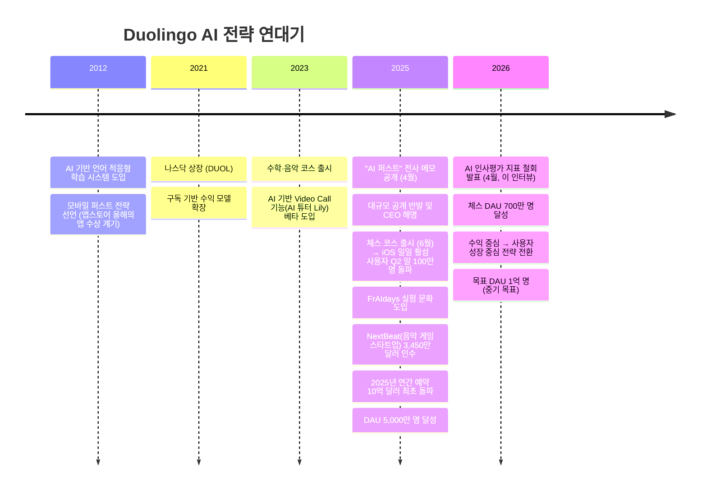
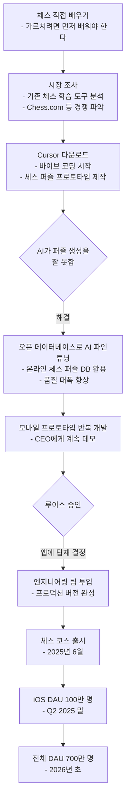
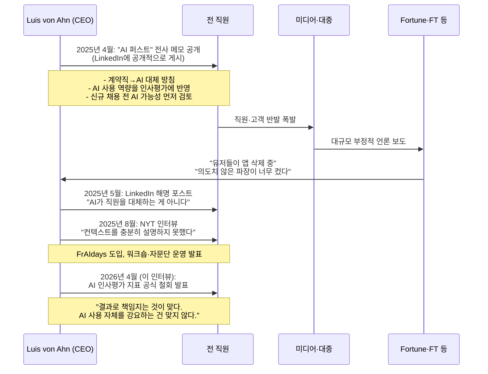
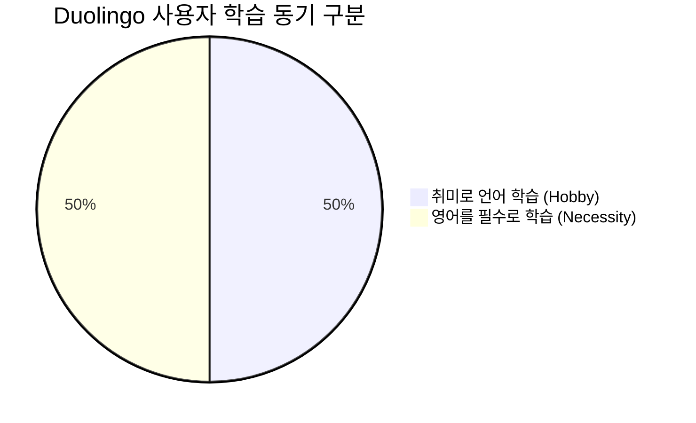
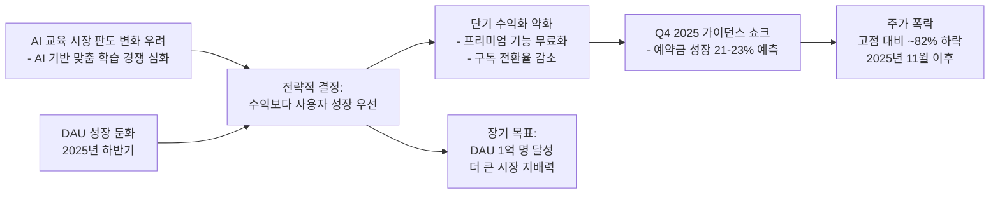
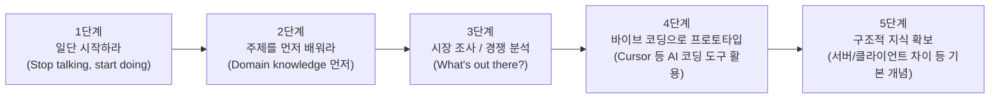
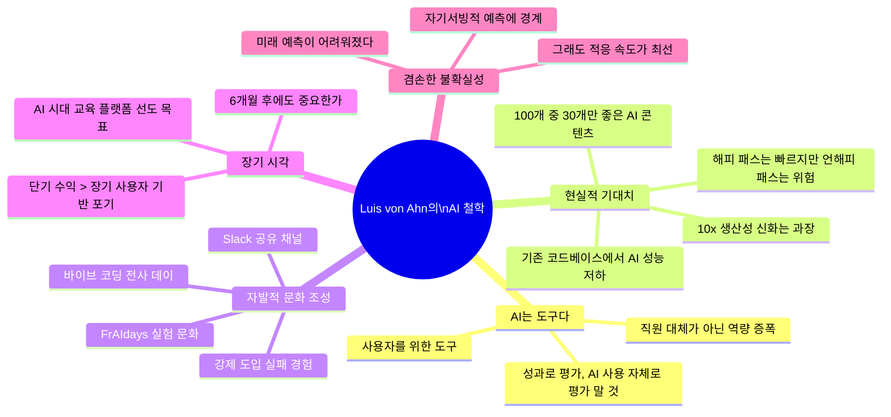

> **출처**: Silicon Valley Girl Podcast | 2026년 4월 10일 방영  
> **인터뷰이**: Luis von Ahn — Duolingo 공동창업자 & CEO  
> **인터뷰어**: Marina Mogilko  
> **원본 영상**: https://www.youtube.com/watch?v=GDeEATJcbJo  
> **분석 작성일**: 2026년 4월 15일

---

## 목차

1. [인터뷰 개요 및 배경](#1-인터뷰-개요-및-배경)
2. [Duolingo의 AI 전략 전체 그림](#2-duolingo의-ai-전략-전체-그림)
3. [체스 코스: 비개발자 2명이 6개월 만에 만든 최고 성장 제품](#3-체스-코스-비개발자-2명이-6개월-만에-만든-최고-성장-제품)
4. [바이브 코딩(Vibe Coding)과 내부 AI 문화](#4-바이브-코딩vibe-coding과-내부-ai-문화)
5. [AI 인사평가 도입 → 철회 사건: 배경과 교훈](#5-ai-인사평가-도입--철회-사건-배경과-교훈)
6. [AI의 실패 — 내부 데이터가 보여주는 진실](#6-ai의-실패--내부-데이터가-보여주는-진실)
7. [AI가 생산성을 10배 올렸는가? — CEO의 솔직한 답변](#7-ai가-생산성을-10배-올렸는가--ceo의-솔직한-답변)
8. [언어학습 시장과 AI 번역 — 왜 두올링고는 걱정하지 않는가](#8-언어학습-시장과-ai-번역--왜-두올링고는-걱정하지-않는가)
9. [절대 정리해고하지 않은 이유 — 채용 철학](#9-절대-정리해고하지-않은-이유--채용-철학)
10. [주가 82% 폭락을 자초한 경영 판단](#10-주가-82-폭락을-자초한-경영-판단)
11. [직종별 AI 생존 예측 — 5문제 블리츠](#11-직종별-ai-생존-예측--5문제-블리츠)
12. [2026년 AI 비즈니스 창업 조언](#12-2026년-ai-비즈니스-창업-조언)
13. [창업자의 정신 건강과 지표 집착](#13-창업자의-정신-건강과-지표-집착)
14. [최신 컨텍스트: 2025-2026 Duolingo 핵심 동향](#14-최신-컨텍스트-2025-2026-duolingo-핵심-동향)
15. [종합 분석: Luis von Ahn의 AI 철학 요약](#15-종합-분석-luis-von-ahn의-ai-철학-요약)
16. [시사점: 개발자/아키텍트 관점에서 본 메시지](#16-시사점-개발자아키텍트-관점에서-본-메시지)

---

## 1. 인터뷰 개요 및 배경

이 인터뷰는 Silicon Valley Girl 팟캐스트의 마리나 모길코(Marina Mogilko)가 2026년 4월에 진행한 것으로, Duolingo 창업자이자 현 CEO인 루이스 폰 안(Luis von Ahn)이 AI 시대의 기업 경영, 직원 채용 철학, 제품 개발 방식, 그리고 개인 창업 전략에 관해 솔직하게 이야기한 내용을 담고 있다.

루이스 폰 안은 과테말라 출신의 컴퓨터 과학자로, reCAPTCHA를 발명하고 구글에 매각한 뒤, 2011년 공동창업자 Severin Hacker와 함께 Duolingo를 설립했다. 현재 Duolingo는 전 세계 5억 명 이상의 사용자를 보유한 세계 최대 언어학습 플랫폼으로 성장했으며, 2021년 나스닥에 상장되었다.

이 인터뷰가 특별히 주목받는 이유는 두 가지다. 첫째, 업계에서 가장 솔직하게 AI 전략의 실패와 수정을 공개한 CEO 발언 중 하나라는 점이다. 둘째, 2025년 4월에 폭발적인 논란을 불러일으킨 "AI 퍼스트(AI-first)" 메모 이후 약 1년이 지난 시점에서, 그 경험을 어떻게 정제했는지가 솔직하게 드러난다는 점이다.

---

## 2. Duolingo의 AI 전략 전체 그림

### 황금 원칙: AI는 학습자를 위한 것이어야 한다

인터뷰에서 루이스가 가장 강조한 것은 Duolingo 내부의 "황금 원칙(golden rule)"이다. 그것은 바로 **"AI는 오직 우리 학습자를 이롭게 하기 위해서만 사용한다"** 는 것이다. 단순히 내부 효율화나 비용 절감을 위해 AI를 쓰는 것이 아니라, 최종적으로 학습자의 경험을 향상시키는 방향이어야만 AI 도입이 정당화된다는 입장이다.

이 원칙은 Duolingo가 AI를 내부적으로 활용하는 방식과, AI 기반 기능을 유료 구독자에게만 제공할 것인지 아닌지를 결정하는 기준이 된다. 예를 들어, AI 기반 회화 연습(Conversation Practice) 기능은 초기에 높은 비용 때문에 프리미엄 구독(Duolingo Max)에만 포함되었지만, AI 비용이 충분히 하락하자 낮은 구독 티어로, 궁극적으로는 무료로 개방할 계획을 밝혔다. 이는 수익보다 사용자 접근성을 우선시하는 방침이다.

---

## 3. 체스 코스: 비개발자 2명이 6개월 만에 만든 최고 성장 제품

이 인터뷰에서 가장 화제가 된 에피소드는 단연 **체스 코스 개발 이야기**다. 이 이야기는 AI 시대 제품 개발의 패러다임 전환을 상징하는 사례로 널리 인용되고 있다.

### 탄생 배경

두 명의 Duolingo 직원이 체스 코스 아이디어를 루이스에게 처음 제안한 것은 약 1년 전이었다. 당시 루이스는 거절했다. 그 이유는 "체스는 그냥 게임이고, 우리는 교육 앱"이라는 판단에서였다. 그러나 며칠 후, 루이스는 모국인 과테말라의 교육부 장관을 만난 자리에서 생각이 바뀌었다.

교육부 장관은 이렇게 말했다: *"과테말라의 공교육 시스템이 너무 망가져서, 학생마다 체스판을 하나씩 나눠주는 것을 고민 중입니다. 최소한 논리적 사고라도 가르쳐야 하니까요."*

이 말을 들은 루이스는 체스가 단순한 게임이 아닌 교육의 영역임을 깨달았고, 두 직원에게 OK 사인을 냈다. 단, 한 가지 조건이 있었다: **엔지니어를 줄 수 없다**는 것이었다. 직원들은 그 조건을 받아들였다.

### 개발 과정: 비개발자가 6개월 만에 만든 프로덕트

두 직원의 프로필은 이렇다:
- 체스 지식 없음
- 프로그래밍 공식 배경 없음 (단, 한 명은 약간의 기술 상식 보유)

이들이 취한 단계는 다음과 같다:

### 체스 코스의 성과 (최신 데이터)

| 지표 | 수치 | 기준 시점 |
|---|---|---|
| iOS 출시 후 DAU | 100만 명 | 2025년 Q2 말 |
| 전체 플랫폼 DAU | **700만 명** | 2026년 초 |
| 성장 속도 | 출시 이래 가장 빠른 코스 | 언어 코스 포함 전체 대비 |
| 리텐션 | 핵심 언어 코스보다 소폭 우수 | Jefferies 분석, 2025년 말 |

루이스는 이렇게 요약했다: *"컴퓨터는 1997년부터 체스에서 인간을 이겼습니다. 그런데 1997년보다 지금 체스를 배우는 사람이 훨씬 많습니다. 체스는 취미입니다. AI가 그 취미를 없애지 않습니다."*

---

## 4. 바이브 코딩(Vibe Coding)과 내부 AI 문화

### 바이브 코딩이란 무엇인가

"바이브 코딩(Vibe Coding)"은 엄격한 소프트웨어 엔지니어링 방법론 없이, AI 코딩 도구(Cursor 등)를 직관적으로 활용해 프로토타입을 빠르게 만드는 방식을 가리킨다. Duolingo에서 이 개념은 엔지니어뿐 아니라 전 직원에게 확산되고 있다.

### 전사 바이브 코딩 데이

루이스는 몇 달 전 회사 전체에 하루를 바이브 코딩에 할당했다고 밝혔다. HR, 재무, 마케팅 등 모든 부서의 모든 직원이 무언가를 코딩해야 했다. 엔지니어가 아닌 직원도 예외가 없었다. 목적은 단 하나: **"도구의 힘을 직접 체험시키는 것"** 이었다.

그 결과, 회사 안에는 자신만의 KPI 대시보드를 바이브 코딩으로 만든 직원들이 생겨났다. 프로덕트 매니저들은 방대한 사용자 데이터를 국가별로 시각화한 대시보드를 직접 만들어 업무에 활용하고 있다고 루이스는 자랑스럽게 말했다.

### 바이브 코딩의 또 다른 활용: PM의 프로토타이핑

인터뷰에서 루이스가 강조한 또 다른 AI 활용 변화는 프로덕트 매니저의 업무 방식이다. 과거에는 PM이 새 기능을 제안할 때 문서(written document)로 제출했다. 하지만 이제 많은 PM이 AI를 활용해 **직접 프로토타입을 만들어 가져온다**. 

루이스는 이 변화의 의미를 이렇게 설명했다:
> "누군가가 '스페인어를 더 잘 가르치는 방법을 찾겠다'고 문서로 말하면 그것이 실제로 어떤 의미인지 알기 어렵습니다. 하지만 프로토타입을 보여주면서 '이걸 해봤는데 정말 스페인어를 더 잘 가르치는 것 같다'고 하면, 의사결정이 훨씬 쉬워집니다."

### FrAIdays: 매주 금요일 AI 실험의 날

외부 언론 보도에 따르면, Duolingo는 2025년 중반부터 **"FrAIdays"** 라는 제도를 도입했다. 매주 금요일, 직원들이 AI를 활용한 업무 효율화 실험을 자유롭게 진행하는 시간이다. 이는 AI 기술을 공식 업무 흐름 안에 유기적으로 통합하기 위한 조직 문화 실험이다.

### 내부 Slack 채널: AI 베스트 프랙티스 & AI 실패 사례

Duolingo 내부에는 두 개의 주목할 만한 Slack 채널이 있다고 루이스는 소개했다.

- **#best-ai-practices**: 직원들이 발견한 AI 활용 꿀팁과 워크플로를 자발적으로 공유하는 채널.  
- **#ai-fails**: AI가 실패한 사례들을 공유하는 채널. 루이스는 이것을 "굉장히 긍정적인 채널"이라고 표현했다. 작은 앱을 혼자 만들어낸 경험 자체가 사람들에게 엄청난 성취감을 주기 때문이다: *"내가 앱을 만들었다는 것 자체가 엄청난 임파워먼트입니다."*

---

## 5. AI 인사평가 도입 → 철회 사건: 배경과 교훈

이 인터뷰에서 가장 뉴스가 된 내용 중 하나는 AI 성과 지표 철회 선언이다. 이 사건의 전체 타임라인을 이해하면 기업이 AI 전환 과정에서 어떤 문화적 장벽에 부딪히는지를 잘 볼 수 있다.

### 철회의 본질적 이유

루이스의 설명은 매우 명확했다. AI 사용을 인사 지표로 넣자, 직원들이 **"AI를 위한 AI 사용"** 을 하기 시작했다. 실제로 업무를 더 잘 하기 위해 AI를 쓰는 게 아니라, 지표를 채우기 위해 AI를 억지로 사용하는 행태가 나타난 것이다. 그 결과 나온 직원들의 질문이 핵심을 찔렀다: *"AI를 AI 그 자체를 위해 쓰길 원하시는 건가요?"*

루이스는 결국 다음과 같이 방침을 수정했다:
> "인사평가에서 가장 중요한 것은 당신이 자신의 일을 최대한 잘 하고 있는가 입니다. AI가 그것을 도울 수 있다면 좋습니다. 하지만 그렇지 않다면, 억지로 쓰게 하지 않겠습니다."

이 결정은 표면적으로 후퇴처럼 보이지만, 사실 더 성숙한 조직 학습의 결과다. AI 도입을 강제할 것이 아니라, 직원이 스스로 가치를 느껴 자발적으로 쓰게 만드는 것이 지속 가능하다는 교훈을 실증적으로 얻은 것이다.

---

## 6. AI의 실패 — 내부 데이터가 보여주는 진실

루이스는 AI 실패 사례에 대해서도 매우 솔직하게 이야기했다. 이 부분은 AI 과대 선전(hype)에 대한 건강한 해독제 역할을 한다.

### 코딩: "해피 패스는 빠르지만, 언해피 패스는 재앙이다"

루이스는 AI 코딩 도구에 대한 트위터(X)의 담론과 실제 Duolingo 현장 사이의 괴리를 솔직하게 털어놓았다. 2년 동안 소셜 미디어에서는 "AI가 인간 엔지니어보다 코딩을 더 잘 한다"는 말이 넘쳐났지만, 실제 Duolingo에서는 그에 상응하는 엔지니어링 속도 향상을 체감하지 못했다고 했다.

그 이유를 루이스는 이렇게 설명했다:
- **해피 패스(Happy Path)**: AI가 코드를 생성하면 돌아가는 경우 → 매우 빠르다.
- **언해피 패스(Unhappy Path)**: 코드가 제대로 동작하지 않을 때 → 무슨 일이 일어났는지 알기 어렵고, 디버깅이 극도로 어렵다.

결과적으로 언해피 패스에서 낭비되는 시간이 해피 패스에서 절약한 시간을 상쇄하는 경우가 많다고 했다. 또한 **기존 코드베이스(existing codebase)에서 AI 성능이 훨씬 떨어진다**는 점도 지적했다. 새 프로젝트를 처음부터 시작할 때와 달리, 이미 수년간 쌓인 복잡한 코드 위에서 AI가 제대로 작동하기 어렵다는 현실이다.

### 내러티브 생성: "데모는 훌륭하지만, 100개를 뽑으면 70개는 쓰레기"

Duolingo의 핵심 비즈니스는 학습 콘텐츠다. AI를 활용해 이야기(narrative), 스토리, 학습 문장 등을 생성할 때의 문제를 루이스는 이렇게 묘사했다:

> "데모에서 스토리를 만들어 달라고 하면 항상 놀라운 결과가 나옵니다. 하지만 100개를 생성해보면 30개만 좋고, 나머지 70개는 말이 안 됩니다. 사람이 여전히 검토하고 선별해야 합니다."

이 문제를 해결하기 위해 Duolingo는 광범위한 **품질 검수 파이프라인**을 구축하고 있다. AI가 생성한 모든 콘텐츠는 전수 검사 또는 표본 검사를 통해 품질이 검증된 뒤에야 사용자에게 노출된다.

---

## 7. AI가 생산성을 10배 올렸는가? — CEO의 솔직한 답변

많은 AI 낙관론자들이 주장하는 "AI로 인한 10배 생산성 향상"에 대해 루이스는 신중한 입장을 보였다.

> "저는 10x 생산성 향상을 경험한 대기업을 알지 못합니다. 1인 스타트업은 가능합니다. 혼자라면 AI로 모든 것을 할 수 있으니까요. 하지만 큰 회사는 다릅니다."

그 이유는 구체적이다:

| 제한 요소 | 설명 |
|---|---|
| 미팅 시간 | 엔지니어들이 하루 8시간을 코딩에 쓰는 게 아니다. 미팅, 소통, 조율에 상당한 시간이 필요하다. |
| 기존 코드베이스 | AI는 새 코드에서 훨씬 잘 동작한다. 수년간 축적된 레거시 코드 위에서는 성능이 저하된다. |
| 조직 간 인터페이스 | 혼자라면 AI와 직접 소통하면 되지만, 대기업은 팀·부서 간 조율이 병목이 된다. |
| 품질 검증 비용 | AI 출력을 검증하고 수정하는 인력이 여전히 필요하다. |

따라서 루이스가 보는 Duolingo의 AI 생산성 향상은 **"전체적이 아닌 포켓 단위"** 다. 특정 기능, 특정 팀, 특정 작업에서는 명확한 속도 향상이 있지만, 회사 전체의 생산성이 10배 올랐다고 말하기는 어렵다는 입장이다.

---

## 8. 언어학습 시장과 AI 번역 — 왜 두올링고는 걱정하지 않는가

AI 번역 기술과 언어학습 앱의 관계는 오랫동안 "Duolingo의 최대 위협"으로 거론되어 왔다. 루이스는 이에 대해 데이터와 논리를 바탕으로 명확한 반론을 제시했다.

### 1억 명 사용자 분석: 절반은 취미, 절반은 영어 필수

현재 Duolingo의 일일 활성 사용자는 5,000만 명(2025년 기준)이며, 월간 활성 사용자는 1억 명이 넘는다. 루이스는 이 사용자들을 두 그룹으로 분류했다.

- **취미 학습자 (약 50%)**: AI가 번역을 해줘도 프랑스어나 일본어를 배우고 싶은 욕구는 사라지지 않는다. 체스를 예로 들면, 컴퓨터가 1997년부터 인간을 압도하지만 체스 학습자는 오히려 늘었다. 취미는 AI 대체 가능성과 무관하게 지속된다.

- **영어 필수 학습자 (약 50%)**: 이민, 유학, 취업을 위해 영어를 배워야 하는 사람들이다. 루이스는 이 그룹에서 AI 번역이 대체제가 될 수 없다고 강조했다. 대학 입학 시험을 AI에 의존해 통과할 수 없고, 영어권 국가에서의 일상 생활에서도 스마트폰 번역기를 항상 꺼내들 수 없다.

### 전 세계 언어 학습 시장 규모 비교

루이스가 공개한 흥미로운 데이터가 있다.

| 학습 분야 | 전 세계 학습 인구 | 특이사항 |
|---|---|---|
| **언어 (Language)** | **약 20억 명** | 이 중 18억 명이 영어 학습 |
| 수학 (Math) | 약 10억 명 | 거의 전부가 K-12 교육 과정 내 의무 학습 |
| 체스 (Chess) | 약 1억 명 | 전 세계 체스 플레이어 추정 6억 9천만 명 |
| K-12 과학 (Science) | 수억 명 | |
| **프로그래밍 (Coding)** | **약 2,000만 명** | 시장은 작지만 단가가 높다 |

이 데이터는 Duolingo가 왜 언어를 핵심 사업으로 유지하는지를 설명해준다. 언어는 다른 어떤 학습 분야보다 절대적으로 큰 시장이며, 소비자 지불 의향도 가장 넓게 분포되어 있다.

---

## 9. 절대 정리해고하지 않은 이유 — 채용 철학

많은 대기업들이 "AI 때문에" 대규모 감원을 발표하는 상황에서, 루이스는 Duolingo가 한 번도 정리해고를 한 적이 없다고 단언했다. (단, 이것은 계약직 조정이 아닌 정규직 기준이다. 2025년 AI 퍼스트 메모에서 계약직은 AI로 대체 가능한 업무를 줄여나가겠다고 밝힌 바 있다.)

### AI는 사람을 더 생산적으로 만든다, 따라서 투자 가치가 더 높다

루이스의 논리는 단순하고 명쾌하다:

> "한 명의 직원이 이제 과거보다 훨씬 생산적입니다. 그러므로 한 명의 직원을 채용하는 것의 투자 수익률이 더 높아졌습니다. 저는 그렇게 봅니다."

이는 Gary Vaynerchuk이 인터뷰에서 말한 것과 맥을 같이 한다: "내가 100명을 해고하면 경쟁사가 그들을 채용해 여전히 10배의 성과를 낸다. 나만 멍청한 것이다."

### 대기업 정리해고에 대한 시각

루이스는 많은 기업들이 AI를 핑계로 정리해고를 발표하지만, 실제로는 **COVID-19 시기 과잉 채용의 구조적 문제**가 주된 원인이라고 진단했다. 다보스 포럼에서 만난 한 관계자가 "모든 정리해고가 과잉 채용에서 비롯된 구조적 문제"라고 언급한 것을 인용하면서, AI는 그 합리화를 위한 편리한 명분에 불과하다는 시각을 내비쳤다.

---

## 10. 주가 82% 폭락을 자초한 경영 판단

### 폭락의 배경

Duolingo 주가는 2025년 고점 대비 약 82% 하락했다. 여기에는 두 가지 의사결정이 결정적으로 작용했다.

**첫 번째: DAU 성장 둔화**  
2022년 2분기부터 2025년 2분기까지 Duolingo는 매 분기 40% 이상의 DAU 성장률을 유지했다. 그러나 2025년 4분기에는 30%로 둔화되었고, 2026년에는 약 20% 수준으로 더 내려올 것으로 예상된다.

**두 번째: 수익 최적화 → 사용자 성장으로 전략 피벗**  
루이스는 AI 시대에 교육 플랫폼의 미래를 선도하기 위해 의도적으로 단기 수익화를 포기하는 결정을 내렸다. 구체적으로는 프리미엄 기능을 무료로 내려주거나, 낮은 티어로 이동시키는 방식이다. 이것이 단기 수익에 타격을 주었고, 투자자들의 신뢰를 잃었다.

### 루이스의 후회 없는 결단

루이스는 이 결정에 대해 후회가 없다고 단언했다. 그 이유는 분명하다: 지금 방식대로 계속 운영했다면 단기적으로는 성장을 이어갈 수 있겠지만, 어느 순간 성장이 막혔을 것이라는 판단이다. 반면 지금 더 많은 사용자를 확보해두면, 장기적으로 훨씬 큰 기업이 될 수 있다고 믿는다.

> "저는 이 회사가 제 마지막 직장이 되기를 바랍니다. 그리고 앞으로도 오랫동안 에너지가 있습니다."

2026년 초 실적 발표에서 루이스는 중기 목표를 공식화했다: **DAU 1억 명**(현재 5,000만 명의 2배). 이를 위해 무료 사용자 경험을 개선하고, 체스·수학·음악 코스를 성장 엔진으로 활용할 계획이다.

---

## 11. 직종별 AI 생존 예측 — 5문제 블리츠

인터뷰에서 가장 흥미로운 섹션 중 하나는 마리나가 5개 직종을 제시하고 루이스가 즉석에서 판단을 내린 블리츠 세션이었다. 아래는 그 내용의 정리다.

| 직종 | Luis의 판단 | 근거 |
|---|---|---|
| **소셜 미디어 매니저** | 사라지지 않는다 | 창의성, 브랜드 개성, 실시간 문화 감각은 AI가 대체하기 어렵다 |
| **번역가** | 줄어들 것이다 (사라지진 않는다) | 일상적 번역은 AI로 대체되지만, 고품질 전문 번역은 프리미엄 시장으로 살아남는다 |
| **교사** | 사라지지 않는다 | 동기 부여, 맥락화, 학생 정서 케어, 역할 모델 기능은 AI가 대체 불가하다 |
| **전략가** | 모르겠다 (변화는 올 것) | AI는 알려진 패턴에 강하지만, 창의적 인간 통찰이 필요한 전략에서는 여전히 프리미엄화될 것 |
| **프로젝트 매니저** | 사라지지 않는다 | 대인 관계, EQ, 갈등 중재, "이 두 사람이 사이가 안 좋구나"를 파악하는 능력은 AI가 못 한다 |

루이스의 전체적인 관점은 **"직종의 소멸이 아닌 변환(transformation)"** 이다. 특히 빠르게 성장하지 않는 성숙한 기업에서는 동일한 업무를 더 적은 사람이 할 수 있게 되겠지만, 직종 전체가 사라지는 것은 상상하기 어렵다고 했다. 고객 서비스를 예로 들면, 100명이 하던 일을 10명이 하게 될 수 있지만, 그것을 조율할 인간은 여전히 필요하다.

---

## 12. 2026년 AI 비즈니스 창업 조언

인터뷰어 마리나가 "지금 AI로 비즈니스를 시작하려는 사람에게 5단계 조언을 해달라"고 하자, 루이스는 체스 코스 팀의 경험을 기반으로 다음과 같은 프레임을 제시했다.

**가장 중요한 조언: 일단 시작하라**

루이스는 "사람들이 아이디어에 대해 너무 많이 이야기하고 실제로 앉아서 시작하는 것을 두려워한다"고 말했다. 시도 자체에서 배우는 것이 어떤 준비보다 가치 있다고 강조했다.

**완전 초보자에게 솔직한 현실 인식도 함께**

루이스는 "프로그래밍에 대해 아무것도 모르는 사람이 정말 좋은 앱을 만드는 경우는 아직 보지 못했다"고 솔직하게 말했다. 단, **약간의 기술 상식**만 있어도 AI와 함께 충분히 의미있는 것을 만들 수 있다고 했다. 서버와 클라이언트의 차이, 프로그램의 기본 구조 등의 **개념적 이해**가 실제 코딩 능력보다 중요하다는 것이다.

---

## 13. 창업자의 정신 건강과 지표 집착

인터뷰의 뒷부분에는 예상치 못한 솔직한 대화가 펼쳐졌다. 창업자가 지표에 집착하는 것에 관한 내용이었다.

루이스는 상장 초기에 주가를 매일 확인했다고 고백했다. 주가가 1달러 오르면 기분이 좋아지고, 1달러 내리면 기분이 나빠지는 패턴을 반복했다. 그는 결국 **매일 주가를 확인하지 않기로 했다**. 대략적인 현황 정도만 파악하고, 일상적인 등락에는 감정을 투여하지 않기로 한 것이다.

그런데 그 집착이 완전히 사라진 것은 아니었다. 주가 대신 **DAU(일일 활성 사용자)** 로 이동했을 뿐이다. 루이스는 매일 오전 5시에 전날 DAU 리포트를 받고, 5시 1분에 그날의 기분이 결정된다고 했다. 그는 이것이 정신 건강에 좋지 않다는 것을 스스로 인정하면서도, 주가보다는 낫다고 했다. 이유는 두 가지다: DAU는 **자신이 통제할 수 있는 지표**이고, **회사의 실제 건강을 더 잘 반영**하기 때문이다.

어떤 일이 잘못됐을 때 루이스가 활용하는 정신적 해킹은 단순하지만 강력하다:

> **"이것이 6개월 후에도 중요할까? 대부분의 일들은 6개월 후에 중요하지 않다."**

---

## 14. 최신 컨텍스트: 2025-2026 Duolingo 핵심 동향

인터뷰 내용을 최신 외부 정보와 연결해 이해하는 것이 중요하다.

### 2025년 주요 사건 연표

| 시점 | 사건 |
|---|---|
| 2025년 4월 28일 | "AI 퍼스트" 전사 메모 LinkedIn 공개 발표 → 대규모 반발 |
| 2025년 5월 | CEO 해명 포스트 ("AI가 직원을 대체하는 게 아니다") |
| 2025년 6월 | 체스 코스 iOS 출시 → Q2 말 100만 DAU 달성 |
| 2025년 8월 | NYT 인터뷰: "컨텍스트를 충분히 설명하지 못했다" 인정 / FrAIdays 도입 발표 |
| 2025년 8월 | NextBeat(음악 스타트업) 3,450만 달러에 인수 (팀 확보 목적) |
| 2025년 Q2 | 총 예약금 41% YoY 성장, EBITDA 마진 31%, DAU 40% 성장 (최고 실적) |
| 2025년 11월 | Q3 이후 가이던스 쇼크 → 주가 30% 이상 폭락 |
| 2025년 연간 | DAU 5,000만 명, 예약금 10억 달러 최초 돌파, EBITDA 3억 달러 이상 |
| 2025년 AI 코스 | AI로 172개 신규 언어 코스 출시 (첫 100개 코스 제작에 12년 소요됐던 것과 비교) |

### 2026년 주요 동향

| 시점 | 사건 |
|---|---|
| 2026년 1월 | CFO Matthew Skaruppa 6년 만에 퇴임, Gillian Munson으로 교체 |
| 2026년 1월 | "Explain My Answer" 기능 Max 구독 전용 → 전체 무료 사용자 개방 |
| 2026년 2월 26일 | 2025년 Q4·연간 실적 발표 → 주가 22% 폭락 (전략 피벗 발표) |
| 2026년 초 | 체스 DAU 700만 명 돌파 |
| 2026년 4월 | AI 인사평가 지표 철회 공식 발표 (이 인터뷰) |
| 2026년 5월 4일 | 다음 어닝스 발표 예정 |

### Duolingo의 현재 재무 스냅샷 (2026년 4월 기준)

| 지표 | 수치 |
|---|---|
| 일일 활성 사용자 (DAU) | 5,000만+ 명 |
| 월간 활성 사용자 (MAU) | 1억 3,500만+ 명 |
| 체스 코스 DAU | 700만 명 |
| 2025년 연간 총 예약금 | 10억 달러+ |
| 현금 및 등가물 | 10억 달러+ |
| 자사주 매입 프로그램 | 4억 달러 |
| 직원 수 | 약 900명 |
| 2028년 목표 DAU | 1억 명 |

---

## 15. 종합 분석: Luis von Ahn의 AI 철학 요약

이 인터뷰 전체를 관통하는 루이스 폰 안의 AI 철학을 정리하면 다음과 같다.

루이스가 인터뷰 내내 보여준 태도의 핵심은 **'근거 있는 낙관주의'** 라고 할 수 있다. AI에 대해 막연한 두려움이나 무조건적인 찬양 어느 쪽도 아닌, 실증적 데이터와 경험에 바탕을 둔 현실적인 낙관론이다. 그는 번역 앱의 등장으로 언어 학습 수요가 줄지 않았고, 컴퓨터가 체스에서 인간을 압도하는 시대에도 체스 학습자는 오히려 늘었다는 역사적 사례를 반복적으로 근거로 제시했다.

---

## 16. 시사점: 개발자/아키텍트 관점에서 본 메시지

이 인터뷰는 테크 업계 종사자들에게 여러 실용적 메시지를 담고 있다.

### 1. 레거시 코드베이스에서 AI의 한계를 직시하라

루이스가 언급한 "기존 코드베이스에서 AI 성능이 훨씬 떨어진다"는 지적은 실무 아키텍트들에게 매우 현실적인 울림을 준다. AI 코딩 도구는 새로운 그린필드(greenfield) 프로젝트에서는 강력하지만, 수년간 축적된 엔터프라이즈 코드베이스 위에서는 다르다. 이것은 AI 도입 전략을 설계할 때 반드시 고려해야 할 제약이다.

### 2. 조직 내 AI 확산: 강제 지표보다 심리적 안전감과 자발성

Duolingo의 AI 인사평가 도입→철회 사례는 기업 AI 전환 관리자들에게 강력한 경고 메시지다. AI 도입을 성과 지표로 강제할 경우, 진짜 혁신보다 지표 게임이 벌어진다. 더 효과적인 방법은 성공 사례와 실패 사례를 공개적으로 공유하는 문화(#best-ai-practices, #ai-fails)와, 직접 체험을 통한 내재화(바이브 코딩 데이)다.

### 3. PM과 비개발자의 프로토타이핑 역량이 새로운 생산성 게임 체인저

루이스가 강조한 PM의 프로토타입 제출 방식 변화는, 앞으로 팀 내에서 "설명"보다 "보여주기"가 더 강력한 소통 수단이 될 것임을 시사한다. 개발자들에게 이것은 기회이기도 하고 위협이기도 하다. 비개발자들이 바이브 코딩으로 빠른 프로토타입을 만들 수 있게 되면, 엔지니어링 팀의 역할은 프로토타입 완성 이후의 **프로덕션 품질 보장, 스케일링, 보안, 아키텍처 설계**에 더욱 집중된다.

### 4. "AI가 당신의 직업을 빼앗는 게 아니다, AI를 쓰는 사람이 빼앗는 것이다"

루이스가 인용한 이 격언은 2026년 현재 가장 실용적인 AI 시대 생존 전략을 요약한다. 기술을 두려워할 것이 아니라, 기술을 먼저 습득하고 활용하는 사람이 되는 것이 핵심이다.

### 5. 플랫폼 전환기에는 기존 승자가 반드시 다음 승자가 아니다

루이스 스스로 언급했듯, 플랫폼 전환기(platform shift)에서는 이전 승자가 다음 시대의 승자가 되리라는 보장이 없다. 그는 이 리스크를 인정하면서도, 지금 과감하게 투자하지 않으면 그 기회를 놓친다는 판단 하에 단기 수익을 희생하고 있다. 이것은 모든 테크 기업이 직면한 딜레마다.

---

> **분석 종합**: 루이스 폰 안의 인터뷰는 AI 시대 기업 경영의 본질적 긴장감 — 빠른 AI 도입의 필요성 vs. 조직 문화와 인간 역량 존중 — 을 가장 솔직하게 드러낸 리더십 증언 중 하나다. 그의 경험은 AI 퍼스트를 선언하되, 그것이 도구로서의 AI임을 잊지 않는 균형 잡힌 시각이 왜 중요한지를 실증적으로 보여준다.

---

*본 문서는 Silicon Valley Girl Podcast의 인터뷰 트랜스크립트와 Fortune, NYT, Class Central, PYMNTS 등 2025-2026년 공개 언론 보도를 바탕으로 작성되었습니다.*
