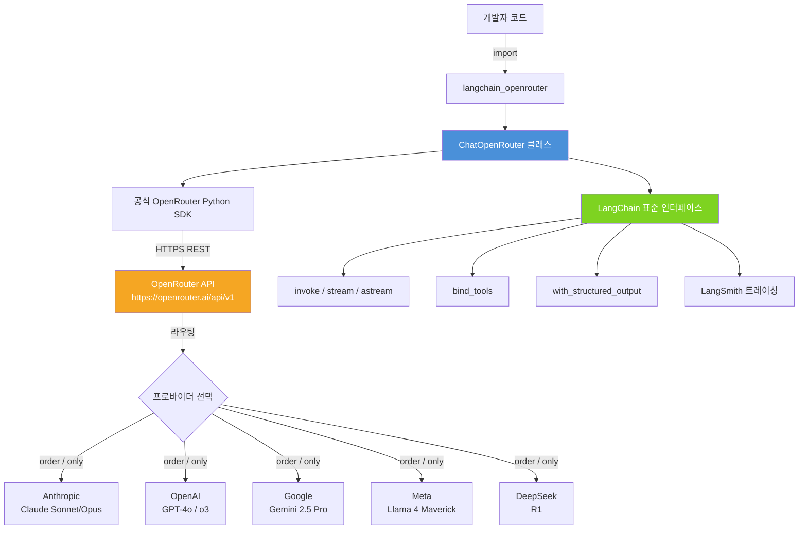
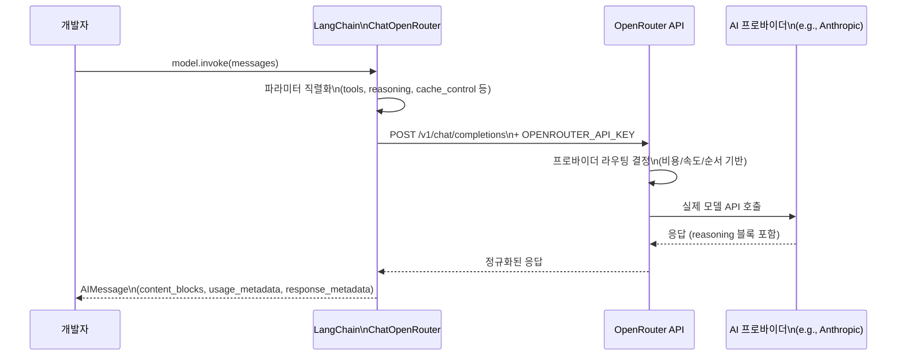
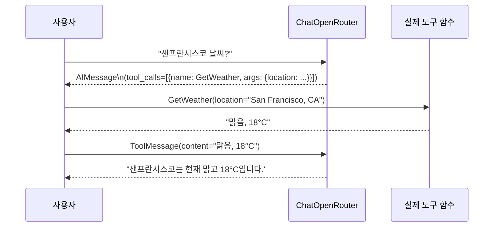
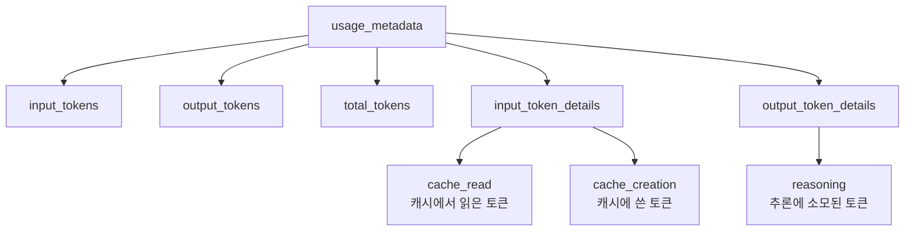
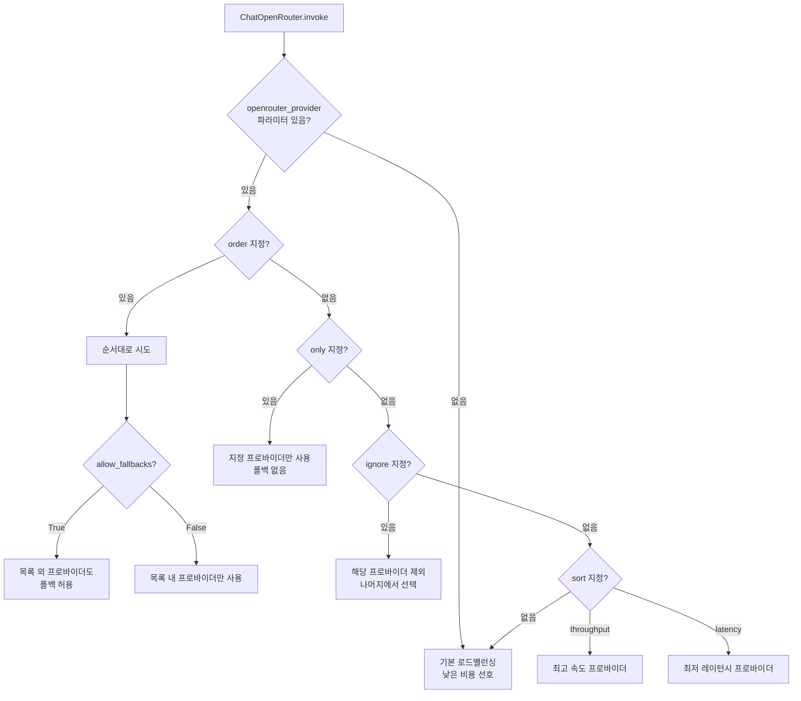
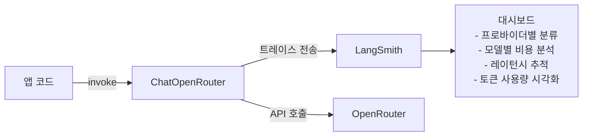
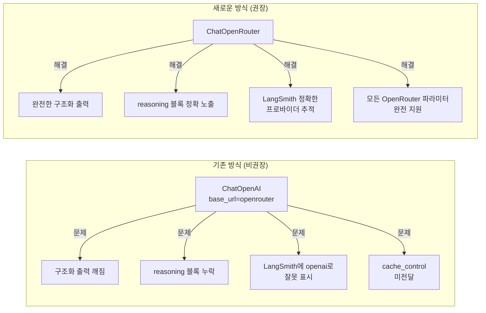

> 작성 기준: 2025년 4월 공식 LangChain 문서 및 최신 릴리즈 정보 반영  
> 원문 출처: https://docs.langchain.com/oss/python/integrations/chat/openrouter

---

## 목차

1. [개요 및 배경](#1-개요-및-배경)
2. [OpenRouter란 무엇인가](#2-openrouter란-무엇인가)
3. [ChatOpenRouter의 탄생 배경](#3-chatopenrouter의-탄생-배경)
4. [전체 아키텍처 다이어그램](#4-전체-아키텍처-다이어그램)
5. [통합 패키지 상세 정보](#5-통합-패키지-상세-정보)
6. [설치 및 인증 설정](#6-설치-및-인증-설정)
7. [모델 인스턴스화 및 기본 호출](#7-모델-인스턴스화-및-기본-호출)
8. [스트리밍](#8-스트리밍)
9. [도구 호출 (Tool Calling)](#9-도구-호출-tool-calling)
10. [구조화된 출력 (Structured Output)](#10-구조화된-출력-structured-output)
11. [추론 출력 (Reasoning Output)](#11-추론-출력-reasoning-output)
12. [멀티모달 입력](#12-멀티모달-입력)
13. [토큰 사용량 메타데이터](#13-토큰-사용량-메타데이터)
14. [응답 메타데이터](#14-응답-메타데이터)
15. [프로바이더 라우팅](#15-프로바이더-라우팅)
16. [앱 어트리뷰션 (Attribution)](#16-앱-어트리뷰션-attribution)
17. [LangSmith 트레이싱 연동](#17-langsmith-트레이싱-연동)
18. [실전 패턴 및 베스트 프랙티스](#18-실전-패턴-및-베스트-프랙티스)
19. [ChatOpenAI 방식과의 비교](#19-chatopenai-방식과의-비교)
20. [JavaScript/TypeScript 지원](#20-javascripttypescript-지원)

---

## 1. 개요 및 배경

`ChatOpenRouter`는 LangChain이 OpenRouter 플랫폼과 공식적으로 통합하기 위해 만든 **퍼스트파티(first-party) 패키지**다. 기존에 개발자들이 `ChatOpenAI`의 `base_url`을 OpenRouter 엔드포인트로 교체하는 편법을 많이 사용해왔는데, 이 방식은 여러 문제—구조화된 출력 깨짐, 추론 콘텐츠 누락, 프로바이더별 기능 미지원, 트레이싱 오류 등—를 지속적으로 유발했다. LangChain 팀은 이 문제를 근본적으로 해결하기 위해 **공식 OpenRouter Python SDK를 기반으로** 전용 통합 패키지를 구축했다.

2025년 4월 현재 `langchain-openrouter` 패키지는 **베타(beta)** 상태이며, Python 환경에서 모든 핵심 기능을 완전히 지원한다. JavaScript/TypeScript용 `@langchain/openrouter`도 별도로 제공된다.

---

## 2. OpenRouter란 무엇인가

OpenRouter는 **멀티 프로바이더 LLM 통합 API**다. 단일 엔드포인트(`https://openrouter.ai/api/v1`)를 통해 OpenAI, Anthropic, Google, Meta, DeepSeek, Mistral 등 수십 개의 AI 모델을 호출할 수 있는 플랫폼이다.

```
                         ┌──────────────┐
                         │  개발자 앱    │
                         └──────┬───────┘
                                │ 단일 API 키 / 단일 엔드포인트
                         ┌──────▼───────┐
                         │  OpenRouter  │
                         │  (라우터)    │
                         └──────┬───────┘
          ┌─────────────┬───────┼─────────────┬─────────────┐
    ┌─────▼────┐  ┌─────▼────┐ ┌▼──────────┐ ┌▼──────────┐ ┌▼──────────┐
    │ Anthropic│  │  OpenAI  │ │  Google   │ │   Meta    │ │ DeepSeek  │
    │ Claude   │  │  GPT-4o  │ │ Gemini    │ │  Llama    │ │    R1     │
    └──────────┘  └──────────┘ └───────────┘ └───────────┘ └───────────┘
```

OpenRouter의 주요 가치는 다음과 같다.

- **단일 API 키**로 수백 개의 모델에 접근 가능
- 프로바이더별 **비용, 속도, 레이턴시** 기반 자동 라우팅
- **프롬프트 캐싱**, 추론 토큰, 멀티모달 입력 등 고급 기능 통일 인터페이스 제공
- **데이터 수집 거부** 정책 설정 가능 (프라이버시 요구사항 충족)

---

## 3. ChatOpenRouter의 탄생 배경

### 기존 방식의 문제점

`ChatOpenAI`에 `base_url`을 교체하는 방식은 이론적으로는 작동하지만 실제로 여러 한계가 있었다.

| 문제 영역 | 구체적 증상 |
|-----------|------------|
| 구조화된 출력 | `with_structured_output` 호출 시 스키마 불일치 |
| 추론 콘텐츠 | `reasoning` 블록이 응답에 포함되지 않음 |
| 프로바이더 기능 | `cache_control`, `data_collection` 등 파라미터 미전달 |
| LangSmith 트레이싱 | 모든 모델이 `openai`로 표시되어 디버깅 불가 |
| 스트리밍 | 일부 프로바이더의 빈 청크로 인한 토큰 누락 |

### 공식 통합 패키지의 해결

`langchain-openrouter`는 공식 OpenRouter Python SDK(`openrouter` 패키지)를 기반으로 구축되어 위 문제를 근본적으로 해결한다. LangSmith 트레이싱은 실제 프로바이더명(`anthropic`, `openai` 등)을 정확히 기록하며, `reasoning` 블록도 `content_blocks`를 통해 올바르게 노출된다.

---

## 4. 전체 아키텍처 다이어그램





---

## 5. 통합 패키지 상세 정보

### Python 패키지

| 항목 | 값 |
|------|----|
| 클래스명 | `ChatOpenRouter` |
| 패키지명 | `langchain-openrouter` |
| PyPI 주소 | https://pypi.org/project/langchain-openrouter/ |
| 직렬화 지원 | beta |
| JS/TS 지원 | ❌ (Python 전용, JS는 별도 패키지) |
| 기반 SDK | 공식 `openrouter` Python SDK |

### 지원 기능 매트릭스

| 기능 | 지원 여부 |
|------|-----------|
| Tool Calling (도구 호출) | ✅ |
| Structured Output (구조화된 출력) | ✅ |
| Image Input (이미지 입력) | ✅ |
| Audio Input (오디오 입력) | ✅ |
| Video Input (비디오 입력) | ✅ |
| Token-level Streaming (토큰 스트리밍) | ✅ |
| Native Async (네이티브 비동기) | ✅ |
| Token Usage (토큰 사용량 추적) | ✅ |
| Logprobs (로그 확률) | ✅ |
| Reasoning Tokens (추론 토큰) | ✅ |
| Prompt Caching (프롬프트 캐싱) | ✅ |

---

## 6. 설치 및 인증 설정

### 패키지 설치

`pip` 또는 `uv` 중 선호하는 방식으로 설치한다.

```bash
# pip 사용
pip install -U langchain-openrouter

# uv 사용 (권장 — 더 빠른 의존성 해결)
uv add langchain-openrouter
```

### API 키 발급

1. https://openrouter.ai/ 에서 계정 생성
2. https://openrouter.ai/settings/keys 에서 API 키 생성
3. 환경 변수로 설정

```python
import getpass
import os

# OPENROUTER_API_KEY 환경 변수 설정
if not os.getenv("OPENROUTER_API_KEY"):
    os.environ["OPENROUTER_API_KEY"] = getpass.getpass("OpenRouter API 키 입력: ")
```

또는 `.env` 파일에 설정:

```bash
OPENROUTER_API_KEY=sk-or-v1-xxxxxxxxxxxx
```

### LangSmith 트레이싱 연동 (선택사항)

LangSmith를 사용하면 모든 LLM 호출을 시각적으로 추적하고 디버깅할 수 있다. `ChatOpenRouter`는 LangSmith와 통합 시 실제 프로바이더명을 올바르게 기록한다는 점이 이전 `ChatOpenAI` 방식과의 핵심 차이점이다.

```python
os.environ["LANGSMITH_API_KEY"] = getpass.getpass("LangSmith API 키 입력: ")
os.environ["LANGSMITH_TRACING"] = "true"
```

---

## 7. 모델 인스턴스화 및 기본 호출

### 인스턴스 생성

```python
from langchain_openrouter import ChatOpenRouter

model = ChatOpenRouter(
    model="anthropic/claude-sonnet-4.5",  # OpenRouter 모델 식별자
    temperature=0,                          # 0: 결정적 출력, 1: 창의적 출력
    max_tokens=1024,                        # 최대 생성 토큰 수
    max_retries=2,                          # 실패 시 재시도 횟수 (각 150초 backoff 추가)
    # api_key="...",                        # 코드 내 직접 주입도 가능
    # timeout_ms=30000,                     # 요청 타임아웃 (밀리초)
)
```

`model` 파라미터에는 OpenRouter 모델 식별자를 `{provider}/{model-name}` 형식으로 지정한다. 사용 가능한 전체 모델 목록은 https://openrouter.ai/models 에서 확인할 수 있다.

주요 모델 예시:
- `anthropic/claude-sonnet-4.5` — Claude Sonnet 4.5
- `anthropic/claude-opus-4.6` — Claude Opus 4.6
- `openai/gpt-4o` — GPT-4o
- `openai/gpt-4.1` — GPT-4.1
- `openai/o3` — OpenAI o3 (추론 모델)
- `google/gemini-2.5-pro-preview` — Gemini 2.5 Pro
- `google/gemini-2.5-flash` — Gemini 2.5 Flash
- `meta-llama/llama-4-maverick` — Llama 4 Maverick
- `deepseek/deepseek-r1` — DeepSeek R1 (추론 모델)

### 기본 호출 (`invoke`)

```python
messages = [
    (
        "system",
        "당신은 영어를 프랑스어로 번역하는 도우미입니다. 사용자 문장을 번역하세요.",
    ),
    ("human", "I love programming."),
]

ai_msg = model.invoke(messages)
print(ai_msg.content)
# "J'adore la programmation."
```

`invoke`는 동기적으로 전체 응답을 받아온다. 메시지는 튜플 `(role, content)` 또는 LangChain 메시지 객체 형태로 전달할 수 있다.

---

## 8. 스트리밍

긴 텍스트 생성 시 토큰이 생성되는 즉시 화면에 출력하려면 `stream` 또는 `astream`을 사용한다.

### 동기 스트리밍

```python
for chunk in model.stream("바다에 대한 짧은 시를 써줘."):
    print(chunk.text, end="", flush=True)
```

### 비동기 스트리밍

```python
async for chunk in model.astream("바다에 대한 짧은 시를 써줘."):
    print(chunk.text, end="", flush=True)
```

비동기 스트리밍은 FastAPI나 비동기 서버 환경에서 응답성을 크게 향상시킨다.

### 스트리밍 중 토큰 사용량 수집

스트리밍 완료 후 마지막 청크에 집계된 토큰 사용량이 포함된다.

```python
stream = model.stream("농담 하나 해줘.")
full = next(stream)
for chunk in stream:
    full += chunk  # 청크 누적

print(full.usage_metadata)
# {'input_tokens': 12, 'output_tokens': 25, 'total_tokens': 37}
```

---

## 9. 도구 호출 (Tool Calling)

`ChatOpenRouter`는 OpenAI 호환 도구 호출 형식을 사용한다. 도구의 이름, 설명, 파라미터 스키마를 정의하면, 모델이 적절한 도구를 선택하고 그 인자를 JSON으로 반환한다.

### 도구 바인딩

Pydantic 클래스, dict 스키마, LangChain 도구, 함수 등 다양한 형태로 도구를 바인딩할 수 있다.

```python
from pydantic import BaseModel, Field


class GetWeather(BaseModel):
    """특정 위치의 현재 날씨를 가져옵니다."""
    location: str = Field(description="도시와 주, 예: San Francisco, CA")


class SearchWeb(BaseModel):
    """웹에서 정보를 검색합니다."""
    query: str = Field(description="검색 쿼리 문자열")


# 여러 도구를 한 번에 바인딩
model_with_tools = model.bind_tools([GetWeather, SearchWeb])
```

### 도구 호출 실행

```python
ai_msg = model_with_tools.invoke("샌프란시스코 날씨가 어때?")

# tool_calls 속성에 표준화된 도구 호출 정보가 담김
print(ai_msg.tool_calls)
# [{'name': 'GetWeather',
#   'args': {'location': 'San Francisco, CA'},
#   'id': 'call_abc123',
#   'type': 'tool_call'}]
```

`tool_calls` 속성은 모델 프로바이더에 무관한 표준화된 형식으로 도구 호출 정보를 제공한다. 이를 통해 Anthropic이든 OpenAI든 동일한 코드로 도구 결과를 처리할 수 있다.

### Strict 모드

`strict=True`를 전달하면 모델 출력이 JSON 스키마와 정확히 일치하도록 강제한다. 프로덕션 환경에서 스키마 준수가 중요한 경우 권장된다.

```python
model_with_tools = model.bind_tools([GetWeather], strict=True)
```

### 도구 호출 흐름



---

## 10. 구조화된 출력 (Structured Output)

`with_structured_output` 메서드를 사용하면 모델이 Pydantic 객체나 dict 형태의 구조화된 응답을 반환하도록 강제할 수 있다. 두 가지 방식이 제공된다.

### 방식 1: `function_calling` (기본값)

도구 호출 메커니즘을 통해 구조화된 출력을 얻는 방식이다.

```python
from langchain_openrouter import ChatOpenRouter
from pydantic import BaseModel, Field

model = ChatOpenRouter(model="openai/gpt-4.1")

class Movie(BaseModel):
    """영화 정보."""
    title: str = Field(description="영화 제목")
    year: int = Field(description="개봉 연도")
    director: str = Field(description="감독 이름")
    rating: float = Field(description="10점 만점 평점")

structured_model = model.with_structured_output(Movie)
response = structured_model.invoke("영화 인셉션에 대한 정보를 알려줘")
print(response)
# Movie(title='Inception', year=2010, director='Christopher Nolan', rating=8.8)
```

### 방식 2: `json_schema`

JSON Schema 기반 구조화 출력 방식이다. 일부 모델에서 더 안정적으로 작동한다.

```python
structured_model = model.with_structured_output(Movie, method="json_schema")
```

### Strict 모드

```python
structured_model = model.with_structured_output(Movie, method="json_schema", strict=True)
```

`strict=True`는 `function_calling`과 `json_schema` 방식에서 사용 가능하며, `json_mode`에서는 지원되지 않는다.

### 에이전트 응답 포맷 지정

에이전트의 최종 응답을 구조화된 형태로 받고 싶을 때 `ProviderStrategy`를 활용한다.

```python
from langchain.agents import create_agent
from langchain.agents.structured_output import ProviderStrategy
from pydantic import BaseModel

class WeatherResponse(BaseModel):
    temperature: float
    condition: str
    city: str

def weather_tool(location: str) -> str:
    """특정 위치의 날씨를 가져옵니다."""
    return f"{location}: 맑음, 22°C"

agent = create_agent(
    model="openrouter:openai/gpt-4.1",
    tools=[weather_tool],
    response_format=ProviderStrategy(WeatherResponse),
)

result = agent.invoke({
    "messages": [{"role": "user", "content": "서울 날씨는?"}]
})
print(result["structured_response"])
# WeatherResponse(temperature=22.0, condition='맑음', city='서울')
```

---

## 11. 추론 출력 (Reasoning Output)

Claude Sonnet 4.5, DeepSeek R1, OpenAI o3 등 **추론(reasoning) 모델**은 답변 생성 전에 내부적으로 사고 과정을 거친다. `ChatOpenRouter`는 이 추론 과정을 `reasoning` 파라미터로 제어하고, 결과를 `content_blocks`를 통해 노출한다.

### 추론 활성화

```python
model = ChatOpenRouter(
    model="anthropic/claude-sonnet-4.5",
    max_tokens=16384,  # 추론 토큰 포함 충분한 컨텍스트 확보
    reasoning={
        "effort": "high",       # 추론 토큰 예산 제어
        "summary": "auto",      # 추론 요약 반환 여부
    },
)

ai_msg = model.invoke("529의 제곱근은?")

# 추론 블록 접근
for block in ai_msg.content_blocks:
    if block["type"] == "reasoning":
        print("[추론 과정]:", block["reasoning"])
    elif block["type"] == "text":
        print("[최종 답변]:", block["text"])
```

### `effort` 파라미터 값

| 값 | 설명 |
|----|------|
| `"xhigh"` | 최대 추론 토큰 할당 (가장 정확, 가장 느림) |
| `"high"` | 높은 추론 예산 |
| `"medium"` | 균형 잡힌 설정 |
| `"low"` | 최소한의 추론 |
| `"minimal"` | 거의 추론하지 않음 |
| `"none"` | 추론 비활성화 |

### `summary` 파라미터 값

| 값 | 설명 |
|----|------|
| `"auto"` | 모델이 적절한 수준 자동 결정 |
| `"concise"` | 간결한 요약 |
| `"detailed"` | 상세한 추론 과정 |

> **주의**: `effort`와 토큰 예산의 매핑은 모델마다 다르다. Google Gemini 모델은 `effort`를 내부 `thinkingLevel`로 매핑하며, 정확한 토큰 수가 아닌 수준값으로 처리된다.

### 추론 토큰 사용량 확인

```python
print(ai_msg.usage_metadata)
# {
#   'input_tokens': 39,
#   'output_tokens': 98,
#   'total_tokens': 137,
#   'output_token_details': {'reasoning': 62}
# }
```

`output_token_details.reasoning` 필드를 통해 추론에 소모된 토큰 수를 확인할 수 있다. 이는 비용 예측과 성능 최적화에 중요한 정보다.

---

## 12. 멀티모달 입력

OpenRouter는 이미지, 오디오, 비디오, PDF 등 다양한 형태의 입력을 지원한다. 단, 모든 모달리티가 모든 모델에서 지원되는 것은 아니므로 https://openrouter.ai/models 에서 모델별 지원 여부를 확인해야 한다.

### 지원 입력 방식

| 방식 | 이미지 | 오디오 | 비디오 | PDF |
|------|--------|--------|--------|-----|
| HTTP/HTTPS URL | ✅ | ❌ | ✅ | ✅ |
| Base64 인라인 | ✅ | ✅ | ✅ | ✅ |

오디오는 URL 방식이 지원되지 않으므로 반드시 Base64로 인코딩하여 전달해야 한다.

### 이미지 입력

**URL 방식:**

```python
from langchain_openrouter import ChatOpenRouter
from langchain.messages import HumanMessage

model = ChatOpenRouter(model="openai/gpt-4o")

message = HumanMessage(
    content=[
        {"type": "text", "text": "이 이미지를 설명해줘."},
        {
            "type": "image",
            "url": "https://upload.wikimedia.org/wikipedia/commons/thumb/d/dd/Gfp-wisconsin-madison-the-nature-boardwalk.jpg/2560px-Gfp-wisconsin-madison-the-nature-boardwalk.jpg",
        },
    ]
)
response = model.invoke([message])
print(response.content)
```

**Base64 방식:**

```python
import base64
import httpx

image_url = "https://picsum.photos/id/237/200/300"
image_data = base64.b64encode(
    httpx.get(image_url, follow_redirects=True).content
).decode("utf-8")

message = HumanMessage(
    content=[
        {"type": "text", "text": "이 이미지를 설명해줘."},
        {
            "type": "image",
            "base64": image_data,
            "mime_type": "image/jpeg",
        },
    ]
)
```

### 오디오 입력

```python
import base64
from pathlib import Path
from langchain_openrouter import ChatOpenRouter
from langchain.messages import HumanMessage

model = ChatOpenRouter(model="google/gemini-2.5-flash")

audio_data = base64.b64encode(
    Path("/path/to/audio.wav").read_bytes()
).decode("utf-8")

message = HumanMessage(
    content=[
        {"type": "text", "text": "이 오디오를 텍스트로 변환해줘."},
        {
            "type": "audio",
            "base64": audio_data,
            "mime_type": "audio/wav",
        },
    ]
)
response = model.invoke([message])
```

### 비디오 입력

비디오 입력은 내부적으로 OpenRouter의 `video_url` 형식으로 자동 변환된다.

```python
# URL 방식
message = HumanMessage(
    content=[
        {"type": "text", "text": "이 영상을 설명해줘."},
        {
            "type": "video",
            "url": "https://example.com/video.mp4",
        },
    ]
)

# Base64 방식
video_data = base64.b64encode(Path("/path/to/video.mp4").read_bytes()).decode("utf-8")
message = HumanMessage(
    content=[
        {"type": "text", "text": "이 영상을 설명해줘."},
        {
            "type": "video",
            "base64": video_data,
            "mime_type": "video/mp4",
        },
    ]
)
```

### PDF 입력

```python
from langchain_openrouter import ChatOpenRouter
from langchain.messages import HumanMessage

model = ChatOpenRouter(model="google/gemini-2.5-pro-preview")

# URL 방식
message = HumanMessage(
    content=[
        {"type": "text", "text": "이 문서를 요약해줘."},
        {
            "type": "file",
            "url": "https://example.com/document.pdf",
            "mime_type": "application/pdf",
        },
    ]
)

# Base64 방식
pdf_data = base64.b64encode(Path("/path/to/doc.pdf").read_bytes()).decode("utf-8")
message = HumanMessage(
    content=[
        {"type": "text", "text": "이 문서를 요약해줘."},
        {
            "type": "file",
            "base64": pdf_data,
            "mime_type": "application/pdf",
        },
    ]
)
```

---

## 13. 토큰 사용량 메타데이터

API 호출 후 `usage_metadata` 속성을 통해 토큰 사용량을 확인할 수 있다. 이는 비용 추적 및 최적화에 필수적인 정보다.

### 기본 토큰 사용량

```python
ai_msg = model.invoke("농담 하나 해줘.")
print(ai_msg.usage_metadata)
# {'input_tokens': 12, 'output_tokens': 25, 'total_tokens': 37}
```

### 추론 토큰 (Reasoning Tokens)

추론 모델을 사용하거나 `reasoning` 파라미터를 활성화하면 `output_token_details.reasoning`에 내부 추론에 소모된 토큰 수가 표시된다.

```python
model = ChatOpenRouter(
    model="anthropic/claude-sonnet-4.5",
    reasoning={"effort": "high"},
)

ai_msg = model.invoke("529의 제곱근은?")
print(ai_msg.usage_metadata)
# {
#   'input_tokens': 39,
#   'output_tokens': 98,
#   'total_tokens': 137,
#   'output_token_details': {'reasoning': 62}
# }
```

### 프롬프트 캐싱 (Cached Input Tokens)

Anthropic Claude 모델은 `cache_control` 파라미터를 통한 프롬프트 캐싱을 지원한다. 캐싱을 활용하면 동일한 시스템 프롬프트를 반복 사용할 때 비용을 크게 절감할 수 있다.

```python
from langchain_openrouter import ChatOpenRouter

model = ChatOpenRouter(model="anthropic/claude-sonnet-4.5")

# 긴 시스템 프롬프트 (캐싱 대상)
long_system = "당신은 도움이 되는 어시스턴트입니다. " * 200

messages = [
    ("system", [{
        "type": "text",
        "text": long_system,
        "cache_control": {"type": "ephemeral"}  # 캐싱 지시
    }]),
    ("human", "안녕?"),
]

# 첫 번째 호출: 캐시 생성
ai_msg = model.invoke(messages)
print(ai_msg.usage_metadata)
# {
#   'input_tokens': 1210,
#   'output_tokens': 12,
#   'total_tokens': 1222,
#   'input_token_details': {'cache_creation': 1201}
# }

# 두 번째 호출: 캐시 읽기 (비용 절감!)
ai_msg = model.invoke(messages)
print(ai_msg.usage_metadata)
# {
#   'input_tokens': 1210,
#   'output_tokens': 12,
#   'total_tokens': 1222,
#   'input_token_details': {'cache_read': 1201}
# }
```

> **팁**: `cache_control`이 없으면 캐싱이 발생하지 않으며 `input_token_details` 필드 자체가 응답에 나타나지 않는다.

### 토큰 메타데이터 구조 요약



---

## 14. 응답 메타데이터

`response_metadata` 속성에는 프로바이더 및 모델에 대한 메타정보가 담겨 있다.

```python
ai_msg = model.invoke("농담 하나 해줘.")
print(ai_msg.response_metadata)
# {
#   'model_name': 'anthropic/claude-sonnet-4.5',
#   'id': 'gen-1771043112-yLUz3txgvHSjkyCQK8KQ',
#   'created': 1771043112,
#   'object': 'chat.completion',
#   'finish_reason': 'stop',
#   'logprobs': None,
#   'model_provider': 'openrouter'
# }
```

| 필드 | 설명 |
|------|------|
| `model_name` | 사용된 모델 식별자 |
| `id` | 요청 고유 ID (OpenRouter generation ID) |
| `created` | 생성 타임스탬프 (Unix epoch) |
| `object` | 응답 객체 타입 |
| `finish_reason` | 생성 종료 이유 (`stop`, `tool_calls`, `length` 등) |
| `logprobs` | 로그 확률 (활성화 시) |
| `model_provider` | 현재 항상 `"openrouter"` |
| `native_finish_reason` | (선택적) 실제 프로바이더의 원본 종료 이유 |

`native_finish_reason`은 프로바이더마다 종료 이유 명칭이 다를 때 원본 값을 보존하기 위해 포함된다.

---

## 15. 프로바이더 라우팅

OpenRouter의 가장 강력한 기능 중 하나는 **프로바이더 라우팅**이다. 동일한 모델이 여러 프로바이더(예: Anthropic 직접, Google Cloud를 통한 Claude 등)에서 서빙될 때, 어떤 프로바이더를 우선 사용할지 세밀하게 제어할 수 있다.

### 라우팅 의사결정 흐름



### 프로바이더 순서 지정

```python
# Anthropic을 우선, 불가능 시 Google로 폴백
model = ChatOpenRouter(
    model="anthropic/claude-sonnet-4.5",
    openrouter_provider={
        "order": ["Anthropic", "Google"],
        "allow_fallbacks": True,  # 기본값: 목록 외 폴백도 허용
    },
)
```

### 프로바이더 필터링

```python
# 특정 프로바이더만 사용 (폴백 없음)
model = ChatOpenRouter(
    model="openai/gpt-4o",
    openrouter_provider={"only": ["OpenAI", "Azure"]},
)

# 특정 프로바이더 제외
model = ChatOpenRouter(
    model="meta-llama/llama-4-maverick",
    openrouter_provider={"ignore": ["DeepInfra"]},
)
```

### 비용/속도/레이턴시 기준 정렬

```python
# 가장 빠른 처리량 (tokens/sec 최대) 우선
model = ChatOpenRouter(
    model="openai/gpt-4o",
    openrouter_provider={"sort": "throughput"},
)

# 가장 낮은 응답 레이턴시 우선
model = ChatOpenRouter(
    model="openai/gpt-4o",
    openrouter_provider={"sort": "latency"},
)
```

### 데이터 수집 거부

GDPR, 기업 데이터 보호 정책 등으로 인해 AI 프로바이더가 요청 데이터를 저장하거나 학습에 사용하지 못하도록 설정할 수 있다.

```python
model = ChatOpenRouter(
    model="anthropic/claude-sonnet-4.5",
    openrouter_provider={"data_collection": "deny"},
)
```

이 설정은 데이터를 수집하는 프로바이더를 자동으로 라우팅에서 제외한다.

### 양자화 수준 필터링

오픈소스 모델(Llama, Mistral 등)은 여러 정밀도(quantization)로 서빙된다. 특정 정밀도 수준을 요구할 때 사용한다.

```python
model = ChatOpenRouter(
    model="meta-llama/llama-4-maverick",
    openrouter_provider={"quantizations": ["fp16", "bf16"]},  # 고정밀도만 허용
)
```

| 양자화 값 | 설명 |
|-----------|------|
| `fp16` | 16비트 부동소수점 (고품질) |
| `bf16` | 뇌 부동소수점 16비트 (고품질) |
| `int8` | 8비트 정수 (중간 품질, 빠름) |
| `int4` | 4비트 정수 (낮은 품질, 가장 빠름) |

### Route 파라미터

```python
# fallback: 자동 장애 조치 활성화 (기본 동작)
model = ChatOpenRouter(
    model="anthropic/claude-sonnet-4.5",
    route="fallback",
)

# sort: openrouter_provider에 설정된 정렬 전략 기반 라우팅
model = ChatOpenRouter(
    model="anthropic/claude-sonnet-4.5",
    openrouter_provider={"sort": "latency"},
    route="sort",
)
```

### 복합 옵션 조합

여러 라우팅 옵션을 함께 적용할 수 있다.

```python
model = ChatOpenRouter(
    model="openai/gpt-4o",
    openrouter_provider={
        "order": ["OpenAI", "Azure"],
        "allow_fallbacks": False,        # 엄격 — 목록 내 프로바이더만
        "require_parameters": True,      # 모든 파라미터 지원하는 프로바이더만
        "data_collection": "deny",       # 데이터 수집 거부
    },
)
```

---

## 16. 앱 어트리뷰션 (Attribution)

OpenRouter 대시보드에서 앱별 API 사용량을 추적하기 위해 앱 정보를 HTTP 헤더로 전달할 수 있다. 이는 멀티 앱을 운영하는 개발자나 팀에게 유용하다.

```python
model = ChatOpenRouter(
    model="anthropic/claude-sonnet-4.5",
    app_url="https://myapp.com",    # HTTP-Referer 헤더 → 환경변수: OPENROUTER_APP_URL
    app_title="My App",             # X-Title 헤더 → 환경변수: OPENROUTER_APP_TITLE
)
```

환경 변수로도 설정 가능하다.

```bash
export OPENROUTER_APP_URL="https://myapp.com"
export OPENROUTER_APP_TITLE="My App"
```

추가로 마켓플레이스 카테고리도 지정할 수 있다.

```python
model = ChatOpenRouter(
    model="anthropic/claude-sonnet-4.5",
    app_categories=["cli-agent", "programming-app"],  # X-OpenRouter-Categories 헤더
)
```

---

## 17. LangSmith 트레이싱 연동

`ChatOpenRouter`는 LangSmith와 완전히 통합된다. 이전에 `ChatOpenAI` + `base_url` 방식을 사용했을 때 모든 모델이 `openai`로 표시되던 문제가 해결되어, 이제 실제 프로바이더명이 정확히 기록된다.



```python
import os

os.environ["LANGSMITH_API_KEY"] = "ls__xxxx"
os.environ["LANGSMITH_TRACING"] = "true"
os.environ["LANGSMITH_PROJECT"] = "my-openrouter-project"  # 선택사항

from langchain_openrouter import ChatOpenRouter

model = ChatOpenRouter(model="anthropic/claude-sonnet-4.5")
ai_msg = model.invoke("안녕!")
# → LangSmith에 프로바이더: anthropic, 모델: claude-sonnet-4.5 로 정확히 기록됨
```

---

## 18. 실전 패턴 및 베스트 프랙티스

### 패턴 1: 다중 모델 비교 테스트

```python
from langchain_openrouter import ChatOpenRouter

models = [
    "anthropic/claude-sonnet-4.5",
    "openai/gpt-4o",
    "google/gemini-2.5-flash",
    "deepseek/deepseek-r1",
]

prompt = "머신러닝에서 과적합(overfitting)을 방지하는 방법 3가지를 간결하게 설명해줘."

results = {}
for model_id in models:
    model = ChatOpenRouter(model=model_id, temperature=0)
    response = model.invoke(prompt)
    results[model_id] = response.content
    print(f"\n[{model_id}]:\n{response.content[:200]}...")
```

### 패턴 2: 비용 최적화 라우팅

```python
# 개발/테스트: 빠른 처리량 우선
dev_model = ChatOpenRouter(
    model="anthropic/claude-sonnet-4.5",
    openrouter_provider={"sort": "throughput"},
)

# 프로덕션: 데이터 수집 거부 + Anthropic 직접 우선
prod_model = ChatOpenRouter(
    model="anthropic/claude-sonnet-4.5",
    openrouter_provider={
        "order": ["Anthropic"],
        "allow_fallbacks": False,
        "data_collection": "deny",
    },
)
```

### 패턴 3: 장문 처리 + 프롬프트 캐싱

```python
from langchain_openrouter import ChatOpenRouter

model = ChatOpenRouter(model="anthropic/claude-sonnet-4.5")

# 긴 시스템 컨텍스트를 캐싱으로 비용 절감
system_context = """
당신은 금융 분석 전문가입니다. 아래 회사 재무 데이터를 기반으로 분석합니다.
[...매우 긴 재무 보고서 데이터...]
""" * 50  # 수천 토큰 분량

# cache_control로 캐싱 지정
messages_template = [
    ("system", [{
        "type": "text",
        "text": system_context,
        "cache_control": {"type": "ephemeral"}
    }]),
]

# 여러 질문을 같은 캐시된 컨텍스트로 처리
questions = [
    "2024년 매출 성장률은?",
    "주요 리스크 요인은?",
    "경쟁사 대비 마진 차이는?",
]

for q in questions:
    msgs = messages_template + [("human", q)]
    response = model.invoke(msgs)
    print(f"Q: {q}\nA: {response.content}\n")
    # 첫 호출 이후 시스템 프롬프트 캐시 재사용 → 비용 절감
```

### 패턴 4: 추론 모델을 활용한 복잡한 문제 해결

```python
from langchain_openrouter import ChatOpenRouter

# 고난이도 문제에 추론 모델 활용
reasoning_model = ChatOpenRouter(
    model="anthropic/claude-sonnet-4.5",
    max_tokens=16384,
    reasoning={"effort": "high", "summary": "detailed"},
)

problem = """
다음 알고리즘 문제를 해결하는 최적의 Python 코드를 작성하세요:
주어진 정수 배열에서 합이 K가 되는 두 수의 인덱스를 찾아라.
배열 크기 n은 최대 10^5이고, 각 원소는 -10^9 ~ 10^9 범위이다.
시간복잡도 O(n), 공간복잡도 O(n)으로 해결하라.
"""

response = reasoning_model.invoke(problem)

# 추론 과정과 최종 답변 분리 출력
for block in response.content_blocks:
    if block["type"] == "reasoning":
        print("=== 추론 과정 ===")
        print(block["reasoning"][:500], "...")
    elif block["type"] == "text":
        print("\n=== 최종 답변 ===")
        print(block["text"])

# 추론 토큰 사용량
print("\n=== 토큰 사용량 ===")
print(response.usage_metadata)
```

### 패턴 5: LangChain 에이전트와 통합

```python
from langchain_openrouter import ChatOpenRouter
from langchain.agents import AgentExecutor, create_tool_calling_agent
from langchain.tools import tool
from langchain.prompts import ChatPromptTemplate

def get_stock_price(ticker: str) -> str:
    """주식 가격을 가져옵니다."""
    # 실제 구현에서는 외부 API 호출
    prices = {"AAPL": 185.50, "GOOGL": 175.20, "MSFT": 420.30}
    return f"{ticker}: ${prices.get(ticker, 'N/A')}"

def calculate_portfolio_value(holdings: str) -> str:
    """포트폴리오 가치를 계산합니다. holdings는 'TICKER:SHARES' 형태."""
    # 간단한 예시
    return f"포트폴리오 총 가치: $50,000"

model = ChatOpenRouter(
    model="anthropic/claude-sonnet-4.5",
    temperature=0,
)

tools = [get_stock_price, calculate_portfolio_value]

prompt = ChatPromptTemplate.from_messages([
    ("system", "당신은 포트폴리오 관리 어시스턴트입니다."),
    ("human", "{input}"),
    ("placeholder", "{agent_scratchpad}"),
])

agent = create_tool_calling_agent(model, tools, prompt)
agent_executor = AgentExecutor(agent=agent, tools=tools, verbose=True)

result = agent_executor.invoke({
    "input": "AAPL 10주와 GOOGL 5주 포트폴리오의 현재 가치는?"
})
print(result["output"])
```

---

## 19. ChatOpenAI 방식과의 비교

기존에 많이 사용되던 `ChatOpenAI` + `base_url` 방식과 `ChatOpenRouter` 방식을 비교한다.



| 비교 항목 | `ChatOpenAI` + `base_url` | `ChatOpenRouter` |
|-----------|--------------------------|------------------|
| 구조화된 출력 | ⚠️ 불안정 | ✅ 완전 지원 |
| 추론 토큰 접근 | ❌ 미지원 | ✅ `content_blocks` |
| LangSmith 트레이싱 | ⚠️ 모두 `openai`로 표시 | ✅ 실제 프로바이더명 |
| 프롬프트 캐싱 | ❌ `cache_control` 미전달 | ✅ 완전 지원 |
| 프로바이더 라우팅 | ❌ 불가 | ✅ 세밀한 제어 |
| 데이터 수집 정책 | ❌ 설정 불가 | ✅ `data_collection: deny` |
| 공식 지원 | ❌ 편법 | ✅ 퍼스트파티 통합 |
| 유지보수 | ❌ 수동 업데이트 | ✅ OpenRouter SDK 자동 연동 |

---

## 20. JavaScript/TypeScript 지원

Python 외에도 JavaScript/TypeScript 환경을 위한 `@langchain/openrouter` 패키지가 별도로 제공된다.

```bash
npm install @langchain/openrouter @langchain/core
```

```typescript
import { ChatOpenRouter } from "@langchain/openrouter";
import { tool } from "@langchain/core/tools";
import { z } from "zod";

// 기본 사용
const model = new ChatOpenRouter({
  model: "openai/gpt-4o",
  // apiKey: "...",  // 또는 OPENROUTER_API_KEY 환경변수
});

const response = await model.invoke([
  { role: "user", content: "안녕! 반가워." }
]);
console.log(response.content);

// 스트리밍
const stream = await model.stream([{ role: "user", content: "짧은 시를 써줘" }]);
for await (const chunk of stream) {
  process.stdout.write(chunk.content as string);
}

// 도구 호출
const calculator = tool(
  async ({ a, b }: { a: number; b: number }) => `${a + b}`,
  {
    name: "add",
    description: "두 수를 더합니다",
    schema: z.object({ a: z.number(), b: z.number() }),
  }
);

const modelWithTools = new ChatOpenRouter({ model: "openai/gpt-4o" }).bindTools([calculator]);
const toolResponse = await modelWithTools.invoke("3 + 7은 얼마야?");
console.log(toolResponse.tool_calls);
```

> **참고**: JS/TS 패키지는 Python 패키지와 별도로 개발되며, SDK 의존성 없이 직접 OpenRouter REST API를 호출하는 방식으로 구현되어 있다. 현재 버전은 `0.2.1` (2025년 4월 기준).

---

## 부록: ChatOpenRouter 전체 파라미터 참조

| 파라미터 | 타입 | 기본값 | 설명 |
|----------|------|--------|------|
| `model` | `str` | 필수 | 모델 식별자 (`provider/model-name`) |
| `temperature` | `float` | 1.0 | 출력 무작위성 (0~2) |
| `max_tokens` | `int` | None | 최대 생성 토큰 |
| `max_retries` | `int` | 2 | 실패 시 재시도 횟수 |
| `timeout_ms` | `int` | None | 요청 타임아웃 (밀리초) |
| `api_key` | `str` | env var | OpenRouter API 키 |
| `reasoning` | `dict` | None | 추론 설정 (`effort`, `summary`) |
| `openrouter_provider` | `dict` | None | 프로바이더 라우팅 설정 |
| `route` | `str` | `"fallback"` | 라우팅 전략 |
| `app_url` | `str` | LangChain docs | 앱 URL (어트리뷰션) |
| `app_title` | `str` | `"LangChain"` | 앱 이름 (어트리뷰션) |
| `app_categories` | `list` | None | 마켓플레이스 카테고리 |
| `top_p` | `float` | None | 핵 샘플링 파라미터 |
| `frequency_penalty` | `float` | None | 반복 패널티 |
| `presence_penalty` | `float` | None | 새로운 주제 장려 패널티 |
| `seed` | `int` | None | 재현 가능한 출력을 위한 시드 |
| `stop` | `list` | None | 중단 시퀀스 |
| `n` | `int` | 1 | 생성할 응답 수 |
| `streaming` | `bool` | False | 스트리밍 모드 여부 |

---

## 참고 자료

- [LangChain ChatOpenRouter 공식 문서](https://docs.langchain.com/oss/python/integrations/chat/openrouter)
- [ChatOpenRouter API 레퍼런스](https://reference.langchain.com/python/integrations/langchain_openrouter)
- [OpenRouter 공식 문서](https://openrouter.ai/docs)
- [OpenRouter 모델 목록](https://openrouter.ai/models)
- [OpenRouter 프로바이더 라우팅 문서](https://openrouter.ai/docs/guides/routing/provider-selection)
- [OpenRouter 추론 토큰 가이드](https://openrouter.ai/docs/guides/best-practices/reasoning-tokens)
- [LangChain GitHub 토론 — langchain-openrouter 발표](https://github.com/langchain-ai/langchain/discussions/35672)
- [LangSmith 트레이싱 문서](https://docs.langchain.com/langsmith/home)

---

> 이 문서는 2025년 4월 15일 공식 LangChain 문서 및 최신 GitHub 릴리즈 정보를 기반으로 작성되었습니다.
