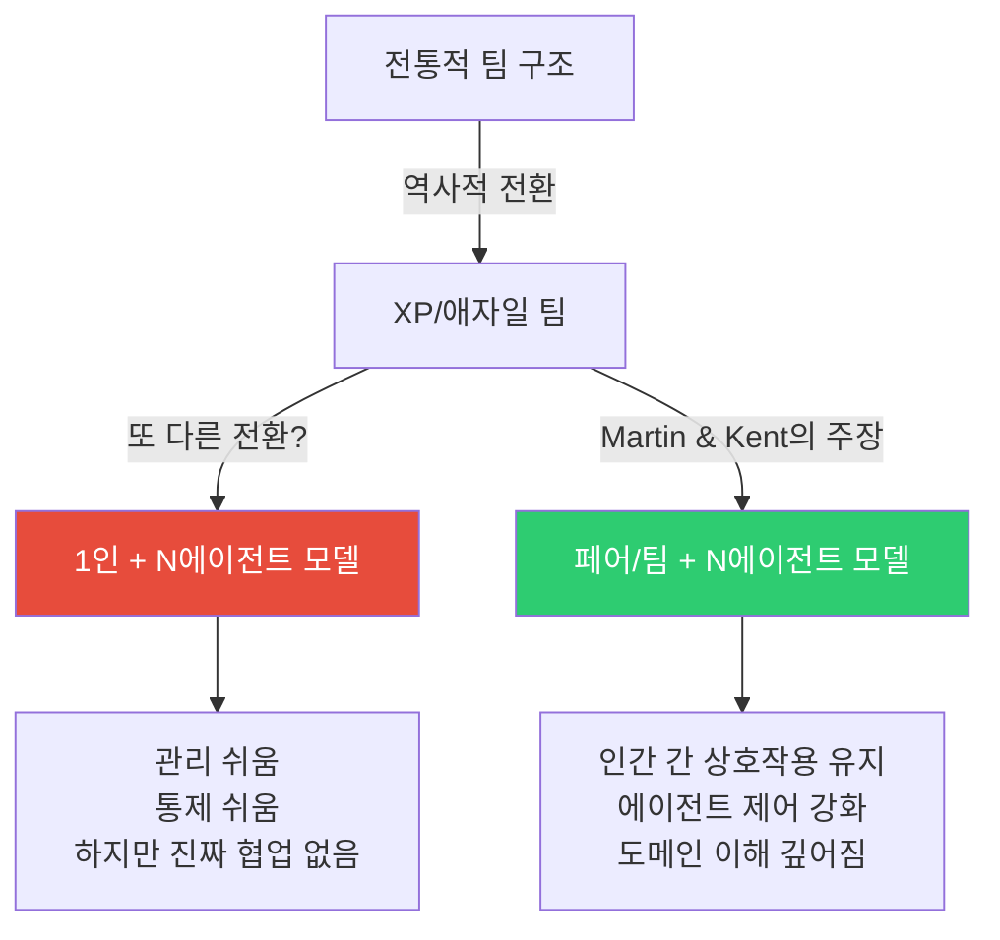
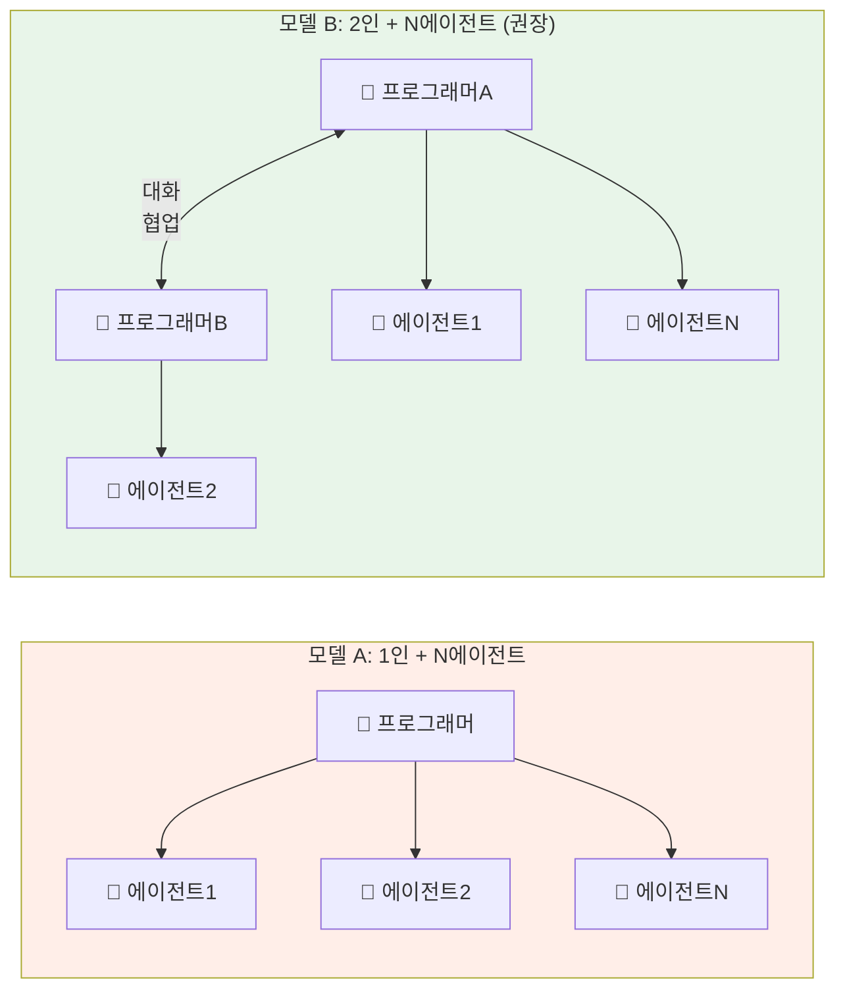
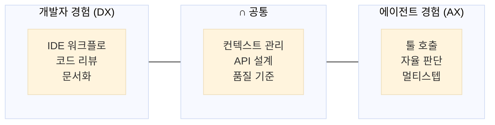
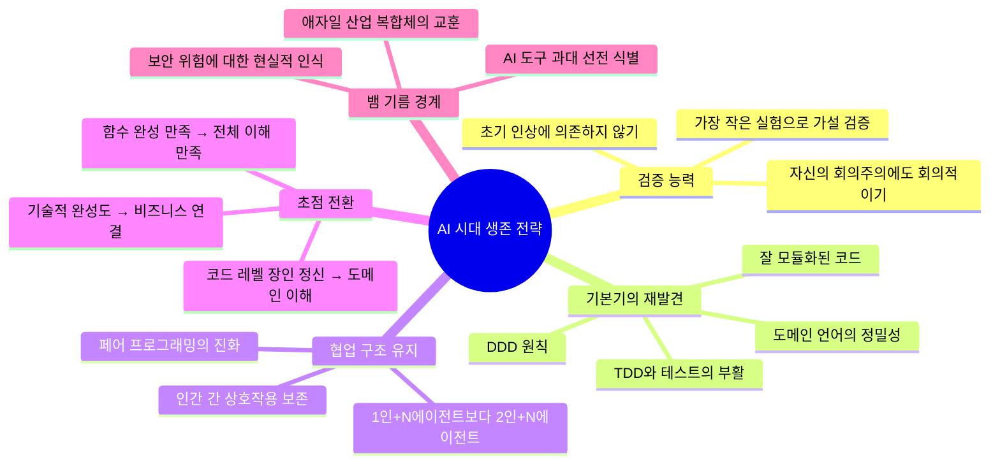

> **출처:** The Pragmatic Summit 2026 (2026년 2월 11일, 샌프란시스코)  
> **진행:** Gergely Orosz (The Pragmatic Engineer 뉴스레터 창시자)  
> **원본 영상:** https://www.youtube.com/watch?v=CZs8J1ZD0CE  
> **게시일:** 2026년 4월 8일  

---

## 목차

1. [대담의 배경과 두 거장에 대하여](#1-대담의-배경과-두-거장에-대하여)
2. [애자일·TDD·리팩터링: 남겨진 유산](#2-애자일tdd리팩터링-남겨진-유산)
3. [역사적 유추: 마이크로프로세서부터 인터넷, OO, 애자일까지](#3-역사적-유추-마이크로프로세서부터-인터넷-oo-애자일까지)
4. [왜 좋은 실천법도 실패하는가](#4-왜-좋은-실천법도-실패하는가)
5. [AI 전환이 이전과 다른 이유](#5-ai-전환이-이전과-다른-이유)
6. [엔지니어가 여러 에이전트를 관리하는 시대](#6-엔지니어가-여러-에이전트를-관리하는-시대)
7. [원 피자 팀 vs 투 피자 팀](#7-원-피자-팀-vs-투-피자-팀)
8. [개발자 경험과 에이전트 경험의 교집합](#8-개발자-경험과-에이전트-경험의-교집합)
9. [현장의 목소리: 기업들은 지금 무엇을 하고 있는가](#9-현장의-목소리-기업들은-지금-무엇을-하고-있는가)
10. [AI 시대 소프트웨어 장인으로 살아남기](#10-ai-시대-소프트웨어-장인으로-살아남기)
11. [종합 해석 및 시사점](#11-종합-해석-및-시사점)

---

## 1. 대담의 배경과 두 거장에 대하여

### The Pragmatic Summit 2026이란

2026년 2월 11일, 샌프란시스코에서 개최된 **The Pragmatic Summit**은 Gergely Orosz가 운영하는 The Pragmatic Engineer 뉴스레터의 첫 번째 오프라인 컨퍼런스다. OpenAI, Linear, Thoughtworks 등 업계 최전선의 인사들이 한데 모인 이 행사에서 가장 뜨거운 관심을 받은 세션이 바로 Martin Fowler와 Kent Beck의 대담이었다.

진행자 Gergely Orosz는 무대에서 이 두 사람의 등장을 보며 솔직하게 놀라움을 표했다. AI 스타트업과 최첨단 기술 기업들로 가득 찬 자리에 소프트웨어 공학의 두 거장이 나타났다는 것 자체가 의미 있는 장면이었기 때문이다. 이 자리는 단순한 회고나 추억의 자리가 아니라, 25년 이상의 경험을 바탕으로 현재의 AI 전환을 어떻게 이해하고 항법해야 하는가를 논하는 깊이 있는 대화였다.

이 대담이 유튜브에 공식 게시된 것은 2026년 4월 8일로, 행사로부터 약 두 달 후의 일이다. 그만큼 편집과 정리에 공을 들인 콘텐츠이며, 현재 Pragmatic Engineer 뉴스레터에 전체 텍스트 요약본도 함께 게재되어 있다.

### Martin Fowler는 누구인가

Martin Fowler는 Thoughtworks의 수석 아키텍트(Chief Scientist)로, 소프트웨어 공학 분야에서 가장 영향력 있는 저술가 중 한 명이다. 그의 대표작인 *Refactoring: Improving the Design of Existing Code*(리팩터링, 1999년 초판, 2018년 2판)는 수십 년이 지난 지금도 전 세계 개발자들의 필독서로 꼽힌다. 또한 *Patterns of Enterprise Application Architecture*는 엔터프라이즈 소프트웨어 설계의 고전이 됐다.

Fowler는 스스로 겸손하게 말하기를, "내 커리어의 대부분은 Kent Beck의 아이디어를 받아 적는 것"이라고 표현하곤 한다. 실제로 두 사람은 1990년대부터 협업해왔으며, 그 결실이 Extreme Programming(XP), 리팩터링, 그리고 2001년 애자일 선언(Agile Manifesto)으로 이어졌다. 현재 Fowler는 개인 웹사이트 [martinfowler.com](https://martinfowler.com)을 중심으로 현장 개발자들의 AI 활용 경험을 수집하고 정리하는 작업에 집중하고 있다.

### Kent Beck은 누구인가

Kent Beck은 Extreme Programming(XP)의 창시자이자 TDD(Test-Driven Development, 테스트 주도 개발)의 선구자다. 2001년 애자일 선언의 공동 저자이기도 한 그는, 알파벳 순서상 첫 번째로 서명인 목록에 올라간 사람이기도 하다. 이에 대해 그는 "알파벳 순서일 뿐"이라고 말하지만, 동시에 "끝없는 기쁨의 원천"이라고 웃으며 덧붙인다.

52년의 코딩 경력을 가진 Kent Beck은 Facebook(현 Meta) 재직 시절 피처 플래그(feature flag) 개념을 도입하는 등 실무에도 깊이 관여해왔다. 그의 최신 저서 *Tidy First?*는 Empirical Software Design 시리즈의 일환으로, AI 시대에도 소프트웨어 설계의 기본기가 얼마나 중요한지를 다룬다. 현재 Beck은 Rust로 라이브러리 품질의 코드를 작성하고, 오랫동안 원했던 Smalltalk 퍼시스턴트 서버를 AI의 도움으로 구축하는 등 왕성한 실험을 계속하고 있다.

---

## 2. 애자일·TDD·리팩터링: 남겨진 유산

### "TDD가 내 인생을 망쳤다"

대담의 첫 번째 화두는 지난 25년간 엔지니어들이 두 사람의 아이디어에서 실제로 무엇을 가져갔는가였다. Fowler는 리팩터링이 가장 많이 회자된다고 했다. Beck은 조금 더 복잡한 이야기를 들려줬다.

그는 TDD에 대해 감사 인사를 받기도 하지만, 동시에 "TDD가 내 인생을 망쳤다. 개가 떠났고, 집이 불탔고, 다 당신 때문이다"라는 극단적인 반응도 받는다고 말했다. 농담처럼 들리지만, 이 발언은 TDD가 얼마나 논쟁적인 실천법인지를 단적으로 보여준다. 현장에서 TDD를 경험한 개발자들 중 많은 이가 처음에는 신봉자였다가 어느 시점에서 등을 돌리는 패턴을 보이기도 한다.

### TDD의 재발견: AI 에이전트 시대에

그런데 흥미로운 역전이 일어나고 있다. Beck은 최근 AI 에이전트 분야를 적극적으로 밀고 있는 한 인물로부터 들은 이야기를 소개했다. 그 사람이 말하기를, "지난 20년간 TDD를 밀어온 당신들 덕분에 지금 AI 에이전트가 있는 시대에 정말로 중요한 것이 준비돼 있다"라고 했다는 것이다.

이 말이 왜 중요한가. AI 에이전트는 강력한 "지니(genie)"처럼 원하는 것을 이뤄주는 것처럼 보이지만, 그것이 **올바른 일을 하고 있는지를 검증하는 방법**이 필요하다. TDD가 25년간 우리에게 심어준 것이 바로 그 검증 능력이다. 테스트는 단순한 버그 방지 도구가 아니라 **의도를 명확히 하고 결과를 검증하는 의사소통 수단**이며, 이는 AI 에이전트와의 협업에서도 본질적으로 동일하게 작동한다.

Beck 자신도 이 논리가 맞는 방향이라고 느끼지만, 동시에 스스로에게 경고한다. "내가 듣고 싶은 말이라서 그냥 믿고 싶은 것인지" 항상 의심해야 한다는 것이다. 이 자기 비판적 태도야말로 두 거장이 수십 년간 신뢰를 쌓아온 이유다.

---

## 3. 역사적 유추: 마이크로프로세서부터 인터넷, OO, 애자일까지

### "이 크기의 충격은 없었다"

Gergely Orosz가 두 사람에게 물었다. "AI처럼 예측 불가능하고 두렵게 느껴졌던 기술 변화를 경력 중에 경험한 적이 있는가?" Fowler의 답은 명확했다.

> "AI의 규모로 충격을 준 것은 없었습니다. 이것은 우리가 이전에 겪었던 어떤 것과도 차원이 다릅니다."

그는 객체지향 언어의 부상, 인터넷의 등장, 애자일 소프트웨어 개발의 도전을 모두 언급했다. 애자일은 많은 조직에서 큰 충격을 줬는데, "얼마나 강하게 저항했는지를 보면 그 충격의 크기를 알 수 있다"고 했다. 하지만 AI는 그것들과 다르다. 이전의 변화들은 중요성을 **설득해야** 했다. 인터넷조차도 처음에는 중요성을 인정받지 못했다. 그러나 AI는 아무도 그 중요성을 부정할 수 없다.

### Kent Beck의 마이크로프로세서 유추

Beck은 또 다른 유추를 꺼냈다. 바로 **마이크로프로세서의 등장**이다. 이전까지 컴퓨터는 거대한 상자였다. 하나 더 사려면 집을 담보로 잡아야 할 정도로 비쌌다. 그러던 어느 날, 실리콘 밸리에서 어린 시절을 보낸 Beck은 아버지가 프로그래머로 일하던 중 **Intel 4004**를 처음 접했다.

"잠깐, 이게 컴퓨터잖아." 상상의 가능성이 폭발적으로 확장되는 순간이었다. 소프트웨어를 작성하는 법을 익히고, 이 칩 주변에 하드웨어를 설계하는 법을 알아내면, 상상할 수도 없었던 것들을 해낼 수 있게 된다는 인식. Beck은 AI가 바로 그런 **상상력의 확장**을 가져다준다고 봤다.

그 결과 그는 지금 터무니없이 야망 찬 프로젝트들을 진행하고 있다. Rust로 라이브러리 품질의 코드를 쓰고, 오랫동안 원했던 퍼시스턴트 Smalltalk 서버를 만들고 있다. 실패하는 것들도 많지만, 그것 자체가 이 과정의 일부다.

### 기술 전환의 시대를 가르는 차이

두 사람은 새로운 기술 물결을 타는 데 성공한 사람과 뒤처진 사람을 가르는 것에 대해서도 이야기했다. Fowler는 공통된 패턴을 지적했다. 어떤 변화가 와도 항상 **과대 선전을 쫓는 사람들**과 **"이건 특별한 게 없다"고 부정하는 사람들**이 존재했다. 그 사이에서 균형 잡힌 **회의주의와 호기심**을 유지하는 것이 관건이었다.

Fowler는 블록체인에 대해 극히 회의적이었다고 솔직하게 인정했다. 그러면서 덧붙였다. 자신의 회의주의는 절대적이어야 하는데, 그 말인즉슨 **회의주의 자체에 대해서도 회의적이어야 한다**는 뜻이라고. 그래서 "이건 그런 것처럼 보이지만, 혹시 아닐 수도 있다. 어떻게 탐색해야 신호를 포착할 수 있을까?"라는 질문이 항상 살아있어야 한다고 했다.

Beck이 이 대목에서 강조한 것은, 초기 경험이 진짜 신호가 아닐 수 있다는 점이다. 그는 초기 Copilot 스타일의 도구를 Emacs에서 사용해봤는데, 3~4일 만에 포기했다. 가끔은 훌륭한 결과를 내놓지만 대부분은 쓰레기였고, 그냥 즉시 삭제해버리게 됐다. 만약 그 경험만으로 AI 전체를 판단했다면 블록체인처럼 "보조 스위치를 내려버렸을" 것이다.

그러나 Beck은 계속 탐색했다. 동료 Simon Willis의 블로그를 읽으며 **"이 도구를 잘 쓰려면 잘 쓰는 법을 배워야 한다"** 는 통찰을 얻었다. 이것이 AI에 대한 초기 인상을 교정하는 결정적 계기였다. 그는 또 Thoughtworks의 동료 Mike Mason, Birgitta Böckeler 등을 통해 초기 반응에 너무 의존하지 말아야 한다는 것을 배웠다고 말했다.

---

## 4. 왜 좋은 실천법도 실패하는가

### "사람들은 더 빠르고, 더 싸고, 더 좋은 것을 원하지 않는다"

진행자 Gergely는 흥미로운 도발을 던졌다. 25년 전 애자일 선언이 나왔을 때 메시지는 단순했다. 더 나은 소프트웨어를, 더 빠르게, 더 저렴하게. 그런데 AI도 지금 기업들에 똑같은 약속을 하고 있다. 그렇다면 애자일은 실제로 어떻게 흘러갔는가?

Beck의 답변은 충격적이었다.

> "알고 보니, 사람들은 더 빠르고 더 저렴하고 더 좋은 것을 원하지 않는다는 게 밝혀졌습니다."

조직 내부의 인센티브가 그것을 실제로 달성하는 방향과 완전히 어긋나 있다는 것이다. 기술자들이 "40% 더 낫고 12% 더 싸다"는 것을 증명해도, 그것이 내부 권력 구조나 개인적 인센티브와 맞지 않으면 **처벌받는다**. 이상적인 조직이라면 모두가 같은 것을 신경 쓰겠지만, 현실의 조직은 그렇게 작동하지 않는다.

Beck은 이 문제를 우리가 아직 해결하지 못했다고 했다. 그리고 만약 AI가 같은 약속을 들고 나타난다면, 같은 반응을 보게 될 것이라고 경고했다.

### 애자일 산업 복합체의 그늘

Fowler는 또 다른 유사점을 지적했다. 애자일과 XP의 핵심 원칙들은 견고하고 훌륭하다. 하지만 그 주변에 거대한 **뱀 기름(snake oil) 산업**이 형성됐다. 그가 즐겨 쓰는 표현으로 "애자일 산업 복합체(Agile Industrial Complex)"가 등장했다. 무엇이 진짜이고 무엇이 사기인지를 구별하기 어려워진 것이다.

이와 똑같은 현상이 AI에서도 지금 일어나고 있다. 진짜 가치와 과대 선전을 끊임없이 탐색하고, 의심하고, 검증해야 한다.

---

## 5. AI 전환이 이전과 다른 이유

### AI는 증폭기(amplifier)다

Beck은 AI를 **증폭기**로 규정했다. 그리고 이 은유는 양날의 검이다.

> "AI는 증폭기입니다. 만약 당신이 젊고 빠르게 배우고 있다면, AI는 그것을 증폭시킵니다. 그게 바로 지금이 주니어 프로그래머의 황금기라고 생각하는 이유입니다."

그는 자녀가 컴퓨터공학 2학년인데 예술사 같은 더 상업적인 분야로 전공을 바꾸고 싶어한다는 이야기를 들었다며 자신의 생각을 밝혔다. 목수 비유를 들어서 설명했다. 목수에게 원형 톱(circular saw)이 도입됐을 때, 누군가는 "이제 목공이 끝났다, 누구나 집을 지을 수 있다"고 말할 수 있다. 하지만 그것은 틀렸다. 더 강력한 도구를 가진 것이고, 단순 작업에 덜 시간을 써도 된다는 뜻이다.

빠르게 배우는 젊은이는 더 빠르게 배울 것이고, 효과적으로 일하는 숙련자는 더 빠르고 효과적으로 일할 것이다.

### '중간층'의 위기

그러나 Beck은 우려하는 집단이 있다고 했다. 바로 "중간층(the middle)"이다. 닷컴 붕괴 시절을 돌이켜보면, 단순히 돈을 벌기 위해 프로그래밍에 뛰어든 사람들이 있었다. 그들은 결국 부동산 등 다른 분야로 이동했다. 지금도 비슷한 중간층이 존재하는데, 그 규모가 25년 전보다 훨씬 크다.

흥미로운 것은 이 변화가 다른 두 흐름과 동시에 일어나고 있다는 점이다. 제로 금리 시대의 종말과 함께 소프트웨어 업계가 이미 구조조정을 겪으면서 중간층 일부가 걸러지기 시작했다. 그리고 거기에 AI 붐이 겹쳤다. 90년대 닷컴 붐은 순수한 상승이었지만, 지금은 경제적 역풍과 기술적 붐이 동시에 작용하는 복잡한 국면이다.

### "코드를 안 쓴다는 게 무슨 뜻인가"

Fowler는 "6개월 후에는 아무도 코드를 안 쓴다"는 식의 극단적 주장에 대해 이렇게 반문했다.

> "코드를 안 쓴다는 게 정확히 무슨 의미인가요? 적어도 우리는 프롬프팅을 하고, 지니와 어떤 식으로든 상호작용하고 있습니다. 그것이 어떤 형태의 코드가 아니라면 무엇인가요?"

코드의 **본질**은 근본적으로 바뀔 수 있다. 하지만 어떤 형태로든 그것을 생산하고, 그것과 상호작용하는 능력은 여전히 필요하다는 것이 그의 관점이다.

---

## 6. 엔지니어가 여러 에이전트를 관리하는 시대

### "당신은 팀을 관리하는 게 아니라 도구 여섯 개를 동시에 쓰는 것"

현장에서 관찰되는 흥미로운 트렌드가 있다. 한 명의 프로그래머가 여섯 개의 에이전트를 거느리며 "나는 팀을 관리하는 것"이라고 말하는 것이다. Beck은 이에 정면으로 반박했다.

> "아닙니다. 당신은 도구 여섯 개를 동시에 쓰는 것입니다. 그것은 괜찮지만, 자신과 다른 신념을 가진 사람과 대화하거나, 오늘 다른 에너지 수준을 가진 누군가와 함께 작업하는 것과는 **완전히 다른** 것입니다."

이 발언의 배경에는 XP(Extreme Programming)의 핵심 철학이 있다. XP의 중요한 부분 중 하나가 기본적으로 반사회적 성향을 가진 사람들(프로그래머들)을 위해 안전한 사회적 환경을 만드는 것이었다. XP 팀에서 사람들은 하루에 몇 시간씩 대화하고, 그것이 긍정적인 경험이 되도록 설계되어 있다.

### 고독한 황제의 유혹

Beck은 소프트웨어 업계의 오래된 패턴을 꺼냈다. 한때 개발자들은 개인 사무실에 앉아 문을 잠그고 피자를 발 아래로 밀어 받았다. 관리하기 쉽고 통제하기 쉬운 구조였다. 그 다음에 혼란스럽고, 사회적이고, 복잡하고, 카오스적인 프로세스(즉, 애자일, XP, 페어 프로그래밍)가 등장했다. 불편하지만 실제로 뛰어난 결과를 만들었다.

이제 다시 새로운 형태의 유혹이 생겼다. 50명 팀 대신 5명 팀을 두고, 그들이 서로 대화하지 않아도 되며, 각각 10개의 에이전트를 갖는다. "같은 것"이라고 말하지만, Beck은 그것이 같지 않다고 단호히 말한다.

---

## 7. 원 피자 팀 vs 투 피자 팀

### 에이전트는 피자를 먹지 않는다

Amazon의 제프 베이조스가 만든 "투 피자 팀(two-pizza team)" 개념이 있다. 팀이 너무 커지면 안 된다는 원칙으로, 두 판의 피자로 배를 채울 수 있는 규모(대략 5~10명)가 최적이라는 것이다.

Fowler는 흥미로운 질문을 던졌다. "에이전트는 피자를 먹지 않으니까, 투 피자 팀이 원 피자 팀이 되는 걸 보게 될 것인가? 아니면 투 피자 팀이 유지되면서 훨씬 더 효과적이고 유능해지는 것을 보게 될 것인가?"

그의 개인적인 베팅은 **더 효과적인 투 피자 팀**에 있다. 구성원 수를 줄이는 것이 아니라, 같은 사람들이 에이전트를 통해 더 많은 것을 해낼 수 있게 되는 방향이다.

### 페어 프로그래밍의 재구성

이 논의에서 페어 프로그래밍(pair programming)의 미래가 자연스럽게 화제가 됐다. 전통적인 페어 프로그래밍은 두 사람이 한 컴퓨터 앞에 앉아 함께 코드를 작성하는 것이다.

AI 시대의 페어 프로그래밍은 어떻게 될 것인가? 두 가지 모델이 제시됐다.

- **모델 A**: 인간 1명 + 지니(AI) 1개 이상
- **모델 B**: 인간 2명 + 지니 N개

Fowler는 모델 B를 강력히 선호했다. 두 사람이 함께 에이전트를 제어하면, 에이전트를 조금 더 잘 통제할 수 있고, 인간 간의 상호작용도 살아있게 된다. 더 나아가 **몹 프로그래밍(mob programming)**, 즉 여러 사람이 함께 코딩하는 방식과 에이전트의 결합도 탐색 가치가 있다고 했다.

그리고 묘한 역설을 언급했다. 에이전트들이 느린 것이 오히려 좋다는 것이다. 프롬프트를 입력하고 3분을 기다리는 동안, 두 사람이 네이밍 철학이나 조건문 표현 방식, 다음에 무엇을 해야 할지를 이야기할 수 있다. 그런데 모델이 15초 만에 결과를 내놓으면 그 대화가 사라진다.

---

## 8. 개발자 경험과 에이전트 경험의 교집합

### "개발자 경험과 에이전트 경험의 벤 다이어그램은 원 하나"

대담의 클라이맥스 중 하나는 Fowler가 전달한 어느 발언이었다. 그는 이 말을 누가 했는지 기억하지 못하지만, Deer Valley 컨퍼런스에서 나온 것이라고 했다.

> "개발자 경험과 에이전트 경험의 벤 다이어그램은 원 하나다(a circle)."

다시 말해, 두 영역이 100% 겹친다는 것이다. 에이전트에게 좋은 것이 인간에게도 좋고, 인간에게 좋은 것이 에이전트에게도 좋다는 의미다.

구체적인 예시들이 이를 뒷받침했다.

**잘 모듈화된 코드**: 에이전트가 다루기 쉬워진다. 동시에 사람도 이해하기 쉬워진다.

**좋은 테스트**: 에이전트가 작업을 완료했는지 검증하는 도구가 된다. 동시에 인간 개발자의 회귀 방지 수단이기도 하다.

**도메인 언어(Domain-Driven Design)**: Fowler의 동료 Unmesh Joshi가 경험을 공유했다. 에이전트와 효과적으로 작업하는 방법을 찾다가, 도메인에 대해 에이전트와 소통하기 위한 **정밀한 언어를 개발하는 것**이 핵심이라는 것을 발견했다. 이것은 기본적으로 모델 구축이자 언어 구축이며, 우리가 오랫동안 해온 도메인 주도 설계(DDD)와 같은 맥락이다. 그 언어가 정밀할수록 에이전트와의 대화가 더 효율적이 됐다.

Fowler는 이 모든 것이 wishful thinking일 수 있다는 경계를 늦추지 않으면서도, "당분간은 이 방향으로 달려보겠다"고 했다.

---

## 9. 현장의 목소리: 기업들은 지금 무엇을 하고 있는가

### 대규모 혼란과 공황

Fowler는 Thoughtworks의 컨설팅 현장에서 무엇을 보고 있는가를 물었을 때, 간결하게 답했다.

> "대규모 혼란과 공황이 현재 거의 모든 곳의 일상입니다."

특히 대기업들은 수백만 줄의 코드가 복잡한 방식으로 얽혀있는 거대한 레거시 시스템을 보유하고 있다. "이 도구들이 100만 줄의 코드를 처리할 수 있는가?"라는 질문이 나오는데, 많은 대기업의 시스템에서 100만 줄은 오히려 작은 규모다. 항공사 시스템이 하루 이틀 다운되는 리스크는 절대 감수할 수 없다.

### 보안 위협의 실체

Fowler는 현장에서 여러 팀, 그중에는 의외로 대형 기업 소속도 있었는데, 그들이 논의하는 것을 들었다고 했다. "LLM이 내 이메일을 완전히 제어하게 하자. 모든 이메일을 읽고, 대부분의 이메일에 답장을 하도록 하자."

Fowler의 반응: "아니, 뭐? 아니요. 그것의 보안 리스크는 어마어마합니다."

그는 올해(2026년) 사람들이 주의를 기울이지 않아서 심각한 보안 사고가 발생할 것을 우려한다고 했다. 멋있어 보이는 것들을 향한 맹목적인 돌진과, 그 이면의 실제 위험 사이의 간극이 너무 크다.

### 프로그래밍의 재개인화(re-soloing) 현상

Beck은 또 다른 관찰을 공유했다. 그가 "프로그래밍의 재개인화(resoloing of programming)"라고 부르는 현상이다.

XP의 중요한 성과 중 하나는 프로그래밍을 본질적으로 사회적 활동으로 만든 것이었다. 팀원들이 하루에 몇 시간씩 대화하고, 페어 프로그래밍을 하고, 그것이 긍정적인 경험이 되도록 구조화했다.

그런데 지금 현장에서는 "나는 프로그래머이고 에이전트 여섯 개를 가지고 있으니 사실상 팀을 관리하는 것"이라는 인식이 확산되면서, 다시 혼자 일하는 구조로 회귀하는 경향이 보인다. Beck은 이것이 정말로 좋은 결과를 만들 수 있는지에 대해 깊은 의문을 갖고 있다.

---

## 10. AI 시대 소프트웨어 장인으로 살아남기

### 장인 정신을 놓아주기의 슬픔

대담의 가장 감동적인 순간 중 하나는 Beck의 솔직한 고백이었다.

> "나는 장인 정신에 대한 강박적 즐거움이 있습니다. 그리고 그것을 놓아줘야 합니다. 왜냐하면 함수 하나를 완벽하게 만드는 만족감은 이제 더 이상 중요하지 않기 때문입니다."

그는 슬픔을 감추지 않았다. 어떤 파일이 엉망진창이고, 아주 작고 안전한 단계들을 밟으며, 어디로 가는지 모르다가, 서서히 윤곽이 잡히고, 그러다 갑자기 딱 하고 제자리를 찾는 그 순간의 느낌. 그 개인적인 장인의 기쁨이 이제 더 이상 레버리지를 갖지 않는다는 것이다.

하지만 Beck은 여기서 멈추지 않았다. 그는 무엇이 대안인지도 말했다.

> "나는 여전히 내가 하고 있는 것에 대한 전체적인 이해를 개발할 수 있습니다. 그리고 내 초점을 도메인을 이해하고, 그것이 내 프로그램과 연결되는 방식을 즐기는 것으로 전환해야 합니다."

이전에는 프로그램 자체가 도메인이었고, 그것을 더 낫게 만드는 것이 목표였다. 하지만 이제 코드 레벨의 아름다움에 집착하는 것은 레버리지를 잃는다. 대신 **도메인을 깊이 이해하고, 그 이해를 AI 에이전트와의 협업에 연결하는 것**이 새로운 핵심 역량이다.

### Fowler의 현실적 조언: 크래프트와 에이전트

Fowler는 크래프트(craft, 장인 정신)에 집중하되, 에이전트를 가르치고 함께 작동하는 방식을 찾는 데 집중하라고 조언했다.

그의 핵심 메시지는 **개발자 경험과 에이전트 경험의 교집합**에 있다. 테스트, 모듈화, 도메인 언어, 명확한 설계 등 우리가 좋은 코드를 만들기 위해 해온 모든 것들이 에이전트와 협업할 때도 똑같이 좋다. 따라서 이것들을 포기할 이유가 없다.

그리고 Fowler는 솔직하게 인정했다. "이것이 내가 진실이길 바라기 때문에 그냥 믿고 싶은 것일 수도 있습니다. 하지만 당분간은 이 방향으로 가겠습니다."

---

## 11. 종합 해석 및 시사점

### 두 거장이 2026년에 던지는 메시지

이 대담은 소프트웨어 공학의 두 거인이 AI 시대를 맞이하는 방식에 대한 솔직한 대화다. 홍보 목적도 없고, 특정 도구를 팔아야 하는 이해관계도 없다. 그래서 그 내용이 더욱 귀중하다.

두 사람이 공통적으로 강조하는 것을 정리하면 다음과 같다.

### 코드의 미래: 사라지는가, 변형되는가

이 대담에서 코드의 미래에 대한 시각은 흥미롭다. "6개월 후 아무도 코드를 안 쓴다"는 극단론에 대해 Fowler는 명확히 반박했다. 형태는 바뀌겠지만, 어떤 형태로든 정밀한 지시와 검증은 남는다. 그것이 자연어 프롬프트든, 테스트든, 도메인 명세든 간에.

Beck의 표현으로 돌아가면, **"지니가 올바른 일을 하고 있는지 검증하는 능력"** 이 핵심이다. 그리고 그 능력은 결국 코드적 사고(computational thinking), 도메인 이해, 그리고 비판적 검증 능력으로 구성된다. 이것들은 새로운 것이 아니라 오히려 25년간 우리가 연습해온 것들이다.

### 한국 소프트웨어 업계에 주는 교훈

한국의 소프트웨어 업계는 지금 이 시점에서 중요한 선택의 기로에 있다. 대기업 SI 환경의 복잡한 레거시 시스템, 스타트업의 빠른 실험 문화, 그리고 공공 도메인의 안정성 요구가 모두 AI의 물결 앞에 서 있다.

Fowler가 지적한 "대규모 혼란과 공황"은 한국도 예외가 아니다. 하지만 그 안에서 이 대담이 제시하는 방향성은 명확하다. 기술의 흥분에 휩쓸리지 않고, 검증 능력을 유지하며, 인간 간의 협업 구조를 포기하지 않고, 도메인을 깊이 이해하는 것. 이것이 이 두 거장이 수십 년의 경험 끝에 내놓는 처방이다.

---

## 부록: 등장 인물 소개

| 이름 | 역할 및 업적 | 주요 저서 |
|------|-------------|----------|
| **Martin Fowler** | Thoughtworks 수석 아키텍트, 소프트웨어 공학 저술가 | *Refactoring*, *Patterns of Enterprise Application Architecture*, *UML Distilled* |
| **Kent Beck** | XP 창시자, TDD 선구자, 애자일 선언 공동 저자 | *Extreme Programming Explained*, *Test-Driven Development: By Example*, *Tidy First?* |
| **Gergely Orosz** | The Pragmatic Engineer 뉴스레터/팟캐스트 창시자, 전 Uber 엔지니어 | *The Software Engineer's Guidebook* |

## 부록: 핵심 개념 용어집

| 용어 | 설명 |
|------|------|
| **TDD (Test-Driven Development)** | 코드를 작성하기 전에 테스트를 먼저 작성하는 개발 방식. Red-Green-Refactor 사이클로 운영된다. |
| **XP (Extreme Programming)** | Kent Beck이 창시한 소프트웨어 개발 방법론. 페어 프로그래밍, TDD, 지속적 통합 등이 핵심 실천법이다. |
| **애자일 선언 (Agile Manifesto)** | 2001년 2월 유타 주 스노우버드에서 17명의 소프트웨어 개발자가 모여 작성한 소프트웨어 개발의 원칙 선언. |
| **리팩터링 (Refactoring)** | 외부 동작을 바꾸지 않으면서 내부 구조를 개선하는 것. Martin Fowler의 동명 책이 이 개념을 체계화했다. |
| **투 피자 팀 (Two-pizza team)** | Amazon에서 시작된 개념. 두 판의 피자로 먹일 수 있는 규모의 팀이 최적이라는 원칙. |
| **DDD (Domain-Driven Design)** | 비즈니스 도메인의 언어와 논리를 소프트웨어 설계의 중심에 놓는 접근법. Eric Evans가 체계화했다. |
| **지니 (Genie)** | 이 대담에서 Kent Beck이 AI/LLM을 부르는 은유적 표현. 강력하지만 예측 불가능한 마법의 존재. |
| **애자일 산업 복합체 (Agile Industrial Complex)** | Martin Fowler가 애자일의 핵심 원칙을 벗어난 상업화된 '애자일' 컨설팅 산업을 비판하는 표현. |
| **몹 프로그래밍 (Mob Programming)** | 여러 사람이 한 컴퓨터 앞에 모여 함께 코딩하는 방식. 페어 프로그래밍의 확장 개념. |

---

*작성 일자: 2026-04-15*
