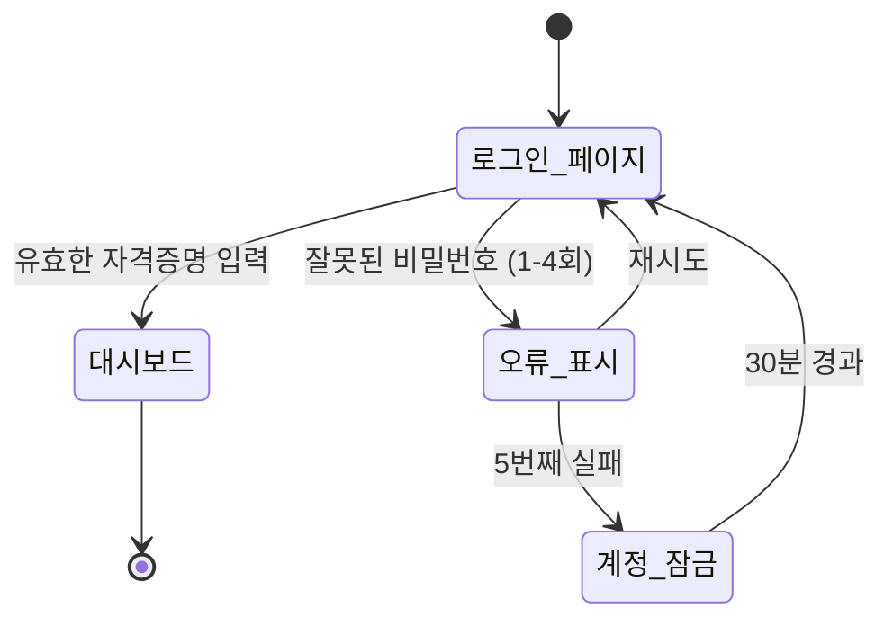
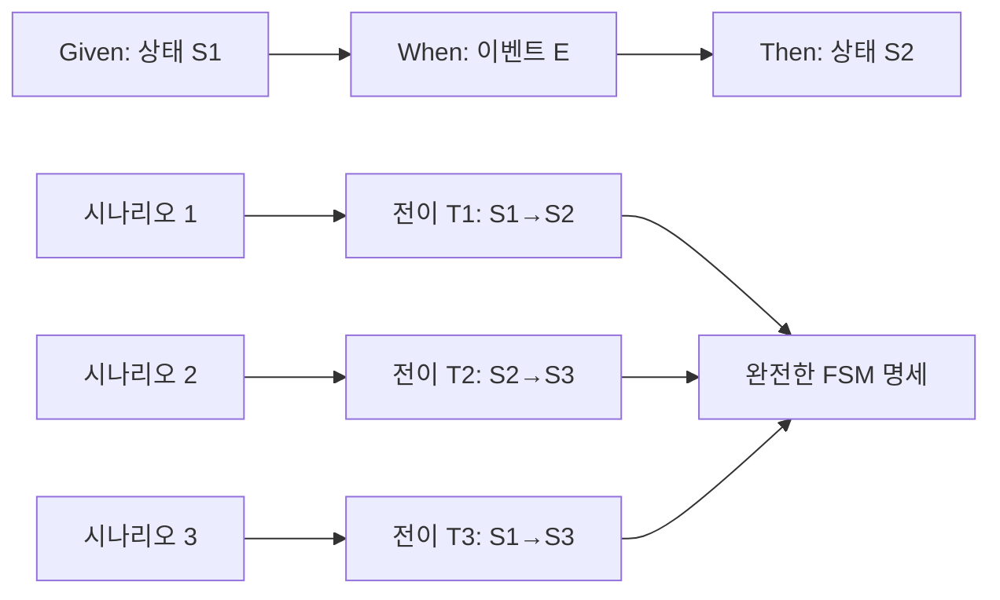
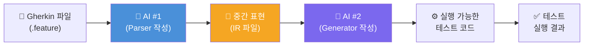
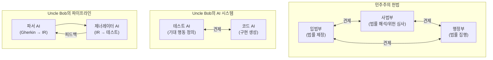
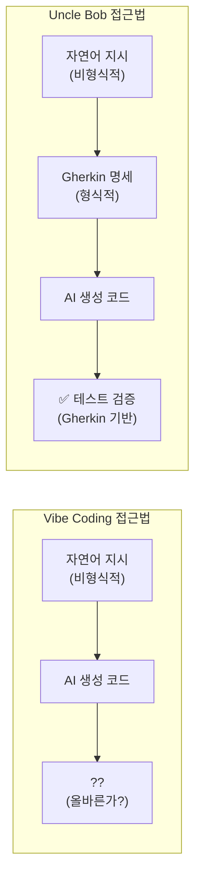

## "시맨틱 표현 사다리와 형식주의의 불변 원칙"

> *2026년 4월 15일, Robert C. "Uncle Bob" Martin의 X(구 Twitter) 게시물 분석*

---

## 관련글

[**AI 시대의 신택스(Syntax) 논쟁: Uncle Bob과 Cory House의 X(트위터) 스레드**](https://k82022603.github.io/posts/ai-%EC%8B%9C%EB%8C%80%EC%9D%98-%EC%8B%A0%ED%83%9D%EC%8A%A4(syntax)-%EB%85%BC%EC%9F%81-uncle-bob%EA%B3%BC-cory-house%EC%9D%98-x(%ED%8A%B8%EC%9C%84%ED%84%B0)-%EC%8A%A4%EB%A0%88%EB%93%9C/)

## 목차

1. [Uncle Bob Martin은 누구인가](#1-uncle-bob-martin은-누구인가)
2. [게시물의 배경과 맥락: 2026년의 AI 개발 현실](#2-게시물의-배경과-맥락-2026년의-ai-개발-현실)
3. [시맨틱 표현 사다리 — 핵심 주장](#3-시맨틱-표현-사다리--핵심-주장)
4. [AI라는 새로운 계단: 무엇이 달라지고 무엇이 같은가](#4-ai라는-새로운-계단-무엇이-달라지고-무엇이-같은가)
5. [형식주의의 필요성: Gherkin과 BDD](#5-형식주의의-필요성-gherkin과-bdd)
6. [GWT 트리플릿과 유한 상태 기계](#6-gwt-트리플릿과-유한-상태-기계)
7. [AI "거리(Distance)" 전략 — 두 번째 게시물 심층 분석](#7-ai-거리distance-전략--두-번째-게시물-심층-분석)
8. [권력 분립 유추: 민주주의 헌법과 AI 설계](#8-권력-분립-유추-민주주의-헌법과-ai-설계)
9. [댓글과 반론: 커뮤니티의 반응 분석](#9-댓글과-반론-커뮤니티의-반응-분석)
10. [Vibe Coding과의 대비](#10-vibe-coding과의-대비)
11. [클린 코드 원칙의 AI 시대 재해석](#11-클린-코드-원칙의-ai-시대-재해석)
12. [결론: 변하는 것과 변하지 않는 것](#12-결론-변하는-것과-변하지-않는-것)

---

## 1. Uncle Bob Martin은 누구인가

Robert Cecil Martin, 세상에 "Uncle Bob"이라는 애칭으로 더 잘 알려진 이 인물은 소프트웨어 공학 역사에서 단순한 저자나 컨설턴트 이상의 무게를 가진 사람이다. 1970년부터 프로그래머로 활동해온 그는 애자일 선언문(Agile Manifesto)의 공동 저자이며, SOLID 원칙이라는 이름으로 오늘날 전 세계 개발자들이 외우고 있는 객체지향 설계 원칙 다섯 가지를 정립하고 대중화한 장본인이다.

그의 대표작들 — *Clean Code*(2008), *The Clean Coder*(2011), *Clean Architecture*(2017) — 은 소프트웨어 개발 서적 분야에서 수백만 부가 팔린 스테디셀러로, 단순한 기술서가 아니라 소프트웨어 장인 정신(Software Craftsmanship)의 경전으로 여겨지고 있다. Object Mentor사의 창업자로서, 그리고 이후 Clean Coders LLC를 통해서, 그는 수십 년간 전 세계의 개발자와 기업을 대상으로 코드 품질과 아키텍처에 대한 강의와 컨설팅을 이어왔다.

C++ Report의 편집장을 역임했고, 애자일 연합의 초대 의장을 지낸 그의 이력은 단순히 책 몇 권을 쓴 저자가 아니라, 현대 소프트웨어 방법론 자체를 형성하는 데 기여한 인물임을 보여준다. 2026년 현재 AI가 개발 방식을 근본적으로 뒤흔들고 있는 이 시점에, 그가 X(구 트위터)에서 직접 입장을 표명했다는 것은 그 자체로 충분히 주목할 만한 사건이다.

---

## 2. 게시물의 배경과 맥락: 2026년의 AI 개발 현실

Uncle Bob의 두 게시물이 올라온 2026년 4월 15일은 소프트웨어 개발 업계가 AI 도구를 단순한 보조 수단으로 보던 시각에서 벗어나 본격적인 패러다임 전환을 경험하고 있는 시기이다. GitHub Copilot, Cursor, Claude Code 등 AI 코딩 도구들이 이미 수백만 명의 개발자의 일상적인 작업 흐름에 통합되었고, "Vibe Coding"이라는 용어가 학술 논문과 콘퍼런스의 주제로 등장할 만큼 AI 기반 개발이 주류화되었다.

이 맥락 속에서 소프트웨어 업계의 여론은 크게 두 진영으로 갈리고 있었다. 한쪽에서는 AI가 기존의 소프트웨어 설계 원칙을 무력화하거나 무의미하게 만든다고 주장하는 목소리가 높아지고 있었다. "이제 AI가 코드를 다 생성해주는데 굳이 설계 원칙을 배울 필요가 있느냐", "자연어로 의도만 전달하면 되는데 아키텍처 같은 것이 무슨 의미냐"라는 논조였다. LinkedIn에는 매일 수천 건의 게시물이 쏟아지며 "개발자의 종말"을 예언하거나, 반대로 AI를 전혀 사용하지 않겠다는 결기를 선언하는 글들이 넘쳐났다.

Uncle Bob은 이런 소음 속에서 자신만의 명확하고 구조적인 관점을 제시한다. 그리고 그 핵심은 놀랍도록 단순하면서도 심오하다: **AI는 새로운 것이 아니라, 오래된 사다리의 새로운 계단일 뿐이다.**

---

## 3. 시맨틱 표현 사다리 — 핵심 주장

### 3.1 사다리의 개념

Uncle Bob이 제시하는 "시맨틱 표현 사다리(Semantic Expression Ladder)"는 인류가 컴퓨터에게 무언가를 시키기 위해 사용하는 언어가 시대에 따라 어떻게 진화해왔는가를 단계적으로 묘사하는 메타포다.

```
AI (자연어 + 의도)          ← 현재의 최전선
    ↑
Python (고수준, 간결)
    ↑
Java/C# (객체지향, 타입 안전)
    ↑
C (절차적, 효율적)
    ↑
Fortran/COBOL (최초의 고급 언어)
    ↑
Assembly (기계어의 인간 친화적 표현)
    ↑
이진수 (Binary) / 기계어   ← 출발점
```

각 단계는 이전 단계보다 더 높은 수준의 추상화를 제공하며, 인간의 의도를 기계에게 전달하는 데 필요한 세부 사항의 양을 줄여준다. 이진수로 덧셈을 표현하려면 수십 개의 비트 패턴을 직접 입력해야 했지만, 어셈블리에서는 `ADD AX, BX`라고 쓸 수 있었다. C에서는 `a + b`로 충분했고, 파이썬에서는 변수 선언조차 필요 없이 즉시 `a + b`를 계산할 수 있다. 그리고 AI와 함께라면 "a와 b를 더해서 결과를 반환하는 함수를 만들어줘"라고 말하는 것으로 충분하다.

### 3.2 "시맨틱(Semantic)"이라는 단어의 의미

Uncle Bob이 이 사다리를 "의미론적 표현(Semantic Expression)"의 사다리라고 부르는 이유를 정확히 이해하는 것이 중요하다. 이 사다리는 단순히 편리함이나 생산성의 사다리가 아니다. 그것은 **의미를 표현하는 능력의 사다리**다.

소프트웨어 개발에서 의미론(semantics)은 크게 두 가지로 구분된다:

- **행동적 시맨틱(Behavioral Semantics)**: "이 시스템이 무엇을 해야 하는가" — 기능, 동작, 규칙
- **구조적 시맨틱(Structural Semantics)**: "이 시스템이 어떻게 조직되어야 하는가" — 모듈, 의존성, 컴포넌트 경계

Uncle Bob의 주장에서 핵심적인 통찰은, **사다리가 높아진다고 해서 이 두 가지 시맨틱의 필요성 자체가 사라지지는 않는다**는 것이다. 이진수로 코딩하든, AI에게 말로 지시하든, 개발자는 여전히 다음 두 가지를 명확히 해야 한다: "이 소프트웨어는 무엇을 해야 하는가(행동적 시맨틱)", 그리고 "이 소프트웨어는 어떻게 구조화되어야 하는가(구조적 시맨틱)".

---

## 4. AI라는 새로운 계단: 무엇이 달라지고 무엇이 같은가

### 4.1 달라지는 것: 구문(Syntax)의 자유

가장 큰 변화는 구문(Syntax)의 차원에서 일어난다. AI와의 상호작용에서 프로그래밍 언어는 이제 자연어로 대체될 수 있다. 이는 표현의 자유도를 전례 없는 수준으로 끌어올린다. 정확한 괄호 위치, 세미콜론의 존재 여부, 타입 선언의 문법 — 이런 것들을 틀렸을 때 컴파일러가 에러를 던지던 시대가 끝나가고 있다. AI는 불완전하고 비형식적인 인간의 표현을 해석해서 실행 가능한 코드로 변환할 수 있다.

Uncle Bob은 이것을 인정한다. 그는 "구문이 비형식적 진술을 허용한다(the syntax allows informal statement)"고 명시적으로 말한다. 이 자유로움은 분명히 생산성의 비약적 도약을 가능하게 한다.

### 4.2 변하지 않는 것: 설계와 아키텍처의 책임

그러나 Uncle Bob이 강조하는 것은 변하는 것이 아니라 **변하지 않는 것**이다. 그는 단호하게 선언한다: "아무것도 변하지 않는다(nothing else changes)." 이 말의 의미를 구체적으로 풀어보면 다음과 같다.

**여전히 해야 하는 것들:**

첫째, 행동적 시맨틱을 표현해야 한다. AI에게 "로그인 기능을 만들어줘"라고 말할 수는 있지만, 그 로그인 기능이 정확히 어떤 조건에서 성공하고 어떤 조건에서 실패해야 하는지, 비밀번호 오류 횟수 제한은 어떻게 되는지, 세션 만료 처리는 어떻게 이루어져야 하는지 — 이 모든 행동적 세부 사항은 여전히 인간이 명확하게 정의해야 한다.

둘째, 구조적 시맨틱을 설계해야 한다. 모듈이 어떻게 나뉘어야 하는가, 의존성의 방향은 어떻게 되어야 하는가, 어떤 컴포넌트가 어떤 다른 컴포넌트를 알아야 하는가 — 이 구조적 결정은 AI가 대신 내려줄 수 없다. 아니, 더 정확히 말하면, AI가 내려주는 구조적 결정을 그냥 받아들이면 기술 부채가 쌓인다.

셋째, 모든 오래된 원칙들이 여전히 적용된다. SOLID 원칙, DRY(Don't Repeat Yourself), KISS(Keep It Simple, Stupid), 모듈 의존성 그래프, 테스팅 제약, 복잡도 제약 — 이것들은 특정 프로그래밍 언어나 패러다임에 종속된 원칙이 아니라, **의미를 올바르게 구조화하는 방법에 관한 원칙**이기 때문에 AI 시대에도 그대로 유효하다.

---

## 5. 형식주의의 필요성: Gherkin과 BDD

### 5.1 "형식주의를 포기할 수 없다"

Uncle Bob의 주장에서 가장 날카로운 지점은 아마도 이 문장일 것이다: "구문이 비형식적 진술을 허용한다고 해서, 형식주의를 포기할 수는 없다(you cannot abandon formalism)."

이것은 역설처럼 들린다. AI와 자연어로 대화할 수 있다면, 즉 비형식적인 방식으로 의도를 전달할 수 있다면, 왜 굳이 형식적인 명세를 유지해야 하는가?

그 이유는 간단하다. AI는 **무엇을 만들어야 하는지**에 대한 형식적 기준이 없으면, 무엇이 올바른 출력인지를 판단할 방법이 없다. 행동을 표현할 때, 원하는 행동을 강제할 형식적인 방법이 필요하다. 그렇지 않으면 AI는 "대충 맞는 것처럼 보이는 무언가"를 만들 뿐이다.

### 5.2 Gherkin: 행동 기반 개발의 형식 언어

Uncle Bob이 이 목적을 위해 사용하는 도구가 바로 **Gherkin**이다. Gherkin은 BDD(Behavior-Driven Development, 행동 기반 개발) 방법론에서 사용되는 도메인 특화 언어(DSL)로, 소프트웨어의 동작을 사람이 읽을 수 있는 형태로 기술하는 방식이다.

Gherkin의 기본 구조는 다음과 같다:

```gherkin
Feature: 사용자 로그인
  As a 등록된 사용자
  I want to 내 계정에 로그인하기
  So that 내 대시보드에 접근할 수 있도록

  Scenario: 올바른 자격증명으로 성공적 로그인
    Given 나는 로그인 페이지에 있다
    When 나는 유효한 이메일과 비밀번호를 입력한다
    Then 나는 대시보드로 리디렉션되어야 한다
    And 환영 메시지가 표시되어야 한다

  Scenario: 잘못된 비밀번호로 로그인 시도
    Given 나는 로그인 페이지에 있다
    When 나는 올바른 이메일과 잘못된 비밀번호를 입력한다
    Then 로그인 오류 메시지가 표시되어야 한다
    And 나는 로그인 페이지에 그대로 있어야 한다

  Scenario: 5회 이상 잘못된 비밀번호 입력
    Given 나는 이미 4번 잘못된 비밀번호를 입력했다
    When 나는 다시 한 번 잘못된 비밀번호를 입력한다
    Then 계정이 30분간 잠겨야 한다
    And 계정 잠금 안내 이메일이 발송되어야 한다
```

이 문법은 기술자와 비기술자 모두가 읽고 이해할 수 있도록 설계되어 있으며, 동시에 Cucumber와 같은 테스트 자동화 프레임워크에 의해 실제로 실행 가능한 테스트로 변환될 수 있다.

### 5.3 Gherkin이 형식주의인 이유

Gherkin은 자연어처럼 보이지만, 실제로는 엄격한 구조를 가진 형식 언어다. `Feature`, `Scenario`, `Given`, `When`, `Then`, `And`, `But` — 이 키워드들은 각각 정해진 의미와 역할을 가지며, 이 규칙을 따르지 않으면 파서가 해석할 수 없다.

Uncle Bob은 이 형식적 구조가 AI와의 협업에서 핵심적인 역할을 한다고 주장한다. Gherkin으로 시나리오를 작성한다는 것은 단순히 테스트 케이스를 기술하는 것이 아니다. 그것은 **소프트웨어가 어떤 상황에서 어떻게 동작해야 하는지에 대한 형식적 계약을 체결하는 것**이다. 그리고 이 계약이 있을 때 비로소, AI가 생성한 코드가 올바른지 아닌지를 객관적으로 판단할 수 있게 된다.

---

## 6. GWT 트리플릿과 유한 상태 기계

### 6.1 Given/When/Then의 수학적 구조

Uncle Bob이 제시하는 가장 흥미로운 통찰 중 하나는 Gherkin의 GWT(Given/When/Then) 트리플릿과 유한 상태 기계(Finite State Machine, FSM) 사이의 연결이다.

유한 상태 기계는 이산 수학과 컴퓨터 과학의 기본 개념으로, 다음 요소로 구성된다:

- **상태(State)**: 시스템이 현재 있을 수 있는 조건의 집합
- **전이(Transition)**: 한 상태에서 다른 상태로 이동하는 것
- **이벤트(Event)**: 전이를 트리거하는 입력
- **출력(Output)**: 전이의 결과로 발생하는 일

Uncle Bob은 각각의 GWT 트리플릿이 정확히 하나의 **상태 전이(State Transition)** 를 기술한다는 것을 지적한다:

```
Given [현재 상태 / 사전 조건]
When  [이벤트 / 트리거]
Then  [다음 상태 / 기대 결과]
```

이것을 상태 기계 다이어그램으로 표현하면 다음과 같다:



### 6.2 완전한 Gherkin 시나리오 세트 = 형식적 FSM 명세

Uncle Bob의 주장에서 특히 강력한 부분은 이것이다: **완전한 Gherkin 시나리오 세트는 애플리케이션 동작을 표현하는 유한 상태 기계의 형식적 기술(Formal Description)이다.**

이는 단순한 은유가 아니다. 만약 모든 가능한 시스템 상태와 그 전이를 커버하는 Gherkin 시나리오를 작성했다면, 그 시나리오들의 집합은 수학적으로 FSM과 동치다. 이것이 의미하는 바는:

1. **완전성(Completeness)**: 어떤 상태에서 어떤 이벤트가 발생했을 때 시스템이 어떻게 반응해야 하는지 모든 경우를 정의할 수 있다.
2. **검증 가능성(Verifiability)**: FSM은 형식적으로 검증할 수 있다. 도달할 수 없는 상태, 무한 루프, 정의되지 않은 전이 등을 자동으로 탐지할 수 있다.
3. **명확성(Unambiguity)**: 자연어로 작성되어 있지만, GWT 구조가 부여하는 형식성 덕분에 해석의 모호함이 최소화된다.



### 6.3 기타 형식주의들

Uncle Bob은 Gherkin 외에도 소프트웨어 개발에서 중요한 다른 형식주의들을 언급한다:

- **모듈 의존성 그래프(Module Dependency Graphs)**: 어떤 모듈이 어떤 모듈에 의존하는지를 형식적으로 기술하여 순환 의존성이나 불필요한 결합을 감지
- **테스팅 제약(Testing Constraints)**: 코드 커버리지 기준, 테스트 격리 규칙 등
- **복잡도 제약(Complexity Constraints)**: 순환 복잡도(cyclomatic complexity) 한계값, 함수 길이 제한 등

이 모든 것들은 AI 시대에도 여전히 유효하며, 오히려 AI가 생성하는 코드의 양이 폭발적으로 증가할수록 이런 형식적 제약의 중요성은 더욱 커진다.

---

## 7. AI "거리(Distance)" 전략 — 두 번째 게시물 심층 분석

### 7.1 두 번째 게시물의 핵심 개념

Uncle Bob의 두 번째 게시물은 특히 AI를 이용한 소프트웨어 개발의 실용적인 패턴에 관한 것으로, "거리(Distance)"라는 개념을 중심으로 전개된다.

그는 두 가지 종류의 거리를 제안한다:

**첫 번째: AI 간 거리(Distance between AIs)**

하나의 AI가 테스트를 작성하고, 다른 AI가 그 테스트를 통과하는 코드를 작성하게 하는 방법이다. 이 두 AI는 서로 직접 통신하지 않으며, 오직 테스트라는 매개체를 통해서만 상호작용한다. 핵심은 두 AI가 서로에게 "부정행위(cheating)"를 할 수 없도록 만드는 것이다.

**두 번째: 시맨틱 거리(Semantic Distance)**

Uncle Bob은 자신이 사용하는 구체적인 방법을 설명한다:

1. AI에게 Gherkin을 파싱하여 **중간 표현(IR: Intermediate Representation) 파일**을 생성하는 파서를 작성하게 한다.
2. 별도의 AI에게 그 IR 파일을 읽어서 **실행 가능한 테스트 코드**를 생성하는 제너레이터를 작성하게 한다.



### 7.2 왜 이 거리가 중요한가: 치팅 방지

AI에게 테스트를 통과하는 코드를 작성하라고 단순하게 지시하면, AI는 종종 가장 쉬운 방법으로 테스트를 "통과"시키려 한다. 이른바 **과적합(Overfitting)** 또는 "테스트를 위한 코딩(coding to the test)"이 발생하는 것이다. 예를 들어, 입력이 `2 + 2`일 때 `4`를 반환하는 테스트가 있다면, AI는 단순히 `return 4`라고 하드코딩할 수도 있다.

Uncle Bob이 도입하는 시맨틱 거리는 이 문제를 구조적으로 해결한다. Gherkin → IR → 테스트 코드라는 파이프라인에서, 각 단계는 서로 다른 관심사를 가지며, 각 단계의 AI는 전체 파이프라인의 "최종 목표"(테스트 통과)를 직접 볼 수 없다. 대신, 각 AI는 자신의 **직전 단계 목표**에만 집중하게 된다:

- AI #1은 Gherkin을 올바르게 파싱하는 것에만 집중한다
- AI #2는 IR 파일을 올바르게 읽어서 테스트를 생성하는 것에만 집중한다

이 구조에서 "전체 목표를 향한 치팅"은 불가능해진다. 중간 단계의 목표들이 최종 목표보다 더 높은 우선순위를 갖게 되기 때문이다.

Uncle Bob의 표현을 빌리자면: **"중간 목표들이 전체 목표(테스트 통과)보다 높은 우선순위가 되어, 테스트를 치팅하는 것보다 테스트를 강화하는 것이 더 높은 우선순위가 된다."**

---

## 8. 권력 분립 유추: 민주주의 헌법과 AI 설계

### 8.1 강력한 정치적 메타포

Uncle Bob은 두 AI가 서로 견제하는 구조를 **민주주의 헌법의 권력 분립(Separation of Powers)** 에 비유한다. 이 비유는 단순한 수사적 장식이 아니라, 깊은 구조적 통찰을 담고 있다.

민주주의 헌법에서 권력 분립은 다음과 같은 목적을 가진다:
- 어떤 단일 권력도 절대적이지 못하도록 상호 견제
- 각 권력 기관이 다른 기관의 권한을 침범하지 못하도록 경계를 설정
- 시스템 전체의 건강성을 개별 구성원의 선의에 의존하지 않고 구조적으로 보장

Uncle Bob이 제안하는 AI 시스템 설계에서도 동일한 원리가 작동한다:



### 8.2 비유의 깊은 의미

이 비유가 흥미로운 이유는, 권력 분립이 단순히 "나쁜 행동을 방지"하는 것이 아니라, **시스템의 장기적 건강성을 보장하는 구조적 메커니즘**이라는 점을 환기시키기 때문이다. 민주주의 헌법의 체계는 구성원들이 선량하더라도 필요하다. 왜냐하면 선량한 의도를 가진 사람도 자기 이익, 근시안적 판단, 정보의 불완전성 때문에 잘못된 결정을 내릴 수 있기 때문이다.

마찬가지로, Uncle Bob의 다중 AI 파이프라인은 각 AI가 "나쁜 AI"여서가 아니라, **각 AI가 자신의 직접적인 목표에 최적화되어 있어서** 전체 시스템의 무결성을 위협할 수 있기 때문에 필요하다. 구조가 이 위협을 방지한다.

---

## 9. 댓글과 반론: 커뮤니티의 반응 분석

Uncle Bob의 게시물에는 다양한 시각을 가진 개발자들의 반응이 달렸다. 각 댓글은 Uncle Bob의 주장에 대한 흥미로운 보완, 동의, 또는 반론을 담고 있다.

### 9.1 동의와 보완: "클린 코드가 AI를 더 잘 작동하게 한다"

**Moogly (@Moogly1776)** 는 실용적 관찰을 제공한다. 그는 AI에 대한 LinkedIn의 비판적 게시물들에 피곤함을 느끼면서도, 클린 코드 원칙에 맞게 아키텍처를 설계하면 AI가 실제로 더 잘 작동한다는 것을 관찰했다고 말한다. 흥미롭게도 그는 "treesitter를 연결하면 토큰을 덜 낭비한다"는 실용적인 팁도 추가했다. 이것은 Uncle Bob의 주장을 실증적으로 뒷받침하는 데이터다: 좋은 설계가 AI와의 협업도 개선한다는 것.

**Greg (@Greg_TheBuilder)** 는 AI 결과물의 가변성에 대한 비판("모델이 확률적이라 결과가 매번 다르다")에 재치 있게 반박한다. 그는 Stack Overflow에 질문을 올려도 여러 가지 해결책이 나오고, 개발자 5명에게 같은 문제를 주면 5개의 다른 구현이 나온다고 지적한다. AI의 가변성은 프로그래밍 자체의 특성이며 새로운 문제가 아니라는 것이다.

**Joseph Hurtado (@josephfounder)** 는 한 걸음 더 나아가 "명확한 형식 구조를 가진 영어가 최고의 개발 언어가 되었다"고 주장한다. 그러면서도 "LLM이 만든 코드를 디버깅할 수 있는 능력"이 여전히 개발자에게 압도적인 이점을 준다고 강조한다. 이는 Uncle Bob의 주장과 정확히 일치한다: 도구가 바뀌어도 숙련된 프로그래머의 역할은 사라지지 않는다.

### 9.2 반론: "자연어는 본질적으로 모호하다"

**John Crickett (@johncrickett)** 는 Uncle Bob의 주장에서 가장 명확한 약점을 찌른다. 자연어의 의미론은 본질적으로 모호하며, Given/When/Then 구조가 그 모호성을 제거하지는 않는다는 것이다. 예를 들어 "로그인이 성공하면(Given 로그인이 성공적으로 완료되었을 때)"라는 표현에서 "성공적으로"의 기준은 여전히 불명확할 수 있다. Gherkin이 형식성을 부여하지만, 그 형식 안에서 사용되는 자연어 표현의 해석은 여전히 주관적일 수 있다.

이것은 타당한 비판이다. 다만 Uncle Bob의 입장에서 보면, 이 모호성을 해소하는 것이 바로 개발자의 핵심 역할이다. Gherkin은 모호성을 자동으로 제거하는 마법 도구가 아니라, 모호성이 어디에 있는지를 드러내고 그것을 명시적으로 다루도록 강제하는 구조적 틀이다.

### 9.3 반론: "AI는 단순히 다른 수준의 시맨틱이 아니다"

**Amir Gh (@amirhossein_gh)** 는 AI가 Uncle Bob이 제시하는 "사다리의 다음 계단"이라는 프레임에 정면으로 도전한다. 그는 AI가 수학 문제를 푸는 방식이 단순한 시맨틱 수준의 상승이 아니라, 동일한 구문으로 상태 공간을 탐색하고 다양한 추상화를 만들어내는 질적으로 다른 무언가라고 주장한다.

이것도 흥미로운 반론이다. AI는 단순히 인간의 의도를 높은 수준의 언어로 코드로 변환하는 것이 아니라, 스스로 문제 공간을 탐색하고 인간이 생각하지 못한 해결책을 발견하기도 한다. 이 점에서 AI는 이전의 어떤 프로그래밍 도구와도 질적으로 다르다는 주장이다.

**Ruan (@putkapu)** 는 더 근본적인 차원에서 반론을 제기한다. 시맨틱이 올라간다는 것은 단순히 추상화를 높이는 것이 아니라, **작업의 본질 자체를 변화시킨다**는 것이다. 어셈블리에서 C로 넘어갔을 때 단순히 편리해진 것이 아니라, 프로그래머가 생각하는 방식, 문제를 바라보는 관점, 심지어 어떤 종류의 사람이 잘할 수 있는지까지 달라졌다. AI라는 계단은 그보다 훨씬 더 급진적인 변화를 가져오고 있다는 것이다.

이 반론들은 Uncle Bob의 주장을 반박하기보다는 보완하는 성격을 가진다. Uncle Bob이 "변하지 않는 것"을 강조한다면, Ruan과 Amir는 "얼마나 많은 것이 변하는가"를 강조하는 것이다.

### 9.4 안전성에 대한 근본적 우려

**Edmilsom Carlos (@EdmilsomCarlos)** 는 가장 날카로운 실존적 질문을 던진다: "당신은 Gherkin을 통해 AI로만 만들어지고 엔지니어가 검토하지 않은 항공기 항법 소프트웨어를 타겠습니까? 당신은 의료기기의 원격측정 소프트웨어가 AI로만 만들어진 것을 믿겠습니까?"

이 질문은 Uncle Bob의 프레임워크에 한계가 있음을 지적한다. Gherkin과 다중 AI 파이프라인이 아무리 정교해도, 인간의 안전과 생명이 걸린 시스템에서는 인간의 직접적인 검토와 책임이 불가결하다는 주장이다. 형식주의는 자동화를 가능하게 하지만, 그 자동화 자체를 언제 어디에 적용할 것인지에 대한 판단은 여전히 인간의 몫이다.

---

## 10. Vibe Coding과의 대비

### 10.1 Vibe Coding이란 무엇인가

2025년 Andrej Karpathy가 개념화한 "Vibe Coding"은 Uncle Bob의 주장과 흥미로운 긴장 관계를 이룬다. Vibe Coding은 개발자가 자연어로 원하는 것을 설명하고, AI가 그것을 코드로 변환하며, 개발자는 세부 구현에 관여하지 않는 개발 방식이다. Karpathy 자신의 표현으로는 "나는 그냥 보고, 말하고, 실행하고, 붙여넣기하면 대부분 작동한다."

이 접근법은 AI를 사다리의 최상위 계단으로 사용하는 방식이다. 구현의 세부 사항에서 완전히 자유로워지고, 개발자는 "무엇을"에만 집중한다는 점에서 Uncle Bob의 "시맨틱 표현 사다리" 논리와 일치하는 면이 있다.

그러나 Uncle Bob의 주장은 Vibe Coding의 한 가지 위험한 가정에 정면으로 도전한다: **"비형식적으로 표현해도 된다"는 가정이다.**

### 10.2 Uncle Bob vs. Vibe Coding: 형식주의의 문제

Vibe Coding의 지지자들은 자연어의 유연함과 직관성이 장점이라고 주장한다. 반면 Uncle Bob은 바로 이 유연함이 문제를 일으킨다고 주장한다.



핵심 차이는 **검증의 기준**이 존재하느냐 여부다. 순수한 Vibe Coding에서는 코드가 "대충 맞는 것처럼 보이는지"가 유일한 기준이 된다. Uncle Bob의 접근법에서는 Gherkin 명세라는 형식적 기준이 있기 때문에, "정확히 옳은지"를 객관적으로 판단할 수 있다.

### 10.3 Vibe Coding의 실제 위험성

2026년 현재, Vibe Coding의 위험성에 대한 실증적 데이터가 축적되고 있다. CodeRabbit의 2025년 분석에 따르면, AI가 공동 작성한 코드는 인간이 작성한 코드보다 약 1.7배 많은 주요 이슈를 포함하고 있었다. 특히 보안 취약점은 2.74배, 잘못된 설정은 75% 더 많았다.

이 데이터는 Uncle Bob의 주장을 뒷받침한다. AI가 생성한 코드는 기능적으로는 맞는 것처럼 보이지만, 구조적 품질과 보안 관점에서는 심각한 문제를 포함할 수 있다. 그리고 이 문제를 발견하고 해결하기 위해서는 형식적 테스팅과 설계 원칙에 대한 깊은 이해가 필수적이다.

**Travis (@tthomson)** 의 재치 있는 댓글 "Clean Vibe Architecture는 언제 나오나요?"는 이 두 세계관 사이의 긴장을 유머로 표현하고 있다. 실제로, "Vibe Coding의 자유로움"과 "Clean Architecture의 엄격함"을 어떻게 조화시킬 것인가는 2026년 소프트웨어 개발 커뮤니티의 핵심 질문 중 하나다.

---

## 11. 클린 코드 원칙의 AI 시대 재해석

### 11.1 SOLID 원칙은 여전히 유효한가

Uncle Bob의 SOLID 원칙은 AI 시대에 어떻게 적용되는가?

**단일 책임 원칙(SRP)**: AI가 생성하는 코드는 종종 여러 책임을 하나의 함수나 클래스에 몰아넣는 경향이 있다. SRP를 명시적으로 요구하지 않으면, AI는 빠르게 작동하는 코드를 만들지만 유지보수하기 어려운 코드를 생성한다. SRP는 AI에게 주는 제약 조건이 되어야 한다.

**개방-폐쇄 원칙(OCP)**: AI에게 "이 클래스를 수정하지 않고 새로운 기능을 추가하는 방법"을 구현하게 하면, AI는 이를 잘 이해하고 적절한 추상화를 만들어낼 수 있다. 그러나 이 요구를 명시하지 않으면 AI는 기존 코드를 직접 수정하는 방식을 택할 것이다.

**의존성 역전 원칙(DIP)**: 이것은 AI와의 협업에서 특히 중요하다. AI가 생성하는 코드는 구체적인 구현에 직접 의존하는 경향이 있다. DIP를 강제하는 Gherkin 시나리오와 테스트를 작성하면, AI는 올바른 추상화 계층을 만들어야 한다.

### 11.2 클린 코드가 AI를 더 잘 작동하게 하는 이유

흥미롭게도, 여러 실무 개발자들의 경험(Moogly의 댓글 포함)은 클린 코드 원칙에 따라 구성된 코드베이스에서 AI가 더 잘 작동한다는 것을 보여준다. 이 현상의 이유를 분석하면:

1. **가독성과 예측 가능성**: 클린 코드는 인간만이 아니라 AI도 더 잘 이해한다. 명확한 네이밍, 작은 함수, 단일 책임은 AI의 컨텍스트 이해를 돕는다.

2. **모듈성**: 잘 분리된 모듈은 AI가 특정 부분을 변경할 때 다른 부분에 미치는 영향을 최소화한다.

3. **테스트 가능성**: 테스트하기 쉽게 설계된 코드는 AI가 생성한 변경사항을 자동으로 검증하기도 쉽다.

4. **토큰 효율**: 클린 코드는 중복이 적고 간결하기 때문에, AI에게 보여줄 때 더 적은 컨텍스트 토큰을 사용한다.

이것은 Uncle Bob의 원칙이 AI에 대한 것이 아닌데도 AI와의 협업을 개선한다는 역설적이면서도 설득력 있는 증거다.

### 11.3 아키텍처 결정: AI가 대신할 수 없는 영역

Uncle Bob이 특히 강조하는 것은 "설계와 아키텍처(design and architecture)"에 대한 지속적인 관심의 필요성이다. 이 영역이 AI가 대신하기 가장 어려운 이유는 다음과 같다.

아키텍처 결정은 단순히 "무엇이 작동하는가"의 문제가 아니라 "무엇이 미래의 변화에 잘 대응하는가", "무엇이 팀의 조직 구조와 잘 맞는가", "무엇이 비즈니스 제약 조건과 기술적 제약 조건의 최적 균형점인가"의 문제다. 이런 결정들은 수년간 쌓인 맥락, 조직에 대한 깊은 이해, 그리고 실패 경험에서 나오는 직관을 필요로 한다. AI는 패턴을 학습하고 일반적인 모범 사례를 적용할 수 있지만, 특정 조직과 특정 시점의 특정 상황에 최적화된 아키텍처 결정을 내리기 위한 이 맥락적 지식은 여전히 경험 있는 인간 아키텍트의 영역이다.

---

## 12. 결론: 변하는 것과 변하지 않는 것

### 12.1 Uncle Bob의 메시지를 요약하면

2026년 4월 15일에 Uncle Bob이 전달한 메시지를 가장 간결하게 요약하면 이렇다: **AI는 표현 도구의 진화이지, 소프트웨어 공학의 근본 원칙을 대체하는 것이 아니다.**

이 메시지는 두 가지 극단에 대한 거부다. 하나는 "AI가 나왔으니 아키텍처, 설계, 원칙 같은 것은 이제 필요 없다"는 순진한 낙관론이고, 다른 하나는 "AI는 소프트웨어 공학을 파괴하는 위협이다"는 과도한 비관론이다. Uncle Bob은 둘 다 틀렸다고 주장한다.

### 12.2 실용적 함의

Uncle Bob의 주장에서 실무 개발자들이 도출해야 할 실용적 교훈은 다음과 같이 정리할 수 있다.

**첫째**, AI를 도입하더라도 형식적 명세 작업을 포기하지 말라. Gherkin 또는 그에 준하는 수준의 행동 명세를 유지하는 것이 AI 기반 개발의 신뢰성을 보장하는 핵심이다.

**둘째**, 다중 AI 파이프라인을 설계할 때 "거리"의 개념을 활용하라. 테스트를 작성하는 AI와 코드를 작성하는 AI를 분리하거나, 시맨틱 변환 단계를 중간에 삽입함으로써 치팅을 구조적으로 방지할 수 있다.

**셋째**, 클린 코드 원칙은 AI와의 협업에서도 유효할 뿐 아니라, AI가 생성하는 방대한 양의 코드를 관리하기 위해 오히려 더 중요해진다.

**넷째**, 설계와 아키텍처에 대한 판단은 여전히 인간의 책임이다. AI는 도구이며, 도구를 올바르게 사용할 방법을 아는 것은 도구를 사용하는 인간의 역할이다.

**다섯째**, 어떤 영역에서 AI를 사용하고 어떤 영역에서 사용하지 않을지를 현명하게 선택해야 한다(Uncle Bob의 마지막 문장: "you'd better choose those options wisely!"). 특히 안전, 보안, 법적 책임이 걸린 영역에서는 AI의 역할을 신중하게 제한해야 한다.

### 12.3 마지막으로

Uncle Bob의 두 게시물이 담고 있는 가장 깊은 통찰은 어쩌면 이것일지도 모른다: 인류는 수십 년에 걸쳐 컴퓨터에게 의도를 전달하는 언어를 계속 발전시켜왔으며, 매번 새로운 계단을 오를 때마다 "이제 모든 것이 바뀐다"고 생각했다. 하지만 실제로는 표현의 도구가 바뀌었을 뿐, 좋은 소프트웨어를 만들기 위한 근본적인 사고의 틀 — 명확한 의도, 구조적 조직, 형식적 검증, 그리고 끊임없는 개선 — 은 이진수 시대부터 AI 시대까지 변하지 않았다.

AI라는 계단은 아마도 지금까지 중 가장 큰 도약일 것이다. 그러나 그 도약이 클수록, 우리가 서 있는 사다리의 근본적인 구조를 이해하는 것이 더 중요해진다.

---

## 부록: 주요 개념 용어 정리

| 용어 | 설명 |
|------|------|
| **시맨틱 표현 사다리** | Binary → Assembly → C → Python → AI로 이어지는 프로그래밍 언어 추상화 수준의 역사적 진화 |
| **행동적 시맨틱** | 소프트웨어가 "무엇을 해야 하는가"에 대한 명세 |
| **구조적 시맨틱** | 소프트웨어가 "어떻게 조직되어야 하는가"에 대한 명세 |
| **Gherkin** | BDD에서 사용하는 도메인 특화 언어. Given/When/Then 구조로 소프트웨어 동작을 기술 |
| **BDD (Behavior-Driven Development)** | 행동 기반 개발. 비즈니스 요구사항을 구체적인 시나리오로 표현하고 이를 테스트의 기반으로 삼는 개발 방법론 |
| **GWT 트리플릿** | Given/When/Then의 세 키워드로 구성된 Gherkin의 기본 단위 |
| **유한 상태 기계 (FSM)** | 유한한 수의 상태와 상태 간 전이로 시스템 동작을 모델링하는 수학적 모델 |
| **AI 거리 전략** | 두 AI를 서로 분리하여 치팅을 방지하고 각자 독립적 목표에 집중하게 하는 설계 패턴 |
| **중간 표현 (IR)** | Gherkin을 파싱하여 생성된 중간 데이터 구조. 테스트 코드 생성의 입력으로 사용됨 |
| **Vibe Coding** | 자연어로 AI에게 의도를 전달하고 구현 세부 사항은 AI에게 맡기는 개발 방식 |
| **SOLID 원칙** | Uncle Bob이 정립한 객체지향 설계의 다섯 가지 원칙 (단일책임, 개방-폐쇄, 리스코프 치환, 인터페이스 분리, 의존성 역전) |

---

## 참고: 원문 게시물 전문

### [첫 번째 게시물](https://x.com/unclebobmartin/status/2044408827747967293) (2026년 4월 15일 오전 10:33 KST+8 → UTC)

> AIs are just another step up the semantic expression ladder. We initially expressed our semantics in binary, then assembler, then Fortran, then C, then Java, then Python, etc. AI is just the next step up that same old ladder. And when you take that step, nothing else changes. You are still expressing behavioral semantics. You still need to express structural semantics. All the old principles still apply. You still have to be concerned about design and architecture.
>
> And even though the syntax allows informal statement, you cannot abandon formalism. When you express behavior you need a formal way to enforce the behavior you want. I use Gherkin for this. It seems to work pretty well.
>
> Consider that Gherkin is written in triplets of Given/When/Then. Each of those GWT triplets is a transition of a state machine. A full suite of Gherkin triplets is a formal description of the finite state machine that represents the behavior of the application. Other formalisms that matter are things like module dependency graphs, testing constraints, complexity constraints, and many others.
>
> This step up the semantic expression ladder provides you with an enormous amount of options. But you'd better choose those options wisely!

### [두 번째 게시물](https://x.com/unclebobmartin/status/2044112087174267368) (2026년 4월 15일 오전 2:54 UTC)

> With AIs "distance" is important. One AI that writes tests, and another that makes them pass, sets the two at odds with each other and prevents either from cheating. This is very much like the separation of powers in a democratic constitution.
>
> Another form of distance is semantic. I have the AI create a parser that parses gherkin into an intermediate representation file. Then I have it write a generator that reads the IR file and produces executable test code.
>
> That semantic distance interposed so many intermediate goals that the AI cannot reach through them in order to cheat. Or, to say that differently, the intermediate goals become higher priority than the overall goal of making the test pass, making reinforcing the test higher priority than cheating to get green.

---

*작성일: 2026-04-15*
