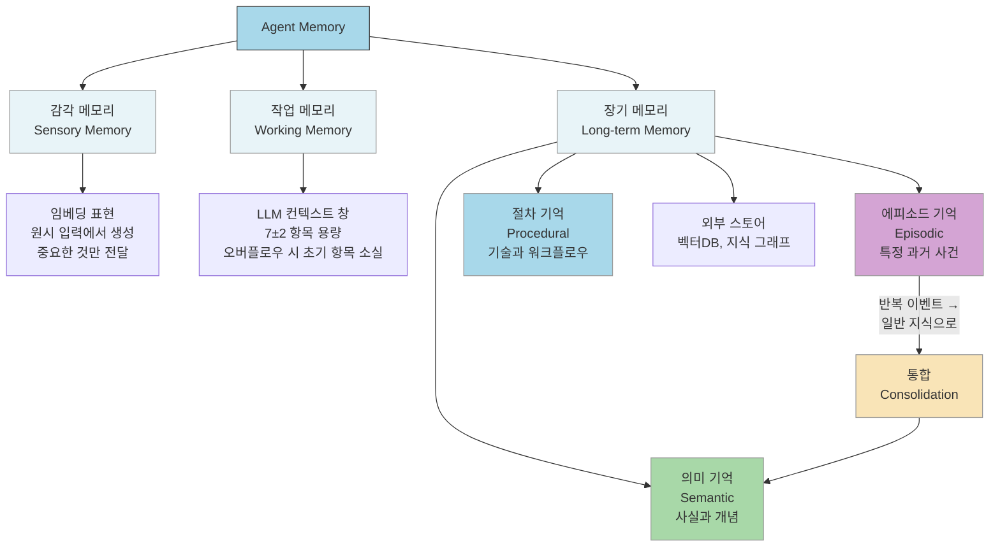
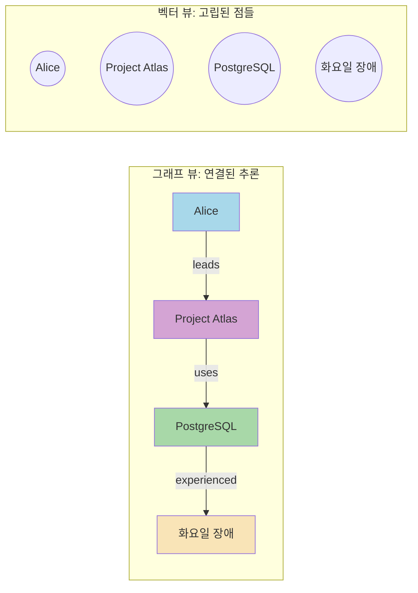
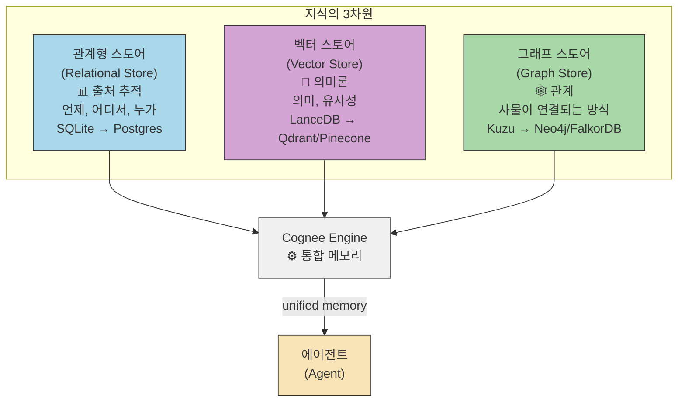
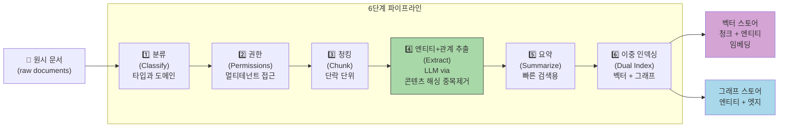
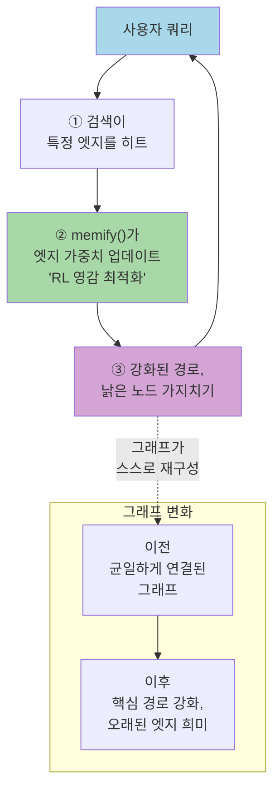
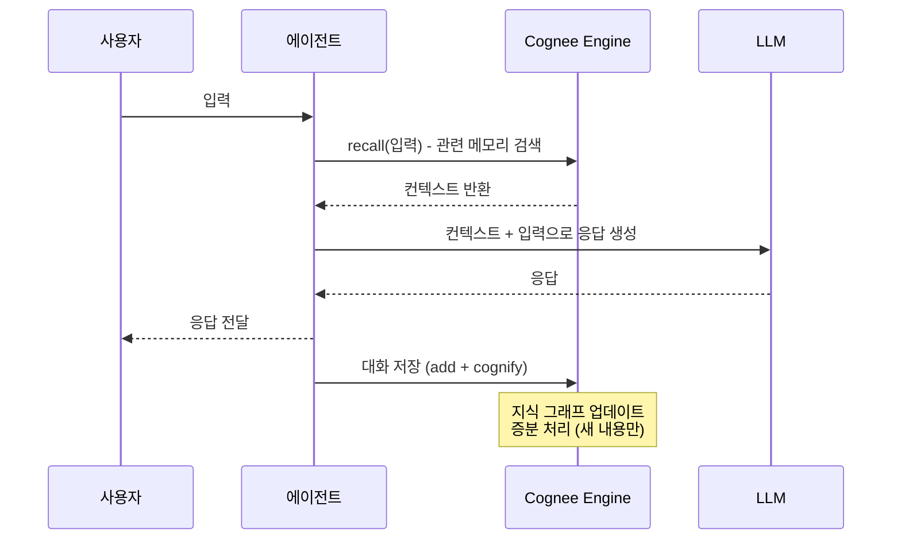

> **출처**: Akshay Pachaar (@akshay_pachaar) 의 X(Twitter) 스레드 + Cognee 오픈소스 프로젝트 분석  
> **작성일**: 2026-04-16  
> **원문 링크**: https://x.com/akshay_pachaar/status/2043745099792953508  
> **Cognee GitHub**: https://github.com/topoteretes/cognee

---

## 목차

1. [핵심 문제: LLM은 태생적으로 기억이 없다](#1-핵심-문제-llm은-태생적으로-기억이-없다)
2. [메모리 부재의 7가지 실패 패턴](#2-메모리-부재의-7가지-실패-패턴)
3. [더 큰 컨텍스트 창이 해결책이 아닌 이유](#3-더-큰-컨텍스트-창이-해결책이-아닌-이유)
4. [인지과학 기반의 메모리 분류 체계](#4-인지과학-기반의-메모리-분류-체계)
5. [에이전트 메모리의 진화: 4단계 레이어](#5-에이전트-메모리의-진화-4단계-레이어)
6. [메모리의 3차원 구조: 왜 단일 스토어로는 부족한가](#6-메모리의-3차원-구조-왜-단일-스토어로는-부족한가)
7. [Cognee: 3개의 스토어, 하나의 엔진, 4개의 호출](#7-cognee-3개의-스토어-하나의-엔진-4개의-호출)
8. [Cognify 파이프라인 상세 분석](#8-cognify-파이프라인-상세-분석)
9. [Memify: 스스로 학습하는 메모리](#9-memify-스스로-학습하는-메모리)
10. [14가지 검색 모드](#10-14가지-검색-모드)
11. [실제 에이전트 구현 패턴](#11-실제-에이전트-구현-패턴)
12. [Cognee 최신 동향 (2025~2026)](#12-cognee-최신-동향-20252026)
13. [실무 적용 가이드: 무엇을 선택해야 하는가](#13-실무-적용-가이드-무엇을-선택해야-하는가)
14. [핵심 요약](#14-핵심-요약)

---

## 1. 핵심 문제: LLM은 태생적으로 기억이 없다

대규모 언어 모델(LLM)은 **설계상 무상태(stateless)** 시스템이다. 모든 API 호출은 완전히 새로운 빈 슬레이트에서 시작된다. ChatGPT와 대화할 때 연속성이 느껴지는 것은 착각에 가깝다. 실제로는 매 요청마다 전체 대화 이력을 다시 전송하는 방식으로 "기억하는 척"을 구현한 것이다.

이 단순한 트릭은 가벼운 채팅에서는 충분히 작동한다. 하지만 실제 에이전트를 구축하려는 순간, 이 접근법은 무너지기 시작한다.

```
User: "나 사과 4개 있어"
Agent: OK, 기억했어요.

--- (새 API 호출) ---

User: "하나 먹었는데 몇 개 남았어?"
Agent: ???  (사과가 뭔지 모름, 컨텍스트 없음)
```

이것이 에이전트 메모리 문제의 출발점이다.

---

## 2. 메모리 부재의 7가지 실패 패턴

메모리를 제대로 설계하지 않으면 에이전트는 다음 7가지 방식으로 실패한다.

| # | 실패 패턴 | 설명 |
|---|-----------|------|
| 1 | **컨텍스트 기억상실** | 이미 제공한 정보를 또 물어봄 |
| 2 | **개인화 부재** | 모든 상호작용이 일반적이고 판에 박힌 느낌 |
| 3 | **다단계 작업 실패** | 중간 상태가 조용히 사라짐 |
| 4 | **반복 실수** | 에피소드 기억이 없어서 동일 오류 반복 |
| 5 | **지식 누적 없음** | 매 세션이 백지에서 시작 |
| 6 | **컨텍스트 오버플로우 환각** | 컨텍스트가 넘치면 LLM이 내용을 꾸며냄 |
| 7 | **정체성 붕괴** | 연속성 없음 → 신뢰 없음 |

이 중 가장 치명적인 것은 **반복 실수**와 **지식 누적 없음**이다. 에이전트가 어제 배운 것을 오늘 기억하지 못한다면, 그것은 진짜 지능이 아니라 단순한 모방이다.

---

## 3. 더 큰 컨텍스트 창이 해결책이 아닌 이유

128K, 200K 토큰 컨텍스트 창이 등장하면서 많은 개발자들이 "이제 다 해결됐다"고 생각했다. 하지만 실제로는 그렇지 않다.

### 3.1 "Lost in the Middle" 효과

관련 정보가 긴 컨텍스트의 **중간 부분**에 위치할 경우, 정확도가 30% 이상 떨어진다는 것이 여러 연구를 통해 밝혀졌다. LLM은 컨텍스트의 처음과 끝에 있는 정보는 잘 기억하지만, 중간에 묻힌 중요한 사실은 사실상 무시한다.

```
[컨텍스트 윈도우의 정확도 분포]

정확도 높음  ▲
            │\                        /│
            │  \                    /  │
            │    \                /    │
            │      \    ~30%    /      │
            │        \  감소  /        │
정확도 낮음  └─────────────────────────→
          시작      중간 (위험 구간)    끝
```

### 3.2 컨텍스트는 공유 예산이다

컨텍스트 창은 다음 항목들이 서로 공간을 두고 경쟁하는 공유 자원이다.

- 시스템 프롬프트
- 검색된 문서
- 대화 이력
- 출력 공간

100K 토큰이 있더라도, 지속성(Persistence)·우선순위화(Prioritization)·현저성(Salience)이 없다면 단순히 큰 컨텍스트 창은 충분하지 않다.

> **핵심 통찰**: 메모리는 프롬프트에 텍스트를 더 많이 밀어 넣는 것이 아니다. 에이전트가 기억하는 것을 **구조화**해서 필요한 것을 찾을 수 있게 하는 것이다.

---

## 4. 인지과학 기반의 메모리 분류 체계

Lilian Weng의 2023년 공식화가 현재의 표준 프레임워크가 되었다.

> **에이전트 = LLM + 메모리 + 계획 + 도구 사용**

이 프레임워크는 인지과학에서 인간 메모리를 분류하는 방식을 차용한다.



### 4.1 인간 메모리 ↔ 에이전트 구성 요소 매핑

| 인간 메모리 | 에이전트 등가물 | 공유 제약 |
|-------------|----------------|-----------|
| **감각** | 임베딩 표현 | 대부분의 입력 폐기, 중요한 것만 전달 |
| **작업** | LLM 컨텍스트 창 | 고정 용량, 오버플로우 시 초기 항목 소실 |
| **장기** | 외부 스토어 (벡터DB, 지식 그래프) | 저장은 저렴, 검색이 유용성 결정 |

### 4.2 장기 메모리의 3가지 하위 유형

**에피소드 기억 (Episodic)**: 구체적인 과거 사건을 기억한다.
- 예: "화요일에 PostgreSQL 클러스터가 다운됐다"

**의미 기억 (Semantic)**: 사실과 개념을 저장한다.
- 예: "PostgreSQL은 관계형 데이터베이스다"

**절차 기억 (Procedural)**: 기술과 워크플로우를 저장한다.
- 예: "사용자가 환불을 요청하면 먼저 구매 날짜를 확인한다"

### 4.3 메모리 통합(Consolidation)의 중요성

에피소드와 의미 기억 사이의 다리는 **메모리 통합**이다. 반복된 특정 사건들이 일반적인 지식으로 증류되는 과정이다.

수십 번의 상호작용에서 "사용자들이 일관되게 요약본을 선호한다"는 패턴을 발견한 에이전트는 이를 재사용 가능한 규칙으로 만들어야 한다. 통합 없이는 에이전트가 개별 사건을 재생할 뿐, 그로부터 진정으로 학습하지 못한다.

---

## 5. 에이전트 메모리의 진화: 4단계 레이어

### 5.1 Layer 0: 완전 무상태 에이전트 (기준선)

모든 프레임워크를 걷어내면 에이전트는 단순한 루프다: **인식 → 사고 → 행동**.

```python
class Agent:
    """최소 AI 에이전트: 인식, 사고, 행동"""
    def __init__(self):
        self.client = anthropic.Anthropic()
        self.model = "claude-sonnet-4-20250514"

    def run(self, user_input: str) -> str:
        response = self.client.messages.create(
            model=self.model,
            max_tokens=1024,
            messages=[{"role": "user", "content": user_input}],
        )
        return response.content[0].text
```

이 코드에 "사과 4개 있어"라고 말한 뒤 "하나 먹었는데?"라고 물으면, 에이전트는 사과가 뭔지 전혀 모른다. 각 호출이 완전히 고립되어 있기 때문이다.

---

### 5.2 Layer 1: Python 리스트를 통한 인메모리 기억

모든 사람이 처음 시도하는 방법이다.

```python
class Agent:
    def __init__(self):
        self.client = anthropic.Anthropic()
        self.messages = []  # 전체 "메모리"는 하나의 리스트

    def chat(self, user_input: str) -> str:
        self.messages.append({"role": "user", "content": user_input})
        response = self.client.messages.create(
            model="claude-sonnet-4-20250514",
            max_tokens=1024,
            messages=self.messages,  # 매번 전체 이력 전송
        )
        reply = response.content[0].text
        self.messages.append({"role": "assistant", "content": reply})
        return reply
```

멀티턴이 이제 작동한다. 사과 문제도 올바르게 답변된다.

**하지만 2가지 문제가 곧 나타난다:**

- 리스트가 무한정 커진다. 200번째 턴쯤에서 컨텍스트 한도에 도달하고, 가장 오래된 메시지가 조용히 사라진다. 1번 턴의 사용자 이름이 어제의 농담보다 훨씬 먼저 사라진다. 우선순위화 없이 단순 시간순 정렬만 있다.
- 모든 것이 RAM에 저장된다. Python 프로세스가 종료되는 순간, 에이전트는 당신이 누군지 전혀 모른다.

---

### 5.3 Layer 2: 마크다운 파일을 통한 영속성

다음 단계는 메모리를 디스크에 쓰는 것이다. 마크다운은 자연스러운 선택이다: 사람이 읽을 수 있고, Git 친화적이며, 에이전트가 일반 텍스트로 다시 읽을 수 있다. Claude Code가 `CLAUDE.md`와 `MEMORY.md` 파일로 정확히 이 패턴을 사용한다.

```python
class MarkdownMemoryAgent:
    def __init__(self):
        self.client = anthropic.Anthropic()
        self.history_file = Path("memory/conversation_history.md")
        self.facts_file = Path("memory/known_facts.md")

    def save_to_disk(self, role: str, content: str) -> None:
        with open(self.history_file, "a") as f:
            f.write(f"### {role} at {datetime.now().isoformat()}\n{content}\n\n")

    def load_history(self) -> str:
        if self.history_file.exists():
            return self.history_file.read_text()
        return ""
```

facts 파일은 다음처럼 보인다:

```
- 사용자 이름은 Sarah
- Sarah는 Acme Corp의 백엔드 팀을 관리
- Acme Corp는 B2B SaaS 회사
- 현재 프로덕션 데이터베이스를 새 AWS 리전으로 마이그레이션 중
```

4개 사실이라면 완벽하게 작동한다. 전체 파일을 컨텍스트에 로드하면 LLM이 Sarah, 그녀의 회사, 업계에 대한 어떤 질문이든 처리한다.

**하지만 3개월 후를 생각해보자.** 에이전트는 2,000개의 추출된 사실과 200개의 대화 로그를 가지고 있다. 그것은 디스크에 500K+ 토큰의 마크다운이고, 컨텍스트 창은 128K다.

더 이상 모든 것을 로드할 수 없다. 그리고 키워드 검색의 함정에 빠진다:

```python
# 사용자: "클라우드 마이그레이션 현황은?"
grep("cloud migration", facts_file)
# 결과: []
# 디스크의 사실은 "새 AWS 리전으로 마이그레이션 중"이라고 되어 있음.
# "cloud migration"이라는 단어는 어디에도 없음.
```

저장은 있지만 지능적인 검색이 없다는 것이 문제다. **카탈로그 없는 도서관**이나 마찬가지다.

---

### 5.4 Layer 3: 벡터 검색과 그 한계

임베딩을 추가한다. 마크다운을 청크로 나누고, 임베딩하고, 코사인 유사도로 검색한다. 이제 "database"가 "PostgreSQL"과 매칭된다. 임베딩 공간에서 두 벡터가 가깝기 때문이다. 동의어 문제가 해결된 것처럼 보인다.

**그러다가 새로운 벽에 부딪힌다.**

벡터 DB에 이 세 가지 사실이 있다고 가정하자:

```
- "Alice는 Project Atlas의 기술 리드다"
- "Project Atlas는 기본 데이터스토어로 PostgreSQL을 사용한다"
- "PostgreSQL 클러스터가 화요일에 장애를 겪었다"
```

사용자가 묻는다: **"Alice의 프로젝트가 화요일 장애의 영향을 받았나?"**

벡터 검색은 Alice와 화요일 장애를 언급하는 1번과 3번 사실을 상위로 랭크한다. 하지만 핵심적인 연결 고리인 2번 사실("Project Atlas가 PostgreSQL을 사용한다")은 Alice도 화요일도 언급하지 않는다. 이것이 빠진다.



이것은 예외 케이스가 아니다. 비즈니스 지식의 **정상적인 형태**다. 사람들은 팀에 속하고, 팀은 프로젝트를 소유하고, 프로젝트는 시스템에 의존하고, 시스템에는 인시던트가 발생한다. 두 개 이상의 홉을 넘나드는 어떤 질문이든 단순 벡터 검색으로는 답할 수 없다.

---

### 5.5 각 레이어의 능력 매트릭스

| 역량 | Python 리스트 | 마크다운 | 벡터 검색 | 필요한 것 |
|------|:---:|:---:|:---:|:---:|
| 영속성 | ❌ | ✅ | ✅ | ✅ |
| 컨텍스트 오버플로우 생존 | ❌ | ✅ | ✅ | ✅ |
| 의미 검색 | ❌ | ❌ | ✅ | ✅ |
| 멀티-홉 추론 | ❌ | ❌ | ❌ | 그래프 순회 |
| 엔티티 중복 제거 | ❌ | ❌ | ❌ | 해싱 + 해소 |
| 관계 추적 | ❌ | ❌ | ❌ | 그래프 엣지 |
| 자기 개선 리콜 | ❌ | ❌ | ❌ | 사용량 가중 검색 |

**결론**: 하나의 메모리 레이어에서 영속성, 의미 이해, 관계 추론이 모두 필요하다.

이것을 직접 구축하려면 벡터 데이터베이스, 그래프 데이터베이스, 관계형 스토어, 엔티티 추출기, 중복 제거 파이프라인, 엣지 가중치 시스템을 조합해야 한다. 에이전트 로직 한 줄 작성하기 전에 몇 주의 인프라 작업이 필요하다.

---

## 6. 메모리의 3차원 구조: 왜 단일 스토어로는 부족한가

에이전트 메모리는 3개의 서로 다른 지식 차원을 포착해야 한다.



### 각 스토어가 포착하는 것

**관계형 스토어 (출처)**:
- 데이터가 어디서 왔는가
- 언제 수집됐는가
- 누가 접근 권한을 가지는가

**벡터 스토어 (의미론)**:
- 콘텐츠가 무슨 의미인가
- 무엇과 유사한가
- 동의어와 패러프레이징 처리

**그래프 스토어 (관계)**:
- 엔티티들이 어떻게 연결되는가
- 무엇이 무엇을 야기하는가
- 누가 누구에게 보고하는가

이 중 하나라도 평탄화하면, 검색 정확도에 중요한 정보를 잃는다.

---

## 7. Cognee: 3개의 스토어, 하나의 엔진, 4개의 호출

Cognee는 에이전트 메모리를 위해 만들어진 오픈소스 지식 엔진이다. 벡터 검색과 지식 그래프, 관계형 출처 레이어를 단일 시스템으로 결합한다.

2025년에 Cognee는 오픈소스 실험에서 프로덕션 인프라로 성장했다. 파이프라인 실행량이 약 2,000회에서 100만 회 이상으로, 단 1년 만에 500배 증가했다.

GitHub에서 14,200개 이상의 스타와 1,400개 이상의 포크를 기록하며, Apache-2.0 라이선스로 제공되는 Cognee는 AI 에이전트가 지속적으로 데이터로부터 학습해야 하는 조직들을 위한 선도적인 솔루션으로 자리잡았다.

### 7.1 4개의 비동기 호출 API

```python
import cognee

await cognee.add("여기에 문서를 넣으세요")   # 무엇이든 수집
await cognee.cognify()                         # 지식 그래프 + 임베딩 구축
await cognee.memify()                          # 메모리 자기 개선
await cognee.search("쿼리")                   # 추론을 통한 검색
```

### 7.2 기본 스택 및 프로덕션 전환

| 환경 | 관계형 | 벡터 | 그래프 |
|------|--------|------|--------|
| **기본 (로컬)** | SQLite | LanceDB | Kuzu |
| **프로덕션** | PostgreSQL | Qdrant / Pinecone / pgvector | Neo4j / FalkorDB / Neptune |

`pip install cognee`와 LLM API 키만 있으면 실행 가능하다. Docker도, 외부 서비스도 필요 없다. 프로덕션으로 전환할 때도 동일한 4개 호출 API를 유지한다.

---

## 8. Cognify 파이프라인 상세 분석

`cognee.cognify()`는 원시 텍스트를 구조화된 상호연결 지식으로 변환하는 다단계 파이프라인을 실행한다.



### 각 단계 상세 설명

**① 분류**: 문서를 타입(기술 문서, 대화, 보고서 등)과 도메인(금융, 고객지원, HR 등)으로 분류한다.

**② 권한 확인**: 멀티테넌트 접근 제어를 처리한다. 누가 어떤 데이터에 접근할 수 있는지 그래프 레벨에서 격리한다.

**③ 청킹**: 고정 크기로 자르는 것이 아니라 **단락 구조를 존중**하는 방식으로 청크를 추출한다.

**④ 엔티티 + 관계 추출**: LLM을 통해 엔티티와 관계를 추출하고, **콘텐츠 해싱을 통한 자동 중복 제거**를 수행한다. 50개 문서에 동일한 엔티티가 나타나면, Cognee는 이를 50개의 인바운드 엣지를 가진 하나의 그래프 노드로 병합한다. 에이전트는 더 이상 "Alice"를 50명의 다른 낯선 사람으로 보지 않는다.

**⑤ 요약 생성**: 빠른 검색을 위한 요약을 생성한다.

**⑥ 이중 인덱싱**: 벡터 스토어(임베딩)와 그래프 스토어(엣지) 모두에 인덱싱한다. 모든 그래프 노드는 대응하는 임베딩을 가진다.

### 이중 표현의 핵심 트릭

> 벡터를 통해 진입하고(의미적으로 유사한 콘텐츠 탐색), 그래프를 통해 탈출한다(연결된 엔티티로 관계 추적). 혹은 그 반대로. 이것이 의미 검색을 희생하지 않고 멀티-홉 쿼리를 가능하게 하는 핵심이다.

파이프라인은 **기본적으로 증분 처리**다: 새로운 파일이나 업데이트된 파일만 재처리된다. 이미 인덱싱된 콘텐츠는 다시 처리하지 않아 비용을 절약한다.

---

## 9. Memify: 스스로 학습하는 메모리

`memify()`는 Cognee를 모든 "수집 후 검색(ingest-and-search)" 도구와 차별화하는 핵심 기능이다. 그래프에 대해 강화학습(RL) 영감을 받은 최적화 패스를 실행한다.



### Memify가 하는 4가지 일

1. **유용한 경로 강화**: 좋은 검색으로 이어진 경로를 강화한다
2. **낡은 노드 가지치기**: 한동안 접근되지 않은 노드를 정리한다
3. **엣지 가중치 자동 조정**: 실제 사용량 기반으로 엣지 가중치를 조정한다
4. **파생 사실 추가**: 암묵적 관계를 식별해 새 사실을 생성한다

실제 사례: 고객 지원 에이전트의 그래프는 제품 문서와 환불 정책을 통하는 경로를 자연스럽게 강화하면서, 거의 쿼리되지 않는 HR 엣지는 자연스럽게 쇠퇴한다. **그래프가 시간이 지남에 따라 스스로 관련성 감각을 키운다.**

---

## 10. 14가지 검색 모드

Cognee는 14가지 검색 모드를 제공한다. 자주 사용하는 핵심 모드들:

| 모드 | 언제 사용 | 특징 |
|------|-----------|------|
| **GRAPH_COMPLETION** (기본) | 일반적인 에이전트 쿼리 | 벡터 힌트로 관련 서브그래프 탐색 후 관계 순회 |
| **GRAPH_COMPLETION_COT** | 최고 정확도 필요 시 | 멀티-홉 경로에 대한 연쇄 사고(CoT) |
| **RAG_COMPLETION** | 단순 사실 쿼리 | 고전적인 검색 후 생성 |
| **NATURAL_LANGUAGE** | 자연어 → 그래프 쿼리 | 질문을 Cypher로 번역해 그래프에 실행 |
| **TEMPORAL** | 시간 인식 검색 | 시간 필터를 포함한 검색 |
| **FEELING_LUCKY** | 자동 모드 선택 | LLM이 최적 모드를 선택 |

---

## 11. 실제 에이전트 구현 패턴

Cognee 메모리를 perceive-think-act 루프에 연결하는 완전한 패턴:

```python
import cognee
from cognee import SearchType

class CogneeMemoryAgent:
    """그래프-벡터 하이브리드 영속 메모리를 가진 에이전트"""

    def __init__(self, session_id: str = "default"):
        self.llm_client = OpenAI()
        self.session_id = session_id

    async def ingest(self, text: str, dataset: str = "main"):
        """텍스트를 수집하고 지식 그래프 구축"""
        await cognee.add(text, dataset)
        await cognee.cognify([dataset])

    async def recall(self, query: str) -> str:
        """관련 메모리 컨텍스트 검색"""
        results = await cognee.search(
            query_text=query,
            query_type=SearchType.GRAPH_COMPLETION,
            session_id=self.session_id,
        )
        return results[0] if results else ""

    async def chat(self, user_input: str) -> str:
        """메모리 컨텍스트를 활용한 응답 생성"""
        context = await self.recall(user_input)
        messages = [
            {"role": "system", "content": "당신은 도움이 되는 어시스턴트입니다. 메모리 컨텍스트를 활용하세요."},
            {"role": "system", "content": f"메모리 컨텍스트:\n{context}"},
            {"role": "user", "content": user_input},
        ]
        response = self.llm_client.chat.completions.create(
            model="gpt-4o-mini", messages=messages
        )
        reply = response.choices[0].message.content
        
        # 대화를 메모리에 저장
        await cognee.add(
            f"User: {user_input}\nAssistant: {reply}",
            "conversations"
        )
        await cognee.cognify(["conversations"])
        return reply
```

### 메모리 사이클



### 세션 메모리와 대명사 해소

```python
# 세션 메모리가 대명사 해소를 자동으로 처리
await cognee.search(query_text="Alice는 어디 살아?", session_id="conv_1")
await cognee.search(query_text="그녀는 무슨 일을 해?", session_id="conv_1")
# "그녀"가 세션 컨텍스트에서 Alice로 해소됨
```

### 멀티테넌시

멀티테넌시는 그래프 레벨에서 데이터셋별 권한(읽기, 쓰기, 삭제, 공유)으로 내장되어 있다. 단순한 네임스페이스 분리가 아닌 실제 그래프 레벨 격리다.

---

## 12. Cognee 최신 동향 (2025~2026)

### 12.1 펀딩 및 성장

Cognee는 OpenAI와 Facebook AI Research 창립자들이 이끄는 Pebblebed로부터 750만 달러 시드 투자를 유치했다. Pebblebed는 Pamela Vagata(OpenAI 공동창립자)와 Keith Adams(Facebook AI Research Lab 창립자)가 이끌고 있다.

### 12.2 ECL 파이프라인

Cognee는 혁신적인 ECL(Extract, Cognify, Load) 파이프라인을 통해 원시 데이터를 구조화된 지식 그래프로 변환하며, 기존 RAG 시스템을 훨씬 넘어서는 동적 메모리를 AI 시스템에 부여한다.

### 12.3 MCP 지원

Cognee는 MCP(Model Context Protocol)를 구현했다. 이는 LangGraph, OpenAI MCP, Anthropic MCP 등과 같은 에이전트 프레임워크와 cognee의 AI 메모리 레이어를 연결하는 경량 브릿지 역할을 한다. Cognee MCP는 AI 메모리를 일시적인 버퍼에서 에이전트가 직접 접근할 수 있는 내구성 있는 시맨틱 레이어로 변환한다.

### 12.4 보안 인증

Cognee는 GitHub Secure Open Source Program을 성공적으로 졸업했다. 이는 오픈소스 AI 인프라에서 최고 수준의 보안과 신뢰성을 유지하겠다는 의지를 반영한다.

### 12.5 통합 생태계

Cognee는 Claude Agent SDK, OpenAI Agents SDK, LangGraph, Google ADK, n8n, Amazon Neptune, Neo4j 등 팀들이 이미 사용하는 도구들과 연결된다. 또한 38개 이상의 소스에서 데이터를 수집하는 ECL 파이프라인을 제공한다.

### 12.6 로드맵

향후 계획으로는 엣지 디바이스를 위한 Rust 엔진(로컬 및 온디바이스 에이전트를 위한 낮은 지연시간과 프라이버시), 최신 인지과학 연구의 실용적 적용, 멀티 데이터베이스 지원, 30개 이상의 새로운 데이터 소스 커넥터 추가 등이 포함된다.

---

## 13. 실무 적용 가이드: 무엇을 선택해야 하는가

에이전트를 구축할 때 시작해야 할 진짜 질문은: **"내 에이전트가 무엇을 기억해야 하고, 어떤 종류의 질문에 답해야 하는가?"**

```mermaid
flowchart TD
    START([에이전트 메모리 설계 시작]) --> Q1{쿼리 복잡도는?}
    
    Q1 -->|단순 유사도 검색\n'이와 비슷한 대화 찾기'| V["벡터 전용 메모리\n(Vector-only)\n\n✅ 빠른 구현\n✅ 낮은 복잡도\n❌ 관계 추론 불가"]
    
    Q1 -->|엔티티 경계를\n넘나드는 쿼리\n'Alice 프로젝트가 영향받았나?'| Q2{규모는?}
    
    Q2 -->|소규모\n프로토타입\n(사실 수백 개)| MD["마크다운 파일\n(Markdown Files)\n\n✅ 투명성\n✅ 쉬운 디버깅\n❌ 키워드 검색 한계"]
    
    Q2 -->|중대형\n프로덕션\n(사실 수천 개 이상)| Q3{구축 vs 채택?}
    
    Q3 -->|직접 구축| DIY["자체 구축\n벡터DB + 그래프DB +\n관계형DB + 추출 파이프라인\n\n⚠️ 수 주의 인프라 작업"]
    
    Q3 -->|빠른 시작| CG["Cognee 사용\n\n✅ 4개 API 호출\n✅ pip install로 시작\n✅ 프로덕션 스왑 용이\n✅ 자기 개선 메모리"]
    
    style V fill:#a8d8ea
    style MD fill:#f9e4b7
    style DIY fill:#f4cccc
    style CG fill:#a8d8a8
```

### 선택 기준 요약

**벡터 전용으로 충분한 경우**: 유사도 기반 검색만 필요하고, 엔티티 간 관계 추론이 없을 때.

**마크다운이 적합한 경우**: 빠른 프로토타이핑, 투명성이 중요할 때, 데이터가 수백 개 미만일 때.

**그래프-벡터 하이브리드(Cognee)가 필요한 경우**:
- 멀티-홉 쿼리 (두 개 이상의 관계를 넘나드는 질문)
- 수천 개 이상의 사실
- 시간이 지남에 따라 개선되는 에이전트
- 프로덕션 규모

---

## 14. 핵심 요약

이 글이 다룬 내용을 원칙 수준에서 정리하면 다음과 같다.

### 14.1 LLM의 본질적 한계

LLM은 무상태다. 메모리는 착각이다. "더 큰 컨텍스트 창"은 구조화된 메모리의 대안이 아니다.

### 14.2 메모리 레이어의 진화

```
무상태 → Python 리스트 → 마크다운 → 벡터 검색 → 그래프+벡터 하이브리드
```

각 단계는 이전 단계의 통증을 해결하지만, 더 깊은 문제를 드러낸다.

### 14.3 3차원 메모리의 필요성

- **관계형**: 출처(언제, 어디서, 누가)
- **벡터**: 의미(무슨 뜻, 무엇과 유사)
- **그래프**: 관계(어떻게 연결, 멀티-홉 추론)

세 가지는 경쟁 옵션이 아니라, 동일한 메모리 시스템의 **상보적 레이어**다.

### 14.4 Cognee의 위치

Cognee는 이 세 가지를 4개의 비동기 API 호출 뒤에 통합한다. 기본 스택(SQLite + LanceDB + Kuzu)으로 로컬에서 즉시 시작하고, 프로덕션(Postgres + Qdrant + Neo4j)으로 API 코드 변경 없이 전환할 수 있다.

### 14.5 지능은 저장이 아닌 구조에서 나온다

> **"Intelligence requires structure, not just storage."**  
> 지능은 단순한 저장이 아닌 구조를 필요로 한다.  
> 세 가지 저장 패러다임(관계형, 벡터, 그래프)을 이런 방식으로 다루는 것이, 무상태 LLM 래퍼를 진정으로 학습하는 무언가로 전환시키는 것이다.

---

## 참고 자료

- **Cognee GitHub**: https://github.com/topoteretes/cognee
- **Cognee 공식 사이트**: https://www.cognee.ai
- **원문 스레드**: https://x.com/akshay_pachaar/status/2043745099792953508
- **Lilian Weng의 에이전트 분류 체계**: https://lilianweng.github.io/posts/2023-06-23-agent/
- **"Lost in the Middle" 연구**: Liu et al., 2023

---

*작성일: 2026-04-16*
