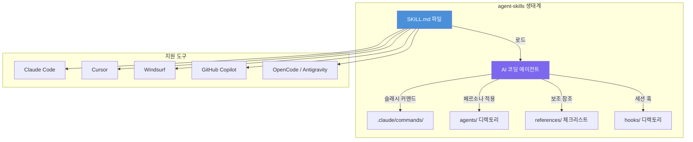
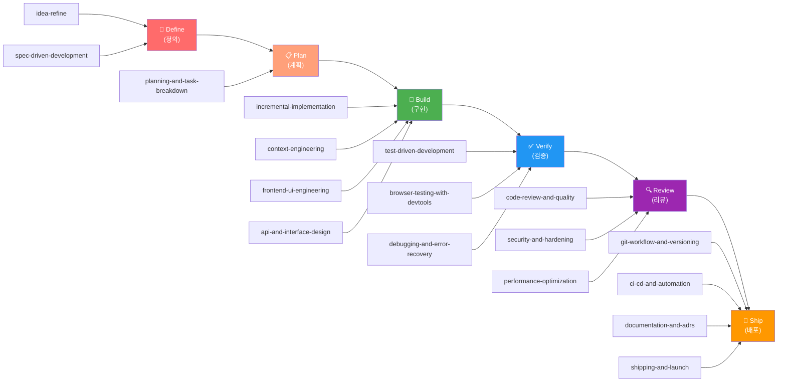
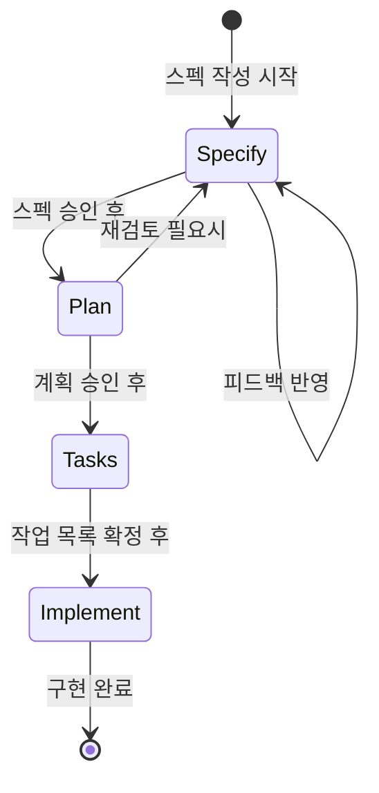
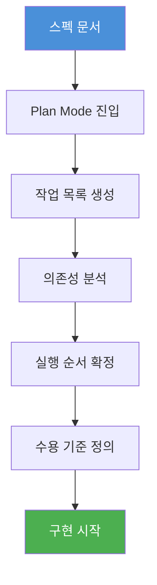
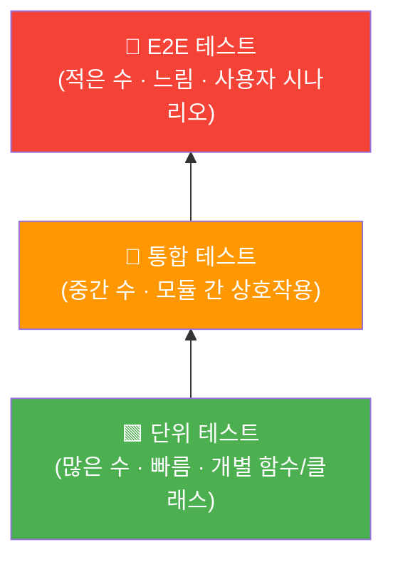
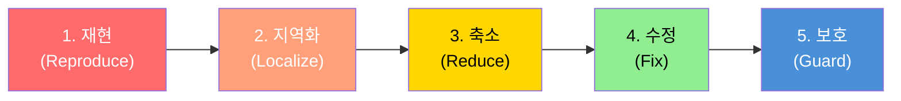
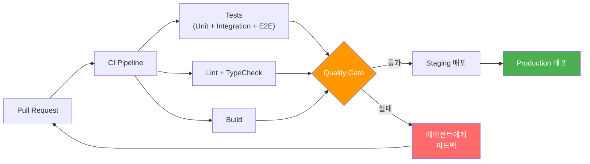
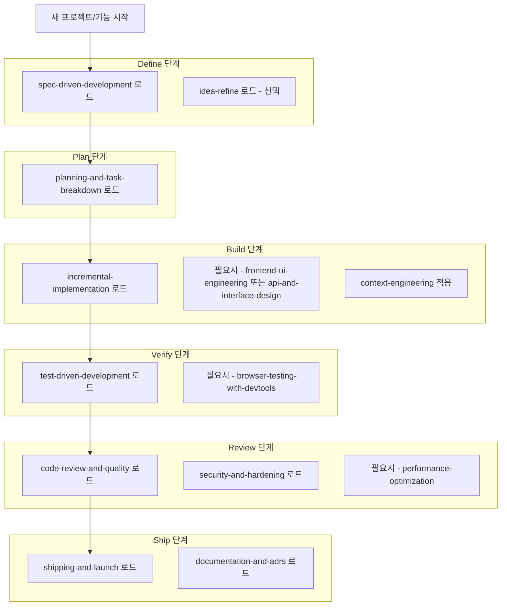

> **저장소**: https://github.com/addyosmani/agent-skills  
> **작성자**: Addy Osmani (Google Chrome 팀 엔지니어링 매니저)  
> **라이선스**: MIT  
> **작성일**: 2026-04-16

---

## 목차

1. [프로젝트 개요 및 배경](#1-프로젝트-개요-및-배경)
2. [핵심 철학과 등장 배경](#2-핵심-철학과-등장-배경)
3. [전체 아키텍처 구조](#3-전체-아키텍처-구조)
4. [소프트웨어 개발 생명주기(SDLC) 전체 맵](#4-소프트웨어-개발-생명주기sdlc-전체-맵)
5. [Skills 상세 분석 — Define Phase](#5-skills-상세-분석--define-phase)
6. [Skills 상세 분석 — Plan Phase](#6-skills-상세-분석--plan-phase)
7. [Skills 상세 분석 — Build Phase](#7-skills-상세-분석--build-phase)
8. [Skills 상세 분석 — Verify Phase](#8-skills-상세-분석--verify-phase)
9. [Skills 상세 분석 — Review Phase](#9-skills-상세-분석--review-phase)
10. [Skills 상세 분석 — Ship Phase](#10-skills-상세-분석--ship-phase)
11. [Agent Personas (에이전트 페르소나)](#11-agent-personas-에이전트-페르소나)
12. [Slash Commands 시스템](#12-slash-commands-시스템)
13. [지원 도구별 설치 및 연동 방법](#13-지원-도구별-설치-및-연동-방법)
14. [Skill 구조 해부 (Anatomy)](#14-skill-구조-해부-anatomy)
15. [설계 원칙 6가지 심층 분석](#15-설계-원칙-6가지-심층-분석)
16. [실무 활용 전략 및 권장 조합](#16-실무-활용-전략-및-권장-조합)
17. [Claude Code와의 통합 관점](#17-claude-code와의-통합-관점)
18. [관련 생태계 및 확장 가능성](#18-관련-생태계-및-확장-가능성)
19. [한계와 주의사항](#19-한계와-주의사항)
20. [총평 및 엔지니어링 관점 평가](#20-총평-및-엔지니어링-관점-평가)

---

## 1. 프로젝트 개요 및 배경

### 1.1 저장소 소개

`agent-skills`는 Google Chrome 팀의 엔지니어링 매니저이자 웹 성능 전문가로 유명한 **Addy Osmani**가 2026년 4월경 공개한 오픈소스 프로젝트이다. 한 줄로 요약하면 **"AI 코딩 에이전트를 위한 프로덕션 수준의 엔지니어링 스킬 모음집"** 이라고 할 수 있다.

이 프로젝트는 단순한 프롬프트 모음이 아니다. Google, Anthropic, Vercel 같은 최상위 기술 기업의 시니어 엔지니어들이 실제 프로덕션 환경에서 따르는 워크플로우, 품질 게이트(Quality Gates), 베스트 프랙티스를 **AI 에이전트가 일관되게 따를 수 있도록 구조화된 패키지**로 제공한다.

### 1.2 작성자 Addy Osmani에 대하여

Addy Osmani는 *Learning JavaScript Design Patterns* 저자이자 Chrome DevTools, Lighthouse, Workbox 등의 핵심 기여자로 알려져 있다. 그는 특히 웹 성능(Core Web Vitals), 프론트엔드 아키텍처, 그리고 최근에는 AI를 활용한 개발 생산성 향상에 깊은 관심을 가지고 있다. 이 저장소는 그의 AI 코딩 보조 도구 활용 경험과 철학이 집약된 결과물이라 할 수 있다.

### 1.3 등장 시점의 맥락

2025~2026년은 Claude Code, GitHub Copilot Agent Mode, Cursor, Windsurf, Antigravity 등 **AI 코딩 에이전트**가 폭발적으로 확산되는 시기이다. 이들 도구는 코드를 놀라운 속도로 생성하지만, 공통적인 문제점이 존재했다. 바로 에이전트가 "최단 경로"만을 선택한다는 것이다. 스펙 작성을 건너뛰고, 테스트를 나중으로 미루고, 보안 리뷰를 생략하는 경향이 있었다. `agent-skills`는 이 문제를 정면으로 해결하려는 시도이다.

---

## 2. 핵심 철학과 등장 배경

### 2.1 문제 정의: AI 에이전트의 "최단 경로 편향"

AI 코딩 에이전트가 강력한 도구임에는 틀림없지만, 좌측 방향(빠르고 작동하는 것처럼 보이는 코드)으로 강하게 끌리는 편향이 있다. 구체적으로는 아래와 같은 패턴이 반복된다.

- 요구사항을 충분히 분석하기 전에 구현을 시작한다
- "나중에 테스트를 추가하겠다"는 합리화를 통해 TDD를 건너뛴다
- 보안 취약점(XSS, SQL Injection, 시크릿 하드코딩 등)을 간과한다
- 아키텍처 결정을 문서화하지 않아 미래 유지보수가 어렵게 된다
- 커밋 단위가 지나치게 크거나 의미가 불명확해진다

### 2.2 해결 방향: 검증 가능한 워크플로우

Addy Osmani가 선택한 해결 방식은 "더 좋은 프롬프트"가 아니라 **에이전트가 따르는 구조화된 프로세스**를 제공하는 것이다. 각 스킬은 단계별 절차, 출구 기준(Exit Criteria), 흔한 합리화에 대한 반론, 그리고 검증 단계를 포함한다. 이는 소프트웨어 품질을 보장하는 메커니즘이 AI 보조 개발 시대에도 동일하게 필요하다는 철학을 반영한다.

> *"AI 코딩 어시스턴트는 엄청난 힘의 배수이지만, 인간 엔지니어는 여전히 무대의 감독으로 남는다."*  
> — Addy Osmani

### 2.3 시니어 엔지니어의 판단력을 패키지화

이 프로젝트의 가장 독창적인 가치 제안은 **시니어 엔지니어의 암묵지(tacit knowledge)를 명문화된 프로세스로 변환**한다는 점이다. 언제 스펙을 쓸 것인지, 무엇을 테스트할 것인지, 어떻게 리뷰할 것인지, 언제 배포할 것인지에 대한 판단력이 재사용 가능한 워크플로우로 패키지화된다.

---

## 3. 전체 아키텍처 구조

### 3.1 디렉토리 구조

```
agent-skills/
├── README.md                          # 메인 문서
├── AGENTS.md                          # AI 에이전트용 지침 (OpenCode, Copilot 등)
├── CLAUDE.md                          # Claude Code 전용 설정
├── CONTRIBUTING.md                    # 기여 가이드
├── LICENSE                            # MIT 라이선스
├── .gitignore
│
├── .claude/
│   └── commands/                      # 슬래시 커맨드 정의
│       ├── spec                       # /spec → spec-driven-development
│       ├── plan                       # /plan → planning-and-task-breakdown
│       ├── build                      # /build → incremental-implementation + TDD
│       ├── test                       # /test → test-driven-development
│       ├── review                     # /review → code-review-and-quality
│       ├── code-simplify              # /code-simplify → 코드 단순화
│       └── ship                       # /ship → shipping-and-launch
│
├── skills/                            # 핵심 스킬 디렉토리 (SKILL.md per 디렉토리)
│   ├── using-agent-skills/            # 메타 스킬: 스킬 팩 사용 방법
│   ├── idea-refine/                   # Define Phase: 아이디어 정제
│   ├── spec-driven-development/       # Define Phase: 스펙 주도 개발
│   ├── planning-and-task-breakdown/   # Plan Phase: 작업 분해
│   ├── context-engineering/           # Build Phase: 컨텍스트 엔지니어링
│   ├── incremental-implementation/    # Build Phase: 점진적 구현
│   ├── frontend-ui-engineering/       # Build Phase: 프론트엔드 UI
│   ├── api-and-interface-design/      # Build Phase: API 설계
│   ├── test-driven-development/       # Verify Phase: TDD
│   ├── browser-testing-with-devtools/ # Verify Phase: 브라우저 테스팅
│   ├── debugging-and-error-recovery/  # Verify Phase: 디버깅
│   ├── code-review-and-quality/       # Review Phase: 코드 리뷰
│   ├── security-and-hardening/        # Review Phase: 보안 강화
│   ├── performance-optimization/      # Review Phase: 성능 최적화
│   ├── git-workflow-and-versioning/   # Ship Phase: Git 워크플로우
│   ├── ci-cd-and-automation/          # Ship Phase: CI/CD
│   ├── documentation-and-adrs/        # Ship Phase: 문서화 및 ADR
│   └── shipping-and-launch/           # Ship Phase: 배포 런칭
│
├── agents/                            # 재사용 가능한 에이전트 페르소나
│   ├── code-reviewer.md               # 코드 리뷰어 (5차원 리뷰 프레임워크)
│   ├── test-engineer.md               # 테스트 엔지니어 (테스트 전략)
│   └── security-auditor.md            # 보안 감사자 (취약점 탐지)
│
├── hooks/                             # 세션 생명주기 훅
│
├── references/                        # 보조 체크리스트
│   ├── testing-patterns.md
│   ├── performance-checklist.md
│   ├── security-checklist.md
│   └── accessibility-checklist.md
│
└── docs/                              # 도구별 설정 가이드
    ├── getting-started.md
    ├── cursor-setup.md
    ├── windsurf-setup.md
    ├── copilot-setup.md
    └── skill-anatomy.md
```

### 3.2 핵심 개념 관계도



---

## 4. 소프트웨어 개발 생명주기(SDLC) 전체 맵

`agent-skills`의 스킬들은 소프트웨어 개발 전 과정을 6개 단계로 분류하여 커버한다.



이 구조가 중요한 이유는 AI 에이전트가 흔히 "Build" 단계만 집중하는 경향이 있는 반면, 실제 시니어 엔지니어는 모든 단계에 고르게 시간을 투자한다는 사실을 반영하기 때문이다. 특히 "Define"과 "Verify" 단계를 명시적으로 포함시킨 것이 이 프로젝트의 핵심 차별점이다.

---

## 5. Skills 상세 분석 — Define Phase

### 5.1 idea-refine (아이디어 정제)

**목적**: 막연한 아이디어를 구체적인 제안으로 구체화하는 단계이다.

이 스킬은 **발산적 사고(divergent thinking)** 와 **수렴적 사고(convergent thinking)** 를 구조적으로 결합한 방법론을 제공한다. 흔히 개발자들은 아이디어가 생기자마자 바로 구현을 시작하는 경향이 있는데, 이는 나중에 방향 전환 비용을 크게 높인다. `idea-refine`은 이 문제를 방지하기 위해 아이디어 탐색 → 옵션 열거 → 개념 확정의 순서를 강제한다.

**사용 시점**: 거칠고 불명확한 아이디어가 있지만 스펙 작성 전에 개념을 탐색하고 싶을 때 적용한다. 예를 들어 "사용자 인증 시스템을 개선하고 싶다"는 막연한 아이디어를 "OAuth2 기반 소셜 로그인 + 패스키 지원 + MFA 옵션을 갖춘 인증 시스템 재설계"로 구체화하는 과정이 이 스킬의 역할이다.

### 5.2 spec-driven-development (스펙 주도 개발)

**목적**: 코드를 작성하기 전에 구조화된 스펙을 작성하는 완전한 생명주기를 제공한다.

이 스킬은 단순히 "먼저 문서를 써라"는 수준을 넘어선다. 스펙의 6가지 핵심 구성 요소를 명시한다.

1. **Commands**: 프로젝트 실행·테스트·빌드·배포 방법
2. **Testing**: 테스트 전략과 도구
3. **Project Structure**: 디렉토리 구조와 모듈 경계
4. **Code Style**: 코딩 컨벤션과 린팅 규칙
5. **Git Workflow**: 브랜치 전략, 커밋 메시지 규칙
6. **Boundaries**: 외부 서비스 의존성, 제약 조건, 금지 패턴

특히 주목할 만한 것은 **게이트 방식의 워크플로우(Gated Workflow)** 이다.



이 게이트 방식은 각 단계가 완료되고 검증된 후에만 다음 단계로 진행할 수 있도록 강제한다. AI 에이전트가 스펙이 불완전한 상태에서 구현으로 뛰어드는 것을 방지하는 핵심 메커니즘이다.

또한 스펙을 **살아있는 문서(Living Document)** 로 관리하도록 안내한다. 구현 과정에서 스펙이 변경될 수 있으며, 변경 사항은 스펙에 즉시 반영되어야 한다는 원칙이다.

---

## 6. Skills 상세 분석 — Plan Phase

### 6.1 planning-and-task-breakdown (계획 및 작업 분해)

**목적**: 스펙이 확정된 후 실제 구현 가능한 작은 단위의 작업으로 분해하는 방법론을 제공한다.

이 스킬의 핵심은 **Plan-Mode-First 워크플로우**이다. 코드를 작성하기 전에 반드시 계획 수립 모드(Claude Code의 경우 Plan Mode)에서 전체 접근법을 먼저 정리해야 한다.

**작업 분해의 원칙**들은 다음과 같다.

**작업 크기(Task Sizing)**: 각 작업은 에이전트가 신뢰할 수 있게 실행할 수 있을 만큼 충분히 작아야 한다. 일반적으로 "한 번의 에이전트 세션에서 완료 가능한 크기"를 기준으로 삼는다.

**의존성 순서(Dependency Ordering)**: 작업들 간의 의존 관계를 명확히 하여 병렬 실행 가능한 작업과 순차 실행이 필요한 작업을 구분한다.

**체크포인트 설계(Checkpoint Design)**: 전체 작업을 여러 체크포인트로 나누어, 각 체크포인트에서 부분적으로 작동하는 소프트웨어가 존재할 수 있도록 한다. 이는 큰 실패를 작은 실패로 분산시키는 리스크 관리 전략이다.

**명시적 수용 기준(Acceptance Criteria)**: 각 작업에는 "이 작업이 완료되었음을 어떻게 알 수 있는가?"에 대한 명확한 기준이 있어야 한다.



---

## 7. Skills 상세 분석 — Build Phase

Build Phase에는 4개의 스킬이 포함되어 있으며, 각각 서로 다른 구현 측면을 다룬다.

### 7.1 incremental-implementation (점진적 구현)

**목적**: 얇은 수직 슬라이스(Thin Vertical Slice) 방식으로 구현하는 방법론이다.

이 스킬의 핵심 개념은 **"구현 하나 → 테스트 → 검증 → 확장"** 의 사이클이다. 대규모 변경을 한 번에 가져오는 빅뱅(Big-Bang) 방식을 명시적으로 금지하고, 대신 완전하고 작은 증분(Increments)을 연속적으로 착지시키는 방식을 요구한다.

주요 패턴들은 다음과 같다.

- **Feature Flags**: 새 기능을 플래그 뒤에 숨겨 안전하게 배포
- **Safe Defaults**: 변경 사항이 기존 동작을 깨뜨리지 않도록 안전한 기본값 설정
- **Rollback-friendly Changes**: 언제든 이전 상태로 돌아갈 수 있는 변경 방식

### 7.2 context-engineering (컨텍스트 엔지니어링)

**목적**: AI 에이전트에게 적시에 올바른 정보를 제공하는 방법론이다.

이 스킬은 `context-engineering`이라는 개념 자체가 매우 중요한 통찰을 담고 있다. AI 에이전트의 출력 품질은 코드 자체가 아니라 **에이전트에게 공급되는 컨텍스트의 품질**에 직접적으로 의존한다는 인식에서 출발한다.

커버하는 영역들은 다음과 같다.

**Rules Files 관리**: `CLAUDE.md`, `.cursorrules` 등 에이전트 설정 파일을 프로젝트별, 디렉토리별로 계층적으로 구성하는 방법을 제공한다.

**Context Packing 전략**: 에이전트 세션 시작 시 필요한 컨텍스트를 효율적으로 구성하는 방법이다. 너무 많은 컨텍스트(Context Overload)도 문제이고, 너무 적은 컨텍스트(Context Starvation)도 문제이다.

**선택적 포함(Selective Inclusion)**: 현재 작업과 관련된 파일, 코드, 문서만을 에이전트 컨텍스트에 포함시키는 원칙이다.

**MCP 통합**: Model Context Protocol을 통해 외부 데이터 소스(데이터베이스 스키마, API 문서, 모니터링 데이터 등)를 에이전트 컨텍스트에 연결하는 방법이다.

### 7.3 frontend-ui-engineering (프론트엔드 UI 엔지니어링)

**목적**: 프로덕션 품질의 사용자 인터페이스 구축 방법론이다.

AI 에이전트가 생성하는 UI에는 흔히 "AI 생성 UI 미학(AI-generated UI aesthetic)"이라는 특유의 느낌이 있다. 획일적이고 개성 없는 레이아웃, 접근성 미고려, 반응형 디자인 부재 등이 그 특징이다. 이 스킬은 그 문제를 정면으로 다룬다.

커버하는 영역들은 다음과 같다.

- **컴포넌트 아키텍처**: 재사용 가능하고 합성 가능한 컴포넌트 설계 원칙
- **디자인 시스템 준수**: 기존 디자인 시스템과의 일관성 유지
- **상태 관리 패턴**: 로컬/전역 상태의 적절한 분리
- **반응형 디자인**: 모바일-퍼스트 접근법
- **접근성(WCAG 2.1 AA)**: 스크린 리더, 키보드 네비게이션, 색상 대비 등 접근성 요구사항
- React, Vue, 바닐라 JavaScript 각각에 대한 구체적인 패턴 제공

### 7.4 api-and-interface-design (API 및 인터페이스 설계)

**목적**: 안정적이고 잘 문서화된 인터페이스 설계 방법론이다.

이 스킬은 공개된 API나 모듈 경계를 설계할 때 따라야 할 원칙들을 다룬다.

- **REST와 GraphQL 패턴**: 각각의 적합한 사용 시나리오와 설계 원칙
- **오류 의미론(Error Semantics)**: 일관된 오류 응답 형식과 HTTP 상태 코드 사용
- **버전 전략(Versioning Strategy)**: 하위 호환성을 유지하면서 API를 발전시키는 방법
- **시스템 경계 설계**: 모듈 간의 명확한 경계와 계약(Contract) 정의
- **입력 유효성 검증**: 시스템 경계에서의 철저한 입력 검증 원칙
- **하위 호환성(Backward Compatibility)**: 기존 클라이언트를 깨뜨리지 않고 API를 변경하는 방법

---

## 8. Skills 상세 분석 — Verify Phase

검증 단계는 AI 에이전트가 가장 자주 건너뛰려는 단계이기도 하다. 이 스킬들은 검증을 선택이 아닌 필수로 만드는 구조를 제공한다.

### 8.1 test-driven-development (테스트 주도 개발)

**목적**: 코드 작성 전에 테스트를 작성하는 TDD 방법론의 AI 에이전트 버전이다.

이 스킬의 가장 독특한 패턴은 **Prove-It 패턴**이다. 버그를 수정하기 전에 반드시 그 버그를 재현하는 실패하는 테스트(Failing Test)를 먼저 작성해야 한다. "테스트 없는 버그 수정은 수정이 아니라 추측이다"라는 철학을 담고 있다.

**테스트 계층(Test Hierarchy)** 도 명확하게 정의된다.



보다 구체적으로 설명하면 다음과 같다.

- **단위 테스트(Unit Tests)**: 가장 많은 수, 가장 빠른 실행, 개별 함수/클래스 테스트
- **통합 테스트(Integration Tests)**: 중간 수준, 모듈 간 상호작용 테스트
- **E2E 테스트(End-to-End Tests)**: 가장 적은 수, 가장 느린 실행, 사용자 시나리오 테스트

또한 AI 에이전트가 흔히 사용하는 합리화에 대한 명시적인 반론이 포함되어 있다. "지금 시간이 없다", "이 코드는 간단해서 테스트가 필요 없다", "나중에 테스트를 추가하겠다" 같은 변명들에 대해 구체적인 반박 논리를 제공한다.

### 8.2 browser-testing-with-devtools (DevTools를 활용한 브라우저 테스팅)

**목적**: Chrome DevTools MCP를 통해 에이전트에게 브라우저를 "보는 눈"을 제공하는 방법론이다.

이 스킬은 AI 에이전트의 정적 코드 분석과 실제 런타임 데이터를 연결하는 다리 역할을 한다. Chrome DevTools MCP를 활용하여 에이전트가 다음 작업을 수행할 수 있도록 한다.

- **DOM 검사**: 실제 렌더링된 DOM 구조 분석
- **콘솔 로그 분석**: 런타임 오류 및 경고 수집
- **네트워크 추적 리뷰**: API 요청/응답, 네트워크 지연 분석
- **성능 프로파일링**: CPU/메모리 사용률, 렌더링 성능 측정
- **스크린샷 비교**: 시각적 회귀 테스팅
- **자동화된 UI 테스팅**: 에이전트를 통한 브라우저 자동화

이는 AI 에이전트가 단순히 코드를 생성하는 것에서 나아가, 실제로 그 코드가 브라우저에서 어떻게 동작하는지 직접 확인할 수 있게 한다는 점에서 매우 중요한 진보이다.

### 8.3 debugging-and-error-recovery (디버깅 및 오류 복구)

**목적**: 구조화된 디버깅 트리아지(Triage) 방법론이다.

이 스킬의 핵심 원칙은 **"라인 정지(Stop-the-Line) 규칙"** 이다. 예상치 못한 오류가 발생하면 계속 진행하기보다 즉시 멈추고 문제를 진단해야 한다는 것이다. 오류 위에 오류를 쌓는 것은 문제를 더욱 복잡하게 만들 뿐이다.

**5단계 트리아지 프로세스**는 다음과 같다.



각 단계를 설명하면 다음과 같다.

1. **재현**: 오류를 일관되게 재현할 수 있는 최소한의 시나리오 확보
2. **지역화**: 문제가 어느 컴포넌트/함수/레이어에 있는지 범위 좁히기
3. **축소**: 문제를 가장 단순한 형태로 축소
4. **수정**: 근본 원인(Root Cause) 해결
5. **보호**: 동일 문제가 재발하지 않도록 테스트 및 방어 코드 추가

---

## 9. Skills 상세 분석 — Review Phase

### 9.1 code-review-and-quality (코드 리뷰 및 품질)

**목적**: 5차원 코드 리뷰 프레임워크를 통한 통합적 품질 관리이다.

이 스킬에서 주목할 만한 통찰은 **"AI 코드에는 더 많은 검토가 필요하다"** 는 점이다. AI가 생성한 코드는 플럭시블하고 그럴듯해 보이지만, 틀렸을 때도 자신감 있어 보인다. 따라서 AI 지원 개발에서는 오히려 리뷰의 비중이 줄어드는 것이 아니라 늘어야 한다는 역발상을 담고 있다.

**5축 리뷰 프레임워크**는 다음과 같다.

| 차원 | 내용 |
|------|------|
| **정확성(Correctness)** | 코드가 의도한 대로 동작하는가? 엣지 케이스를 처리하는가? |
| **가독성(Readability)** | 코드가 명확하고 이해하기 쉬운가? 미래 개발자가 이해할 수 있는가? |
| **아키텍처(Architecture)** | 코드가 전체 시스템 설계에 잘 맞는가? 경계가 명확한가? |
| **보안(Security)** | 취약점이 없는가? 입력 검증이 충분한가? |
| **성능(Performance)** | 불필요한 비효율이 없는가? 스케일에서도 잘 동작하는가? |

또한 **멀티 모델 리뷰 패턴**이 흥미롭다. 한 AI 모델로 코드를 작성하고, 다른 AI 모델로 리뷰하는 방식이다. 동일한 모델은 자신이 생성한 코드의 실수를 발견하기 어렵기 때문에, 다른 모델의 관점을 활용하여 리뷰 품질을 높인다.

표준은 **"스태프 엔지니어가 승인할 것인가?"** 이다. 단순히 작동하는 코드가 아니라, 기업의 시니어 엔지니어 수준의 기대치를 충족하는 코드를 목표로 한다.

### 9.2 security-and-hardening (보안 강화)

**목적**: 보안을 개발 프로세스에 내재화하는 "보안 우선" 개발 방법론이다.

이 스킬은 **OWASP Top 10** 취약점 방지를 중심으로 구성된다.

커버하는 영역들은 다음과 같다.

- **입력 검증(Input Validation)**: 모든 외부 입력에 대한 검증 원칙
- **출력 인코딩(Output Encoding)**: XSS 방지를 위한 출력 이스케이핑
- **인증/인가 패턴**: 안전한 인증 시스템 구현
- **시크릿 관리**: 하드코딩된 비밀번호, API 키 방지
- **의존성 감사**: 취약한 서드파티 패키지 탐지
- **3계층 경계 시스템**:
  - **항상 허용(Always)**: 표준 라이브러리, 검증된 패턴
  - **먼저 확인(Ask First)**: 새로운 의존성, 설계 변경
  - **절대 금지(Never)**: eval(), 하드코딩된 시크릿, 검증되지 않은 입력의 직접 사용

### 9.3 performance-optimization (성능 최적화)

**목적**: 측정 기반의 성능 최적화 방법론이다.

핵심 원칙은 **"측정 전에 최적화하지 말라"** 이다. 이는 흔히 인용되는 Donald Knuth의 격언("premature optimization is the root of all evil")의 AI 에이전트 버전이라 할 수 있다.

커버하는 영역들은 다음과 같다.

- **Core Web Vitals**: LCP, INP(Interaction to Next Paint), CLS 기준값 준수
- **성능 예산(Performance Budgets)**: 번들 크기, 초기 로드 시간 등의 목표 수치 설정
- **프로파일링 워크플로우**: 체계적인 성능 측정 절차
- **흔한 안티패턴**: N+1 쿼리, 무한 루프, 레이아웃 스래싱(Layout Thrashing) 등
- **번들 분석**: webpack-bundle-analyzer 등을 활용한 번들 크기 최적화

---

## 10. Skills 상세 분석 — Ship Phase

### 10.1 git-workflow-and-versioning (Git 워크플로우 및 버전 관리)

**목적**: Git을 안전망으로 활용하는 전문적인 Git 워크플로우 방법론이다.

AI 에이전트가 코드를 생성할 때 Git 사용 패턴도 함께 가이드하는 것이 이 스킬의 역할이다.

핵심 원칙들은 다음과 같다.

- **원자적 커밋(Atomic Commits)**: 하나의 커밋은 하나의 논리적 변경만 포함
- **"커밋을 저장 포인트로"**: 구현 과정에서 자주, 작게 커밋하는 습관
- **포맷 변경과 로직 변경의 분리**: 리포매팅과 기능 변경을 절대 같은 커밋에 섞지 않음
- **Worktrees 활용**: 병렬 작업을 위한 Git Worktrees 전략
- **브랜치 전략**: Feature Branch, Trunk-Based Development 등의 적절한 선택

### 10.2 ci-cd-and-automation (CI/CD 및 자동화)

**목적**: 자동화된 품질 게이트를 통한 안전한 배포 파이프라인 구축이다.

AI 에이전트가 CI/CD 파이프라인을 설정하거나 수정할 때 따라야 할 원칙들을 제공한다.

- **파이프라인 설계**: 테스트 → 린트 → 타입체크 → 빌드의 필수 단계 구성
- **실패 피드백 루프**: CI 오류를 에이전트에게 피드백하여 자동으로 수정하게 하는 패턴
- **배포 전략**: 블루-그린(Blue-Green), 카나리(Canary), 롤링(Rolling) 배포
- **환경 관리**: 개발/스테이징/프로덕션 환경 분리 원칙



### 10.3 documentation-and-adrs (문서화 및 아키텍처 결정 기록)

**목적**: 코드뿐 아니라 결정(Decision)을 문서화하는 방법론이다.

이 스킬의 핵심 철학은 **"왜(Why)를 문서화하라"** 이다. 코드 자체는 "어떻게(How)"를 설명하지만, 그 선택의 배경과 고려된 대안들은 코드에 드러나지 않는다. 이 맥락이 미래의 개발자(와 AI 에이전트)에게 반드시 필요하다.

**ADR(Architecture Decision Record)** 은 이 스킬의 핵심이다. ADR은 각 중요한 아키텍처 결정에 대해 다음을 기록한다.

- 문제 상황(Context)
- 고려된 옵션들(Options Considered)
- 선택된 결정(Decision)
- 선택 이유(Rationale)
- 결과(Consequences)

### 10.4 shipping-and-launch (배포 및 런칭)

**목적**: 사용자에게 코드가 닿기 전의 최종 품질 게이트이다.

이 스킬은 배포 전 사전 점검 체크리스트, 피처 플래그 관리, 모니터링 설정, 롤백 절차, 단계적 출시(Staged Rollout), 배포 후 검증 등을 다룬다. 배포를 이벤트가 아닌 프로세스로 바라보는 관점을 제공한다.

---

## 11. Agent Personas (에이전트 페르소나)

`agents/` 디렉토리에는 특정 역할에 특화된 3개의 에이전트 페르소나가 포함되어 있다. 이는 단순한 프롬프트가 아니라, 해당 역할의 전문가처럼 동작하도록 에이전트를 설정하는 정의 파일이다.

### 11.1 code-reviewer.md

시니어 코드 리뷰어 페르소나로, 앞서 설명한 5차원 리뷰 프레임워크(정확성, 가독성, 아키텍처, 보안, 성능)를 적용한다. "멀티 모델 리뷰" 패턴에서 리뷰어 역할로 활용된다.

### 11.2 test-engineer.md

QA 전문가 페르소나로, 테스트 전략 수립과 테스트 커버리지 분석에 특화되어 있다. 어떤 테스트를 어떤 수준에서 작성해야 하는지에 대한 전략적 판단을 제공한다.

### 11.3 security-auditor.md

보안 감사 전문가 페르소나로, OWASP Top 10 기반의 취약점 탐지에 특화되어 있다. 보안 리뷰가 필요한 시점에 코딩 에이전트에게 이 페르소나를 적용하면 보안 관점에서의 코드 분석이 이루어진다.

---

## 12. Slash Commands 시스템

Claude Code와의 통합에서 가장 실용적인 기능은 슬래시 커맨드 시스템이다. `.claude/commands/` 디렉토리에 정의된 커맨드들이 CLAUDE.md 로드 후 자동으로 활성화된다.

| 커맨드 | 호출되는 스킬 | 주요 역할 |
|--------|--------------|----------|
| `/spec` | spec-driven-development | 새 기능/프로젝트 스펙 작성 시작 |
| `/plan` | planning-and-task-breakdown | 작업 분해 및 실행 계획 수립 |
| `/build` | incremental-implementation + TDD | 점진적 구현 모드 진입 |
| `/test` | test-driven-development | TDD 워크플로우 적용 |
| `/review` | code-review-and-quality | 5축 코드 리뷰 실행 |
| `/code-simplify` | - | 코드 단순화 프로세스 |
| `/ship` | shipping-and-launch | 배포 전 체크리스트 실행 |

이 커맨드 시스템의 가치는 개발자가 복잡한 절차를 일일이 기억하지 않아도 적절한 스킬이 자동으로 활성화된다는 점이다. `/spec`만 입력하면 에이전트가 스펙 주도 개발의 전체 워크플로우를 따르기 시작한다.

---

## 13. 지원 도구별 설치 및 연동 방법

### 13.1 Claude Code (권장 방식)

```bash
# 플러그인으로 설치
claude plugin add agent-skills

# 또는 직접 클론 후 참조
git clone https://github.com/addyosmani/agent-skills.git
```

CLAUDE.md 파일에 스킬 경로를 추가한다.

```markdown
# CLAUDE.md
Import skills from /path/to/agent-skills/skills/
```

설치 후 슬래시 커맨드를 통해 즉시 사용 가능하다.

### 13.2 Cursor

`SKILL.md` 파일 내용을 `.cursor/rules/` 디렉토리에 복사하거나, Cursor 설정에서 `skills/` 디렉토리 전체를 참조하도록 설정한다. 규칙 파일 기반으로 에이전트 동작을 제어하는 Cursor의 특성에 맞게 활용된다.

### 13.3 Windsurf

Windsurf의 Rules 설정에 스킬 내용을 추가한다. Windsurf도 마크다운 기반의 규칙 파일을 지원하므로 스킬 내용을 그대로 활용할 수 있다.

### 13.4 GitHub Copilot

`agents/` 디렉토리의 에이전트 정의를 Copilot 에이전트 페르소나로 활용하거나, 스킬 내용을 `agents.md` 또는 `.github/copilot-instructions.md`에 추가한다.

### 13.5 OpenCode / Antigravity IDE

AGENTS.md 파일에 별도의 지침이 제공된다. OpenCode는 슬래시 커맨드를 지원하지 않기 때문에, 에이전트가 내부적으로 동일한 생명주기를 따르도록 설정되어 있다.

### 13.6 범용 에이전트

스킬들이 순수한 마크다운으로 작성되어 있기 때문에, 시스템 프롬프트를 받는 어떤 AI 에이전트와도 호환된다. `SKILL.md` 내용을 시스템 프롬프트 또는 대화 초반에 삽입하는 방식으로 활용할 수 있다.

---

## 14. Skill 구조 해부 (Anatomy)

모든 스킬은 일관된 구조를 따른다. `docs/skill-anatomy.md`에 전체 명세가 기술되어 있다.

```
YAML Frontmatter
├── name: 스킬 이름
└── description: 한 줄 설명

# Overview
└── 이 스킬이 하는 일과 왜 필요한지

# When to Use
└── 언제 이 스킬을 적용해야 하는지 (트리거 조건)

# Core Process
└── 에이전트가 따르는 단계별 워크플로우

# Examples
└── 코드 예시 및 패턴

# Common Rationalizations
└── 에이전트(또는 개발자)가 이 스킬을 건너뛰려 할 때
    사용하는 흔한 변명들과 그에 대한 반론

# Red Flags
└── 이 스킬이 위반되고 있다는 신호들

# Verification
└── 작업이 완료되었음을 확인하는 출구 기준(Exit Criteria) 체크리스트
```

이 구조에서 특히 독창적인 두 섹션은 **"Common Rationalizations"** 와 **"Red Flags"** 이다.

**Common Rationalizations** 섹션은 AI 에이전트가 스킬을 건너뛰기 위해 사용하는 논리적으로 그럴듯한 변명들을 미리 문서화하고 그에 대한 반론을 제시한다. 예를 들어 TDD 스킬에서 "이 버그는 명확해서 테스트 없이 바로 고칠 수 있다"라는 합리화에 대해, "명확해 보이는 버그도 예상치 못한 곳에서 발생한다. 테스트는 현재 버그뿐 아니라 미래의 회귀를 방지한다"는 반론을 제시한다.

**Red Flags** 섹션은 에이전트가 잘못된 방향으로 가고 있음을 감지할 수 있는 신호들을 제공한다. 개발자가 에이전트의 행동을 모니터링하고 개입해야 할 시점을 판단하는 데 도움이 된다.

---

## 15. 설계 원칙 6가지 심층 분석

### 원칙 1: 지식이 아닌 프로세스를 인코딩한다

가장 중요한 원칙이다. 각 스킬은 참고 문서가 아니라 에이전트가 따르는 워크플로우이다. 단계, 검증 포인트, 출구 기준이 있다. 단순히 "TDD란 무엇인가"를 설명하는 것이 아니라, "TDD를 어떻게 실행하는가"를 단계별로 안내한다.

### 원칙 2: 점진적 공개(Progressive Disclosure)

`SKILL.md`는 진입점이다. 보조 참조 자료는 관련된 때에만 로드된다. 이는 토큰 사용량을 최소화하면서도 필요한 깊이의 정보를 제공하는 균형을 유지한다.

### 원칙 3: 반합리화(Anti-rationalization)

핵심 스킬에는 에이전트가 단계를 건너뛰기 위해 사용하는 흔한 변명 표와 그에 대한 반론이 포함된다. "나중에 테스트를 추가하겠다"는 문서화된 반론을 가진다.

### 원칙 4: 검증은 협상 불가

모든 스킬에는 검증 단계가 포함된다. "그럴듯해 보인다"는 충분하지 않다. 반드시 증거(테스트 통과, 빌드 출력, 런타임 데이터)가 있어야 한다.

### 원칙 5: 도구 무관성, Claude 최적화

스킬들은 순수한 마크다운으로 작성되어 어떤 에이전트와도 작동하지만, 프로젝트 구조는 Claude Code의 스킬 발견 및 세션 훅에 최적화되어 있다.

### 원칙 6: 합의된 부분에서는 견해를 가진다

이 스킬들은 경험 있는 엔지니어들이 동의하는 관행들에 대해 명확한 입장을 취한다. 모든 의견을 중립적으로 제시하려 하지 않는다. "머지 전에 테스트", "코드 전에 스펙", "최적화 전에 측정"은 이미 합의된 관행이므로 확고하게 권장한다.

---

## 16. 실무 활용 전략 및 권장 조합

### 16.1 최소 권장 구성 (입문)

처음 시작하는 팀이나 개인 프로젝트에 적합하다. 다음 3가지 스킬을 `CLAUDE.md` 또는 `.cursorrules`에 로드한다.

1. **spec-driven-development**: 정의 단계의 품질 보장
2. **test-driven-development**: 구현 단계의 검증 보장
3. **code-review-and-quality**: 머지 전 품질 게이트

이 세 가지가 AI 지원 개발에서 가장 자주 발생하는 품질 문제를 커버한다.

### 16.2 전체 생명주기 구성 (완전 적용)

프로덕션 환경이나 팀 프로젝트에서는 다음과 같이 단계별로 스킬을 로드한다.



### 16.3 컨텍스트 인식 로딩 (효율적 활용)

모든 스킬을 한 번에 로드하면 컨텍스트 낭비가 발생한다. 현재 작업에 맞는 스킬만 선택적으로 로드하는 전략이 효율적이다.

| 작업 유형 | 로드할 스킬 |
|-----------|------------|
| UI 작업 중 | `frontend-ui-engineering` |
| 버그 수정 중 | `debugging-and-error-recovery` |
| CI 설정 중 | `ci-cd-and-automation` |
| 보안 기능 구현 중 | `security-and-hardening` |
| API 설계 중 | `api-and-interface-design` |
| 배포 준비 중 | `shipping-and-launch` |

---

## 17. Claude Code와의 통합 관점

### 17.1 CLAUDE.md 기반 통합

`agent-skills`는 Claude Code의 `CLAUDE.md` 파일 시스템과 완벽하게 통합된다. CLAUDE.md에 스킬 디렉토리를 참조하면, Claude Code가 세션 시작 시 자동으로 스킬들을 로드한다.

### 17.2 세션 훅(Session Hooks)

`hooks/` 디렉토리에는 세션 생명주기 훅이 포함되어 있다. 세션 시작 시 자동으로 특정 스킬을 로드하거나, 세션 종료 시 체크리스트를 실행하는 등의 자동화가 가능하다.

### 17.3 계층적 컨텍스트 구성

Claude Code의 계층적 CLAUDE.md 구조와 `context-engineering` 스킬이 결합되면 강력한 컨텍스트 관리가 가능하다. 프로젝트 루트 CLAUDE.md에는 전역 설정을, 서브디렉토리 CLAUDE.md에는 해당 모듈별 설정을 배치하는 방식이다.

### 17.4 MCP(Model Context Protocol) 연동

`browser-testing-with-devtools` 스킬과 Chrome DevTools MCP의 결합이 특히 강력하다. 에이전트가 코드를 생성하고, 브라우저에서 실행하고, DevTools MCP를 통해 결과를 직접 검사하고, 필요시 수정하는 완전한 루프가 형성된다.

---

## 18. 관련 생태계 및 확장 가능성

### 18.1 web-quality-skills 확장

Addy Osmani는 `agent-skills` 외에도 `web-quality-skills` 저장소를 공개하였다. 이는 Google Lighthouse 가이드라인 기반의 웹 품질 최적화 특화 스킬 모음으로, `agent-skills`의 생태계 확장 사례이다. Core Web Vitals, 접근성, SEO, PWA 등 웹 품질의 각 차원을 스킬로 제공한다.

### 18.2 도메인 특화 스킬 팩의 가능성

`agent-skills`의 아키텍처는 도메인 특화 스킬 팩 확장을 용이하게 한다. 예를 들어 다음과 같은 특화 팩의 개발 가능성이 있다.

- **mobile-skills**: React Native, Flutter 특화
- **data-engineering-skills**: 데이터 파이프라인, ML Ops
- **devops-skills**: 인프라 코드(IaC), 쿠버네티스
- **enterprise-skills**: 엔터프라이즈 아키텍처 패턴

### 18.3 팀 내 커스텀 스킬 개발

CONTRIBUTING.md에 스킬 작성 기준이 명시되어 있다. 조직 내부의 특화된 워크플로우를 스킬로 변환하여 팀 전체의 AI 에이전트 동작을 표준화하는 데 활용할 수 있다.

---

## 19. 한계와 주의사항

### 19.1 컨텍스트 비용

모든 스킬을 한 번에 로드하면 컨텍스트 윈도우에 상당한 부담을 준다. 스킬당 수 킬로바이트의 내용이 추가되므로, 적절한 선택적 로딩 전략이 필수적이다.

### 19.2 에이전트별 호환성 차이

Claude Code에 최적화되어 있어, 다른 에이전트(Cursor, Copilot 등)에서는 슬래시 커맨드가 동작하지 않는다. 각 도구에 맞는 설정 방법이 별도로 필요하다.

### 19.3 프로세스 과부하 위험

소규모 수정이나 단순 작업에도 모든 스킬 프로세스를 강제 적용하면 오히려 생산성이 저하될 수 있다. 작업의 복잡도와 중요도에 따라 스킬 적용 범위를 조절하는 판단이 필요하다.

### 19.4 최신 상태 유지

소프트웨어 엔지니어링 모범 사례는 계속 진화한다. 스킬들을 주기적으로 검토하고 업데이트하지 않으면 시간이 지남에 따라 낡은 관행을 강제하는 상황이 발생할 수 있다.

---

## 20. 총평 및 엔지니어링 관점 평가

### 20.1 핵심 가치 평가

`agent-skills`의 가장 중요한 기여는 **AI 에이전트 시대의 엔지니어링 표준을 코드화**했다는 점이다. 기존의 엔지니어링 모범 사례들(TDD, 스펙 주도 개발, 코드 리뷰 등)이 AI 에이전트 맥락에서 어떻게 적용되어야 하는지를 구체화한 첫 번째 시도 중 하나이다.

특히 **"합리화 반박(Anti-rationalization)"** 패턴은 독창적이다. AI 에이전트가 갖는 특유의 "단축 경로 편향"을 인식하고, 그 편향이 사용하는 논리를 미리 문서화하여 방어하는 접근법은 실제 현장에서 매우 실용적이다.

### 20.2 엔터프라이즈 AI 플랫폼 관점에서의 함의

내부 AI 플랫폼을 구축하거나 운영하는 엔지니어링 조직 관점에서 보면, `agent-skills`는 **"AI 에이전트 동작의 표준화"** 수단으로 활용 가치가 높다. 조직 내 모든 개발자가 동일한 품질 기준으로 AI 에이전트를 활용하도록 유도하는 공통 레이어로 기능할 수 있다.

또한 스킬의 마크다운 기반 포맷은 **버전 관리와 코드 리뷰**가 가능하다는 장점을 준다. 스킬 자체도 코드처럼 관리되고, 팀이 협업하여 개선할 수 있다.

### 20.3 향후 발전 방향 예측

현재 26개의 GitHub 스타와 신규 저장소 상태이지만, Addy Osmani의 영향력과 AI 코딩 에이전트 생태계의 급성장을 감안하면 이 프로젝트는 빠르게 성장할 가능성이 높다. 향후 발전 방향으로는 다음을 예측할 수 있다.

- 도메인 특화 스킬 팩의 등장 (web, mobile, data, devops)
- Claude Code 공식 플러그인 생태계와의 통합 심화
- 스킬 효과 측정을 위한 메트릭 프레임워크 추가
- 조직별 커스텀 스킬의 공유 생태계 형성

---

## 참고 링크

- 저장소: https://github.com/addyosmani/agent-skills
- 관련 저장소 (웹 품질): https://github.com/addyosmani/web-quality-skills
- Addy Osmani의 블로그: https://addyosmani.com
- Claude Code 공식 문서: https://docs.claude.ai

---

*작성일: 2026-04-16*
