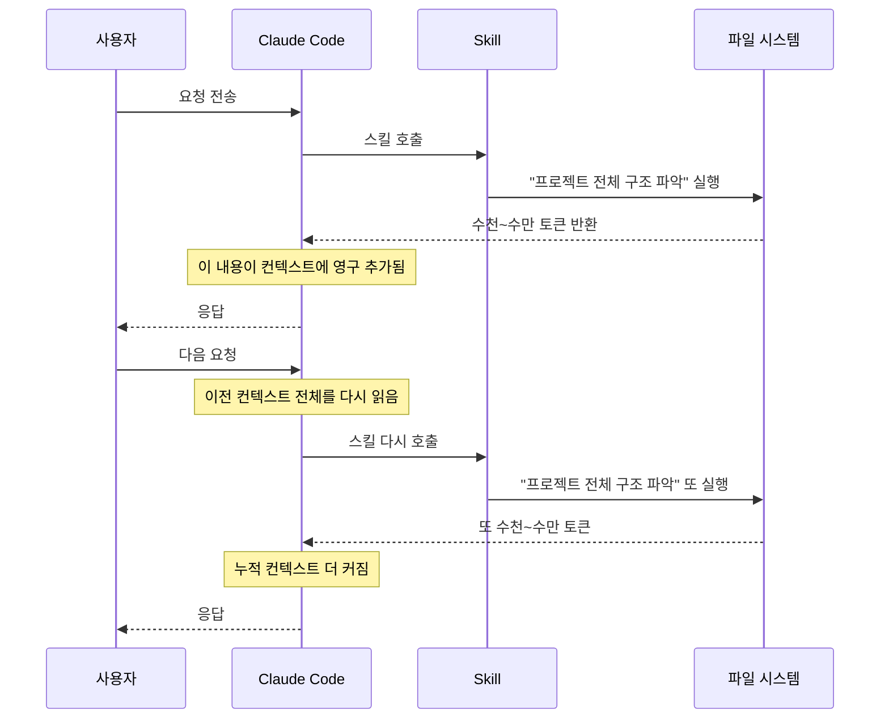
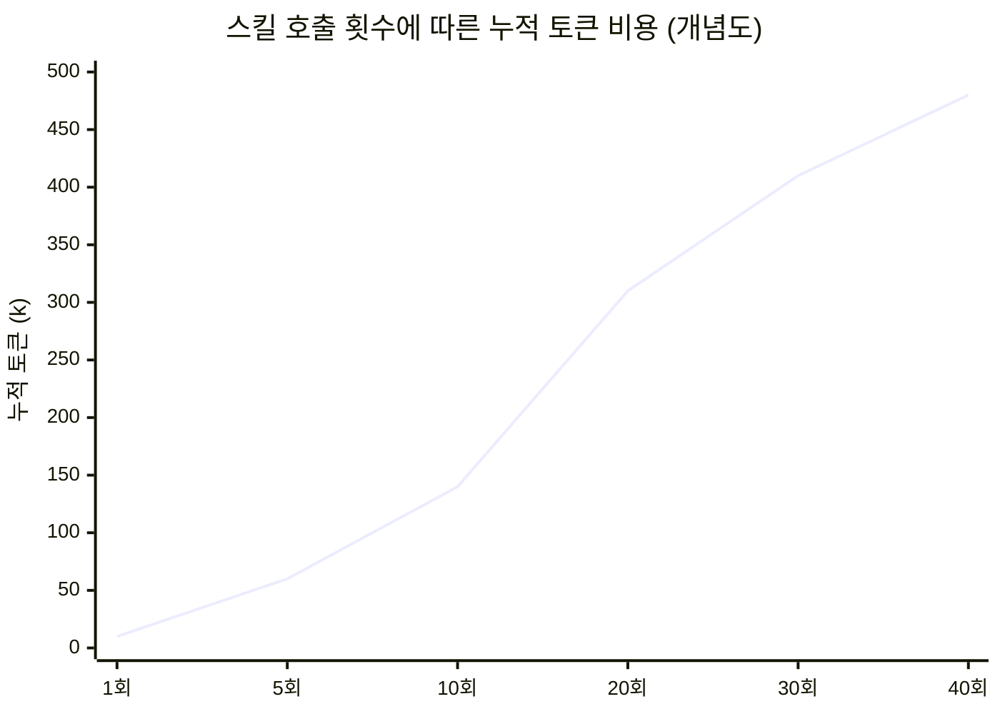
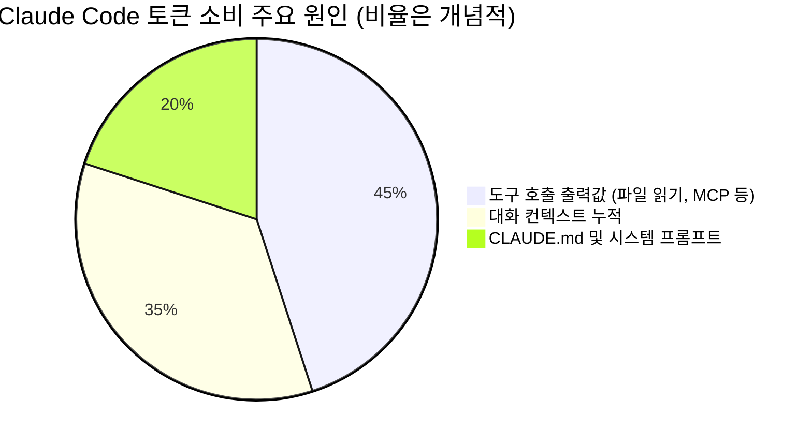
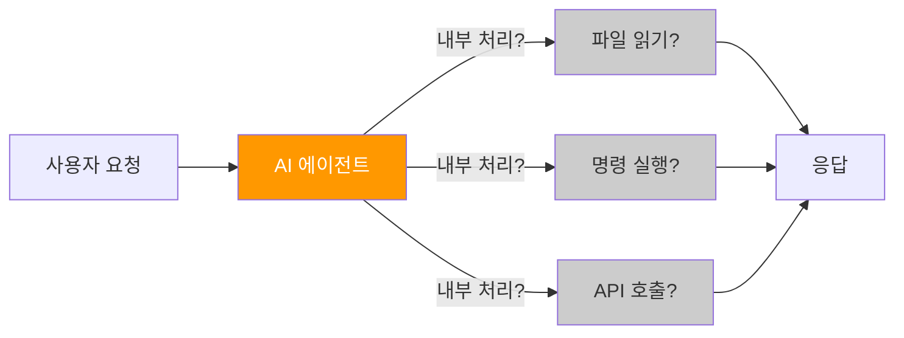
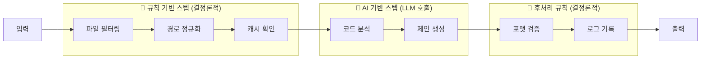

> **원문 출처**: Threads [@onmoim.connect](https://www.threads.com/@onmoim.connect/post/DXJ0LJ5E86Z) (2026년 4월)  
> **핵심 주제**: Claude Code 커스텀 스킬의 컨텍스트 누수 문제 및 비용 최적화  
> **연관 최신 자료**: Anthropic 공식 비용 가이드, Build to Launch 토큰 최적화 가이드 (2026년 4월 14일)

---

## 목차

1. [사건의 발단: 저녁에 대시보드를 열었더니](#1-사건의-발단)
2. [Claude Code Skill이란 무엇인가](#2-claude-code-skill이란-무엇인가)
3. [왜 Skill이 토큰을 이렇게 많이 먹는가: 구조적 원인 분석](#3-왜-skill이-토큰을-이렇게-많이-먹는가)
4. [범인 찾기: 숫자로 보는 누수 구조](#4-범인-찾기-숫자로-보는-누수-구조)
5. [해결책: 스킬 프롬프트 범위 좁히기](#5-해결책-스킬-프롬프트-범위-좁히기)
6. [더 넓은 시각: Claude Code 토큰을 먹는 3대 주범](#6-claude-code-토큰을-먹는-3대-주범)
7. [실전 최적화 전략 총정리](#7-실전-최적화-전략-총정리)
8. [규칙 기반 vs AI 기반 스텝 분리의 중요성](#8-규칙-기반-vs-ai-기반-스텝-분리의-중요성)
9. [Anthropic 공식 비용 데이터와 현실 비교](#9-anthropic-공식-비용-데이터와-현실-비교)
10. [커뮤니티의 비슷한 경험들](#10-커뮤니티의-비슷한-경험들)
11. [모니터링 체계 구축 방법](#11-모니터링-체계-구축-방법)
12. [결론: 보이지 않는 아키텍처의 함정](#12-결론-보이지-않는-아키텍처의-함정)

---

## 1. 사건의 발단

### 1.1 저녁에 대시보드를 열었더니

Threads 게시물의 주인공은 Claude Code를 활발하게 사용하는 개발자다. 특별히 무거운 작업을 한 것도 아닌 평범한 하루 저녁, API 대시보드를 열었더니 토큰 사용량이 **평소의 3배**를 기록하고 있었다. 하루에 무려 **$12**라는 금액이다.

이 숫자가 왜 충격적인지 맥락을 이해하려면, Anthropic이 공식적으로 밝힌 평균 사용 비용을 살펴봐야 한다.

> Anthropic 공식 문서에 따르면, Claude Code의 평균 비용은 **개발자 1인당 하루 약 $6**이며, 90%의 사용자는 일일 비용이 $12 이하로 유지된다.

즉, 이 개발자가 경험한 $12는 사용자의 90번째 백분위에 해당하는 극단값이었다. 그리고 그 원인은 단 하나였다. **커스텀 스킬 3개**.

### 1.2 왜 이런 일이 발생하는가

문제는 단순히 "스킬을 많이 썼다"가 아니다. 문제의 본질은 **스킬이 호출될 때마다 불필요하게 거대한 컨텍스트를 읽고 있었다**는 것이다. 개발자가 이 사실을 로그를 뒤지기 전까지 전혀 몰랐다는 점이 더욱 중요하다. 비용이 "조용히" 쌓이고 있었던 것이다.

---

## 2. Claude Code Skill이란 무엇인가

### 2.1 스킬의 개념

Claude Code의 스킬(Skill)은 **SKILL.md 파일과 선택적 보조 파일로 구성된 재사용 가능한 지식 아티팩트**다. 도메인 특화 워크플로우, API 사용 패턴, 코딩 컨벤션, 모범 사례 등을 구조화된 형태로 담고 있어서, 일반 목적의 Claude를 특정 작업에 특화된 전문가로 변환하는 역할을 한다.

```
project/
├── .claude/
│   └── skills/
│       ├── my-skill-1/
│       │   ├── SKILL.md        ← 핵심 지침 파일
│       │   └── helper.sh       ← 보조 스크립트 (선택)
│       ├── my-skill-2/
│       │   └── SKILL.md
│       └── my-skill-3/
│           └── SKILL.md
```

### 2.2 스킬의 동작 방식

스킬은 에이전트가 호출할 때 그 내용이 컨텍스트 윈도우에 로드된다. Anthropic 공식 문서는 이 점을 다음과 같이 설명한다.

> "Skills는 호출될 때만 필요에 따라 로드되므로, 특화된 지침을 skills로 이동하면 기본 컨텍스트를 더 작게 유지합니다."

언뜻 들으면 효율적으로 들린다. 문제는 스킬 자체가 호출되는 순간, **스킬의 지침에 따라 대규모 파일 읽기가 트리거될 수 있다**는 것이다.

### 2.3 커스텀 스킬 vs 빌트인 스킬

이 개발자가 사용한 것은 **커스텀 스킬** 3개였다. 직접 작성한 SKILL.md 파일들로, 각각 특정 작업을 수행하도록 프롬프트가 작성되어 있었다. 그런데 그 프롬프트에 치명적인 문구가 있었다.

```markdown
# 수정 전 스킬 프롬프트 (문제의 원인)
프로젝트 전체 구조 파악 후 응답
```

이 단 한 줄이 매 호출마다 프로젝트 전체 디렉토리 트리를 스캔하게 만들었다.

---

## 3. 왜 Skill이 토큰을 이렇게 많이 먹는가

### 3.1 Claude Code의 컨텍스트 누적 구조

Claude Code의 토큰 비용을 제대로 이해하려면 컨텍스트가 어떻게 축적되는지를 알아야 한다.



여기서 핵심 메커니즘이 두 가지 동시에 작동한다.

**메커니즘 ①: 컨텍스트 영구 누적**

Claude Code는 파일을 읽거나 셸 명령을 실행하거나 스킬을 호출할 때, 그 **전체 출력값이 컨텍스트에 추가**된다. 요약이 아니다. 전체가 다 들어간다. 그리고 그것은 세션이 끝날 때까지 컨텍스트에 남아 있다.

**메커니즘 ②: 매 메시지마다 전체 컨텍스트 재전송**

Claude는 매 메시지를 처리할 때 대화의 처음부터 전체 컨텍스트를 다시 읽는다. 50번째 메시지는 5번째 메시지보다 더 어려운 질문이어서 비싼 게 아니다. 앞의 49개 메시지 전체를 다시 읽어야 하기 때문에 비싼 것이다.

### 3.2 스킬이 특히 위험한 이유

일반적인 파일 읽기는 사용자가 명시적으로 요청할 때만 발생한다. 그러나 스킬 프롬프트에 "프로젝트 전체 구조 파악"이라는 지침이 있으면, **에이전트가 자율적으로** 파일 읽기를 반복 실행한다. 사용자는 이 과정을 직접 보지 못한다.

이것이 이 개발자가 "전혀 몰랐다"고 표현한 이유다. 토큰 소비가 눈에 보이지 않는 곳에서 자동으로 이루어지고 있었기 때문이다.

---

## 4. 범인 찾기: 숫자로 보는 누수 구조

### 4.1 하루 $12의 산술

이 개발자의 상황을 수치로 재구성하면 다음과 같다.

| 항목 | 수치 |
|---|---|
| 커스텀 스킬 수 | 3개 |
| 스킬당 호출 시 토큰 소비 | 8,000 ~ 12,000 토큰 |
| 하루 스킬 총 호출 횟수 | 40회 이상 |
| 하루 총 추가 토큰 소비 | 320,000 ~ 480,000+ 토큰 |
| 하루 비용 | $12 |

여기서 컨텍스트 누적 효과가 적용되면 실제로는 더 복잡하다. 스킬이 호출될 때마다 8k~12k 토큰이 소비되는 것이 아니라, 누적된 컨텍스트 전체가 재전송되기 때문에 뒤로 갈수록 호출 비용이 기하급수적으로 증가한다.



처음 몇 번의 호출은 저렴하지만, 컨텍스트가 누적될수록 이후 호출 비용이 폭발적으로 증가하는 것이다.

### 4.2 스킬 3개가 왜 이렇게 많은 토큰을 쓰는가

각 스킬이 "프로젝트 전체 구조 파악"을 지시하면, 에이전트는 다음을 실행한다.

```bash
# 에이전트가 자동으로 실행하는 작업들
ls -la /project                    # 루트 디렉토리 목록
find /project -type f              # 전체 파일 트리 스캔
cat /project/src/index.ts          # 주요 파일 읽기
cat /project/src/api/...           # API 디렉토리 전체 읽기
cat /project/package.json          # 설정 파일 읽기
# ... 수십 개의 파일이 컨텍스트에 추가됨
```

프로젝트 규모에 따라 이 과정에서 수만 토큰이 소비된다. 그리고 스킬이 3개이면 각각이 이 과정을 독립적으로 반복한다.

---

## 5. 해결책: 스킬 프롬프트 범위 좁히기

### 5.1 문제의 원인 제거

해결책은 놀랍도록 단순했다. 스킬 프롬프트에서 불필요한 파일 읽기 지침을 제거하고, 참조 범위를 특정 디렉토리로 좁힌 것이다.

```markdown
# ❌ 수정 전: 전체 프로젝트 스캔 유발
프로젝트 전체 구조 파악 후 응답

# ✅ 수정 후: 특정 디렉토리만 참조
src/api 디렉토리만 참고
```

이 한 줄의 변경이 만들어낸 차이는 극적이다.

| 항목 | 수정 전 | 수정 후 | 감소율 |
|---|---|---|---|
| 호출당 토큰 소비 | 8,000 ~ 12,000 | 3,000 | ~70% 감소 |
| 하루 총 비용 | $12 | $3.5 | **71% 감소** |
| 응답 속도 | 느림 | 체감될 정도로 빠름 | 개선 |

### 5.2 왜 응답 속도도 빨라졌나

토큰 소비가 줄었다는 것은 곧 Claude가 처리해야 하는 정보량이 줄었다는 의미다. 모델이 8k~12k 토큰의 컨텍스트를 처리하는 것과 3k 토큰을 처리하는 것 사이에는 눈에 띄는 속도 차이가 발생한다. 또한 불필요한 파일 스캔에 걸리는 I/O 시간도 제거된다.

### 5.3 올바른 스킬 프롬프트 작성 원칙

이 사례에서 도출할 수 있는 스킬 프롬프트 작성 원칙은 다음과 같다.

**원칙 1: 최소 필요 원칙 (Principle of Least Context)**

스킬이 수행하는 작업에 필요한 최소한의 컨텍스트만 지정한다. "전체 프로젝트 파악"이 아니라 "특정 모듈의 특정 파일" 수준으로 범위를 좁힌다.

**원칙 2: 명시적 경로 지정**

"관련 파일을 참고해"가 아니라 `src/api/auth.ts`, `src/models/user.ts`처럼 구체적인 경로를 지정한다. 모호한 지침은 에이전트가 더 많은 파일을 탐색하게 만든다.

**원칙 3: 읽기가 필요 없는 스킬은 읽기를 금지**

특정 스킬이 파일 시스템 접근이 필요 없다면, 프롬프트에 명시적으로 파일 읽기를 하지 말라고 지시한다.

```markdown
# ✅ 좋은 스킬 프롬프트 예시
## 이 스킬의 목적
코드 리뷰 시 보안 취약점 체크리스트 제공

## 참조 범위
- src/api/ 디렉토리의 엔드포인트 파일만 분석
- node_modules, dist, build 디렉토리는 절대 읽지 않음
- 필요한 파일이 불분명할 경우, 먼저 사용자에게 확인

## 절대 하지 말 것
- 프로젝트 전체 구조 스캔
- 설정 파일 외의 환경변수 파일 읽기
- 테스트 파일 전체 읽기
```

---

## 6. Claude Code 토큰을 먹는 3대 주범

이 Threads 게시물의 사례는 더 큰 문제의 일부다. 2026년 4월 최신 분석에 따르면, Claude Code 사용자의 비용 폭발을 유발하는 주요 원인은 세 가지로 정리된다.



### 6.1 주범 ①: 도구 호출 출력값 (가장 큰 주범)

Claude Code가 파일을 읽거나, 셸 명령을 실행하거나, MCP 서버를 호출할 때마다 **전체 출력이 컨텍스트에 추가**된다. 요약이 아니다. 10,000줄짜리 로그 파일은 10,000줄 그대로 컨텍스트에 들어간다.

이것이 이 Threads 게시물의 핵심 문제였다. 스킬이 "프로젝트 전체 구조 파악"을 실행할 때, 수십 개의 파일 읽기 결과가 통째로 컨텍스트에 들어갔던 것이다.

이 문제를 방지하는 방법은 다음과 같다.

- `.claudeignore` 파일로 불필요한 파일이 Claude에게 보이지 않도록 차단
- 스킬 프롬프트에서 참조 범위를 명시적으로 제한
- MCP 도구 응답이 지나치게 크다면 도구 자체를 수정하여 요약 형태로 반환

### 6.2 주범 ②: 대화 컨텍스트 누적

Claude는 매 메시지를 처리할 때 **대화의 처음부터 전체 내용을 다시 읽는다**. 이 특성 때문에 세션이 길어질수록 비용이 복리 이자처럼 증가한다.

한 미국의 개발자는 이 메커니즘을 이해하지 못한 채 Claude Code를 집중적으로 사용하다 **한 달에 $1,600이라는 청구서**를 받은 경험을 공유했다. 그는 "나는 비용에 주의하고 있다고 생각했다. 하지만 나는 보이지 않는 아키텍처에서 토큰을 태우고 있었다"고 말했다.

해결 방법은 다음과 같다.

- 관련 없는 작업으로 전환할 때 `/clear` 명령어로 컨텍스트 초기화
- 세션 이름 저장 후 `/rename`, 나중에 `/resume`으로 재개
- 컨텍스트가 너무 길어지면 `/compact` 명령어로 요약 압축

### 6.3 주범 ③: CLAUDE.md 및 시스템 프롬프트

CLAUDE.md는 Claude가 어떤 파일을 읽기 전에, 어떤 태스크를 시작하기 전에, **매 턴, 매 세션에서 가장 먼저 로드**된다. CLAUDE.md가 5,000토큰이라면 단어 한 마디 입력하기 전에 이미 5,000토큰이 소비되는 것이다.

Anthropic 공식 권장사항은 CLAUDE.md를 **500줄 이하**로 유지하는 것이다. PR 리뷰나 데이터베이스 마이그레이션처럼 특정 워크플로우에만 필요한 상세 지침은 CLAUDE.md가 아닌 **스킬 파일로 분리**하는 것이 권장된다.

---

## 7. 실전 최적화 전략 총정리

### 7.1 즉시 적용 가능한 설정 변경

**① .claudeignore 설정**

프로젝트 루트에 `.claudeignore` 파일을 생성하고 Claude가 읽을 필요 없는 파일/디렉토리를 등록한다.

```gitignore
# 패키지 의존성 (절대 읽을 필요 없음)
node_modules/
vendor/
.venv/
__pycache__/

# 빌드 결과물
dist/
build/
.next/
*.min.js
*.min.css

# 바이너리 및 미디어
*.png
*.jpg
*.gif
*.mp4
*.pdf
*.zip

# 로그 및 임시 파일
*.log
*.lock
tmp/
.cache/
coverage/

# 환경 설정 (보안상도 중요)
.env
.env.local
.env.production
```

**② CLAUDE.md 다이어트**

CLAUDE.md를 열어서 특정 작업에만 필요한 지침들을 찾아내고, 그것을 별도 스킬 파일로 분리한다.

```
Before: CLAUDE.md = 2,000줄 (모든 것이 다 들어있음)
After: CLAUDE.md = 200줄 (핵심 원칙만)
      + skills/pr-review/SKILL.md = PR 리뷰 지침
      + skills/db-migration/SKILL.md = DB 마이그레이션 지침
      + skills/api-design/SKILL.md = API 설계 지침
```

**③ 스킬 프롬프트 범위 감사**

기존에 만들어 놓은 모든 스킬의 SKILL.md를 열어, "전체", "모든", "프로젝트" 같은 광범위한 단어가 포함된 지침이 있는지 검토한다. 있다면 즉시 구체적인 경로나 범위로 대체한다.

### 7.2 세션 운영 습관

**세션 시작 전**

```bash
# 현재 토큰 사용량과 비용 확인
/cost

# 또는 상태 표시줄에 항상 표시되도록 설정
```

**작업 중**

```bash
# 관련 없는 작업으로 전환할 때
/clear

# 이름 저장 후 초기화
/rename auth-feature
/clear

# 나중에 재개
/resume auth-feature
```

**컨텍스트가 너무 쌓였을 때**

```bash
# 요약 압축 (Claude가 중요한 내용을 판단하여 요약)
/compact

# 특정 내용을 보존하며 압축
/compact API 설계 패턴과 인증 로직을 중심으로 압축해줘
```

### 7.3 확장 사고(Extended Thinking) 관리

확장 사고는 기본적으로 **31,999 토큰의 예산**으로 활성화되어 있다. 복잡한 추론이 필요한 작업에는 유용하지만, 단순 작업에도 이 예산이 소비된다.

```bash
# 간단한 작업 시 사고 비용 절감
/effort low        # 노력 수준 낮추기
# 또는
MAX_THINKING_TOKENS=8000  # 환경 변수로 예산 제한
```

---

## 8. 규칙 기반 vs AI 기반 스텝 분리의 중요성

게시물 작성자가 제시한 가장 통찰력 있는 조언은 바로 이것이다.

> "워크플로우 전체를 AI로 돌리면 이런 식으로 새는 거 못 잡아. 규칙 기반 스텝이랑 AI 스텝 분리해놔야 어디서 새는지 보임."

### 8.1 AI 에이전트 워크플로우의 블랙박스 문제

워크플로우의 모든 단계를 AI에게 맡기면, 각 단계에서 얼마나 많은 토큰이 소비되는지 파악하기 어렵다. Claude Code가 내부적으로 어떤 파일을 읽고, 어떤 명령을 실행하고, 얼마나 많은 컨텍스트를 처리하는지가 "블랙박스"가 된다.



이 구조에서는 토큰이 어디서 새는지 파악하기 어렵다.

### 8.2 하이브리드 아키텍처: 규칙 + AI

해결책은 워크플로우를 두 종류의 스텝으로 명확하게 분리하는 것이다.



**규칙 기반 스텝에 속하는 작업들**

- 파일 목록 생성 및 필터링 (bash, Python 등으로 처리)
- 특정 패턴 검색 (`grep`, `find` 등)
- 데이터 형식 변환
- 캐시 조회 및 저장
- 조건 분기 (if-else 로직)

**AI 기반 스텝에 속하는 작업들**

- 코드의 의미론적 분석
- 자연어 생성 (커밋 메시지, 문서, 설명)
- 복잡한 패턴 인식 및 추론
- 코드 개선 제안

### 8.3 분리의 실제 효과

규칙 기반 스텝에서 AI가 필요 없는 데이터 전처리를 처리하고, 정제된 최소한의 입력만 AI 스텝에 전달하면 다음 효과가 나타난다.

- **비용 가시성**: 각 AI 호출이 얼마나 많은 토큰을 소비하는지 정확히 측정 가능
- **비용 절감**: AI에게 전달되는 컨텍스트의 크기를 사전에 제어 가능
- **디버깅 용이성**: "어디서 새는가"를 찾을 수 있음
- **신뢰성 향상**: 결정론적 스텝은 AI 없이도 예측 가능하게 동작

---

## 9. Anthropic 공식 비용 데이터와 현실 비교

### 9.1 공식 평균 비용

Anthropic이 공개한 데이터를 기준으로 보면 다음과 같다.

| 구분 | 비용 |
|---|---|
| 평균 일일 비용 (Sonnet 4.6 기준) | 약 $6/일 |
| 90% 사용자 상한선 | $12/일 |
| 평균 월간 비용 (Sonnet 4.6) | 약 $100~200/월 |

이 게시물의 작성자는 **$12/일**을 기록했으니, 상위 10%에 해당하는 비용을 지출하고 있었던 것이다. 해결 후 **$3.5/일**로 줄었으니 이제는 평균 이하의 효율적인 사용자가 됐다.

### 9.2 스킬 최적화가 가져오는 절감 효과

동일한 작업량에서 스킬 프롬프트 최적화만으로 71% 비용 감소가 달성됐다는 것은 놀라운 수치다.

```
최적화 전: $12/일 × 30일 = $360/월
최적화 후: $3.5/일 × 30일 = $105/월
절감액: $255/월
```

스킬 프롬프트를 수정하는 데 걸린 시간이 30분~1시간이라면, 이는 극적인 ROI다.

### 9.3 프롬프트 캐싱의 역할

비용 절감에 있어서 Anthropic이 자동으로 적용하는 **프롬프트 캐싱**도 중요한 역할을 한다. 반복되는 시스템 프롬프트나 CLAUDE.md 같은 고정 콘텐츠는 캐시되어 재사용 비용이 절감된다. 그러나 스킬이 매번 새로운 파일을 읽으면 그 내용은 캐시되지 않는다. 파일 내용이 동적으로 변하기 때문이다.

따라서 스킬 프롬프트 최적화는 캐싱의 혜택을 최대화하는 방향과도 일치한다. 참조 범위를 좁히면 캐시 히트율도 높아진다.

---

## 10. 커뮤니티의 비슷한 경험들

이 Threads 게시물에서 "Claude Code skill이나 커스텀 커맨드 쓰는 사람 있어? 토큰 관리 어떻게 하는지 궁금"이라고 묻고 있다는 것은, 이 문제가 개인적인 실수가 아니라 **커뮤니티 전반에 걸친 공통 문제**임을 시사한다.

실제로 유사한 경험들이 다양한 채널에서 보고되고 있다.

**2026년 3월: Anthropic 프롬프트 캐싱 버그 사건**

2026년 3월, Anthropic의 프롬프트 캐싱에 두 개의 버그가 발생하여 사전 경고 없이 토큰 사용량이 10~20배 폭증한 사건이 있었다. 사용자들이 Claude Code 바이너리를 역공학으로 분석해서야 원인을 찾아냈다. 이 사건은 "청구 레이어가 대부분의 개발자가 생각하는 것보다 훨씬 불투명하다"는 교훈을 남겼다.

**$1,600 청구서 사례**

한 미국 개발자는 Claude Code를 집중적으로 사용하다 한 달에 $1,600을 청구받았다. 그의 분석에 따르면, 세션이 길어질수록 컨텍스트가 누적되어 40번째 메시지가 1번째 메시지보다 훨씬 비싸다는 것을 당시에는 몰랐다고 한다. "나는 각 세션을 깨끗하게 시작하고 있었다. 그러나 Claude에게 읽기를 요청한 모든 파일이 그 세션이 끝날 때까지 컨텍스트 윈도우에 영구적으로 추가됐다."

---

## 11. 모니터링 체계 구축 방법

### 11.1 실시간 모니터링

Claude Code 내부에서 바로 사용할 수 있는 모니터링 도구들이 있다.

```bash
# 현재 세션의 토큰 사용량과 비용 확인
/cost

# 상태 표시줄에 지속적으로 표시 (설정에서 활성화)
# 설정 → 상태 표시줄 → 토큰 사용량 표시 활성화
```

### 11.2 외부 분석 도구

오픈소스 커뮤니티에서 개발된 Claude Code 사용량 분석 스킬도 활용할 수 있다. 예를 들어, 로컬 로그(`~/.claude/projects/`) 를 분석하여 다음 정보를 제공하는 스킬들이 있다.

- 프로젝트별 토큰 사용량 및 비용
- 어떤 도구가 가장 많은 토큰을 소비하는지
- 생산성 높은 시간대 파악 (토큰 대비 완료 태스크 비율)
- 코드 핫스팟 식별 (자주 읽히는 파일)

```bash
# 사용 예시 (커뮤니티 스킬 활용)
"이번 달 Claude Code 사용 비용 분석해줘"
"어떤 프로젝트에서 토큰을 가장 많이 쓰고 있어?"
"오늘 가장 비쌌던 스킬 호출이 뭐야?"
```

### 11.3 API 대시보드 활용

API 모드로 사용하는 경우 Anthropic Console에서 다음을 확인할 수 있다.

- 시간별, 일별 토큰 사용량 그래프
- 모델별 비용 분리 (Opus vs Sonnet vs Haiku)
- 캐시 히트율 (캐싱 효과 측정)
- 팀 지출 한도 설정 (예산 초과 방지)

팀 단위로 Claude Code를 사용한다면, **팀 지출 한도**를 설정하는 것이 특히 중요하다. 개별 개발자의 스킬 설정 오류가 팀 전체 비용으로 이어질 수 있기 때문이다.

---

## 12. 결론: 보이지 않는 아키텍처의 함정

### 12.1 핵심 교훈 세 가지

이 Threads 게시물이 전달하는 핵심 교훈은 다음과 같다.

**교훈 ①: 보이지 않는 곳에서 비용이 쌓인다**

Claude Code의 토큰 비용은 사용자가 입력하는 프롬프트의 길이와 무관하게, 내부적인 파일 읽기와 컨텍스트 누적에 의해 결정된다. "내가 입력을 적게 했으니 비용이 적겠지"는 틀린 가정이다.

**교훈 ②: 스킬은 효율성 도구인 동시에 비용 위험 요소다**

스킬은 맥락에 따라 효율성을 높이는 강력한 도구다. 그러나 잘못 작성된 스킬은 매 호출마다 거대한 컨텍스트를 생성하는 비용 폭탄이 된다. 스킬을 설계할 때는 기능성뿐 아니라 토큰 효율성도 반드시 고려해야 한다.

**교훈 ③: 모니터링 없는 자동화는 위험하다**

AI 워크플로우를 구축할 때, 비용 모니터링을 워크플로우의 일부로 포함시켜야 한다. 특히 스킬이나 커스텀 커맨드처럼 자동으로 실행되는 요소들의 토큰 소비를 정기적으로 확인해야 한다.

### 12.2 실천 체크리스트

이 게시물을 읽은 Claude Code 사용자라면 지금 당장 다음을 확인해보자.

- [ ] 내 커스텀 스킬의 프롬프트에 "전체", "모든", "프로젝트 구조" 같은 광범위한 표현이 있는가?
- [ ] `.claudeignore` 파일이 설정되어 있는가?
- [ ] CLAUDE.md의 분량이 500줄 이하인가?
- [ ] 마지막으로 `/cost`로 사용량을 확인한 게 언제인가?
- [ ] 관련 없는 작업으로 전환할 때 `/clear`를 사용하는가?
- [ ] API 대시보드에서 이번 주 토큰 사용량을 확인했는가?

### 12.3 마지막으로

이 게시물의 작성자는 마지막에 이런 말을 남겼다.

> "솔직히 skill 쓰면서 토큰 사용량 한 번도 안 본 사람 나 말고도 꽤 있을 거 같은데 🫠"

이 말은 개인적인 고백을 넘어, Claude Code를 사용하는 많은 개발자들에게 보내는 경고다. 강력한 도구를 사용할 때는, 그 도구의 비용 구조를 이해하는 것이 역량의 일부다.

$12를 $3.5로 줄인 것은 30분의 로그 분석과 한 줄의 프롬프트 수정으로 이루어졌다. 가장 비싼 비용은 항상 모르고 있는 비용이다.

---

## 참고 자료

- [Anthropic 공식 비용 관리 가이드](https://code.claude.com/docs/ko/costs)
- [Claude Code 토큰 최적화 가이드 (Build to Launch, 2026.04.14)](https://buildtolaunch.substack.com/p/claude-code-token-optimization)
- [Claude Code 비용 구조와 토큰 절약 전략 (요즘IT)](https://wikidocs.net/329901)
- [Anthropic 토큰 카운팅 API 문서](https://platform.claude.com/docs/ko/build-with-claude/token-counting)
- [Anthropic 가격 정책](https://platform.claude.com/docs/ko/about-claude/pricing)
- [GitHub: bear2u/my-skills - Claude Code 커스텀 스킬 예시](https://github.com/bear2u/my-skills)

---

> **작성 일자**: 2026-04-16
