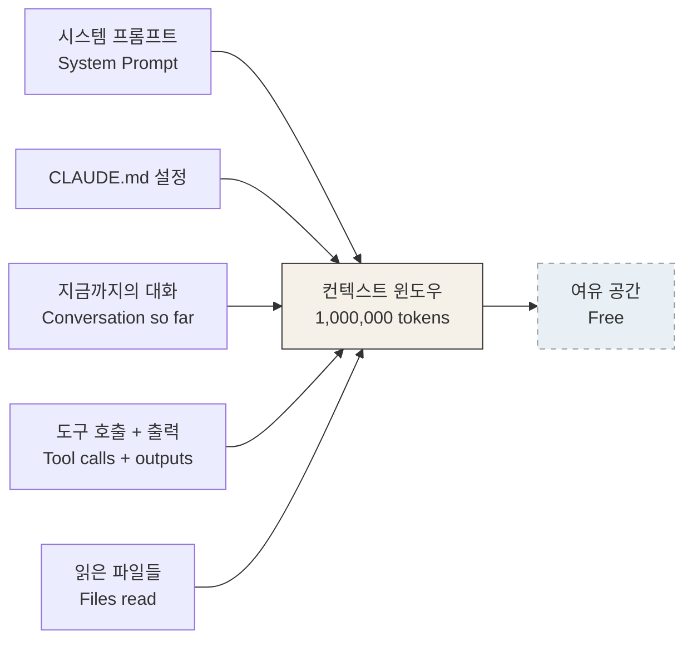
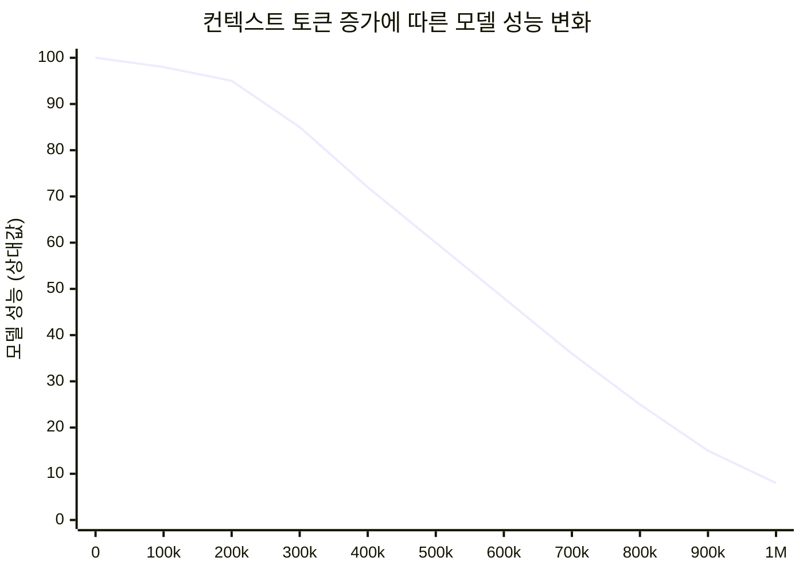
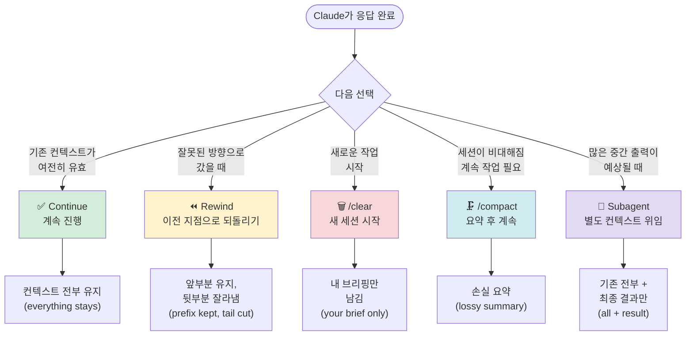
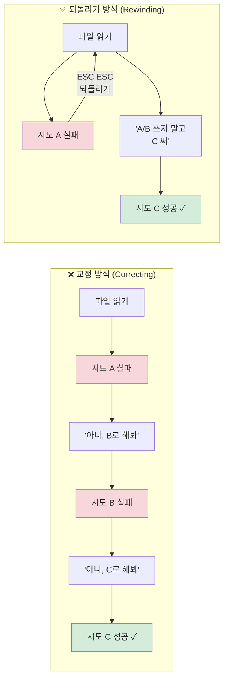
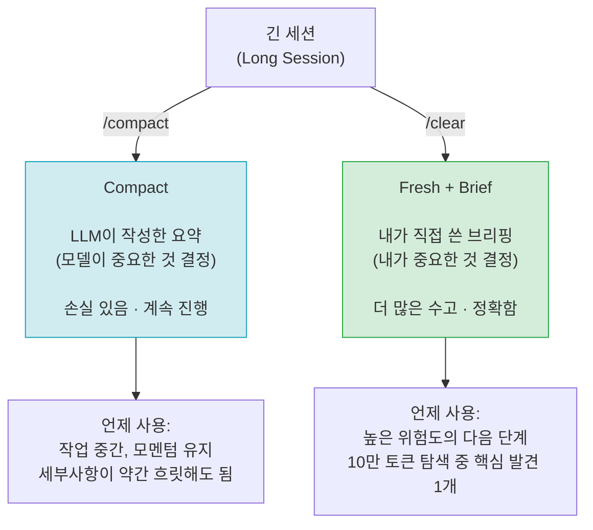
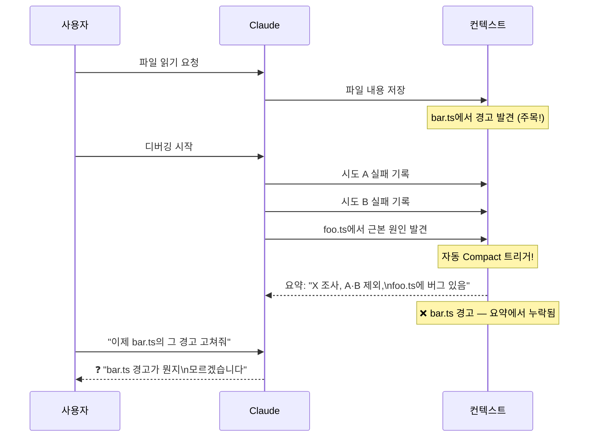
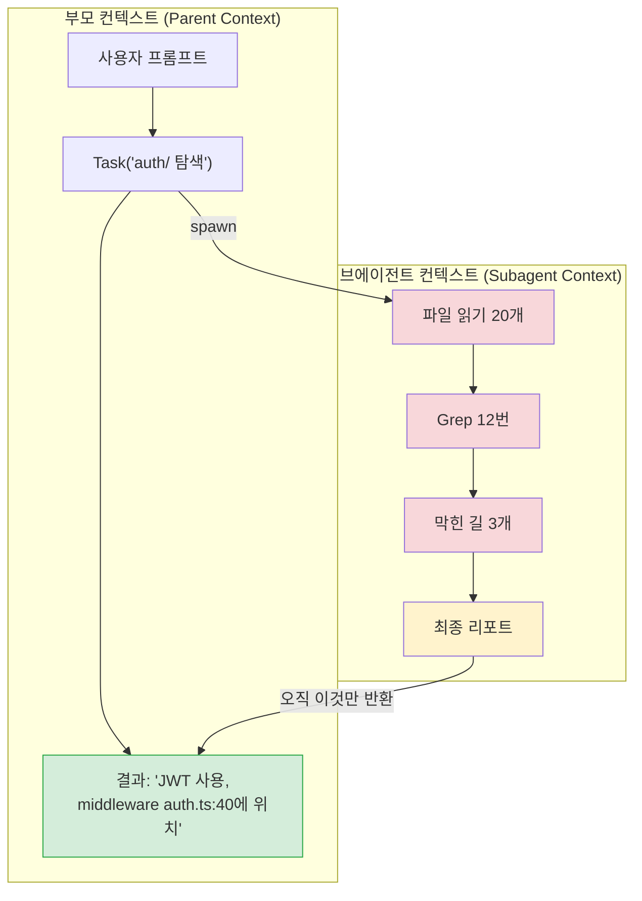
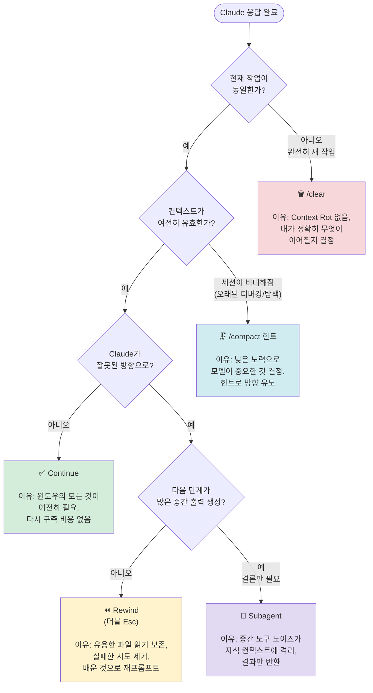
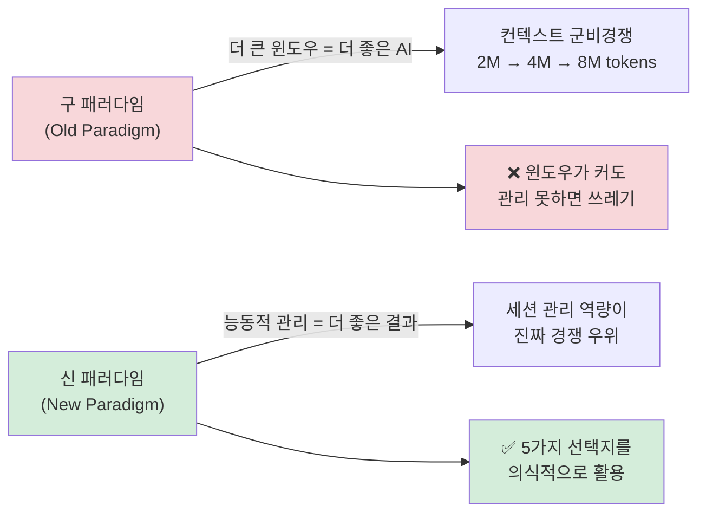

> **출처**: Thariq Shihipar ([@trq212](https://x.com/trq212/status/2044548257058328723)) — Claude Code 핵심 개발자 공식 가이드 (2026년 4월)  
> **작성일**: 2026-04-16  
> **요약**: 컨텍스트 윈도우는 AI 코딩 도구의 핵심이지만, 크기만 늘리는 것은 해결책이 아니다. 진짜 해결책은 '주도적 세션 관리'다.

---

## 목차

1. [컨텍스트 윈도우란 무엇인가](#1-컨텍스트-윈도우란-무엇인가)
2. [컨텍스트 로트(Context Rot): 대화가 길어질수록 AI가 멍청해진다](#2-컨텍스트-로트-context-rot)
3. [매 턴은 하나의 분기점이다: 5가지 선택지](#3-매-턴은-하나의-분기점이다-5가지-선택지)
4. [새 세션을 시작해야 할 때](#4-새-세션을-시작해야-할-때)
5. [Rewind: 교정보다 강력한 되돌리기](#5-rewind-교정보다-강력한-되돌리기)
6. [Compact vs Clear: 무게를 덜어내는 두 가지 방법](#6-compact-vs-clear)
7. [나쁜 Compact란 무엇인가](#7-나쁜-compact란-무엇인가)
8. [Subagent: 독립 컨텍스트에 더러운 일을 맡기기](#8-subagent-독립-컨텍스트에-더러운-일을-맡기기)
9. [최종 의사결정 가이드](#9-최종-의사결정-가이드)
10. [중국 AI 커뮤니티의 반응: 왜 이것이 2026년 최고의 업데이트인가](#10-중국-ai-커뮤니티의-반응)
11. [실전 적용 전략](#11-실전-적용-전략)
12. [최신 기술 현황 (2026년 4월 기준)](#12-최신-기술-현황)

---

## 1. 컨텍스트 윈도우란 무엇인가

컨텍스트 윈도우(Context Window)는 AI 모델이 다음 응답을 생성할 때 동시에 "볼 수 있는" 모든 정보의 총합이다. 이것은 단순히 대화 기록만을 의미하지 않는다.



Claude Code의 컨텍스트 윈도우는 **100만 토큰(1M tokens)** 이며, 이는 하드 커트오프(hard cutoff)로 이 한계를 넘어서면 반드시 어떤 조치를 취해야 한다.

### 컨텍스트 윈도우에 포함되는 것들

컨텍스트 윈도우에는 다음 다섯 가지 요소가 축적된다.

첫째, **시스템 프롬프트**다. Claude Code가 실행될 때 기본으로 주입되는 지시사항으로, 이미 상당한 토큰을 차지한다.

둘째, **CLAUDE.md 설정 파일**이다. 프로젝트별로 커스터마이징된 행동 지침이 여기에 포함된다.

셋째, **지금까지의 대화(Conversation so far)** 다. 사용자가 입력한 모든 메시지와 Claude의 모든 답변이 누적된다.

넷째, **도구 호출 및 출력(Tool calls + outputs)** 이다. Claude가 파일을 읽고, 코드를 실행하고, 검색을 수행할 때 발생하는 모든 중간 결과물이 여기에 쌓인다. 이것이 가장 빠르게 컨텍스트를 소진하는 요소다.

다섯째, **읽은 파일들(Files read)** 이다. Claude가 참조한 모든 파일의 내용이 컨텍스트에 포함된다.

---

## 2. 컨텍스트 로트 (Context Rot)

컨텍스트 로트란 **대화가 길어질수록 AI의 성능이 저하되는 현상**을 말한다. 이것은 비공식적인 관찰이 아니라, Anthropic 공식 개발자가 직접 인정한 사실이다.



### 왜 컨텍스트 로트가 발생하는가

AI 모델의 어텐션(Attention) 메커니즘은 컨텍스트 내의 모든 토큰을 서로 비교하며 응답을 생성한다. 컨텍스트가 커질수록 어텐션이 더 많은 토큰에 분산되어, 현재 작업과 관련 없는 오래된 내용이 노이즈로 작용하기 시작한다.

이 현상의 결과로 다음과 같은 증상이 나타난다. 방금 전에 결정한 사항을 반복해서 다시 묻거나, 이미 시도했다가 실패한 방법을 다시 제안하거나, 명확한 지시사항을 무시하고 엉뚱한 방향으로 진행한다. 컨텍스트 창이 가득 찰 무렵에는 모델의 지능이 가장 낮아진 상태가 되어, 바로 이 시점에 자동 압축(Autocompact)이 트리거된다는 것이 치명적인 아이러니다.

### 컨텍스트 로트의 임계점

공식 가이드에 따르면 1M 컨텍스트 모델에서는 **약 300,000~400,000 토큰** 부근부터 컨텍스트 로트가 가시적으로 시작된다. 다만 이는 절대적인 법칙이 아니라, 작업의 성격에 따라 다르다. 단순 반복 작업에서는 더 늦게 나타날 수 있고, 복잡한 추론을 요구하는 작업에서는 더 일찍 나타날 수 있다.

커뮤니티의 실험에 따르면 개인마다 자신만의 "Context Rot 임계점"을 발견하고 그 이전에 선제적으로 관리하는 것이 최선의 전략이다.

---

## 3. 매 턴은 하나의 분기점이다: 5가지 선택지

Claude Code의 핵심 통찰 중 하나는, **AI가 응답을 완료한 모든 순간이 단순한 끝이 아니라 5가지 선택지를 가진 분기점**이라는 것이다.



이 다섯 가지 선택지는 "얼마나 많은 기존 컨텍스트를 다음으로 이어가느냐"를 기준으로 스펙트럼을 이룬다.

**Fresh session(/clear)** 은 기존 컨텍스트를 전혀 가져가지 않는다. 오직 내가 직접 작성한 브리핑만이 새 세션으로 이어진다.

**Compact**는 모델이 자동으로 요약한 내용을 가져간다. 손실(lossy)이 발생하지만 작업의 모멘텀을 유지할 수 있다.

**Subagent**는 특이한 포지션을 차지한다. 부모 컨텍스트는 가볍게 유지되면서, 서브에이전트는 별도의 무거운 작업을 독립적으로 수행하고 결과만 돌려준다.

**Rewind**는 이전 특정 시점까지의 컨텍스트는 보존하되, 그 이후의 실패한 시도들은 잘라낸다.

**Continue**는 모든 컨텍스트를 그대로 유지한 채로 진행한다.

---

## 4. 새 세션을 시작해야 할 때

1M 컨텍스트 윈도우가 도입되면서 더 긴 작업을 단일 세션에서 처리할 수 있게 되었다. 전체 풀스택 앱을 처음부터 구축하는 것도 가능하다. 그러나 컨텍스트가 남아있다고 해서 반드시 같은 세션을 계속 유지해야 하는 것은 아니다.

### Anthropic 공식 원칙

> **"새로운 작업을 시작할 때는 새로운 세션도 시작하라."**

이것은 단순한 권고사항이 아니다. 작업의 경계를 세션의 경계와 일치시키는 것이 컨텍스트 관리의 핵심이다.

### 회색 지대: 연관된 작업의 경우

연관된 작업을 수행할 때는 판단이 필요하다. 예를 들어, 방금 구현한 기능에 대한 문서를 작성하는 경우를 생각해보자. 새 세션을 시작하면 Claude가 관련 파일들을 다시 읽어야 하는데, 이는 더 느리고 비용도 더 많이 든다. 그러나 문서 작성은 지능 집약적인 작업이 아니므로, 기존 컨텍스트를 활용한 효율성 이득이 컨텍스트 로트의 비용보다 클 수 있다. 이 경우에는 세션을 이어가는 것이 합리적이다.

---

## 5. Rewind: 교정보다 강력한 되돌리기

Rewind는 Claude Code에서 가장 강력하면서도 가장 활용이 부족한 기능이다. **더블 Esc (또는 `/rewind`)** 를 누르면 이전의 어느 메시지로든 돌아가서, 그 지점 이후의 모든 메시지를 컨텍스트에서 제거한 채 다시 프롬프트할 수 있다.

### Correcting vs Rewinding 비교



**교정 방식**의 결과 컨텍스트: 파일 읽기 + 실패한 시도 2개 + 교정 메시지 2개 + 최종 해결책  
**되돌리기 방식**의 결과 컨텍스트: 파일 읽기 + 교훈이 담긴 프롬프트 1개 + 최종 해결책

Rewind의 진정한 가치는 **실패한 시도들이 컨텍스트를 오염시키는 것을 원천 차단**한다는 데 있다. 잘못된 접근법을 시도하고, 무언가 배웠다면, 그 지식을 들고 실패 이전 시점으로 돌아가 깨끗한 상태에서 다시 시작하면 된다.

### Rewind의 5가지 옵션

실제 Claude Code UI에서 Rewind를 실행하면 다음과 같은 선택지가 나타난다.

1. **Restore code and conversation** — 코드와 대화 모두 복원
2. **Restore conversation** — 대화만 복원
3. **Restore code** — 코드만 복원
4. **Summarize from here** — 이 시점부터 요약 (컨텍스트 추가 가능)
5. **Summarize up to here** — 이 시점까지 요약

4번 옵션은 특히 흥미롭다. Claude의 미래 버전이 과거의 자신에게 보내는 편지처럼, 실패한 시도에서 배운 교훈을 정리해 핸드오프 메시지를 만들 수 있다.

---

## 6. Compact vs Clear

세션이 길어졌을 때 컨텍스트의 무게를 덜어내는 두 가지 방법이 있다: `/compact`와 `/clear`. 겉으로는 비슷해 보이지만 근본적으로 다르게 작동한다.



### /compact 상세

`/compact`는 모델에게 지금까지의 대화를 요약하도록 요청하고, 그 요약으로 전체 히스토리를 대체한다. 손실이 발생하지만 직접 아무것도 작성할 필요가 없다는 장점이 있다. 모델이 중요한 것을 스스로 결정하기 때문에, 예상보다 포괄적으로 핵심 내용을 포함할 수 있다.

힌트를 전달해서 방향을 잡아줄 수도 있다.

```
/compact focus on the auth refactor, drop the test debugging
```

이렇게 하면 모델이 요약할 때 인증 리팩터링에 집중하고, 테스트 디버깅 과정은 제외하도록 유도할 수 있다.

### /clear 상세

`/clear`는 사용자가 직접 중요한 내용을 정리해서 새 세션을 시작한다. 예를 들어 다음과 같이 정리한다.

```
현재 상황: auth 미들웨어 리팩터링 중
핵심 제약: X 방식 사용 필수
관련 파일: A, B
제외된 접근법: Y 방식 (테스트 결과 실패)
```

더 많은 수고가 필요하지만, 결과로 나오는 컨텍스트는 내가 결정한 정확한 정보만으로 구성된다.

---

## 7. 나쁜 Compact란 무엇인가

장시간 세션을 자주 사용하다 보면, Compact가 유독 잘못되는 경우를 경험하게 된다.



이 문제가 특히 심각한 이유는 두 가지다.

첫째, **모델이 작업의 방향을 예측할 수 없을 때 발생한다.** 긴 디버깅 세션 동안 bar.ts의 경고는 주요 관심사가 아니었기 때문에, 요약 시 제외되어버린다.

둘째, **컨텍스트 로트 때문에 Compact 실행 시점에 모델의 지능이 가장 낮다.** 컨텍스트가 가득 찼을 때 자동으로 트리거되는 Compact는, 바로 그 시점에 모델이 가장 부정확하다는 역설을 가지고 있다.

### 나쁜 Compact를 예방하는 방법

1M 컨텍스트 덕분에 예방책이 생겼다. **선제적으로 `/compact`를 실행**하면 된다. 컨텍스트가 아직 여유 있는 시점에, 다음에 하고자 하는 작업에 대한 설명을 담아 Compact를 실행하면, 모델이 올바른 방향으로 중요한 정보를 보존하면서 요약할 수 있다.

---

## 8. Subagent: 독립 컨텍스트에 더러운 일을 맡기기

Subagent는 컨텍스트 관리의 가장 강력한 도구다. **다음 작업이 많은 중간 출력물을 생성하지만, 최종 결론만 필요할 때** 사용한다.



서브에이전트가 종료되면, 탐색 과정에서 발생한 모든 노이즈(파일 읽기, 실패한 시도, 중간 출력)는 가비지 컬렉션(garbage collection)처럼 사라진다. 부모 컨텍스트에는 최종 결과만 남는다.

### Subagent 활용 판단 기준

핵심 판단 기준은 하나다: **이 도구 출력 결과를 나중에 다시 참조해야 하는가, 아니면 결론만 필요한가?**

결론만 필요하다면 서브에이전트로 위임하라.

### 직접 Subagent를 명시적으로 지시하는 예시

```
"서브에이전트를 띄워서 이 작업 결과를 다음 스펙 파일 기준으로 검증해줘"
"서브에이전트를 분리해서 이 다른 코드베이스를 읽고 인증 흐름 구현 방식을 요약해줘,
 그리고 그 방식 그대로 여기에 구현해줘"
"서브에이전트를 분리해서 내 git 변경사항 기반으로 이 기능의 문서를 작성해줘"
```

### Claude Code 내장 Subagent

최신 Claude Code에는 다음과 같은 내장 서브에이전트가 있다.

- **Explore**: 읽기 전용 코드베이스 탐색 에이전트. 파일 발견, 코드 검색에 최적화
- **Plan**: 계획 수립 전 컨텍스트 수집을 위한 리서치 에이전트
- **General-purpose**: 범용 서브에이전트

사용자 정의 서브에이전트를 만들어 특정 도메인에 특화된 동작을 하도록 설정할 수도 있다.

---

## 9. 최종 의사결정 가이드

매 턴이 끝났을 때 어떤 선택을 해야 할지 한눈에 파악할 수 있는 의사결정표다.



| 상황 | 선택 | 이유 |
|------|------|------|
| 같은 작업, 컨텍스트 여전히 유효 | **Continue** | 윈도우의 모든 것이 여전히 필요, 다시 구축할 비용 없음 |
| Claude가 잘못된 방향으로 진행 | **Rewind** (더블 Esc) | 유용한 파일 읽기 보존, 실패한 시도 제거, 배운 것으로 재프롬프트 |
| 작업 중 세션이 오래된 디버깅으로 비대해짐 | **/compact 힌트** | 낮은 노력, 모델이 중요한 것 결정, 힌트로 방향 조정 가능 |
| 진정한 새 작업 시작 | **/clear** | Context Rot 없음, 내가 이어질 내용을 정확히 결정 |
| 다음 단계가 많은 출력 생성, 결론만 필요 | **Subagent** | 중간 도구 노이즈는 자식 컨텍스트에 격리, 결과만 반환 |

---

## 10. 중국 AI 커뮤니티의 반응

중국 AI 커뮤니티(@ayi_ainotes)의 분석은 이 업데이트의 의미를 매우 날카롭게 포착한다.

### "이것이 Anthropic의 2026년 최고 업데이트다"

해당 분석가는 이번 업데이트가 모델 능력의 향상이나 더 큰 컨텍스트 윈도우를 발표한 것이 아님에 주목한다. Anthropic은 사실상 다음을 공식적으로 인정한 것이다.

> **"1M 윈도우는 근본적인 문제를 해결하지 않는다. 진짜 해결책은 능동적인 세션 관리다."**

### 99%의 사람들이 하는 실수

99%의 사용자는 매번 가장 나쁜 기본 옵션인 **Continue**만 선택한다. 나머지 4개의 버튼은 대부분의 사람들이 한 번도 건드려보지 않는다.

이것은 단순히 습관의 문제가 아니다. 잘못된 방향으로 Continue를 계속 누르면, 실패한 시도들이 쌓이고, 모델은 더 멍청해지고, 사용자는 "내 프롬프트가 나쁜가?"라고 의심하기 시작한다. 그러나 실제 문제는 **오염된 컨텍스트**다.

### 컨텍스트 군비경쟁에 찬물을

이 분석에서 특히 흥미로운 점은 업계 신호에 대한 해석이다. 수년간 AI 업계는 "더 큰 컨텍스트 윈도우"를 경쟁 지표로 삼아왔다. 2M, 4M, 8M 토큰. 그러나 Anthropic이 앞장서서 이렇게 선언한 것이다.

> **"더 이상 크기 경쟁은 의미 없다. 잘 관리하는 것이 진짜 경쟁이다."**

### 인간의 인지 시스템과의 유사성

가장 통찰력 있는 부분은 이 프레임워크를 인간의 인지 시스템에 적용한 것이다.

| Claude Code 개념 | 인간 인지 유사체 |
|-----------------|----------------|
| 컨텍스트 윈도우 (유한한 크기) | 작업 기억(Working Memory) |
| Context Rot | 인지 과부하와 정보 불안 |
| Rewind | 잘못된 방향에서의 즉각적인 철수 |
| Compact | 지식 압축 — 두꺼운 책을 얇게 읽기 |
| /clear | 능동적 망각 — 쓸모없는 초고 버리기 |
| Subagent | 분업과 위임 |

이 관점에서 보면 이것은 단순히 AI 도구 사용법이 아니라, **인지 운영 체제의 실행 매뉴얼**이다.

---

## 11. 실전 적용 전략

### 나만의 Context Rot 임계점 찾기

지금 당장 Claude Code를 열고 `/usage`를 입력해서 본인의 토큰 사용량 곡선을 확인하라. 개인마다 Context Rot가 시작되는 임계점이 다르다. 일부는 200k 토큰, 일부는 400k 토큰이 될 수 있다. 자신의 임계점을 찾아 그 이전에 선제적으로 Compact 또는 Clear를 실행하는 습관을 들여라.

### 디버깅 세션 관리

디버깅 세션이 성공적으로 끝났다면, 실패한 시도들은 즉시 Compact하라. 이미 해결된 문제의 시도 과정은 더 이상 필요하지 않다. 다음 세션에서 이 노이즈가 새로운 작업을 방해한다.

### 대규모 리팩터링 전 준비

대규모 리팩터링처럼 많은 컨텍스트를 소비할 작업을 시작하기 전에, 먼저 여유 공간을 확보하라. `/clear`나 `/compact`로 컨텍스트를 정리한 다음 작업을 시작하면, 작업 도중 자동 Compact가 불필요하게 트리거되는 상황을 예방할 수 있다.

### Subagent 활용 패턴

다음과 같은 작업은 Subagent로 위임하는 것을 기본 전략으로 삼아라.

- 대용량 코드베이스 탐색 후 요약
- 스펙 파일 기반 검증
- 문서 생성
- 병렬로 처리 가능한 독립적인 분석 작업

---

## 12. 최신 기술 현황 (2026년 4월 기준)

### 1M 컨텍스트 윈도우 GA (Generally Available) 현황

2026년 3월 기준으로 1M 컨텍스트 윈도우가 Opus 4.6 및 Sonnet 4.6에서 일반 가용 상태가 되었으며, 추가 비용 없이 동일한 토큰당 요금으로 제공된다.

플랜별 접근 방법은 다음과 같다. Max, Team, Enterprise 플랜 사용자는 Opus 4.6에서 자동으로 1M 컨텍스트가 활성화된다. Pro 플랜 사용자는 Claude Code에서 `/extra-usage`를 입력해야 활성화된다.

### Autocompact 트리거 임계점

최신 Claude Code에서 Autocompact는 전체 윈도우의 약 **83.5%** 사용 시점에서 트리거된다. 1M 컨텍스트 모델에서는 약 835,000 토큰 사용 시점이 된다. 이전에는 45K 토큰의 버퍼를 예약했으나, 현재는 약 33K 토큰으로 줄어들었다.

### 내장 Context Awareness

Claude Sonnet 4.6, Claude Sonnet 4.5, Claude Haiku 4.5는 컨텍스트 인식(Context Awareness) 기능을 탑재하고 있어, 매 도구 호출 후 남은 컨텍스트 용량에 대한 업데이트를 받는다.

```
<system_warning>Token usage: 35000/1000000; 965000 remaining</system_warning>
```

이를 통해 Claude가 스스로 컨텍스트 공간을 인식하며 작업을 수행할 수 있다.

### 성능 벤치마크

Anthropic의 GA 발표에 따르면, 1M 컨텍스트 도입 이후 컴팩션 이벤트가 15% 감소했다. Claude Opus 4.6는 MRCR v2 벤치마크에서 Gemini 3 Pro 대비 약 3배, 이전 최고 Claude 모델 대비 약 4배 높은 점수를 기록했다.

### 알려진 한계 및 주의사항

`autoCompact: false` 설정이 일부 시나리오에서 무시될 수 있다는 버그가 보고되어 있다(GitHub Issue #18264). 또한 일부 개발자들이 소위 "바보 구간(dumb zone)"을 보고하고 있는데, 모델이 사실을 찾아내지만 동일 세션에서 이전에 내린 결정을 무시하는 현상이다.

---

## 마무리: 패러다임의 전환

이번 업데이트가 갖는 근본적인 의미는 다음의 패러다임 전환이다.



성공한 AI 사용자와 그렇지 않은 사용자의 차이는 점점 더 명확해지고 있다. 한쪽은 길어진 대화 속에서 점점 느려지고 멍청해지는 모델과 씨름하고, 다른 한쪽은 매 분기점마다 의식적인 결정을 내리며 항상 최고 성능의 컨텍스트를 유지한다. 이 격차는 시간이 지날수록 기하급수적으로 벌어진다.

결론적으로, 이제 AI를 잘 쓰는 것은 단순히 좋은 프롬프트를 작성하는 것이 아니다. **컨텍스트를 전략적으로 관리하는 것**이 핵심 역량이다.

---

*작성일: 2026-04-16*  
*참고: Thariq Shihipar (@trq212) 공식 가이드, Anthropic Claude Code 공식 문서, Claude Fast 기술 분석*
