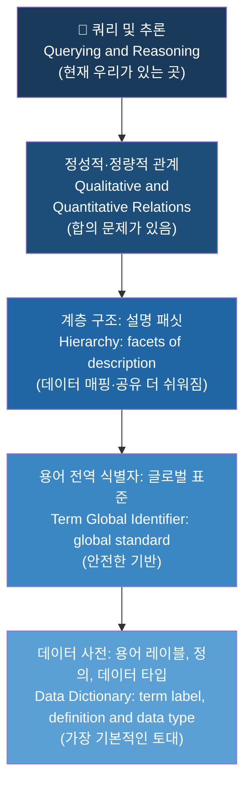
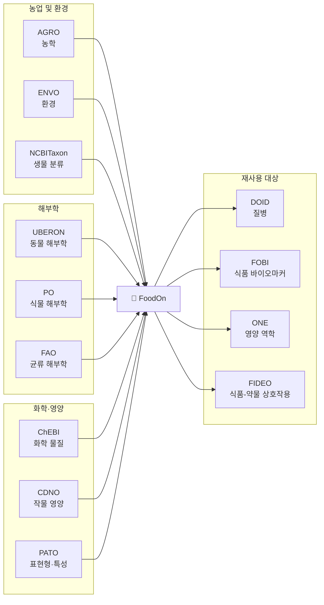
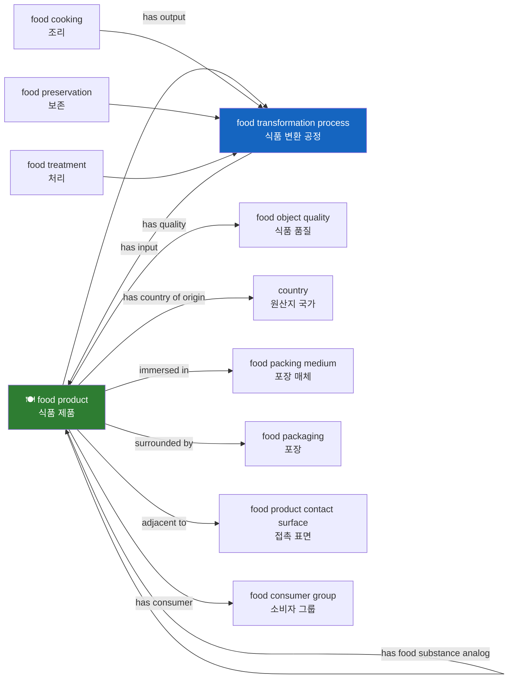
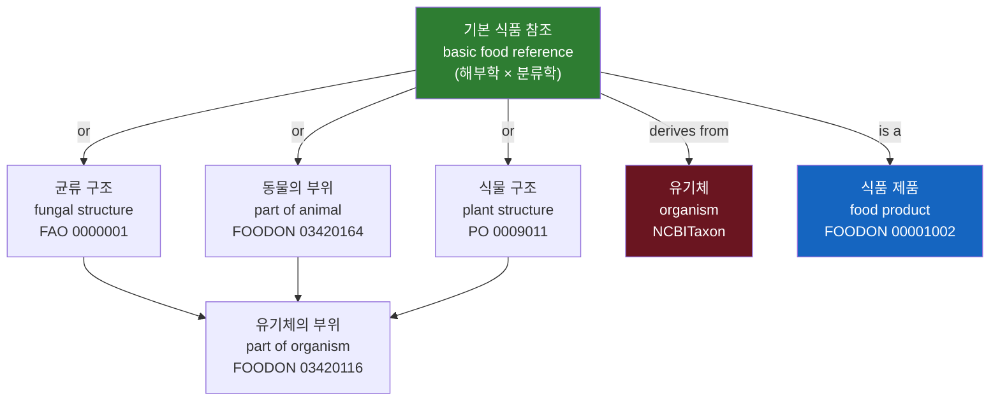
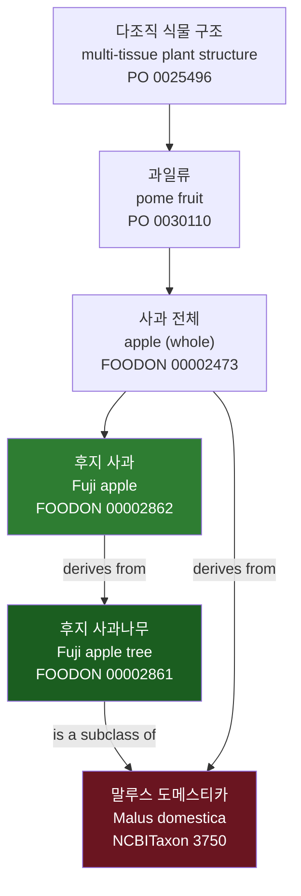
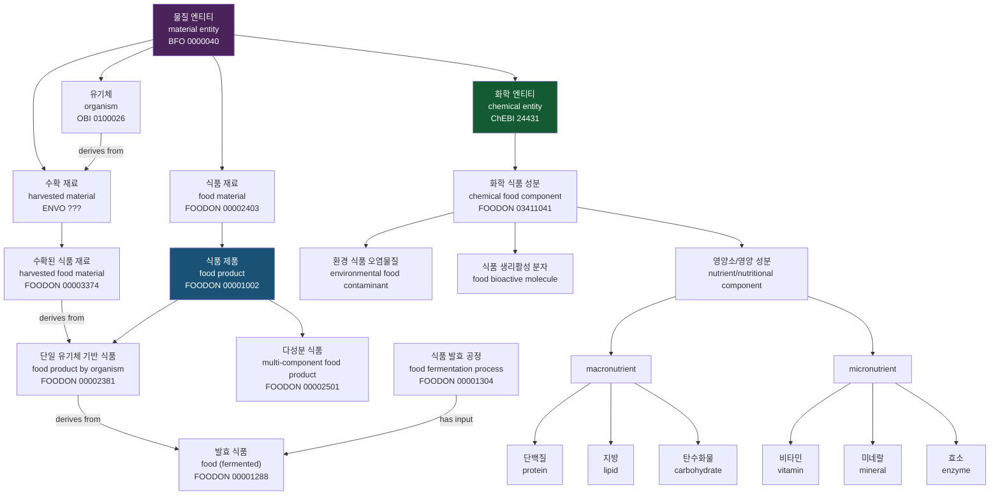
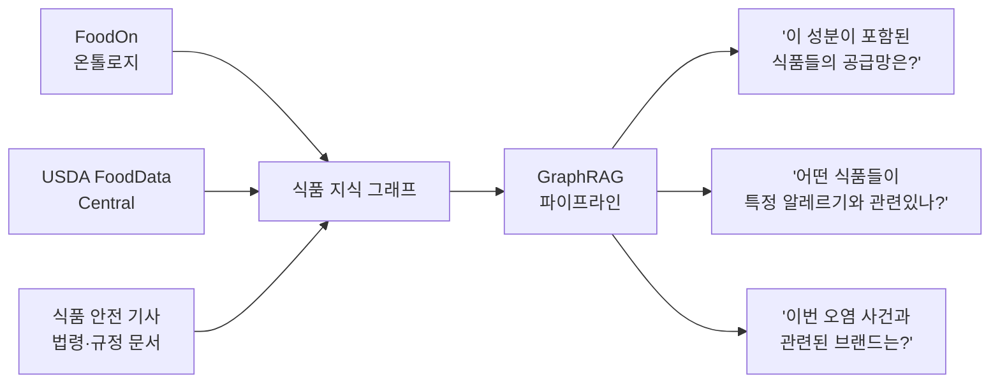
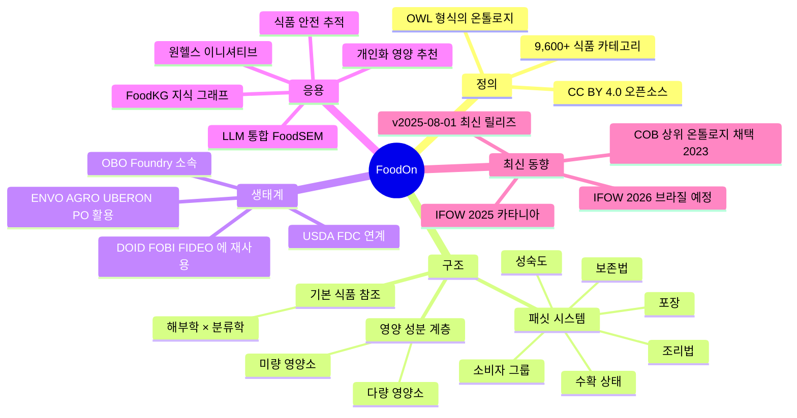

> **출처**: [FoodOn 공식 사이트](https://foodon.org/) | [온톨로지 입문](https://foodon.org/design/ontology-introduction/) | [USDA FoodData Central](https://fdc.nal.usda.gov/)  
> **최신 버전**: FoodOn v2025-08-01 (CC BY 4.0)  
> **작성일**: 2026년 4월 17일

---

## 목차

1. [FoodOn이란 무엇인가](#1-foodon이란-무엇인가)
2. [온톨로지 입문: 개념적 기반](#2-온톨로지-입문-개념적-기반)
3. [OBO Foundry와 FoodOn 생태계](#3-obo-foundry와-foodon-생태계)
4. [FoodOn의 구조: 패싯(Facets) 시스템](#4-foodon의-구조-패싯facets-시스템)
5. [식품 제품의 기본 참조 모델](#5-식품-제품의-기본-참조-모델)
6. [사례 분석: 사과 하나를 어떻게 표현하는가](#6-사례-분석-사과-하나를-어떻게-표현하는가)
7. [식품 영양 분석과 화학 성분 온톨로지](#7-식품-영양-분석과-화학-성분-온톨로지)
8. [USDA FoodData Central: 데이터 활용 지침](#8-usda-fooddata-central-데이터-활용-지침)
9. [FoodOn의 최신 동향 및 응용](#9-foodon의-최신-동향-및-응용)
10. [결론: 식품 데이터의 미래](#10-결론-식품-데이터의-미래)

---

## 1. FoodOn이란 무엇인가

### 1.1 탄생 배경과 핵심 문제 의식

현대 식품 시스템은 전례 없이 글로벌화되어 있다. 한 끼 식사의 재료가 다섯 개 대륙에서 왔을 수 있고, 그 재료들은 수십 개의 가공 단계를 거쳐 소비자의 식탁에 오른다. 그런데 이 복잡한 공급망을 가로지르는 정보 시스템은 서로 다른 언어, 분류 체계, 데이터 사전을 사용하고 있다. 한 나라의 식품 안전 데이터베이스가 "닭 가슴살"이라고 기록한 것을 다른 나라의 시스템이 "poultry breast meat"라고 기록하고, 또 다른 시스템은 "broiler breast, skinless"라고 저장한다. 이 세 기록이 같은 것임을 컴퓨터는 자동으로 알 수 없다.

이것이 FoodOn이 해결하려는 근본적인 문제다. FoodOn은 **식품에 관한 공통 디지털 언어(lingua franca)** 를 만들기 위한 컨소시엄 주도의 오픈소스 프로젝트다.

### 1.2 FoodOn의 정의

FoodOn은 **온톨로지(ontology)**, 즉 사람과 컴퓨터 모두가 사용할 수 있는 통제 어휘집(controlled vocabulary)이다. 구체적으로는 다음을 포함한다.

- 인간과 가축에게 식품 역할을 할 수 있는 동물, 식물, 균류의 모든 부위
- 이로부터 파생된 가공 식품 제품
- 식품을 만드는 데 사용되는 공정과 처리 방법

온톨로지는 일종의 **문법처럼** 작동한다. 이 문법을 이용해 세계와 식품에 관한 진술문을 구성할 수 있으며, 그 진술문은 데이터베이스에 입력되어 쿼리되거나 추론의 대상이 될 수 있다.

### 1.3 FoodOn의 범위와 목표

FoodOn은 2018년에 LanguaL이라는 기존 식품 색인 시스템을 기반으로 처음 공개되었다. LanguaL은 1975년 미국 FDA의 CFSAN(Center for Food Safety and Applied Nutrition)의 Factored Food Vocabulary에서 출발한 성숙한 식품 기술 시스템으로, 14개의 패싯을 통해 식품을 묘사한다.

FoodOn은 LanguaL보다 한 단계 더 나아가 현재 **9,600개 이상의 일반 식품 제품 카테고리**를 온톨로지의 일부로 제공한다. 이 시스템의 목표는 다음과 같은 영역의 의미론을 개발하는 것이다.

- 식품 안전(food safety)
- 식품 안보(food security)
- 식품 생산과 연결된 농업 및 축산 관행
- 요리, 영양, 화학 성분과 공정

---

## 2. 온톨로지 입문: 개념적 기반

FoodOn을 이해하려면 온톨로지라는 개념 자체를 먼저 이해해야 한다. 이 섹션은 FoodOn 공식 [온톨로지 입문](https://foodon.org/design/ontology-introduction/) 페이지의 내용을 상세히 풀어 설명한다.

### 2.1 철학적 의미에서 데이터 과학적 의미로

위키피디아가 설명하듯, 철학에서의 온톨로지는 존재의 본성과 물질적 사물 혹은 과정의 추상적 표현들 사이의 구분을 연구하는 학문이다. 다양한 문화의 철학적 전통에서 오래된 자리를 차지하고 있지만, FoodOn의 맥락에서 우리는 **현대 데이터 과학 지향적 버전**에 집중한다.

데이터 과학에서의 온톨로지는 통제 어휘와 의미론적 프레임워크를 결합하여, 사람과 컴퓨터 모두가 온톨로지 용어로 표현된 데이터를 비교하고 대조할 수 있도록 한다. 컴퓨터는 온톨로지가 제공하는 문법과 어휘 참조에 따라 표현된 문장들을 비교하여 그것이 동일한 사실을 반영하는지, 서로 호환되는지, 또는 모순되는지를 판별할 수 있다.

### 2.2 데이터 사전에서 온톨로지로

데이터 사전(data dictionary)은 온톨로지의 출발점을 이해하기 좋은 개념이다. 데이터 사전은 용어 목록으로, 각 용어에는 평이한 언어로 된 설명과 데이터 타입(문자열, 숫자, 날짜 등)이 포함된다.

온톨로지는 여기서 여러 단계 더 나아간다. 온톨로지에서는 모든 것을 **엔티티(entity)** 라고 부른다. 여기에는 연필이나 물처럼 물질적인 것도 있고, 태양 궤도처럼 추상적인 것도 있다. 각 용어(term)는 텍스트 레이블과 정의를 가지는 엔티티의 한 종류다. 중요한 것은, OWL 온톨로지가 각 용어에 **전 세계적으로 고유한 URI(Uniform Resource Identifier)** 를 제공하는 기능을 갖는다는 것이다. 이 URI는 온톨로지 조회 서비스 페이지를 통해 해당 용어에 대한 의미론적 정보를 반환할 수 있다.

### 2.3 클래스, 공리, 추론

각 온톨로지 용어는 실제로 **엔티티의 클래스**다. 클래스는 어떤 것이 해당 클래스의 구성원임을 인식하는 데 필요한 특성(differentiae, 특징, 속성, 성질)을 포함한다. 이것이 패턴 인식에 대한 기본적인 온톨로지적 접근 방식이다.

클래스를 인식하는 데 필요한 최소한의 특성 묶음을 **필요충분조건(necessary and sufficient conditions)** 이라고 한다. 예를 들어, "네 개의 사지를 가진 동물"은 사족동물(quadruped) 클래스의 정의다. 이 평이한 언어 정의의 대응물은 등가 공리(equivalence axiom), 즉 형식 논리 표현이다. 예를 들어 `animal and 'has part' exactly 4 limb`이 사족동물 클래스의 등가 공리다. 이 공리와 일치하는 모든 것은 사족동물로 간주된다.

온톨로지는 클래스들을 다른 클래스의 **하위클래스(subclass)** 로 조직할 수 있다. 이는 분류 계층과 비슷하다. 부모 또는 조상 클래스와 관련된 필요충분 공리는 하위클래스에게 상속된다. 중요한 것은, OWL 온톨로지는 **폴리히에라키(polyhierarchy)** 기능을 제공한다는 점이다. 즉, 클래스가 하나 이상의 부모 클래스의 자식임을 명시할 수 있다. 예를 들어, UBERON 해부학 온톨로지에서 "폐(lung)"는 "호흡 기관", "흉강 요소", "측면 구조", "내배엽 유래 구조" 등 여러 브랜치의 구성원이다.

### 2.4 객체 속성과 데이터 속성

형식 논리 측면에서 온톨로지는 엔티티를 다른 엔티티나 값에 연결할 수 있는 질적/양적 관계들을 가진다. 이를 **서술어(predicate)**, 객체 속성(object property), 또는 데이터 속성(data property)이라고 부른다.

예를 들어: `Lasha 'has sister' Tula`, `Lasha 'has age' 7`

**부분론(Mereology)**, 즉 부분과 전체에 관한 연구는 특히 중요한 객체 속성 집합을 제공한다. 또한 **위상적 공간 관계(Mereotopology)** 도 포함된다. 온톨로지 데이터 속성은 관계형 데이터베이스의 필드 수준 데이터 타입이 하는 일을 처리하지만, 측정 대상 엔티티, 측정 시각, 단위 등을 나타내는 더 풍부한 의미 데이터 구조로 보완되는 경우가 많다.

### 2.5 어노테이션과 그래프 쿼리

모든 것이 논리적 분석(추론)에 적합한 것은 아니다. 엔티티에 다양한 텍스트 주석, 동의어, 데이터베이스 상호 참조, 큐레이션 상태 및 날짜 등을 부가할 수 있다. 이런 내용은 엔티티에 적용될 수 있는 **어노테이션 태그**로 처리된다.

객체 속성, 데이터 속성, 어노테이션이 합쳐지면 SPARQL과 같은 그래프 쿼리 언어로 쿼리할 수 있는 **그래프 데이터 구조**를 형성한다.

### 2.6 온톨로지 피라미드

온톨로지 구축의 단계를 피라미드로 시각화할 수 있다.



이 피라미드의 상단은 연합된 데이터셋들을 하나의 공통 언어로 쿼리하고 추론할 수 있는 상태를 약속한다. 실제로 의미 웹 기술은 아직 그 이상적인 목적지에 완전히 도달하지 못했다. 서로 다른 상위 레벨 패러다임을 가진 다양한 온톨로지 커뮤니티들이 존재하며, 그 간극을 메우기 위한 **시맨틱 매핑** 작업이 실용적 해결책으로 사용되고 있다.

### 2.7 온톨로지와 사전: 역사적 유추

옥스퍼드 영어 사전(OED)의 초대 편집자 제임스 머레이(James Murray)는 처음에 OED가 5년이면 완성될 것이라고 낙관적으로 예측했다. 하지만 그의 자녀들, 일반 대중, 그리고 학문적 여가를 가진 수감자의 도움에도 불구하고 초판을 완성하는 데 35년 이상이 걸렸다.

온톨로지는 디지털 시대에 사전이 인쇄 시대에 했던 역할을 한다. 그 큐레이션은 협업적이고 시간 집약적인 과정이다. FoodOn은 LanguaL이 제공하는 초기 시드와 성장하는 큐레이터 그룹이라는 강점을 지니고 있다.

---

## 3. OBO Foundry와 FoodOn 생태계

### 3.1 OBO Foundry란?

FoodOn은 **OBO Foundry(Open Biological and Biomedical Ontology Foundry)** 컨소시엄에 속한다. OBO Foundry는 상호 운용 가능한 생명과학 지향 온톨로지들의 오픈소스 집합체로, 데이터의 **FAIR 원칙**(Findable, Accessible, Interoperable, Reusable) 달성을 지원한다.

이 컨소시엄의 목표는 온톨로지들이 물질 엔티티, 특성, 과정, 정보에 관한 공통 관계와 구분을 공유하는 백과사전과 같은 구조를 갖도록 하는 것이다. 각 도메인에서만 사용 가능하지만 다른 온톨로지 강화 데이터와 연합할 때 패러다임 변환 문제가 생기는 "독립 온톨로지"와 대조된다.

### 3.2 FoodOn이 가져다 쓰는 온톨로지들

FoodOn은 여러 OBO Foundry 온톨로지에서 용어를 재사용한다. 이는 데이터 재사용성과 상호 운용성의 핵심이다.

| 약어 | 전체 이름 | FoodOn에서의 역할 |
|------|----------|-----------------|
| **ENVO** | Environment Ontology | 환경 관련 용어 |
| **AGRO** | Agronomy Ontology | 농업 용어 |
| **UBERON** | Uber-anatomy Ontology | 동물 해부학 용어 |
| **PO** | Plant Ontology | 식물 해부학 용어 |
| **NCBITaxon** | NCBI Taxonomy | 생물 분류(taxonomy) |
| **RO** | Relations Ontology | 관계 용어 |
| **CDNO** | Crop Dietary Nutrition Ontology | 영양 성분 |
| **ChEBI** | Chemical Entities of Biological Interest | 화학 엔티티 |
| **FAO** | Fungal Anatomy Ontology | 균류 해부학 |
| **PATO** | Phenotype and Trait Ontology | 표현형 및 특성 |

### 3.3 FoodOn을 재사용하는 온톨로지들

반대로, FoodOn의 용어들은 점점 더 많은 온톨로지에서 재사용된다.

| 약어 | 전체 이름 | 적용 분야 |
|------|----------|----------|
| **ENVO** | Environment Ontology | 환경 |
| **CDNO** | Crop Dietary Nutrition Ontology | 작물 영양 |
| **ONE** | Ontology of Nutritional Epidemiology | 영양 역학 |
| **ONS** | Nutritional studies Ontology | 영양 연구 |
| **FIDEO** | Food Interactions with Drugs Evidence Ontology | 식품-약물 상호작용 |
| **FOBI** | Food Biomarker Ontology | 식품 바이오마커 |
| **ECTO** | Environmental Conditions, Treatments, and Exposures Ontology | 환경 노출 |
| **DOID** | Disease Ontology | 질병 |

### 3.4 FoodOn 생태계의 흐름

FoodOn 생태계는 **농업/야생 재료** → **수확 재료** → **식품 제품** → **소비자**의 흐름을 포괄한다.



---

## 4. FoodOn의 구조: 패싯(Facets) 시스템

### 4.1 패싯이란?

패싯(facet)은 온톨로지의 특정 하위 도메인을 다루는 브랜치(가지)다. 하나의 식품 제품은 여러 패싯에 연결될 수 있으며, 이를 통해 그 제품을 다양한 측면에서 묘사할 수 있다.

### 4.2 food product를 중심으로 한 관계망

식품 제품(food product)은 FoodOn의 핵심 개념이다. 공식 정의는 다음과 같다.

> "인간과 동물을 위한 식품 재료로, 전체적으로 또는 다른 식품 제품에 추가하여 소비 가능하도록 가공될 의도를 가지고 처리된 것."

식품 제품은 다양한 관계로 다른 개념들과 연결된다.



이 다이어그램에서 확인할 수 있는 주요 관계들은 다음과 같다.

**공정 관련 관계**: `has input / has output`으로 식품 변환 공정(food transformation process)과 연결된다. 식품 변환 공정은 다시 조리(cooking), 보존(preservation), 처리(treatment)로 세분화된다.

**품질 관련 관계**: `has quality`로 식품 객체 품질(food object quality)에 연결된다. 이는 생선의 살 식감, 과일 껍질이나 살의 색 같은 관찰 가능한 품질을 포함한다.

**지리적 관계**: `has country of origin`으로 원산지 국가와 연결된다.

**포장 관련 관계**: `immersed in`(포장 매체), `surrounded by`(포장재), `adjacent to`(접촉 표면)로 포장 정보를 표현한다.

**소비자 관계**: `has consumer`로 소비자 그룹과 연결된다.

### 4.3 주요 패싯 목록

FoodOn이 제공하는 주요 패싯과 그 역할은 다음과 같다.

- **수확 상태(Harvesting status)**: 유기체나 그 일부가 원래 생육 환경에서 분리되었는지 여부를 나타낸다.
- **식물 성숙도(Degree of plant maturity)**: 과일이나 채소의 익음 정도를 나타낸다 (overripe or decaying → ripe or mature → slightly ripe → unripe or immature).
- **조리 방법(Food cooking)**: 삶기, 굽기, 튀기기 등 다양한 조리 방법.
- **보존 방법(Food preservation)**: 냉동, 건조, 훈제, 절임 등.
- **포장(Food packaging)**: 포장 재질, 형태, 크기.
- **소비자 그룹(Food consumer group)**: 영아, 어린이, 당뇨 환자, 채식주의자 등.
- **원산지(Country of origin)**: 생산 또는 수확 국가.
- **식품 접촉 표면(Food product contact surface)**: 식품이 직접 접촉하는 표면.

---

## 5. 식품 제품의 기본 참조 모델

### 5.1 기본 식품 참조(Basic Food Reference)

FoodOn의 현재 주요 개발 노력 중 하나는 더 복잡한 식품을 만드는 데 사용되는 기본 식물 또는 동물 유기체 식품 항목을 상세히 기술하는 것이다. 기본 식품 참조는 **해부학(anatomy) × 분류학(taxonomy)** 의 결합으로 표현된다.



이 모델에서 핵심은 **여러 온톨로지의 용어가 FoodOn 내에서 재사용**된다는 점이다. 균류 구조에는 FAO(Fungal Anatomy Ontology)의 용어가, 식물 구조에는 PO(Plant Ontology)의 용어가, 유기체 분류에는 NCBITaxon의 용어가 사용된다.

### 5.2 수확 상태의 중요성

흥미로운 개념적 과제가 있다. 만약 식품 참조가 단순히 "Fuji apple(후지 사과)"라고만 기록된다면, 그 사과가 여전히 나무에 달려 있는지 수확된 것인지를 알 수 없다. 이 모호성을 해결하기 위해 **수확 상태(harvesting status) 패싯**이 필요하다.

```
유기체(organism) × 해부 부위(anatomical part)
          ↓
    수확됨(harvested food material)
          ↓
      식품 재료(food material)
          ↓
      식품 제품(food product)
```

수확 상태 패싯은 유기체 또는 그 일부가 생육 환경에서 제거되었음을 명확히 나타낸다.

---

## 6. 사례 분석: 사과 하나를 어떻게 표현하는가

### 6.1 분류 계층

후지 사과(Fuji apple) 하나를 FoodOn으로 표현하는 과정은 이 시스템의 위력을 잘 보여준다.



이 다이어그램은 매우 풍부한 정보를 담고 있다. 후지 사과(FOODON:00002862)는 식물 해부학 온톨로지(PO)에서 "pome fruit(이과)" → "multi-tissue plant structure(다조직 식물 구조)"로 분류되는 계층 구조를 상속받는다. 동시에 분류학적으로는 NCBITaxon의 Malus domestica(재배 사과나무, 분류 ID 3750)로부터 유래한다.

### 6.2 성숙도 표현

수확된 사과가 있다 해도 아직 부족할 수 있다. 소비자로서 우리는 그 사과가 아직 익지 않은 것인지 알고 싶다. 이를 위해 **식물 성숙도(degree of plant maturity) 패싯**이 필요하다.

FoodOn의 온톨로지 편집기 뷰에서 볼 수 있는 성숙도 계층은 다음과 같다.

```
degree of plant maturity
  ├── overripe or decaying      (과숙/부패)
  ├── ripe or mature            (완숙)
  ├── slightly ripe             (약간 익음)
  └── unripe or immature        (미성숙)
```

사과와 같은 식품 제품은 이 계층의 특정 값을 `has quality` 또는 하위클래스 관계를 통해 참조할 수 있다. 이 레벨의 세밀함이 FoodOn이 단순 데이터 사전과 구별되는 지점이다.

### 6.3 완전한 후지 사과 표현

다음 표는 후지 사과를 완전하게 표현하기 위해 필요한 모든 패싯 참조를 보여준다.

| 측면 | 패싯/관계 | 예시 값 |
|------|----------|--------|
| 분류 계층 | subclass of | apple (whole) → pome fruit → multi-tissue plant structure |
| 생물학적 기원 | derives from | Malus domestica (NCBITaxon:3750) |
| 품종 | derives from (cultivar) | Fuji apple tree (FOODON:00002861) |
| 수확 상태 | harvesting status | harvested food material |
| 성숙도 | has quality | ripe or mature |
| 소비 상태 | (food product) | raw, peeled, sliced 등 |

---

## 7. 식품 영양 분석과 화학 성분 온톨로지

### 7.1 FoodOn의 영양 분석 협력 구조

FoodOn은 Joint Food Ontology Workgroup을 통해 다른 OBO Foundry 관련 온톨로지들과 협력하여 영양 분석을 위한 어휘를 제공한다. 여기에는 식이, 건강, 식물 및 동물 농업 육성 연구에서 인자가 되는 화학 식품 성분이 포함된다.

> **주의**: 2023년 6월, FoodOn은 OBO Foundry의 새로운 상위 수준 온톨로지 프레임워크인 **COB(Core Ontology for Biology and Biomedicine)** 를 채택했다. COB는 여전히 BFO(Basic Formal Ontology)와 호환되며, OBO 온톨로지 전반에서 자주 사용되는 용어들을 포함한다.

### 7.2 식품 재료 계층 구조

FoodOn의 핵심 계층 구조를 이해하면 이 온톨로지의 전체적인 논리를 파악할 수 있다.



이 방대한 계층 구조에서 몇 가지 핵심 개념을 짚어보자.

**식품 재료(food material)**: 영양 요구를 충족하거나 다른 건강 요구를 제공하거나 사회적/관능적 식품 경험을 제공하려는 의도로 유기체가 소비할 수 있는 물질.

**발효 식품(food, fermented)**: 박테리아, 효모 또는 곰팡이 문화를 포함하는 식품 발효 공정에서 파생된 식품 제품. 이 카테고리에는 치즈, 요구르트, 김치, 된장 등이 해당된다.

**화학 식품 성분(chemical food component)**: 식품 재료에 존재하거나 식품 재료에 추가된 화학물질 또는 화학 혼합물. 이는 다시 영양소/영양 성분, 식품 생리활성 분자, 환경 식품 오염물질로 세분화된다.

---

## 8. USDA FoodData Central: 데이터 활용 지침

FoodOn은 USDA의 **FoodData Central(FDC)** 과 밀접하게 연계되어 있다. FoodOn의 식품 제품 항목들은 FDC 데이터와의 링크를 포함할 예정이다.

### 8.1 FoodData Central이란?

USDA FoodData Central은 미국 농무부 농업 연구 서비스(USDA Agricultural Research Service)가 제공하는 식품 영양 데이터 웹 포털이다. 식품의 영양소 및 기타 성분 값에 대한 확장된 프로파일 링크를 포함하는 식품 및 영양 데이터를 제공한다.

### 8.2 FDC의 데이터 유형

FDC는 여러 종류의 데이터를 통합하여 제공한다.

| 데이터 유형 | 설명 | FDC 공개일 | 특이사항 |
|------------|------|-----------|---------|
| **Foundation Foods** | 분석 값 및 확장된 메타데이터 | 최초 추가일 | 주기적으로 업데이트 |
| **FNDDS** | 식품 및 영양소 데이터베이스(식이 연구용) | FNDDS 2021-2023: 2024/10/31 | NHANES 2년 주기 |
| **Branded Foods** | 브랜드 식품 데이터 | 매월 업데이트 | GTIN으로 식별 |
| **SR Legacy** | 표준 참조 데이터(최종 릴리즈) | 고정: 2019/4/1 | 더 이상 업데이트 없음 |

### 8.3 주요 날짜 개념

FDC는 여러 종류의 날짜 정보를 제공한다.

**FDC Published Date**: 식품이 FoodData Central에서 처음 제공된 날짜. Foundation Foods의 경우 처음 추가된 날짜이며, Branded Foods는 업데이트 시 새 날짜를 받는다.

**Sample Acquisition Date (Foundation Foods)**: 분석을 위해 개별 식품 샘플이 수집된 날짜.

**Initial Date Acquired (Foundation Foods)**: 특정 식품 항목 내의 특정 영양소 또는 성분에 대한 첫 번째 샘플이 수집된 날짜.

**Available Date (Branded Foods)**: 제품 레코드가 FDC에 포함 가능한 상태가 된 날짜.

**Modified Date (Branded Foods)**: 데이터 파트너가 제품 데이터를 마지막으로 수정한 날짜.

### 8.4 주요 용어 및 개념

**FDC_ID 번호**: FDC 내의 각 식품 데이터 레코드에 부여되는 번호. 식품 레코드의 데이터가 변경될 때마다 새로운 FDC_ID 번호를 받는다.

**NDB 번호**: Foundation Foods와 SR Legacy에서 특정 형태의 각 식품에 대한 고유 식별자. FDC_ID가 업데이트로 인해 바뀌더라도 NDB 번호는 식품에 연결되어 있으므로 동일하게 유지된다.

**GTIN(Global Trade Item Number)**: 회사가 거래 품목을 고유하게 식별하는 데 사용하는 번호로, USDA Branded Foods 데이터베이스에서 특정 식품 제품을 식별하는 데 사용된다.

**Food Code**: FNDDS에서 식품을 식별하는 8자리 번호.

### 8.5 영양소 값의 특성

FDC에서 영양소 및 식품 성분 값은 다음과 같이 설명된다.

- **Min**: 분석된 식품 샘플에서 발견된 성분의 최솟값
- **Max**: 분석된 식품 샘플에서 발견된 성분의 최댓값
- **Median**: 분석된 식품 샘플에서 발견된 성분 값의 중앙값
- **Average Amount**: 평균값 (모든 샘플의 합 ÷ 샘플 수)
- **LOQ(Limit of Quantification)**: 허용 가능한 정밀도로 정량적으로 측정할 수 있는 최저 측정량. `<` 기호로 표시됨

### 8.6 FDC 검색 팁

FDC는 강력한 검색 연산자를 지원한다.

```
검색 예시:
- "green pepper"           → 정확한 구문 검색 (따옴표)
- +candy +corn             → 두 단어 모두 포함
- candy -chocolate         → 초콜릿 없는 사탕
- *berry                   → 이름 끝에 berry가 오는 식품
- pizza -(pepperoni sausage) → 페퍼로니도 소시지도 없는 피자
- description:skor         → 설명 필드에 'skor'가 있는 식품
```

---

## 9. FoodOn의 최신 동향 및 응용

### 9.1 2025년 현황

FoodOn은 현재 활발히 발전 중이다.

- **최신 버전**: v2025-08-01 (CC BY 4.0 라이선스)
- **최근 BioPortal 업로드**: 2025년 12월 30일
- **2025년 IFOW**: 이탈리아 카타니아 대학에서 제6회 통합 식품 온톨로지 워크샵(IFOW 2025)이 개최됨
- **2026년 IFOW 예정**: FOIS 2026 (브라질 비토리아, 2026년 9월 21-25일)
- **COB 상위 온톨로지 채택**: 2023년 6월부터 Core Ontology for Biology and Biomedicine 적용

### 9.2 AI 및 LLM과의 통합

2025년 연구에서 가장 흥미로운 동향 중 하나는 FoodOn과 대형 언어 모델(LLM)의 결합이다.

**FoodSEM** (2025년 발표): Llama 3 8B 모델을 파인튜닝하여 FoodOn, SNOMED-CT 등 식품 온톨로지에 대한 **식품 명명 개체 연결(Named Entity Linking)** 태스크를 수행하는 모델. 일부 온톨로지와 데이터셋에서 F1 스코어 98%를 달성했다. 이는 텍스트에서 언급된 식품 관련 개체를 정확히 식별하고 온톨로지 URI에 연결하는 능력을 보여준다.

IFOW 2025 콜 포 페이퍼에서는 다음 주제들이 명시적으로 요청되었다.

- LLM을 활용한 식품 온톨로지 개선
- 식품 온톨로지를 활용한 LLM 생성 콘텐츠 검증
- 식품 도메인을 위한 LLM 파인튜닝

### 9.3 지식 그래프 응용

**FoodKG**: FoodOn의 WhatToMake 온톨로지와 Recipe1M+에서 추출한 레시피 및 USDA 영양 데이터를 통합한 대규모 통합 식품 지식 그래프. 레시피 추천, 재료 대체, 자연어 질문 답변(QA) 등에 활용된다.

**FoodOntoMap**: 22,000개 레시피에서 추출한 식품 개념을 FoodOn, OntoFood, SNOMED CT 등 여러 온톨로지에 매핑하여 통합 표현을 제공하는 리소스.

### 9.4 실제 응용 사례

FoodOn은 다음과 같은 실제 분야에서 활발하게 활용되고 있다.

**식품 안전 및 추적성**: 오염된 식품의 신속한 추적(trace-forward, trace-back)을 가능하게 한다. 표준화된 FoodOn 어휘를 사용하면 여러 기관의 식품 안전 데이터를 자동으로 연결할 수 있다.

**항생제 내성 및 원헬스(One Health) 이니셔티브**: 식품, 동물, 환경, 인간 건강을 통합적으로 다루는 원헬스 접근에서 공통 어휘로 활용된다.

**영양 데이터베이스 연계**: 프랑스의 Ciqual 데이터베이스와 USDA 데이터베이스 같은 서로 다른 국가 영양 데이터베이스 간의 정렬을 FoodOn을 피벗 온톨로지로 활용하여 구현.

**지속 가능한 개발 모니터링**: UN 환경 프로그램과의 협력을 통해 식품 시스템이 생물다양성, 생태계 서비스에 미치는 영향을 모니터링하는 의미론적 레이어로 기능한다.

**전자상거래 및 식품 표시**: 브랜드 식품 설명을 표준화하여 소비자 정보 접근성을 높이고 식품 알레르기, 영양 표시 등을 구조화된 방식으로 표현한다.

### 9.5 GraphRAG와 FoodOn의 잠재적 시너지

앞서 [GraphRAG 문서](https://k82022603.github.io/posts/graphrag-%EC%A7%80%EC%8B%9D-%EA%B7%B8%EB%9E%98%ED%94%84-%EA%B8%B0%EB%B0%98-%EC%8A%A4%EB%A7%88%ED%84%B0-ai-%EC%8B%9C%EC%8A%A4%ED%85%9C-%EC%99%84%EC%A0%84-%EA%B0%80%EC%9D%B4%EB%93%9C/)에서 다룬 것처럼, 지식 그래프 기반 RAG 시스템과 FoodOn을 결합하면 강력한 식품 정보 시스템을 구축할 수 있다.



FoodOn의 구조화된 어휘와 관계 체계는 GraphRAG의 엔티티 추출 단계에서 온톨로지로 직접 활용될 수 있다. 이는 엔티티 정규화 문제(예: "US Copyright Office" vs. "Copyright Office")를 식품 도메인에서 사전에 해결할 수 있는 잠재력을 가진다.

---

## 10. 결론: 식품 데이터의 미래

### 10.1 FoodOn이 해결하는 본질적인 문제

현대 식품 시스템의 데이터 문제는 단순히 기술적인 문제가 아니다. 그것은 전 세계가 공유하는 **식품에 관한 어휘가 없다**는 언어적, 개념적 문제다. 각 나라, 각 기관, 각 기업이 자신만의 용어로 식품을 기록하기 때문에 발생하는 정보의 사일로(silos) 현상이 핵심이다.

FoodOn은 이 문제에 대한 구조적 해법을 제시한다. 단순한 데이터 사전이 아니라, 관계와 공리를 통해 의미를 형식적으로 정의하는 온톨로지를 통해 컴퓨터가 식품에 관한 진술을 이해하고 추론할 수 있게 한다.

### 10.2 핵심 요약



### 10.3 실무자를 위한 접근 가이드

FoodOn을 실제로 활용하려는 사람들에게 권장하는 접근 경로는 다음과 같다.

**탐색 시작**: EMBL-EBI OLS, BioPortal, AgroPortal 등 온톨로지 조회 서비스에서 FoodOn 용어를 검색해보는 것으로 시작하라.

**데이터 연계**: USDA FoodData Central의 FOODON: 태그(예: FOODON:00002862는 후지 사과)를 데이터베이스에 추가하여 식품 데이터에 FoodOn 용어를 부착하기 시작하라.

**온톨로지 편집**: Protégé와 같은 온톨로지 편집기를 사용하거나 FoodOn GitHub 저장소를 통해 직접 기여할 수 있다.

**커뮤니티 참여**: Joint Food Ontology Workgroup과 이메일 그룹, IFOW 연례 워크샵을 통해 글로벌 큐레이터 커뮤니티에 참여하라.

### 10.4 마무리

식품 온톨로지는 그 이름이 시사하는 것보다 훨씬 더 광범위한 영향을 가진다. 식품 안전 사고가 발생했을 때 오염 경로를 빠르게 추적하는 것, 지구 반대편의 영양 데이터를 내 연구에 통합하는 것, AI가 내 식사 패턴을 진정으로 이해하는 것 — 이 모든 것이 FoodOn 같은 공통 어휘 없이는 불가능하다.

옥스퍼드 영어 사전이 영어를 사용하는 세계의 지식을 집대성했듯, FoodOn은 식품을 둘러싼 인류의 지식을 기계가 읽을 수 있는 형태로 집대성하는 작업이다. 그리고 James Murray의 예에서 보았듯, 이것은 한 세대의 노력이 필요한 장기 프로젝트다.

---

## 참고 자료

- **FoodOn 공식 사이트**: https://foodon.org/
- **FoodOn 온톨로지 입문**: https://foodon.org/design/ontology-introduction/
- **FoodOn 구조 상세**: https://foodon.org/design/foodon-structure/
- **USDA FoodData Central**: https://fdc.nal.usda.gov/
- **FoodOn GitHub**: https://github.com/FoodOntology/foodon
- **OBO Foundry FoodOn 페이지**: https://obofoundry.org/ontology/foodon
- **Joint Food Ontology Workgroup**: https://github.com/FoodOntology/joint-food-ontology-wg
- **핵심 논문**: Dooley et al. (2018), "FoodOn: a harmonized food ontology to increase global food traceability, quality control and data integration," *npj Science of Food*. https://www.nature.com/articles/s41538-018-0032-6
- **지식 그래프 응용 리뷰**: "Applications of knowledge graphs for food science and industry," PMC. https://pmc.ncbi.nlm.nih.gov/articles/PMC9122965/
- **IFOW 2025 워크샵**: https://foodon.org/ifow-2025-workshop/
- **EMBL-EBI 온톨로지 조회 서비스**: https://www.ebi.ac.uk/ols4/ontologies/foodon
- **NCBO BioPortal FoodOn**: https://bioportal.bioontology.org/ontologies/FOODON

---

*이 문서는 FoodOn 공식 웹사이트(foodon.org), 온톨로지 입문 페이지, USDA FoodData Central 도움말, 그리고 관련 최신 연구 논문을 바탕으로 작성되었습니다. FoodOn은 CC BY 4.0 라이선스 하에 공개되어 있습니다.*
