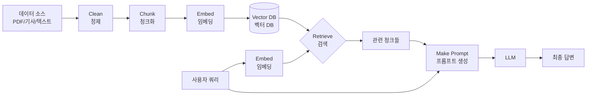
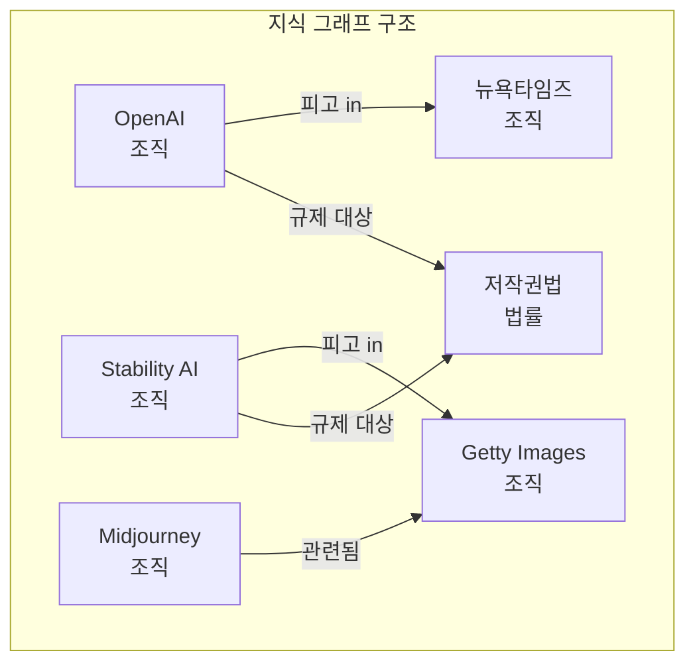
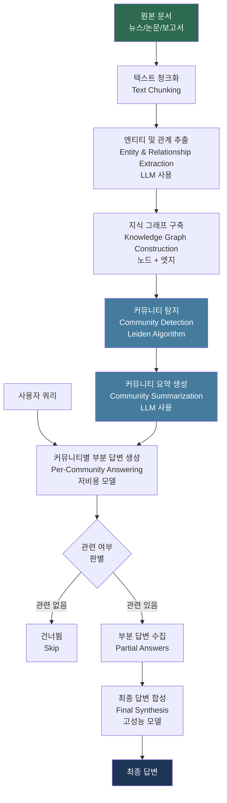
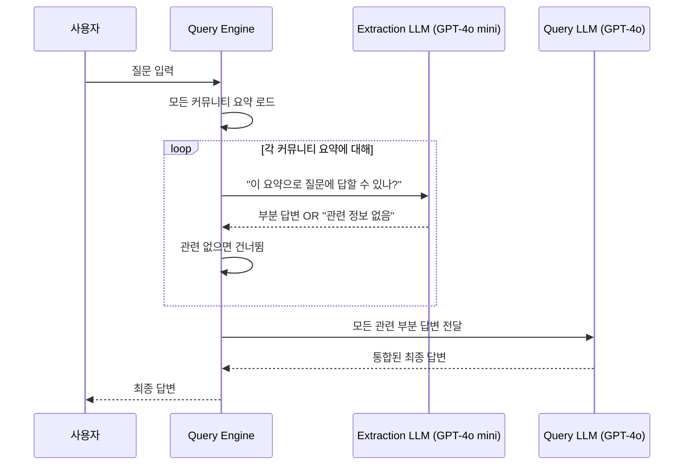
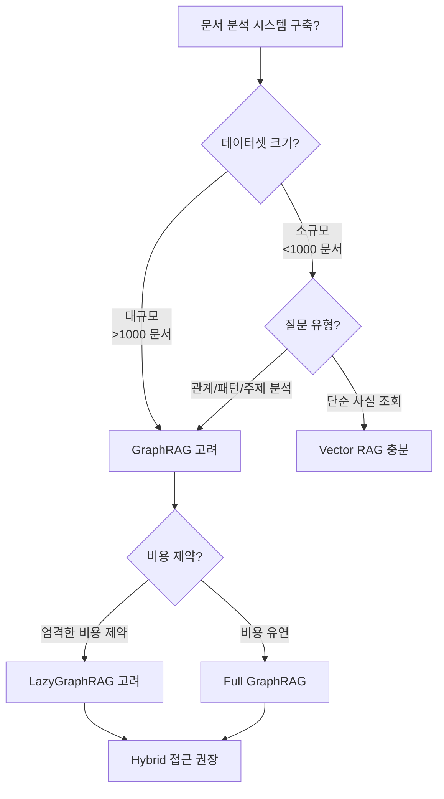

> **원본 영상**: [GraphRAG: Building a Smarter AI System (full walkthrough)](https://www.youtube.com/watch?v=JTVx6i6MzVw)  
> **제작자**: Thu Vu (Apr 14, 2026)  
> **원본 논문**: [From Local to Global: A Graph RAG Approach to Query-Focused Summarization](https://arxiv.org/pdf/2404.16130) (Microsoft Research, 2024)  
> **GitHub**: https://github.com/thu-vu92/graphRAG  
> **작성일**: 2026년 4월 17일

---

## 목차

1. [프로젝트 개요](#1-프로젝트-개요)
2. [표준 RAG의 한계](#2-표준-rag의-한계)
3. [GraphRAG란 무엇인가](#3-graphrag란-무엇인가)
4. [GraphRAG vs Vector RAG: 언제 어떤 것을 써야 하나](#4-graphrag-vs-vector-rag-언제-어떤-것을-써야-하나)
5. [GraphRAG 작동 원리](#5-graphrag-작동-원리)
6. [데이터 수집: SerpApi로 Google News 스크래핑](#6-데이터-수집-serpapi로-google-news-스크래핑)
7. [GraphRAG 파이프라인 전체 구현](#7-graphrag-파이프라인-전체-구현)
   - [7.1 라이브러리 임포트](#71-라이브러리-임포트)
   - [7.2 모델 구성](#72-모델-구성)
   - [7.3 온톨로지 정의](#73-온톨로지-정의)
   - [7.4 그래프 추출 프롬프트](#74-그래프-추출-프롬프트)
   - [7.5 Pydantic 데이터 모델](#75-pydantic-데이터-모델)
   - [7.6 엔티티 및 관계 추출](#76-엔티티-및-관계-추출)
   - [7.7 GraphRAGStore](#77-graphragstore)
   - [7.8 쿼리 엔진](#78-쿼리-엔진)
   - [7.9 문서 로딩](#79-문서-로딩)
   - [7.10 지식 그래프 구축](#710-지식-그래프-구축)
   - [7.11 커뮤니티 구축 및 요약 생성](#711-커뮤니티-구축-및-요약-생성)
   - [7.12 D3.js 시각화](#712-d3js-시각화)
   - [7.13 GraphRAG 시스템 쿼리](#713-graphrag-시스템-쿼리)
8. [한계점 및 개선 방향](#8-한계점-및-개선-방향)
9. [2025~2026 최신 연구 동향](#9-20252026-최신-연구-동향)
10. [결론 및 실무 적용 지침](#10-결론-및-실무-적용-지침)

---

## 1. 프로젝트 개요

이 영상은 데이터 사이언티스트 Thu Vu가 **AI 저작권(AI Copyright)** 이라는 매우 복잡하고 분산된 정보를 갖는 주제를 대상으로, **GraphRAG(Graph Retrieval-Augmented Generation)** 시스템을 처음부터 끝까지 구축하는 과정을 상세히 보여준다.

AI 저작권은 다음과 같은 이유로 탐구 대상으로 선정되었다. 정보가 수백 개의 뉴스 기사, 법원 서류, 정책 문서, 그리고 웹 전반에 흩어진 의견들 속에 산재해 있으며, 어떤 단일 소스도 전체 그림을 제공하지 않는다. 특정 회사들이 이 분쟁의 중심에 있고, 그들이 서로 어떻게 연결되어 있는지를 묻는 질문은 표준 검색 엔진이나 일반적인 AI 시스템으로는 신뢰 있게 답변하기 어렵다.

이 프로젝트는 다음 세 가지 핵심 작업으로 구성된다.

첫째, **SerpApi**를 사용하여 Google News에서 AI 저작권 관련 기사를 실시간으로 스크래핑한다. 둘째, 스크래핑된 정보로부터 **구조화된 지식 그래프**를 구축한다. 셋째, **GraphRAG 방식의 쿼리 엔진**을 통해 기존 RAG나 검색 엔진으로는 답변하기 어려운 복잡한 질문에 답한다.

---

## 2. 표준 RAG의 한계

GraphRAG를 이해하려면 먼저 표준 RAG(Naive RAG 또는 Vector RAG)가 어떻게 작동하고, 어디서 무너지는지를 알아야 한다.

### 표준 RAG 파이프라인

표준 RAG는 크게 세 단계로 구성된다.

**수집(Ingestion) 파이프라인**: PDF, 기사, 텍스트 파일, 트랜스크립트 등의 문서를 수집하여 정제한 뒤, 청크(chunk)라는 작은 조각으로 분할하고, 각 청크를 임베딩 모델을 통해 수치 벡터로 변환하여 벡터 데이터베이스에 저장한다.

**검색(Retrieval) 파이프라인**: 사용자 쿼리가 들어오면, 해당 쿼리도 벡터로 변환하고, 벡터 공간에서 가장 가까운 청크들을 찾아 컨텍스트로 선택한다.

**생성(Generation) 파이프라인**: 선택된 청크들과 사용자 질문을 프롬프트 템플릿에 넣어 LLM에 전달하고, LLM이 이를 바탕으로 최종 답변을 생성한다.



### 표준 RAG의 세 가지 근본적 한계

**한계 1: 규모 확장 시 정확도 저하**

한 연구에 따르면, 벡터 검색 정확도는 10,000페이지에서부터 저하되기 시작하며, 100,000페이지에 이르면 12%의 정확도 하락이 발생한다. 문서가 늘어날수록 임베딩 공간에서 겹침이 증가하여 올바른 청크를 검색하는 것이 어려워진다.

**한계 2: 청크의 고립성 (Isolation)**

각 청크는 독립된 조각으로 취급된다. 문서가 분할되고 임베딩되면, 각 청크는 주변 청크 및 다른 문서의 관련 정보와 단절된 상태로 존재한다. 시스템은 질문과 관련된 텍스트를 찾을 수 있지만, 그 조각들이 어떻게 연결되어 완전한 그림을 형성하는지는 전혀 이해하지 못한다.

**한계 3: 문서 간 추론 불가 (Cross-document Reasoning)**

표준 RAG는 여러 소스에 걸쳐 정보를 연결하거나, 데이터셋 전체에 대한 질문(예: "이 주제에서 등장하는 주요 법적 논거는 무엇인가?", "이 문서들에서 공통으로 나타나는 주제는?")에 답하는 메커니즘이 없다. 이것이 바로 GraphRAG가 해결하려는 문제이다.

---

## 3. GraphRAG란 무엇인가

GraphRAG는 표준 벡터 RAG에 **구조적 레이어(structural layer)** 를 추가하는 기법이다.

Microsoft Research가 2024년 발표한 논문 "From Local to Global: A Graph RAG Approach to Query-Focused Summarization"에서 최초로 제안되었으며, 핵심 아이디어는 다음과 같다.

LLM이 각 청크를 읽고 **엔티티(entity)**—사람, 회사, 기술, 사건, 법적 사건 등—와 그들 사이의 **관계(relationship)** 를 추출하도록 한다. 이 엔티티들은 지식 그래프의 **노드(node)** 가 되고, 관계들은 그들을 잇는 **엣지(edge)** 가 된다. 그 결과, 문서 전체에 걸쳐 정보가 실제로 어떻게 관련되는지를 반영하는 **구조화된 그래프**가 만들어진다.

Microsoft Research는 이 능력을 **"센스메이킹(Sensemaking)"** 이라고 부른다—고립된 사실을 검색하는 것이 아니라, 대규모 정보 집합에서 연결, 패턴, 주제를 이해하는 능력이다.



---

## 4. GraphRAG vs Vector RAG: 언제 어떤 것을 써야 하나

GraphRAG는 Vector RAG를 대체하지 않는다. 각각이 잘하는 것이 다르다.

| 기준 | GraphRAG | Vector RAG |
|------|----------|------------|
| 문서 구조 | 수백~수천 개의 상호 연결된 문서 | 소규모 독립 데이터셋 |
| 질문 유형 | 관계 추적, 패턴 식별, 전체 주제 파악 | 단순 사실 조회 |
| 답변 범위 | 여러 문서 횡단 종합 | 단일 문서/청크 내 답변 |
| 설명 가능성 | 답변 도출 과정 추적 가능 | 상대적으로 블랙박스 |
| 속도/비용 | 느리고 비쌈 (인덱싱 비용 높음) | 빠르고 저렴 |
| 적합 도메인 | 법률, 정책, 연구 | 단순 FAQ, 검색 |

**GraphRAG를 선택해야 하는 경우:**
- 수백~수천 개의 상호 연결된 문서를 다룰 때
- 사실 연결, 관계 추적, 패턴 식별이 필요한 질문을 다룰 때
- 전체 데이터셋에 걸친 주제, 트렌드, 요약 등 큰 그림의 답이 필요할 때
- 설명 가능성과 답변 근거 추적이 중요할 때
- 법률, 정책, 연구처럼 복잡한 쿼리에서 정확성이 중요한 도메인일 때

**Vector RAG를 선택해야 하는 경우:**
- "이 법률이 언제 통과됐나?", "이 소송을 제기한 사람은?" 같은 직접적인 사실 조회일 때
- 답변이 단일 문서나 청크 안에 있을 때
- 속도와 비용이 최우선일 때
- 데이터셋이 작고 문서 간 밀집된 관계가 없을 때

---

## 5. GraphRAG 작동 원리

GraphRAG의 전체 파이프라인은 크게 **인덱싱(Indexing)** 과 **쿼리(Querying)** 의 두 단계로 나뉘며, Microsoft의 접근 방식은 여기에 두 단계를 더 추가한다.



**인덱싱 단계 (오프라인):**
1. 문서를 텍스트 유닛으로 분할
2. LLM으로 각 청크에서 엔티티와 관계 추출
3. 지식 그래프 구축
4. 커뮤니티 탐지 알고리즘(Leiden) 실행 → 관련 엔티티 클러스터링
5. 각 클러스터에 대한 LLM 요약 생성

**쿼리 단계 (온라인):**
1. 각 커뮤니티 요약에 대해 저비용 모델로 부분 답변 생성
2. 관련 없는 커뮤니티는 건너뜀 (토큰 절약)
3. 모든 관련 부분 답변을 고성능 모델로 최종 종합

---

## 6. 데이터 수집: SerpApi로 Google News 스크래핑

### SerpApi란?

이 프로젝트에서 데이터 수집의 핵심은 **SerpApi**다. SerpApi는 Google, Bing 등 다양한 검색 엔진의 결과를 구조화된 JSON으로 실시간으로 제공하는 API 서비스다. 브라우저 자동화 없이도 정제된 검색 결과를 얻을 수 있다는 것이 큰 장점이다.

### 데이터 수집 파이프라인

```python
# 핵심 의존 라이브러리
# google-search-results: SerpApi Python 클라이언트
# trafilatura: 웹 페이지에서 아티클 텍스트 추출
# youtube-transcript-api: YouTube 영상 트랜스크립트 추출
```

**1단계: 검색 결과 수집**

`collect_search_results` 함수는 쿼리 목록을 받아 SerpApi를 호출한다. 이 프로젝트에서는 다음 두 가지 쿼리를 사용했다.
- "AI intellectual property and copyright"
- "generative AI copyright"

각 쿼리당 최대 10개의 결과를 수집하여 총 20개의 기사 URL을 확보하고, 중복 URL을 제거한다.

**2단계: 기사 전문 스크래핑**

URL에서 실제 기사 전문을 추출하기 위해 두 가지 방식을 사용한다.

- **일반 웹 기사**: `trafilatura` 라이브러리 활용. 이 라이브러리는 웹 페이지를 다운로드하고 네비게이션 바, 광고, 푸터 등의 잡음을 제거하여 순수 기사 텍스트만 반환한다. BeautifulSoup 등으로 직접 HTML을 파싱하는 것보다 훨씬 효율적이다.

- **YouTube 영상**: 정규표현식으로 URL에서 Video ID를 추출한 뒤 `youtube-transcript-api`로 트랜스크립트를 가져온다.

**3단계: 데이터 정제 및 저장**

스크래핑 실패(봇 차단, 캡션 없는 영상 등)한 결과는 제외하고 성공한 것만 보존한다. 최종적으로 기사 전문이 담긴 `full_text` 컬럼이 포함된 데이터프레임을 `ai_copyright_dataset.csv`로 저장한다.

---

## 7. GraphRAG 파이프라인 전체 구현

### 7.1 라이브러리 임포트

```python
# 핵심 패키지
# llama_index: GraphRAG 파이프라인 구축 프레임워크
# graspologic: Leiden 커뮤니티 탐지 알고리즘 제공
# d3.js: 지식 그래프 시각화 (JavaScript)

from llama_index.core import PropertyGraphIndex
from llama_index.core.graph_stores.types import EntityNode, Relation
# ... 기타 임포트
```

### 7.2 모델 구성

비용 최적화를 위해 두 가지 모델을 다른 목적으로 사용한다.

| 역할 | 모델 | 이유 |
|------|------|------|
| 추출 LLM (EXTRACTION_LLM) | GPT-4o mini | 반복적이고 대량의 작업 → 저비용 모델 충분 |
| 쿼리 LLM (QUERY_LLM) | GPT-4o | 최종 합성은 추론 품질이 중요 → 강력한 모델 사용 |

기타 설정:
- 최대 처리 기사 수: 50개
- 청크당(기사당) 최대 엔티티-관계 트리플릿 수: 20개
- 병렬 처리 워커 수: 4개

> **참고**: 기사가 충분히 짧기 때문에 청크 분할(chunking) 단계를 생략했다. 각 기사를 하나의 단위로 처리한다.

### 7.3 온톨로지 정의

온톨로지(Ontology)는 **지식 그래프의 스키마**다. LLM에게 어떤 유형의 엔티티와 관계를 추출할 수 있는지를 명확히 알려준다. 이 단계는 많은 사람들이 건너뛰지만, 실제로 가장 중요한 단계 중 하나다.

**엔티티 타입 (이 프로젝트의 예):**
- `ORGANIZATION`: 기업, 연구소, 업계 단체
- `PERSON`: 개인
- `LEGAL_CASE`: 법적 사건, 소송
- `LEGISLATION`: 법률, 규정
- `TECHNOLOGY`: AI 시스템, 모델
- `CONCEPT`: 추상적 개념 (공정 이용, 저작권 등)
- `GOVERNMENT`: 정부 기관
- `POLICY`: 정책 문서

**관계 타입:**
- `FILED_AGAINST`: 소송 제기
- `DEFENDANT_IN`: 피고
- `REGULATES`: 규제
- `TRAINED_ON`: 훈련 데이터
- `PART_OF`: 소속 관계
- `CREATED_BY`: 창작 관계
- `CHALLENGES`: 도전/이의 제기
- `SUPPORTS`: 지지/지원

온톨로지를 어떻게 정의하느냐는 완전히 **도메인 지식과 사용 목적**에 달려 있다. 너무 광범위하게 정의하면 노이즈가 많아지고, 너무 좁게 정의하면 중요한 정보를 놓친다.

### 7.4 그래프 추출 프롬프트

추출 프롬프트 템플릿은 LLM에게 다음을 지시한다.

```
Goal: Given a news article about AI copyright, governance, and intellectual property,
identify all entities mentioned in the article and their relationships.
Extract up to {MAX_TRIPLETS_PER_CHUNK} entity-relationship triplets.

Steps:
1. Identify all entities and for each entity extract:
   - name: 엔티티의 이름
   - type: 온톨로지에 정의된 타입 중 하나
   - description: 1~2문장의 설명

2. Identify relationships between entities and for each relationship extract:
   - source: 소스 엔티티 이름
   - target: 타겟 엔티티 이름
   - relation: 온톨로지에 정의된 관계 타입 중 하나
   - description: 관계를 설명하는 1문장

Article text: {article_text}
```

엔티티와 관계에 대한 `description`을 수집하는 이유는, 나중에 커뮤니티 요약을 생성할 때 이 설명들이 맥락을 풍부하게 만들어주기 때문이다.

### 7.5 Pydantic 데이터 모델

원시 텍스트를 정규표현식으로 파싱하는 대신 Pydantic 스키마를 사용하면 다음과 같은 이점이 있다.

```python
from pydantic import BaseModel
from typing import List

class ExtractedEntity(BaseModel):
    name: str
    type: str
    description: str

class ExtractedRelationship(BaseModel):
    source: str
    target: str
    relation: str
    description: str

class ExtractionResult(BaseModel):
    entities: List[ExtractedEntity]
    relationships: List[ExtractedRelationship]
```

OpenAI의 **Function Calling** 기능과 결합하면, LLM의 출력이 자동으로 검증되고 타입이 지정된 객체로 변환된다. 스키마에 맞지 않는 출력은 자동으로 거부된다. 복잡한 문자열 파싱이나 정규표현식이 전혀 필요 없다.

### 7.6 엔티티 및 관계 추출

`GraphRAGExtractor` 클래스의 핵심 로직:

```
각 기사에 대해:
  1. LLM 호출 → structured_predict 함수 + ExtractionResult Pydantic 스키마
  2. 검증된 ExtractionResult 반환 (entities + relationships)
  3. 추출된 엔티티 → EntityNode 객체로 변환 (LlamaIndex 포맷)
  4. 추출된 관계 → Relation 객체로 변환 (LlamaIndex 포맷)
  → LlamaIndex의 PropertyGraphIndex와 호환되는 형식으로 저장
```

### 7.7 GraphRAGStore

`GraphRAGStore` 클래스는 다음을 처리한다.

**1단계: 지식 그래프 → 네트워크 그래프 변환**
추출된 엔티티와 관계를 `networkx` 형식의 네트워크 그래프로 변환한다.

**2단계: Leiden 알고리즘으로 커뮤니티 탐지**
계층적 Leiden 알고리즘(Hierarchical Leiden)을 실행하여 밀접하게 연결된 엔티티 클러스터를 찾아낸다. 예를 들어, "OpenAI", "뉴욕타임즈 소송", "저작권 침해"는 하나의 커뮤니티로 묶일 가능성이 높다.

**3단계: 커뮤니티 요약 생성**
각 클러스터에 대해 해당 클러스터에 속한 모든 엔티티와 관계를 수집하고, LLM에게 해당 클러스터가 무엇에 관한 것인지 요약 브리핑을 작성하도록 요청한다.

> **Property Graph 참고**: Property Graph는 관계가 단순한 연결이 아니라 타입과 속성(예: 관계 설명)을 함께 가지는 지식 그래프다.

### 7.8 쿼리 엔진

`GraphRAGQueryEngine`은 **2단계 접근법**을 사용한다.



이 방식이 스마트한 이유는, 대부분의 커뮤니티는 특정 질문과 무관하기 때문에 해당 커뮤니티를 건너뜀으로써 **불필요한 토큰 낭비를 방지**한다. 관련 있는 커뮤니티들의 부분 답변만 수집하여 최종 합성에 전달한다.

```python
class GraphRAGQueryEngine(CustomQueryEngine):
    """
    Step 1: 각 커뮤니티 요약에 대해 EXTRACTION_LLM이 부분 답변 생성
            관련 없으면 'no relevant information' 반환 → 건너뜀
    Step 2: 모든 관련 부분 답변을 QUERY_LLM으로 최종 합성
    """
    graph_store: GraphRAGStore
    llm: LLM

    def custom_query(self, query_str: str) -> str:
        summaries = self.graph_store.get_community_summaries()
        # ... 2단계 쿼리 로직
```

### 7.9 문서 로딩

```python
# CSV에서 기사 로드
df = pd.read_csv("ai_copyright_dataset.csv")

# LlamaIndex Document 형식으로 래핑
documents = [
    Document(
        text=row['full_text'],
        metadata={
            'title': row['title'],
            'source': row['source'],
            'date': row['date']
        }
    )
    for _, row in df.iterrows()
]
```

기사가 충분히 짧아 LLM의 컨텍스트 윈도우에 맞기 때문에 청크 분할을 생략한다. 이는 파이프라인을 단순화하고 각 기사의 전체 맥락을 보존하는 데 도움이 된다.

### 7.10 지식 그래프 구축

```python
# GraphRAGExtractor와 GraphRAGStore 인스턴스화
extractor = GraphRAGExtractor(llm=extraction_llm, ...)
graph_store = GraphRAGStore()

# LlamaIndex PropertyGraphIndex에 연결
index = PropertyGraphIndex.from_documents(
    documents,
    kg_extractors=[extractor],
    property_graph_store=graph_store,
    show_progress=True
)
```

`PropertyGraphIndex`가 전체 워크플로를 자동으로 처리한다.
1. 문서(노드)를 Extractor에 전달
2. Extractor가 LLM을 호출하여 구조화된 엔티티와 관계를 반환
3. 결과를 GraphStore에 저장

이 단계가 전체 노트북에서 가장 시간이 오래 걸린다. 모든 기사에 대해 LLM을 호출하기 때문이다.

**추출 예시 결과 (단일 기사):**
```
엔티티:
- Darrow Everett LLP (ORGANIZATION)
- US Copyright Office (GOVERNMENT)
- Creativity Machine (AI_SYSTEM)
- ChatGPT (AI_SYSTEM)
- Midjourney (AI_SYSTEM)
- Thaler (PERSON)

관계:
- US Copyright Office REFERENCES Creativity Machine
- US Copyright Office REGULATES Copyright Act
- Thaler FILED_AGAINST US District Court
```

### 7.11 커뮤니티 구축 및 요약 생성

```python
# Leiden 커뮤니티 탐지 실행 + 요약 생성
graph_store.build_communities()
```

이 단계에서 자동으로 다음이 수행된다.
1. Leiden 알고리즘으로 엔티티를 의미 있는 클러스터로 그룹화
2. 각 클러스터에 대해 LLM이 브리핑 노트 생성

**생성된 커뮤니티 요약 예시:**

```
Community 0: 
"이 클러스터는 AI 저작권 및 거버넌스와 관련된 핵심 엔티티와 개념을 
아우릅니다. 여기에는 OpenAI, 미국 저작권청, 공정 이용 원칙, 
생성 AI 도구들이 포함됩니다..."

Community 1:
"이 클러스터는 EU의 AI 법(AI Act)과 관련된 유럽 연합의 
AI 거버넌스 접근 방식을 중심으로 합니다..."
```

### 7.12 D3.js 시각화

지식 그래프를 D3.js를 이용한 인터랙티브 HTML 파일로 시각화한다.

```python
# 그래프 데이터를 JSON으로 내보내기
export_graph_to_json(graph_store, "graph_data.json")

# D3.js HTML 템플릿에 주입하여 ai_copyright_graph.html 생성
generate_visualization("graph_data.json", "graph_template.html", "ai_copyright_graph.html")
```

**시각화 특징:**
- **노드 색상**: 엔티티 타입별 색상 코딩 (조직=초록, 법률=파랑, AI 시스템=빨강 등)
- **노드 크기**: 연결 수(degree)에 비례 → 중심성이 높은 엔티티가 더 크게 표시
- **인터랙티브**: 노드 클릭 시 해당 엔티티의 모든 연결 관계 표시

실제 시각화에서 확인된 내용 (이미지 3 기준):
- 총 **128개 노드**, **152개 엣지**, 여러 개의 커뮤니티
- 가장 큰 노드: **U.S. COPYRIGHT OFFICE** (가장 많은 연결)
- 주요 엔티티: GENERATIVE AI, COPYRIGHT OFFICE, AI, OPENAI, MIDJOURNEY, MATTHEW SAG, MARK A. LEMLEY 등

> 시각화 자체는 GraphRAG 작동에 필수적이지 않지만, 발표나 그래프 이해에 매우 유용하다.

### 7.13 GraphRAG 시스템 쿼리

```python
# 쿼리 엔진 생성
query_engine = GraphRAGQueryEngine(
    graph_store=graph_store,
    llm=query_llm  # GPT-4o
)

# 쿼리 실행
response = query_engine.query("What are the main legal arguments being made around AI copyright and training data?")
```

**테스트 쿼리 1 — 주제/테마 질문 (전형적 GraphRAG 강점 영역):**

> "AI 저작권 및 훈련 데이터와 관련하여 제기되고 있는 주요 법적 논거는 무엇인가?"

표준 RAG라면 이 질문에 일관된 답변을 주기 어렵다. 단일 기사에 전체 답변이 없기 때문이다. GraphRAG는 여러 커뮤니티에 걸쳐 합성하여 답했다.

**답변 결과:**
- 저작권 주체와 소유권 (Authorship and Ownership)
- 훈련 데이터의 이용 (Use of Training Data)
- 공정 이용 원칙 (Fair Use Doctrine)
- 규제 프레임워크 (Regulatory Frameworks)
- 법제도 개혁 (Legal Reform)
- 경제적·윤리적 함의 (Economic and Ethical Implications)

**테스트 쿼리 2 — 엔티티 간 관계 질문:**

> "AI 저작권 및 거버넌스 분쟁에 관여된 회사들은 어디이고 각각의 입장은?"

**답변 결과:**
- Stability AI ← 아티스트 및 Getty Images로부터 소송 피고
- Midjourney ← Darrow Everett LLP 관련 사건
- OpenAI & Microsoft ← 뉴욕타임즈 저작권 침해 소송 피고

전통적인 RAG로는 이렇게 포괄적인 답변을 주기 매우 어렵다.

**테스트 쿼리 3 — 비교 정책 질문:**

> "각국 정부는 AI 거버넌스에 어떻게 다르게 접근하고 있나?"

**답변 결과:** "답변하기에 충분한 정보가 없습니다."

이는 시스템의 정직한 실패다. 수집된 기사 대부분이 미국 중심이었고, EU나 영국 등 다른 국가의 비교 정보가 부족했기 때문이다. 이는 GraphRAG의 한계가 아니라 **데이터셋의 한계**다.

---

## 8. 한계점 및 개선 방향

영상에서 제작자가 직접 언급한 한계점과 실제 구현 시 마주치는 문제들이다.

**1. 엔티티 정규화 문제**

같은 엔티티가 다르게 표기될 수 있다. 예를 들어 "US Copyright Office"와 "Copyright Office"는 같은 기관이지만 두 개의 별도 노드로 처리될 수 있다. 이를 해결하려면 엔티티 중복 제거(entity deduplication) 및 정규화(normalization) 단계가 필요하다.

**2. 온톨로지 품질 의존성**

온톨로지를 잘못 설계하면 추출 품질이 크게 저하된다. "entity"라는 일반 타입으로 분류된 엔티티들이 일부 발생했는데, 이는 LLM이 해당 엔티티를 정의된 타입 중 어디에도 맞지 않는다고 판단했기 때문이다.

**3. 높은 비용과 긴 인덱싱 시간**

모든 기사에 대해 LLM 호출이 필요한 인덱싱 단계는 비용이 많이 든다. 대규모 코퍼스(수백만 토큰)에서는 수십~수백 달러가 소요될 수 있다.

**4. 데이터셋 편향**

결과의 품질은 수집된 데이터의 다양성에 크게 의존한다. 이 프로젝트에서 국가 비교 질문에 답하지 못한 것이 그 예다.

---

## 9. 2025~2026 최신 연구 동향

이 영상이 다루는 기술은 빠르게 발전하고 있다. 영상 공개 시점(2026년 4월) 기준 최신 동향을 정리한다.

### LazyGraphRAG (Microsoft, 2025년 6월)

Microsoft의 가장 중요한 GraphRAG 혁신 중 하나다. 핵심 아이디어는 **사전 요약(pre-summarization)을 건너뛰는 것**이다.

기존 GraphRAG는 인덱싱 시 모든 커뮤니티에 대한 LLM 요약을 미리 생성해야 한다. 이것이 비용의 주요 원인이다. LazyGraphRAG는 인덱싱 시 NLP 기반의 개념 공출현(co-occurrence) 그래프만 구축하고, 실제 비용이 드는 LLM 작업은 쿼리 시점으로 미룬다.

성능 결과:
- 인덱싱 비용: 전체 GraphRAG 대비 **0.1% (1/1000)** 수준
- 동일한 쿼리 비용에서 Vector RAG를 포함한 모든 경쟁 방식 대비 우수한 성능
- 현재 **Microsoft Discovery** (Azure 기반 과학 연구 에이전틱 플랫폼)에 통합

LazyGraphRAG는 소스 데이터에 대한 사전 요약이 필요 없어 일부 사용자와 사용 사례에서 금지적일 수 있는 사전 인덱싱 비용을 방지한다.

### GraphRAG 정확도 벤치마크

합성이 필요한 쿼리에서 GraphRAG는 경쟁 방법들을 크게 능가한다. 구체적인 수치로는, Lettria Hybrid GraphRAG 테스트에서 GraphRAG는 80%의 정확도(허용 가능한 답변 포함 시 90%)를 달성한 반면, Vector RAG는 50.83%(허용 가능한 답변 포함 시 67.5%)에 그쳤으며, 산업 도메인에서는 90.63% 대 46.88%로 GraphRAG가 크게 앞섰다.

### GraphRAG Benchmark (2025년 5월)

GraphRAG의 언제 효과적인지에 대한 체계적 분석이 발표되었다. GraphRAG 모델이 많은 실제 과제에서 전통적인 RAG 방식보다 성능이 낮다는 연구도 있는데, 특히 실시간 지식 업데이트가 필요한 시간에 민감한 쿼리(16.6% 정확도 하락)와 단순 사실 조회에서 그렇다.

이는 GraphRAG가 **모든 상황의 만능 해결책이 아니라**, 복잡한 관계 추론이 필요한 특정 유형의 질문에서 특히 강하다는 것을 보여준다.

### GraphRAG의 세 가지 분류 (2025년 연구)

GraphRAG는 크게 두 가지로 분류된다. 지식 기반 GraphRAG는 엔티티 인식과 관계 추출을 통해 코퍼스에서 상세한 지식 그래프를 추출하여 세밀하고 도메인 특화된 정보를 제공한다. 인덱스 기반 GraphRAG는 코퍼스를 고수준의 주제 노드로 요약하고 이를 연결하여 인덱스 그래프를 형성한다.

### Hybrid GraphRAG

벡터 RAG와 GraphRAG를 결합한 하이브리드 접근법이 떠오르고 있다. 최선의 실천은 두 방법을 결합하는 것이다. 단순 쿼리와 시맨틱 유사성에는 벡터 검색을, 복잡한 추론과 관계 쿼리에는 GraphRAG를 사용한다. 많은 프로덕션 시스템이 이 두 방법 사이에서 지능적으로 쿼리를 라우팅한다.

---

## 10. 결론 및 실무 적용 지침

### 이 영상에서 배울 수 있는 핵심

이 프로젝트가 보여주는 것은 단순히 GraphRAG를 구현하는 방법이 아니다. **복잡하고 분산된 정보에서 구조적 지식을 추출하여 AI가 진정한 추론을 할 수 있도록 만드는 방법**이다.

주요 구현 결정 사항을 정리하면 다음과 같다.

- **온톨로지 설계**: 도메인에 맞는 엔티티 타입과 관계 타입을 신중히 정의하라. 이것이 추출 품질의 가장 중요한 결정 요인이다.
- **Pydantic 스키마**: 구조화된 출력 검증으로 파싱 복잡성을 제거하라.
- **비용 최적화**: 고볼륨 반복 작업에는 소형 모델, 최종 합성에는 대형 모델을 사용하라.
- **커뮤니티 기반 쿼리**: 모든 정보를 한꺼번에 넣지 말고, 관련 커뮤니티만 선별하여 쿼리하라.

### 언제 GraphRAG를 도입할 것인가



### 실무 체크리스트

GraphRAG 도입 전 확인해야 할 사항들이다.

1. **데이터 특성 분석**: 문서 간 밀집된 관계가 존재하는가? 여러 문서를 횡단해야만 답할 수 있는 질문이 많은가?
2. **온톨로지 설계 시간 투자**: 도메인 전문가와 함께 엔티티/관계 타입을 신중히 정의하라.
3. **소규모 파일럿 시작**: 100~500개 문서로 먼저 시작하여 효과를 측정한 뒤 확장하라.
4. **비용 계획**: 100만 토큰 기준 전체 GraphRAG 인덱싱은 20~50달러 수준. LazyGraphRAG는 이의 1/1000.
5. **평가 지표 설정**: 답변 완전성(comprehensiveness), 다양성(diversity), 사실 정확성(factual accuracy)을 Vector RAG와 비교 측정하라.

### 핵심 기술 스택 요약

| 컴포넌트 | 기술 | 역할 |
|---------|------|------|
| 데이터 수집 | SerpApi + Trafilatura | Google News 스크래핑 |
| LLM 프레임워크 | LlamaIndex | 파이프라인 오케스트레이션 |
| 추출 모델 | GPT-4o mini | 엔티티/관계 추출 |
| 쿼리 모델 | GPT-4o | 최종 답변 합성 |
| 커뮤니티 탐지 | Leiden (graspologic) | 엔티티 클러스터링 |
| 시각화 | D3.js | 인터랙티브 네트워크 그래프 |
| 데이터 검증 | Pydantic | 구조화 출력 검증 |

---

## 참고 자료

- **원본 논문**: Darren Edge et al., "From Local to Global: A Graph RAG Approach to Query-Focused Summarization," arXiv:2404.16130, 2024/2025. https://arxiv.org/abs/2404.16130
- **Microsoft GraphRAG 프로젝트**: https://microsoft.github.io/graphrag/
- **GitHub (microsoft/graphrag)**: https://github.com/microsoft/graphrag
- **LazyGraphRAG 블로그**: https://www.microsoft.com/en-us/research/blog/lazygraphrag-setting-a-new-standard-for-quality-and-cost/
- **이 영상의 GitHub**: https://github.com/thu-vu92/graphRAG
- **SerpApi**: https://serpapi.link/thu-vu
- **GraphRAG-Bench**: https://github.com/GraphRAG-Bench/GraphRAG-Benchmark

---

*이 문서는 Thu Vu의 YouTube 영상 "GraphRAG: Building a Smarter AI System (full walkthrough)" (2026년 4월 14일)과 Microsoft Research의 공개 자료 및 최신 연구 동향을 바탕으로 작성되었습니다.*
