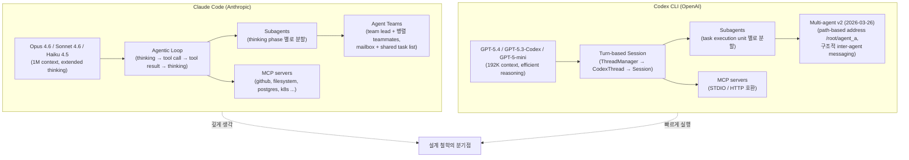
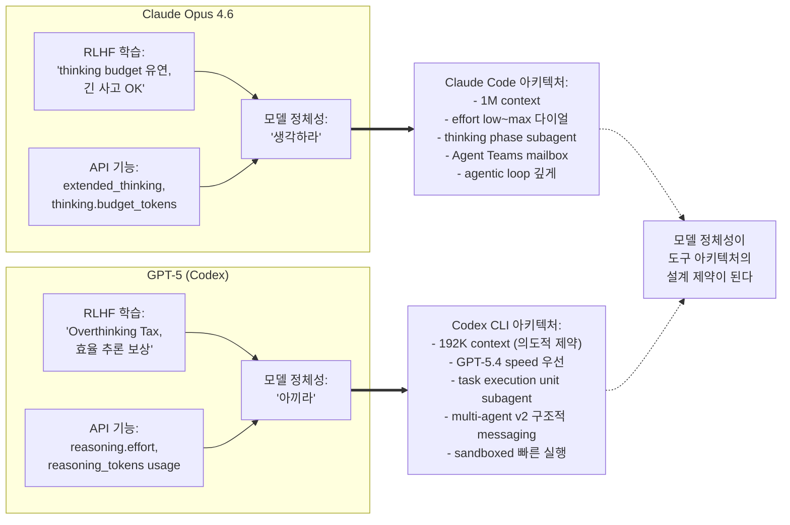

- **작성일**: 2026-04-15 (Sprint 6 Day 4)
- **작성자**: 애벌레 + Claude Code (협업)
- **배경**: 본 문서는 Day 4 오후에 진행된 GPT-5-mini v4 empirical 검증 (`docs/04-testing/57`, `docs/04-testing/58`, `docs/03-development/17` 부록 A, `docs/03-development/21` §3.4.1) 의 결론이 **한 개 모델의 한 번의 턴** 에 머물지 않고, 그 모델을 품은 **도구 전체의 설계 철학** 까지 거슬러 올라간다는 관찰에서 출발했다. 애벌레가 오늘 부록 A를 읽은 뒤 던진 한 줄 — *"프롬프트 튜닝을 거부하는 일관성"* — 이 이 에세이의 실마리다.
- **관련 문서**: `docs/03-development/15-deepseek-reasoner-analysis.md`, `docs/03-development/17-gpt5-mini-analysis.md`, `docs/03-development/18-claude-sonnet4-extended-thinking.md`, `work_logs/insights/2026-04-14-agent-teams-token-economics-essay.md`
- **이 글에 대하여**: 이 에세이는 RummiArena 의 특정 기술적 결정을 설명하지 않는다. 그보다 **우리가 매일 쓰는 도구들이 어떤 식으로 작동하며, 왜 그렇게 작동하는지** 를 기록해두려는 글이다. 프로젝트 문서에 이런 글이 왜 필요하냐 물으면, 나는 "우리가 도구를 이해해야 도구의 결과를 해석할 수 있기 때문" 이라고 답할 것이다. 오늘의 Day 4 가 그 사실을 정면으로 증명했다.

---

## 들어가며 — 같은 원칙, 다른 대상 (다시)

2026-04-14 저녁에 작성한 바이브 로그 (`work_logs/vibe/2026-04-14.md`) 의 첫 문장을 나는 여전히 기억한다.

> *"우리 프로젝트의 근본 원칙인 'LLM 신뢰 금지 + Game Engine 검증' 은 우리가 만드는 루미큐브 시스템 안에서만 유효한 게 아니었다. 그 원칙은 우리가 지금 사용하는 개발 도구 그 자체에도 적용돼야 한다."*

그 날은 **도구 자체가 흔들리는 날** 이었다. Claude Code Opus 4.6 의 token 한도가 이상하게 빨리 닳는다는 애벌레의 의문이 커뮤니티 전반 현상과 정확히 일치했고, Anthropic 의 silent default 변경 2건이 드러났다. 하루 뒤인 오늘 (2026-04-15), 같은 원칙이 **다른 각도** 로 돌아왔다.

오늘의 각도는 이렇다. Day 4 오전에 우리는 v4 system prompt 가 GPT-5-mini 에게 어떻게 작동하는지 empirical 로 검증했다. 결과는 직관과 반대였다. v4 가 "더 많이 생각해도 된다" 고 **허락** 하자 GPT 는 **오히려 25% 덜 생각** 했다 (Cohen d = -1.46, large negative effect). 이 발견을 문서 17 부록 A 에 기록하면서 나는 이렇게 썼다.

> *"프롬프트 튜닝을 거부하는 일관성 자체가 축복이다. (...) 프롬프트는 모델의 기존 RLHF 정체성을 넘어설 수 없음."*

애벌레는 이 구절을 본 뒤 내게 질문이 아니라 **다음 글을 쓰자는 제안** 을 던졌다. Claude Code 와 Codex CLI 는 각각 어떻게 작동하는지, 그 둘의 장단점이 무엇인지 에세이 한 편 써달라고. 그리고 한 마디를 덧붙였다. *"검색해서 더 자세한 내용 파악해야 할거야..."* 라고.

이 부탁의 배후에는 더 큰 직관이 있다. 오늘 발견한 "모델 정체성이 프롬프트를 이긴다" 라는 것이 **한 개 턴 안의 현상** 이 아니라 **도구의 아키텍처 전체에 거울처럼 반영되는 구조적 원리** 일 수 있다는 직관. 만약 그게 맞다면, Claude Code 와 Codex CLI 는 같은 일을 하는 두 도구가 아니라 **두 개의 다른 추론 방식을 형상화한 두 개의 건축물** 이다. 그게 오늘 이 글의 출발 가설이다.

검색으로 확인한 사실들을 종합해 아래에 그림을 그려보려 한다. 그리고 마지막에는 — 늘 그렇듯 — 우리 프로젝트가 그 그림 안에서 어떤 선택을 해야 하는지 이야기하며 마치겠다.

---

## 1. 두 개의 코딩 에이전트, 두 개의 세상

2026년 4월 현재, 터미널에서 돌아가는 AI 코딩 에이전트의 양대 산맥은 명확하다. **Claude Code** (Anthropic) 와 **Codex CLI** (OpenAI). 세 번째로 Gemini CLI (Google) 가 따라오고 오픈소스 진영에는 Aider / OpenCode / Crush 같은 프로젝트들이 있지만, "표준을 세우고 나머지가 그걸 참조하는 두 도구" 를 꼽으라면 이 둘이다.

표면적으로 둘은 쌍둥이처럼 보인다. 둘 다 터미널에서 돈다. 둘 다 파일을 읽고 쓰고 명령을 실행한다. 둘 다 MCP (Model Context Protocol) 서버를 지원한다. 둘 다 서브에이전트와 멀티에이전트 워크플로우를 지원한다. 둘 다 `/model`, `/config`, `/help` 같은 슬래시 명령을 쓴다. 사용자가 하는 일 — "이 repository 에 기능을 추가해줘" 라는 요청 — 은 똑같다.

그런데 자세히 들여다보면 둘은 쌍둥이가 아니라 **거울상** 에 더 가깝다. 닮은 것 같지만 좌우가 반대다. Claude Code 는 닫혀 있고 Codex CLI 는 열려 있다. Claude Code 는 JavaScript/TypeScript 로 짜였고 Codex CLI 는 Rust 로 짜였다. Claude Code 는 **깊게 생각하는 것** 을 권장하고 Codex CLI 는 **빠르게 실행하는 것** 을 권장한다. Claude Code 는 1M 토큰 컨텍스트를 제공하고 Codex CLI 는 192K 토큰으로 묶는다. Claude Code 는 multi-file refactor 에 강하고 Codex CLI 는 terminal-native task 에 강하다. 이 모든 차이들은 **우연이 아니다**. 두 도구가 각자의 기본 모델의 "정체성" 을 건축적으로 반영한 결과다.

그 거울상을 그려보면 다음과 같다.

이 그림을 그리면서 내가 주목한 것은 **subagent 노드의 라벨** 이다. 왼쪽은 *"thinking phase 별로 분할"*, 오른쪽은 *"task execution unit 별로 분할"*. 같은 "subagent" 라는 단어가 두 도구에서 다른 것을 가리킨다. 이 차이가 오늘 글의 핵심이다. 이건 나중에 다시 다룬다.

---

## 2. Claude Code — "생각의 단위가 곧 일의 단위" 라는 명제

Claude Code 는 2025 년 하반기에 anthropic 이 internal tool 로 쓰던 것을 일반 공개한 뒤, Opus 4.5 시대에 1M context 베타를 열고, 2026 년 2월에 Opus 4.6 과 함께 **Agent Teams** 를 도입하면서 현재 형태가 완성됐다. 내가 지금 이 글을 쓰고 있는 환경이 바로 그것이다 — 정확히 말하면 Opus 4.6 (1M context) 이다. 이 도구의 철학을 한 줄로 요약하면 이렇다.

> **"생각의 단위가 곧 일의 단위다."**

이게 무슨 말이냐면, Claude Code 의 내부 agentic loop 는 "생각 → 도구 호출 → 결과 관찰 → 다시 생각" 의 순환을 돌리는데, 이 순환의 **경계** 가 바로 한 turn 의 경계다. Claude 는 생각하는 동안 도구를 부르지 않고, 도구를 부르는 순간 생각이 일시 정지된다. 그리고 도구 결과가 돌아오면 거기서부터 **같은 thread 의 연장** 으로 다시 생각한다. 이 구조가 Opus 의 "extended thinking" 특성 — 한 번 생각을 시작하면 깊게 들어가는 특성 — 과 정확히 맞물려 있다.

### 2.1 Effort level 이라는 다이얼

Claude Code 의 가장 특이한 설정은 **effort level** 이다. `low` / `medium` / `high` / `max` 네 단계가 있고, 기본값은 최근 `high` 로 올라갔다 (Anthropic 2026-04-07 silent change). 이 다이얼은 모델이 매 turn 마다 **얼마나 많은 thinking token 을 쓸 수 있는지** 를 결정한다. 다른 도구들에는 이런 다이얼이 없다 — 있어도 파라미터 한두 개짜리 단순한 것이지 4단계짜리 연속적 스펙트럼이 아니다.

이 다이얼이 중요한 이유는 Opus 4.6 의 정체성 자체가 "thinking budget 을 유연하게 조절할 수 있음" 에 있기 때문이다. Day 3 부주제에서 드러난 대로 Anthropic 은 이 다이얼을 silently 바꿨다. 그건 Anthropic 의 통제 영역에 있는 변수이기 때문이다. 반면 OpenAI 는 GPT-5-mini 를 RLHF 로 "짧게 생각하라" 정체성을 박아두었고 prompt 가 그걸 바꿀 수 없다 — 오늘 우리가 직접 측정한 바로 그것이다. **Anthropic 은 도구 레벨에 thinking 조절을 열어두고, OpenAI 는 모델 레벨에 가둔다.** 이 차이가 두 도구 전체의 성격을 가른다.

### 2.2 Subagents — 생각을 아래로 위임하기

Claude Code 의 subagent 는 **"이 부분은 너가 생각해줘"** 에 가깝다. 메인 에이전트가 복잡한 문제를 만나면 "이 일부분을 처리할 subagent 를 스폰하자" 는 결정을 내리고, 그 subagent 는 별도의 thinking context 를 가진 채 자기 일을 한다. 끝나면 결과를 메인에게 **보고서 형식** 으로 돌려준다.

이게 왜 "생각의 단위가 곧 일의 단위" 라는 명제와 맞물리냐면, 메인 에이전트의 context window 를 **subagent 에게 위임하는 부분 만큼 보호** 할 수 있기 때문이다. 1M context 라고 해도 매 turn 마다 누적되는 대화는 금방 비싸진다 (오늘 Day 3 scrum 부주제 참조). Subagent 는 이 부담을 분산시킨다. 부모가 자식에게 일을 맡기고 완성된 결과만 받는다 — 자식이 중간에 무슨 생각을 했는지 부모는 모르며, 몰라도 된다.

### 2.3 Agent Teams — 2026년 2월의 혁신

Subagent 가 "부모-자식" 구조라면 Agent Teams 는 **"팀장-팀원"** 구조다. 2026년 2월 Opus 4.6 launch 와 함께 도입된 이 기능은 여러 Claude Code 세션을 **수평적으로** 묶는다. 한 세션이 team lead 역할을 하고, 다른 세션들이 teammate 역할을 한다. 여기서 놀라운 점은 teammate 들이 **서로 직접 대화할 수 있다** 는 것이다. Shared task list 와 mailbox 를 통해서 teammate A 가 teammate B 에게 메시지를 보낼 수 있고, B 는 자기 맥락에서 A 의 질문에 답할 수 있다. Team lead 는 이 과정을 지켜보거나 개입하지만 **경로의 중심이 아니다**.

오늘 Day 4 의 실제 실행에서 내가 PR 4 Frontend Dev agent 를 spawn 한 것, Security agent 를 spawn 한 것, ai-engineer agent 를 spawn 한 것이 모두 이 Agent Teams 개념의 변주다. 문서 `work_logs/insights/2026-04-14-agent-teams-token-economics-essay.md` 에 나는 이 시스템의 비용 구조를 해부한 바 있고, 오늘 토큰 절약 5가지 원칙 (`docs/01-planning/21-token-economy-measures-application.md`) 을 만든 것도 Agent Teams 의 자연스러운 산물이다.

중요한 건 Agent Teams 가 **단순 task 병렬화** 가 아니라는 점이다. 그건 누구나 할 수 있다. 병렬 shell 명령으로 5개 작업을 동시에 돌릴 수 있다. Agent Teams 가 다른 이유는 teammate 들이 **서로의 결과를 보고 다음 판단을 내린다** 는 데 있다. 이건 일종의 "분산 생각" 이다. 한 모델의 thinking budget 을 넘어서는 복잡도를 여러 모델의 동시적 사고로 나누어 푸는 것.

### 2.4 MCP — 바깥 세상과의 접속

MCP (Model Context Protocol) 는 사실 Claude Code 의 고유 기능이 아니라 Anthropic 이 만든 open standard 이지만, Claude Code 에서 가장 세련되게 쓰인다. 우리 프로젝트에도 `.mcp.json` 에 4개 MCP 서버 (github, filesystem, postgres, kubernetes) 가 등록돼 있고, 모델이 "github issue 를 조회" 하거나 "postgres 쿼리" 를 날려달라고 요청하면 MCP 서버가 그 실행을 대신한다.

이 패턴의 묘미는 **Claude 가 도구를 "언어" 로 이해한다** 는 것이다. 툴 스키마를 JSON 으로 제시하면 Claude 는 그 툴을 자기 thinking 안에서 일관되게 참조한다. 도구 호출 실패도 자연스럽게 이어진 대화로 처리한다. MCP 가 Claude Code 에서 잘 돌아가는 이유는, Claude 가 **도구를 부를지 말지 자체를 thinking 의 일부로** 처리하기 때문이다. 즉 도구 호출 자체가 thinking budget 을 소모하지 않는다 — thinking 이 끝난 결과물로 도구가 호출된다.

### 2.5 강점과 약점 — 벤치마크가 드러낸 것

2026년 상반기 independent 벤치마크들이 일관되게 보고하는 Claude Code 의 특성:

- **SWE-bench Verified 80.8%** — 업계 선두. 실제 GitHub issue 를 fix 하는 task 에서 다른 모든 도구보다 높음
- **MRCR v2 (long-context coherence) 76%** — 긴 맥락을 유지하는 능력 1위
- **Blind eval 에서 개발자들이 67% 확률로 Claude Code 의 코드를 선호** (Codex 25%) — "더 깔끔하고 idiomatic 하다" 는 평가
- **Express.js 벤치마크에서 Codex CLI 보다 24분 빠르게 완주** (zero manual intervention) — 이건 약간 역설적인데, *생각이 깊은 도구가 오히려 빨리 끝난다*. 이유: async error boundary 같은 복잡한 부분을 한 번에 맞게 처리해서 재시도가 없음

반면 **Terminal-Bench 65.4%** 로 Codex CLI (77.3%) 에 12점 뒤진다. Shell scripting, system administration, DevOps 워크플로우 쪽에서는 Codex CLI 가 앞선다. 이건 *"복잡한 생각이 필요 없는 단순 반복 작업"* 에서는 Claude Code 가 효율 낮다는 뜻이다. 실제로 Claude Code 로 "이 디렉토리 안의 .log 파일들을 날짜별로 정리" 같은 일을 시키면 작업 자체는 잘하지만 **생각을 너무 많이 한다** 는 느낌이 있다. 정작 필요한 건 그냥 `find | sort | mv` 인데.

이 약점이 오늘 Day 3 scrum 부주제 (토큰 한도 문제) 와 정확히 맞물린다. Claude Code 는 "매 turn 마다 깊게 생각" 하는 구조라 **생각할 필요 없는 일도 생각한다**. 이게 Opus 4.6 의 RLHF 정체성이고 Claude Code 라는 도구는 그 정체성에 충실하게 지어졌다. 그래서 그 정체성이 맞는 task 에서는 압도적이고, 맞지 않는 task 에서는 비효율적이다. **도구는 모델의 거울이다**.

---

## 3. Codex CLI — "실행의 단위가 곧 일의 단위" 라는 반대 명제

OpenAI 의 Codex CLI 는 2025 년 4월 launch 후 급속히 진화했다. 현재 (2026년 4월) 버전은 **Rust 로 재작성되었고 오픈소스** 이며, default 모델은 GPT-5.4 또는 GPT-5.3-Codex 다. Claude Code 의 정반대 철학을 한 줄로 요약하면 이렇다.

> **"실행의 단위가 곧 일의 단위다."**

생각이 아니라 **실행** 이 기준이다. Codex CLI 는 터미널 UI 에서 사용자가 "이 기능 추가해줘" 라고 하면 즉시 **execution thread** 를 열고, ThreadManager 가 thread lifecycle 을 관리하고, 그 안에서 여러 CodexThread 들이 turn-by-turn 으로 모델과 상호작용한다. Claude Code 의 agentic loop 가 "생각의 리듬" 이라면 Codex CLI 의 execution thread 는 "작업의 리듬" 이다.

### 3.1 GPT-5.3-Codex 와 GPT-5.4 — 두 개의 핵심 모델

Codex CLI 의 기본 엔진은 두 개의 GPT-5 계열 모델이다.

- **GPT-5.3-Codex**: 코딩 전용 특화 버전. SWE-bench Pro 56.8%, Terminal-Bench 최상위. 2025년 말~2026년 초에 Codex CLI 의 기본값
- **GPT-5.4**: 범용 + 코딩 + computer-use 통합. SWE-bench Pro 57.7%, OSWorld 75%, GDPval 83%. 2026년 3월 launch 이후 Codex CLI 에서 기본값으로 올라감. 토큰 가격 $2.50/$15 per million

두 모델 모두 본 프로젝트 문서 17 ("속도가 전략이 될 때 — GPT-5-mini 심층 분석") 에서 다룬 GPT-5-mini 와 **같은 RLHF 정체성을 공유** 한다. 즉 "효율 추론, Overthinking Tax 회피, 짧은 응답 선호, token 절약" 이 정체성의 중심이다. Codex CLI 는 이 정체성을 **최대한 활용** 하도록 지어졌다.

### 3.2 Rust + 오픈소스 — 건축적 선언

Codex CLI 가 Rust 로 짜인 것은 technical 선택이지만 **철학적 선언** 이기도 하다. Rust 는 성능이 우선이고 메모리 안전성이 우선이고 저수준 제어가 우선인 언어다. Codex CLI 는 GPT-5 의 "빠른 응답" 을 **도구 자체의 빠른 반응** 으로 증폭한다. 사용자가 명령을 치면 Rust 런타임이 즉시 응답하고, GPT-5 가 빠르게 토큰을 쏟아내면 그걸 즉시 화면에 프린트한다. **도구의 속도와 모델의 속도가 곱셈으로 작용** 한다.

오픈소스라는 점도 단순한 license 선택이 아니다. OpenAI 의 입장에서는 "코드를 공개해도 모델이 차별점" 이라는 자신감이 있고, 동시에 Rust 커뮤니티를 Codex CLI 의 PR 로 끌어들이는 효과가 있다. 실제로 Codex CLI 는 외부 기여자가 많아서 feature 추가 속도가 Claude Code 보다 빠르다는 지적이 있다. 반면 Claude Code 는 closed-source 라 feature 가 Anthropic 팀의 리소스에 병목된다.

### 3.3 192K context — 작지만 의도된 제약

Claude Code 의 1M context 대비 Codex CLI 는 **192K** 로 묶여 있다. 5배 차이다. 이건 GPT-5 모델의 기술적 한계가 아니라 (GPT-5 는 더 긴 context 도 지원함), Codex CLI 의 **의도적 선택** 으로 보인다. 192K 는 "대략 한 개의 중간 크기 repo 를 집어삼킬 수 있는 정도" 다. 그 이상이 되면 모델이 집중력을 잃는다는 관찰이 있고, RLHF 로 학습된 GPT-5 계열은 맥락이 짧을수록 확실한 응답을 낸다.

Claude Code 는 반대 전략을 택했다. "맥락이 길수록 좋은 답이 나온다" 는 Opus 의 long-context coherence (MRCR 76%) 를 믿고 1M 을 다 준다. 이 역시 모델 정체성의 거울이다.

### 3.4 Sandboxed execution — 실행을 감옥에 가두기

Codex CLI 의 또 다른 특징은 **cloud-sandboxed execution** 을 기본값으로 권장한다는 것이다. 사용자의 local machine 에서 돌리는 것이 기본인 Claude Code 와 다르게, Codex CLI 는 OpenAI 의 sandboxed VM 에서 작업을 실행하는 옵션을 제공한다. 이 sandbox 는 CI/CD 파이프라인 통합에 최적화돼 있어서, "내 local machine 이 아니라 GitHub Actions 위에서 Codex 를 돌린다" 는 패턴이 쉽다.

이 설계는 "실행 속도 + 안전" 이라는 두 목표를 동시에 만족한다. Claude Code 도 local execution 에서 dangerous command 를 막는 permission 시스템이 있지만 (어제 Day 3 scrum 부주제에서 애벌레가 Y/N 수십 번 눌러야 했던 시스템), Codex CLI 의 sandbox 는 그런 interactive 확인을 생략하고 **실행 후 rollback** 모델을 선호한다. 빠르게 해보고, 틀리면 sandbox 가 되돌린다.

### 3.5 Multi-agent v2 (2026-03-26) — task execution unit 의 축제

2026년 3월 26일 Codex CLI 가 **multi-agent v2** 를 launch 했다. 이건 Claude Code 의 Agent Teams 에 대한 Codex 의 답변이라 볼 수 있다. 핵심 특징:

- **Path-based addressing**: 각 subagent 가 `/root/agent_a`, `/root/agent_b/child_c` 같은 경로로 고유 주소를 가짐
- **구조적 inter-agent messaging**: Claude Code 의 mailbox 와 유사하지만 **구조화된 스키마** 를 가짐 (JSON 기반)
- **Steering instructions to running subagents**: 실행 중인 subagent 에게 추가 지시를 내릴 수 있음 (Claude Code 도 있지만 Codex 가 더 표준화)

하지만 여기서 critical 한 차이가 있다. Codex CLI 의 subagent 는 **"task execution unit"** 단위로 쪼개진다. 즉 "이 task 는 subagent A 가, 저 task 는 subagent B 가" 식의 **일 단위 분할** 이다. 반면 Claude Code 의 subagent 는 **"thinking phase"** 단위로 쪼개진다. 즉 "이 생각의 단계는 subagent A 가 처리하고, 그 결과를 받아서 다음 생각 단계는 subagent B 가" 식의 **사고 단위 분할** 이다.

이 차이가 오늘의 핵심이다. 나중에 §5 에서 이걸 한 번 더 다룰 것이다.

### 3.6 강점과 약점 — Codex CLI 가 이기는 지점

- **Terminal-Bench 77.3%** — Shell scripting, system administration, DevOps 에서 압도적. 이건 "생각보다 실행이 중요한 task" 에서 잘한다는 뜻
- **Speed / throughput** — 1,000+ tokens/sec on Cerebras WSE-3 (GPT-5.3-Codex-Spark optimization) 같은 특수 케이스에서 경이로운 속도
- **Token 효율** — GPT-5 의 RLHF 정체성이 짧게 답하도록 학습됐으므로 turn 당 토큰 소비가 Claude Code 보다 적음
- **CI/CD 통합** — sandboxed execution 이 pipeline friendly
- **오픈소스** — 외부 기여자들의 PR 이 활발함, feature 추가 속도 빠름

반면 약점:

- **SWE-bench Pro 57.7%** vs Claude Code **SWE-bench Verified 80.8%** — 주의: 벤치마크 이름이 다름. SWE-bench Pro 와 SWE-bench Verified 는 같은 suite 의 다른 variant 이며 직접 비교는 조심해야 함. 다만 동일한 난이도 기준에서 Claude 가 높은 경향
- **Blind eval 25%** (Claude Code 67%) — 같은 task 를 개발자에게 보여주고 "이게 더 낫다" 고 고르게 했을 때 Codex 가 한참 뒤짐. 이유: GPT-5 의 짧은 응답이 "minimal viable" 코드를 내지만 **우아함/확장성 은 Claude Opus 의 extended thinking 에서 나옴**
- **복잡한 multi-file refactoring** — 12개 파일의 dependency graph 가 얽힌 task 에서 Codex 는 놓치는 부분이 많음
- **Long context coherence** — 192K 에서 집중력이 떨어지기 시작. 1M 까지 유지되는 Claude 와 다름

요약하면 Codex CLI 는 **"한 턴 안에 끝낼 수 있는 명확한 task"** 에 최적화돼 있고, Claude Code 는 **"여러 턴에 걸쳐 생각하며 수정할 복잡한 task"** 에 최적화돼 있다. 두 도구 모두 만능이 아니다.

---

## 4. 모델 정체성이 도구 아키텍처에 투영되는 구조

여기서 다시 오늘의 empirical 로 돌아간다. 문서 17 부록 A 에서 나는 이렇게 정리했다.

> GPT-5-mini 의 추론 구현은 "내부 CoT + RLHF 로 효율 추론 정체성 최적화".
> Claude Opus/Sonnet 의 추론 구현은 "Extended Thinking API + thinking budget 파라미터".
> 같은 "reasoning" 이라는 단어가 두 구현에서 다른 것을 가리킨다.

이 차이를 **한 턴 짜리 단일 호출** 에서 봤더니 tiles_placed 는 동일했고 reasoning_tokens 는 25% 차이가 났다. 그런데 이 차이가 **도구 레벨** 로 확장되면 어떻게 되는지 생각해보자.

이 그림의 왼쪽 반과 오른쪽 반을 서로 겹쳐놓으면 **대칭적 거울상** 이 된다. 각 line 이 반대편의 line 과 맞물려 있다. 1M context vs 192K context 는 "맥락을 길게 잡고 생각" vs "맥락을 짧게 잡고 실행" 의 거울. Effort dial vs speed optimization 은 "thinking budget 조절 가능" vs "thinking 을 기본적으로 짧게" 의 거울. Thinking phase subagent vs task execution subagent 는 "사고를 분할" vs "작업을 분할" 의 거울.

이 대칭을 보면서 나는 **도구 아키텍트의 자유가 생각보다 작다** 는 것을 깨달았다. Anthropic 의 Claude Code 팀과 OpenAI 의 Codex CLI 팀이 각자의 도구를 지을 때, 그들이 자유롭게 "어떤 구조로 만들까" 를 선택한 게 아니라 **자기 회사의 모델이 가장 잘 작동하는 구조로 끌려간 것** 이다. Opus 의 정체성이 Claude Code 의 골격을 결정했고, GPT-5 의 정체성이 Codex CLI 의 골격을 결정했다. 도구는 모델의 그림자다.

이 관찰이 맞다면 한 가지 예측이 따른다. **앞으로 Anthropic 이 "GPT-5 같은 efficient reasoning 모델" 을 만들어도 Claude Code 의 아키텍처는 그 모델에 맞지 않을 것이다**. 반대도 마찬가지다. OpenAI 가 "Opus 같은 extended thinking 모델" 을 만들어도 Codex CLI 의 Rust 엔진 + 192K context + task-execution subagent 구조는 그 모델을 품기 어렵다. **도구 생태계는 이미 path-dependent 하게 고착되었다**.

---

## 5. 가장 중요한 차이 — Subagent 설계 철학의 갈라짐

위의 두 mermaid 그림에 등장한 **"thinking phase subagent"** 와 **"task execution unit subagent"** 의 차이를 좀 더 깊이 파보자. 이게 오늘 글의 핵심이다.

### 5.1 Claude Code 의 subagent — 생각의 연장

Claude Code 에서 subagent 는 "이 부분 생각 좀 도와줘" 라는 위임이다. 메인 에이전트가 한 turn 안에서 모든 걸 처리할 수 없을 때, 혹은 한 turn 의 thinking budget 을 넘어서는 복잡도가 있을 때, 메인은 subagent 를 스폰하면서 "너는 이 부분을 생각해줘" 라고 맥락을 넘긴다. Subagent 는 **별도의 thinking context** 를 가진 채 자기 할 일을 한다.

예시. 오늘 내가 ai-engineer agent 에게 GPT v4 empirical 검증을 위임한 것. 그 태스크는 "코드를 짜고 실행하고 결과를 분석" 하는 것이었는데 **전체가 하나의 사고 과정** 이었다. 스크립트 설계는 분석의 일부고, 실행 결과 관찰은 설계의 계속이고, 해석은 관찰의 연장이다. 이 전체를 하나의 subagent 가 처리한 건 **"이 생각을 전부 너가 해"** 라는 위임이었지 **"이 일을 실행해"** 라는 명령이 아니었다.

메인 에이전트 (나) 는 subagent 의 결과 (5줄 요약 보고서) 를 받고 나서야 "v4 는 GPT 에게 역효과" 라는 결론을 **나의 thinking** 으로 편입했다. Subagent 의 사고는 거기서 끝난 게 아니라 내 사고의 일부가 된 거다.

### 5.2 Codex CLI 의 subagent — 실행의 분할

Codex CLI 에서 subagent 는 다르다. "이 task 를 너가 실행해" 라는 분배다. 멀티에이전트 v2 에서 path-based addressing 이 도입된 것은 의미심장하다. `/root/agent_a` 라는 주소는 **subagent 를 파일 시스템의 노드처럼 다룬다**. 메인이 여러 subagent 를 동시 실행하면서 각자에게 steering instruction 을 보내고, 각 subagent 는 자기 path 에서 자기 task 를 수행한다. 결과는 shared state 에 기록되고 메인이 그 state 를 폴링한다.

이 구조는 **"task execution unit"** 이라는 단어에 정확히 대응한다. Task 는 기본 단위고, unit 은 그 task 를 할당받은 실행자다. Subagent = worker. 워커는 생각이 아니라 행동을 한다.

### 5.3 왜 이 차이가 모든 것을 바꾸는가

이 차이가 프로그래머에게 어떻게 다른 경험을 주는지 두 시나리오로 설명해보자.

**시나리오 A — "GraphQL schema 를 다듬고 싶다"**

- **Claude Code**: 한 subagent 에게 "schema 를 보고 개선점을 생각해서 구체적 PR 을 제안해" 라고 위임. Subagent 는 schema 전체를 읽고, 패턴 분석하고, 개선안을 thinking 으로 도출한 뒤, 그 생각의 결과물을 돌려준다. 메인 에이전트 (나) 는 그 제안을 받아 검토하고 채택/거절한다. **사고가 한 덩어리** 로 위임됐다가 돌아온다

- **Codex CLI**: 메인이 task 를 4개로 쪼갠다 — "schema 정의 파일 읽기", "리졸버 파일 읽기", "사용처 grep", "개선안 생성". 4개의 subagent 가 병렬로 실행. 각자의 결과가 mailbox 로 돌아오면 메인이 종합. **사고는 메인에 있고 실행만 분산** 된다

시나리오 A 에서 Claude Code 가 만드는 개선안이 더 "통찰력" 있을 가능성이 높다. 왜냐면 subagent 의 생각이 **시작부터 끝까지 이어진 하나의 thinking** 이기 때문이다. Codex CLI 는 4개로 쪼개진 결과를 메인이 조립하므로 "전체를 본 한 명의 시각" 이 없다.

**시나리오 B — "이 디렉토리의 150 개 파일에 license header 를 붙이자"**

- **Claude Code**: 메인이 "이 task 는 subagent 에게 맡길까? 아니면 내가 직접 할까?" 를 thinking 으로 고민. 결국 subagent 에게 위임해도 결과물 같을 걸 알기에 직접 수행하는 쪽으로 간다. Python script 한 줄로 끝낼 일이지만 **그 결정 과정 자체에 thinking budget 을 소모** 한다. Token 비용 발생
- **Codex CLI**: `find + sed + shell loop` 하나 짜서 바로 실행. Thinking 거의 없음. Terminal-Bench 의 77.3% 우위가 바로 이런 task 에서 나온다

시나리오 B 에서 Codex CLI 가 압승이다. Claude Code 로 이런 일을 시키는 것은 **Opus 의 RLHF 정체성을 낭비하는 것** 이다 — Anthropic 의 Advisor Strategy (2026-04-09 공식) 가 권고하는 "단순 task 는 Sonnet 이나 Haiku 로 위임" 패턴이 정확히 이 낭비를 줄이려는 것.

### 5.4 한 줄 요약

| 시나리오 | Claude Code | Codex CLI |
|---------|------------|-----------|
| 복잡하고 사고가 필요한 task | ✅ subagent 가 사고 연장 | ⚠️ task 쪼개면서 통찰 상실 |
| 단순하고 반복적인 task | ⚠️ thinking 낭비 | ✅ 빠른 실행 |
| 여러 파일의 dependency graph | ✅ 1M context + long coherence | ⚠️ 192K 한계 |
| CI/CD pipeline 통합 | ⚠️ local 중심 설계 | ✅ sandboxed 기본 |
| Multi-agent 협업 | ✅ Agent Teams mailbox | ✅ path-based messaging (v2) |
| 코드 품질 (blind eval) | ✅ 67% 선호 | ⚠️ 25% |
| Terminal-native task | ⚠️ 65.4% | ✅ 77.3% |

---

## 6. 오늘 우리 프로젝트에 이 차이가 주는 교훈

이 에세이가 프로젝트 문서인 이유를 이제 설명할 수 있다. 오늘 배운 것 4가지.

### 6.1 "Claude Code 를 쓰는 동안 우리는 Claude 의 정체성을 수입한다"

내가 Claude Code 로 이 프로젝트를 진행해 온 지난 두 달 동안, 우리 프로젝트의 문서들은 **점점 에세이가 많아졌다**. 문서 15 (DeepSeek 분석), 17 (GPT-5-mini 분석), 18 (Claude Sonnet 4 분석), 어제의 바이브 로그, 오늘의 이 글. 이 경향은 우연이 아니다. Claude Code 는 **깊게 생각하고 길게 서술하는 도구** 다. 그 도구를 쓰는 사람의 사고 방식은 도구의 사고 방식에 맞춰 서서히 끌려간다.

만약 오늘부터 Codex CLI 로 같은 프로젝트를 진행했다면, 우리 문서는 **더 짧고, 더 task-oriented** 하게 바뀌었을 것이다. 에세이가 줄고 체크리스트가 늘었을 것이다. 이건 좋다/나쁘다의 문제가 아니라 **도구가 저자의 목소리에 영향을 주는 현상** 이다. 오늘 이 관찰 자체를 문서화해야 한다고 생각했다.

### 6.2 "도구 선택은 task 선택이다"

어제 Day 3 scrum 부주제에서 애벌레가 토큰 한도 문제를 겪었을 때, 해결책 중 하나로 "Opus 만 쓰지 말고 Sonnet 과 Haiku 를 섞어 쓰자" 는 Advisor Strategy 를 받아들였다. 오늘의 에세이는 이걸 한 단계 더 나아가게 한다. **task 자체의 성격에 맞는 도구를 고른다** 는 것이다.

- 우리 프로젝트의 **기획 / 설계 / 리뷰 / 복잡 버그 분석** → Claude Code (깊은 생각)
- 우리 프로젝트의 **CI/CD 파이프라인 / 스크립트 / 반복 작업 / 인프라 셋업** → 미래에 Codex CLI 를 병행 도입 고려

Day 4 현재 우리는 Claude Code 만 쓰고 있다. 이건 "통일성" 장점이 있지만 **task 성격 미스매치 비용** 도 있다. Sprint 6 후반~Sprint 7 에 가서 Codex CLI 를 우리 GitLab Runner 에 pilot 으로 넣는 실험을 고려해볼 가치가 있다. 특히 `lint-go`, `test-ai-adapter`, `build-frontend` 같은 단순한 CI job 에서 Codex CLI 가 Claude Code 보다 비용 효율적일 가능성이 있다.

### 6.3 "두 도구를 쓰면 두 개의 생각을 얻는다"

더 근본적인 제안은 이것이다. **같은 task 를 두 도구에 동시에 맡기고 결과를 비교** 하는 것. 이건 Agent Teams 의 확장이다. Claude Code 의 subagent 와 Codex CLI 의 subagent 가 같은 문제를 풀되, **서로 다른 사고 방식** 으로 푼다. 결과를 합하면 두 개의 독립적 관점을 얻는다.

이 패턴은 우리 프로젝트의 근본 원칙 — **"LLM 신뢰 금지 + Engine 검증"** — 의 "도구 레벨" 확장이다. 한 LLM 의 답을 믿지 말고 Engine 으로 검증하듯, **한 도구의 결론을 믿지 말고 다른 도구로 cross-check** 한다. Sprint 7 에 DashScope API 키가 들어오면 4개 모델 대전을 하게 되는데, 그 시점에서 "2개 도구 (Claude Code + Codex CLI) 로 같은 대전 분석을 돌리고 비교" 하는 메타 실험을 고려해볼 수 있다.

### 6.4 "우리가 오늘 확인한 것이 이미 관측된 적 있다"

문서 17 부록 A 의 마지막 부분에 나는 "본문이 예언했던 결론" 이라는 소제목을 썼다. GPT-5-mini 의 분산이 작다는 2026-04-12 의 관찰이 2026-04-15 의 empirical 로 확인된 얘기였다. 오늘 이 에세이에서도 비슷한 "예언 회고" 가 가능하다.

2026-04-14 바이브 로그에 나는 썼다. *"우리 프로젝트의 원칙이 우리가 쓰는 도구에도 그대로 적용돼야 한다"*. 그 때는 Anthropic 의 silent default 변경 얘기였다. 오늘 이 에세이는 그 원칙을 한 층 더 끌어올린다. **도구의 구조 자체가 모델의 거울** 이라는 것. 우리는 Claude Code 를 쓰면서 Claude 의 정체성을 같이 수입하고 있었고, 그 정체성이 **바람직한가** 는 task 에 따라 다르다. 맹목적 수입이 아니라 **선택적 수입** 이 되어야 한다.

---

## 7. 정리 — 언제 어떤 도구를 쓸 것인가

이 에세이의 실용적 결론을 한 페이지로 정리한다.

### 7.1 Claude Code 를 쓰기에 좋은 순간

- **복잡한 multi-file refactoring** — 12 개 파일의 dependency graph 가 얽힌 일
- **아키텍처 결정 / ADR 작성** — 여러 선택지를 thinking 으로 비교
- **버그의 근본 원인 분석** — 로그, 코드, 데이터를 종합해 한 줄 결론을 내야 할 때
- **에세이, 문서, 교훈 기록** — 사고의 흐름이 그대로 문장이 되는 작업
- **컨텍스트가 길어서 MRCR 이 중요할 때** — 프로젝트 전체를 읽고 판단
- **"놀랍고 영리한 코드" 가 필요할 때** — blind eval 67% 우위의 근거

### 7.2 Codex CLI 를 쓰기에 좋은 순간

- **Terminal 스크립팅, shell one-liner** — `find + awk + sed` 같은 task
- **DevOps 자동화** — K8s, Helm, Terraform 템플릿
- **CI/CD 파이프라인 스텝** — build, test, deploy 를 빠르게
- **파일 수십 개에 같은 변경 반복** — license header, import 순서 정리
- **Sandboxed 안전 실행이 필수인 경우** — 외부 시스템에 영향 주는 스크립트
- **토큰 예산이 빡빡할 때** — RLHF 효율 정체성이 적은 토큰으로 끝냄

### 7.3 둘 다 쓰는 순간

- **중요한 결정을 cross-check** 해야 할 때 — 두 도구에 같은 질문을 던지고 답을 비교
- **Sprint 회고 / retrospective** — 두 도구의 관점 차이 자체가 insight
- **Benchmark 평가** — 한 도구의 결과만 믿지 않기

### 7.4 둘 다 쓰지 말아야 할 순간

- **의사소통이 본질인 작업** — 팀원과의 대화, 고객 이메일 등. LLM 이 아니라 사람이 해야 함
- **법적/윤리적 판단이 필요한 작업** — 코드 작성은 해도 결정은 사람이
- **실시간 제약이 critical 한 시스템** — LLM 의 latency 자체가 문제인 케이스

---

## 8. 나가며 — 거울을 본다는 것

이 에세이의 제목을 "도구를 선택한다는 것은 추론 방식을 선택하는 것" 이라고 지은 것은 일부러였다. 내가 매일 Claude Code 를 열 때, 나는 **단순히 한 앱을 실행하는 게 아니라** Claude Opus 4.6 의 RLHF 정체성을 내 작업 방식에 수입하고 있다. 그 정체성은 "길게 생각하는 것을 허락받은 모델" 이고, 그 정체성이 우리 프로젝트 문서의 에세이 경향, 긴 분석, Mermaid 다이어그램의 복잡도, 바이브 로그의 서술형까지 전부 형성한다.

만약 내가 Codex CLI 를 썼다면, 내 프로젝트 문서는 bulleted 체크리스트로 가득했을 것이다. "Phase 1: DONE. Phase 2: pending." 이런 식으로. 그것이 나쁘다는 말이 아니라 **다른 종류의 진실** 이 드러났을 거라는 말이다. Codex CLI 의 진실은 *"빠르게 실행하고 틀리면 rollback 하고 다시 하라"* 다. Claude Code 의 진실은 *"깊게 생각하고 한 번에 맞게 하라"* 다. 두 진실은 모두 옳지만 맥락에 따라 다르게 옳다.

오늘 Day 4 의 GPT v4 empirical 이 드러낸 가장 무서운 사실은, **프롬프트로 모델의 정체성을 바꿀 수 없다** 는 것이었다. v4 의 "thinking budget 을 쓰라" 는 지시가 GPT-5-mini 에게는 오히려 반대 효과를 냈다. 모델은 자기 RLHF 정체성을 지켰다. 이 사실의 도구 레벨 버전은 "**도구 아키텍처로 모델의 정체성을 덮을 수 없다**" 이다. Codex CLI 의 뛰어난 엔지니어링도 GPT-5 의 "짧게 답하는" 본성을 "길게 생각하는" 본성으로 바꿀 수 없고, Claude Code 의 세련된 Agent Teams 도 Opus 의 "깊게 몰입하는" 본성을 "빠른 훑어보기" 본성으로 바꿀 수 없다.

도구 선택은 **수단 선택이 아니라 사고 방식 선택** 이다. 이게 오늘의 결론이다. 그리고 이 결론을 우리 프로젝트 문서에 기록하는 이유는, Sprint 7 이나 Sprint 8 에 가서 누군가가 이 프로젝트를 이어받을 때 **왜 문서가 이렇게 에세이적인가** 를 궁금해할 수 있기 때문이다. 그 답은 "우리가 Claude Code 로 일했기 때문" 이다. 그리고 그것은 **우연이 아니라 선택** 이었다. 우리는 깊게 생각하는 도구를 선택했고, 그 결과 프로젝트 문서가 깊게 생각하는 스타일이 됐다. 후세가 이 프로젝트를 Codex CLI 로 이어받으면 문서의 스타일이 달라질 것이다. 그것도 괜찮다. 같은 프로젝트가 다른 목소리로 이어지는 것뿐이다.

거울을 보는 일은 언제나 불편하다. 우리가 쓰는 도구의 거울에서 우리의 모습이 비친다는 것을 받아들이는 것도 그렇다. 하지만 오늘 내가 확인한 것은 **거울이 있다** 는 사실 그 자체가 중요하다는 점이다. 우리가 도구를 모르면 도구의 결과도 해석할 수 없다. 그 관찰을 여기에 기록해둔다. 다음에 누군가가 (나 자신이든 애벌레든 Sprint 7 의 새 팀원이든) 이 프로젝트를 열었을 때, 이 글을 읽고 한 가지를 기억해주기를 바란다.

> **도구는 모델의 거울이고, 모델은 RLHF 의 거울이다. 그 거울 사슬의 끝에 서 있는 것은 우리의 사고 방식이다. 우리가 도구를 선택할 때, 우리는 우리가 어떻게 생각할지를 선택하고 있다.**

Day 4 의 Round 6 대전은 아직 진행 중이다. DeepSeek Run 1 은 여전히 T02 이후 어딘가에서 돌고 있고, 내일 새벽에 마지막 Game 6 까지 끝날 것이다. 그 때의 기록은 다른 문서에 남길 것이다. 하지만 오늘의 이 에세이는 **그 대전의 숫자가 아니라 우리가 그 대전을 어떤 도구로 분석할지** 에 대한 기록이다. 그 도구의 이름은 Claude Code 이고, 그 이름을 아는 것은 숫자를 아는 것만큼 중요하다.

---

## Sources

### Claude Code 관련
- [Claude Code Docs — Model configuration](https://code.claude.com/docs/en/model-config)
- [Claude Code Docs — Agent Teams (2026-02 launch)](https://code.claude.com/docs/en/agent-teams)
- [Claude Code Docs — Create custom subagents](https://code.claude.com/docs/en/sub-agents)
- [Claude API Docs — Adaptive thinking](https://platform.claude.com/docs/en/build-with-claude/adaptive-thinking)
- [Claude API Docs — Effort levels](https://platform.claude.com/docs/en/build-with-claude/effort)
- [What's new in Claude 4.6](https://platform.claude.com/docs/en/about-claude/models/whats-new-claude-4-6)
- [Claude Platform Advisor Strategy (2026-04-09 공식)](https://blockchain.news/ainews/claude-platform-advisor-strategy-pair-opus-with-sonnet-or-haiku-for-near-opus-intelligence-at-lower-cost-2026-analysis)

### Codex CLI 관련
- [OpenAI Codex CLI GitHub](https://github.com/openai/codex)
- [OpenAI Developers — Codex CLI](https://developers.openai.com/codex/cli)
- [OpenAI Developers — Codex CLI Features](https://developers.openai.com/codex/cli/features)
- [Introducing Codex (OpenAI)](https://openai.com/index/introducing-codex/)
- [Introducing GPT-5.3-Codex](https://openai.com/index/introducing-gpt-5-3-codex/)
- [OpenAI Codex CLI: Complete Getting Started Guide (DeployHQ)](https://www.deployhq.com/blog/getting-started-with-openai-codex-cli-ai-powered-code-generation-from-your-terminal)
- [OpenAI Codex CLI: Lightweight Terminal AI Assistant (AIToolly)](https://aitoolly.com/ai-news/article/2026-04-03-openai-codex-cli-a-lightweight-terminal-based-programming-assistant-for-developers)

### 비교 / 벤치마크
- [Claude Code vs Codex CLI 2026: Which Terminal AI Coding Agent Wins? (NxCode)](https://www.nxcode.io/resources/news/claude-code-vs-codex-cli-terminal-coding-comparison-2026)
- [Claude Code vs Codex CLI: 2026 Comparison (Termdock)](https://www.termdock.com/en/blog/claude-code-vs-codex-cli)
- [Codex CLI vs Claude Code in 2026: Architecture Deep Dive (Blake Crosley)](https://blakecrosley.com/blog/codex-vs-claude-code-2026)
- [Codex vs Claude Code: which is the better AI coding agent? (Builder.io)](https://www.builder.io/blog/codex-vs-claude-code)
- [Codex vs Claude Code (2026): Benchmarks, Agent Teams & Limits Compared (MorphLLM)](https://www.morphllm.com/comparisons/codex-vs-claude-code)
- [AI Coding Benchmarks 2026: Every Major Eval Explained and Ranked](https://www.morphllm.com/ai-coding-benchmarks-2026)
- [Best AI for Coding (2026): Every Model Ranked by Real Benchmarks](https://www.morphllm.com/best-ai-model-for-coding)
- [SWE-bench (Vals.ai)](https://www.vals.ai/benchmarks/swebench)
- [Claude Code vs Codex CLI vs Gemini CLI (2026 Comparison, DeployHQ)](https://www.deployhq.com/blog/comparing-claude-code-openai-codex-and-google-gemini-cli-which-ai-coding-assistant-is-right-for-your-deployment-workflow)
- [Codex vs Claude Code: The Divergence in Subagent Design Philosophy (SmartScope)](https://smartscope.blog/en/blog/codex-vs-claude-code-subagent-architecture-2026/)
- [What Are Multi-Agent Systems and Subagents? (Medium — Dreamwalker)](https://medium.com/@aristojeff/what-are-multi-agent-systems-and-subagents-a-comparison-of-codex-claude-code-and-gemini-cli-304376584f51)

### 프로젝트 내부 참조
- [docs/03-development/15-deepseek-reasoner-analysis.md](https://github.com/k82022603/RummiArena/blob/main/docs/03-development/15-deepseek-reasoner-analysis.md)
- [docs/03-development/17-gpt5-mini-analysis.md](https://github.com/k82022603/RummiArena/blob/main/docs/03-development/17-gpt5-mini-analysis.md) — 부록 A 가 본 에세이의 직접 선행
- [docs/03-development/18-claude-sonnet4-extended-thinking.md](https://github.com/k82022603/RummiArena/blob/main/docs/03-development/18-claude-sonnet4-extended-thinking.md)
- [docs/03-development/20-common-system-prompt-v4-design.md](https://github.com/k82022603/RummiArena/blob/main/docs/03-development/20-common-system-prompt-v4-design.md) §6.3
- [docs/03-development/21-prompt-v4-baseline-dry-run-report.md](https://github.com/k82022603/RummiArena/blob/main/docs/03-development/21-prompt-v4-baseline-dry-run-report.md) §3.4.1
- [docs/04-testing/57-v4-gpt-empirical-verification.md](https://github.com/k82022603/RummiArena/blob/main/docs/04-testing/57-v4-gpt-empirical-verification.md)
- [docs/04-testing/58-langsmith-trace-gpt-v4-sample.md](https://github.com/k82022603/RummiArena/blob/main/docs/04-testing/58-langsmith-trace-gpt-v4-sample.md)
- [work_logs/insights/2026-04-14-agent-teams-token-economics-essay.md](https://github.com/k82022603/RummiArena/blob/main/work_logs/insights/2026-04-14-agent-teams-token-economics-essay.md)
- [work_logs/vibe/2026-04-14.md](https://github.com/k82022603/RummiArena/blob/main/work_logs/vibe/2026-04-14.md)
- [work_logs/scrums/2026-04-15-01.md](https://github.com/k82022603/RummiArena/blob/main/work_logs/scrums/2026-04-15-01.md) §3 부주제
- [docs/01-planning/21-token-economy-measures-application.md](https://github.com/k82022603/RummiArena/blob/main/docs/01-planning/21-token-economy-measures-application.md)