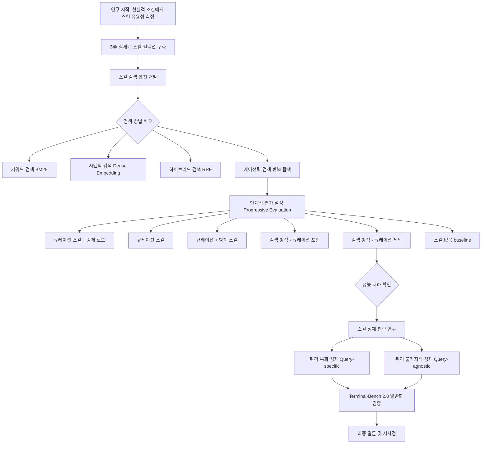
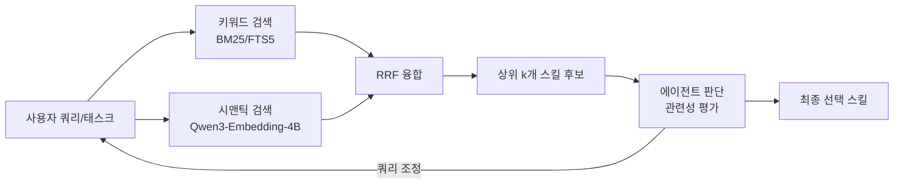
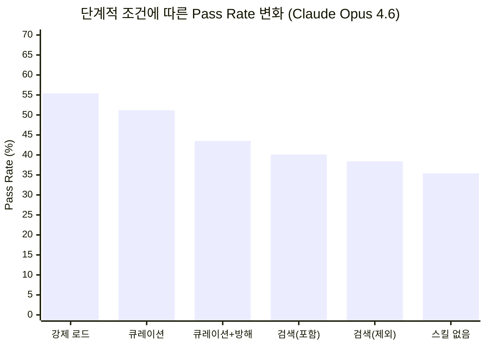
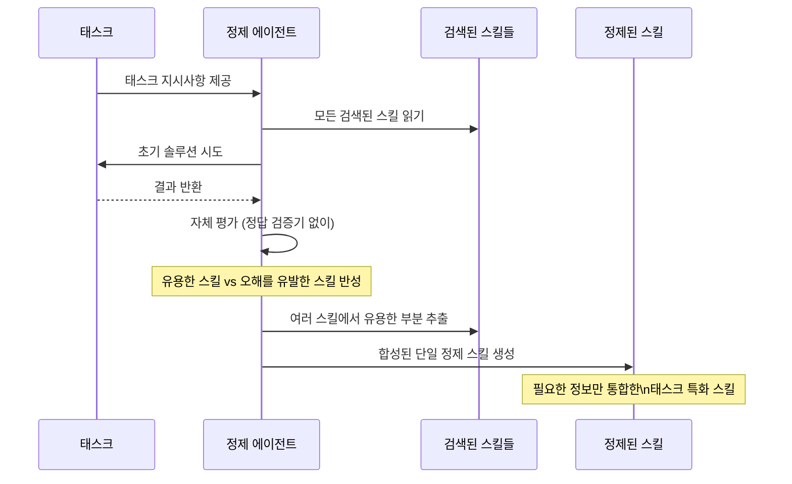

> **원제**: How Well Do Agentic Skills Work in the Wild: Benchmarking LLM Skill Usage in Realistic Settings  
> **저자**: Yujian Liu, Jiabao Ji, Li An, Tommi Jaakkola, Yang Zhang, Shiyu Chang  
> **소속**: UC Santa Barbara, MIT CSAIL, MIT-IBM Watson AI Lab  
> **게재**: [arXiv:2604.04323v1](https://arxiv.org/html/2604.04323v1) (2026년 4월 6일)  
> **코드**: https://github.com/UCSB-NLP-Chang/Skill-Usage  

---

## 목차

1. [연구 배경과 동기](#1-연구-배경과-동기)
2. [핵심 문제 제기](#2-핵심-문제-제기)
3. [주요 용어 정의](#3-주요-용어-정의)
4. [연구 방법론 전체 구조](#4-연구-방법론-전체-구조)
5. [스킬 컬렉션 구축](#5-스킬-컬렉션-구축)
6. [스킬 검색 엔진 설계](#6-스킬-검색-엔진-설계)
7. [단계적 평가 설정 (Progressive Evaluation)](#7-단계적-평가-설정)
8. [핵심 실험 결과 분석](#8-핵심-실험-결과-분석)
9. [스킬 정제 전략](#9-스킬-정제-전략)
10. [정제 결과 및 효과](#10-정제-결과-및-효과)
11. [Terminal-Bench 2.0 일반화 검증](#11-terminal-bench-20-일반화-검증)
12. [관련 연구 생태계](#12-관련-연구-생태계)
13. [결론 및 시사점](#13-결론-및-시사점)
14. [실무 적용 관점 분석](#14-실무-적용-관점-분석)
15. [연구의 한계와 향후 과제](#15-연구의-한계와-향후-과제)

---

## 1. 연구 배경과 동기

### 1.1 LLM 에이전트의 부상

2026년 현재, LLM(대형 언어 모델) 기반 에이전트는 소프트웨어 개발, 데이터 분석, 복잡한 워크플로우 자동화 등 다양한 영역에서 실질적인 변화를 이끌고 있다. Claude Code, OpenAI Codex, Google Gemini CLI 같은 도구들이 이 변화의 중심에 있으며, 이러한 에이전트들이 보다 전문화된 역할을 수행할 수 있도록 하는 메커니즘으로서 **에이전틱 스킬(Agentic Skills)** 이 급속도로 주목받고 있다.

스킬이란 도메인 특화 지식을 재사용 가능한 형태로 패키징한 지식 아티팩트로, 특정 API 사용 패턴, 코딩 컨벤션, 도메인별 워크플로우, 모범 사례 등을 구조화하여 담고 있다. Anthropic이 표준 포맷을 제안한 이후 skillhub.club, skills.sh 같은 스킬 집계 플랫폼이 등장하고, 오픈소스 커뮤니티에서 수만 개의 스킬이 공유되는 생태계가 형성되었다.

### 1.2 왜 지금 이 연구가 필요한가

스킬의 광범위한 채택에도 불구하고, **스킬이 실제로 에이전트의 문제 해결 능력을 향상시키는지에 대한 엄밀한 평가는 놀랍도록 부족**했다. 기존 벤치마크인 SkillsBench(Li et al., 2026)가 스킬의 효과를 처음으로 정량화하려 했지만, 그 설계 방식에는 현실과 동떨어진 심각한 가정이 내포되어 있었다.

이 논문은 바로 그 간극을 메우기 위해 등장했다. "이상적인 조건"이 아닌, 실제 운영 환경에서 스킬이 얼마나 도움이 되는지를 체계적으로 측정하고자 한 것이다.

---

## 2. 핵심 문제 제기

### 2.1 기존 벤치마크의 두 가지 근본적 문제

기존 SkillsBench의 평가 방식은 두 가지 측면에서 현실과 동떨어져 있었다.

**문제 ①: 스킬이 태스크에 과적합(overfit)되어 있음**

SkillsBench에서 사용하는 스킬들은 각 평가 태스크에 맞게 수작업으로 제작된, 사실상 "정답 가이드"에 가까운 것들이다. 예를 들어 USGS 기상 관측소의 홍수 일수를 계산하는 태스크에는 다음과 같은 세 개의 스킬이 제공된다.

- USGS API에서 수위 데이터를 다운로드하는 구체적인 방법을 담은 스킬
- NWS(미국 기상청) 홍수 임계값 데이터의 정확한 URL을 담은 스킬  
- 홍수 일수를 계산하는 코드 스니펫을 담은 스킬

이 세 가지를 합치면 사실상 태스크의 풀이 방법 전체가 공개되는 셈이다. 이는 "스킬이 도움이 되는가"를 측정하는 것이 아니라, "정답지가 주어졌을 때 에이전트가 잘 따라 하는가"를 측정하는 것에 불과하다.

**문제 ②: 스킬이 미리 에이전트 컨텍스트에 주입됨**

현실에서 에이전트는 수많은 스킬 저장소 중에서 자신에게 필요한 스킬을 스스로 찾아야 한다. 그러나 기존 벤치마크는 관련 스킬을 에이전트의 컨텍스트에 이미 넣어두는 방식으로, 실제 검색 과정의 어려움을 완전히 무시하고 있었다.

### 2.2 핵심 연구 질문

> **스킬이 현실적인 조건, 즉 에이전트가 대규모 노이즈 풀에서 스킬을 직접 검색해야 하고, 태스크에 특화되지 않은 범용 스킬만 사용할 수 있을 때에도 도움이 되는가?**

---

## 3. 주요 용어 정의

이 논문을 이해하기 위해 핵심 용어들을 명확히 정의한다.

| 용어 | 정의 |
|---|---|
| **에이전틱 스킬 (Agentic Skill)** | SKILL.md 파일과 선택적 보조 파일로 구성된 파일시스템 기반 지식 아티팩트. 도메인 특화 워크플로우, API 사용법, 코딩 패턴 등을 구조화하여 담음 |
| **스킬 선택 (Skill Selection)** | 제공된 스킬 목록 중 현재 태스크에 유용한 스킬을 에이전트가 스스로 판단하여 로드하는 행위 |
| **스킬 검색 (Skill Retrieval)** | 대규모 스킬 저장소에서 현재 태스크와 관련성 높은 스킬을 찾아내는 행위 |
| **스킬 적응 (Skill Adaptation)** | 태스크에 맞춤화되지 않은 범용 스킬에서 유용한 정보를 추출하고 활용하는 행위 |
| **Pass Rate** | 에이전트가 주어진 태스크를 성공적으로 완료한 비율 |
| **Recall@k** | 검색된 상위 k개 결과 중 정답 스킬이 포함된 비율 |
| **쿼리 특화 정제 (Query-specific Refinement)** | 현재 태스크를 직접 탐색한 후 스킬을 개선하는 전략 |
| **쿼리 불가지적 정제 (Query-agnostic Refinement)** | 태스크 정보 없이 오프라인으로 스킬을 일반적으로 개선하는 전략 |

---

## 4. 연구 방법론 전체 구조

이 연구의 전체 구조는 다음과 같이 요약할 수 있다.



---

## 5. 스킬 컬렉션 구축

### 5.1 데이터 출처 및 필터링

논문의 핵심 기반 중 하나는 **34,198개의 실세계 스킬로 구성된 대규모 컬렉션**의 구축이다. 이 컬렉션은 두 개의 스킬 집계 플랫폼인 skillhub.club과 skills.sh에서 메타데이터를 수집한 후, 각 스킬의 원본 GitHub 저장소에서 SKILL.md 파일과 보조 파일 전체를 다운로드하는 방식으로 구성되었다.

수집된 스킬들은 다음 세 가지 기준으로 필터링되었다.

첫째, **라이선스 조건**: MIT 또는 Apache 2.0 같은 허용적 오픈소스 라이선스를 가진 스킬만 포함하여 재배포 권리를 확보했다. 이 기준은 연구 윤리 측면에서도 중요하다.

둘째, **형식 품질**: 스킬 이름이나 설명이 비어 있는 잘못된 형식의 스킬은 제외했다. 메타데이터가 충분하지 않은 스킬은 검색 엔진의 성능을 저하시킬 수 있기 때문이다.

셋째, **중복 제거**: 파일 내용 기준으로 중복된 스킬을 제거했다. 여러 저장소에서 동일한 스킬이 복사되어 배포되는 경우가 있었기 때문이다.

최종 컬렉션은 웹 개발, 데이터 엔지니어링, DevOps, 과학 컴퓨팅 등 다양한 도메인에 걸쳐 분포되어 있으며, 이는 실제 사용자들이 활용하는 스킬 생태계를 상당히 충실하게 대표한다.

### 5.2 컬렉션의 의의

34k 규모의 스킬 컬렉션은 단순히 데이터 크기의 문제가 아니라, "실제 검색 시 노이즈와 부정확한 매칭"의 문제를 도입한다는 점에서 중요하다. 어떤 특정 태스크에 대해 이 34k 풀에서 완벽하게 맞춤화된 스킬을 찾을 가능성은 극히 낮다. 이것이 바로 현실이며, 이 논문이 측정하고자 하는 것이다.

---

## 6. 스킬 검색 엔진 설계

### 6.1 인덱싱 구조

각 스킬은 두 가지 표현 방식으로 인덱싱된다.

- **메타데이터 인덱스**: 스킬의 이름과 설명을 연결한 텍스트
- **전체 콘텐츠 인덱스**: SKILL.md 파일의 전체 내용

밀집 임베딩(Dense Embedding)에는 Qwen3-Embedding-4B 모델이 사용되었고, 희소 키워드 매칭에는 BM25가 사용되었다. 구체적으로 SQLite FTS5 전문 검색 인덱스를 구축했으며, BM25 랭킹에서 필드 가중치는 이름 10, 설명 5, 전체 콘텐츠 5를 적용했다.

### 6.2 검색 방법 비교

연구팀은 복잡도가 증가하는 네 가지 검색 전략을 비교했다.

**직접 검색 (Direct Search)**

태스크 설명 자체를 쿼리로 사용하여 메타데이터 인덱스에서 상위 k개 스킬을 밀집 임베딩 유사도 기반으로 검색하는 가장 단순한 방식이다. 사람의 개입이나 반복적인 쿼리 조정 없이 단일 검색으로 결과를 도출한다.

**에이전틱 검색 - 키워드 (Agentic Search - Keyword)**

에이전트가 BM25 기반 키워드 검색 도구에만 접근할 수 있으며, 검색 쿼리를 반복적으로 조정하고 후보 스킬의 관련성을 직접 평가하는 방식이다.

**에이전틱 검색 - 시맨틱 (Agentic Search - Semantic)**

에이전트가 밀집 임베딩 기반 의미론적 검색 도구에만 접근하는 방식이다. 시맨틱 검색은 명확한 키워드가 없어도 개념적 유사성을 기반으로 관련 스킬을 찾을 수 있다는 장점이 있다.

**에이전틱 하이브리드 검색 (Agentic Hybrid Search)**

키워드 검색, 시맨틱 검색, 하이브리드 도구(두 점수를 결합) 모두에 접근할 수 있으며, RRF(Reciprocal Rank Fusion) 방식으로 점수를 통합한다. RRF 공식은 다음과 같다.

$$\text{RRF Score} = \sum_s \frac{w_s}{k + r_s}$$

여기서 $r_s$는 검색 방법 $s$에서의 순위, $w_s$는 방법 가중치, $k=60$은 융합 상수다. "hybrid w/ content" 변형에서는 메타데이터와 전체 콘텐츠 임베딩 유사도의 가중 평균도 활용한다.



### 6.3 검색 성능 비교 결과

Recall@k 지표(상위 k개 결과에 정답 스킬이 포함된 비율)로 측정한 결과, 에이전틱 검색이 직접 검색보다 현저히 우수한 성능을 보였다. 동일한 시맨틱 검색 도구를 사용할 때 에이전틱 검색은 Recall@3에서 직접 검색보다 18.7 퍼센트 포인트 높은 성능을 기록했다.

에이전트가 반복적으로 쿼리를 조정하고, 반환된 후보를 점검하며, 단일 고정 쿼리를 넘어서는 검색 전략을 구사할 수 있다는 것이 핵심 이유다. 또한 전체 콘텐츠 인덱스를 추가하면 높은 k 값에서 일관된 성능 향상이 나타났다(Recall@5: 63.5% → 65.5%, Recall@10: 66.7% → 68.3%).

---

## 7. 단계적 평가 설정

이 논문의 가장 핵심적인 기여 중 하나는 이상적 조건에서 현실적 조건으로 점진적으로 이동하는 **6단계 평가 프레임워크**의 설계다.


각 단계를 구체적으로 설명하면 다음과 같다.

**① 큐레이션 + 강제 로드 (Curated + Forced Load)**

에이전트의 환경에 큐레이션 스킬이 제공되고, 에이전트는 이를 모두 로드하도록 명시적으로 지시받는다. 세 가지 도전 과제를 모두 우회하므로, 큐레이션 스킬 유용성의 상한선을 나타낸다.

**② 큐레이션 스킬 (Curated)**

SkillsBench의 원래 설정과 동일하다. 큐레이션 스킬이 제공되지만, 어떤 스킬을 언제 로드할지는 에이전트 자신의 판단에 맡긴다. 스킬 선택의 어려움을 도입하는 첫 번째 현실화 단계다.

**③ 큐레이션 + 방해 스킬 (Curated + Distractors)**

큐레이션 스킬은 여전히 제공되지만, 34k 컬렉션에서 에이전틱 검색으로 가져온 방해 스킬들이 추가된다. 전체 스킬 수는 5개로 일정하게 유지한다. 에이전트는 노이즈 속에서 유용한 스킬을 가려내야 한다.

**④ 검색 방식 - 큐레이션 포함 (Retrieved w/ Curated)**

에이전트는 큐레이션 스킬이 포함된 34k 컬렉션에서 상위 5개 스킬을 직접 검색해야 한다. 스킬 선택의 어려움에 검색 자체의 어려움이 추가된다.

**⑤ 검색 방식 - 큐레이션 제외 (Retrieved w/o Curated)**

큐레이션 스킬이 없는 34k 컬렉션에서만 검색한다. 태스크를 위해 특별히 제작된 스킬이 존재하지 않으므로, 에이전트는 부분적으로만 관련된 범용 스킬을 활용해야 한다. 스킬 적응의 도전까지 모두 포함되는 가장 현실적인 설정이다.

**⑥ 스킬 없음 (No Skills)**

비교 기준선. 스킬 없이 태스크를 수행한다.

---

## 8. 핵심 실험 결과 분석

### 8.1 평가 모델 및 환경

세 가지 최첨단 모델을 각각의 네이티브 에이전트 하네스와 결합하여 평가했다.

| 모델 | 에이전트 하네스 | 성격 |
|---|---|---|
| Claude Opus 4.6 | Claude Code v2.1.19 | 최고 수준 독점 모델 |
| Kimi K2.5 | Terminus-2 | 강력한 독점 모델 |
| Qwen3.5-397B-A17B | Qwen-Code v0.12.3 | 강력한 오픈웨이트 모델 |

모든 실험은 격리된 Docker 컨테이너에서 각 조건당 3회 반복 실행되었다.

### 8.2 스킬 선택 문제: 직접 제공해도 올바르게 선택하지 못함

큐레이션 스킬을 강제 로드할 때 Claude의 pass rate는 **55.4%** 였다. 그러나 에이전트가 스스로 로드 여부를 결정하도록 하자 **51.2%** 로 떨어졌다. 동일한 스킬이 동일하게 제공됨에도 불구하고 말이다. 방해 스킬이 추가되자 **43.5%** 로 더 하락했다.

이 현상의 원인은 스킬 사용률 데이터에서 분명히 드러난다. Claude의 경우 큐레이션 설정에서 큐레이션 스킬 전체를 로드한 비율이 49%에 불과했고, 방해 스킬이 추가되자 31%까지 떨어졌다. 

흥미로운 점은 Kimi가 큐레이션 설정에서 86%라는 훨씬 높은 스킬 로드율을 보였음에도, 태스크 pass rate는 38.9%로 강제 로드 시의 38.5%와 큰 차이가 없었다는 것이다. 이는 스킬을 로드하는 것과 스킬을 효과적으로 활용하는 것이 별개의 역량임을 시사한다.

### 8.3 스킬 검색 문제: 직접 검색 시 추가 성능 저하

큐레이션 스킬이 더 이상 직접 제공되지 않고 에이전트가 검색해야 할 때, 성능은 다시 한 번 하락한다. 큐레이션 스킬이 34k 풀에 포함되어 있어도 Claude의 pass rate는 **40.1%**, Kimi는 **33.5%** 까지 떨어진다.

이는 가장 좋은 검색 전략에서도 Recall@5가 65.5%에 불과하다는 현실, 즉 에이전트가 보는 후보 중 큐레이션 스킬이 항상 포함되지는 않는다는 사실이 반영된 결과다.

### 8.4 스킬 적응 문제: 범용 스킬로는 기준선에 근접

큐레이션 스킬이 풀에서 완전히 제거되어 범용 스킬만 있을 때 결과는 극적으로 악화된다.

| 모델 | 검색(큐레이션 제외) | 스킬 없음 baseline | 차이 |
|---|---|---|---|
| Claude Opus 4.6 | 38.4% | 35.4% | +3.0%p |
| Kimi K2.5 | 19.8% | 21.8% | **-2.0%p** |
| Qwen3.5 | 19.7% | 20.5% | **-0.8%p** |

Claude는 baseline보다 3.0%p 높은 성능을 유지했지만, Kimi와 Qwen은 오히려 스킬이 없을 때보다 성능이 낮아졌다. 이는 관련 없는 검색된 스킬이 에이전트를 적극적으로 오도(mislead)할 수 있음을 의미한다. 에이전트가 불필요한 스킬을 로드하고 그 지침을 따르느라 시간을 낭비하거나 잘못된 방향으로 나아가는 것이다.

이 결과에서 모델 강도와 스킬 내성(resilience) 간의 상관관계가 흥미롭다. 강력한 모델(Claude)은 관련 없는 스킬을 무시할 수 있는 능력이 더 높은 반면, 상대적으로 약한 모델들은 저품질 스킬에 더 취약하다.



---

## 9. 스킬 정제 전략

성능 저하의 원인 분석에서 두 가지 병목이 발견되었다.

1. **병목 ①**: 에이전트가 어떤 스킬을 로드할 가치가 있는지 판단하지 못해 유용한 스킬을 활용하지 않음
2. **병목 ②**: 검색된 스킬의 내용에 노이즈가 많거나 태스크에 필요한 정확한 정보가 부족함

이 병목들을 해소하기 위해 두 가지 스킬 정제 전략을 연구했다.

### 9.1 쿼리 불가지적 정제 (Query-Agnostic Refinement)

고품질 큐레이션 스킬이 성능을 크게 향상시킨다는 관찰에서 착안하여, 34k 스킬 컬렉션 전체를 큐레이션 수준으로 개선하려는 시도다. 그러나 34k 스킬 전체를 정제하는 것은 비용 측면에서 비현실적이므로, 각 태스크에 대해 검색된 스킬만을 오프라인으로 개선하는 방식을 택했다.

핵심 메커니즘은 Anthropic의 skill-creator 메타 스킬을 활용하는 것이다. 이 메타 스킬은 효과적인 스킬 작성 모범 사례를 인코딩하고 있다. 각 스킬에 대해 모델은 다음을 수행한다.

첫째, 해당 스킬이 사용될 수 있는 합성 테스트 쿼리를 생성한다. 둘째, 스킬이 있는 경우와 없는 경우 각각 에이전트를 실행한다. 셋째, 두 에이전트의 출력을 비교하고 스킬이 도움이 됐는지 해가 됐는지 자체 평가한다. 넷째, 이 피드백을 기반으로 스킬을 반복적으로 개선한다.

이 과정이 완전히 오프라인으로 이루어지므로, 쿼리 불가지적 정제는 추론 시점에서 계산 비용이 낮고 전처리 단계로 적용될 수 있다. 그러나 두 가지 한계가 있다. 첫째, 특정 태스크의 필요에 스킬을 맞춤화할 수 없다. 둘째, 각 스킬이 독립적으로 정제되므로 여러 검색된 스킬 간의 정보를 합성할 수 없다.

### 9.2 쿼리 특화 정제 (Query-Specific Refinement)

쿼리 불가지적 정제의 한계를 극복하기 위한 접근으로, 에이전트가 정제 전에 직접 태스크를 탐색하도록 한다. 정제 과정은 다음 세 단계로 진행된다.



**Phase 1**: 태스크 지시사항과 모든 검색된 스킬을 파악한다.

**Phase 2**: 검색된 스킬을 적극적으로 참조하면서 태스크 해결을 시도한다. 스킬이 제안하는 접근법을 시도하고, 어떤 부분이 작동하고 작동하지 않는지 파악한다.

**Phase 3**: 탐색 경험을 바탕으로 어떤 스킬이 유용했고 어떤 스킬이 오해를 유발했는지 반성하고, 여러 스킬에 걸쳐 유용한 정보를 통합하여 태스크에 맞춤화된 정제 스킬 세트를 생성한다.

쿼리 특화 정제는 여러 스킬에서 관련 부분을 추출하고 각각이 단독으로 제공하지 못하는 단일 일관성 있는 스킬로 결합하는 능력이 핵심이다. 단, 태스크당 추론 시점에서 전체 탐색 과정이 필요하므로 계산 비용이 높다.

---

## 10. 정제 결과 및 효과

### 10.1 쿼리 특화 정제의 광범위한 효과

쿼리 특화 정제는 총 9개 평가 케이스 중 7개에서 성능을 개선했다.

**SkillsBench (큐레이션 포함) 결과**:

| 모델 | 정제 전 | 정제 후 | 변화 |
|---|---|---|---|
| Claude Opus 4.6 | 40.1% | 48.2% | **+8.1%p** |
| Qwen3.5 | 26.7% | 30.8% | +4.1%p |
| Kimi K2.5 | 33.5% | 26.7% | **-6.8%p** (예외) |

Kimi의 경우 정제 과정이 오히려 역효과를 낳은 예외적 사례다. 모델이 어떤 스킬이 유용한지를 잘못 판단했을 때, 탐색 및 자체 평가 과정이 오히려 역생산적일 수 있음을 보여준다.

**스킬 로드율 변화**:

쿼리 특화 정제는 pass rate 향상뿐 아니라 스킬 로드율도 크게 높였다. Claude의 경우 SkillsBench 검색(큐레이션 포함) 조건에서 44%에서 72%로 증가했다. 이는 정제가 에이전트가 더 기꺼이 사용하는 스킬을 생성한다는 것을 의미한다.

### 10.2 정제 효과가 초기 스킬 품질에 의존함

흥미로운 패턴이 발견되었다. 검색(큐레이션 제외) 조건에서는 쿼리 특화 정제의 효과가 미미하거나 없었다. 이 비대칭성을 설명하기 위해 GPT-5.4를 LLM 판사로 활용하여 각 태스크의 검색된 스킬 세트의 관련성과 커버리지를 1-5점 척도로 평가했다.

| 평가 설정 | 평균 커버리지 점수 | 정제 효과 |
|---|---|---|
| SkillsBench (큐레이션 포함) | ≥3.83 | 대 |
| Terminal-Bench 2.0 | ≥3.83 | 대 |
| SkillsBench (큐레이션 제외) | ≤3.49 | 소/없음 |

이 결과는 중요한 인사이트를 제공한다. **정제는 새로운 지식을 생성하는 것이 아니라, 기존 스킬 품질을 증폭시키는 역할**을 한다. 처음에 검색된 스킬에 관련 정보가 있다면, 정제가 그 신호를 추출하고 증폭시킬 수 있다. 관련 스킬 자체가 없다면, 정제도 유용한 정보를 합성할 수 없다.

### 10.3 쿼리 불가지적 정제의 제한적 효과

쿼리 불가지적 정제는 일부 설정에서 적당한 개선을 제공했다(Claude: 40.1% → 42.0%). 그러나 이득이 일관성 없고 때로는 무시할 만한 수준이었다. 태스크에 대한 인식 없이는 스킬의 어느 부분이 가장 관련성 있는지 파악하거나 여러 스킬 간의 정보를 합성할 수 없기 때문이다.

---

## 11. Terminal-Bench 2.0 일반화 검증

스킬을 위해 설계된 벤치마크에서 나타나는 효과가 일반 벤치마크에서도 유효한지 확인하기 위해, 스킬을 고려하지 않고 설계된 Terminal-Bench 2.0에서 추가 실험을 수행했다.

Terminal-Bench 2.0은 89개의 태스크로 구성된 범용 에이전트 벤치마크로, 시스템 관리, 파일 조작, 프로그래밍 도전 과제 등 다양한 명령줄 인터페이스 태스크를 포함한다. 이 벤치마크에는 큐레이션 스킬이 없으므로 에이전트는 34k 컬렉션에서 직접 검색해야 한다.

| 모델 | 스킬 없음 | 스킬 검색 | 쿼리 특화 정제 |
|---|---|---|---|
| Claude Opus 4.6 | 57.7% | 61.4% | **65.5%** (+7.8%p) |
| Kimi K2.5 | 측정 | 측정 | (개선 확인) |
| Qwen3.5 | 측정 | 측정 | (개선 확인) |

Claude의 경우 스킬 없음 대비 스킬 검색+정제를 통해 7.8 퍼센트 포인트의 향상을 달성했다. 이는 스킬 검색과 정제 접근법이 스킬을 위해 설계된 벤치마크에만 국한되지 않고 범용 에이전트 벤치마크에서도 일반화됨을 강력하게 입증한다.

---

## 12. 관련 연구 생태계

이 논문은 2026년 현재 급속히 성장하고 있는 에이전틱 스킬 연구 생태계의 맥락 속에 위치한다.

### 12.1 에이전틱 스킬 관련 주요 연구들

| 연구 | 주요 기여 |
|---|---|
| SkillsBench (Li et al., 2026) | 최초의 스킬 효과성 벤치마크 (이상적 조건) |
| SWE-Skills-Bench (Han et al., 2026) | 실제 소프트웨어 엔지니어링에서의 스킬 평가 |
| SoK: Agentic Skills (Jiang et al., 2026) | 스킬 분류체계 및 생애주기 분석 |
| SkillNet (Liang et al., 2026) | 대규모 스킬 인프라 |
| EvoSkill (Alzubi et al., 2026) | 멀티 에이전트 시스템에서의 자동 스킬 발견 |
| SkillRouter (Zheng et al., 2026) | 대규모 스킬 라우팅 |
| Skill-Inject (Schmotz et al., 2026) | 서드파티 스킬 파일의 보안 위험 |
| SkillWeaver (Zheng et al., 2025) | 웹 에이전트의 자가 개선 |
| SkillRL (Xia et al., 2026) | 강화학습을 통한 스킬 진화 |

### 12.2 이 논문의 차별화된 위치

기존 연구들이 스킬의 생성, 발견, 진화에 초점을 맞추거나 이상적인 조건에서의 평가에 그쳤다면, 이 논문은 **현실적 조건에서의 스킬 유틸리티를 최초로 체계적으로 평가**하고 **성능 격차를 좁히는 정제 전략을 연구**한다는 점에서 독창성을 갖는다.

---

## 13. 결론 및 시사점

### 13.1 핵심 발견사항 요약

이 연구는 LLM 에이전트 스킬에 관한 세 가지 핵심 발견사항을 도출했다.

**발견 1: 스킬 혜택의 취약성 (Fragility of Skill Benefits)**

스킬이 이상적 조건에서 에이전트 성능을 상당히 향상시키지만, 조건이 현실적으로 변할수록 그 혜택은 지속적으로 감소한다. 가장 현실적인 시나리오에서 pass rate는 스킬 없는 기준선에 근접하며, 일부 모델에서는 오히려 역효과가 나타난다.

**발견 2: 에이전트 하네스의 중요성**

동일한 스킬 집합이 제공되더라도 에이전트 하네스의 차이가 스킬 로드율과 태스크 성능에 상당한 영향을 미친다. 이는 스킬 유틸리티가 단순히 스킬 품질의 함수가 아니라, 에이전트-하네스-스킬의 3자 상호작용임을 의미한다.

**발견 3: 정제는 증폭제이지 생성기가 아님 (Refinement as Amplifier, Not Generator)**

쿼리 특화 정제는 초기 검색된 스킬에 관련 정보가 있을 때 효과적으로 성능을 회복시킨다. 그러나 관련 스킬 자체가 없다면 정제는 유용한 정보를 만들어낼 수 없다. 정제는 새로운 지식을 창출하는 것이 아니라 기존 지식을 증폭시키는 메커니즘이다.

### 13.2 주요 수치 요약

```
스킬 강제 로드 → 스킬 자율 선택: -4.2%p (Claude)
스킬 자율 선택 → 방해 스킬 추가: -7.7%p (Claude)
방해 스킬 → 직접 검색: -3.4%p (Claude)
직접 검색 → 큐레이션 제외: -1.7%p (Claude)
큐레이션 제외 → 스킬 없음: -3.0%p (Claude는 여전히 약간 우위)
쿼리 특화 정제 효과: +8.1%p (Claude, SkillsBench 큐레이션 포함)
Terminal-Bench 2.0 전체 개선: +7.8%p (Claude, 스킬 없음 대비)
```

---

## 14. 실무 적용 관점 분석

AI 에이전트 플랫폼(Works AI Plus, MCP 기반 아키텍처)과 연결하여 이 논문의 시사점을 실무적으로 해석하면 다음과 같다.

### 14.1 엔터프라이즈 스킬 저장소 설계 원칙

이 논문의 발견은 기업 내 스킬 저장소를 설계할 때 다음의 원칙을 시사한다.

**원칙 1: 스킬 메타데이터 품질이 검색의 핵심**

에이전틱 검색에서 메타데이터(이름, 설명)의 품질이 검색 성능을 좌우한다. 기업 스킬 저장소에서 스킬을 등록할 때 명확하고 풍부한 메타데이터 작성을 의무화해야 한다.

**원칙 2: 하이브리드 검색이 단순 검색보다 유의미하게 우수**

키워드 검색과 시맨틱 검색을 결합한 하이브리드 접근이 Recall에서 18.7%p 이상의 차이를 만든다. MCP 서버에 스킬 검색 기능을 구현할 때 반드시 하이브리드 검색을 채택해야 한다.

**원칙 3: 스킬 수가 적고 품질이 높은 것이 수가 많고 품질이 낮은 것보다 낫다**

관련 없는 스킬이 성능을 오히려 저하시킬 수 있다. 기업 스킬 저장소는 양보다 질을 추구해야 하며, 잘못된 스킬을 걸러낼 품질 관리 프로세스가 필요하다.

**원칙 4: 쿼리 특화 정제를 파이프라인에 통합**

에이전트가 태스크를 받으면 먼저 관련 스킬을 검색하고, 그 스킬들로 태스크를 탐색한 후, 정제된 스킬을 생성하여 최종 실행에 사용하는 파이프라인을 구성하면 성능을 상당히 향상시킬 수 있다.

### 14.2 DataLens 레이어와의 연관성

DataLens(S3 Iceberg, AWS Glue, Aurora PostgreSQL 연동 자연어 데이터 쿼리)와 같은 특수 목적 AI 기능을 구현할 때, 데이터 쿼리 패턴, SQL 관용구, 스키마 정보를 담은 도메인 특화 스킬을 구축하면 유용하다. 이때 이 논문의 발견은 다음을 시사한다.

- 단순히 범용 SQL 스킬을 검색하는 것은 큰 효과가 없을 수 있다
- 특정 데이터 스키마와 쿼리 패턴에 맞춤화된 큐레이션 스킬이 훨씬 효과적이다
- 쿼리 특화 정제를 통해 검색된 범용 SQL 스킬을 실제 스키마에 맞게 적응시키는 전략이 유효할 수 있다

### 14.3 Claude Code 사용자를 위한 실용적 시사점

이 논문에서 Claude Code v2.1.19와 Claude Opus 4.6을 조합한 실험이 진행되었다는 점은, Claude Code 헤비 유저에게 직접적인 참고 데이터가 된다.

- Claude는 관련 없는 스킬을 무시하는 능력이 상대적으로 우수하다
- 그러나 스킬을 로드할지 말지를 결정하는 능력은 여전히 개선 여지가 있다 (로드율 49%)
- 스킬 설명을 명확하게 작성하면 Claude의 스킬 선택 정확도를 높일 수 있다
- Claude Code에서 skill-creator 메타 스킬을 활용한 스킬 품질 개선이 실질적으로 효과적이다

---

## 15. 연구의 한계와 향후 과제

### 15.1 현재 연구의 한계

이 연구가 명시적으로 또는 암묵적으로 인정하는 한계들이 있다.

**벤치마크 한계**: SkillsBench는 84개 태스크로 제한되며, 주로 코딩 및 터미널 관련 태스크에 집중되어 있다. 문서 작성, 이메일 관리, 데이터 시각화 등 더 광범위한 에이전트 사용 사례에서의 스킬 유틸리티는 아직 검증되지 않았다.

**단일 반복 정제**: 쿼리 특화 정제는 단 한 번의 반복(single iteration)만 적용된다. 여러 번 반복할 경우 성능이 더 향상될 수 있지만, 비용도 증가할 것이다.

**접지 진실(Ground Truth) 부재**: 에이전트는 정제 중 자체 평가에 의존하며, 정답 검증기에 접근할 수 없다. 이는 에이전트가 자신의 솔루션을 과신하거나 잘못 평가할 위험을 내포한다.

**비용 분석 부재**: 쿼리 특화 정제가 추론 시점에서 전체 탐색 과정을 요구하는데, 이의 실제 비용(토큰, 시간)에 대한 정량적 분석이 제공되지 않는다.

### 15.2 향후 연구 방향

이 논문이 제시하는 향후 과제들은 에이전틱 스킬 연구의 로드맵을 구성한다.

**더 나은 스킬 검색**: 현재 최고 성능인 에이전틱 하이브리드 검색도 Recall@5에서 65.5%에 그친다. 더 많은 경우에 올바른 스킬을 찾아낼 수 있는 새로운 검색 패러다임이 필요하다.

**더 효과적인 오프라인 정제**: 쿼리 불가지적 정제의 효과가 제한적이었다는 점은, 태스크 인식 없이도 스킬을 더 근본적으로 개선하는 방법이 필요함을 시사한다.

**모델 역량에 따른 스킬 생태계 설계**: 강력한 모델은 관련 없는 스킬을 무시할 수 있지만, 약한 모델은 오히려 피해를 받는다. 모델 역량을 고려한 스킬 생태계 설계 원칙이 필요하다.

**멀티 에이전트 스킬 합성**: 여러 에이전트가 협력하여 스킬 정제와 태스크 해결을 병렬로 수행하는 아키텍처는 비용과 성능 간의 트레이드오프를 개선할 수 있다.

---

## 참고 및 출처

- **논문 원문**: https://arxiv.org/abs/2604.04323
- **HTML 버전**: https://arxiv.org/html/2604.04323v1
- **코드 및 데이터**: https://github.com/UCSB-NLP-Chang/Skill-Usage
- **스킬 데이터셋**: https://huggingface.co/datasets/Shiyu-Lab/Skill-Usage
- **SkillsBench**: https://www.skillsbench.ai
- **Anthropic Agent Skills 표준**: https://agentskills.io/home

---

> **작성 일자**: 2026-04-16
